# Inselreich — Architekturdokumentation (arc42)

Diese Dokumentation beschreibt den Stand nach dem MVP (Meilensteine 1–4), M5 „Spielerlebnis", M6 „Krisen"
und M7 „Stimmung" (mit dem Nachtrag Isometrie). Sie ergänzt die
[Design-Spec](superpowers/specs/2026-09-29-inselreich-design.md), die
[M5-Spec](superpowers/specs/2026-09-30-m5-spielerlebnis-design.md), die
[M6-Spec](superpowers/specs/2026-09-30-m6-krisen-design.md), die
[M7-Spec](superpowers/specs/2026-09-30-m7-stimmung-design.md) und den
[Nachtrag M7-ISO](superpowers/specs/2026-10-01-m7-iso-design.md), die Spielregeln, Zahlen und Darstellung
festlegen, und die [ADRs](adr/), die die wichtigsten Entscheidungen begründen. Massgeblich für
Spielwerte ist immer der Code in `src/sim/defs/`.

## 1. Einführung und Ziele

### Aufgabenstellung

Inselreich ist ein Aufbau-Strategiespiel im Browser: Der Spieler besiedelt eine generierte Insel,
verbindet Betriebe per Weg mit dem Kontor, baut Produktionsketten auf, versorgt Wohnhäuser mit Waren
und Diensten und lässt die Bevölkerung von Pionieren über Siedler zu Bürgern aufsteigen. Geld kommt
aus Steuern und Handel, Unterhalt kostet laufend. Ziel sind 50 Bürger; der Spielstand lässt sich im
Browser speichern. Mechanik und Zahlen sind eigenständig, Grafik und Audio eigen oder offen lizenziert mit Nachweis (ADR-006).

M5 ergänzt Tiefe (globaler Steuerregler, Werkzeugmacher), Dynamik (Verkaufssättigung, Handelsaufträge),
Ambiente (gezeichnete Silhouetten, Animationen, synthetischer Ton, Tag-Nacht-Tönung) und Bedienkomfort
(Radiusanzeige, Bedarfssymbole, Warenbilanz, Tooltips, Hotkeys, Touch, Autosave).

M6 bringt Krisen (Brand, Sturm, Boom) in wählbarer Stufe, die Feuerwache, Save v3, Krisenkarte und
Ereignis-Log. M7 ersetzt die Draufsicht durch eine isometrische Darstellung (ADR-012) und bringt Tageslicht,
Wetter, Krisen-Effekte, Leben (Spaziergänger, Möwen, Herdrauch, Fensterlicht), einen Ton mit Bussen,
Umgebungsschichten und Musik sowie eine Einstellungs-Karte mit Credits. M7 ändert `src/sim/` nicht.

### Qualitätsziele

| Priorität | Qualitätsziel       | Bedeutung                                                                                      |
| --------- | ------------------- | ---------------------------------------------------------------------------------------------- |
| 1         | Nachvollziehbarkeit | Jede Zeile Spiellogik ist ohne Framework-Wissen lesbar; Spielwerte stehen an einem Ort.        |
| 2         | Testbarkeit         | Die Simulation läuft ohne Browser und ist deterministisch; Tests sagen Buchungen exakt vorher. |
| 3         | Robustheit          | Ungültige Aktionen und kaputte Spielstände führen zu einer Meldung, nie zu einem Absturz.      |
| 4         | Spielbarkeit        | Ein Spieler erreicht das Ziel in einer Sitzung; der Balancing-Test sichert das ab.             |

### Stakeholder

| Rolle                  | Erwartung                                                                                                  |
| ---------------------- | ---------------------------------------------------------------------------------------------------------- |
| Entwickler / Lernender | Versteht Aufbau und Code vollständig, lernt TypeScript und Architektur an einem echten Projekt (CAS AISE). |
| Spieler                | Spielt ohne Installation im Browser, versteht über Meldungen und Info-Panel, warum etwas nicht klappt.     |

## 2. Randbedingungen

| Randbedingung                 | Erläuterung                                                                                                                                        |
| ----------------------------- | -------------------------------------------------------------------------------------------------------------------------------------------------- |
| Stack                         | TypeScript (strict), Vite, HTML5 Canvas 2D für die Karte, DOM für das UI (ADR-001).                                                                |
| Keine Laufzeit-Abhängigkeiten | Nur Dev-Abhängigkeiten (Vite, TypeScript, Vitest, ESLint, Prettier samt Plugins). Ausnahmen nur per L0-Ruling mit eigenem ADR (ADR-001, Nachtrag). |
| Browser                       | Aktueller Browser mit Canvas 2D und Web Audio; Spielstände und Einstellungen in `localStorage`. Maus, Tastatur und Touch (Pinch, Zwei-Finger-Pan). |
| Desktop-first                 | Zielplattform Desktop mit Maus und Tastatur ab 1280 px (R78); schmalere Fenster müssen nur funktionieren, keine Mobil-Optimierung.                 |
| Fremde Assets                 | Nur offen lizenziert mit Nachweis (ADR-006), Ablage und Laden nach ADR-011. Stand: 14 Audiodateien und 2 Schriftschnitte unter `public/` (~8 MB).  |
| Eigene Inhalte                | Eigener Titel, eigene Zahlen; Grafik und Audio eigen oder offen lizenziert mit Nachweis (ADR-006).                                                 |
| Werkzeuge                     | Node ≥ 22; `make check` (Lint, Tests, Build) läuft identisch lokal und in der CI.                                                                  |
| Sprache                       | UI und Doku Deutsch (CH, kein ß); Code-Bezeichner Englisch.                                                                                        |

## 3. Kontextabgrenzung

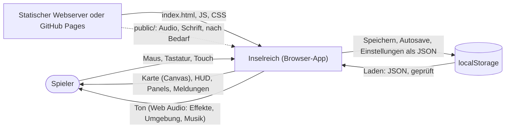

| Nachbar      | Schnittstelle                                                                                                                                                                                                 |
| ------------ | ------------------------------------------------------------------------------------------------------------------------------------------------------------------------------------------------------------- |
| Spieler      | Eingabe per Maus, Tastatur und Touch auf Canvas und Buttons; Ausgabe über Canvas, DOM und Web Audio (erst nach der ersten Nutzergeste).                                                                       |
| localStorage | Manueller Spielstand `inselreich.save.v1` und Autosave `inselreich.save.auto` (`src/ui/storage.ts`, beide Format v2); Einstellungen `inselreich.settings` (`src/ui/settings.ts`, nicht Teil des Spielstands). |
| Webserver    | Liefert die statischen Dateien aus `dist/`; es gibt kein Backend. Dateien aus `public/` (Audio, Schrift) lädt das Spiel erst nach Bedarf und still mit Rückfall (ADR-011).                                    |

## 4. Lösungsstrategie

- **Trennung Simulation / Darstellung / Bedienung** (ADR-002): `src/sim/` enthält die Spielregeln und
  kennt kein DOM (per ESLint-Regel `no-restricted-globals` abgesichert). `src/render/` zeichnet,
  `src/ui/` verbindet Eingabe, Loop und DOM.
- **Welt als Datenobjekt:** Der ganze Spielzustand ist ein JSON-fähiges `World`-Objekt ohne Klassen
  und Zyklen. Systeme sind Funktionen `(world) => void`, Aktionen `(world, …) => Result`. Speichern ist
  `JSON.stringify`.
- **Fester Tick:** Die Simulation läuft in Schritten von `TICK_MS` (100 ms bei 1×). Die Reihenfolge der
  Systeme und die Takte sind festgelegt (ADR-005); gleiche Eingaben ergeben gleiche Ergebnisse.
- **Spielwerte nur in `src/sim/defs/`:** Güter, Gebäude, Stufen und Takte sind Tabellen; die Logik liest
  sie, statt Zahlen hart zu codieren.
- **Isometrie mit Kachelraum als Wahrheit** (ADR-012, ersetzt ADR-003): Rauten 64 × 32 px bei Zoom 1, feste
  Blickrichtung. Sim, Footprints, Radien, Wege und Figurenpfade rechnen weiter im quadratischen Kachelraum; nur
  das Zeichnen projiziert (`src/render/iso.ts`). Der Boden wird im Kachelraum gerendert und je Frame über eine
  affine Matrix gezeichnet; Objekte mit Höhe werden nach einem Tiefenschlüssel sortiert.
- **Lesende Sim-Abfragen** (`src/sim/queries.ts`): UI und Renderer rechnen Bilanz, Diagnose,
  Abdeckung und Zonen nicht selbst nach, sondern fragen reine Funktionen der Simulation. Karte und
  Info-Panel nutzen dieselbe Quelle und widersprechen sich nie.
- **Ambiente ohne Sim-Änderung:** Animationen, Licht, Wetter und Leben hängen nur an Zeit und Welt-Zustand
  (`RenderFx`), Töne an Aktionsergebnissen und einem Vergleich zweier Frames in der UI. Die Welt trägt keine
  Ereignisliste. Krisen erreichen Render und Ton über eine Kette reiner Funktionen in der UI:
  `crisisView` (Sim) → `crisisFx` → `frameInputs` → `RenderFx` bzw. `sound.setAmbience`.
- **Assets nach Bedarf, nie Pflicht** (ADR-011): Dateien unter `public/` laden erst nach der ersten
  Interaktion und nur, wenn gebraucht; jeder Fehlschlag fällt still auf einen synthetischen Rückfall zurück.
  Das Spiel ist ohne eine einzige Datei vollständig spielbar.
- **Zufall aus dem Seed statt gespeichertem Strom** (ADR-010): Handelsaufträge leiten Gut und Menge je
  Periode aus Seed und Periodennummer ab; der Spielstand braucht keinen RNG-Zustand.

## 5. Bausteinsicht

### Ebene 1

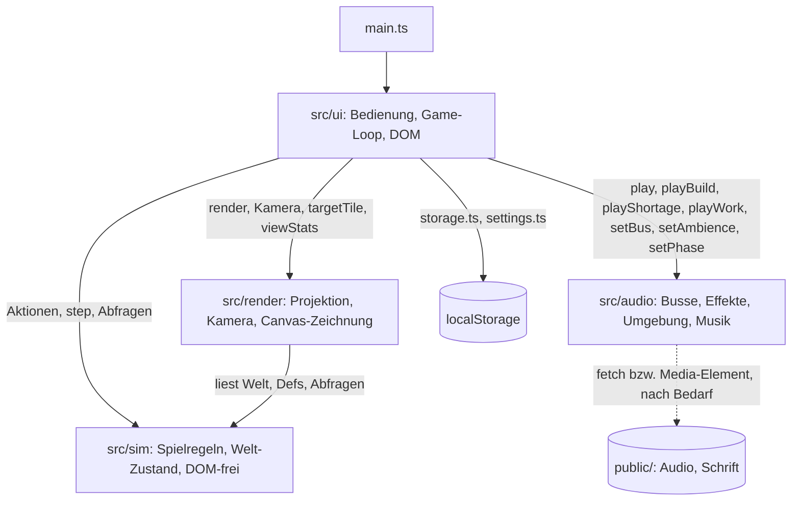

| Baustein      | Verantwortung                                                                                                                                                                                                    |
| ------------- | ---------------------------------------------------------------------------------------------------------------------------------------------------------------------------------------------------------------- |
| `src/sim/`    | Welt-Zustand, Spielregeln, Spielwerte, Speicherformat mit Migration, lesende Abfragen. Keine Abhängigkeit nach aussen.                                                                                           |
| `src/render/` | Isometrische Projektion, Kamera, Tiefensortierung und Picking-Geometrie; zeichnet Boden, Wasser, Wege, Gebäudekörper, Bäume, Leben, Wetter, Krisen-Effekte, Licht, Overlays und Vorschau. Liest nur.             |
| `src/ui/`     | Start und Neustart, Game-Loop, Eingabe (Maus, Tastatur, Touch, Hotkeys), HUD, Bauleiste, Panels, Einstellungs-Karte, Krisenkarte, Ereignis-Log, Meldungen, Ton-Anbindung, `localStorage`-Adapter, Dev-Werkzeuge. |
| `src/audio/`  | Ton über Web Audio: Busse und Ducking, Effekte und Signale, Umgebungsschichten, gestreamte Musik, Manifest der Dateien. Importiert nichts aus `src/sim/`, `src/render/` oder `src/ui/`.                          |

### Ebene 2: `src/sim/`

| Modul                                                    | Verantwortung                                                                                                                                                                                                                                                                                                                                                                                                                                                                                                                                                                                                                                                                                                              |
| -------------------------------------------------------- | -------------------------------------------------------------------------------------------------------------------------------------------------------------------------------------------------------------------------------------------------------------------------------------------------------------------------------------------------------------------------------------------------------------------------------------------------------------------------------------------------------------------------------------------------------------------------------------------------------------------------------------------------------------------------------------------------------------------------- |
| `defs/goods.ts`, `buildings.ts`, `tiers.ts`, `timing.ts` | Spielwerte: Güter und Preise, Verkaufssättigung (`SELL_DROP`, `SELL_FLOOR`), Auftragsgüter und `ORDER_PREMIUM`, Lagerkapazität, Startkapital; Gebäude mit Kosten, Unterhalt, Zyklus, Standortregeln und Krisen-Flags (`flammable`, `stormAffected`, `fireProtection`); Stufen mit Bedürfnissen, Diensten, Steuern, Aufstiegskosten, Siegziel, Steuerstufen (`TAX_LEVELS`); Takte (Buchung, Wachstum, Steuersperre, Markt-Erholung, Aufträge, Krisen: `CRISIS_FIRST_TICK`, `STORM_*`, `FIRE_OUTAGE`, `BOOM_DURATION`).                                                                                                                                                                                                      |
| `defs/map.ts`                                            | Kartenwert `MIN_MOUNTAIN_PATCH`: kleinste zulässige Gebirgsfläche in Kacheln.                                                                                                                                                                                                                                                                                                                                                                                                                                                                                                                                                                                                                                              |
| `defs/sea.ts`                                            | Inselwerte (M12 E1): `ISLANDS` (A „Möweninsel" 24 × 24, B „Felsbucht" 36 × 36, Merkmale, Seeweg `dMin`/`dMax`, Plantagen- und Steinbruchplätze), `ISLANDS_SALT`, `ISLAND_TRIES`, `ISLAND_GAP_MIN`, `ARCHIPEL_SPAN_MAX`, `ISLAND_RIM`, `SHIP_TICKS_PER_SEA_TILE`, Ersatzform-Werte `FALLBACK_*`, `PLANTATION_SITE`, `TRAIT_LABELS`. Seefahrt (E4): `SHIP` (Kosten, Unterhalt, Ladung), `SHIP_MAX`, `ROUTE_GOODS_PER_DIRECTION`, `ROUTE_RESERVE` (Reserve in Stück, in Zehnern).                                                                                                                                                                                                                                             |
| `defs/crises.ts`                                         | Krisenwerte: Stufen `CRISIS_LEVELS` (`off`, `mild`, `normal` mit Periode), Standardstufen für Welt und neues Spiel, Gewichte `CRISIS_WEIGHTS`, `FIRE_HIT_RADIUS`, `BOOM_PCT`, `STORM_TICK_DIVISOR`, `CRISIS_SALT` (ADR-010).                                                                                                                                                                                                                                                                                                                                                                                                                                                                                               |
| `types.ts`                                               | Datentypen (`World`, `Tile`, `Building`, `HouseState`, `Order`, `TaxLevel`, `CrisisLevel`, `Crisis`, `Result`) und die Helfer `ok`/`fail`.                                                                                                                                                                                                                                                                                                                                                                                                                                                                                                                                                                                 |
| `noise.ts`, `rng.ts`                                     | Seed-basiertes Value-Noise für die Karte; `rng.ts` (mulberry32) liefert je Auftrags- und je Krisenperiode eine neue Zufallsfolge (ADR-010).                                                                                                                                                                                                                                                                                                                                                                                                                                                                                                                                                                                |
| `mapgen.ts`                                              | Erzeugt die Insel aus einem Seed, prüft die Nachbedingungen, sucht den Kontor-Standort am Meer (nie an einem Binnensee); Gebirgsflecken unter `MIN_MOUNTAIN_PATCH` werden Wiese.                                                                                                                                                                                                                                                                                                                                                                                                                                                                                                                                           |
| `islands.ts`                                             | Fremdinseln und Archipel (M12 E1, ADR-013 Nachtrag): `generateForeignIslands(seed, home)` (eigener Strom `seed ^ ISLANDS_SALT`, Lage nach Richtung und Seeweg, danach 16 feste Ersatzrichtungen; Form samt Bauplätzen und Anker mit Ersatzform), `homeAnchor`, `seaLanes`/`seaLength` (Seeweg `d` nur ausserhalb der Inselrechtecke, D-139), `travelTicks`. Rein, ohne Weltzugriff.                                                                                                                                                                                                                                                                                                                                        |
| `world.ts`                                               | `createWorld(seed, { crisisLevel? })` (Standard `off`; eine Insel in `islands[0]`) und Zugriffshelfer, die die Insel als Parameter nehmen (`idx`, `inBounds`, `tileAt`, Footprint, Nachbarn, Radius, Mittelpunkt) sowie `HOME`, `home`, `islandOf` (ADR-013).                                                                                                                                                                                                                                                                                                                                                                                                                                                              |
| `coverage.ts`                                            | Quellen der Abdeckung je Insel: `isSupplySource` (Kontor der eigenen Insel oder angebundener Markt), `serviceBuildings` (Id-Reihenfolge), `buildCoverage` (ein Durchlauf, nur innerhalb von `tickPopulation`, nie im Save), `distance` (ADR-013).                                                                                                                                                                                                                                                                                                                                                                                                                                                                          |
| `placement.ts`                                           | `canPlace`/`canPlaceRoad`: Bausperre `buildLock` (M10: Sperre aus `unlocks.ts`, geprüft zuerst; `buy` prüft `goodLock`, `deliverOrder` `functionLock`), Kartenrand, Bauland, Belegung und Standortregeln, mit deutschem Grund. M11: `siteRuleOk` (exportiert, für die Live-Prüfung in `production.ts`); Regelfeld `free` zählt nur freie Kacheln ausserhalb des eigenen Grundrisses.                                                                                                                                                                                                                                                                                                                                       |
| `build.ts`                                               | `placeBuilding`, `placeRoad`, `demolish`, `removeRoad`: prüfen, bezahlen, Kacheln belegen, Rückerstattung (M11: 50 % aus `paidCost`, auch für ausgebaute Betriebe).                                                                                                                                                                                                                                                                                                                                                                                                                                                                                                                                                        |
| `roads.ts`                                               | `recomputeConnectivity`: Breitensuche über Wege ab dem Kontor, setzt `connected` und `notConnected`; `burning` hat Vorrang. `needsConnection(defId)`: welche Gebäude einen Weg brauchen.                                                                                                                                                                                                                                                                                                                                                                                                                                                                                                                                   |
| `connect.ts`                                             | H-U1: `connectPath` (0-1-Breitensuche: freie Kacheln kosten 1, vorhandene Wege 0, Ziel Netz oder Kontor-Rand; feste Gleichstandsregel, reine Abfrage) und `connectBuilding` (ganz oder gar nicht über `placeRoad`, Kosten n × `ROAD_COST`).                                                                                                                                                                                                                                                                                                                                                                                                                                                                                |
| `supply.ts`                                              | Versorgungsradius von Kontor und angebundenen Marktplätzen (für Bauregel und Häuser).                                                                                                                                                                                                                                                                                                                                                                                                                                                                                                                                                                                                                                      |
| `production.ts`                                          | `tickProduction`: Fortschritt, Input-Entnahme, Ausstoss ins Lager, Zustände der Betriebe; Ausfall bei Brand, halber Takt bei Sturm. M11: Zustand `noForest` (Wald-Regel live über `siteRuleOk`).                                                                                                                                                                                                                                                                                                                                                                                                                                                                                                                           |
| `population.ts`                                          | `tickPopulation` (Versorgung, Dienste, Verbrauch, Wachstum mit Zielbelegung, Aufstieg mit Wartezeit der Steuerstufe, doppelt bei prospektivem Defizit (Budget je Wachstumstakt, `flow.ts`); Dienste fallen bei Brand aus) und `tickTaxes` (Steuern × `pct` der Steuerstufe, Buchung je Schritt mit Übertrag `taxCarry`; `taxUnits` ganzzahlig); Zählungen `citizens` (Stufe ≥ 3), `merchants` (Stufe 4), `populationByTier`; Stufensperre `tierLock` (Stufe 4 erst nach dem Bürger-Ziel bzw. Hebel `unlockCitizens`, M8).                                                                                                                                                                                                  |
| `tax.ts`                                                 | `setTaxLevel`: schaltet die globale Steuerstufe, mit Sperrzeit `TAX_SWITCH_LOCK`.                                                                                                                                                                                                                                                                                                                                                                                                                                                                                                                                                                                                                                          |
| `economy.ts`                                             | Lager (`addStock`/`takeStock`), `checkAfford`/`pay`, Rückerstattung, `tickEconomy` (Unterhalt, Buchung je Schritt mit Übertrag `upkeepCarry`).                                                                                                                                                                                                                                                                                                                                                                                                                                                                                                                                                                             |
| `trade.ts`                                               | `buy` zu Fixpreisen; `sell` mit Verkaufssättigung (`sellPrice(world, good, n)` über `sellPct`, Aufschlag `BOOM_PCT` für das Boom-Gut); `tickMarket` (Erholung des Verkaufsanteils).                                                                                                                                                                                                                                                                                                                                                                                                                                                                                                                                        |
| `orders.ts`                                              | Handelsaufträge: `orderForPeriod` (rein, seed-abgeleitet), `tickOrders` (Angebot, Verfall), `deliverOrder`, `nextOrderTick`; `maxHouseTier`, `orderPool` (auch für den Boom).                                                                                                                                                                                                                                                                                                                                                                                                                                                                                                                                              |
| `crises.ts`                                              | Krisen (ADR-005/ADR-010, Nachtrag M6): `rollCrisis` (rein, seed-abgeleitet je Periode), `beginCrisis`, `tickCrises` (Ausfälle und Krise beenden, Periodenstart), `nextCrisisTick`, `crisisWindow`; Brand mit `fireTarget`, `isProtected`, Gebühr und Ausfall.                                                                                                                                                                                                                                                                                                                                                                                                                                                              |
| `queries.ts`                                             | Reine Abfragen für UI und Renderer: `goodsBalance` (re-exportiert aus `flow.ts`), `houseDiagnosis`, `coverageMask`, `placementZone`, `effectiveRefund`, `layoutKey` (Cache-Schlüssel als Positions-Hash, 8), `crisisView`, `unprotectedFlammables`, Abdeckung `'fire'`; M8: `missingInputs` (fehlende Inputs eines Betriebs in `consumes`-Reihenfolge), `goalView` (Phase und Fortschritt beider Ziele).                                                                                                                                                                                                                                                                                                                   |
| `unlocks.ts`                                             | Freischaltbaum (M10, Spec 4): `isUnlocked`, `buildLock`/`goodLock`/`functionLock` (Sperrgründe), `buildingShown`/`goodUnlocked`, `triggeredUnlocks`, `deriveUnlocks` (Stand aus der Welt, Kette U2…U6; M11: Stufe ≥ 2 → U3, Stufe 3 → U5, ohne Kette), `tickUnlocks`, `nextUnlocks`; Werte in `defs/unlocks.ts`. `population.ts` importiert nie `unlocks.ts` (B9).                                                                                                                                                                                                                                                                                                                                                         |
| `townhall.ts`                                            | Amtsstube (M10, Spec 5): `townhallActive` (steht, angebunden, kein Brand), `effectiveTaxLevel` (ohne aktive Amtsstube «normal»), `goodLockActive`, `upgradeStopActive`, `townhallReason`. Importiert nur `./types` und `./defs/*` (B9).                                                                                                                                                                                                                                                                                                                                                                                                                                                                                    |
| `forest.ts`                                              | Roden und Aufforsten (M10, Spec 6): `canClearForest`/`clearForest`/`canPlantForest`/`plantForest`; Kosten in `defs/forest.ts`; Geländeart geht in `layoutKey` ein.                                                                                                                                                                                                                                                                                                                                                                                                                                                                                                                                                         |
| `flow.ts`                                                | `goodsBalance` (nominell: Lager und Brand zählen nicht), `budgetFrom`, `upgradeDelta`, `deficitGood`, `upgradeDeficit` (M11, Spec 3.2); importiert weder `population.ts` noch `queries.ts`.                                                                                                                                                                                                                                                                                                                                                                                                                                                                                                                                |
| `levels.ts`                                              | `cycleOf`, `upkeepOf`, `utilization`: einziger Leseort für Zyklus und Unterhalt (M11); Ausbau-Werte in `defs/levels.ts` (`LEVELS` je Betrieb: Zyklus, Unterhalt, Kosten, Gebühr der Stufen 2 und 3, alle 11 Betriebe).                                                                                                                                                                                                                                                                                                                                                                                                                                                                                                     |
| `feast.ts`                                               | H-I007 Fest in der Kapelle: `holdFeast` (10 Rum, 60 s, Abklingzeit 3 min), `feastState`, `feastActive` (kürzt die Aufstiegs-Wartezeit auf «niedrig»); `feastAt` am Gebäude, ohne Save-Version.                                                                                                                                                                                                                                                                                                                                                                                                                                                                                                                             |
| `upgrade.ts`                                             | `upgradeBuilding` (sieben Gründe, Kosten und Gebühr, `level` +1), `paidCost` für die Abriss-Erstattung (M11, Spec 3.6).                                                                                                                                                                                                                                                                                                                                                                                                                                                                                                                                                                                                    |
| `save.ts`                                                | `serialize`/`deserialize` (Version 9) mit Migrationskette v1 → v2 → v3 → v4 → v5 → v6 → v7 → v8 → v9 (`migrateV3ToV4`: Glas in Lager und `sellPct`, `wonMerchants`, Dienst `bath`; `migrateV4ToV5`: Freischaltungen, Gütersperren, Aufstiegsstopps; `migrateV5ToV6`: Überträge 0; `migrateV6ToV7`: Raster, Kontor und Lager wandern in `islands[0]`, je Gebäude `island: 0`; `migrateV7ToV8`: Heimat mit `kind`, `ox`, `oy`, `anchor`, dazu die Fremdinseln A und B aus `seed`; `migrateV8ToV9`: Gewürz je Insel 0 und `sellPct.spice` 100, Übergangsbestand in der Heimat, `ships = []`, `nextShipId = 1`, `wonSpice = false`, Krisen-`tile.island = 0`) und Strukturprüfung; leitet die Anbindung nach dem Laden neu ab. |
| `tick.ts`                                                | `step(world)`: Tick-Zähler, dann alle Systeme in fester Reihenfolge (mit `tickShips` nach der Produktion, ADR-005 Nachtrag M12), liefert `StepReport` (`lost`, nicht im Save); `checkWin` (setzt erst `won`, dann `wonMerchants`, dann `wonSpice`).                                                                                                                                                                                                                                                                                                                                                                                                                                                                        |
| `ships.ts`                                               | Handelsschiffe (M12 E4): `buyShip`, `retireShip` (nur im Heimathafen ohne Route und Ladung), `setRoute`/`updateRoute`/`clearRoute`/`validRoute`, `freeShipAtHome`, `tickShips` (Fahrt über `laneTicks`, Entladen, Beladen mit Reserve, Abfahrt, Heimkehr nach Routenende; Schiffe in `id`-Reihenfolge, kein Zufall); verfallene Ladung als `ShipLoss`.                                                                                                                                                                                                                                                                                                                                                                     |
| `goal3.ts`                                               | Drittes Ziel „Gewürzstadt" (M12), rein lesend: `spiceMerchants` (Einwohner voll versorgter Kaufmannshäuser, `WIN_SPICE_HOLD` Ticks gehalten), `spiceLoop` (Schiff mit Route, die Gewürz von einer Insel mit Plantage in die Heimat holt).                                                                                                                                                                                                                                                                                                                                                                                                                                                                                  |

### Weltzustand: Insel und global (ADR-013)

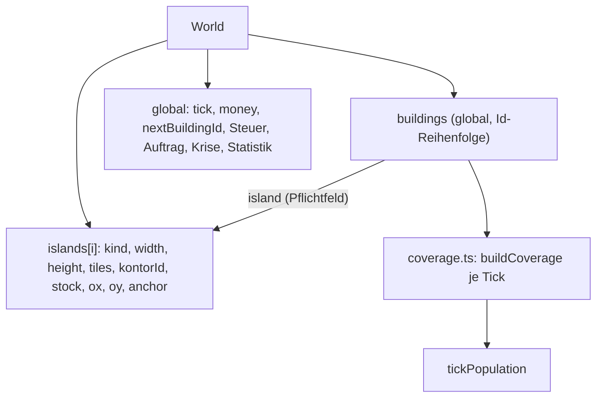

Raster, Kontor und Lager gehören zur Insel; die Gebäudeliste und die Id-Vergabe sind global, jedes Gebäude trägt
`island`. Es gibt keine Aliase auf `World`; Zugriffe laufen über die Helfer in `world.ts`. Ein ungültiger Inselindex
bei einer Aktion ergibt `{ ok: false, reason }` (`islandAt` in `placement.ts`). Der Renderer bildet seine Geländefelder
aus einer Insel über `fieldWorld(world)` (`src/render/terrainField.ts`, flache Kopie samt Seed, je Welt
zwischengespeichert); ab E1 bekommt jede Fremdinsel ihre Felder aus `islandView(world, i)` (`archipel.ts`).

Ab E1 (Save v8) tragen die Inseln zusätzlich `kind` (`home`, `A`, `B`), `ox`, `oy` (Ursprung im Archipel) und
`anchor` (Wasserkachel für den Seeweg); die Heimat liegt bei 0/0, die Fremdinseln haben `kontorId null` und Lager 0.
Darstellung des Archipels: siehe Querschnitt „Darstellung des Archipels" und den Nachtrag in
[ADR-013](adr/ADR-013-inselmodell-im-weltzustand.md).

### Ebene 2: `src/render/`

Modulschnitt nach ISO §4: `iso.ts` kennt keine Kamera und importiert `sprites.ts` nicht; `camera.ts` importiert aus
`iso.ts`, nie umgekehrt. Alle Module lesen die Welt nur.

| Modul             | Verantwortung                                                                                                                                                                                                                                                                                                                                                                                                                                                                                                                                                                                                                                                                                                                                                                                                                                                                                                                                                                                                                                                                                       |
| ----------------- | --------------------------------------------------------------------------------------------------------------------------------------------------------------------------------------------------------------------------------------------------------------------------------------------------------------------------------------------------------------------------------------------------------------------------------------------------------------------------------------------------------------------------------------------------------------------------------------------------------------------------------------------------------------------------------------------------------------------------------------------------------------------------------------------------------------------------------------------------------------------------------------------------------------------------------------------------------------------------------------------------------------------------------------------------------------------------------------------------- |
| `iso.ts`          | Kern der Isometrie, rein und ohne Kamera: `ISO_W`/`ISO_H` (64 × 32), Höhengrenzen `H_MAX`/`H_TOWER`, `ZOOM_STEPS`; `project`/`unproject`, `depthKey` (`2x + w + 2y + h`), `footprintOrigin` (Bau-Anker über der Footprint-Mitte), `radiusEllipse`; `sortedObjects` (Gebäude, Deko-Stempel und Massiv-Teilstücke gecacht je Welt und `layoutKey`; Wald-Objekte je Tiefenband-Zelle in eigenem Cache je Welt: nach einem Bau läuft `woodLayoutSteps` im Renderer mit `WOOD_SLICE_MS` (2 ms) je Frame weiter, der alte Wald bleibt bis dahin stehen, ohne Objekte auf neuen Gebäude-, Weg- und Stempelkacheln; ändert ein Bau nichts im Umkreis `WOOD_REACH` um Wald, bleibt der Wald unverändert; ohne Budget (Erstaufbau, Picking, Tests) sofort vollständig, FIX-REL07; bewegte Objekte je Frame eingemischt); `spriteBounds`, `bodyHull`; Picking `buildingHulls`/`pickBuilding` mit Registrierung `setBodyShapes` (8, Projektion und Picking).                                                                                                                                                    |
| `camera.ts`       | Kamera (Position in Weltpixeln, Zoom), `screenToWorld`/`worldToScreen`, `screenToTile`/`screenToTileF`/`tileToScreen`, `tileCorners`, `clampToMap`, `zoomAt`, `centerOn`, Culling `visibleTileRange` (unten um `H_TOWER` erweitert), `groundMatrix` für den Boden.                                                                                                                                                                                                                                                                                                                                                                                                                                                                                                                                                                                                                                                                                                                                                                                                                                  |
| `palette.ts`      | Alle Farben (Spec 4.2) und Mischhelfer; andere Module leiten Zwischentöne daraus ab.                                                                                                                                                                                                                                                                                                                                                                                                                                                                                                                                                                                                                                                                                                                                                                                                                                                                                                                                                                                                                |
| `terrainField.ts` | Reine Felder im Kachelraum: Küstenabstand, Terrainanteile, Verwerfung (`warp`), Tiefe; Grundlage für Boden, Schaum, Möwen und Klang.                                                                                                                                                                                                                                                                                                                                                                                                                                                                                                                                                                                                                                                                                                                                                                                                                                                                                                                                                                |
| `terrain.ts`      | Bodentextur im Kachelraum in einer Offscreen-Ebene (`TEX` = 32 px je Kachel × Faktor 1, ab DPR 1,5 Faktor 2; halbe Kopie für Zoom ≤ 0,5); Teil-Neuzeichnung nach Bauaktionen über `layoutKey`. Ohne Baumkronen. H-R13: Aus dem geglätteten Gebirgsfeld (`foothillField`) wachsen vor dem Massiv Vorberge (Rücken parallel zum Massivrand, Aufstieg, weiche Warm/Kühl-Verschiebung je Lichtseite), die Hanggrenze S6 bleibt gewahrt; am Fuss mischt ein stetiges Schuttband (`scree`) den Kies des Massivs in die Wiesenstufen, das Massiv-Innere bleibt unverändert. WALD-02: Waldboden und Wiese teilen ihren Anteil nach dem Saumfeld S (Knotenfelder `wood`/`woodSh`, „Waldgewichtung“ auch in reinen Gras- und Waldzellen); der Schatten des Kronendachs liegt im Boden (S zum Licht hin versetzt, Länge nach Bestandsalter), Vorwald dunkelt die Wiese davor weich nach.                                                                                                                                                                                                                       |
| `archipel.ts`     | Archipel-Mathematik (M12 E1), rein: `islandCam` (Inselkamera), `visibleIslands` (Culling, Tiefenfolge `ox + oy`), `pickArchipel`, `archipelRect`, `cameraBounds` (Rahmen + `CAMERA_MARGIN` 8), `islandView` (Welt mit einer Insel, nur lesend, `buildings` leer), `LOD_ZOOM` 0,25, `ARCHIPEL_VIEW` (`sea`; Streichvariante `jump`).                                                                                                                                                                                                                                                                                                                                                                                                                                                                                                                                                                                                                                                                                                                                                                 |
| `cachePlan.ts`    | Cache-Aufbau in Scheiben (M12 E1), rein, Uhr eingespeist: `createCachePlan` (`idle` höchstens `SLICE_MS` = 8 ms je Scheibe, Kostenschätzung mit `WORST_DECAY`, `solo`-Schritte, `finish` als Notfall), Dev-Messreihen `sliceMs`/`emergencyMs`. `terrainJob` in `terrain.ts` liefert die Schritte (`GRID_BAND_ROWS`, `SLICE_ROWS`, `QUARTER_STRIPS`).                                                                                                                                                                                                                                                                                                                                                                                                                                                                                                                                                                                                                                                                                                                                                |
| `dunes.ts`        | Reine Dünen-Mathematik (H-R12b, D1, E-017): schiefer Sinus über dem auf Kachelebene geglätteten Küstenwert, Ton aus dem Lichtgefälle je Knoten, Präsenz als Produkt stetiger Faktoren, Rippeln nach der Stufung; `terrain.ts` stuft je Pixel (Sandzweig).                                                                                                                                                                                                                                                                                                                                                                                                                                                                                                                                                                                                                                                                                                                                                                                                                                           |
| `groundDecor.ts`  | Reine Deko-Helfer für die Bodentextur (R149): Blumen auf Gras, Büsche am Waldrand, deterministisch aus Seed und Kachel; `terrain.ts` zeichnet sie in die Ebene.                                                                                                                                                                                                                                                                                                                                                                                                                                                                                                                                                                                                                                                                                                                                                                                                                                                                                                                                     |
| `decor.ts`        | Platzierung der Deko (ART-STIL-02 L4), reine Mathematik ohne Canvas: Boden-Elemente (`groundElements`, von `terrain.ts` in die Ebene gezeichnet) und Stempel (`stampPlacements`, Art `decor` in `sortedObjects`) je Insel; Ort und Los seltener Elemente nur aus dem statischen Gelände, höchstens `RARE_CAP` je Insel. L5 (Küste, `seaContext`): Palmen (D1), seltene Meer-Elemente Wrack (E1), Meeresfels und Felsnadel (E3), Felseiland (E8) als Stempel und Flächen (Sandbank D11, Riff E2, Tang E6) aus einem statischen Meer-Plan (`seaPlan`) mit Schifffahrtsregel R4 (`seaClearance`: Fahrrinne und Kontor-Sicht bleiben frei); Strand-Boden D2–D6 und D9 auf freiem Sand. Salze 560–569.                                                                                                                                                                                                                                                                                                                                                                                                   |
| `decorStamps.ts`  | Zeichner und Cache der Deko-Stempel (ART-STIL-02 L4): Solitärbaum, Obstbaum, Menhir, Mauerreste mit Schatten und Zoomschwellen; Cache je Art, Variante und Zoomstufe mit LRU unter `DECOR_CACHE_MAX_BYTES`. L5: Palme, Wrack, Meeresfels, Felsnadel und Felseiland mit Wasserfuss; Wrack und Felseiland erscheinen erst ab `SEA_ELEMENT_MIN_ZOOM` = 0,5 (`DECOR_MIN_ZOOM`; Fernansicht, FIX-REL07), Palme ab 0,5, Meeresfels ab 0,25.                                                                                                                                                                                                                                                                                                                                                                                                                                                                                                                                                                                                                                                               |
| `seaFields.ts`    | Wasserfelder im Bodenbild (ART-STIL-02 L5), reine Funktionen ohne Canvas: Sandbank, Riff (mit Korallenflecken) und Tang als weiches Gewichtsraster (`SEA_RES` = 4 Stützstellen je Kachel) aus den `SeaArea`s von `seaPlan`; `tintWater` mischt es in die Wasserfarbe eines Pixels. Statisch, je Welt einmal gebaut, wird von `terrain.ts` nie gepatcht (Salz 569).                                                                                                                                                                                                                                                                                                                                                                                                                                                                                                                                                                                                                                                                                                                                  |
| `trees.ts`        | Bäume zeichnen (ART-STIL-02 L1, WALD-02): fünf Arten (Laub, Nadel, Birke, Pinie, Ahorn) als Lappen- bzw. Etagenkronen in drei Tonstufen, je Krone eine Tonklasse des Kronendachs (B2), Totholz; **Kronen-Atlas** je (Art, Form, Spiegelung, Tonklasse, Radiusstufe, Flag) und Zoomstufe, Ursprung am Fusspunkt, seed-unabhängig, LRU mit `TREE_CACHE_MAX_BYTES` (12 MiB); eine Krone mit Radius r zeichnet die nächstgrössere Radiusstufe verkleinert. `drawTreeStamp` zeichnet alle Kronen einer Tiefenband-Zelle, den Riesenbaum direkt; L6: Farnbüschel auf Lichtungen (`fernTufts`, Salz 584, eigener kleiner Cache je Form und Zoomstufe), je Büschel mit der Tiefenband-Zelle seines Fusspunkts; Bildbox und Schatten (nur Kronen mit eigenem Schatten) je Objekt gemerkt                                                                                                                                                                                                                                                                                                                     |
| `forest.ts`       | Platzierung des Waldes (WALD-02), reine Funktion ohne Canvas: `woodLayout` setzt jede Krone einzeln — Kandidaten je Wald- und Vorwaldkachel aus Seed und Kachel, Annahme, Grösse und Rolle aus dem Saumfeld S (lichter Rand, Kern, Vorwald bis 2 Kacheln auf freier Wiese, nie vor Gebäuden), Bestands-, Grössen- und Tonfeld, Beimischung, Totholz, Blue-Noise-Ausdünnung über Kachelgrenzen, mindestens 2 Kronen je freier Waldkachel, Riesenbaum; Gruppierung in **Tiefenband-Zellen** (`bandCell`, Kronen einer Zeile x + y = k haben Fusstiefe in [k + 0,5; k + 1,5)), Eng-Kacheln neben Objekten behalten ihre Kronen in der eigenen Kachel. Dazu Waldtyp je Karte, Lichtungsfeld, `forestEdgeShift` (Farnsaum). Fix-Runde 1: im Kern und lichten Rand **Baumgruppen** (3–5 Bäume, ein Atlas-Eintrag, `crown.ts` `groupMembers`) statt Einzelkronen, Pinien einzeln; mindestens 3 Bäume je freier Waldkachel                                                                                                                                                                                  |
| `woodField.ts`    | Saumfeld S des Waldes (WALD-02): Geländewald-Maske mit 3 × 3-Binomialfilter, bilinear zwischen den Kachelmitten, plus Randrauschen nur im Saum; die Höhenlinie `SAUM_LEVEL` ist die sichtbare Waldkante für Kronen, Waldboden und Waldschatten. Reichweite ≤ 2 Kacheln (Teil-Neuzeichnung der Terrain-Ebene bleibt genau); ein Kern um jede Waldkachelmitte hält S dort über der Saumlinie (Lesbarkeit)                                                                                                                                                                                                                                                                                                                                                                                                                                                                                                                                                                                                                                                                                             |
| `crown.ts`        | Kronenform als reine Geometrie (`crownGeom`, linear im Radius, Spiegelung; Fichten mit 3–5 ungleichen Etagen, Pinienschirme geneigt; Baumgruppen als vereinigte Form), `TREE_H`, Stammhöhe je Formklasse, Höhengrenze `maxRadius`; Blatt-Modul ohne Canvas                                                                                                                                                                                                                                                                                                                                                                                                                                                                                                                                                                                                                                                                                                                                                                                                                                          |
| `isoBase.ts`      | Blatt-Modul der Projektion (`ISO_W`, `ISO_H`, `project`), von `iso.ts` weitergereicht; reine Module importieren es ohne Zyklus über `iso.ts`                                                                                                                                                                                                                                                                                                                                                                                                                                                                                                                                                                                                                                                                                                                                                                                                                                                                                                                                                        |
| `light.ts`        | Gemeinsame Helfer von Geländeebene und Massiv: Lichtrichtung `LIGHT` (D-11, links oben) und gedrehtes Wertrauschen `rotNoise`. Dazu Tonleiter (H-R10/H-R11): `toneStep`/`toneColor`/`toneHalfWidth` (harte Tonkanten ≈ 1,5 CSS-px) und die Farbtabelle `LIGHT_COLORS`.                                                                                                                                                                                                                                                                                                                                                                                                                                                                                                                                                                                                                                                                                                                                                                                                                              |
| `massif.ts`       | Gebirgsmassiv, reine Mathematik (H-R9 Teil A): Gebirgs-Zusammenhangskomponenten (4er), gemerkt je Welt und Geländeabbild (Bauen löst keinen Neubau aus); Höhenfeld auf 4 Knoten je Kachel aus weichgezeichnetem Randabstand (h = 0 an der Grenze), Ridged-Noise-Graten, Amplitude ∝ (√Kacheln)^1,3 gedeckelt (`AMP_CAP`; unter `SMALL_MASSIF` = `MIN_MOUNTAIN_PATCH` ein Felshügel), Höhenstaffelung nach hinten (Gebirge ist nicht bebaubar, Bebauung grenzt nur aussen an); Zerlegung in Teilstücke (`massifPieces`): Läufe von Gebirgskacheln je Halbkachel-Streifen, höchstens `PIECE_RUN`, Schlüssel = vorderste Kachel (Art `massif` in `sortedObjects`); Knotenfarben (Lambert von links oben, Kappen, Fussbewuchs, Sockel blendet in die Geländeebene aus). Keine Projektion, kein Canvas. L6 (Entdecken, C6–C9): je Karte höchstens ein Bergsee, Wasserfall, eine Höhle und ein Steinmännchen; erst Eignung aus dem Gelände (Mulde, Rinne, Schattenflanke, höchster Gipfel), dann Los (Salze 576–583). Die Elemente ändern keine Höhen, sondern sind Abziehbilder bzw. ein kleines Objekt. |
| `rocks.ts`        | Canvas-Hülle des Massivs (H-R9): rastert ein Teilstück (Gouraud, Schichtbänder, Felstextur, `rasterPiece`), Silhouette (Licht-/Feuerverdeckung) und Bildbox je Teilstück, Cache je Teilstück, Zoomstufe und DPR (`createMassifCache`: LRU mit `MASSIF_CACHE_MAX_BYTES`, Rasterfaktor höchstens `MASSIF_MAX_SCALE`, höchstens `MASSIF_BUILDS_PER_FRAME` Neubauten je Frame, solange eine andere Stufe als Ersatz bereitliegt); Streifenkanten auf Gerätepixel. Nicht pickbar, keine Höhe in der Sim (D-08). L6: zeichnet die Entdeckungs-Elemente im Dreiecks-Shader (See, Wasserfall, Höhle) bzw. wie einen Baum (Steinmännchen); Sichtbarkeit je Zoomstufe: See ab 0,5, Wasserfall ab 0,75, Höhle ab 1, Steinmännchen ab 1,5.                                                                                                                                                                                                                                                                                                                                                                      |
| `water.ts`        | Schaumsaum und Wellen unter der Bodenmatrix; Sturm über die Wetterstärke `w` (Amplitude, Breite, Periode, Feinschliff R111). L5: Brandungsschaum an Riff, Wrack, Meeresfels und Felseiland (gleitende Bogenstücke zur Seeseite, `reduceMotion`: statisch; Salze 566–569); der Schaum an Wrack und Felseiland entfällt wie ihre Stempel unter `SEA_ELEMENT_MIN_ZOOM` (0,5; Parameter `zoom` von `drawWaves`, Meeresfels bleibt).                                                                                                                                                                                                                                                                                                                                                                                                                                                                                                                                                                                                                                                                     |
| `sprites.ts`      | Gebäudekörper je Typ (`SILHOUETTES` in Dachfamilien, Fallback je Kategorie; M11: Jagdhütte, Rinderfarm), Wohnhaus je Stufe, `drawLevelTopper` (Betriebe mit `LEVELS`: Stufe 2 Anbau, Stufe 3 Steinsockel und Fahne; liest nur `b.level`, der Cache-Schlüssel in `spriteCache.ts` enthält `level`), Arbeitszeichen, Wege, Fensteranker; meldet beim Laden `bodyPolygons` über `setBodyShapes` an `iso.ts`. L3 (ART-STIL-02): `drawBody` zeichnet im Bildmodus (`IsoPainter.hand`): eine Silhouette statt Strich je Fläche (Aufzeichnungsdurchgang, ein Strich 2 · Breite unter den Füllungen), durchhängende lange Waagrechten (Hand-Linie), Lichtkanten, Kontaktschatten, ausgefranster Hof-Erdrand und Grasbüschel; `bodyFaces`/`bodyPolygons`/`drawGhost` zeichnen ohne Bildmodus (`drawBodyPlain`), Picking-Polygone bleiben bytegleich.                                                                                                                                                                                                                                                         |
| `spriteCache.ts`  | Sprite-Cache der Gebäudekörper (H-R6, H-R7): je Typ, Stufe, Kontor-Wasserseiten, Variante (0 bis `VARIANT_COUNT` − 1), Zoom und DPR einmal auf eine Offscreen-Fläche (Bounding-Box + Rand) gezeichnet, danach die Materialschicht (`material.ts`), dann per `drawImage` gestempelt (`drawBodyCached`, Fallback `drawBody`, jeweils mit Variante). Schatten, Rauch, Signale, Feuer-Abdunklung und Licht bleiben ausserhalb. Zoom-/DPR-Wechsel räumt den Bestand, der Wechsel-Frame zeichnet ungecacht (ohne Material); 64 MB Gesamt- und 4 MB Einzelgrenze mit LRU (`limits.ts`); ohne DOM aus. Zähler `renderStats.spriteHits/Misses/Bytes`.                                                                                                                                                                                                                                                                                                                                                                                                                                                        |
| `variants.ts`     | Gebäudevarianten (H-R7, G1): `variantOf(seed, x, y)` aus `hash2` (kein Sim-Zufall, kein Save-Feld), `VARIANT_COUNT` = 4, `VARIANT_LOOKS` (Wand-, Dach-, Kaminton, Fensterläden). Variante 0 ist der bisherige Look.                                                                                                                                                                                                                                                                                                                                                                                                                                                                                                                                                                                                                                                                                                                                                                                                                                                                                 |
| `material.ts`     | Materialschicht des Sprite-Caches (H-R7, G8): Fugen, Stroh und Risse als Strich-Pfade innerhalb der aufgezeichneten Körperflächen (`bodyFaces`); Detailstufe nach Zoom (`materialDetail`). Seit L3 zusätzlich Pinselkorn (zwei Tonstufen, 1-px-Punkte) und unregelmässige Dachreihen. Läuft nur beim Füllen einer Fläche.                                                                                                                                                                                                                                                                                                                                                                                                                                                                                                                                                                                                                                                                                                                                                                           |
| `statusMarks.ts`  | Statusmarken über Betrieben (Pfeil `waitingInput`, Kiste `storageFull`, Baumstumpf `noForest`); Form statt nur Farbe, `MAX_MARKS` 60. Liest nur `b.state`.                                                                                                                                                                                                                                                                                                                                                                                                                                                                                                                                                                                                                                                                                                                                                                                                                                                                                                                                          |
| `ring.ts`         | Fortschrittsring je Betrieb (M11 R1): `ringFraction`/`ringView` (Zyklus über `cycleOf`, grün laufend, grau eingefroren), `drawProgressRings` mit Culling und `MAX_RINGS` 60.                                                                                                                                                                                                                                                                                                                                                                                                                                                                                                                                                                                                                                                                                                                                                                                                                                                                                                                        |
| `ship.ts`         | Händlerschiff an der ersten Wasserkachel neben dem Kontor, solange ein Auftrag läuft; Schatten und Höhe.                                                                                                                                                                                                                                                                                                                                                                                                                                                                                                                                                                                                                                                                                                                                                                                                                                                                                                                                                                                            |
| `shipLane.ts`     | Handelsschiffe auf der Fahrlinie (M12 E4), rein und nur lesend: `shipPose` (Pose aus `left` und Lane), Tiefe, Mindestbreite `MIN_SHIP_CSS_PX`, Treffer `shipAt`; schreibt nie in `world.ships`.                                                                                                                                                                                                                                                                                                                                                                                                                                                                                                                                                                                                                                                                                                                                                                                                                                                                                                     |
| `life.ts`         | Leben (Spec 5.6): Weggraph (gecacht je `layoutKey`), Spaziergänger als reine Pose aus Zeit und Graph, Möwen je festem Zellraster über der Küste, Herdrauch am Morgen und Abend, Fensteranker und weicher Schein (`drawWindowLight`).                                                                                                                                                                                                                                                                                                                                                                                                                                                                                                                                                                                                                                                                                                                                                                                                                                                                |
| `wildlife.ts`     | Wasser- und Luftleben (H-R2): Fischschwärme mit Sprüngen, seltener Wal, Vogelschwärme; L7: springende Delfine (E5, jede helle Phase, nicht bei Sturm, Bahn im Tiefwasser mit R4, Salze 591–593). `wildlifeAt` ist die eine Quelle für Bild und Mouse-over-Name (Delfine erscheinen dort bewusst, Entscheid FIX-REL07 B8).                                                                                                                                                                                                                                                                                                                                                                                                                                                                                                                                                                                                                                                                                                                                                                           |
| `fauna.ts`        | Tierleben an Land und auf See (ART-STIL-02 L7), kosmetisch und deterministisch aus `timeMs`, `world.seed` und Gelände (nur `hash2`, Salze 585–594; kein Schreibzugriff auf die Welt): Schmetterlinge, Hasen, Glühwürmchen, Rehe, Füchse, Waldvögel, Steinböcke, Adler, Krabben, Schildkröten, Robben, Kormorane. `faunaAt` ist die eine Quelle für das Bild; Anker (Orte) je Welt einmal gebildet und nach Rang auf `cap(...)` (`limits.ts`) gekappt, danach filtern Bereich, Phase, Wetter, Zoom und Weltzustand (Hasen und Rehe weichen Wegen und Gebäuden). Bodentiere mischen sich nach Tiefe in den sortierten Objektdurchgang (Ebene 6), Luft-Tiere (Adler, Vögel) folgen bei den Möwen (Ebene 7), Glühwürmchen laufen im additiven Durchgang (Ebene 10, nur bei Tag-Nacht-Wechsel).                                                                                                                                                                                                                                                                                                          |
| `daynight.ts`     | Tageslicht: `lightAt(tick)` liefert Multiply-Faktoren, Phase (Tag, Abend, Nacht, Morgen) und Fensterstärke `windows` aus einer Farbkurve über `DAY_TICKS` = 6000; `isLit` (bewohnt bzw. Zustand `ok`).                                                                                                                                                                                                                                                                                                                                                                                                                                                                                                                                                                                                                                                                                                                                                                                                                                                                                              |
| `weather.ts`      | Wetter rein: `weatherMul`, `gradeAt(tick, weather)` (Licht mal Wetter, Luma ≥ 0,60), Vorrang `pickWeather(crisis, mood)`.                                                                                                                                                                                                                                                                                                                                                                                                                                                                                                                                                                                                                                                                                                                                                                                                                                                                                                                                                                           |
| `fx.ts`           | Krisen-Effekte im Bildraum: `drawFire` (Flammen, Rauch), `drawFireGlow` (Glühen und Bodenschein), `drawWarnRing`, `drawBoomCoin`, `drawRain`, `drawStormEdge`. Ohne Weltzugriff.                                                                                                                                                                                                                                                                                                                                                                                                                                                                                                                                                                                                                                                                                                                                                                                                                                                                                                                    |
| `limits.ts`       | Obergrenzen der Darstellung `CAPS` (normal und reduziert, Spec 12.2): Figuren, Möwen, Rauch, Regen, Flammen; Sprite-Cache-Grenzen `SPRITE_CACHE_MAX_BYTES` (64 MB) und `SPRITE_MAX_BYTES` (4 MB je Sprite); Massiv-Cache `MASSIF_CACHE_MAX_BYTES` (48 MB), `MASSIF_MAX_SCALE`, `MASSIF_BUILDS_PER_FRAME`; Deko-Stempel-Cache `DECOR_CACHE_MAX_BYTES` (8 MB).                                                                                                                                                                                                                                                                                                                                                                                                                                                                                                                                                                                                                                                                                                                                        |
| `overlays.ts`     | Radiusanzeige (Ellipse) und Abdeckungs-Umriss beim Platzieren, auch für die Feuerwache; Bedarfssymbole (ab Zoom 0.75) und roter Punkt; Cache der Abdeckungsmasken je Art, Schlüssel Welt-Identität und `layoutKey`.                                                                                                                                                                                                                                                                                                                                                                                                                                                                                                                                                                                                                                                                                                                                                                                                                                                                                 |
| `pathPreview.ts`  | H-U1: `drawPathPreview` — halbtransparente Rauten der Anbinden-Vorschau; aufgerufen in `app.ts` nach `render(…)`, `renderer.ts` bleibt unberührt.                                                                                                                                                                                                                                                                                                                                                                                                                                                                                                                                                                                                                                                                                                                                                                                                                                                                                                                                                   |
| `viewStats.ts`    | Sichtbezug für den Umgebungsklang: Anteile Wasser, Grün, Wald, Fels, Küste und Einwohner im Bild (nur Kacheln mit Mitte im Bild), Zoom.                                                                                                                                                                                                                                                                                                                                                                                                                                                                                                                                                                                                                                                                                                                                                                                                                                                                                                                                                             |
| `renderer.ts`     | Setzt einen Frame in 12 Ebenen zusammen (6, Ebenen je Frame). `render(…, fx: RenderFx)` mit `{ timeMs, dayNight, weather, reduceMotion, fire, boom, raster }`; Dev-Zähler `renderStats`.                                                                                                                                                                                                                                                                                                                                                                                                                                                                                                                                                                                                                                                                                                                                                                                                                                                                                                            |

### Ebene 2: `src/ui/`

| Modul              | Verantwortung                                                                                                                                                                                                                                                                                                                                                                                                                                                                                                                                                                                                                                                                                                                                            |
| ------------------ | -------------------------------------------------------------------------------------------------------------------------------------------------------------------------------------------------------------------------------------------------------------------------------------------------------------------------------------------------------------------------------------------------------------------------------------------------------------------------------------------------------------------------------------------------------------------------------------------------------------------------------------------------------------------------------------------------------------------------------------------------------- |
| `app.ts`           | `startGame`: baut ein Spiel auf (mit `intro` die Startkarte über einer Hintergrundwelt bei Tempo 0), Game-Loop, `onAction`, Werkzeugwahl (`selectTool`, offene Bau-Kategorie), Tempo (`setSpeed`), Autosave (Takt und `pagehide`), Ton-Anbindung (Entsperren, Sichtbarkeit, `setAmbience` alle 250 ms), Krisen-Verdrahtung (`crisisFx`, `FireMemo`, Log), Panel-Wechsel, Menü-Aktionen (Speichern, Laden pausiert, Neue Insel), Cursor-Hinweis und Anbindungsmeldungen, `dispose`.                                                                                                                                                                                                                                                                       |
| `input.ts`         | Maus, Tastatur und Touch: Kamera (Zoom, Pinch, Pan mit `applyKeys(dtMs)`), Hover-Prüfung, Kachel-Aktionen auf dem Ziel von `targetTile`, Auswahl erst beim Loslassen (`isClick`, Ziehen ab `DRAG_THRESHOLD` = 4 px schwenkt), Weg-Ziehen, `cancelPointerAction`; Kamera- und Abbruchtasten auch bei fokussiertem Knopf (`panKeyAllowed`), stumm in Textfeldern und bei offener Modalkarte; `pointerClient`, `hintKey`.                                                                                                                                                                                                                                                                                                                                   |
| `target.ts`        | `targetTile(world, cam, tool, sx, sy)`, rein: Auswählen und Abreissen über den Gebäudekörper (`pickBuilding`), Bauen über die Footprint-Mitte (`footprintOrigin`), Weg über die Bodenkachel.                                                                                                                                                                                                                                                                                                                                                                                                                                                                                                                                                             |
| `hotkeys.ts`       | Tastenbelegung (`TOOL_HOTKEYS`, inklusive `E` Feuerwache und `Y` Jagdhütte (Rinderfarm bewusst ohne Taste), `SPEED_KEYS`, `NAV_KEYS`), `hotkeyAction`, Tempo-Helfer `withSpeed`/`afterPause`, Tastenname für Tooltips (`hotkeyLabel`), Kürzel-Liste fürs Menü (`hotkeyList`, `toolName`), Bau-Kategorie eines Werkzeugs (`categoryOf`) und offene Kategorie der Bauleiste (`nextOpenCategory`, `CategoryEvent`). Rein, ohne DOM.                                                                                                                                                                                                                                                                                                                         |
| `hud.ts`           | Kopfzeile in zwei Zeilen (M7-UX L2): Geld je Frame (`updateMoney`), Bilanz je Minute höchstens alle `BALANCE_REFRESH_MS` = 500 ms, Einwohner je Stufe, Ziel, Geld, Steuerregler mit Wirkung im `title` (`taxEffect`), Tempo, **Stumm**, **Einstellungen**, **Menü**; zweite Zeile Lager mit Warenbilanz (Dauerleistung, R115) und Steuersperre in Spielzeit. Meldungsstapel oben rechts im Spielfeld mit Auftrags- und Krisenkarte (`renderNoticeStack`). Reine Textfunktionen `tierTooltip`, `tierPath`, `balanceText`, `stockTooltip`, `speedTooltip`.                                                                                                                                                                                                 |
| `modal.ts`         | Ein Stapel aller Modalkarten mit **einem** Tasten-Listener (Capture): Esc und Hintergrund schliessen nur die oberste Karte, Fokusfalle (Tab, Shift+Tab), Fokus zurück an den Auslöser, Hotkeys stumm; `openModal`, `isModalOpen`, `closeAllModals`, `renderConfirm` (eine Bestätigungsform im ganzen Spiel).                                                                                                                                                                                                                                                                                                                                                                                                                                             |
| `menu.ts`          | Menü-Karte: Speichern, Laden (Slot-Liste mit Spielzeit), „Neue Insel" mit Krisenstufe und Bestätigung, Hinweis bei Speicherproblem, Kürzel, „Ziel und erste Schritte" (Hilfe-Modus der Startkarte über dem Menü).                                                                                                                                                                                                                                                                                                                                                                                                                                                                                                                                        |
| `startCard.ts`     | Startkarte beim Seitenstart und als Hilfe: Ziel, erste Schritte, Wahl „Fortsetzen — Autosave", „Gespeichertes Spiel laden", „Neue Insel" bzw. „Los geht's"; `startChoices` und `startDismissAction` rein (Esc und Hintergrund lösen die primäre Wahl aus, bei offener Bestätigung brechen sie ab).                                                                                                                                                                                                                                                                                                                                                                                                                                                       |
| `time.ts`          | Zeit statt Ticks (M7-UX L8), rein: `formatGameTime` für Dauern („59 s", „4:00", aufgerundet), `formatClock` für Zeitpunkte („m:ss", abgerundet), `perMinute`, `signedNum`. Rechnet nur mit `TICK_MS`.                                                                                                                                                                                                                                                                                                                                                                                                                                                                                                                                                    |
| `texts.ts`         | Reine Zustands- und Kostentexte (`diagnosisText`, `stateInfo`, `producesText`, `burningText`, `refundText`); aus `inspect.ts` gezogen, damit `hints.ts` sie ohne Zyklus nutzt (`inspect.ts` re-exportiert).                                                                                                                                                                                                                                                                                                                                                                                                                                                                                                                                              |
| `hints.ts`         | Rein: Sim-Gründe in Spielersprache (`REASON_TABLE`, `friendlyReason`), Cursor-Hinweis vor dem Klick (`placementHint`, `hintPosition` im Fenster), Anbindungsmeldungen (`unconnectedIds`, `newlyConnected`). Liest die Sim nur.                                                                                                                                                                                                                                                                                                                                                                                                                                                                                                                           |
| `connect.ts`       | Rein: `connectView` für den Knopf «Anbinden (n Wege · x Geld)» — Label, ok, Grund (`friendlyReason`), Vorschau-Kacheln; `null` ohne Anbindungspflicht oder wenn angebunden.                                                                                                                                                                                                                                                                                                                                                                                                                                                                                                                                                                              |
| `goal.ts`          | Rein: Zieltexte je Phase aus `goalView` (`goalTexts`: Chip, `title`, Ruhe-Ansicht, Ausblick, Balken) und Banner der beiden Ziele (`goalBanners`, `initialGoalShown`), Freischalt-Meldung (`unlockNotice`, `initialUnlockShown`) und Sperrtext der Bau-Tasten (`lockedToolText`); `hud.ts`, `inspect.ts` und `app.ts` rufen nur auf.                                                                                                                                                                                                                                                                                                                                                                                                                      |
| `guide.ts`         | Rein: nächster Schritt der Inselchronik (`nextStep`, Regeln in fester Reihenfolge), Steuerwirkung (`taxEffect`), Abhilfe je Gebäude (`remedyText`), Legende `MAP_SIGNS` (Farben aus `src/render/palette.ts`, sonst ohne Muster).                                                                                                                                                                                                                                                                                                                                                                                                                                                                                                                         |
| `settingsPanel.ts` | Einstellungs-Karte (Spec 9.2) über `openModal`: Regler Gesamt, Musik, Umgebung, Effekte; Tag-Nacht; Bewegung reduzieren (Auto/An/Aus); Credits-Dialog. Keine Regeln: Werte gehen an `actions`.                                                                                                                                                                                                                                                                                                                                                                                                                                                                                                                                                           |
| `credits.ts`       | Credits-Liste aus Manifest und Schriften (`FONT_CREDITS`), Lizenzlinks; nur `createElement`/`textContent`.                                                                                                                                                                                                                                                                                                                                                                                                                                                                                                                                                                                                                                               |
| `crisis.ts`        | Krisenkarte (M6 13.3): reine Textfunktion über `crisisView` und Welt.                                                                                                                                                                                                                                                                                                                                                                                                                                                                                                                                                                                                                                                                                    |
| `crisisLog.ts`     | Ereignis-Log (M6 13.4): Einträge aus dem Vergleich zweier `crisisView`-Stände, höchstens 10, Meldungsart je Eintrag. Rein.                                                                                                                                                                                                                                                                                                                                                                                                                                                                                                                                                                                                                               |
| `logTarget.ts`     | Ereignis-Log → Kameraziel (H-U2): `logTargetFor` (Gebäude-ID und Kachel je Eintrag, nicht im Spielstand), `resolveLogClick`. Rein.                                                                                                                                                                                                                                                                                                                                                                                                                                                                                                                                                                                                                       |
| `eventLogView.ts`  | DOM des Logs als schwebende Box unten links (R112), Standard eingeklappt, verborgen ohne Einträge.                                                                                                                                                                                                                                                                                                                                                                                                                                                                                                                                                                                                                                                       |
| `crisisFx.ts`      | Abbildung der Krisensicht auf Effekte und Umgebung: `crisisFx` (Feuer, Boom, Krisenwetter, Feuerpegel), `nextFireMemo` (Rauch-Nachlauf 80 Ticks ohne Sim-Gedächtnis), `frameInputs` (ein Wetter für Render und Ton über `pickWeather`). Rein.                                                                                                                                                                                                                                                                                                                                                                                                                                                                                                            |
| `order.ts`         | Auftragskarte (Text in Spielzeit, „Liefern"), Erkennung neuer bzw. verfallener Aufträge je Frame, Meldungen `orderMessage` und `deliveredMessage`.                                                                                                                                                                                                                                                                                                                                                                                                                                                                                                                                                                                                       |
| `buildMenu.ts`     | Bauleiste: Hauptzeile (Auswahl, Weg, Abriss, vier Kategorie-Knöpfe) und darüber die Einträge der offenen Kategorie („{Name} · {Geld} Geld"); Tab erreicht nach dem letzten Kategorie-Knopf die Einträge (DOM-Reihenfolge, R134); unbezahlbare Einträge gedämpft (`--parchment-muted`) und gestrichelt; Tooltips mit Werten aus `src/sim/defs/` je Minute, „Brennbar", „sturmanfällig", bei der Feuerwache die ungeschützten Gebäude, Grund über `friendlyReason`.                                                                                                                                                                                                                                                                                        |
| `inspect.ts`       | Info-Panel: Zustand, darunter die Abhilfe (`remedyText`; beim Wohnhaus unter der Diagnose), Stufe (`levelText`), Auslastung (`utilizationText`), Produktion und Unterhalt je Minute (`cycleOf`/`upkeepOf`), Ausbau-Abschnitt (`upgradeView`, Probelauf von `upgradeBuilding` auf Kopie; Knopf ruft `InspectActions.upgrade`), Brandschutz, bei der Feuerwache „Schützt N", Wohnhaus-Details aus `houseDiagnosis` mit Aufstiegsgründen, Defizit-Zeile mit Restvorrat (`deficitLine`, `deficitText` in `texts.ts`) und R161-Stein-Hinweis (`glassStoneHint` in `hints.ts`), Abriss mit Rückerstattung auf `paidCost`. Ruhe-Ansicht „Inselchronik": Phase, Einwohner, Ziel mit Balken und Stufenpfad, nächster Schritt, Steuer, aufklappbare Kartenzeichen. |
| `trade.ts`         | Handel am Kontor (Kopf mit „Zurück", Klick aufs Kontor öffnet ihn direkt) mit Preisanteil je Gut, Boom-Marke und genauem Erlös je Verkaufsbutton; Gründe über `friendlyReason`.                                                                                                                                                                                                                                                                                                                                                                                                                                                                                                                                                                          |
| `soundEvents.ts`   | Frame-Vergleich für zeitbasierte Töne (Buchung, Auftrag, Aufstieg, Sieg, Krisensignale `alarm`, `stormWarning`, `boom`), Ton je Aktionsergebnis, Ereignisse zum Entsperren; H-A2: `shortageSnapshot`/`shortageEvents` (Lager > 0 nach 0 bei nachgefragtem Gut) und `workProgress`/`workCycleKinds` (Zyklusende sichtbarer, nicht brennender Betriebe), nur bei geändertem `world.tick` ausgewertet.                                                                                                                                                                                                                                                                                                                                                      |
| `settings.ts`      | Einstellungen lesen und schreiben (gemeinsames Format M6/M7, Migration `volume` → `master`, fremde Felder in `extra`), `resolveReduceMotion`.                                                                                                                                                                                                                                                                                                                                                                                                                                                                                                                                                                                                            |
| `devParams.ts`     | Dev-Vorschau aus der Adresszeile (`?wetter=`, `w=`, `feuer=<id>,<id>`, `boom=1`, `signal=`, `perf=1`, `raster=1`); im Produktions-Build immer leer.                                                                                                                                                                                                                                                                                                                                                                                                                                                                                                                                                                                                      |
| `devProbes.ts`     | Dev-Sonden: `window.__inselAudio` aus `sound.debugState()` alle 250 ms, `window.__inselPerf` (Frame-Intervall und Render-Dauer, Median und p95 über 600 Frames).                                                                                                                                                                                                                                                                                                                                                                                                                                                                                                                                                                                         |
| `messages.ts`      | Meldungen (Toasts), begrenzt und entdoppelt; Warn-Toast; sticky Meldungen für Fehler; Sieg-Toast per Klick, Esc oder Rechtsklick schliessbar (`closeClosableToast`).                                                                                                                                                                                                                                                                                                                                                                                                                                                                                                                                                                                     |
| `storage.ts`       | Adapter zu `localStorage` für manuellen Platz und Autosave; listet ladbare Stände; `storageProblem` (nicht verfügbar, beschädigt) für Startkarte und Menü; `autosaveOnHide` (still, nie bei Tick 0); fängt Speicherfehler ab und liefert `Result`.                                                                                                                                                                                                                                                                                                                                                                                                                                                                                                       |
| `hover.ts`         | Mouse-over-Karte (M10, Spec 13), rein: `hoverInfo` (Priorität Tier > Schiff > Gebäude > Weg > Gelände), `hoverVisible` (400 ms Ruhe, `HOVER_DELAY_MS`), `hoverPosition`; Betriebstitel mit Stufe und Auslastung, Zustand `noForest` aus der Sim; DOM-Karte baut `app.ts`.                                                                                                                                                                                                                                                                                                                                                                                                                                                                                |
| `islandLayers.ts`  | Ebenen der Fremdinseln (M12 E1), rein: `createIslandLayers` (Heimat sofort, Plan nach dem ersten Frame, Notfall zählt `emergencyFrames`), `idleSchedule` (`requestIdleCallback` mit `IDLE_TIMEOUT_MS` 100, sonst `setTimeout`). `app.ts` hält den Plan (`planOf`).                                                                                                                                                                                                                                                                                                                                                                                                                                                                                       |
| `islandCard.ts`    | Text der Inselkarte beim Mouse-over über einer Fremdinsel (`formatIslandCard`, `islandCard`): Name, Grösse, Merkmale, Fahrzeit; `hover.ts` ruft `foreignHover` über `pickArchipel`.                                                                                                                                                                                                                                                                                                                                                                                                                                                                                                                                                                      |
| `activeIsland.ts`  | Aktive Insel aus der Bildmitte (M12 E2), rein: Rechteck, in dem die Mitte liegt, sonst nächste Mitte; ohne `seafaring` immer die Heimat. UI-Zustand, nicht im Spielstand.                                                                                                                                                                                                                                                                                                                                                                                                                                                                                                                                                                                |
| `islandJump.ts`    | Sprungziele und Inselliste (M12 E2), rein: `nextIsland`, `jumpTarget`, `islandList`; Tasten `0` (Heimat) und `9` (nächste Insel) und Knopf „Inseln" in der Kopfzeile.                                                                                                                                                                                                                                                                                                                                                                                                                                                                                                                                                                                    |
| `islandTools.ts`   | Zielinsel und Bauleisten-Grund der Werkzeuge im Archipel (M12 E2), rein: wählt die Insel unter dem Zeiger; Gründe kommen aus der Sim (`noKontorReason`, `affordBuild`).                                                                                                                                                                                                                                                                                                                                                                                                                                                                                                                                                                                  |
| `ships.ts`         | Schiffe und Routen im Kontor-Panel (M12 E4): reine Sicht (`ShipRow`, `buyShipView`, Routenziele) und DOM-Abschnitt; Gründe per Probelauf der Sim-Aktion auf einer Kopie (`dryWorld`), `lossMessages` aus den `StepReport`s.                                                                                                                                                                                                                                                                                                                                                                                                                                                                                                                              |
| `icons.ts`         | Symbolsatz (M10, Spec 14): 24 Symbole als statisches SVG (`ICONS`, `iconSvg`); eingesetzt nur auf dunklen Chips (`iconChip` in `messages.ts`, Auflage R181).                                                                                                                                                                                                                                                                                                                                                                                                                                                                                                                                                                                             |
| `dom.ts`           | Kleine DOM-Helfer (`setField`, `costLine` „50 Geld · 2 Holz · 1 Werkzeug", `blurAfterClick` nur bei Mausklick).                                                                                                                                                                                                                                                                                                                                                                                                                                                                                                                                                                                                                                          |

### Ebene 2: `src/audio/`

| Modul              | Verantwortung                                                                                                                                                                                                                                                                                                                                                         |
| ------------------ | --------------------------------------------------------------------------------------------------------------------------------------------------------------------------------------------------------------------------------------------------------------------------------------------------------------------------------------------------------------------- |
| `sound.ts`         | Fassade `createSound(options, ctxFactory?, io?)`: Busse (Master, Musik, Umgebung, Effekte), Figuren je `SoundEvent` mit Drossel über `ctx.currentTime`, Signal-Samples mit synthetischem Rückfall, Ducking; `unlock`, `setMuted`, `setBus`, `setAmbience`, `setPhase`, `setCrisis`, `setHidden`, `debugState`, `dispose`. Ohne Web Audio eine stille Implementierung. |
| `mix.ts`           | Reine Mix-Regeln: Bus-Standards, `DUCK` und `duckGain` (Hüllkurve aus Signalen), Typen `AmbienceInput`, `ViewStats`, `Layer`, `Phase` (eigene Kopien, damit `src/audio/` nichts importiert).                                                                                                                                                                          |
| `ambience.ts`      | Umgebung: reine `ambienceMix(input)` je Schicht (Meer, Wind, Vögel, Möwen, Nacht, Stadt, Regen, Sturm, Feuer), nahtlose Schleifen über zwei Quellen mit Überblendung, Sample-Lader nach Bedarf, Schichten-Motor mit Gleiten (1,5 s), Stopp nach 10 s Stille und synthetischen Rückfällen; Drossel 250 ms.                                                             |
| `music.ts`         | Musik: reine Auswahl `nextTrack` (Phase, nicht unter den letzten 2), Streaming-Player über ein Media-Element, Erstverzögerung 5–15 s, Pausen 30–90 s, Blende 3 s, Ende nach 2 Fehlschlägen in Folge.                                                                                                                                                                  |
| `economySounds.ts` | Klänge der Wirtschaft (H-A2): Daten und Konstanten für den Mangel-Doppelton (Färbung je Gut, Entprellung 60 s je Gut / 20 s global, Krisen-Vorrang) und den Arbeitston (Gruppen je Gebäudeart, Drossel 700 ms global / 2 s je Art); gespielt über `playShortage`, `playWork` auf dem Effekte-Bus.                                                                     |
| `manifest.ts`      | Einzige Quelle der Dateinamen und Attribution (`MANIFEST`, `LAYER_FILES`, `SFX_FILES`), `assetUrl(BASE_URL, file)`.                                                                                                                                                                                                                                                   |

## 6. Laufzeitsicht

### Ein Frame mit Simulationsschritten

Der Loop in `app.ts` läuft per `requestAnimationFrame`. Er sammelt die verstrichene Zeit mal
Geschwindigkeit in einem Akkumulator und führt pro `TICK_MS` einen Schritt aus, höchstens 20 pro Frame.
Danach verschiebt er die Kamera per Tastatur (`applyKeys(dt)`), vergleicht den Frame mit dem vorigen
für Töne, Krisen-Log und Auftragsmeldungen, zählt die Autosave-Zeit, leitet aus der Krisensicht die
Eingänge für Render und Ton ab (`frameInputs`) und zeichnet. Der Umgebungsklang bekommt seine Eingänge
höchstens alle 250 ms (`AMBIENCE_EVERY_MS`), das HUD wird jeden zehnten Frame aktualisiert; das Geld aktualisiert `updateMoney` je Frame, die Bilanz höchstens alle `BALANCE_REFRESH_MS` = 500 ms.

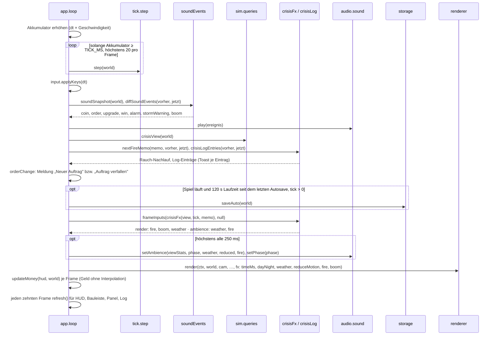

Das Wetter eines Frames ist eines für Bild und Ton: `pickWeather` nimmt das Krisenwetter (Sturmwarnung als
`cloudy` mit steigendem `w`, Sturm als `storm` mit `w = 1`) vor dem Stimmungswetter; das Stimmungswetter ist
nicht umgesetzt (Kann K3, Parameter `null`), ohne Krise gilt `clear`. Im Dev-Build überschreibt die Vorschau
(`?wetter=`, `feuer=`, `boom=`) diese Eingänge.

### Ebenen je Frame (`renderer.ts`, ISO §5)

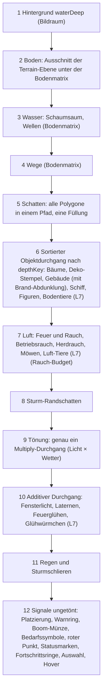

Die Ebenen 2–4 liegen unter der Bodenmatrix (`withGround`, 1 Einheit = 1 Kachel); ab Ebene 5 wird im Bildraum
gezeichnet. Die Signale liegen über allen Objekten, damit ein verdecktes Gebäude an Symbol und Umriss erkennbar
bleibt (AK-ISO-15). Entfällt die Tönung (neutrales Licht, `clear`), entfällt Ebene 9; Ebene 10 läuft nur, wenn
Fenster, Laternen, Feuer oder Glühwürmchen leuchten.

### Ein Simulationsschritt (`step`)

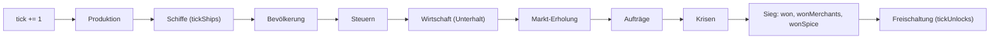

| System                     | Takt                                                                                    | Wirkung                                                                                                                                                                                                                                          |
| -------------------------- | --------------------------------------------------------------------------------------- | ------------------------------------------------------------------------------------------------------------------------------------------------------------------------------------------------------------------------------------------------ |
| `tickProduction`           | jeder Tick                                                                              | Fortschritt, Input-Entnahme, Ausstoss, Zustände der Betriebe; Prüfreihenfolge Ausfall → Anbindung → Dienst → Wald (`noForest`) → Sturm → Input; `eff` (gleitende Auslastung, `EFF_WINDOW` 256) in jedem Zweig nachgeführt                        |
| `tickShips`                | jeder Tick                                                                              | Schiffe in `id`-Reihenfolge: Fahrt, Anlegen, Entladen, Beladen (Reserve), Abfahrt; Heimkehr entlädt bis zur Lagergrenze, Rest verfällt (`StepReport.lost`); kein Geld, kein Zufall                                                               |
| `tickPopulation`           | Verbrauch jeder Tick, Wachstum alle 50                                                  | Versorgung, Dienste, Verbrauch; Wachstum mit Zielbelegung und Aufstieg mit Wartezeit der Steuerstufe, im Wachstumstakt einmal `goodsBalance` als Budget vor der Häuserschleife                                                                   |
| `tickTaxes`, `tickEconomy` | je Tick mit Übertrag `taxCarry`/`upkeepCarry`                                           | Steuern × `pct` der Steuerstufe, Unterhalt; `stats` bleiben Nominalwerte je 100 Ticks                                                                                                                                                            |
| `tickMarket`               | alle 10 (`SELL_RECOVERY_INTERVAL`)                                                      | jeder Verkaufsanteil +1 Prozentpunkt, höchstens 100; kein Geld, kein Lager                                                                                                                                                                       |
| `tickOrders`               | ab 600 alle 900 (`ORDER_FIRST_TICK`, `ORDER_PERIOD`)                                    | zuerst Verfall (`tick > due`), dann Angebot aus `orderForPeriod`; kein Geld, kein Lager                                                                                                                                                          |
| `tickCrises`               | jeder Tick; Periodenstart ab 2400 alle 600 (`normal`) bzw. 1200 (`mild`), nie bei `off` | Ausfälle bei `outageUntil` beenden, Krise nach `until` entfernen, bei Periodenstart Krise ziehen (`rollCrisis`) und beginnen; Brandgebühr wird sofort gebucht                                                                                    |
| `checkWin`                 | jeder Tick                                                                              | setzt `won` einmalig bei 50 Bürgern und höher (Stufe ≥ 3), danach `wonMerchants` einmalig bei 60 Kaufleuten (nur mit `won`), danach `wonSpice` (nur mit `wonMerchants`, 80 Kaufleute 600 Ticks voll versorgt und Gewürzschleife über `goal3.ts`) |
| `tickUnlocks`              | jeder Tick, letzter Aufruf                                                              | setzt Freischaltungen (`world.unlocked`) gespeichert und monoton; läuft nach `checkWin`, damit der Referenzlauf bitgleich bleibt                                                                                                                 |

M12 setzt `tickShips` zwischen Produktion und Bevölkerung (ADR-005, Nachtrag M12): Ladung, die im Schritt ankommt, deckt den Bedarf desselben Schritts. M10 hängt `tickUnlocks` als letzten Aufruf an (ADR-005, Nachtrag M10): Der Controller liest vor Schritt t+1 genau den Zustand, den `tickUnlocks` am Ende von Schritt t sah. M7 ändert den Simulationsschritt nicht. Alle Takte ausser Aufträgen und Krisen folgen der Konvention `tick > 0 && tick % INTERVAL === 0` (ADR-005); der
Auftragstakt hat einen Versatz von 600 (Nachtrag in ADR-005). Die Höchststufe für den Güterpool eines
Auftrags stammt aus dem Zustand nach `tickPopulation` desselben Ticks. Krisen beginnen bei `tick ≥ 2400 && (tick − 2400) % P === 0` (Nachtrag M6 in ADR-005); der Krisenschritt läuft
nach Bevölkerung und Buchung (Boom-Pool aus der Höchststufe desselben Ticks) und vor dem Sieg, auch nach dem Sieg weiter.

### Abdeckung je `tickPopulation` (ADR-013)

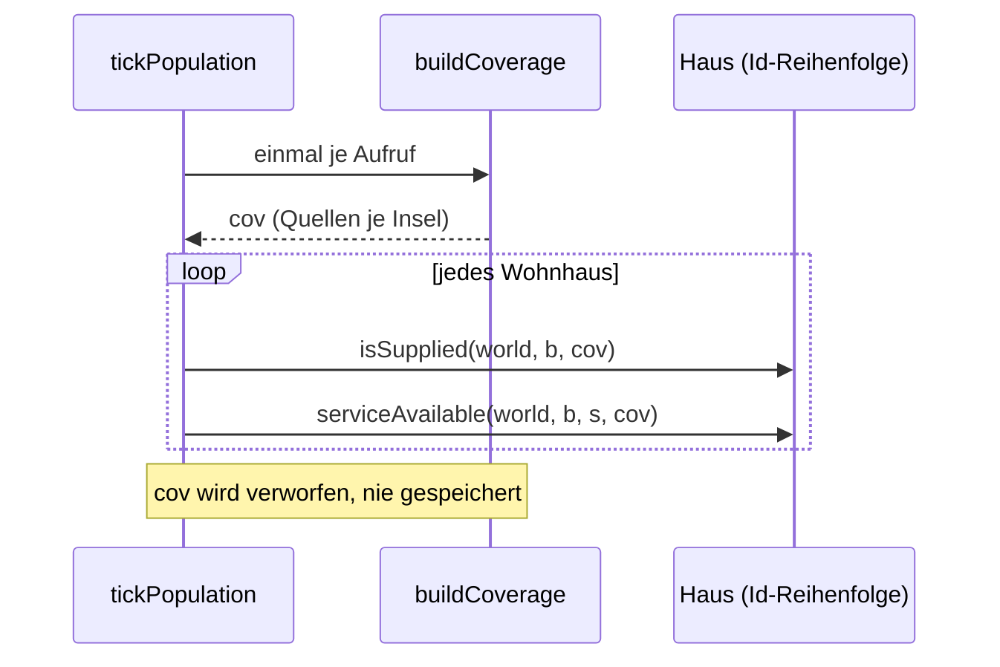

`buildCoverage` läuft einmal am Anfang von `tickPopulation` über alle Gebäude (Id-Reihenfolge) und sammelt je Insel
Versorgungs- und Dienstquellen. Ein Haus liest nur die Quellen seiner eigenen Insel (`cov.supply[b.island]`,
`cov.service[b.island]`). `cov` reicht bis in `upgradeStatus` und `tryUpgrade`. Aufrufer ohne `cov` (UI, `queries.ts`)
filtern je Aufruf frisch über `serviceBuildings`; `Coverage` lebt ausserhalb von `tickPopulation` nicht weiter.

### Eine Bauaktion

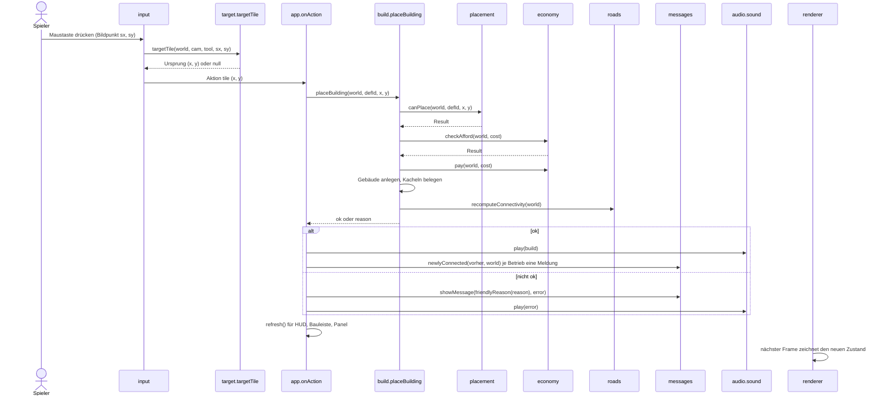

`targetTile` übersetzt den Bildpunkt je Werkzeug in eine Kachel des Kachelraums (8, Projektion und
Picking): Bauen nimmt den Ursprung, bei dem der Zeiger über der Footprint-Mitte liegt; ausserhalb der Karte
liegende Teile lehnt `canPlace` ab. Scheitert `canPlace` oder `checkAfford`, kehrt `placeBuilding` sofort mit
dem Grund zurück; die Welt bleibt unverändert. Wege entstehen schon beim Drücken und beim Ziehen (`placeRoad` je Kachel), Abriss
über `demolish` bzw. `removeRoad` mit demselben Ablauf. Auf Touch wirkt die Aktion erst beim Loslassen,
aber auf der Kachel des ersten Tippens, und entfällt, wenn ein zweiter Finger dazukam oder geschwenkt
wurde. Jeder Werkzeugwechsel (Bauleiste oder Hotkey) läuft über `selectTool` und bricht zuerst eine
laufende Zeiger-Aktion ab (`cancelPointerAction`).

Vor dem Klick zeigt der Cursor-Hinweis (M7-UX L3) am Zeiger, ob und warum die Aktion geht: `placementHint`
prüft mit denselben Sim-Abfragen (`canPlace`, `canPlaceRoad`, `checkAfford`, `reachableRoads`), schreibt aber
nie in die Welt, und wird nur bei Wechsel von Kachel oder Werkzeug neu berechnet (`hintKey`) sowie im HUD-Takt
aufgefrischt. Ausserhalb der Karte gibt es kein Schild. Mit dem Auswahl-Werkzeug wählt erst das Loslassen aus;
ab 4 px Weg (`DRAG_THRESHOLD`) wird geschwenkt statt ausgewählt.

### Seitenstart (M7-UX L1)

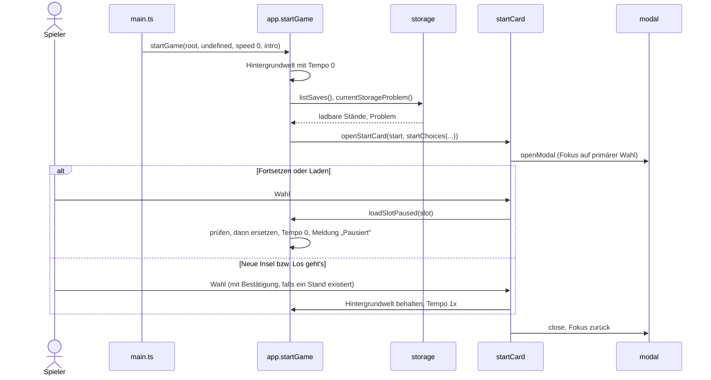

Esc und Hintergrund-Klick lösen die primäre Wahl aus; bei offener Bestätigung brechen sie ab. Die Startkarte
öffnet dieselbe Karte im Hilfe-Modus aus dem Menü („Ziel und erste Schritte", ohne Wahl, Tempo bleibt).

### Start: Heimat sofort, Fremdinseln im Leerlauf (M12 E1)

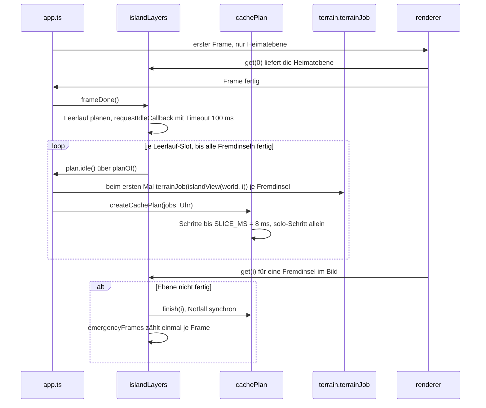

Der Plan entsteht erst bei `idle`/`finish`; `done` legt ihn nie an, damit `cachesReady()` der Dev-Sonde vor dem ersten
Frame `false` meldet. Die Neuplanung hängt an `ready()`, nicht an der Scheibendauer; nach `MAX_IDLE_ZERO` = 200
Slots ohne Fortschritt greift der Notfall. Jede Scheibe ist höchstens `SLICE_MS` lang (Messung: AK-E1-19, ADR-013
Nachtrag).

## 7. Verteilungssicht

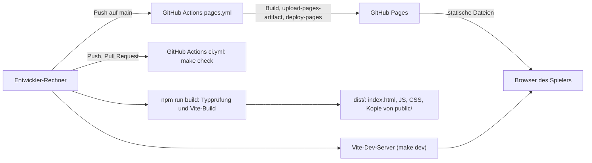

- Das Spiel ist eine **statische Seite** ohne Backend. `vite.config.ts` setzt `base: './'`; alle Pfade
  im Build sind relativ, `dist/` läuft deshalb auch in einem Unterpfad (z. B. GitHub Pages eines Projekt-Repos).
- **Statische Assets** (ADR-011): Vite kopiert `public/` unverändert nach `dist/` (`audio/music`, `audio/amb`,
  `audio/sfx`, `fonts`); nichts davon liegt im JavaScript-Bundle. Das Spiel löst Pfade über
  `import.meta.env.BASE_URL` auf (`assetUrl`) und lädt sie erst nach der ersten Interaktion und nur bei Bedarf;
  Musik wird gestreamt. Budget `public/` ≤ 12 MB, Nachweis je Datei in `docs/CREDITS.md`, Prüfsummen und Budget
  prüfen Vitests unter `tests/assets/` (Assets-Strang). Stand: `public/` enthält 3 Musikstücke, 7 Umgebungsschleifen,
  4 Signal-Samples und 2 Schriftschnitte (~8 MB); die synthetischen Rückfälle greifen nur, wenn eine Datei
  fehlt oder nicht lädt.
- **Entwicklung:** `make dev` startet den Vite-Dev-Server; `make check` entspricht der CI. Dev-Vorschau und
  Sonden (`?wetter=`, `?perf=1`, `window.__inselAudio`, `window.__inselPerf`) gibt es nur im Dev-Build.
- **CI:** `.github/workflows/ci.yml` führt `make check` bei Push auf `main` und bei Pull Requests aus.
- **Deploy:** `.github/workflows/pages.yml` baut bei Push auf `main` (oder manuell) und veröffentlicht
  `dist/` auf GitHub Pages. Er greift erst, wenn Pages im Repo aktiviert ist (Quelle: GitHub Actions);
  auf dem Free-Plan braucht das ein öffentliches Repo (offene Entscheidung, Spec Abschnitt 6).

### Plattformgrenzen GitHub Pages (R130)

Quelle: [GitHub Pages limits](https://docs.github.com/en/pages/getting-started-with-github-pages/github-pages-limits)
und [About large files on GitHub](https://docs.github.com/en/repositories/working-with-files/managing-large-files/about-large-files-on-github),
geprüft am 2026-10-02. Gemessen am selben Tag auf `main` (`make build`, `git count-objects -vH`).

| Grenze                | Wert laut GitHub                                    | Ist-Stand                                  | Anteil | Wache                          |
| --------------------- | --------------------------------------------------- | ------------------------------------------ | ------ | ------------------------------ |
| Veröffentlichte Seite | max. 1 GB (hart)                                    | `dist/` 8,68 MB, 20 Dateien                | 0,9 %  | `make pages-limit`, ab 500 MB  |
| Einzeldatei im Git    | 100 MiB blockiert, Warnung ab 50 MiB                | grösste Datei 2,47 MiB (Musikstück)        | 2,5 %  | `make pages-limit`, ab 50 MiB  |
| Quell-Repo            | empfohlen ≤ 1 GB, dringend ≤ 5 GB                   | Pack 11,2 MiB (GitHub `diskUsage` 11,8 MB) | 1,2 %  | keine, manuell                 |
| Bandbreite            | weich 100 GB/Monat                                  | nicht messbar (siehe unten)                | –      | keine                          |
| Deploy                | Abbruch nach 10 min                                 | Deploy-Job im Sekundenbereich              | –      | Workflow-Fehler                |
| Builds                | weich 10/h, gilt nicht für eigene Actions-Workflows | eigener Workflow `pages.yml`               | –      | entfällt                       |
| Ratenlimit            | HTTP 429 bei zu vielen Anfragen                     | –                                          | –      | keine                          |
| Nutzung               | kein kostenloses Hosting für Geschäft/E-Commerce    | nicht kommerziell                          | –      | bei Monetarisierung neu prüfen |

- **Wache:** `tools/pages/check.ts` (Grenzwerte als Konstanten mit Quelle in `tools/pages/limits.ts`, Test
  `tests/assets/pagesLimit.test.ts`) misst `dist/` nach dem Build. Sie läuft in `make check` (damit in der CI)
  und im Pages-Workflow vor dem Upload. Erreicht die Seite 50 % von 1 GB oder eine Datei 50 % von 100 MiB,
  schlägt sie fehl: Build bzw. Deploy stoppen, und es sind **Alternativen zu prüfen** (Eintrag in die
  Warteschlange mit Alternativen, R130).
- **Verhältnis zum Asset-Budget:** Das inhaltliche Budget `public/` ≤ 12 MB (AK-X1-03, `tests/assets/assets.test.ts`)
  ist enger und greift zuerst; die Pages-Wache ist die Plattformgrenze und erfasst zusätzlich das gebaute Bundle.
- **Bandbreite:** Für Pages gibt es keine Zugriffsstatistik; die Traffic-API (`repos/…/traffic/views`) zählt
  nur Aufrufe der Repo-Seite auf github.com. Abschätzung: Ein vollständiger Abruf aller Dateien kostet höchstens
  ~8,7 MB (Musik lädt nur bei Bedarf), 100 GB/Monat reichen also für rund 11 000 vollständige Abrufe; die
  50-%-Marke läge bei rund 5 700. Signal zum Handeln: E-Mail von GitHub oder HTTP 429 auf der Seite.
- **Repo-Grösse** wird nicht automatisch geprüft (CI klont flach); bei grösseren Asset-Lieferungen
  `git count-objects -vH` von Hand ansehen.
- **Merkliste Alternativen** (unbewertet, Bewertung erst bei Erreichen der Schwelle): Cloudflare Pages ·
  Netlify · itch.io (HTML5-Upload) · Codeberg Pages · eigener statischer Webserver.

## 8. Querschnittliche Konzepte

### Gebäudezustände (ADR-005)

Produktionsbetriebe tragen einen Zustand, der dem Spieler im Info-Panel erklärt, warum nichts
entsteht. Zustände bleiben stehen, bis ihre Ursache behoben ist. M10 ergänzt `noService` (Werkzeugmacher ohne Schule in Reichweite: kein Fortschritt, keine Entnahme, Unterhalt läuft weiter; die Produktion leitet den Zustand jeden Tick neu ab). M11 ergänzt `noForest`: Holzfäller und Jagdhütte ohne freien Wald im Radius (Wald ohne Gebäude und Weg, ausserhalb des eigenen Grundrisses); kein Fortschritt, keine Entnahme, `progress` bleibt, Unterhalt läuft; jeder Schritt bewertet neu. M11: Jeder Betrieb führt `eff` (Ganzzahl 0 … 256 000, je Schritt `eff − floor(eff / 256) + Ziel`, Ziel 1000 nur bei Fortschritt mit Zustand `ok`); Anzeige `utilization` in Promille; Geld und Waren hängen nicht daran; gespeichert.

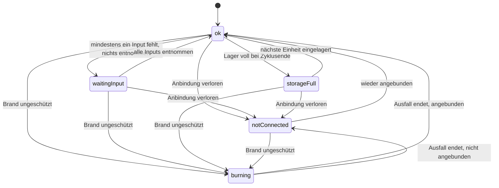

`burning` (M6) setzt der Brandbeginn zusammen mit `outageUntil` (letzter Ausfall-Tick); er hat Vorrang vor
`notConnected` und endet am Ende des Schritts `outageUntil` mit `connected ? 'ok' : 'notConnected'`. Nach der Wiederanbindung setzt `recomputeConnectivity` den Zustand auf `ok`; `waitingInput` bzw.
`storageFull` leitet die Produktion im nächsten Tick neu ab. Für Wohnhäuser gilt dieselbe Konvention:
`supplied`, `services` und `satisfied` werden jeden Tick neu abgeleitet.

Mit mehreren Inputs (M8, Glashütte) gilt `waitingInput`, solange mindestens ein Input fehlt;
entnommen wird erst, wenn alle vorhanden sind (ADR-005, Nachtrag M8).

### Anbindung

Ein Gebäude ist angebunden, wenn eine Wegkachel an seinen Footprint grenzt und diese über Wege
(4er-Nachbarschaft) mit einer Wegkachel am Kontor verbunden ist. `roads.ts` bestimmt das per
Breitensuche. Neu berechnet wird nur bei Änderungen: nach jedem Bau und Abriss von Weg oder Gebäude
und nach dem Laden. Das Kontor ist immer angebunden; Wohnhäuser nie, sie hängen am Versorgungsradius.
Betriebe, Marktplätze, Kapelle und Schule wirken nur angebunden. Der Knopf «Anbinden» im Info-Panel (H-U1) sucht über `connect.ts` den Weg mit den wenigsten neuen
Kacheln zum Netz und baut ihn über `placeRoad`; kein neues Save-Feld.

### Versorgung

Ein Wohnhaus ist versorgt, wenn sein Mittelpunkt im Versorgungsradius (euklidisch, Mitte zu Mitte)
des Kontors oder eines angebundenen Marktplatzes liegt (`supply.ts`). Dieselbe Prüfung ist die
Bauregel für Wohnhäuser. Ein nicht versorgtes Haus erhält keine Waren; alle Güterbedürfnisse gelten
dann als unerfüllt. Dienste (Kapelle, Schule) wirken im Dienstradius, wenn das Dienstgebäude
angebunden ist.

### Bedürfnis-Akkumulatoren

Jedes Haus führt je Bedarfsgut einen Akkumulator `demand`. Pro Tick wächst er um
Einwohner × Rate / 100. Erreicht er 1, wird eine Einheit aus dem Lager entnommen und der Rest bleibt
stehen. Gelingt die Entnahme, gilt das Bedürfnis als erfüllt, sonst als unerfüllt, jeweils bis zum
nächsten Entnahmeversuch. Ein neues Haus startet mit Bedarf 1, damit die erste Einheit sofort
entnommen wird. Beim Aufstieg entnimmt `tryUpgrade` je neuem Bedarfsgut sofort eine Einheit und
zählt sie als ausgeliefert (Bedarf 0, erfüllt); so können zwei Häuser nicht auf dieselbe Einheit
aufsteigen, und das Haus zahlt schon in einer Buchung im selben Tick den vollen Steuersatz. Der Zeitpunkt
`satisfiedSince` wird bei jedem Tick mit unerfüllten Bedürfnissen neu gesetzt und steuert die
Wartezeit vor dem Aufstieg.

### Steuerstufe, Markt und Aufträge

- **Steuerstufe:** `world.taxLevel` (M10: gelesen wird `effectiveTaxLevel(world)`, ohne aktive Amtsstube «normal») (`low`/`normal`/`high`) wirkt global auf Steuer (`pct`, erst summiert,
  dann einmal abgerundet; „normal" rechnet bitgleich wie vor M5), Zielbelegung und Aufstiegs-Wartezeit
  (`TAX_LEVELS`). `setTaxLevel` sperrt das Umschalten für `TAX_SWITCH_LOCK` Ticks (`taxLockedUntil`).
- **Verkaufssättigung:** Je Gut hält `world.sellPct` den Verkaufsanteil (ganzzahlig 30…100). `sellPrice`
  summiert den Erlös Einheit für Einheit mit sinkendem Anteil und rundet einmal ab; `sell` senkt den
  Anteil danach, `tickMarket` hebt ihn wieder an. Kaufpreise und Aufträge berühren `sellPct` nicht.
- **Aufträge:** Höchstens ein Auftrag (`world.order`) ist aktiv, weil die Laufzeit (600) kürzer ist als
  die Periode (900). Gut und Menge kommen aus `orderForPeriod(seed, k, maxTier)` (ADR-010). `deliverOrder`
  liefert nur vollständig und ist auch bei negativem Geld erlaubt; ein verfallener Auftrag hat keine Strafe.

### Krisen (M6)

- **Stufe:** `world.crisisLevel` (`off`/`mild`/`normal`) wird nur beim neuen Spiel gesetzt (`createWorld(seed,
{ crisisLevel })`); `createWorld` ohne Angabe setzt `off`, damit der Balancing-Lauf bitgleich bleibt. Die UI
  startet „Neu" mit der Stufe aus den Einstellungen (Standard `normal`), „Laden" übernimmt die Stufe des Stands.
- **Periode:** ab `CRISIS_FIRST_TICK` = 2400 alle 600 (`normal`) bzw. 1200 (`mild`) Ticks genau eine Krise;
  Art und Ziel zieht `rollCrisis(seed, k, maxTier, rect)` rein aus Seed und Periodennummer (ADR-010, Nachtrag M6).
  Die längste Krise ist kürzer als die kürzeste Periode, es laufen nie zwei zugleich.
- **Wirkungen:** Brand (ungeschützt: Gebühr, `progress = 0`, Zustand `burning` für 200 Ticks; geschützt durch eine
  angebundene Feuerwache im Radius 8: kein Schaden), Sturm (200 Ticks Warnung, dann 300 Ticks halbe Leistung der
  `stormAffected`-Betriebe), Boom (300 Ticks `BOOM_PCT` = 150 % Verkaufspreis eines Guts).
- **Eine Sicht für alle:** `crisisView(world)` ist die einzige Quelle für Krisenkarte, Log, `crisisFx` und Ton.
  Den Rauch-Nachlauf nach dem Brand hält die UI selbst (`FireMemo`, 80 Ticks), weil `world.crisis` und
  `outageUntil` am Ende des Schritts `until` gemeinsam verschwinden. Log und Merkstruktur gehören nicht zum
  Spielstand; nach „Laden" gilt der geladene Stand als Vergleichsbasis (kein Eintrag, kein Ton für eine laufende
  Krise).
- **Bilanz bleibt Dauerleistung** (M6-Spec 11, R115): `goodsBalance` ist nominal; ein Brand ändert die HUD-Bilanz
  nicht, nur das Info-Panel des Gebäudes zeigt den Ausfall.

### Sim-Abfragen und Caches im Renderer

`src/sim/queries.ts` liefert UI und Renderer abgeleitete Sichten ohne Seiteneffekt: Warenbilanz
(nominal aus angebundenen Betrieben und versorgten Häusern), Diagnose je Haus (dieselbe Liste für
Info-Panel und Kartensymbol), Abdeckungsmasken, Platzierungszonen, die tatsächliche Rückerstattung und die
Krisensicht.

M10: Das Gelände (Wald oder Weide, `forest.ts`) geht in `layoutKey` ein; die Terrain-Ebene zeichnet nach einem Geländewechsel nur die betroffenen Teile neu (R1), und die Caches in `life.ts` (Küstenfeld `coastFor`) gelten nur, solange Geländewechsel Wald ↔ Weide betreffen (andere Änderungen müssen den Cache neu bewerten).

`layoutKey(world)` ist der gemeinsame Cache-Schlüssel der Darstellung. Er ändert sich bei jedem Bau, Abriss,
Weg und jeder Änderung von Anbindung oder Ausfall, nicht durch `step()` allein. Seit R114 (Punkt 5, Branch
`fix/layoutkey`, Merge im Final-Gate) ist er ein **Positions-Hash**: zwei unabhängige FNV-1a-Bahnen (je 32 Bit)
über `nextBuildingId`, die Indizes aller Wegkacheln und je Gebäude Id, Lage, Typ und die Bits „angebunden" und
„Ausfall". Der frühere Schlüssel aus Summen (Summe der Wegindizes, Summe der Ids) konnte bei verschobenen Wegen
kollidieren und einen veralteten Cache liefern. Nutzer des Schlüssels:

| Cache                                  | Modul         | Inhalt                                                                                          |
| -------------------------------------- | ------------- | ----------------------------------------------------------------------------------------------- |
| Teil-Neuzeichnung der Terrain-Ebene    | `terrain.ts`  | belegte Kacheln (keine Grasbüschel unter Bebauung und Wegen)                                    |
| feste Objekte für die Tiefensortierung | `iso.ts`      | Gebäude, Wald-Objekte (Kronen aus `woodLayout`) und Massiv-Teilstücke, sortiert nach `depthKey` |
| Kronen-Atlas                           | `trees.ts`    | je Kronenform, Tonklasse, Radiusstufe und Zoomstufe; LRU, höchstens 12 MiB                      |
| Weggraph der Spaziergänger             | `life.ts`     | Knoten und Kanten des Wegenetzes                                                                |
| Abdeckungsmasken und Umrisse           | `overlays.ts` | je Art (Versorgung, Dienst, Feuer), nicht je Frame                                              |

Bekannte Kosten: `layoutKey` läuft bis zu fünfmal je Frame (etwa 0,2–0,4 ms); ein Frame-Memo bzw. ein
eigener Weg-Schlüssel für `life.ts` ist möglich (`docs/beobachtungen.md`). Die Diagnose der Bedarfssymbole
läuft ungecacht je sichtbarem Haus und Frame; gemessen 2.5–3.1 ms Arbeit je Frame bei 57 Gebäuden (M5).

### Projektion und Picking (ADR-012, R113)

- **Kachelraum bleibt die Wahrheit:** Die Sim kennt nur Kacheln. `project(fx, fy)` bildet Kachelkoordinaten
  auf Weltpixel der Iso-Ebene ab (Raute 64 × 32 bei Zoom 1), `unproject` umgekehrt; `camera.ts` setzt Position
  und Zoom darauf. Die Trefferprüfung auf dem Boden ist exakt (`floor` der Umkehrung), ohne Tabelle.
- **Tiefensortierung:** Objekte mit Höhe werden nach `depthKey = 2x + w + 2y + h` sortiert, bei Gleichstand nach
  x, Art und Id. Der Schlüssel ist nur für quadratische Footprints (`w = h`) bewiesen; ein späteres Gebäude mit
  `w ≠ h` braucht einen paarweisen Vergleich (ADR-012).
- **Ziel je Werkzeug** (`src/ui/target.ts`): Weg auf die Bodenkachel; Bauen auf den Ursprung, bei dem der Zeiger
  über der Footprint-Mitte liegt (`footprintOrigin`, ISO D-13); Auswählen und Abreissen auf das vorderste
  Gebäude unter dem Zeiger, sonst die Bodenkachel.
- **Picking über die Silhouette (R113):** `buildingHulls(world)` liefert je Gebäude in Zeichenreihenfolge die
  konvexe Körperhülle (Sechseck aus Footprint-Raute und Höhe) und lazy die tatsächlich gezeichneten
  Körperpolygone. `pickBuilding` prüft von vorn nach hinten: Die Hülle ist nur Vorfilter, entscheidend ist,
  ob der Punkt in einem gezeichneten Polygon liegt. So fängt die leere Hüllenfläche neben einem Kirchturm keine
  Klicks für dahinterstehende Häuser ab (AK-ISO-15). ADR-012 Punkt 6 („exakte Körperhülle") ist als
  „gezeichneter Körper" ausgelegt.
- **Registrierung `setBodyShapes`:** Die Polygone kennt nur `sprites.ts`. Damit `iso.ts` rein bleibt und
  `sprites.ts` nicht importiert (kein Zyklus, ISO §4), meldet `sprites.ts` beim Laden `bodyPolygons` über
  `setBodyShapes(fn)` an. Ohne Registrierung (z. B. in Tests, die `sprites.ts` nicht laden) gilt die Hülle als
  Körper. Wer einen neuen Gebäudetyp zeichnet, muss seine Polygone in `bodyPolygons` mitliefern, sonst trifft
  das Picking nur die Hülle bzw. nichts.
- Das Bildrechteck (`spriteBounds`) dient nur Culling und Effekten, nie dem Picking.

### Gebäudevarianten und Material (H-R7, G1/G8)

- **Silhouette ist Identität:** Eine Variante ändert Dachform, Firstrichtung, Höhe und Umriss nie; sie verschiebt
  nur Töne (Wand, Dach, Kamin) und setzt Fensterläden (Hausstufen 2 und 3). Variante 0 zeichnet bytegleich wie vor
  H-R7. `variantOf(world.seed, b.x, b.y)` ist rein; der Renderer reicht die Variante an `drawBodyCached`.
- **Picking:** Alle Details einer Variante liegen innerhalb der Flächen der Grundform (Töne, Läden auf der
  Wandebene). Die überdeckte Fläche ist je Variante gleich (Test), deshalb kennt `pickBuilding` die Variante nicht;
  `bodyPolygons(def, b, variant = 0)` nimmt sie nur für Tests und die Materialschicht (`bodyFaces`) an.
- **Schlüssel des Sprite-Caches:** `def.id | Stufe | Wasserseiten | Variante | Zoom | DPR`; Anzahl Varianten durch
  den Speicher begrenzt (volle Matrix aller Typen und Stufen bei Zoom 1, DPR 2 liegt weit unter 64 MB, Test).
- **Material nur im Cache:** `drawMaterial` zeichnet nach dem Körper Strich-Pfade (eine Strichbreite, runde Enden
  und Verbindungen) nur in den Körperflächen, nie am Rand der Fläche. Detailstufen: Zoom < 0,75 keines; < 1 grobe
  Fugen; < 1,5 zusätzlich Stroh; ab 1,5 feine Fugen und Risse (ab Variante 2). Kalte Frames nach Zoom-/DPR-Wechsel
  zeigen das Material noch nicht.
- **Deckung:** Material wird nur dort gezeichnet, wo die eigene Fläche oben liegt: jede Strecke wird exakt gegen alle
  später aufgezeichneten Flächen geschnitten und um 0,75 Pixel von deren Kanten freigehalten.
- **Stempel:** Der Stempel liegt seit H-R6 auf Geräte-Pixeln. Gegenüber dem ungecachten Weg entsteht die Abweichung
  durch doppeltes Runden: `worldToScreen` rundet jeden Eckpunkt, der Stempel rundet den Ursprung erneut; einzelne
  Eckpunkte weichen dadurch bis etwa 1 CSS-Pixel ab. Exakt wäre es nur mit pixelgerasterter Kamera oder Sprites je
  Pixelphase; nicht behoben, plausibel (`tools/render-qa/sichtvergleich.mjs`).

### Licht, Wetter und Obergrenzen (M7)

- **Ein Multiply, ein Additiv:** Die Tönung eines Frames ist `gradeAt(tick, weather)` = `lightAt(tick).mul` ⊙
  `weatherMul(weather)` in genau einem Multiply-Durchgang; der Luma-Faktor bleibt ≥ 0,60 (ohne Wetter ≥ 0,75).
  Fensterlicht, Laternen und Feuerglühen liegen in höchstens einem additiven Durchgang (`'lighter'`). Fenster
  leuchten nur bei `windows > 0` und `isLit`; Laternen folgen `windows` unabhängig von `isLit` (R114).
- **Bewegung reduzieren:** `reduceMotion` (Auto folgt `prefers-reduced-motion`) senkt alle Obergrenzen aus
  `limits.ts` auf die reduzierten Werte und halbiert die Wellenamplitude. Die Obergrenzen gelten unabhängig
  davon immer (Figuren 40, Möwen 8, Rauch 150, Regen 350, Flammen 24 je Brand).
- **Deterministisch ohne Zustand:** Figuren, Möwen, Rauch und Wellen sind reine Funktionen von `timeMs`, Seed
  und Welt; es gibt keine Partikel-Listen über Frames hinweg. Die einzigen Zustände sind Caches (je Welt und
  `layoutKey`, Kronen-Atlas je Form und Zoomstufe, Massiv-Teilstücke je Zoomstufe und DPR).

### Ton (M7)

- **Busse:** Quelle → Bus → Master → Ausgang. Busse `master` (0,4), `music` (0,5), `ambience` (0,7), `effects`
  (1,0); Stumm schaltet den Master. Signale (`error`, `alarm`, `stormWarning`, `order`, `win`) laufen über den
  Effekte-Bus, damit niemand sie getrennt stummschaltet; die übrigen Effekte liegen 6 dB darunter.
- **Ducking:** Ein Signal senkt Musik und Umgebung auf × 0,5 (Angriff 50 ms, Halten Figurdauer + 300 ms,
  Freigabe 600 ms); die Hüllkurve ist die reine Funktion `duckGain`.
- **Effekte:** synthetische Figuren je `SoundEvent` mit Drossel über `ctx.currentTime`; Signal-Samples (Glocke,
  Nebelhorn, Münzen) mit synthetischem Rückfall.
- **Umgebung:** Die UI liefert höchstens alle 250 ms `setAmbience({ view: viewStats, phase, weather, reduced,
fire })`; `src/audio/` erhält nur Zahlen und importiert nichts aus Sim, Render oder UI. `ambienceMix` bildet
  daraus neun Schichtpegel, die mit 1,5 s gleiten; Datei-Schichten laufen als nahtlose Schleife aus zwei
  Quellen mit Überblendung, eine Schicht mit Pegel 0 über 10 s wird gestoppt.
- **Musik:** nach `unlock()` 5–15 s Wartezeit, dann ein Stück der Phase (`nextTrack`), danach 30–90 s Pause;
  Streaming über ein Media-Element (`preload = 'none'`), nie ganz dekodiert; Phasenwechsel erst beim nächsten
  Stück.
- **Rückfälle:** Ohne Datei spielt jede Schicht ihren synthetischen Rückfall (Meer, Vögel, Nacht, Regen,
  Feuer) oder entfällt (Möwen); Musik endet nach 2 Fehlschlägen in Folge still für die Sitzung. Ohne Web Audio
  oder bei einer werfenden Fabrik liefert `createSound` eine stille Implementierung. Nichts davon meldet oder
  wirft.
- **Entsperren und Sichtbarkeit:** Der `AudioContext` läuft erst nach der ersten Nutzergeste (`pointerup`
  oder `keydown`); ist der Tab verborgen, hält `setHidden` Kontext und Musik an.
- **Tests ohne Browser:** Netz und Medien kommen per Injektion (`io = { fetchBuffer, mediaFactory, baseUrl }`),
  Vitest nutzt einen Fake-`AudioContext`.

### Assets und Laden (ADR-011)

- Statische Dateien liegen unter `public/<art>/<gruppe>/`, je Art genau ein Format (MP3, WOFF2). Einzige Quelle
  für Dateinamen und Attribution ist `src/audio/manifest.ts` (Schrift: `src/ui/credits.ts`); der
  Credits-Dialog liest beide.
- Beim Start lädt nichts aus dem Budget ausser der Schrift per CSS (`font-display: swap`, Fallback-Kette).
  Nach `unlock()` laden Umgebungsschichten, deren Zielpegel einmal > 0 war, als `AudioBuffer`; Musik streamt.
- Nachweis je Datei in `docs/CREDITS.md` und `docs/licenses/`, Prüfsummen in `tests/assets/sha256.json`, Budget
  per Vitest. **Stand:** Alle Dateien des Manifests liegen unter `public/` (Abgleich AK-X1-01 in `tests/assets/`);
  der Credits-Dialog listet Manifest und `FONT_CREDITS`. Nur bei leerer Liste zeigt er „Fremde Assets sind derzeit
  nicht eingebunden".

### Darstellung des Archipels (M12 E1, ADR-013 Nachtrag)

- **Koordinaten:** Inseln liegen bei `ox`, `oy` im Archipel-Raum; jeder Zeichner rechnet in Inselkoordinaten, die
  Kamera je Insel liefert `islandCam`. Culling (`visibleIslands`) und Picking (`pickArchipel`) laufen je Insel; die
  Kamera bleibt im Rahmen `cameraBounds` (Archipel + 8 Kacheln). Mindestzoom 0,125 (`ZOOM_STEPS`).
- **Detailstufe:** Ab Zoom ≤ `LOD_ZOOM` (0,25) entfallen Figuren, Tiere, Rauch, Schaum und Wellen; der Boden kommt aus
  der Viertel-Kopie (halbe Kopie bei Zoom ≤ 0,5, `terrain.ts`). Die Viertel-Kopie malt das Flachwasser aus dem
  euklidischen Küstenabstand neu (`saum.ts`, `repaintFarWater`): runde Abstandslinien statt der Rauten des
  8er-Küstenfelds; der Boden bei Zoom 1 und 2 bleibt unverändert.
- **Speicher:** `ARCHIPEL_EXTRA_BYTES` in `limits.ts` (≈ 44,5 MB bei `ARCHIPEL_LAYER_SCALE` 2) zusätzlich zu Sprite-
  und Massiv-Cache.
- **Last:** Fremdinseln werden im Leerlauf in Scheiben ≤ 8 ms gerastert, nie im Erstbild; der Notfall rastert
  synchron (ein Frame kann 160–450 ms dauern). Die Heimat bleibt bildgleich und im Takt gleich zu E0.
- **Ansicht:** `islandView` ist nur lesend; Gebäude auf Fremdinseln folgen mit E2. `ARCHIPEL_VIEW 'jump'` ist die
  Streichvariante (nur die aktive Insel).

### Lager je Insel, Sättigung global, Brand über alle Inseln (M12 Seefahrt)

- **Lager je Insel:** Jede Insel hat ihr eigenes Lager (`islands[i].stock`); Bauen, Produktion, Versorgung, `buy` und
  `sell` rechnen gegen das Lager der Insel des Gebäudes bzw. des Kontors. Ein Haus auf einer Fremdinsel wird nur aus
  dem Lager seiner Insel versorgt. Das zweite Kontor (`kontor2`) zahlt seine Baukosten aus dem Heimatlager; alle
  anderen Gebäude auf Fremdinseln aus dem Lager der Insel (`affordBuild`). Waren wandern nur per Schiff
  (`tickShips`) zwischen den Lagern, mit der Lagergrenze der Zielinsel.
- **Sättigung global:** `sellPct` (Verkaufsanteil je Gut) gilt für die ganze Welt, nicht je Insel; wer auf einer
  Insel viel verkauft, drückt den Preis überall (Erholung in `tickMarket`).
- **Brand über alle Inseln:** `fireRect`/`fireTile` wählen das Brandziel unter den brennbaren Gebäuden **aller** Inseln
  (`flammableRect` je Insel, `CrisisRoll.tile.island`); Auftrag und Bilanz bleiben auf die Heimat bezogen.
- **Abdeckung und Dienste je Insel:** `coverage.ts` zählt jedes Kontor (`isKontor`, auch `kontor2`) als Quelle.

### Persistenz

- `serialize(world)` ist `JSON.stringify(world)`; die Welt enthält ein Versionsfeld (`version: 9`,
  `SAVE_VERSION`). Gespeichert wird immer Version 9: Raster, Kontor und Lager liegen je Insel in `islands[i]`
  (`kind`, `width`, `height`, `tiles`, `kontorId`, `stock`, `ox`, `oy`, `anchor`), jedes Gebäude trägt `island` (Index);
  E1 kennt die Heimat (Index 0) und die Fremdinseln A, B (ohne Kontor, `kontorId null`, Lager 0). Ab v9 (M12 Seefahrt) kommen `ships` (Liste der Schiffe mit `id`, `port`, `to`, `left`, `cargo`, `route`, `homing`), `nextShipId` und `wonSpice` hinzu; das Gut Gewürz (`spice`) liegt je Insel im Lager und hat einen Verkaufsanteil in `sellPct`.
- Inselbezug der Regeln (E0): Aktionen mit Bauplatz (`placeBuilding`, `placeRoad`, `buy`, `sell`, Wald, `coverageMask`
  u. a.) nehmen `island = HOME` als letzten Parameter; Regeln mit Gebäude lesen `b.island`. Versorgung, Dienste,
  Wege und Feuerschutz gelten je Insel; Auftrag und Bilanz nur für die Heimat (das Brandziel liegt seit M12 Seefahrt über allen Inseln); Zählungen (Bürger,
  Kaufleute, Ziele, Unterhalt) bleiben global.
- Abgeleitete Abdeckung (`Coverage`) und `connected` stehen nie im Save. Jede Formänderung bekommt je Merge eine eigene
  `SAVE_VERSION`; v7 ist eingefroren, E1 lockert die Ladeprüfung von einer auf n Inseln ([ADR-013](adr/ADR-013-inselmodell-im-weltzustand.md)).
- `deserialize(json)` wirft nie. Ältere Stände durchlaufen die Migrationskette v1 → v2 (`migrateV1ToV2`:
  `taxLevel = 'normal'`, `taxLockedUntil = 0`, `sellPct` überall 100, `order = null`) → v3 (`migrateV2ToV3`:
  `crisisLevel = 'off'`, `crisis = null`) → v4 (`migrateV3ToV4`: `stock.glass = 0`, `sellPct.glass = 100`,
  `wonMerchants = false`; Gebäude und Häuser unberührt) → v5 (`migrateV4ToV5`: `unlocked = ['U0']`, `goodLocks = []`,
  `upgradeStops = []`; nach `isWellFormed` setzt `deriveUnlocks` den echten Stand aus der Welt) → v6 (`migrateV5ToV6`:
  `taxCarry = 0`, `upkeepCarry = 0`; `eff`/`level` fehlen = volle Auslastung bzw. Stufe 1) → v7 (`migrateV6ToV7`, wurffrei und reihenfolgetreu: `islands = [{ width, height, tiles, kontorId, stock }]`,
  je Gebäude `island: 0` nach `state`) → v8 (`migrateV7ToV8`, wurffrei: Heimat bekommt `kind` vorn und `ox`, `oy`, `anchor`
  hinten, die Fremdinseln entstehen wie in `createWorld` aus `seed`); danach prüft sie
  JSON, Version, Heimat plus alle `ISLANDS` (Art, Grösse, Kachelanzahl, `ox`/`oy` ganzzahlig, `anchor` innerhalb, Fremdinseln ohne Kontor; Heimat: Kartengrösse, Kachelanzahl, alle Güter im Lager, `kontorId` auf ein Kontor mit `island 0`, keine v6-Schlüssel oben), die Gebäude (bekannte `defId`, Koordinaten, `island` ganzzahlig im Indexbereich), `stats`, `won`, `tick`, `nextBuildingId` und die v2-Felder (`taxLevel`,
  `taxLockedUntil`, `sellPct` ganzzahlig 30…100, `order` passend zu Tick und Periode), die v3-Felder (`crisisLevel` bekannt; `crisis` passend zu Stufe,
  Periode und Tick; je Gebäude `outageUntil` nur mit `state 'burning'` und `tick < outageUntil ≤ tick + 200`) und die v4-Felder
  (`wonMerchants` boolean und nur mit `won`; je Wohnhaus `house.tier` ganzzahlig 1 … 4; Stufe 4 nur mit `won`
  oder aktivem Hebel `TIERS[4].unlockCitizens`, die Bürgerzahl wird dabei nicht geprüft) und die v5-Felder (`unlocked`
  geordnete Liste bekannter Ids mit `U0`, `goodLocks` und `upgradeStops` als wohlgeformte Listen; ein Haus braucht sein
  `house`-Objekt) und die v6-Felder (`taxCarry` ganzzahlig 0 … 19 999, `upkeepCarry` 0 … 99; je Gebäude `state` bekannt,
  `eff` nur bei Betrieben mit `produces` und ganzzahlig 0 … 256 000, `level` nur bei Betrieben mit Ausbau-Eintrag und 2 oder 3). Fehler ergeben
  `Ungültiges Format`, `Unbekannte Version` oder `Beschädigter Spielstand`. Ein echter v1-Stand liegt als
  Fixture in `tests/sim/fixtures/save-v1.json`, ein v2-Stand in `tests/sim/fixtures/save-v2.json`, ein
  v3-Stand (Seed 3, Krise, Auftrag, Bürgerhaus, Tick 5400) in `tests/sim/fixtures/save-v3.json`, ein v4-Stand (Tick 4800, Steuer „high") in `tests/sim/fixtures/save-v4.json`, ein v5-Stand (Tick 2650, Sturm) in `tests/sim/fixtures/save-v5.json`. Die Fixtures `save-v6.json` und `save-v6-locks.json` belegen die Migration v6 → v7, `save-v7.json` die Migration v7 → v8 (Inselmodell).
- **Save v8 und Ladeprüfung (M12 E1):** `migrateV7ToV8` wirft nie; aus einem v7-Stand baut sie die Heimat um
  (`kind`, `ox`, `oy`, `anchor` über `homeAnchor`) und erzeugt A und B aus `seed` (`generateForeignIslands`). Lässt sich
  der Stand nicht aufbauen, setzt sie nur die Version, und die Prüfung meldet `Beschädigter Spielstand`. Die Prüfung
  verlangt `1 + ISLANDS.length` Inseln, die Art je Index, Rastergrenzen je Insel, ganzzahlige `ox`/`oy`, `anchor` im
  Raster und für Fremdinseln `kontorId null`. Eine unbekannte Version (zum Beispiel 10) ergibt `Unbekannte Version`. Nach
  R261 müssen ältere Stände nicht ladbar sein; dass v7 hier trotzdem lädt, ist ein Entgegenkommen des Codes.
- **Save v9 und Ladeprüfung (M12 Seefahrt):** `migrateV8ToV9` wirft nie. Sie legt Gewürz in jedes Insellager (0) und
  `sellPct.spice` 100 an, setzt `ships = []`, `nextShipId = 1`, `wonSpice = false` und gibt dem Krisen-`tile` den Index
  `island = 0`. **Übergangsbestand:** Die Heimat bekommt je Haus der Stufe 4 `SPICE_GRACE_PER_HOUSE` (10) Gewürz,
  höchstens `SPICE_GRACE_MAX` (100) (gesetzt, nicht addiert), damit bestehende Kaufleute nicht sofort Mangel haben; dann
  zeigt `deserialize` einmal `SPICE_GRACE_NOTICE` als `notice`. Die Ladeprüfung verlangt `wonSpice` boolean (nur mit
  `wonMerchants`), höchstens `SHIP_MAX` Schiffe mit eindeutiger `id` ≥ 1 und `nextShipId` über allen `id`, je Schiff Hafen
  im Indexbereich, `to` nur auf eine Insel mit Kontor (≠ Hafen), `left` in 0 … `laneTicks`, Ladung als Einträge ≥ 1 mit
  Summe ≤ `SHIP.capacity`, `homing` nur ohne Route, und eine Route nur zwischen zwei verschiedenen Inseln mit Kontor
  (höchstens zwei Güter je Richtung, kein Gut doppelt, Reserve in Zehnern 0 … 90). Die Kette v1 … v9 ist durch
  `save.test.ts` abgedeckt; Fixtures: `save-v8.json` (Migration v8 → v9), `see-route-start-v9.json`,
  `z3-scenario-v9.json`.
- Menge und Prämie eines laufenden Auftrags werden nur strukturell geprüft (nicht gegen die aktuellen
  Spielwerte), damit geänderte Werte alte Stände nicht abweisen. Die Auftrags- und Krisentakte
  (`CRISIS_FIRST_TICK`, Periodenlängen, `STORM_*`, `FIRE_OUTAGE`, `BOOM_DURATION`) gehen dagegen in die
  Prüfung ein; ändern sie sich, braucht es eine Migration.
- Nach dem Laden wird `recomputeConnectivity` aufgerufen; ein gespeichertes `connected` wird nicht
  übernommen.
- `src/ui/storage.ts` kapselt `localStorage`: manueller Platz `inselreich.save.v1` (der Schlüssel benennt
  den Platz, nicht das Format) und Autosave `inselreich.save.auto`. Der Autosave schreibt alle 120 s
  Echtzeit laufenden Spiels (Pause zählt nicht), nie bei Tick 0; ein Schreibfehler erscheint je Spiel
  einmal. `listSaves` nennt nur Stände, die `deserialize` akzeptiert; gibt es zwei, zeigt „Laden" eine
  Auswahl. Laden prüft zuerst und ersetzt das laufende Spiel nur bei Erfolg; sonst bleibt es unverändert.
  Laden behält Tempo und — bei gleichem Seed — die Kamera.
- **Einstellungen** (`src/ui/settings.ts`, Schlüssel `inselreich.settings`), gemeinsames Format von M6 und M7
  (M7-Spec 9.4, M6-Spec 13.1):
  `{ muted, master, music, ambience, effects, dayNight, reduceMotion, crisisLevel }`, Standard
  `{ false, 0.4, 0.5, 0.7, 1, true, 'auto', 'normal' }`. `reduceMotion` ist `'auto' | 'on' | 'off'`,
  `crisisLevel` die Stufe für das nächste „Neu" (nicht die des laufenden Spiels).
  - **Migration `volume` → `master`:** Fehlt `master`, gilt ein gültiges M5-Feld `volume` als `master`. `volume`
    wird danach nie mehr geschrieben.
  - **Fremde Felder bleiben erhalten:** `parseSettings` legt unbekannte Schlüssel in `extra` ab,
    `serializeSettings` schreibt sie unverändert zurück (eigene Felder überschreiben gleichnamige fremde). So löscht
    keine Fassung ein Feld einer anderen.
  - Ungültige Einzelwerte fallen einzeln auf den Standard zurück (Lautstärken auf 0…1 geklemmt); kaputtes JSON
    oder ein gesperrter Speicher ergibt den Standard, ein Schreibfehler wird als `Result` gemeldet.
  - Die Einstellungen gehören nicht zum Spielstand und überleben „Neu" und „Laden". M7 ändert das
    Spielstand-Format nicht (weiter v3).
- **Autosave beim Verlassen der Seite** (M7-UX L1): `pagehide` ruft `autosaveOnHide`; es schreibt nur bei
  Tick > 0, fängt jeden Fehler und zeigt keine Meldung. Beim nächsten Seitenstart bietet die Startkarte
  „Fortsetzen — Autosave" als primäre Wahl an; Laden aus Startkarte und Menü startet pausiert.
- Laden und «Neu» beenden das laufende Spiel über `dispose()` (alle Modalkarten per `closeAllModals`, Loop,
  ResizeObserver, Listener inklusive `pagehide`, Meldungsfläche und Meldungsstapel, Cursor-Hinweis, Log-Box,
  Sonden, Ton) und starten ein neues. Ein gewonnener Stand zeigt das Siegbanner nicht erneut.

### Modalkarten und Fokus (M7-UX)

- Startkarte, Menü, Hilfe und Einstellungen laufen über einen Stapel in `src/ui/modal.ts` mit **einem**
  Tasten-Listener in der Capture-Phase. Esc und Hintergrund-Klick (Druck **und** Loslassen auf dem Hintergrund)
  schliessen nur die oberste Karte (`modalStackAfterEscape`); der Fokus geht an deren Auslöser zurück.
- Fokusfalle: Tab und Shift+Tab bleiben in der obersten Karte (`nextFocusIndex`). Spiel-Hotkeys und
  Kameratasten sind bei offener Karte stumm (`isModalOpen`, `panKeyAllowed`).
- Ausserhalb von Karten wirken Kamera- und Abbruchtasten auch, wenn ein Knopf den Fokus hat; nur Textfelder
  und Auswahllisten behalten ihre Tasten.

### Texte der Bedienung (M7-UX)

- Abhängigkeiten der reinen Textmodule bilden einen DAG: `time` ← `texts` ← `hints` ← `guide`/`goal` ←
  `inspect`/`hud`/`app` (dazu `inspect` → `hud` für `tierPath`, ohne Rückkante). Alle sind DOM-frei und
  in Vitest (`node`) geprüft; der DOM-Aufbau steht daneben.
- Zeit statt Ticks: Sichtbare Texte nennen Spielzeit (`formatGameTime`, `formatClock`) bzw. Mengen je Minute
  (`perMinute`); kein sichtbarer Text und kein `title` enthält „Tick" (AK-UX-13).
- Kosten und Rückerstattungen immer als „50 Geld · 2 Holz · 1 Werkzeug" (`costLine`, `refundText`).
- Sim-Gründe bleiben in der Sim unverändert; `friendlyReason` übersetzt sie über eine Tabelle von Mustern
  (`REASON_TABLE`) und ergänzt Zahlen aus `src/sim/defs/` und der Welt.

### Fehlerbehandlung

- Sim-Aktionen liefern `Result` = `{ ok: true }` oder `{ ok: false, reason }` mit deutschem Grund; sie
  werfen nicht. Die UI zeigt den Grund als Meldung und spielt den Fehlerton. Buttons, die sicher
  scheitern (Bauleiste, Handel, Steuerregler in der Sperre), sind nur gedämpft und bleiben klickbar,
  damit der Klick den Grund nennt.
- `startGame` fängt Fehler beim Aufbau (z. B. keine gültige Karte) ab und zeigt eine bleibende Meldung.
- Ein Laufzeitfehler im Loop hält das Spiel an und erscheint als bleibende Meldung, statt still
  weiterzulaufen.
- Meldungen sind auf drei sichtbare begrenzt; dieselbe Meldung innert einer Sekunde erscheint nur einmal.

### Determinismus und Seed

- Die Karte entsteht aus einem Seed (Value-Noise plus radiale Inselmaske). Erfüllt sie die
  Nachbedingungen nicht, versucht `mapgen` die folgenden Seeds; `world.seed` hält den tatsächlich
  verwendeten Seed fest, das HUD zeigt ihn als «Karte». Meer ist das mit dem Kartenrand
  verbundene Wasser (4-Nachbarschaft); Gebirgsflecken unter `MIN_MOUNTAIN_PATCH` (`defs/map.ts`)
  werden Wiese.
- Die Simulation nutzt keine Uhr und kein DOM (ESLint verbietet u. a. `Date`, `performance`,
  `setTimeout` in `src/sim/**`). Zufall gibt es nur seed-abgeleitet über `rng.ts`: Handelsaufträge ziehen je
  Periode eine neue RNG-Instanz aus `seed` und Periodennummer ([ADR-010](adr/ADR-010-zufall-je-periode.md)). Krisen ziehen je Periode eine eigene Instanz
  mit der zweiten Konstante `CRISIS_SALT` (ADR-010, Nachtrag M6); die Stufe `off` zieht keinen Zufall.
  `step()` zieht sonst keine Zufallszahlen, der Save trägt keinen RNG-Zustand. Gleiche Welt und gleiche
  Aktionen ergeben denselben Verlauf.
- Nur die UI wählt für ein neues Spiel einen Seed aus der aktuellen Zeit.
- Die Darstellung ist ebenfalls ohne Zufallsstrom: Baumvarianten, Figuren, Möwen und Rauch leiten sich über
  `hash2` aus Seed, Kachel und `timeMs` ab. Nur der Ton nutzt `Math.random` (Musikwahl, Abstände der
  Stadtgeräusche); in Tests wird `rand` eingespeist.

## 9. Architekturentscheidungen

| Entscheidung                                                                                                                                 | Dokument                                                                |
| -------------------------------------------------------------------------------------------------------------------------------------------- | ----------------------------------------------------------------------- |
| TypeScript, Vite, Canvas 2D, keine Laufzeit-Abhängigkeiten (Ausnahmen nur per ADR und L0-Ruling)                                             | [ADR-001](adr/ADR-001-tech-stack.md)                                    |
| Simulation als reines Datenmodell, getrennt von Darstellung                                                                                  | [ADR-002](adr/ADR-002-sim-render-trennung.md)                           |
| Top-down statt Isometrie im MVP (ersetzt durch ADR-012)                                                                                      | [ADR-003](adr/ADR-003-topdown-statt-isometrie.md)                       |
| Eigener Titel, eigene Grafik, eigene Spielwerte (abgelöst)                                                                                   | [ADR-004](adr/ADR-004-eigene-assets.md)                                 |
| Tick-Reihenfolge und Zustandssemantik der Gebäude                                                                                            | [ADR-005](adr/ADR-005-tick-reihenfolge-und-zustaende.md)                |
| Eigene oder offen lizenzierte Inhalte mit Nachweis                                                                                           | [ADR-006](adr/ADR-006-offene-lizenzen.md)                               |
| Studio-Hierarchie                                                                                                                            | [ADR-007](adr/ADR-007-studio-hierarchie.md)                             |
| Studio-Telemetrie                                                                                                                            | [ADR-008](adr/ADR-008-studio-telemetrie.md)                             |
| Studio-Autonomie und Lernen                                                                                                                  | [ADR-009](adr/ADR-009-studio-autonomie-und-lernen.md)                   |
| Zufall je Auftragsperiode aus dem Seed statt RNG-Strom                                                                                       | [ADR-010](adr/ADR-010-zufall-je-periode.md)                             |
| Balancing-Revision (Steuern, Luxusverbrauch)                                                                                                 | [Kurz-Spec Balancing](superpowers/specs/2026-09-30-balancing-design.md) |
| M5: Steuerregler, Sättigung, Aufträge, Ambiente, Save v2                                                                                     | [M5-Spec](superpowers/specs/2026-09-30-m5-spielerlebnis-design.md)      |
| Asset-Pipeline: Ablage `public/`, Formate, Budget, Laden nach Bedarf, Manifest, Nachweis                                                     | [ADR-011](adr/ADR-011-asset-pipeline.md)                                |
| Isometrische Darstellung, Kachelraum bleibt die Wahrheit, Picking über den Körper                                                            | [ADR-012](adr/ADR-012-isometrische-darstellung.md)                      |
| Inselmodell im Weltzustand: Raster, Kontor und Lager je Insel, Gebäudeliste global, Save v7; Nachtrag E1: Darstellung des Archipels, Save v8 | [ADR-013](adr/ADR-013-inselmodell-im-weltzustand.md)                    |
| M6: Krisen, Feuerwache, Save v3                                                                                                              | [M6-Spec](superpowers/specs/2026-09-30-m6-krisen-design.md)             |
| M7: Licht, Wetter, Leben, Ton mit Bussen, Einstellungen                                                                                      | [M7-Spec](superpowers/specs/2026-09-30-m7-stimmung-design.md)           |
| M7: Isometrie im Detail (Projektion, Ebenen, Picking, Tests)                                                                                 | [Nachtrag M7-ISO](superpowers/specs/2026-10-01-m7-iso-design.md)        |
| Picking über die gezeichnete Silhouette (Auslegung ADR-012 Punkt 6)                                                                          | Ruling R113 (`docs/studio/rulings.md`)                                  |

## 10. Qualitätsanforderungen

| Szenario                            | Stimulus                                                                   | Erwartete Reaktion                                                                                      | Nachweis                                                                        |
| ----------------------------------- | -------------------------------------------------------------------------- | ------------------------------------------------------------------------------------------------------- | ------------------------------------------------------------------------------- |
| Determinismus                       | Karte zweimal mit gleichem Seed erzeugen                                   | Identische Karte; `world.seed` erzeugt dieselbe Karte erneut                                            | `tests/sim/mapgen.test.ts`                                                      |
| Save-Round-trip                     | Gespielte Welt speichern und laden                                         | Geladene Welt ist inhaltlich gleich, Sieg bleibt erhalten                                               | `tests/sim/save.test.ts`                                                        |
| Kaputter Spielstand                 | Müll, falsche Version oder fehlende Felder laden                           | Grund statt Exception, laufendes Spiel bleibt unverändert                                               | `tests/sim/save.test.ts`, manuell (`app.ts`)                                    |
| Anbindung nach Laden                | Stand mit `connected: true` ohne Weg laden                                 | Gebäude ist nach dem Laden `notConnected`                                                               | `tests/sim/save.test.ts`                                                        |
| Spielbarkeit                        | Skriptgesteuerte Kolonie mit Startkapital                                  | Sieg bis Tick 7500 (Lauf bis 9000), Geld am Ende > 0; gemessen Sieg bei Tick 6050                       | `tests/sim/balance.test.ts`                                                     |
| Migration                           | Echten v1-Spielstand laden                                                 | Stand lädt als v2 mit Standardwerten für Steuer, Verkaufsanteil und Auftrag                             | `tests/sim/save.test.ts` (Fixture `save-v1.json`)                               |
| Determinismus mit Aktionen          | Partie mit Steuer, Verkauf, Liefern, Speichern/Laden zweimal spielen       | Gleiche Ergebnisse der Aktionen und gleicher Endstand; genau 10 Aufträge in 9000 Ticks                  | `tests/sim/m5-session.test.ts`                                                  |
| Ton ohne Browser                    | Fake-`AudioContext` statt Web Audio                                        | Drossel, Stumm, Lautstärke, Entsperren, Sichtbarkeit und stiller Rückfall prüfbar                       | `tests/audio/sound.test.ts`                                                     |
| Overlay-Cache                       | Viele Frames ohne Änderung der Anordnung                                   | Abdeckungsmaske wird nur bei neuem `layoutKey`, neuer Welt oder anderer Art berechnet                   | `tests/render/overlays.test.ts`                                                 |
| Takt-Vorhersage                     | 100 bzw. 300 Schritte ab Tick 0 ausführen                                  | Steuern und Unterhalt genau bei Tick 100, 200, 300 …: 300 Schritte = drei Buchungen                     | `tests/sim/taxes.test.ts`, `tests/sim/production.test.ts`, ADR-005              |
| Kein DOM in der Simulation          | DOM- oder Zeit-Global in `src/sim/` verwenden                              | Lint-Fehler, `make check` schlägt fehl                                                                  | `eslint.config.js`                                                              |
| Projektion                          | Kachel → Bild → Kachel, Kanten der Raute, Culling                          | Rundreise exakt, Kanten eindeutig, kein sichtbares Objekt fällt aus dem Culling                         | `tests/render/iso.test.ts`, `tests/render/camera.test.ts`                       |
| Verdeckung und Picking              | Zeiger auf sichtbare Wand bzw. Dach eines Gebäudes hinter einem höheren    | Auswahl trifft das sichtbare Gebäude, nicht die leere Hülle davor (R113)                                | `tests/render/verdeckung.test.ts`, `picking.test.ts`, `tests/ui/target.test.ts` |
| Lesbarkeit bei Licht und Wetter     | Jede Wetterart und Stärke, jeder Tick eines Tages                          | Luma-Faktor der Tönung ≥ 0,60 (ohne Wetter ≥ 0,75)                                                      | `tests/render/weather.test.ts`, `daynight.test.ts`                              |
| Obergrenzen                         | Sturm, Feuer, viele Einwohner, reduzierte Bewegung                         | Figuren, Möwen, Rauch, Regen, Flammen bleiben unter `CAPS`                                              | `tests/render/fx.test.ts`, `life.test.ts`                                       |
| Frame-Budget                        | `leistung-50`, ganze Insel, Sturm und Feuer, sichtbares Chrome 1920 × 1080 | Median ≥ 30 fps (hart), Ziel ≥ 60 fps; Render p95 gemessen ≤ 2,4 ms (QA-R3)                             | Browser-Check mit `?perf=1` (M7-Spec 12.1)                                      |
| Gebäudevarianz                      | Welt zweimal mit gleichem Seed zeichnen; Varianten eines Typs vergleichen  | Aufzeichnung bytegleich; Umriss, Höhe und gezeichnete Fläche je Typ und Stufe in allen Varianten gleich | `tests/render/variants.test.ts`, Probenblatt `tools/render-qa/probenblatt.mjs`  |
| Terrain-Aufbau                      | Neue Welt; Bauaktion                                                       | Aufbau ≤ 1500 ms, Teil-Neuzeichnung ≤ 8 ms                                                              | `tests/render/terrain.test.ts`                                                  |
| Teil-Neuzeichnung nach Forst-Aktion | Roden oder Aufforsten                                                      | `updateTerrainLayer().ms`, Grenze 100 ms, erwartet ≤ 15 ms                                              | `tests/render/terrain.test.ts` (`terrainStats`)                                 |
| Einstellungs-Migration              | M5-Einstellung `{ muted, volume, dayNight }` und fremde Felder laden       | `master = volume`, kein `volume` beim Schreiben, fremde Felder unverändert                              | `tests/ui/settings.test.ts`                                                     |
| Ton ohne Dateien                    | Lader und Media-Element schlagen fehl                                      | Synthetischer Rückfall je Schicht, Musik endet nach 2 Fehlschlägen, nichts wirft                        | `tests/audio/ambience.test.ts`, `music.test.ts`                                 |
| Krisen-Lauf                         | Controller-Kolonie mit Krisenstufe `normal` und `mild`                     | Sieg bis Tick 8000, Geld am Ende > 0; `off` bitgleich zur Referenz                                      | `tests/sim/balance-crises.test.ts`                                              |
| Plattformgrenze Pages               | Gebaute Seite ≥ 500 MB oder eine Datei ≥ 50 MiB                            | `make check` und Pages-Workflow schlagen fehl, Alternativen prüfen (R130)                               | `tests/assets/pagesLimit.test.ts`, `tools/pages/check.ts`                       |

## 11. Risiken und technische Schulden

Offene Befunde werden in [`docs/beobachtungen.md`](beobachtungen.md) gesammelt. Die wichtigsten:

- **Kippkante im Balancing:** Der Controller-Lauf im Balancing-Test kippt sprunghaft. Mit
  Verkaufssättigung liegt der Sieg bei Tick 6050 (Grenze 7500, Marge 1450), minMoney bei 57. Schon ein
  Abschlag von 2 statt 1 Prozentpunkt je verkaufter Einheit schiebt den Sieg auf etwa 7550 (rot). Die
  scharfe Absicherung ist der Test „10 Holz aus 100 % bringen genau 38" (AK-S2-01). Die Eskalationsregel
  der Balancing-Kurz-Spec ist ausgeschöpft; fällt die Marge unter etwa 500 Ticks, braucht es eine neue
  Kurz-Spec.
- **Auftragstakte in der Save-Prüfung:** Ein laufender Auftrag wird gegen `ORDER_FIRST_TICK`,
  `ORDER_PERIOD` und `ORDER_DURATION` geprüft. Ändern sich diese Takte, werden Stände mit laufendem
  Auftrag abgewiesen; dann braucht es eine Migration oder eine gelockerte Prüfung.
- **Diagnose ungecacht:** `houseDiagnosis` läuft je sichtbarem Haus und Frame. Gemessen unkritisch
  (57 Gebäude, 2.5–3.1 ms je Frame, Headless ohne GPU); bei deutlich grösseren Städten ein Cache je Tick.
- **Nur headless geprüft:** Touch-Bedienung, Ton und das mobile Layout (HUD belegt bei 390 px etwa 46 %
  der Höhe) sind im Headless-Browser abgenommen, nicht auf einem echten Gerät (Nutzer-Playtest).
- **Frame-Budget:** Der Boden wird je Frame über eine affine Matrix aus der Terrain-Ebene kopiert (nur das
  Quell-Teilrechteck der sichtbaren Kacheln, bei Zoom ≤ 0,5 die halbe Kopie); Gebäudekörper stempelt seit H-R6
  `spriteCache.ts` (je Typ, Stufe, Env, Zoom, DPR; 64 MB Gesamtgrenze, LRU), davor zeichneten sie ohne Cache
  (etwa 300 Körper mit je 20–40 Pfadoperationen; Render p95 ≤ 2,4 ms, QA-R3). Der Wechsel-Frame bei Zoom/DPR
  zeichnet ungecacht.
- **Verdeckung:** Hohe Gebäude (Kapelle, Turm bis `H_TOWER`) verdecken, was hinter ihnen steht. Dagegen helfen
  Picking über die Silhouette (R113), Signale und Umrisse in der obersten Ebene. Neue Gebäudetypen müssen ihre
  Polygone in `bodyPolygons` liefern; ein Test führt `bodyPolygons` für alle Typen aus.
- **Tiefenschlüssel nur für `w = h`:** Ein Gebäude mit rechteckigem Footprint braucht einen paarweisen Vergleich
  (ADR-012).
- **Asset-Grösse und Lizenz:** Bis zu 12 MB unter `public/`; Budget, Prüfsummen und Nachweise sichern Vitests
  und `art-license-checker`. Eingebaut sind ~8 MB (Musik, Umgebung, Signale, Schrift). Jede weitere Datei ist
  ein bewusster Eintrag in Manifest, `CREDITS.md` und `sha256.json`.
- **`layoutKey` je Frame:** bis zu fünf Aufrufe je Frame; bei grossen Karten ein Frame-Memo (siehe 8).

## 12. Glossar

| Begriff         | Bedeutung                                                                                                                                     |
| --------------- | --------------------------------------------------------------------------------------------------------------------------------------------- |
| Kontor          | Startgebäude an der Küste (2×2), zentrales Lager, Handelsplatz und Ausgangspunkt des Wegenetzes; nicht abreissbar.                            |
| Tick            | Ein Simulationsschritt; bei Geschwindigkeit 1× dauert er `TICK_MS`. Raten gelten pro 100 Ticks.                                               |
| Anbindung       | Verbindung eines Gebäudes über Wege mit dem Kontor; Voraussetzung für Produktion, Markt und Dienste.                                          |
| Versorgung      | Lage eines Wohnhauses im Radius des Kontors oder eines angebundenen Marktplatzes; nur dann erhält es Waren.                                   |
| Stufe           | Bevölkerungsstufe eines Wohnhauses: Pioniere, Siedler, Bürger; bestimmt Bedürfnisse, Dienste, Steuer.                                         |
| Aufstieg        | Wechsel eines Wohnhauses auf die nächste Stufe, wenn alle Bedingungen erfüllt sind; kostet Geld und Baustoffe.                                |
| Bilanz          | Rate je 100 Ticks (`UPKEEP_INTERVAL`), Buchung je Tick mit Übertrag: Steuern minus Unterhalt; das HUD zeigt sie hinter Steuern und Unterhalt. |
| Auslastung      | Gleitender Anteil der Ticks, in denen ein Betrieb arbeitet statt wartet (`eff`, Fenster `EFF_WINDOW`); Anzeige in Prozent.                    |
| Stufe (Betrieb) | Ausbaustufe 1 bis 3 eines Betriebs (`level`); senkt den Zyklus, hebt den Unterhalt (`LEVELS`).                                                |
| Dienst          | Leistung eines öffentlichen Gebäudes im Radius: Glaube (Kapelle), Bildung (Schule).                                                           |
| Zyklus          | Anzahl Ticks, bis ein Betrieb eine Einheit erzeugt.                                                                                           |
| Steuerstufe     | Globale Einstellung niedrig / normal / hoch; bestimmt Steuer in %, Aufstiegs-Wartezeit und Zielbelegung.                                      |
| Verkaufsanteil  | `sellPct` je Gut in %: sinkt mit jedem Verkauf (Sättigung), erholt sich mit der Zeit; bestimmt den Verkaufserlös.                             |
| Auftrag         | Bestellung eines Händlers (Gut, Menge, Prämie, Frist); nur vollständig lieferbar, verfällt ohne Strafe.                                       |
| Autosave        | Zweiter Speicherplatz, den das Spiel alle 120 s laufender Zeit selbst schreibt.                                                               |
| Krise           | Ereignis je Krisenperiode: Brand, Sturm oder Boom; Häufigkeit nach Krisenstufe (aus, mild, normal).                                           |
| Feuerwache      | Öffentliches Gebäude (Taste E); angebunden schützt es brennbare Gebäude im Radius 8 vor Brandschaden.                                         |
| Ausfall         | Zustand `burning` eines Gebäudes nach einem ungeschützten Brand (200 Ticks ohne Produktion bzw. Dienst).                                      |
| Kachelraum      | Quadratisches Raster der Sim; alle Regeln und Geometrie rechnen hier, nur das Zeichnen projiziert isometrisch.                                |
| Tiefenschlüssel | `depthKey = 2x + w + 2y + h`; bestimmt die Zeichenreihenfolge der Objekte mit Höhe.                                                           |
| Körperhülle     | Konvexes Sechseck aus Footprint-Raute und Höhe; Vorfilter des Pickings vor den gezeichneten Polygonen.                                        |
| Bus             | Lautstärke-Gruppe im Ton: Master, Musik, Umgebung, Effekte; je ein Regler in den Einstellungen.                                               |
| Ducking         | Kurzes Absenken von Musik und Umgebung, während ein Signal spielt.                                                                            |
| Rückfall        | Synthetischer Ersatz für eine fehlende oder nicht ladbare Datei; das Spiel meldet und wirft nichts.                                           |
