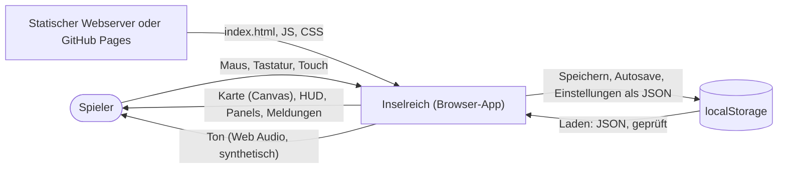
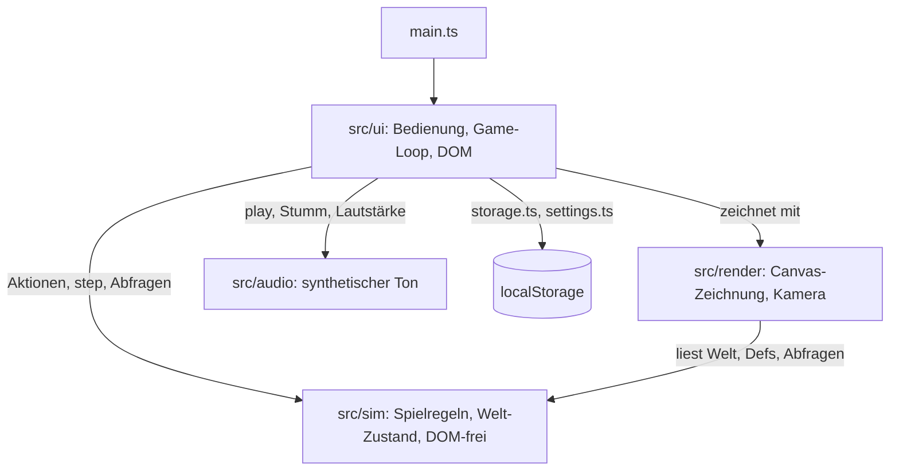
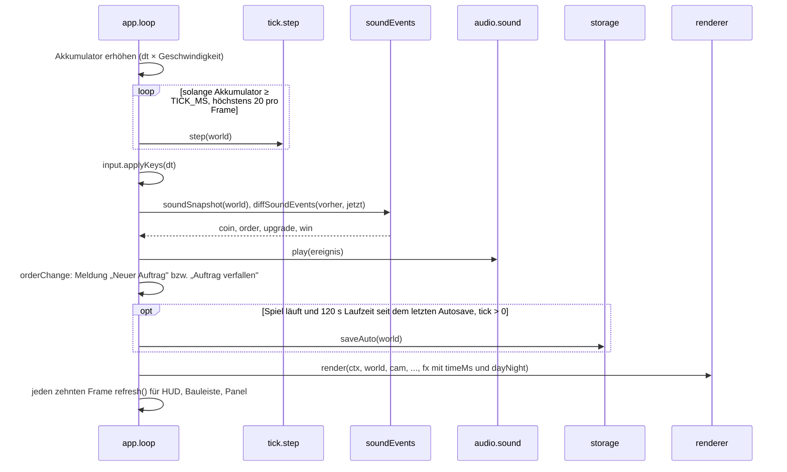
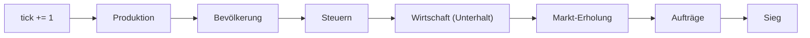
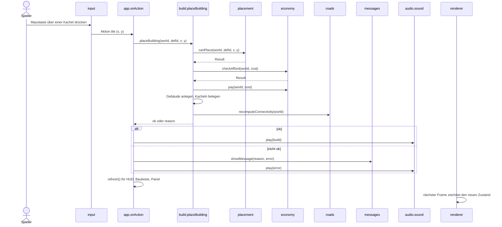
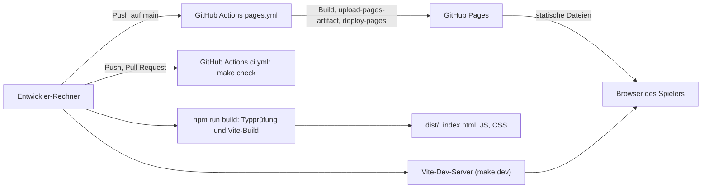
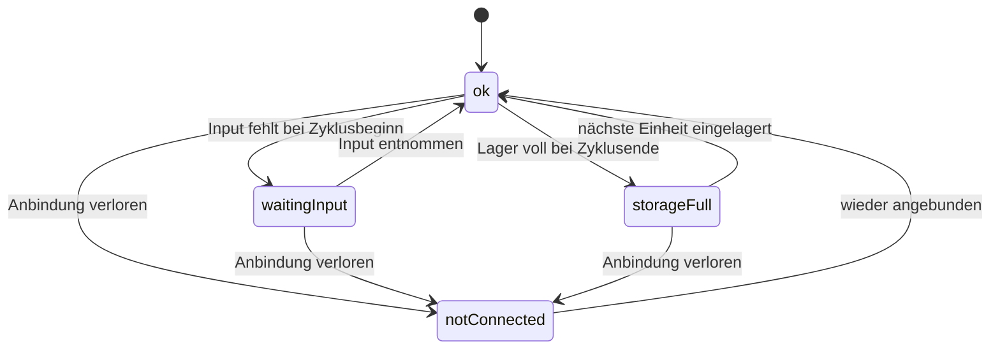

# Inselreich — Architekturdokumentation (arc42)

Diese Dokumentation beschreibt den Stand nach dem MVP (Meilensteine 1–4) und M5 „Spielerlebnis". Sie
ergänzt die [Design-Spec](superpowers/specs/2026-09-29-inselreich-design.md) und die
[M5-Spec](superpowers/specs/2026-09-30-m5-spielerlebnis-design.md), die Spielregeln und Zahlen
festlegen, und die [ADRs](adr/), die die wichtigsten Entscheidungen begründen. Massgeblich für
Spielwerte ist immer der Code in `src/sim/defs/`.

## 1. Einführung und Ziele

### Aufgabenstellung

Inselreich ist ein Aufbau-Strategiespiel im Browser: Der Spieler besiedelt eine generierte Insel,
verbindet Betriebe per Weg mit dem Kontor, baut Produktionsketten auf, versorgt Wohnhäuser mit Waren
und Diensten und lässt die Bevölkerung von Pionieren über Siedler zu Bürgern aufsteigen. Geld kommt
aus Steuern und Handel, Unterhalt kostet laufend. Ziel sind 50 Bürger; der Spielstand lässt sich im
Browser speichern. Mechanik und Zahlen sind eigenständig, Grafik und Audio eigen oder offen lizenziert mit Nachweis (ADR-006).

M5 ergänzt Tiefe (globaler Steuerregler, Werkzeugmacher), Dynamik (Verkaufssättigung, Handelsaufträge),
Ambiente (gezeichnete Silhouetten, Animationen, synthetischer Ton, Tag-Nacht-Tönung) und Bedienkomfort
(Radiusanzeige, Bedarfssymbole, Warenbilanz, Tooltips, Hotkeys, Touch, Autosave).

### Qualitätsziele

| Priorität | Qualitätsziel       | Bedeutung                                                                                      |
| --------- | ------------------- | ---------------------------------------------------------------------------------------------- |
| 1         | Nachvollziehbarkeit | Jede Zeile Spiellogik ist ohne Framework-Wissen lesbar; Spielwerte stehen an einem Ort.        |
| 2         | Testbarkeit         | Die Simulation läuft ohne Browser und ist deterministisch; Tests sagen Buchungen exakt vorher. |
| 3         | Robustheit          | Ungültige Aktionen und kaputte Spielstände führen zu einer Meldung, nie zu einem Absturz.      |
| 4         | Spielbarkeit        | Ein Spieler erreicht das Ziel in einer Sitzung; der Balancing-Test sichert das ab.             |

### Stakeholder

| Rolle                  | Erwartung                                                                                                  |
| ---------------------- | ---------------------------------------------------------------------------------------------------------- |
| Entwickler / Lernender | Versteht Aufbau und Code vollständig, lernt TypeScript und Architektur an einem echten Projekt (CAS AISE). |
| Spieler                | Spielt ohne Installation im Browser, versteht über Meldungen und Info-Panel, warum etwas nicht klappt.     |

## 2. Randbedingungen

| Randbedingung                 | Erläuterung                                                                                                                                        |
| ----------------------------- | -------------------------------------------------------------------------------------------------------------------------------------------------- |
| Stack                         | TypeScript (strict), Vite, HTML5 Canvas 2D für die Karte, DOM für das UI (ADR-001).                                                                |
| Keine Laufzeit-Abhängigkeiten | Nur Dev-Abhängigkeiten (Vite, TypeScript, Vitest, ESLint, Prettier samt Plugins).                                                                  |
| Browser                       | Aktueller Browser mit Canvas 2D und Web Audio; Spielstände und Einstellungen in `localStorage`. Maus, Tastatur und Touch (Pinch, Zwei-Finger-Pan). |
| Eigene Inhalte                | Eigener Titel, eigene Zahlen; Grafik und Audio eigen oder offen lizenziert mit Nachweis (ADR-006).                                                 |
| Werkzeuge                     | Node ≥ 22; `make check` (Lint, Tests, Build) läuft identisch lokal und in der CI.                                                                  |
| Sprache                       | UI und Doku Deutsch (CH, kein ß); Code-Bezeichner Englisch.                                                                                        |

## 3. Kontextabgrenzung

| Nachbar      | Schnittstelle                                                                                                                                                                                                 |
| ------------ | ------------------------------------------------------------------------------------------------------------------------------------------------------------------------------------------------------------- |
| Spieler      | Eingabe per Maus, Tastatur und Touch auf Canvas und Buttons; Ausgabe über Canvas, DOM und Web Audio (erst nach der ersten Nutzergeste).                                                                       |
| localStorage | Manueller Spielstand `inselreich.save.v1` und Autosave `inselreich.save.auto` (`src/ui/storage.ts`, beide Format v2); Einstellungen `inselreich.settings` (`src/ui/settings.ts`, nicht Teil des Spielstands). |
| Webserver    | Liefert die statischen Dateien aus `dist/`; es gibt kein Backend.                                                                                                                                             |

## 4. Lösungsstrategie

- **Trennung Simulation / Darstellung / Bedienung** (ADR-002): `src/sim/` enthält die Spielregeln und
  kennt kein DOM (per ESLint-Regel `no-restricted-globals` abgesichert). `src/render/` zeichnet,
  `src/ui/` verbindet Eingabe, Loop und DOM.
- **Welt als Datenobjekt:** Der ganze Spielzustand ist ein JSON-fähiges `World`-Objekt ohne Klassen
  und Zyklen. Systeme sind Funktionen `(world) => void`, Aktionen `(world, …) => Result`. Speichern ist
  `JSON.stringify`.
- **Fester Tick:** Die Simulation läuft in Schritten von `TICK_MS` (100 ms bei 1×). Die Reihenfolge der
  Systeme und die Takte sind festgelegt (ADR-005); gleiche Eingaben ergeben gleiche Ergebnisse.
- **Spielwerte nur in `src/sim/defs/`:** Güter, Gebäude, Stufen und Takte sind Tabellen; die Logik liest
  sie, statt Zahlen hart zu codieren.
- **Top-down statt Isometrie** (ADR-003): quadratische 32-px-Kacheln; der Renderer ist isoliert und
  später austauschbar.
- **Lesende Sim-Abfragen** (`src/sim/queries.ts`): UI und Renderer rechnen Bilanz, Diagnose,
  Abdeckung und Zonen nicht selbst nach, sondern fragen reine Funktionen der Simulation. Karte und
  Info-Panel nutzen dieselbe Quelle und widersprechen sich nie.
- **Ambiente ohne Sim-Änderung:** Animationen hängen nur an Zeit und Welt-Zustand (`RenderFx`), Töne an
  Aktionsergebnissen und einem Vergleich zweier Frames in der UI. Die Welt trägt keine Ereignisliste.
- **Zufall aus dem Seed statt gespeichertem Strom** (ADR-010): Handelsaufträge leiten Gut und Menge je
  Periode aus Seed und Periodennummer ab; der Spielstand braucht keinen RNG-Zustand.

## 5. Bausteinsicht

### Ebene 1

| Baustein      | Verantwortung                                                                                                                                        |
| ------------- | ---------------------------------------------------------------------------------------------------------------------------------------------------- |
| `src/sim/`    | Welt-Zustand, Spielregeln, Spielwerte, Speicherformat mit Migration, lesende Abfragen. Keine Abhängigkeit nach aussen.                               |
| `src/render/` | Zeichnet Terrain, Wasser, Wege, Gebäude-Silhouetten, Animationen, Schiff, Overlays, Tag-Nacht-Tönung und die Vorschau; Kamera-Mathematik. Liest nur. |
| `src/ui/`     | Start und Neustart, Game-Loop, Eingabe (Maus, Tastatur, Touch, Hotkeys), HUD, Bauleiste, Panels, Meldungen, Ton-Anbindung, `localStorage`-Adapter.   |
| `src/audio/`  | Synthetischer Ton über Web Audio. Hängt nur vom Browser ab, nicht von `src/sim/` oder `src/ui/`.                                                     |

### Ebene 2: `src/sim/`

| Modul                                                    | Verantwortung                                                                                                                                                                                                                                                                                                                                                               |
| -------------------------------------------------------- | --------------------------------------------------------------------------------------------------------------------------------------------------------------------------------------------------------------------------------------------------------------------------------------------------------------------------------------------------------------------------- |
| `defs/goods.ts`, `buildings.ts`, `tiers.ts`, `timing.ts` | Spielwerte: Güter und Preise, Verkaufssättigung (`SELL_DROP`, `SELL_FLOOR`), Auftragsgüter und `ORDER_PREMIUM`, Lagerkapazität, Startkapital; Gebäude mit Kosten, Unterhalt, Zyklus, Standortregeln; Stufen mit Bedürfnissen, Diensten, Steuern, Aufstiegskosten, Siegziel, Steuerstufen (`TAX_LEVELS`); Takte (Buchung, Wachstum, Steuersperre, Markt-Erholung, Aufträge). |
| `types.ts`                                               | Datentypen (`World`, `Tile`, `Building`, `HouseState`, `Order`, `TaxLevel`, `Result`) und die Helfer `ok`/`fail`.                                                                                                                                                                                                                                                           |
| `noise.ts`, `rng.ts`                                     | Seed-basiertes Value-Noise für die Karte; `rng.ts` (mulberry32) liefert je Auftragsperiode eine neue Zufallsfolge (ADR-010).                                                                                                                                                                                                                                                |
| `mapgen.ts`                                              | Erzeugt die Insel aus einem Seed, prüft die Nachbedingungen, sucht den Kontor-Standort an der Küste.                                                                                                                                                                                                                                                                        |
| `world.ts`                                               | `createWorld(seed)` und Zugriffshelfer (Kachel, Footprint, Nachbarn, Radius, Mittelpunkt).                                                                                                                                                                                                                                                                                  |
| `placement.ts`                                           | `canPlace`/`canPlaceRoad`: Kartenrand, Bauland, Belegung und Standortregeln, mit deutschem Grund.                                                                                                                                                                                                                                                                           |
| `build.ts`                                               | `placeBuilding`, `placeRoad`, `demolish`, `removeRoad`: prüfen, bezahlen, Kacheln belegen, Rückerstattung.                                                                                                                                                                                                                                                                  |
| `roads.ts`                                               | `recomputeConnectivity`: Breitensuche über Wege ab dem Kontor, setzt `connected` und `notConnected`.                                                                                                                                                                                                                                                                        |
| `supply.ts`                                              | Versorgungsradius von Kontor und angebundenen Marktplätzen (für Bauregel und Häuser).                                                                                                                                                                                                                                                                                       |
| `production.ts`                                          | `tickProduction`: Fortschritt, Input-Entnahme, Ausstoss ins Lager, Zustände der Betriebe.                                                                                                                                                                                                                                                                                   |
| `population.ts`                                          | `tickPopulation` (Versorgung, Dienste, Verbrauch, Wachstum mit Zielbelegung, Aufstieg mit Wartezeit der Steuerstufe) und `tickTaxes` (Steuern × `pct` der Steuerstufe).                                                                                                                                                                                                     |
| `tax.ts`                                                 | `setTaxLevel`: schaltet die globale Steuerstufe, mit Sperrzeit `TAX_SWITCH_LOCK`.                                                                                                                                                                                                                                                                                           |
| `economy.ts`                                             | Lager (`addStock`/`takeStock`), `checkAfford`/`pay`, Rückerstattung, `tickEconomy` (Unterhalt).                                                                                                                                                                                                                                                                             |
| `trade.ts`                                               | `buy` zu Fixpreisen; `sell` mit Verkaufssättigung (`sellPrice(world, good, n)` über `sellPct`); `tickMarket` (Erholung des Verkaufsanteils).                                                                                                                                                                                                                                |
| `orders.ts`                                              | Handelsaufträge: `orderForPeriod` (rein, seed-abgeleitet), `tickOrders` (Angebot, Verfall), `deliverOrder`, `nextOrderTick`.                                                                                                                                                                                                                                                |
| `queries.ts`                                             | Reine Abfragen für UI und Renderer: `goodsBalance`, `houseDiagnosis`, `coverageMask`, `placementZone`, `effectiveRefund`, `layoutKey` (Cache-Schlüssel).                                                                                                                                                                                                                    |
| `save.ts`                                                | `serialize`/`deserialize` (Version 2) mit Migration v1 → v2 und Strukturprüfung; leitet die Anbindung nach dem Laden neu ab.                                                                                                                                                                                                                                                |
| `tick.ts`                                                | `step(world)`: Tick-Zähler, dann alle Systeme in fester Reihenfolge; `checkWin`.                                                                                                                                                                                                                                                                                            |

### Ebene 2: `src/render/`

| Modul         | Verantwortung                                                                                                                                                                                    |
| ------------- | ------------------------------------------------------------------------------------------------------------------------------------------------------------------------------------------------ |
| `camera.ts`   | Kamera (Position, Zoom), Begrenzung, Umrechnung Bildschirm ↔ Kachel; `tileToScreen` rundet auf ganze Pixel (keine Weg-Nähte).                                                                    |
| `terrain.ts`  | Zeichnet das Terrain einmal in eine Offscreen-Canvas.                                                                                                                                            |
| `sprites.ts`  | Zeichnet Gebäude als Silhouette je Typ (`SILHOUETTES`, Fallback je Kategorie), Wohnhaus je Stufe, Rauch bei arbeitenden Betrieben, roten Punkt ohne Anbindung, und Wege.                         |
| `water.ts`    | Bewegte Wellenlinien auf sichtbaren Wasserkacheln, an der Küste verstärkt.                                                                                                                       |
| `ship.ts`     | Händlerschiff an der ersten Wasserkachel neben dem Kontor, solange ein Auftrag läuft.                                                                                                            |
| `overlays.ts` | Radiusanzeige und Abdeckungs-Umriss beim Platzieren, Bedarfssymbole über Häusern (ab Zoom 0.75); Cache der Abdeckungsmasken je Art, Schlüssel Welt-Identität und `layoutKey`.                    |
| `daynight.ts` | Deckkraft der Tag-Nacht-Tönung aus `world.tick` (ein Tag 6000 Ticks, höchstens 0.2).                                                                                                             |
| `renderer.ts` | Setzt einen Frame zusammen: Terrain-Ausschnitt, Wellen, Schiff, Wege, Radiusanzeige, Gebäude, Bedarfssymbole, Tönung, Auswahl, Vorschau. `render(…, fx?: RenderFx)` mit `{ timeMs, dayNight? }`. |

### Ebene 2: `src/ui/`

| Modul            | Verantwortung                                                                                                                                                                                            |
| ---------------- | -------------------------------------------------------------------------------------------------------------------------------------------------------------------------------------------------------- |
| `app.ts`         | `startGame`: baut ein Spiel auf, Game-Loop, `onAction`, Werkzeugwahl (`selectTool`), Tempo (`setSpeed`), Autosave, Ton-Anbindung, Panel-Wechsel, Speichern/Laden/Neu, `dispose`.                         |
| `input.ts`       | Maus, Tastatur und Touch: Kamera (Zoom, Pinch, Pan mit `applyKeys(dtMs)`), Hover-Prüfung, Kachel-Aktionen auf der Drück-Kachel, Weg-Ziehen, `cancelPointerAction`.                                       |
| `hotkeys.ts`     | Tastenbelegung (`TOOL_HOTKEYS`), `hotkeyAction`, Tempo-Helfer `withSpeed`/`afterPause`, Tastenname für Tooltips. Rein, ohne DOM.                                                                         |
| `hud.ts`         | Kopfzeile: Geld, Steuern, Unterhalt und Bilanz, Tick, Geschwindigkeit, Ton- und Tag-Nacht-Schalter, Spielstand-Buttons mit Laden-Auswahl, Einwohner, Lager mit Warenbilanz, Steuerregler, Auftragskarte. |
| `order.ts`       | Auftragskarte (Text, „Liefern") und Erkennung neuer bzw. verfallener Aufträge je Frame.                                                                                                                  |
| `buildMenu.ts`   | Bauleiste nach Kategorien mit Kosten; markiert nicht bezahlbare Einträge; Tooltips (Hover, Fokus, Langdruck) mit Werten aus `src/sim/defs/`.                                                             |
| `inspect.ts`     | Info-Panel eines Gebäudes: Zustand, Produktion, Unterhalt, Wohnhaus-Details mit Mängeln aus `houseDiagnosis`, Abriss mit `effectiveRefund`, Handel.                                                      |
| `trade.ts`       | Handelsdialog am Kontor mit Preisanteil je Gut und genauem Erlös je Verkaufsbutton; Buttons bleiben klickbar.                                                                                            |
| `soundEvents.ts` | Frame-Vergleich für zeitbasierte Töne (Buchung, Auftrag, Aufstieg, Sieg), Ton je Aktionsergebnis, Ereignisse zum Entsperren.                                                                             |
| `settings.ts`    | Einstellungen (Stumm, Lautstärke, Tag-Nacht) lesen und schreiben, Standardwerte bei Fehlern.                                                                                                             |
| `messages.ts`    | Meldungen (Toasts), begrenzt und entdoppelt; sticky Meldungen für Sieg und Fehler.                                                                                                                       |
| `storage.ts`     | Adapter zu `localStorage` für manuellen Platz und Autosave; listet ladbare Stände; fängt Speicherfehler ab und liefert `Result`.                                                                         |
| `dom.ts`         | Kleine DOM-Helfer (`setField`, `costLine`).                                                                                                                                                              |

### Ebene 2: `src/audio/`

| Modul      | Verantwortung                                                                                                                                                                                                                  |
| ---------- | ------------------------------------------------------------------------------------------------------------------------------------------------------------------------------------------------------------------------------ |
| `sound.ts` | `createSound({ muted, volume }, ctxFactory?)`: Tonfiguren je `SoundEvent` mit Drossel über `ctx.currentTime`, Meeresrauschen, Stumm, Lautstärke, `unlock`, `setHidden`, `dispose`. Ohne Web Audio eine stille Implementierung. |

## 6. Laufzeitsicht

### Ein Frame mit Simulationsschritten

Der Loop in `app.ts` läuft per `requestAnimationFrame`. Er sammelt die verstrichene Zeit mal
Geschwindigkeit in einem Akkumulator und führt pro `TICK_MS` einen Schritt aus, höchstens 20 pro Frame.
Danach verschiebt er die Kamera per Tastatur (`applyKeys(dt)`), vergleicht den Frame mit dem vorigen
für Töne und Auftragsmeldungen, zählt die Autosave-Zeit und zeichnet. Das HUD wird jeden zehnten Frame
aktualisiert.

### Ein Simulationsschritt (`step`)

| System                     | Takt                                                 | Wirkung                                                                                              |
| -------------------------- | ---------------------------------------------------- | ---------------------------------------------------------------------------------------------------- |
| `tickProduction`           | jeder Tick                                           | Fortschritt, Input-Entnahme, Ausstoss, Zustände der Betriebe                                         |
| `tickPopulation`           | Verbrauch jeder Tick, Wachstum alle 50               | Versorgung, Dienste, Verbrauch; Wachstum mit Zielbelegung und Aufstieg mit Wartezeit der Steuerstufe |
| `tickTaxes`, `tickEconomy` | Buchung alle 100 (`UPKEEP_INTERVAL`)                 | Steuern × `pct` der Steuerstufe, Unterhalt; dazwischen nur `stats`                                   |
| `tickMarket`               | alle 10 (`SELL_RECOVERY_INTERVAL`)                   | jeder Verkaufsanteil +1 Prozentpunkt, höchstens 100; kein Geld, kein Lager                           |
| `tickOrders`               | ab 600 alle 900 (`ORDER_FIRST_TICK`, `ORDER_PERIOD`) | zuerst Verfall (`tick > due`), dann Angebot aus `orderForPeriod`; kein Geld, kein Lager              |
| `checkWin`                 | jeder Tick                                           | setzt `won` einmalig bei 50 Bürgern                                                                  |

Alle Takte ausser den Aufträgen folgen der Konvention `tick > 0 && tick % INTERVAL === 0` (ADR-005); der
Auftragstakt hat einen Versatz von 600 (Nachtrag in ADR-005). Die Höchststufe für den Güterpool eines
Auftrags stammt aus dem Zustand nach `tickPopulation` desselben Ticks.

### Eine Bauaktion

Scheitert `canPlace` oder `checkAfford`, kehrt `placeBuilding` sofort mit dem Grund zurück; die Welt
bleibt unverändert. Wege entstehen schon beim Drücken und beim Ziehen (`placeRoad` je Kachel), Abriss
über `demolish` bzw. `removeRoad` mit demselben Ablauf. Auf Touch wirkt die Aktion erst beim Loslassen,
aber auf der Kachel des ersten Tippens, und entfällt, wenn ein zweiter Finger dazukam oder geschwenkt
wurde. Jeder Werkzeugwechsel (Bauleiste oder Hotkey) läuft über `selectTool` und bricht zuerst eine
laufende Zeiger-Aktion ab (`cancelPointerAction`).

## 7. Verteilungssicht

- Das Spiel ist eine **statische Seite** ohne Backend. `vite.config.ts` setzt `base: './'`; alle Pfade
  im Build sind relativ, `dist/` läuft deshalb auch in einem Unterpfad (z. B. GitHub Pages eines Projekt-Repos).
- **Entwicklung:** `make dev` startet den Vite-Dev-Server; `make check` entspricht der CI.
- **CI:** `.github/workflows/ci.yml` führt `make check` bei Push auf `main` und bei Pull Requests aus.
- **Deploy:** `.github/workflows/pages.yml` baut bei Push auf `main` (oder manuell) und veröffentlicht
  `dist/` auf GitHub Pages. Er greift erst, wenn Pages im Repo aktiviert ist (Quelle: GitHub Actions);
  auf dem Free-Plan braucht das ein öffentliches Repo (offene Entscheidung, Spec Abschnitt 6).

## 8. Querschnittliche Konzepte

### Gebäudezustände (ADR-005)

Produktionsbetriebe tragen einen Zustand, der dem Spieler im Info-Panel erklärt, warum nichts
entsteht. Zustände bleiben stehen, bis ihre Ursache behoben ist.

Nach der Wiederanbindung setzt `recomputeConnectivity` den Zustand auf `ok`; `waitingInput` bzw.
`storageFull` leitet die Produktion im nächsten Tick neu ab. Für Wohnhäuser gilt dieselbe Konvention:
`supplied`, `services` und `satisfied` werden jeden Tick neu abgeleitet.

### Anbindung

Ein Gebäude ist angebunden, wenn eine Wegkachel an seinen Footprint grenzt und diese über Wege
(4er-Nachbarschaft) mit einer Wegkachel am Kontor verbunden ist. `roads.ts` bestimmt das per
Breitensuche. Neu berechnet wird nur bei Änderungen: nach jedem Bau und Abriss von Weg oder Gebäude
und nach dem Laden. Das Kontor ist immer angebunden; Wohnhäuser nie, sie hängen am Versorgungsradius.
Betriebe, Marktplätze, Kapelle und Schule wirken nur angebunden.

### Versorgung

Ein Wohnhaus ist versorgt, wenn sein Mittelpunkt im Versorgungsradius (euklidisch, Mitte zu Mitte)
des Kontors oder eines angebundenen Marktplatzes liegt (`supply.ts`). Dieselbe Prüfung ist die
Bauregel für Wohnhäuser. Ein nicht versorgtes Haus erhält keine Waren; alle Güterbedürfnisse gelten
dann als unerfüllt. Dienste (Kapelle, Schule) wirken im Dienstradius, wenn das Dienstgebäude
angebunden ist.

### Bedürfnis-Akkumulatoren

Jedes Haus führt je Bedarfsgut einen Akkumulator `demand`. Pro Tick wächst er um
Einwohner × Rate / 100. Erreicht er 1, wird eine Einheit aus dem Lager entnommen und der Rest bleibt
stehen. Gelingt die Entnahme, gilt das Bedürfnis als erfüllt, sonst als unerfüllt, jeweils bis zum
nächsten Entnahmeversuch. Ein neues Haus startet mit Bedarf 1, damit die erste Einheit sofort
entnommen wird. Beim Aufstieg entnimmt `tryUpgrade` je neuem Bedarfsgut sofort eine Einheit und
zählt sie als ausgeliefert (Bedarf 0, erfüllt); so können zwei Häuser nicht auf dieselbe Einheit
aufsteigen, und das Haus zahlt schon in einer Buchung im selben Tick den vollen Steuersatz. Der Zeitpunkt
`satisfiedSince` wird bei jedem Tick mit unerfüllten Bedürfnissen neu gesetzt und steuert die
Wartezeit vor dem Aufstieg.

### Steuerstufe, Markt und Aufträge

- **Steuerstufe:** `world.taxLevel` (`low`/`normal`/`high`) wirkt global auf Steuer (`pct`, erst summiert,
  dann einmal abgerundet; „normal" rechnet bitgleich wie vor M5), Zielbelegung und Aufstiegs-Wartezeit
  (`TAX_LEVELS`). `setTaxLevel` sperrt das Umschalten für `TAX_SWITCH_LOCK` Ticks (`taxLockedUntil`).
- **Verkaufssättigung:** Je Gut hält `world.sellPct` den Verkaufsanteil (ganzzahlig 30…100). `sellPrice`
  summiert den Erlös Einheit für Einheit mit sinkendem Anteil und rundet einmal ab; `sell` senkt den
  Anteil danach, `tickMarket` hebt ihn wieder an. Kaufpreise und Aufträge berühren `sellPct` nicht.
- **Aufträge:** Höchstens ein Auftrag (`world.order`) ist aktiv, weil die Laufzeit (600) kürzer ist als
  die Periode (900). Gut und Menge kommen aus `orderForPeriod(seed, k, maxTier)` (ADR-010). `deliverOrder`
  liefert nur vollständig und ist auch bei negativem Geld erlaubt; ein verfallener Auftrag hat keine Strafe.

### Sim-Abfragen und Caches im Renderer

`src/sim/queries.ts` liefert UI und Renderer abgeleitete Sichten ohne Seiteneffekt: Warenbilanz
(nominal aus angebundenen Betrieben und versorgten Häusern), Diagnose je Haus (dieselbe Liste für
Info-Panel und Kartensymbol), Abdeckungsmasken, Platzierungszonen und die tatsächliche Rückerstattung.
`layoutKey(world)` ändert sich bei jedem Bau, Abriss, Weg und jeder Anbindungsänderung, nicht durch
`step()` allein. `overlays.ts` rechnet Abdeckungsmasken und Umrisse nur neu, wenn sich Welt-Identität,
`layoutKey` oder die Art ändern (nicht je Frame oder Hover-Kachel). Die Diagnose der Bedarfssymbole
läuft ungecacht je sichtbarem Haus und Frame; gemessen 2.5–3.1 ms Arbeit je Frame bei 57 Gebäuden.

### Ton

- `src/audio/sound.ts` erzeugt alle Töne synthetisch (Oszillatoren, gefiltertes Rauschen); es gibt keine
  Tondateien. Der `AudioContext` entsteht bzw. läuft erst nach der ersten Nutzergeste (`pointerup` oder
  `keydown`); vorher ist `play()` wirkungslos. Ist der Tab verborgen, meldet die UI das über
  `setHidden`, und der Kontext wird angehalten.
- Aktions-Töne löst die UI direkt nach der Sim-Aktion aus (Erfolg: Ton der Aktion, Fehlschlag: `error`);
  zeitbasierte Töne entstehen aus dem Frame-Vergleich (Buchungstakt, neue Auftragsperiode, Summe der
  Hausstufen, `won`). Eine Drossel je Ereignis misst an `ctx.currentTime`.
- Fehlt Web Audio oder wirft die Fabrik, liefert `createSound` eine stille Implementierung.

### Persistenz

- `serialize(world)` ist `JSON.stringify(world)`; die Welt enthält ein Versionsfeld (`version: 2`,
  `SAVE_VERSION`). Gespeichert wird immer Version 2.
- `deserialize(json)` wirft nie. Ein Stand mit `version: 1` wird zuerst migriert (`migrateV1ToV2`:
  `taxLevel = 'normal'`, `taxLockedUntil = 0`, `sellPct` überall 100, `order = null`); danach prüft sie
  JSON, Version, Kartengrösse und Kachelanzahl, die Gebäude (bekannte `defId`, Koordinaten), das Kontor,
  alle Güter im Lager, `stats`, `won`, `tick`, `nextBuildingId` und die v2-Felder (`taxLevel`,
  `taxLockedUntil`, `sellPct` ganzzahlig 30…100, `order` passend zu Tick und Periode). Fehler ergeben
  `Ungültiges Format`, `Unbekannte Version` oder `Beschädigter Spielstand`. Ein echter v1-Stand liegt als
  Fixture in `tests/sim/fixtures/save-v1.json`.
- Menge und Prämie eines laufenden Auftrags werden nur strukturell geprüft (nicht gegen die aktuellen
  Spielwerte), damit geänderte Werte alte Stände nicht abweisen. Die Auftragstakte dagegen gehen in die
  Prüfung ein; ändern sie sich, braucht es eine Migration.
- Nach dem Laden wird `recomputeConnectivity` aufgerufen; ein gespeichertes `connected` wird nicht
  übernommen.
- `src/ui/storage.ts` kapselt `localStorage`: manueller Platz `inselreich.save.v1` (der Schlüssel benennt
  den Platz, nicht das Format) und Autosave `inselreich.save.auto`. Der Autosave schreibt alle 120 s
  Echtzeit laufenden Spiels (Pause zählt nicht), nie bei Tick 0; ein Schreibfehler erscheint je Spiel
  einmal. `listSaves` nennt nur Stände, die `deserialize` akzeptiert; gibt es zwei, zeigt „Laden" eine
  Auswahl. Laden prüft zuerst und ersetzt das laufende Spiel nur bei Erfolg; sonst bleibt es unverändert.
  Laden behält Tempo und — bei gleichem Seed — die Kamera.
- **Einstellungen** (`src/ui/settings.ts`, Schlüssel `inselreich.settings`): `{ muted, volume, dayNight }`,
  Standard `{ false, 0.4, true }`. Ungültige Werte fallen einzeln auf den Standard zurück. Sie gehören
  nicht zum Spielstand und überleben „Neu" und „Laden".
- Laden und «Neu» beenden das laufende Spiel über `dispose()` (Loop, ResizeObserver, Listener,
  Meldungsfläche, HUD-Timer, Ton) und starten ein neues. Ein gewonnener Stand zeigt das Siegbanner nicht erneut.

### Fehlerbehandlung

- Sim-Aktionen liefern `Result` = `{ ok: true }` oder `{ ok: false, reason }` mit deutschem Grund; sie
  werfen nicht. Die UI zeigt den Grund als Meldung und spielt den Fehlerton. Buttons, die sicher
  scheitern (Bauleiste, Handel, Steuerregler in der Sperre), sind nur gedämpft und bleiben klickbar,
  damit der Klick den Grund nennt.
- `startGame` fängt Fehler beim Aufbau (z. B. keine gültige Karte) ab und zeigt eine bleibende Meldung.
- Ein Laufzeitfehler im Loop hält das Spiel an und erscheint als bleibende Meldung, statt still
  weiterzulaufen.
- Meldungen sind auf drei sichtbare begrenzt; dieselbe Meldung innert einer Sekunde erscheint nur einmal.

### Determinismus und Seed

- Die Karte entsteht aus einem Seed (Value-Noise plus radiale Inselmaske). Erfüllt sie die
  Nachbedingungen nicht, versucht `mapgen` die folgenden Seeds; `world.seed` hält den tatsächlich
  verwendeten Seed fest, das HUD zeigt ihn als «Karte».
- Die Simulation nutzt keine Uhr und kein DOM (ESLint verbietet u. a. `Date`, `performance`,
  `setTimeout` in `src/sim/**`). Zufall gibt es nur seed-abgeleitet über `rng.ts`: Handelsaufträge ziehen je
  Periode eine neue RNG-Instanz aus `seed` und Periodennummer ([ADR-010](adr/ADR-010-zufall-je-periode.md));
  `step()` zieht sonst keine Zufallszahlen, der Save trägt keinen RNG-Zustand. Gleiche Welt und gleiche
  Aktionen ergeben denselben Verlauf.
- Nur die UI wählt für ein neues Spiel einen Seed aus der aktuellen Zeit.

## 9. Architekturentscheidungen

| Entscheidung                                                | Dokument                                                                |
| ----------------------------------------------------------- | ----------------------------------------------------------------------- |
| TypeScript, Vite, Canvas 2D, keine Laufzeit-Abhängigkeiten  | [ADR-001](adr/ADR-001-tech-stack.md)                                    |
| Simulation als reines Datenmodell, getrennt von Darstellung | [ADR-002](adr/ADR-002-sim-render-trennung.md)                           |
| Top-down statt Isometrie im MVP                             | [ADR-003](adr/ADR-003-topdown-statt-isometrie.md)                       |
| Eigener Titel, eigene Grafik, eigene Spielwerte (abgelöst)  | [ADR-004](adr/ADR-004-eigene-assets.md)                                 |
| Tick-Reihenfolge und Zustandssemantik der Gebäude           | [ADR-005](adr/ADR-005-tick-reihenfolge-und-zustaende.md)                |
| Eigene oder offen lizenzierte Inhalte mit Nachweis          | [ADR-006](adr/ADR-006-offene-lizenzen.md)                               |
| Studio-Hierarchie                                           | [ADR-007](adr/ADR-007-studio-hierarchie.md)                             |
| Studio-Telemetrie                                           | [ADR-008](adr/ADR-008-studio-telemetrie.md)                             |
| Studio-Autonomie und Lernen                                 | [ADR-009](adr/ADR-009-studio-autonomie-und-lernen.md)                   |
| Zufall je Auftragsperiode aus dem Seed statt RNG-Strom      | [ADR-010](adr/ADR-010-zufall-je-periode.md)                             |
| Balancing-Revision (Steuern, Luxusverbrauch)                | [Kurz-Spec Balancing](superpowers/specs/2026-09-30-balancing-design.md) |
| M5: Steuerregler, Sättigung, Aufträge, Ambiente, Save v2    | [M5-Spec](superpowers/specs/2026-09-30-m5-spielerlebnis-design.md)      |

## 10. Qualitätsanforderungen

| Szenario                   | Stimulus                                                             | Erwartete Reaktion                                                                     | Nachweis                                                           |
| -------------------------- | -------------------------------------------------------------------- | -------------------------------------------------------------------------------------- | ------------------------------------------------------------------ |
| Determinismus              | Karte zweimal mit gleichem Seed erzeugen                             | Identische Karte; `world.seed` erzeugt dieselbe Karte erneut                           | `tests/sim/mapgen.test.ts`                                         |
| Save-Round-trip            | Gespielte Welt speichern und laden                                   | Geladene Welt ist inhaltlich gleich, Sieg bleibt erhalten                              | `tests/sim/save.test.ts`                                           |
| Kaputter Spielstand        | Müll, falsche Version oder fehlende Felder laden                     | Grund statt Exception, laufendes Spiel bleibt unverändert                              | `tests/sim/save.test.ts`, manuell (`app.ts`)                       |
| Anbindung nach Laden       | Stand mit `connected: true` ohne Weg laden                           | Gebäude ist nach dem Laden `notConnected`                                              | `tests/sim/save.test.ts`                                           |
| Spielbarkeit               | Skriptgesteuerte Kolonie mit Startkapital                            | Sieg bis Tick 7500 (Lauf bis 9000), Geld am Ende > 0; gemessen Sieg bei Tick 6050      | `tests/sim/balance.test.ts`                                        |
| Migration                  | Echten v1-Spielstand laden                                           | Stand lädt als v2 mit Standardwerten für Steuer, Verkaufsanteil und Auftrag            | `tests/sim/save.test.ts` (Fixture `save-v1.json`)                  |
| Determinismus mit Aktionen | Partie mit Steuer, Verkauf, Liefern, Speichern/Laden zweimal spielen | Gleiche Ergebnisse der Aktionen und gleicher Endstand; genau 10 Aufträge in 9000 Ticks | `tests/sim/m5-session.test.ts`                                     |
| Ton ohne Browser           | Fake-`AudioContext` statt Web Audio                                  | Drossel, Stumm, Lautstärke, Entsperren, Sichtbarkeit und stiller Rückfall prüfbar      | `tests/audio/sound.test.ts`                                        |
| Overlay-Cache              | Viele Frames ohne Änderung der Anordnung                             | Abdeckungsmaske wird nur bei neuem `layoutKey`, neuer Welt oder anderer Art berechnet  | `tests/render/overlays.test.ts`                                    |
| Takt-Vorhersage            | 100 bzw. 300 Schritte ab Tick 0 ausführen                            | Steuern und Unterhalt genau bei Tick 100, 200, 300 …: 300 Schritte = drei Buchungen    | `tests/sim/taxes.test.ts`, `tests/sim/production.test.ts`, ADR-005 |
| Kein DOM in der Simulation | DOM- oder Zeit-Global in `src/sim/` verwenden                        | Lint-Fehler, `make check` schlägt fehl                                                 | `eslint.config.js`                                                 |

## 11. Risiken und technische Schulden

Offene Befunde werden in [`docs/beobachtungen.md`](beobachtungen.md) gesammelt. Die wichtigsten:

- **Kippkante im Balancing:** Der Controller-Lauf im Balancing-Test kippt sprunghaft. Mit
  Verkaufssättigung liegt der Sieg bei Tick 6050 (Grenze 7500, Marge 1450), minMoney bei 57. Schon ein
  Abschlag von 2 statt 1 Prozentpunkt je verkaufter Einheit schiebt den Sieg auf etwa 7550 (rot). Die
  scharfe Absicherung ist der Test „10 Holz aus 100 % bringen genau 38" (AK-S2-01). Die Eskalationsregel
  der Balancing-Kurz-Spec ist ausgeschöpft; fällt die Marge unter etwa 500 Ticks, braucht es eine neue
  Kurz-Spec.
- **Auftragstakte in der Save-Prüfung:** Ein laufender Auftrag wird gegen `ORDER_FIRST_TICK`,
  `ORDER_PERIOD` und `ORDER_DURATION` geprüft. Ändern sich diese Takte, werden Stände mit laufendem
  Auftrag abgewiesen; dann braucht es eine Migration oder eine gelockerte Prüfung.
- **Diagnose ungecacht:** `houseDiagnosis` läuft je sichtbarem Haus und Frame. Gemessen unkritisch
  (57 Gebäude, 2.5–3.1 ms je Frame, Headless ohne GPU); bei deutlich grösseren Städten ein Cache je Tick.
- **Nur headless geprüft:** Touch-Bedienung, Ton und das mobile Layout (HUD belegt bei 390 px etwa 46 %
  der Höhe) sind im Headless-Browser abgenommen, nicht auf einem echten Gerät (Nutzer-Playtest).
- **Isometrie** steht im Backlog (ADR-003); der Renderer ist dafür isoliert.

## 12. Glossar

| Begriff        | Bedeutung                                                                                                          |
| -------------- | ------------------------------------------------------------------------------------------------------------------ |
| Kontor         | Startgebäude an der Küste (2×2), zentrales Lager, Handelsplatz und Ausgangspunkt des Wegenetzes; nicht abreissbar. |
| Tick           | Ein Simulationsschritt; bei Geschwindigkeit 1× dauert er `TICK_MS`. Raten gelten pro 100 Ticks.                    |
| Anbindung      | Verbindung eines Gebäudes über Wege mit dem Kontor; Voraussetzung für Produktion, Markt und Dienste.               |
| Versorgung     | Lage eines Wohnhauses im Radius des Kontors oder eines angebundenen Marktplatzes; nur dann erhält es Waren.        |
| Stufe          | Bevölkerungsstufe eines Wohnhauses: Pioniere, Siedler, Bürger; bestimmt Bedürfnisse, Dienste, Steuer.              |
| Aufstieg       | Wechsel eines Wohnhauses auf die nächste Stufe, wenn alle Bedingungen erfüllt sind; kostet Geld und Baustoffe.     |
| Bilanz         | Steuern minus Unterhalt je Buchungstakt (`UPKEEP_INTERVAL`); das HUD zeigt sie hinter Steuern und Unterhalt.       |
| Dienst         | Leistung eines öffentlichen Gebäudes im Radius: Glaube (Kapelle), Bildung (Schule).                                |
| Zyklus         | Anzahl Ticks, bis ein Betrieb eine Einheit erzeugt.                                                                |
| Steuerstufe    | Globale Einstellung niedrig / normal / hoch; bestimmt Steuer in %, Aufstiegs-Wartezeit und Zielbelegung.           |
| Verkaufsanteil | `sellPct` je Gut in %: sinkt mit jedem Verkauf (Sättigung), erholt sich mit der Zeit; bestimmt den Verkaufserlös.  |
| Auftrag        | Bestellung eines Händlers (Gut, Menge, Prämie, Frist); nur vollständig lieferbar, verfällt ohne Strafe.            |
| Autosave       | Zweiter Speicherplatz, den das Spiel alle 120 s laufender Zeit selbst schreibt.                                    |
