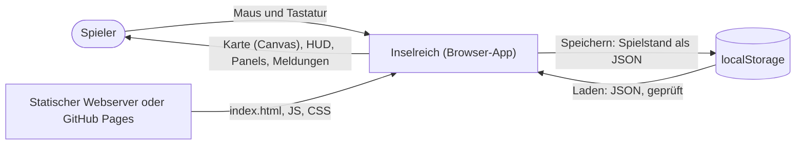
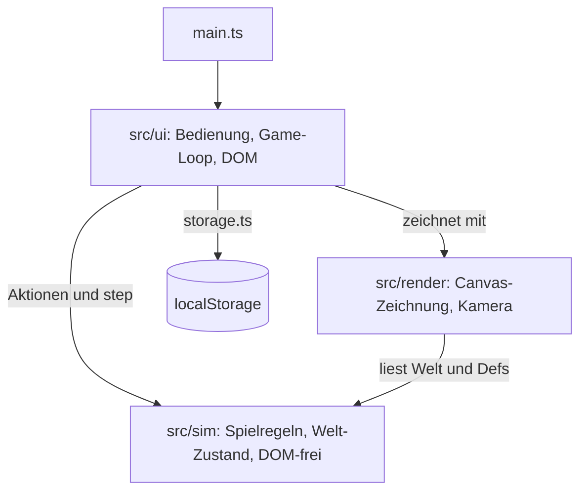
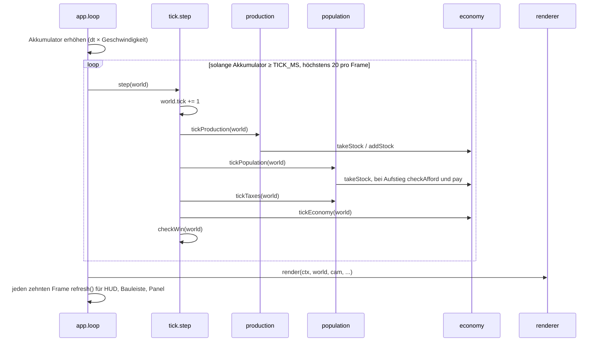
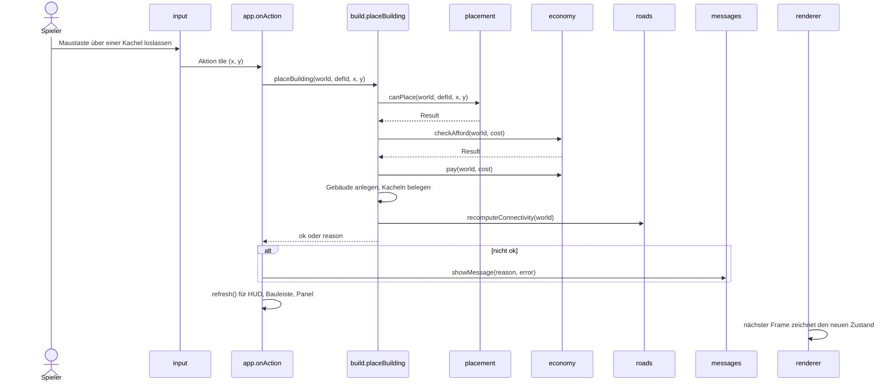
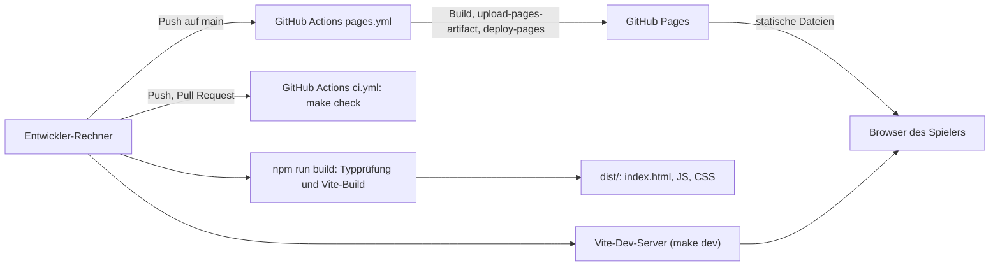
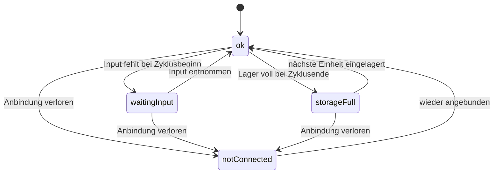

# Inselreich — Architekturdokumentation (arc42)

Diese Dokumentation beschreibt den Stand des MVP (Meilensteine 1–4). Sie ergänzt die
[Design-Spec](superpowers/specs/2026-09-29-inselreich-design.md), die Spielregeln und Zahlen festlegt,
und die [ADRs](adr/), die die wichtigsten Entscheidungen begründen. Massgeblich für Spielwerte ist
immer der Code in `src/sim/defs/`.

## 1. Einführung und Ziele

### Aufgabenstellung

Inselreich ist ein Aufbau-Strategiespiel im Browser: Der Spieler besiedelt eine generierte Insel,
verbindet Betriebe per Weg mit dem Kontor, baut Produktionsketten auf, versorgt Wohnhäuser mit Waren
und Diensten und lässt die Bevölkerung von Pionieren über Siedler zu Bürgern aufsteigen. Geld kommt
aus Steuern und Handel, Unterhalt kostet laufend. Ziel sind 50 Bürger; der Spielstand lässt sich im
Browser speichern. Mechanik, Grafik und Zahlen sind eigenständig (ADR-004).

### Qualitätsziele

| Priorität | Qualitätsziel       | Bedeutung                                                                                      |
| --------- | ------------------- | ---------------------------------------------------------------------------------------------- |
| 1         | Nachvollziehbarkeit | Jede Zeile Spiellogik ist ohne Framework-Wissen lesbar; Spielwerte stehen an einem Ort.        |
| 2         | Testbarkeit         | Die Simulation läuft ohne Browser und ist deterministisch; Tests sagen Buchungen exakt vorher. |
| 3         | Robustheit          | Ungültige Aktionen und kaputte Spielstände führen zu einer Meldung, nie zu einem Absturz.      |
| 4         | Spielbarkeit        | Ein Spieler erreicht das Ziel in einer Sitzung; der Balancing-Test sichert das ab.             |

### Stakeholder

| Rolle                  | Erwartung                                                                                                  |
| ---------------------- | ---------------------------------------------------------------------------------------------------------- |
| Entwickler / Lernender | Versteht Aufbau und Code vollständig, lernt TypeScript und Architektur an einem echten Projekt (CAS AISE). |
| Spieler                | Spielt ohne Installation im Browser, versteht über Meldungen und Info-Panel, warum etwas nicht klappt.     |

## 2. Randbedingungen

| Randbedingung                 | Erläuterung                                                                                  |
| ----------------------------- | -------------------------------------------------------------------------------------------- |
| Stack                         | TypeScript (strict), Vite, HTML5 Canvas 2D für die Karte, DOM für das UI (ADR-001).          |
| Keine Laufzeit-Abhängigkeiten | Nur Dev-Abhängigkeiten (Vite, TypeScript, Vitest, ESLint, Prettier samt Plugins).            |
| Browser                       | Aktueller Desktop-Browser; Spielstand in `localStorage`. Touch-Bedienung nur teilweise.      |
| Eigene Inhalte                | Eigener Titel, prozedural gezeichnete Grafik, eigene Zahlen; keine fremden Assets (ADR-004). |
| Werkzeuge                     | Node ≥ 22; `make check` (Lint, Tests, Build) läuft identisch lokal und in der CI.            |
| Sprache                       | UI und Doku Deutsch (CH, kein ß); Code-Bezeichner Englisch.                                  |

## 3. Kontextabgrenzung

| Nachbar      | Schnittstelle                                                                  |
| ------------ | ------------------------------------------------------------------------------ |
| Spieler      | Eingabe per Maus/Tastatur auf Canvas und Buttons; Ausgabe über Canvas und DOM. |
| localStorage | Ein Spielstand unter dem Schlüssel `inselreich.save.v1` (`src/ui/storage.ts`). |
| Webserver    | Liefert die statischen Dateien aus `dist/`; es gibt kein Backend.              |

## 4. Lösungsstrategie

- **Trennung Simulation / Darstellung / Bedienung** (ADR-002): `src/sim/` enthält die Spielregeln und
  kennt kein DOM (per ESLint-Regel `no-restricted-globals` abgesichert). `src/render/` zeichnet,
  `src/ui/` verbindet Eingabe, Loop und DOM.
- **Welt als Datenobjekt:** Der ganze Spielzustand ist ein JSON-fähiges `World`-Objekt ohne Klassen
  und Zyklen. Systeme sind Funktionen `(world) => void`, Aktionen `(world, …) => Result`. Speichern ist
  `JSON.stringify`.
- **Fester Tick:** Die Simulation läuft in Schritten von `TICK_MS` (100 ms bei 1×). Die Reihenfolge der
  Systeme und die Takte sind festgelegt (ADR-005); gleiche Eingaben ergeben gleiche Ergebnisse.
- **Spielwerte nur in `src/sim/defs/`:** Güter, Gebäude, Stufen und Takte sind Tabellen; die Logik liest
  sie, statt Zahlen hart zu codieren.
- **Top-down statt Isometrie** (ADR-003): quadratische 32-px-Kacheln; der Renderer ist isoliert und
  später austauschbar.

## 5. Bausteinsicht

### Ebene 1

| Baustein      | Verantwortung                                                                                      |
| ------------- | -------------------------------------------------------------------------------------------------- |
| `src/sim/`    | Welt-Zustand, Spielregeln, Spielwerte, Speicherformat. Keine Abhängigkeit nach aussen.             |
| `src/render/` | Zeichnet Terrain, Wege, Gebäude, Auswahl und Platzierungsvorschau; Kamera-Mathematik. Liest nur.   |
| `src/ui/`     | Start und Neustart, Game-Loop, Eingabe, HUD, Bauleiste, Panels, Meldungen, `localStorage`-Adapter. |

### Ebene 2: `src/sim/`

| Modul                                                    | Verantwortung                                                                                                                                                                                    |
| -------------------------------------------------------- | ------------------------------------------------------------------------------------------------------------------------------------------------------------------------------------------------ |
| `defs/goods.ts`, `buildings.ts`, `tiers.ts`, `timing.ts` | Spielwerte: Güter und Preise, Lagerkapazität, Startkapital; Gebäude mit Kosten, Unterhalt, Zyklus, Standortregeln; Stufen mit Bedürfnissen, Diensten, Steuern, Aufstiegskosten, Siegziel; Takte. |
| `types.ts`                                               | Datentypen (`World`, `Tile`, `Building`, `HouseState`, `Result`) und die Helfer `ok`/`fail`.                                                                                                     |
| `noise.ts`, `rng.ts`                                     | Seed-basiertes Value-Noise für die Karte; `rng.ts` (mulberry32) ist angelegt, aber derzeit ungenutzt.                                                                                            |
| `mapgen.ts`                                              | Erzeugt die Insel aus einem Seed, prüft die Nachbedingungen, sucht den Kontor-Standort an der Küste.                                                                                             |
| `world.ts`                                               | `createWorld(seed)` und Zugriffshelfer (Kachel, Footprint, Nachbarn, Radius, Mittelpunkt).                                                                                                       |
| `placement.ts`                                           | `canPlace`/`canPlaceRoad`: Kartenrand, Bauland, Belegung und Standortregeln, mit deutschem Grund.                                                                                                |
| `build.ts`                                               | `placeBuilding`, `placeRoad`, `demolish`, `removeRoad`: prüfen, bezahlen, Kacheln belegen, Rückerstattung.                                                                                       |
| `roads.ts`                                               | `recomputeConnectivity`: Breitensuche über Wege ab dem Kontor, setzt `connected` und `notConnected`.                                                                                             |
| `supply.ts`                                              | Versorgungsradius von Kontor und angebundenen Marktplätzen (für Bauregel und Häuser).                                                                                                            |
| `production.ts`                                          | `tickProduction`: Fortschritt, Input-Entnahme, Ausstoss ins Lager, Zustände der Betriebe.                                                                                                        |
| `population.ts`                                          | `tickPopulation` (Versorgung, Dienste, Verbrauch, Wachstum, Aufstieg) und `tickTaxes` (Steuern).                                                                                                 |
| `economy.ts`                                             | Lager (`addStock`/`takeStock`), `checkAfford`/`pay`, Rückerstattung, `tickEconomy` (Unterhalt).                                                                                                  |
| `trade.ts`                                               | `buy`/`sell` am Kontor zu Fixpreisen mit Prüfung von Menge, Geld und Lager.                                                                                                                      |
| `save.ts`                                                | `serialize`/`deserialize` mit Versionsfeld und Strukturprüfung; leitet die Anbindung nach dem Laden neu ab.                                                                                      |
| `tick.ts`                                                | `step(world)`: Tick-Zähler, dann alle Systeme in fester Reihenfolge; `checkWin`.                                                                                                                 |

### Ebene 2: `src/render/`

| Modul         | Verantwortung                                                                       |
| ------------- | ----------------------------------------------------------------------------------- |
| `camera.ts`   | Kamera (Position, Zoom), Begrenzung, Umrechnung Bildschirm ↔ Kachel.                |
| `terrain.ts`  | Zeichnet das Terrain einmal in eine Offscreen-Canvas.                               |
| `sprites.ts`  | Zeichnet Gebäude (Farbe je Kategorie, Kürzel, roter Punkt ohne Anbindung) und Wege. |
| `renderer.ts` | Setzt einen Frame zusammen: Terrain-Ausschnitt, Wege, Gebäude, Auswahl, Vorschau.   |

### Ebene 2: `src/ui/`

| Modul          | Verantwortung                                                                                          |
| -------------- | ------------------------------------------------------------------------------------------------------ |
| `app.ts`       | `startGame`: baut ein Spiel auf, Game-Loop, `onAction`, Panel-Wechsel, Speichern/Laden/Neu, `dispose`. |
| `input.ts`     | Maus und Tastatur: Kamera (Zoom, Pan), Hover-Prüfung, Kachel-Aktionen, Weg-Ziehen, Abbrechen.          |
| `hud.ts`       | Kopfzeile: Geld, Steuern und Unterhalt, Tick, Geschwindigkeit, Spielstand-Buttons, Einwohner, Lager.   |
| `buildMenu.ts` | Bauleiste nach Kategorien mit Kosten; markiert nicht bezahlbare Einträge.                              |
| `inspect.ts`   | Info-Panel eines Gebäudes: Zustand, Produktion, Unterhalt, Wohnhaus-Details, Abriss, Handel.           |
| `trade.ts`     | Handelsdialog am Kontor.                                                                               |
| `messages.ts`  | Meldungen (Toasts), begrenzt und entdoppelt; sticky Meldungen für Sieg und Fehler.                     |
| `storage.ts`   | Adapter zu `localStorage`; fängt Speicherfehler ab und liefert `Result`.                               |
| `dom.ts`       | Kleine DOM-Helfer (`setField`, `costLine`).                                                            |

## 6. Laufzeitsicht

### Ein Frame mit Simulationsschritten

Der Loop in `app.ts` läuft per `requestAnimationFrame`. Er sammelt die verstrichene Zeit mal
Geschwindigkeit in einem Akkumulator und führt pro `TICK_MS` einen Schritt aus, höchstens 20 pro Frame.
Jeder Frame wird gezeichnet, das HUD jeden zehnten Frame aktualisiert.

Steuern und Unterhalt werden nur verbucht, wenn `world.tick` ein Vielfaches von `UPKEEP_INTERVAL` ist;
Wachstum und Aufstieg nur bei Vielfachen von `GROWTH_INTERVAL`. In den übrigen Ticks werden nur die
Statistik (`stats.taxes`, `stats.upkeep`) und die Zustände nachgeführt.

### Eine Bauaktion

Scheitert `canPlace` oder `checkAfford`, kehrt `placeBuilding` sofort mit dem Grund zurück; die Welt
bleibt unverändert. Wege entstehen schon beim Drücken und beim Ziehen (`placeRoad` je Kachel), Abriss
über `demolish` bzw. `removeRoad` mit demselben Ablauf.

## 7. Verteilungssicht

- Das Spiel ist eine **statische Seite** ohne Backend. `vite.config.ts` setzt `base: './'`; alle Pfade
  im Build sind relativ, `dist/` läuft deshalb auch in einem Unterpfad (z. B. GitHub Pages eines Projekt-Repos).
- **Entwicklung:** `make dev` startet den Vite-Dev-Server; `make check` entspricht der CI.
- **CI:** `.github/workflows/ci.yml` führt `make check` bei Push auf `main` und bei Pull Requests aus.
- **Deploy:** `.github/workflows/pages.yml` baut bei Push auf `main` (oder manuell) und veröffentlicht
  `dist/` auf GitHub Pages. Er greift erst, wenn Pages im Repo aktiviert ist (Quelle: GitHub Actions);
  auf dem Free-Plan braucht das ein öffentliches Repo (offene Entscheidung, Spec Abschnitt 6).

## 8. Querschnittliche Konzepte

### Gebäudezustände (ADR-005)

Produktionsbetriebe tragen einen Zustand, der dem Spieler im Info-Panel erklärt, warum nichts
entsteht. Zustände bleiben stehen, bis ihre Ursache behoben ist.

Nach der Wiederanbindung setzt `recomputeConnectivity` den Zustand auf `ok`; `waitingInput` bzw.
`storageFull` leitet die Produktion im nächsten Tick neu ab. Für Wohnhäuser gilt dieselbe Konvention:
`supplied`, `services` und `satisfied` werden jeden Tick neu abgeleitet.

### Anbindung

Ein Gebäude ist angebunden, wenn eine Wegkachel an seinen Footprint grenzt und diese über Wege
(4er-Nachbarschaft) mit einer Wegkachel am Kontor verbunden ist. `roads.ts` bestimmt das per
Breitensuche. Neu berechnet wird nur bei Änderungen: nach jedem Bau und Abriss von Weg oder Gebäude
und nach dem Laden. Das Kontor ist immer angebunden; Wohnhäuser nie, sie hängen am Versorgungsradius.
Betriebe, Marktplätze, Kapelle und Schule wirken nur angebunden.

### Versorgung

Ein Wohnhaus ist versorgt, wenn sein Mittelpunkt im Versorgungsradius (euklidisch, Mitte zu Mitte)
des Kontors oder eines angebundenen Marktplatzes liegt (`supply.ts`). Dieselbe Prüfung ist die
Bauregel für Wohnhäuser. Ein nicht versorgtes Haus erhält keine Waren; alle Güterbedürfnisse gelten
dann als unerfüllt. Dienste (Kapelle, Schule) wirken im Dienstradius, wenn das Dienstgebäude
angebunden ist.

### Bedürfnis-Akkumulatoren

Jedes Haus führt je Bedarfsgut einen Akkumulator `demand`. Pro Tick wächst er um
Einwohner × Rate / 100. Erreicht er 1, wird eine Einheit aus dem Lager entnommen und der Rest bleibt
stehen. Gelingt die Entnahme, gilt das Bedürfnis als erfüllt, sonst als unerfüllt, jeweils bis zum
nächsten Entnahmeversuch. Ein neues Haus startet mit Bedarf 1, damit die erste Einheit sofort
entnommen wird; beim Aufstieg erhalten die neuen Güter ebenfalls Bedarf 1. Der Zeitpunkt
`satisfiedSince` wird bei jedem Tick mit unerfüllten Bedürfnissen neu gesetzt und steuert die
Wartezeit vor dem Aufstieg.

### Persistenz

- `serialize(world)` ist `JSON.stringify(world)`; die Welt enthält ein Versionsfeld (`version: 1`).
- `deserialize(json)` wirft nie. Sie prüft JSON, Version, Kartengrösse und Kachelanzahl, die Gebäude
  (bekannte `defId`, Koordinaten), das Kontor, alle Güter im Lager, `stats`, `won`, `tick` und
  `nextBuildingId`. Fehler ergeben `Ungültiges Format`, `Unbekannte Version` oder
  `Beschädigter Spielstand`.
- Nach dem Laden wird `recomputeConnectivity` aufgerufen; ein gespeichertes `connected` wird nicht
  übernommen.
- `src/ui/storage.ts` kapselt `localStorage` (ein Speicherplatz, Schlüssel `inselreich.save.v1`).
  Laden prüft zuerst und ersetzt das laufende Spiel nur bei Erfolg; sonst bleibt es unverändert.
- Laden und «Neu» beenden das laufende Spiel über `dispose()` (Loop, ResizeObserver, Listener,
  Meldungsfläche, HUD-Timer) und starten ein neues. Ein gewonnener Stand zeigt das Siegbanner nicht erneut.

### Fehlerbehandlung

- Sim-Aktionen liefern `Result` = `{ ok: true }` oder `{ ok: false, reason }` mit deutschem Grund; sie
  werfen nicht. Die UI zeigt den Grund als Meldung.
- `startGame` fängt Fehler beim Aufbau (z. B. keine gültige Karte) ab und zeigt eine bleibende Meldung.
- Ein Laufzeitfehler im Loop hält das Spiel an und erscheint als bleibende Meldung, statt still
  weiterzulaufen.
- Meldungen sind auf drei sichtbare begrenzt; dieselbe Meldung innert einer Sekunde erscheint nur einmal.

### Determinismus und Seed

- Die Karte entsteht aus einem Seed (Value-Noise plus radiale Inselmaske). Erfüllt sie die
  Nachbedingungen nicht, versucht `mapgen` die folgenden Seeds; `world.seed` hält den tatsächlich
  verwendeten Seed fest, das HUD zeigt ihn als «Karte».
- Die Simulation nutzt keinen Zufall, keine Uhr und kein DOM (ESLint verbietet u. a. `Date`,
  `performance`, `setTimeout` in `src/sim/**`). Gleiche Welt und gleiche Aktionen ergeben denselben Verlauf.
- Nur die UI wählt für ein neues Spiel einen Seed aus der aktuellen Zeit.

## 9. Architekturentscheidungen

| Entscheidung                                                | Dokument                                                                |
| ----------------------------------------------------------- | ----------------------------------------------------------------------- |
| TypeScript, Vite, Canvas 2D, keine Laufzeit-Abhängigkeiten  | [ADR-001](adr/ADR-001-tech-stack.md)                                    |
| Simulation als reines Datenmodell, getrennt von Darstellung | [ADR-002](adr/ADR-002-sim-render-trennung.md)                           |
| Top-down statt Isometrie im MVP                             | [ADR-003](adr/ADR-003-topdown-statt-isometrie.md)                       |
| Eigener Titel, eigene Grafik, eigene Spielwerte             | [ADR-004](adr/ADR-004-eigene-assets.md)                                 |
| Tick-Reihenfolge und Zustandssemantik der Gebäude           | [ADR-005](adr/ADR-005-tick-reihenfolge-und-zustaende.md)                |
| Balancing-Revision (Steuern, Luxusverbrauch)                | [Kurz-Spec Balancing](superpowers/specs/2026-09-30-balancing-design.md) |

## 10. Qualitätsanforderungen

| Szenario                   | Stimulus                                         | Erwartete Reaktion                                                | Nachweis                                     |
| -------------------------- | ------------------------------------------------ | ----------------------------------------------------------------- | -------------------------------------------- |
| Determinismus              | Karte zweimal mit gleichem Seed erzeugen         | Identische Karte; `world.seed` erzeugt dieselbe Karte erneut      | `tests/sim/mapgen.test.ts`                   |
| Save-Round-trip            | Gespielte Welt speichern und laden               | Geladene Welt ist inhaltlich gleich, Sieg bleibt erhalten         | `tests/sim/save.test.ts`                     |
| Kaputter Spielstand        | Müll, falsche Version oder fehlende Felder laden | Grund statt Exception, laufendes Spiel bleibt unverändert         | `tests/sim/save.test.ts`, manuell (`app.ts`) |
| Anbindung nach Laden       | Stand mit `connected: true` ohne Weg laden       | Gebäude ist nach dem Laden `notConnected`                         | `tests/sim/save.test.ts`                     |
| Spielbarkeit               | Skriptgesteuerte Kolonie mit Startkapital        | 50 Bürger spätestens bei Tick 7500, Geld am Ende positiv          | `tests/sim/balance.test.ts`                  |
| Takt-Vorhersage            | 100 Schritte ab Tick 0 ausführen                 | Steuern und Unterhalt werden genau einmal, bei Tick 100, verbucht | `tests/sim/taxes.test.ts`, ADR-005           |
| Kein DOM in der Simulation | DOM- oder Zeit-Global in `src/sim/` verwenden    | Lint-Fehler, `make check` schlägt fehl                            | `eslint.config.js`                           |

## 11. Risiken und technische Schulden

Offene Befunde werden in [`docs/beobachtungen.md`](beobachtungen.md) gesammelt. Die wichtigsten:

- **Zeitkonstanten in der UI:** Die Spieltakte liegen in `src/sim/defs/timing.ts`; der Tastatur-Pan
  rechnet aber pro Frame statt mit der Frame-Dauer und ist damit framerate-abhängig.
- **Touch-Bedienung** nur teilweise (kein Pinch-Zoom, Werkzeuge ohne Pan).
- **Isometrie** steht im Backlog (ADR-003); der Renderer ist dafür isoliert.
- **Werkzeug nur kaufbar:** Es gibt keine Werkzeugproduktion; der Zukauf ist ein fester Kostenblock.
- **Balancing-Marge:** Der Balancing-Test hängt an einer guten Ausbaustrategie; die Eskalationsregel der
  Kurz-Spec ist ausgeschöpft, weitere Änderungen brauchen eine neue Kurz-Spec.
- **Aufstieg ohne Reservierung:** Zwei Häuser können im selben Takt aufsteigen, obwohl die Ware nur für
  eines reicht; das zweite schrumpft danach.
- **HUD ohne Nettobilanz:** Die Kopfzeile zeigt Steuern und Unterhalt getrennt, nicht die Differenz.
- **Ein Speicherplatz, Version 1:** Kein Migrationspfad für ein späteres Format; ein neues Format
  braucht eine neue Version und einen neuen Schlüssel oder eine Migration.

## 12. Glossar

| Begriff    | Bedeutung                                                                                                          |
| ---------- | ------------------------------------------------------------------------------------------------------------------ |
| Kontor     | Startgebäude an der Küste (2×2), zentrales Lager, Handelsplatz und Ausgangspunkt des Wegenetzes; nicht abreissbar. |
| Tick       | Ein Simulationsschritt; bei Geschwindigkeit 1× dauert er `TICK_MS`. Raten gelten pro 100 Ticks.                    |
| Anbindung  | Verbindung eines Gebäudes über Wege mit dem Kontor; Voraussetzung für Produktion, Markt und Dienste.               |
| Versorgung | Lage eines Wohnhauses im Radius des Kontors oder eines angebundenen Marktplatzes; nur dann erhält es Waren.        |
| Stufe      | Bevölkerungsstufe eines Wohnhauses: Pioniere, Siedler, Bürger; bestimmt Bedürfnisse, Dienste, Steuer.              |
| Aufstieg   | Wechsel eines Wohnhauses auf die nächste Stufe, wenn alle Bedingungen erfüllt sind; kostet Geld und Baustoffe.     |
| Bilanz     | Steuern minus Unterhalt je Buchungstakt (`UPKEEP_INTERVAL`); das HUD zeigt beide Teile.                            |
| Dienst     | Leistung eines öffentlichen Gebäudes im Radius: Glaube (Kapelle), Bildung (Schule).                                |
| Zyklus     | Anzahl Ticks, bis ein Betrieb eine Einheit erzeugt.                                                                |
