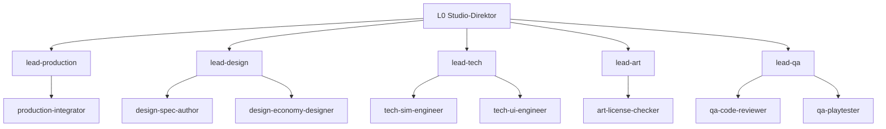

# Studio-Handbuch Inselreich

Verbindliche Betriebsanleitung für alle Agenten des Studios. Bei Widerspruch zwischen einer Persona,
einem Briefing und diesem Handbuch gilt das Handbuch. Regeln ändern darf nur der Nutzer.

Begleitdokumente: [gates.md](gates.md) · [roster.md](roster.md) · [rulings.md](rulings.md) ·
[state.md](state.md) · [herkunft.md](herkunft.md) · [Vorlagen](templates/) · Architektur der
Hierarchie: [ADR-007](../adr/ADR-007-studio-hierarchie.md), Telemetrie:
[ADR-008](../adr/ADR-008-studio-telemetrie.md).

## Organisation

Drei Ebenen. Die Hauptsession ist **L0 Studio-Direktor** (Rolle `studio-director`): Sie spricht mit
dem Nutzer, gibt Budgets frei, entscheidet Gates und Konflikte und macht **keine inhaltliche Arbeit
selbst**. **L1 Leads** zerlegen, briefen, nehmen ab und berichten. **L2 Arbeiter** setzen um.



| Lead              | Bereich                                                  | Arbeiter aktiv                                  | Auf Abruf                                                                       |
| ----------------- | -------------------------------------------------------- | ----------------------------------------------- | ------------------------------------------------------------------------------- |
| `lead-production` | Board, Budget-Überblick, Merges, Onboarding neuer Rollen | `production-integrator`                         | `production-studio-ops`, `production-onboarding-analyst`, `production-chronist` |
| `lead-design`     | Spielerlebnis, Regeln, Wirtschaft, Specs                 | `design-spec-author`, `design-economy-designer` | `design-genre-researcher`, `design-balancing-analyst`                           |
| `lead-tech`       | Architektur, Pläne, Umsetzung `src/`                     | `tech-sim-engineer`, `tech-ui-engineer`         | `tech-save-engineer`, `tech-plan-architect`                                     |
| `lead-art`        | Grafik und Audio, Asset-Lizenzen, CREDITS                | `art-license-checker`                           | `art-asset-scout`, `art-rendering-engineer`, `art-audio-engineer`               |
| `lead-qa`         | Reviews, Playtests, Determinismus, Regression            | `qa-code-reviewer`, `qa-playtester`             | `qa-determinism-checker`                                                        |

Einzeiler je Rolle, Modelle und Anlage neuer Personas: [roster.md](roster.md). Namensschema (R11):
L1 `lead-<bereich>`, L2 `<bereich>-<rolle>`, Bereiche `production`, `design`, `tech`, `art`, `qa`.
Das Dashboard leitet Ebene und Bereich aus dem Namen ab — keine anderen Namen verwenden.

## Entscheidungsbefugnisse

| Wer         | Entscheidet selbst                                                                                                                      | Muss fragen                                         |
| ----------- | --------------------------------------------------------------------------------------------------------------------------------------- | --------------------------------------------------- |
| L2 Arbeiter | Umsetzung innerhalb des Briefings                                                                                                       | Lead: alles ausserhalb Scope/Ownership              |
| L1 Lead     | Zerlegung, Briefings, Modellwahl, Abnahme der Arbeiter, Querabstimmung, Budgetverteilung innerhalb der Freigabe                         | L0: Mehrbudget, Konflikte zwischen Bereichen, Gates |
| L0 Direktor | Gates Brainstorming/Spec/Plan/Merge, Budgetfreigaben, Konflikte, Prozessstufe, Rulings                                                  | Nutzer: siehe [unten](#was-den-nutzer-betrifft)     |
| **Nutzer**  | neue Laufzeit-Abhängigkeiten, Folgeissues, Lizenz-Grenzfälle, Änderung von Handbuch-Regeln, Richtungswechsel des Spiels, Push-Ausnahmen | —                                                   |

Wer unsicher ist, ob etwas in seine Befugnis fällt, fragt eine Ebene höher — mit Empfehlung.

## Kommunikation

- **Berichtsweg L2 → L1 → L0.** L0 sieht nur Lead-Berichte, nie Arbeiter-Ausgaben direkt.
- **Vordergrund-Regel:** Leads starten Arbeiter immer mit `run_in_background: false`; parallel =
  mehrere Agent-Aufrufe in einer Nachricht; Arbeiter starten keine Agenten; L0 darf Leads im
  Hintergrund starten. (Ein Lead, der nicht wartet, beendet sich, und der Arbeiterbericht landet
  bei L0 statt beim Lead — siehe ADR-007.)
- **Querabstimmung** zwischen Leads: Übergabedokument nach
  [templates/uebergabe.md](templates/uebergabe.md) unter `.studio/handoffs/<datum>-<von>-<an>.md`
  (gitignored, Arbeitsstand). Ergebnisse mit Bestand gehören in Spec, Plan oder Ruling.
  `SendMessage` nur an laufende Agenten; ein beendeter Agent wird neu gestartet und gebrieft.
- **Eskalation:** Konflikt zwischen Bereichen → beide Leads melden ihre Sicht an L0 → L0 entscheidet
  und schreibt ein Ruling. Ein Arbeiter eskaliert nur an seinen Lead.
- **Bericht** (≤ ~15 Zeilen, [templates/bericht.md](templates/bericht.md)): Ergebnis ·
  Entscheidungsbedarf mit Empfehlung · Risiken · Befunde ausserhalb Scope (→
  `docs/beobachtungen.md`) · Budget verbraucht/frei · Status. Details stehen in Dateien, der
  Bericht nennt die Pfade.

## Briefing-Standard

Jede Delegation (L0 → L1 und L1 → L2) nutzt [templates/briefing.md](templates/briefing.md). Die
ersten Zeilen sind immer die Kopfzeilen für die Telemetrie:

```text
Persona: <rolle>
Paket: <id>
```

Pflichtpunkte:

1. Persona und Expertise
2. Ziel in einem Satz + warum es fürs Spielerlebnis zählt
3. Kontext (nur nötige Dateien)
4. Deliverable mit Ablageort
5. Definition of Done
6. Grenzen und Datei-Ownership
7. Schnittstellen
8. Logging-Pflicht

Die festen Regeln stehen in jedem Briefing wörtlich (Block aus [Feste Regeln](#feste-regeln)).
Für Rollen „auf Abruf" ohne Persona-Datei: `general-purpose` starten, `Persona:`-Kopfzeile setzen
und den Persona-Text aus roster.md ins Briefing schreiben.

## Modellwahl

Modellstufen zentral hier (R10); Aliase statt fester Modell-IDs.

| Stufe  | Alias    | Einsatz                                                        |
| ------ | -------- | -------------------------------------------------------------- |
| stark  | `opus`   | Leads, Design, Lizenzprüfung, Final-Reviews                    |
| mittel | `sonnet` | spezifizierte Umsetzung, Recherche, Task-Reviews               |
| klein  | `haiku`  | mechanische Prüfungen (Formatierung, Links, Listen abgleichen) |

Die Persona-Frontmatter legt das Standardmodell fest. Weicht ein Einsatz davon ab (z. B.
`qa-code-reviewer` für das Final-Review), steht das Modell **explizit im Agent-Aufruf** (`model`)
und in der Kopfzeile `Modell:` des Briefings.

## Budget

- **Einheit:** Anzahl L2-Starts und maximale Parallelität (gleichzeitig laufende Arbeiter).
- **Freigabe:** L0 gibt je Lead und Phase frei und loggt sie:
  `python3 tools/studio/log.py budget --lead lead-tech --grant 15 --parallel 2 --phase M5-umsetzung`.
  Weitere Freigaben derselben Phase addieren sich. Leads verteilen innerhalb ihrer Freigabe selbst.
- **Formel Umsetzung:** `Pakete × 2 + QA-Checks + 1 Final-Review`, darauf 30 % Puffer, aufgerundet.
  Beispiel: 4 Pakete, 2 UI-Checks → 8 + 2 + 1 = 11 → × 1,3 = 14,3 → **15**. Der Puffer deckt
  Fix-Runden. Der Tech-Lead stellt den Antrag für die ganze Umsetzungsphase; L0 teilt die
  Freigabe auf (Final-Review an `lead-qa`, Rest an `lead-tech`).
- **Mehrbedarf:** vor dem Überschreiten per [templates/budgetantrag.md](templates/budgetantrag.md)
  an L0. Ohne Freigabe kein weiterer Start.
- **Zählung:** Das Dashboard zählt Starts, Parallelität und Modellmix automatisch über die Hooks
  und markiert Überschreitungen rot. Leads nennen „verbraucht/frei" trotzdem in jedem Bericht.

## Gates und Dokumentation

Vier Gates, jeweils von L0 entschieden; Prüffragen, Rollen und Urteile in [gates.md](gates.md):

| Gate          | Nach                              | Prüfen                           |
| ------------- | --------------------------------- | -------------------------------- |
| Brainstorming | Designvorschlag des Design-Leads  | `lead-design`                    |
| Spec          | Spec in `docs/superpowers/specs/` | `lead-tech`, `lead-qa`           |
| Plan          | Plan in `docs/superpowers/plans/` | `lead-qa`, `lead-production`     |
| Merge         | Final-Review der Umsetzung        | `lead-qa`, bei Assets `lead-art` |

Urteile: **OK / BEDENKEN [Liste] / ZURÜCK [Grund]**. L0 entscheidet und dokumentiert:

- **Jede Entscheidung** (Gate, Konflikt, Budget-Ausnahme, bewusste Balancing-Änderung) als Ruling in
  [rulings.md](rulings.md), Format `Ruling: <was> — <warum> — <Kosten bei Irrtum>`
  ([templates/ruling.md](templates/ruling.md)), neueste unten.
- **ADR** unter `docs/adr/`, wo es ein „Warum" mit Bestand gibt (Architektur, Formate,
  Abhängigkeiten, Organisation).
- Der superpowers-Ledger unter `.superpowers/sdd/` bleibt Arbeitsdatei (gitignored, wird gelöscht).
  Rulings daraus überträgt der Tech-Lead beim Abschluss nach `rulings.md`.

## Prozessstufen

L0 stuft jeden Auftrag ein (R2) und nennt die Stufe im Briefing. Hochstufen ist jederzeit möglich
(L0 selbst oder auf Antrag eines Leads); herabgestuft wird nicht mitten im Auftrag.

- **leicht (Standard):** Auftrag ≤ 1 Session, ≤ 3 Pakete, keine Architekturänderung. Brainstorming
  als Kurzdesign im Bericht des Design-Leads, Plan im Tech-Bericht, dann Umsetzung mit Review je
  Paket. Gates Spec und Plan fallen zu einem Gate zusammen.
- **voll:** neue Systeme, Save-Format, Architektur, Meilensteine. superpowers-Ablauf komplett:
  brainstorming → Spec (`docs/superpowers/specs/`) → writing-plans (`docs/superpowers/plans/`) →
  subagent-driven-development → Final-Review.

Auch in der leichten Stufe gilt: nie direkt in die Implementierung springen; ohne Gate kein Code.

## Umsetzungszyklus

Ablauf eines Meilensteins (Stufe voll):

1. Nutzer-Auftrag → L0 gibt Design ein Budget frei → Design-Lead (superpowers:brainstorming, L0 ist
   der Gesprächspartner) → Bericht mit Designvorschlag → **Gate Brainstorming** (L0).
2. Design-Lead schreibt Spec → **Gate Spec** (L0, Prüfung nach gates.md, Tech-Lead und QA-Lead
   geben ihr Urteil ab).
3. Tech-Lead schreibt Plan (superpowers:writing-plans) inkl. Datei-Ownership und Budgetantrag →
   **Gate Plan** (L0).
4. Tech-Lead führt aus (superpowers:subagent-driven-development als Controller, im Worktree):
   Implementierer (`tech-*`) + Task-Review durch `qa-code-reviewer`; UI-Pakete zusätzlich
   Browser-Check durch `qa-playtester`. Art-Pakete parallel durch den Art-Lead in eigenem Worktree.
5. QA-Lead: Final-Review (`opus`) + Determinismus/Regression → Bericht.
6. **Gate Merge** (L0) → Production-Lead lässt `production-integrator` seriell mergen, CI und Pages
   prüfen.

Regeln dazu:

- **Worktrees (R7):** `.worktrees/<strang>` (gitignored), ein Worktree je parallelem Arbeitsstrang,
  nicht je Agent. Nie zwei Implementierer gleichzeitig im selben Baum; Fix-Runden laufen im selben
  Baum wie das Paket. Der Plan legt je Strang die **Datei-Ownership** fest; niemand ändert Dateien
  eines anderen Strangs.
- **Je Task:** Implementierer + `qa-code-reviewer` (Spec-Konformität und Qualität, Urteil
  OK/BEDENKEN/ZURÜCK). Der Tech-Lead ist Controller und darf dafür die QA-Arbeiter starten; ihren
  Qualitätsmassstab verantwortet der QA-Lead.
- **Je UI-Task:** zusätzlich `qa-playtester` (Browser-Check, Screenshots unter `.studio/qa/<paket>/`,
  Bericht nach [templates/playtest-report.md](templates/playtest-report.md)).
- **Final-Review:** durch QA auf `opus` über die ganze Branch, inkl. Balancing-Test und
  Determinismus (gleicher Seed → gleicher Zustand).
- **Merge:** nur nach dem L0-Merge-Gate, seriell (ein Strang nach dem anderen) durch
  `production-integrator`: `make check` vor und nach dem Merge, `git merge --no-ff`, Push nur laut
  Freigabe im Briefing, danach CI-Status (`gh run list --branch main --limit 3`) und
  Pages-Deploy prüfen. Bei Konflikten stoppen und melden; nie `--force`, nie `reset --hard`.

## Feste Regeln

Diesen Block wörtlich in jedes Briefing kopieren:

```text
Feste Regeln (unverändert, gelten immer):
- Keine neuen Laufzeit-Abhängigkeiten ohne Nutzer-Freigabe (Assets sind keine Dependencies).
- `src/sim` DOM-frei, Zufall nur über den seeded RNG.
- Save-Format versionieren und migrieren, mit Test für alte Spielstände.
- Tests grün, Balancing-Test bleibt Regressionsschutz, bewusste Änderungen als Ruling.
- Befunde ausserhalb Scope nach `docs/beobachtungen.md`, keine Folgeissues ohne Nutzer-OK.
```

## Asset- und Inspirationsregeln

Grundlage: [ADR-006](../adr/ADR-006-offene-lizenzen.md). Nachweis in
[docs/CREDITS.md](../CREDITS.md), Lizenztexte in [docs/licenses/](../licenses/).

- Mechaniken, Regeln und Ideen anderer Spiele sind frei.
- Keine Grafik, Musik, Sounds, Texte, Namen oder Marken aus kommerziellen oder unfreien Spielen.
- Erlaubt: CC0, CC-BY, CC-BY-SA, MIT, OFL o. ä. Nicht erlaubt: NC, ND, GPL-Zwang für Assets,
  „free for personal use".
- Lizenz **vor** dem Einbau prüfen; `art-license-checker` hat Veto. Grenzfälle entscheidet der
  Nutzer.
- Nachweis in `docs/CREDITS.md`, Lizenztext in `docs/licenses/`, Attribution im Spiel.
- Assets unter `public/`, Gesamtgrösse im Blick.
- Ohne passende Quelle: prozedural bzw. synthetisch erzeugen.

## Logging-Pflicht

Wer lebt, sieht das Dashboard ohnehin; **was** ein Agent tut, worauf er wartet und was er
geliefert hat, sieht es nur, wenn er loggt. Die Hooks (`.claude/settings.json` →
`tools/studio/hook.py`) erfassen **automatisch**: Session-Start/-Ende, Nutzer-Prompts, Turn-Ende,
Start und Stop jedes Subagenten, Eltern-Kind-Zuordnung und jeden Tool-Aufruf als Lebenszeichen.
**Explizit** loggt jeder Agent seinen Status mit `tools/studio/log.py` — immer als eigener
Bash-Aufruf, damit der Hook ihn dem richtigen Agenten zuordnet.

Befehlsreferenz:

```bash
# Status (Werte: active, delegated, waiting, blocked, idle, done, failed, ended)
python3 tools/studio/log.py status --role lead-tech --status active --task "Plan M5 schreiben" --package M5-plan
python3 tools/studio/log.py status --role tech-sim-engineer --status done --summary "Warenfluss-Test grün" --package M5-02

# Budget (nur L0)
python3 tools/studio/log.py budget --lead lead-tech --grant 15 --parallel 2 --phase M5-umsetzung

# Paket (Status: open, active, review, blocked, done)
python3 tools/studio/log.py package --id M5-02 --title "Warenfluss" --owner lead-tech --status active --blocked-by M5-01 --milestone M5

# Entscheid öffnen und lösen
python3 tools/studio/log.py decision --id D-012 --for l0 --question "Budget +4 für Fix-Runden?" --recommendation "Ja, 2 Reviews ZURÜCK" --from lead-tech
python3 tools/studio/log.py decision --id D-012 --resolution "Freigegeben, +4"

# Ereignisdatei archivieren (gleich wie make studio-archive)
python3 tools/studio/log.py archive
```

Wann wer loggt:

| Anlass                             | Wer                  | Aufruf                                                |
| ---------------------------------- | -------------------- | ----------------------------------------------------- |
| Arbeitsbeginn                      | jeder Agent          | `status --status active --task "<Auftrag>"`           |
| vor dem Starten von Arbeitern      | Leads, L0            | `status --status delegated`                           |
| Warten auf Antwort / Hindernis     | jeder Agent          | `status --status waiting` bzw. `blocked` mit `--task` |
| Abschluss                          | jeder Agent          | `status --status done --summary "<Ergebnis>"`         |
| Abbruch, Auftrag nicht erfüllbar   | jeder Agent          | `status --status failed --summary "<Grund>"`          |
| Budgetfreigabe                     | L0                   | `budget …`                                            |
| Paket angelegt / Statuswechsel     | L0, zuständiger Lead | `package …`                                           |
| Frage an L0 oder Nutzer, Entscheid | fragende Stelle, L0  | `decision …`                                          |

`idle` (L0 wartet auf den Nutzer) und `ended` (Session-Ende) setzen die Hooks. Als inaktiv markiert
das Dashboard Knoten ohne Lebenszeichen seit 5 Minuten (`STUDIO_INACTIVE_SECONDS`), ausser `idle`
und Knoten mit aktiven Kindern (R9). Dashboard: `make studio` (URL `http://127.0.0.1:8765/`),
beenden mit `make studio-stop`, Ereignisse archivieren mit `make studio-archive`.

## Was den Nutzer betrifft

- L0 fragt den Nutzer **nur** bei: neuen Laufzeit-Abhängigkeiten, Folgeissues, Lizenz-Grenzfällen
  und allen anderen Entscheiden, die laut [Befugnistabelle](#entscheidungsbefugnisse) dem Nutzer
  gehören (Handbuch-Regeln, Richtungswechsel des Spiels, Push-Ausnahmen).
- Alles andere entscheidet L0 selbst, schreibt ein Ruling und berichtet.
- Eine Nutzerfrage ist konkret: Frage · Optionen mit Folgen · Empfehlung. Offene Nutzer-Entscheide
  werden geloggt (`log.py decision --for user …`) und nach der Antwort mit `--resolution`
  geschlossen; bis dahin stehen sie in `state.md`.
- Der Nutzer ist Einsteiger: Berichte an ihn erklären Fachbegriffe kurz und nennen, was als
  Nächstes passiert.

## Session-Start und -Ende

**Start** (zusätzlich zur gemeinsamen „wir starten"-Routine aus `../CLAUDE.md`):

1. `docs/studio/STUDIO.md` und `docs/studio/state.md` lesen.
2. `python3 tools/studio/log.py status --role studio-director --status active --task "Session-Start"`.
3. `make studio` ausführen und dem Nutzer die Dashboard-URL nennen.
4. In wenigen Zeilen zeigen: Projekt und Phase, laufende und pausierte Pakete, offene Entscheide
   (L0 und Nutzer), Budgetstand.
5. Auf den Auftrag warten oder den laufenden Plan fortsetzen (pausierte Pakete neu briefen; der
   Stand steht in `state.md` und in den Übergaben unter `.studio/handoffs/`).

**Ende:**

1. Laufende Leads abschliessen oder pausieren: Lead meldet Zwischenstand (Bericht, bei Bedarf
   Übergabe unter `.studio/handoffs/`) und loggt `status --status done --summary "Pausiert: <Stand>"`;
   Pakete bleiben auf ihrem Status.
2. Offene Rulings in `rulings.md`, Befunde in `docs/beobachtungen.md` sind eingetragen.
3. `docs/studio/state.md` nachführen: Projekt und Phase, laufende/pausierte Pakete mit Worktree und
   nächstem Schritt, Budget (frei/verbraucht je Lead), offene Entscheide L0/Nutzer, nächste
   Schritte, Stand-Datum. Committen (`docs: …`).
4. `python3 tools/studio/log.py status --role studio-director --status done --summary "<Kurzbericht>"`.
5. Kurzbericht an den Nutzer; danach Skill `session-wrap-up` (Push-Regeln).
