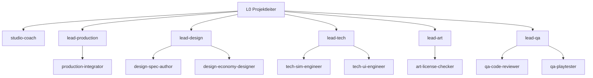
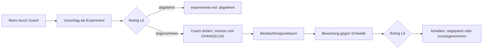

# Studio-Handbuch Inselreich

Version: 1.0 · Stand: 2026-09-30 · Änderungen nur über den Verbesserungsprozess (siehe unten), Verlauf in [CHANGELOG.md](CHANGELOG.md)

Verbindliche Betriebsanleitung für alle Agenten des Studios. Rangfolge: **Verfassung > Handbuch >
Persona > Briefing** — bei Widerspruch gilt die höhere Stufe. Die [Verfassung](VERFASSUNG.md)
enthält die Regeln des Nutzers (feste Regeln, Asset- und Lizenzregeln, Vorbehalte, verbotene
Aktionen, Qualitätssicherung); sie ändert nur der Nutzer. Dieses Handbuch regelt, **wie** das Team
arbeitet, und ändert sich nur über die [Verbesserungsschleife](#verbesserungsschleife).

Begleitdokumente: [VERFASSUNG.md](VERFASSUNG.md) · [CHANGELOG.md](CHANGELOG.md) ·
[warteschlange.md](warteschlange.md) · [experimente.md](experimente.md) · [lernen.md](lernen.md) ·
[retros/](retros/) · [metriken/](metriken/) · [gates.md](gates.md) · [roster.md](roster.md) ·
[rulings.md](rulings.md) · [state.md](state.md) · [herkunft.md](herkunft.md) ·
[Vorlagen](templates/) · Architektur der Hierarchie:
[ADR-007](../adr/ADR-007-studio-hierarchie.md), Telemetrie:
[ADR-008](../adr/ADR-008-studio-telemetrie.md).

## Organisation

Drei Ebenen. Die Hauptsession ist **L0 Projektleiter** (Studio-Direktor, Rolle `studio-director`):
Sie ist die einzige Ansprechperson des Nutzers, gibt Budgets frei, entscheidet Gates und Konflikte
und macht **keine inhaltliche Arbeit selbst**. **L1 Leads** zerlegen, briefen, nehmen ab und
berichten. **L2 Arbeiter** setzen um. Der **`studio-coach`** ist eine Stabsstelle auf L1 direkt
unter L0: Er wertet aus und verbessert die Arbeitsweise, arbeitet aber nie an Spiel oder Doku.



| Lead              | Bereich                                                  | Arbeiter aktiv                                  | Auf Abruf                                                                       |
| ----------------- | -------------------------------------------------------- | ----------------------------------------------- | ------------------------------------------------------------------------------- |
| `studio-coach`    | Auswertung, Retros, Experimente, lernen.md               | keine Arbeiter                                  | —                                                                               |
| `lead-production` | Board, Budget-Überblick, Merges, Onboarding neuer Rollen | `production-integrator`                         | `production-studio-ops`, `production-onboarding-analyst`, `production-chronist` |
| `lead-design`     | Spielerlebnis, Regeln, Wirtschaft, Specs                 | `design-spec-author`, `design-economy-designer` | `design-genre-researcher`, `design-balancing-analyst`                           |
| `lead-tech`       | Architektur, Pläne, Umsetzung `src/`                     | `tech-sim-engineer`, `tech-ui-engineer`         | `tech-save-engineer`, `tech-plan-architect`                                     |
| `lead-art`        | Grafik und Audio, Asset-Lizenzen, CREDITS                | `art-license-checker`                           | `art-asset-scout`, `art-rendering-engineer`, `art-audio-engineer`               |
| `lead-qa`         | Reviews, Playtests, Determinismus, Regression            | `qa-code-reviewer`, `qa-playtester`             | `qa-determinism-checker`                                                        |

Einzeiler je Rolle, Modelle und Anlage neuer Personas: [roster.md](roster.md). Namensschema (R11,
erweitert): L1 `lead-<bereich>`, L1-Stabsstelle `studio-<rolle>`, L2 `<bereich>-<rolle>`, Bereiche
`production`, `design`, `tech`, `art`, `qa`, `studio`. Das Dashboard leitet Ebene und Bereich aus dem
Namen ab — keine anderen Namen verwenden.

## Entscheidungsbefugnisse

| Wer              | Entscheidet selbst                                                                                                                                                                                          | Muss vorlegen                                                 |
| ---------------- | ----------------------------------------------------------------------------------------------------------------------------------------------------------------------------------------------------------- | ------------------------------------------------------------- |
| L2 Arbeiter      | Umsetzung innerhalb des Briefings                                                                                                                                                                           | Lead: alles ausserhalb Scope/Ownership                        |
| L1 Lead          | Zerlegung, Briefings, Modellwahl, Abnahme der Arbeiter, Querabstimmung, Budgetverteilung innerhalb der Freigabe                                                                                             | L0: Mehrbudget, Konflikte zwischen Bereichen, Gates           |
| `studio-coach`   | Retro-Format und Auswertungsmethode                                                                                                                                                                         | L0: jede Regeländerung (als Experiment)                       |
| L0 Projektleiter | Gates Brainstorming/Spec/Plan/Merge, Budgetfreigaben, Konflikte, Prozessstufe, Rulings, Auslegung von Nutzer-Anweisungen (Ruling), Experimente annehmen/ablehnen, nächster Meilenstein aus dem Spielkonzept | Nutzer: nur die Vorbehalte, per Warteschlange (nie Rückfrage) |
| **Nutzer**       | Vorbehalte laut [Verfassung §5](VERFASSUNG.md#5-autonomie-und-nutzerentscheid-warteschlange) (Warteschlange)                                                                                                | —                                                             |

Leads, Stabsstelle und Arbeiter, die unsicher sind, ob etwas in ihre Befugnis fällt, fragen eine
Ebene höher — mit Empfehlung. L0 fragt den Nutzer nicht zurück (Abschnitt [Autonomie](#autonomie)).

## Kommunikation

- **Berichtsweg L2 → L1 → L0.** L0 sieht nur Lead- und Coach-Berichte, nie Arbeiter-Ausgaben direkt.
  Nur L0 spricht mit dem Nutzer (Verfassung §2).
- **Vordergrund-Regel:** Leads starten Arbeiter immer mit `run_in_background: false`; parallel =
  mehrere Agent-Aufrufe in einer Nachricht; Arbeiter starten keine Agenten; L0 darf Leads im
  Hintergrund starten. (Ein Lead, der nicht wartet, beendet sich, und der Arbeiterbericht landet
  bei L0 statt beim Lead — siehe ADR-007.)
- **Querabstimmung** zwischen Leads: Übergabedokument nach
  [templates/uebergabe.md](templates/uebergabe.md) unter
  `<Hauptrepo>/.studio/handoffs/<datum>-<von>-<an>.md` (gitignored, Arbeitsstand; nicht im
  Worktree, Hauptrepo via `git rev-parse --git-common-dir`). Ergebnisse mit Bestand gehören in
  Spec, Plan oder Ruling.
- **Fortsetzen statt neu starten:** Fix-Runden und Rückfragen setzen **denselben** Agenten per
  `SendMessage` fort — auch einen bereits beendeten; sein Kontext bleibt vollständig erhalten. Nur
  ein neuer Agent-Start verliert den Kontext und braucht ein vollständiges Briefing. Eine
  Fortsetzung zählt im Budget nicht als neuer Start.
- **Eskalation:** Konflikt zwischen Bereichen → beide Leads melden ihre Sicht an L0 → L0 entscheidet
  und schreibt ein Ruling. Ein Arbeiter eskaliert nur an seinen Lead.
- **Bericht** (≤ ~15 Zeilen, [templates/bericht.md](templates/bericht.md)): Ergebnis ·
  Entscheidungsbedarf mit Empfehlung · Risiken · Befunde ausserhalb Scope (→
  `docs/beobachtungen.md`) · Budget verbraucht/frei · Aufwand · Status. Details stehen in Dateien,
  der Bericht nennt die Pfade.

## Briefing-Standard

Jede Delegation (L0 → L1 und L1 → L2) nutzt [templates/briefing.md](templates/briefing.md). Die
ersten Zeilen sind immer die Kopfzeilen für die Telemetrie (Pflicht bei jeder Delegation):

```text
Persona: <rolle>
Paket: <id>
Meilenstein: <id>
Schätzung: <n> min, <m> Tools
```

- `Meilenstein` ordnet den Aufwand einem Meilenstein zu (ohne laufenden Meilenstein: `ohne`).
- `Schätzung` ist eine **Schätzung** für den ganzen Auftrag inklusive aller Unteraufträge, kein
  Messwert. Das Dashboard stellt sie der gemessenen Dauer und den Tool-Aufrufen gegenüber.

Pflichtpunkte:

1. Persona und Expertise
2. Ziel in einem Satz + warum es fürs Spielerlebnis zählt
3. Kontext (nur nötige Dateien)
4. Deliverable mit Ablageort
5. Definition of Done
6. Grenzen und Datei-Ownership
7. Schnittstellen
8. Logging-Pflicht

Den Block ‚Feste Regeln' aus [VERFASSUNG.md §3](VERFASSUNG.md#3-feste-regeln) wörtlich in jedes
Briefing kopieren.

Für Rollen „auf Abruf" ohne Persona-Datei: `general-purpose` starten, `Persona:`-Kopfzeile setzen,
den Einzeiler aus roster.md zu den Abschnitten von [templates/persona.md](templates/persona.md)
ausbauen und ins Briefing schreiben. Das Modell **explizit im Agent-Aufruf** setzen (Vorschlag in
roster.md) — sonst erbt der Agent das Modell der Session.

## Modellwahl

Modellstufen zentral hier (R10); Aliase statt fester Modell-IDs.

| Stufe  | Alias    | Einsatz                                                        |
| ------ | -------- | -------------------------------------------------------------- |
| stark  | `opus`   | Leads, Studio-Coach, Design, Lizenzprüfung, Final-Reviews      |
| mittel | `sonnet` | spezifizierte Umsetzung, Recherche, Task-Reviews               |
| klein  | `haiku`  | mechanische Prüfungen (Formatierung, Links, Listen abgleichen) |

Die Persona-Frontmatter legt das Standardmodell fest. Weicht ein Einsatz davon ab (z. B.
`qa-code-reviewer` für das Final-Review), steht das Modell **explizit im Agent-Aufruf** (`model`)
und in der Kopfzeile `Modell:` des Briefings.

## Budget

- **Einheit:** Anzahl L2-Starts und maximale Parallelität (gleichzeitig laufende Arbeiter).
- **Freigabe:** L0 gibt je Lead und Phase frei und loggt sie (`log.py budget`, Beispiel unten).
  Weitere Freigaben derselben Phase addieren sich. Leads verteilen innerhalb ihrer Freigabe selbst.
- **Formel Umsetzung:** `Pakete × 2 + QA-Checks + 1 Final-Review`, darauf 30 % Puffer, aufgerundet.
  Beispiel: 4 Pakete, 2 UI-Checks → 8 + 2 + 1 = 11 → × 1,3 = 14,3 → **15**. Der Puffer deckt
  Neustarts und Zusatzprüfungen; Fix-Runden per `SendMessage` zählen nicht als Start. Der Tech-Lead
  stellt den Antrag für die ganze Umsetzungsphase; L0 teilt die Freigabe auf (Stufe voll:
  Final-Review an `lead-qa`, Rest an `lead-tech`):

  ```bash
  python3 tools/studio/log.py budget --lead lead-tech --grant 14 --parallel 2 --phase M5-umsetzung
  python3 tools/studio/log.py budget --lead lead-qa --grant 1 --parallel 1 --phase M5-umsetzung
  ```

  In der Stufe leicht startet der Tech-Lead auch das abschliessende `opus`-Review; die ganze
  Freigabe geht an `lead-tech`.

- **Studio-Coach:** Der Coach bekommt je Retro 1 Start (Stabsstelle, ohne Arbeiter).
- **Mehrbedarf:** vor dem Überschreiten per [templates/budgetantrag.md](templates/budgetantrag.md)
  an L0. Ohne Freigabe kein weiterer Start.
- **Zählung:** Das Dashboard zählt Starts, Parallelität und Modellmix automatisch über die Hooks
  und markiert Überschreitungen rot. Leads nennen „verbraucht/frei" trotzdem in jedem Bericht.
  Verbrauch über 1,5 × Freigabe ist ein Vorfall (`budget:<lead>:<phase>`) und löst eine Ad-hoc-Retro
  aus.

## Gates und Dokumentation

Vier Gates in der Stufe voll, zwei in der Stufe leicht (kombiniertes Gate und Merge), jeweils von
L0 entschieden; Prüffragen, Rollen und Urteile in [gates.md](gates.md):

| Gate                                | Nach                                              | Prüfen                                                       |
| ----------------------------------- | ------------------------------------------------- | ------------------------------------------------------------ |
| Brainstorming                       | Designvorschlag des Design-Leads                  | `lead-design`                                                |
| Spec                                | Spec in `docs/superpowers/specs/`                 | `lead-tech`, `lead-qa`                                       |
| Plan                                | Plan in `docs/superpowers/plans/`                 | `lead-qa`, `lead-production`                                 |
| Spec/Plan kombiniert (Stufe leicht) | Kurzdesign und Plan in den Berichten              | `lead-qa`; Ownership, Budget, Abhängigkeiten prüft L0 selbst |
| Merge                               | Final-Review aller Stränge (eines je Meilenstein) | `lead-qa`, bei Assets `lead-art`                             |

Urteile: **OK / BEDENKEN [Liste] / ZURÜCK [Grund]**. L0 entscheidet und dokumentiert:

- **Jede Entscheidung** (Gate, Konflikt, Budget-Ausnahme, bewusste Balancing-Änderung, Auslegung
  einer Nutzer-Anweisung, Experiment) als Ruling in [rulings.md](rulings.md), Format
  `Ruling: <was> — <warum> — <Kosten bei Irrtum>` ([templates/ruling.md](templates/ruling.md)),
  neueste unten.
- **ADR** unter `docs/adr/`, wo es ein „Warum" mit Bestand gibt (Architektur, Formate,
  Abhängigkeiten, Organisation).
- Der superpowers-Ledger unter `.superpowers/sdd/` bleibt Arbeitsdatei (gitignored, wird gelöscht).
  Rulings daraus überträgt der Tech-Lead beim Abschluss nach `rulings.md`.

## Prozessstufen

L0 stuft jeden Auftrag ein (R2) und nennt die Stufe im Briefing. Hochstufen ist jederzeit möglich
(L0 selbst oder auf Antrag eines Leads); herabgestuft wird nicht mitten im Auftrag.

- **leicht (Standard):** Auftrag ≤ 1 Session, ≤ 3 Pakete, keine Architekturänderung. Brainstorming
  als Kurzdesign im Bericht des Design-Leads, Plan im Tech-Bericht, dann Umsetzung mit Review je
  Paket. Gates Brainstorming, Spec und Plan fallen zu **einem** kombinierten Gate zusammen. Ablauf:
  [Umsetzungszyklus](#umsetzungszyklus).
- **voll:** neue Systeme, Save-Format, Architektur, Meilensteine. superpowers-Ablauf komplett:
  brainstorming → Spec (`docs/superpowers/specs/`) → writing-plans (`docs/superpowers/plans/`) →
  subagent-driven-development → Final-Review.

Auch in der leichten Stufe gilt: nie direkt in die Implementierung springen; ohne Gate kein Code.

## Umsetzungszyklus

Ablauf eines Meilensteins (Stufe voll):

1. Auftrag (vom Nutzer oder von L0 aus dem Spielkonzept gewählt) → L0 startet den Meilenstein
   (`log.py milestone --id M5 --status start --title "…"`) und gibt Design ein Budget frei →
   Design-Lead (superpowers:brainstorming, L0 ist der Gesprächspartner) → Bericht mit
   Designvorschlag → **Gate Brainstorming** (L0). Rückfragen-Runde: Der Design-Lead bündelt seine
   Fragen im Bericht, je Frage mit Empfehlung. L0 beantwortet sie per `SendMessage` an denselben
   Lead (Kontext bleibt erhalten). Berührt eine Frage einen Nutzer-Vorbehalt, kommt sie in die
   [Warteschlange](#autonomie); die übrigen Fragen gehen weiter. Das wiederholt sich, bis der
   Designvorschlag steht.
2. Design-Lead schreibt Spec → **Gate Spec** (L0, Prüfung nach gates.md, Tech-Lead und QA-Lead
   geben ihr Urteil ab).
3. Tech-Lead schreibt Plan (superpowers:writing-plans) inkl. Datei-Ownership und Budgetantrag →
   **Gate Plan** (L0).
4. Tech-Lead führt aus (superpowers:subagent-driven-development als Controller, im Worktree):
   Implementierer (`tech-*`) + Task-Review durch `qa-code-reviewer`; UI-Pakete zusätzlich
   Browser-Check durch `qa-playtester`. Art-Pakete parallel durch den Art-Lead in eigenem Worktree.
5. QA-Lead: Final-Review (`opus`) über alle Strang-Branches + Determinismus/Regression → Bericht.
6. **Gate Merge** (L0, eines je Meilenstein) → Production-Lead lässt `production-integrator` die
   Stränge seriell mergen, CI und Pages prüfen.
7. L0 beendet den Meilenstein (`log.py milestone --id M5 --status done`), lässt die Metriken
   verdichten (`python3 tools/studio/metrics.py --milestone M5`) und startet die Pflicht-Retro
   ([Verbesserungsschleife](#verbesserungsschleife)).

Ablauf eines Auftrags (Stufe leicht):

1. L0 gibt Design und Tech gemeinsam ein kleines Budget frei (je `log.py budget`).
2. `lead-design` liefert ein Kurzdesign im Bericht (Rückfragen wie oben per `SendMessage`).
3. `lead-tech` liefert den Plan im Bericht: Pakete, Datei-Ownership, Budgetantrag.
4. **Ein kombiniertes Gate Spec/Plan** durch L0 (Prüfung nach [gates.md](gates.md), Abschnitt
   „Kombiniertes Gate (Stufe leicht)"); danach Umsetzungsbudget freigeben.
5. Umsetzung: je Paket Implementierer + `qa-code-reviewer`, UI-Pakete zusätzlich `qa-playtester`.
   Ein Worktree genügt.
6. Kein separates Final-Review: Der letzte Task-Review läuft auf `opus` über die ganze Branch und
   zählt als Final-Review (im Budget das „+1").
7. **Gate Merge** durch L0 → `production-integrator` merged.

Regeln dazu:

- **Worktrees (R7):** `.worktrees/<strang>` (gitignored), ein Worktree je parallelem Arbeitsstrang,
  nicht je Agent. Nie zwei Implementierer gleichzeitig im selben Baum; Fix-Runden laufen im selben
  Baum wie das Paket. Der Plan legt je Strang die **Datei-Ownership** fest; niemand ändert Dateien
  eines anderen Strangs.
- **Je Task:** Implementierer + `qa-code-reviewer` (Spec-Konformität und Qualität, Urteil
  OK/BEDENKEN/ZURÜCK). Der Tech-Lead ist Controller und darf dafür die QA-Arbeiter starten; ihren
  Qualitätsmassstab verantwortet der QA-Lead. Nach der Abnahme loggt der abnehmende Lead das
  Ergebnis (`log.py result`, Abschnitt [Messung und Aufwand](#messung-und-aufwand)).
- **Je UI-Task:** zusätzlich `qa-playtester` (Browser-Check, Screenshots im **Hauptrepo** unter
  `<Hauptrepo>/.studio/qa/<paket>/`, nicht im Worktree; Bericht nach
  [templates/playtest-report.md](templates/playtest-report.md)).
- **Final-Review:** durch QA auf `opus`, einmal je Meilenstein über **alle** Strang-Branches gegen
  `main` in einer Review-Session (kombinierter Diff bzw. jeder Strang-Diff), inkl. Balancing-Test
  und Determinismus (gleicher Seed → gleicher Zustand). Nicht abschwächbar (Verfassung §9).
- **Merge:** nur nach dem einen L0-Merge-Gate des Meilensteins, seriell (ein Strang nach dem
  anderen) durch `production-integrator`: `make check` vor dem ersten Merge; je Strang
  `git merge --no-ff --no-commit`, dann `make check` — grün: Merge committen, rot:
  `git merge --abort` und melden. Push laut Verfassung §7 (`make check` grün vor dem Push), danach
  CI-Status (`gh run list --branch main --limit 3`) und Pages-Deploy prüfen und nach jedem Push
  `python3 tools/studio/ci.py` ausführen (CI-Läufe als Studio-Events). CI rot → die Behebung
  hat Vorrang, der Vorfall löst eine Ad-hoc-Retro aus. Bei Konflikten stoppen und melden; nie
  `--force`, nie `reset --hard` (Verfassung §6).

## Autonomie

Der Projektleiter **fragt nicht zurück und wartet nie untätig** (Verfassung §5). Er entscheidet
selbst, hält jede Entscheidung als Ruling fest und arbeitet weiter.

**Ablauf ohne Rückfrage:**

1. Anweisung des Nutzers lesen. Ist sie mehrdeutig, wählt L0 die plausibelste Auslegung.
2. Auslegung als Ruling in [rulings.md](rulings.md) festhalten
   (`Ruling: Auslegung „…" als … — <warum> — <Kosten bei Irrtum>`).
3. Handeln: Auftrag einstufen, Budget freigeben, Leads briefen.
4. Berührt ein Punkt einen **Vorbehalt** des Nutzers (neue Laufzeit-Abhängigkeit, Folgeissue,
   Lizenz-Grenzfall, Änderung der Verfassung, Richtungswechsel des Spiels), kommt er in die
   Warteschlange — alles andere entscheidet L0.

**Warteschlange** ([warteschlange.md](warteschlange.md), einzige Quelle; `log.py queue` schreibt die
Datei und ein Event). Die fragende Stelle legt den Eintrag an (`queue --id … --question …`, Status
`offen`) und nennt die ID im Bericht; L0 trägt die Antwort ein (`--answer`, Status `beantwortet`)
und schliesst den Eintrag (`--done`, Status `umgesetzt`). Vollständige Aufrufe:
[Befehlsreferenz](#logging-pflicht). Die ID ist die nächste freie Nummer aus warteschlange.md
(höchste N-Nummer + 1).

**Um den Punkt herum weiterarbeiten:** Das blockierte Paket geht auf `blocked` mit Verweis auf den
Eintrag, und L0 zieht das nächste ungeblockte Paket vor:

```bash
python3 tools/studio/log.py package --id M5-03 --title "Pfadsuche" --owner lead-tech --status blocked --blocked-by N-002 --milestone M5
```

**Antworten des Nutzers** kommen in einer beliebigen Session („N-002: …" im Prompt oder die Zeile
„Antwort" in der Datei; eine dort eingetragene Antwort gilt auch bei Status `offen`, Start-Kontext
und Dashboard zeigen sie). L0 setzt sie **in jeder Session zuerst** um: Antwort eintragen
(`--answer`), umsetzen, schliessen (`--done`), blockiertes Paket wieder freigeben.

**Guard** (`tools/studio/guard.py`, PreToolUse-Hook für L0, Leads und Arbeiter; Verfassung §1.3
und §6). Er weist mit Begründung ab:

| Verboten                                    | Beispiele                                                                                                                                                         |
| ------------------------------------------- | ----------------------------------------------------------------------------------------------------------------------------------------------------------------- |
| Force-Push, Löschen entfernter Branches     | `git push --force`, `-f`, `--mirror`, `--delete`, Refspec mit `+` oder `:`                                                                                        |
| Löschen von Branches mit ungemergter Arbeit | `git branch -D`, `git branch --delete --force`                                                                                                                    |
| Umschreiben der History                     | `git rebase` (ausser `--abort`), `git reset --hard`, `filter-branch`/`filter-repo`, `reflog expire`/`reflog delete`, `update-ref -d`/`--delete`, `gc --prune=now` |
| Verlust ungesicherter Arbeit                | `git clean -f`, `git worktree remove --force`, `git stash drop`, `git stash clear`                                                                                |
| Löschen ausserhalb des Repos                | `rm`, `rmdir`, `unlink`, `find … -delete` ausserhalb des Hauptrepos (erlaubt: Temp- und Scratchpad-Ordner)                                                        |
| Schreiben auf die Verfassung und den Guard  | Edit/Write auf `VERFASSUNG.md` oder `guard.py`, schreibende Bash-Befehle, die sie nennen                                                                          |

- **Bewusst nicht verboten:** Verwerfen ungesicherter Änderungen im Arbeitsbaum
  (`git checkout -- <pfad>`, `git restore`, `git switch --discard-changes`) — das steht nicht auf
  der Liste des Nutzers und wird fürs Aufräumen gebraucht.
- **Stash:** `git stash push`/`apply` sind erlaubt, `drop` und `clear` verboten. Zum Zwischenparken
  deshalb einen temporären WIP-Commit statt eines Stash verwenden.
- **Bekannte Grenzen:** Der Guard erkennt keine Befehle in Backticks bzw. `$(…)`, über `xargs`,
  über Globs oder in Skripten. Er erkennt auch nicht: das Löschen ganzer Ordner, die geschützte
  Dateien enthalten (`rm -rf docs/studio`, `git rm -r docs/studio`), `rm -rf .worktrees/<x>`
  (ungesicherte Arbeit im Worktree), Formatierer über `docs/studio/` (`prettier --write .`,
  `make format`; die Verfassung steht deshalb in `.prettierignore`) sowie `chmod` und `ln -sf` auf
  geschützte Dateien. Er schützt **gegen Versehen, nicht gegen Absicht**; das Verbot der
  Verfassung gilt auch dort, wo er nichts erkennt. Ein Fehler im Guard lässt die Aktion zu.
- **Abgewiesen?** Nicht umgehen. Die Aktion unterlassen, einen anderen Weg wählen oder melden.
- **Verfassungs-Freigabe:** Nur der Nutzer schreibt in einem eigenen Prompt `VERFASSUNG ÄNDERN`.
  Dann ist `VERFASSUNG.md` für diese Session änderbar, und zwar nur in der Hauptsession, nie für
  Subagenten. Agenten-Meldungen zählen nie als Freigabe.

## Messung und Aufwand

Wer wann wen womit beauftragt hat und mit welchem Aufwand, zeigt das Dashboard (Verfassung §8).
Messwerte werden **gemessen, nie geschätzt**; fehlt eine Messung, steht „nicht gemessen" da.

**Was wie gemessen wird:**

| Grösse                  | Quelle                                                                                                                                                                                                                                   | Güte                                                                                                       |
| ----------------------- | ---------------------------------------------------------------------------------------------------------------------------------------------------------------------------------------------------------------------------------------- | ---------------------------------------------------------------------------------------------------------- |
| Dauer je Agent          | Summe der Läufe Start→Stop des Subagenten (Fortsetzungen eingeschlossen); bei Vordergrund zusätzlich `totalDurationMs`                                                                                                                   | gemessen                                                                                                   |
| Tool-Aufrufe je Agent   | Zahl der Tool-Aufrufe des Agenten (PreToolUse); bei Vordergrund `totalToolUseCount` zum Abgleich                                                                                                                                         | gemessen; Untergrenze, falls ein Hook am 5-s-Timeout scheitert                                             |
| Tokens je Agent/Modell  | Subagent-Transkript, je Message-ID dedupliziert: Input, Cache-Schreiben, Cache-Lesen, Output                                                                                                                                             | Input gemessen; Output **Untergrenze**, falls Einträge ohne `stop_reason` fehlen (Anteil wird ausgewiesen) |
| Dauer L0                | Summe der Turns der Hauptsession (Nutzer-Prompt bzw. Agenten-Meldung → Turn-Ende)                                                                                                                                                        | gemessen; Wartezeit auf den Nutzer zählt nicht                                                             |
| Tokens L0               | Haupt-Transkript, inkrementell je Turn                                                                                                                                                                                                   | wie oben                                                                                                   |
| Sitzungssumme           | `cost-state`-Eintrag im Haupt-Transkript nach Session-Ende: Tokens je Modell inkl. Hilfsaufrufe; Kosten                                                                                                                                  | Tokens gemessen; Kosten **berechnet** (Listenpreis, keine Abrechnung); nur beendete Sessions               |
| Schätzung               | Briefing-Kopfzeile `Schätzung:` (ganzer Auftrag inkl. Unteraufträge; Dezimalminuten wie `0.5 min` erlaubt), verglichen mit Dauer und Tool-Aufrufen des Teilbaums; hat ein Vorfahr eine Schätzung, zählt nur dessen (oberste je Teilbaum) | Schätzung, als solche markiert; fehlt → „keine Schätzung"                                                  |
| Ergebnis, Review-Runden | `log.py result` durch den abnehmenden Lead bzw. L0                                                                                                                                                                                       | erfasst; fehlt → „nicht erfasst"                                                                           |
| Fortsetzungen           | erneuter Start derselben Agent-ID (`SendMessage`)                                                                                                                                                                                        | gemessen                                                                                                   |
| CI                      | `tools/studio/ci.py` über `gh run list` (Session-Start, Session-Ende, nach Push); ein Lauf zählt für die Session, in deren Zeitraum er erstellt wurde                                                                                    | gemessen; ohne `gh` → „nicht gemessen"                                                                     |
| Eskalationen            | `decision --for l0` + Warteschlangen-Einträge                                                                                                                                                                                            | erfasst                                                                                                    |
| Inaktiv/gescheitert     | Status `failed`; Lücke ohne Lebenszeichen > `STUDIO_INACTIVE_SECONDS` bei lebendem Status                                                                                                                                                | Lücke gemessen; „inaktiv" ist eine **Heuristik** (lange Bash-Aufrufe erzeugen keine Lebenszeichen)         |

**Nicht messbar** (im Dashboard „nicht gemessen"):

- Kosten je Agent (nur die Sitzungssumme ist bekannt),
- Denkzeit ohne Tool-Aufruf,
- Tokens von Hilfsaufrufen je Agent,
- Aufwand des Nutzers.

**Ergebnis loggen (`log.py result`).** Einmal je (Paket, Arbeiter) mit dem **Endurteil**, geloggt
vom abnehmenden Lead nach jedem Arbeitsergebnis. Auch L0 loggt `result` für jeden Lead-Bericht
(`--worker` = Lead). Ein späteres Ergebnis für dasselbe Paar ersetzt das frühere. `--outcome` und
`--review-rounds` sind immer Pflicht; vollständiger Aufruf in der
[Befehlsreferenz](#logging-pflicht).

| Endurteil                                | Werte                                                     |
| ---------------------------------------- | --------------------------------------------------------- |
| beim ersten Review angenommen            | `--outcome angenommen --review-rounds 1`                  |
| nach Fix-Runden angenommen               | `--outcome nacharbeit --review-rounds <Zahl der Reviews>` |
| verworfen                                | `--outcome verworfen --review-rounds <Zahl der Reviews>`  |
| ohne Review abgenommen (zählt ungeprüft) | `--outcome angenommen --review-rounds 0`                  |

Für L0 zählt jeder Lead-Bericht als Runde: `--review-rounds` ist die Zahl der Berichte, bis L0 das
Ergebnis angenommen hat. Erster Bericht angenommen → `--outcome angenommen --review-rounds 1`; nach
einer Nachbesserung per `SendMessage` → `--outcome nacharbeit --review-rounds 2` usw.

Die **Annahmequote beim ersten Wurf** zählt `angenommen` mit `--review-rounds 1` gegen alle geprüften
Ergebnisse (`--review-rounds` ≥ 1); `--review-rounds 0` wird separat ausgewiesen und nie als Treffer
gezählt. Mehr als 3 Review-Runden in einem Paket sind ein Vorfall (`runden:<paket>`).

**Meilenstein-Zuordnung** des Aufwands, in dieser Reihenfolge: Kopfzeile `Meilenstein:` im Briefing
(bzw. `--milestone`) → Meilenstein des Pakets → Meilenstein des delegierenden Vorfahren → der zu
diesem Zeitpunkt laufende Meilenstein (`log.py milestone`, sessionübergreifend) → „ohne".

**Meilensteine:** L0 loggt Start und Ende (`log.py milestone --id M5 --status start --title "…"`
bzw. `--status done`). Das Ende löst die Pflicht-Retro aus (Vorfall `meilenstein:<id>`).

**Archiv** `.studio/archiv/` (lokal, gitignored; der alte Ordner `.studio/archive/` wird weiter
gelesen):

- `briefings/` — voller Prompt jeder Delegation,
- `berichte/` — volle Schlussmeldung jedes Agenten,
- `events/` — archivierte Event-Dateien (`make studio-archive`).

Das Dashboard verlinkt Briefings und Berichte unter `/archiv/…`.

**Verdichten:** `make studio-metrics` (letzte Session) bzw.
`python3 tools/studio/metrics.py --milestone <id>` schreibt `docs/studio/metriken/<kennung>.md`
([metriken/README.md](metriken/README.md)). Diese Dateien werden committet; sie überdauern das
lokale Archiv.

**Dashboard-Reiter** (`make studio`, URL `http://127.0.0.1:8765/`):

| Reiter     | Link          | Zeigt                                                                                           |
| ---------- | ------------- | ----------------------------------------------------------------------------------------------- |
| Live       | `#live`       | Organigramm, Pakete, offene L0-Entscheide, Nutzerentscheid-Warteschlange, Banner „Retro fällig" |
| Delegation | `#delegation` | Zeitachse wer → wen, mit Briefing- und Bericht-Links, Schätzung und Ist                         |
| Aufwand    | `#aufwand`    | Tabellen je Agent, Paket, Lead, Meilenstein, Modell; Schätzung vs. Ist                          |
| Qualität   | `#qualitaet`  | Kennzahlen, offene Vorfälle, Verlauf über die Meilensteine (aus `metriken/`)                    |
| Studio     | `#studio`     | Handbuch- und Verfassungsversion, CHANGELOG, Experimente, lernen.md, Personas mit Versionen     |

## Verbesserungsschleife

Der **`studio-coach`** (Stabsstelle, `opus`, ohne Arbeiter) wertet die Daten aus, moderiert Retros,
schlägt Experimente vor, bewertet sie und pflegt [lernen.md](lernen.md) und
[experimente.md](experimente.md). Er arbeitet nie an Spiel oder Doku und ist nicht in Production —
so benotet niemand die eigene Arbeitsweise. Angenommene Änderungen setzt er nach dem Ruling von L0
selbst um (Verfassung §10).

**Auslöser:**

| Retro       | Wann                                          | Umfang                                        |
| ----------- | --------------------------------------------- | --------------------------------------------- |
| Meilenstein | nach jedem Meilenstein (Pflicht)              | ausführlich, ≤ 1 Coach-Start                  |
| Session     | kurz am Ende jeder Session                    | ≤ 1 Coach-Start, ≤ 15 Tool-Aufrufe            |
| Ad hoc      | bei einem Vorfall (Dashboard: „Retro fällig") | wie Session-Retro, fokussiert auf den Vorfall |

Vorfälle mit stabiler ID: `failed:<agent>` (Agent gescheitert), `inaktiv:<agent>` (Agent hängt),
`ci:<run>` (CI auf `main` rot), `budget:<lead>:<phase>` (mehr als 1,5 × Freigabe verbraucht),
`runden:<paket>` (mehr als 3 Review-Runden), `meilenstein:<id>` (Meilenstein beendet). Ein Vorfall
gilt als erledigt, sobald ein `retro`-Event ihn in `--triggers` nennt.



**Ablauf:**

1. **Start:** L0 startet den Coach mit Auslöser, Vorfall-IDs und den Agent-IDs der Leads dieser
   Session (für Rückfragen per `SendMessage`).
2. **Auswerten:** Der Coach verdichtet (`metrics.py`), liest Metrik-Dateien, Berichte und Archiv
   und befragt die Leads per `SendMessage`; nicht erreichbare Leads ersetzt er durch ihre
   Archiv-Berichte.
3. **Bericht:** Retro-Bericht nach [templates/retro.md](templates/retro.md) unter
   `docs/studio/retros/`, mit Befunden und **höchstens 3 Vorschlägen**, jeder als Experiment nach
   [templates/experiment.md](templates/experiment.md), den der Coach gleich mit Status
   `vorgeschlagen` in experimente.md einträgt. Danach
   `log.py retro --id <id> --kind <art> --triggers <vorfall-ids> --report <pfad>` — das quittiert
   die genannten Vorfälle.
4. **Entscheid:** L0 entscheidet je Vorschlag per Ruling. Abgelehnt → Status `abgelehnt` in
   experimente.md.
5. **Umsetzen und bewerten:** Angenommen → der Coach ändert die Dateien, zählt die Version hoch,
   schreibt den CHANGELOG-Eintrag und setzt das Experiment auf `laufend`. Nach dem Zeitraum
   bewertet er gegen die vorab festgelegte Schwelle (`behalten` / `angepasst` / `zurückgenommen`);
   L0 bestätigt per Ruling. Zurückgenommen → Rückfallzustand wiederherstellen, Version erneut
   hochzählen.

**Versionierung:**

- Handbuch: **Minor** je angenommenem Experiment (1.0 → 1.1), **Major** bei einem Umbau der
  Organisation (1.x → 2.0). Die Version steht im Kopf dieser Datei.
- Persona: **Minor** je Änderung, Frontmatter-Feld `version` in `.claude/agents/<name>.md`.
- Jede Version bekommt einen Eintrag in [CHANGELOG.md](CHANGELOG.md), neueste oben:
  `## <Datum> · Handbuch <Version>` bzw. `## <Datum> · Persona <name> <Version>`, darunter Anlass,
  Datenbasis, Ruling, Änderungen.

**Leitplanken:**

- Die Verfassung ist tabu; Vorschläge an sie gehen in die [Warteschlange](warteschlange.md).
- Höchstens **3** Experimente laufen gleichzeitig.
- Jede Änderung braucht eine **Datenbasis** (Metrik-Datei oder Retro-Bericht); ausgenommen sind
  offensichtliche Fehler.
- Kein Experiment darf die **Messbarkeit** seiner eigenen Wirkung verschlechtern (Prüffrage in
  [templates/experiment.md](templates/experiment.md)).
- [lernen.md](lernen.md) hat höchstens **40 Inhaltszeilen**; der Coach streicht Veraltetes.

Den Konsistenztest `tools/studio/tests/test_docs.py` (Teil von `make check`) hält jede Änderung
grün: Handbuch-Version = neuester CHANGELOG-Eintrag, Persona-Versionen, höchstens 3 laufende
Experimente, lernen.md-Länge, Verfassung vollständig, fester Regelblock gleich wie in der Vorlage.

**Kostenrahmen:** Kurz-Retro ≤ 1 Coach-Start und ≤ 15 Tool-Aufrufe; Meilenstein-Retro ≤ 1
Coach-Start.

## Logging-Pflicht

Dass ein Agent lebt, sieht das Dashboard ohnehin; **was** ein Agent tut, worauf er wartet und was er
geliefert hat, sieht es nur, wenn er loggt. Die Hooks (`.claude/settings.json` →
`tools/studio/hook.py`) erfassen **automatisch**: Session-Start/-Ende, Nutzer-Prompts, Turn-Ende,
Start und Stop jedes Subagenten, Eltern-Kind-Zuordnung, jeden Tool-Aufruf als Lebenszeichen,
Briefings und Berichte fürs Archiv sowie den Token-Verbrauch. **Explizit** loggt jeder Agent mit
`tools/studio/log.py` — immer als eigener Bash-Aufruf, damit der Hook ihn dem richtigen Agenten
zuordnet.

Befehlsreferenz:

```bash
# Status (Werte: active, delegated, waiting, blocked, idle, done, failed, ended)
python3 tools/studio/log.py status --role lead-tech --status active --task "Plan M5 schreiben" --package M5-plan
python3 tools/studio/log.py status --role tech-sim-engineer --status done --summary "Warenfluss-Test grün" --package M5-02

# Ergebnis eines Arbeitsergebnisses (abnehmender Lead; L0 für Lead-Berichte)
python3 tools/studio/log.py result --role lead-tech --package M5-02 --worker tech-sim-engineer --outcome nacharbeit --review-rounds 2 --milestone M5

# Meilenstein starten und beenden (nur L0)
python3 tools/studio/log.py milestone --id M5 --status start --title "Handel und Schiffe"
python3 tools/studio/log.py milestone --id M5 --status done

# Retro (Coach; quittiert die genannten Vorfälle)
python3 tools/studio/log.py retro --id R-2026-10-05-m5 --kind meilenstein --triggers meilenstein:M5,runden:M5-03 --report docs/studio/retros/2026-10-05-meilenstein-m5.md

# Nutzerentscheid-Warteschlange: anlegen (offen), Antwort eintragen (beantwortet), schliessen (umgesetzt)
# ID = nächste freie Nummer aus warteschlange.md (höchste N-Nummer + 1)
python3 tools/studio/log.py queue --id N-002 --title "Neue Abhängigkeit für Pfadsuche" --question "Darf M5 eine Pfadsuch-Bibliothek einbinden?" --recommendation "Nein, eigene A*-Suche in src/sim" --reason "ADR-001: keine Laufzeit-Abhängigkeiten" --cost "M5-03 wartet, M5-04 läuft weiter" --blocks M5-03 --from lead-tech
python3 tools/studio/log.py queue --id N-002 --answer "Nein, selbst bauen"
python3 tools/studio/log.py queue --id N-002 --done "M5-03 mit eigener A*-Suche neu gebrieft"

# Budget (nur L0; Aufteilung des Beispiels aus „Budget")
python3 tools/studio/log.py budget --lead lead-tech --grant 14 --parallel 2 --phase M5-umsetzung
python3 tools/studio/log.py budget --lead lead-qa --grant 1 --parallel 1 --phase M5-umsetzung

# Paket (Status: open, active, review, blocked, done)
python3 tools/studio/log.py package --id M5-02 --title "Warenfluss" --owner lead-tech --status blocked --blocked-by M5-01 --milestone M5

# Entscheid an L0 öffnen und lösen (nur --for l0; Nutzer-Vorbehalte gehen in die Warteschlange)
python3 tools/studio/log.py decision --id D-012 --for l0 --question "Budget +4 für Fix-Runden?" --recommendation "Ja, 2 Reviews ZURÜCK" --from lead-tech
python3 tools/studio/log.py decision --id D-012 --resolution "Freigegeben, +4"

# Ereignisdatei archivieren (gleich wie make studio-archive)
python3 tools/studio/log.py archive
```

Wann wer loggt:

| Anlass                           | Wer                                  | Aufruf                                                |
| -------------------------------- | ------------------------------------ | ----------------------------------------------------- |
| Arbeitsbeginn                    | jeder Agent                          | `status --status active --task "<Auftrag>"`           |
| vor dem Starten von Arbeitern    | Leads, L0                            | `status --status delegated`                           |
| Warten auf Antwort / Hindernis   | jeder Agent                          | `status --status waiting` bzw. `blocked` mit `--task` |
| Abschluss                        | jeder Agent                          | `status --status done --summary "<Ergebnis>"`         |
| Abbruch, Auftrag nicht erfüllbar | jeder Agent                          | `status --status failed --summary "<Grund>"`          |
| Abnahme eines Arbeitsergebnisses | abnehmender Lead; L0 je Lead-Bericht | `result …`                                            |
| Meilenstein beginnt / endet      | L0                                   | `milestone --status start` bzw. `done`                |
| Retro abgeschlossen              | `studio-coach`                       | `retro … --triggers …`                                |
| Nutzer-Vorbehalt                 | fragende Stelle                      | `queue --id … --question …`                           |
| Antwort des Nutzers / umgesetzt  | L0                                   | `queue --id … --answer …` bzw. `--done …`             |
| Budgetfreigabe                   | L0                                   | `budget …`                                            |
| Paket angelegt / Statuswechsel   | L0, zuständiger Lead                 | `package …`                                           |
| Frage an L0, Entscheid           | fragende Stelle, L0                  | `decision --for l0 …`                                 |

`idle` (L0 wartet auf den Nutzer) und `ended` (Session-Ende) setzen die Hooks. Als inaktiv markiert
das Dashboard Knoten ohne Lebenszeichen seit 5 Minuten (`STUDIO_INACTIVE_SECONDS`), ausser `idle`
und Knoten mit aktiven Kindern (R9). Dashboard: `make studio` (URL `http://127.0.0.1:8765/`),
beenden mit `make studio-stop`, Ereignisse archivieren mit `make studio-archive`, Metriken
verdichten mit `make studio-metrics`. Vor Commits an `tools/studio/`: `make studio-lint` (Ruff über
`uvx`; bewusst nicht Teil von `make check`).

## Session-Start und -Ende

**Start** (ersetzt in diesem Repo die „wir starten"-Routine aus `../CLAUDE.md`, soweit sie
nachfragen oder warten verlangt; Verfassung §1.4):

1. Den Kontext liefert der SessionStart-Hook (Rolle, Handbuch-Version, state.md, lernen.md,
   Warteschlange, Experimente, fällige Retros, Dashboard-URL) — auch nach `/clear`, `/compact` und
   `--resume`. Gekürzte Teile bei Bedarf in den genannten Dateien nachlesen.
2. `python3 tools/studio/log.py status --role studio-director --status active --task "Session-Start"`.
3. Dem Nutzer die Dashboard-URL nennen (der Hook hat den Server gestartet; sonst `make studio`).
4. Bericht in **höchstens 10 Zeilen**: Stand · seit letzter Session erledigt · laufend · offene
   Nutzerentscheide. Das ist die erste Textausgabe der Session, auch wenn der erste Prompt bereits
   einen Auftrag enthält: vor jedem Werkzeug für den Auftrag und vor jeder Delegation (Lesen des
   Kontexts ist erlaubt).
5. Weiterarbeiten ohne Rückfrage: Eine neue Anweisung ist der Auftrag (Auslegung als Ruling);
   sonst den Plan aus [state.md](state.md) fortsetzen (pausierte Pakete neu briefen; der Stand
   steht in `state.md` und in den Übergaben unter `.studio/handoffs/`). Beantwortete
   Warteschlangen-Einträge zuerst umsetzen; offene Vorfälle → Ad-hoc-Retro.

Das Dashboard öffnet sich beim ersten Subagenten-Start von L0 automatisch im Browser (einmal je
Session; nicht in headless-Läufen; Opt-out: `STUDIO_NO_BROWSER=1`).

**Ende:**

1. Laufende Agenten abschliessen oder pausieren und loggen: Lead meldet Zwischenstand (Bericht, bei
   Bedarf Übergabe unter `.studio/handoffs/`) und loggt
   `status --status done --summary "Pausiert: <Stand>"`; Pakete bleiben auf ihrem Status.
2. `python3 tools/studio/ci.py` (CI-Läufe erfassen), dann `make studio-metrics` (Session); bei
   Meilenstein-Ende zusätzlich `python3 tools/studio/metrics.py --milestone <id>`.
3. Kurz-Retro durch den Coach (Befunde, ggf. ≤ 3 Experiment-Vorschläge; L0 entscheidet per
   Ruling).
4. `docs/studio/state.md` nachführen (Projekt und Phase, **Seit letzter Session erledigt**,
   laufende/pausierte Pakete mit Worktree und nächstem Schritt, Budget, offene Entscheide, nächste
   Schritte, Stand-Datum) und `lernen.md` nachführen; Rulings in `rulings.md`, Befunde in
   `docs/beobachtungen.md` sind eingetragen. Committen (`docs: …`).
5. Kurzbericht an den Nutzer: erledigt · Aufwand · Handbuch-Änderungen · offene Nutzerentscheide.
   Danach `python3 tools/studio/log.py status --role studio-director --status done --summary "<Kurzbericht>"`.

Danach Skill `session-wrap-up`; Push laut [Verfassung §7](VERFASSUNG.md#7-commits-und-pushes).
