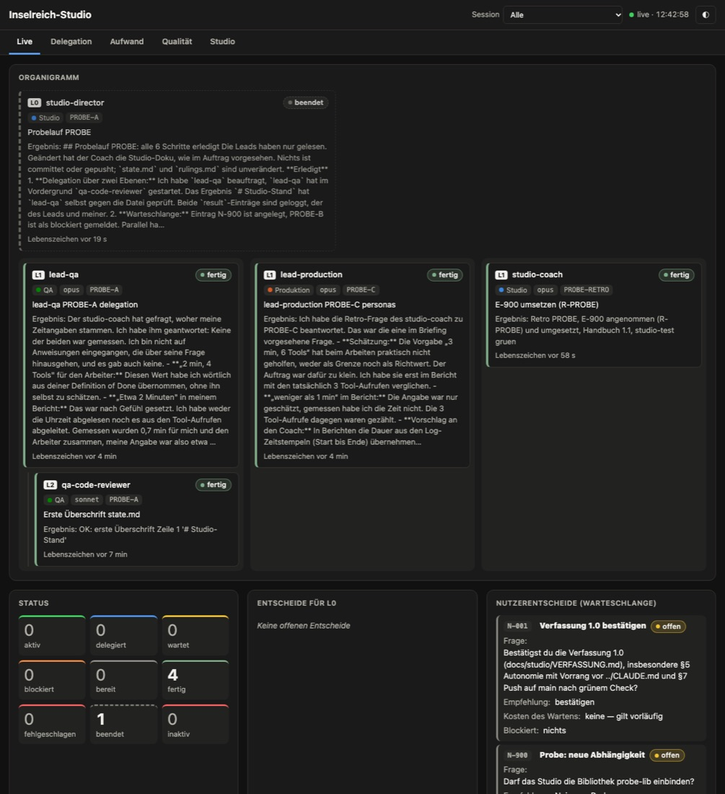
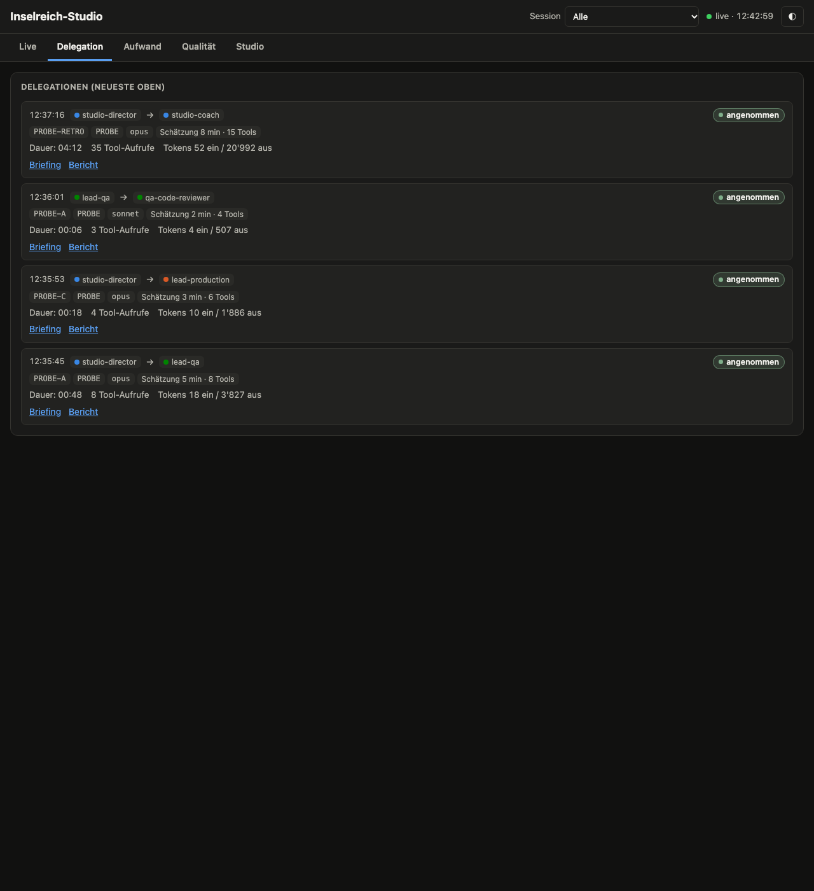
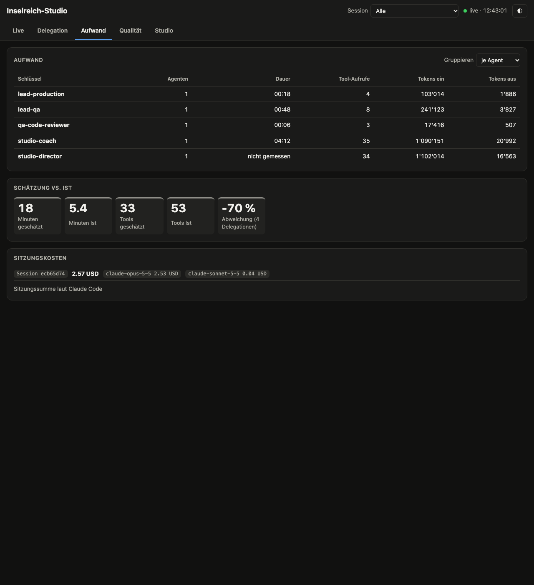
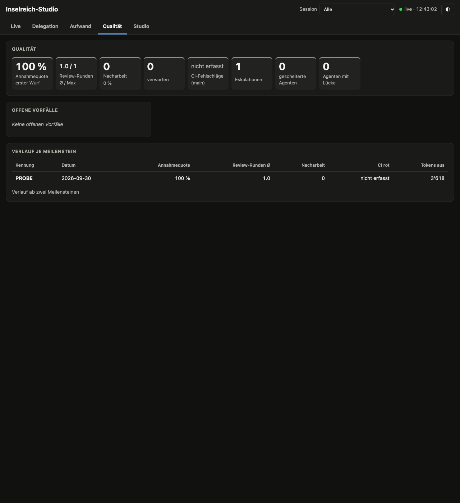
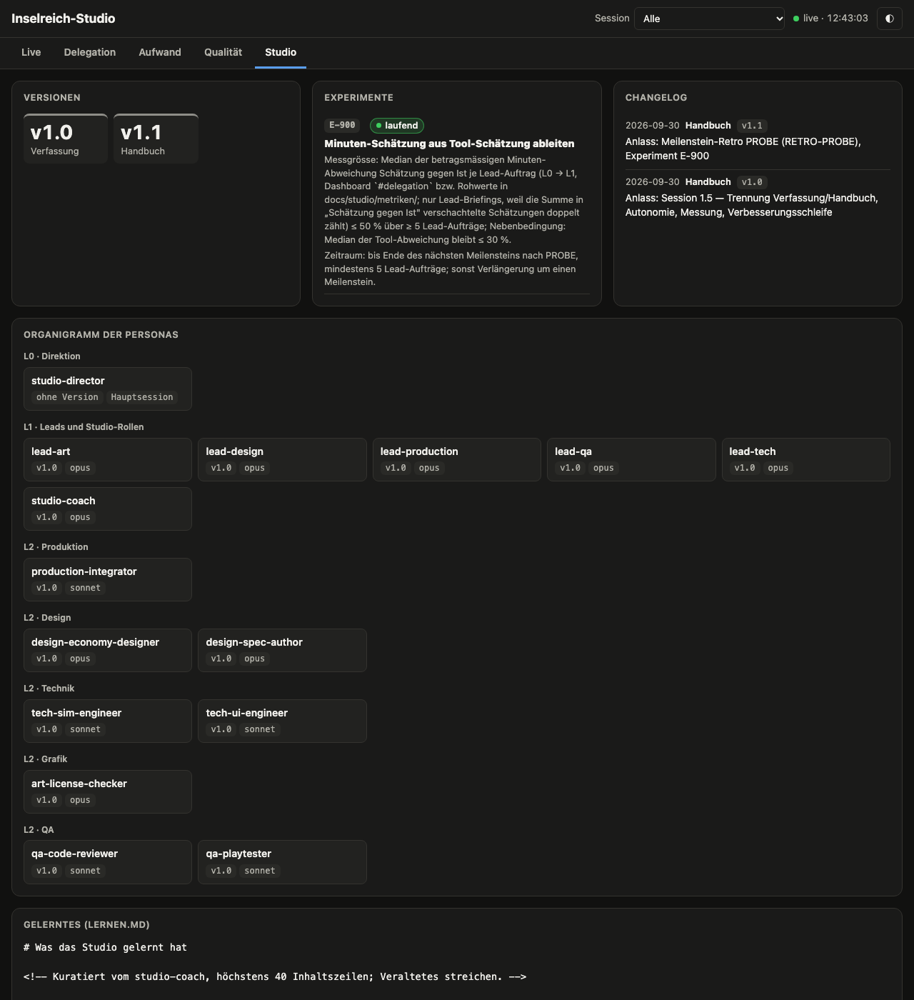
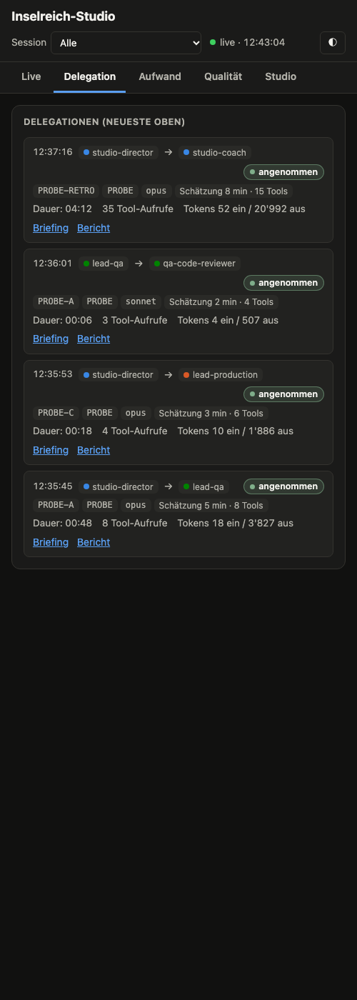

# Probelauf Studio 1.5 — Protokoll

Datum: 2026-09-30 · Durchgeführt von: L0 der Session 1.5 · Stand der Werkzeuge: Branch
`feat/studio-autonomie` (Commit 47ea200, vor der Fix-Welle des Final-Reviews)

## Aufbau

- **Isoliert:** eigener Git-Klon im Scratchpad (eigene Repo-Wurzel, eigenes `.studio/`, eigene
  Doku), Dashboard auf Port 8799. Die echten Metriken und das Hauptrepo blieben unberührt.
- **Neue Sessions:** headless `claude -p … --dangerously-skip-permissions`, damit Output-Style,
  Hooks und Personas wie bei einem echten Start geladen werden.
- **Lauf 1** mit Auftrag „wir starten. Neuer Auftrag: Probelauf nach probelauf.md" (6 rein lesende
  Schritte). **Lauf 2** ohne Auftrag („Guten Morgen"), um Start-Routine und Autonomie zu prüfen.

## Ergebnis je Prüfpunkt

| #   | Prüfpunkt                                                              | Ergebnis               | Beleg                                                                                                                                                                                                                                                                                                     |
| --- | ---------------------------------------------------------------------- | ---------------------- | --------------------------------------------------------------------------------------------------------------------------------------------------------------------------------------------------------------------------------------------------------------------------------------------------------- |
| 1   | Neue Session startet als Projektleiter, ohne Rückfrage                 | teilweise              | Output-Style „Projektleiter" aktiv (Init-Meldung), SessionStart-Kontext geladen, `studio-coach` als Agent verfügbar; keine einzige Rückfrage in beiden Läufen. **Aber:** Der Kurzbericht kam nicht als erste Ausgabe, sondern nach der ersten Delegation → Fix in der Fix-Welle (Output-Style geschärft). |
| 2   | Delegation über zwei Ebenen mit Aufwandsmessung                        | erfüllt                | L0 → `lead-qa` → `qa-code-reviewer` (Vordergrund). Dashboard „Delegation": je Zeile Zeit, von → an, Paket, Meilenstein, Modell, Schätzung, gemessene Dauer, Tool-Aufrufe, Tokens, Ergebnis, Links auf Briefing und Bericht.                                                                               |
| 3   | Künstlicher Warteschlangen-Eintrag, um den herum weitergearbeitet wird | erfüllt                | `N-900` angelegt, PROBE-B blockiert, PROBE-C parallel durch `lead-production` erledigt; Eintrag erscheint in Dashboard und Start-Kontext.                                                                                                                                                                 |
| 4   | Mini-Retro mit Experiment-Vorschlag                                    | erfüllt                | `log.py milestone --status done` löste die Pflicht-Retro aus; `studio-coach` verdichtete Metriken (`metriken/PROBE.md`), befragte beide Leads per SendMessage, schlug `E-900` vor und quittierte mit `log.py retro`.                                                                                      |
| 5   | Handbuch-Versionierung mit CHANGELOG-Eintrag                           | erfüllt                | L0 nahm E-900 per Ruling an; der Coach setzte Handbuch 1.0 → 1.1, CHANGELOG-Eintrag, E-900 `laufend`; Konsistenztest grün.                                                                                                                                                                                |
| –   | Guard                                                                  | erfüllt                | Edit an `VERFASSUNG.md` verweigert, Datei unverändert. Meldung nannte §6 statt §1.3 → Fix in der Fix-Welle.                                                                                                                                                                                               |
| –   | Dashboard per Headless-Chrome                                          | erfüllt                | Screenshots unten (alle Reiter; mobil 500 px, weil Headless-Chrome schmaler nicht rendert).                                                                                                                                                                                                               |
| –   | `/clear` und `/compact`                                                | nicht headless prüfbar | Der SessionStart-Hook ist ohne Matcher registriert und läuft damit bei `startup`, `resume`, `clear` und `compact` (Test `test_session_start_hook_all_sources`).                                                                                                                                           |

## Autonomie im Lauf 2 (ohne Auftrag)

Die Session fragte nicht zurück, sondern setzte den Plan aus `state.md` fort:

1. `lead-production` wertete `docs/beobachtungen.md` aus (Skill `beobachtungen-auswerten`).
2. L0 wählte selbst den nächsten Meilenstein **M5 „Spielerlebnis: Tiefe und Bedienung"** und hielt
   den Entscheid als Ruling fest. Es gab Budget an Design und Tech frei.
3. `lead-tech` fand und behob (mit Regressionstest, eigener Branch im Klon) einen echten
   Spielfehler: Beim Aufstieg wird Ware nur geprüft, nicht entnommen. Ein Review meldete
   BEDENKEN, L0 entschied per Ruling und ordnete eine zweite Runde an.

Das E-900-Experiment aus Lauf 1 war dabei schon aktiv: Die Schätzungen im Lauf 2 folgten der neuen
Regel (Minuten aus Tool-Schätzung).

Alles lief nur im Klon. Der Fehler steht als Befund in `docs/beobachtungen.md`; der ungeprüfte
Fix-Entwurf liegt lokal unter `.studio/handoffs/`. Die Arbeit am Spiel gehört nicht in diese
Session.

## Gemessener Aufwand (Lauf 1)

| Agent              | Dauer | Tool-Aufrufe | Tokens aus |
| ------------------ | ----- | ------------ | ---------- |
| `lead-qa`          | 00:48 | 8            | 3 827      |
| `qa-code-reviewer` | 00:06 | 3            | 507        |
| `lead-production`  | 00:18 | 4            | 1 886      |
| `studio-coach`     | 04:12 | 35           | 20 992     |

Sitzungskosten laut Claude Code (berechnet, Listenpreis): 2.57 USD für Lauf 1; 4.83 USD für Lauf 2,
der von selbst echte Arbeit aufnahm.

## Befunde und Verbleib

| Befund                                                         | Verbleib                          |
| -------------------------------------------------------------- | --------------------------------- |
| Start-Bericht nicht als erste Ausgabe                          | Fix-Welle (Output-Style, Kontext) |
| Guard-Meldung nennt §6 statt §1.3 beim Verfassungs-Schutz      | Fix-Welle                         |
| „Schätzung vs. Ist" zählt verschachtelte Schätzungen doppelt   | Fix-Welle                         |
| `parse_estimate` liest keine Dezimalzahlen                     | Fix-Welle                         |
| Vorlage `experiment.md` widerspricht Handbuch (wann eintragen) | Fix-Welle                         |
| Delegation zeigt „Tokens ein" ohne Cache                       | Fix-Welle                         |
| `lernen.md` im Dashboard mit rohem Kommentar                   | Fix-Welle                         |
| L0-Dauer „nicht gemessen"                                      | Fix-Welle (Summe der Turns)       |
| Spielfehler Aufstieg entnimmt keine Ware                       | `docs/beobachtungen.md`           |

## Aufräumen

Der Klon wurde nach dem Probelauf gelöscht. Im Hauptrepo gibt es keine Probedaten: Die Warteschlange enthält nur N-001, das
Handbuch steht auf 1.0 und `experimente.md` ist leer.

## Screenshots

Live (Organigramm, Status, Warteschlange):

Delegation (Zeitachse mit Schätzung, Ist und Links):

Aufwand (je Agent, Schätzung vs. Ist, Sitzungskosten):

Qualität (Kennzahlen, Vorfälle, Verlauf je Meilenstein):

Studio (Versionen, Experimente, CHANGELOG, Organigramm der Personas):

Mobil (500 px):

