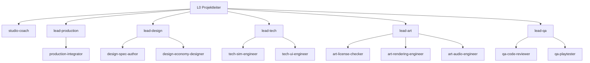

# Roster

Wer im Studio arbeitet. Verbindliche Regeln: [STUDIO.md](STUDIO.md). Persona-Dateien liegen unter
`.claude/agents/<name>.md`.

## Organigramm

| Lead              | Bereich                                                  | Arbeiter aktiv                                                        | Auf Abruf                                                                       |
| ----------------- | -------------------------------------------------------- | --------------------------------------------------------------------- | ------------------------------------------------------------------------------- |
| `studio-coach`    | Auswertung, Retros, Experimente, lernen.md               | keine Arbeiter                                                        | —                                                                               |
| `lead-production` | Board, Budget-Überblick, Merges, Onboarding neuer Rollen | `production-integrator`                                               | `production-studio-ops`, `production-onboarding-analyst`, `production-chronist` |
| `lead-design`     | Spielerlebnis, Regeln, Wirtschaft, Specs                 | `design-spec-author`, `design-economy-designer`                       | `design-genre-researcher`, `design-balancing-analyst`                           |
| `lead-tech`       | Architektur, Pläne, Umsetzung `src/`                     | `tech-sim-engineer`, `tech-ui-engineer`                               | `tech-save-engineer`, `tech-plan-architect`                                     |
| `lead-art`        | Grafik und Audio, Asset-Lizenzen, CREDITS                | `art-license-checker`, `art-rendering-engineer`, `art-audio-engineer` | `art-asset-scout`                                                               |
| `lead-qa`         | Reviews, Playtests, Determinismus, Regression            | `qa-code-reviewer`, `qa-playtester`                                   | `qa-determinism-checker`                                                        |

## Namensschema (R11, R28)

- L0: Hauptsession, Rolle `studio-director` (keine Persona-Datei; Output-Style `Projektleiter`;
  Anzeigename „Boss Bruno“, Titel „Projektleiter“, Emoji 🎬 aus `DIRECTOR_NAME` in `model.py`).
- L1: `lead-<bereich>`.
- L1-Stabsstelle: `studio-<rolle>`, direkt unter L0, ohne Arbeiter (z. B. `studio-coach`).
- L2: `<bereich>-<rolle>`, Rolle in Kleinbuchstaben mit Bindestrich.
- Bereiche: `production`, `design`, `tech`, `art` (umfasst Audio), `qa`; Stabsstellen und L0 im
  Bereich `studio`.

**Namensregel (Anzeigenamen):** Alliteration, das Präfix ist direkt das Arbeitswort der Rolle
(Planungs-Paula, Merge-Moritz). Name, Titel und Emoji stehen im Frontmatter der Persona-Datei
(`studio-name`, `studio-title`, `studio-emoji`); das Dashboard zeigt sie im Organigramm und im
Prozess-Graph.

Das Dashboard leitet Ebene und Bereich allein aus dem Namen ab. Ein Name ausserhalb des Schemas
erscheint als L2 im Bereich „extern". Umbenennen = Persona-Datei und dieses Roster ändern.

## Modellstufen (R10)

stark = `opus`, mittel = `sonnet`, klein = `haiku`. Einsatzregeln: STUDIO.md, Abschnitt
„Modellwahl".

## Aktive Personas

| Name                      | Persona          | Titel                    | Emoji | Ebene | Bereich    | Modell   | Version | Zweck                                                                                                      |
| ------------------------- | ---------------- | ------------------------ | ----- | ----- | ---------- | -------- | ------- | ---------------------------------------------------------------------------------------------------------- |
| `studio-coach`            | Coach-Carla      | Studio-Coach             | 🧭    | L1    | studio     | `opus`   | 1.1     | Stabsstelle: Retros, Metriken, Experimente, lernen.md; setzt Handbuch-Änderungen nach Ruling um            |
| `studio-process-coach`    | Takt-Tilda       | Prozess-Coach            | 🔭    | L1    | studio     | `opus`   | 1.0     | Stabsstelle: neutrale Prozess-Aussensicht nach jedem Release; Prozess-Retro-Berichte und Vorschläge (R127) |
| `lead-production`         | Planungs-Paula   | Produktionschefin        | 📋    | L1    | production | `opus`   | 1.4     | Studio-Produzent: Board, Budget-Überblick, state.md-Entwurf, Merges, Onboarding                            |
| `lead-design`             | Ideen-Ida        | Design-Chefin            | 💡    | L1    | design     | `opus`   | 1.4     | Spielerlebnis und Regeln: Brainstorming mit L0, Specs, Wirtschaft                                          |
| `lead-tech`               | Technik-Toni     | Tech-Chef                | 🔧    | L1    | tech       | `opus`   | 1.4     | Architektur, Implementierungspläne, Controller der Umsetzung im Worktree                                   |
| `lead-art`                | Pinsel-Pia       | Kunst-Chefin             | 🎨    | L1    | art        | `opus`   | 1.4     | Art Direction und Audio, Asset-Scouting, Lizenzen, CREDITS                                                 |
| `lead-qa`                 | Prüf-Peter       | QA-Chef                  | 🔍    | L1    | qa         | `opus`   | 1.4     | Testmanagement, Reviews, Final-Review, Determinismus und Regression                                        |
| `production-integrator`   | Merge-Moritz     | Zusammenführer           | 🔀    | L2    | production | `sonnet` | 1.3     | Merged nach dem Merge-Gate seriell, prüft `make check`, CI und Pages                                       |
| `design-spec-author`      | Spec-Sabine      | Spec-Schreiberin         | 📝    | L2    | design     | `opus`   | 1.2     | Schreibt Specs mit testbaren Abnahmekriterien nach `docs/superpowers/specs/`                               |
| `design-economy-designer` | Taler-Theo       | Wirtschaftsplaner        | 💰    | L2    | design     | `opus`   | 1.1     | Produktionsketten, Kreisläufe, Steuern und Unterhalt; rechnet Bilanzen je Einwohner                        |
| `tech-sim-engineer`       | Logik-Lars       | Spiellogik-Entwickler    | ⚙️    | L2    | tech       | `sonnet` | 1.3     | Setzt Regeln in `src/sim/` um: DOM-frei, deterministisch, TDD, Save-Migrationen                            |
| `tech-ui-engineer`        | UI-Ursula        | Oberflächen-Entwicklerin | 🖱️    | L2    | tech       | `sonnet` | 1.5     | Setzt Bedienung und Darstellung in `src/ui/`, `src/render/` um (Card-UI, desktop-first)                    |
| `art-license-checker`     | Paragraphen-Paul | Lizenzprüfer             | ⚖️    | L2    | art        | `opus`   | 1.1     | Prüft jede Asset-Quelle gegen Positiv-/Negativliste, trägt CREDITS ein, hat Veto                           |
| `art-rendering-engineer`  | Render-Rudi      | Darstellungs-Entwickler  | 🖼️    | L2    | art        | `sonnet` | 1.0     | Setzt Darstellung in `src/render/` um: Canvas 2D, Isometrie (ADR-012), prozedurale Grafik, Licht, Wetter   |
| `art-audio-engineer`      | Klang-Klara      | Audio-Entwicklerin       | 🎧    | L2    | art        | `sonnet` | 1.0     | Setzt Ton in `src/audio/` um (Busse, Umgebung, Musik-Streaming); schneidet und belegt Assets (ADR-011)     |
| `qa-code-reviewer`        | Review-Rita      | Code-Prüferin            | 👓    | L2    | qa         | `sonnet` | 1.4     | Prüft Diffs gegen Brief und Spec, Urteil OK/BEDENKEN/ZURÜCK, ändert keinen Code                            |
| `qa-playtester`           | Zocker-Zoe       | Spieltesterin            | 🎮    | L2    | qa         | `sonnet` | 1.5     | Browser-Check per Headless-Chrome, Screenshots, Playtest-Report                                            |

**Persona-Versionen:** Frontmatter-Feld `version` in `.claude/agents/<name>.md`. Erhöht wird sie nur
über die [Verbesserungsschleife](verbesserung.md#verbesserungsschleife) mit Eintrag in
[CHANGELOG.md](CHANGELOG.md); die Spalte `Version` hier zieht der Coach dabei nach.

## Auf Abruf

Noch keine Persona-Datei. Entsteht, wenn ein Paket die Rolle braucht (R1).

| Name                            | Lead              | Modell (Vorschlag) | Einzeiler                                                                              |
| ------------------------------- | ----------------- | ------------------ | -------------------------------------------------------------------------------------- |
| `production-studio-ops`         | `lead-production` | `sonnet`           | Wartet die Studio-Werkzeuge (Dashboard, Hooks, `log.py`, Make-Ziele)                   |
| `production-onboarding-analyst` | `lead-production` | `sonnet`           | Prüft neue Personas und Briefings auf Vollständigkeit gegen STUDIO.md                  |
| `production-chronist`           | `lead-production` | `sonnet`           | Fasst Chronik, Rulings und Pakete zu Meilenstein-Rückblicken und state.md-Entwürfen    |
| `design-genre-researcher`       | `lead-design`     | `sonnet`           | Recherchiert Mechaniken vergleichbarer Aufbauspiele (nur Mechaniken, ADR-006)          |
| `design-balancing-analyst`      | `lead-design`     | `sonnet`           | Rechnet und simuliert Balancing-Szenarien, schlägt Werte für `src/sim/defs/` vor       |
| `tech-save-engineer`            | `lead-tech`       | `sonnet`           | Save-Format: Versionierung, Migrationen, Tests für alte Spielstände                    |
| `tech-plan-architect`           | `lead-tech`       | `opus`             | Schreibt Implementierungspläne für grosse Meilensteine im Auftrag des Tech-Leads       |
| `art-asset-scout`               | `lead-art`        | `sonnet`           | Sucht offen lizenzierte Assets und liefert Kandidaten mit Lizenzangaben                |
| `qa-determinism-checker`        | `lead-qa`         | `sonnet`           | Prüft gleicher Seed → gleicher Zustand über lange Läufe und Speichern/Laden-Rundreisen |

## Neue Persona anlegen

1. Der zuständige Lead schreibt `.claude/agents/<name>.md` nach
   [templates/persona.md](templates/persona.md) (Name nach Schema, Frontmatter `name`,
   `description`, `tools`, `model`, `version: 1.0`, dazu `studio-name`, `studio-title`,
   `studio-emoji` nach der Namensregel; Arbeiter ohne `Agent`-Tool).
2. Der Production-Lead prüft sie gegen STUDIO.md, verschiebt die Zeile hier von „Auf Abruf" nach
   „Aktive Personas", führt Organigramm und Lead-Tabelle oben nach (keine Regeländerung) und committet
   (`docs: Persona <name>`). Dazu `PERSONA_NAMES` in `tools/studio/tests/test_model.py` eintragen,
   `make studio-test` grün.
3. Eine neue Agent-Datei ist in der laufenden Session erst **ab einem späteren Zug** als Agent-Typ
   verfügbar, nicht im Zug, in dem sie committet wurde (Befund Session 8c0e0295: Commit 339c728,
   Start im selben Zug „not found", nach dem nächsten Zug gelistet; R129). Wer die Rolle im selben
   Zug braucht, startet direkt `general-purpose` mit der Kopfzeile `Persona: <name>` und der
   Persona-Datei als Vorgabe („zuerst `.claude/agents/<name>.md` lesen und befolgen"). Fehlte
   `.claude/agents/` beim Session-Start, gilt das bis zur nächsten Session; dann den zu den
   Abschnitten von [templates/persona.md](templates/persona.md) ausgebauten Persona-Text ins Briefing.
   Das Modell immer explizit im Agent-Aufruf setzen (sonst erbt der Agent das Modell der Session).
