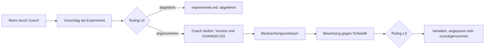

# Messung und Verbesserung

Teil des Handbuchs [STUDIO.md](STUDIO.md) (gleiche Version, gleicher Änderungsweg), ausgelagert per
R129. Leser: `studio-coach`, `studio-process-coach` und L0 bei Retros, Metriken und Experimenten.
Alle anderen Rollen brauchen nur den Kern in STUDIO.md und ihre Persona.

## Messung und Aufwand

Wer wann wen womit beauftragt hat und mit welchem Aufwand, zeigt das Dashboard (Verfassung §8).
Messwerte werden **gemessen, nie geschätzt**; fehlt eine Messung, steht „nicht gemessen" da.

**Was wie gemessen wird:**

| Grösse                  | Quelle                                                                                                                                                                                                                                   | Güte                                                                                                       |
| ----------------------- | ---------------------------------------------------------------------------------------------------------------------------------------------------------------------------------------------------------------------------------------- | ---------------------------------------------------------------------------------------------------------- |
| Dauer je Agent          | Summe der Läufe Start→Stop des Subagenten (Fortsetzungen eingeschlossen); bei Vordergrund zusätzlich `totalDurationMs`                                                                                                                   | gemessen                                                                                                   |
| Tool-Aufrufe je Agent   | Zahl der Tool-Aufrufe des Agenten (PreToolUse); bei Vordergrund `totalToolUseCount` zum Abgleich                                                                                                                                         | gemessen; Untergrenze, falls ein Hook am 5-s-Timeout scheitert                                             |
| Tokens je Agent/Modell  | Subagent-Transkript, je Message-ID dedupliziert: Input, Cache-Schreiben, Cache-Lesen, Output                                                                                                                                             | Input gemessen; Output **Untergrenze**, falls Einträge ohne `stop_reason` fehlen (Anteil wird ausgewiesen) |
| Dauer L0                | Summe der Turns der Hauptsession (Nutzer-Prompt bzw. Agenten-Meldung → Turn-Ende)                                                                                                                                                        | gemessen; Wartezeit auf den Nutzer zählt nicht                                                             |
| Tokens L0               | Haupt-Transkript, inkrementell je Turn                                                                                                                                                                                                   | wie oben                                                                                                   |
| Sitzungssumme           | `cost-state`-Eintrag im Haupt-Transkript nach Session-Ende: Tokens je Modell inkl. Hilfsaufrufe; Kosten                                                                                                                                  | Tokens gemessen; Kosten **berechnet** (Listenpreis, keine Abrechnung); nur beendete Sessions               |
| Schätzung               | Briefing-Kopfzeile `Schätzung:` (ganzer Auftrag inkl. Unteraufträge; Dezimalminuten wie `0.5 min` erlaubt), verglichen mit Dauer und Tool-Aufrufen des Teilbaums; hat ein Vorfahr eine Schätzung, zählt nur dessen (oberste je Teilbaum) | Schätzung, als solche markiert; fehlt → „keine Schätzung"                                                  |
| Ergebnis, Review-Runden | `log.py result` durch den abnehmenden Lead bzw. L0                                                                                                                                                                                       | erfasst; fehlt → „nicht erfasst"                                                                           |
| Fortsetzungen           | erneuter Start derselben Agent-ID (`SendMessage`)                                                                                                                                                                                        | gemessen                                                                                                   |
| CI                      | `tools/studio/ci.py` über `gh run list` (Session-Start, Session-Ende, nach Push); ein Lauf zählt für die Session, in deren Zeitraum er erstellt wurde                                                                                    | gemessen; ohne `gh` → „nicht gemessen"                                                                     |
| Eskalationen            | `decision --for l0` + Warteschlangen-Einträge                                                                                                                                                                                            | erfasst                                                                                                    |
| Inaktiv/gescheitert     | Status `failed`; Lücke ohne Lebenszeichen > `STUDIO_INACTIVE_SECONDS` bei lebendem Status                                                                                                                                                | Lücke gemessen; „inaktiv" ist eine **Heuristik** (lange Bash-Aufrufe erzeugen keine Lebenszeichen)         |

**Nicht messbar** (im Dashboard „nicht gemessen"):

- Kosten je Agent (nur die Sitzungssumme ist bekannt),
- Denkzeit ohne Tool-Aufruf,
- Tokens von Hilfsaufrufen je Agent,
- Aufwand des Nutzers.

**Ergebnis loggen (`log.py result`).** Einmal je (Paket, Arbeiter) mit dem **Endurteil**, geloggt
vom abnehmenden Lead nach jedem Arbeitsergebnis. Auch L0 loggt `result` für jeden Lead-Bericht
(`--worker` = Lead). Ein späteres Ergebnis für dasselbe Paar ersetzt das frühere. `--outcome` und
`--review-rounds` sind immer Pflicht; vollständiger Aufruf:
`python3 tools/studio/log.py result --help`.

| Endurteil                                | Werte                                                     |
| ---------------------------------------- | --------------------------------------------------------- |
| beim ersten Review angenommen            | `--outcome angenommen --review-rounds 1`                  |
| nach Fix-Runden angenommen               | `--outcome nacharbeit --review-rounds <Zahl der Reviews>` |
| verworfen                                | `--outcome verworfen --review-rounds <Zahl der Reviews>`  |
| ohne Review abgenommen (zählt ungeprüft) | `--outcome angenommen --review-rounds 0`                  |

Für L0 zählt jeder Lead-Bericht als Runde: `--review-rounds` ist die Zahl der Berichte, bis L0 das
Ergebnis angenommen hat. Erster Bericht angenommen → `--outcome angenommen --review-rounds 1`; nach
einer Nachbesserung per `SendMessage` → `--outcome nacharbeit --review-rounds 2` usw.

Die **Annahmequote beim ersten Wurf** zählt `angenommen` mit `--review-rounds 1` gegen alle geprüften
Ergebnisse (`--review-rounds` ≥ 1); `--review-rounds 0` wird separat ausgewiesen und nie als Treffer
gezählt. Mehr als 3 Review-Runden in einem Paket sind ein Vorfall (`runden:<paket>`).

**Meilenstein-Zuordnung** des Aufwands, in dieser Reihenfolge: Kopfzeile `Meilenstein:` im Briefing
(bzw. `--milestone`) → Meilenstein des Pakets → Meilenstein des delegierenden Vorfahren → der zu
diesem Zeitpunkt in derselben Session laufende Meilenstein (`log.py milestone`) → „ohne".

**Meilensteine:** L0 loggt Start und Ende (`log.py milestone --id M5 --status start --title "…"`
bzw. `--status done`). Das Ende löst die Pflicht-Retro aus (Vorfall `meilenstein:<id>`).

**Archiv** `.studio/archiv/` (lokal, gitignored; der alte Ordner `.studio/archive/` wird weiter
gelesen):

- `briefings/` — voller Prompt jeder Delegation,
- `berichte/` — volle Schlussmeldung jedes Agenten mit Rolle (interne Hilfsagenten ohne Rolle nur
  als Event mit `internal: true`, R136),
- `events/` — archivierte Event-Dateien (`make studio-archive`).

Das Dashboard verlinkt Briefings und Berichte unter `/archiv/…`.

**Verdichten:** `make studio-metrics` (letzte Session) bzw.
`python3 tools/studio/metrics.py --milestone <id>` schreibt `docs/studio/metriken/<kennung>.md`
([metriken/README.md](metriken/README.md)). Diese Dateien werden committet; sie überdauern das
lokale Archiv.

**Effizienz (Abschnitt in den Metriken, R167):** `python3 tools/studio/metrics.py --efficiency
[--sessions N]` verdichtet die Token-Nutzung der letzten `N` Sessions (Standard: alle Sessions) aus
den Transkripten und gibt nur den Abschnitt „Effizienz“ auf stdout aus (keine Datei); das ist das
Retro-Werkzeug. In die Metrik-Datei kommt der Abschnitt über `--session` bzw. `--milestone`
(`make studio-metrics`). Er zeigt:

- **Anteil je Rollenklasse** am Kostengewicht: Leads (Steuerung), L0, Review/QA/Merge,
  Design/Spec/Plan, Umsetzer (`tech-*`, `art-rendering-engineer`, `art-audio-engineer`),
  Studio-Betrieb (Coach, Ops, Retro). Steuerung = L0 + Leads. Ein `general-purpose`-Start mit
  Kopfzeile `Persona: x` zählt als x.
- **Kostengewicht (Schätzung, keine Abrechnung):** Input 1, Cache-Write 5 min 1,25, Cache-Write 1 h 2,
  Cache-Read 0,1, Output 5; Modellfaktor opus 1, sonnet 0,6, haiku 0,2 (fable wie opus); Usage je
  Message-ID einmal gezählt, bei mehreren Zeilen je Feld der Maximalwert (die erste Streaming-Zeile
  trägt nur einen Platzhalter von 1 bis 5 Output-Tokens).
- **Kontext je Rolle:** Start-Kontext = Median des ersten Aufrufs je Instanz; Kontext Mittel = Median
  der Instanz-Mittelwerte (je Instanz der Mittelwert über ihre Aufrufe); Kontext Max = grösster
  Einzelaufruf. Der Lead-Kontext-Median der Ampel ist der Median der Instanz-Mittelwerte aller Leads.
- **5-min-Cache-Neuschreibungen** über 20k nach dem ersten Aufruf, den **opus-Anteil**, die
  **Persona-Starts als general-purpose auf opus (Instanzen)** und die **grösste gelesene Datei**
  (nur Textdateien, Einheit KB, 1 KB = 1024 Zeichen). Fehlen Daten, steht „nicht gemessen“.

Ampel-Schwellen (die Werkzeug-Ausgabe weist sie je Zeile aus):

| Kennzahl                                      | gelb    | rot      |
| --------------------------------------------- | ------- | -------- |
| Steuerungsanteil (L0 + Leads)                 | > 40 %  | > 50 %   |
| Umsetzer-Anteil                               | < 15 %  | < 8 %    |
| Cache-Write 5 min                             | > 15 %  | > 25 %   |
| Lead-Kontext-Median                           | > 80k   | > 150k   |
| L0-Kontext Max                                | > 250k  | > 500k   |
| opus-Anteil                                   | > 60 %  | > 80 %   |
| Persona-Starts als `general-purpose` auf opus | ≥ 1     | ≥ 5      |
| grösste gelesene Datei                        | > 40 KB | > 100 KB |

Ausgangswerte (Token-Analyse 2026-10-02, [Ad-hoc-Retro](retros/2026-10-02-adhoc-token-effizienz.md)):
67,2 % · 5,0 % · 28,6 % · bis 169k · 774k · 83 % · 2040 Aufrufe geerbt · 310 KB (der Output-Anteil
von 6 % dort war zu niedrig, weil die erste Streaming-Zeile gezählt wurde; das Werkzeug zählt den
Maximalwert und kommt auf ≈ 19 % Output, Steuerung 63,7 %, Umsetzer 5,5 %). Das Werkzeug ist
Teil des Pakets EFF-W; weicht seine Ausgabe von dieser Beschreibung ab, gleicht L0 das Handbuch an.

**Pflichtpunkt jeder Retro** (Kurz-, Meilenstein- und Prozess-Aussensicht-Retro): Der Coach bzw.
Prozess-Coach liest die Effizienz-Ampel (Abschnitt „Effizienz“ der Metrik-Datei; fehlt er, vorher
`metrics.py --efficiency` ausführen). **Jede gelbe oder rote Zeile ist ein Befund mit Ursache**
(Beobachtung und Deutung getrennt). Bei **Rot** folgt ein Experiment-Vorschlag oder die Begründung,
warum keiner folgt. Der Retro-Bericht enthält dazu den Abschnitt „Effizienz-Ampel“
([templates/retro.md](templates/retro.md)); eine Retro ohne ihn ist unvollständig.

**Dashboard-Reiter** (`make studio`, URL `http://127.0.0.1:8765/`):

| Reiter     | Link          | Zeigt                                                                                                          |
| ---------- | ------------- | -------------------------------------------------------------------------------------------------------------- |
| Live       | `#live`       | Organigramm, Prozess-Graph, Pakete, offene L0-Entscheide, Nutzerentscheid-Warteschlange, Banner „Retro fällig" |
| Delegation | `#delegation` | Zeitachse wer → wen, mit Briefing- und Bericht-Links, Schätzung und Ist                                        |
| Aufwand    | `#aufwand`    | Tabellen je Agent, Paket, Lead, Meilenstein, Modell; Schätzung vs. Ist                                         |
| Qualität   | `#qualitaet`  | Kennzahlen, offene Vorfälle, Verlauf über die Meilensteine (aus `metriken/`)                                   |
| Studio     | `#studio`     | Handbuch- und Verfassungsversion, CHANGELOG, Experimente, lernen.md, Personas mit Versionen                    |

## Verbesserungsschleife

Der **`studio-coach`** (Stabsstelle, `opus`, ohne Arbeiter) wertet die Daten aus, moderiert Retros,
schlägt Experimente vor, bewertet sie und pflegt [lernen.md](lernen.md) und
[experimente.md](experimente.md). Er arbeitet nie an Spiel oder Doku und ist nicht in Production —
so benotet niemand die eigene Arbeitsweise. Angenommene Änderungen setzt er nach dem Ruling von L0
selbst um (Verfassung §10).

**Auslöser:**

| Retro       | Wann                                          | Umfang                                        |
| ----------- | --------------------------------------------- | --------------------------------------------- |
| Meilenstein | nach jedem Meilenstein (Pflicht)              | ausführlich, ≤ 1 Coach-Start                  |
| Session     | kurz am Ende jeder Session                    | ≤ 1 Coach-Start, ≤ 15 Tool-Aufrufe            |
| Ad hoc      | bei einem Vorfall (Dashboard: „Retro fällig") | wie Session-Retro, fokussiert auf den Vorfall |

Vorfälle mit stabiler ID: `failed:<agent>` (Agent gescheitert), `inaktiv:<agent>` (Agent hängt),
`ci:<run>` (CI auf `main` rot), `budget:<lead>:<phase>` (mehr als 1,5 × Freigabe verbraucht),
`runden:<paket>` (mehr als 3 Review-Runden), `meilenstein:<id>` (Meilenstein beendet). Ein Vorfall
gilt als erledigt, sobald ein `retro`-Event ihn in `--triggers` nennt. `ci.py` erfasst jeden Versuch
eines Laufs (`run_id`, `attempt`); ist der neueste Versuch grün (z. B. nach `gh run rerun`), ist
`ci:<run>` ohne Retro erledigt.

**Ablauf:**

1. **Start:** L0 startet den Coach mit Auslöser, Vorfall-IDs und den Agent-IDs der Leads dieser
   Session (für Rückfragen per `SendMessage`).
2. **Auswerten:** Der Coach verdichtet (`metrics.py`), liest Metrik-Dateien, Berichte und Archiv
   und befragt die Leads per `SendMessage`; nicht erreichbare Leads ersetzt er durch ihre
   Archiv-Berichte. Pflicht: die Effizienz-Ampel lesen (siehe oben).
3. **Bericht:** Retro-Bericht nach [templates/retro.md](templates/retro.md) unter
   `docs/studio/retros/`, mit Befunden und **höchstens 3 Vorschlägen**, jeder als Experiment nach
   [templates/experiment.md](templates/experiment.md), den der Coach gleich mit Status
   `vorgeschlagen` in experimente.md einträgt. Danach
   `log.py retro --id <id> --kind <art> --triggers <vorfall-ids> --report <pfad>` — das quittiert
   die genannten Vorfälle.
4. **Entscheid:** L0 entscheidet je Vorschlag per Ruling. Abgelehnt → Status `abgelehnt` in
   experimente.md.
5. **Umsetzen und bewerten:** Angenommen → der Coach ändert die Dateien, zählt die Version hoch,
   schreibt den CHANGELOG-Eintrag und setzt das Experiment auf `laufend`. Nach dem Zeitraum
   bewertet er gegen die vorab festgelegte Schwelle (`behalten` / `angepasst` / `zurückgenommen`);
   L0 bestätigt per Ruling. Zurückgenommen → Rückfallzustand wiederherstellen, Version erneut
   hochzählen.
6. **Rotation:** Wartet ein Experiment länger als 2 Sessions auf einen Platz, bewertet der Coach
   in der nächsten Retro die laufenden Experimente (Ergebnis gegen Schwelle, Urteil übernehmen,
   verwerfen oder verlängern mit Frist) und schlägt L0 eine Rotation vor. „Wartet auf Platz“ ist
   kein Dauerzustand; ein Experiment ohne Startdatum nennt den frühesten Start (R319).

**Versionierung:**

- Handbuch: **Minor** je angenommenem Experiment (1.0 → 1.1), **Major** bei einem Umbau der
  Organisation (1.x → 2.0). Die Version steht im Kopf von [STUDIO.md](STUDIO.md).
- Persona: **Minor** je Änderung, Frontmatter-Feld `version` in `.claude/agents/<name>.md`.
- Jede Version bekommt einen Eintrag in [CHANGELOG.md](CHANGELOG.md), neueste oben:
  `## <Datum> · Handbuch <Version>` bzw. `## <Datum> · Persona <name> <Version>`, darunter Anlass,
  Datenbasis, Ruling, Änderungen.

**Leitplanken:**

- Die Verfassung ist tabu; Vorschläge an sie gehen in die [Warteschlange](warteschlange.md).
- Höchstens **3** Experimente laufen gleichzeitig.
- Jede Änderung braucht eine **Datenbasis** (Metrik-Datei oder Retro-Bericht); ausgenommen sind
  offensichtliche Fehler.
- Kein Experiment darf die **Messbarkeit** seiner eigenen Wirkung verschlechtern (Prüffrage in
  [templates/experiment.md](templates/experiment.md)).
- [lernen.md](lernen.md) hat höchstens **40 Inhaltszeilen**; der Coach streicht Veraltetes.

Den Konsistenztest `tools/studio/tests/test_docs.py` (Teil von `make check`) hält jede Änderung
grün: Handbuch-Version = neuester CHANGELOG-Eintrag, Persona-Versionen, höchstens 3 laufende
Experimente, lernen.md-Länge, Verfassung vollständig, fester Regelblock gleich wie in der Vorlage.

**Kostenrahmen:** Kurz-Retro ≤ 1 Coach-Start und ≤ 15 Tool-Aufrufe; Meilenstein-Retro ≤ 1
Coach-Start.

## Logging im Detail

Dass ein Agent lebt, sieht das Dashboard ohnehin; **was** ein Agent tut, worauf er wartet und was er
geliefert hat, sieht es nur, wenn er loggt. Die Hooks (`.claude/settings.json` →
`tools/studio/hook.py`) erfassen **automatisch**: Session-Start/-Ende, Nutzer-Prompts, Turn-Ende,
Start und Stop jedes Subagenten, Eltern-Kind-Zuordnung (ein `bind` für einen unbekannten Agenten
erzeugt keinen Knoten), jeden Tool-Aufruf als Lebenszeichen,
Briefings und Berichte fürs Archiv sowie den Token-Verbrauch. **Explizit** loggt jeder Agent mit
`tools/studio/log.py` — immer als eigener Bash-Aufruf, damit der Hook ihn dem richtigen Agenten
zuordnet.

Wann wer loggt:

| Anlass                           | Wer                                  | Aufruf                                                |
| -------------------------------- | ------------------------------------ | ----------------------------------------------------- |
| Arbeitsbeginn                    | jeder Agent                          | `status --status active --task "<Auftrag>"`           |
| vor dem Starten von Arbeitern    | Leads, L0                            | `status --status delegated`                           |
| Warten auf Antwort / Hindernis   | jeder Agent                          | `status --status waiting` bzw. `blocked` mit `--task` |
| Abschluss                        | jeder Agent                          | `status --status done --summary "<Ergebnis>"`         |
| Abbruch, Auftrag nicht erfüllbar | jeder Agent                          | `status --status failed --summary "<Grund>"`          |
| Abnahme eines Arbeitsergebnisses | abnehmender Lead; L0 je Lead-Bericht | `result …`                                            |
| Meilenstein beginnt / endet      | L0                                   | `milestone --status start` bzw. `done`                |
| Retro abgeschlossen              | `studio-coach`                       | `retro … --triggers …`                                |
| Nutzer-Vorbehalt                 | fragende Stelle                      | `queue --id … --question …`                           |
| Antwort des Nutzers / umgesetzt  | L0                                   | `queue --id … --answer …` bzw. `--done …`             |
| Budgetfreigabe (je Session neu)  | L0                                   | `budget …`                                            |
| Paket angelegt / Statuswechsel   | L0, zuständiger Lead                 | `package …`                                           |
| Frage an L0, Entscheid           | fragende Stelle, L0                  | `decision --for l0 …`                                 |

`idle` (L0 wartet auf den Nutzer) und `ended` (Session-Ende) setzen die Hooks. Als inaktiv markiert
das Dashboard Knoten ohne Lebenszeichen seit 5 Minuten (`STUDIO_INACTIVE_SECONDS`), ausser `idle`
und Knoten mit aktiven Kindern (R9). Dashboard: `make studio` (URL `http://127.0.0.1:8765/`),
beenden mit `make studio-stop`, Ereignisse archivieren mit `make studio-archive`, Metriken
verdichten mit `make studio-metrics`. Vor Commits an `tools/studio/`: `make studio-lint` (Ruff über
`uvx`; bewusst nicht Teil von `make check`).

**Retro-Trigger (R217 V3):** `log.py retro --kind meilenstein` ohne Trigger der Form
`meilenstein:<ID>` schreibt das Ereignis trotzdem (Exit 0), warnt aber auf stderr; ohne diesen
Trigger bleibt der Retro-Alarm des Meilensteins offen.

**Leerlauf der Umsetzungskette (E-028, Messgrösse 2):** kein eigenes Ereignis nötig. Aus den
`package`-Ereignissen leitet `python3 tools/studio/metrics.py --efficiency [--idle-prefix H-]`
den Leerlauf ab: Strang = Owner; Intervall vom ersten Status `review` eines Pakets bis zum ersten
`active` eines später startenden Pakets desselben Owners. Parallel gestartete Pakete, erneute
Aktivierungen und Pausen über 240 min (Sitzungspause) zählen nicht. Ausgegeben werden Median und
Einzelübergänge. Voraussetzung: Leads führen `package … --status active` beim Start und `review`
bei der Abgabe nach (wie bisher Pflicht).

## Limit-Sensor

**Sensor (R68, Paket STUDIO-LIMIT, in Betrieb seit R80):** Die Statuszeile von Claude Code
liefert `rate_limits.five_hour.used_percentage`, `seven_day.used_percentage` und
`context_window.used_percentage`. Ein Projekt-Wrapper ruft das Nutzer-Skript unverändert auf und
schreibt die Werte mit `ts` und `session_id` nach `.studio/limits.json`; der Prompt-Hook gibt sie
L0 mit, das Dashboard zeigt sie. Fehlt die Datei, steht „nicht gemessen“ da. Veraltete Werte
werden noch nicht als solche markiert (`docs/beobachtungen.md`, Restbefunde Limit-Sensor).

## Budget-Zählung

**Zählung:** Das Dashboard zählt Starts, Parallelität und Modellmix automatisch über die Hooks
und markiert Überschreitungen rot. Leads nennen „verbraucht/frei" trotzdem in jedem Bericht. Ein
Start zählt für eine Freigabe seiner Session: bevorzugt die, deren Phase dem Paketnamen
entspricht, sonst die jüngste. Ein Start vor der ersten Freigabe der Session zählt in keiner
Zeile; ein Lead ohne Freigabe in seiner Session erscheint als „ohne Freigabe".

**Vorfall:** Erst ein Verbrauch über 1,5 × Freigabe ist ein Vorfall (`budget:<lead>:<phase>`) und
löst eine Ad-hoc-Retro aus. Mehr parallele Arbeiter als freigegeben färben die Zeile rot, sind
aber kein Vorfall.

## Guard: bekannte Grenzen

Der Guard erkennt keine Befehle in Backticks bzw. `$(…)`, über `xargs`,
über Globs oder in Skripten. Er erkennt auch nicht: das Löschen ganzer Ordner, die geschützte
Dateien enthalten (`rm -rf docs/studio`, `git rm -r docs/studio`), `rm -rf .worktrees/<x>`
(ungesicherte Arbeit im Worktree), Formatierer über `docs/studio/` (`prettier --write .`,
`make format`; die Verfassung steht deshalb in `.prettierignore`) sowie `chmod` und `ln -sf` auf
geschützte Dateien. Er schützt **gegen Versehen, nicht gegen Absicht**; das Verbot der
Verfassung gilt auch dort, wo er nichts erkennt. Ein Fehler im Guard lässt die Aktion zu.
