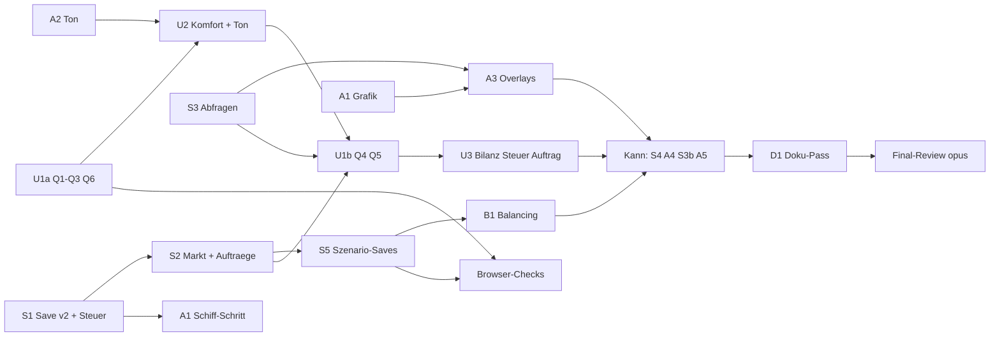

# M5 „Spielerlebnis" — Implementation Plan

> **For agentic workers:** REQUIRED SUB-SKILL: Use superpowers:subagent-driven-development (recommended) or superpowers:executing-plans to implement this plan task-by-task. Steps use checkbox (`- [ ]`) syntax for tracking.

**Goal:** Tiefe (Steuerregler), Dynamik (Verkaufssättigung, Handelsaufträge), Ambiente (prozedurale Grafik,
Animation, synthetischer Ton) und Bedienkomfort (7 Befunde, Overlays, Tooltips, Hotkeys, Autosave) nach der
M5-Spec umsetzen, ohne Siegziel, Warenketten oder Balancing-Grenze zu brechen.

**Architecture:** Vier Stränge mit getrennter Datei-Ownership (Sim, UI, Render, Audio) in fünf Worktrees. Die
Sim bekommt Save v2 (Migration aus v1 mit echtem Fixture), drei neue Module (`tax.ts`, `orders.ts`,
`queries.ts`) und zwei neue Tick-Phasen nach dem Unterhalt; Render, Audio und UI lesen nur. Abhängigkeiten
zwischen Strängen werden durch `git merge <strang-branch>` in den abhängigen Branch erfüllt; Browser-Checks
laufen in einem eigenen Integrations-Worktree.

**Tech Stack:** TypeScript, Canvas 2D, Web Audio (Browser-API), Vite, Vitest (Umgebung `node`). Keine neue
Abhängigkeit, auch keine Dev-Abhängigkeit.

**Spec:** `docs/superpowers/specs/2026-09-30-m5-spielerlebnis-design.md` (Gate Spec bestanden, R57). Alle
Abnahmekriterien (AK-…) stehen mit Eingaben und Sollwerten in Spec §14; dieser Plan zitiert sie per Nummer
und nennt je Task, welcher Test welches AK abdeckt. Test-Namen beginnen mit der AK-Nummer
(`it('AK-S2-01 …')`), damit Review und Final-Review die Abdeckung per `grep` prüfen können.

## Global Constraints

- Keine neue Abhängigkeit (ADR-001), auch nicht `@types/node`: Dateizugriff in Tests über die Typ-Shim
  `tests/sim/node-shim.d.ts` (S1), JSON-Fixtures per `?raw`-Import (Vite-Typen sind vorhanden).
- `src/sim/**` DOM-frei und deterministisch; Zufall nur über `createRng` aus `src/sim/rng.ts` (neue Instanz je
  Auftragsperiode, ADR-010). Sim-Aktionen werfen nie, sie liefern `Result` (`ok` / `fail(reason)`).
- Spielwerte nur in `src/sim/defs/`; Darstellungswerte (Farben, Animationsperioden, Tönung) als Konstanten im
  Render- bzw. Audio-Modul.
- Save: `SAVE_VERSION = 2`; v1 wird migriert (`migrateV1ToV2`), unbekannte Version → `Unbekannte Version`,
  Strukturfehler → `Beschädigter Spielstand`. `localStorage`-Schlüssel manuell bleibt `inselreich.save.v1`,
  Autosave `inselreich.save.auto`, Einstellungen `inselreich.settings`.
- `tests/sim/balance.test.ts` bleibt **unverändert** und grün (Sieg ≤ 7500). Jede Sim-Task meldet den
  Sieg-Tick (`VITE_BALANCE_LOG=1 npx vitest run tests/sim/balance.test.ts --silent=false --reporter=verbose`);
  Baseline heute (main mit M5-01): **5950** (firstSettler 350, firstCitizen 3750). Weicht er ab, gehört das in
  den Bericht; Sieg > 7000 oder rot → Stopp, Kurz-Spec (Spec §12).
- UI-Texte Deutsch (CH, kein ß), exakt wie in der Spec (Fehlgründe, Meldungen, Button-Texte).
- Commit-Präfixe `feat:`, `fix:`, `test:`, `docs:`, `refactor:`; kein Push, kein Merge nach `main`, kein
  Rebase (Integration nur durch `production-integrator` nach dem Gate Merge).
- **Prettier im Worktree ausführen** (`cd .worktrees/<strang> && npx prettier --write <dateien>`), nie aus dem
  Hauptrepo auf Worktree-Pfade: Konfiguration und `.prettierignore` gelten relativ zum Arbeitsbaum, und
  `.worktrees/` ist im Hauptrepo ignoriert (die Dateien würden sonst still übersprungen).
- Mermaid ohne `\n` in Node-Labels.
- **Befunde ausserhalb des Scopes** schreiben Arbeiter und Leads während M5 **nicht** nach
  `docs/beobachtungen.md`, sondern nur in ihren Bericht an den Lead bzw. den Lead-Bericht an L0 (Abschnitt
  „Befunde ausserhalb Scope"). D1 überträgt sie gesammelt. Ausnahme zu den festen Regeln für diesen
  Meilenstein (Gate Plan, Ruling durch L0); Grund: `docs/beobachtungen.md` hätte sonst fünf Schreiber in fünf
  Branches.

## Review Focus

Fünf Eingaben bzw. Zustände, die die Spec impliziert, aber kein AK ausdrücklich prüft; der zugehörige Test
steht jeweils in der Task, die den Code besitzt:

1. **Kaputter Autosave-Slot** (`inselreich.save.auto` enthält Müll oder einen fremden Stand): „Laden" bietet
   nur ladbare Einträge an bzw. zeigt den Grund als Toast; das laufende Spiel bleibt unverändert, die
   Startmeldung wirft nicht. → Task U2, Schritt „Review-Focus 1".
2. **Steuerwechsel direkt vor dem Buchungstick** (Umschalten bei Tick 99, Buchung bei 100): die Buchung bei
   100 nutzt bereits die neue Stufe („wirkt ab dem nächsten Tick"). → Task S1, Test `RF-2`.
3. **Aktionen bei negativem Geld:** `setTaxLevel` und `deliverOrder` sind erlaubt (Spec 4.1, 5.3); ein
   Refactoring, das `checkAfford` vorschaltet, darf das nicht brechen. → Tasks S1 (`RF-3a`) und S2 (`RF-3b`).
4. **Ungültige Lautstärke** (`NaN`, `-1`, `2`, `"0.4"` aus `localStorage` oder `setVolume`): wird auf 0…1
   geklemmt bzw. fällt auf den Standard 0.4; nie `NaN` im Gain. → Tasks A2 (`RF-4a`) und U2 (`RF-4b`).
5. **Hotkey während eines Weg-Ziehens oder bei gedrückter Maustaste:** Werkzeugwechsel bricht die laufende
   Aktion sauber ab (kein Weg auf der Loslass-Kachel, keine hängende Drag-Vorschau). → Task U2,
   Browser-Check `RF-5`.

---

## Organisation

### Stränge, Worktrees und Owner

| Strang       | Worktree / Branch                                 | Implementierer (Modell)                  | Controller          | Pakete (Reihenfolge im Strang) |
| ------------ | ------------------------------------------------- | ---------------------------------------- | ------------------- | ------------------------------ |
| Sim          | `.worktrees/m5-sim` · `feat/m5-sim`               | `tech-sim-engineer` (sonnet)             | `lead-tech`         | S1 → S2 → S5 → B1 → (S4) → D1  |
| Sim-Abfragen | `.worktrees/m5-sim-q` · `feat/m5-sim-queries`     | `tech-sim-engineer` (sonnet)             | `lead-tech`         | S3 → (S3b)                     |
| UI           | `.worktrees/m5-ui` · `feat/m5-ui`                 | `tech-ui-engineer` (sonnet)              | `lead-tech`         | U1a → U2 → U1b → U3            |
| Render       | `.worktrees/m5-render` · `feat/m5-render`         | `art-rendering-engineer` (sonnet, Abruf) | `lead-art`          | A1 → A3 → (A4) → (A5)          |
| Audio        | `.worktrees/m5-audio` · `feat/m5-audio`           | `art-audio-engineer` (sonnet, Abruf)     | `lead-art`          | A2                             |
| Integration  | `.worktrees/m5-int` · `test/m5-int` (nur Prüfung) | —                                        | `lead-tech` (Owner) | Browser-Checks, nacheinander   |

Klammern = Kann-Posten. Rollen „Abruf" ohne Persona-Datei: `subagent_type: general-purpose`, Kopfzeile
`Persona: <name>`, Persona-Text aus `docs/studio/roster.md`. Art-Pakete steuert `lead-art` im eigenen Worktree
(Handbuch, Umsetzungszyklus Schritt 4) mit demselben Zyklus (Implementierer → `qa-code-reviewer` →
`qa-playtester`).

**Einrichten je Worktree** (Controller, einmal):

```bash
cd /Users/KN/CAS/projekte/anno-clone
git worktree add .worktrees/m5-sim -b feat/m5-sim main
ln -s ../../node_modules .worktrees/m5-sim/node_modules   # node_modules ist gitignored
# analog m5-sim-q (feat/m5-sim-queries), m5-ui (feat/m5-ui), m5-render (feat/m5-render),
# m5-audio (feat/m5-audio), m5-int (test/m5-int)
```

Alle Branches starten auf `main` mit M5-01 (Spec-Voraussetzung, erfüllt seit dem Merge von M5-01).

### Datei-Ownership

Jede Datei hat genau einen Strang; innerhalb eines Strangs laufen Pakete nacheinander. Pfade ohne Präfix im
Strang-Ordner.

| Strang       | Dateien                                                                                                                                                                                                                                                                                                                                                                     |
| ------------ | --------------------------------------------------------------------------------------------------------------------------------------------------------------------------------------------------------------------------------------------------------------------------------------------------------------------------------------------------------------------------- |
| Sim          | `src/sim/` ohne `queries.ts`; `tests/sim/` ohne `queries.test.ts`; `tests/sim/fixtures/`; `.prettierignore`; `docs/adr/ADR-010-zufall-je-periode.md` (neu), `docs/adr/ADR-005-…`; `docs/arc42.md`; D1: `README.md`, `CLAUDE.md`, `docs/superpowers/specs/2026-09-29-inselreich-design.md`, `docs/superpowers/specs/2026-09-30-balancing-design.md`, `docs/beobachtungen.md` |
| Sim-Abfragen | `src/sim/queries.ts` (neu), `tests/sim/queries.test.ts` (neu)                                                                                                                                                                                                                                                                                                               |
| UI           | `src/ui/**` (neu: `settings.ts`, `order.ts`, `hotkeys.ts`), `index.html`, `src/style.css`, `tests/ui/**` (neu)                                                                                                                                                                                                                                                              |
| Render       | `src/render/**` (neu: `overlays.ts`, `water.ts`, `carriers.ts`), `tests/render/**`                                                                                                                                                                                                                                                                                          |
| Audio        | `src/audio/sound.ts` (neu), `tests/audio/sound.test.ts` (neu)                                                                                                                                                                                                                                                                                                               |

**Einzige Ausnahme (Spec §13):** S2 ändert in `src/ui/trade.ts` genau den `sellPrice`-Aufruf auf
`sellPrice(world, good, n)`. U1b und U3 bearbeiten `trade.ts` erst, nachdem `feat/m5-sim` mit S2 in
`feat/m5-ui` gemergt ist.

**Planabweichung zur Spec (klein, im Bericht an L0):** `SELL_FLOOR` (30) legt schon **S1** in
`defs/goods.ts` an, weil die Save-Prüfung „`sellPct` 30…100" die Untergrenze braucht und Spielwerte nur in
`defs/` stehen dürfen. `SELL_DROP` und die übrigen Werte bleiben bei S2. Gleicher Strang, gleiche Datei,
nacheinander — keine Ownership-Frage.

### Abhängigkeiten zwischen Strängen

Ein abhängiges Paket startet erst, wenn das Vorgängerpaket das Review-Urteil OK hat. Dann holt der Controller
den Vorgänger-Branch in den eigenen Worktree: `git -C .worktrees/<eigener> merge --no-edit <vorgänger-branch>`
(kein Rebase). Die Stränge berühren disjunkte Dateien; Konflikte sind nur bei der S2-Ausnahme in
`src/ui/trade.ts` denkbar und werden durch die Reihenfolge vermieden.

| Paket                                  | blocked-by                                     | Merge in den eigenen Worktree vor Start                                                                                                  |
| -------------------------------------- | ---------------------------------------------- | ---------------------------------------------------------------------------------------------------------------------------------------- |
| S1                                     | —                                              | —                                                                                                                                        |
| S3                                     | —                                              | —                                                                                                                                        |
| U1a                                    | —                                              | —                                                                                                                                        |
| A1                                     | — (Schritt Händlerschiff: S1)                  | vor dem Schiff-Schritt: `feat/m5-sim` (S1); Browser-Check erst nach U2                                                                   |
| A2                                     | —                                              | —                                                                                                                                        |
| S2                                     | S1                                             | (gleicher Strang)                                                                                                                        |
| U2                                     | U1a, A2, A1                                    | `feat/m5-audio`; `feat/m5-render` (nach A1 OK)                                                                                           |
| A3                                     | A1, S3                                         | `feat/m5-sim-queries`                                                                                                                    |
| S5                                     | S1, S2                                         | (gleicher Strang)                                                                                                                        |
| U1b                                    | S2, S3, U2 (gleiche Dateien in Folge)          | `feat/m5-sim`, `feat/m5-sim-queries`                                                                                                     |
| U3                                     | S1, S2, S3, U1b, U2                            | `feat/m5-sim` (neuester Stand)                                                                                                           |
| B1                                     | S1, S2, S5                                     | (gleicher Strang)                                                                                                                        |
| S4 (Kann)                              | S1, A1, alle Muss-Pakete OK                    | `feat/m5-render` (A1, `BUILDING_ABBR` ersetzt); danach `feat/m5-sim` erneut in `feat/m5-render` (Silhouette) und `feat/m5-ui` (Hotkey T) |
| A4 (Kann)                              | A1, alle Muss-Pakete OK                        | —                                                                                                                                        |
| S3b (Kann, nur mit A5)                 | S3, alle Muss-Pakete OK                        | —                                                                                                                                        |
| A5 (Kann)                              | A1, S3b                                        | `feat/m5-sim-queries` (S3b)                                                                                                              |
| D1                                     | alle umgesetzten Pakete OK                     | alle Strang-Branches (nur lesen)                                                                                                         |
| Browser-Checks U1b, U2, U3, A3, A4, B1 | S5, U1a (U1b, A3 ausdrücklich laut Spec)       | im Integrations-Worktree                                                                                                                 |
| Browser-Check A1                       | U2 (UI übergibt erst dann `fx.timeMs`), S2, S5 | im Integrations-Worktree                                                                                                                 |

**Browser-Checks im Integrations-Worktree.** `.worktrees/m5-int` gehört `lead-tech`; niemand sonst merged
dort. Checks laufen **strikt nacheinander**, nie zwei Playtester gleichzeitig am Dev-Server.

1. **Anmeldung:** `lead-tech` plant seine Checks selbst ein. `lead-art` meldet einen Check per Handoff-Datei
   an: `.studio/handoffs/m5-check-<paket>.md` mit Paket, AKs, benötigten Szenarien und den **SHAs mit
   Review-OK** je betroffenem Branch.
2. **Integration nur geprüfter Stände:** `lead-tech` merged ausschliesslich SHAs mit Review-Urteil OK (nie
   einen Branch-Kopf, der gerade in einer Fix-Runde steckt):

```bash
cd /Users/KN/CAS/projekte/anno-clone/.worktrees/m5-int
git merge --no-edit <sha-sim> <sha-sim-q> <sha-ui> <sha-render> <sha-audio>   # nur vorhandene/geprüfte
make check
SCENARIO_OUT=/Users/KN/CAS/projekte/anno-clone/.studio/qa/m5-scenarios npx vitest run tests/sim/scenario-saves.test.ts
npm run dev -- --port 5180 --strictPort
```

3. **Durchführung:** Den Playtester startet der Lead, dem das Paket gehört (Budget des Pakets); bei
   Art-Paketen antwortet `lead-tech` in der Handoff-Datei „bereit, Stand <int-SHA>", dann startet `lead-art`.
   Während eines fremden Checks loggt der wartende Lead
   `python3 tools/studio/log.py status --role <lead> --status waiting --task "m5-int belegt: <paket>" --package M5-<paket>`.
4. **Bericht:** Der Playtest-Report nennt den `test/m5-int`-SHA und die integrierten Strang-SHAs.
5. **Lange Echtzeit-Checks** (AK-U2-03, AK-U2-07, AK-U2-08: je 2–3 min; AK-B1-03: 15 min): Wartezeiten
   liegen im CDP-Skript selbst (Node-Skript mit dem eingebauten `WebSocket` gegen den Debug-Port, Wartezeit
   per `await new Promise((r) => setTimeout(r, ms))` zwischen den Messpunkten) oder werden auf mehrere
   Bash-Aufrufe von je höchstens 10 min verteilt, die jeweils einen Messpunkt lesen. Kein nacktes `sleep`.

`test/m5-int` wird nie nach `main` gemergt und nach dem Gate Merge entfernt. Ablauf im Browser nach Spec 14.1
(⏸ im HUD, per CDP `localStorage.setItem('inselreich.save.v1', <json>)`, „Laden"). Screenshots und Bericht
unter `<Hauptrepo>/.studio/qa/<paket>/` nach `docs/studio/templates/playtest-report.md`.

### Wellen und Parallelität



Die Umsetzung ist in Wellen gegliedert. **L0 startet je Welle einen frischen `lead-tech`** (und bei Bedarf
`lead-art`); der Kontext wandert über das Board und eine Übergabedatei, nicht über lange Lead-Sessions.

| Welle | Pakete (Lead)                                           | Start, wenn                            | Ende, wenn                             |
| ----- | ------------------------------------------------------- | -------------------------------------- | -------------------------------------- |
| 1     | S1, S3, U1a (lead-tech) · A1 ohne Schiff, A2 (lead-art) | Gate Plan und Budget Muss freigegeben  | alle fünf Review-OK                    |
| 2     | S2, U2 (lead-tech) · A1-Schiff, A3 (lead-art)           | Welle 1 fertig                         | alle Review-OK                         |
| 3     | S5, U1b (lead-tech) · Browser-Checks U1a, U2, A1, A3    | Welle 2 fertig                         | Pakete Review-OK, Checks abgeschlossen |
| 4     | U3, B1 (lead-tech) · Browser-Checks U1b, U3, B1         | Welle 3 fertig                         | alle Muss-Pakete abgenommen            |
| 5     | Kann: A4, A5 (lead-art) · S4, S3b (lead-tech)           | L0-Beschluss Kann-Posten + Kann-Budget | beschlossene Kann-Posten abgenommen    |
| 6     | D1 (lead-tech) → Final-Review (lead-qa)                 | Welle 4 bzw. 5 fertig                  | Bericht an L0 fürs Gate Merge          |

- **Übergabe je Welle:** Der abgebende Lead führt das Board nach (`log.py package` je Paket) und schreibt
  `.studio/handoffs/m5-welle-<n>.md`: Paketstände mit SHA je Branch, offene Fix-Runden (Arbeiter, Stand),
  laufende oder angemeldete Browser-Checks, Befunde ausserhalb Scope (gesammelt für D1), Budget
  verbraucht/frei, Startbedingungen der nächsten Welle.
- **Signale zwischen Leads** laufen über den Paketstatus auf dem Board: Ein Paket steht auf `done`, sobald sein
  Task-Review OK ist (`log.py package --id M5-<paket> … --status done`). Wer auf ein Paket des anderen Leads
  wartet, prüft dessen Status — A2 → U2, A1 → U2, S1 → A1-Schiff, S3 → A3, S3b → A5 — und merged erst dann
  den genannten SHA aus der Übergabedatei.

Parallelität: `lead-tech` 3 (Sim, Sim-Abfragen, UI), `lead-art` 2 (Render, Audio). Nie zwei Implementierer im
selben Worktree.

### Streichreihenfolge der Kann-Posten

Kann-Posten starten erst, wenn alle Muss-Pakete abgenommen sind (Spec 17.6). Werden Budget oder Zeit knapp,
entfällt in dieser Reihenfolge: **1. Träger (A5, mit S3b) → 2. Werkzeugmacher (S4) → 3. Tag-Nacht (A4).**
Ein gestrichener Posten hinterlässt keinen toten Code: Dann entfallen auch die „nur mit …"-Teile anderer
Pakete — ohne A4 das Feld `dayNight` und sein Schalter in `settings.ts`/HUD (U2) und `RenderFx.dayNight`;
ohne S4 die Silhouette „Werkzeugmacher" (A1 legt sie nur als Eintrag an, der ohne S4 entfällt) und Hotkey T
(U2); ohne A5 das Paket S3b. U2 und A1 bauen diese Teile deshalb **erst, wenn der Kann-Posten beschlossen
ist** (U2: Tag-Nacht-Schalter und Hotkey T als eigener Commit am Ende von A4 bzw. S4 durch den UI-Strang,
siehe dort).

### Ablauf je Task (für jeden Controller)

1. `python3 tools/studio/log.py package --id M5-<Paket> --title "<Titel>" --owner <lead> --status active --milestone M5 [--blocked-by …]`
2. Implementierer im Vordergrund starten (`run_in_background: false`), Briefing nach
   `docs/studio/templates/briefing.md`: Kopfzeilen, feste Regeln wörtlich, Logging-Block, Worktree-Pfad,
   Task-Text aus diesem Plan wörtlich, Spec-Pfad, „Budget: keins, keine Agenten starten".
3. `qa-code-reviewer` (sonnet) gegen Spec-Abschnitt und Task: Urteil OK / BEDENKEN / ZURÜCK. Fix-Runden per
   `SendMessage` an denselben Implementierer (zählt nicht als Start).
4. Bei Paketen mit Browser-AKs: `qa-playtester` (sonnet) im Integrations-Worktree, sobald die Voraussetzungen
   der Tabelle oben erfüllt sind.
5. `log.py result … --outcome <angenommen|nacharbeit|verworfen> --review-rounds <n>`; nach Review-OK Paket auf
   `done` (Signal für abhängige Pakete, siehe Wellen), SHA in die Übergabedatei.
6. Sim-Pakete: Sieg-Tick im Bericht.
7. Befunde ausserhalb Scope nur in den Bericht (Global Constraints), nicht in `docs/beobachtungen.md`.

---

## Task S1: Save v2, Steuerregler, Auftragsdaten der Güter

**Strang:** Sim · Worktree `.worktrees/m5-sim` · Implementierer `tech-sim-engineer` (sonnet; Save-Expertise aus
dem Roster-Eintrag `tech-save-engineer` ins Briefing übernehmen) · blocked-by: —

**Files:**

- Create: `src/sim/tax.ts`, `tests/sim/fixtures/save-v1.json`, `tests/sim/node-shim.d.ts`
- Modify: `src/sim/types.ts`, `src/sim/defs/tiers.ts`, `src/sim/defs/timing.ts`, `src/sim/defs/goods.ts`
  (`order`-Einträge, `SELL_FLOOR`), `src/sim/world.ts`, `src/sim/save.ts`, `src/sim/population.ts`,
  `.prettierignore`
- Test: `tests/sim/save.test.ts`, `tests/sim/taxes.test.ts`

**Interfaces (Produces):**

```ts
// types.ts
export type TaxLevel = 'low' | 'normal' | 'high';
export interface TaxLevelDef {
  name: string;
  pct: number;
  upgradeWait: number | null;
  occupancy: number;
}
export interface OrderDef {
  tier: Tier;
  min: number;
  max: number;
}
export interface GoodDef {
  id: GoodId;
  name: string;
  buy: number;
  sell: number;
  order?: OrderDef;
}
export interface Order {
  period: number;
  good: GoodId;
  amount: number;
  reward: number;
  due: number;
}
export interface World {
  version: 2;
  /* bestehend */ taxLevel: TaxLevel;
  taxLockedUntil: number;
  sellPct: Record<GoodId, number>;
  order: Order | null;
}
// defs/tiers.ts
export const TAX_LEVELS: Record<TaxLevel, TaxLevelDef>; // low 70/150/1 · normal 100/UPGRADE_WAIT/1 · high 130/null/0.75
export const DEFAULT_TAX_LEVEL: TaxLevel; // 'normal'
// defs/timing.ts
export const TAX_SWITCH_LOCK = 300;
// defs/goods.ts
export const SELL_FLOOR = 30; // GOODS[*].order laut Spec 5.3 (wood 1/20–40, food 1/10–20, stone 2/10–20,
// wool 2/10–20, cloth 2/6–12, cane 3/10–20, rum 3/6–12; tools ohne)
// tax.ts
export function setTaxLevel(world: World, level: string): Result;
// population.ts
export function houseCap(world: World, house: HouseState): number; // max(1, floor(max × occupancy))
// save.ts
export const SAVE_VERSION = 2;
export function migrateV1ToV2(raw: Record<string, unknown>): void; // mutiert raw
```

- [ ] **Schritt 1: v1-Fixture erzeugen — vor jeder Code-Änderung.** Typ-Shim anlegen (keine
      `@types/node`-Abhängigkeit):

```ts
// tests/sim/node-shim.d.ts — minimale Typen für node:fs in Tests (Vitest läuft in Node; ADR-001: keine @types/node)
declare module 'node:fs' {
  export function writeFileSync(path: string, data: string): void;
  export function mkdirSync(path: string, options?: { recursive?: boolean }): void;
}
```

Temporären Erzeuger anlegen, laufen lassen, **wieder löschen**:

```ts
// tests/sim/gen-save-v1.test.ts — TEMPORÄR, nach der Erzeugung löschen
import { it } from 'vitest';
import { mkdirSync, writeFileSync } from 'node:fs';
import { placeBuilding, placeRoad } from '../../src/sim/build';
import { serialize } from '../../src/sim/save';
import { step } from '../../src/sim/tick';
import { createWorld } from '../../src/sim/world';
import { forceGrass, prepareEast } from './helpers';

it.runIf(import.meta.env.GEN_SAVE_V1)('erzeugt tests/sim/fixtures/save-v1.json', () => {
  const w = createWorld(3);
  const k = w.buildings[w.kontorId]!;
  prepareEast(w, k);
  for (let i = 0; i < 4; i++) if (!placeRoad(w, k.x + 2 + i, k.y).ok) throw new Error('road');
  if (!placeBuilding(w, 'lumberjack', k.x + 6, k.y).ok) throw new Error('lumberjack');
  forceGrass(w, k.x, k.y - 1);
  if (!placeBuilding(w, 'house', k.x, k.y - 1).ok) throw new Error('house');
  for (let i = 0; i < 1000; i++) step(w);
  mkdirSync('tests/sim/fixtures', { recursive: true });
  writeFileSync('tests/sim/fixtures/save-v1.json', serialize(w));
});
```

```bash
GEN_SAVE_V1=1 npx vitest run tests/sim/gen-save-v1.test.ts
git rev-parse --short HEAD        # Erzeugungs-Commit notieren (für den Testkommentar)
rm tests/sim/gen-save-v1.test.ts
grep -o '"version":1' tests/sim/fixtures/save-v1.json   # muss treffen
```

`.prettierignore` um `tests/sim/fixtures/` ergänzen. Commit:
`test: v1-Spielstand als Fixture für die Migration (Seed 3, 1000 Ticks)` (Fixture, Shim, `.prettierignore`).

- [ ] **Schritt 2: Failing tests schreiben** in `tests/sim/save.test.ts` und `tests/sim/taxes.test.ts`, je
      AK ein `it`: AK-S1-01 … AK-S1-10, dazu RF-2 und RF-3a. Kern-Tests:

```ts
// save.test.ts
import v1Json from './fixtures/save-v1.json?raw';
// Fixture erzeugt mit Commit <hash aus Schritt 1> über den temporären Test tests/sim/gen-save-v1.test.ts
// (GEN_SAVE_V1=1; Seed 3, Weg + Holzfäller + Haus östlich des Kontors, 1000 Ticks), siehe Plan M5 Task S1.

it('AK-S1-02 lädt einen echten v1-Stand und migriert ihn', () => {
  const before = JSON.parse(v1Json) as Record<string, unknown>;
  const r = deserialize(v1Json);
  expect(r.ok).toBe(true);
  if (!r.ok) return;
  const w = r.world;
  expect(w.version).toBe(2);
  expect(w.taxLevel).toBe('normal');
  expect(w.taxLockedUntil).toBe(0);
  expect(GOOD_IDS.every((g) => w.sellPct[g] === 100)).toBe(true);
  expect(w.order).toBeNull();
  expect(w.tick).toBe(before.tick);
  expect(w.money).toBe(before.money);
  expect(w.stock).toEqual(before.stock);
  expect(Object.keys(w.buildings)).toEqual(Object.keys(before.buildings as object));
});

it('AK-S1-04 weist beschädigte v2-Felder ab', () => {
  const bad: Array<(raw: Record<string, unknown>) => void> = [
    (r) => (r.taxLevel = 'extrem'),
    (r) => ((r.sellPct as Record<string, number>).wood = 29),
    (r) => ((r.sellPct as Record<string, number>).wood = 101),
    (r) => ((r.sellPct as Record<string, number>).wood = 50.5),
    (r) => delete (r.sellPct as Record<string, number>).rum,
    (r) => (r.order = { period: 0, good: 'tools', amount: 5, reward: 0, due: 1200 }),
    (r) => (r.order = { period: 0, good: 'wood', amount: 0, reward: 0, due: 1200 }),
  ];
  for (const edit of bad) expectFailure(tampered(w, edit), 'Beschädigter Spielstand');
  expectFailure(
    tampered(w, (r) => (r.version = 3)),
    'Unbekannte Version',
  );
});

// taxes.test.ts
it('AK-S1-08 Steuerprobe 4 Siedlerhäuser à 8', () => {
  // 4 versorgte Siedlerhäuser (Helfer wie in population.test.ts), Σ = 4 × 8 × 7 = 224
  expect(totalTaxes(w)).toBe(224);
  w.taxLevel = 'low';
  expect(totalTaxes(w)).toBe(156);
  w.taxLevel = 'high';
  expect(totalTaxes(w)).toBe(291);
});

it('RF-2 Umschalten bei Tick 99 wirkt in der Buchung bei Tick 100', () => {
  // Aufbau wie AK-S1-08 (4 versorgte Siedlerhäuser à 8, Lager mit Nahrung und Stoff gefüllt), dann:
  w.tick = 99;
  expect(setTaxLevel(w, 'low').ok).toBe(true); // 'low': Belegung 1, kein Schrumpfen im Wachstumstakt 100
  const money = w.money;
  step(w); // Tick 100: Wachstum, dann Buchung
  expect(w.stats.taxes).toBe(156); // floor(224 × 70 / 100), nicht 224
  expect(w.money - money).toBe(156 - w.stats.upkeep);
});

it('RF-3a setTaxLevel ist bei negativem Geld erlaubt', () => {
  w.money = -50;
  expect(setTaxLevel(w, 'low')).toEqual({ ok: true });
});
```

Die übrigen AKs mit den Sollwerten aus Spec §14 S1 (AK-S1-05: 44 Bürger, Steuer 800, Grund „Steuer zu
hoch"; AK-S1-06: Aufstieg bei `low` am ersten Wachstumstakt ≥ S + 150; AK-S1-07: Sperre t + 299 / t + 300;
AK-S1-09: 8 → 7 → 6 stabil, zurück auf `normal` frühestens 300 Ticks nach `satisfiedSince`; AK-S1-10:
3 unversorgte Siedlerhäuser à 3 → 31). Der bestehende Test `uses version 1` wird zu `uses version 2`.

- [ ] **Schritt 3: Rot bestätigen:** `npx vitest run tests/sim/save.test.ts tests/sim/taxes.test.ts` →
      FAIL (fehlende Exporte/Felder). Ergebnis im Bericht.

- [ ] **Schritt 4: Implementieren.** Kernstellen:

```ts
// tax.ts
export function setTaxLevel(world: World, level: string): Result {
  if (!Object.hasOwn(TAX_LEVELS, level)) return fail('Ungültige Stufe');
  if (level === world.taxLevel) return fail('Stufe bereits aktiv');
  if (world.tick < world.taxLockedUntil) return fail('Sperrzeit');
  world.taxLevel = level as TaxLevel;
  world.taxLockedUntil = world.tick + TAX_SWITCH_LOCK;
  return ok;
}

// population.ts — Wachstumstakt (ersetzt die bisherigen zwei Zeilen)
const cap = houseCap(world, house);
if (house.inhabitants > cap) house.inhabitants -= 1;
else if (met) house.inhabitants = Math.min(cap, house.inhabitants + 1);
else house.inhabitants = Math.max(1, house.inhabitants - 1);

// population.ts — upgradeStatus, ersetzt die UPGRADE_WAIT-Zeile
const wait = TAX_LEVELS[world.taxLevel].upgradeWait;
if (wait === null) reasons.push('Steuer zu hoch');
else if (world.tick - house.satisfiedSince < wait)
  reasons.push(`Bedürfnisse noch nicht ${wait} Ticks erfüllt`);

// population.ts — totalTaxes: erst summieren, dann × pct / 100, einmal abrunden
return Math.floor((sum * TAX_LEVELS[world.taxLevel].pct) / 100);

// save.ts
export function migrateV1ToV2(raw: Record<string, unknown>): void {
  raw.version = 2;
  raw.taxLevel = 'normal';
  raw.taxLockedUntil = 0;
  raw.sellPct = Object.fromEntries(GOOD_IDS.map((g) => [g, 100]));
  raw.order = null;
}
// deserialize: nach dem Parsen `if (raw.version === 1) migrateV1ToV2(raw);`, dann `version !== SAVE_VERSION`
// → 'Unbekannte Version'; isWellFormed um taxLevel, taxLockedUntil, sellPct (Number.isInteger, SELL_FLOOR…100,
// jedes GOOD_ID) und order (null oder ganzzahlig period ≥ 0, amount ≥ 1, reward ≥ 0, due; GOODS[good]?.order)
// erweitern.
```

`createWorld` setzt `taxLevel: DEFAULT_TAX_LEVEL`, `taxLockedUntil: 0`, `sellPct` je `GOOD_IDS` 100,
`order: null`, `version: 2`. `UPGRADE_WAIT` bleibt exportiert; `TAX_LEVELS.normal.upgradeWait` verweist darauf.

- [ ] **Schritt 5: Grün:** `make check` im Worktree; alle bestehenden Population-, Steuer-, Economy-Tests
      unverändert grün (AK-S1-10); Sieg-Tick messen (erwartet unverändert 5950: „normal" ist bitgleich).
- [ ] **Schritt 6: Commit** `feat: Save v2 mit Migration und Steuerregler (S1)`.
- [ ] **Review:** `qa-code-reviewer`; Fokus AK-S1-11 (Fixture nicht umformatiert: `git diff --stat` des
      Fixtures nach `make lint` leer), Migration lässt vorhandene Felder unberührt, keine Zahl 300/70/130
      ausserhalb `defs/`.

## Task S3: Sim-Abfragen (ohne `roadPath`)

**Strang:** Sim-Abfragen · Worktree `.worktrees/m5-sim-q` · `tech-sim-engineer` (sonnet) · blocked-by: —

**Files:** Create `src/sim/queries.ts`, `tests/sim/queries.test.ts`. Keine andere Datei (Parallelität zu S1).

**Interfaces (Produces):**

```ts
export type Diagnosis =
  { kind: 'supply' } | { kind: 'good'; good: GoodId } | { kind: 'service'; service: ServiceId };
export type CoverageKind = 'supply' | ServiceId;
export function goodsBalance(
  world: World,
): Record<GoodId, { produced: number; consumed: number; net: number }>;
export function houseDiagnosis(world: World, b: Building): Diagnosis[];
export function coverageMask(world: World, kind: CoverageKind): boolean[]; // Index y × width + x
export function placementZone(
  world: World,
  defId: BuildingDefId,
  x: number,
  y: number,
): { cx: number; cy: number; radius: number; tiles: Pos[] } | null;
export function effectiveRefund(world: World, cost: Cost): Cost;
export function layoutKey(world: World): string;
```

Consumes: `inSupplyRange`, `supplyBuildings` (`supply.ts`), `serviceAvailable`, `SERVICE_BUILDING`
(`population.ts`), `refundCost` (`economy.ts`), `STORAGE_CAP`, `tilesInRadius`, `center`, `footprint`
(`world.ts`), `demolish` (`build.ts`, nur im Test).

- [ ] **Schritt 1: Failing tests** je AK: AK-S3-01 … AK-S3-07. Eigenschaftstest AK-S3-03:

```ts
it('AK-S3-03 coverageMask stimmt für alle Kacheln mit inSupplyRange und serviceAvailable überein', () => {
  const mask = coverageMask(w, 'supply');
  for (let y = 0; y < w.height; y++)
    for (let x = 0; x < w.width; x++)
      expect(mask[y * w.width + x], `${x},${y}`).toBe(inSupplyRange(w, x + 0.5, y + 0.5));
  const chapel = placeService(w, 'chapel', k.x + 3, k.y + 3); // Helfer aus helpers.ts, setzt connected; freie Stelle ggf. anpassen
  const faith = coverageMask(w, 'faith');
  for (let y = 0; y < w.height; y++)
    for (let x = 0; x < w.width; x++) {
      const probe = {
        id: -1,
        defId: 'house',
        x,
        y,
        connected: false,
        progress: 0,
        state: 'ok',
      } as Building;
      expect(faith[y * w.width + x], `${x},${y}`).toBe(serviceAvailable(w, probe, 'faith'));
    }
  expect(chapel.connected).toBe(true);
});

it('AK-S3-07 layoutKey ändert sich nur durch Bau, Abriss, Weg und Anbindung', () => {
  const k0 = layoutKey(w);
  for (let i = 0; i < 100; i++) step(w);
  expect(layoutKey(w)).toBe(k0);
  expect(placeRoad(w, k.x + 2, k.y).ok).toBe(true);
  const k1 = layoutKey(w);
  expect(k1).not.toBe(k0);
  // ebenso nach removeRoad, placeBuilding, demolish und nach recomputeConnectivity mit geänderter Anbindung
});
```

AK-S3-06 (Abriss während Produktion, Weberei) ist Pflicht: Wolle 9 nach 20 Ticks, `progress 20`,
Rückerstattung 100 Geld / 7 Holz / 1 Werkzeug gleich `effectiveRefund` vor dem Abriss, danach kein Unterhalt.
Zeigt der Test einen Fehler im bestehenden Abriss-Code, **nicht** in `build.ts` fixen (Datei gehört dem
Sim-Strang): stoppen und an `lead-tech` melden.

- [ ] **Schritt 2: Rot bestätigen** (`npx vitest run tests/sim/queries.test.ts`).
- [ ] **Schritt 3: Implementieren.** `coverageMask`: Quellen einmal vorfiltern (Kontor + angebundene Märkte
      bzw. angebundene Dienstgebäude der Art), dann je Kachel Abstand Mitte (x + 0.5, y + 0.5) zu
      Quell-Mitte ≤ Radius — **dieselbe** Vergleichsrechnung wie `inSupplyRange`/`serviceAvailable`
      (sonst schlägt AK-S3-03 an Randkacheln an). `layoutKey`:

```ts
export function layoutKey(world: World): string {
  let roadSum = 0;
  for (let i = 0; i < world.tiles.length; i++) if (world.tiles[i]!.road) roadSum += i;
  let connectedSum = 0;
  let count = 0;
  for (const b of Object.values(world.buildings)) {
    count += 1;
    if (b.connected) connectedSum += b.id;
  }
  return `${world.nextBuildingId}|${count}|${roadSum}|${connectedSum}`;
}
```

**`layoutKey`-Hinweis:** Die Summen können zufällig gleich bleiben (zwei Wege gleichzeitig verschoben, zwei
Anbindungen getauscht). Für die Spec genügt das (Cache-Schlüssel, im Zweifel ein veralteter Umriss bis zur
nächsten Änderung). A3 darf für den Cache stattdessen die sortierte Liste der Weg-Indizes und angebundenen
Ids verwenden (Kann-Vermerk Spec 10.2); `layoutKey` selbst bleibt wie spezifiziert. Kosten: 4096 Kacheln je
Aufruf, je Frame unkritisch.

- [ ] **Schritt 4:** `make check`, Sieg-Tick (unverändert, keine Tick-Änderung). Commit
      `feat: Sim-Abfragen für Bilanz, Diagnose, Abdeckung und Zonen (S3)`.
- [ ] **Review:** reine Funktionen ohne Weltänderung (Test: `serialize` vor und nach jedem Aufruf gleich).

## Task U1a: Befunde Q1–Q3, Q6

**Strang:** UI · Worktree `.worktrees/m5-ui` · `tech-ui-engineer` (sonnet) · blocked-by: —

**Files:** Modify `src/ui/input.ts` (Q1–Q3), `src/ui/app.ts` (Q6).

**Interfaces:** `InputBinding.applyKeys(dtMs: number): void` (bisher ohne Parameter; Aufrufer in `app.ts`
übergibt die Frame-Dauer). Konstante `PAN_PX_PER_S = 960` ersetzt `PAN_PER_FRAME` (Darstellungswert, bleibt
in `input.ts`). `startGame(root, loaded?, opts?: { speed?: number; camera?: Camera })` — `restart` beim Laden
übergibt Tempo und, bei gleichem `seed`, die Kamera.

- [ ] **Schritt 1 (Test-first, wo rechenbar):** Pan-Rechnung als reine Funktion
      `panDelta(dtMs: number, zoom: number): number` in `input.ts` exportieren und in
      `tests/ui/input.test.ts` prüfen: `panDelta(1000, 1) === 960`, `panDelta(16.67, 2)` ≈ 8, unabhängig von
      der Aufteilung (`2 × panDelta(500) === panDelta(1000)`). Rot bestätigen.
      (`tests/ui/` liegt im UI-Strang; Vitest-Umgebung `node`, also keine DOM-Zugriffe beim Import.)
- [ ] **Schritt 2:** Implementieren: Q1 Zielkachel bei `pointerdown` merken (Maus: Aktion sofort; Touch:
      beim Loslassen auf der Drück-Kachel, nur ohne Schwenk und ohne zweiten Finger); Q2 `applyKeys(dtMs)`;
      Q3 Pointer-Events mit Zwei-Finger-Pinch (Faktor = Abstandsverhältnis, `zoomAt` um den Mittelpunkt,
      Grenzen wie heute) und Zwei-Finger-Pan in allen Werkzeugen, Ein-Finger-Pan im Auswahl-Werkzeug,
      zweiter Finger bricht die Ein-Finger-Aktion ab; Q6 Laden behält Tempo, Kamera bei gleichem Seed, sonst
      aufs Kontor zentriert; „Neu" startet mit 1×.
- [ ] **Schritt 3:** `make check`; Commit `fix: Eingabe auf Drück-Kachel, Pan nach Zeit, Touch-Pinch, Laden behält Tempo (U1a)`.
- [ ] **Review** `qa-code-reviewer`; **Browser-Check** `qa-playtester` im Integrations-Worktree, sobald U1a
      OK ist (braucht keine Szenario-Saves): AK-U1a-01 … 04.

## Task A1: Gebäudegrafik, Animationen, Händlerschiff, Weg-Nähte, `RenderFx`

**Strang:** Render · Worktree `.worktrees/m5-render` · `art-rendering-engineer` (sonnet, Abruf) ·
Controller `lead-art` · blocked-by: — (Schiff-Schritt: S1)

**Files:** Modify `src/render/sprites.ts`, `src/render/camera.ts`, `src/render/renderer.ts`,
`src/render/terrain.ts`; Create `src/render/water.ts`; Test `tests/render/camera.test.ts`.

**Interfaces (Produces):**

```ts
// renderer.ts
export interface RenderFx {
  timeMs: number;
  dayNight?: boolean;
} // dayNight nur mit A4
export function render(ctx, world, cam, terrainLayer, hover, selectedId, view, fx?: RenderFx): void; // Standard { timeMs: 0 }
// sprites.ts — ersetzt BUILDING_ABBR
export const SILHOUETTES: Partial<Record<BuildingDefId, SilhouetteFn>>; // Fallback: Kategorie-Grundform
```

- [ ] **Schritt 1: Failing test AK-A1-05** in `tests/render/camera.test.ts`:

```ts
it('AK-A1-05 tileToScreen liefert ganze Pixel ohne Lücke oder Überlappung', () => {
  for (const zoom of [0.5, 0.75, 1.1, 1.33, 1.7, 2]) {
    const c = { x: 13.7, y: 5.3, zoom }; // gebrochener Kamera-Versatz wie im Spiel
    for (let n = 0; n < 64; n++) {
      const a = tileToScreen(c, n, n);
      const b = tileToScreen(c, n + 1, n + 1);
      expect(Number.isInteger(a.x) && Number.isInteger(a.y)).toBe(true);
      expect([Math.floor(32 * zoom), Math.ceil(32 * zoom)]).toContain(b.x - a.x);
      expect([Math.floor(32 * zoom), Math.ceil(32 * zoom)]).toContain(b.y - a.y);
    }
  }
});
```

(Felder der `Camera` vorher in `camera.ts` prüfen und das Literal anpassen.) Rot bestätigen.

- [ ] **Schritt 2:** `tileToScreen` mit `Math.round`; `drawRoad`/`drawBuilding` rechnen die Breite als
      Differenz der gerundeten Kanten. Test grün.
- [ ] **Schritt 3:** Silhouetten je Typ (Spec 9.1) als `SILHOUETTES`-Tabelle mit Fallback; Farbton je
      Kategorie aus `BUILDING_COLORS`; roter Punkt „nicht angebunden" bleibt; Wohnhaus je Stufe verschieden.
      Kein Eintrag für `toolmaker` (entsteht mit S4).
- [ ] **Schritt 4:** `RenderFx` einführen; Arbeitsanzeige (Periode 1.5 s, nur `production` mit
      `connected && state === 'ok'`), Wasserwellen als eigene Ebene im sichtbaren Ausschnitt (`water.ts`),
      Uferverstärkung. Animation nur aus `fx.timeMs` und Welt-Zustand.
- [ ] **Schritt 5 (nach S1-OK):** `git merge --no-edit feat/m5-sim`; Händlerschiff bei
      `world.order !== null` auf der ersten Wasserkachel aus `adjacentOf` des Kontors, leichtes Schaukeln.
- [ ] **Schritt 6:** `make check`; Commits je Schritt (`feat:` bzw. `fix:` für Q7).
- [ ] **Review** `qa-code-reviewer` (keine Weltänderung im Renderer, kein Zufall ausser aus Zeit/Welt);
      **Browser-Check** `qa-playtester` (nach U2, S2 und S5; vorher übergibt die UI kein `fx.timeMs`, die
      Animation stünde still): AK-A1-01 … 04, 06, 07 (Leistung: mit Wohnhaus-Werkzeug; nach A3 im A3-Check
      wiederholt). Anmeldung per Handoff an `lead-tech`.

## Task A2: Synthetischer Ton

**Strang:** Audio · Worktree `.worktrees/m5-audio` · `art-audio-engineer` (sonnet, Abruf) · Controller
`lead-art` · blocked-by: —

**Files:** Create `src/audio/sound.ts`, `tests/audio/sound.test.ts`.

**Interfaces (Produces, Spec §11):**

```ts
export type SoundEvent =
  'build' | 'demolish' | 'coin' | 'order' | 'orderDone' | 'upgrade' | 'error' | 'win';
export interface Sound {
  unlock(): void;
  play(e: SoundEvent): void;
  setMuted(b: boolean): void;
  setVolume(v: number): void;
  setHidden(b: boolean): void;
  dispose(): void;
}
export function createSound(
  opts: { muted: boolean; volume: number },
  ctxFactory?: () => AudioContext | null, // Standard: () => new AudioContext()
): Sound;
export const THROTTLE_MS: Partial<Record<SoundEvent, number>>; // build 80, demolish 80, coin 50, upgrade 300, error 150
```

- [ ] **Schritt 1: Fake-Kontext und failing tests** AK-A2-01 … 05 plus RF-4a. Der Fake zählt erzeugte
      Knoten und protokolliert `resume`/`suspend`; `currentTime` ist setzbar:

```ts
function fakeCtx() {
  const log = { nodes: 0, resume: 0, suspend: 0, gains: [] as Array<{ gain: { value: number } }> };
  const param = () => ({
    value: 1,
    setValueAtTime() {},
    linearRampToValueAtTime() {},
    exponentialRampToValueAtTime() {},
  });
  const node = () => {
    log.nodes += 1;
    return {
      connect() {
        return this;
      },
      disconnect() {},
      start() {},
      stop() {},
      gain: param(),
      frequency: param(),
      Q: param(),
      type: 'sine',
      buffer: null,
      loop: false,
    };
  };
  const ctx = {
    currentTime: 0,
    state: 'suspended',
    destination: {},
    sampleRate: 44100,
    createGain: () => {
      const g = node();
      log.gains.push(g);
      return g;
    },
    createOscillator: node,
    createBufferSource: node,
    createBiquadFilter: node,
    createBuffer: (_c: number, len: number) => ({ getChannelData: () => new Float32Array(len) }),
    resume() {
      log.resume += 1;
      ctx.state = 'running';
      return Promise.resolve();
    },
    suspend() {
      log.suspend += 1;
      ctx.state = 'suspended';
      return Promise.resolve();
    },
    close() {
      return Promise.resolve();
    },
  };
  return { ctx: ctx as unknown as AudioContext, log };
}

it('AK-A2-03 Drossel je Ereignis misst an currentTime', () => {
  const { ctx, log } = fakeCtx();
  const s = createSound({ muted: false, volume: 0.4 }, () => ctx);
  s.unlock();
  const base = log.nodes;
  const voices = () => log.nodes - base;
  s.play('build');
  const one = voices();
  (ctx as { currentTime: number }).currentTime = 0.05;
  s.play('build');
  expect(voices()).toBe(one); // gedrosselt (< 80 ms)
  (ctx as { currentTime: number }).currentTime = 0.09;
  s.play('build');
  expect(voices()).toBe(2 * one); // zweite Stimme
});

it('RF-4a setVolume klemmt ungültige Werte', () => {
  const { ctx, log } = fakeCtx();
  const s = createSound({ muted: false, volume: 0.4 }, () => ctx);
  s.unlock();
  const master = log.gains[0]!; // erster erzeugter Gain-Knoten ist der Master (Vorgabe an sound.ts)
  s.setVolume(Number.NaN);
  expect(master.gain.value).toBe(0.4); // ungültig → Wert bleibt
  s.setVolume(-1);
  expect(master.gain.value).toBe(0);
  s.setVolume(2);
  expect(master.gain.value).toBe(1);
});
```

Rot bestätigen. (Der Fake ist die einzige Stelle, die die Knoten-API nachbildet; nur die Methoden anlegen,
die `sound.ts` wirklich nutzt.)

- [ ] **Schritt 2:** Implementieren (Vorgabe: Lautstärke direkt über `master.gain.value`, der Master ist der
      erste erzeugte Gain-Knoten): Kontext lazy in `unlock()` (Fabrik wirft oder liefert `null` →
      stille Implementierung), Master-Gain 0.4, Meeresrauschen (gefiltertes Rauschen, 15 % des Masters,
      genau einmal gestartet), Tonfiguren aus Spec 9.3, Drossel an `ctx.currentTime`, `setHidden` →
      `suspend`/`resume` (nur wenn entsperrt und nicht stumm). Kein Import aus `src/sim/` oder `src/ui/`,
      kein DOM-Zugriff (AK-A2-06).
- [ ] **Schritt 3:** `make check`; Commit `feat: synthetischer Ton mit Drossel und stillem Rückfall (A2)`.
- [ ] **Review** `qa-code-reviewer` inkl. AK-A2-06 (`grep -n "from '../sim\|from '../ui\|document\.\|window\." src/audio/`
      leer; `git diff main -- package.json` leer; nichts unter `public/`).

## Task S2: Verkaufssättigung, Handelsaufträge, Tick-Reihenfolge, ADR-010

**Strang:** Sim · `.worktrees/m5-sim` · `tech-sim-engineer` (sonnet) · blocked-by: S1

**Files:**

- Create: `src/sim/orders.ts`, `tests/sim/orders.test.ts`, `docs/adr/ADR-010-zufall-je-periode.md`
- Modify: `src/sim/defs/goods.ts` (`SELL_DROP`, `ORDER_PREMIUM`), `src/sim/defs/timing.ts`
  (`SELL_RECOVERY_INTERVAL`, `ORDER_FIRST_TICK`, `ORDER_PERIOD`, `ORDER_DURATION`), `src/sim/trade.ts`,
  `src/sim/tick.ts`, `tests/sim/trade.test.ts`, `tests/sim/tick.test.ts`,
  `docs/adr/ADR-005-tick-reihenfolge-und-zustaende.md` (Nachtrag), `docs/arc42.md` (nur §8 Determinismus),
  `src/ui/trade.ts` (nur der `sellPrice`-Aufruf, benannte Ausnahme)

**Interfaces (Produces):**

```ts
// trade.ts
export function sellPrice(world: World, good: GoodId, n: number): number; // rein; neue Signatur
export function tickMarket(world: World): void;
// orders.ts
export function orderForPeriod(
  seed: number,
  k: number,
  maxTier: Tier,
): { good: GoodId; amount: number; reward: number };
export function tickOrders(world: World): void;
export function deliverOrder(world: World): Result; // 'Kein Auftrag' | 'Nicht genug Ware'
export function nextOrderTick(world: World): number;
// tick.ts: Produktion → Bevölkerung → Steuern → Wirtschaft → tickMarket → tickOrders → Sieg
```

- [ ] **Schritt 1: Failing tests** je AK: AK-S2-01 … AK-S2-14, AK-S2-16, dazu RF-3b. Kern-Tests:

```ts
it('AK-S2-01 Abschlag 1: 10 Holz bringen +38, 100 Holz +219', () => {
  w.stock.wood = 100;
  w.sellPct.wood = 100;
  const m0 = w.money;
  expect(sell(w, 'wood', 10).ok).toBe(true);
  expect(w.money - m0).toBe(38); // Abschlag 2 ergäbe 36
  expect(w.sellPct.wood).toBe(90);
  for (let i = 0; i < 100; i++) step(w);
  expect(w.sellPct.wood).toBe(100);
  w.stock.wood = 100;
  const m1 = w.money; // Achtung: step bucht Unterhalt/Steuern — Geld direkt vor dem Verkauf merken
  expect(sell(w, 'wood', 100).ok).toBe(true);
  expect(w.money - m1).toBe(219);
  expect(w.sellPct.wood).toBe(30);
});

it('AK-S2-05 erster Auftrag bei Tick 600, deterministisch je Seed', () => {
  const a = createWorld(3);
  const b = createWorld(3);
  for (let i = 0; i < 600; i++) {
    step(a);
    step(b);
  }
  expect(a.order).not.toBeNull();
  const o = a.order!;
  expect(o.period).toBe(0);
  expect(['wood', 'food']).toContain(o.good);
  const def = GOODS[o.good].order!;
  expect(o.amount).toBeGreaterThanOrEqual(def.min);
  expect(o.amount).toBeLessThanOrEqual(def.max);
  expect(o.reward).toBe(o.amount * Math.floor(0.75 * GOODS[o.good].buy));
  expect(o.due).toBe(1200);
  expect(b.order).toEqual(o);
});

it('AK-S2-12 Determinismus über Speichern und Laden', () => {
  const a = createWorld(3);
  for (let i = 0; i < 3000; i++) step(a);
  const b0 = createWorld(3);
  for (let i = 0; i < 1000; i++) step(b0);
  const r = deserialize(serialize(b0));
  expect(r.ok).toBe(true);
  if (!r.ok) return;
  const b = r.world;
  for (let i = 1000; i < 3000; i++) step(b);
  expect(serialize(b)).toBe(serialize(a));
});

it('AK-S2-16 nextOrderTick', () => {
  w.tick = 0;
  expect(nextOrderTick(w)).toBe(600);
  w.tick = 600;
  expect(nextOrderTick(w)).toBe(1500);
  w.tick = 1499;
  expect(nextOrderTick(w)).toBe(1500);
});

it('RF-3b deliverOrder ist bei negativem Geld erlaubt', () => {
  w.order = { period: 0, good: 'wood', amount: 20, reward: 140, due: w.tick + 10 };
  w.stock.wood = 20;
  w.money = -100;
  expect(deliverOrder(w)).toEqual({ ok: true });
  expect(w.money).toBe(40);
});
```

In `tests/sim/trade.test.ts` wird der bestehende Wert `sellPrice('rum', 3) = 54` bewusst zu
`sellPrice(world, 'rum', 3) = 53` (AK-S2-02). AK-S2-10 nutzt das v1-Fixture aus S1 (`?raw`-Import).
`tests/sim/tick.test.ts` prüft die neue Reihenfolge. AK-S2-13: Seed so wählen, dass
`orderForPeriod(seed, 0, 2)` und `orderForPeriod(seed, 0, 1)` verschieden sind (im Test per Schleife über
Seeds suchen und die Annahme per `expect` festhalten); Welt mit diesem Seed auf Tick 599, `order null`, ein
aufstiegsbereites Pionierhaus (Aufbau wie in `population.test.ts`, Stoff und Kapelle vorhanden); ein `step`
→ Haus ist Stufe 2 und `w.order` passt zu `orderForPeriod(seed, 0, 2)` (`toMatchObject`).

- [ ] **Schritt 2: Rot bestätigen.**
- [ ] **Schritt 3: Implementieren:**

```ts
// trade.ts
export function sellPrice(world: World, good: GoodId, n: number): number {
  let acc = 0;
  let pct = world.sellPct[good];
  for (let i = 0; i < n; i++) {
    acc += GOODS[good].sell * pct;
    pct = Math.max(SELL_FLOOR, pct - SELL_DROP);
  }
  return Math.floor(acc / 100);
}
// sell(): nach den bestehenden Prüfungen: money += sellPrice(world, good, n) (vor dem Absenken!),
// dann sellPct[good] = max(SELL_FLOOR, sellPct[good] − n × SELL_DROP)
export function tickMarket(world: World): void {
  if (world.tick === 0 || world.tick % SELL_RECOVERY_INTERVAL !== 0) return;
  for (const g of GOOD_IDS) world.sellPct[g] = Math.min(100, world.sellPct[g] + 1);
}

// orders.ts
export function orderForPeriod(seed: number, k: number, maxTier: Tier) {
  const pool = GOOD_IDS.filter((g) => {
    const o = GOODS[g].order;
    return o !== undefined && o.tier <= maxTier;
  });
  const r = createRng((seed ^ Math.imul(k + 1, 0x9e3779b1)) >>> 0);
  const good = pool[Math.floor(r() * pool.length)]!;
  const def = GOODS[good].order!;
  const amount = def.min + Math.floor(r() * (def.max - def.min + 1));
  return { good, amount, reward: amount * Math.floor(GOODS[good].buy * ORDER_PREMIUM) };
}
export function tickOrders(world: World): void {
  const t = world.tick;
  if (world.order !== null && t > world.order.due) world.order = null;
  if (
    world.order === null &&
    t >= ORDER_FIRST_TICK &&
    (t - ORDER_FIRST_TICK) % ORDER_PERIOD === 0
  ) {
    const k = (t - ORDER_FIRST_TICK) / ORDER_PERIOD;
    world.order = {
      period: k,
      ...orderForPeriod(world.seed, k, maxHouseTier(world)),
      due: t + ORDER_DURATION,
    };
  }
}
export function nextOrderTick(world: World): number {
  const t = world.tick;
  if (t < ORDER_FIRST_TICK) return ORDER_FIRST_TICK;
  return ORDER_FIRST_TICK + ORDER_PERIOD * (Math.floor((t - ORDER_FIRST_TICK) / ORDER_PERIOD) + 1);
}
// maxHouseTier: höchste house.tier aller Häuser, ohne Häuser 1 (nicht exportiert)
```

`src/ui/trade.ts`: nur den Aufruf auf `sellPrice(world, good, n)` umstellen (kein UI-Umbau).

- [ ] **Schritt 4: Doku-Pflicht (AK-S2-15):** ADR-010 (Kontext: Aufträge brauchen Zufall, Save soll keinen
      RNG-Zustand tragen; Entscheidung: `createRng` je Periode aus `seed ^ imul(k + 1, 0x9e3779b1)`;
      Konsequenzen: gleicher Seed + Periode + Höchststufe → gleicher Auftrag, auch über Laden; `step()` zieht
      sonst keinen Zufall); Nachtrag in ADR-005 (Markt-Erholung und Aufträge nach Wirtschaft vor Sieg, Takt
      mit Versatz 600); arc42 §8 „Determinismus" nennt den seed-abgeleiteten Zufall.
- [ ] **Schritt 5: Grün + Messung:** `make check`; Sieg-Tick messen und im Bericht nennen
      (Spec-Erwartung 6050; Grenze 7500; > 7000 → Stopp). `balance.test.ts` unverändert
      (`git diff main -- tests/sim/balance.test.ts` leer).
- [ ] **Schritt 6: Commits** `feat: Verkaufssättigung (S2)`, `feat: Handelsaufträge und Tick-Reihenfolge (S2)`,
      `docs: ADR-010, Nachtrag ADR-005, arc42 Determinismus (S2)`.
- [ ] **Review:** Reihenfolge `sellPrice` vor dem Absenken; `tickMarket`/`tickOrders` verändern kein Geld;
      AK-S2-09 läuft über k = 0…199 und alle drei Höchststufen.

## Task U2: Tooltips, Hotkeys, Autosave, Einstellungen, Ton-Anbindung

**Strang:** UI · `.worktrees/m5-ui` · `tech-ui-engineer` (sonnet) · blocked-by: U1a, A2, A1
(vorher `git merge --no-edit <SHA feat/m5-audio mit A2-OK>`)

**Files:** Modify `src/ui/buildMenu.ts`, `src/ui/input.ts`, `src/ui/storage.ts`, `src/ui/app.ts`,
`src/ui/hud.ts`, `src/ui/messages.ts`, `index.html`, `src/style.css`; Create `src/ui/settings.ts`,
`src/ui/hotkeys.ts`, `tests/ui/settings.test.ts`, `tests/ui/hotkeys.test.ts`.

**Interfaces (Produces):**

```ts
// settings.ts
export interface Settings {
  muted: boolean;
  volume: number;
} // + dayNight: boolean nur mit A4
export const SETTINGS_KEY = 'inselreich.settings';
export function parseSettings(json: string | null): Settings; // rein, Standard { muted: false, volume: 0.4 }
export function loadSettings(): Settings; // liest localStorage, fängt Fehler ab
export function saveSettings(s: Settings): Result;
// storage.ts
export const AUTO_KEY = 'inselreich.save.auto';
export function saveAuto(world: World): Result;
export function listSaves(): Array<{ slot: 'manual' | 'auto'; tick: number }>; // nur ladbare Einträge
export function loadSlot(slot: 'manual' | 'auto'): LoadResult;
// hotkeys.ts
export const TOOL_HOTKEYS: Partial<Record<string, Tool>>; // Belegung Spec 10.6 ohne T
export function hotkeyAction(
  key: string,
  mods: { ctrl: boolean; meta: boolean; alt: boolean },
  inFormField: boolean,
): { kind: 'tool'; tool: Tool } | { kind: 'speed'; speed: 1 | 2 | 4 } | { kind: 'pause' } | null;
```

- [ ] **Schritt 1: Failing tests** (reine Funktionen, Umgebung `node`): `parseSettings` (Standard bei
      `null`, `"x"`, fehlenden Feldern; **RF-4b**: `volume` `"0.4"`, `NaN`, `-1`, `2` → Standard bzw.
      geklemmt 0…1); `hotkeyAction` (jede Taste aus 10.6, Gross/Klein, Strg/Cmd/Alt → `null`, Formularfeld →
      `null`, W/A/S/D → `null` weil Pan). Rot bestätigen.
- [ ] **Schritt 2:** Implementieren: Tooltip-Element je Bauleisten-Eintrag (Hover, Fokus, Langdruck 500 ms;
      Inhalte Spec 10.5, alle Zahlen aus `src/sim/defs/`); Hotkeys (gleicher Hotkey bei aktivem Werkzeug →
      Auswahl; P merkt das letzte Tempo); Autosave alle 120 s laufender Echtzeit (nur bei Tempo > 0, nie bei
      Tick 0, Schreibfehler → genau ein Fehler-Toast je laufendem Spiel); Laden-Auswahl bei zwei Slots,
      Startmeldung berücksichtigt beide, „Neu" löscht den Autosave nicht; Stumm-Schalter und
      Lautstärkeregler im HUD, persistiert; `createSound` in `app.ts`, `unlock()` beim ersten
      `pointerdown`/`keydown`, `setHidden` bei `visibilitychange`, `dispose()` in `dispose()`, `play()` nach
      Aktionen und per Frame-Vergleich (Spec 9.4: `floor(tick/100)` gestiegen, `order.period` neu — erst
      wirksam, wenn S2 im UI-Branch ist —, Summe der Hausstufen gestiegen, `won` neu wahr).
- [ ] **Schritt 2b: Render-Anbindung (nach A1 `done`):** `git merge --no-edit <SHA feat/m5-render mit A1-OK>`,
      dann im Frame-Loop von `app.ts` `render(…, view, { timeMs: performance.now() })` übergeben (mit A4
      zusätzlich `dayNight` aus den Einstellungen). `make check`.
- [ ] **Review-Focus 1 (kaputter Autosave):** `listSaves()` liefert nur Slots, die `deserialize` akzeptiert;
      Test mit einem Fake-Storage-Objekt (`listSavesFrom(storage)` als reine Variante), das in `auto`
      Müll enthält → nur `manual` gelistet; Startmeldung ohne Ausnahme.
- [ ] **Schritt 3:** `make check`; Commits je Thema (`feat: Tooltips und Hotkeys (U2)`,
      `feat: Autosave und Laden-Auswahl (U2)`, `feat: Ton-Anbindung und Einstellungen (U2)`).
- [ ] **Review** `qa-code-reviewer`; **Browser-Check** `qa-playtester` (nach S5): AK-U2-01 … 10 und RF-5
      (Hotkey R während Weg-Ziehen, dann X: kein Weg auf der Loslass-Kachel, keine hängende Vorschau).

**Nur mit A4 / S4 (Kann, eigener Commit, erst nach Beschluss):** Feld `dayNight` in `Settings` samt Schalter
im HUD und Übergabe an `RenderFx`; Hotkey T für den Werkzeugmacher. Dafür setzt der UI-Controller den
Implementierer per `SendMessage` fort, nachdem A4 bzw. S4 abgenommen ist.

## Task A3: Karten-Overlays und Abdeckungs-Cache

**Strang:** Render · `.worktrees/m5-render` · `art-rendering-engineer` · Controller `lead-art` ·
blocked-by: A1, S3 (vorher `git merge --no-edit feat/m5-sim-queries`)

**Files:** Modify `src/render/renderer.ts`; Create `src/render/overlays.ts`, `tests/render/overlays.test.ts`.

**Interfaces (Produces):**

```ts
export function createCoverageCache(
  compute: (world: World, kind: CoverageKind) => boolean[] = coverageMask,
): { get(world: World, kind: CoverageKind): boolean[] };
export function outlineSegments(
  mask: boolean[],
  width: number,
): Array<[number, number, number, number]>; // Aussenkanten in Kachelkoordinaten
```

- [ ] **Schritt 1: Failing test AK-A3-05** (ohne Canvas):

```ts
it('AK-A3-05 Cache rechnet nur bei geänderter Anordnung oder Art neu', () => {
  let calls = 0;
  const cache = createCoverageCache((world, kind) => {
    calls += 1;
    return coverageMask(world, kind);
  });
  for (let i = 0; i < 100; i++) cache.get(w, 'supply');
  expect(calls).toBe(1);
  expect(placeRoad(w, k.x + 2, k.y).ok).toBe(true);
  cache.get(w, 'supply');
  expect(calls).toBe(2);
  cache.get(w, 'faith');
  expect(calls).toBe(3);
});
```

Dazu ein Test für `outlineSegments` (eine einzelne wahre Kachel → 4 Kanten; zwei benachbarte → 6).
Rot bestätigen.

- [ ] **Schritt 2:** Implementieren: Cache-Schlüssel `layoutKey(world)` + Art (oder sortierte Listen, siehe
      `layoutKey`-Hinweis in S3); Radiusanzeige je Werkzeug (Spec 10.2) aus `hover.tool` und
      `placementZone`; Bedarfssymbol je Haus aus dem ersten Eintrag von `houseDiagnosis`, Zusatzpunkt bei
      mehreren, ausgeblendet bei Zoom < 0.75.
- [ ] **Schritt 3:** `make check`; Commit `feat: Radiusanzeige, Bedarfssymbole und Abdeckungs-Cache (A3)`.
- [ ] **Review** `qa-code-reviewer`; **Browser-Check** `qa-playtester` (nach S5 und U1a): AK-A3-01 … 04 und
      AK-A1-07 mit Abdeckungs-Umriss.

## Task S5: Szenario-Saves für die Browser-Checks

**Strang:** Sim · `.worktrees/m5-sim` · `tech-sim-engineer` · blocked-by: S1, S2

**Files:** Create `tests/sim/scenarios.ts`, `tests/sim/scenario-saves.test.ts`.

**Interfaces:** `export const SCENARIOS: Record<string, () => World>` mit den Namen `bilanz-nahrung`,
`lager-holz-99`, `bedarf`, `autosave-lauf`, `auftrag` (und `tag-0`, `tag-3000` nur mit A4), dazu
`export function writeScenarios(out: string | undefined, write: (path: string, data: string) => void): number`
(liefert die Anzahl geschriebener Dateien). Baut Welten nur über Sim-Funktionen und `tests/sim/helpers.ts`.

- [ ] **Schritt 1: Failing tests** AK-S5-01 (je Szenario `deserialize(serialize(w))` ok und Eigenschaften
      laut Spec 14.1, z. B. `auftrag`: Tick 595, Holz 50, Nahrung 30, keine Häuser) und AK-S5-02:

```ts
it('AK-S5-02 schreibt je Szenario genau eine Datei, ohne Ordner nichts', () => {
  const written: string[] = [];
  const fake = (path: string) => void written.push(path);
  expect(writeScenarios(undefined, fake)).toBe(0);
  expect(written).toEqual([]);
  expect(writeScenarios('out', fake)).toBe(Object.keys(SCENARIOS).length);
  expect(written.sort()).toEqual(
    Object.keys(SCENARIOS)
      .map((n) => `out/${n}.json`)
      .sort(),
  );
});

// echter Schreibpfad für die Browser-Checks (übersprungen ohne SCENARIO_OUT)
const out = import.meta.env.SCENARIO_OUT as string | undefined;
it.runIf(out)('schreibt die Szenario-Saves nach SCENARIO_OUT', () => {
  mkdirSync(out!, { recursive: true });
  writeScenarios(out, writeFileSync);
});
```

Rot bestätigen.

- [ ] **Schritt 2:** Szenarien bauen; `make check`; Commit `test: Szenario-Saves für Browser-Checks (S5)`.
- [ ] **Review** `qa-code-reviewer`.

## Task U1b: Befunde Q4, Q5

**Strang:** UI · `.worktrees/m5-ui` · `tech-ui-engineer` · blocked-by: S2, S3, U2
(vorher `git merge --no-edit feat/m5-sim feat/m5-sim-queries`)

**Files:** Modify `src/ui/trade.ts` (Q4), `src/ui/inspect.ts` (Q5).

- [ ] **Schritt 1 (Test-first):** reine Hilfsfunktion `refundText(nominal: Cost, effective: Cost): string` in
      `inspect.ts` mit Test in `tests/ui/inspect.test.ts`: nominal Holz 5, effektiv 1 → Text enthält
      „Holz 1" und „4 verfallen – Lager voll". Rot bestätigen.
- [ ] **Schritt 2:** Q4 Handelsbuttons klickbar (nur optisch gedämpft), Klick → Sim-Aktion, Fehlschlag →
      Toast mit Grund; Q5 Abriss-Button zeigt `effectiveRefund` mit Verfalls-Hinweis.
- [ ] **Schritt 3:** `make check`; Commit `fix: Handel zeigt Fehlgrund, Abriss zeigt tatsächliche Rückerstattung (U1b)`.
- [ ] **Review**; **Browser-Check** (nach S5 und U1a): AK-U1b-01, AK-U1b-02 (Szenario `lager-holz-99`).

## Task U3: Warenbilanz, Diagnose, Steuer-, Auftrags- und Preis-UI

**Strang:** UI · `.worktrees/m5-ui` · `tech-ui-engineer` · blocked-by: S1, S2, S3, U1b, U2
(vorher `git merge --no-edit feat/m5-sim` auf den neuesten OK-Stand)

**Files:** Modify `src/ui/hud.ts`, `src/ui/inspect.ts`, `src/ui/trade.ts`, `src/ui/app.ts`, `src/style.css`;
Create `src/ui/order.ts`, `tests/ui/format.test.ts`.

**Interfaces:** `trendArrow(net: number): '↑' | '↓' | '→'` (Schwelle ±0.05) und
`formatBalance(net: number): string` (eine Nachkommastelle, `±0.0` bei |net| < 0.05) als reine Funktionen in
`hud.ts`; `renderOrder(el, world, actions)` / `updateOrder(el, world)` in `order.ts`; Diagnose-Texte aus
`houseDiagnosis` (gleiche Quelle wie das Kartensymbol).

- [ ] **Schritt 1: Failing tests** `trendArrow(0.05) === '↑'`, `trendArrow(-0.05) === '↓'`,
      `trendArrow(0.049) === '→'`, `formatBalance(-5.5) === '−5.5'` (typografisches Minus U+2212 wie in
      AK-U3-01), `formatBalance(2.5) === '+2.5'`, `formatBalance(0.01) === '±0.0'`. Rot bestätigen.
- [ ] **Schritt 2:** Lagerleiste mit Bilanz, Pfeil, Tooltip „Erzeugung x · Verbrauch y je 100 Ticks",
      Warnfarbe bei negativem `net`; Info-Panel über `houseDiagnosis`; Steuerregler im HUD (klickbar während
      Sperre, Toast mit Grund, „Sperre noch N Ticks", Tooltip aus `TAX_LEVELS`); Auftragskarte (Texte Spec
      10.7, „Liefern" immer klickbar, Meldungen „Neuer Auftrag", „Auftrag geliefert", „Auftrag verfallen");
      Handel mit „Preis N %" und Erlös `sellPrice(world, good, n)`.
- [ ] **Schritt 3:** `make check`; Commits je Thema.
- [ ] **Review**; **Browser-Check** (nach S5): AK-U3-01 … 07.

## Task B1: Balancing-Neumessung und 15-Minuten-Nachweis

**Strang:** Sim · `.worktrees/m5-sim` · `tech-sim-engineer` · blocked-by: S1, S2, S5

**Files:** Create `tests/sim/m5-session.test.ts`. `tests/sim/balance.test.ts` nur lesen.

- [ ] **Schritt 1: Test AK-B1-02.** Ausnahme vom Rot-zuerst, im Bericht zu nennen: B1 ist ein Messpaket, die
      Mechanik ist mit S2 schon da, der Test ist eine Charakterisierung. Ersatz für den Rot-Nachweis: den
      Test einmal mit `600 + 900 * k + 601` laufen lassen (muss rot sein), dann auf den Sollwert setzen:

```ts
it('AK-B1-02 genau 10 Aufträge in 9000 Ticks ohne Eingriff', () => {
  const w = createWorld(3);
  const seen = new Map<number, number>();
  for (let i = 0; i < 9000; i++) {
    step(w);
    if (w.order) seen.set(w.order.period, w.order.due);
  }
  expect([...seen.keys()].sort((a, b) => a - b)).toEqual([0, 1, 2, 3, 4, 5, 6, 7, 8, 9]);
  for (const [k, due] of seen) expect(due).toBe(600 + 900 * k + 600);
});
```

- [ ] **Schritt 1b: Determinismus mit Spieleraktionen** (Grundlage fürs Final-Review): Test
      `Determinismus mit Spieleraktionen` in `tests/sim/m5-session.test.ts`. Start: Szenario `auftrag` aus
      `tests/sim/scenarios.ts`; ein festes Aktionsskript `[{ tick: 600, deliverOrder }, { tick: 700,
setTaxLevel 'high' }, { tick: 750, sell wood 10 }, { tick: 1100, setTaxLevel 'normal' }, { tick: 1600,
deliverOrder }]` läuft bis Tick 3000 zweimal — Lauf A durchgehend, Lauf B mit `serialize`/`deserialize`
      bei Tick 1000 —, danach `serialize(A) === serialize(B)`; zusätzlich ein dritter Lauf mit gleichem Skript
      liefert dieselbe Ergebnis-Zeichenkette. Fehlschläge einzelner Aktionen (z. B. `Nicht genug Ware`) sind
      erlaubt, müssen aber in beiden Läufen gleich sein (Ergebnisse protokollieren und vergleichen).
- [ ] **Schritt 2: Messung** AK-B1-01 mit dem Befehl aus den Global Constraints; Sieg-Tick, minMoney,
      Endgeld notieren. Sieg ≤ 7000 → Ruling-Vorlage nach Spec §12 („Balancing-Baseline Sieg-Tick <gemessen>
      nach Verkaufssättigung — … — bei Irrtum Neumessung, Grenze 7500 bleibt") im Bericht an `lead-tech`.
      Sieg > 7000 oder rot → Stopp, Meldung an `lead-tech` (Kurz-Spec nötig).
- [ ] **Schritt 3:** Commit `test: 15-Minuten-Nachweis Aufträge (B1)`.
- [ ] **Review**; **Browser-Check** AK-B1-03 (15-Minuten-Probe in Chrome, nach U3, A1, A3 und U2 im
      Integrations-Worktree). AK-B1-04 (Ruling liegt vor) prüft das Final-Review.

## Kann-Posten (Welle 5, nur nach Abnahme aller Muss-Pakete)

### Task A4: Tag-Nacht-Tönung

**Strang:** Render · `lead-art` · blocked-by: A1 · Files: `src/render/renderer.ts`,
`tests/render/daynight.test.ts` (neu).

- [ ] **Schritt 1: Failing test** der reinen Funktion `dayNightAlpha(tick: number): number`
      (`0.2 × (1 − cos(2π × tick / 6000)) / 2`): Tick 0 → 0, Tick 3000 → 0.2, nie > 0.2. Rot bestätigen.
- [ ] **Schritt 2:** Tönung über der Karte, nicht über dem HUD; `RenderFx.dayNight` schaltet ab. Commit.
- [ ] Danach: UI-Controller ergänzt Schalter und `Settings.dayNight` (siehe U2), Sim-Controller ergänzt die
      Szenarien `tag-0`, `tag-3000` in S5 (Fortsetzung per `SendMessage`).
- [ ] **Review**; **Browser-Check** AK-A4-01.

### Task S4: Werkzeugmacher

**Strang:** Sim · `lead-tech` · blocked-by: S1, A1 (vorher `git merge --no-edit feat/m5-render`, damit
`BUILDING_ABBR` durch die Fallback-Tabelle ersetzt ist) · Files: `src/sim/types.ts` (`BuildingDefId`),
`src/sim/defs/buildings.ts`, `tests/sim/defs.test.ts`, `tests/sim/toolmaker.test.ts` (neu).

- [ ] **Schritt 1: Failing tests** AK-S4-01 … 04 (800 Ticks: Werkzeug 10, Holz 90, Unterhalt 200; Verkauf
      10 Werkzeug → +143; Leerlauf `waitingInput` mit Unterhalt; Abriss während Produktion wie AK-S3-06 mit
      100 / 7 / 1 / 0). Rot bestätigen.
- [ ] **Schritt 2:** Eintrag `toolmaker` laut Spec 4.2. `make check`, Sieg-Tick unverändert (Controller baut
      keinen Werkzeugmacher). Commit.
- [ ] Danach: Render-Controller ergänzt die Silhouette (A1-Fortsetzung), UI-Controller Hotkey T.
- [ ] **Review** (kein Browser-Check).

### Task S3b: Wegsuche (nur mit A5)

**Strang:** Sim-Abfragen · blocked-by: S3 · Files: `src/sim/queries.ts`, `tests/sim/queries.test.ts`.

- [ ] **Schritt 1: Failing test** AK-S3b-01 (`roadPath(world, from, to): Pos[] | null`, BFS über Wegkacheln,
      4er-Nachbarschaft; gerader Weg mit Umweg-Alternative → kürzester; ohne Verbindung `null`). Rot.
- [ ] **Schritt 2:** Implementieren, Commit, **Review**.

### Task A5: Träger

**Strang:** Render · `lead-art` · blocked-by: A1, S3b · Files: `src/render/renderer.ts`,
`src/render/carriers.ts` (neu), `tests/render/carriers.test.ts` (neu).

- [ ] **Schritt 1: Failing test** der reinen Pfad-Cache-Logik (Neuberechnung nur bei geändertem
      `layoutKey`, höchstens 12 Figuren, Position aus Zeit mit 2 Kacheln/s). Rot.
- [ ] **Schritt 2:** Zeichnen, Commit. **Review**; **Browser-Check** AK-A5-01.

## Task D1: Doku-Pass

**Strang:** Sim-Worktree `.worktrees/m5-sim` (dort liegt `docs/arc42.md` nach S2) · Autor `lead-tech` selbst
(Plan-/Architekturdoku ist seine Aufgabe; kein Produktivcode) · Review `qa-code-reviewer` · blocked-by: alle
umgesetzten Pakete OK.

**Files:** `docs/arc42.md` (§5 Module `tax.ts`, `orders.ts`, `queries.ts`, `src/audio/`, `settings.ts`,
`order.ts`, `overlays.ts`, `rng.ts` genutzt; §6 Tick-Ablauf mit Markt und Aufträgen als Mermaid; §8
Persistenz v2, Migration, Autosave, Einstellungen; §11 Risiko Kippkante Balancing), `README.md` (Bedienung
und Spielwerte laut Spec §16, nur umgesetzte Kann-Posten), `CLAUDE.md`, Hauptspec (Verweise in 2.3, 2.7,
2.8, 3.3, 3.6, 3.7), Balancing-Kurz-Spec (Hinweis Werkzeugmacher, nur mit S4), `docs/beobachtungen.md`
(Paket-Kandidat Bedienkomfort und „Verkauf als Dauergewinn" nach „Ausgewertet → Erledigt").

- [ ] **Schritt 1: `CLAUDE.md` — die zwei Zeilen** (Spec §16). Context-Scopes, neue Tabellenzeile:

  ```markdown
  | Audio | `src/audio/`, `tests/audio/` | Ton, Klangereignisse |
  ```

  Test-Strategie, Satz anhängen:

  ```markdown
  Vitest zusätzlich gegen `src/audio/` (Fake-`AudioContext`) und die Cache-Logik in `src/render/overlays.ts`.
  ```

- [ ] **Schritt 2:** arc42, README, Hauptspec nachführen; `docs/beobachtungen.md`: die in den
      Übergabedateien `.studio/handoffs/m5-welle-*.md` und Lead-Berichten gesammelten Befunde als Einträge
      übertragen (Aufbau laut Datei) und die zwei erledigten Kandidaten verschieben; `npx prettier --write` im Worktree;
      `make check`.
- [ ] **Schritt 3:** Commit `docs: Doku-Pass M5 (arc42, README, CLAUDE.md, Spec-Verweise)`.
- [ ] **Review** `qa-code-reviewer` (Doku konsistent mit den gemergten Strang-Ständen; Mermaid ohne `\n`).

## Final-Review und Übergabe

- **Final-Review** durch `lead-qa` (`opus`) über alle Strang-Branches gegen `main`:
  1. **Fünf Branch-SHAs festhalten** (`git rev-parse feat/m5-sim feat/m5-sim-queries feat/m5-ui
feat/m5-render feat/m5-audio`) und im Bericht nennen; geprüft wird genau dieser Stand.
  2. Diese SHAs in `test/m5-int` mergen (`lead-tech` stellt den Stand bereit), `make check`,
     Balancing-Messung.
  3. **Determinismus mit Spieleraktionen:** AK-S2-12 und der B1-Test „Determinismus mit Spieleraktionen"
     (`setTaxLevel`, `sell`, `deliverOrder` ab Szenario `auftrag`, mit Speichern/Laden) plus ein Lauf
     `createWorld(7)` 9000 Ticks zweimal → `serialize` gleich.
  4. Save-Kompatibilität (AK-S1-02, AK-S2-10); AK-Abdeckung per
     `grep -rhoE "AK-[A-Z0-9]+-[0-9]+" tests | sort -u` gegen die 88 AKs der Spec (Browser-AKs aus den
     Playtest-Berichten mit ihren SHAs); AK-B1-04 (Ruling vorhanden).
  5. **1 Start Reserve** fürs Final-Review (Nachprüfung nach einer Fix-Runde): liegt im Puffer von
     `lead-tech` und wird bei Bedarf von L0 an `lead-qa` umgebucht.
- **Merge-Reihenfolge** für `production-integrator` (nach Gate Merge): `feat/m5-audio` →
  `feat/m5-sim-queries` → `feat/m5-sim` → `feat/m5-render` → `feat/m5-ui`.
  Begründung: Die Stränge haben sich gegenseitig per Merge aufgenommen (U2 enthält Audio und Render, U1b/U3
  Sim und Sim-Abfragen, A1/A3 Sim und Sim-Abfragen, mit S4 enthält Sim auch Render). Ein späterer Branch in der
  Liste enthält deshalb **meist**, aber nicht zwingend alle früheren; git übernimmt bereits gemergte Commits
  nicht doppelt. Die Reihenfolge geht von den Branches ohne fremde Merges (Audio, Sim-Abfragen) zu denen mit
  den meisten (UI) — so bringt jeder Schritt möglichst wenig Unbekanntes mit. Getestet ist als Ganzes nur
  der Stand in `test/m5-int`; deshalb die Prüfungen:
  - vor jedem Schritt: `git merge-base --is-ancestor <strang-SHA> test/m5-int` (nur der im Final-Review
    geprüfte SHA wird gemergt, Abbruch bei Abweichung);
  - nach jedem Schritt: `make check` (rot → `git merge --abort`, melden);
  - nach dem letzten Schritt: `git diff test/m5-int main` ist leer (sonst fehlt oder überzählt ein Stand).
  - Ist S4 gebaut: `feat/m5-sim` wurde danach erneut in `feat/m5-render` und `feat/m5-ui` gemergt; die
    Reihenfolge bleibt gleich.
    `test/m5-int` selbst wird nicht gemergt.
- Rulings aus dem superpowers-Ledger nach `docs/studio/rulings.md`; `docs/studio/state.md` nachführen.

## Budgetantrag

```text
Lead: lead-tech (Antrag für die ganze Phase, Aufteilung durch L0)
Phase: M5-umsetzung
Pakete:
- S1 Save v2 + Steuerregler (nein)
- S2 Verkaufssättigung + Aufträge (nein)
- S3 Sim-Abfragen (nein)
- S3b Wegsuche, Kann nur mit A5 (nein)
- S4 Werkzeugmacher, Kann (nein)
- S5 Szenario-Saves (nein)
- U1a Befunde Q1–Q3, Q6 (ja)
- U1b Befunde Q4, Q5 (ja)
- U2 Tooltips, Hotkeys, Autosave, Ton-Anbindung (ja)
- U3 Bilanz, Diagnose, Steuer-/Auftrags-/Preis-UI (ja)
- A1 Grafik, Animation, Schiff, Weg-Nähte (ja, Browser-Check)
- A2 Synthetischer Ton (nein)
- A3 Overlays (ja, Browser-Check)
- A4 Tag-Nacht, Kann (ja, Browser-Check)
- A5 Träger, Kann (ja, Browser-Check)
- B1 Balancing + 15 Minuten (ja, Browser-Check AK-B1-03)
- D1 Doku-Pass (nein; Autor lead-tech, 1 Start Review, 1 Start Puffer)
Formel gesamt: 17 × 2 + 9 + 1 Final-Review = 44 → × 1,3 = 57,2 → aufgerundet 58
Gestaffelt (Gate Plan):
  Stufe Muss (sofort):  S1 S2 S3 S5 U1a U1b U2 U3 B1 D1 · A1 A2 A3 · Final-Review
                        13 × 2 + 7 + 1 = 34 → × 1,3 = 44,2 → 45
    lead-tech 33 (10 × 2 + 5 Checks = 25 × 1,3 = 32,5 → 33), parallel 3 — darin 1 Start Reserve fürs Final-Review
    lead-art  11 (3 × 2 + 2 Checks = 8 × 1,3 = 10,4 → 11), parallel 2
    lead-qa    1 (Final-Review opus), parallel 1
  Stufe Kann (erst nach L0-Beschluss): S3b S4 · A4 A5 = +13
    lead-tech +5 (S3b, S4: 2 × 2 = 4 × 1,3 = 5,2 → 5)
    lead-art  +8 (A4, A5: 2 × 2 + 2 Checks = 6 × 1,3 = 7,8 → 8)
Parallelität: 5 gesamt (lead-tech 3: m5-sim, m5-sim-q, m5-ui · lead-art 2: m5-render, m5-audio)
Bisher frei/verbraucht: —
Begründung Mehrbedarf: —
Beantragt: 45 Starts (Muss) sofort, +13 (Kann) nach Beschluss; Parallelität 5
```

## Selbstprüfung (Spec → Task)

| Spec                                       | Task                                                                                                                |
| ------------------------------------------ | ------------------------------------------------------------------------------------------------------------------- |
| 4.1 Steuerregler, 6 Save v2                | S1                                                                                                                  |
| 4.2 Werkzeugmacher                         | S4                                                                                                                  |
| 5.2 Sättigung, 5.3 Aufträge, 7 Tick, ADRs  | S2                                                                                                                  |
| 8 Abfragen (ohne `roadPath`)               | S3; `roadPath` S3b                                                                                                  |
| 9.1–9.2 Grafik, Animation, Schiff; Q7      | A1                                                                                                                  |
| 9.3–9.4 Ton, Ereignisse                    | A2 (Modul), U2 (Anbindung)                                                                                          |
| 9.5 Tag-Nacht · 9.6 Träger                 | A4 · A5                                                                                                             |
| 9.7 Einstellungen                          | U2                                                                                                                  |
| 9.8 `RenderFx`                             | A1                                                                                                                  |
| 10.1 Q1–Q3, Q6 · Q4, Q5                    | U1a · U1b                                                                                                           |
| 10.2 Radius, 10.4 Symbole                  | A3 (Daten S3)                                                                                                       |
| 10.3 Bilanz, 10.7 Regler/Auftrag/Preis     | U3                                                                                                                  |
| 10.5 Tooltips, 10.6 Hotkeys, 10.8 Autosave | U2                                                                                                                  |
| 12 Balancing                               | alle Sim-Tasks (Messung), B1                                                                                        |
| 14.1 Szenario-Saves                        | S5                                                                                                                  |
| 16 Folgeänderungen                         | D1 (§8 Determinismus: S2)                                                                                           |
| AK-Summe 88                                | S1 11 · S2 16 · S3 7 · S3b 1 · S4 4 · S5 2 · U1a 4 · U1b 2 · U2 10 · U3 7 · A1 7 · A2 6 · A3 5 · A4 1 · A5 1 · B1 4 |
