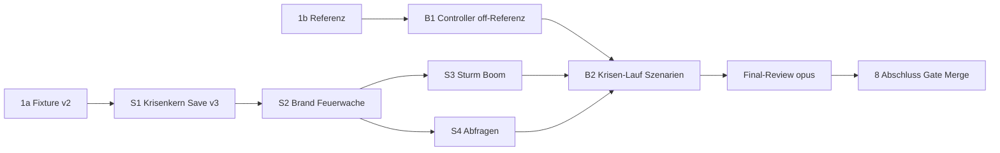

# M6 „Krisen und Stadtdienste" — Sim-Strang — Implementation Plan

> **For agentic workers:** REQUIRED SUB-SKILL: Use superpowers:subagent-driven-development (recommended) or superpowers:executing-plans to implement this plan task-by-task. Steps use checkbox (`- [ ]`) syntax for tracking.

**Goal:** Den Sim-Teil von M6 (Pakete S1, S2, S3, S4, B1, B2) umsetzen: Krisenstufe, Perioden und seed-abgeleiteter
Zufall, Brand mit Feuerwache, Sturm, Boom, Save v3 mit Migration, Sim-Abfragen, ausgelagerter Balancing-Controller
mit bitgleicher `off`-Referenz und Krisen-Lauf. Verhaltensneutral für `main`, weil `createWorld` standardmässig
`crisisLevel 'off'` setzt (R82 a).

**Architecture:** Ein neues Sim-Modul `src/sim/crises.ts` (Ziehung je Periode, Krisenschritt, Brandfolgen) und
eine neue Werte-Datei `src/sim/defs/crises.ts`; der Krisenschritt läuft in `step()` nach den Aufträgen und vor dem
Sieg. Die Wirkungen greifen an genau vier Stellen in bestehenden Modulen (`production.ts`, `population.ts`,
`roads.ts`, `trade.ts`); `queries.ts` liefert die reinen Sichten für UI und Renderer. Drei Worktrees mit getrennter
Datei-Ownership; Integration per `git merge <strang-branch>` in den abhängigen Branch wie in M5.

**Tech Stack:** TypeScript, Vitest (Umgebung `node`). Keine neue Abhängigkeit, auch keine Dev-Abhängigkeit.

**Spec:** `docs/superpowers/specs/2026-09-30-m6-krisen-design.md` (Stand `docs/m6-spec` @ ab536d1, 77 AK; Gate Spec
bestanden mit Auflagen R82, Nachtrag angenommen R85). Dieser Plan deckt nur S1–S4, B1, B2 (46 AK); UI (U1–U3),
Render (R2) und die Verdrahtung plant `lead-tech` später gemeinsam mit M7. Alle AK stehen mit Eingaben und
Sollwerten in Spec §17; jede Task nennt, welcher Test welches AK abdeckt.

## Global Constraints

- Keine neue Abhängigkeit (ADR-001); Dateizugriff in Tests nur über die Typ-Shim `tests/sim/node-shim.d.ts`,
  JSON-Fixtures per `?raw`-Import. Der Hook `dep-guard` wird nie umgangen.
- `src/sim/**` DOM-frei und deterministisch; Zufall nur über `createRng` aus `src/sim/rng.ts`, eine neue Instanz je
  Periode (ADR-010). Sim-Aktionen werfen nie, sie liefern `Result`.
- Spielwerte nur in `src/sim/defs/` (Spec 4.4): `defs/timing.ts` `CRISIS_FIRST_TICK` 2400, `STORM_WARNING` 200,
  `STORM_DURATION` 300, `FIRE_OUTAGE` 200, `BOOM_DURATION` 300; `defs/crises.ts` `CRISIS_LEVELS`
  (`off` „aus"/`null`, `mild` 1200, `normal` 600), `DEFAULT_WORLD_CRISIS_LEVEL` `'off'`,
  `DEFAULT_NEW_GAME_CRISIS_LEVEL` `'normal'`, `CRISIS_WEIGHTS` fire 50 / storm 25 / boom 25, `FIRE_HIT_RADIUS` 2,
  `BOOM_PCT` 150, `STORM_TICK_DIVISOR` 2, `CRISIS_SALT` `0x85ebca6b`.
- Save: `SAVE_VERSION = 3`; Kette v1 → v2 → v3 **sequenziell** in `deserialize`; unbekannte Version →
  `Unbekannte Version`, Strukturfehler → `Beschädigter Spielstand`; `deserialize` wirft nie.
  `localStorage`-Schlüssel bleiben unverändert (UI-Sache, nicht Teil dieses Plans).
- **Key-Reihenfolge der Welt:** `crisisLevel` und `crisis` stehen in `createWorld` und in `migrateV2ToV3` **am Ende**
  des Objekts (nach `order`). Sonst bricht der normalisierte Fingerabdruck von AK-B1-02.
- `tests/sim/balance.test.ts` bleibt grün (Sieg ≤ 7500). **Jede Task meldet den Sieg-Tick**
  (`VITE_BALANCE_LOG=1 npx vitest run tests/sim/balance.test.ts --silent=false --reporter=verbose`); Baseline auf
  `main`: **6050** (firstSettler 350, firstCitizen 3850, minMoney 57, endMoney 212). Jede Abweichung in S1–S4 ist
  ein Fehler (Krisen sind `off`), nicht Balancing: Stopp und Bericht.
- **Testnamen:** M6-Tests stehen in eigenen `describe('M6 …')`-Blöcken, der Testname beginnt mit der AK-Nummer
  (`it('AK-S1-07 …')`). Grund: M5-Tests tragen dieselben Nummern (z. B. `AK-S1-02` in `save.test.ts`); die
  Abdeckung prüft das Final-Review über den `describe`-Präfix (Befehl im Abschnitt „Final-Review").
- Commit-Präfixe `feat:`, `fix:`, `test:`, `docs:`, `refactor:`; kein Push, kein Merge nach `main`, kein Rebase.
  Merge nach `main` nur durch `production-integrator` nach dem Gate Merge.
- **Prettier im Worktree ausführen** (`cd .worktrees/<name> && npx prettier --write <dateien>`), nie aus dem
  Hauptrepo auf Worktree-Pfade (`.worktrees/` ist dort ignoriert).
- Mermaid ohne `\n` in Node-Labels.
- **Befunde ausserhalb des Scopes** schreiben Arbeiter nicht selbst nach `docs/beobachtungen.md` (drei Branches,
  eine Datei), sondern in ihren Bericht; `lead-tech` sammelt sie und meldet sie in Task 8 an L0. L0 trägt sie nach
  dem Merge auf `main` ein (R87 5); kein Branch dieses Plans ändert `docs/beobachtungen.md`.

## Review Focus

Fünf Eingaben bzw. Zustände, die die Spec impliziert, aber kein AK ausdrücklich prüft; der Test steht jeweils in
der Task, die den Code besitzt:

1. **Laden eines Spielstands mit laufender Krise auf Stufe `mild`** (Periode 1 startet bei 3600, nicht 3000): der
   Stand muss laden; eine Prüfung mit fest 600 würde echte mild-Stände als beschädigt abweisen. → Task 3 (S1),
   Test `RF-1`.
2. **Boom-Gut bei einem Aufstieg im selben Tick wie der Periodenstart:** Der Pool nutzt die Höchststufe nach
   `tickPopulation` desselben Ticks (Spec 4.2), sonst weicht die Ziehung vom Spielstand ab. → Task 3 (S1),
   Test `RF-2`.
3. **Brand trifft ein nicht angebundenes Gebäude:** Gebühr wird gebucht, Zustand `burning` hat Vorrang, nach dem
   Ausfall `notConnected` (nicht `ok`). → Task 4 (S2), Test `RF-3`.
4. **Speichern an den Rändern des Ausfalls** (`world.tick` T direkt nach Brandbeginn und T + 199, ein Tick vor dem
   Ende): beide Stände laden, und der Verlauf ist gleich wie ohne Laden. → Task 4 (S2), Test `RF-4`.
5. **Spielstand mit Brand, dessen Ziel abgerissen wurde:** `crisis.target` zeigt auf kein Gebäude; der Stand lädt
   (kein `Beschädigter Spielstand`), und `tickCrises` läuft bis `until`. → Task 4 (S2), Test `RF-5`.

---

## Organisation

### Worktrees, Branches und Rollen

| Worktree / Branch                                   | Pakete (Reihenfolge)              | Implementierer (Modell)      | Review je Task              |
| --------------------------------------------------- | --------------------------------- | ---------------------------- | --------------------------- |
| `.worktrees/m6-sim` · `feat/m6-sim`                 | Task 1a → S1 → S2 → S3            | `tech-sim-engineer` (sonnet) | `qa-code-reviewer` (sonnet) |
| `.worktrees/m6-sim-queries` · `feat/m6-sim-queries` | S4 (Branch ab `feat/m6-sim` @ S2) | `tech-sim-engineer` (sonnet) | `qa-code-reviewer` (sonnet) |
| `.worktrees/m6-balance` · `feat/m6-balance`         | Task 1b → B1 → B2                 | `tech-sim-engineer` (sonnet) | `qa-code-reviewer` (sonnet) |
| Final-Review über `feat/m6-balance` (enthält alles) | —                                 | —                            | `lead-qa` (opus)            |

- Controller aller Worktrees: `lead-tech`. Kein zusätzlicher `tech-save-engineer` (KISS): Der S1-Implementierer
  bekommt die Save-Expertise aus dem Roster-Eintrag `tech-save-engineer` ins Briefing.
- B1 und B2 ändern nur Testdateien unter `tests/sim/`; Implementierer ist trotzdem `tech-sim-engineer`
  (Spec 16 nennt `design-balancing-analyst` als Mit-Owner; die Messwerte wertet `lead-tech` in Task 8 aus).
- Urteil je Review: OK / BEDENKEN / ZURÜCK. Fix-Runden per `SendMessage` an denselben Implementierer (zählt nicht
  als Start). Keine UI-Tasks, daher keine `qa-playtester`-Checks.
- **Parallelität 2 zählt alle L2-Starts** (R87 4): höchstens 2 gleichzeitig laufende Arbeiter, Implementierer und
  Reviewer zusammen; nie zwei Implementierer im selben Worktree. Läuft in Welle 1 der S1-Review, wartet der
  B1-Review, bis einer der beiden fertig ist.

**Einrichten** (Controller, einmal je Worktree):

```bash
cd /Users/KN/CAS/projekte/anno-clone
git worktree add .worktrees/m6-sim -b feat/m6-sim main
ln -s ../../node_modules .worktrees/m6-sim/node_modules
git worktree add .worktrees/m6-balance -b feat/m6-balance main
ln -s ../../node_modules .worktrees/m6-balance/node_modules
git rev-parse --short main            # Basis-SHA für Task 1a/1b notieren
# erst nach Review-OK von S2 (SHA aus dem S2-Bericht):
git worktree add .worktrees/m6-sim-queries -b feat/m6-sim-queries <S2-SHA>
ln -s ../../node_modules .worktrees/m6-sim-queries/node_modules
```

### Datei-Ownership

Jede Datei hat genau einen Owner-Task; Tasks im selben Branch laufen nacheinander.

| Task       | Branch                | Dateien                                                                                                                                                                                                                                                                                                                                                                                                                                                                                                    |
| ---------- | --------------------- | ---------------------------------------------------------------------------------------------------------------------------------------------------------------------------------------------------------------------------------------------------------------------------------------------------------------------------------------------------------------------------------------------------------------------------------------------------------------------------------------------------------- |
| 1a (S1)    | `feat/m6-sim`         | `tests/sim/fixtures/save-v2.json` (neu)                                                                                                                                                                                                                                                                                                                                                                                                                                                                    |
| 3 (S1)     | `feat/m6-sim`         | `src/sim/types.ts` (ohne `BuildingDefId`), `src/sim/defs/crises.ts` (neu), `src/sim/defs/timing.ts`, `src/sim/world.ts`, `src/sim/crises.ts` (neu), `src/sim/tick.ts`, `src/sim/orders.ts`, `src/sim/save.ts`, `tests/sim/crises.test.ts` (neu), `tests/sim/save.test.ts`, `tests/sim/tick.test.ts`, `docs/adr/ADR-005-tick-reihenfolge-und-zustaende.md`, `docs/adr/ADR-010-zufall-je-periode.md`, `docs/arc42.md` (nur §8 „Persistenz" und „Determinismus und Seed"); **Ausnahme A** `src/ui/inspect.ts` |
| 4 (S2)     | `feat/m6-sim`         | `src/sim/types.ts` (`BuildingDefId`), `src/sim/defs/buildings.ts`, `src/sim/crises.ts`, `src/sim/production.ts`, `src/sim/population.ts`, `src/sim/roads.ts`, `tests/sim/fire.test.ts` (neu), `tests/sim/defs.test.ts`; **Ausnahme B** `tests/sim/scenarios.ts`                                                                                                                                                                                                                                            |
| 5 (S3)     | `feat/m6-sim`         | `src/sim/defs/buildings.ts`, `src/sim/production.ts`, `src/sim/trade.ts`, `tests/sim/storm.test.ts` (neu), `tests/sim/trade.test.ts`                                                                                                                                                                                                                                                                                                                                                                       |
| 6 (S4)     | `feat/m6-sim-queries` | `src/sim/queries.ts`, `tests/sim/queries.test.ts`                                                                                                                                                                                                                                                                                                                                                                                                                                                          |
| 1b, 2 (B1) | `feat/m6-balance`     | `tests/sim/controller.ts` (neu), `tests/sim/balance.test.ts`, `tests/sim/balance-crises.test.ts` (neu, nur Fall `off`)                                                                                                                                                                                                                                                                                                                                                                                     |
| 7 (B2)     | `feat/m6-balance`     | `tests/sim/controller.ts`, `tests/sim/balance-crises.test.ts`, `tests/sim/scenarios.ts`, `tests/sim/scenario-saves.test.ts`                                                                                                                                                                                                                                                                                                                                                                                |
| 8          | —                     | nur Übergabe `.studio/handoffs/m6-sim-gate-merge.md` (Hauptrepo); Befunde meldet der Bericht (R87 5)                                                                                                                                                                                                                                                                                                                                                                                                       |

**Benannte Ausnahmen (nur diese):**

- **A — `src/ui/inspect.ts` (S1, Spec 16):** genau ein `case 'burning'` in `stateInfo`. `stateInfo` hat kein
  `default`; mit dem neuen Zustand bricht sonst `tsc` („Function lacks ending return statement"). Die Zeile geht mit
  dem Sim-Strang auf `main`; M7-U2 und M6-U1 übernehmen sie per `git merge main`.
- **B — `tests/sim/scenarios.ts` (S2, nicht in Spec 16):** genau eine Zeile in `galerie()`,
  `put(w, 'firestation', kx + 13, ky + 1)`. Grund: `scenario-saves.test.ts` („galerie: jeder Gebäudetyp …")
  iteriert `BUILDING_IDS` und wird mit der 14. Id rot. B2 besitzt die Datei danach; sie erreicht
  `feat/m6-balance` per Merge vor B2, ein Konflikt ist ausgeschlossen (B1 berührt `scenarios.ts` nicht).
- **Anpassungen bestehender Tests (im eigenen Owner-File, keine Ausnahme):** S1 hebt in `tests/sim/save.test.ts` die
  Versionsnummern der M5-Tests an (`uses version 2` → 3, M5-`AK-S1-01`/`AK-S1-02` `version` 2 → 3, „unbekannte
  Version" 3 → 4 an zwei Stellen); S2 hebt in `tests/sim/defs.test.ts` „13 building defs" auf 14. Geprüft und
  **ohne Bruch**: `tests/ui/*` (kein Test iteriert Gebäude-Ids oder Zustände; `tests/ui/storage.test.ts` nutzt einen
  absichtlich kaputten `{version: 2, seed: 1}`-Stand, der nach Migration weiterhin als beschädigt abgewiesen wird),
  `tests/render/*`, `tests/sim/toolmaker.test.ts`, `tests/sim/scenario-saves.test.ts` ausser `galerie`
  (`AK-S5-01` vergleicht mit `SAVE_VERSION`).

### Abhängigkeiten (blocked-by) und Merges

Ein abhängiger Task startet erst nach Review-Urteil OK des Vorgängers. Integration nur geprüfter SHAs:
`git -C .worktrees/<eigener> merge --no-edit <sha>` (kein Rebase).

| Task             | blocked-by      | vor Start in den eigenen Worktree mergen                                             |
| ---------------- | --------------- | ------------------------------------------------------------------------------------ |
| 1a Fixture (S1)  | —               | — (HEAD = `main`, noch keine Code-Änderung)                                          |
| 1b Referenz (B1) | —               | — (HEAD = `main`)                                                                    |
| 2 B1             | 1b              | (gleicher Worktree)                                                                  |
| 3 S1             | 1a              | (gleicher Worktree)                                                                  |
| 4 S2             | S1              | (gleicher Worktree)                                                                  |
| 5 S3             | S2              | (gleicher Worktree)                                                                  |
| 6 S4             | S2              | Worktree wird am S2-SHA angelegt                                                     |
| 7 B2             | B1, S3, S4      | `feat/m6-sim` (SHA mit S3-OK), dann `feat/m6-sim-queries` (SHA mit S4-OK)            |
| Final-Review     | B2              | `main` (aktueller Stand) in `feat/m6-balance`, damit der geprüfte Stand mergebar ist |
| 8 Abschluss      | Final-Review OK | —                                                                                    |



**Wellen (Parallelität 2):**

| Welle | Implementierer 1 (`m6-sim` / `m6-sim-queries`) | Implementierer 2 (`m6-balance`) |
| ----- | ---------------------------------------------- | ------------------------------- |
| 1     | 1a → S1                                        | 1b → B1                         |
| 2     | S2                                             | —                               |
| 3     | S3 (`m6-sim`)                                  | S4 (`m6-sim-queries`)           |
| 4     | —                                              | B2                              |

### Ablauf je Task (Controller `lead-tech`)

1. `python3 tools/studio/log.py package --id M6-<Paket> --title "<Titel>" --owner lead-tech --status active --milestone M6 [--blocked-by M6-<…>]`
2. Implementierer im Vordergrund starten, Briefing nach `docs/studio/templates/briefing.md`: Kopfzeilen, feste Regeln
   wörtlich, Logging-Block, Worktree-Pfad, Task-Text aus diesem Plan wörtlich, Spec-Pfad,
   „Budget: keins, keine Agenten starten".
3. Implementierer arbeitet die Schritte ab: Test schreiben → rot laufen lassen (exakter Befehl, erwartete Meldung) →
   minimal implementieren → grün → `make check` → Sieg-Tick melden → Commit.
4. `qa-code-reviewer` (sonnet) gegen Task-Text und Spec-Abschnitt: Urteil OK / BEDENKEN / ZURÜCK; Fix-Runden per
   `SendMessage`. Der Review prüft im Rot-Log des Implementierers, dass jeder neue Test vor der Umsetzung rot war
   (Import-Fehler zählt nur, solange es keinen Stub gibt; nach dem Stub muss eine Assertion scheitern). Ausgenommen
   sind nur die Tests der Liste „Vor der Umsetzung grün erlaubt" unten (R87 2); jeder andere Test, der vor der
   Umsetzung grün ist, ist ein Befund („Test prüft nichts").

**Vor der Umsetzung grün erlaubt** (Test sichert Bestehendes oder eine Eigenschaft, die aus einem früheren Task
stammt; das Briefing nennt die Liste, der Review hakt sie ab):

| Task   | Tests                                                                                                                                                                   | Grund                                                                                              |
| ------ | ----------------------------------------------------------------------------------------------------------------------------------------------------------------------- | -------------------------------------------------------------------------------------------------- |
| 2 (B1) | AK-B1-01; AK-B1-02 bis auf den Fingerabdruck                                                                                                                            | reiner Verschiebe-Diff bzw. Referenz auf unverändertem Code; rot ist nur die Platzhalter-Konstante |
| 3 (S1) | alle bestehenden M5-Tests in `save.test.ts` und `tick.test.ts` nach Anhebung der Versionsnummern                                                                        | Regressionsschutz                                                                                  |
| 4 (S2) | —                                                                                                                                                                       | —                                                                                                  |
| 5 (S3) | AK-S3-02 (Vorwarnung wirkungslos), AK-S3-05 (Invariante, `BOOM_PCT` kommt aus S1; Kaufen und Verkaufen ist schon ohne Boom ein Verlust), AK-S3-07 (bitgleich ohne Boom) | sichern das Verhalten, das S3 nicht ändern darf                                                    |
| 6 (S4) | AK-S4-06 (`placementZone` ohne Codeänderung); in AK-S4-04 der Fall „100 Schritte ohne Brand"                                                                            | Bestand aus M5 bzw. S2                                                                             |
| 7 (B2) | AK-B2-05, AK-B2-06 (Determinismus über Laden), sobald der Controller-Stub steht                                                                                         | Determinismus folgt aus S1–S4; B2 ergänzt nur die Controller-Option                                |

5. `log.py result … --outcome <angenommen|nacharbeit|verworfen> --review-rounds <n>`; nach OK Paket auf `done`,
   SHA in die Übergabe `.studio/handoffs/m6-sim-stand.md` (Paket, Branch, SHA, Sieg-Tick, Befunde ausserhalb Scope).

### Schnittstellen und bekannte Risiken

- **Feuerwache in der Bauleiste nach S2 (bekanntes Risiko, keine UI-Arbeit):** `buildMenu.ts` listet alle
  `BUILDING_IDS` der Kategorie `public`; nach S2 erscheint „Feuerwache" automatisch neben Kapelle und Schule, mit
  Tooltip „Radius: 8", ohne Hotkey (E kommt mit U1) und mit Ersatz-Silhouette (`SILHOUETTES` ist `Partial`). Auf
  `main` kostet sie nur Unterhalt, weil Krisen `off` sind (Spec 16). `inspect.ts` zeigt für sie „Angebunden".
- **Abnehmer warten auf den Merge auf `main`** (R87 3, R82 a): M7-R2-FW (Silhouette Feuerwache), M6-R2
  (`overlays.ts`), M6-U1 und M8-Sim sind **blocked-by M6-Sim-Merge auf `main`**. Kein Branch ausserhalb dieses Plans
  merged einen SHA aus `feat/m6-sim`, `feat/m6-sim-queries` oder `feat/m6-balance`; ungeprüfter Sim-Code gelangt
  nicht in M7 oder M8.
- **R85:** betrifft UI (`EXTINGUISHED_TICKS` exportiert M7, `FIRE_SMOKE_TAIL` steht in `src/ui/crisisFx.ts`) und
  R2. **Keine neue Konstante in `src/sim/defs/`** aus R85; `crisisView` liefert `from`, `until`, `targetExists`
  (Spec 11), den Rauch-Nachlauf bewusst nicht (Spec 12.4).
- **Krisen-Lauf über 8000** (Spec 15, Hinweis `lead-qa`: Folge `s f s b f f f s` bis 6600, erste Krise ein Sturm):
  B2 stoppt und meldet, stellt nichts nach; neue Kurz-Spec über `lead-design`.
- **Controller-Endzustand weicht von der Spec-Schätzung ab:** gemessen (Plan-Vorabmessung, `main` 3f66ddd) enden
  10 Fischer, 5 Stoff- und 3 Rum-Paare; der Feuerwachen-Platz `[kx + 9, ky + 6]` (13. Fischerplatz) bleibt frei.
- **Boom-Anteil im Controller:** `sellSurplus` verkauft bei ≥ 50 Einheiten; ein Boom trifft das zufällig. Kein
  Risiko für Tests, nur für die Messwerte.

---

## Task 1: Vorlauf auf dem `main`-Stand (1a Fixture · 1b Referenz)

Beide Teile laufen **vor jeder Code-Änderung** und parallel: 1a im Worktree `m6-sim` (Paket S1, erster Commit auf
`feat/m6-sim`), 1b im Worktree `m6-balance` (Paket B1, nur Messung, kein Commit). So blockiert 1a S1 nur für
Minuten, und die Referenz gehört zu B1, dessen Branch bis B2 ohnehin den Code vor S1 trägt. Kein eigener Start:
1a ist Schritt 1 des S1-Implementierers, 1b Schritt 1 des B1-Implementierers; das Review läuft mit S1 bzw. B1.

### Task 1a: v2-Fixture (Worktree `.worktrees/m6-sim`, Implementierer S1)

**Files:** Create `tests/sim/fixtures/save-v2.json` (`tests/sim/fixtures/` steht schon in `.prettierignore`).

- [ ] **Schritt 1: Prüfen, dass HEAD = `main`.** `git -C .worktrees/m6-sim log -1 --format=%h` gleich
      `git rev-parse --short main`; SHA notieren (Erzeugungs-Commit).
- [ ] **Schritt 2: Temporären Erzeuger anlegen** (wird wieder gelöscht):

```ts
// tests/sim/gen-save-v2.test.ts — TEMPORÄR, nach der Erzeugung löschen
import { it } from 'vitest';
import { writeFileSync } from 'node:fs';
import { placeBuilding, placeRoad } from '../../src/sim/build';
import { serialize } from '../../src/sim/save';
import { setTaxLevel } from '../../src/sim/tax';
import { step } from '../../src/sim/tick';
import { sell } from '../../src/sim/trade';
import { createWorld } from '../../src/sim/world';
import { forceGrass, prepareEast } from './helpers';

it.runIf(import.meta.env.GEN_SAVE_V2)('erzeugt tests/sim/fixtures/save-v2.json', () => {
  const w = createWorld(3);
  const k = w.buildings[w.kontorId]!;
  prepareEast(w, k);
  for (let i = 0; i < 4; i++) if (!placeRoad(w, k.x + 2 + i, k.y).ok) throw new Error('road');
  if (!placeBuilding(w, 'lumberjack', k.x + 6, k.y).ok) throw new Error('lumberjack');
  forceGrass(w, k.x, k.y - 1);
  if (!placeBuilding(w, 'house', k.x, k.y - 1).ok) throw new Error('house');
  while (w.tick < 1000) step(w);
  if (!setTaxLevel(w, 'low').ok) throw new Error('tax');
  while (w.tick < 1590) step(w);
  if (!sell(w, 'wood', 10).ok) throw new Error('sell');
  while (w.tick < 1600) step(w);
  if (w.version !== 2 || w.order === null || w.sellPct.wood >= 100)
    throw new Error('Vorgaben verfehlt');
  writeFileSync('tests/sim/fixtures/save-v2.json', serialize(w));
});
```

- [ ] **Schritt 3: Erzeugen, prüfen, Erzeuger löschen.**

```bash
cd /Users/KN/CAS/projekte/anno-clone/.worktrees/m6-sim
GEN_SAVE_V2=1 npx vitest run tests/sim/gen-save-v2.test.ts
rm tests/sim/gen-save-v2.test.ts
grep -o '"version":2' tests/sim/fixtures/save-v2.json          # muss treffen
grep -o '"order":{"period":1,"good":"wood","amount":38' tests/sim/fixtures/save-v2.json
```

Erwartung (Plan-Vorabmessung mit dem `main`-Code): Tick 1600, `order` = Periode 1, Holz 38, Prämie 266, `due`
2100; `sellPct.wood` 91; `taxLevel 'low'`, `taxLockedUntil` 1300; 3 Gebäude. Weicht das ab, nicht anpassen,
sondern melden (der Fixture-Inhalt wird trotzdem eingecheckt, AK-S1-02 vergleicht gegen die Datei selbst).

- [ ] **Schritt 4: Commit** `test: v2-Spielstand als Fixture für die Migration (Seed 3, Tick 1600, Auftrag, Verkauf)`
      (nur die Fixture-Datei). Commit-Hash **des Basis-Commits** (Schritt 1) geht in den Testkommentar von AK-S1-02.

### Task 1b: `off`-Referenz messen (Worktree `.worktrees/m6-balance`, Implementierer B1)

- [ ] **Schritt 1:** HEAD = `main` prüfen wie in 1a, SHA notieren.
- [ ] **Schritt 2: Laufdaten messen** (unveränderter Code):

```bash
cd /Users/KN/CAS/projekte/anno-clone/.worktrees/m6-balance
VITE_BALANCE_LOG=1 npx vitest run tests/sim/balance.test.ts --silent=false --reporter=verbose
```

Erwartung (Plan-Vorabmessung, `main` 3f66ddd, gleicher Code unter Node):
`firstSettler 350, firstCitizen 3850, winTick 6050, minMoney 57, endMoney 212`, Gebäude
`kontor 1, house 4, lumberjack 2, fisher 10, chapel 1, sheepfarm 5, weaver 5, school 1, canefarm 3, distillery 3`;
FNV-1a-32 über `serialize(w)` der Endwelt **`0xbfeac8c6`** (den Fingerabdruck misst Task 2 Schritt 4 im Vitest).
**Weicht ein Wert ab** (Laufdaten oder Fingerabdruck): **Stopp und Bericht an `lead-tech`**, keine Übernahme der
gemessenen Werte (R87 1). Die Referenz stammt aus der Plan-Vorabmessung; eine Abweichung auf demselben Code heisst,
dass Messweg oder Stand nicht stimmen.

---

## Task 2: B1 — Controller-Auslagerung und `off`-Referenz

**Worktree** `.worktrees/m6-balance` · **Implementierer** `tech-sim-engineer` (Fortsetzung aus 1b) · **blocked-by** 1b ·
**AK** AK-B1-01, AK-B1-02

**Files:**

- Create: `tests/sim/controller.ts`, `tests/sim/balance-crises.test.ts`
- Modify: `tests/sim/balance.test.ts`

**Interfaces (Produces, für B2):**

```ts
// tests/sim/controller.ts
export const MAX_TICKS = 9000;
export const WIN_TICK_LIMIT = 7500;
export interface Trajectory {
  firstSettler: number | null;
  firstCitizen: number | null;
  winTick: number | null;
  minMoney: number;
  endMoney: number;
  buildings: Partial<Record<BuildingDefId, number>>;
}
export function prepareLayout(w: World): Layout;
export function buildColony(w: World): Trajectory;
```

- [ ] **Schritt 1: Verschieben (reiner Verschiebe-Diff).** Alles zwischen den Imports und `describe(` aus
      `balance.test.ts` (Konstanten `MAX_TICKS` … `SURPLUS_GOODS`, `Slot`, `Layout`, `Need`, `CHAINS`, `NO_COST`,
      `prepareLayout`, `count`, `houses`, `planTier`, `producersNeeded`, `upgradeReserve`, `buyMissing`,
      `fullPrice`, `sellSurplus`, `build`, `buildChain`, `control`, `Trajectory`, `buildColony`) wörtlich nach
      `tests/sim/controller.ts`, mit den dafür nötigen Imports (inkl. `import { expect } from 'vitest';`). Einzige
      Änderungen: `export` vor `MAX_TICKS`, `WIN_TICK_LIMIT`, `Layout`, `prepareLayout`, `Trajectory`,
      `buildColony`; Kopfkommentar
      `// Balancing-Controller (ausgelagert aus balance.test.ts, M6-B1). Kein Test: wird von balance.test.ts und balance-crises.test.ts genutzt.`
      `balance.test.ts` behält nur Imports und den `describe`-Block:

```ts
import { describe, expect, it } from 'vitest';
import { WIN_CITIZENS } from '../../src/sim/defs/tiers';
import { citizens } from '../../src/sim/population';
import { createWorld } from '../../src/sim/world';
import { buildColony, MAX_TICKS, WIN_TICK_LIMIT } from './controller';

describe('balance: scripted colony (Kurz-Spec Balancing)', () => {
  // unverändert
});
```

- [ ] **Schritt 2: Nachweis „nur verschoben".** `git diff --stat` zeigt nur die zwei Dateien;
      `git diff -M balance.test.ts controller.ts` enthält ausser Imports, Kopfkommentar und `export` keine
      geänderte Zeile. Dann dieselbe Messung wie 1b: **gleiche Laufdaten** (Sieg 6050, `minMoney` 57).
- [ ] **Schritt 3: Failing test** `tests/sim/balance-crises.test.ts`:

```ts
import { describe, expect, it } from 'vitest';
import { serialize } from '../../src/sim/save';
import { createWorld } from '../../src/sim/world';
import { buildColony } from './controller';

/** FNV-1a, 32 Bit, über die UTF-16-Codeeinheiten (Test-Helfer, keine Abhängigkeit). */
function fnv1a32(s: string): number {
  let h = 0x811c9dc5;
  for (let i = 0; i < s.length; i++) {
    h ^= s.charCodeAt(i);
    h = Math.imul(h, 0x01000193) >>> 0;
  }
  return h;
}

/** Endwelt ohne die M6-Felder (Spec 15): `version` 2, `crisisLevel` und `crisis` entfernt. */
function normalized(json: string): string {
  const raw = JSON.parse(json) as Record<string, unknown>;
  raw.version = 2;
  delete raw.crisisLevel;
  delete raw.crisis;
  return JSON.stringify(raw);
}

// `off`-Referenz, gemessen auf dem Code vor M6-S1: main <SHA aus Task 1b> in .worktrees/m6-balance
// (Plan M6-Sim, Task 1b/2). Vorabmessung im Plan (main 3f66ddd) identisch.
const OFF_REFERENCE = {
  firstSettler: 350,
  firstCitizen: 3850,
  winTick: 6050,
  minMoney: 57,
  endMoney: 212,
  buildings: {
    kontor: 1,
    house: 4,
    lumberjack: 2,
    fisher: 10,
    chapel: 1,
    sheepfarm: 5,
    weaver: 5,
    school: 1,
    canefarm: 3,
    distillery: 3,
  },
};
const OFF_FINGERPRINT = 0x00000000; // Schritt 4 ersetzt den Wert durch die Messung (erwartet 0xbfeac8c6)

describe('M6 Krisen-Lauf', () => {
  it('AK-B1-02 Stufe off: Laufdaten und Fingerabdruck der normalisierten Endwelt wie vor M6', () => {
    const w = createWorld(3);
    const t = buildColony(w);
    const fp = fnv1a32(normalized(serialize(w)));
    if (import.meta.env.VITE_BALANCE_LOG)
      console.log({ level: 'off', ...t, fingerprint: `0x${fp.toString(16).padStart(8, '0')}` });
    expect(t).toEqual(OFF_REFERENCE);
    expect(fp).toBe(OFF_FINGERPRINT);
  });
});
```

- [ ] **Schritt 4: Rot, messen, festschreiben.**
      `VITE_BALANCE_LOG=1 npx vitest run tests/sim/balance-crises.test.ts --silent=false --reporter=verbose` →
      FAIL `expected 3219835078 to be +0` (0xbfeac8c6 = 3219835078); der Log zeigt den Fingerabdruck. Die
      Konstante auf `0xbfeac8c6` setzen (Kommentar „Referenz Plan-Vorabmessung, bestätigt in Task 2") und
      erneut laufen lassen → PASS. **Zeigt der Log einen anderen Fingerabdruck oder weichen die Laufdaten von
      `OFF_REFERENCE` ab: Stopp und Bericht an `lead-tech`, nie den gemessenen Wert übernehmen** (R87 1).
- [ ] **Schritt 5: `AK-B1-01` im Test benennen.** In `balance.test.ts` den bestehenden `it` unverändert lassen und
      einen Kommentar über `describe` setzen: `// AK-B1-01: Controller aus ./controller (M6-B1), Sieg 6050 vor und nach der Auslagerung.`
      (Der Test selbst bleibt der Regressionsschutz; kein neuer Ausdruck.)
- [ ] **Schritt 6:** `npx prettier --write tests/sim/controller.ts tests/sim/balance.test.ts tests/sim/balance-crises.test.ts`;
      `make check`; Sieg-Tick melden (6050).
- [ ] **Schritt 7: Commits**
      `refactor: Balancing-Controller nach tests/sim/controller.ts ausgelagert (Sieg 6050 unverändert)` (Schritt 1) und
      `test: off-Referenz des Balancing-Laufs mit Fingerabdruck der Endwelt (M6-B1)` (Schritte 3–5).

---

## Task 3: S1 — Krisenkern, Save v3, ADR-Nachträge

**Worktree** `.worktrees/m6-sim` · **Implementierer** `tech-sim-engineer` (Fortsetzung aus 1a; Save-Expertise aus
dem Roster) · **blocked-by** 1a · **AK** AK-S1-01 … AK-S1-13, `RF-1`, `RF-2`

**Files:**

- Create: `src/sim/defs/crises.ts`, `src/sim/crises.ts`, `tests/sim/crises.test.ts`
- Modify: `src/sim/types.ts`, `src/sim/defs/timing.ts`, `src/sim/world.ts`, `src/sim/tick.ts`, `src/sim/orders.ts`,
  `src/sim/save.ts`, `src/ui/inspect.ts` (Ausnahme A), `tests/sim/save.test.ts`, `tests/sim/tick.test.ts`,
  `docs/adr/ADR-005-tick-reihenfolge-und-zustaende.md`, `docs/adr/ADR-010-zufall-je-periode.md`, `docs/arc42.md`

**Interfaces (Produces):**

```ts
// types.ts
export type CrisisLevel = 'off' | 'mild' | 'normal';
export interface CrisisLevelDef {
  name: string; // Anzeige: aus | mild | normal
  period: number | null; // Ticks je Periode; null = keine Krisen
}
export type CrisisKind = 'fire' | 'storm' | 'boom';
export type FireOutcome = 'burning' | 'extinguished' | 'miss';
export interface Crisis {
  period: number;
  kind: CrisisKind;
  from: number; // erster Tick mit Wirkung
  until: number; // letzter Tick mit Wirkung; am Ende dieses Schritts entfernt
  good?: GoodId; // nur boom
  tile?: { x: number; y: number }; // nur fire; fehlt ohne brennbares Gebäude
  target?: number; // nur fire; fehlt bei 'miss'
  outcome?: FireOutcome; // nur fire
}
export type BuildingState = 'ok' | 'waitingInput' | 'storageFull' | 'notConnected' | 'burning';
// Building: + outageUntil?: number   (letzter Ausfall-Tick; nur bei state 'burning')
// BuildingDef: + flammable?: boolean; stormAffected?: boolean; fireProtection?: boolean
// World: version: 3; … order: Order | null; crisisLevel: CrisisLevel; crisis: Crisis | null;
// world.ts
export function createWorld(seed: number, opts?: { crisisLevel?: CrisisLevel }): World;
// orders.ts
export function maxHouseTier(world: World): Tier; // bisher modulintern
export function orderPool(maxTier: Tier): GoodId[]; // Pool der Aufträge und Booms
// crises.ts
export interface TileRect {
  x0: number;
  y0: number;
  x1: number;
  y1: number;
} // Grenzen inklusive
export interface CrisisRoll {
  kind: CrisisKind;
  tile?: { x: number; y: number };
  good?: GoodId;
}
export function rollCrisis(
  seed: number,
  k: number,
  maxTier: Tier,
  rect: TileRect | null,
): CrisisRoll;
export function flammableRect(world: World): TileRect | null;
export function crisisWindow(kind: CrisisKind, start: number): { from: number; until: number };
export function beginCrisis(world: World, k: number, roll: CrisisRoll): void; // setzt world.crisis bei T = world.tick
export function tickCrises(world: World): void;
export function nextCrisisTick(world: World): number | null;
// save.ts
export const SAVE_VERSION = 3;
export function migrateV2ToV3(raw: Record<string, unknown>): void;
```

**Hinweis für Tests und Szenarien:** `beginCrisis` nimmt `T = world.tick`. Ein speicherbarer Stand verlangt
`T = CRISIS_FIRST_TICK + k × P` der Stufe (Save-Prüfung); Tests setzen deshalb `crisisLevel 'normal'`,
`world.tick = 2400` und `k = 0` vor `beginCrisis`.

- [ ] **Schritt 1: Failing tests `tests/sim/crises.test.ts`** (AK-S1-06 … AK-S1-10, RF-2):

```ts
import { describe, expect, it } from 'vitest';
import { beginCrisis, nextCrisisTick, rollCrisis, type CrisisRoll } from '../../src/sim/crises';
import { CRISIS_LEVELS, CRISIS_WEIGHTS } from '../../src/sim/defs/crises';
import {
  BOOM_DURATION,
  FIRE_OUTAGE,
  STORM_DURATION,
  STORM_WARNING,
} from '../../src/sim/defs/timing';
import { createRng } from '../../src/sim/rng';
import { step } from '../../src/sim/tick';
import type { CrisisKind, CrisisLevel } from '../../src/sim/types';
import { createWorld } from '../../src/sim/world';

const SEQ_SEED3 = [
  'storm',
  'fire',
  'storm',
  'boom',
  'fire',
  'fire',
  'fire',
  'storm',
  'boom',
  'storm',
  'fire',
  'boom',
];

/** Art aus der eigenen Ableitung des Tests (Salt und erster Zug festgenagelt). */
function ownKind(seed: number, k: number): { kind: CrisisKind; r: () => number } {
  const r = createRng((seed ^ Math.imul(k + 1, 0x85ebca6b)) >>> 0);
  const u = Math.floor(r() * 100);
  return { kind: u < 50 ? 'fire' : u < 75 ? 'storm' : 'boom', r };
}

describe('M6 Krisenkern', () => {
  it('AK-S1-06 nextCrisisTick', () => {
    const at = (level: CrisisLevel, tick: number): number | null => {
      const w = createWorld(3, { crisisLevel: level });
      w.tick = tick;
      return nextCrisisTick(w);
    };
    expect(at('normal', 0)).toBe(2400);
    expect(at('normal', 2399)).toBe(2400);
    expect(at('normal', 2400)).toBe(3000);
    expect(at('mild', 2400)).toBe(3600);
    expect(at('off', 2400)).toBeNull();
  });

  it('AK-S1-07 rollCrisis ist rein, folgt Salt und Zug-Reihenfolge, feste Sollwerte für Seed 3', () => {
    expect(createWorld(3).seed).toBe(3);
    const rect = { x0: 10, y0: 20, x1: 13, y1: 21 };
    const counts: Record<CrisisKind, number> = { fire: 0, storm: 0, boom: 0 };
    for (let k = 0; k < 200; k++) {
      for (const tier of [1, 3] as const)
        expect(rollCrisis(3, k, tier, rect)).toEqual(rollCrisis(3, k, tier, rect));
      const kind = rollCrisis(3, k, 1, rect).kind;
      expect(kind, `k=${k}`).toBe(ownKind(3, k).kind);
      counts[kind] += 1;
    }
    expect(counts).toEqual({ fire: 94, storm: 47, boom: 59 });
    expect(Array.from({ length: 12 }, (_, k) => rollCrisis(3, k, 1, null).kind)).toEqual(SEQ_SEED3);
  });

  it('AK-S1-08 Zug-Reihenfolge: Kachel aus r2/r3, Boom-Gut aus r2, Pool nach Höchststufe', () => {
    const rect = { x0: 10, y0: 20, x1: 13, y1: 21 };
    const fire = ownKind(3, 1); // Seed 3, k = 1: Brand
    expect(fire.kind).toBe('fire');
    const x = 10 + Math.floor(fire.r() * 4);
    const y = 20 + Math.floor(fire.r() * 2);
    expect(rollCrisis(3, 1, 1, rect)).toEqual({ kind: 'fire', tile: { x, y } });
    expect(rollCrisis(3, 1, 1, null)).toEqual({ kind: 'fire' });
    const pools = {
      1: ['wood', 'food'],
      3: ['wood', 'stone', 'food', 'wool', 'cloth', 'cane', 'rum'],
    } as const;
    for (const tier of [1, 3] as const) {
      const boom = ownKind(3, 3); // Seed 3, k = 3: Boom
      expect(boom.kind).toBe('boom');
      const good = pools[tier][Math.floor(boom.r() * pools[tier].length)];
      expect(rollCrisis(3, 3, tier, rect)).toEqual({ kind: 'boom', good });
    }
  });

  it.each([
    ['normal', 600, 12],
    ['mild', 1200, 6],
    ['off', 0, 0],
  ] as const)('AK-S1-09 Stufe %s: Krisenzahl bis Tick 9000', (level, P, n) => {
    const w = createWorld(3, { crisisLevel: level });
    const seen: { period: number; kind: CrisisKind; tick: number }[] = [];
    while (w.tick < 9000) {
      step(w);
      const c = w.crisis;
      if (c && !seen.some((s) => s.period === c.period))
        seen.push({ period: c.period, kind: c.kind, tick: w.tick });
    }
    expect(seen.map((s) => s.period)).toEqual(Array.from({ length: n }, (_, k) => k));
    for (const s of seen) expect(s.tick).toBe(2400 + P * s.period);
    if (level === 'normal')
      expect(seen.map((s) => s.kind[0]).join(' ')).toBe('s f s b f f f s b s f b');
  });

  it.each([
    ['fire', { kind: 'fire' }, 2400, 2600],
    ['storm', { kind: 'storm' }, 2601, 2900],
    ['boom', { kind: 'boom', good: 'wood' }, 2400, 2700],
  ] as [string, CrisisRoll, number, number][])(
    'AK-S1-10 Zeitfenster %s',
    (_n, roll, from, until) => {
      const w = createWorld(3, { crisisLevel: 'normal' });
      w.tick = 2400;
      beginCrisis(w, 0, roll);
      expect(w.crisis).toMatchObject({ period: 0, kind: roll.kind, from, until });
      while (w.tick < until - 1) {
        step(w);
        expect(w.crisis, `tick ${w.tick}`).not.toBeNull();
      }
      step(w);
      expect(w.tick).toBe(until);
      expect(w.crisis).toBeNull();
    },
  );

  it('AK-S1-10 Invariante: längste Krise kürzer als kürzeste Periode, Gewichte ergeben 100', () => {
    const periods = Object.values(CRISIS_LEVELS)
      .map((l) => l.period)
      .filter((p): p is number => p !== null);
    const shortest = Math.min(...periods);
    expect(STORM_WARNING + STORM_DURATION).toBeLessThan(shortest);
    expect(FIRE_OUTAGE).toBeLessThan(shortest);
    expect(BOOM_DURATION).toBeLessThan(shortest);
    expect(CRISIS_WEIGHTS.fire + CRISIS_WEIGHTS.storm + CRISIS_WEIGHTS.boom).toBe(100);
  });

  it('RF-2 Boom-Pool nutzt die Höchststufe desselben Ticks', () => {
    const w = createWorld(3, { crisisLevel: 'normal' });
    // Siedlerhaus direkt einfügen (Stufe 2 → Pool mit Stein, Wolle, Stoff)
    const id = w.nextBuildingId++;
    w.buildings[id] = {
      id,
      defId: 'house',
      x: 0,
      y: 0,
      connected: false,
      progress: 0,
      state: 'ok',
      house: {
        tier: 2,
        inhabitants: 1,
        demand: {},
        satisfied: {},
        services: {},
        satisfiedSince: 0,
        supplied: false,
      },
    };
    w.tick = 4199; // k = 3 ist bei Seed 3 ein Boom
    step(w);
    expect(w.crisis).toMatchObject({
      kind: 'boom',
      period: 3,
      good: rollCrisis(3, 3, 2, null).good,
    });
  });
});
```

- [ ] **Schritt 2: Failing tests in `tests/sim/save.test.ts`.** Zuerst die M5-Anpassungen (Versionsnummern siehe
      „Anpassungen bestehender Tests"). Dann ein neuer Block (AK-S1-01 … AK-S1-05, AK-S1-11, RF-1):

```ts
import v2Json from './fixtures/save-v2.json?raw';
import { beginCrisis, type CrisisRoll } from '../../src/sim/crises';
import { CRISIS_FIRST_TICK, FIRE_OUTAGE } from '../../src/sim/defs/timing';

const T = CRISIS_FIRST_TICK; // Periode 0 bei Stufe normal

/** `w` auf Stufe normal, Krise `roll` der Periode `k` bei ihrem Start, danach `after` Ticks weiter (ohne step). */
function inCrisis(roll: CrisisRoll, after = 50, level: 'normal' | 'mild' = 'normal', k = 0): World {
  w.crisisLevel = level;
  w.tick = T + k * (level === 'normal' ? 600 : 1200);
  beginCrisis(w, k, roll);
  w.tick += after;
  return w;
}

/** Angebundener Holzfäller brennt (Ausfall bis T + 200), Krise `burning` mit Ziel. */
function burningWorld(): { world: World; id: number } {
  for (let i = 0; i < 4; i++) expect(placeRoad(w, k.x + 2 + i, k.y).ok).toBe(true);
  const lj = placeBuilding(w, 'lumberjack', k.x + 6, k.y);
  expect(lj.ok).toBe(true);
  inCrisis({ kind: 'fire', tile: { x: k.x + 6, y: k.y } });
  const b = w.buildings[lj.id!]!;
  b.state = 'burning';
  b.outageUntil = T + FIRE_OUTAGE;
  w.crisis!.outcome = 'burning';
  w.crisis!.target = b.id;
  return { world: w, id: b.id };
}

describe('M6 Save v3', () => {
  it('AK-S1-01 createWorld: version 3, Stufe off, keine Krise; Option setzt nur die Stufe', () => {
    const a = createWorld(3);
    expect(a.version).toBe(3);
    expect(a.crisisLevel).toBe('off');
    expect(a.crisis).toBeNull();
    const b = createWorld(3, { crisisLevel: 'normal' });
    expect(b.crisisLevel).toBe('normal');
    expect({ ...b, crisisLevel: 'off' }).toEqual(a);
    expect(Object.keys(a).slice(-2)).toEqual(['crisisLevel', 'crisis']); // Key-Reihenfolge (AK-B1-02)
  });

  // Fixture erzeugt auf main <SHA aus Task 1a> über den temporären Test tests/sim/gen-save-v2.test.ts
  // (GEN_SAVE_V2=1; Seed 3, Weg + Holzfäller + Haus östlich des Kontors, Steuer low bei 1000, 10 Holz verkauft
  // bei 1590, Tick 1600 mit Auftrag Periode 1), siehe Plan M6-Sim Task 1a.
  it('AK-S1-02 lädt einen echten v2-Stand und migriert ihn nach v3', () => {
    const before = JSON.parse(v2Json) as World;
    expect(before.version).toBe(2);
    const r = deserialize(v2Json);
    expect(r.ok).toBe(true);
    if (!r.ok) return;
    const loaded = r.world;
    expect(loaded.version).toBe(3);
    expect(loaded.crisisLevel).toBe('off');
    expect(loaded.crisis).toBeNull();
    expect(Object.values(loaded.buildings).some((b) => b.outageUntil !== undefined)).toBe(false);
    const shape = (x: World): unknown[] =>
      Object.values(x.buildings).map((b) => [b.id, b.defId, b.x, b.y, b.progress, b.state]);
    expect(shape(loaded)).toEqual(shape(before));
    expect(loaded.stock).toEqual(before.stock);
    expect(loaded.money).toBe(before.money);
    expect(loaded.tick).toBe(before.tick);
    expect(loaded.taxLevel).toBe(before.taxLevel);
    expect(loaded.sellPct).toEqual(before.sellPct);
    expect(loaded.order).toEqual(before.order);
    expect(before.order).not.toBeNull();
    expect(before.sellPct.wood).toBeLessThan(100);
  });

  it('AK-S1-03 lädt den v1-Stand über v2 nach v3', () => {
    const r = deserialize(v1Json);
    expect(r.ok).toBe(true);
    if (!r.ok) return;
    expect(r.world.version).toBe(3);
    expect(r.world.crisisLevel).toBe('off');
    expect(r.world.crisis).toBeNull();
    expect(r.world.taxLevel).toBe('normal');
    expect(r.world.taxLockedUntil).toBe(0);
    expect(GOOD_IDS.every((g) => r.world.sellPct[g] === 100)).toBe(true);
    expect(r.world.order).toBeNull();
  });

  it('AK-S1-04 Round-trip v3: Sturm in der Vorwarnung, Brand burning, Boom', () => {
    const cases: Array<() => World> = [
      () => inCrisis({ kind: 'storm' }),
      () => burningWorld().world,
      () => inCrisis({ kind: 'boom', good: 'rum' }),
    ];
    for (const make of cases) {
      w = createWorld(42);
      k = w.buildings[w.kontorId]!;
      prepareEast(w, k);
      const world = make();
      const r = deserialize(serialize(world));
      expect(r.ok).toBe(true);
      if (r.ok) expect(r.world).toEqual(world);
    }
  });

  it('AK-S1-05 weist jede verletzte Ladeprüfung einzeln ab', () => {
    type Edit = (r: Record<string, unknown>) => void;
    const crisis = (r: Record<string, unknown>): Record<string, unknown> =>
      r.crisis as Record<string, unknown>;
    const storm = (): World => {
      w = createWorld(42);
      return inCrisis({ kind: 'storm' });
    };
    const boom = (): World => {
      w = createWorld(42);
      return inCrisis({ kind: 'boom', good: 'rum' });
    };
    const fire = (): { world: World; id: number } => {
      w = createWorld(42);
      k = w.buildings[w.kontorId]!;
      prepareEast(w, k);
      return burningWorld();
    };
    const onStorm: Edit[] = [
      (r) => (r.crisisLevel = 'extrem'),
      (r) => (r.crisis = 5),
      (r) => (crisis(r).period = 1.5),
      (r) => (crisis(r).period = -1),
      (r) => (r.crisisLevel = 'off'),
      (r) => (r.tick = T - 1), // Periodenstart nach tick
      (r) => (r.tick = T + 500), // tick ≥ until
      (r) => (crisis(r).kind = 'flood'),
      (r) => (crisis(r).from = T + 200),
      (r) => (crisis(r).until = T + 501),
    ];
    for (const edit of onStorm) expectFailure(tampered(storm(), edit), 'Beschädigter Spielstand');
    const onBoom: Edit[] = [(r) => (crisis(r).good = 'tools'), (r) => delete crisis(r).good];
    for (const edit of onBoom) expectFailure(tampered(boom(), edit), 'Beschädigter Spielstand');
    const b = (r: Record<string, unknown>, id: number): Record<string, unknown> =>
      (r.buildings as Record<string, Record<string, unknown>>)[String(id)]!;
    const onFire: Array<(r: Record<string, unknown>, id: number) => void> = [
      (r) => (crisis(r).outcome = 'smoulder'),
      (r) => delete crisis(r).target, // burning ohne target
      (r) => (crisis(r).outcome = 'miss'), // miss mit target
      (r) => (crisis(r).tile = { x: 64, y: 3 }),
      (r) => (crisis(r).tile = { x: 3, y: 1.5 }),
      (r, id) => (b(r, id).outageUntil = 10.5),
      (r, id) => (b(r, id).outageUntil = T + 50), // ≤ tick
      (r, id) => (b(r, id).outageUntil = T + 50 + FIRE_OUTAGE + 1), // > tick + 200
      (r, id) => delete b(r, id).outageUntil, // burning ohne outageUntil
      (r, id) => (b(r, id).state = 'ok'), // outageUntil ohne burning
    ];
    for (const edit of onFire) {
      const { world, id } = fire();
      expectFailure(
        tampered(world, (r) => edit(r, id)),
        'Beschädigter Spielstand',
      );
    }
    expectFailure(
      tampered(storm(), (r) => (r.version = 4)),
      'Unbekannte Version',
    );
  });

  it('AK-S1-11 Laden mitten in einer Krise ändert den Verlauf nicht', () => {
    const a = createWorld(3, { crisisLevel: 'normal' });
    while (a.tick < 4000) step(a);
    let b = createWorld(3, { crisisLevel: 'normal' });
    while (b.tick < 2500) step(b);
    expect(b.crisis?.kind).toBe('storm');
    const r = deserialize(serialize(b));
    expect(r.ok).toBe(true);
    if (!r.ok) return;
    b = r.world;
    while (b.tick < 4000) step(b);
    expect(serialize(b)).toBe(serialize(a));
  });

  it('RF-1 Krise auf Stufe mild (Periode 1, Start 3600) lädt', () => {
    const world = inCrisis({ kind: 'storm' }, 50, 'mild', 1);
    expect(world.crisis).toMatchObject({ period: 1, from: 3801, until: 4100 });
    const r = deserialize(serialize(world));
    expect(r.ok).toBe(true);
    if (r.ok) expect(r.world).toEqual(world);
  });
});
```

- [ ] **Schritt 3: Failing test in `tests/sim/tick.test.ts`** (AK-S1-13):

```ts
describe('M6 step: Krisen', () => {
  it('AK-S1-13 Krisen laufen nach dem Sieg weiter, won bleibt true', () => {
    const world = createWorld(3, { crisisLevel: 'normal' });
    world.won = true;
    const at = new Map<number, unknown>();
    while (world.tick < 3600) {
      step(world);
      if ([2400, 3000, 3600].includes(world.tick)) at.set(world.tick, { ...world.crisis });
    }
    expect(at.get(2400)).toMatchObject({ kind: 'storm', period: 0 });
    expect(at.get(3000)).toMatchObject({ kind: 'fire', period: 1, outcome: 'miss' });
    expect(at.get(3600)).toMatchObject({ kind: 'storm', period: 2 });
    expect(world.won).toBe(true);
  });
});
```

- [ ] **Schritt 4: Rot laufen lassen.**
      `npx vitest run tests/sim/crises.test.ts tests/sim/save.test.ts tests/sim/tick.test.ts` → FAIL mit
      `Failed to resolve import "../../src/sim/crises"`; nach einem leeren `crises.ts` Assertion-Fehler wie
      `expected 2 to be 3` (Version) und `expected undefined to be 'off'` (`crisisLevel`).
- [ ] **Schritt 5: Typen und Werte.** `types.ts` wie unter „Interfaces" (Felder `crisisLevel`, `crisis` **nach**
      `order`). `defs/timing.ts` am Ende:

```ts
/*
 * Achtung: CRISIS_FIRST_TICK, STORM_WARNING, STORM_DURATION, FIRE_OUTAGE und BOOM_DURATION liest die
 * Save-Prüfung (`isValidCrisis`, `isValidOutage`). Eine Änderung lässt Stände mit laufender Krise bei der
 * Prüfung scheitern und braucht eine Save-Migration (Spec M6 9.2, 20.8).
 */
/** Tick der ersten Krisenperiode (4 min bei 1×). */
export const CRISIS_FIRST_TICK = 2400;
/** Vorwarnung vor einem Sturm (Ticks); er wirkt ab Periodenstart + STORM_WARNING + 1. */
export const STORM_WARNING = 200;
/** Wirkdauer eines Sturms (Ticks) mit halber Leistung der sturmanfälligen Betriebe. */
export const STORM_DURATION = 300;
/** Ausfall eines brennenden Gebäudes (Ticks); gilt für alle Gebäude (R74 Entscheid 3). */
export const FIRE_OUTAGE = 200;
/** Dauer eines Booms (Verkaufs-Ticks ab Periodenstart). */
export const BOOM_DURATION = 300;
```

`src/sim/defs/crises.ts` (neu, vollständig; S2/S3 lesen daraus, ändern die Datei nicht):

```ts
import type { CrisisKind, CrisisLevel, CrisisLevelDef } from '../types';

/** Krisenstufen (Spec M6 4.1, 4.2): Periodenlänge in Ticks, `null` = keine Krisen. */
export const CRISIS_LEVELS: Record<CrisisLevel, CrisisLevelDef> = {
  off: { name: 'aus', period: null },
  mild: { name: 'mild', period: 1200 },
  normal: { name: 'normal', period: 600 },
};
/** Standard von `createWorld`; hält den Balancing-Lauf bitgleich. */
export const DEFAULT_WORLD_CRISIS_LEVEL: CrisisLevel = 'off';
/** Standard der UI für „Neu" (U1). */
export const DEFAULT_NEW_GAME_CRISIS_LEVEL: CrisisLevel = 'normal';
/** Gewichte in ganzen Prozent, Summe 100; kumuliert in der Reihenfolge fire, storm, boom. */
export const CRISIS_WEIGHTS: Record<CrisisKind, number> = { fire: 50, storm: 25, boom: 25 };
/** Chebyshev-Abstand Zielkachel → Grundfläche, bis zu dem ein brennbares Gebäude getroffen wird. */
export const FIRE_HIT_RADIUS = 2;
/** Verkaufspreis im Boom in Prozent (ganzzahlig wie TAX_LEVELS.pct). */
export const BOOM_PCT = 150;
/** Im aktiven Sturm wächst `progress` sturmanfälliger Betriebe nur bei `tick % STORM_TICK_DIVISOR === 0`. */
export const STORM_TICK_DIVISOR = 2;
/** Ableitungskonstante der Krisen neben 0x9e3779b1 (Aufträge), ADR-010 Nachtrag M6. */
export const CRISIS_SALT = 0x85ebca6b;
```

- [ ] **Schritt 6: `world.ts`, `orders.ts`, `tick.ts`.**

```ts
// world.ts
export function createWorld(seed: number, opts: { crisisLevel?: CrisisLevel } = {}): World {
  // … unverändert bis `order: null,`
    order: null,
    crisisLevel: opts.crisisLevel ?? DEFAULT_WORLD_CRISIS_LEVEL,
    crisis: null,
  };
  // … `version: 3` statt 2
}
// orders.ts — maxHouseTier exportieren (Kommentar: „auch Eingabe des Boom-Pools, M6"), Pool herauslösen:
/** Güterpool der Aufträge und Booms: Güter mit `order` bis `maxTier`, Reihenfolge GOOD_IDS. */
export function orderPool(maxTier: Tier): GoodId[] {
  return GOOD_IDS.filter((g) => {
    const o = GOODS[g].order;
    return o !== undefined && o.tier <= maxTier;
  });
}
// orderForPeriod: `const pool = orderPool(maxTier);` (sonst unverändert)
// tick.ts — nach tickOrders(world):
  tickCrises(world);
// Doc-Kommentar von step: „…, Markt, Aufträge, Krisen, Sieg."
```

- [ ] **Schritt 7: `src/sim/crises.ts` (neu).**

```ts
import { BUILDING_DEFS } from './defs/buildings';
import { CRISIS_LEVELS, CRISIS_SALT, CRISIS_WEIGHTS } from './defs/crises';
import {
  BOOM_DURATION,
  CRISIS_FIRST_TICK,
  FIRE_OUTAGE,
  STORM_DURATION,
  STORM_WARNING,
} from './defs/timing';
import { maxHouseTier, orderPool } from './orders';
import { createRng } from './rng';
import type { Crisis, CrisisKind, GoodId, Tier, World } from './types';

/** Krisen (Spec M6 4, 10): Ziehung je Periode, Krisenschritt, Brandfolgen. Rein bis auf beginCrisis/tickCrises. */

export interface TileRect {
  x0: number;
  y0: number;
  x1: number;
  y1: number;
}
export interface CrisisRoll {
  kind: CrisisKind;
  tile?: { x: number; y: number };
  good?: GoodId;
}

/** Reihenfolge, in der CRISIS_WEIGHTS kumuliert werden (Spec 4.2). */
const KIND_ORDER: readonly CrisisKind[] = ['fire', 'storm', 'boom'];

function kindFor(u: number): CrisisKind {
  let acc = 0;
  for (const kind of KIND_ORDER) {
    acc += CRISIS_WEIGHTS[kind];
    if (u < acc) return kind;
  }
  return KIND_ORDER[KIND_ORDER.length - 1]!; // unerreichbar, solange die Gewichte 100 ergeben (AK-S1-10)
}

/**
 * Krise der Periode `k`, rein aus Seed, Periode, Höchststufe und Brand-Rechteck (ADR-010, zweite Konstante).
 * Feste Zug-Reihenfolge: r1 Art, bei Brand r2 x und r3 y (nur mit Rechteck), bei Boom r2 Gut.
 */
export function rollCrisis(
  seed: number,
  k: number,
  maxTier: Tier,
  rect: TileRect | null,
): CrisisRoll {
  const r = createRng((seed ^ Math.imul(k + 1, CRISIS_SALT)) >>> 0);
  const kind = kindFor(Math.floor(r() * 100));
  if (kind === 'fire') {
    if (rect === null) return { kind };
    const x = rect.x0 + Math.floor(r() * (rect.x1 - rect.x0 + 1));
    const y = rect.y0 + Math.floor(r() * (rect.y1 - rect.y0 + 1));
    return { kind, tile: { x, y } };
  }
  if (kind === 'boom') {
    const pool = orderPool(maxTier);
    return { kind, good: pool[Math.floor(r() * pool.length)]! };
  }
  return { kind };
}

/** Kleinstes Rechteck um die Grundflächen aller brennbaren Gebäude (Grenzen inklusive); `null` ohne solche. */
export function flammableRect(world: World): TileRect | null {
  let rect: TileRect | null = null;
  for (const b of Object.values(world.buildings)) {
    const def = BUILDING_DEFS[b.defId];
    if (def.flammable !== true) continue;
    const x1 = b.x + def.w - 1;
    const y1 = b.y + def.h - 1;
    rect =
      rect === null
        ? { x0: b.x, y0: b.y, x1, y1 }
        : {
            x0: Math.min(rect.x0, b.x),
            y0: Math.min(rect.y0, b.y),
            x1: Math.max(rect.x1, x1),
            y1: Math.max(rect.y1, y1),
          };
  }
  return rect;
}

/** Wirkfenster einer Krise mit Periodenstart `start` (Spec 4.3); auch Grundlage der Save-Prüfung. */
export function crisisWindow(kind: CrisisKind, start: number): { from: number; until: number } {
  switch (kind) {
    case 'fire':
      return { from: start, until: start + FIRE_OUTAGE };
    case 'storm':
      return { from: start + STORM_WARNING + 1, until: start + STORM_WARNING + STORM_DURATION };
    case 'boom':
      return { from: start, until: start + BOOM_DURATION };
  }
}

/**
 * Setzt die Krise der Periode `k` mit Start `T = world.tick`. Exportiert, damit Tests und Szenarien eine Krise
 * gezielt auslösen. S1: ein Brand endet immer mit `outcome 'miss'` (Brandfolgen kommen mit S2).
 */
export function beginCrisis(world: World, k: number, roll: CrisisRoll): void {
  const crisis: Crisis = { period: k, kind: roll.kind, ...crisisWindow(roll.kind, world.tick) };
  if (roll.kind === 'boom' && roll.good !== undefined) crisis.good = roll.good;
  if (roll.kind === 'fire') {
    crisis.outcome = 'miss';
    if (roll.tile) crisis.tile = { x: roll.tile.x, y: roll.tile.y };
  }
  world.crisis = crisis;
}

/** Krisenschritt nach den Aufträgen (Spec 10.1): Ausfälle beenden, Krise beenden, Periodenstart. Prüft `won` nicht. */
export function tickCrises(world: World): void {
  const t = world.tick;
  for (const b of Object.values(world.buildings)) {
    if (b.outageUntil !== undefined && b.outageUntil <= t) {
      delete b.outageUntil;
      b.state = b.connected ? 'ok' : 'notConnected';
    }
  }
  if (world.crisis !== null && t >= world.crisis.until) world.crisis = null;
  const period = CRISIS_LEVELS[world.crisisLevel].period;
  if (period === null || t < CRISIS_FIRST_TICK || (t - CRISIS_FIRST_TICK) % period !== 0) return;
  const k = (t - CRISIS_FIRST_TICK) / period;
  beginCrisis(world, k, rollCrisis(world.seed, k, maxHouseTier(world), flammableRect(world)));
}

/** Tick des nächsten Periodenstarts strikt nach `tick` (vor dem ersten: CRISIS_FIRST_TICK); `null` bei `off`. */
export function nextCrisisTick(world: World): number | null {
  const period = CRISIS_LEVELS[world.crisisLevel].period;
  if (period === null) return null;
  const t = world.tick;
  if (t < CRISIS_FIRST_TICK) return CRISIS_FIRST_TICK;
  return CRISIS_FIRST_TICK + period * (Math.floor((t - CRISIS_FIRST_TICK) / period) + 1);
}
```

- [ ] **Schritt 8: `save.ts`.**

```ts
import { crisisWindow } from './crises';
import { CRISIS_LEVELS } from './defs/crises';
import { CRISIS_FIRST_TICK, FIRE_OUTAGE /* , ORDER_… wie bisher */ } from './defs/timing';
import type { CrisisKind, CrisisLevel, GoodId, World } from './types';

export const SAVE_VERSION = 3;

const CRISIS_KINDS: readonly string[] = ['fire', 'storm', 'boom'];
const FIRE_OUTCOMES: readonly string[] = ['burning', 'extinguished', 'miss'];

const isValidTile = (t: unknown): boolean =>
  isObject(t) && isInt(t.x) && isInt(t.y) && t.x >= 0 && t.y >= 0 && t.x < MAP_W && t.y < MAP_H;

/**
 * Krise: `null` oder eine Krise, die zu Stufe, Periode und Tick passt (Spec M6 9.2): Stufe mit Periode `P`,
 * `start = CRISIS_FIRST_TICK + period × P ≤ tick < until`, `from`/`until` nach der Formel der Art. Boom: Gut mit
 * Auftragsdefinition. Brand: `outcome` bekannt, `target` ganzzahlig genau dann, wenn nicht `miss`, `tile` fehlt
 * oder liegt ganzzahlig in der Karte.
 */
function isValidCrisis(c: unknown, level: CrisisLevel, tick: unknown): boolean {
  if (c === null) return true;
  if (!isObject(c) || !isInt(tick) || !isInt(c.period) || c.period < 0) return false;
  const period = CRISIS_LEVELS[level].period;
  if (period === null) return false;
  if (typeof c.kind !== 'string' || !CRISIS_KINDS.includes(c.kind)) return false;
  const start = CRISIS_FIRST_TICK + c.period * period;
  const win = crisisWindow(c.kind as CrisisKind, start);
  if (c.from !== win.from || c.until !== win.until) return false;
  if (tick < start || tick >= win.until) return false;
  if (c.kind === 'boom')
    return (
      typeof c.good === 'string' &&
      Object.hasOwn(GOODS, c.good) &&
      GOODS[c.good as GoodId].order !== undefined
    );
  if (c.kind === 'fire') {
    if (typeof c.outcome !== 'string' || !FIRE_OUTCOMES.includes(c.outcome)) return false;
    const hasTarget = c.target !== undefined;
    if (hasTarget && !isInt(c.target)) return false;
    if (hasTarget !== (c.outcome !== 'miss')) return false;
    return c.tile === undefined || isValidTile(c.tile);
  }
  return true;
}

/** Ausfall: `outageUntil` und `state 'burning'` nur gemeinsam; `tick < outageUntil ≤ tick + FIRE_OUTAGE`. */
function isValidOutage(b: Record<string, unknown>, tick: unknown): boolean {
  const has = b.outageUntil !== undefined;
  if (has !== (b.state === 'burning')) return false;
  return (
    !has ||
    (isInt(tick) &&
      isInt(b.outageUntil) &&
      b.outageUntil > tick &&
      b.outageUntil <= tick + FIRE_OUTAGE)
  );
}

/** Felder von Save v3: Krisenstufe, Krise, Ausfälle der Gebäude. */
function isValidV3Fields(raw: Record<string, unknown>): boolean {
  const { crisisLevel, tick } = raw;
  if (typeof crisisLevel !== 'string' || !Object.hasOwn(CRISIS_LEVELS, crisisLevel)) return false;
  if (!isValidCrisis(raw.crisis, crisisLevel as CrisisLevel, tick)) return false;
  const buildings = raw.buildings as Record<string, Record<string, unknown>>;
  return Object.values(buildings).every((b) => isValidOutage(b, tick));
}

/** v2 → v3: keine Krisen (R74 Entscheid 5); Gebäude und alles Vorhandene bleiben unberührt. */
export function migrateV2ToV3(raw: Record<string, unknown>): void {
  raw.version = 3;
  raw.crisisLevel = 'off';
  raw.crisis = null;
}
// isWellFormed: nach `if (!isValidV2Fields(raw)) return false;` →  `if (!isValidV3Fields(raw)) return false;`
// deserialize:
//   if (raw.version === 1) migrateV1ToV2(raw);
//   if (raw.version === 2) migrateV2ToV3(raw);
//   if (raw.version !== SAVE_VERSION) return { ok: false, reason: 'Unbekannte Version' };
```

- [ ] **Schritt 9: Ausnahme A** in `src/ui/inspect.ts`, `stateInfo`, nach `case 'storageFull'`:

```ts
    case 'burning':
      return { text: 'Brennt', ok: false };
```

- [ ] **Schritt 10: Grün.** `npx vitest run tests/sim/crises.test.ts tests/sim/save.test.ts tests/sim/tick.test.ts`
      → PASS; danach `npx vitest run` (alle) → PASS.
- [ ] **Schritt 11: Doku (AK-S1-12).** ADR-005 am Ende:

```markdown
## Nachtrag M6 (2026-09-30): Krisen

- Die Reihenfolge lautet jetzt Produktion → Bevölkerung → Steuern → Wirtschaft (Unterhalt) → Markt → Aufträge →
  **Krisen (`tickCrises`)** → Sieg. Der Krisenschritt läuft nach der Bevölkerung (Höchststufe für den Boom-Pool
  wie bei den Aufträgen) und nach der Buchung (eine Instandsetzungsgebühr ändert Steuer und Unterhalt des Ticks
  nicht). Ein Schritt `T` produziert noch normal; der Ausfall gilt in den Schritten `T + 1 … T + 200`.
- **Takt mit Versatz:** Krisen beginnen bei `tick ≥ 2400 && (tick − 2400) % P === 0` (`P` 600 bei `normal`,
  1200 bei `mild`, keine bei `off`). Wie die Aufträge weicht das bewusst von `tick % INTERVAL === 0` ab.
- **Zustand `burning`:** gesetzt beim Brandbeginn zusammen mit `outageUntil`; er hat Vorrang vor
  `notConnected` (Produktion und `recomputeConnectivity` lassen ihn stehen) und endet am Ende des Schritts
  `outageUntil` mit `connected ? 'ok' : 'notConnected'`. Massgeblich für den Ausfall ist `outageUntil`.
```

ADR-010 am Ende:

```markdown
## Nachtrag M6 (2026-09-30): Krisen

- Krisen nutzen eine **zweite Konstante** `CRISIS_SALT = 0x85ebca6b` (`src/sim/defs/crises.ts`):
  `createRng((seed ^ Math.imul(k + 1, CRISIS_SALT)) >>> 0)`, eine eigene Instanz je Krisenperiode `k`
  (`rollCrisis` in `src/sim/crises.ts`). Aufträge und Krisen ziehen damit unabhängig voneinander.
- **Feste Zug-Reihenfolge:** r1 → Art (`floor(r × 100)` gegen die kumulierten Gewichte fire, storm, boom);
  Brand mit Rechteck r2 → x, r3 → y; Boom r2 → Gut aus dem Auftragspool der Höchststufe. Eine neue Ziehung
  kommt nur hinten dazu, sonst verschieben sich alle Tests (AK-S1-07, AK-S1-08).
- Der Save trägt keinen RNG-Zustand, nur das Ergebnis (`world.crisis`); das Brandziel hängt vom Gebäudestand ab
  und wird deshalb gespeichert.
```

`docs/arc42.md` §8 „Persistenz": erster Punkt → „`version: 3` … Gespeichert wird immer Version 3."; zweiter Punkt:
Migration als Kette „v1 → v2 (`migrateV1ToV2` …) → v3 (`migrateV2ToV3`: `crisisLevel = 'off'`, `crisis = null`)",
Prüfliste um „die v3-Felder (`crisisLevel` bekannt; `crisis` passend zu Stufe, Periode und Tick; je Gebäude
`outageUntil` nur mit `state 'burning'` und `tick < outageUntil ≤ tick + 200`)" ergänzen, Fixture-Satz um
„und ein v2-Stand in `tests/sim/fixtures/save-v2.json`"; dritter Punkt: „Die Auftrags- und Krisentakte
(`CRISIS_FIRST_TICK`, Periodenlängen, `STORM_*`, `FIRE_OUTAGE`, `BOOM_DURATION`) gehen in die Prüfung ein …".
§8 „Determinismus und Seed", zweiter Punkt: nach dem ADR-010-Satz „Krisen ziehen je Periode eine eigene Instanz
mit der zweiten Konstante `CRISIS_SALT` (ADR-010, Nachtrag M6); die Stufe `off` zieht keinen Zufall."

- [ ] **Schritt 12:** `npx prettier --write` auf alle geänderten Dateien; `make check`; Sieg-Tick melden (6050).
- [ ] **Schritt 13: Commits**
      `feat: Krisenkern mit Stufen, Perioden und Zufall je Periode (M6-S1)` (Sim + Tests + `inspect.ts`),
      `feat: Save v3 mit Migration v2 → v3 und Prüfung der Krisenfelder (M6-S1)` (falls getrennt sinnvoll),
      `docs: ADR-005/ADR-010-Nachträge und arc42 §8 für Krisen (M6-S1)`.

---

## Task 4: S2 — Brand und Feuerwache

**Worktree** `.worktrees/m6-sim` · **Implementierer** `tech-sim-engineer` · **blocked-by** S1 ·
**AK** AK-S2-01 … AK-S2-12, `RF-3`, `RF-4`, `RF-5`

**Files:**

- Create: `tests/sim/fire.test.ts`
- Modify: `src/sim/types.ts` (`BuildingDefId`), `src/sim/defs/buildings.ts`, `src/sim/crises.ts`,
  `src/sim/production.ts`, `src/sim/population.ts`, `src/sim/roads.ts`, `tests/sim/defs.test.ts`,
  `tests/sim/scenarios.ts` (Ausnahme B)

**Interfaces:**

- Consumes (S1): `beginCrisis`, `flammableRect`, `rollCrisis`, `tickCrises`, `crisisWindow`, `CrisisRoll`,
  `FIRE_HIT_RADIUS`, `FIRE_OUTAGE`, `CRISIS_FIRST_TICK`.
- Produces:

```ts
// types.ts
export type BuildingDefId = /* … */ 'toolmaker' | 'firestation';
// crises.ts
export function fireTarget(world: World, tile: { x: number; y: number }): Building | null; // 5.2
export function isProtected(world: World, b: Building): boolean; // 5.3
```

- [ ] **Schritt 1: Failing tests `tests/sim/fire.test.ts`.** Gemeinsame Helfer und die Kern-Tests:

```ts
import { beforeEach, describe, expect, it } from 'vitest';
import { demolish, placeBuilding, placeRoad, removeRoad } from '../../src/sim/build';
import { beginCrisis, fireTarget, flammableRect, isProtected } from '../../src/sim/crises';
import { BUILDING_DEFS, BUILDING_IDS } from '../../src/sim/defs/buildings';
import { CRISIS_FIRST_TICK } from '../../src/sim/defs/timing';
import { totalUpkeep } from '../../src/sim/economy';
import { deserialize, serialize } from '../../src/sim/save';
import { step } from '../../src/sim/tick';
import type { Building, BuildingDefId, GoodId, World } from '../../src/sim/types';
import { createWorld } from '../../src/sim/world';
import { forceRect, houseNearKontor, placeService } from './helpers';

const T = CRISIS_FIRST_TICK; // Periode 0 bei Stufe normal

let w: World;
let kx: number;
let ky: number;

/** Seed 3, Stufe normal; Gras östlich des Kontors, Hauptweg (kx+2 … kx+13, ky). */
beforeEach(() => {
  w = createWorld(3, { crisisLevel: 'normal' });
  const k = w.buildings[w.kontorId]!;
  kx = k.x;
  ky = k.y;
  forceRect(w, kx + 2, ky - 3, 14, 7, 'grass');
  withFunds(() => {
    for (let x = kx + 2; x <= kx + 13; x++) expect(placeRoad(w, x, ky).ok).toBe(true);
  });
});

/** Baut mit vollen Mitteln; danach gelten Geld und Lager wie vorher (Tests vergleichen sauber). */
function withFunds(fn: () => void): void {
  const money = w.money;
  const stock = { ...w.stock };
  w.money = 1_000_000;
  for (const g of Object.keys(w.stock) as GoodId[]) w.stock[g] = 100;
  try {
    fn();
  } finally {
    w.money = money;
    w.stock = stock;
  }
}

function put(defId: BuildingDefId, x: number, y: number): Building {
  let id = -1;
  withFunds(() => {
    const r = placeBuilding(w, defId, x, y);
    expect(r.ok, `${defId}@${x},${y}`).toBe(true);
    id = r.id!;
  });
  return w.buildings[id]!;
}

/** Angebundene Brennerei (kx+3, ky+1), Zuckerrohr 10, Tick T. */
function distillery(): Building {
  const d = put('distillery', kx + 3, ky + 1);
  w.stock.cane = 10;
  w.tick = T;
  return d;
}

const clone = (x: World): World => JSON.parse(serialize(x)) as World;
const run = (x: World, n: number): void => {
  for (let i = 0; i < n; i++) step(x);
};
const burnAt = (b: Building): void => beginCrisis(w, 0, { kind: 'fire', tile: { x: b.x, y: b.y } });

describe('M6 Brand und Feuerwache', () => {
  it('AK-S2-01 ungeschützter Brand: Gebühr sofort, Ausfall 200, danach Produktion', () => {
    const d = distillery();
    const twin = clone(w);
    const m0 = w.money;
    burnAt(d);
    expect(w.money - m0).toBe(-250);
    expect(w.crisis).toMatchObject({ kind: 'fire', outcome: 'burning', target: d.id });
    expect(d.state).toBe('burning');
    expect(d.outageUntil).toBe(T + 200);
    for (let i = 0; i < 200; i++) {
      step(w);
      step(twin);
      expect(d.progress, `tick ${w.tick}`).toBe(0);
    }
    expect(d.state).toBe('ok');
    expect(d.outageUntil).toBeUndefined();
    run(w, 200);
    run(twin, 200);
    expect([w.stock.rum, w.stock.cane]).toEqual([4, 6]);
    expect([twin.stock.rum, twin.stock.cane]).toEqual([8, 2]);
  });

  it('AK-S2-02 Fortschritt verloren, entnommener Input kommt nicht zurück', () => {
    const d = distillery();
    d.progress = 30;
    burnAt(d);
    expect(d.progress).toBe(0);
    expect(w.stock.cane).toBe(10);
  });

  it('AK-S2-03 geschützt nur mit angebundener Wache im Mittenabstand ≤ 8', () => {
    const d = distillery();
    put('firestation', kx + 6, ky + 1); // Mittenabstand 2.55, Weg nördlich
    w.tick = T;
    const twin = clone(w);
    const m0 = w.money;
    burnAt(d);
    expect(w.crisis).toMatchObject({ outcome: 'extinguished', target: d.id });
    expect(d.outageUntil).toBeUndefined();
    expect(w.money).toBe(m0);
    run(w, 400);
    run(twin, 400);
    expect([w.stock.rum, w.stock.cane, w.money]).toEqual([
      twin.stock.rum,
      twin.stock.cane,
      twin.money,
    ]);
  });

  it.each([
    ['nicht angebunden', 6, 3], // keine Wegkachel angrenzend, Mittenabstand 2.9
    ['Mittenabstand 8.51 (dx 8.5, dy 0.5)', 12, 1],
  ])('AK-S2-03 Wache %s → burning', (_n, dx, dy) => {
    const d = distillery();
    put('firestation', kx + dx, ky + dy);
    w.tick = T;
    burnAt(d);
    expect(w.crisis!.outcome).toBe('burning');
  });

  it('AK-S2-03 Grenze: Mittenabstand 7.52 (dx 7.5, dy 0.5) schützt', () => {
    const d = distillery();
    put('firestation', kx + 11, ky + 1);
    w.tick = T;
    expect(isProtected(w, d)).toBe(true);
  });
});
```

Weitere Tests im selben `describe` (vollständig ausschreiben, Sollwerte aus Spec §17):

```ts
/** Brennbares Gebäude direkt einfügen (ohne Kacheln), für reine Zielwahl-Tests. */
function direct(defId: BuildingDefId, x: number, y: number): Building {
  const b: Building = {
    id: w.nextBuildingId++,
    defId,
    x,
    y,
    connected: true,
    progress: 0,
    state: 'ok',
  };
  w.buildings[b.id] = b;
  return b;
}

it('AK-S2-04 Ziel: miss ausserhalb 2, nächstes vor fernerem, Gleichstand kleinste Id, Haus übersprungen', () => {
  const far = direct('weaver', 40, 40);
  expect(fireTarget(w, { x: 35, y: 40 })).toBeNull(); // dx = 40 − 35 = 5
  w.tick = T;
  const m0 = w.money;
  beginCrisis(w, 0, { kind: 'fire', tile: { x: 35, y: 40 } });
  expect(w.crisis!.outcome).toBe('miss');
  expect(w.crisis!.target).toBeUndefined();
  expect(w.money).toBe(m0);
  delete w.buildings[far.id];
  const a = direct('weaver', 22, 19); // Abstand 2 zu (20,20)
  const b = direct('weaver', 18, 21); // Abstand 1
  expect(fireTarget(w, { x: 20, y: 20 })!.id).toBe(b.id);
  delete w.buildings[b.id];
  direct('weaver', 17, 22); // ebenfalls Abstand 2, grössere Id
  expect(fireTarget(w, { x: 20, y: 20 })!.id).toBe(a.id);
  direct('house', 20, 20); // Wohnhaus auf der Kachel: nicht brennbar
  expect(fireTarget(w, { x: 20, y: 20 })!.id).toBe(a.id);
});

it('AK-S2-05 ohne brennbare Gebäude: Rechteck null, Brand miss ohne Kachel, 200 Ticks Krise', () => {
  houseNearKontor(w);
  put('market', kx + 4, ky + 1);
  expect(flammableRect(w)).toBeNull();
  w.tick = 2999; // Seed 3: Periode 1 ist ein Brand
  step(w);
  expect(w.crisis).toMatchObject({ kind: 'fire', period: 1, outcome: 'miss' });
  expect(w.crisis!.tile).toBeUndefined();
  run(w, 199);
  expect(w.crisis).not.toBeNull();
  step(w);
  expect(w.crisis).toBeNull();
});

it('AK-S2-06 Brand bei Geld −100 bucht trotzdem', () => {
  const d = distillery();
  w.money = -100;
  burnAt(d);
  expect(w.money).toBe(-350);
  expect(d.state).toBe('burning');
});
```

**AK-S2-07** (Dienstausfall): `const house = houseNearKontor(w)`; Haus direkt auf Stufe 2 setzen
(`tier 2, inhabitants 8, demand { food: 0, cloth: 0 }, satisfied { food: true, cloth: true }, services { faith: true },
satisfiedSince: T − 1000, supplied: true`); `w.stock.food = 100; w.stock.cloth = 100`;
`const chapel = placeService(w, 'chapel', kx + 3, ky - 3)` (Mittenabstand 2.9); `w.tick = T`; `twin = clone(w)`;
`burnAt(chapel)`. Prüfen: in jedem Schritt T + 1 … T + 200 `house.house!.services.faith === false`, im Schritt
T + 1 `satisfiedSince === T + 1`; nach Schritt T + 100 `house.house!.inhabitants === 6` und
`w.stats.taxes === 21` (= floor(6 × 7 × 0.5)), Zwilling `8` und `56`; nach Schritt T + 201
`services.faith === true`; `tier` durchgehend 2.

**AK-S2-08** (Abriss): `d = distillery(); burnAt(d); const m1 = w.money; const s = { ...w.stock };`
`expect(demolish(w, d.id)).toEqual({ ok: true })`; `w.money − m1 === 125`, Holz +7, Werkzeug +2, Stein +2
(Kosten 250/15/4/5 halbiert); Krise besteht weiter mit `target === d.id`; `run(w, 199)` wirft nicht, Krise besteht;
`step(w)` → `w.tick === T + 200`, `w.crisis === null`.

**AK-S2-09** (Anbindung): Fall 1: `burnAt(d); removeRoad(w, kx + 2, ky)` (Kontor-Wurzel) → `d.connected false`,
`d.state 'burning'`; `run(w, 200)` → `d.state 'notConnected'`. Fall 2 (frische Welt): `burnAt(d); removeRoad(…);`
`withFunds(() => placeRoad(w, kx + 2, ky))` → `d.connected true`, `d.state 'burning'`; `run(w, 200)` → `'ok'`.

**AK-S2-10** (Defs):

```ts
it('AK-S2-10 Feuerwache und Brennbarkeit laut Spec 4.4/5.5', () => {
  expect(BUILDING_DEFS.firestation).toMatchObject({
    name: 'Feuerwache',
    w: 1,
    h: 1,
    cost: { money: 150, wood: 10, tools: 2, stone: 0 },
    upkeep: 10,
    category: 'public',
    serviceRadius: 8,
    fireProtection: true,
    site: [],
  });
  expect(BUILDING_DEFS.firestation.flammable).toBeUndefined();
  const flammable = BUILDING_IDS.filter((id) => BUILDING_DEFS[id].flammable === true).sort();
  expect(flammable).toEqual([
    'canefarm',
    'chapel',
    'distillery',
    'fisher',
    'lumberjack',
    'quarry',
    'school',
    'sheepfarm',
    'toolmaker',
    'weaver',
  ]);
  expect(BUILDING_IDS.filter((id) => BUILDING_DEFS[id].fireProtection === true)).toEqual([
    'firestation',
  ]);
  const base = totalUpkeep(w); // import { totalUpkeep } from '../../src/sim/economy'
  const lone = put('firestation', kx + 6, ky + 3); // ohne Weg
  expect(lone.state).toBe('notConnected');
  const linked = put('firestation', kx + 6, ky + 1); // Weg nördlich
  expect(linked.state).toBe('ok');
  expect(totalUpkeep(w) - base).toBe(20); // zwei Wachen à 10 je Buchung
});
```

**AK-S2-11** (Laden während Ausfall): wie AK-S2-01 bis nach `burnAt`; `run(w, 50)`;
`const r = deserialize(serialize(w)); w = r.world` (mit `expect(r.ok).toBe(true)`); `run(w, 350)` →
Rum 4, Zuckerrohr 6.

**AK-S2-12** (Unterhalt): wie AK-S2-01; nach je 400 Schritten `twin.money − w.money === 250` und
`w.stats.upkeep === twin.stats.upkeep`.

**RF-3** (nicht angebunden): `d = distillery(); withFunds(() => removeRoad(w, kx + 2, ky))` vor dem Brand →
`d.state 'notConnected'`; `burnAt(d)` → Geld −250, `d.state 'burning'`; `run(w, 200)` → `'notConnected'`,
`outageUntil` fehlt.

**RF-4** (Ränder): für `after` in `[0, 199]`: frische Welt, `d = distillery(); burnAt(d); twin = clone(w)`;
`run(w, after)`; laden wie AK-S2-11; `run(w, 400 − after)`, `run(twin, 400)`; `serialize(w) === serialize(twin)`.
(`clone` direkt nach `burnAt` hält die Krise; beide Wege müssen bitgleich enden.)

**RF-5** (Ziel abgerissen): `d = distillery(); burnAt(d); demolish(w, d.id); run(w, 10)`;
`deserialize(serialize(w)).ok === true`; weiter bis `w.tick === T + 200` ohne Fehler, danach `w.crisis === null`.

In `tests/sim/defs.test.ts`: `'has 13 building defs …'` → `'has 14 building defs …'` und `toHaveLength(14)`.

- [ ] **Schritt 2: Rot.** `npx vitest run tests/sim/fire.test.ts tests/sim/defs.test.ts` → FAIL mit
      `SyntaxError: The requested module '../../src/sim/crises' does not provide an export named 'fireTarget'`
      bzw. TS-Fehler `'"firestation"' is not assignable to type 'BuildingDefId'`.
- [ ] **Schritt 3: Defs.** `types.ts`: `| 'firestation'` an `BuildingDefId`. `defs/buildings.ts`: `flammable: true`
      bei fisher, lumberjack, quarry, sheepfarm, weaver, canefarm, distillery, toolmaker, chapel, school; neuer
      letzter Eintrag nach `school`:

```ts
  firestation: {
    id: 'firestation',
    name: 'Feuerwache',
    w: 1,
    h: 1,
    cost: cost(150, 10, 2, 0),
    upkeep: 10,
    category: 'public',
    serviceRadius: 8,
    fireProtection: true,
    site: [],
  },
```

- [ ] **Schritt 4: `crises.ts` — Ziel, Schutz, Brandfolgen.**

```ts
import { FIRE_HIT_RADIUS /* , … */ } from './defs/crises';
import type { Building /* , … */ } from './types';
import { center } from './world';

/** Nächstes brennbares Gebäude mit Chebyshev-Abstand ≤ FIRE_HIT_RADIUS zur Grundfläche; Gleichstand: kleinste Id. */
export function fireTarget(world: World, tile: { x: number; y: number }): Building | null {
  let best: Building | null = null;
  let bestD = Infinity;
  for (const b of Object.values(world.buildings)) {
    const def = BUILDING_DEFS[b.defId];
    if (def.flammable !== true) continue;
    const dx = Math.max(b.x - tile.x, 0, tile.x - (b.x + def.w - 1));
    const dy = Math.max(b.y - tile.y, 0, tile.y - (b.y + def.h - 1));
    const d = Math.max(dx, dy);
    if (d > FIRE_HIT_RADIUS) continue;
    if (best === null || d < bestD || (d === bestD && b.id < best.id)) {
      best = b;
      bestD = d;
    }
  }
  return best;
}

/** Geschützt: eine angebundene Wache (`fireProtection`) mit Mittenabstand ≤ ihrem `serviceRadius`. */
export function isProtected(world: World, b: Building): boolean {
  const c = center(BUILDING_DEFS[b.defId], b.x, b.y);
  return Object.values(world.buildings).some((s) => {
    const def = BUILDING_DEFS[s.defId];
    if (def.fireProtection !== true || !s.connected) return false;
    const sc = center(def, s.x, s.y);
    return Math.hypot(sc.cx - c.cx, sc.cy - c.cy) <= (def.serviceRadius ?? 0);
  });
}

/** Brandfolgen (Spec 5.2–5.4): löschen oder Gebühr (auch ins Minus), Fortschritt 0, Ausfall bis `until`. */
function ignite(world: World, crisis: Crisis, tile: { x: number; y: number }): void {
  const target = fireTarget(world, tile);
  if (target === null) return;
  crisis.target = target.id;
  if (isProtected(world, target)) {
    crisis.outcome = 'extinguished';
    return;
  }
  crisis.outcome = 'burning';
  world.money -= BUILDING_DEFS[target.defId].cost.money;
  target.progress = 0;
  target.state = 'burning';
  target.outageUntil = crisis.until;
}
// beginCrisis: letzte Zeile nach `world.crisis = crisis;`
//   if (roll.kind === 'fire' && roll.tile) ignite(world, crisis, roll.tile);
// Doc-Kommentar von beginCrisis: den Satz „S1: ein Brand endet immer mit 'miss'" streichen.
```

- [ ] **Schritt 5: Wirkungen.**

```ts
// production.ts — in der Schleife direkt nach der `produces`/`cycle`-Prüfung, vor `if (!b.connected)`:
if (b.outageUntil !== undefined) {
  b.state = 'burning'; // Ausfall hat Vorrang (Spec 10.1)
  continue;
}
// population.ts — serviceAvailable:
return (
  def.service === service &&
  b.connected &&
  b.outageUntil === undefined &&
  distance(house, b) <= (def.serviceRadius ?? 0)
);
// roads.ts — recomputeConnectivity:
const dependsOnConnection =
  def.produces !== undefined ||
  def.service !== undefined ||
  def.serviceRadius !== undefined ||
  (def.supplyRadius !== undefined && b.defId !== 'kontor');
if (!dependsOnConnection) continue;
if (b.outageUntil !== undefined) b.state = 'burning';
else if (!b.connected) b.state = 'notConnected';
else if (b.state === 'notConnected') b.state = 'ok';
```

- [ ] **Schritt 6: Ausnahme B.** `tests/sim/scenarios.ts`, `galerie()`, nach `put(w, 'toolmaker', kx + 9, ky + 1);`:
      `put(w, 'firestation', kx + 13, ky + 1); // M6-S2: jeder Gebäudetyp (angebunden, Weg nördlich)`.
- [ ] **Schritt 7: Grün.** `npx vitest run tests/sim/fire.test.ts tests/sim/defs.test.ts tests/sim/scenario-saves.test.ts`
      → PASS; `npx vitest run` → PASS.
- [ ] **Schritt 8:** Prettier auf alle geänderten Dateien; `make check`; Sieg-Tick (6050) melden.
- [ ] **Schritt 9: Commit** `feat: Brand mit Zielkachel, Instandsetzungsgebühr, Ausfall und Feuerwache (M6-S2)`.

---

## Task 5: S3 — Sturm und Boom

**Worktree** `.worktrees/m6-sim` · **Implementierer** `tech-sim-engineer` · **blocked-by** S2 ·
**AK** AK-S3-01 … AK-S3-07

**Files:** Create `tests/sim/storm.test.ts`; Modify `src/sim/defs/buildings.ts`, `src/sim/production.ts`,
`src/sim/trade.ts`, `tests/sim/trade.test.ts`

**Interfaces:** Consumes `beginCrisis`, `BOOM_PCT`, `STORM_TICK_DIVISOR`, `CRISIS_FIRST_TICK`. Produces:
`BuildingDef.stormAffected` für fisher, lumberjack, sheepfarm, canefarm; `sellPrice(world, good, n)` mit
Boom-Aufschlag (Signatur unverändert).

- [ ] **Schritt 1: Failing tests `tests/sim/storm.test.ts`** (AK-S3-01, AK-S3-02):

```ts
import { beforeEach, describe, expect, it } from 'vitest';
import { placeBuilding, placeRoad } from '../../src/sim/build';
import { beginCrisis } from '../../src/sim/crises';
import { BUILDING_DEFS, BUILDING_IDS } from '../../src/sim/defs/buildings';
import { START_STOCK } from '../../src/sim/defs/goods';
import { CRISIS_FIRST_TICK } from '../../src/sim/defs/timing';
import { serialize } from '../../src/sim/save';
import { step } from '../../src/sim/tick';
import type { Building, BuildingDefId, GoodId, World } from '../../src/sim/types';
import { createWorld, idx } from '../../src/sim/world';
import { forceRect } from './helpers';

const T = CRISIS_FIRST_TICK;
let w: World;
let ids: Record<'fisher' | 'lumberjack' | 'weaver' | 'quarry', number>;

/** Seed 3, normal: Fischer (Wasser westlich), Holzfäller (Wald), Weberei mit Wolle, Steinbruch am Berg; Tick T. */
beforeEach(() => {
  w = createWorld(3, { crisisLevel: 'normal' });
  const k = w.buildings[w.kontorId]!;
  const [kx, ky] = [k.x, k.y];
  forceRect(w, kx + 2, ky - 3, 14, 7, 'grass');
  forceRect(w, kx + 8, ky - 3, 1, 3, 'water');
  forceRect(w, kx + 12, ky - 3, 1, 2, 'forest');
  w.tiles[idx(w, kx + 7, ky + 2)]!.terrain = 'mountain';
  w.money = 1_000_000;
  for (const g of Object.keys(w.stock) as GoodId[]) w.stock[g] = 100;
  for (let x = kx + 2; x <= kx + 13; x++) expect(placeRoad(w, x, ky).ok).toBe(true);
  const put = (defId: BuildingDefId, x: number, y: number): number => {
    const r = placeBuilding(w, defId, x, y);
    expect(r.ok, defId).toBe(true);
    return r.id!;
  };
  ids = {
    fisher: put('fisher', kx + 9, ky - 1),
    lumberjack: put('lumberjack', kx + 12, ky - 1),
    weaver: put('weaver', kx + 3, ky + 1),
    quarry: put('quarry', kx + 7, ky + 1),
  };
  w.stock = { ...START_STOCK, wool: 50 };
  w.money = 10_000;
  w.tick = T;
});

const clone = (x: World): World => JSON.parse(serialize(x)) as World;
const run = (x: World, n: number): void => {
  for (let i = 0; i < n; i++) step(x);
};
const b = (x: World, key: keyof typeof ids): Building => x.buildings[ids[key]]!;

describe('M6 Sturm', () => {
  it('AK-S3-02 Vorwarnung wirkungslos (Schritte T+1 … T+200)', () => {
    const twin = clone(w);
    beginCrisis(w, 0, { kind: 'storm' });
    run(w, 200);
    run(twin, 200);
    expect(w.stock).toEqual(twin.stock);
    for (const key of Object.keys(ids) as (keyof typeof ids)[])
      expect(b(w, key).progress, key).toBe(b(twin, key).progress);
  });

  it('AK-S3-01 halbe Leistung der sturmanfälligen Betriebe über 300 Schritte', () => {
    const twin = clone(w);
    beginCrisis(w, 0, { kind: 'storm' });
    run(w, 200);
    run(twin, 200);
    for (const x of [w, twin]) {
      b(x, 'fisher').progress = 0;
      b(x, 'lumberjack').progress = 0;
    }
    const s0 = { ...w.stock };
    const t0 = { ...twin.stock };
    run(w, 300);
    run(twin, 300);
    expect(w.stock.food - s0.food).toBe(3);
    expect(twin.stock.food - t0.food).toBe(7);
    expect(b(w, 'fisher').progress).toBe(30);
    expect(w.stock.wood - s0.wood).toBe(5);
    expect(twin.stock.wood - t0.wood).toBe(10);
    expect([w.stock.cloth, w.stock.stone, w.stock.wool]).toEqual([
      twin.stock.cloth,
      twin.stock.stone,
      twin.stock.wool,
    ]);
    expect(b(w, 'weaver').progress).toBe(b(twin, 'weaver').progress);
    expect(b(w, 'quarry').progress).toBe(b(twin, 'quarry').progress);
  });

  it('AK-S3-01 sturmanfällig genau fisher, lumberjack, sheepfarm, canefarm', () => {
    expect(BUILDING_IDS.filter((id) => BUILDING_DEFS[id].stormAffected === true).sort()).toEqual([
      'canefarm',
      'fisher',
      'lumberjack',
      'sheepfarm',
    ]);
  });
});
```

- [ ] **Schritt 2: Failing tests in `tests/sim/trade.test.ts`** (neuer Block, AK-S3-03 … AK-S3-07):

```ts
import { beginCrisis } from '../../src/sim/crises';
import { BOOM_PCT } from '../../src/sim/defs/crises';
import { GOODS, GOOD_IDS, ORDER_PREMIUM } from '../../src/sim/defs/goods';
import { deliverOrder } from '../../src/sim/orders';
import type { GoodId } from '../../src/sim/types';

/** Boom auf `good` ab world.tick = 2400 (Periode 0, Stufe normal). */
function boom(good: GoodId): void {
  w.crisisLevel = 'normal';
  w.tick = 2400;
  beginCrisis(w, 0, { kind: 'boom', good });
}

describe('M6 Boom', () => {
  it('AK-S3-03 Rum-Boom: 10 Rum 257 statt 171, Sättigung wie gewohnt; Holz unberührt', () => {
    w.stock.rum = 10;
    const plain = sellPrice(w, 'rum', 10);
    boom('rum');
    expect(plain).toBe(171);
    expect(sellPrice(w, 'rum', 10)).toBe(257);
    const m0 = w.money;
    expect(sell(w, 'rum', 10)).toEqual({ ok: true });
    expect(w.money - m0).toBe(257);
    expect(w.sellPct.rum).toBe(90);
    expect(sellPrice(w, 'wood', 10)).toBe(38);
  });

  it('AK-S3-04 Aufschlag bei world.tick T und T+299, nach Schritt T+300 nicht mehr', () => {
    boom('rum');
    expect(sellPrice(w, 'rum', 1)).toBe(27);
    while (w.tick < 2699) step(w);
    expect(sellPrice(w, 'rum', 1)).toBe(27);
    step(w);
    expect(w.tick).toBe(2700);
    expect(sellPrice(w, 'rum', 1)).toBe(18);
  });

  it('AK-S3-05 Invariante: Boompreis < Auftragsprämie < Kaufpreis; Kaufen und im Boom verkaufen verliert', () => {
    for (const g of GOOD_IDS) {
      const { buy: b, sell: s } = GOODS[g];
      expect((s * BOOM_PCT) / 100, g).toBeLessThan(Math.floor(b * ORDER_PREMIUM));
      expect(Math.floor(b * ORDER_PREMIUM), g).toBeLessThan(b);
      w = createWorld(3);
      boom(g);
      w.stock[g] = 0;
      const m0 = w.money;
      expect(buy(w, g, 1).ok).toBe(true);
      expect(sell(w, g, 1).ok).toBe(true);
      expect(w.money, g).toBeLessThan(m0);
    }
  });

  it('AK-S3-06 Sättigung im Boom: sellPct 30 → +81 statt +54, bleibt 30', () => {
    w.stock.rum = 10;
    w.sellPct.rum = 30;
    expect(sellPrice(w, 'rum', 10)).toBe(54);
    boom('rum');
    const m0 = w.money;
    expect(sell(w, 'rum', 10).ok).toBe(true);
    expect(w.money - m0).toBe(81);
    expect(w.sellPct.rum).toBe(30);
  });

  it('AK-S3-07 ohne Boom bitgleich; Auftragsprämie im Boom unverändert', () => {
    expect(sellPrice(w, 'rum', 3)).toBe(53);
    expect(sellPrice(w, 'wood', 10)).toBe(38);
    boom('wood');
    w.order = { period: 2, good: 'wood', amount: 25, reward: 175, due: 3000 }; // Angebot 2400
    w.stock.wood = 25;
    const m0 = w.money;
    expect(deliverOrder(w)).toEqual({ ok: true });
    expect(w.money - m0).toBe(175);
  });
});
```

- [ ] **Schritt 3: Rot.** `npx vitest run tests/sim/storm.test.ts tests/sim/trade.test.ts` → FAIL, u. a.
      `expected 5 to be 3` (Nahrung ohne Sturmwirkung) und `expected 171 to be 257`.
- [ ] **Schritt 4: Implementierung.** `defs/buildings.ts`: `stormAffected: true` bei fisher, lumberjack, sheepfarm,
      canefarm. `production.ts`:

```ts
import { STORM_TICK_DIVISOR } from './defs/crises';

/** Sturm wirkt (nach der Vorwarnung): Schritte `from … until` (Spec 6). */
const stormActive = (world: World): boolean =>
  world.crisis !== null && world.crisis.kind === 'storm' && world.tick >= world.crisis.from;

// in tickProduction, direkt nach `if (!b.connected) { … continue; }`:
if (def.stormAffected === true && stormActive(world) && world.tick % STORM_TICK_DIVISOR !== 0)
  continue; // halbe Leistung: bei ungeradem Tick passiert nichts, der Zustand bleibt
```

`trade.ts`:

```ts
import { BOOM_PCT } from './defs/crises';

/** Erlös für `n` Einheiten: Sättigung je Einheit, im Boom auf dieses Gut × BOOM_PCT %. Ohne Boom bitgleich zu M5. Rein. */
export function sellPrice(world: World, good: GoodId, n: number): number {
  const c = world.crisis;
  const m = c !== null && c.kind === 'boom' && c.good === good ? BOOM_PCT : 100;
  let acc = 0;
  let pct = world.sellPct[good];
  for (let i = 0; i < n; i++) {
    acc += GOODS[good].sell * pct * m;
    pct = Math.max(SELL_FLOOR, pct - SELL_DROP);
  }
  return Math.floor(acc / 10000);
}
```

- [ ] **Schritt 5: Grün.** `npx vitest run tests/sim/storm.test.ts tests/sim/trade.test.ts` → PASS; `npx vitest run`.
- [ ] **Schritt 6:** Prettier; `make check`; Sieg-Tick (6050) melden.
- [ ] **Schritt 7: Commit** `feat: Sturm mit halber Leistung und Boom-Aufschlag beim Verkauf (M6-S3)`.

---

## Task 6: S4 — Sim-Abfragen

**Worktree** `.worktrees/m6-sim-queries` (angelegt am S2-SHA) · **Implementierer** `tech-sim-engineer` ·
**blocked-by** S2 · **AK** AK-S4-01 … AK-S4-06

**Files:** Modify `src/sim/queries.ts`, `tests/sim/queries.test.ts`

**Interfaces (Produces, für U1–U3 und R2):**

```ts
export type CoverageKind = 'supply' | ServiceId | 'fire';
export type CrisisView =
  | { phase: 'none'; next: number | null }
  | {
      phase: 'warning' | 'active';
      kind: CrisisKind;
      period: number;
      from: number;
      until: number;
      remaining: number;
      good?: GoodId;
      target?: number;
      targetExists: boolean;
      outcome?: FireOutcome;
      tile?: { x: number; y: number };
    };
export function crisisView(world: World): CrisisView;
export function unprotectedFlammables(world: World): Building[];
// coverageMask(world, 'fire'), layoutKey mit Ausfall-Summe, coverageMask 'faith'|'school' ohne brennende Quellen
```

- [ ] **Schritt 1: Failing tests** in `tests/sim/queries.test.ts`, neuer Block `describe('M6 Abfragen', …)`:

```ts
import { beginCrisis, isProtected } from '../../src/sim/crises';
import { crisisView, unprotectedFlammables } from '../../src/sim/queries';

/** Feuerwache direkt eingefügt (Abdeckung liest nur `connected` und Lage). */
function station(world: World, x: number, y: number, connected: boolean): Building {
  const b: Building = {
    id: nextTestId++,
    defId: 'firestation',
    x,
    y,
    connected,
    progress: 0,
    state: 'ok',
  };
  world.buildings[b.id] = b;
  return b;
}

describe('M6 Abfragen', () => {
  it('AK-S4-01 crisisView für off, Leerlauf, Sturm, Brand, Boom', () => {
    expect(crisisView(createWorld(3))).toEqual({ phase: 'none', next: null });
    const n = createWorld(3, { crisisLevel: 'normal' });
    expect(crisisView(n)).toEqual({ phase: 'none', next: 2400 });
    n.tick = 2400;
    beginCrisis(n, 0, { kind: 'storm' });
    expect(crisisView(n)).toMatchObject({ phase: 'warning', kind: 'storm', remaining: 201 });
    n.tick = 2601;
    expect(crisisView(n)).toMatchObject({
      phase: 'active',
      remaining: 299,
      from: 2601,
      until: 2900,
    });
    const f = createWorld(3, { crisisLevel: 'normal' });
    const chapel = placeService(
      f,
      'chapel',
      f.buildings[f.kontorId]!.x + 3,
      f.buildings[f.kontorId]!.y + 3,
    );
    f.tick = 2400;
    beginCrisis(f, 0, { kind: 'fire', tile: { x: chapel.x, y: chapel.y } });
    expect(crisisView(f)).toMatchObject({
      phase: 'active',
      kind: 'fire',
      remaining: 200,
      from: 2400,
      target: chapel.id,
      targetExists: true,
      outcome: 'burning',
    });
    delete f.buildings[chapel.id];
    expect(crisisView(f)).toMatchObject({ targetExists: false });
    const bm = createWorld(3, { crisisLevel: 'normal' });
    bm.tick = 2400;
    beginCrisis(bm, 0, { kind: 'boom', good: 'food' });
    expect(crisisView(bm)).toMatchObject({
      phase: 'active',
      good: 'food',
      remaining: 300,
      targetExists: false,
    });
  });

  it('AK-S4-02 Maske fire gleich isProtected für jedes 1×1-Gebäude; nicht angebunden → leer', () => {
    const s = station(w, k.x + 6, k.y + 4, true);
    const mask = coverageMask(w, 'fire');
    expect(mask).toHaveLength(4096);
    for (let y = 0; y < w.height; y++)
      for (let x = 0; x < w.width; x++) {
        const probe = {
          id: -1,
          defId: 'fisher',
          x,
          y,
          connected: true,
          progress: 0,
          state: 'ok',
        } as Building;
        expect(mask[y * w.width + x], `${x},${y}`).toBe(isProtected(w, probe));
      }
    s.connected = false;
    expect(coverageMask(w, 'fire').some(Boolean)).toBe(false);
  });
});
```

**AK-S4-03:** `chapel = placeService(w, 'chapel', k.x + 3, k.y + 3)`; `w.crisisLevel = 'normal'; w.tick = 2400;`
`beginCrisis(w, 0, { kind: 'fire', tile: { x: chapel.x, y: chapel.y } })` → `chapel.outageUntil` gesetzt;
`coverageMask(w, 'faith').some(Boolean) === false`; dieselbe Probe-Schleife wie M5-`AK-S3-03`
(`serviceAvailable(w, probe, 'faith')`) → gleich für alle Kacheln.

**AK-S4-04:** `forceRect`/`placeRoad` + angebundener Holzfäller wie im bestehenden `AK-S3-07`-Test;
`w.crisisLevel = 'normal'; w.tick = 2400; const k0 = layoutKey(w);` Brand auf den Holzfäller → `layoutKey(w) !== k0`
(`k1`); 200 Schritte → `layoutKey(w) !== k1` und `=== k0`; zweite Welt ohne Brand: 100 Schritte → unverändert.

**AK-S4-05:** Kapelle (`placeService`, bei `k.x + 3, k.y + 3`), Schäferei direkt eingefügt bei `(k.x + 30, k.y)`,
ein Haus (`houseNearKontor`), ein Markt direkt eingefügt; ohne Wache
`unprotectedFlammables(w).map((b) => b.id)` = `[chapel.id, sheep.id]` (aufsteigend); mit
`station(w, k.x + 4, k.y + 6, true)` (Mittenabstand zur Kapelle ≤ 8, zur Schäferei > 8) → `[sheep.id]`.

**AK-S4-06:** `placementZone(w, 'firestation', 20, 20)` → `{ cx: 20.5, cy: 20.5, radius: 8 }` und `tiles` gleich
`tilesInRadius(w, 20.5, 20.5, 8)`.

- [ ] **Schritt 2: Rot.** `npx vitest run tests/sim/queries.test.ts` → FAIL
      `does not provide an export named 'crisisView'`.
- [ ] **Schritt 3: Implementierung** in `src/sim/queries.ts`:

```ts
import { isProtected, nextCrisisTick } from './crises';
import type { CrisisKind, FireOutcome /* , … */ } from './types';

export type CoverageKind = 'supply' | ServiceId | 'fire';

/** Eine Sicht auf die laufende Krise für Karte, Log, crisisFx und Klang (Spec 11). Phase aus `from` abgeleitet. */
export function crisisView(world: World): CrisisView {
  const c = world.crisis;
  if (c === null) return { phase: 'none', next: nextCrisisTick(world) };
  const warning = world.tick < c.from;
  const view: CrisisView = {
    phase: warning ? 'warning' : 'active',
    kind: c.kind,
    period: c.period,
    from: c.from,
    until: c.until,
    remaining: warning ? c.from - world.tick : c.until - world.tick,
    targetExists: c.target !== undefined && world.buildings[c.target] !== undefined,
  };
  if (c.good !== undefined) view.good = c.good;
  if (c.target !== undefined) view.target = c.target;
  if (c.outcome !== undefined) view.outcome = c.outcome;
  if (c.tile !== undefined) view.tile = { x: c.tile.x, y: c.tile.y };
  return view;
}

/** Brennbare Gebäude ohne Schutz, aufsteigend nach Id (Tooltip, Info-Panel). */
export function unprotectedFlammables(world: World): Building[] {
  return Object.values(world.buildings)
    .filter((b) => BUILDING_DEFS[b.defId].flammable === true && !isProtected(world, b))
    .sort((a, b) => a.id - b.id);
}

// coverageSources:
//   kind === 'supply' → supplyBuildings(world)
//   kind === 'fire'   → angebundene Gebäude mit fireProtection, Radius serviceRadius
//   sonst             → angebundene Dienstgebäude mit service === kind und outageUntil === undefined
// layoutKey: zusätzlich `outageSum` = Σ Ids mit outageUntil; Rückgabe `${…}|${connectedSum}|${outageSum}`
```

(`coverageSources` vollständig: `const buildings = kind === 'supply' ? supplyBuildings(world) :
Object.values(world.buildings).filter((b) => b.connected && (kind === 'fire' ? BUILDING_DEFS[b.defId].fireProtection === true : BUILDING_DEFS[b.defId].service === kind && b.outageUntil === undefined));`
Radius: `kind === 'supply' ? def.supplyRadius : def.serviceRadius`.)

- [ ] **Schritt 4: Grün.** `npx vitest run tests/sim/queries.test.ts tests/render/overlays.test.ts` → PASS
      (`overlays.test.ts` prüft nur Gleichheit zweier `layoutKey`, kein Format); `npx vitest run`.
- [ ] **Schritt 5:** Prettier; `make check`; Sieg-Tick (6050) melden.
- [ ] **Schritt 6: Commit** `feat: Sim-Abfragen für Krisen, Brandschutz-Abdeckung und Cache-Schlüssel (M6-S4)`.

---

## Task 7: B2 — Krisen-Lauf, Determinismus über Laden, Szenario-Saves

**Worktree** `.worktrees/m6-balance` · **Implementierer** `tech-sim-engineer` · **blocked-by** B1, S3, S4 ·
**AK** AK-B2-01, AK-B2-02 (Messung), AK-B2-04, AK-B2-05, AK-B2-06 (AK-B2-03 in Task 8)

**Vor dem Start (Controller):**

```bash
cd /Users/KN/CAS/projekte/anno-clone/.worktrees/m6-balance
git merge --no-edit <SHA feat/m6-sim mit S3-OK>
git merge --no-edit <SHA feat/m6-sim-queries mit S4-OK>
make check     # AK-B1-02 (off) muss unverändert grün sein
```

**Files:** Modify `tests/sim/controller.ts`, `tests/sim/balance-crises.test.ts`, `tests/sim/scenarios.ts`,
`tests/sim/scenario-saves.test.ts`

**Interfaces (controller.ts, neu bzw. geändert):**

```ts
export interface ColonyOptions {
  /** Krisen-Lauf normal: eine Feuerwache, sobald die Kapelle steht, auf layout.fireStation (Spec 15). */
  fireStation?: boolean;
}
export function layoutFor(w: World): Layout; // nur Koordinaten aus der Kontor-Lage, ändert die Welt nicht
export function prepareLayout(w: World): Layout; // Gelände erzwingen + layoutFor (wie bisher)
export function startColony(w: World): { layout: Layout; t: Trajectory }; // Wege, 4 Häuser, Trajektorie
/** Controller-Schleife bis Sieg oder MAX_TICKS; hält nach dem ersten Schritt mit stop(w) === true (Rückgabe true). */
export function runColony(
  w: World,
  layout: Layout,
  t: Trajectory,
  opts?: ColonyOptions,
  stop?: (w: World) => boolean,
): boolean;
export function buildColony(w: World, opts?: ColonyOptions): Trajectory; // startColony + runColony
```

- [ ] **Schritt 1: Failing tests** in `balance-crises.test.ts`, im bestehenden `describe('M6 Krisen-Lauf', …)` (der
      Fall `off` bleibt Zeichen für Zeichen):

```ts
import { deserialize } from '../../src/sim/save';
import type { World } from '../../src/sim/types';
import {
  buildColony,
  layoutFor,
  MAX_TICKS,
  runColony,
  startColony,
  type ColonyOptions,
} from './controller';

const NORMAL: ColonyOptions = { fireStation: true };

interface CrisisCount {
  fires: number;
  extinguished: number;
  misses: number;
  storms: number;
  booms: number;
}
/** Zählt jede Krise einmal (bei ihrem ersten Auftreten); als `stop`, das nie anhält. */
function counter(): { c: CrisisCount; see: (w: World) => boolean } {
  const c: CrisisCount = { fires: 0, extinguished: 0, misses: 0, storms: 0, booms: 0 };
  let last = -1;
  const see = (w: World): boolean => {
    const k = w.crisis;
    if (k !== null && k.period !== last) {
      last = k.period;
      if (k.kind === 'fire') {
        c.fires += 1;
        if (k.outcome === 'extinguished') c.extinguished += 1;
        if (k.outcome === 'miss') c.misses += 1;
      } else if (k.kind === 'storm') c.storms += 1;
      else c.booms += 1;
    }
    return false;
  };
  return { c, see };
}

it.each([
  ['normal', NORMAL],
  ['mild', {}],
] as const)('AK-B2-01 Krisen-Lauf %s: Sieg ≤ 9000, Geld > 0, won', (level, opts) => {
  const w = createWorld(3, { crisisLevel: level });
  const { layout, t } = startColony(w);
  const { c, see } = counter();
  expect(runColony(w, layout, t, opts, see)).toBe(false);
  const hit = c.fires === 0 ? null : (c.fires - c.misses) / c.fires;
  if (import.meta.env.VITE_BALANCE_LOG) console.log({ level, ...t, ...c, hitRate: hit }); // AK-B2-02
  expect(w.won).toBe(true);
  expect(t.winTick).not.toBeNull();
  expect(t.winTick!).toBeLessThanOrEqual(MAX_TICKS);
  expect(w.money).toBeGreaterThan(0);
});

/** Lauf mit Halt bei `stop`, Speichern/Laden, Fortsetzen ab geladenem Stand (Layout aus dem Kontor). */
function reloaded(stop: (w: World) => boolean): { w: World; winTick: number | null; at: number } {
  let w = createWorld(3, { crisisLevel: 'normal' });
  const { layout, t } = startColony(w);
  expect(runColony(w, layout, t, NORMAL, stop)).toBe(true);
  const at = w.tick;
  const r = deserialize(serialize(w));
  expect(r.ok).toBe(true);
  if (!r.ok) throw new Error(r.reason);
  w = r.world;
  expect(runColony(w, layoutFor(w), t, NORMAL)).toBe(false);
  return { w, winTick: t.winTick, at };
}

it('AK-B2-05 Laden mitten im Brand: gleicher Endzustand, gleicher Sieg-Tick', () => {
  const a = createWorld(3, { crisisLevel: 'normal' });
  const ta = buildColony(a, NORMAL);
  const b = reloaded((w) => Object.values(w.buildings).some((x) => x.state === 'burning'));
  if (import.meta.env.VITE_BALANCE_LOG) console.log({ reloadAtBurning: b.at });
  expect(serialize(b.w)).toBe(serialize(a));
  expect(b.winTick).toBe(ta.winTick);
});

it('AK-B2-06 Laden mitten im Sturm (aktiv, Seed 3: Tick 2601): gleicher Endzustand, gleicher Sieg-Tick', () => {
  const a = createWorld(3, { crisisLevel: 'normal' });
  const ta = buildColony(a, NORMAL);
  const b = reloaded((w) => w.crisis?.kind === 'storm' && w.tick >= w.crisis.from);
  expect(b.at).toBe(2601);
  expect(serialize(b.w)).toBe(serialize(a));
  expect(b.winTick).toBe(ta.winTick);
});
```

- [ ] **Schritt 2: Rot.** `npx vitest run tests/sim/balance-crises.test.ts` → FAIL
      `SyntaxError: The requested module './controller' does not provide an export named 'layoutFor'`.
- [ ] **Schritt 3: Refactor ohne Verhaltensänderung, dann Option Feuerwache.** `prepareLayout` teilen in `forceTerrain(w)` (die vier
      `forceRect`-Zeilen) und `layoutFor(w)` (Rest; `Layout` bekommt `fireStation: Slot` = `[kx + 9, ky + 6]`);
      `prepareLayout = forceTerrain + layoutFor`. `buildColony` teilen in `startColony` (bis zur Initialisierung
      von `t`) und `runColony` (die `while`-Schleife, danach `endMoney` und Gebäudezahlen; nach jedem `step` und dem
      Tracking `if (stop?.(w)) return true;`, am Ende `return false`). `control(w, layout, opts)`: nach dem
      Kapellen-Schritt

```ts
if (
  opts.fireStation === true &&
  count(w, 'chapel') > 0 &&
  count(w, 'firestation') === 0 &&
  !build(w, 'firestation', [layout.fireStation])
)
  return;
```

Zuerst nur die Teilung (ohne `fireStation`), `npx vitest run tests/sim/balance.test.ts` und der Fall `off`
(`-t "AK-B1-02"`) → PASS, Sieg 6050; Commit
`refactor: Controller in Start und Schleife geteilt, Layout aus der Kontor-Lage (M6-B2)`. Danach die Option.

- [ ] **Schritt 4: Grün.** `npx vitest run tests/sim/balance-crises.test.ts` → PASS. Ist ein Test aus fachlichem
      Grund rot (Sieg > 9000, kein Gebäude `burning` im Lauf `normal`), **nicht nachstellen**: Stopp und Bericht
      (Spec 15, Eskalation).

- [ ] **Schritt 5: Messung (AK-B2-02).**
      `VITE_BALANCE_LOG=1 npx vitest run tests/sim/balance-crises.test.ts --silent=false --reporter=verbose` →
      je Stufe Sieg, `minMoney`, Endgeld, Brände (gelöscht, leer), Stürme, Booms, Trefferquote in den Bericht und
      nach `.studio/handoffs/m6-sim-stand.md`. **Sieg über 8000 → Stopp**, `lead-tech` meldet an L0 (neue
      Kurz-Spec über `lead-design`).
- [ ] **Schritt 6: Szenarien (Spec 17.1)** in `tests/sim/scenarios.ts`.

      **Import-Position (R96, Abstimmung mit dem M7-Plan):** Die fünf neuen Imports werden alphabetisch nach Pfad
      in den Block der bestehenden `src/`-Imports einsortiert (heute die Zeilen 4–11, zwischen `../../src/sim/build`
      und `../../src/sim/world`), **nie** nach `./helpers` (heute Zeile 12). Direkt nach `./helpers` fügt M7-R1b
      `import { verdeckung } from './scenarios-iso';` ein. Neue Einträge in `SCENARIOS` hängt M6 am Ende des
      Objekts an; M7-R1b setzt `verdeckung,` direkt nach `'bilanz-nahrung': bilanzNahrung,`. So berühren beide
      Stränge keine benachbarten Zeilen.

```ts
import { beginCrisis, flammableRect, rollCrisis } from '../../src/sim/crises';
import { CRISIS_LEVELS } from '../../src/sim/defs/crises';
import { CRISIS_FIRST_TICK, STORM_WARNING } from '../../src/sim/defs/timing';
import { maxHouseTier } from '../../src/sim/orders';
import type { CrisisKind, CrisisLevel } from '../../src/sim/types';

/** `T_k − 1` der ersten Periode (k = 0…199), deren Ziehung die Art `kind` liefert (Spec 17.1). */
export function tickBeforeFirst(w: World, kind: CrisisKind): number {
  const P = CRISIS_LEVELS[w.crisisLevel].period!;
  for (let k = 0; k < 200; k++)
    if (rollCrisis(w.seed, k, maxHouseTier(w), flammableRect(w)).kind === kind)
      return CRISIS_FIRST_TICK + P * k - 1;
  throw new Error(`keine Periode mit ${kind}`);
}

// baseWorld(level: CrisisLevel = 'off'): createWorld(SEED, { crisisLevel: level }); smallColony(level) reicht durch.

function kriseBrandWelt(guarded: boolean): World {
  const { w, kx, ky } = smallColony('normal'); // Weg kx+2 … kx+12
  put(w, 'distillery', kx + 3, ky + 1);
  if (guarded) put(w, 'firestation', kx + 6, ky + 1); // Mittenabstand 2.55
  w.stock.cane = 20;
  w.money = 1000;
  w.tick = tickBeforeFirst(w, 'fire'); // Seed 3: 2999
  return w;
}

function kriseSturm(): World {
  const { w, kx, ky } = smallColony('normal');
  setTerrain(w, kx + 8, ky - 1, 'water');
  setTerrain(w, kx + 11, ky - 2, 'forest');
  put(w, 'fisher', kx + 9, ky - 1);
  put(w, 'lumberjack', kx + 11, ky - 1);
  w.tick = tickBeforeFirst(w, 'storm'); // Seed 3: 2399
  return w;
}

function sturmAktiv(): World {
  const w = kriseSturm();
  const T = w.tick + 1;
  while (w.tick < T + 300) step(w);
  return w;
}

function sturmKlar(): World {
  const w = sturmAktiv();
  w.crisisLevel = 'off';
  w.crisis = null;
  return w;
}

function kriseBoom(): World {
  const { w } = baseWorld('normal');
  w.stock.wood = 50;
  w.stock.food = 50;
  w.tick = tickBeforeFirst(w, 'boom'); // Seed 3: 4199
  return w;
}

function kriseAus(): World {
  const w = tagWelt(); // Stufe off, Fischer, Holzfäller, drei Häuser
  w.tick = 2390;
  return w;
}

function feuerwache(): World {
  const { w, kx, ky } = baseWorld('normal');
  roadRow(w, kx + 2, kx + 18, ky);
  setTerrain(w, kx + 8, ky - 1, 'water');
  setTerrain(w, kx + 8, ky + 1, 'water');
  put(w, 'chapel', kx + 3, ky - 2);
  put(w, 'school', kx + 5, ky - 2);
  put(w, 'fisher', kx + 9, ky - 1);
  put(w, 'fisher', kx + 9, ky + 1);
  put(w, 'sheepfarm', kx + 15, ky + 1); // Mittenabstand zur Wache 11.5 > 8
  put(w, 'firestation', kx + 4, ky + 1); // Kapelle 2.55, Schule 2.9
  w.tick = 1000;
  return w;
}

function leistungSturm(): World {
  const w = leistung50();
  w.crisisLevel = 'normal';
  w.tick = CRISIS_FIRST_TICK;
  beginCrisis(w, 0, { kind: 'storm' });
  w.tick = CRISIS_FIRST_TICK + STORM_WARNING + 1;
  return w;
}

// SCENARIOS ergänzen:
//   'krise-brand': () => kriseBrandWelt(false), 'krise-brand-geschuetzt': () => kriseBrandWelt(true),
//   'krise-sturm': kriseSturm, 'sturm-aktiv': sturmAktiv, 'sturm-klar': sturmKlar, 'krise-boom': kriseBoom,
//   'krise-aus': kriseAus, feuerwache, 'leistung-sturm': leistungSturm
```

- [ ] **Schritt 7: Tests** in `tests/sim/scenario-saves.test.ts`: Namensliste um die neun Namen erweitern; neuer
      Block `describe('M6 Szenarien', …)` mit `it('AK-B2-04 …')` je Szenario:
      `krise-brand` Stufe `normal`, Tick 2999 (`tickBeforeFirst(w, 'fire')`), genau ein brennbares Gebäude
      (Brennerei, angebunden), Zuckerrohr 20, Geld 1000; nach einem `step` `crisis` = Brand `burning` mit
      `target` = Brennerei und Geld 750. `krise-brand-geschuetzt`: nach einem `step` `outcome 'extinguished'`,
      Geld 1000. `krise-sturm`: Tick 2399, Fischer und Holzfäller angebunden; nach einem `step` Sturm in `warning`.
      `sturm-aktiv`: Tick 2700, Sturm mit `tick ≥ from`. `sturm-klar`: gleiche Gebäude und Tick wie `sturm-aktiv`,
      Stufe `off`, `crisis null`. `krise-boom`: Tick 4199, keine Häuser, Holz 50, Nahrung 50; nach einem `step`
      Boom mit `good` in `['wood', 'food']`. `krise-aus`: Stufe `off`, Tick 2390; 600 Schritte ohne Krise.
      `feuerwache`: Stufe `normal`, Tick 1000, `unprotectedFlammables` = `[Schäferei]`, Wache angebunden.
      `leistung-sturm`: ≥ 51 Gebäude, Tick 2601, Sturm aktiv. Die bestehenden Tests „AK-S5-01 ladbar" und
      „kein Szenario gewonnen" gelten automatisch für alle; `AK-S5-02` (eine Datei je Szenario) deckt den
      `SCENARIO_OUT`-Teil von AK-B2-04 und bekommt den Zusatz `AK-B2-04` im Namen.
- [ ] **Schritt 8: Rot → grün.** `npx vitest run tests/sim/scenario-saves.test.ts` zuerst rot
      (`expected [ …9 Namen… ] to deeply equal [ …18 Namen… ]`), nach Schritt 6 grün; `npx vitest run`.
- [ ] **Schritt 9:** Prettier; `make check`; Sieg-Tick `off` (6050) und die Messwerte `normal`/`mild` melden.
- [ ] **Schritt 10: Commits** `test: Krisen-Lauf normal und mild mit Determinismus über Laden (M6-B2)` und
      `test: Szenario-Saves für die M6-Browser-Checks (M6-B2)`.

---

## Final-Review (lead-qa, opus)

- `lead-tech` merged vorher den aktuellen `main` in `feat/m6-balance` (`git merge --no-edit main`, `make check`),
  damit der geprüfte Stand ohne Konflikt nach `main` geht. Geprüft wird genau dieser SHA (im Bericht nennen,
  dazu die SHAs von `feat/m6-sim` und `feat/m6-sim-queries`).
- Prüfpunkte: (1) `make check` grün; Balancing `off` 6050 und AK-B1-02 bitgleich; (2) Determinismus:
  AK-S1-11, AK-S2-11, AK-B2-05, AK-B2-06 und zusätzlich `createWorld(7, { crisisLevel: 'normal' })` 9000 Schritte
  zweimal → `serialize` gleich; (3) Save: AK-S1-02/03 mit echten Fixtures, AK-S1-05 je Ladeprüfung ein Fall
  (Liste 9.2 gegen den Test abhaken); (4) Architektur: `src/sim/**` ohne DOM, Zufall nur `createRng`, Werte nur in
  `defs/`, Ausnahmen A und B genau eine Zeile; (5) AK-Abdeckung:
  `npx vitest run tests/sim --reporter=verbose 2>&1 | grep -oE "M6[^>]*> AK-(S[1-4]|B[12])-[0-9]+" | sed -E 's/.*> //' | sort -u`
  → 42 Nummern (alle AK ausser AK-B1-01, AK-S1-12, AK-B2-02, AK-B2-03); AK-B1-01 per Verschiebe-Diff und
  grünem `balance.test.ts`, AK-S1-12 per Diff der Doku, AK-B2-02 per Messlog, AK-B2-03 in Task 8;
  (6) Review Focus RF-1 … RF-5 vorhanden.
- Urteil OK / BEDENKEN / ZURÜCK; bei ZURÜCK Fix-Runde über `lead-tech`, Nachprüfung aus der Reserve (Budget).

## Task 8: Abschluss — Rulings, Balancing-Ruling-Vorlage, Gate-Merge-Übergabe

**Autor** `lead-tech` selbst (kein Start) · **blocked-by** Final-Review OK · **AK** AK-B2-03 (Vorlage; das Ruling
schreibt L0)

- [ ] **Schritt 1: Befunde ausserhalb Scope** aus allen Berichten und `.studio/handoffs/m6-sim-stand.md`
      sammeln und im Abschlussbericht an L0 melden (Fundort, Beobachtung, Ursprung, erste Einschätzung). Kein
      Eintrag im Branch; L0 trägt sie nach dem Merge auf `main` in `docs/beobachtungen.md` ein (R87 5).
- [ ] **Schritt 2: Balancing-Ruling-Vorlage** (Spec 15) in die Übergabe, mit den Messwerten aus Task 7:
      „Krisen-Lauf-Baseline normal {Sieg} (minMoney {…}, Endgeld {…}, Brände {n}/gelöscht {n}/leer {n}, Stürme {n},
      Booms {n}, h {…}), mild {Sieg} (…) — seed-abhängige Krisen treffen die Kippkante `minMoney` 57 — bei Irrtum
      Neumessung, `off`-Baseline 6050 und Grenze 9000 bleiben." Dazu die Plan-Rulings dieses Strangs (Ausnahme B
      `scenarios.ts`, Testnamen im `describe('M6 …')`, Fixture-Erzeugung Task 1a, Befunde-Übertrag gesammelt).
- [ ] **Schritt 3: Gate-Merge-Übergabe** `.studio/handoffs/m6-sim-gate-merge.md`: SHAs aus dem Final-Review,
      Merge-Reihenfolge für `production-integrator` **`feat/m6-sim` → `feat/m6-sim-queries` → `feat/m6-balance`**
      (R87 6: `feat/m6-sim-queries` zweigt am S2-Stand ab und enthält S3 **nicht**; erst `feat/m6-balance` enthält
      nach Task 7 beide anderen Branches vollständig). Je Schritt vorher
      `git merge-base --is-ancestor <geprüfter SHA> feat/m6-balance`, nachher `make check` (rot →
      `git merge --abort`, melden); nach dem letzten Schritt `git diff <geprüfter SHA von feat/m6-balance> main`
      leer. Das Entfernen der Worktrees `m6-sim`, `m6-sim-queries`, `m6-balance` erledigt `lead-production` per
      Ruling nach dem Merge (R87 5). Hinweis an die UI-Planung: `inspect.ts` (Ausnahme A) kommt per `git merge main`;
      M7-R2-FW, M6-R2, M6-U1 und M8-Sim werden mit dem Merge frei (R87 3).

## Budgetantrag

```text
Lead: lead-tech (Aufteilung durch L0)
Phase: M6-sim-umsetzung
Pakete:
- S1 Krisenkern, Save v3, ADR-Nachträge (inkl. Task 1a v2-Fixture) (nein)
- S2 Brand und Feuerwache (nein)
- S3 Sturm und Boom (nein)
- S4 Sim-Abfragen (nein)
- B1 Controller-Auslagerung, off-Referenz (inkl. Task 1b Messung) (nein)
- B2 Krisen-Lauf, Determinismus über Laden, Szenario-Saves (nein)
Formel: 6 × 2 + 0 QA-Checks + 1 Final-Review = 13 → × 1,3 = 16,9 → aufgerundet 17
  lead-tech 16 (6 Implementierer + 6 Reviews = 12, Rest 4 Reserve für Nachprüfungen und 1 Final-Review-Nachprüfung)
  lead-qa    1 (Final-Review opus)
Parallelität: 2 L2-Starts gleichzeitig inkl. Reviewer (Welle 1: m6-sim ∥ m6-balance; Welle 3: m6-sim ∥
  m6-sim-queries; nie zwei Implementierer im selben Worktree)
Bisher frei/verbraucht: —
Begründung Mehrbedarf: —
Beantragt: 17 Starts, Parallelität 2 (davon 1 Final-Review an lead-qa)
```

Task 1a/1b und Fix-Runden sind Fortsetzungen derselben Arbeiter per `SendMessage` und zählen nicht als Start;
Task 8 schreibt `lead-tech` selbst.

## Abdeckung AK → Task

| AK                                | Task            | Testdatei / Nachweis                               |
| --------------------------------- | --------------- | -------------------------------------------------- |
| AK-S1-01, -02, -03, -04, -05, -11 | 3 (S1)          | `tests/sim/save.test.ts` (Fixture aus Task 1a)     |
| AK-S1-06, -07, -08, -09, -10      | 3 (S1)          | `tests/sim/crises.test.ts`                         |
| AK-S1-12                          | 3 (S1)          | Review: ADR-005, ADR-010, arc42 §8                 |
| AK-S1-13                          | 3 (S1)          | `tests/sim/tick.test.ts`                           |
| AK-S2-01 … AK-S2-09, -11, -12     | 4 (S2)          | `tests/sim/fire.test.ts`                           |
| AK-S2-10                          | 4 (S2)          | `tests/sim/fire.test.ts`, `tests/sim/defs.test.ts` |
| AK-S3-01, -02                     | 5 (S3)          | `tests/sim/storm.test.ts`                          |
| AK-S3-03 … AK-S3-07               | 5 (S3)          | `tests/sim/trade.test.ts`                          |
| AK-S4-01 … AK-S4-06               | 6 (S4)          | `tests/sim/queries.test.ts`                        |
| AK-B1-01                          | 1b, 2 (B1)      | `tests/sim/balance.test.ts` + Messung vor/nach     |
| AK-B1-02                          | 2 (B1)          | `tests/sim/balance-crises.test.ts` (Fall `off`)    |
| AK-B2-01, -05, -06                | 7 (B2)          | `tests/sim/balance-crises.test.ts`                 |
| AK-B2-02                          | 7 (B2)          | Messlog `VITE_BALANCE_LOG=1`                       |
| AK-B2-03                          | 8               | Ruling-Vorlage → L0                                |
| AK-B2-04                          | 7 (B2)          | `tests/sim/scenario-saves.test.ts`                 |
| RF-1, RF-2 · RF-3, RF-4, RF-5     | 3 (S1) · 4 (S2) | `save.test.ts`, `crises.test.ts` · `fire.test.ts`  |

Summe: S1 13 · S2 12 · S3 7 · S4 6 · B1 2 · B2 6 = **46 AK**, alle genau einer Task zugeordnet. Die
R82-QA-Befunde stehen in der Spec als AK: Speichern/Laden im Controller-Lauf = AK-B2-05, AK-B2-06; Sollfolge
Seed 3 = AK-S1-07, AK-S1-09; Negativfall je Ladeprüfung = AK-S1-05; Krisen nach dem Sieg = AK-S1-13.

## Selbstprüfung (Spec → Task)

| Spec                                          | Task                                                                                                                              |
| --------------------------------------------- | --------------------------------------------------------------------------------------------------------------------------------- |
| 4.1 Stufe, 4.2 Perioden/Zufall, 4.3 Fenster   | 3 (S1)                                                                                                                            |
| 4.4 Werte                                     | 3 (`defs/crises.ts`, `timing.ts`); Flags 4 (S2), 5 (S3)                                                                           |
| 5 Brand und Feuerwache                        | 4 (S2)                                                                                                                            |
| 6 Sturm · 7 Boom                              | 5 (S3)                                                                                                                            |
| 9.1 Typen · 9.2 Save v3                       | 3 (S1); `BuildingDefId` 4 (S2)                                                                                                    |
| 10.1 Tick-Reihenfolge, Wirkungstabelle        | 3 (Schritt), 4 (Produktion Ausfall, Dienste, Anbindung), 5 (Sturm, Boom)                                                          |
| 10.2 Funktionen                               | 3 (`rollCrisis`, `flammableRect`, `beginCrisis`, `tickCrises`, `nextCrisisTick`, `maxHouseTier`); 4 (`fireTarget`, `isProtected`) |
| 11 Abfragen                                   | 6 (S4)                                                                                                                            |
| 15 Balancing                                  | 1b, 2 (B1); 7 (B2); Ruling-Vorlage 8                                                                                              |
| 16 Ownership, Ausnahme `inspect.ts`           | Organisation (Ausnahme A); zusätzlich Ausnahme B                                                                                  |
| 17 S1–S4, B1, B2; 17.1 Szenarien; 17.3        | Abdeckungstabelle; Randfälle über die genannten AK und RF                                                                         |
| 18 ADR-005, ADR-010, arc42 §8 Det./Persistenz | 3 (AK-S1-12); übrige Punkte aus 18/19 im Doku-Pass nach U2 (nicht in diesem Plan)                                                 |
