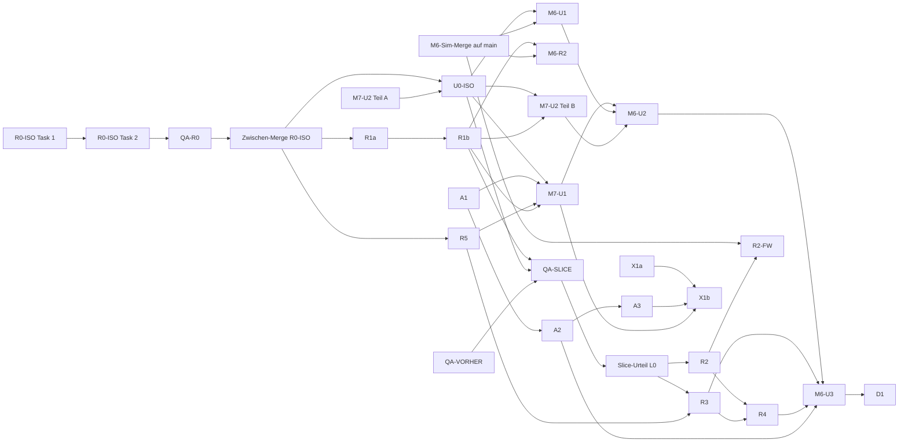

# M7 „Stimmung" — Implementation Plan (inkl. gemeinsamer UI-Strang M6/M7)

> **For agentic workers:** REQUIRED SUB-SKILL: Use superpowers:subagent-driven-development (recommended) or superpowers:executing-plans to implement this plan task-by-task. Steps use checkbox (`- [ ]`) syntax for tracking.

**Goal:** Die Insel sichtbar und hörbar lebendig machen (isometrische Darstellung nach M7-ISO, weiches Terrain,
Wasser mit Schaum, Gebäude als Körper mit Dachfamilien und Schatten, Tageslicht, Wetter und Krisen-Effekte, Leben,
Umgebungsklang in Bussen, gestreamte Musik, Holz-und-Pergament-UI) und im gemeinsamen seriellen UI-Strang die
M6-Oberfläche (Krisenstufe, Feuerwache, Krisenkarte, Ereignis-Log, Verdrahtung der Krisen-Effekte) einbauen, ohne
`src/sim/` anzufassen.

**Architecture:** Fünf M7-Stränge mit getrennter Datei-Ownership in fünf Worktrees (Render, Render-FX, Audio,
Assets, UI). Render und Audio lesen nur (ADR-002); alle neuen Regeln der Darstellung sind reine Funktionen
(`project`, `unproject`, `depthKey`, `sortedObjects`, `bodyHull`, `pickBuilding`, `terrainField`, `lightAt`,
`gradeAt`, `pickWeather`, `walkerAt`, `viewStats`, `duckGain`, `ambienceMix`, `nextTrack`), die Vitest ohne DOM
prüft; Canvas, Web Audio und DOM bleiben dünne Hüllen darum. Zuerst stellt **R0-ISO** Kamera, Renderer und die
Kamera-Aufrufe der UI auf Isometrie um (im heutigen Look) und wird als einziges Paket vorab auf `main` gemergt.
Danach läuft der **Vertical Slice** (R1a, U0-ISO, R1b) und endet mit einem Stopp für das Slice-Urteil von L0.
Abhängigkeiten zwischen Strängen werden durch `git merge <strang-branch>` bzw. `git merge main` in den abhängigen
Branch erfüllt; die Schnittstelle `RenderFx` wird in R1b vollständig als Typ angelegt (R0-ISO legt nur
`raster?` an), damit UI und M6 früh kompilieren.

**Tech Stack:** TypeScript, Canvas 2D, Web Audio, `HTMLMediaElement` (Browser-APIs), Vite, Vitest (Umgebung
`node`). Keine neue Abhängigkeit, auch keine Dev-Abhängigkeit. `ffmpeg` nur lokal für den Asset-Schnitt.

**Spec:** `docs/superpowers/specs/2026-09-30-m7-stimmung-design.md` (Gate Spec bestanden, R83, R84; Nachtrag
Abschnitt 17). Für die M6-UI-Tasks zusätzlich `docs/superpowers/specs/2026-09-30-m6-krisen-design.md`
(`docs/m6-spec` @ ab536d1, Abschnitte 11–14, 16, 17 U1–U3 und R2; R85). Rulings: R73, R77, R78, R82, R83, R84,
R85. ADR-011 (Asset-Pipeline) liegt mit diesem Plan vor (`docs/adr/ADR-011-asset-pipeline.md`). **Isometrie:**
Nachtrag `docs/superpowers/specs/2026-10-01-m7-iso-design.md` (Gate Spec bestanden, R95; im Plan „ISO-Spec"
bzw. „ISO §n"), ADR-012 (ersetzt ADR-003), Rulings R91–R95. Bei Widerspruch gilt die ISO-Spec vor der M7-Spec
(ISO §13 listet die geänderten Stellen). Alle AK stehen mit Sollwerten in Spec §14 (M7), ISO §14 (AK-ISO-01 bis
-21) bzw. M6-Spec §17; dieser Plan zitiert sie per Nummer. **Test-Namen beginnen mit der
AK-Nummer** (`it('AK-R1-04 …')`, M6-Tests mit Präfix `M6-`, z. B. `it('M6-AK-U3-02 …')`), Review-Focus-Tests mit
`RF-<n>`, damit Reviews die Abdeckung per `grep` prüfen.

## Global Constraints

- **`src/sim/` bleibt unberührt** (Spec 3). Kein neues Save-Format, keine Spielwerte, keine Migration im
  Spielstand. Render und Audio lesen die Welt nur (ADR-002).
- Keine neue Abhängigkeit (ADR-001). Tests nutzen für Dateizugriff eine Typ-Shim wie `tests/sim/node-shim.d.ts`
  (keine `@types/node`).
- `src/audio/` importiert nichts aus `src/sim/`, `src/render/` oder `src/ui/`; `ViewStats`, `Phase`,
  `AmbienceInput` sind dort strukturgleich eigene Typen (Spec 11.2).
- `src/render/` schreibt nie in die Welt und merkt sich nichts ausser Caches je Welt (Terrain-Ebene,
  `layoutKey`-Schlüssel, Weggraph).
- **Farben nur aus `src/render/palette.ts`** (Spec 4.2); andere Render-Module leiten Zwischentöne daraus ab. UI-Farben
  nur als CSS-Variablen in `src/style.css`. Signalfarben (`signalRed #ff3b5c`, `signalYellow #ffe000`,
  `signalWarn #ff6726`, `signalOk #2ee6a8`, Umriss Weiss) kommen in Terrain, Gebäuden, Leben und Wetter nicht vor.
- **Ebenenreihenfolge je Frame nach ISO §5** (12 Ebenen, ersetzt Spec 4.3.1), genau **ein** Multiply-Durchgang
  (Tönung) und höchstens **ein** additiver Durchgang je Frame; Signale nach dem Licht, ungetönt.
- **Isometrie (ADR-012):** Der Kachelraum bleibt die Wahrheit; nur das Zeichnen projiziert. `src/render/iso.ts`
  kennt keine Kamera, `camera.ts` importiert aus `iso.ts`, nie umgekehrt (ISO §4). Boden, Wasser, Wege und Schatten
  zeichnen unter der Bodenmatrix (`withGround`), Signal-Striche nie (D-17). Jede Bodenmatrix steht zwischen
  `ctx.save()` und `ctx.restore()`. Objekte werden nur über `sortedObjects` gezeichnet (D-09); Picking nur über
  `bodyHull`/`pickBuilding`, nie über `spriteBounds` (D-14).
- **Zoom-Caches** (Baumstempel, optional Gebäude) rastern den Zoom auf `ZOOM_STEPS = [0.5, 0.75, 1, 1.5, 2]`
  (`zoomStep(z)` = kleinste Stufe ≥ z; gezeichnet wird verkleinert mit Faktor `z / zoomStep(z) ≤ 1`), jeder Cache hat
  eine geprüfte Obergrenze (ISO §16).
- Darstellungswerte (Farben, Perioden, Obergrenzen, Pegel) sind Konstanten im jeweiligen Modul, **keine
  Spielwerte**; sie gehören nicht nach `src/sim/defs/`.
- Obergrenzen (Spec 12.2): `CAP_WALKERS` 40/12, `CAP_GULLS` 8/3, Rauch 150/50, `CAP_RAIN` 350/100, `CAP_FIRE`
  24/8, Wolken 6/0, Glitzer 30/0 (normal/reduziert).
- Performance: Terrain-Aufbau ≤ 1500 ms, Teil-Neuzeichnung ≤ 8 ms, Median ≥ 30 fps (hart), Ziel ≥ 60 fps nach
  R82 (c) (Spec 12.1).
- Asset-Budget (Spec 8, ADR-011): `public/` ≤ 12 MB, Musik ≤ 9 MB, Umgebung und Signale ≤ 2,2 MB, Schrift
  ≤ 150 KB, Musikstück ≤ 2,6 MB. Beim Start lädt nichts aus dem Audio-Budget.
- Einstellungen: Schlüssel `inselreich.settings`, gemeinsames Format M6/M7
  `{ muted, master, music, ambience, effects, dayNight, reduceMotion, crisisLevel }`; **fremde Felder werden
  durchgereicht** (R83, R85 Punkt 10); `volume` wird nach M7-U1 nur gelesen (als `master`), nie geschrieben.
- UI-Texte Deutsch (CH, kein ß), exakt wie in den Specs. Keine `innerHTML` für Daten (OWASP); Links
  `target="_blank" rel="noopener"`.
- Dev-Werkzeuge (Vorschau, Audio-Sonde, Perf-Sonde, Render-Zähler) nur unter `import.meta.env.DEV`; im
  Produktions-Build ohne Wirkung.
- Commit-Präfixe `feat:`, `fix:`, `test:`, `docs:`, `refactor:`; kein Push, kein Merge nach `main`, kein Rebase.
  Integration nur durch `production-integrator` nach dem Gate Merge.
- **Prettier im Worktree ausführen** (`cd .worktrees/<strang> && npx prettier --write <dateien>`), nie aus dem
  Hauptrepo auf Worktree-Pfade. `make check` im Worktree grün vor jedem Review.
- Balancing-Test `tests/sim/balance.test.ts` bleibt unverändert grün (M7 berührt `src/sim/` nicht; nach jedem
  `git merge main` mit M6-Sim-Paketen einmal laufen lassen).
- **Befunde ausserhalb des Scopes** schreiben Arbeiter und Leads nicht in den Branch (`docs/beobachtungen.md`),
  sondern nur in ihren Bericht; die Leads melden sie L0 (R87).
- **Blocker „M6-Sim-Merge auf `main`"** (R87): M6-R2, R2-FW und M6-U1 starten erst, wenn der M6-Sim-Strang nach
  seinem Gate Merge auf `main` liegt; es werden keine einzelnen SHAs aus dem M6-Strang gemergt, nur `main`.
- Mermaid ohne `\n` in Node-Labels.

## Review Focus

Sieben Eingaben bzw. Zustände, die die Spec impliziert, aber kein AK ausdrücklich prüft; der Test steht jeweils in
der Task, die den Code besitzt (6 und 7 kommen mit M7-ISO dazu, siehe Ende der Liste):

1. **Kartenrand und Sonderkarten im Küstenfeld:** eine Karte ganz ohne Wasser, ganz ohne Land, eine einzelne
   Landkachel und eine einzelne Wasserkachel mitten im Land. Erwartet: keine `Infinity`/`NaN` im Feld, jede Kachel
   zeigt ihren Typ auf ≥ 75 % der Fläche, nichts wirft. → Task R1a, Tests `RF-1a` bis `RF-1d`.
2. **Welt- bzw. Spielwechsel („Neu", „Laden") mit alter Terrain-Ebene:** Der `layoutKey`-Cache darf eine Ebene nie
   mit einer fremden Welt teil-neu zeichnen. Erwartet: Cache je Ebene **und** Welt-Objekt; ein neues Welt-Objekt auf
   derselben Ebene zeichnet nichts teilweise neu. → Task R1a, Test `RF-2`.
3. **Unsinnige Werte aus `localStorage` und aus der Dev-Vorschau:** `master: "0.4"`, `music: NaN`, `reduceMotion:
'maybe'`, `?w=2`, `?w=-1`, `?wetter=hagel`, `?feuer=abc`. Erwartet: je Feld Rückfall auf den Standard bzw. Klemmen
   auf 0…1; unbekannte Vorschau-Werte ergeben „keine Vorschau" für dieses Feld; nie `NaN` in einem Gain oder in
   `RenderFx.weather.w`. → Tasks M7-U1 (`RF-3a`, `RF-3b`), R3 (`RF-3c` `weatherMul` klemmt `w`).
4. **Stimmungswetter mit unerlaubter Art oder Stärke:** `pickWeather(null, { kind: 'storm', w: 1 })` oder
   `{ kind: 'cloudy', w: 0.9 }` als Stimmung. Erwartet: Stimmung wird auf `cloudy` mit `w ≤ 0.4` begrenzt bzw. zu
   `clear`; nur Krisenwetter darf `rain`/`storm`/`w > 0.4`. → Task R3, Test `RF-4`.
5. **Ton-Aufrufe vor `unlock()`, nach `dispose()` und bei Tab-Wechsel mitten in einer Überblendung:** `setBus`,
   `setAmbience`, `setPhase`, `play('alarm')` vor dem Entsperren und nach `dispose()`; `setHidden(true)` während
   Musik einblendet. Erwartet: nichts wirft, vor `unlock()` kein `fetchBuffer` und kein Media-Element, nach
   `dispose()` keine neuen Knoten; nach `setHidden(false)` setzt die Musik fort statt neu zu starten. → Tasks A1
   (`RF-5a`), A3 (`RF-5b`).
6. **Getrennte Zeichenaufrufe Körper, Schatten, Luft (ISO 7.1, QA-Hinweis b):** Die Luft-Funktion zeichnet nur Rauch
   und Flagge, die Schatten-Funktion nur Schatten, der Körper weder Rauch noch Schatten. Erwartet (Fake-Kontext, alle
   Typen und der Fallback): `drawAir` setzt nur Füllfarben aus `AIR_COLORS` (Rauch, Flaggentuch, Fahnenstange —
   eigene, per `mixHex` abgeleitete Töne, die kein Körper verwendet; ein Test prüft die Disjunktheit);
   `buildingShadow` ist rein und liefert nur ein Polygon im Kachelraum (kein Kontext); `drawBody` setzt keine Farbe
   aus `AIR_COLORS` und kein `SHADOW`. → Task R0-ISO (`RF-6a` für die Platzhalter), R1b (`RF-6b`), R2 (`RF-6c`).
7. **Bodenmatrix leckt nicht:** Nach `render(…)` ist die Transformation des Kontexts wieder die DPR-Skalierung vom
   Aufruf, und `save`/`restore` sind ausgeglichen, auch ohne Gebäude, bei Zoom 0,5 und 2 und mit `raster`.
   Erwartet: Fake-Kontext zählt `save`/`restore` gleich oft und meldet am Ende dieselbe Matrix wie vorher. → Task
   R0-ISO (`RF-7`), danach in jedem Renderer-Test erneut.

---

## Organisation

### M7-ISO: was sich gegenüber dem Plan-Stand `7c504e9` ändert (Übersicht für Gate Plan)

- **Neu R0-ISO** (Render, zwei Tasks in einem Paket, Ownership-Ausnahme `input.ts`/`app.ts` nach R92/R94) und
  **U0-ISO** (UI, ¾ Task). R0-ISO wird als einziges Paket vorab auf `main` gemergt (Zwischen-Merge, ISO §12).
- **M7-U2** läuft parallel zu R0-ISO (R95) und wird zweigeteilt: Teil A (Steps 1–3) vor U0-ISO, Teil B
  (Ruhe-Ansicht, braucht `phaseAt` aus R1b) danach, als Fortsetzung desselben Implementierers.
- **Slice:** R0-ISO → Zwischen-Merge → R1a ∥ U0-ISO ∥ R5 → R1b → **QA-SLICE** im Integrationsbaum `test/m7-slice`
  (R1b + U0-ISO) → Slice-Urteil L0 (R93). Neu **QA-R0**, **QA-U0** und **QA-VORHER** (Vorher-Bilder und -Messung
  auf `main` vor R0-ISO, ISO §9, AK-ISO-18).
- **Angepasst** nach ISO §13: R1a (Baumstempel in neuem `trees.ts`, Lichtvektor, keine Kronen in der Textur), R1b
  (Körper/Schatten/Luft getrennt, echte Höhen, Szenario `verdeckung`, Ebenen nach ISO §5), R2, R2-FW, R3, R4, R5,
  M6-R2 (unverändert bis auf den Hinweis). Plan-Themen aus ISO §16 sind gelöst: Zoom-Caches (Global Constraints),
  Schafe (K1), Schatten in einem Pfad (R1b), M7-U2 parallel (oben), benannte Prüfstellen (QA-SLICE).
- **Offene Punkte für das Gate Plan (Entscheid L0):**
  1. Das Task-Review von R0-ISO Task 2 auf `opus` über die ganze R0-ISO-Strecke gilt als Final-Review des
     Zwischen-Merges (kein eigener Final-Review-Start). Empfehlung: ja.
  2. Zwischen-Merge R0-ISO nach `main` vor dem Final-Review des Meilensteins (Gate Merge nur für diesen Stand).
     Empfehlung: ja, folgt aus ISO §12.
  3. Szenario `verdeckung` in der neuen Datei `tests/sim/scenarios-iso.ts` mit zwei Zeilen in `scenarios.ts`
     (Abweichung vom Wortlaut ISO §14 „in `tests/sim/scenarios.ts`", um Konflikte mit dem M6-Sim-Strang zu vermeiden).
     Empfehlung: ja.
  4. Kein Sprite-Cache der Gebäude im Slice; Auslöser für einen Cache ist eine Skriptdauer > 8 ms je Frame in
     QA-SLICE. Schwelle der halben Bodenkopie bleibt Zoom ≤ 0,5 bis zur Messung. Empfehlung: ja.
  5. Zweiteilung von M7-U2 (Teil B per `SendMessage`, kein Start) und neue Datei `src/ui/target.ts` in U0-ISO
     (ISO §12 nennt nur `input.ts`/`app.ts`; `target.ts` macht die Logik testbar). Empfehlung: ja.
  6. Ein möglicher Rückfall nach AK-ISO-17 läuft als R1c vor R2/R3 (Ownership `renderer.ts`). Empfehlung: ja.
  7. Budget 76 Starts (lead-art 49 / Parallelität 4, lead-tech 26 / 1, lead-qa 1 / 1). Empfehlung: freigeben je
     Session-Welle.

### Stränge, Worktrees, Controller

| Strang     | Worktree / Branch                                                          | Implementierer (Modell)                                             | Controller  | Tasks (Reihenfolge im Strang)                                                                                                               |
| ---------- | -------------------------------------------------------------------------- | ------------------------------------------------------------------- | ----------- | ------------------------------------------------------------------------------------------------------------------------------------------- |
| Render     | `.worktrees/m7-render` · `feat/m7-render`                                  | `art-rendering-engineer` (sonnet, Abruf)                            | `lead-art`  | R0-ISO T1 → T2 → QA-R0 → **Zwischen-Merge** → R1a → R1b → **Slice-Stopp** (M6-R2 darf hier laufen; ggf. R1c) → R2 → (merge fx) → R4 → R2-FW |
| Render-FX  | `.worktrees/m7-fx` · `feat/m7-fx`                                          | `art-rendering-engineer` (sonnet, Abruf)                            | `lead-art`  | (Baum erst nach dem Zwischen-Merge) R5 → (merge render nach Slice-Urteil) → R3                                                              |
| Audio      | `.worktrees/m7-audio` · `feat/m7-audio`                                    | `art-audio-engineer` (sonnet, Abruf)                                | `lead-art`  | A1 → A2 → A3                                                                                                                                |
| Assets     | `.worktrees/m7-assets` · `feat/m7-assets`                                  | `art-audio-engineer` (sonnet, Abruf) + `art-license-checker` (opus) | `lead-art`  | X1a → (merge audio, ui) → X1b                                                                                                               |
| UI (M6+M7) | `.worktrees/ui-m6m7` · `feat/ui-m6m7`                                      | `tech-ui-engineer` (sonnet)                                         | `lead-tech` | M7-U2 Teil A → (merge main) → U0-ISO → M7-U2 Teil B / M7-U1 / M6-U1 (was zuerst frei wird) → M6-U2 → M6-U3 → D1                             |
| QA-Bäume   | `.worktrees/m7-vorher` (detached), `.worktrees/m7-slice` · `test/m7-slice` | nur `qa-playtester` (lesend)                                        | `lead-art`  | QA-VORHER (Welle 1); QA-SLICE (nach R1b und U0-ISO)                                                                                         |

- `feat/ui-m6m7` ist der Integrationszweig, den die M6-Spec §16 `test/m6-int` nennt (ein Zweig für M6-U1 bis U3 und
  die Verdrahtung). Der M6-Sim-Plan verweist hierher; einen zweiten UI-Zweig gibt es nicht.
- Rollen „Abruf" ohne Persona-Datei: `subagent_type: general-purpose`, Kopfzeile `Persona: <name>`, Persona-Text
  aus `docs/studio/roster.md` ins Briefing, `model: sonnet` im Aufruf. `lead-art` legt die Persona-Dateien
  `art-rendering-engineer` und `art-audio-engineer` an, weil beide Rollen über mehrere Pakete gebraucht werden
  (Handbuch „Neue Persona anlegen").
- Art-Stränge steuert `lead-art` (Handbuch, Umsetzungszyklus Schritt 4; Spec 13; R88), UI und D1 `lead-tech`. Beide
  nutzen denselben Zyklus: Implementierer → `qa-code-reviewer` (OK/BEDENKEN/ZURÜCK) → bei Render/UI
  `qa-playtester` → Fix-Runde per `SendMessage` im selben Baum, bis OK.
- **R0-ISO** steuert `lead-art` (Render-Strang, R88). Es ist das architekturkritische Paket (Projektion, Kamera,
  Modulschnitt); deshalb läuft das Task-Review von **Task 2 auf `opus` über die ganze R0-ISO-Strecke** und gilt als
  Final-Review für den Zwischen-Merge (Entscheid L0 im Gate Plan, offener Punkt). `lead-tech` liest das Review mit und
  meldet Architektur-Befunde an `lead-art`.
- **Zwischen-Merge R0-ISO:** Nach Review OK (Task 1 und 2) und QA-R0 OK meldet `lead-art` an L0; L0 entscheidet ein
  Gate Merge nur für diesen Stand, `production-integrator` merged `feat/m7-render` (Stand nach R0-ISO) nach `main`.
  Der Render-Strang arbeitet danach im selben Branch weiter. Erst dann starten R1a, U0-ISO (UI-Baum nach
  `git merge main`) und R5 (FX-Baum neu von `main`).
- M6-R2 (`overlays.ts`, M6-Spec §16) läuft im Render-Strang nach M7-R1b (R85 Punkt 11), weil `overlays.ts` diesem
  Strang gehört; es wird **nur hier** budgetiert (der M6-Sim-Plan führt es nicht).

**Einrichten je Worktree** (Controller, vom Hauptrepo aus):

```bash
# Welle 1
git worktree add .worktrees/m7-render -b feat/m7-render main
git worktree add .worktrees/m7-audio -b feat/m7-audio main
git worktree add .worktrees/m7-assets -b feat/m7-assets main
git worktree add .worktrees/ui-m6m7 -b feat/ui-m6m7 main
git worktree add --detach .worktrees/m7-vorher "$(git merge-base main feat/m7-render)"   # QA-VORHER
# nach dem Zwischen-Merge R0-ISO
git worktree add .worktrees/m7-fx -b feat/m7-fx main
# QA-SLICE (nach R1b und U0-ISO; nichts wird von hier zurückgemergt)
git worktree add .worktrees/m7-slice -b test/m7-slice main
cd .worktrees/m7-slice && git merge --no-ff feat/m7-render feat/ui-m6m7
cd .worktrees/<baum> && npm ci && make check
```

### Datei-Ownership

Jede Datei hat genau einen Strang. Innerhalb eines Strangs laufen Tasks nacheinander.

| Datei(en)                                                                                | Strang                         | Tasks in Reihenfolge                                                                                                        |
| ---------------------------------------------------------------------------------------- | ------------------------------ | --------------------------------------------------------------------------------------------------------------------------- |
| `src/render/iso.ts` (neu)                                                                | Render                         | R0-ISO → R1a (nur `TREE_VARIANTS`, falls nötig) → R1b → R2 → R2-FW (nur Höhentabelle `BODY_HEIGHTS`)                        |
| `src/render/camera.ts`                                                                   | Render                         | R0-ISO                                                                                                                      |
| `src/render/palette.ts` (neu), `terrainField.ts` (neu), `terrain.ts`                     | Render                         | R0-ISO (`terrain.ts` nur Import `TILE` → `TEX`) → R1a (palette: R1a, R1b ergänzt nur Tests) → R1b (Standard-Faktor aus DPR) |
| `src/render/trees.ts` (neu)                                                              | Render                         | R1a                                                                                                                         |
| `src/render/water.ts`                                                                    | Render→FX                      | R0-ISO (unter Bodenmatrix) → R1a → R3 (im FX-Baum nach Merge)                                                               |
| `src/render/sprites.ts`                                                                  | Render                         | R0-ISO (`IsoPainter`, Platzhalter-Körper, `drawAir`, `drawRoads`) → R1b → R2 → R2-FW                                        |
| `src/render/daynight.ts`                                                                 | Render                         | R1b → R4                                                                                                                    |
| `src/render/renderer.ts`                                                                 | Render→FX→Render               | R0-ISO → R1a (nur Baumstempel im sortierten Durchgang) → R1b → R3 (FX-Baum) → R4 (Render-Baum nach Merge fx)                |
| `src/render/overlays.ts`                                                                 | Render                         | R0-ISO (Rauten, Ellipse, projizierte Umrisse, Symbole an `spriteBounds`, `drawUnconnected`) → R1b (`signalRed`) → M6-R2     |
| `src/render/ship.ts`                                                                     | Render                         | R0-ISO (D-18, Rautenmitte, sortiert) → R1b (Schatten)                                                                       |
| `src/render/viewStats.ts` (neu)                                                          | FX                             | R5                                                                                                                          |
| `src/render/weather.ts`, `fx.ts`, `limits.ts` (alle neu)                                 | FX                             | R3                                                                                                                          |
| `src/render/life.ts` (neu)                                                               | Render                         | R4                                                                                                                          |
| `tests/render/fakeCtx.ts`, `tests/render/renderer.test.ts`                               | Render→FX→Render               | wie `renderer.ts`: R0-ISO → R1a → R1b → R3 (FX-Baum) → R4; R2 ändert beide nicht                                            |
| `tests/render/**` (übrige)                                                               | Render/FX                      | je Task die eigene Testdatei (Liste in der Task)                                                                            |
| `tests/sim/scenarios.ts` (nur Testcode)                                                  | Render (Ausnahme, ISO §14)     | R1b (Szenario `verdeckung`) → R2 (Turm dazu); Regel siehe unten                                                             |
| `src/ui/input.ts`, `src/ui/app.ts`                                                       | Render (Ausnahme R92/R94) → UI | R0-ISO (nur Importzeilen, Kamera-Aufrufe, `centerOn`, Raster-Zeile) → ab U0-ISO der UI-Strang                               |
| `src/ui/**` (übrige), `index.html`, `src/style.css`, `tests/ui/**`                       | UI                             | M7-U2 Teil A → U0-ISO (`input.ts`, neu `target.ts`) → M7-U2 Teil B / M7-U1 / M6-U1 → M6-U2 → M6-U3                          |
| `src/audio/**`, `tests/audio/**`                                                         | Audio                          | A1 → A2 → A3                                                                                                                |
| `public/**`, `tools/assets/**`, `docs/CREDITS.md`, `docs/licenses/**`, `tests/assets/**` | Assets                         | X1a → X1b                                                                                                                   |
| `docs/arc42.md`, `README.md`, `CLAUDE.md`                                                | UI (D1)                        | D1 (`lead-tech`)                                                                                                            |

Ausnahme aus der M6-Spec §16: M6-S1 ergänzt in `src/ui/inspect.ts` genau einen `case 'burning'` auf `main`; der
UI-Strang übernimmt ihn per `git merge main`.

**Ausnahme `tests/sim/scenarios.ts`** (ISO §14, nur Testcode): Der M6-Sim-Strang ändert dieselbe Datei (M6-Plan,
Ausnahme B und Task B2). Damit kein Merge-Konflikt entsteht, legt R1b die Funktion `verdeckung()` in der **neuen
Datei** `tests/sim/scenarios-iso.ts` an und ergänzt in `scenarios.ts` genau zwei Zeilen: einen Import direkt unter
dem letzten bestehenden Import und den Eintrag `verdeckung,` direkt **nach** `'bilanz-nahrung': bilanzNahrung,`
(Anfang des Objekts; M6 hängt am Ende an). R2 ändert nur `scenarios-iso.ts`. Kommt es beim `git merge main` trotzdem
zu einem Konflikt: abbrechen und melden (Regel unten).

**Ausnahme `input.ts`/`app.ts` (R92, R94):** R0-ISO ändert genau die Stellen aus ISO §12 (Importzeilen
`input.ts:3` und `app.ts:10`; Kamera-Aufrufe `input.ts` 66–74, 196–198, 296–298 und `app.ts` 150–151, 381, 388–390;
eine Raster-Zeile im Dev-Zweig). M7-U2 Teil A berührt beide Dateien nicht (R95), deshalb laufen beide parallel. Der
Review von R0-ISO prüft per `git diff main -- src/ui`, dass nichts anderes geändert ist.

### Abhängigkeiten und Wellen



| Welle | startbar                                                                                                                                       | Merges vorher                                                                                     |
| ----- | ---------------------------------------------------------------------------------------------------------------------------------------------- | ------------------------------------------------------------------------------------------------- |
| 1     | **R0-ISO** Task 1 → Task 2 → QA-R0 (Render), **A1** (Audio), **X1a** (Assets), **M7-U2 Teil A** (UI), **QA-VORHER** (QA-Baum) — gleichzeitig   | —                                                                                                 |
| 1a    | **Zwischen-Merge R0-ISO** nach Review OK und QA-R0 OK (Gate Merge L0, `production-integrator`)                                                 | —                                                                                                 |
| 1b    | **R1a** (Render), **U0-ISO** (UI), **R5** (FX, Baum neu von `main`) — gleichzeitig; A2 nach A1                                                 | UI: `git merge main`                                                                              |
| 1c    | **R1b** nach R1a; **QA-U0** nach U0-ISO; danach **QA-SLICE** und **Slice-Stopp** (siehe unten). Im UI-Strang bis dahin M7-U2 Teil B (nach R1b) | QA-SLICE-Baum: `git merge feat/m7-render feat/ui-m6m7`; UI für Teil B: `git merge feat/m7-render` |
| 2     | nach Slice-Urteil L0: **R2** (Render) und **R3** (FX) parallel; **M7-U1** sobald U0-ISO, A1, R5, R1b abgenommen; **A3**                        | FX: `git merge feat/m7-render`; UI: `git merge feat/m7-render feat/m7-fx feat/m7-audio`           |
| 3     | **R4** nach R2 und R3; **M6-R2** und **M6-U1** nach dem **M6-Sim-Merge auf `main`** (R87), M6-U1 zudem nach U0-ISO                             | Render: `git merge feat/m7-fx`, `git merge main`; UI: `git merge main`                            |
| 4     | **M6-U2** nach M7-U1, M6-U1 und M7-U2 Teil B; **R2-FW** nach dem M6-Sim-Merge auf `main` und R2; **X1b** nach A3 und M7-U1                     | Assets: `git merge feat/m7-audio feat/ui-m6m7`                                                    |
| 5     | **M6-U3** nach M6-U2, R3, R4, A2; danach **INT-Check**, **D1**, Final-Review                                                                   | UI: `git merge feat/m7-render feat/m7-audio feat/m7-assets` (aktuelle Stände)                     |

- Vor jedem Merge: Quell-Task abgenommen (Review OK). Merges zwischen Strängen macht der Controller des
  **empfangenden** Strangs mit `git merge --no-ff <branch>`; Konflikt → abbrechen (`git merge --abort`) und melden,
  nie auflösen durch Überschreiben fremder Dateien.
- Der Zwischen-Merge ist der einzige Merge nach `main` vor dem Final-Review; alle übrigen Stränge mergt
  `production-integrator` erst nach dem Gate Merge am Ende.
- **Kann-Posten** (Spec 2.1, Streichreihenfolge 2.2) erst, wenn alle Muss-Tasks abgenommen sind (Spec 16.6), als
  **Kann-Welle** K1–K3 am Ende (eigener Budgetposten).

### Slice-Stopp (Auflage R77 1, Spec 2.3, ISO §12, R93)

Nach R1b, U0-ISO, QA-U0 und QA-SLICE stoppt der Render-Strang:

1. `lead-art` meldet L0 den Slice mit den Vorher/Nachher-Paaren unter `.studio/qa/M7-SLICE/` (Vorher aus
   `.studio/qa/M7-VORHER/`, aufgenommen auf dem `main`-Stand vor R0-ISO, Hash im Bericht), der Liste der
   Prüfmerkmale I1, I2, I3, I5, I7 in der ISO-Fassung mit Messwerten, der Leistungstabelle Vorher/Nachher
   (AK-ISO-17) und Status `waiting`.
2. **L0 urteilt** (R93): **OK** oder **Tür nach 2.3** für einzelne Posten (Terrain, Wasser, Gebäude); `lead-art` und
   `lead-design` geben ihre Sicht im Bericht. Die Bilder gehen dem Nutzer **direkt** zu, mit dem Hinweis, dass dies
   das erste isometrische Bild ist. Auf seine Reaktion wird nicht gewartet (Verfassung §5); kommt sie, hat sie
   Vorrang und kann R2–R4 stoppen.
3. Blockiert bis zum Urteil von L0: R2, R3, R4 (und damit M6-U3). **Nicht** blockiert: R5, A1–A3, X1a, M7-U2,
   M7-U1, M6-U1, M6-R2.
4. Öffnet ein Ruling die Tür nach 2.3 (Massstab 64 × 32, ISO D-21), schneidet `lead-tech` R2 neu (Plan-Nachtrag,
   eigener Budgetantrag). Meldet QA-SLICE bei `leistung-50` unter 30 fps (AK-ISO-17), entscheidet L0 mit dem Urteil
   über den Rückfall nach ISO §9 (Reihenfolge 1 → 2 → 3). Der Rückfall läuft dann als eigener Schritt **R1c** im
   Render-Strang (`renderer.ts`, `terrain.ts`), **vor** dem Start von R2 und **vor** `git merge feat/m7-render` in
   den FX-Baum (R3), damit `renderer.ts` nie in zwei Bäumen zugleich offen ist. R1c setzt den R1b-Implementierer per
   `SendMessage` fort; sein Review geht aus dem Puffer (bei Bedarf Budgetantrag).
5. In der Wartezeit des Slice-Stopps darf **M6-R2** im Render-Baum laufen (nur `overlayPlan`), sobald M6-Sim auf
   `main` liegt; es berührt weder `renderer.ts` noch die Slice-Dateien.

### QA-Checks (Browser, `qa-playtester`, Screenshots unter `<Hauptrepo>/.studio/qa/M7-<Task>/` bzw. `M6-<Task>/`)

Alle Checks im Dev-Server (`make dev`) bei **1280 × 800 und 1920 × 1080** (R78), Szenario-Saves nach Spec 14.1
(`SCENARIO_OUT=<ordner> npx vitest run tests/sim/scenario-saves.test.ts`, Tick per CDP vor dem Laden setzen).
Pixelangaben sind CSS-Pixel bei `devicePixelRatio = 1` (ISO §14). Gemessen wird immer auf einem Screenshot **ohne**
Raster; `?raster=1` dient nur der Geometrie.

| Check     | Wann / Baum                                | AK und Prüfmerkmale                                                                                                                                                                      |
| --------- | ------------------------------------------ | ---------------------------------------------------------------------------------------------------------------------------------------------------------------------------------------- |
| QA-VORHER | Welle 1, `m7-vorher` (`main` vor R0-ISO)   | Vorher-Bilder der vier Ausschnitte aus AK-ISO-18 und Vorher-Messung nach dem Slice-Messprofil (unten); Hash des Stands im Bericht                                                        |
| QA-R0     | nach R0-ISO Task 2, `m7-render`            | AK-ISO-20                                                                                                                                                                                |
| QA-R1a    | nach R1a, `m7-render`                      | AK-R1-06 (nur Aufbauzeit bei Faktor 1), I1, I2 (ISO-Fassung nach AK-ISO-18), I5 (≥ 3 aufrechte Kronen je Waldkachel)                                                                     |
| QA-U0     | nach U0-ISO, `ui-m6m7`                     | AK-ISO-14 (Zoom 1 und 0,5)                                                                                                                                                               |
| QA-SLICE  | nach R1b und QA-U0, `m7-slice` (**Slice**) | AK-R1-05, AK-R1-07, AK-ISO-13 (inkl. AK-R1-09 neu, I3), AK-ISO-15, AK-ISO-16, AK-ISO-17 (Nachher), AK-ISO-18 (4 Ausschnitte, Vorher/Nachher), I7; Aufbauzeit Faktor 2; Prüfstellen unten |
| QA-R2     | nach R2, `m7-render`                       | AK-R2-01 (Blindtest 13 Typen), AK-R2-02 (Kategorien bei Zoom 0,5), AK-R2-04 (Wege, Nähte bei Zoom 1,1 und 1,7), AK-ISO-15 und -16 erneut mit Turm (`verdeckung`)                         |
| QA-R3     | nach M7-U1 und R3, `ui-m6m7`               | AK-R3-03 (Dev-Vorschau Sturm, Feuer, Boom)                                                                                                                                               |
| QA-R4     | nach R4, `m7-render`                       | AK-R4-04, AK-R4-05                                                                                                                                                                       |
| QA-U2     | nach M7-U2 Teil B, `ui-m6m7`               | AK-U2-01 (Rückfall Georgia, falls X1a noch nicht gemergt), AK-U2-02, AK-U2-03, AK-U2-04, AK-U2-05                                                                                        |
| QA-U1     | nach M7-U1, `ui-m6m7`                      | AK-U1-02, AK-U1-03, AK-U1-05, AK-U1-06 (Figurenteil erst im INT-Check, wenn R4 fehlt)                                                                                                    |
| QA-M6U1   | nach M6-U1, `ui-m6m7`                      | M6 AK-U1-02, -03, -05, -06, -07, -09                                                                                                                                                     |
| QA-M6U2   | nach M6-U2, `ui-m6m7`                      | M6 AK-U2-03 bis -09                                                                                                                                                                      |
| QA-M6U3   | nach M6-U3, `ui-m6m7`                      | M6 AK-U3-06, -07, -08 (Urteil `lead-art`), **-09 Frame-Messung**, -10 (Kann)                                                                                                             |
| INT       | nach M6-U3 und X1b-Merge, `ui-m6m7`        | **AK-R4-06 Performance**, AK-A2-04, AK-A3-05, AK-U2-01 (Schrift geladen), AK-U1-06 (Figuren ≤ 12), M6 AK-R2-02, Feuerwache-Silhouette (R2-FW), AK-R1-06 erneut                           |
| LIC       | nach X1b, `m7-assets`                      | AK-X1-04 (`art-license-checker`)                                                                                                                                                         |

**Slice-Messprofil** (ISO §9, AK-ISO-17; QA-VORHER und QA-SLICE identisch): sichtbares Chrome (nicht headless),
ohne Wetter und Feuer, Ton aus. Chrome mit `--remote-debugging-port=<port> --user-data-dir=<tmp>
--window-size=<w>,<h>` starten; Profile `leistung-50` 1920 × 1080 Zoom 0,5 und `galerie` 1280 × 800 Zoom 1, je auf
den Kontor zentriert. Je Profil 30 s Einlaufen, dann per `Runtime.evaluate` ein eingespieltes Zählskript (Abstände
der `requestAnimationFrame`-Aufrufe), 10 s zählen; drei Läufe. Gemeldet werden je Profil: fps-Median, P95 des
Frame-Intervalls, Median der Skriptdauer je Frame aus einem CDP-Trace (`devtools.timeline`) und **zusätzlich die
GPU-/Rasterzeit je Frame** (Median der Ereignisse `GPUTask` bzw. `RasterTask`/`Rasterize` aus demselben Trace mit
`disabled-by-default-devtools.timeline.frame`; QA-Hinweis c). Eine Firefox-Messung mit demselben Profil nur zur
Orientierung (R93). Am Produktcode ändert sich dafür nichts.

**Benannte Prüfstellen QA-SLICE** (ISO §16, QA-Hinweis c; Szenario `verdeckung` aus R1b, Lage siehe Task R1b
Step 7):

- **AK-ISO-15:** Kamera per `centerOn` auf die Mitte des verdeckten Wohnhauses `H`, Zoom 1, 1280 × 800. Die
  Bildpunkte der Signale liest der Playtester aus `globalThis.__inselRender.badges` (DEV, letzter Frame, Einträge
  `{ id, x, y, kind, sx, sy }` mit Ursprungskachel und CSS-Pixeln, Task R1b). Messstelle je Signal: **3 × 3 px um den
  gemeldeten Mittelpunkt**; Soll ist der Palettenwert der Symbol-Füllung (`H`: Warenfarbe aus `GOOD_COLORS`, `P`:
  `signalRed`) ±2 je Kanal, einmal bei Tick 0 und einmal bei Tick 2820 (Nacht, `dayNight` an). Hover auf den
  sichtbaren Punkt von `H` aus `verdeckung.points.json` (Dach bzw. oberer Teil der rechten Wand; die linke Wand von
  `H` ist ganz verdeckt, Task R1b Step 6) zeigt Footprint-Raute und Körperumriss von `H`.
- **AK-ISO-16:** (1) `H` hinter dem Bürgerhaus `F`: Die Pixel in `F`s Körper, die in der Bildspalte von `H` liegen,
  zeigen `F`s Wand- bzw. Dachfarbe, nicht `H`. (2) Die Baumreihe `T-vor` überdeckt den Sockel des Holzfällers `L1`
  (rechte Seite), die Reihe `T-hinter` wird von `L1` überdeckt. (3) Auf der linken Wand von `L1` liegt kein Schatten:
  Luma-Mittel 3 × 3 px am Messpunkt aus `verdeckung.points.json` gleich dem an derselben Stelle des freistehenden
  Holzfällers `L2` ±2 (gleicher Tick, gleiches Licht).

**Frame-Messung nach R82 (c)** (AK-R4-06, M6 AK-U3-09): sichtbares Chrome, nicht headless, Fenster 1920 × 1080,
Dev-URL `?wetter=sturm&w=1&feuer=<Id eines Betriebs>&perf=1` (INT) bzw. Szenario `leistung-sturm` (QA-M6U3),
Zoom 0,5, ganze Insel sichtbar, Ton an (einmal klicken). Ablauf: Chrome mit
`--remote-debugging-port=<port> --user-data-dir=<tmp> --window-size=1920,1080` starten; nach 30 s Einlaufen per
`Runtime.evaluate` einen `requestAnimationFrame`-Zähler setzen, nach 10 s auslesen, fps = Zähler / 10; drei Läufe,
gemeldet werden die drei Werte, der Median, `frameP95` und `renderMedian` aus `window.__inselPerf` und die Konsole
(keine ungefangenen Fehler). Median < 30 → ZURÜCK; 30 ≤ Median < 60 → BEDENKEN.

### Budgetantrag (Formel Handbuch: Pakete × 2 + QA-Checks + 1 Final-Review, +30 %)

| Posten                                                                                                                                                          | Starts |
| --------------------------------------------------------------------------------------------------------------------------------------------------------------- | ------ |
| Pakete mit Implementierer und Task-Review: R1a, R1b, R2, R2-FW, M6-R2, R3, R4, R5, A1, A2, A3, X1a, X1b, M7-U2, M7-U1, M6-U1, M6-U2, M6-U3, U0-ISO = **19 × 2** | 38     |
| R0-ISO (zwei Tasks, je Implementierer und Review; Task 2 setzt den Implementierer per `SendMessage` fort, wenn möglich) = **2 × 2**                             | 4      |
| QA-Checks: 14 Browser-Checks (Tabelle oben ohne LIC) + LIC                                                                                                      | 15     |
| Final-Review (`opus`, `lead-qa`)                                                                                                                                | 1      |
| **Summe 58 × 1,3 = 75,4 → 76**                                                                                                                                  | **76** |

Aufteilung je Controller (aufgerundet je Anteil):

| Lead        | Posten                                                                                                                    | Rechnung        | Starts | Parallelität |
| ----------- | ------------------------------------------------------------------------------------------------------------------------- | --------------- | ------ | ------------ |
| `lead-art`  | 13 Pakete = 26, R0-ISO = 4; QA-VORHER, QA-R0, QA-R1a, QA-SLICE, QA-R2, QA-R4, LIC = 7                                     | 37 × 1,3 = 48,1 | **49** | **4**        |
| `lead-tech` | 6 Pakete (M7-U2, U0-ISO, M7-U1, M6-U1, M6-U2, M6-U3) = 12; QA-U0, QA-U2, QA-U1, QA-M6U1, QA-M6U2, QA-M6U3, QA-R3, INT = 8 | 20 × 1,3 = 26   | **26** | **1**        |
| `lead-qa`   | Final-Review                                                                                                              | 1               | **1**  | **1**        |
| **Summe**   |                                                                                                                           |                 | **76** |              |

Gegenüber dem Antrag aus R88 (Summe 64; die dortige Aufteilung 41/23/1 ergibt 65, weil je Lead aufgerundet wurde)
kommen **12 Starts** zur Summe dazu; je Lead sind es lead-art +8 (41 → 49), lead-tech +3 (23 → 26), lead-qa ±0. D1,
ADR-011 und ADR-012 schreiben die Leads selbst (kein Start). M7-U2 Teil B setzt Implementierer und Reviewer von Teil
A per `SendMessage` fort und kostet keinen Start.

**Parallelität** (zählt alle L2-Starts inklusive Reviewer und Playtester, R87): je Strang läuft höchstens ein Start
zugleich (Implementierer, dann Review, dann Playtest). Welle 1 hat bei `lead-art` vier Stränge aktiv (Render mit
R0-ISO, Audio, Assets, QA-Baum mit QA-VORHER), ab Welle 1b Render, FX, Audio, Assets. Antrag: `lead-art` **4**,
`lead-tech` **1** (UI-Strang; QA-U0, QA-R3 und INT laufen im selben Baum seriell), `lead-qa` **1**. Fix-Runden per
`SendMessage` zählen nicht; R2-FW und X1b setzen, wenn möglich, den Implementierer von R2 bzw. X1a per `SendMessage`
fort (spart je einen Start, bleibt als Puffer).

**Kann-Welle (eigener Antrag nach Abnahme aller Muss-Tasks):** K1 Render-Kann (R3: Gelöscht-Effekt,
Stimmungswetter mit Wolkenschatten, Glitzern; R4: Schafe im Zeichenaufruf der Schäferei, Fischerboot im sortierten
Durchgang, Schattenlänge), K2 Audio-Kann (A2: Arbeitsgeräusche; A3: viertes Stück, Krisen-Stimmung), K3 UI-Kann
(Waren-Symbole) = 3 × 2 + 1 QA = 7 × 1,3 → **10**.

**Sessions:** voraussichtlich vier (Welle 1 bis zum Zwischen-Merge; Wellen 1b–1c bis zum Slice-Stopp; Wellen 2–3;
Wellen 4–5 mit INT, D1 und Final-Review). Übergabe über `state.md` an den Wellengrenzen.

---

## Task R0-ISO (Paket, zwei Tasks): Iso-Grundumbau im heutigen Look

Strang Render · Baum `.worktrees/m7-render` · Implementierer `art-rendering-engineer` · Controller `lead-art` ·
erstes Paket von M7 · ISO-Spec §3 (D-01 bis D-18), §4, §5, §8, §12 · AK-ISO-01 bis -09, -11, -21 (Vitest), AK-ISO-10
für Platzhalter-Körper und Schiff, AK-ISO-20 (QA-R0) · RF-6a, RF-7 · Ausnahme `input.ts`/`app.ts` nach R92/R94.

**Zuschnitt:** Task 1 legt die reine Mathematik test-first **neben** den alten Funktionen an (neue Dateien
`iso.ts` und `isoCamera.ts`; `camera.ts`, `TILE` und `clampCamera` bleiben unberührt, das Spiel läuft weiter
top-down). Task 2 stellt um: `isoCamera.ts` wird zu `camera.ts`, alle Aufrufer folgen, `TILE` und `clampCamera`
entfallen ohne Übergangs-Hülle. Gemergt wird erst nach beiden Tasks, nach Review OK und QA-R0 OK (Zwischen-Merge,
Abschnitt Organisation). Task 2 setzt den Implementierer von Task 1 per `SendMessage` fort, wenn möglich.

### R0-ISO Task 1: Projektion, Kamera, Sortierung, Picking als reine Funktionen

**Files:**

- Create: `src/render/iso.ts`, `src/render/isoCamera.ts` (wird in Task 2 zu `camera.ts`),
  `tests/render/iso.test.ts`, `tests/render/isoCamera.test.ts` (wird in Task 2 zu `camera.test.ts`)
- Modify: `src/render/ship.ts` (nur `shipTile`, D-18), `tests/render/ship.test.ts` (R92)
- Nicht anfassen: `src/render/camera.ts`, `renderer.ts`, alle Dateien unter `src/ui/`

**Interfaces (Produces; spätere Tasks verlassen sich darauf):**

- `iso.ts` (ohne `Camera`, ohne DOM, importiert weder `camera.ts` noch `terrain.ts`):
  `ISO_W = 64`, `ISO_H = 32`, `H_MAX = 64`, `H_TOWER = 96`, `TEX = 32`, `TREE_VARIANTS = 8`, `ZOOM_STEPS`,
  `zoomStep(z)`; `interface Pt`, `Footprint`, `Box`; `project(fx, fy)`, `unproject(X, Y)`, `depthKey(fp)`,
  `footprintOrigin(fx, fy, w, h)`, `radiusEllipse(r)`, `treeVariant(seed, x, y)`; `BODY_HEIGHTS` (Höhentabelle je
  `BuildingDefId`, in R0-ISO leer), `bodyHeight(def, b)`, `spriteBounds(def, b)`, `bodyHull(def, b)`,
  `pointBounds(cx, cy, height)`; `type SortedItem`, `interface Moving`, `sortedObjects(world, moving = [])`,
  `buildingHulls(world)`, `pickBuilding(hulls, wx, wy)`. Alle Lagen in **Weltpixeln der Iso-Ebene bei Zoom 1**.
- `isoCamera.ts`: `MapSize`, `View`, `TileRange`; `screenToWorld`, `worldToScreen`, `screenToTileF`,
  `screenToTile`, `tileToScreen`, `tileCorners`, `clampToMap`, `zoomAt(c, f, sx, sy, view, map)`,
  `centerOn(c, fx, fy, view, map)`, `visibleTileRange(c, view, map)`, `groundMatrix(c, texPerTile)`. Den Typ
  `Camera` importiert die Datei nur als Typ aus `camera.ts` (`import type`).
- `ship.ts`: `shipTile(world)` wählt das vordere Wasserfeld (grösstes x + y, bei Gleichstand das kleinere x).

- [ ] **Step 1: Failing tests Projektion, Kanten, Raster, Kamera** (`tests/render/iso.test.ts`,
      `tests/render/isoCamera.test.ts`; Testnamen mit AK-Nummer)

```ts
const ZOOMS = [0.5, 0.75, 1, 1.1, 1.33, 1.7, 2];
const OFFSETS = [
  { x: 0, y: 0 },
  { x: 13.7, y: 5.3 },
];
/** Kamera so, dass Kachel (64/2, 0) sicher im Bild liegt; Versatz addiert. */
const camAt = (zoom: number, o: { x: number; y: number }) => ({
  x: -640 + o.x,
  y: -40 + o.y,
  zoom,
});

it('AK-ISO-01 Rundreise über die Rautenmitte, alle Kacheln, Zoomstufen, Versätze', () => {
  for (const zoom of ZOOMS)
    for (const o of OFFSETS) {
      const c = camAt(zoom, o);
      for (let y = 0; y < 64; y++)
        for (let x = 0; x < 64; x++) {
          const p = project(x + 0.5, y + 0.5);
          const s = { x: Math.round((p.x - c.x) * zoom), y: Math.round((p.y - c.y) * zoom) };
          expect(screenToTile(c, s.x, s.y)).toEqual({ x, y });
        }
    }
});
it('AK-ISO-02 obere Ecke: 0,01 px darunter (x, y), 1 px darüber (x − 1, y − 1)', () => {
  /* gegen den exakten Bildpunkt von project(x, y), alle Zoomstufen, beide Versätze */
});
it('AK-ISO-02 jede Pixelmitte > 1 px von jeder Kante liegt in der gezeichneten Raute (Zoom 1 und 0,5)', () => {
  /* ganzzahlige Kamera, 3 × 3 Kacheln, Punkt-in-Polygon gegen tileCorners */
});
it('AK-ISO-03 ganze Pixel, Schritte in beiden Achsen, geteilte Ecken (Nachfolger AK-A1-05)', () => {
  for (const zoom of ZOOMS) {
    const c = { x: 13.7, y: 5.3, zoom };
    const fl = [Math.floor(32 * zoom), Math.ceil(32 * zoom)];
    const fh = [Math.floor(16 * zoom), Math.ceil(16 * zoom)];
    for (let n = 0; n < 64; n++) {
      const [a, ax] = [tileCorners(c, n, 0), tileCorners(c, n + 1, 0)];
      const [b, by] = [tileCorners(c, 0, n), tileCorners(c, 0, n + 1)];
      for (const p of [...a, ...ax, ...b, ...by])
        expect(Number.isInteger(p.x) && Number.isInteger(p.y)).toBe(true);
      expect(fl).toContain(ax[0].x - a[0].x);
      expect(fh).toContain(ax[0].y - a[0].y);
      expect(ax[0]).toEqual(a[1]); // geteilte Ecke
      expect(fl).toContain(b[0].x - by[0].x);
      expect(fh).toContain(by[0].y - b[0].y);
      expect(by[0]).toEqual(b[3]);
    }
  }
});
it('AK-ISO-04 clampToMap: Mittelpunkt in [0, w] × [0, h], vier Ecken erreichbar, 64 × 64 und 48 × 64', () => {});
it('AK-ISO-04 zoomAt hält den Weltpunkt unter dem Cursor (±1 px), 20 × hinein = 2, 40 × hinaus = 0,5, nie NaN', () => {});
it('AK-ISO-04 centerOn legt den Kachelpunkt in die Bildmitte (±1 px)', () => {});
it('AK-ISO-05 visibleTileRange enthält jede Kachel, deren Raute samt H_TOWER das Bild schneidet', () => {
  /* Brute force über alle Kacheln: 3 Kameras (eine geklemmt an einer Ecke) × Zoom 0,5 · 1 · 2 × Karten 64 × 64
     und 48 × 64; Hülle = Raute ∪ Raute um H_TOWER nach oben versetzt; kein Index ausserhalb der Karte */
});
```

Run `npx vitest run tests/render/iso.test.ts tests/render/isoCamera.test.ts` → FAIL (Module fehlen).

- [ ] **Step 2: `iso.ts` Kern und `isoCamera.ts` schreiben**

```ts
// iso.ts — Kern (Setzung Spec D-01 bis D-05, D-13, D-16)
export const ISO_W = 64;
export const ISO_H = 32;
export const H_MAX = 2 * ISO_H;
export const H_TOWER = 3 * ISO_H;
export const TEX = 32; // Texturpixel je Kachel bei Faktor 1 (ersetzt TILE in terrain.ts)
export const TREE_VARIANTS = 8;
export const ZOOM_STEPS = [0.5, 0.75, 1, 1.5, 2] as const;
export interface Pt {
  x: number;
  y: number;
}
export interface Footprint {
  x: number;
  y: number;
  w: number;
  h: number;
}
export interface Box {
  x: number;
  y: number;
  w: number;
  h: number;
}
export const project = (fx: number, fy: number): Pt => ({
  x: (fx - fy) * (ISO_W / 2),
  y: (fx + fy) * (ISO_H / 2),
});
export const unproject = (X: number, Y: number): Pt => ({
  x: X / ISO_W + Y / ISO_H,
  y: Y / ISO_H - X / ISO_W,
});
export const depthKey = (f: Footprint): number => 2 * f.x + f.w + 2 * f.y + f.h;
export const footprintOrigin = (fx: number, fy: number, w: number, h: number): Pt => ({
  x: Math.floor(fx - w / 2 + 0.5),
  y: Math.floor(fy - h / 2 + 0.5),
});
export const radiusEllipse = (r: number): { rx: number; ry: number } => ({
  rx: r * (ISO_W / 2) * Math.SQRT2,
  ry: r * (ISO_H / 2) * Math.SQRT2,
});
/** Kleinste Zoomstufe ≥ z (Cache-Raster, ISO §16); über 2 bleibt es 2. */
export const zoomStep = (z: number): number => ZOOM_STEPS.find((s) => s >= z - 1e-9) ?? 2;
export const treeVariant = (seed: number, x: number, y: number): number =>
  Math.floor(hash2(seed + 41, x, y) * TREE_VARIANTS) % TREE_VARIANTS;
```

```ts
// isoCamera.ts — alles, was eine Kamera braucht (Setzung Spec D-03 bis D-06, ISO §4)
import { H_TOWER, ISO_H, ISO_W, project, unproject, type Pt } from './iso';
import type { Camera } from './camera';
export interface MapSize {
  w: number;
  h: number;
} // Kacheln
export interface View {
  w: number;
  h: number;
} // CSS-Pixel
export interface TileRange {
  x0: number;
  y0: number;
  x1: number;
  y1: number;
} // inklusive; leer, wenn x1 < x0 oder y1 < y0
export const screenToWorld = (c: Camera, sx: number, sy: number): Pt => ({
  x: c.x + sx / c.zoom,
  y: c.y + sy / c.zoom,
});
export const worldToScreen = (c: Camera, p: Pt): Pt => ({
  x: (p.x - c.x) * c.zoom,
  y: (p.y - c.y) * c.zoom,
});
export const screenToTileF = (c: Camera, sx: number, sy: number): Pt => {
  const w = screenToWorld(c, sx, sy);
  return unproject(w.x, w.y);
};
export const screenToTile = (c: Camera, sx: number, sy: number): Pt => {
  const f = screenToTileF(c, sx, sy);
  return { x: Math.floor(f.x), y: Math.floor(f.y) };
};
/** Obere Ecke der Raute (bzw. Bildpunkt eines Kachelpunkts), gerundet auf ganze Pixel. */
export const tileToScreen = (c: Camera, tx: number, ty: number): Pt => {
  const p = project(tx, ty);
  return { x: Math.round((p.x - c.x) * c.zoom), y: Math.round((p.y - c.y) * c.zoom) };
};
/** Oben, rechts, unten, links; Nachbarrauten teilen ihre Ecken pixelgleich. */
export const tileCorners = (c: Camera, tx: number, ty: number): [Pt, Pt, Pt, Pt] => [
  tileToScreen(c, tx, ty),
  tileToScreen(c, tx + 1, ty),
  tileToScreen(c, tx + 1, ty + 1),
  tileToScreen(c, tx, ty + 1),
];
export function clampToMap(c: Camera, map: MapSize, viewW: number, viewH: number): void {
  const hw = viewW / 2 / c.zoom,
    hh = viewH / 2 / c.zoom;
  const t = unproject(c.x + hw, c.y + hh);
  const fx = Number.isFinite(t.x) ? Math.min(Math.max(t.x, 0), map.w) : map.w / 2;
  const fy = Number.isFinite(t.y) ? Math.min(Math.max(t.y, 0), map.h) : map.h / 2;
  const p = project(fx, fy);
  c.x = p.x - hw;
  c.y = p.y - hh;
}
export function zoomAt(
  c: Camera,
  f: number,
  sx: number,
  sy: number,
  view: View,
  map: MapSize,
): void {
  const nz = Math.min(2, Math.max(0.5, c.zoom * f));
  const w = screenToWorld(c, sx, sy);
  c.zoom = Number.isFinite(nz) ? nz : 1;
  c.x = w.x - sx / c.zoom;
  c.y = w.y - sy / c.zoom;
  clampToMap(c, map, view.w, view.h);
}
export function centerOn(c: Camera, fx: number, fy: number, view: View, map: MapSize): void {
  const p = project(fx, fy);
  c.x = p.x - view.w / 2 / c.zoom;
  c.y = p.y - view.h / 2 / c.zoom;
  clampToMap(c, map, view.w, view.h);
}
export function visibleTileRange(c: Camera, view: View, map: MapSize): TileRange {
  const x0 = c.x,
    x1 = c.x + view.w / c.zoom,
    y0 = c.y,
    y1 = c.y + view.h / c.zoom + H_TOWER; // hohe Sprites ragen von unten ins Bild
  const q = [unproject(x0, y0), unproject(x1, y0), unproject(x0, y1), unproject(x1, y1)];
  const xs = q.map((p) => p.x),
    ys = q.map((p) => p.y);
  return {
    x0: Math.max(0, Math.floor(Math.min(...xs))),
    y0: Math.max(0, Math.floor(Math.min(...ys))),
    x1: Math.min(map.w - 1, Math.floor(Math.max(...xs))),
    y1: Math.min(map.h - 1, Math.floor(Math.max(...ys))),
  };
}
/** Bodenmatrix für `ctx.transform`: Texturpixel (T je Kachel) → CSS-Pixel (D-06). */
export function groundMatrix(
  c: Camera,
  texPerTile: number,
): [number, number, number, number, number, number] {
  const a = (c.zoom * (ISO_W / 2)) / texPerTile,
    b = (c.zoom * (ISO_H / 2)) / texPerTile;
  return [a, b, -a, b, -c.x * c.zoom, -c.y * c.zoom];
}
```

Run → PASS für AK-ISO-01 bis -05.

- [ ] **Step 3: Failing tests Tiefe, Radius, Picking, Bau-Anker, Sortierung, Schiff**

```ts
it('AK-ISO-06 depthKey zeichnet bei echt überlappenden Bildspalten das hintere zuerst', () => {
  /* alle Paare nicht überlappender Footprints im 8 × 8-Fenster: 1 × 1, 2 × 2, Punktobjekte als 1 × 1 um
     Mittelpunkte im 0,25-Raster; hinten = A.x + A.w ≤ B.x oder A.y + A.h ≤ B.y; Spalte = [x − (y + h), x + w − y].
     Gegengerechnet (lead-tech, Gate Spec): 231 160 Paare inkl. 3 × 3, 0 Fehler, 0 Gleichstände. */
});
it('AK-ISO-07 Ellipse = Sim-Metrik (tilesInRadius) für jede Kachel, ausser |d − r| ≤ 1e-9', () => {});
it('AK-ISO-08 bodyHull/pickBuilding: vorn gewinnt, Dach über der Kachel dahinter trifft', () => {});
it('AK-ISO-08 Negativfall: Punkt in spriteBounds, aber ausserhalb der Körperhülle → null', () => {
  /* linke untere Ecke der Box über der vorderen linken Nachbarkachel */
});
it('AK-ISO-08 Negativfall: nur über Baumstempel, Schiff oder Figur → null; in keiner Hülle → null', () => {});
it('AK-ISO-09 footprintOrigin: 1 × 1 = screenToTile; 2 × 2 enthält den Cursor, ≤ ½ Kachel zur Mitte; Rand ohne Fehler', () => {});
it('AK-ISO-21 sortedObjects: drei Permutationen der Gebäudeliste → gleiche Reihenfolge', () => {});
it('AK-ISO-21 nach placeBuilding enthält die gecachte Liste das Gebäude, nach demolish nicht mehr; pickBuilding → null bzw. dahinter', () => {});
```

In `tests/render/ship.test.ts` (R92: „ohne Auftrag" bleibt, „erste Wasserkachel" wird ersetzt):

```ts
it('AK-ISO-11 createWorld(1): Schiff auf dem Wasserfeld am Kontor mit dem grössten x + y', () => {});
it('AK-ISO-11 Gleichstand (kx + 2, ky + 1) und (kx + 1, ky + 2) → (kx + 1, ky + 2), deterministisch', () => {
  /* eigens gebaute Welt: 2 × 2-Kontor bei (kx, ky), Wasser nur auf diesen beiden Feldern */
});
```

Run → FAIL.

- [ ] **Step 4: Sortierung, Hüllen, Picking schreiben** (D-09, D-12, D-14)

```ts
// iso.ts — Fortsetzung
/** Platzhalter-Höhe je Kategorie über der oberen Ecke des vollen Footprints (Weltpixel, Zoom 1, D-12). */
const CATEGORY_HEIGHT: Record<Category, number> = {
  housing: 1.0 * ISO_H,
  production: 1.2 * ISO_H,
  public: 1.6 * ISO_H,
  infrastructure: 1.4 * ISO_H,
};
/** R1b, R2 und R2-FW tragen hier die Höhen der Silhouetten ein; die Signaturen bleiben. */
export const BODY_HEIGHTS: Partial<Record<BuildingDefId, (b: Building) => number>> = {};
export const bodyHeight = (def: BuildingDef, b: Building): number =>
  BODY_HEIGHTS[def.id]?.(b) ?? CATEGORY_HEIGHT[def.category];

/** Bildbox in Weltpixeln: Rautenbreite des Footprints, von (obere Ecke − Höhe) bis untere Ecke. Nie fürs Picking. */
export function spriteBounds(def: BuildingDef, b: Building): Box {
  const top = project(b.x, b.y),
    left = project(b.x, b.y + def.h),
    right = project(b.x + def.w, b.y),
    bottom = project(b.x + def.w, b.y + def.h);
  const h = bodyHeight(def, b);
  return { x: left.x, y: top.y - h, w: right.x - left.x, h: bottom.y - top.y + h };
}
/** Körperhülle: Footprint-Raute ∪ dieselbe Raute um die Höhe nach oben; konvexes Sechseck im Uhrzeigersinn. */
export function bodyHull(def: BuildingDef, b: Building): Pt[] {
  const h = bodyHeight(def, b);
  const top = project(b.x, b.y),
    right = project(b.x + def.w, b.y),
    bottom = project(b.x + def.w, b.y + def.h),
    left = project(b.x, b.y + def.h);
  const up = (p: Pt): Pt => ({ x: p.x, y: p.y - h });
  return [up(top), up(right), right, bottom, left, up(left)];
}
/** Bildbox eines Punktobjekts: Spaltenbreite einer Kachel, Höhe über der Rautenmitte. */
export function pointBounds(cx: number, cy: number, height: number): Box {
  const c = project(cx, cy);
  return { x: c.x - ISO_W / 2, y: c.y - height, w: ISO_W, h: height + ISO_H / 2 };
}

export interface Moving {
  kind: 'ship' | 'walker' | 'boat';
  id: number;
  cx: number;
  cy: number;
}
export type SortedItem =
  | { kind: 'building'; id: number; fp: Footprint; key: number }
  | { kind: 'tree'; id: number; fp: Footprint; key: number; variant: number }
  | { kind: Moving['kind']; id: number; fp: Footprint; key: number; cx: number; cy: number };
const RANK = { tree: 0, building: 1, ship: 2, boat: 3, walker: 4 } as const;
const cmp = (a: SortedItem, b: SortedItem): number =>
  a.key - b.key || a.fp.x - b.fp.x || RANK[a.kind] - RANK[b.kind] || a.id - b.id;
const fixed = new WeakMap<World, { key: string; items: SortedItem[] }>();

/** Feste Objekte (Gebäude, Baumstempel) gecacht je Welt und `layoutKey`; bewegte je Aufruf eingemischt (D-09). */
export function sortedObjects(world: World, moving: readonly Moving[] = []): readonly SortedItem[] {
  const key = layoutKey(world);
  let c = fixed.get(world);
  if (!c || c.key !== key) {
    const items: SortedItem[] = [];
    for (const b of Object.values(world.buildings)) {
      const d = BUILDING_DEFS[b.defId];
      const fp = { x: b.x, y: b.y, w: d.w, h: d.h };
      items.push({ kind: 'building', id: b.id, fp, key: depthKey(fp) });
    }
    for (let y = 0; y < world.height; y++)
      for (let x = 0; x < world.width; x++) {
        const t = world.tiles[y * world.width + x]!;
        if (t.terrain !== 'forest' || t.buildingId !== null || t.road) continue;
        const fp = { x, y, w: 1, h: 1 };
        const variant = treeVariant(world.seed, x, y);
        items.push({ kind: 'tree', id: y * world.width + x, fp, key: depthKey(fp), variant });
      }
    items.sort(cmp);
    c = { key, items };
    fixed.set(world, c);
  }
  if (moving.length === 0) return c.items;
  const mv: SortedItem[] = moving
    .map((m) => {
      const fp = { x: m.cx - 0.5, y: m.cy - 0.5, w: 1, h: 1 };
      return { ...m, fp, key: depthKey(fp) };
    })
    .sort(cmp);
  const out: SortedItem[] = [];
  let i = 0,
    j = 0;
  while (i < c.items.length || j < mv.length)
    out.push(
      j >= mv.length || (i < c.items.length && cmp(c.items[i]!, mv[j]!) <= 0)
        ? c.items[i++]!
        : mv[j++]!,
    );
  return out;
}

export interface Hull {
  id: number;
  hull: readonly Pt[];
}
/** Körperhüllen aller Gebäude in Zeichenreihenfolge (nur Gebäude, D-14). */
export function buildingHulls(world: World): Hull[] {
  const out: Hull[] = [];
  for (const it of sortedObjects(world))
    if (it.kind === 'building') {
      const b = world.buildings[it.id]!;
      out.push({ id: b.id, hull: bodyHull(BUILDING_DEFS[b.defId], b) });
    }
  return out;
}
const inConvex = (h: readonly Pt[], x: number, y: number): boolean => {
  for (let i = 0; i < h.length; i++) {
    const a = h[i]!,
      b = h[(i + 1) % h.length]!;
    if ((b.x - a.x) * (y - a.y) - (b.y - a.y) * (x - a.x) < 0) return false;
  }
  return true;
};
/** Vorderstes Gebäude, dessen Körperhülle den Weltpunkt enthält; sonst null. */
export function pickBuilding(hulls: readonly Hull[], wx: number, wy: number): number | null {
  for (let i = hulls.length - 1; i >= 0; i--)
    if (inConvex(hulls[i]!.hull, wx, wy)) return hulls[i]!.id;
  return null;
}
```

Hinweise: **Plan-Setzung Tie-Break:** D-09 sagt „bei Gleichstand x, dann Id"; weil sich die Ids verschiedener
Objektarten überschneiden (Gebäude-Id, Kachelindex der Bäume, Index der Figuren), steht dazwischen die Art
(`RANK`: Baum, Gebäude, Schiff, Boot, Figur). Die Orientierung der Hülle (Bild-y nach unten, Uhrzeigersinn) macht das Kreuzprodukt im Inneren ≥ 0; der
Test AK-ISO-08 prüft das. `shipTile`: unter `adjacentOf(…)` die Wasserfelder nach `x + y` absteigend, dann `x`
aufsteigend; ohne Wasserfeld `null` wie bisher. Run → PASS.

- [ ] **Step 5: `make check`, Prettier, Commit**

```bash
cd .worktrees/m7-render && npx prettier --write src/render tests/render && make check
git add src/render/iso.ts src/render/isoCamera.ts src/render/ship.ts tests/render
git commit -m "feat: M7-R0-ISO Projektion, Kamera, Tiefensortierung und Picking als reine Funktionen"
```

- [ ] **Step 6: Review** — `qa-code-reviewer` (ISO §3, §4, AK-ISO-01 bis -09, -11, -21; `iso.ts` ohne `Camera` und
      ohne DOM; `src/ui/` und `camera.ts` unverändert; R92 für `ship.test.ts`: nur der Schiffsplatz wechselt).

### R0-ISO Task 2: Umstellung von Renderer und Aufrufern, Wegfall von `TILE` und `clampCamera`

**Files:**

- Rename: `src/render/isoCamera.ts` → `src/render/camera.ts` (vereinigt mit `Camera`, `createCamera`; `TILE`,
  `clampCamera` und das alte `zoomAt` entfallen), `tests/render/isoCamera.test.ts` → `tests/render/camera.test.ts`
  (die vier alten Tests entfallen nach der Zuordnung ISO §10, R93)
- Modify: `src/render/renderer.ts`, `water.ts`, `overlays.ts`, `ship.ts`, `sprites.ts` (Platzhalter), `terrain.ts`
  (nur Import `TILE` → `TEX`); `src/ui/input.ts` (Importzeile 3, Kamera-Aufrufe 66–74, 196–198, 296–298),
  `src/ui/app.ts` (Importzeile 10, 150–151, 381, 388–390 über `centerOn`, eine Raster-Zeile nach R94)
- Create: `tests/render/fakeCtx.ts` (Test-Helfer: protokolliert Pfadpunkte, Füll- und Strichfarben,
  `globalCompositeOperation`, `save`/`restore` und die aktuelle Matrix), `tests/render/renderer.test.ts`,
  `tests/render/sprites.test.ts`

**Interfaces (Produces):**

- `camera.ts` wie `isoCamera.ts` aus Task 1 plus `Camera`, `createCamera`.
- `renderer.ts`: `RenderFx` bekommt `raster?: boolean` (Dev). `render(…)` behält die Signatur. Neu
  `withGround(ctx, cam, fn)` (Bodenmatrix mit 1 Einheit = 1 Kachel, zwischen `save`/`restore`).
- `water.ts`: `drawWaves(ctx, world, range, timeMs)` zeichnet im **Kachelraum** (Aufruf in `withGround`); `cam`
  entfällt aus der Signatur.
- `sprites.ts`: `class IsoPainter` (Footprint-lokale Koordinaten u, v ∈ [0, w] × [0, h] und Höhe z in Weltpixeln →
  Bildpunkte; Methoden `quad`, `poly`, `line` mit Füllung/Umriss), `isoBox(p, height, colors, inset = 0.08)`
  (Grundriss je Seite um `inset` Kachel eingezogen; die Wandhöhe wird um `inset·ISO_H` erhöht, damit die Oberkante
  die Hüllenoberkante trifft), `drawBody(ctx, cam, def, b, timeMs)` (sortierter Durchgang),
  `drawAir(ctx, cam, def, b, timeMs)` (Rauch), `AIR_COLORS`, `drawRoads(ctx, world, range)` (Kachelraum, heutige
  Optik). `drawBuilding` und `drawRoad` entfallen.
- `overlays.ts`: `drawPlacementOverlay` (Rauten in einem Pfad, Umriss projiziert, Radius als Ellipse),
  `drawNeedSymbols` (oben an `spriteBounds`), neu `drawUnconnected(ctx, world, cam, range)` (roter Punkt in der
  Signalebene, heutige Farbe; R1b stellt auf `signalRed` um).
- `ship.ts`: `drawShip(ctx, cam, tile, timeMs)` an der Rautenmitte, Höhe `SHIP_H = 1,2·ISO_H`, in der
  Spaltenbreite einer Kachel.

- [ ] **Step 1: Umbenennen und Kameratests umstellen** — `git mv` beider Dateien, Importe anpassen, die alten
      Funktionen und Tests löschen. `npx tsc --noEmit` zeigt jetzt jeden alten Aufrufer (D-05); das ist die
      Arbeitsliste für die Steps 3 bis 5.
- [ ] **Step 2: Failing tests Formen, Ebenen, Matrix** (`tests/render/sprites.test.ts`,
      `tests/render/renderer.test.ts`, Fake-Kontext aus `fakeCtx.ts`, Zoom 1, Kamera 0)

```ts
it('AK-ISO-10 Platzhalter-Körper: jeder Pfadpunkt in bodyHull (±0,5 px), Höhe ≤ H_MAX bzw. H_TOWER', () => {
  for (const def of Object.values(BUILDING_DEFS)) {
    /* drawBody aufzeichnen; jeder Punkt in bodyHull(def, b) mit Toleranz 0,5 px */
  }
});
it('AK-ISO-10 umgekehrt (QA-Hinweis a): die Hülle ist oben dicht — mit Höhe bodyHeight − 1 enthält sie nicht alle Körperpunkte', () => {
  /* Plan-Setzung: gleichwertig zu „mindestens ein Körperpunkt liegt höchstens 1 px unter der oberen Hüllenkante in
     seiner Bildspalte". Ein globales min(y) taugt nicht: Die Hülle hat ihr Minimum nur über der oberen Ecke, ein
     First parallel zu einer Achse liegt dort tiefer. Testhelfer hullWithHeight(def, b, h) im Test. */
});
it('AK-ISO-10 Schiff: jeder Pfadpunkt in pointBounds und in der Spaltenbreite einer Kachel (Bobbing max.)', () => {});
it('RF-6a drawAir nur AIR_COLORS; drawBody ohne AIR_COLORS', () => {});
it('RF-7 nach render(): save/restore ausgeglichen, Matrix wie vor dem Aufruf (Zoom 0,5 und 2, mit raster)', () => {});
it('ISO §5 Reihenfolge: Boden unter Bodenmatrix vor Körpern; Körper in sortedObjects-Reihenfolge; Signale nach der Tönung', () => {});
```

Run → FAIL.

- [ ] **Step 3: Renderer umbauen** (ISO §5, Ebenen, die es in R0-ISO gibt):

1. Hintergrund: `fillRect` über `view` in `SEA = '#2a628c'` (R1b ersetzt ihn durch `PALETTE.waterDeep`).
2. Boden: `range = visibleTileRange(cam, view, map)`; ist er leer, weiter bei 7. Sonst `save`,
   `ctx.transform(...groundMatrix(cam, TEX))`, `drawImage(layer, sx, sy, sw, sh, sx, sy, sw, sh)` mit dem
   Quell-Teilrechteck `range · TEX` (an die Ebene geklemmt), `restore`.
3. `withGround(ctx, cam, () => { drawWaves(ctx, world, range, fx.timeMs); drawRoads(ctx, world, range) })`.
4. Sortierter Durchgang: `ship = shipTile(world)`; `sortedObjects(world, ship ? [{ kind: 'ship', id: 0, cx: ship.x +
0.5, cy: ship.y + 0.5 }] : [])`. Gebäude nur, wenn `spriteBounds` den Weltausschnitt schneidet (Culling über die
   Box, nicht über `range`, weil 2 × 2-Ursprünge ausserhalb liegen können); `drawBody`. Schiff: `drawShip`. Bäume
   werden in R0-ISO übersprungen (sie liegen noch flach in der Textur; R1a zeichnet die Stempel).
5. Luft: `drawAir` für sichtbare Gebäude (Rauch wie M5, jetzt über `spriteBounds` verankert).
6. Tönung wie bisher (`dayNightAlpha`, R1b ersetzt sie).
7. Signale (Bildraum, nie unter der Bodenmatrix, D-17): `drawPlacementOverlay`, `drawNeedSymbols`,
   `drawUnconnected`, Auswahl (Footprint-Raute aus `tileCorners` der vier Footprint-Ecken plus Körperumriss aus
   `bodyHull` über `worldToScreen`, `#ffe000`, 2 px), Hover nach ISO §8: bei Auswählen und Abreissen immer die
   Bodenraute auf `hover.x/y`; steht dort ein Gebäude, zusätzlich dessen Footprint-Raute und Körperumriss; beim
   Bauen die Footprint-Rauten in Grün bzw. Rot (ein Pfad je Farbe); bei `fx.raster` alle Rauten von `range` als ein
   Pfad (`rgba(255,255,255,0.35)`, 1 px).

- [ ] **Step 4: Module auf den Kachelraum bzw. die Projektion umstellen**
  - `water.ts`: Wellen in Kachelkoordinaten (`moveTo(x + 0,2, y + lift)` usw.), `lineWidth` in Kachel-Einheiten
    (`0,04`). Strichverzerrung unter der Matrix ist gewollt (ISO §6).
  - `sprites.ts`: `drawRoads` zeichnet die heutige Wegoptik je Kachel im Kachelraum; `IsoPainter`, `isoBox`,
    `drawBody` (Platzhalter: `isoBox` in `BUILDING_COLORS[category]`, linke Wand aufgehellt, rechte abgedunkelt,
    Dach dunkler; Höhe `bodyHeight`), `drawAir` (heutiger Rauch am Dach). Der rote Punkt verlässt `sprites.ts`.
  - `overlays.ts`: Hervorhebungen als Rauten in einem Pfad; Umrisssegmente über `tileToScreen` ihrer Endpunkte;
    Kreis → `ctx.ellipse(c.x, c.y, rx·z, ry·z, 0, 0, 2π)` mit `c = worldToScreen(cam, project(cx, cy))` und
    `radiusEllipse(r)`; Bedarfssymbole und roter Punkt mittig über der Oberkante von `spriteBounds`. Die
    Cache-Logik bleibt unverändert (`overlays.test.ts` bleibt grün).
  - `ship.ts`: `drawShip(ctx, cam, tile, timeMs)` an `project(tile.x + 0,5, tile.y + 0,5)`, Form wie heute mit
    `w = 0,8·ISO_W·z`, Schaukeln aus `timeMs`.
  - `terrain.ts`: nur `import { TEX } from './iso'` statt `TILE`, sonst unverändert (R1a schreibt die Datei neu).

- [ ] **Step 5: UI-Aufrufer (Ausnahme R92/R94, nur diese Stellen)**
  - `input.ts`: Importzeile 3 → `import { clampToMap, screenToTile, zoomAt } from '../render/camera';`;
    `clamp()` → `clampToMap(state.cam, { w: state.world.width, h: state.world.height }, canvas.clientWidth,
canvas.clientHeight)`; beide `zoomAt`-Aufrufe → `zoomAt(state.cam, f, sx, sy, { w: canvas.clientWidth, h:
canvas.clientHeight }, { w: state.world.width, h: state.world.height })`.
  - `app.ts`: Importzeile 10 → `import { centerOn, clampToMap, createCamera, type Camera } from
'../render/camera';`; `worldW`/`worldH` (150–151) → `const map = { w: world.width, h: world.height };`;
    `clampCamera(…)` in `resize` → `clampToMap(state.cam, map, w, h)`; Zentrieren (388–390) →
    `centerOn(state.cam, c.cx, c.cy, view, map)`; im `render`-Aufruf eine Zeile
    `raster: import.meta.env.DEV && location.search.includes('raster=1'),` (R94).
  - Der Review prüft mit `git diff main -- src/ui`, dass sich sonst nichts ändert.

- [ ] **Step 6: `make check`, Prettier, Commit** (`feat: M7-R0-ISO Renderer, Kamera und Aufrufer isometrisch`).
- [ ] **Step 7: Review (`opus`, ganze R0-ISO-Strecke, gilt als Final-Review des Zwischen-Merges — offener Punkt
      Gate Plan)** — Spec-Konformität ISO §3 bis §5, §8, §12; R92/R93 (Teständerungen nur aus Projektionsgründen,
      Zuordnung alt → neu vollständig); R94 (eine Zeile); Modulschnitt ohne Zyklus; RF-6a, RF-7.
- [ ] **Step 8: QA-R0** (`qa-playtester`, `m7-render`, 1280 × 800, `galerie`): AK-ISO-20 vollständig, dazu
      Screenshots mit und ohne `?raster=1`. Danach Bericht an L0 für den Zwischen-Merge.

## Task U0-ISO: Bau-Anker, Picking und Hover auf Rauten

Strang UI · Baum `.worktrees/ui-m6m7` · blocked-by Zwischen-Merge R0-ISO (vorher `git merge main`) und M7-U2 Teil A ·
Implementierer `tech-ui-engineer` · Controller `lead-tech` · ISO D-13, D-14, §8 · AK-ISO-14 (QA-U0).

**Files:**

- Create: `src/ui/target.ts`, `tests/ui/target.test.ts`
- Modify: `src/ui/input.ts`; `src/ui/app.ts` nur, falls nötig (erwartet: keine Änderung, weil `onAction` für
  Auswahl und Abriss schon über `tileAt(x, y).buildingId` geht und die Ursprungskachel ein Gebäude trägt)

**Interfaces:** Consumes `screenToTileF`, `screenToWorld` (`camera.ts`), `footprintOrigin`, `buildingHulls`,
`pickBuilding` (`iso.ts`). Produces `targetTile(world, cam, tool, sx, sy): { x: number; y: number } | null` (rein,
DOM-frei).

- [ ] **Step 1: Failing tests** (`tests/ui/target.test.ts`, Welt aus `createWorld(1)` plus `placeBuilding`)

```ts
it('AK-ISO-14 Vorstufe: Bauen 1 × 1 = screenToTile, 2 × 2 = footprintOrigin (Cursor im Footprint)', () => {});
it('AK-ISO-14 Vorstufe: Auswählen über das Dach über der Kachel dahinter → Ursprung des Gebäudes', () => {});
it('AK-ISO-14 Vorstufe Negativfall: Abreissen in der leeren Box-Ecke über einem Weg → die Wegkachel', () => {});
it('AK-ISO-14 Vorstufe: ausserhalb der Kartenraute → null (Bauen, Weg, Auswählen ohne Treffer)', () => {});
it('AK-ISO-14 Vorstufe: Weg ziehen nutzt immer die Bodenkachel, auch über einem Dach', () => {});
```

Run → FAIL.

- [ ] **Step 2: `target.ts`**

```ts
export function targetTile(
  world: World,
  cam: Camera,
  tool: Tool,
  sx: number,
  sy: number,
): Pt | null {
  if (tool.kind === 'select' || tool.kind === 'demolish') {
    const w = screenToWorld(cam, sx, sy);
    const id = pickBuilding(buildingHulls(world), w.x, w.y);
    const b = id === null ? undefined : world.buildings[id];
    if (b) return { x: b.x, y: b.y };
  }
  const f = screenToTileF(cam, sx, sy);
  const t = { x: Math.floor(f.x), y: Math.floor(f.y) };
  if (!inBounds(world, t.x, t.y)) return null;
  if (tool.kind === 'build') {
    const def = BUILDING_DEFS[tool.defId];
    return footprintOrigin(f.x, f.y, def.w, def.h);
  }
  return t;
}
```

Run → PASS.

- [ ] **Step 3: `input.ts` anbinden** — `updateHover`, `tileAction` und `downTile` (Touch-Pfad) nutzen
      `targetTile(state.world, state.cam, state.tool, sx, sy)`; der Weg-Zug läuft weiter kachelweise über die
      Bodenkachel (`targetTile` liefert für `road` die Bodenkachel). `canPlace` und `canPlaceRoad` prüfen wie bisher
      die Sim; ein Ursprung mit Teilen ausserhalb der Karte ergibt `ok = false`, keinen Fehler.
- [ ] **Step 4: `make check`, Commit** (`feat: M7-U0-ISO Bau-Anker, Picking und Hover auf Rauten`), Review.
- [ ] **Step 5: QA-U0** (`qa-playtester`, `ui-m6m7`, 1280 × 800, Zoom 1 und 0,5): AK-ISO-14 vollständig, auch der
      Negativfall und die drei Zoom-Stellen.

## Task R1a: Palette, Küstenfeld, Terrain-Ebene, Wasser mit Schaum (Slice Teil 1)

Strang Render · Baum `.worktrees/m7-render` (nach dem Zwischen-Merge R0-ISO) · Implementierer
`art-rendering-engineer` · Spec 4.2, 4.3.5, 5.1, 5.2, 5.3; ISO §6, D-08, D-11 · AK-R1-01, AK-R1-02, AK-R1-03
(ungetönt), AK-R1-06 (Aufbau), AK-ISO-10 (Baumstempel), AK-ISO-19 · QA-R1a.

**ISO-Änderungen gegenüber dem Stand `7c504e9`** (ISO §13; die Steps unten sind angepasst):

- Die Terrain-Ebene enthält **keine Baumkronen** mehr; Waldkacheln zeigen nur Waldboden. Die Kronen kommen als
  aufrechte, vorgerenderte **Baumstempel** aus dem neuen Modul `trees.ts` und werden im sortierten Durchgang
  gezeichnet (D-08). Dafür ändert R1a in `renderer.ts` genau den Zweig `tree` des sortierten Durchgangs (Ownership).
- Lichtvektor des Reliefs `(−3, −1)` normiert im Kachelraum (D-11); `TEX` statt `TILE`.
- Wasser zeichnet unter der Bodenmatrix im Kachelraum (`drawWaves(ctx, world, range, timeMs)` aus R0-ISO).

**Files:**

- Create: `src/render/palette.ts`, `src/render/terrainField.ts`, `src/render/trees.ts`, `tests/render/deltaE.ts`
  (Test-Helfer, kein Produktcode), `tests/render/palette.test.ts`, `tests/render/terrainField.test.ts`,
  `tests/render/terrain.test.ts`, `tests/render/trees.test.ts`
- Modify: `src/render/terrain.ts` (neu geschrieben), `src/render/water.ts`, `src/render/renderer.ts` (nur der Zweig
  `tree` im sortierten Durchgang)
- Nicht anfassen: übriger `renderer.ts` (gehört R1b), `src/ui/**` (Slice ohne UI-Änderung im Render-Strang)

**Interfaces:**

- Consumes: `hash2`, `valueNoise` aus `src/sim/noise.ts` (nur lesend); `layoutKey` aus `src/sim/queries.ts`;
  `TEX`, `TREE_VARIANTS`, `treeVariant`, `zoomStep`, `ZOOM_STEPS`, `pointBounds`, `project` aus `src/render/iso.ts`;
  `worldToScreen` aus `src/render/camera.ts`.
- Produces (spätere Tasks verlassen sich darauf):
  - `palette.ts`: `PALETTE` (alle Namen aus Spec 4.2, Hex-Strings), `SHADOW = 'rgba(20,35,20,0.35)'`,
    `SIGNAL_NAMES`, `SURFACE_NAMES`, `rgbOf(hex): [number, number, number]`, `mixHex(a, b, t): string`,
    `rgbaOf(hex, alpha): string`.
  - `terrainField.ts`: `Field`, `TerrainFields`, `coastField(world)`, `terrainFields(world)`,
    `sampleField(f, fx, fy, band?)`, `terrainAt(fields, fx, fy): Terrain`, `depthAt(fields, fx, fy): number`
    (= `−s` geglättet, ≥ 0 auf Wasser), Konstanten `EDGE_BAND`, `WARP`.
  - `terrain.ts`: `buildTerrainLayer(world, scale = 1): HTMLCanvasElement` (R1b stellt den Standard auf DPR um),
    `updateTerrainLayer(layer, world): { redrawn: boolean; ms: number }`, `terrainScale(layer): number`,
    `halfLayer(layer): HTMLCanvasElement`, reine Helfer `occupancy(world): Uint8Array`,
    `dirtyRect(prev, next, w, h): TileRect | null`, `terrainLayerSize(world, scale): { w: number; h: number }[]`
    (Ebene und halbe Kopie, AK-ISO-19), `terrainBuildMs(layer)`.
  - `trees.ts`: `interface Crown { cx: number; cy: number; r: number; h: number }` (Kachel-Anteile, Höhe in
    Weltpixeln), `crownsFor(seed, variant): Crown[]`, `TREE_H` (Stempelhöhe), `treeBounds(item)` (=
    `pointBounds` der Kachelmitte), `drawTreeStamp(ctx, cam, item)` (Cache je `(variant, zoomStep(z))`, gezeichnet
    mit Faktor `z / zoomStep(z)`), `treeShadow(item): Pt[]` (Polygon im Kachelraum, R1b nutzt es im
    Schattendurchgang), `treeCacheSize()` (Testzugang), `setCanvasFactory(fn)` (einspeisbare Fabrik für das
    Offscreen-Canvas; Standard `document.createElement('canvas')`, im Node-Test ein Fake).
  - `water.ts`: `drawWaves(ctx, world, range, timeMs)` mit der Signatur aus R0-ISO (Kachelraum, R3 erweitert sie
    um Wetter), zeichnet jetzt Schaumsaum und Wellen nach 5.2.

- [ ] **Step 1: Test-Helfer ΔE2000 schreiben und selbst prüfen**

`tests/render/deltaE.ts` (sRGB D65 → Lab → CIEDE2000 nach Sharma et al. 2005):

```ts
export type Lab = [number, number, number];

export function hexToLab(hex: string): Lab {
  const n = parseInt(hex.slice(1), 16);
  return rgbToLab([(n >> 16) & 255, (n >> 8) & 255, n & 255]);
}

export function rgbToLab([r, g, b]: [number, number, number]): Lab {
  const lin = (c: number) => {
    const v = c / 255;
    return v <= 0.04045 ? v / 12.92 : ((v + 0.055) / 1.055) ** 2.4;
  };
  const R = lin(r),
    G = lin(g),
    B = lin(b);
  const X = (0.4124564 * R + 0.3575761 * G + 0.1804375 * B) / 0.95047;
  const Y = 0.2126729 * R + 0.7151522 * G + 0.072175 * B;
  const Z = (0.0193339 * R + 0.119192 * G + 0.9503041 * B) / 1.08883;
  const f = (t: number) => (t > 0.008856 ? Math.cbrt(t) : 7.787 * t + 16 / 116);
  const fx = f(X),
    fy = f(Y),
    fz = f(Z);
  return [116 * fy - 16, 500 * (fx - fy), 200 * (fy - fz)];
}

export function deltaE2000([L1, a1, b1]: Lab, [L2, a2, b2]: Lab): number {
  const rad = (d: number) => (d * Math.PI) / 180;
  const C1 = Math.hypot(a1, b1),
    C2 = Math.hypot(a2, b2);
  const Cb7 = ((C1 + C2) / 2) ** 7;
  const G = 0.5 * (1 - Math.sqrt(Cb7 / (Cb7 + 25 ** 7)));
  const a1p = (1 + G) * a1,
    a2p = (1 + G) * a2;
  const C1p = Math.hypot(a1p, b1),
    C2p = Math.hypot(a2p, b2);
  const hue = (b: number, a: number) => {
    if (a === 0 && b === 0) return 0;
    const d = (Math.atan2(b, a) * 180) / Math.PI;
    return d < 0 ? d + 360 : d;
  };
  const h1p = hue(b1, a1p),
    h2p = hue(b2, a2p);
  const dLp = L2 - L1,
    dCp = C2p - C1p;
  let dhp = 0;
  if (C1p * C2p !== 0) {
    dhp = h2p - h1p;
    if (dhp > 180) dhp -= 360;
    else if (dhp < -180) dhp += 360;
  }
  const dHp = 2 * Math.sqrt(C1p * C2p) * Math.sin(rad(dhp) / 2);
  const Lbp = (L1 + L2) / 2,
    Cbp = (C1p + C2p) / 2;
  let hbp = h1p + h2p;
  if (C1p * C2p !== 0) {
    if (Math.abs(h1p - h2p) > 180)
      hbp = h1p + h2p < 360 ? (h1p + h2p + 360) / 2 : (h1p + h2p - 360) / 2;
    else hbp = (h1p + h2p) / 2;
  }
  const T =
    1 -
    0.17 * Math.cos(rad(hbp - 30)) +
    0.24 * Math.cos(rad(2 * hbp)) +
    0.32 * Math.cos(rad(3 * hbp + 6)) -
    0.2 * Math.cos(rad(4 * hbp - 63));
  const dTheta = 30 * Math.exp(-(((hbp - 275) / 25) ** 2));
  const Rc = 2 * Math.sqrt(Cbp ** 7 / (Cbp ** 7 + 25 ** 7));
  const Sl = 1 + (0.015 * (Lbp - 50) ** 2) / Math.sqrt(20 + (Lbp - 50) ** 2);
  const Sc = 1 + 0.045 * Cbp,
    Sh = 1 + 0.015 * Cbp * T;
  const Rt = -Math.sin(rad(2 * dTheta)) * Rc;
  return Math.sqrt(
    (dLp / Sl) ** 2 + (dCp / Sc) ** 2 + (dHp / Sh) ** 2 + Rt * (dCp / Sc) * (dHp / Sh),
  );
}
```

In `tests/render/palette.test.ts` zuerst die Selbstprüfung mit den Sharma-Referenzpaaren:

```ts
it('ΔE2000-Helfer trifft die Sharma-Referenzwerte', () => {
  expect(deltaE2000([50, 2.6772, -79.7751], [50, 0, -82.7485])).toBeCloseTo(2.0425, 4);
  expect(deltaE2000([50, -1.3802, -84.2814], [50, 0, -82.7485])).toBeCloseTo(1.0, 4);
  expect(deltaE2000([2.0776, 0.0795, -1.135], [0.9033, -0.0636, -0.5514])).toBeCloseTo(0.9082, 4);
});
```

- [ ] **Step 2: Failing tests Palette (AK-R1-03 ungetönt)**

```ts
import { PALETTE, SIGNAL_NAMES, SURFACE_NAMES } from '../../src/render/palette';
it('AK-R1-03 jede Signalfarbe hat ΔE2000 ≥ 15 zu jeder Flächenfarbe (ungetönt)', () => {
  for (const s of SIGNAL_NAMES)
    for (const f of SURFACE_NAMES)
      expect(
        deltaE2000(hexToLab(PALETTE[s]), hexToLab(PALETTE[f])),
        `${s}/${f}`,
      ).toBeGreaterThanOrEqual(15);
});
it('AK-R1-03 Signalfarben untereinander und window gegen jede Signalfarbe ΔE2000 ≥ 15', () => {
  /* Paare */
});
it('AK-R1-03 Palette enthält genau die Werte aus Spec 4.2', () => {
  expect(PALETTE.signalRed).toBe('#ff3b5c');
  expect(PALETTE.signalOk).toBe('#2ee6a8');
  expect(PALETTE.window).toBe('#ffb65c');
  expect(PALETTE.roofTerracotta).toBe('#a65b3f');
});
```

`SURFACE_NAMES` = alle Namen der Gruppen Wasser bis Wände aus Spec 4.2 (ohne Licht und Signale). Run:
`npx vitest run tests/render/palette.test.ts` → FAIL (Modul fehlt).

- [ ] **Step 3: `palette.ts` schreiben** — Konstanten wörtlich aus Spec 4.2 als `as const`-Objekt, dazu:

```ts
export const SIGNAL_NAMES = ['signalRed', 'signalYellow', 'signalWarn', 'signalOk'] as const;
export const SURFACE_NAMES = [
  'waterDeep',
  'waterMid',
  'waterShallow',
  'foam',
  'sandDry',
  'sandWet',
  'grassLight',
  'grass',
  'grassDark',
  'crown',
  'crownLight',
  'rock',
  'rockLight',
  'rockDark',
  'earth',
  'earthEdge',
  'roofThatch',
  'roofTerracotta',
  'roofTerracottaDark',
  'roofWood',
  'roofSlate',
  'roofTimber',
  'wallLime',
  'wallTimber',
  'wallStone',
] as const satisfies readonly PaletteName[];
export function rgbOf(hex: string): [number, number, number] {
  const n = parseInt(hex.slice(1), 16);
  return [(n >> 16) & 255, (n >> 8) & 255, n & 255];
}
export function mixHex(a: string, b: string, t: number): string {
  const p = rgbOf(a),
    q = rgbOf(b),
    k = Math.min(1, Math.max(0, t));
  return `rgb(${p.map((v, i) => Math.round(v + (q[i]! - v) * k)).join(',')})`;
}
```

**Schlägt AK-R1-03 mit den Spec-Werten fehl:** keine Farbe ändern, sondern stoppen und dem Controller melden
(Farbwerte gehören `lead-art`, Spec-Änderung über L0). Run → PASS.

- [ ] **Step 4: Failing tests Küstenfeld und Kachelgenauigkeit (AK-R1-01, AK-R1-02, RF-1)**

```ts
import { createWorld } from '../../src/sim/world';
import { coastField, terrainAt, terrainFields } from '../../src/render/terrainField';

const mini = (rows: string[]) => ({
  // w = Wasser, s = Sand, g = Gras, f = Wald, m = Fels
  width: rows[0]!.length,
  height: rows.length,
  seed: 7,
  tiles: rows
    .join('')
    .split('')
    .map((c) => ({
      terrain: ({ w: 'water', s: 'sand', g: 'grass', f: 'forest', m: 'mountain' } as const)[
        c as 'w'
      ]!,
      buildingId: null,
      road: false,
    })),
});

it('AK-R1-01 coastField ist deterministisch, Land > 0, Wasser < 0, Küstenland in (0, 1]', () => {
  const w = createWorld(3);
  const a = coastField(w),
    b = coastField(w);
  expect(Array.from(a.v)).toEqual(Array.from(b.v));
  w.tiles.forEach((t, i) => {
    const s = a.v[i]!;
    if (t.terrain === 'water') expect(s).toBeLessThan(0);
    else expect(s).toBeGreaterThan(0);
  });
  // Landkachel mit Wassernachbar (8er): 0 < s ≤ 1
});

/** AK-R1-02: 8×8-Raster je Kachel, ≥ 48 von 64 Punkten eigener Typ, Abweichungen nur im Randband ¼. */
function checkTiles(world: ReturnType<typeof mini> | ReturnType<typeof createWorld>) {
  const f = terrainFields(world);
  for (let y = 0; y < world.height; y++)
    for (let x = 0; x < world.width; x++) {
      const own = world.tiles[y * world.width + x]!.terrain;
      let hits = 0;
      for (let j = 0; j < 8; j++)
        for (let i = 0; i < 8; i++) {
          const u = (i + 0.5) / 8,
            v = (j + 0.5) / 8;
          if (terrainAt(f, x + u, y + v) === own) hits++;
          else expect(Math.min(u, 1 - u, v, 1 - v), `Kachel ${x},${y}`).toBeLessThan(0.25);
        }
      expect(hits, `Kachel ${x},${y}`).toBeGreaterThanOrEqual(48);
    }
}
it('AK-R1-02 Karte 3: jede Kachel zeigt ihren Typ auf ≥ 75 %, Abweichung ≤ ¼ Kachel', () =>
  checkTiles(createWorld(3)));
it('RF-1a Karte ohne Wasser', () => checkTiles(mini(['ggg', 'gfg', 'ggg'])));
it('RF-1b Karte ohne Land (keine Infinity/NaN)', () => {
  const w = mini(['www', 'www']);
  expect(Array.from(coastField(w).v).every(Number.isFinite)).toBe(true);
  checkTiles(w);
});
it('RF-1c einzelne Landkachel', () =>
  checkTiles(mini(['wwwww', 'wwwww', 'wwsww', 'wwwww', 'wwwww'])));
it('RF-1d einzelne Wasserkachel im Land', () =>
  checkTiles(mini(['ggggg', 'ggggg', 'ggwgg', 'ggggg', 'ggggg'])));
```

Run → FAIL (Modul fehlt).

- [ ] **Step 5: `terrainField.ts` schreiben**

```ts
import { valueNoise } from '../sim/noise';
import type { Terrain, World } from '../sim/types';

export type FieldWorld = Pick<World, 'width' | 'height' | 'tiles' | 'seed'>;
export interface Field {
  w: number;
  h: number;
  v: Float32Array;
} // ein Wert je Kachelmitte
type Land = Exclude<Terrain, 'water'>;
const LAND: readonly Land[] = ['sand', 'grass', 'forest', 'mountain'];
export interface TerrainFields {
  seed: number;
  coast: Field;
  types: Record<Land, Field>;
}

export const MAX_DIST = 16; // Kacheln; tiefer als waterDeep (6) unterscheidet niemand
export const WARP = 0.12; // Spec 5.1: Verschiebung höchstens ±0,12 Kacheln je Achse
const WARP_FREQ = 1.3; // Rauschfrequenz je Kachel (Darstellungswert)
/**
 * Übergangsband je Kante in Kacheln (Plan-Setzung zu Spec 4.3.5): Bis EDGE_BAND vor der Kante zählt nur die eigene
 * Kachel. 0,5 wäre reines Bilinear; das rundet konvexe Ecken bis 0,21 Kachel ab, mit WARP bis 0,33 > ¼ und bei
 * Einzelkacheln nur 61 % Eigenfläche. Mit 0,25 bleibt die Rundung ≤ 0,11 Kachel, zusammen mit WARP ≤ ¼.
 */
export const EDGE_BAND = 0.25;

/** s = +Abstand Land→nächstes Wasser, −Abstand Wasser→nächstes Land (Kacheln, 8er-Breitensuche, gekappt). */
export function coastField(world: FieldWorld): Field {
  const { width: w, height: h } = world;
  const n = w * h;
  const isLand = (i: number) => world.tiles[i]!.terrain !== 'water';
  const distTo = (sourceIsLand: boolean): Float32Array => {
    const d = new Float32Array(n).fill(MAX_DIST);
    const q = new Int32Array(n);
    let head = 0,
      tail = 0;
    for (let i = 0; i < n; i++)
      if (isLand(i) === sourceIsLand) {
        d[i] = 0;
        q[tail++] = i;
      }
    while (head < tail) {
      const i = q[head++]!,
        x = i % w,
        y = (i / w) | 0;
      for (let dy = -1; dy <= 1; dy++)
        for (let dx = -1; dx <= 1; dx++) {
          const nx = x + dx,
            ny = y + dy;
          if ((dx === 0 && dy === 0) || nx < 0 || ny < 0 || nx >= w || ny >= h) continue;
          const j = ny * w + nx;
          if (d[j]! > d[i]! + 1) {
            d[j] = d[i]! + 1;
            q[tail++] = j;
          }
        }
    }
    return d;
  };
  const toWater = distTo(false),
    toLand = distTo(true);
  const v = new Float32Array(n);
  for (let i = 0; i < n; i++)
    v[i] = isLand(i) ? Math.min(toWater[i]!, MAX_DIST) : -Math.min(toLand[i]!, MAX_DIST);
  return { w, h, v };
}

export function terrainFields(world: FieldWorld): TerrainFields {
  const n = world.width * world.height;
  const types = {} as Record<Land, Field>;
  for (const t of LAND) {
    const v = new Float32Array(n);
    for (let i = 0; i < n; i++) v[i] = world.tiles[i]!.terrain === t ? 1 : 0;
    types[t] = { w: world.width, h: world.height, v };
  }
  return { seed: world.seed, coast: coastField(world), types };
}

function ramp(t: number, band: number): number {
  if (band >= 0.5) return t;
  const g = (t - (0.5 - band)) / (2 * band);
  return g < 0 ? 0 : g > 1 ? 1 : g;
}

/** Bilinear zwischen Kachelmitten (Kachel i hat die Mitte i + 0,5), mit Plateau `band`; Ränder geklemmt. */
export function sampleField(f: Field, fx: number, fy: number, band = 0.5): number {
  const u = Math.min(Math.max(fx - 0.5, 0), f.w - 1);
  const v = Math.min(Math.max(fy - 0.5, 0), f.h - 1);
  const x0 = Math.floor(u),
    y0 = Math.floor(v);
  const x1 = Math.min(x0 + 1, f.w - 1),
    y1 = Math.min(y0 + 1, f.h - 1);
  const tx = ramp(u - x0, band),
    ty = ramp(v - y0, band);
  const at = (x: number, y: number) => f.v[y * f.w + x]!;
  return (
    (at(x0, y0) * (1 - tx) + at(x1, y0) * tx) * (1 - ty) +
    (at(x0, y1) * (1 - tx) + at(x1, y1) * tx) * ty
  );
}

/** Rauschverschiebung ±WARP je Achse; Wurzelformung schiebt Werte nach aussen (sichtbar weiche Küste, I1). */
export function warp(seed: number, fx: number, fy: number): [number, number] {
  const n = (k: number) => {
    const r = valueNoise(seed + k, fx * WARP_FREQ, fy * WARP_FREQ) * 2 - 1;
    return Math.sign(r) * Math.sqrt(Math.abs(r)) * WARP;
  };
  return [fx + n(701), fy + n(709)];
}

export function terrainAt(f: TerrainFields, fx: number, fy: number): Terrain {
  const [wx, wy] = warp(f.seed, fx, fy);
  if (sampleField(f.coast, wx, wy, EDGE_BAND) <= 0) return 'water';
  let best: Land = 'sand',
    bestV = -Infinity;
  for (const t of LAND) {
    const v = sampleField(f.types[t], wx, wy, EDGE_BAND);
    if (v > bestV) {
      bestV = v;
      best = t;
    }
  }
  return best;
}

/** Wassertiefe in Kacheln (geglättet, ≥ 0) für den Farbverlauf und den Schaum. */
export function depthAt(f: TerrainFields, fx: number, fy: number): number {
  const [wx, wy] = warp(f.seed, fx, fy);
  return Math.max(0, -sampleField(f.coast, wx, wy));
}
```

Run `npx vitest run tests/render/terrainField.test.ts` → PASS. Scheitert AK-R1-02 an einer Kachel von Karte 3 trotz
`EDGE_BAND = 0.25`: `EDGE_BAND` in Schritten von 0,05 senken (Untergrenze 0,15), Wert und Grund im Bericht; nie
das Kriterium lockern.

- [ ] **Step 6: Failing tests Terrain-Helfer (Bebauung, Teil-Neuzeichnung, RF-2)**

In `tests/render/terrain.test.ts` (Node, ohne Canvas — nur die reinen Helfer):

```ts
it('AK-R1-06 dirtyRect liefert die geänderten Kacheln plus 1 Kachel Rand, geklemmt', () => {
  const prev = new Uint8Array(64 * 64),
    next = prev.slice();
  next[10 * 64 + 20] = 1;
  expect(dirtyRect(prev, next, 64, 64)).toEqual({ x0: 19, y0: 9, x1: 21, y1: 11 });
  expect(dirtyRect(prev, prev.slice(), 64, 64)).toBeNull();
  const edge = prev.slice();
  edge[0] = 1;
  expect(dirtyRect(prev, edge, 64, 64)).toEqual({ x0: 0, y0: 0, x1: 1, y1: 1 });
});
it('AK-R1-06 occupancy markiert Gebäude- und Wegkacheln', () => {
  /* Welt mit placeBuilding/placeRoad */
});
it('AK-ISO-19 terrainLayerSize: Faktor 1 und 2 sowie halbe Kopie je Canvas ≤ 16 777 216 Pixel', () => {
  for (const scale of [1, 2])
    for (const s of terrainLayerSize(createWorld(3), scale))
      expect(s.w * s.h).toBeLessThanOrEqual(16777216);
});
```

In `tests/render/trees.test.ts` (Fake-Kontext aus `fakeCtx.ts`, R0-ISO):

```ts
it('ISO §6 crownsFor: 3–5 Kronen je Variante, deterministisch', () => {
  for (let v = 0; v < TREE_VARIANTS; v++) {
    const c = crownsFor(3, v);
    expect(c.length).toBeGreaterThanOrEqual(3);
    expect(c.length).toBeLessThanOrEqual(5);
    expect(crownsFor(3, v)).toEqual(c);
  }
});
it('AK-ISO-10 Baumstempel: jeder Pfadpunkt in treeBounds und in der Spaltenbreite einer Kachel', () => {
  /* jede Variante bei Zoom 1 zeichnen (Cache umgehen: Stempel-Zeichenfunktion direkt auf den Fake-Kontext) */
});
it('ISO §16 Zoom-Cache: nach 200 zufälligen Zoomwerten in [0,5, 2] ≤ TREE_VARIANTS × ZOOM_STEPS.length Einträge', () => {
  /* drawTreeStamp mit Fake-Canvas-Fabrik; treeCacheSize() ≤ 40 */
});
```

`RF-2` (neue Welt auf alter Ebene zeichnet nichts teilweise neu) prüft die Logik `shouldPatch(meta, world, key)` als
reine Funktion: `false`, wenn `meta.world !== world` oder `key === meta.key`, sonst `true`.

- [ ] **Step 7: `terrain.ts` neu schreiben**

Aufbau (Rechenraster nach Spec 5.1, Tech B2):

```ts
export const RASTER = 4; // Texturpixel (Faktor 1) je Rechenknoten (Setzung Spec 5.1)
const CHUNK = 512; // Ebenen-Pixel je ImageData-Block (begrenzt den Speicher)
export interface TileRect {
  x0: number;
  y0: number;
  x1: number;
  y1: number;
} // inklusive
interface TerrainMeta {
  world: World;
  scale: number;
  fields: TerrainFields;
  occ: Uint8Array;
  key: string;
  half: HTMLCanvasElement | null;
  buildMs: number;
}
const meta = new WeakMap<HTMLCanvasElement, TerrainMeta>();
```

- Knotengitter: für jeden Knoten `(i, j)` bei Welt-Pixel `(i·RASTER, j·RASTER)` einmal berechnen und in
  `Float32Array`s ablegen: Küstenwert scharf (`sampleField(coast, warp…, EDGE_BAND)`), Tiefe (`depthAt`), die vier
  Land-Indikatoren (scharf), Grasmischung `m = 0,65·valueNoise(seed+11, fx·0,35, fy·0,35) + 0,35·valueNoise(seed+13,
fx·1,1, fy·1,1)`, Relief `shade ∈ [−0,08, 0,08]` aus dem Gradienten von `h = s + 2·Indikator(mountain) +
0,5·valueNoise(seed+17, fx·0,5, fy·0,5)`, Licht von links oben.
- Je Ebenen-Pixel: bilinear aus den vier umliegenden Knoten interpolieren, dann klassifizieren (Küste ≤ 0 →
  Wasser, sonst Argmax der Indikatoren) und färben. **Schnellweg:** Haben alle vier Knoten einer Zelle dieselbe
  Klasse, entfällt die Klassifikation je Pixel.
- Relief: Licht im Kachelraum aus `(−3, −1)` normiert (D-11), also im Bild von links oben.
- Farben (nur `PALETTE`): Wasser nach Tiefe `d` (`d < 1` `waterShallow`, linear bis `waterMid` bei 3 und
  `waterDeep` ab 6), statischer Schaum bei `d < 0,12` (`foam` mit 0,6 gemischt); Sand `sandWet` bei Küstenwert
  geglättet `< 0,18`, sonst `sandDry`; Gras `m < 0,4 → mix(grassDark, grass, m/0,4)`, sonst `mix(grass, grassLight,
(m−0,4)/0,6)`; Waldboden `mix(grassDark, crown, 0,3)`; Fels `rock`, im Band 0,5…0,6 des Fels-Indikators `rockLight`
  auf der Lichtseite, `rockDark` auf der Schattenseite; alles mal `(1 + shade)`.
- Danach vektoriell: Büschel auf Gras (`hash2`, nur unbelegte Kacheln). **Keine Kronen** (D-08); den weichen
  Waldrand bis ¼ Kachel trägt der Waldboden.
- `buildTerrainLayer(world, scale = 1)`: Canvas `width·TEX·scale`, `ctx.scale(scale, scale)`, Blöcke zu je
  `CHUNK` Pixeln per `putImageData`, Vektorteil danach; Zeit messen (`performance.now()`), `meta` setzen. In DEV
  `console.info('[terrain] Aufbau', ms)`.
- `updateTerrainLayer(layer, world)`: `shouldPatch` prüfen; `occupancy` vergleichen; `dirtyRect` neu zeichnen
  (Rechteck plus 1 Kachel Rand, Clip auf das Rechteck); `half` im selben Rechteck per `drawImage` nachziehen;
  `key`/`occ` speichern; Dauer zurückgeben. Den Stempel einer bebauten Waldkachel entfernt `sortedObjects` (Cache
  über `layoutKey`), die Nachbarn bleiben (AK-R1-06).
- `halfLayer(layer)`: einmalig Kopie mit halber Kantenlänge (`imageSmoothingQuality = 'high'`), in `meta.half`.

Run `npx vitest run tests/render/terrain.test.ts` → PASS.

- [ ] **Step 8: `water.ts` auf Schaumsaum und Tiefe umstellen** (Spec 5.2, ISO §6; Signatur aus R0-ISO, alle
      Lagen und Strichbreiten in Kachel-Einheiten unter der Bodenmatrix)

- Cache je Welt wie heute (`WeakMap<World, …>`), jetzt aus `coastField`: Kacheln mit Landkontakt (8er) und die
  Tiefe je Kachel.
- Schaumlinie je Küstenwasserkachel entlang `s ≈ −0,1`: Versatz zum Strand `0,05·sin(2π·timeMs/3200 + Phase)`,
  Deckkraft `0,35 + 0,35·(0,5 + 0,5·sin(…))`, Farbe `foam`; ein Pfad je Frame.
- Wellenstriche nur auf Kacheln mit Tiefe ≥ 1, `foam` mit Deckkraft 0,12; die Uferstriche entfallen.
- Konstanten: `FOAM_PERIOD_MS = 3200`, `FOAM_ALPHA = [0.35, 0.7]`, `WAVE_ALPHA = 0.12`.

- [ ] **Step 8b: Baumstempel** (`trees.ts`, ISO §6, D-08, D-12)
  - `crownsFor(seed, variant)`: 3–5 Kronen aus `hash2(seed + 51, variant, k)`, Lage in der Kachel, jede mit Stamm
    (`rockDark` gemischt mit `earth`), Krone `crown`, Lichtkappe `crownLight` links oben; alles in der Spaltenbreite
    der Kachel (D-12), Höhe ≤ `TREE_H = 1,1·ISO_H` über der Rautenmitte.
  - Stempel je `(variant, zoomStep(z))` einmal in ein Offscreen-Canvas (Grösse `ISO_W × (TREE_H + ISO_H/2)` mal
    Stufe) und per `drawImage` mit Faktor `z / zoomStep(z)` an `worldToScreen(cam, project(x + 0,5, y + 0,5))`.
    Obergrenze `TREE_VARIANTS × ZOOM_STEPS.length = 40` Einträge, Cache je Welt-Seed (neue Welt → neuer Cache).
  - `renderer.ts`, nur der Zweig `tree` des sortierten Durchgangs: `drawTreeStamp(ctx, cam, item)` für Bäume in
    `range` (aus `visibleTileRange`). Sonst keine Änderung am Renderer.

- [ ] **Step 9: `make check`, Prettier, Commit**

```bash
cd .worktrees/m7-render && npx prettier --write src/render tests/render && make check
git add src/render/palette.ts src/render/terrainField.ts src/render/terrain.ts src/render/trees.ts \
  src/render/water.ts src/render/renderer.ts tests/render
git commit -m "feat: M7-R1a Palette, Küstenfeld, Terrain-Ebene, Baumstempel, Wasser mit Schaum"
```

- [ ] **Step 10: Review und QA-R1a** — `qa-code-reviewer` (Spec 4.2, 4.3.5, 5.1–5.3, ISO §6; Review Focus 1, 2;
      `renderer.ts` nur Zweig `tree`). Danach `qa-playtester` QA-R1a: Aufbauzeit aus der Konsole (≤ 1500 ms bei
      Faktor 1; Faktor 2 misst QA-SLICE), I1 und I2 in der Fassung von AK-ISO-18 (Rautenkante aus `project`,
      Mitte bzw. projizierter Schaumstreifen), I5 (≥ 3 aufrechte Kronen je Waldkachel) auf `galerie` Zoom 1 und
      `leistung-50` Zoom 0,5 bei 1280 und 1920.

## Task R1b: Drei Gebäudetypen als Körper, Schatten, Tageslicht, Ebenenordnung, Signale nach dem Licht (Slice Teil 2)

Strang Render · Baum `.worktrees/m7-render` (nach R1a) · Spec 5.1 (Auflösungsfaktor, Renderer stösst
Teil-Neuzeichnung an), 5.5 (Wohnhaus, Kontor, Holzfäller), 6.1, 6.3 (fester Schatten), 11.1; ISO §5, §7.1, D-10,
D-11, D-12, D-13, D-20 · AK-R1-03 (getönt), AK-R1-04, AK-R1-05, AK-R1-06, AK-R1-07; AK-ISO-10 (drei Slice-Typen,
auch umgekehrt), Vorstufen zu AK-ISO-13, -15, -16 · RF-6b, RF-7 · QA-SLICE.

**ISO-Änderungen gegenüber dem Stand `7c504e9`** (ISO §13; die Steps unten sind angepasst):

- Ebenen nach **ISO §5** (12 Ebenen) statt Spec 4.3.1; Gebäude werden nach `depthKey` über `sortedObjects`
  gezeichnet, nicht mehr nach Unterkante.
- **Körper, Schatten und Luft sind getrennt** (ISO 7.1): `drawBody` (sortiert; Silhouette mit Hof, Zubehör,
  Arbeitszeichen; alles in `bodyHull`), `buildingShadow` (reines Polygon im Kachelraum), `drawAir` (Rauch, Flagge).
  `drawBuilding` gibt es seit R0-ISO nicht mehr.
- **Schattendurchgang** (Ebene 5) vor dem sortierten Durchgang: alle Schatten (Gebäude, Baumstempel, Schiff) als
  **ein Pfad mit einer Füllung** unter der Bodenmatrix (ISO §16, Tech B10), damit sich überlappende Schatten nicht
  doppelt abdunkeln.
- Echte Höhen der drei Typen in `BODY_HEIGHTS` (`iso.ts`), damit `spriteBounds` und `bodyHull` stimmen.
- Szenario **`verdeckung`** (Testcode, Ausnahme `tests/sim/scenarios.ts`) und DEV-Liste `__inselRender.badges` für
  die Messstellen von QA-SLICE.
- Bauvorschau mit halbtransparentem Geist (D-13). `renderer.test.ts` und `fakeCtx.ts` gibt es seit R0-ISO; R1b
  erweitert sie.

**Files:**

- Modify: `src/render/sprites.ts` (Wohnhaus 3 Stufen, Kontor, Holzfäller als Körper; `IsoPainter`/`isoBox`
  ausgebaut; `buildingShadow`; `drawAir` mit Flagge), `src/render/iso.ts` (nur `BODY_HEIGHTS` der drei Typen),
  `src/render/daynight.ts` (neu geschrieben), `src/render/renderer.ts`, `src/render/overlays.ts` (nur
  `drawUnconnected` auf `signalRed` mit dunklem Umriss), `src/render/ship.ts` (`shipShadow`), `src/render/trees.ts`
  ist fertig (nur `treeShadow` nutzen), `src/render/terrain.ts` (Standard-Faktor aus DPR)
- Create: `tests/sim/scenarios-iso.ts` (Szenario `verdeckung`), `tests/render/verdeckung.test.ts`
- Modify (Ausnahme, genau zwei Zeilen): `tests/sim/scenarios.ts`
- Test: `tests/render/daynight.test.ts` (umgeschrieben), `tests/render/palette.test.ts` (getönter Teil),
  `tests/render/renderer.test.ts` und `tests/render/sprites.test.ts` (erweitert)
- Nicht anfassen: `src/ui/**`

**Interfaces:**

- Produces:
  - `daynight.ts`: `DAY_TICKS = 6000`, `type Phase = 'day' | 'evening' | 'night' | 'morning'`,
    `phaseAt(tick): Phase`, `lightAt(tick): { mul: [number, number, number]; phase: Phase; windows: number }`,
    `lumaOf(mul): number`, `type WeatherKind = 'clear' | 'cloudy' | 'rain' | 'storm'`,
    `interface Weather { kind: WeatherKind; w: number }`. (`dayNightAlpha`, `NIGHT_COLOR` entfallen.)
  - `renderer.ts`: **vollständige** `RenderFx` nach Spec 11.1 (alle Felder optional ausser `timeMs`, Typen:
    `weather?: Weather`, `fire?: { id: number; flames: number; smoke: number }[]`,
    `extinguished?: { id: number; p: number }[]`, `reduceMotion?: boolean`, `mood?: boolean`, `boom?: boolean`,
    `dayNight?: boolean`, `raster?: boolean` aus R0-ISO). R1b nutzt davon nur `timeMs`, `dayNight` und `raster`;
    R3/R4 füllen den Rest. Zusätzlich `renderStats` (DEV-Zähler: `multiplyFills`, `terrainPatchMs`,
    `terrainPatches`, `halfDraws`, `shadowFills`, und `badges: { id; x; y; kind: 'need' | 'unconnected'; sx; sy }[]`
    des letzten Frames in CSS-Pixeln), in DEV als `globalThis.__inselRender`.
  - `sprites.ts`: `drawBody(ctx, cam, def, b, timeMs)` (Silhouette, ohne Schatten, ohne Rauch, ohne roten Punkt),
    `buildingShadow(def, b): Pt[]` (Kachelraum), `drawAir(ctx, cam, def, b, timeMs)`, `AIR_COLORS`,
    `type SilhouetteFn = (p: IsoPainter, b: Building) => void`, `drawGhost(ctx, cam, def, x, y)` (Bauvorschau,
    Deckkraft 0,5, Signalebene).
  - `ship.ts`: `shipShadow(tile): Pt[]` (Kachelraum).
  - `overlays.ts`: `drawUnconnected(ctx, world, cam, range)` (Signalebene, `signalRed` mit dunklem Umriss).
  - `tests/sim/scenarios-iso.ts`: `verdeckung(): World` und die Lagen `VERDECKUNG = { F, H, P, L1, L2 }` für Tests
    und QA.

- [ ] **Step 1: Failing tests `lightAt` (AK-R1-04) und getönte Palette (AK-R1-03)**

```ts
import { DAY_TICKS, lightAt, lumaOf, phaseAt } from '../../src/render/daynight';
it('AK-R1-04 Faktoren in [0,1], Luma ≥ 0,75, Tick 0 neutral, Periode 6000', () => {
  expect(lightAt(0).mul).toEqual([1, 1, 1]);
  for (let t = 0; t < DAY_TICKS; t++) {
    const { mul } = lightAt(t);
    for (const c of mul) {
      expect(c).toBeGreaterThanOrEqual(0);
      expect(c).toBeLessThanOrEqual(1);
    }
    expect(lumaOf(mul)).toBeGreaterThanOrEqual(0.75);
    expect(lightAt(t + DAY_TICKS)).toEqual(lightAt(t));
  }
});
it('AK-R1-04 Phasen an den Ticks 0, 2000, 2700, 4500, 5100', () => {
  expect([0, 2000, 2700, 4500, 5100].map(phaseAt)).toEqual([
    'day',
    'evening',
    'night',
    'morning',
    'day',
  ]);
});
it('Spec 6.1 Stützpunkte: Tick 2820 Nacht mit Fenster 1, Tick 2520 Fenster 0,6', () => {
  expect(lightAt(2820).mul).toEqual([0.733, 0.753, 0.813]);
  expect(lightAt(2520).windows).toBeCloseTo(0.6, 10);
});
```

In `palette.test.ts`: `AK-R1-03 … unter maximaler Tönung`: für die Stützpunkte Abend (Tick 2160, 2520), Nacht
(2820) und Morgen (4680) jede Flächenfarbe kanalweise mit `mul` multiplizieren und gegen jede **ungetönte**
Signalfarbe ΔE2000 ≥ 15 prüfen. Run → FAIL.

- [ ] **Step 2: `daynight.ts` schreiben**

```ts
export const DAY_TICKS = 6000;
export type Phase = 'day' | 'evening' | 'night' | 'morning';
export type WeatherKind = 'clear' | 'cloudy' | 'rain' | 'storm';
export interface Weather {
  kind: WeatherKind;
  w: number;
}
type Mul = [number, number, number];
// Setzung Spec 6.1: [t, mul, windows]; linear interpoliert, t = 1 schliesst an t = 0 an.
const STOPS: ReadonlyArray<readonly [number, Mul, number]> = [
  [0, [1, 1, 1], 0],
  [0.28, [1, 1, 1], 0],
  [0.36, [1, 0.887, 0.806], 0],
  [0.42, [0.867, 0.82, 0.81], 0.6],
  [0.47, [0.733, 0.753, 0.813], 1],
  [0.72, [0.733, 0.753, 0.813], 1],
  [0.78, [1, 0.967, 0.918], 0.2],
  [0.86, [1, 1, 1], 0],
  [1, [1, 1, 1], 0],
];
const frac = (tick: number) => (((tick % DAY_TICKS) + DAY_TICKS) % DAY_TICKS) / DAY_TICKS;
export function phaseAt(tick: number): Phase {
  const t = frac(tick);
  return t < 0.33
    ? 'day'
    : t < 0.45
      ? 'evening'
      : t < 0.75
        ? 'night'
        : t < 0.84
          ? 'morning'
          : 'day';
}
export function lightAt(tick: number): { mul: Mul; phase: Phase; windows: number } {
  const t = frac(tick);
  let i = 0;
  while (STOPS[i + 1]![0] < t) i++;
  const [t0, m0, w0] = STOPS[i]!,
    [t1, m1, w1] = STOPS[i + 1]!;
  const k = t1 === t0 ? 0 : (t - t0) / (t1 - t0);
  const lerp = (a: number, b: number) => (k === 0 ? a : k === 1 ? b : a + (b - a) * k);
  return {
    mul: [lerp(m0[0], m1[0]), lerp(m0[1], m1[1]), lerp(m0[2], m1[2])],
    phase: phaseAt(tick),
    windows: lerp(w0, w1),
  };
}
export const lumaOf = ([r, g, b]: Mul): number => 0.299 * r + 0.587 * g + 0.114 * b;
```

`tests/render/daynight.test.ts` ersetzt die M5-Tests zu `dayNightAlpha` (Spec 6.1). Run → PASS.

- [ ] **Step 3: Failing tests Ebenenordnung, ein Multiply, Schatten in einem Pfad (AK-R1-05, AK-R1-07, ISO §5)**

`tests/render/renderer.test.ts` mit dem Fake-Kontext aus R0-ISO (`fakeCtx.ts`, protokolliert jede Operation mit
`globalCompositeOperation`, Farbe und Matrix); die Terrain-Ebene ist ein Objekt mit `width`/`height`,
`buildTerrainLayer` wird nicht aufgerufen (Metadaten fehlen → Faktor 1, kein Patch):

```ts
it('AK-R1-05 genau ein fillRect mit multiply bei dayNight am Abend, keiner mit dayNight false', () => {
  render(ctx, world, cam, layer, null, null, view, { timeMs: 0, dayNight: true }); // world.tick = 2300
  expect(log.filter((o) => o.op === 'fillRect' && o.gco === 'multiply')).toHaveLength(1);
  log.length = 0;
  render(ctx, world, cam, layer, null, null, view, { timeMs: 0, dayNight: false });
  expect(log.filter((o) => o.gco === 'multiply')).toHaveLength(0);
});
it('AK-R1-07 Signale (Auswahl-Raute, Punkt „nicht angebunden“, Bedarfssymbol) kommen nach dem Multiply', () => {
  const iMul = log.findIndex((o) => o.gco === 'multiply');
  const iSel = log.findIndex((o) => o.op === 'stroke' && o.style === PALETTE.signalYellow);
  expect(iSel).toBeGreaterThan(iMul);
});
it('ISO §5 genau eine Schattenfüllung (SHADOW) je Frame, vor dem ersten Körper, unter der Bodenmatrix', () => {});
it('ISO D-09 Körper und Baumstempel in der Reihenfolge von sortedObjects', () => {});
it('RF-7 save/restore ausgeglichen, Matrix am Ende wie am Anfang (mit dayNight, Zoom 0,5 und 2)', () => {});
```

Run → FAIL.

- [ ] **Step 4: Renderer umbauen** (Reihenfolge **ISO §5**; nur Ebenen, die es in R1b gibt):

1. Hintergrund `PALETTE.waterDeep` über `view` (ersetzt `SEA` aus R0-ISO).
2. Boden: vorher `updateTerrainLayer(layer, world)` (Zeit und Anzahl in `renderStats`); bei `cam.zoom ≤ 0.5`
   `halfLayer(layer)` (Zähler `halfDraws`) mit `groundMatrix(cam, TEX · scale / 2)`, sonst die Ebene mit
   `groundMatrix(cam, TEX · scale)`; Quell-Teilrechteck aus `visibleTileRange` (ISO §6).
3. Wasser dynamisch (`drawWaves` in `withGround`).
4. Wege (`drawRoads` in `withGround`, heutige Optik, R2 ersetzt sie).
5. **Schatten:** in `withGround` ein `beginPath()`, dann je sichtbarem Gebäude `buildingShadow`, je Baumstempel
   `treeShadow`, Schiff `shipShadow` als geschlossene Polygone im selben Pfad, **ein** `fill()` in `SHADOW`
   (Zähler `shadowFills`).
6. Sortierter Durchgang (`sortedObjects`): Baum → `drawTreeStamp`, Gebäude → `drawBody`, Schiff → `drawShip`.
7. Luft: `drawAir` (Betriebsrauch wie M5, Kontor-Flagge) für sichtbare Gebäude.
8. (Wolkenschatten, Sturm-Randschatten: R3.)
9. Tönung: `mul = fx.dayNight === true ? lightAt(world.tick).mul : [1, 1, 1]`; ist jeder Faktor ≥ 0,999, entfällt
   der Durchgang; sonst **ein** `fillRect` über `view` mit `globalCompositeOperation = 'multiply'` und
   `fillStyle = rgb(mul·255)`; Zähler `multiplyFills`.
10. (Additiv: R4.)
11. (Regen: R3.)
12. Signale ungetönt: Platzierungsanzeige (`drawPlacementOverlay`) mit Geist `drawGhost` (D-13), Bedarfssymbole,
    `drawUnconnected`, Auswahl (`PALETTE.signalYellow`: Footprint-Raute und Körperumriss), Hover (ISO §8), Raster.
    Jedes gezeichnete Bedarfssymbol und jeder rote Punkt landet mit Mittelpunkt in `renderStats.badges` (nur DEV).

`buildTerrainLayer(world, scale?)`: ohne Angabe `scale = (globalThis.devicePixelRatio ?? 1) >= 1.5 ? 2 : 1` (Spec
5.1, Tech B3; `app.ts` bleibt unverändert). Run → PASS.

- [ ] **Step 5: Drei Silhouetten als Körper, Schatten, Luft** (Spec 5.5, ISO 7.1; nur `PALETTE`):

- `SilhouetteFn = (p: IsoPainter, b: Building) => void`; nicht umgestellte Typen zeichnen bis R2 den
  Platzhalter-Körper aus R0-ISO (`BUILDING_COLORS` bleibt bis R2 stehen, R2 löscht ihn).
- `isoBox` ausgebaut: Grundriss je Seite höchstens 0,1 Kachel eingezogen (≥ 64 % der Raute); linke Wand hell,
  rechte Wand im Schatten mit `L_links ≥ 1,1 · L_rechts` (Wandfarbe `mixHex(wall, '#000000', 0.18)` rechts);
  Dachfamilien `gable` (Satteldach, First parallel zur x- oder y-Achse) und `hip` (Walmdach); die Firstlinie trennt
  Licht- und Schattenseite (Lichtseite `mixHex(roof, '#ffffff', 0.18)`, Schattenseite `mixHex(roof, '#000000',
0.18)`). **Höhe** ist immer über der oberen Ecke des vollen Footprints gemessen (D-12); die Silhouette nutzt
  `bodyHeight(def, b)` als Parameter, damit Hülle und Zeichnung nicht auseinanderlaufen. **Regel für die
  Dichtheit:** Mindestens ein Körperpunkt berührt die obere Hüllenkante, z. B. liegt ein Giebel- bzw. Firstende
  genau auf `bodyHeight` über seinem Fusspunkt auf der Hüllenkante (analog `isoBox`, das die Wand um `inset·ISO_H`
  erhöht); höher darf nichts ragen.
- Wohnhaus: Stufe 1 `roofThatch` (Hütte, etwa 0,8·ISO_H), Stufe 2 `roofTerracotta` mit Fachwerk (`wallTimber` auf
  `wallLime`, 1,2·ISO_H), Stufe 3 `roofTerracottaDark`, Steinwand `wallStone`, Gaube (1,6·ISO_H, zwei Geschosse);
  Kamin bei allen (in der Hülle).
- Kontor: breites Lagerhaus, `roofTimber`, Kistenstapel (Hof), Kaimauer (`rockDark`) zur Wasserseite (Seite mit
  Wasserkontakt aus der Welt; ohne Kontakt die vordere rechte Seite); Flagge in `drawAir`, Tuch
  `FLAG_CLOTH = mixHex(PALETTE.wallLime, '#ffffff', 0.35)` (eigener Ton in `AIR_COLORS`, weil `wallLime` auch
  Wandfarbe ist).
- Holzfäller: Hütte `roofWood`, Stammstapel, Hackklotz, Sägemehlfleck (`sandDry`); Hof füllt die Raute auf ≥ 80 %.
- `BODY_HEIGHTS` in `iso.ts` für `house` (je Stufe), `kontor`, `lumberjack`.
- `buildingShadow(def, b)`: konvexe Hülle aus dem eingezogenen Footprint und demselben Viereck um
  `SHADOW_K · bodyHeight / ISO_H` Kacheln in Richtung `(3, 1)/√10` verschoben (D-11), `SHADOW_K = 0,3`
  (Darstellungswert; `lead-art` justiert ihn im Slice über AK-ISO-13). `treeShadow`, `shipShadow` entsprechend.
- Tests (`tests/render/sprites.test.ts`):

```ts
it('AK-ISO-10 Slice-Typen (Wohnhaus 1–3, Kontor, Holzfäller): jeder Körperpunkt in bodyHull (±0,5 px), Höhe ≤ H_MAX', () => {});
it('AK-ISO-10 umgekehrt: mit Höhe bodyHeight − 1 enthält die Hülle nicht alle Körperpunkte (Hülle oben dicht)', () => {});
it('ISO 7.1 Grundriss je Seite höchstens 0,1 Kachel eingezogen (isoBox-Parameter)', () => {});
it('RF-6b drawAir nur AIR_COLORS; drawBody ohne AIR_COLORS und ohne SHADOW; buildingShadow liefert ein Polygon', () => {});
```

- [ ] **Step 6: Szenario `verdeckung` und Messpunkte** (ISO §14, §16; QA-Hinweis c)

`tests/sim/scenarios-iso.ts` baut auf einer freien Grasfläche (Testcode, kein `src/sim/`; importiert nur aus
`./helpers` und `src/`, nie aus `scenarios.ts`, sonst entsteht ein Importzyklus):

- `F` Wohnhaus Stufe 3 (das höhere Gebäude vorn) bei `(fx, fy)`;
- `H` Wohnhaus Stufe 1 bei `(fx, fy − 1)`, erste Diagnose `good` (Muster Szenario `bedarf`), also mit
  Bedarfssymbol;
- `P` Holzfäller ohne Weganbindung bei `(fx − 1, fy)`, also mit rotem Punkt;
- `L1` Holzfäller mit Weg; Waldkacheln `T-vor` auf `(L1.x + 1, L1.y)` und `(L1.x + 1, L1.y + 1)` (nicht vor der
  linken Wand, die AK-ISO-16 Stelle 3 misst) und `T-hinter` auf `(L1.x − 1, L1.y − 1)`, `(L1.x, L1.y − 1)`,
  `(L1.x − 1, L1.y)`;
- `L2` Holzfäller frei stehend (keine Gebäude und kein Wald in den 8 Nachbarn), sonst wie `L1`.

`tests/sim/scenarios.ts`: Import aus `scenarios-iso.ts` und Eintrag `verdeckung,` nach den Regeln der Ausnahme
(Abschnitt Datei-Ownership). `tests/render/verdeckung.test.ts` prüft die Lage statt fester Koordinaten:

```ts
it('verdeckung: H und P liegen hinter F (depthKey kleiner) mit echt überlappender Bildspalte', () => {});
it('verdeckung: bodyHeight(F) > bodyHeight(H) und > bodyHeight(P); H hat Diagnose good, P ist nicht angebunden', () => {});
it('verdeckung: T-vor hat grösseren, T-hinter kleineren depthKey als L1; L2 frei stehend', () => {});
it('verdeckung: Hover-Punkt von H liegt in bodyHull(H) und ≥ 3 px ausserhalb von bodyHull(F)', () => {
  /* H steht auf F's hinterer Kante; seine linke Wand ist ganz verdeckt. Der Test sucht den Punkt per Abtastung der
     H-Hülle in 1-px-Schritten (erster Treffer von oben, also Dach bzw. oberer Teil der rechten Wand). */
});
it('verdeckung: Messpunkt linke Wand von L1 liegt ausserhalb aller treeBounds von T-vor und T-hinter', () => {});
```

Ist `SCENARIO_OUT` gesetzt, schreibt der Test `verdeckung.points.json` mit den Bildpunkten (CSS-Pixel, Kamera
`centerOn` auf die Mitte von `H`, Zoom 1, 1280 × 800) für: Hover-Punkt `H` (gesucht wie oben), Messpunkte auf der
linken Wand von `L1` (ausserhalb der Baumstempel) und an derselben Wandstelle von `L2`,
eine Stelle in `F`s Körper in der Bildspalte von `H` (AK-ISO-16 Stelle 1). QA-SLICE nutzt diese Punkte und
`__inselRender.badges`.

- [ ] **Step 7: `make check`, Prettier, Commit**

```bash
git commit -m "feat: M7-R1b Slice — drei Gebäudetypen als Körper, Schatten, Tageslicht, Ebenenordnung, Signale nach dem Licht"
```

- [ ] **Step 8: Review und Slice-Stopp** — `qa-code-reviewer` (Spec 5.5, 6.1, 6.3, ISO §5, 7.1; Review Focus 6
      und 7; Ausnahme `scenarios.ts` genau zwei Zeilen). Danach, sobald auch U0-ISO und QA-U0 abgenommen sind,
      **QA-SLICE** im Baum `m7-slice` (`git merge --no-ff feat/m7-render feat/ui-m6m7`): AK-R1-05 (Multiply-Zähler
      1/0), AK-R1-07 (Signal-Pixel bei Tick 3000 wie bei Tick 0, ±2), AK-ISO-13 (inkl. AK-R1-09 in neuer Fassung und
      I3), AK-ISO-15 und -16 an den benannten Prüfstellen (Abschnitt QA-Checks), AK-ISO-17 nach dem
      Slice-Messprofil (Nachher; Vorher aus QA-VORHER), AK-ISO-18 (vier Ausschnitte, je mit und ohne Raster), I7,
      Aufbauzeit bei Faktor 2 (≤ 1500 ms; sonst Faktor 1 als Standard, Spec 16.5), Teil-Neuzeichnung nach Bau auf
      Wald (≤ 8 ms, `__inselRender.terrainPatchMs`), `halfDraws` > 0 bei Zoom 0,5. Danach **Slice-Stopp**
      (Abschnitt oben).

## Task R2: Übrige Gebäudetypen als Körper, Kategorie-Fallback, Fensteranker auf den Wänden, Erdwege

Strang Render · Baum `.worktrees/m7-render` · blocked-by Slice-Urteil L0 OK (bei „Tür nach 2.3" wird R2 neu
geschnitten; ein Rückfall nach AK-ISO-17 läuft vorher als R1c, Slice-Stopp Punkt 4) · Spec 5.4, 5.5; ISO 7.1, D-12, D-20 · AK-R2-01
bis AK-R2-04 (AK-R2-03 in ISO-Fassung), AK-ISO-10 (übrige Typen und Fallback, auch umgekehrt) · RF-6c · QA-R2
(inkl. AK-ISO-15, -16 mit Turm).

**ISO-Änderungen gegenüber dem Stand `7c504e9`:** Silhouetten sind Körper aus `isoBox` (ISO 7.1); Fensteranker
liegen auf der linken oder rechten Wand, relativ zu `spriteBounds` und innerhalb von `bodyHull` (D-20, AK-R2-03
neu); die Erdwege zeichnen unter der Bodenmatrix im Kachelraum (die Breiten 0,62 und 0,5 Kachel gelten dort
unmittelbar); die Schäferei zeichnet ihre Schafpunkte im eigenen Körper-Aufruf (ISO 7.2); das Szenario
`verdeckung` bekommt einen Turm.

**Files:**

- Modify: `src/render/sprites.ts`, `src/render/iso.ts` (nur `BODY_HEIGHTS` der übrigen Typen),
  `tests/render/sprites.test.ts`, `tests/sim/scenarios-iso.ts` (Kapelle `C` vor einem Wohnhaus `H2`, beide mit
  echt überlappender Bildspalte), `tests/render/verdeckung.test.ts`

**Interfaces:**

- Consumes: `PALETTE`, `SHADOW`, `mixHex` (R1a); `IsoPainter`, `isoBox`, `SilhouetteFn`, `drawBody`, `drawAir`,
  `buildingShadow` (R0-ISO/R1b); `spriteBounds`, `bodyHull`, `BODY_HEIGHTS` (`iso.ts`).
- Produces: `interface LightAnchor { x: number; y: number; w: number; h: number; wall: 'left' | 'right'; always?:
boolean }` (Anteile 0…1 von `spriteBounds`; `always` = Laterne), `lightAnchors(def: BuildingDef, b: Building):
LightAnchor[]` (für R4), `wallPolygon(def, b, side): Pt[]` (Weltpixel, rein); `SILHOUETTES:
Partial<Record<BuildingDefId, SilhouetteFn>>` für alle 13 heutigen Typen; `drawRoads` als Erdpfad.
  `BUILDING_COLORS` und der Platzhalter-Körper entfallen (keine Vollfarben mehr, I4).

- [ ] **Step 1: Failing tests (AK-R2-03 in ISO-Fassung, AK-ISO-10)** mit dem Fake-Kontext aus `fakeCtx.ts`:

```ts
import { BUILDING_DEFS } from '../../src/sim/defs/buildings';
import { drawBody, lightAnchors, SILHOUETTES, wallPolygon } from '../../src/render/sprites';
it('AK-R2-03 jede heutige BuildingDefId hat eine eigene Silhouette', () => {
  for (const id of Object.keys(BUILDING_DEFS))
    expect(SILHOUETTES[id as keyof typeof SILHOUETTES], id).toBeDefined();
});
it('AK-R2-03 unbekannte Id zeichnet den Kategorie-Fallback ohne Fehler', () => {
  const def = { ...BUILDING_DEFS.chapel, id: 'unbekannt' as never };
  expect(() => drawBody(fakeCtx(), cam0, def, building(def), 0)).not.toThrow();
});
it('AK-R2-03 (ISO) jeder Fensteranker liegt in bodyHull und ganz auf seiner Wand', () => {
  for (const def of Object.values(BUILDING_DEFS))
    for (const a of lightAnchors(def, building(def))) {
      /* vier Ecken aus spriteBounds-Anteilen in Weltpixel; jede in wallPolygon(def, b, a.wall) und in bodyHull */
    }
});
it('AK-ISO-10 übrige Typen und Fallback: Körperpunkte in bodyHull (±0,5 px); Höhe ≤ H_MAX, Kapelle ≤ H_TOWER', () => {});
it('AK-ISO-10 umgekehrt: mit Höhe bodyHeight − 1 enthält die Hülle nicht alle Körperpunkte (Hülle oben dicht)', () => {});
it('RF-6c drawAir nur AIR_COLORS, drawBody ohne AIR_COLORS und SHADOW (alle Typen, Fallback)', () => {});
it('Spec 4.3.2 keine Signalfarbe in Silhouetten und Wegen', () => {
  // Fake-Kontext sammelt fillStyle/strokeStyle aller Typen und drawRoads; keiner ist eine Signalfarbe.
});
```

Solange M6-S2 nicht auf `main` ist, gibt es `firestation` nicht in `BUILDING_DEFS`; der erste Test deckt es dann
automatisch ab (R2-FW). Run → FAIL.

- [ ] **Step 2: Silhouetten als Körper** für Marktplatz, Fischerhütte, Steinbruch, Schäferei (Schafpunkte im
      Körper, ISO 7.2), Weberei, Zuckerrohr, Brennerei, Werkzeugmacher, Kapelle (Glockenturm bis `H_TOWER`), Schule
      nach der Tabelle in Spec 5.5 und den Richthöhen in ISO 7.1 (Dachfamilie je Kategorie, ≥ 80 % der
      Footprint-Raute samt Hof); `BODY_HEIGHTS` je Typ; Kategorie-Fallback mit der Dachfamilie der Kategorie (Wohnen
      `roofThatch`, Produktion `roofWood`, Öffentlich `roofSlate`, Infrastruktur `roofTimber`); Fallback Öffentlich
      mit Glockenstuhl (so sieht die Feuerwache bis R2-FW aus). Schatten über `buildingShadow`, Rauch über `drawAir`.
- [ ] **Step 3: Fensteranker** je Typ auf der linken bzw. rechten Wand (Rechteck bzw. Parallelogramm, relativ zu
      `spriteBounds`), Laternen `always: true` am Kontor und am Marktplatz, Fallback je Kategorie.
- [ ] **Step 4: `drawRoads` als Erdpfad** (Spec 5.4, ISO §6; Kachelraum unter der Bodenmatrix): Segmente zwischen
      den Mittelpunkten benachbarter Wegkacheln (nur Ost- und Südnachbar, damit kein Segment doppelt liegt) im
      Bereich plus 1 Kachel; ein Pfad `earthEdge` mit Breite 0,62 Kachel, darüber ein Pfad `earth` mit 0,5 Kachel,
      `lineCap = lineJoin = 'round'`; einzelne Wegkachel ohne Nachbar als Kreis; Kanten per Mittelpunkt-Versatz
      `(hash2(seed, x, y) − 0,5) · 0,08` Kachel; Steinchen aus `hash2` in `rockLight`. Nähte lückenlos, weil
      Segmente über die Kachelgrenze laufen (AK-R2-04, Q7).
- [ ] **Step 5: `verdeckung` mit Turm** — Kapelle `C` vor Wohnhaus `H2` (Bedarfssymbol), Test wie in R1b Step 6;
      `verdeckung.points.json` um `H2` ergänzt.
- [ ] **Step 6: `make check`, Commit** (`feat: M7-R2 Gebäude als Körper in Dachfamilien, Fensteranker, Erdwege`).
- [ ] **Step 7: Review und QA-R2** (AK-R2-01 Blindtest durch `qa-playtester` mit Legende, AK-R2-02 bei Zoom 0,5 auf
      1920, AK-R2-04 Nähte bei Zoom 1,1 und 1,7; AK-ISO-15 und -16 mit dem Turm an den Prüfstellen aus QA-SLICE,
      ergänzt um `H2`/`C`).

## Task M6-R2: Umriss der Feuerwachen-Abdeckung im Overlay (aus der M6-Spec)

Strang Render · Baum `.worktrees/m7-render` · blocked-by M7-R1b (R85 Punkt 11) und **M6-Sim-Merge auf `main`**
(R87) · M6-Spec 11,
14, AK-R2-01 (Vitest), AK-R2-02 (Browser, im INT-Check).

**Files:** Modify `src/render/overlays.ts` (nur `overlayPlan`); Test `tests/render/overlays.test.ts`.
`renderer.ts` bleibt unberührt.

**ISO (Mehraufwand ±0):** Die Umrisse projiziert `drawPlacementOverlay` seit R0-ISO über die Endpunkte, der Kreis
ist die Ellipse aus `radiusEllipse` (D-16). M6-R2 ändert nur die Auswahl in `overlayPlan`; die Darstellung der
Feuerwachen-Abdeckung folgt daraus ohne weiteren Code. Beim `git merge main` (M6-Sim) achtet der Controller auf die
Ausnahme `tests/sim/scenarios.ts` (Abschnitt Datei-Ownership).

**Interfaces:** Consumes `CoverageKind` mit `'fire'`, `coverageMask(world, 'fire')`, Defs-Flag `fireProtection`,
`serviceRadius` der Feuerwache (M6-S2/S4 auf `main`).

- [ ] **Step 1:** `git merge main` im Render-Baum (bringt M6-S1 bis S4); `make check` grün, Balancing-Test grün.
- [ ] **Step 2: Failing test**

```ts
it('M6-AK-R2-01 overlayPlan für die Feuerwache: Kreis Radius 8, Abdeckung fire', () => {
  const plan = overlayPlan(world, 'firestation', 10, 10);
  expect(plan?.circle?.radius).toBe(8);
  expect(plan?.coverage).toBe('fire');
});
it('M6-AK-R2-01 Cache rechnet fire nur bei geändertem layoutKey neu', () => {
  let calls = 0;
  const cache = createCoverageCache((w, k) => {
    calls++;
    return coverageMask(w, k);
  });
  cache.get(world, 'fire');
  cache.get(world, 'fire');
  expect(calls).toBe(1);
});
```

- [ ] **Step 3:** In `overlayPlan` die Abdeckungswahl um `def.fireProtection ? 'fire'` vor `def.service` ergänzen;
      `hasCoverageCircle` gilt über `serviceRadius`. Run → PASS; `make check`; Commit
      (`feat: M6-R2 Abdeckung der Feuerwache im Overlay`).
- [ ] **Step 4:** Review. Browser-Teil M6 AK-R2-02 prüft der INT-Check.

## Task R2-FW: Silhouette Feuerwache

Strang Render · blocked-by **M6-Sim-Merge auf `main`** (R83, R87) und R2 · Spec 5.5 (Zeile Feuerwache), 11.3;
ISO 7.1, D-12 · AK-R2-03 (ISO-Fassung), AK-ISO-10 (Feuerwache als Turmkörper, auch umgekehrt).

**Files:** Modify `src/render/sprites.ts`, `src/render/iso.ts` (nur `BODY_HEIGHTS.firestation`); Test
`tests/render/sprites.test.ts`.

- [ ] **Step 1:** `git merge main`; der AK-R2-03-Test „jede heutige BuildingDefId" wird rot (Id `firestation` ohne
      Eintrag) — das ist der failing test.
- [ ] **Step 2:** Eintrag `firestation` als Turmkörper (Höhe bis `H_TOWER`): Wachhaus mit `roofSlate`, Glockenstuhl,
      Eimerreihe (`wallTimber`), Anker für zwei Fenster auf den Wänden. Run → PASS (AK-R2-03 und AK-ISO-10 laufen
      über alle `BUILDING_DEFS` und decken den neuen Typ ab); Commit (`feat: M7-R2 Silhouette Feuerwache`).
- [ ] **Step 3:** Review (Fortsetzung des R2-Implementierers per `SendMessage`, wenn möglich). Sichtprüfung im
      INT-Check.

## Task R5: `viewStats` (Sichtbezug für den Umgebungsklang)

Strang FX · Baum `.worktrees/m7-fx` (neu von `main` nach dem Zwischen-Merge R0-ISO) · Spec 7.2; ISO §4
(`viewStats`) · AK-R5-01, AK-ISO-12.

**ISO-Änderung:** Gezählt werden nur Kacheln, deren **Mitte im Bild** liegt; der Bereich kommt aus
`visibleTileRange` (er ist etwa doppelt so gross wie nötig und darf die Anteile nicht verfälschen).

**Files:** Create `src/render/viewStats.ts`, `tests/render/viewStats.test.ts`.

**Interfaces:** Produces
`interface ViewStats { water: number; green: number; forest: number; rock: number; coast: number; inhabitants: number; zoom: number }`
und `viewStats(world: World, cam: Camera, view: { w: number; h: number }): ViewStats`. **Plan-Setzung** (Spec 7.2
verlangt Summe 1): die fünf Anteile teilen die sichtbaren Kacheln nach Terrain auf: `water` = Wasser, `green` =
Gras, `forest` = Wald, `rock` = Fels, `coast` = Sand (Strand).

- [ ] **Step 1: Failing tests**

```ts
it('AK-R5-01 Ausschnitt nur über Wasser: water 1, inhabitants 0', () => {
  /* Kamera über offenes Meer */
});
it('AK-R5-01 Stadt: inhabitants = Summe der sichtbaren Häuser; Anteile summieren sich zu 1', () => {
  const s = viewStats(world, cam, view);
  expect(s.water + s.green + s.forest + s.rock + s.coast).toBeCloseTo(1, 9);
  expect(s.inhabitants).toBe(sumOfVisibleHouses);
});
it('AK-R5-01 Bereiche ausserhalb der Karte zählen nicht', () => {
  /* cam.x < 0, Ausschnitt halb ausserhalb */
});
it('RF-R5 Ausschnitt ganz ausserhalb: water 1, Rest 0 (Summe bleibt 1)', () => {
  /* cam weit rechts unten, ohne clampToMap */
});
it('AK-ISO-12 Landkachel in der Box, Mitte ausserhalb des Bildes, zählt nicht; Summe bleibt 1', () => {
  /* Kamera so, dass eine Landkachel in visibleTileRange liegt, ihre projizierte Mitte aber ausserhalb von view */
});
```

Städte aus dem Szenario-Helfer `tests/sim/scenarios.ts` (`galerie`).

- [ ] **Step 2: Implementierung**

```ts
export function viewStats(world: World, cam: Camera, view: { w: number; h: number }): ViewStats {
  const r = visibleTileRange(cam, view, { w: world.width, h: world.height });
  const out: ViewStats = {
    water: 0,
    green: 0,
    forest: 0,
    rock: 0,
    coast: 0,
    inhabitants: 0,
    zoom: cam.zoom,
  };
  const key = {
    water: 'water',
    grass: 'green',
    forest: 'forest',
    mountain: 'rock',
    sand: 'coast',
  } as const;
  /** Mitte im Bild (ISO §4); die Box allein würde die Anteile verfälschen. */
  const inView = (fx: number, fy: number): boolean => {
    const p = worldToScreen(cam, project(fx, fy));
    return p.x >= 0 && p.x < view.w && p.y >= 0 && p.y < view.h;
  };
  let n = 0;
  for (let y = r.y0; y <= r.y1; y++)
    for (let x = r.x0; x <= r.x1; x++) {
      if (!inView(x + 0.5, y + 0.5)) continue;
      out[key[world.tiles[y * world.width + x]!.terrain]] += 1;
      n++;
    }
  if (n === 0) return { ...out, water: 1 };
  for (const k of ['water', 'green', 'forest', 'rock', 'coast'] as const) out[k] /= n;
  for (const b of Object.values(world.buildings)) {
    if (!b.house) continue;
    const c = center(BUILDING_DEFS[b.defId], b.x, b.y);
    if (inView(c.cx, c.cy)) out.inhabitants += b.house.inhabitants;
  }
  return out;
}
```

- [ ] **Step 3:** `make check`, Commit (`feat: M7-R5 viewStats für den Umgebungsklang`), Review. Kein Browser-Check
      (reine Funktion).

## Task R3: Wetter und Krisen-Effekte (für M6 vorgezogen)

Strang FX · Baum `.worktrees/m7-fx` · blocked-by Slice-Urteil L0 OK; vorher `git merge feat/m7-render` (Stand nach
R1b) · Spec 5.2 (Sturm), 6.4, 6.5, 12.2, 9.2 (`reduceMotion`), 11.1; ISO §5, D-20 · AK-R3-01 bis AK-R3-04; Kann
AK-R3-05 erst in K1 · QA-R3 im UI-Baum nach M7-U1.

**ISO-Änderungen gegenüber dem Stand `7c504e9`:** Das Effekt-`Rect` ist die Bildbox aus `spriteBounds` (über
`worldToScreen` in CSS-Pixel), nicht mehr der Footprint. Sturmwasser zeichnet im Kachelraum unter der Bodenmatrix
(`water.ts` seit R0-ISO). Die Ebenen folgen ISO §5: Feuer und Feuerrauch liegen im **Luftdurchgang** (Ebene 7), der
Sturm-Randschatten bei Ebene 8, Tönung 9, additiv 10, Regen 11, Warnring und Boom-Münze in den Signalen (12). Die
**Abdunklung** eines brennenden Gebäudes geschieht im sortierten Durchgang direkt nach seinem Körper (Füllung von
`bodyHull` mit `rgba(0,0,0,0.35)` im Renderer), damit sie kein Gebäude davor abdunkelt; `sprites.ts` bleibt
unberührt (Ownership Render-Strang).

**Files:**

- Create: `src/render/weather.ts`, `src/render/fx.ts`, `src/render/limits.ts`, `tests/render/weather.test.ts`,
  `tests/render/fx.test.ts`
- Modify: `tests/render/renderer.test.ts`, bei Bedarf `tests/render/fakeCtx.ts` (Ownership wie `renderer.ts`)
- Modify: `src/render/water.ts` (Sturm-Parameter), `src/render/renderer.ts` (Tönung mit Wetter, Feuer, Regen,
  Warnring, Boom, Sturm-Randschatten, additiver Durchgang für Feuerglühen)

**Interfaces:**

- Consumes: `lightAt`, `Weather`, `WeatherKind` (R1b); `PALETTE` (R1a); `RenderFx` (R1b).
- Produces:
  - `weather.ts`: `CLEAR`, `MOOD_MAX_W = 0.4`, `weatherMul(weather)`, `gradeAt(tick, weather = CLEAR, dayNight =
true): [number, number, number]`, `pickWeather(crisis: Weather | null | undefined, mood: Weather | null |
undefined): Weather` (M6-U3 importiert beides).
  - `limits.ts`: `CAPS`, `cap(name, reduce)`, `rainStreaks(w, reduce)`, `fireTongues(flames, reduce)` (R4
    importiert `cap`).
  - `fx.ts`: `EXTINGUISHED_TICKS = 60` (R85 Punkt 12: M6 importiert die Konstante), `interface Rect { x: number; y:
number; w: number; h: number }`, `drawFire(ctx, rect, timeMs, { flames, smoke, reduce })`,
    `drawFireGlow(ctx, rect, timeMs, flames)`, `drawWarnRing(ctx, rect, timeMs)`, `drawBoomCoin(ctx, rect,
timeMs)`, `warnRingAlpha(timeMs): number`.
  - `water.ts`: `drawWaves(ctx, world, range, timeMs, weather = CLEAR, reduce = false)` (Kachelraum, Aufruf in
    `withGround`).

- [ ] **Step 1: Failing tests Wetter (AK-R3-01, AK-R3-04, RF-3c, RF-4)**

```ts
import { CLEAR, gradeAt, pickWeather, weatherMul } from '../../src/render/weather';
import { lightAt, lumaOf, type WeatherKind } from '../../src/render/daynight';
const KINDS: WeatherKind[] = ['clear', 'cloudy', 'rain', 'storm'];
it('AK-R3-01 Luma von gradeAt ≥ 0,60 für jede Art, w in 0,1-Schritten, jeden Tick', () => {
  for (const kind of KINDS)
    for (let k = 0; k <= 10; k++)
      for (let t = 0; t < 6000; t++)
        expect(lumaOf(gradeAt(t, { kind, w: k / 10 }))).toBeGreaterThanOrEqual(0.6);
});
it('AK-R3-01 clear gleicht lightAt; w = 0 gleicht clear für jede Art', () => {
  for (let t = 0; t < 6000; t += 7) {
    expect(gradeAt(t, CLEAR)).toEqual(lightAt(t).mul);
    for (const kind of KINDS) expect(gradeAt(t, { kind, w: 0 })).toEqual(lightAt(t).mul);
  }
});
it('RF-3c weatherMul klemmt w (NaN, −1, 2)', () => {
  expect(weatherMul({ kind: 'storm', w: NaN })).toEqual([1, 1, 1]);
  expect(weatherMul({ kind: 'storm', w: 2 })).toEqual(weatherMul({ kind: 'storm', w: 1 }));
});
it('AK-R3-04 Krisenwetter geht immer vor; ohne Krise und ohne Stimmung clear', () => {
  expect(pickWeather({ kind: 'storm', w: 1 }, { kind: 'cloudy', w: 0.3 })).toEqual({
    kind: 'storm',
    w: 1,
  });
  expect(pickWeather(null, null)).toEqual(CLEAR);
});
it('RF-4 Stimmung höchstens cloudy mit w ≤ 0,4, nie rain/storm', () => {
  expect(pickWeather(null, { kind: 'storm', w: 1 })).toEqual(CLEAR);
  expect(pickWeather(null, { kind: 'cloudy', w: 0.9 })).toEqual({ kind: 'cloudy', w: 0.4 });
});
```

`gradeAt(t, weather)` mit `dayNight = false` liefert `weatherMul(weather)` (Spec 6.1: Wettertönung bleibt).

- [ ] **Step 2: `weather.ts` und `limits.ts` schreiben**

```ts
// weather.ts
export const CLEAR: Weather = { kind: 'clear', w: 0 };
export const MOOD_MAX_W = 0.4;
const K: Record<WeatherKind, [number, number, number]> = {
  clear: [1, 1, 1],
  cloudy: [0.92, 0.93, 0.96],
  rain: [0.85, 0.87, 0.92],
  storm: [0.8, 0.82, 0.88],
};
const clamp01 = (v: number) => (Number.isFinite(v) ? Math.min(1, Math.max(0, v)) : 0);
export function weatherMul(weather: Weather): [number, number, number] {
  const k = K[weather.kind] ?? K.clear,
    w = clamp01(weather.w);
  return [1 + (k[0] - 1) * w, 1 + (k[1] - 1) * w, 1 + (k[2] - 1) * w];
}
export function gradeAt(
  tick: number,
  weather: Weather = CLEAR,
  dayNight = true,
): [number, number, number] {
  const l = dayNight ? lightAt(tick).mul : ([1, 1, 1] as const),
    m = weatherMul(weather);
  return [l[0] * m[0], l[1] * m[1], l[2] * m[2]];
}
export function pickWeather(
  crisis: Weather | null | undefined,
  mood: Weather | null | undefined,
): Weather {
  if (crisis) return { kind: crisis.kind, w: clamp01(crisis.w) };
  if (mood?.kind === 'cloudy') return { kind: 'cloudy', w: Math.min(MOOD_MAX_W, clamp01(mood.w)) };
  return CLEAR;
}

// limits.ts (Setzung Spec 12.2: [normal, reduziert])
export const CAPS = {
  walkers: [40, 12],
  gulls: [8, 3],
  smoke: [150, 50],
  rain: [350, 100],
  fire: [24, 8],
  clouds: [6, 0],
  glitter: [30, 0],
} as const;
export type CapName = keyof typeof CAPS;
export const cap = (name: CapName, reduce = false): number => CAPS[name][reduce ? 1 : 0];
const clamp01 = (v: number) => (Number.isFinite(v) ? Math.min(1, Math.max(0, v)) : 0);
export const rainStreaks = (w: number, reduce = false) =>
  Math.floor(clamp01(w) * cap('rain', reduce));
export const fireTongues = (flames: number, reduce = false) =>
  flames > 0 ? Math.ceil(clamp01(flames) * cap('fire', reduce)) : 0;
```

Hinweis: `gradeAt` mit `w = 0` muss exakt `lightAt(t).mul` ergeben (Multiplikation mit 1). Run → PASS.

- [ ] **Step 3: Failing tests Effekte (AK-R3-02)**

```ts
it('AK-R3-02 Regenschlieren ≤ w × CAP_RAIN, reduziert ≤ w × 100', () => {
  expect(rainStreaks(1)).toBe(350);
  expect(rainStreaks(0.5)).toBe(175);
  expect(rainStreaks(1, true)).toBe(100);
});
it('AK-R3-02 Feuerzungen ≤ CAP_FIRE, bei flames = 0 keine; drawFire hält sich daran', () => {
  expect(fireTongues(1)).toBe(24);
  expect(fireTongues(1, true)).toBe(8);
  expect(fireTongues(0)).toBe(0);
  const log = fakeCtxLog();
  drawFire(log.ctx, { x: 0, y: 0, w: 32, h: 32 }, 500, { flames: 0, smoke: 1 });
  expect(log.flameFills).toBe(0); // Fake zählt Füllungen im Flammen-Verlauf
});
it('Plan-Setzung Warnring: Plateau 100 % für 0,5 s je 1,2 s, sonst bis 60 %', () => {
  const a = [...Array(120)].map((_, i) => warnRingAlpha(i * 10));
  expect(Math.min(...a)).toBeCloseTo(0.6, 2);
  expect(a.filter((v) => v === 1).length).toBeGreaterThanOrEqual(50);
});
it('EXTINGUISHED_TICKS ist 60 (R85 Punkt 12)', () => expect(EXTINGUISHED_TICKS).toBe(60));
```

**Plan-Setzung Warnring:** Die Deckkraft pulsiert zwischen 60 % und 100 % mit Periode 1,2 s (Spec 6.5) und hält
100 % für 0,5 s je Periode. Nur so hat ein Screenshot sicher Pixel exakt in `signalWarn` ±2 (AK-R3-03, M6
AK-U3-06: drei Screenshots im Abstand von 0,4 s, gezählt wird der beste).

- [ ] **Step 4: `fx.ts` schreiben** (Spec 6.5): Feuer mit bis zu `fireTongues` Flammenzungen im Verlauf
      `lightEvening` → `window` (kein `signalWarn`), Rauch dunkel (`mixHex(rockDark, '#000000', 0.4)`) mit Wind nach
      rechts, Anteil `smoke`; die Abdunklung um 35 % bei `flames > 0` macht der Renderer (oben); `drawFireGlow`
      (additiv, weicher Schein
      in `lightEvening`); `drawWarnRing` (Rahmen `signalWarn` 2 px, dunkler Umriss 1,5 px, `warnRingAlpha`);
      `drawBoomCoin` (Münze in `roofThatch` mit Glanz `window`, weisser Umriss, über der Kontor-Mitte).
- [ ] **Step 5: Wasser im Sturm** (Spec 5.2): bei `storm` Amplitude × (1 + w), Schaumbreite × (1 + 1,5 w),
      Periode × (1 − 0,4 w); `reduce` halbiert die Amplitude (Spec 9.2).
- [ ] **Step 6: Renderer erweitern** (Ebenen nach **ISO §5**):
  - Wetter `weather = pickWeather(fx.weather, null)` (nur Klemmen; die Wahl trifft die UI).
  - Ebene 6 (sortiert): direkt nach `drawBody` eines Gebäudes mit `flames > 0` die Abdunklung über `bodyHull`.
  - Ebene 7 (Luft): `drawFire` je `fx.fire`-Eintrag mit existierendem Gebäude (unbekannte Id überspringen),
    `Rect` aus `spriteBounds`.
  - Ebene 8: bei `storm` dunkle Fläche am Bildrand (Verlauf, Deckkraft `0,25·w`), normales `source-over`.
  - Ebene 9: **ein** Multiply-`fillRect` mit `gradeAt(world.tick, weather, fx.dayNight === true)`; entfällt, wenn
    alle Faktoren ≥ 0,999.
  - Ebene 10: **ein** additiver Block (`'lighter'`) mit `drawFireGlow` (R4 hängt das Fensterlicht in denselben
    Block).
  - Ebene 11: Regenschlieren bei `rain`/`storm`, `rainStreaks(w, reduce)` in `foam` mit Deckkraft 0,25, 14
    Kacheln/s, Schräge 0,25 (Regen) bzw. 0,6 (Sturm), Positionen deterministisch aus Index und `timeMs`, ein Pfad
    (Bildraum).
  - Ebene 12: `drawWarnRing` für Einträge mit `flames > 0`, `drawBoomCoin` über dem Kontor bei `fx.boom`.
  - Renderer-Test ergänzen: mit Sturm und `dayNight: false` weiter genau ein Multiply; Warnring nach dem Multiply;
    die Abdunklung liegt zwischen dem Körper des brennenden Gebäudes und dem nächsten Objekt der Sortierung; RF-7.
- [ ] **Step 7:** `make check`, Commit (`feat: M7-R3 Wetter, Krisen-Effekte und Obergrenzen`), Review. QA-R3 läuft
      nach M7-U1 im UI-Baum (Dev-Vorschau).

## Task R4: Leben und Fensterlicht, Performance-Abnahme

Strang Render · Baum `.worktrees/m7-render` · blocked-by R2 (Fensteranker) und R3 (`renderer.ts`): vorher
`git merge feat/m7-fx` · Spec 5.6, 6.2, 4.3.3, 12; ISO §5, D-19, D-20, 7.2 · AK-R4-01 bis AK-R4-05, AK-R4-07;
AK-R4-06 im INT-Check · QA-R4.

**ISO-Änderungen gegenüber dem Stand `7c504e9`:** `walkerAt` rechnet unverändert im Kachelraum. Figuren gehen als
`Moving` (`kind: 'walker'`) in `sortedObjects` und werden im sortierten Durchgang gezeichnet; ihre Schatten kommen
in den einen Schattenpfad (Ebene 5). Möwen und Herdrauch liegen im Luftdurchgang (Ebene 7). Fensterlicht sitzt an
den Wand-Ankern aus R2 (relativ zu `spriteBounds`), der weiche Schein ist ein Kreis im Bildraum mit Radius
`0,6·ISO_H·z` (D-20). Optional (QA-Hinweis d): AK-ISO-10 auch für Figuren und Fischerboot (Pfadpunkte in
`pointBounds` und in der Spaltenbreite einer Kachel) — Test `AK-ISO-10 (optional)`, kein Abnahmekriterium.

**Files:**

- Create: `src/render/life.ts`, `tests/render/life.test.ts`
- Modify: `tests/render/renderer.test.ts` (Figuren, Schattenpfad, RF-7)
- Modify: `src/render/daynight.ts` (`isLit`), `src/render/renderer.ts` (Figuren, Möwen, Herdrauch, Fensterlicht im
  additiven Block, Rauch-Budget), `tests/render/daynight.test.ts`

**Interfaces:**

- Consumes: `cap` (R3), `coastField` (R1a), `lightAnchors` (R2), `phaseAt`, `lightAt` (R1b), `hash2`.
- Produces: `life.ts`: `WALK_SPEED = 1.2`, `SEG_MS`, `EPISODE_SEGMENTS = 32`, `EPISODE_MS`, `FADE_MS = 300`,
  `interface RoadGraph`, `roadGraph(world): RoadGraph`, `walkerCount(inhabitants, reduce): number`,
  `walkerAt(g, i, timeMs, seed, stats?: { steps: number }): { x: number; y: number; alpha: number } | null`,
  `gullAnchors(field, range, seed, phase, reduce)`, `hearthSmoke(phase, inhabitants): boolean`; `daynight.ts`:
  `isLit(def, b): boolean`.

- [ ] **Step 1: Failing tests**

```ts
it('AK-R4-02 Anzahl nach Bevölkerung', () => {
  expect(walkerCount(0)).toBe(0);
  expect(walkerCount(40)).toBe(10);
  expect(walkerCount(400)).toBe(40);
  expect(walkerCount(400, true)).toBe(12);
});
it('AK-R4-01 walkerAt deterministisch, auf oder zwischen Wegkacheln, ohne Weg keine Figur', () => {
  const g = roadGraph(worldWithRoads);
  for (let i = 0; i < 40; i++)
    for (const t of [0, 1234, 99999]) {
      const p = walkerAt(g, i, t, 3)!;
      expect(walkerAt(g, i, t, 3)).toEqual(p);
      expect(onOrBetweenRoadTiles(worldWithRoads, p.x, p.y)).toBe(true);
    }
  expect(walkerAt(roadGraph(worldWithoutRoads), 0, 0, 3)).toBeNull();
});
it('AK-R4-07 höchstens 32 Segmentschritte bei 0, 1 h und 100 h; stetig innerhalb der Episode', () => {
  for (const t of [0, 3.6e6, 3.6e8]) {
    const stats = { steps: 0 };
    walkerAt(g, 5, t, 3, stats);
    expect(stats.steps).toBeLessThanOrEqual(32);
  }
  const a = walkerAt(g, 5, 1000, 3)!,
    b = walkerAt(g, 5, 1016, 3)!;
  expect(Math.hypot(a.x - b.x, a.y - b.y)).toBeLessThanOrEqual(0.05);
});
it('AK-R4-03 Herdrauch nur Morgen/Abend und nur bewohnt; Möwen nur über −s < 2 und nie nachts', () => {
  expect(hearthSmoke('morning', 3)).toBe(true);
  expect(hearthSmoke('day', 3)).toBe(false);
  expect(hearthSmoke('evening', 0)).toBe(false);
  const field = coastField(world);
  for (const a of gullAnchors(field, fullRange, 3, 'day', false)) {
    const s = field.v[a.ty * field.w + a.tx]!;
    expect(s).toBeLessThan(0);
    expect(-s).toBeLessThan(2);
  }
  expect(gullAnchors(field, fullRange, 3, 'night', false)).toEqual([]);
});
it('Spec 6.2 isLit: bewohntes Haus und Betrieb ok leuchten, unbewohnt und waitingInput nicht', () => {
  /* … */
});
```

- [ ] **Step 2: `life.ts` schreiben** (Episoden nach Spec 5.6, Tech B1)

```ts
export const WALK_SPEED = 1.2; // Kacheln/s
export const SEG_MS = 1000 / WALK_SPEED;
export const EPISODE_SEGMENTS = 32;
export const EPISODE_MS = EPISODE_SEGMENTS * SEG_MS;
export const FADE_MS = 300;
export interface RoadGraph {
  width: number;
  nodes: number[];
  nbrs: Map<number, number[]>;
} // Kachel-Indizes, 4er

export function walkerAt(
  g: RoadGraph,
  i: number,
  timeMs: number,
  seed: number,
  stats?: { steps: number },
) {
  const n = g.nodes.length;
  if (n === 0) return null;
  const e = Math.floor(timeMs / EPISODE_MS),
    tIn = timeMs - e * EPISODE_MS;
  const k = Math.min(EPISODE_SEGMENTS - 1, Math.floor(tIn / SEG_MS)),
    frac = (tIn - k * SEG_MS) / SEG_MS;
  let prev = -1,
    cur = g.nodes[Math.floor(hash2(seed + i, e, 1) * n)]!,
    next = cur;
  for (let s = 0; s <= k; s++) {
    const all = g.nbrs.get(cur) ?? [];
    const opts = all.length > 1 ? all.filter((t) => t !== prev) : all; // umkehren nur in der Sackgasse
    next = opts.length
      ? opts[Math.floor(hash2(seed + i, e * EPISODE_SEGMENTS + s, 0) * opts.length)]!
      : cur;
    if (stats) stats.steps++;
    if (s < k) {
      prev = cur;
      cur = next;
    }
  }
  const cx = (cur % g.width) + 0.5,
    cy = Math.floor(cur / g.width) + 0.5;
  const nx = (next % g.width) + 0.5,
    ny = Math.floor(next / g.width) + 0.5;
  const alpha = Math.min(1, tIn / FADE_MS, (EPISODE_MS - tIn) / FADE_MS);
  return { x: cx + (nx - cx) * frac, y: cy + (ny - cy) * frac, alpha };
}
```

Möwen: Kandidaten = Wasserkacheln im Bereich mit `−s < 2`, sortiert nach `hash2(seed + 31, x, y)`, die ersten
`cap('gulls', reduce)`; Ellipsenbahn und Flügelschlag aus `hash2` und `timeMs`; in der Phase Nacht leer.

- [ ] **Step 3: Renderer** (ISO §5, Ebenen 5, 6, 7 und 10): Weggraph im Cache je Welt und `layoutKey`; Figuren
      `walkerCount(Σ house.inhabitants, reduce)` als `Moving` in `sortedObjects` (Höhe 0,6·ISO_H, Breite 0,18
      Kachel, 4 Kleiderfarben aus `PALETTE` ohne Signalfarben, Deckkraft `alpha`), Figurenschatten im Schattenpfad;
      Möwen (Luft) mit Schatten auf dem Wasser (Schattenpfad); Herdrauch (Luft) aus dem Kamin bewohnter Häuser in
      Morgen/Abend (dünn, hell, Kaminlage aus der Silhouette); Rauch-Budget `cap('smoke', reduce)` über Betriebs- und
      Herdrauch; im additiven Block (aus R3) die Wand-Anker aller `isLit`-Gebäude plus Laternen (`always`) in
      `window`, Schein als Kreis im Bildraum mit Radius `0,6·ISO_H·z` und Deckkraft `0,35 × windows` — nur wenn
      `windows > 0` bzw. für Laternen immer; ein Pfad. Renderer-Test: Figuren in der Reihenfolge von
      `sortedObjects`, weiter genau eine Schattenfüllung, RF-7.
- [ ] **Step 4:** `make check`, Commit (`feat: M7-R4 Spaziergänger, Möwen, Herdrauch und Fensterlicht`), Review, QA-R4
      (AK-R4-04 zwei Screenshots 1 s auseinander auf `galerie`; AK-R4-05 `tag-3000` mit unbewohntem Haus und Betrieb in
      `waitingInput`; Urteil Nacht gegen `ist-03` durch `lead-design`, AK-R4-05 unverändert; das Vorher-Bild `tag-3000` aus
      QA-VORHER liegt zur Orientierung bei). AK-R4-06
      misst der INT-Check (mit affinem Bodenzeichnen; bei BEDENKEN aus AK-ISO-17 zusätzlich mit dem gewählten
      Rückfall).

## Task A1: Busse, Ducking, Signaltöne, vollständige Ton-API

Strang Audio · Baum `.worktrees/m7-audio` · sofort startbar · Spec 7.1, 7.5, 11.2 · AK-A1-01 bis AK-A1-04, RF-5a.

**Files:**

- Create: `src/audio/mix.ts`, `tests/audio/mix.test.ts`
- Modify: `src/audio/sound.ts`, `tests/audio/sound.test.ts`

**Interfaces:**

- Produces (die UI kompiliert ab A1 gegen die **ganze** API; A2 und A3 füllen die Wirkung):
  - `mix.ts`: `type Bus = 'master' | 'music' | 'ambience' | 'effects'`; `BUS_DEFAULTS = { master: 0.4, music: 0.5,
ambience: 0.7, effects: 1 }`; `DUCK = { factor: 0.5, attackS: 0.05, holdS: 0.3, releaseS: 0.6 }`;
    `interface DuckSignal { t0: number; durS: number }`; `duckGain(nowS, signals): number`; die strukturgleichen
    Typen `Phase`, `ViewStats`, `WeatherIn = { kind: 'clear' | 'cloudy' | 'rain' | 'storm'; w: number }`,
    `AmbienceInput = { view: ViewStats; phase: Phase; weather: WeatherIn; reduced?: boolean; fire?: number }`,
    `type Layer = 'sea' | 'wind' | 'birds' | 'gulls' | 'night' | 'town' | 'rain' | 'storm' | 'fire'`.
  - `sound.ts`: `SoundEvent` plus `'alarm' | 'stormWarning' | 'boom'`; `THROTTLE_MS` plus `alarm: 2000,
stormWarning: 5000, boom: 2000`; `interface SoundOptions { muted: boolean; master?: number; music?: number;
ambience?: number; effects?: number; volume?: number }` (`volume` = Alias für `master`, damit `app.ts` bis
    M7-U1 unverändert bleibt); `interface MediaLike { src: string; preload: string; currentTime: number;
duration: number; play(): Promise<void>; pause(): void; addEventListener(type: 'ended' | 'error' |
'loadedmetadata', fn: () => void): void }`; `interface SoundIo { fetchBuffer(url: string): Promise<ArrayBuffer>;
mediaFactory(url: string): MediaLike; baseUrl: string }`; `interface AudioDebugState { unlocked: boolean;
buses: Record<Bus, number>; layers: Partial<Record<Layer, number>>; duck: number; music: { state: 'idle' |
'pause' | 'playing'; id: string | null } }`; `createSound(opts: SoundOptions, ctxFactory?, io?: Partial<SoundIo>)`
    mit den neuen Methoden `setBus(bus, v)`, `setAmbience(input)`, `setPhase(phase)`, `setCrisis(b)`,
    `debugState()`. In A1 speichern `setAmbience`, `setPhase`, `setCrisis` nur die Eingabe (Wirkung ab A2/A3).

- [ ] **Step 1: Failing tests `duckGain` (AK-A1-02)**

```ts
import { DUCK, duckGain } from '../../src/audio/mix';
const s = [{ t0: 10, durS: 0.5 }];
it('AK-A1-02 Faktor 0,5 ab t0 + 0,05 bis Figurende + 0,3, dann 1 nach weiteren 0,6 s', () => {
  expect(duckGain(9.99, s)).toBe(1);
  expect(duckGain(10.05, s)).toBeCloseTo(0.5, 9);
  expect(duckGain(10.8, s)).toBe(0.5);
  expect(duckGain(11.1, s)).toBeCloseTo(0.75, 9);
  expect(duckGain(11.4, s)).toBe(1);
});
it('AK-A1-02 Überlappung verlängert das Halten und vertieft nicht', () => {
  const two = [...s, { t0: 10.6, durS: 0.5 }];
  expect(duckGain(11.3, two)).toBe(0.5);
  for (let t = 9; t < 13; t += 0.01) expect(duckGain(t, two)).toBeGreaterThanOrEqual(DUCK.factor);
});
```

- [ ] **Step 2: `mix.ts` schreiben**

```ts
export function duckGain(nowS: number, signals: readonly DuckSignal[]): number {
  let g = 1;
  for (const { t0, durS } of signals) {
    const holdEnd = t0 + durS + DUCK.holdS;
    let f = 1;
    if (nowS < t0) f = 1;
    else if (nowS < t0 + DUCK.attackS) f = 1 - (1 - DUCK.factor) * ((nowS - t0) / DUCK.attackS);
    else if (nowS <= holdEnd) f = DUCK.factor;
    else if (nowS < holdEnd + DUCK.releaseS)
      f = DUCK.factor + (1 - DUCK.factor) * ((nowS - holdEnd) / DUCK.releaseS);
    g = Math.min(g, f);
  }
  return g;
}
```

- [ ] **Step 3: Failing tests Graph und API (AK-A1-01, AK-A1-03, RF-5a)** im bestehenden Fake-Kontext von
      `tests/audio/sound.test.ts` (Fake um `connect`-Protokoll erweitern: jeder Knoten merkt sich sein Ziel):

```ts
it('AK-A1-01 jede Quelle an genau einem Bus, jeder Bus (über Duck) am Master', () => {
  /* Protokoll prüfen */
});
it('AK-A1-01 setBus klemmt auf 0…1, setVolume wirkt wie setBus(master), Stumm setzt Master 0', () => {
  sound.setBus('music', 2);
  expect(sound.debugState().buses.music).toBe(1);
  sound.setVolume(0.3);
  expect(sound.debugState().buses.master).toBe(0.3);
  sound.setMuted(true);
  expect(masterGain.gain.value).toBe(0);
});
it('AK-A1-03 alarm, stormWarning, boom mit Drosseln 2000/5000/2000 ms; ohne Sample synthetisch, wirft nicht', () => {
  expect(THROTTLE_MS.alarm).toBe(2000);
  expect(THROTTLE_MS.stormWarning).toBe(5000);
  expect(THROTTLE_MS.boom).toBe(2000);
  for (const e of ['alarm', 'stormWarning', 'boom'] as const)
    expect(() => sound.play(e)).not.toThrow();
});
it('RF-5a Aufrufe vor unlock und nach dispose werfen nicht und erzeugen keine Knoten', () => {
  const s2 = createSound({ muted: false }, factory, fakeIo);
  expect(() => {
    s2.setBus('music', 0.2);
    s2.setAmbience(input);
    s2.setPhase('night');
    s2.play('alarm');
  }).not.toThrow();
  expect(log.nodes).toBe(0);
  s2.unlock();
  s2.dispose();
  const n = log.nodes;
  s2.play('alarm');
  s2.setAmbience(input);
  expect(log.nodes).toBe(n);
});
```

AK-A1-04: die M5-Tests bleiben; angepasst werden nur Annahmen über die Graph-Reihenfolge (erster Gain = Master).

- [ ] **Step 4: `sound.ts` umbauen**
  - Graph: `master → destination`; `effects → master`; `music → duckMusic → master`; `ambience → duckAmb →
master`. Das M5-Meeresrauschen hängt vorerst am Umgebungs-Bus (A2 ersetzt es durch die Schicht `sea`).
  - Signale (`error`, `alarm`, `stormWarning`, `order`, `win`) und Effekte laufen über den Effekte-Bus; Effekte mit
    Figurpegel × 0,5 (−6 dB) gegenüber Signalen (Spec 7.1).
  - Ducking: bei jedem Signal `{ t0: now, durS: FIGURE_S[e] }` merken und auf beiden Duck-Gains planen:
    `cancelScheduledValues(now)`, `setValueAtTime(duckGain(now, signals), now)`, `linearRampToValueAtTime(0.5, now +
0.05)`, `setValueAtTime(0.5, holdEnd)`, `linearRampToValueAtTime(1, holdEnd + 0.6)`; abgelaufene Signale
    verwerfen.
  - Figuren in D-Dur (D4 293,66, F♯4 369,99, A4 440, D5 587,33, F♯5 739,99, A5 880, D6 1174,66 Hz), Dreieck/Sinus
    mit kurzem Holz-Anschlag (10 ms Rausch-Impuls, Hochpass); Drosseln wie M5.
  - Rückfälle: `alarm` Glocke aus Sinus-Partialtönen 1 : 2,76 : 5,4 auf D5, drei Schläge; `stormWarning` tiefer
    Sägezahn-Akkord (D2, A2) durch Tiefpass 400 Hz, 2 s; `boom` Münzfigur zweimal versetzt plus Fanfare D5–F♯5–A5.
  - `io` mit Standard `{ fetchBuffer: (u) => fetch(u).then((r) => (r.ok ? r.arrayBuffer() : Promise.reject(new
Error(String(r.status))))), mediaFactory: (u) => new Audio(u), baseUrl: import.meta.env.BASE_URL }`; in A1
    ungenutzt ausser als Feld.
  - `debugState()` ohne DOM: Busse, `duck = duckGain(ctx.currentTime, signals)`, `layers: {}`, `music: { state:
'idle', id: null }`.
- [ ] **Step 5:** `make check`, Commit (`feat: M7-A1 Busse, Ducking, Signaltöne und vollständige Ton-API`), Review.

## Task A2: Umgebung — `ambienceMix`, Schleifen-Player, Rückfälle, Manifest der Schleifen und Signale

Strang Audio · nach A1 · Spec 7.3, 8 (Laden), 11.2 · AK-A2-01 bis AK-A2-03; AK-A2-04 im INT-Check.

**Files:**

- Create: `src/audio/ambience.ts`, `src/audio/manifest.ts`, `tests/audio/ambience.test.ts`
- Modify: `src/audio/sound.ts`

**Interfaces:**

- Produces: `ambience.ts`: `GLIDE_S = 1.5`, `CROSSFADE_S = 1.5`, `IDLE_STOP_S = 10`, `AMBIENCE_MIN_INTERVAL_MS =
250`, `ambienceMix(input: AmbienceInput): Record<Layer, number>`, `createLoopPlayer(ctx, buffer, dest):
{ start(at: number): void; stop(): void }`; `manifest.ts`: `type AssetKind = 'music' | 'loop' | 'sfx'`,
  `interface AssetEntry { id: string; kind: AssetKind; file: string; phase?: 'day' | 'night'; title: string;
author: string; license: string; link: string; changes?: string }`, `MANIFEST: readonly AssetEntry[]`,
  `LAYER_FILES: Partial<Record<Layer, string>>`, `SFX_FILES: Partial<Record<SoundEvent, string>>`,
  `assetUrl(baseUrl, file): string`. (`changes` trägt den CC-BY-Änderungsvermerk, Spec 7.6.)

- [ ] **Step 1: Failing tests `ambienceMix` (AK-A2-01)** — Tabelle mit den 8 Fällen aus der Spec; Sollwerte aus den
      Formeln 7.3 von Hand gerechnet:

```ts
const view = (o: Partial<ViewStats>): ViewStats => ({
  water: 0,
  green: 0,
  forest: 0,
  rock: 0,
  coast: 0,
  inhabitants: 0,
  zoom: 1,
  ...o,
});
const CLEAR = { kind: 'clear', w: 0 } as const;
it.each([
  [
    'Küste nah',
    { view: view({ water: 0.6, coast: 0.3, green: 0.1, zoom: 2 }), phase: 'day', weather: CLEAR },
    {
      sea: 0.74,
      wind: 0.15,
      birds: 0.06,
      gulls: 0.15,
      night: 0,
      town: 0,
      rain: 0,
      storm: 0,
      fire: 0,
    },
  ],
  [
    'Stadt nah',
    {
      view: view({ green: 0.8, water: 0.2, inhabitants: 60, zoom: 2 }),
      phase: 'day',
      weather: CLEAR,
    },
    { sea: 0.48, wind: 0.15, birds: 0.48, gulls: 0, night: 0, town: 1, rain: 0, storm: 0, fire: 0 },
  ],
  [
    'weit',
    {
      view: view({ water: 0.7, green: 0.3, inhabitants: 30, zoom: 0.5 }),
      phase: 'day',
      weather: CLEAR,
    },
    {
      sea: 0.805,
      wind: 0.5,
      birds: 0.18,
      gulls: 0,
      night: 0,
      town: 0.15,
      rain: 0,
      storm: 0,
      fire: 0,
    },
  ],
  [
    'Nacht',
    {
      view: view({ green: 0.5, forest: 0.5, inhabitants: 60, zoom: 2 }),
      phase: 'night',
      weather: CLEAR,
    },
    {
      sea: 0.35,
      wind: 0.15,
      birds: 0,
      gulls: 0,
      night: 0.5,
      town: 0.3,
      rain: 0,
      storm: 0,
      fire: 0,
    },
  ],
  [
    'Morgen',
    { view: view({ green: 1, coast: 0, zoom: 1.25 }), phase: 'morning', weather: CLEAR },
    { sea: 0.35, wind: 0.325, birds: 0.6, gulls: 0, night: 0, town: 0, rain: 0, storm: 0, fire: 0 },
  ],
  [
    'Regen',
    { view: view({ water: 1, zoom: 2 }), phase: 'day', weather: { kind: 'rain', w: 1 } },
    { sea: 1, wind: 0.15, birds: 0, gulls: 0, night: 0, town: 0, rain: 0.7, storm: 0, fire: 0 },
  ],
  [
    'Sturm',
    { view: view({ water: 1, zoom: 2 }), phase: 'day', weather: { kind: 'storm', w: 1 } },
    { sea: 1, wind: 0.65, birds: 0, gulls: 0, night: 0, town: 0, rain: 0.7, storm: 0.8, fire: 0 },
  ],
  [
    'Feuer',
    { view: view({ green: 1, zoom: 2 }), phase: 'evening', weather: CLEAR, fire: 1 },
    { sea: 0.35, wind: 0.15, birds: 0, gulls: 0, night: 0.25, town: 0, rain: 0, storm: 0, fire: 1 },
  ],
])('AK-A2-01 %s', (_n, input, want) => {
  const got = ambienceMix(input as AmbienceInput);
  for (const k of Object.keys(want) as Layer[]) expect(got[k], k).toBeCloseTo(want[k], 9);
});
it('AK-A2-01 alle Werte in 0…1 bei extremen Eingaben', () => {
  /* inhabitants 1e6, w 5, zoom 10 */
});
```

- [ ] **Step 2: `ambienceMix` schreiben** (Formeln Spec 7.3 wörtlich; `zn = clamp((zoom − 0,5) / 1,5, 0, 1)`; Wind
      `+ 0,5·w` nur bei `cloudy` und `storm`; `night`: Nacht `0,5·(green+forest)`, Abend × 0,5; `town` nachts × 0,3;
      alles geklemmt; `reduced` hat in M7 keine Wirkung — Spec 7.3 nennt keine Formel).
- [ ] **Step 3: Failing tests Schleifen-Player und Laden (AK-A2-02, AK-A2-03)** mit Fake-Kontext (Quellen mit
      `buffer.duration`, `start(at)`-Protokoll, Gain-Rampen-Protokoll, `onended` manuell auslösbar) und Fake-`io`:

```ts
it('AK-A2-02 zweite Quelle startet 1,5 s vor Ende der ersten, lineare Überblendung', () => {
  const p = createLoopPlayer(ctx, buffer(20), dest);
  p.start(0);
  expect(starts).toEqual([0, 18.5]);
  expect(ramps).toContainEqual({ node: 'A', to: 0, at: 20, kind: 'linear' });
  expect(ramps).toContainEqual({ node: 'B', to: 1, at: 20, kind: 'linear' });
});
it('AK-A2-02 Schicht mit Zielpegel 0 über mehr als 10 s ist gestoppt', () => {
  /* currentTime vorrücken, setAmbience */
});
it('AK-A2-03 vor unlock kein fetchBuffer; danach nur für Schichten mit Pegel > 0', () => {
  sound.setAmbience(coastInput);
  expect(io.fetched).toEqual([]);
  sound.unlock();
  vi.advanceTimersByTime(300);
  sound.setAmbience(coastInput);
  expect(io.fetched.sort()).toEqual([
    '/audio/amb/birds.mp3',
    '/audio/amb/gulls.mp3',
    '/audio/amb/sea.mp3',
  ]);
});
it('AK-A2-03 fetchBuffer lehnt ab → Rückfall der Schicht, nichts wirft', async () => {
  /* reject; kein Throw */
});
```

`setAmbience` wirkt höchstens alle 250 ms (`Date.now()`, im Test `vi.useFakeTimers()`); weitere Aufrufe werden
verworfen (Spec 11.2).

- [ ] **Step 4: Umsetzung**
  - `createLoopPlayer`: zwei `AudioBufferSourceNode` im Wechsel, jede mit eigenem Gain; Start `t`, nächste Quelle
    bei `t + duration − 1,5` mit linearer Überblendung über 1,5 s; im `onended` der alten Quelle die übernächste
    planen (ereignisgetrieben, ohne Timer; Spielraum `duration − 3 s` bei Schleifen ≥ 20 s).
  - Schichten: je Schicht ein Gain am Umgebungs-Bus; Zielpegel per `setTargetAtTime(z, now, GLIDE_S / 3)`
    (Zeitkonstante für ~1,5 s Gleiten); Laden nach `unlock()` nur für Schichten mit Ziel > 0 und Datei in
    `LAYER_FILES`, einmal je Schicht; bis dahin und bei Fehler der synthetische Rückfall aus Spec 7.3 (Meer: M5-Rauschen;
    Vögel und Nacht: Zirp-Figuren; Stadt: Gemurmel aus gefiltertem Rauschen mit langsamer Hüllkurve; Regen:
    gefiltertes Rauschen; Sturm: verstärkter Wind; Feuer: Rausch-Impulse; Möwen: keiner); Wind immer synthetisch
    (Bandrauschen mit LFO); Stadt zusätzlich FX2-Hammer in zufälligen Abständen von 3–8 s, wenn `town > 0,2`.
  - Signal-Samples (`alarm` SG1 3 Schläge, `stormWarning` SG2, `boom` FX1 plus Fanfare) laden beim ersten Abspielen
    des Ereignisses; bis dahin und bei Fehler der Rückfall aus A1 (so fragt der erste Klick nur Umgebung an,
    AK-A2-04).
  - Stoppen nach 10 s mit Ziel 0; Neustart bei Bedarf.
  - `debugState().layers` = aktuelle Zielpegel.
  - `manifest.ts`: Einträge AM1–AM7, SG1, SG2, FX1, FX2 aus Spec 7.6 mit Titel, Autor, Lizenz, Link (Sound-Seite) aus
    `.studio/handoffs/m7-lizenzen/credits-zeilen.md`; Werktitel nie als Spielname (Spec 7.6, „Namen").
- [ ] **Step 5:** `make check`, Commit (`feat: M7-A2 Umgebungsschichten mit Schleifen-Player und Rückfällen`),
      Review.

## Task A3: Musik — `nextTrack`, Streaming-Player, Pausen, Überblendung

Strang Audio · nach A2 · Spec 7.4, 8 (Streaming) · AK-A3-01 bis AK-A3-04, RF-5b; AK-A3-05 im INT-Check.

**Files:** Create `src/audio/music.ts`, `tests/audio/music.test.ts`; Modify `src/audio/manifest.ts` (MU1, MU2, MU3),
`src/audio/sound.ts`.

**Interfaces:** Produces `FIRST_DELAY_MS = [5000, 15000]`, `PAUSE_MS = [30000, 90000]`, `FADE_S = 3`,
`MAX_FAILS = 2`, `musicPhase(phase): 'day' | 'night'` (Tag und Morgen → `day`, Abend und Nacht → `night`),
`nextTrack(state: { phase; lastIds: string[]; crisis: boolean }, rand: () => number, tracks?): { id: string;
pauseMs: number } | null`, `createMusicPlayer(deps)` (intern von `sound.ts` genutzt); `debugState().music`.

- [ ] **Step 1: Failing tests**

```ts
const T = [
  { id: 'MU1', phase: 'day' },
  { id: 'MU2', phase: 'day' },
  { id: 'MU3', phase: 'night' },
] as AssetEntry[];
it('AK-A3-01 nur Stücke der Phase, nie eines der letzten 2 wenn möglich, Pause 30–90 s, deterministisch', () => {
  const r = nextTrack({ phase: 'day', lastIds: ['MU1'], crisis: false }, () => 0, T)!;
  expect(r.id).toBe('MU2');
  expect(r.pauseMs).toBe(30000);
  expect(
    nextTrack({ phase: 'day', lastIds: [], crisis: false }, () => 0.999999, T)!.pauseMs,
  ).toBeLessThanOrEqual(90000);
  expect(nextTrack({ phase: 'night', lastIds: ['MU3'], crisis: false }, () => 0.5, T)!.id).toBe(
    'MU3',
  ); // einziges Stück
  expect(nextTrack({ phase: 'evening', lastIds: [], crisis: false }, () => 0.5, T)!.id).toBe('MU3');
});
it('AK-A3-02 vor unlock kein Media-Element; erstes Stück zwischen 5 und 15 s; Phasenwechsel erst beim nächsten Stück', () => {
  vi.useFakeTimers();
  expect(media.created).toBe(0);
  sound.unlock();
  vi.advanceTimersByTime(4999);
  expect(media.created).toBe(0);
  vi.advanceTimersByTime(10001);
  expect(media.created).toBe(1);
  sound.setPhase('night');
  expect(media.last.src).toContain('bards-tale'); // Tag-Stück läuft weiter
});
it('AK-A3-03 Fehler überspringt; nach 2 Fehlern in Folge kein weiteres Media-Element; nichts wirft', () => {
  /* error-Ereignis, play() lehnt ab */
});
it('AK-A3-04 Stumm oder verborgen pausiert, Aufheben setzt fort', () => {
  /* pause/play-Zähler */
});
it('RF-5b setHidden(true) während des Einblendens und zurück: fortgesetzt, nicht neu erzeugt', () => {
  /* created bleibt 1 */
});
```

- [ ] **Step 2: Umsetzung**
  - `nextTrack`: Pool = Stücke mit `phase === musicPhase(state.phase)` (leer → alle); frisch = Pool ohne die letzten
    2 Ids; Wahl `frisch.length ? frisch : pool` an Index `min(len − 1, floor(rand() · len))`; `pauseMs = 30000 +
floor(rand() · 60001)`; ganz ohne Stücke `null`.
  - Player: nach `unlock()` Wartezeit `5000 + rand · 10000` ms; dann `mediaFactory(assetUrl(baseUrl, file))`,
    `preload = 'none'` vor dem Setzen der Quelle, `ctx.createMediaElementSource(el)` → Fade-Gain → Musik-Bus;
    Einblenden 3 s; bei `loadedmetadata` Ausblenden 3 s vor `duration` planen; `ended` → Pause `pauseMs` → nächstes
    Stück der **dann** aktuellen Phase; `error`-Ereignis oder abgewiesenes `play()` → überspringen, Fehlerzähler + 1,
    bei 2 in Folge Musik für die Sitzung aus; Erfolg setzt den Zähler zurück.
  - Stumm und `setHidden(true)`: `el.pause()`; Aufheben: `el.play()` (fortsetzen); ausstehende Timer ruhen.
  - Ein Stück wird nie ganz dekodiert (kein `fetchBuffer` für Musik).
  - `manifest.ts`: MU1, MU2 (`day`), MU3 (`night`) mit Titel, Autor, Lizenz, Link aus Spec 7.6; MU5 erst in K2.
- [ ] **Step 3:** `make check`, Commit (`feat: M7-A3 gestreamte Musik mit Pausen und Überblendung`), Review.

## Task X1a: Assets schneiden, kodieren, ablegen; Nachweise; Budget- und Prüfsummen-Test

Strang Assets · Baum `.worktrees/m7-assets` · sofort startbar (Lizenzurteil liegt vor) · Implementierer
`art-audio-engineer` · Spec 7.6, 8, ADR-011 · AK-X1-02, AK-X1-03, AK-X1-05, AK-X1-06.

**Files:**

- Create: `public/audio/music/{bards-tale,old-tower-inn,dowland-complaints}.mp3`,
  `public/audio/amb/{sea,birds,gulls,crickets,rain,storm,fire}.mp3`,
  `public/audio/sfx/{bell,foghorn,coins,hammer}.mp3`, `public/fonts/{eb-garamond-400,eb-garamond-700}.woff2`,
  `public/fonts/OFL.txt`, `tools/assets/m7-audio.sh`, `tests/assets/assets.test.ts`, `tests/assets/sha256.json`,
  `tests/assets/node-shim.d.ts`, Lizenztexte unter `docs/licenses/`
- Modify: `docs/CREDITS.md`
- Nicht: MU5 (Kann, K2), MU4 und MU6 (Reserve), FO2 (Reserve).

- [ ] **Step 1: Failing tests** in `tests/assets/assets.test.ts` (Node; `node:fs`, `node:crypto` über die Typ-Shim):

```ts
const MUST = [
  'audio/music/bards-tale.mp3',
  'audio/music/old-tower-inn.mp3',
  'audio/music/dowland-complaints.mp3',
  'audio/amb/sea.mp3',
  'audio/amb/birds.mp3',
  'audio/amb/gulls.mp3',
  'audio/amb/crickets.mp3',
  'audio/amb/rain.mp3',
  'audio/amb/storm.mp3',
  'audio/amb/fire.mp3',
  'audio/sfx/bell.mp3',
  'audio/sfx/foghorn.mp3',
  'audio/sfx/coins.mp3',
  'audio/sfx/hammer.mp3',
  'fonts/eb-garamond-400.woff2',
  'fonts/eb-garamond-700.woff2',
  'fonts/OFL.txt',
];
it('Spec 7.6 alle Muss-Dateien liegen unter public/', () => {
  for (const f of MUST) expect(files).toContain(f);
});
it('AK-X1-03 Grössenbudget', () => {
  expect(total).toBeLessThanOrEqual(12 * MB);
  expect(sum('audio/music/')).toBeLessThanOrEqual(9 * MB);
  expect(sum('audio/amb/') + sum('audio/sfx/')).toBeLessThanOrEqual(2.2 * MB);
  expect(sum('fonts/')).toBeLessThanOrEqual(150 * 1024);
  for (const f of files.filter((f) => f.startsWith('audio/music/')))
    expect(size(f), f).toBeLessThanOrEqual(2.6 * MB);
});
it('AK-X1-02 jede Datei hat eine CREDITS-Zeile mit Pflichtfeldern, Lizenzdatei existiert', () => {
  /* Tabellenzeile mit Pfad, Autor, Lizenz, Link, Änderungen; Link docs/licenses/<x> existiert */
});
it('AK-X1-06 SHA-256 je Datei stimmt; Datei ohne Eintrag und Eintrag ohne Datei scheitern', () => {
  /* beide Richtungen */
});
```

`MB = 1024 * 1024`. Run → FAIL (Dateien fehlen).

- [ ] **Step 2: Originale holen** (ausserhalb des Repos, z. B. Scratchpad): Freesound-HQ-Vorschauen von den
      Sound-Seiten, OGA-Dateien; die SHA-256 der Musik gegen den Anhang von
      `.studio/handoffs/2026-09-30-m7-lizenzpruefung.md` prüfen (Abweichung → Stopp, `art-license-checker` fragen).
      Schrift: WOFF2-Latin 400 und 700 von EB Garamond aus der im Urteil geprüften Quelle; ist dort nur TTF verfügbar,
      lokal subsetten (Werkzeug lokal wie `ffmpeg`, keine Projekt-Abhängigkeit; blockt `dep-guard`, stoppen und
      melden).
- [ ] **Step 3: `tools/assets/m7-audio.sh` schreiben** (ADR-011 Punkt 7): `set -euo pipefail`, Argument = Ordner der
      Originale, Ziel `public/`; je Datei eine Zeile mit Quelle (Sound-Seite), Schnittpunkten und Parametern, z. B.

```bash
# AM1 Meer — freesound 852826 (kkenny101), CC0; Schleife 0:00–0:21,8, Mono 64 kbit/s
ffmpeg -y -hide_banner -loglevel error -i "$SRC/852826.mp3" -ac 1 -b:a 64k \
  -map_metadata -1 -fflags +bitexact -flags:a +bitexact "$OUT/audio/amb/sea.mp3"
```

Musik Stereo 128 kbit/s CBR; Umgebung Mono 64 kbit/s, 20–40 s (AM4 30-s-Ausschnitt, AM6 ohne Donner); Signale Mono
96 kbit/s, ≤ 6 s (SG1 drei Schläge, SG2 2 s). Schnittpunkte am Ohr mit `lead-art` festlegen und in der Zeile
nennen (CC-BY-Nachvollziehbarkeit). AM3 Möwen: Mono-Mix am Ohr prüfen, bei Phasenproblemen Stereo (Spec 16.1).

- [ ] **Step 4: Nachweise** — Zeilen aus `.studio/handoffs/m7-lizenzen/credits-zeilen.md` nach `docs/CREDITS.md`,
      Lizenztexte (`CC0-1.0.txt`, `OFL-1.1.txt`, NOTICE-Dateien der eingebauten Posten) nach `docs/licenses/`,
      `OFL.txt` mit Copyright-Zeile nach `public/fonts/`.
- [ ] **Step 5: `sha256.json`** per Skript aus den erzeugten Dateien erzeugen (reine Datengenerierung; Skript im
      Bericht nennen, Ergebnis mit `git diff` prüfen). Run → PASS; `make check`.
- [ ] **Step 6: Commit** (`feat: M7-X1 Audio- und Schrift-Assets mit Nachweisen und Prüfsummen`), Review.

## Task X1b: Manifest-Abgleich (AK-X1-01) und Lizenzprüfung (AK-X1-04)

Strang Assets · nach A3 und M7-U1 · vorher `git merge feat/m7-audio feat/ui-m6m7` im Assets-Baum · AK-X1-01,
AK-X1-04.

**Files:** Modify `tests/assets/assets.test.ts`.

- [ ] **Step 1: Failing test** (rot, solange Manifest und Dateien auseinanderliegen)

```ts
import { MANIFEST } from '../../src/audio/manifest';
import { FONT_CREDITS } from '../../src/ui/credits';
it('AK-X1-01 jeder Manifest-Eintrag hat eine Datei, jede Datei unter public/audio und public/fonts einen Eintrag', () => {
  const listed = new Set([...MANIFEST.map((e) => e.file), ...FONT_CREDITS.flatMap((f) => f.files)]);
  for (const f of listed) expect(files, f).toContain(f);
  for (const f of files.filter((f) => /^(audio|fonts)\//.test(f) && !f.endsWith('.txt')))
    expect(listed.has(f), f).toBe(true);
});
```

- [ ] **Step 2:** Abweichungen beheben (fehlende Datei oder verwaister Manifest-Eintrag: melden, nicht selbst im
      Audio- oder UI-Strang ändern). `make check`, Commit (`test: M7-X1 Manifest-Abgleich`), Review.
- [ ] **Step 3: LIC** — `art-license-checker` prüft AK-X1-04 (Dateien = geprüfte Quellen, Schnitt laut Skript, keine
      Datei ohne OK) und bestätigt die Schriftquelle.

## Task M7-U2: UI-Anmutung Desktop (Holz und Pergament, Schrift, Ruhe-Ansicht, Klassen für M6)

Strang UI · Baum `.worktrees/ui-m6m7` · sofort startbar, parallel zu R0-ISO (R95; Schrift-Rückfall `Georgia`) ·
Spec 9.1, 11.3 (D7) · AK-U2-01 bis AK-U2-05 · QA-U2.

**Zweiteilung (M7-ISO):** **Teil A** = Steps 1–3 mit eigenem Commit und Review, vor U0-ISO; `input.ts` und `app.ts`
bleiben unberührt (R95). **Teil B** = Steps 4–6 (Ruhe-Ansicht, braucht `phaseAt` aus R1b) nach U0-ISO und nach
R1b; der Controller setzt Implementierer und Reviewer von Teil A per `SendMessage` fort (kein neuer Start). Zwischen
Teil A und U0-ISO macht der Controller `git merge main` (Zwischen-Merge R0-ISO).

**Files:**

- Modify: `src/style.css`, `index.html`, `src/ui/buildMenu.ts`, `src/ui/inspect.ts`, `src/ui/trade.ts`,
  `src/ui/order.ts`, `src/ui/messages.ts`
- Create: `tests/ui/contrast.test.ts`; Modify `tests/ui/inspect.test.ts`

**Interfaces:**

- Produces (Klassen, die M7-U1 und die M6-UI nutzen; Namen verbindlich):
  - CSS-Variablen: `--wood #3b2a1d`, `--gold #c8962e`, `--parchment #efe3c4`, `--parchment-edge #d9c79c`,
    `--ink #2e2418`, `--signal-red #ff3b5c` (ersetzt `--danger`; nie Text oder Texthintergrund), `--signal-warn
#ff6726`, `--font-serif: 'EB Garamond', Georgia, serif`; `--ok` bleibt.
  - Karten und Dialoge: `.card` (Pergament), `.modal-backdrop`, `.card--modal`, `.card--settings`, `.card--credits`,
    `.field-row`, `.range`, `.segmented`, `.segmented__btn`, `.segmented__btn--active`, `.credits-list`,
    `.credits-item`, `.card--rest` (Ruhe-Ansicht).
  - M6: `.card--crisis[data-kind="fire" | "storm" | "boom"]` (linke Kante `--signal-red`, `--signal-warn` bzw.
    `--gold`, Text Tinte auf Pergament), `.event-log`, `.event-log--collapsed`, `.event-log__item`, `.badge--boom`
    (Marke „Boom +50 %" im Handel; Plan-Ergänzung, weil M6-U2 `style.css` nicht ändern darf).
  - `inspect.ts`: `restView(world: World): { phase: Phase; label: string; symbol: string; inhabitants: number }`
    (Labels „Morgen", „Tag", „Abend", „Nacht"; Symbole `◒`, `☀`, `◓`, `☾`).

- [ ] **Step 1: Failing test Kontrast (AK-U2-02)** — `tests/ui/contrast.test.ts` liest `src/style.css` (Typ-Shim für
      `node:fs`), zieht die Variablen aus `:root` und prüft die WCAG-Kontraste der Textpaare:

```ts
const PAIRS: Array<[string, string]> = [
  ['--ink', '--parchment'],
  ['--parchment', '--wood'],
  ['--gold', '--wood'],
  ['--ink', '--gold'],
];
it('AK-U2-02 alle Textfarben ≥ 4,5 : 1 auf ihrem Hintergrund', () => {
  for (const [fg, bg] of PAIRS)
    expect(contrast(vars[fg]!, vars[bg]!), `${fg}/${bg}`).toBeGreaterThanOrEqual(4.5);
});
it('Spec 9.1 Signalrot ist nie Textfarbe', () => {
  expect(css).not.toMatch(/(^|[^-])color:\s*var\(--signal-red\)/m);
});
```

`contrast` = `(L1 + 0,05) / (L2 + 0,05)` mit relativer Luminanz nach WCAG 2.1. Run → FAIL.

- [ ] **Step 2: `style.css`** — Variablen und Klassen oben; Leisten (HUD, Bauleiste) `--wood` mit Maserung aus
      `repeating-linear-gradient` (keine Bilddatei), Kante 1 px `--gold`; Karten Pergament mit Rand; Buttons Holz mit
      Goldrand, aktiv Gold mit Tinte; Schrift `--font-serif` für Überschriften, Beschriftungen, Buttons und Fliesstext
      15 px; Zahlen `font-variant-numeric: lining-nums tabular-nums`; `@font-face` für EB Garamond 400 und 700 mit
      `url('/fonts/eb-garamond-400.woff2')` (Vite setzt `base` davor) und `font-display: swap`; einspaltiges Grid unter
      900 px bleibt. Run → PASS.
- [ ] **Step 3: Markup** — `index.html` und die Module `buildMenu.ts`, `trade.ts`, `order.ts`, `messages.ts`,
      `inspect.ts` bekommen die Klassen (keine Logikänderung); Warnungen und Fehler als Tinte auf Pergament mit roter
      Kante bzw. rotem Symbol (Spec 9.1). `make check`, Commit (`feat: M7-U2 Teil A Holz-und-Pergament-UI, Schrift,
Klassen für M6`), Review. **Ende Teil A.**
- [ ] **Step 4: Failing test Ruhe-Ansicht (AK-U2-03)** — nach `git merge feat/m7-render`:

```ts
it('AK-U2-03 restView: Tagesphase und Einwohnerzahl', () => {
  const w = scenario('galerie');
  w.tick = 3000;
  expect(restView(w)).toEqual({
    phase: 'night',
    label: 'Nacht',
    symbol: '☾',
    inhabitants: sumInhabitants(w),
  });
});
```

- [ ] **Step 5:** Ohne Auswahl zeigt das Panel `.card.card--rest` „Inselchronik" mit Symbol und Wort der Phase,
      Einwohnern und „Gebäude anklicken für Details" (per `textContent`). `make check`, Commit
      (`feat: M7-U2 Teil B Ruhe-Ansicht`), Review (Fortsetzung).
- [ ] **Step 6: QA-U2** (1280 und 1920; Rückfall `Georgia`, solange `feat/m7-assets` nicht gemergt ist — ein 404
      auf die Schriftdatei ist bis dahin erwartet und wird im INT-Check erneut geprüft; AK-U2-04 bei 800 × 900;
      AK-U2-05 per Dev-Konsole: je `data-kind` eine Karte und ein Log mit 10 Einträgen, auf- und zugeklappt).

## Task M7-U1: Einstellungen und Migration, Einstellungs-Karte, Credits, Audio-Anbindung, Dev-Werkzeuge

Strang UI · nach U0-ISO (und M7-U2 Teil A) · vorher `git merge feat/m7-audio` (A1), `git merge feat/m7-fx` (R5),
`git merge feat/m7-render` (R1b, `RenderFx`) · Spec 6.1 (Schalter), 7.2, 9.2–9.5, 11.1, 11.2 · AK-U1-01, AK-U1-01b
(= M6 AK-U1-10, R85 Punkt 10), AK-U1-02 bis AK-U1-07, RF-3a, RF-3b · QA-U1, danach QA-R3.

**M7-ISO:** `parseDevParams` übernimmt auch `?raster=1` als `DevPreview.raster` (nur DEV), und die Raster-Zeile aus
R0-ISO (R94) in `app.ts` liest danach `devPreview.raster`. Ein Konflikt von einer Zeile beim `git merge` ist nach
R94 hingenommen. `viewStats` (R5) rechnet seit R5 isometrisch, die Anbindung bleibt.

**Files:**

- Modify: `src/ui/settings.ts`, `src/ui/app.ts`, `src/ui/hud.ts`, `tests/ui/settings.test.ts`
- Create: `src/ui/settingsPanel.ts`, `src/ui/credits.ts`, `src/ui/devParams.ts`, `src/ui/devProbes.ts`,
  `tests/ui/credits.test.ts`, `tests/ui/devParams.test.ts`

**Interfaces:**

- Consumes: `createSound`, `SoundOptions`, `Bus`, `AmbienceInput` (A1); `viewStats` (R5); `phaseAt`, `Weather`,
  `RenderFx` (R1b); `MANIFEST` (A2/A3, bis dahin leer oder teilweise — die Credits zeigen, was da ist).
- Produces:
  - `settings.ts`: `type ReduceMotion = 'auto' | 'on' | 'off'`; `interface Settings { muted: boolean; master: number;
music: number; ambience: number; effects: number; dayNight: boolean; reduceMotion: ReduceMotion; extra:
Record<string, unknown> }`; `DEFAULT_SETTINGS`; `parseSettings(json)`; `serializeSettings(s): string`;
    `saveSettings(s): Result`; `loadSettings()`; `resolveReduceMotion(m, prefersReduced): boolean`.
  - `credits.ts`: `FONT_CREDITS: readonly { id: string; files: string[]; title: string; author: string; license:
string; link: string }[]`, `LICENSE_LINKS: Record<string, string>`, `creditEntries(manifest, fonts)`,
    `renderCredits(doc: Document, entries): HTMLElement`.
  - `devParams.ts`: `interface DevPreview { weather?: Weather; fireId?: number; boom?: boolean; signal?: 'alarm' |
'stormWarning' | 'boom'; extinguishedId?: number; perf?: boolean; raster?: boolean }`, `parseDevParams(search: string, dev:
boolean): DevPreview`.
  - `devProbes.ts`: `summarize(values: number[]): { median: number; p95: number }`, `startAudioProbe(sound)`,
    `createPerfProbe()` (schreibt `window.__inselPerf = { frameMedian, frameP95, renderMedian, renderP95, n }`).
  - `hud.ts`: `HudActions` ohne `setVolume` und `setDayNight`, neu `openSettings()`; im HUD nur noch **Stumm** und
    **Einstellungen**.

- [ ] **Step 1: Failing tests Einstellungen (AK-U1-01, AK-U1-01b, RF-3a)**

```ts
it('AK-U1-01 Migration aus M5: volume wird master, Rest Standard, geschrieben wird kein volume', () => {
  const s = parseSettings('{"muted":true,"volume":0.2,"dayNight":false}');
  expect(s).toMatchObject({
    muted: true,
    master: 0.2,
    dayNight: false,
    music: 0.5,
    ambience: 0.7,
    effects: 1,
    reduceMotion: 'auto',
  });
  expect(JSON.parse(serializeSettings(s))).not.toHaveProperty('volume');
  expect(parseSettings('{kaputt')).toMatchObject(DEFAULT_SETTINGS);
});
it('AK-U1-01b / M6-AK-U1-10 Round-trip über das gemeinsame Format erhält alle Felder, auch fremde', () => {
  const all = {
    muted: true,
    master: 0.3,
    music: 0.2,
    ambience: 0.6,
    effects: 0.9,
    dayNight: false,
    reduceMotion: 'on',
    crisisLevel: 'mild',
    zukunft: 1,
  };
  expect(JSON.parse(serializeSettings(parseSettings(JSON.stringify(all))))).toEqual(all);
  const only = parseSettings('{"crisisLevel":"mild"}');
  expect(JSON.parse(serializeSettings(only))).toEqual({ ...DEFAULT_SETTINGS, crisisLevel: 'mild' });
});
it('RF-3a ungültige Einzelwerte fallen einzeln zurück', () => {
  const s = parseSettings(
    '{"master":"0.4","music":null,"effects":-2,"ambience":7,"reduceMotion":"maybe"}',
  );
  expect(s).toMatchObject({
    master: 0.4,
    music: 0.5,
    effects: 0,
    ambience: 1,
    reduceMotion: 'auto',
  });
});
```

Klemmregel wie M5: Zahl → auf 0…1 geklemmt; keine Zahl (Text, `null`, `NaN`) → Standard. `master` fehlt und
`volume` gültig → `master = volume`; `master` vorhanden, aber ungültig → Standard. **Liegt M6-U1 schon vor**, ist
`crisisLevel` dort ein eigenes Feld statt Teil von `extra`; der Round-trip-Test gilt unverändert.

- [ ] **Step 2: `settings.ts`**

```ts
const OWN = [
  'muted',
  'master',
  'music',
  'ambience',
  'effects',
  'dayNight',
  'reduceMotion',
] as const;
const LEGACY = new Set(['volume']);
const level = (v: unknown, d: number) =>
  typeof v === 'number' && Number.isFinite(v) ? Math.min(1, Math.max(0, v)) : d;
export function parseSettings(json: string | null): Settings {
  const base: Settings = { ...DEFAULT_SETTINGS, extra: {} };
  if (json === null) return base;
  let raw: unknown;
  try {
    raw = JSON.parse(json);
  } catch {
    return base;
  }
  if (typeof raw !== 'object' || raw === null || Array.isArray(raw)) return base;
  const o = raw as Record<string, unknown>;
  const extra: Record<string, unknown> = {};
  for (const [k, v] of Object.entries(o))
    if (!(OWN as readonly string[]).includes(k) && !LEGACY.has(k)) extra[k] = v;
  return {
    muted: typeof o.muted === 'boolean' ? o.muted : DEFAULT_SETTINGS.muted,
    master:
      'master' in o
        ? level(o.master, DEFAULT_SETTINGS.master)
        : level(o.volume, DEFAULT_SETTINGS.master),
    music: level(o.music, DEFAULT_SETTINGS.music),
    ambience: level(o.ambience, DEFAULT_SETTINGS.ambience),
    effects: level(o.effects, DEFAULT_SETTINGS.effects),
    dayNight: typeof o.dayNight === 'boolean' ? o.dayNight : DEFAULT_SETTINGS.dayNight,
    reduceMotion:
      o.reduceMotion === 'on' || o.reduceMotion === 'off' || o.reduceMotion === 'auto'
        ? o.reduceMotion
        : DEFAULT_SETTINGS.reduceMotion,
    extra,
  };
}
export const serializeSettings = ({ extra, ...own }: Settings): string =>
  JSON.stringify({ ...extra, ...own });
```

Achtung RF-3a: `"0.4"` als Text ist keine Zahl → Standard 0,4 (gleicher Wert, aber aus dem Rückfall). Run → PASS.

- [ ] **Step 3: Failing tests Dev-Parameter und Credits (AK-U1-07, AK-U1-04, RF-3b)**

```ts
it('AK-U1-07 Vorschau-Parser', () => {
  expect(parseDevParams('?wetter=sturm&w=1&feuer=12&boom=1&signal=alarm', true)).toEqual({
    weather: { kind: 'storm', w: 1 },
    fireId: 12,
    boom: true,
    signal: 'alarm',
  });
  expect(parseDevParams('?wetter=sturm&feuer=12', false)).toEqual({});
  expect(parseDevParams('?perf=1', true)).toEqual({ perf: true });
});
it('RF-3b unsinnige Vorschau-Werte', () => {
  expect(parseDevParams('?wetter=regen&w=2', true).weather).toEqual({ kind: 'rain', w: 1 });
  expect(parseDevParams('?wetter=regen&w=-1', true).weather).toEqual({ kind: 'rain', w: 0 });
  expect(parseDevParams('?wetter=hagel&feuer=abc&signal=x', true)).toEqual({});
});
it('AK-U1-04 Credits ohne innerHTML; ein Titel mit <b> erscheint als Text', () => {
  const doc = fakeDocument(); // createElement/append/textContent/setAttribute; innerHTML-Setter wirft
  const el = renderCredits(doc, [
    { title: '<b>X</b>', author: 'A', license: 'CC0-1.0', link: 'https://x' },
  ]);
  expect(textOf(el)).toContain('<b>X</b>');
  expect(linksOf(el).every((a) => a.target === '_blank' && a.rel === 'noopener')).toBe(true);
});
```

`w` fehlt → 1; `wetter=klar|wolkig|regen|sturm` → `clear|cloudy|rain|storm`; `feuer`/`geloescht` nur ganze Zahlen
≥ 0; `signal` nur `alarm|stormWarning|boom`; `dev = false` → immer `{}` (AK-U1-07).

- [ ] **Step 4: Umsetzung UI**
  - `settingsPanel.ts`: `openSettings(host, settings, actions): () => void` baut `.modal-backdrop` mit
    `.card.card--modal.card--settings`: vier Regler (Master, Musik, Umgebung, Effekte; `input type=range` 0…1,
    Schritt 0,05), Schalter Tag-Nacht, Segment „Bewegung reduzieren" (`Auto` / `An` / `Aus`), Button „Credits",
    Schliessen-Button; schliesst mit `Esc`, Klick auf den Hintergrund und Button; jede Änderung ruft
    `sound.setBus`/Einstellung setzen und `saveSettings`.
  - `credits.ts`: Satz „Grafik und Spiel: eigene Arbeit (prozedural). Musik, Klänge und Schrift: offen lizenziert,
    siehe unten." und die Liste aus `MANIFEST` und `FONT_CREDITS` (Titel, Autor, Lizenz als Link aus
    `LICENSE_LINKS`, Quelle als Link, bei CC BY der Vermerk `changes`), nur `createElement`/`textContent`.
  - `hud.ts`: Lautstärkeregler und Tag-Nacht-Knopf entfallen (wandern in die Karte), Button „Einstellungen" neu.
  - `app.ts`: `createSound({ muted, master, music, ambience, effects })`; je Frame `phase = phaseAt(world.tick)`,
    `reduce = resolveReduceMotion(settings.reduceMotion, matchMedia('(prefers-reduced-motion: reduce)').matches)`
    (auf `change` hören); höchstens alle 250 ms `sound.setAmbience({ view: viewStats(world, cam, view), phase,
weather, reduced: reduce, fire: preview.fireId !== undefined ? 1 : 0 })` und `sound.setPhase(phase)`;
    `render(…, { timeMs, dayNight: settings.dayNight, weather, reduceMotion: reduce, fire, boom })` mit
    `weather = preview.weather ?? { kind: 'clear', w: 0 }` (die Wahl über `pickWeather` übernimmt M6-U3); Vorschau
    `feuer` → `fire: [{ id, flames: 1, smoke: 1 }]`, `boom=1` → `boom: true`, `signal=` → einmal nach dem ersten
    `unlock()` abspielen; in DEV `startAudioProbe(sound)` (250 ms) und bei `?perf=1` die Perf-Sonde um `render()`
    und `requestAnimationFrame` (rollend 600 Frames, `console.info` alle 5 s).
- [ ] **Step 5:** `make check`, Commit (`feat: M7-U1 Einstellungen, Credits, Audio-Anbindung und Dev-Werkzeuge`),
      Review. **QA-U1** (AK-U1-02, -03, -05, -06; Figurenteil von AK-U1-06 erst im INT-Check, wenn R4 fehlt). Danach,
      sobald R3 abgenommen ist: `git merge feat/m7-fx` und **QA-R3** (AK-R3-03 über die Dev-Vorschau; Warnring: drei
      Screenshots im Abstand von 0,4 s, gezählt der beste).

## Task M6-U1: Krisenstufe, gemeinsames Einstellungsformat, Feuerwache in Bauleiste, Tooltip, Info-Panel

Strang UI · blocked-by **M6-Sim-Merge auf `main`** (R87; S1, S2, S4 auf `main`), M7-U2 Teil A und U0-ISO; vor oder
nach M7-U1 bzw. M7-U2 Teil B, je nachdem, was zuerst frei wird · vorher `git merge main` · M6-Spec 13.1, 13.2, 14 · M6 AK-U1-01 bis AK-U1-10 ·
QA-M6U1.

**Files:** Modify `src/ui/settings.ts`, `app.ts`, `hud.ts`, `hotkeys.ts`, `buildMenu.ts`, `inspect.ts`; Tests
`tests/ui/settings.test.ts`, `hotkeys.test.ts`, `tooltip.test.ts`, `inspect.test.ts`.

**Interfaces:** Consumes `createWorld(seed, { crisisLevel })`, `CrisisLevel`, `isProtected`, `unprotectedFlammables`,
Defs-Flags `flammable`, `stormAffected`, `fireProtection`, `DEFAULT_NEW_GAME_CRISIS_LEVEL` (M6-Sim auf `main`).
Produces `Settings.crisisLevel: 'off' | 'mild' | 'normal'` (eigenes Feld), `burningText(b, tick): string` in
`inspect.ts`.

- [ ] **Step 1: Failing tests** (Namen mit Präfix `M6-`):
  - `M6-AK-U1-01` `parseSettings`: fehlendes/ungültiges `crisisLevel` → `'normal'`; `'off'`, `'mild'`, `'normal'`
    bleiben; M5-JSON ohne das Feld behält `muted`/`dayNight`, Lautstärke als `master` (nach M7-U1) bzw. `volume`
    (davor).
  - `M6-AK-U1-10` = AK-U1-01b: Round-trip bleibt grün (hat M7-U1 geliefert; sonst hier anlegen, M7-U1 erweitert).
  - `M6-AK-U1-04` `hotkeyAction('e', …)` wählt `firestation`, `hotkeyLabel` → „E", alle bisherigen Tasten
    unverändert.
  - `M6-AK-U1-08` `burningText` für Betrieb und Kapelle nennt `outageUntil − tick` („Brennt — wieder in Betrieb in
    N Ticks").
  - Tooltip-Zeilen aus M6-Spec 13.2 (Feuerwache, „Brennbar", „sturmanfällig (halbe Leistung im Sturm)") als reine
    Funktion in `tooltip.test.ts`.
- [ ] **Step 2: Umsetzung** nach M6-Spec 13.1 und 13.2: Auswahl „Krisen: aus · mild · normal" mit Hinweis „gilt ab
      ‚Neu'" im HUD-Bereich „Spiel"; Änderung speichert nur und meldet „Krisenstufe gilt ab dem nächsten Spiel"; „Neu"
      ruft `createWorld(seed, { crisisLevel: settings.crisisLevel })`, „Laden" übernimmt die Stufe des Spielstands;
      Hotkey E; Tooltips; Info-Panel (brennend als Warnung, „Brandschutz: ja/nein", „Schützt N brennbare Gebäude");
      der `case 'burning'` aus M6-S1 wird durch `burningText` ersetzt.
- [ ] **Step 3:** `make check` (Balancing-Test grün), Commit (`feat: M6-U1 Krisenstufe, Feuerwache und Info-Panel`),
      Review, **QA-M6U1** (M6 AK-U1-02, -03, -05, -06, -07, -09 mit den Szenarien aus M6-B2).

## Task M6-U2: Krisenkarte, Ereignis-Log, Boom-Marke im Handel

Strang UI · nach M7-U1 und M6-U1 (braucht M6-S3/S4 auf `main`) · M6-Spec 13.3, 13.4 · M6 AK-U2-01 bis AK-U2-09 ·
QA-M6U2.

**Files:** Create `src/ui/crisis.ts`, `src/ui/crisisLog.ts`, `tests/ui/crisis.test.ts`, `tests/ui/crisisLog.test.ts`;
Modify `src/ui/hud.ts`, `app.ts`, `trade.ts`, `messages.ts`. **Nicht** `src/style.css`, `index.html` (M6 AK-U2-09).

**Interfaces:** Consumes `crisisView(world)` (M6-S4), Klassen aus M7-U2 (`.card--crisis[data-kind]`, `.event-log`,
`.event-log--collapsed`, `.event-log__item`, `.badge--boom`). Produces `crisisCardText(view, world): { text: string;
kind: 'fire' | 'storm' | 'boom' | null; level: 'warn' | 'info' | null }`, `crisisLogEntries(prev, cur, world, tick):
{ text: string; toast: 'warn' | 'info' | null }[]`, `pushLog(buffer, entries, max = 10)`.

- [ ] **Step 1: Failing tests** — `M6-AK-U2-01` (je Anlass aus 13.4 der Eintrag, Puffer 10, elfter verdrängt den
      ältesten, gleicher Stand → nichts, Laden → nichts), `M6-AK-U2-02` (Kartentext je Zeile aus 13.3 inklusive
      „abgerissenes Gebäude").
- [ ] **Step 2: Umsetzung** — Karte im HUD neben der Auftragskarte (`.card.card--crisis` mit `data-kind`), Log
      (`.event-log`, einklappbar, Standard offen, neuester oben „Tick {t} · {Text}", nicht im Spielstand, leer nach
      „Neu"/„Laden"), Toasts nach 13.4 über `messages.ts`, Marke „Boom +50 %" (`.badge--boom`) am Boom-Gut in
      `trade.ts`; Frame-Vergleich in `app.ts` (Basis nach „Laden" = geladener Stand).
- [ ] **Step 3:** `make check`, Commit (`feat: M6-U2 Krisenkarte, Ereignis-Log und Boom-Marke`), Review,
      **QA-M6U2** (M6 AK-U2-03 bis -09).

## Task M6-U3: Signaltöne, `crisisFx` mit Merkstruktur, Verdrahtung, Frame-Messung

Strang UI · nach M6-U2, R3, R4, A2 · vorher `git merge feat/m7-render feat/m7-audio` (aktuelle Stände) · M6-Spec
12.3, 12.4, 13.5 · M6 AK-U3-01 bis AK-U3-09 (AK-U3-10 Kann → K3) · QA-M6U3.

**Files:** Create `src/ui/crisisFx.ts`, `tests/ui/crisisFx.test.ts`; Modify `src/ui/soundEvents.ts`, `app.ts`,
`tests/ui/soundEvents.test.ts`.

**Interfaces:** Consumes `EXTINGUISHED_TICKS` (R3, `src/render/fx.ts`; R85 Punkt 12), `pickWeather` (R3),
`Weather`, `RenderFx` (R1b), `CrisisView`, `STORM_WARNING` (M6-Sim), `sound.setAmbience`, `SoundEvent` `alarm`,
`stormWarning`, `boom` (A1). Produces nach M6-Spec 12.3: `FIRE_SMOKE_TAIL = 80`, `type FireMemo`,
`interface CrisisFx`, `crisisFx(view, tick, memo)`, `nextFireMemo(memo, prev, cur, tick, exists)`,
`frameInputs(fx, mood)`.

- [ ] **Step 1: Failing tests** — `M6-AK-U3-01` (`diffSoundEvents` für neue Perioden; `extinguished`/`miss` ohne Ton;
      gleiche Periode → nichts; Laden → nichts; alte Töne unverändert), `M6-AK-U3-02` (Feuer und Nachlauf exakt: E →
      `smoke 1`, E + 20 → 0,75, E + 40 → 0,5, E + 79 → 0,0125, E + 80 → kein `fire`; `ambienceFire` 1 bzw. 0),
      `M6-AK-U3-03` (Vorwarnung `w = 0`, `100/201`, `200/201`; aktiv `{ storm, w: 1 }`; Boom; Stufe `off` → leer),
      `M6-AK-U3-04` (`nextFireMemo` auch bei 3 Schritten zwischen den Ständen; abgerissen → `null`; ≥ 80 → `null`),
      `M6-AK-U3-05` (`frameInputs`: dasselbe Wetter an Render und Umgebung, Krise vor Stimmung, Stimmung `{ cloudy,
w: 0.3 }` durchgereicht, `ambience.fire = ambienceFire`).
- [ ] **Step 2: `crisisFx.ts`**

```ts
export const FIRE_SMOKE_TAIL = 80; // Darstellungswert, kein Spielwert (M6-Spec 12.3)
export type FireMemo = { id: number; end: number } | null;
const burning = (v: CrisisView) =>
  v.phase !== 'none' &&
  v.kind === 'fire' &&
  v.outcome === 'burning' &&
  v.targetExists &&
  v.target !== undefined;

export function crisisFx(view: CrisisView, tick: number, memo: FireMemo): CrisisFx {
  const out: CrisisFx = { ambienceFire: 0 };
  if (burning(view)) out.fire = [{ id: view.target!, flames: 1, smoke: 1 }];
  else if (memo && tick - memo.end >= 0 && tick - memo.end < FIRE_SMOKE_TAIL)
    out.fire = [{ id: memo.id, flames: 0, smoke: 1 - (tick - memo.end) / FIRE_SMOKE_TAIL }];
  if (view.phase !== 'none' && view.kind === 'boom') out.boom = true;
  if (view.phase !== 'none' && view.kind === 'storm')
    out.weather =
      view.phase === 'warning'
        ? { kind: 'cloudy', w: 1 - view.remaining / (STORM_WARNING + 1) }
        : { kind: 'storm', w: 1 };
  out.ambienceFire = Math.max(0, ...(out.fire ?? []).map((f) => f.flames));
  return out;
}

export function nextFireMemo(
  memo: FireMemo,
  prev: CrisisView,
  cur: CrisisView,
  tick: number,
  exists: (id: number) => boolean,
): FireMemo {
  if (burning(prev) && !burning(cur))
    return exists(prev.target!) ? { id: prev.target!, end: prev.until } : null;
  if (memo && (tick - memo.end >= FIRE_SMOKE_TAIL || !exists(memo.id))) return null;
  return memo;
}

export function frameInputs(fx: CrisisFx, mood: Weather | null) {
  const weather = pickWeather(fx.weather, mood);
  return {
    render: {
      fire: fx.fire,
      extinguished: fx.extinguished,
      boom: fx.boom,
      weather,
    } satisfies Partial<RenderFx>,
    ambience: { weather, fire: fx.ambienceFire },
  };
}
```

Feldnamen von `CrisisView` (`phase`, `kind`, `outcome`, `target`, `targetExists`, `from`, `until`, `remaining`)
exakt nach M6-Spec 11; weicht M6-S4 ab, gilt der Code auf `main` (im Bericht melden).

- [ ] **Step 3: Verdrahtung** in `app.ts`: je Frame `crisisView` → `nextFireMemo` → `crisisFx` → `frameInputs(fx,
null)` (ohne Kann-Stimmungswetter); `render.weather` ersetzt das Vorschau-Wetter aus M7-U1, die Dev-Vorschau bleibt
      als Vorrang im DEV-Build (`preview.weather ?? inputs.render.weather`); `setAmbience({ …, ...inputs.ambience })`;
      `memo = null` bei „Neu" und „Laden"; Töne über `diffSoundEvents`.
- [ ] **Step 4:** `make check`, Commit (`feat: M6-U3 Signaltöne, crisisFx und Verdrahtung der Krisen-Effekte`),
      Review, **QA-M6U3** (M6 AK-U3-06 Warnring ≥ 20 Pixel `signalWarn` ±2, bester von drei Screenshots; -07 Luma
      Sturm ≤ 85 %; -08 Boom-Münze, Urteil `lead-art`; **-09 Frame-Messung** nach R82 (c) mit `leistung-sturm`).

## INT-Check: Integration, Performance, Laden

Baum `.worktrees/ui-m6m7` nach M6-U3; vorher `git merge feat/m7-render feat/m7-audio feat/m7-assets` (aktuelle
Stände, inklusive R2-FW und M6-R2, falls abgenommen). `qa-playtester`, Controller `lead-tech`.

- **AK-R4-06** Frame-Messung nach R82 (c) mit `?wetter=sturm&w=1&feuer=<Id>&perf=1`, Zoom 0,5, Ton an; drei Werte,
  Median, `frameP95`, `renderMedian`; Konsole ohne ungefangene Fehler.
- **AK-A2-04** Netzwerk per CDP: beim Laden keine Anfrage unter `audio/`; nach dem ersten Klick nur `audio/amb/…`.
- **AK-A3-05** genau eine Musikdatei, erst beim Stückbeginn, als Streaming (Range bzw. `media`).
- **AK-U2-01** Schrift per `document.fonts.check('15px "EB Garamond"')`; kein 404 auf `fonts/`.
- **AK-U1-06** „Bewegung reduzieren = An" → ≤ 12 Figuren; `Auto` folgt der CDP-Emulation.
- **M6 AK-R2-02** Umriss der Feuerwachen-Abdeckung (Szenario `feuerwache`); Feuerwache zeigt die eigene Silhouette
  (R2-FW) als Turmkörper.
- AK-R1-06 erneut auf dem integrierten Stand (Aufbau, Teil-Neuzeichnung).
- AK-ISO-14 und AK-ISO-15 erneut auf dem integrierten Stand (Stichprobe: Hover, Auswahl über das Dach, Negativfall
  Abreissen; Signale hinter dem Turm), weil M6-U1 bis U3 `input.ts`/`app.ts` und die Signale berühren.

## Task D1: Doku-Pass (`lead-tech`, kein Start)

Baum `.worktrees/ui-m6m7` nach dem INT-Check · Spec 15 · keine AK.

- [ ] `docs/arc42.md`: §4 Lösungsstrategie und §9 Entscheidungen (Isometrie nach ADR-012, ADR-003 ersetzt), §5
      Bausteine (Render `iso`, `camera` neu geschnitten, `trees`, `palette`, `terrainField`, `life`, `weather`,
      `fx`, `limits`, `viewStats`; Audio `mix`, `ambience`, `music`, `manifest`; UI `target`, `settingsPanel`,
      `credits`, `devParams`, `devProbes`, `crisis`, `crisisLog`, `crisisFx`), Frame-Ebenenfolge nach ISO §5 als
      Mermaid, §7 Verteilung (`public/`, Laden nach Bedarf), §8 „Assets und Laden" (ADR-011), Ton (Busse, Ducking,
      Rückfälle) und Projektion/Picking (Kachelraum bleibt die Wahrheit), §10/11 Frame-Budget mit affinem
      Bodenzeichnen, Risiken Asset-Grösse, Lizenz und Verdeckung. Tick-Ablauf unverändert (M7 berührt `src/sim/`
      nicht).
- [ ] `README.md`: isometrische Ansicht; Bauen mit dem Cursor über der Footprint-Mitte (D-13); Auswählen und
      Abreissen über den Gebäudekörper; Einstellungen (Regler, Tag-Nacht, Bewegung reduzieren), Credits, Musik und
      Ton nach dem ersten Klick, Krisenstufe, Feuerwache (Hotkey E), Krisenkarte und Ereignis-Log.
- [ ] `CLAUDE.md` (Projekt): Test-Strategie um reine Render-Mathematik (Projektion und Tiefensortierung, ISO §10),
      `tests/ui/` (`target`) und `tests/assets/` ergänzen; Scope „Assets" (`public/`, `tools/assets/`,
      `docs/CREDITS.md`, `docs/licenses/`, `tests/assets/`).
- [ ] Rulings aus dem Ledger (`.superpowers/sdd/…`) nach `docs/studio/rulings.md` übertragen lassen (L0), Befunde
      ausserhalb Scope nur im Bericht an L0 (R87), nicht im Branch.
- [ ] Commit `docs: M7 arc42, README und CLAUDE.md nachgeführt`.

## Kann-Welle (eigener Budgetantrag nach Abnahme aller Muss-Tasks)

In Streichreihenfolge Spec 2.2 rückwärts priorisiert; ein gestrichener Posten hinterlässt keinen Code.

- **K1 Render** (Render- bzw. FX-Baum): Gelöscht-Effekt `drawExtinguished` (AK-R3-05, Dev-Vorschau `?geloescht=`),
  Stimmungswetter `moodWeather(tick, seed)` mit Wolkenschatten (AK-R3-04 Kann-Teil), Glitzern, Schafe (bewegt, im
  Körper-Aufruf der Schäferei, nie als eigene sortierte Objekte; ISO 7.2), Fischerboot (`Moving` mit `kind: 'boat'`
  im sortierten Durchgang), Schattenlänge (über `SHADOW_K` im einen Schattenpfad).
- **K2 Audio:** viertes Stück MU5 (mit X1-Nachtrag: Datei, CREDITS mit Änderungsvermerk, `sha256.json`),
  Krisen-Stimmung `setCrisis`, Arbeitsgeräusche.
- **K3 UI:** Waren-Symbole; M6 D3 `extinguished` in `crisisFx` (M6 AK-U3-10) und Stimmungswetter an
  `frameInputs`.

## Abschluss und Final-Review

- Jeder Controller loggt je abgenommener Task `log.py result` (Worker, Ergebnis, Review-Runden).
- `lead-tech` meldet L0 „bereit fürs Final-Review", wenn alle Muss-Tasks, INT und LIC abgenommen sind.
- **Final-Review** (`lead-qa`, `opus`): alle Strang-Branches gegen `main` (`feat/m7-render` inklusive `feat/m7-fx`,
  `feat/m7-audio`, `feat/ui-m6m7`, `feat/m7-assets`), Balancing-Test, Determinismus (M7 ändert `src/sim/` nicht:
  `git diff main -- src/sim` leer), Spec-Abdeckung per AK-Grep inklusive AK-ISO-01 bis -21. R0-ISO liegt dann schon
  auf `main` (Zwischen-Merge); das Final-Review prüft es nur noch auf Folgeänderungen.
- **Gate Merge** (L0; bei Assets Urteil `lead-art`) → `production-integrator` merged seriell: `feat/m7-render` →
  `feat/m7-audio` → `feat/ui-m6m7` → `feat/m7-assets`.

## Spec-Abdeckung (Selbstprüfung)

| AK                      | Task                             | AK                         | Task                            |
| ----------------------- | -------------------------------- | -------------------------- | ------------------------------- |
| AK-R1-01, -02           | R1a                              | AK-A1-01 bis -04           | A1                              |
| AK-R1-03                | R1a (ungetönt), R1b              | AK-A2-01 bis -03           | A2                              |
| AK-R1-04, -05, -07      | R1b, QA-SLICE                    | AK-A2-04                   | INT                             |
| AK-R1-09 (neu, ISO-13)  | QA-SLICE                         | AK-A3-01 bis -04           | A3                              |
| AK-R1-06                | R1a, R1b, QA-R1a, QA-SLICE, INT  | AK-A3-05                   | INT                             |
| AK-R1-08 (→ AK-ISO-18)  | QA-VORHER, QA-SLICE, Slice-Stopp | AK-X1-01, -04              | X1b, LIC                        |
| AK-R2-01, -02, -04      | QA-R2                            | AK-X1-02, -03, -06         | X1a                             |
| AK-R2-03 (ISO-Fassung)  | R2, R2-FW                        | AK-X1-05                   | ADR-011 (liegt vor)             |
| AK-R3-01, -02, -04      | R3                               | AK-U1-01, -01b, -04, -07   | M7-U1                           |
| AK-R3-03                | QA-R3                            | AK-U1-02, -03, -05         | QA-U1                           |
| AK-R3-05 (Kann)         | K1                               | AK-U1-06                   | QA-U1, INT                      |
| AK-R4-01, -02, -03, -07 | R4                               | AK-U2-02, -03              | M7-U2 (Teil A bzw. B)           |
| AK-R4-04, -05           | QA-R4                            | AK-U2-01, -04, -05         | QA-U2, INT                      |
| AK-R4-06                | INT                              | M6 AK-U1/-U2/-U3, M6 AK-R2 | M6-U1, M6-U2, M6-U3, M6-R2, INT |
| AK-R5-01                | R5                               |                            |                                 |

**M7-ISO** (ISO §14; **fett** = abnehmende Stelle, sonst Vorstufe oder Wiederholung):

| AK                                   | Task                                     | AK             | Task                                            |
| ------------------------------------ | ---------------------------------------- | -------------- | ----------------------------------------------- |
| AK-ISO-01 bis -05                    | **R0-ISO Task 1**                        | AK-ISO-12      | **R5**                                          |
| AK-ISO-06 bis -09, -21               | **R0-ISO Task 1**                        | AK-ISO-13      | R1b (Vorstufe), **QA-SLICE**                    |
| AK-ISO-10 Platzhalter-Körper, Schiff | **R0-ISO Task 2**                        | AK-ISO-14      | U0-ISO (Vorstufe), **QA-U0**, INT (Wiederh.)    |
| AK-ISO-10 Baumstempel                | **R1a**                                  | AK-ISO-15, -16 | R1b (Szenario), **QA-SLICE**, QA-R2 (Turm), INT |
| AK-ISO-10 drei Slice-Typen           | **R1b**                                  | AK-ISO-17      | QA-VORHER (Vorher), **QA-SLICE**                |
| AK-ISO-10 übrige Typen, Fallback     | **R2**, **R2-FW** (Feuerwache)           | AK-ISO-18      | QA-VORHER (Vorher), **QA-SLICE**, Slice-Stopp   |
| AK-ISO-10 Figuren, Fischerboot       | R4, K1 (optional, kein Abnahmekriterium) | AK-ISO-19      | **R1a**                                         |
| AK-ISO-11                            | **R0-ISO Task 1**                        | AK-ISO-20      | **QA-R0**                                       |

Prüfmerkmale I1–I11 (Spec 4.4, in der Fassung von ISO §13 und AK-ISO-18): I1, I2, I5 QA-R1a/QA-SLICE; I3, I7
QA-SLICE; I4, I8 QA-R2; I6 QA-R4; I9 QA-U2; I11 A1–A3, X1 und Nutzer-Playtest P-02/P-03. Review Focus: RF-1, RF-2
R1a; RF-3 M7-U1, R3; RF-4 R3; RF-5 A1, A3; RF-6 R0-ISO, R1b, R2; RF-7 R0-ISO und jeder Renderer-Task.

**Plan-Themen aus ISO §16:** Zoom-Caches rastern mit Obergrenzen-Test → Global Constraints, R1a Step 8b (Gebäude
ohne Cache, siehe unten); Schafe im Gebäude-Zeichenaufruf → R2 Step 2, K1; Schatten in einem Pfad → R1b Step 4;
M7-U2 parallel zu R0-ISO → Organisation (R95); benannte Prüfstellen und Lage in `verdeckung` → QA-Checks, R1b
Step 6. **Sprite-Cache der Gebäude** (ISO 7.1, Entscheidung beim Plan): **kein** Cache im Slice (YAGNI; etwa 300
Körper mit je 20–40 Pfadoperationen). Zeigt QA-SLICE eine Skriptdauer je Frame über 8 ms bei `galerie` oder
`leistung-50`, kommt er als Step in R2: Cache je `(defId, Stufe, zoomStep)`, Obergrenze 16 Typen × 3 Stufen × 5
Stufen = 240 Einträge, mit Vitest der Obergrenze; Arbeitszeichen und Rauch bleiben ungecacht.
