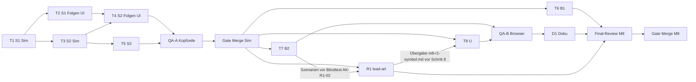

# M8 „Vierte Stufe und Veredelung" — Implementation Plan

> **For agentic workers:** REQUIRED SUB-SKILL: Use superpowers:subagent-driven-development (recommended) or superpowers:executing-plans to implement this plan task-by-task. Steps use checkbox (`- [ ]`) syntax for tracking.

**Goal:** Nach dem Bürger-Sieg geht das Spiel weiter: Stufe 4 „Kaufleute" (gesperrt bis zum Sieg, Hebel als Wert),
Gut Glas aus der ersten Zwei-Input-Kette (Glashütte: Stein + Holz, atomar), Dienst Bad (Badehaus), zweites Ziel
„Handelsstadt" (60 Kaufleute), Save v4 — mit Vorschau ab Tick 0, Zielanzeige, zweitem Banner und Texten im
M7-UX-Format.

**Architecture:** Der Sim-Strang (S1–S3) ändert Daten (`src/sim/defs/`), Typen, Bevölkerung, Produktion, Sieg und
Save; jede Sperre und jeder Hebel ist ein Wert in `TierDef`, kein Sonderfall im Code. Die UI liest nur über reine
Sim-Abfragen (`tierLock`, `merchants`, `missingInputs`, `goalView`) und reine Text-Helfer (`goalTexts`,
`stateInfo`, `nextStep`, `remedyText`, `tooltipLines`); DOM-Aufbau bleibt daneben im selben Modul (Muster M7-UX).
Darstellung bekommt in S1/S2 nur Rückfall-Einträge; eigene Grafik ist das Kann-Paket R1 von `lead-art`.

**Tech Stack:** TypeScript, Vite, Vitest (`node`), Canvas 2D. Keine neue Abhängigkeit (ADR-001), auch keine
Dev-Abhängigkeit.

**Status:** Gate Plan bestanden mit Auflagen (R143); Auflagen aus R142, R143 und der Vermerk aus R144 sind
eingearbeitet (Abschnitt „Auflagen Gate Plan"), Sichtung R146. **Plan-Delta S11-Minimum (H-M8, R150)** eingearbeitet,
wartet auf das Delta-Gate (Abschnitt „Plan-Delta S11").

**Spec:** `docs/superpowers/specs/2026-09-30-m8-kaufleute-design.md` @ `da3da51` (Gate Spec bestanden, R141;
Auflagen Gate Plan R142/R143 eingearbeitet; Nachführung S11-Minimum §23, R150; **81 AK**; im Plan „Spec §n",
„AK-…"). Rulings: R86 (Entscheide 1–6),
R115/R139 (`goodsBalance` nominal), R138, R140 (S1–S3 auf einer Branch, ein Gate Merge nach S3, AK-S3-10), R141
(Gate Spec, Plan-Hinweise beider Leads, E-010, R1 als eigenes Paket), R142 (W1–W7, Reserve-Regel B1), R143 (Gate
Plan, Auflagen, Budget), R144 (BUG-LICHT parallel in `src/render/`), R146 (Sichtung Auflagen), R147/R148
(Nutzernachtrag S11, Programm), R150 (Spec-Delta S11-Minimum). Gate-Urteile: lead-tech (BEDENKEN 1–3, Hinweise), lead-qa (Erstprüfung B1–B5 und Hinweise
1–13, Zweitprüfung OK mit 2 Hinweisen). **Test-Namen beginnen mit der AK-Nummer** (`it('AK-S1-04 …')`),
Review-Focus-Tests mit `RF-<n>`, damit Reviews die Abdeckung per `grep` prüfen. Weil M5–M7 dieselben Kennungen
nutzen (AK-U1-01, AK-R1-03 …), stehen alle neuen M8-Tests in einem `describe('M8 …')`; der Abdeckungs-Grep der
Reviews sucht `describe('M8` plus AK-Nummer.

## Global Constraints

- **Basis:** `main` nach dem Merge von Spec und Plan (Gate Plan, R141). Der Controller notiert den SHA als
  `<BASIS>` im Ledger, bevor der erste Worktree entsteht.
- `src/sim/` bleibt DOM-frei und deterministisch: kein `Date`, kein `Math.random`, Zufall nur über `src/sim/rng.ts`;
  Gebäude laufen in aufsteigender Id (`Object.values(world.buildings)` über numerische Schlüssel).
- Sim-Aktionen werfen nicht, sie liefern `{ ok, reason }`. `deserialize` wirft nie.
- **Spielwerte nur in `src/sim/defs/`:** Stufe 4 (Spec §4.1), Glas (§5.1), Glashütte (§5.2), Badehaus (§6),
  `WIN_MERCHANTS` 60, `requiresWin`, `unlockCitizens` (`null`), `unlockTier` 4 für Badehaus und Glashütte (§4.3, S11). Keine Zahl davon steht hart in `src/ui/`,
  `src/render/` oder in Sim-Logik; Texte holen Zahlen und Namen aus `defs` bzw. Sim-Abfragen.
- `git diff <BASIS> -- tests/sim/balance.test.ts package.json package-lock.json` bleibt leer. Sieg **6050**,
  `minMoney` **57** (belegt über `OFF_REFERENCE` in `tests/sim/balance-crises.test.ts`, Hinweis lead-qa 13).
- `SAVE_VERSION = 4`; Speicherschlüssel `inselreich.save.v1` und `inselreich.save.auto` bleiben.
- Kein sichtbarer Text und kein `title` enthält „Tick" (M7:AK-UX-13). Kosten im Format `costLine`
  („600 Geld · 15 Holz · 8 Werkzeug · 10 Stein"), Raten „/ min" (M7-UX).
- `src/render/` schreibt nie in die Welt; `src/audio/` bleibt unverändert (Ton `win` wird wiederverwendet).
- `index.html`, `src/ui/trade.ts`, `src/ui/messages.ts` bleiben unverändert. `src/style.css` ändert nur Task 8 und
  nur nach AK-U1-08 (Layout der Kopfzeile, keine neuen Farben, keine `opacity` auf Text).
- Desktop-first ab 1280 px; unter 1280 px nur „stürzt nicht ab" (R78).
- **Kein Test fällt weg:** Je Testdatei ist die Zahl der `it(`/`test(` nachher ≥ vorher (Zählbefehl wie M7-UX,
  R125, mit `<BASIS>`). Geänderte Zeilen in bestehenden Tests betreffen nur Erwartungswerte; die bewusst geänderten
  Tests stehen in Spec §20 und in der Tabelle „Bewusst geänderte Tests" unten.
- Commits mit Präfix `feat:`, `fix:`, `test:`, `refactor:`, `docs:`; je Task mindestens ein Commit.
- **Push-Pflicht (R107, R125, R143 B5):** Nach jedem abgenommenen Commit pusht der Controller sofort
  (`git -C .worktrees/<strang> push -u origin <branch>`). Ebenso jeder **Integrations-Merge**, sobald die
  Wellen-Prüfung grün ist: W3 (`feat/m8-sim` → `feat/m8-sim-ui`), W4 (`feat/m8-sim-ui` → `feat/m8-sim`), W6
  (`feat/m8-scen` → `feat/m8-ui`), R1 ← Task 7 (pusht `lead-art`) und jeder Merge von `main` vor einem Final-Review.
  Kein abgenommener oder integrierter Stand liegt nur lokal. Für rote Zwischenstände (nach Task 1 bzw. Task 3) wird
  **kein Pull Request** geöffnet (CI läuft auf PRs; lead-qa Gate Plan (c)).
- Im Hauptcheckout nur `git pull --ff-only`; in Worktrees wird nicht rebased (einzige Ausnahme: R144-Vermerk unter
  „Wellen", Branch ohne eigene Commits). Integration zwischen Strängen nur per `git merge --no-edit <geprüfter SHA>`.

## Review Focus

Eingaben und Zustände, die die Spec impliziert, aber kein AK direkt prüft (jede Zeile hat einen `RF-`Test im
genannten Task):

1. **Badehaus wird abgerissen, während Kaufleute im Radius wohnen:** Ab dem nächsten Schritt `services.bath`
   false, halbe Steuer, Stufe bleibt 4, kein Absturz in `upgradeStatus` (Stufe 4 → „Höchste Stufe erreicht").
   → `RF-1` in Task 1.
2. **Nicht angebundene Glashütte mit vollem Lager:** Zustand `notConnected`, es wird weder Stein noch Holz
   entnommen (Reihenfolge Ausfall → Anbindung → Sturm → Input, Spec §5.3). → `RF-2` in Task 3.
3. **Hebel aktiv, Bürgerzahl fällt nach einem Aufstieg unter N:** bestehende Kaufleute bleiben Stufe 4, ein
   weiteres volles Bürgerhaus steigt nicht auf (erster Grund „Erst ab 40 Bürgern (jetzt …)"), der Stand ist
   speicher- und ladbar, solange der Hebel aktiv ist (Spec §21 Punkt 5). → `RF-3` in Task 1.
4. **Beide Ziele im selben Frame** (Hebel, Laden eines Stands kurz vor beiden Zielen): beide Banner in der
   Reihenfolge erstes, dann zweites Ziel, genau ein Ton `win`, nach Laden keines erneut. → `RF-4` in Task 8.
5. **Laufender Glas-Auftrag, dann fällt die Höchststufe unter 4** (alle Kaufmannshäuser abgerissen): der Auftrag
   bleibt bis `due` gültig und lieferbar, ein Spielstand mit diesem Auftrag lädt (`isValidOrder` prüft nur die
   Auftragsdefinition), der nächste Auftrag kommt aus dem Pool ohne Glas. → `RF-5` in Task 3.

## Organisation

### Tasks, Pakete, Rollen

| Task | Paket(e)           | Inhalt                                                                                         | Implementierer (Modell)                                  | Branch / Worktree                           |
| ---- | ------------------ | ---------------------------------------------------------------------------------------------- | -------------------------------------------------------- | ------------------------------------------- |
| 1    | M8-S1              | Vorlauf (Fixture v3, Pool-Referenz); Stufe 4, Sperre, Hebel, Zählung, Glas, Bad, Save v4       | `tech-sim-engineer` (sonnet), Save-Expertise im Briefing | `feat/m8-sim` · `.worktrees/m8-sim`         |
| 2    | M8-S1 (Folgen)     | UI- und Render-Folgen von S1: Sperrgründe, `tierPath`, Sperrfilter, Taste J, Rückfall, Höhe    | `tech-ui-engineer` (sonnet)                              | `feat/m8-sim-ui` · `.worktrees/m8-sim-ui`   |
| 3    | M8-S2              | Zwei-Input atomar, Glashütte, Pools, Krisen, `goodsBalance`, `missingInputs`                   | `tech-sim-engineer` (sonnet)                             | `feat/m8-sim` · `.worktrees/m8-sim`         |
| 4    | M8-S2 (Folgen)     | `consumes` als Liste in allen Texten (endgültig), Taste O, Rückfall Glashütte, Tooltips, Guide | `tech-ui-engineer` (sonnet)                              | `feat/m8-sim-ui` · `.worktrees/m8-sim-ui`   |
| 5    | M8-S3              | Zweites Ziel, `goalView`, Badabdeckung, ADR-005-Nachtrag, arc42 §6/§8                          | `tech-sim-engineer` (sonnet)                             | `feat/m8-sim` · `.worktrees/m8-sim`         |
| QA-A | AK-S3-10           | Kopfzeilen-Smoke-Check auf `feat/m8-sim` nach Merge von `feat/m8-sim-ui`                       | `qa-playtester` (sonnet)                                 | `.worktrees/m8-sim` (nur lesen)             |
| 6    | M8-B1              | Szenario-Lauf bis zum zweiten Ziel, `firstMerchantTick` (K1 gestrichen, R150)                  | `tech-sim-engineer` (sonnet)                             | `feat/m8-balance` · `.worktrees/m8-balance` |
| 7    | M8-B2              | Szenario-Saves `m8-*` für die Browser-Checks                                                   | `tech-sim-engineer` (sonnet)                             | `feat/m8-scen` · `.worktrees/m8-scen`       |
| 8    | M8-U1, M8-U2       | Zielanzeige, Kaufleute-Chip, zweites Banner, Ton, `MAP_SIGNS`-Zeile (K2); Freischaltung S11    | `tech-ui-engineer` (sonnet)                              | `feat/m8-ui` · `.worktrees/m8-ui`           |
| QA-B | U1/U2-Browser      | AK-U1-04…07, AK-U2-03…07, AK-U2-10 (zwei parallele Checks, je eigener Port)                    | `qa-playtester` (sonnet) × 2                             | `.worktrees/m8-ui` (nur lesen)              |
| R1   | M8-R1 (`lead-art`) | Kann K2/K3: Silhouetten G1–G4, Symbol Bad, Glasfarbe                                           | `art-rendering-engineer` (Controller `lead-art`)         | `feat/m8-render` · `.worktrees/m8-render`   |
| D1   | M8-D1              | README, Hauptspec-Verweise, arc42 §5 (`lead-tech`, kein Start)                                 | —                                                        | `feat/m8-ui`                                |

- **Review je Task:** `qa-code-reviewer` (sonnet), Urteil OK / BEDENKEN / ZURÜCK. Fix-Runden per `SendMessage` an
  denselben Implementierer (kein neuer Start).
- **Kein eigener `tech-save-engineer`** (KISS, wie M6): Task 1 bekommt den Roster-Text `tech-save-engineer` ins
  Briefing. **Balancing** (Tasks 6, 7) übernimmt `tech-sim-engineer` (Spec §17 nennt `design-balancing-analyst`;
  die Persona hat keine Datei). Die Ruling-Vorlage aus den Messwerten schreibt `lead-tech`.
- **D1** schreibt `lead-tech` selbst (Doku, kein Produktivcode) nach Task 8, vor dem Final-Review M8.

### Plan-Abweichungen von Spec §17 (R136 gemeldet; Gate Plan bestanden, R143: P1 ausdrücklich bestätigt)

P1 ist eine **bestätigte Abweichung** (R143): Der Wortlaut von AK-S2-17 in der Spec bleibt unverändert („einzige
geänderte UI-Testdatei `hotkeys.test.ts`"); er gilt für M8 nur sinngemäss wie in Zeile P1 beschrieben. P2–P6 hat
lead-qa als haltbar ohne Testlücke beurteilt; sie gelten mit dem bestandenen Gate Plan.

| Nr. | Spec sagt                                                                                                                                             | Plan macht                                                                                                                                                                                                                                                                                                                                                                                                                     | Grund                                                                                                                                               |
| --- | ----------------------------------------------------------------------------------------------------------------------------------------------------- | ------------------------------------------------------------------------------------------------------------------------------------------------------------------------------------------------------------------------------------------------------------------------------------------------------------------------------------------------------------------------------------------------------------------------------ | --------------------------------------------------------------------------------------------------------------------------------------------------- |
| P1  | S2: UI nur Typanpassung; `producerOf`-Vorstufe/`consumerOf` bis U2 nur Ein-Input-Gebäude; einzige geänderte UI-Testdatei `hotkeys.test.ts` (AK-S2-17) | Task 4 setzt die **endgültige** Listen-Semantik in `guide.ts`, `texts.ts`, `inspect.ts`, `buildMenu.ts` um. Damit wandern **AK-U2-01, AK-U2-02, AK-U2-08, AK-U2-09** nach Task 4; `tests/ui/guide.test.ts` (Steinbruch-Abhilfe „… oder baue Glashütte (O)") und `tests/ui/tooltip.test.ts`/`inspect.test.ts` ändern sich bewusst in Task 4. AK-S2-17 gilt sinngemäss: kein UI-Test ändert sich ausser den in Task 4 genannten. | Kein Wegwerf-Code (YAGNI, L0-Auftrag zum Plan). Seit R140 gibt es keinen sichtbaren Zwischenstand S2 auf `main`; der Filter hatte nur diesen Zweck. |
| P2  | `missingInputs` in S3 (AK-S3-04)                                                                                                                      | `missingInputs` entsteht in **Task 3** (`queries.ts` gehört S2 ohnehin), AK-S3-04 wird dort geprüft                                                                                                                                                                                                                                                                                                                            | Task 4 braucht es für `stateInfo` und `remedyText`.                                                                                                 |
| P3  | `MAP_SIGNS`-Legendenzeile in R1 (AK-R1-03), R1 nach U2                                                                                                | Die Zeile ändert **Task 8** (Owner `guide.ts` im UI-Strang), nur wenn K2 nicht gestrichen ist; den Wortlaut des Zeichens liefert `lead-art` vor Task 8 (Übergabe `.studio/handoffs/m8-r1-symbol.md`). Der Symbolname ist fest: `Symbol.shape` bekommt `'bath'`. R1 läuft parallel zu Task 8.                                                                                                                                   | Ruling R141 („`MAP_SIGNS`-Zeile an U2"); R1 und UI-Strang haben damit getrennte Dateien.                                                            |
| P4  | U1 und U2 als zwei Pakete                                                                                                                             | **ein** Task 8 (U1 + Rest U2), zwei parallele Browser-Checks                                                                                                                                                                                                                                                                                                                                                                   | Nach P1 bleibt von U2 nur die `MAP_SIGNS`-Zeile und die Browser-Abnahme; ein eigener Implementierer-Start lohnt nicht.                              |
| P5  | S1 und S2 je ein Paket, jedes hält `make check` grün                                                                                                  | S1 = Task 1 + Task 2, S2 = Task 3 + Task 4 (Sim und Folgen getrennt, Tasks 2 ∥ 3 und 4 ∥ 5 parallel). Grün ist jede **Welle** (siehe „Wellen"); zwischen Task 1 und 2 bzw. 3 und 4 sind nur die dort benannten Prüfungen rot.                                                                                                                                                                                                  | Parallelität (R67) bei getrennter Datei-Ownership; Sim- und UI-Folgen haben verschiedene Personas.                                                  |
| P6  | D1 als eigener Doku-Strang                                                                                                                            | `lead-tech` schreibt D1 selbst, kein Start                                                                                                                                                                                                                                                                                                                                                                                     | Persona lead-tech führt arc42 und README mit.                                                                                                       |

### Gemeldete Widersprüche und Messwerte aus dem Planungslauf (R136; entschieden durch R142, R143)

Entscheide: **W1, W3–W6 bestätigt** (R143). Die Spec ist seit der R142-Runde nachgezogen: W1 in §13 und AK-S1-17
(`roofOnly.bathhouse: 2`), W2 in §20 (Liste ergänzt), W3 in AK-S3-01 (**54**), W4 in §8 und §16.3 (Messpunkt
7300 / 1490, kein Wert angepasst, Reserve-Regel als Testhelfer-Regel), W5 in AK-B1-02 und §16.3 (`--silent=false`).
W6 braucht keine Spec-Änderung (Tick 5400 erfüllt „≥ 3000"). W7 ist Prozess (Task 3 „Rot nach diesem Task
erlaubt"; lead-qa (c): akzeptabel). Die Spalte „Plan vorläufig" unten gilt damit endgültig.

Die Task-Texte 1–5 sind in einem Probe-Worktree auf `main` @ 05240f4 durchgespielt (nach Tasks 1–5 `make check`
grün, 882 Tests, 1 übersprungen; jeder neue Test auf dem Vorgänger-Stand rot). Dabei fiel auf:

| Nr. | Stelle                             | Befund                                                                                                                                                          | Plan vorläufig (einfachere Variante)                                           |
| --- | ---------------------------------- | --------------------------------------------------------------------------------------------------------------------------------------------------------------- | ------------------------------------------------------------------------------ |
| W1  | Spec §20, AK-S1-17                 | „`sprites.test.ts` bleibt unverändert" hält nicht: Der Fensteranker-Test braucht `roofOnly.bathhouse: 2`, weil der Rückfall `public` zwei Dachfenster zeichnet. | Erwartungswert ergänzt (keine Lockerung), Tabelle „Bewusst geänderte Tests"    |
| W2  | Spec §20                           | Liste unvollständig: zusätzlich `save.test.ts` Z. 65, 147, 304, 308; `defs.test.ts` Z. 17, 31, 42; `helpers.ts` Z. 48.                                          | in „Bewusst geänderte Tests" aufgenommen                                       |
| W3  | AK-S3-01 (alter Wortlaut „auf 55") | Drei Häuser schrumpfen im selben Takt (60 → 57 → 54); 55 wird nie erreicht.                                                                                     | Test schrumpft bis ≤ 55 (also 54) und prüft `wonMerchants` `true`              |
| W4  | Spec §16.3 Messpunkt               | Bürger-Endzustand gemessen bei Tick **7300**, Geld **1490** (Spec/Werte: ≈ 7500, 2290). Weniger Startgeld für Phase 3.                                          | Task 6 misst und meldet; Ruling-Vorlage nennt beide Werte; nichts nachgestellt |
| W5  | AK-B1-02 Messbefehl                | Vitest unterdrückt `console.log` bestandener Tests; der Befehl aus der Spec gibt nichts aus.                                                                    | Task 6 nutzt `VITE_BALANCE_LOG=1 npx vitest run … --silent=false`              |
| W6  | v3-Fixture (Spec §10.2)            | Alle Bedingungen (Krise läuft, Auftrag, Stufe 3, `sellPct < 100`) gelten erstmals bei Tick **5400**; Tick ≥ 3000 ist damit erfüllt.                             | Fixture bei Tick 5400                                                          |
| W7  | Task 3 Zwischenstand               | Nach Task 3 sind neben 9 `tsc`-Fehlern auch 6 UI-/Render-Vitest-Fälle rot (dieselben `consumes`-Stellen zur Laufzeit).                                          | in „Rot nach diesem Task erlaubt" (Task 3) benannt, Task 4 macht grün          |

Messwerte: Pool-Referenz AK-S2-13 = `0xea2c801e` (auf 05240f4; Task 1 misst auf `<BASIS>` neu und vergleicht).
Weitere Abweichungen vom Gerüst: `goodList` in `texts.ts` (neu, Task 4); AK-S3-01, -02, -08 in
`tests/sim/merchants.test.ts` statt `tick.test.ts`; AK-S2-13 zweiteilig (Referenz Task 1, Stufe 4 Task 3).

### Bestätigte Abweichungen (R143) — Prüfgrundlage beider Final-Reviews

Sim-Final-Review und Final-Review M8 prüfen gegen Spec @ `da3da51` **plus** diese Liste; was hier steht, ist kein
Befund (lead-qa Gate Plan, Hinweis 3):

| Nr. | Spec-Stelle         | gilt für M8                                                                                        |
| --- | ------------------- | -------------------------------------------------------------------------------------------------- |
| P1  | AK-S2-17, §17 S2    | Wortlaut bleibt; geänderte UI-Tests nur die in Task 4 genannten, AK-U2-01, -02, -08, -09 in Task 4 |
| W1  | §13, §20, AK-S1-17  | `roofOnly.bathhouse: 2` in `sprites.test.ts` ist Ergänzung, keine Lockerung (Spec nachgezogen)     |
| W3  | AK-S3-01            | Schrumpfen auf **54** (60 → 57 → 54), `wonMerchants` bleibt `true` (Spec nachgezogen)              |
| W4  | §8, §16.3 Messpunkt | Bürger-Endzustand Tick 7300 / Geld 1490 im Planungslauf; B1 misst neu, kein Wert angepasst         |
| W5  | AK-B1-02            | Messbefehl mit `--silent=false` (Spec nachgezogen)                                                 |
| W6  | §10.2 v3-Fixture    | Fixture bei Tick 5400 (erfüllt „Tick ≥ 3000")                                                      |

### Auflagen Gate Plan (R142, R143, R144) — Fundstellen in diesem Plan

| Auflage                                                            | Fundstelle                                                                                  |
| ------------------------------------------------------------------ | ------------------------------------------------------------------------------------------- |
| R142: B1-Controller investiert nur über fester Reserve             | Task 6 „Gesetzte Regeln" und `RESERVE` in `merchantsController.ts` (500, Begründung dort)   |
| QA-Hinweis 1: genau 9 `tsc`-Fehler auch in Task 5                  | Task 5 Schritt 5                                                                            |
| QA-Hinweis 2: Teil B `roofOnly.bathhouse`, `glassworks`            | „Bewusst geänderte Tests", Tabelle Tasks 6–8 und R1                                         |
| QA-Hinweis 3: P1, W1, W3–W6 bestätigt                              | Abschnitt oben, Kopf „Plan-Abweichungen", Sim-Final-Review Punkt 6, Final-Review M8 Punkt 4 |
| B1: lead-art merged selbst in `feat/m8-render`                     | Final-Review M8 (Vorbereitung), Paket R1                                                    |
| B2: Session- und Agent-ID je E-010-Messpunkt, Wechsel = Störgrösse | „E-010", Messpunkte; Abschluss Punkt 3                                                      |
| B3: Kanten R1 ↔ T7/T8; Worktree `m8-render` durch lead-art         | Mermaid und „Paket-Abhängigkeiten" unter „Wellen"; „Einrichten"; Paket R1; Task 8 Kopf      |
| B4: Spec-SHA nachgeführt (jetzt `da3da51`, R150)                   | Kopf, Task 7 „Produces"                                                                     |
| B5: Integrations-Merges pushen                                     | Global Constraints „Push-Pflicht"; Wellen-Tabelle                                           |
| R144: BUG-LICHT parallel in `src/render/`                          | „Wellen", Vermerk BUG-LICHT; Paket R1                                                       |

### Plan-Delta S11-Minimum (H-M8, R147, R148, R150; Spec §23)

Nutzerwunsch: Glashütte und Badehaus erst nach der Freischaltung der Stufe 4. Umsetzung im Plan:

| Teil                  | Task (Welle) | Inhalt                                                                                                                                                                            |
| --------------------- | ------------ | --------------------------------------------------------------------------------------------------------------------------------------------------------------------------------- |
| Sperre Badehaus       | 1 (W1)       | `BuildingDef.unlockTier`, `bathhouse.unlockTier: 4`, `buildLock` in `placement.ts`, `canPlace` prüft sie zuerst; AK-S1-21 in `tests/sim/placement.test.ts`                        |
| Test-Helfer           | 1, 3         | `withUnlock` in `tests/sim/scenarios.ts` (`galerie`: Badehaus T1, Glashütte T3); `placeService` in `tests/sim/helpers.ts` baut Gebäude mit `unlockTier` ebenso                    |
| Sperre Glashütte      | 3 (W2)       | `glassworks.unlockTier: 4`; AK-S2-19 in `tests/sim/placement.test.ts`                                                                                                             |
| Tooltip               | 4 (W3)       | `tierPreviewLine` aus `unlockTier`: „Für Kaufleute (Stufe 4)" ohne Hebel-Variante (AK-U2-01 geändert)                                                                             |
| Freischaltung im Sieg | 5 (W3)       | AK-S3-08 neu gefasst (Sperre bei `W − 1`, frei bei `W`, `merchants` 0)                                                                                                            |
| K1 gestrichen         | 6 (W5)       | `MerchantOptions`, `prepare`, AK-B1-07 entfallen; ein Fall im Szenario-Lauf                                                                                                       |
| Szenarien             | 7 (W5)       | `m8-kurz-vor-sieg` ohne Badehaus, `m8-glashuette-wartet` mit `won true`, `m8-kaufleute-ohne-glas` mit Geld und Lager (AK-B2-01/-02 geändert)                                      |
| UI-Freischaltung      | 8 (W5)       | `goal.ts` `unlockNotice`, `lockedToolText`; `app.ts` Merkfeld `unlockShown`, Sperre in `selectTool`; `hud.ts` Glas-Chip `hidden`; `buildMenu.ts` blendet Gesperrtes aus; AK-U1-09 |
| Browser               | QA-A, QA-B   | QA-A Tooltip-Text; QA-B-1 AK-U1-04/-05 geändert, AK-U1-09 neu, AK-U1-07 angepasst; QA-B-2 AK-U2-06/-10 geändert                                                                   |

**Bitgleich-Nachweis (Prüfauftrag H-M8):** `balance.test.ts` und `balance-crises.test.ts` bleiben bitgleich.
Begründung: (1) Die Sim ruft `canPlace` nur aus `placeBuilding` (`src/sim/build.ts`); sonst nur UI (`hints.ts`,
`input.ts`). (2) `buildLock` gibt für jedes Gebäude ohne `unlockTier` sofort `null` zurück, ohne Spielzustand zu lesen;
`canPlace` liefert für diese Gebäude also dasselbe Ergebnis wie vorher. (3) Der Bürger-Controller
(`tests/sim/controller.ts`, unverändert) baut weder Badehaus noch Glashütte; der Merchant-Controller baut beide erst
in Phase 3, die `w.won` voraussetzt (dann `buildLock` `null`). (4) Kein neues Save-Feld, kein Zufall, keine neue
Tick-Phase. Belegt wird das wie bisher: Task 1 Schritt 9 (`git diff <BASIS> -- tests/sim/balance.test.ts` leer, Sieg
6050, `minMoney` 57, Fingerabdruck `0xbfeac8c6` in AK-S1-15) und Task 6 Schritt 7 (AK-B1-05).

**AK-Zuordnung S11:** neu AK-S1-21 (Task 1), AK-S2-19 (Task 3), AK-U1-09 (Task 8 Vitest, QA-B-1 Browser); geändert
AK-S3-08 (Task 5), AK-B2-02 (Task 7), AK-U1-04/-05 (QA-B-1), AK-U2-01 (Task 4), AK-U2-06/-10 (QA-B-2); gestrichen
AK-B1-07 (Task 6). Summe 81 (Tabelle „Abdeckung AK → Task").

**Budget, Tasks, Board:** Taskzahl bleibt 8, QA-Checks bleiben 3 (AK-U1-09 läuft in QA-B-1 mit). Formel unverändert
21 → 28, Freigabe R143 (lead-tech 25) reicht; kein Mehrbedarf. Board: keine neuen Pakete und keine neuen Kanten;
Titel `M8-B1` ohne K1, `M8-U` um „Freischaltung S11" ergänzen.

**Gemeldete Widersprüche (R137), Plan vorläufig mit der einfacheren Variante; das Delta-Gate entscheidet:**

| Nr. | Spec-Stelle       | Befund                                                                                                                                            | Plan vorläufig                                                                                                                                                                 |
| --- | ----------------- | ------------------------------------------------------------------------------------------------------------------------------------------------- | ------------------------------------------------------------------------------------------------------------------------------------------------------------------------------ |
| W8  | AK-U1-07          | „neues Spiel, Badehaus mit J bauen" ist nach S11 unmöglich (neues Spiel `won false`).                                                             | QA-B-1 Schritt 4: neues Spiel bei 800 px, J zeigt den Sperrgrund (kein Absturz); dann `m8-kaufleute-ohne-glas` laden, Badehaus mit J bauen, Info-Panel öffnen.                 |
| W9  | AK-U2-09, 14.8    | Steinbruch `storageFull` → „… oder baue Glashütte (O)" empfiehlt vor dem Sieg ein gesperrtes Gebäude (die Taste O zeigt dann nur den Sperrgrund). | Wortlaut der Spec bleibt (Task 4, Test wie Spec); keine stille Sperr-Abfrage in `remedyText`. Vorschlag fürs Delta-Gate: Zusatz nur bei `buildLock(w, 'glassworks') === null`. |
| W10 | 14.1, 4.3 Punkt 5 | Art der Meldung von `lockedToolText` ist nicht festgelegt.                                                                                        | `showMessage(text, 'error')` wie die übrigen Ablehnungsgründe in `app.ts` (nicht bleibend).                                                                                    |

### Gemeinsame Schnittstellen (verbindlich für alle Tasks)

Jeder Implementierer sieht nur seinen Task; diese Namen und Typen gelten überall.

```ts
// src/sim/types.ts (Task 1, ausser consumes: Task 3)
export type GoodId =
  'wood' | 'tools' | 'stone' | 'food' | 'wool' | 'cloth' | 'cane' | 'rum' | 'glass'; // glass am Ende
export type ServiceId = 'faith' | 'school' | 'bath';
// BuildingDefId: bestehende Ids inkl. 'firestation', dazu 'bathhouse' (Task 1) und 'glassworks' (Task 3)
export type Tier = 1 | 2 | 3 | 4;
export interface TierDef {
  /* bestehend */
  requiresWin?: boolean; // nur TIERS[4]: true
  unlockCitizens?: number | null; // nur TIERS[4]: null (Hebel)
}
export interface BuildingDef {
  /* bestehend */
  consumes?: readonly GoodId[]; // Task 3; vorher GoodId
  unlockTier?: Tier; // Task 1 (S11): baubar erst, wenn diese Stufe frei ist; bathhouse 4 (Task 1), glassworks 4 (Task 3)
}
export interface World {
  version: 4;
  /* bestehend */
  wonMerchants: boolean; // nach `won` im Objekt
}

// src/sim/defs/tiers.ts (Task 1)
export const WIN_MERCHANTS = 60;

// src/sim/population.ts (Task 1)
export const SERVICE_IDS: readonly ServiceId[]; // ['faith', 'school', 'bath'] (bisher modul-lokal)
export function citizens(world: World): number; // Σ Einwohner mit tier ≥ 3
export function merchants(world: World): number; // Σ Einwohner mit tier === 4
export function populationByTier(world: World): Record<Tier, number>; // Schlüssel 1–4
/** Sperrgrund der Zielstufe `tier` oder null (frei). Für Stufen ohne Definition (5) oder ohne requiresWin: null. */
export function tierLock(world: World, tier: number): string | null;
//   'Erst nach dem Ziel'                          (Hebel null, !won)
//   `Erst ab ${N} Bürgern (jetzt ${citizens})`   (Hebel N, !won, citizens < N)
// upgradeStatus(world, b): Sperrgrund als ERSTER Eintrag, danach die bisherigen Gründe in bisheriger Reihenfolge.

// src/sim/placement.ts (Task 1, Änderung S11)
/** Bausperre: tierLock(world, def.unlockTier) oder null; ohne unlockTier immer null, ohne Weltzugriff. */
export function buildLock(world: World, defId: BuildingDefId): string | null;
// canPlace(world, defId, x, y): prüft buildLock ZUERST (vor Boden und Standort) und liefert fail(<Grund>).

// src/sim/save.ts (Task 1)
export const SAVE_VERSION = 4;
export function migrateV3ToV4(raw: Record<string, unknown>): void;

// src/sim/queries.ts (Task 3)
export function missingInputs(world: World, b: Building): GoodId[]; // Güter aus consumes mit stock < 1, Reihenfolge consumes; [] ohne consumes

// src/sim/queries.ts (Task 5)
export type GoalView =
  | {
      phase: 'citizens';
      current: number;
      target: number;
      next: { tierName: string; target: number; unlockCitizens: number | null };
    }
  | { phase: 'merchants'; current: number; target: number }
  | { phase: 'done'; current: number; target: number };
export function goalView(world: World): GoalView;
// src/sim/tick.ts (Task 5): checkWin setzt erst won, dann wonMerchants.

// src/ui/texts.ts (Task 4) — Signatur gilt ab Task 4 für alle Aufrufer
export function stateInfo(
  b: Building,
  tick: number,
  missing?: readonly GoodId[],
): { text: string; ok: boolean };
//   waitingInput: „Wartet auf {Namen aus missing, mit ‚und' verbunden}"; missing leer/fehlt → alle Güter aus consumes
//   inspect.ts übergibt missingInputs(world, b)

// src/ui/buildMenu.ts (Task 4)
export function tierPreviewLine(defId: BuildingDefId): string | null;
//   „Für Kaufleute (Stufe 4)" (Änderung S11, ohne Hebel-Variante) aus def.unlockTier; null ohne unlockTier

// src/ui/texts.ts (Task 4)
export function goodList(goods: readonly GoodId[]): string; // „Holz", „Stein und Holz"

// src/ui/goal.ts (Task 8, neu)
export interface GoalTexts {
  chip: string;
  title: string;
  rest: string;
  next: string | null;
  fillPct: number;
}
export function goalTexts(view: GoalView): GoalTexts;
export interface GoalShown {
  wonShown: boolean;
  wonMerchantsShown: boolean;
}
export function initialGoalShown(world: Pick<World, 'won' | 'wonMerchants'>): GoalShown;
export function goalBanners(
  shown: GoalShown,
  world: Pick<World, 'won' | 'wonMerchants'>,
): { texts: string[]; shown: GoalShown };
// src/ui/goal.ts (Task 8, Änderung S11)
export const UNLOCK_NOTICE: string; // „Neu freigeschaltet: Badehaus (J) und Glashütte (O) — deine Bürger wollen Kaufleute werden"
export function unlockNotice(wasLocked: boolean, world: World): string | null; // Text genau bei wasLocked && buildLock(world,'bathhouse') === null
export function lockedToolText(world: World, defId: BuildingDefId): string | null; // „{Name}: {friendlyReason(buildLock)}" oder null
// src/ui/hud.ts (Task 8): export function popChipHidden(world: World, tier: Tier): boolean;
//                         export function stockChipHidden(world: World, good: GoodId): boolean; // S11: Glas bis Freischaltung oder Glas > 0
// src/ui/buildMenu.ts (Task 8, S11): export function buildEntries(world: World, category: Category): BuildingDefId[]; // ohne Gesperrtes
// src/ui/soundEvents.ts (Task 8): SoundSnapshot.wonMerchants; src/ui/app.ts: GameState.wonMerchantsShown, GameState.unlockShown

// src/render/overlays.ts (R1): Symbol.shape bekommt 'bath'

// tests/sim/controller.ts (Task 6): export const CONTROL_INTERVAL; export function control(w, layout, opts)
// tests/sim/scenarios.ts (Task 1, S11): function withUnlock<T>(w, fn): T — won für den Bau kurz true (nur Bildergalerie)
```

### Datei-Ownership

Jede Datei hat in einer Welle genau einen Owner-Task. Tasks auf demselben Branch laufen nacheinander.

**Sim-Strang (Tasks 1–5):**

| Task | Branch           | Dateien                                                                                                                                                                                                                                                                                                                                                                                                           |
| ---- | ---------------- | ----------------------------------------------------------------------------------------------------------------------------------------------------------------------------------------------------------------------------------------------------------------------------------------------------------------------------------------------------------------------------------------------------------------- |
| 1    | `feat/m8-sim`    | `src/sim/{types,world,population,save,placement}.ts`, `tests/sim/placement.test.ts` (S11), `src/sim/defs/{tiers,goods,buildings}.ts`, `src/ui/buildMenu.ts` (nur `SERVICE_NAMES`), `tests/sim/merchants.test.ts` (neu), `tests/sim/{defs,save,population,taxes,fire,balance-crises,orders}.test.ts`, `tests/sim/{helpers,scenarios}.ts`, `tests/sim/fixtures/save-v3.json` (neu), `docs/arc42.md` (§8 Persistenz) |
| 2    | `feat/m8-sim-ui` | `src/ui/{hints,guide,hotkeys}.ts`, `src/render/{iso,sprites}.ts`, `tests/ui/{hints,hud,guide,hotkeys}.test.ts`, `tests/render/sprites.test.ts`                                                                                                                                                                                                                                                                    |
| 3    | `feat/m8-sim`    | `src/sim/{types,production,queries}.ts`, `src/sim/defs/buildings.ts`, `tests/sim/placement.test.ts` (S11), `tests/sim/glassworks.test.ts` (neu), `tests/sim/{defs,fire,production,merchants,queries}.test.ts`, `tests/sim/scenarios.ts`                                                                                                                                                                           |
| 4    | `feat/m8-sim-ui` | `src/ui/{texts,inspect,buildMenu,guide,hotkeys}.ts`, `src/render/sprites.ts`, `tests/ui/{tooltip,inspect,guide,hotkeys}.test.ts`, `tests/render/sprites.test.ts`                                                                                                                                                                                                                                                  |
| 5    | `feat/m8-sim`    | `src/sim/{tick,queries}.ts`, `tests/sim/{merchants,queries}.test.ts`, `docs/adr/ADR-005-tick-reihenfolge-und-zustaende.md`, `docs/arc42.md` (§6, §8 Gebäudezustände)                                                                                                                                                                                                                                              |

Je Welle disjunkt: W2 Task 2 (`src/ui`, `src/render`, `tests/ui`, `tests/render`) ∥ Task 3 (`src/sim`, `tests/sim`);
W3 Task 4 ∥ Task 5 ebenso. Die Merges W3 (`feat/m8-sim` @ T3 → `feat/m8-sim-ui`) und W4 (`feat/m8-sim-ui` @ T4 →
`feat/m8-sim`) berühren keine gemeinsame Datei ausserhalb der jeweils schon gemergten Stände (Probe-Lauf ohne
Konflikt in der Reihenfolge T1 → T2 → T3 → T4 → T5).

**Zweite Hälfte (Tasks 6–8, R1, D1):**

| Datei                                                                                                                                                     | Owner (Welle)                         |
| --------------------------------------------------------------------------------------------------------------------------------------------------------- | ------------------------------------- |
| `tests/sim/controller.ts` (nur zwei `export`)                                                                                                             | Task 6 (W5)                           |
| `tests/sim/merchantsController.ts` (neu), `tests/sim/balance-merchants.test.ts` (neu)                                                                     | Task 6 (W5)                           |
| `tests/sim/scenarios.ts`, `tests/sim/scenario-saves.test.ts`                                                                                              | Task 7 (W5)                           |
| `src/ui/goal.ts` (neu), `tests/ui/goal.test.ts` (neu)                                                                                                     | Task 8 (W5)                           |
| `src/ui/hud.ts`, `src/ui/inspect.ts` (Ruhe-Ansicht), `src/ui/app.ts`, `src/ui/soundEvents.ts`                                                             | Task 8 (W5)                           |
| `src/ui/buildMenu.ts` (nur `buildEntries` und der Filter in `renderBuildMenu`, S11), `tests/ui/tooltip.test.ts` (nur neues `it`)                          | Task 8 (W5, Schritt 5b)               |
| `tests/ui/soundEvents.test.ts`, `tests/ui/hud.test.ts`, `tests/ui/hotkeys.test.ts` (je nur neue `it`)                                                     | Task 8 (W5)                           |
| `src/ui/guide.ts` (nur `MAP_SIGNS`), `tests/ui/guide.test.ts` (nur neues `it`)                                                                            | Task 8 (W5, Schritt 8)                |
| `src/style.css` (nur nach AK-U1-08)                                                                                                                       | Task 8 (W5/W6)                        |
| `src/render/sprites.ts`, `iso.ts`, `palette.ts`, `overlays.ts`; `tests/render/sprites.test.ts`, `overlays.test.ts`, `palette.test.ts`, `renderer.test.ts` | R1 (`lead-art`, W5)                   |
| `.studio/handoffs/m8-r1-symbol.md`                                                                                                                        | R1 (`lead-art`, vor Task 8 Schritt 8) |
| `README.md`, `docs/superpowers/specs/2026-09-29-inselreich-design.md`, `docs/arc42.md` (§5)                                                               | D1 (`lead-tech`, W6, `feat/m8-ui`)    |

### Wellen, Abhängigkeiten und Merges

Ein abhängiger Task startet erst nach Review-Urteil OK des Vorgängers. Integration nur geprüfter SHAs. Jeder Merge
der Spalten W3, W4, W6 und R1 ← Task 7 wird nach grüner Wellen-Prüfung sofort gepusht (R143 B5), SHA ins Ledger.

| Welle | Branch `feat/m8-sim`                                                                                                        | Branch `feat/m8-sim-ui`                  | weitere Branches                                                                            | grün am Wellenende                                       |
| ----- | --------------------------------------------------------------------------------------------------------------------------- | ---------------------------------------- | ------------------------------------------------------------------------------------------- | -------------------------------------------------------- |
| W1    | Task 1                                                                                                                      | —                                        | —                                                                                           | `npx tsc --noEmit`, `npx vitest run tests/sim`           |
| W2    | Task 3                                                                                                                      | anlegen am Task-1-SHA; Task 2            | —                                                                                           | `feat/m8-sim-ui`: `make check`; `feat/m8-sim`: Sim-Tests |
| W3    | Task 5                                                                                                                      | merge `feat/m8-sim` @ Task-3-SHA; Task 4 | —                                                                                           | `feat/m8-sim-ui`: `make check`; `feat/m8-sim`: Sim-Tests |
| W4    | merge `feat/m8-sim-ui` @ Task-4-SHA; QA-A (AK-S3-10)                                                                        | —                                        | —                                                                                           | `feat/m8-sim`: `make check`                              |
| —     | **E-010-Übergabe**, Sim-Final-Review (`lead-qa`, opus), **Gate Merge Sim** (L0), Merge durch `production-integrator`        |                                          |                                                                                             | `main` grün, Pages                                       |
| W5    | —                                                                                                                           | —                                        | Task 6 (`m8-balance`) ∥ Task 7 (`m8-scen`) ∥ Task 8 (`m8-ui`); R1 (`m8-render`, `lead-art`) | je Branch `make check`                                   |
| W6    | —                                                                                                                           | —                                        | `feat/m8-ui` merged `feat/m8-scen` @ Task-7-SHA; QA-B; D1                                   | `feat/m8-ui`: `make check`                               |
| —     | Final-Review M8 (`lead-qa`, opus) über `feat/m8-balance`, `feat/m8-scen`, `feat/m8-ui`, `feat/m8-render`; **Gate Merge M8** |                                          |                                                                                             |                                                          |



**Paket-Abhängigkeiten (`blocked-by` für das Board, `lead-production`):**

| Paket                 | blocked-by                                                                                                 |
| --------------------- | ---------------------------------------------------------------------------------------------------------- |
| M8-S1 (Task 1)        | Gate Plan (R143), Merge von Spec und Plan auf `main`                                                       |
| M8-S1 Folgen (Task 2) | M8-S1 Task 1                                                                                               |
| M8-S2 (Task 3)        | M8-S1 Task 1                                                                                               |
| M8-S2 Folgen (Task 4) | Task 2, Task 3                                                                                             |
| M8-S3 (Task 5)        | Task 3                                                                                                     |
| QA-A                  | Task 4, Task 5 (W4-Merge)                                                                                  |
| M8-B1 (Task 6)        | Gate Merge Sim                                                                                             |
| M8-B2 (Task 7)        | Gate Merge Sim                                                                                             |
| M8-U (Task 8)         | Gate Merge Sim; **Schritt 8 zusätzlich M8-R1** (Übergabe `.studio/handoffs/m8-r1-symbol.md`)               |
| M8-R1 (`lead-art`)    | Gate Merge Sim; **Blindtest AK-R1-02 zusätzlich M8-B2** (Task 7, Review OK); Start nach R144-Vermerk unten |
| QA-B                  | Task 7, Task 8 (W6-Merge)                                                                                  |
| M8-D1                 | QA-B                                                                                                       |
| Final-Review M8       | Task 6, M8-D1, M8-R1                                                                                       |

**Vermerk BUG-LICHT (R144):** Parallel ändert `lead-art` im Paket BUG-LICHT (Branch `fix/licht-verdeckung`) Dateien in
`src/render/`. Die W5-Worktrees (insbesondere `m8-render` für R1, dazu `m8-balance`, `m8-scen`, `m8-ui`) entstehen
am **aktuellen** `main` zum Startzeitpunkt (`git pull --ff-only` direkt davor), nicht an einem älteren SHA. Ist
BUG-LICHT erst nach dem Anlegen, aber vor dem eigenen Start gemergt, rebased der Branch vor dem ersten eigenen
Commit auf `main` (`git -C .worktrees/<strang> rebase main`; ohne eigene Commits gefahrlos, einzige Ausnahme zur
Regel „nicht rebasen"). Wird BUG-LICHT erst während W5 gemergt, wird **nicht** rebased; `main` kommt mit dem Merge
vor dem Final-Review M8 hinein. Für den Sim-Strang (Tasks 2 und 4 ändern `src/render/{iso,sprites}.ts`) gilt der
bestehende Merge von `main` vor dem Sim-Final-Review.

**Einrichten** (Controller; `m8-render` legt `lead-art` an, R143 B3):

```bash
cd /Users/KN/CAS/projekte/anno-clone
git pull --ff-only
git rev-parse --short main                     # = <BASIS>, ins Ledger
git worktree add .worktrees/m8-sim -b feat/m8-sim main
ln -s ../../node_modules .worktrees/m8-sim/node_modules
# nach Review-OK von Task 1 (SHA aus dem Bericht):
git worktree add .worktrees/m8-sim-ui -b feat/m8-sim-ui <T1-SHA>
ln -s ../../node_modules .worktrees/m8-sim-ui/node_modules
# nach dem Gate Merge Sim, direkt vor dem Start von W5 (R144: aktueller main, BUG-LICHT ggf. enthalten):
git pull --ff-only
git worktree add .worktrees/m8-balance -b feat/m8-balance main
git worktree add .worktrees/m8-scen -b feat/m8-scen main
git worktree add .worktrees/m8-ui -b feat/m8-ui main
for w in m8-balance m8-scen m8-ui; do ln -s ../../node_modules .worktrees/$w/node_modules; done
# nur lead-art (nicht der Controller), vor dem Start von R1:
#   git worktree add .worktrees/m8-render -b feat/m8-render main
#   ln -s ../../node_modules .worktrees/m8-render/node_modules
```

### Ablauf je Task (Controller `lead-tech`)

1. `python3 tools/studio/log.py package --id M8-<Paket> --title "<Titel>" --owner lead-tech --status active --milestone M8 [--blocked-by M8-<…>]`
2. Implementierer im Vordergrund starten (parallele Tasks einer Welle in **einer** Nachricht), Briefing nach
   `docs/studio/templates/briefing.md`: Kopfzeilen, feste Regeln wörtlich, Logging-Block, Worktree-Pfad, Task-Text
   aus diesem Plan wörtlich, Abschnitte „Global Constraints" und „Gemeinsame Schnittstellen", Spec-Pfad,
   „Budget: keins, keine Agenten starten".
3. Implementierer: Test schreiben → rot (exakter Befehl, erwartete Meldung, Rot-Log im Bericht) → minimal
   umsetzen → grün → Wellen-Prüfung (Tabelle „Wellen") → Commit.
4. `qa-code-reviewer` gegen Task-Text, Spec-Abschnitt und diese Schnittstellen. Der Review prüft im Rot-Log, dass
   jeder neue Test vor der Umsetzung rot war; ausgenommen ist nur die Liste „Vor der Umsetzung grün erlaubt" im Task.
   **Widerspruch zwischen AK und Spec-Text (R136):** vorläufig die einfachere Variante, ausdrücklich im Bericht
   melden; der Controller trägt ihn ins Ledger und in den Schlussbericht, das nächste Gate entscheidet.
5. **Fix-Nachprüfung (R136):** Kleine Fixes (≤ ~20 Zeilen) prüft der Controller selbst am Diff, sonst derselbe
   Reviewer per `SendMessage`. Jede Nachprüfung beantwortet: Gegenweg geprüft (rückwärts, über das Ende hinaus,
   Abbruch)? Fundstellen geänderter oder entfernter Symbole per `grep -rn <symbol> src tests README.md docs/`
   nachgeführt?
6. `log.py result … --outcome <angenommen|nacharbeit|verworfen> --review-rounds <n>`; Paket `done`; SHA, Rot-Log-
   Befund und Befunde ausserhalb Scope ins Ledger `.superpowers/sdd/m8/ledger.md`; push.

### Bewusst geänderte Tests (Spec §20, ergänzt um P1)

**Tasks 1–5:**

Zeilen auf `<BASIS>` (= `main` 05240f4 im Probe-Lauf), ermittelt per `git diff -U0` nach Tasks 1–5. Importzeilen und
neue Tests stehen nicht hier.

| Datei                              | Stelle (Zeile auf Basis)           | alt → neu                                                                                                   | Task |
| ---------------------------------- | ---------------------------------- | ----------------------------------------------------------------------------------------------------------- | ---- |
| `tests/sim/defs.test.ts`           | Z. 8                               | `GOOD_IDS` `toHaveLength(8)` → `9`                                                                          | 1    |
| `tests/sim/defs.test.ts`           | Z. 12                              | `BUILDING_IDS` `toHaveLength(14)` → `15` (T1) → `16` (T3)                                                   | 1, 3 |
| `tests/sim/defs.test.ts`           | Z. 17                              | `if (d.consumes) expect(GOODS[d.consumes])…` → `for (const g of d.consumes ?? []) expect(GOODS[g])…` (Typ)  | 3    |
| `tests/sim/defs.test.ts`           | Z. 31, Z. 42                       | `consumes: 'cane'` / `'wood'` → `['cane']` / `['wood']` (Typ)                                               | 3    |
| `tests/sim/defs.test.ts`           | Z. 69                              | `TIERS[3]` `upgradeCost: null` → `{ money: 600, wood: 15, tools: 8, stone: 10 }`                            | 1    |
| `tests/sim/save.test.ts`           | Z. 37, 42, 58, 278, 297, 318       | Version `3` → `4`                                                                                           | 1    |
| `tests/sim/save.test.ts`           | Z. 96, 176, 401                    | „Unbekannte Version“ mit `version 4` → `version 5`                                                          | 1    |
| `tests/sim/save.test.ts`           | Z. 65                              | v1: `loaded.stock` gleich `before.stock` → `{ ...before.stock, glass: 0 }`                                  | 1    |
| `tests/sim/save.test.ts`           | nach Z. 147                        | Auftragstabelle + `glass: [4, 4, 8]`                                                                        | 1    |
| `tests/sim/save.test.ts`           | Z. 304, Z. 308                     | v2: `stock` + `glass: 0`, `sellPct` + `glass: 100`                                                          | 1    |
| `tests/sim/population.test.ts`     | Z. 265 (+ 5 Zeilen nach 266)       | Bürgerhaus „Höchste Stufe erreicht“ → erster Grund „Erst nach dem Ziel“; Stufe 4 → „Höchste Stufe erreicht“ | 1    |
| `tests/sim/taxes.test.ts`          | Z. 113, Z. 117                     | `populationByTier` + Schlüssel `4: 0`                                                                       | 1    |
| `tests/sim/fire.test.ts`           | nach Z. 296 / nach Z. 300          | brennbare Ids + `'bathhouse'` (T1), + `'glassworks'` (T3) = zwölf                                           | 1, 3 |
| `tests/sim/balance-crises.test.ts` | Z. 24–31                           | `normalized()` entfernt zusätzlich `stock.glass`, `sellPct.glass`, `wonMerchants`, `services.bath` je Haus  | 1    |
| `tests/sim/helpers.ts`             | Z. 48                              | `placeService`-Typ + `'bathhouse'`                                                                          | 1    |
| `tests/sim/helpers.ts`             | `placeService`, um `placeBuilding` | `won` für Gebäude mit `unlockTier` kurz `true`, danach zurück (S11; kein Sollwert)                          | 1    |
| `tests/sim/scenarios.ts`           | nach Z. 257                        | `galerie` + Badehaus (T1), + Glashütte (T3), je über `withUnlock` (S11); Helfer `withUnlock` neu (T1)       | 1, 3 |
| `tests/ui/hints.test.ts`           | Z. 203                             | Vollständigkeitsschleife `[1, 2, 3]` → `[1, 2, 3, 4]`                                                       | 2    |
| `tests/ui/hud.test.ts`             | Z. 15                              | `tierPath()` + „ → Kaufleute (brauchen Glas, Badehaus)“                                                     | 2    |
| `tests/ui/hotkeys.test.ts`         | Z. 78                              | `TOOL_HOTKEYS` `toHaveLength(15)` → `16` (T2) → `17` (T4)                                                   | 2, 4 |
| `tests/render/sprites.test.ts`     | nach Z. 579                        | `roofOnly` + `bathhouse: 2` (R136-Meldung, Task 2 Schritt 1)                                                | 2    |
| `tests/ui/guide.test.ts`           | Z. 42–43                           | R0: + `w.wonMerchants = true`, „Ziel erreicht — …“ → „Handelsstadt erreicht — spiel frei weiter“            | 4    |
| `tests/ui/guide.test.ts`           | Z. 152                             | Steinbruch „Verkaufe Stein am Kontor“ → „… oder baue Glashütte (O)“                                         | 4    |

Gegenüber Spec §20 zusätzlich (per Lauf gefunden): `save.test.ts` Z. 65, 147, 304, 308; `defs.test.ts` Z. 17, 31,
42; `helpers.ts` Z. 48; `sprites.test.ts` nach Z. 579; `guide.test.ts` Z. 42–43 (R0, in §19 als Änderung genannt).
Kein `it(` fällt weg.

**Tasks 6–8 und R1:**

Jeder Implementierer ermittelt nach der Umsetzung per `npx vitest run`, welche **bestehenden** Tests rot werden; nur
die folgenden dürfen sich ändern, jede weitere Stelle ist ein Befund an den Controller.

| Datei                                                      | Stelle                                                    | alt → neu                                                                                                                                  | Task |
| ---------------------------------------------------------- | --------------------------------------------------------- | ------------------------------------------------------------------------------------------------------------------------------------------ | ---- |
| `tests/sim/controller.ts` (Test-Helfer)                    | `CONTROL_INTERVAL`, `control`                             | ohne → mit `export`, sonst Zeichen für Zeichen gleich                                                                                      | 6    |
| `tests/sim/scenarios.ts` (Test-Helfer)                     | `setHouse`, Feld `services`                               | Liste `['faith', 'school']` → `SERVICE_IDS` (Task 1 ändert `setHouse` nicht)                                                               | 7    |
| `tests/sim/scenario-saves.test.ts`                         | `AK-S5-01 die Szenario-Namen sind genau die vereinbarten` | 21 Namen → 27 (+ sechs `m8-*`)                                                                                                             | 7    |
| `tests/sim/scenario-saves.test.ts`                         | „kein Szenario (ausser ux-sieg) …"                        | `toBe(name === 'ux-sieg')` → `toBe(WON_AFTER_FIRST_TICK.has(name))` (Menge inkl. `m8-glashuette-wartet`, S11), Name beginnt mit `AK-B2-02` | 7    |
| `tests/render/sprites.test.ts` (`it('AK-S1-17 …')`)        | Höhe Stufe 4                                              | gleich Stufe 3 → endlich und ≠ Stufe 3                                                                                                     | R1   |
| `tests/render/sprites.test.ts` (Fensteranker, M7:AK-R2-03) | `roofOnly.bathhouse`                                      | `2` (Rückfall `public`, W1) → Zahl der Dachfenster der eigenen Silhouette, per Lauf ermittelt                                              | R1   |
| `tests/render/sprites.test.ts` (Fensteranker, M7:AK-R2-03) | `roofOnly.glassworks`                                     | ohne → neuer Eintrag, nur falls die eigene Silhouette Dachfenster hat (per Lauf ermittelt)                                                 | R1   |
| `tests/render/renderer.test.ts`                            | `anchorCacheSize() ≤ Typen + 2`                           | `+ 2` → `+ 3`, nur falls die Testwelt ein Kaufmannshaus enthält (per Lauf ermittelt)                                                       | R1   |
| `tests/render/palette.test.ts`                             | Listen- oder Zählprüfungen der Palettennamen              | per Lauf ermittelt (neuer Dachwert Stufe 4)                                                                                                | R1   |
| `tests/render/overlays.test.ts`                            | `AK-A3-04 symbolFor` (falls um `bath` erweitert)          | nur neue Zeile, bestehende Erwartungen gleich                                                                                              | R1   |

Task 8 ändert keinen bestehenden Test (nur neue `it`); `tests/ui/contrast.test.ts` bleibt unverändert.

### E-010: Controller-Wechsel nach S3

Der Plan hat 8 Implementierer-Tasks (> 6). **Übergabepunkt:** nach QA-A (AK-S3-10 OK) und dem Bericht
„bereit fürs Sim-Final-Review" an L0 — also nach dem mittleren QA-Block (Tasks 1–5 + QA-A). Controller 1 übergibt
**allein per Ledger** und einem Satz Status an eine frische `lead-tech`-Instanz, die L0 startet. Controller 2
übernimmt die Fix-Runden aus dem Sim-Final-Review, Tasks 6–8, QA-B, D1 und den Abschluss.

**Pflichtinhalt des Ledgers** `.superpowers/sdd/m8/ledger.md` bei der Übergabe:

- `<BASIS>`, Branches, Worktrees, geprüfte SHAs je Task, Push-Stand; Agent-IDs der Implementierer und Reviewer
  (für `SendMessage`-Fix-Runden) **mit Session-ID** (nach einem Session-Wechsel sind sie nicht fortsetzbar; Fix-Runden
  kosten dann neue Starts aus dem Puffer).
- Alle Controller-Entscheide und gemeldeten Widersprüche (R136) mit Spec-Stelle.
- **Zwischenregeln `guide.ts`** (Stand nach Task 4): `tierLock`-Filter für Regeln 3, 4, 6 (Spec §14.8, AK-S1-19);
  R0 hängt an `wonMerchants`; `producerOf`/`consumerOf` arbeiten mit Listen (`consumes.includes(g)`); der
  Vorstufen-Satz nennt das **erste** Input-Gut in `consumes`-Reihenfolge ohne gebauten Erzeuger; `remedyText` bei
  `waitingInput` nennt das erste Gut aus `missingInputs` (leer → erstes aus `consumes`). In Task 8 ändert sich in
  `guide.ts` nur `MAP_SIGNS` (P3).
- **Signatur `stateInfo`** (Task 4): `stateInfo(b, tick, missing?: readonly GoodId[])`, Aufrufer `inspect.ts` mit
  `missingInputs(world, b)`; Text-Regeln wie im Schnittstellenblock.
- Offene Befunde (Minor/Low gesammelt fürs Final-Review, R65), Beobachtungen ausserhalb Scope.
- Messwerte E-010 (unten), Budgetstand (frei/verbraucht).

**Messpunkte (Schwelle ≤ 3,5 Mio. Cache-Read je abgeschlossenem Task und Controller):**

| Messpunkt | Wann                                    | Was                                                                        | Wie                                                                                                                                                         |
| --------- | --------------------------------------- | -------------------------------------------------------------------------- | ----------------------------------------------------------------------------------------------------------------------------------------------------------- |
| M-1       | Übergabe (nach QA-A)                    | Cache-Read Controller 1 (eigene `agent_id`) ÷ 5 abgeschlossene Tasks       | `python3 tools/studio/metrics.py --session <Session-ID>` je Session des Messfensters, Zeile der Controller-`agent_id` in „Tokens je Agent"; Wert ins Ledger |
| M-2       | nach Gate Merge Sim (Fix-Runden fertig) | Zuwachs Cache-Read Controller 2 durch Final-Review-Fixes (zählt zu Task 5) | wie M-1, Controller-2-`agent_id`                                                                                                                            |
| M-3       | Abschluss (vor Final-Review M8)         | Cache-Read Controller 2 ÷ 3 abgeschlossene Tasks (6, 7, 8)                 | wie M-1; Ergebnis und Abbruchkriterien (Ruling-Widerspruch, > 1 Rückfrage des Nachfolgers) im Schlussbericht an L0 und `studio-coach`                       |

**Ledger-Pflicht je Messpunkt (R143 B2):** Zeile `M-<n> · Session-ID(s) · agent_id · Cache-Read · abgeschlossene
Tasks · Störgrösse ja/nein`. Die Session-ID steht beim Start jedes Controllers im Ledger; `--session latest` nur, wenn
das Messfenster in genau der laufenden Session liegt. **Session-Wechsel = Störgrösse:** Liegt zwischen Beginn und
Ende eines Messfensters ein Session-Wechsel (neue Controller-Instanz, neue `agent_id`), wird der Messpunkt als
„Störgrösse: Session-Wechsel" markiert, die Teilwerte je Session und `agent_id` werden einzeln eingetragen, und der
Schlussbericht wertet ihn nicht ohne diesen Vermerk gegen die Schwelle. Ein Session-Wechsel vor der geplanten
Übergabe ersetzt Controller 1 vorzeitig; das wird ebenso vermerkt (lead-production Gate Plan B2).

Abbruch nach E-010: Ein Ruling der zweiten Hälfte widerspricht der ersten (Final-Review) oder Controller 2 fragt
mehr als einmal nach. Rückfragen von Controller 2 an Controller 1 gehen per `SendMessage` und werden im Ledger
gezählt.

### QA-Checks (Browser, `qa-playtester`, Screenshots unter `<Hauptrepo>/.studio/qa/M8-<Check>/`)

Briefing-Inhalt, Ports, Szenarien und Mess-Schritte stehen unten in den Abschnitten „QA-A: Kopfzeilen-Smoke-Check
(AK-S3-10)" (zugleich Browser-Check der UI-Tasks 2 und 4) und „QA-B: Browser-Checks U" (QA-B-1 und QA-B-2 parallel,
eigener Port je Check). QA-A läuft vor der E-010-Übergabe, QA-B nach dem Merge von `feat/m8-scen` in `feat/m8-ui`.

### Streichvariante (Spec §2.2, vollständige Liste, Hinweis lead-qa 10)

- **K1** (AK-B1-07): **gestrichen durch R150** (Spec 16.4, Änderung S11); Task 6 hat nur noch einen Fall.
- **K2** (Symbol Bad, Glasfarbe, `MAP_SIGNS`-Zeile): R1 ohne AK-R1-03; Task 8 lässt `MAP_SIGNS` unverändert.
- **K3** (Silhouetten): R1 ohne AK-R1-01/-02; die Rückfall-Einträge und die gedeckelte Höhe aus Task 2 und 4 bleiben
  (AK-S1-17 bleibt gültig). K2 und K3 gestrichen → R1 entfällt ganz.
- **Zwei-Input-Streichvariante (R86 Entscheid 3, entscheidet nur das Gate Plan):** Glashütte `consumes: ['stone']`,
  `cost(300, 40, 6, 10)`, Glas `sell` 18. Betroffen: AK-S2-02, -03, -04 entfallen; neue Zahlen in AK-S2-01, -06
  (nur Stein −1), -07 (Rückerstattung **150 / 20 / 3 / 5**), -08 (Entnahmen nur Stein), -11 (Verkauf 10 Glas **171**,
  Boom-Wert neu rechnen), -16 (nur Stein `consumed` 2); AK-S3-04 liefert höchstens ein Gut; AK-U2-01 (Kostenzeile
  „300 Geld · 40 Holz · 6 Werkzeug · 10 Stein", „Braucht: Stein 12 / min"), AK-U2-02 („Wartet auf Stein"), AK-U2-04
  („Verbraucht Stein"), AK-U2-08 (Fall c ohne Holz-Bezug, Fall h unverändert), AK-U2-09 (nur Stein-Fälle) sowie die
  Texte in Spec §14.3/§14.4. **Empfehlung Plan: nicht streichen** (der Zwei-Input-Pfad ist der Kern von M8 und
  kostet in Task 3 einen Schleifenumbau).
- **Stand nach Gate Plan:** R143 streicht weder K1–K3 noch den Zwei-Input-Pfad (R146 bestätigt). Danach streicht
  R150 (S11) nur K1; K2, K3 und der Zwei-Input-Pfad bleiben. Jede weitere Streichung braucht ein eigenes Ruling.

### Budgetantrag

Formel Handbuch: Pakete × 2 + QA-Checks + Final-Reviews, × 1,3, aufgerundet. Es gibt **zwei** Final-Reviews,
weil R140 einen eigenen Gate Merge für den Sim-Strang vorsieht (Sim-Final-Review vor dem ersten Merge, Final-Review
M8 vor dem zweiten).

```text
Lead: lead-tech
Phase: M8-umsetzung
Pakete:
- M8-S1 Task 1 Stufe 4, Sperre, Glas, Badehaus, Save v4 (nein)
- M8-S1 Task 2 UI- und Render-Folgen S1 (ja, Vitest)
- M8-S2 Task 3 Zwei-Input, Glashütte, Pools (nein)
- M8-S2 Task 4 Listen-Texte, Taste O, Rückfall Glashütte (ja, Vitest)
- M8-S3 Task 5 Zweites Ziel, goalView, ADR-005 (nein)
- M8-B1 Task 6 Szenario-Lauf (nein)
- M8-B2 Task 7 Szenario-Saves (nein)
- M8-U  Task 8 Zielanzeige, Banner, Ton, MAP_SIGNS (ja)
Formel: 8 × 2 + 3 (QA-A, QA-B-1, QA-B-2) + 2 (Sim-Final, Final M8) = 21 → × 1,3 = 27,3 → aufgerundet 28
Parallelität: 4 (W2/W3: 2 Implementierer + 2 Reviewer in zwei Worktrees; W5: 3 Implementierer in drei Worktrees + 1 Reviewer)
Bisher frei/verbraucht: Planung M8-PLAN 2/2 (zwei tech-plan-architect, getrennt freigegeben)
Begründung Mehrbedarf: —
Beantragt: 28 Starts, Parallelität 4 (davon 2 Final-Reviews an lead-qa → lead-tech 26, lead-qa 2)
```

```text
Lead: lead-art
Phase: M8-umsetzung
Pakete:
- M8-R1 Darstellung K2/K3: Silhouetten, Symbol Bad, Glasfarbe (ja)
Formel: 1 × 2 + 1 (Blindtest AK-R1-02) = 3 → × 1,3 = 3,9 → aufgerundet 4
Parallelität: 1 (Worktree m8-render, parallel zum UI-Strang)
Bisher frei/verbraucht: —
Begründung Mehrbedarf: —
Beantragt: 4 Starts, Parallelität 1 (Final-Review im Final-Review M8 enthalten)
```

- **Ausserhalb der Formel:** E-010 braucht eine frische `lead-tech`-Instanz (Start durch L0). Fix-Runden laufen per
  `SendMessage` und zählen nicht.
- Gegenüber der Gate-Schätzung (34) spart der Plan 6 Starts: U1/U2 als ein Task (P4), D1 ohne Start (P6), kein
  eigener `tech-save-engineer`.
- **Freigabe R143** (ersetzt den Vorschlag 26/2): lead-tech **25** (Parallelität 4), lead-qa **3** (Parallelität 1;
  Reserve für ein zweites Review bei zwei Gates), lead-art **4** (Parallelität 1), dazu **+1 Start L0** für die
  E-010-Instanz. Summe Formel unverändert 28.
  `log.py budget --lead lead-tech --grant 25 --parallel 4 --phase M8-umsetzung`,
  `log.py budget --lead lead-qa --grant 3 --parallel 1 --phase M8-umsetzung`,
  `log.py budget --lead lead-art --grant 4 --parallel 1 --phase M8-umsetzung`.
  Bei jedem Session-Wechsel wird nur der **Rest** neu geloggt, nicht die volle Freigabe (STUDIO.md, „Budget").

---

## Task 1: S1 — Vorlauf, Stufe 4, Sperre, Hebel, Glas, Badehaus, Save v4

**Paket** M8-S1 · **Implementierer** `tech-sim-engineer` (sonnet; Roster-Text `tech-save-engineer` im Briefing) ·
**Worktree/Branch** `.worktrees/m8-sim` · `feat/m8-sim` (ab `<BASIS>`) · **blocked-by** Gate Plan (R141) ·
**AK** AK-S1-01 … AK-S1-16, AK-S1-21 (S11), `RF-1`, `RF-3`; Vorlauf: Fixture v3 (AK-S1-11) und Pool-Referenz (AK-S2-13, Teil
„Stufe 1–3“)

**Files:**

- Create: `tests/sim/fixtures/save-v3.json` (Schritt 1), `tests/sim/merchants.test.ts`
- Modify: `src/sim/types.ts`, `src/sim/defs/tiers.ts`, `src/sim/defs/goods.ts`, `src/sim/defs/buildings.ts` (nur
  `bathhouse`), `src/sim/world.ts`, `src/sim/population.ts`, `src/sim/save.ts`, `src/ui/buildMenu.ts` (genau
  `SERVICE_NAMES.bath`, Ausnahme Spec 17), `src/sim/placement.ts` (`buildLock`, S11), `tests/sim/helpers.ts`
  (`placeService` nimmt `'bathhouse'` und baut Gebäude mit `unlockTier`, S11),
  `tests/sim/scenarios.ts` (`galerie` + Badehaus über `withUnlock`, S11), `docs/arc42.md` (nur §8 Persistenz)
- Test (S11): `tests/sim/placement.test.ts` (AK-S1-21, neuer `describe('M8 Bausperre …')`)
- Test: `tests/sim/orders.test.ts` (Pool-Referenz), `tests/sim/defs.test.ts`, `tests/sim/save.test.ts`,
  `tests/sim/population.test.ts`, `tests/sim/taxes.test.ts`, `tests/sim/fire.test.ts`,
  `tests/sim/balance-crises.test.ts` (`normalized()` und AK-S1-15), `tests/sim/merchants.test.ts`

**Interfaces:**

- Consumes: Stand `<BASIS>` (M6 Save v3, M7-UX); `startColony`/`runColony` aus `tests/sim/controller.ts` (unverändert).
- Produces (exakt wie „Gemeinsame Schnittstellen“): `GoodId` + `'glass'` (am Ende), `ServiceId` + `'bath'`,
  `BuildingDefId` + `'bathhouse'`, `Tier = 1 | 2 | 3 | 4`, `TierDef.requiresWin?`, `TierDef.unlockCitizens?`,
  `World.version: 4`, `World.wonMerchants` (nach `won`); `WIN_MERCHANTS = 60`; `SERVICE_IDS` (exportiert),
  `citizens` (`tier ≥ 3`), `merchants`, `populationByTier` (Schlüssel 1–4), `tierLock(world, tier)`,
  `upgradeStatus` mit Sperrgrund als erstem Eintrag; `SAVE_VERSION = 4`, `migrateV3ToV4(raw)`; S11:
  `BuildingDef.unlockTier?`, `bathhouse.unlockTier = 4`, `buildLock(world, defId)`, `canPlace` mit Sperre zuerst,
  `withUnlock` (Test-Helfer).

**Hinweise, die in die Tests gehören** (alle im Testcode unten umgesetzt): `tierLock(w, 5)` liefert `null` ohne
Zugriff auf `TIERS[5]` (ein naiver Zugriff würfe `TypeError`); AK-S1-09 und der Positivfall von AK-S1-14 setzen
`TIERS[4].unlockCitizens` in `try/finally` zurück; AK-S1-09 Fall 39 Bürger: das Haus mit 9 EW hat die **grösste**
Id (wird nach dem Kandidaten iteriert und wächst erst danach auf 10); AK-S1-08 startet mit `satisfied.glass false`;
AK-S1-05 und AK-S1-08 messen `stats.taxes` auf den Ticks aus der Spec (Aufstieg auf 450 ≡ 50 mod 100, Messung 451;
Messung 451 ≢ 0 mod 50).

- [ ] **Schritt 1: Vorlauf auf dem `<BASIS>`-Stand, VOR jeder Code-Änderung.**
      Prüfen: `git -C .worktrees/m8-sim log -1 --format=%h` gleich `git rev-parse --short main` (= `<BASIS>`).

  (i) **v3-Fixture.** Temporären Erzeuger anlegen (Muster `gen-save-v2`, `save.test.ts` Z. 287):

```ts
// tests/sim/gen-save-v3.test.ts — TEMPORÄR, nach der Erzeugung löschen
import { it } from 'vitest';
import { writeFileSync } from 'node:fs';
import { GOOD_IDS } from '../../src/sim/defs/goods';
import { serialize } from '../../src/sim/save';
import type { World } from '../../src/sim/types';
import { createWorld } from '../../src/sim/world';
import { runColony, startColony } from './controller';

/** Laufende Krise, aktiver Auftrag, mindestens ein Bürgerhaus, mindestens ein Verkaufsanteil < 100. */
const ready = (w: World): boolean =>
  w.tick >= 3000 &&
  w.crisis !== null &&
  w.order !== null &&
  Object.values(w.buildings).some((b) => b.house?.tier === 3) &&
  GOOD_IDS.some((g) => w.sellPct[g] < 100);

it.runIf(import.meta.env.GEN_SAVE_V3)('erzeugt tests/sim/fixtures/save-v3.json', () => {
  const w = createWorld(3, { crisisLevel: 'normal' });
  const { layout, t } = startColony(w);
  if (!runColony(w, layout, t, {}, ready)) throw new Error('Vorgaben verfehlt');
  if (w.version !== 3) throw new Error('nicht v3');
  writeFileSync('tests/sim/fixtures/save-v3.json', serialize(w));
});
```

```bash
cd /Users/KN/CAS/projekte/anno-clone/.worktrees/m8-sim
GEN_SAVE_V3=1 npx vitest run tests/sim/gen-save-v3.test.ts     # 1 passed
rm tests/sim/gen-save-v3.test.ts
grep -o '"version":3,"seed":3' tests/sim/fixtures/save-v3.json    # muss treffen
grep -o '"tick":5400' tests/sim/fixtures/save-v3.json             # muss treffen
```

Erwartung (Plan-Vorabmessung auf `main` 05240f4, identischer Sim-Code): die Bedingungen gelten **erstmals bei
Tick 5400** (erstes Bürgerhaus bei 4250; bei 3000 … 4249 gibt es noch keins). Stand: Geld 265, Krise Periode 5
`fire` `burning` auf Weberei Id 14 (`outageUntil` 5600), Auftrag Periode 5 Stoff 8 / 176 / `due` 5700,
`sellPct.wood` 99, Hausstufen 2, 2, 3, 3, 29 Gebäude, `taxLevel 'normal'`. Weicht das ab: nicht anpassen, melden;
die Datei wird trotzdem eingecheckt (AK-S1-11 vergleicht gegen die Datei selbst). `tests/sim/fixtures/` steht schon
in `.prettierignore`.

(ii) **Pool-Referenz AK-S2-13 (Stufe 1–3).** Am Ende von `tests/sim/orders.test.ts` anhängen (`Tier` und
`orderForPeriod` sind dort schon importiert):

```ts
/** FNV-1a, 32 Bit, über die UTF-16-Codeeinheiten (wie balance-crises.test.ts; Test-Helfer, keine Abhängigkeit). */
function fnv1a32(s: string): number {
  let h = 0x811c9dc5;
  for (let i = 0; i < s.length; i++) {
    h ^= s.charCodeAt(i);
    h = Math.imul(h, 0x01000193) >>> 0;
  }
  return h;
}

// Referenz gemessen auf main <BASIS> (Code vor M8-S1) mit genau diesem Test, Plan M8 Task 1 Schritt 1.
const POOL_REFERENCE = 0xea2c801e;

describe('M8 Auftrags-Pool bitgleich (Spec 5.4)', () => {
  it('AK-S2-13 Referenz: orderForPeriod für Stufe 1 … 3, k 0 … 199, Seeds 1 … 10 bitgleich zum Code vor M8', () => {
    const all: unknown[] = [];
    for (let seed = 1; seed <= 10; seed++)
      for (const t of [1, 2, 3] as Tier[])
        for (let k = 0; k < 200; k++) all.push(orderForPeriod(seed, k, t));
    expect(all).toHaveLength(6000);
    expect(fnv1a32(JSON.stringify(all))).toBe(POOL_REFERENCE);
  });
});
```

```bash
npx vitest run tests/sim/orders.test.ts -t "AK-S2-13 Referenz"     # 1 passed (gemessen: 0xea2c801e auf 05240f4)
```

Weicht die Messung auf `<BASIS>` ab, den gemessenen Wert eintragen und im Bericht melden. Im Testkommentar
`<BASIS>` durch den SHA ersetzen (ebenso im Fixture-Kommentar in Schritt 2).

```bash
git add tests/sim/fixtures/save-v3.json tests/sim/orders.test.ts
git commit -m "test: v3-Fixture und Pool-Referenz auf <BASIS> (Vorlauf M8-S1)"
```

- [ ] **Schritt 2: Failing tests schreiben.**

  `tests/sim/defs.test.ts`: Importe ersetzen
  `import { GOODS, GOOD_IDS } from '../../src/sim/defs/goods';` → `import { GOODS, GOOD_IDS, START_STOCK } from '../../src/sim/defs/goods';`
  und `import { TIERS } from '../../src/sim/defs/tiers';` →
  `import { TIERS, WIN_CITIZENS, WIN_MERCHANTS } from '../../src/sim/defs/tiers';` plus
  `import { SERVICE_BUILDING, SERVICE_IDS } from '../../src/sim/population';`; am Dateiende:

```ts
describe('M8 defs', () => {
  it('AK-S1-01 Stufe 4, Hebel, Glas, Badehaus und Dienst bath laut Spec 4.5', () => {
    expect(TIERS[3].upgradeCost).toEqual({ money: 600, wood: 15, tools: 8, stone: 10 });
    expect(TIERS[4]).toEqual({
      tier: 4,
      name: 'Kaufleute',
      maxInhabitants: 20,
      needs: { food: 0.5, cloth: 0.2, rum: 0.2, glass: 0.1 },
      services: ['faith', 'school', 'bath'],
      tax: 20,
      upgradeCost: null,
      requiresWin: true,
      unlockCitizens: null,
    });
    for (const t of [1, 2, 3] as const) expect(TIERS[t].requiresWin).toBeUndefined();
    expect(WIN_MERCHANTS).toBe(60);
    const lever = TIERS[4].unlockCitizens ?? null;
    expect(
      lever === null || (Number.isInteger(lever) && lever >= 1 && lever <= WIN_CITIZENS - 1),
    ).toBe(true);
    expect(GOODS.glass).toEqual({
      id: 'glass',
      name: 'Glas',
      buy: 50,
      sell: 20,
      order: { tier: 4, min: 4, max: 8 },
    });
    expect(GOOD_IDS).toHaveLength(9);
    expect(GOOD_IDS[GOOD_IDS.length - 1]).toBe('glass');
    expect(START_STOCK.glass).toBe(0);
    const bath = BUILDING_DEFS.bathhouse;
    expect(bath).toMatchObject({
      name: 'Badehaus',
      w: 2,
      h: 2,
      cost: { money: 500, wood: 30, tools: 10, stone: 20 },
      upkeep: 30,
      category: 'public',
      service: 'bath',
      serviceRadius: 10,
      site: [],
      flammable: true,
    });
    expect(bath.stormAffected).toBeUndefined();
    expect(SERVICE_BUILDING.bath).toBe('bathhouse');
    expect(SERVICE_IDS).toEqual(['faith', 'school', 'bath']);
  });
});
```

`tests/sim/merchants.test.ts` (neu; Task 3 und Task 5 hängen später Blöcke an):

```ts
import { describe, expect, it } from 'vitest';
import { demolish, placeBuilding } from '../../src/sim/build';
import { TIERS } from '../../src/sim/defs/tiers';
import {
  citizens,
  merchants,
  populationByTier,
  tierLock,
  upgradeStatus,
} from '../../src/sim/population';
import { deserialize, serialize } from '../../src/sim/save';
import { step } from '../../src/sim/tick';
import type { Building, GoodId, Tier, World } from '../../src/sim/types';
import { createWorld } from '../../src/sim/world';
import { forceGrass, placeService } from './helpers';

interface Town {
  w: World;
  houses: Building[];
  chapel: Building;
  school: Building;
  bath: Building;
}

/**
 * Seed-3-Welt, Krisen aus. Häuser in der Spalte x = kx+2 ab y = ky (versorgt durch das Kontor), Kapelle,
 * Schule und Badehaus 2×2 in der Zeile y = ky ab x = kx+4 (alle im Radius 10 jedes Hauses), `connected`
 * von Hand gesetzt. Tick 449: der nächste Schritt ist der Wachstumstakt 450 (≡ 50 mod 100, keine Buchung).
 */
function town(houseCount: number): Town {
  const w = createWorld(3);
  const k = w.buildings[w.kontorId]!;
  const houses: Building[] = [];
  for (let i = 0; i < houseCount; i++) {
    forceGrass(w, k.x + 2, k.y + i);
    const r = placeBuilding(w, 'house', k.x + 2, k.y + i);
    if (!r.ok || r.id === undefined) throw new Error('house not placed');
    houses.push(w.buildings[r.id]!);
  }
  const chapel = placeService(w, 'chapel', k.x + 4, k.y);
  const school = placeService(w, 'school', k.x + 6, k.y);
  const bath = placeService(w, 'bathhouse', k.x + 8, k.y);
  for (const s of [chapel, school, bath]) s.connected = true; // Platzieren setzt die Anbindung zurück
  w.tick = 449;
  w.money = 1000;
  w.stock = {
    ...w.stock,
    food: 100,
    cloth: 100,
    rum: 100,
    wood: 15,
    tools: 8,
    stone: 10,
    glass: 1,
  };
  return { w, houses, chapel, school, bath };
}

/** Setzt ein Haus direkt auf Stufe `tier` mit `n` Einwohnern; alle Güter der Stufe erfüllt ausser `unmet`. */
function setHouse(w: World, b: Building, tier: Tier, n: number, unmet: GoodId[] = []): void {
  const goods = Object.keys(TIERS[tier].needs) as GoodId[];
  b.house = {
    tier,
    inhabitants: n,
    demand: Object.fromEntries(goods.map((g) => [g, 0])),
    satisfied: Object.fromEntries(goods.map((g) => [g, !unmet.includes(g)])),
    services: {},
    satisfiedSince: w.tick - 300,
    supplied: true,
  };
}

/** Volles Bürgerhaus, seit 300 Ticks zufrieden (bereit für den Aufstieg, ausser der Sperre). */
const readyCitizen = (w: World, b: Building): void => setHouse(w, b, 3, 15);

const run = (w: World, n: number): void => {
  for (let i = 0; i < n; i++) step(w);
};

describe('M8 Stufe 4: Zählung', () => {
  it('AK-S1-03 Häuser Stufe 2 (8), 3 (15), 4 (20): citizens 35, merchants 20, populationByTier mit Schlüssel 4', () => {
    const { w, houses } = town(3);
    setHouse(w, houses[0]!, 2, 8);
    setHouse(w, houses[1]!, 3, 15);
    setHouse(w, houses[2]!, 4, 20);
    expect(citizens(w)).toBe(35);
    expect(merchants(w)).toBe(20);
    expect(populationByTier(w)).toEqual({ 1: 0, 2: 8, 3: 15, 4: 20 });
  });
});

describe('M8 Stufe 4: Sperre und Aufstieg', () => {
  it('AK-S1-04 vor dem Sieg: einziger Grund „Erst nach dem Ziel“, kein Aufstieg, Geld und Lager unverändert', () => {
    const { w, houses } = town(1);
    const h = houses[0]!;
    readyCitizen(w, h);
    expect(w.won).toBe(false);
    expect(upgradeStatus(w, h).reasons).toEqual(['Erst nach dem Ziel']);
    step(w);
    expect(w.tick).toBe(450);
    expect(h.house!.tier).toBe(3);
    expect(w.money).toBe(1000);
    expect([w.stock.wood, w.stock.tools, w.stock.stone, w.stock.glass]).toEqual([15, 8, 10, 1]);
  });

  it('AK-S1-05 nach dem Sieg: Aufstieg 3 → 4 auf Tick ≡ 50 mod 100, Kosten und Glas, danach Steuer 300 (ohne Aufstieg 210)', () => {
    const make = (won: boolean): { w: World; h: Building } => {
      const { w, houses } = town(1);
      readyCitizen(w, houses[0]!);
      w.won = won;
      return { w, h: houses[0]! };
    };
    const { w, h } = make(true);
    step(w);
    expect(w.tick % 100).toBe(50);
    const hs = h.house!;
    expect(hs.tier).toBe(4);
    expect(w.money).toBe(400);
    expect([w.stock.wood, w.stock.tools, w.stock.stone, w.stock.glass]).toEqual([0, 0, 0, 0]);
    expect(hs.demand.glass).toBe(0);
    expect(hs.satisfied.glass).toBe(true);
    expect(hs.satisfiedSince).toBe(450);
    step(w);
    expect(w.tick % 100).toBe(51);
    expect(w.stats.taxes).toBe(300);
    const twin = make(false);
    run(twin.w, 2);
    expect(twin.h.house!.tier).toBe(3);
    expect(twin.w.stats.taxes).toBe(210);
  });

  it('AK-S1-06 Gründe: ohne Bad, ohne Glas, Steuer hoch; vor dem Sieg Sperrgrund zuerst', () => {
    const noBath = town(1);
    readyCitizen(noBath.w, noBath.houses[0]!);
    noBath.w.won = true;
    noBath.bath.connected = false;
    expect(upgradeStatus(noBath.w, noBath.houses[0]!).reasons).toEqual([
      'Badehaus fehlt in Reichweite',
    ]);
    const noGlass = town(1);
    readyCitizen(noGlass.w, noGlass.houses[0]!);
    noGlass.w.won = true;
    noGlass.w.stock.glass = 0;
    expect(upgradeStatus(noGlass.w, noGlass.houses[0]!).reasons).toEqual(['Kein Glas im Lager']);
    const high = town(1);
    readyCitizen(high.w, high.houses[0]!);
    high.w.won = true;
    high.w.taxLevel = 'high';
    expect(upgradeStatus(high.w, high.houses[0]!).reasons).toEqual(['Steuer zu hoch']);
    const locked = town(1);
    readyCitizen(locked.w, locked.houses[0]!);
    locked.bath.connected = false;
    locked.w.stock.glass = 0;
    expect(upgradeStatus(locked.w, locked.houses[0]!).reasons).toEqual([
      'Erst nach dem Ziel',
      'Badehaus fehlt in Reichweite',
      'Kein Glas im Lager',
    ]);
  });

  it('AK-S1-07 nach dem Aufstieg, alle Güter reichlich: 20 EW nach 5 Wachstumstakten (250 Ticks)', () => {
    const { w, houses } = town(1);
    const h = houses[0]!;
    readyCitizen(w, h);
    w.won = true;
    step(w);
    expect(h.house!.tier).toBe(4);
    expect(h.house!.inhabitants).toBe(15);
    w.stock = { ...w.stock, food: 100, cloth: 100, rum: 100, glass: 100 };
    run(w, 249);
    expect(h.house!.inhabitants).toBe(19);
    step(w);
    expect(w.tick).toBe(700);
    expect(h.house!.inhabitants).toBe(20);
  });

  it('AK-S1-08 Kaufleute ohne Glas: halbe Steuer 200, schrumpfen bis 1 in 19 Takten, Stufe 4 und won bleiben', () => {
    const { w, houses } = town(1);
    const h = houses[0]!;
    w.won = true;
    w.tick = 450;
    setHouse(w, h, 4, 20, ['glass']);
    w.stock.glass = 0;
    expect(h.house!.satisfied.glass).toBe(false);
    step(w);
    expect(w.tick % 50).not.toBe(0);
    expect(w.stats.taxes).toBe(200);
    while (w.tick < 1399) step(w);
    expect(h.house!.inhabitants).toBe(2);
    step(w);
    expect(w.tick).toBe(1400);
    expect(h.house!.inhabitants).toBe(1);
    run(w, 100);
    expect(h.house!.inhabitants).toBe(1);
    expect(h.house!.tier).toBe(4);
    expect(w.won).toBe(true);
  });

  it('AK-S1-09 Hebel 40: Aufstieg vor dem Sieg mit 45 Bürgern; mit 39 gesperrt; zurück auf null wie AK-S1-04', () => {
    try {
      TIERS[4].unlockCitizens = 40;
      const a = town(3);
      for (const b of a.houses) setHouse(a.w, b, 3, 15);
      for (const b of a.houses.slice(1)) b.house!.satisfiedSince = a.w.tick; // nur das erste ist bereit
      expect(citizens(a.w)).toBe(45);
      step(a.w);
      expect(a.houses.map((b) => b.house!.tier)).toEqual([4, 3, 3]);
      expect(a.w.won).toBe(false);
      expect(citizens(a.w)).toBe(45);

      // 39 Bürger (15 / 15 / 9): das Haus mit 9 EW hat die grösste Id und wird nach dem Kandidaten
      // iteriert, so wächst es erst nach dessen Aufstiegsversuch auf 10.
      const b = town(3);
      setHouse(b.w, b.houses[0]!, 3, 15);
      setHouse(b.w, b.houses[1]!, 3, 15);
      setHouse(b.w, b.houses[2]!, 3, 9);
      b.houses[1]!.house!.satisfiedSince = b.w.tick;
      expect(b.houses[2]!.id).toBeGreaterThan(b.houses[0]!.id);
      expect(upgradeStatus(b.w, b.houses[0]!).reasons).toEqual(['Erst ab 40 Bürgern (jetzt 39)']);
      expect(tierLock(b.w, 4)).toBe('Erst ab 40 Bürgern (jetzt 39)');
      step(b.w);
      expect(b.houses[0]!.house!.tier).toBe(3);
      expect(b.houses[2]!.house!.inhabitants).toBe(10);
    } finally {
      TIERS[4].unlockCitizens = null;
    }
    const c = town(1);
    readyCitizen(c.w, c.houses[0]!);
    expect(upgradeStatus(c.w, c.houses[0]!).reasons).toEqual(['Erst nach dem Ziel']);
    step(c.w);
    expect(c.houses[0]!.house!.tier).toBe(3);
  });

  it('AK-S1-09 tierLock: Stufen 1–3 und 5 frei, Stufe 4 vor dem Sieg gesperrt, nach dem Sieg frei', () => {
    const { w } = town(0);
    expect([1, 2, 3, 5, 0].map((t) => tierLock(w, t))).toEqual([null, null, null, null, null]);
    expect(tierLock(w, 4)).toBe('Erst nach dem Ziel');
    w.won = true;
    expect(tierLock(w, 4)).toBeNull();
  });

  it('AK-S1-10 Massenaufstieg: Glas und Geld entscheiden in Id-Reihenfolge', () => {
    const make = (glass: number, money: number): Town => {
      const t = town(2);
      for (const b of t.houses) readyCitizen(t.w, b);
      t.w.won = true;
      t.w.stock = { ...t.w.stock, wood: 30, tools: 16, stone: 20, glass };
      t.w.money = money;
      return t;
    };
    const both = make(2, 1300);
    step(both.w);
    expect(both.houses.map((b) => b.house!.tier)).toEqual([4, 4]);
    expect(both.w.money).toBe(100);
    const oneGlass = make(1, 1300);
    step(oneGlass.w);
    expect(oneGlass.houses[0]!.id).toBeLessThan(oneGlass.houses[1]!.id);
    expect(oneGlass.houses.map((b) => b.house!.tier)).toEqual([4, 3]);
    const poor = make(2, 1000);
    step(poor.w);
    expect(poor.houses.map((b) => b.house!.tier)).toEqual([4, 3]);
    expect(upgradeStatus(poor.w, poor.houses[1]!).reasons).toContain('Zu wenig Geld');
  });
});

describe('M8 Review Focus S1', () => {
  it('RF-1 Badehaus abgerissen, Kaufleute im Radius: bath false, halbe Steuer, Stufe 4, „Höchste Stufe erreicht“', () => {
    const { w, houses, chapel, school, bath } = town(1);
    const h = houses[0]!;
    w.won = true;
    w.tick = 450;
    setHouse(w, h, 4, 20);
    w.stock.glass = 10;
    step(w);
    expect(h.house!.services.bath).toBe(true);
    expect(w.stats.taxes).toBe(400);
    expect(demolish(w, bath.id).ok).toBe(true);
    chapel.connected = true; // Abriss berechnet die Anbindung neu (keine Wege im Test)
    school.connected = true;
    step(w);
    expect(h.house!.services.bath).toBe(false);
    expect(w.stats.taxes).toBe(200);
    expect(h.house!.tier).toBe(4);
    expect(upgradeStatus(w, h)).toEqual({ ok: false, reasons: ['Höchste Stufe erreicht'] });
  });

  it('RF-3 Hebel aktiv, Bürger unter N nach einem Aufstieg: Kaufleute bleiben, kein weiterer Aufstieg, Stand lädt', () => {
    try {
      TIERS[4].unlockCitizens = 40;
      const { w, houses } = town(2);
      setHouse(w, houses[0]!, 4, 20);
      readyCitizen(w, houses[1]!);
      w.stock.glass = 5;
      expect(citizens(w)).toBe(35);
      expect(upgradeStatus(w, houses[1]!).reasons[0]).toBe('Erst ab 40 Bürgern (jetzt 35)');
      step(w);
      expect(houses.map((b) => b.house!.tier)).toEqual([4, 3]);
      expect(w.won).toBe(false);
      const r = deserialize(serialize(w));
      expect(r.ok).toBe(true);
      if (r.ok) expect(r.world.buildings[houses[0]!.id]!.house!.tier).toBe(4);
    } finally {
      TIERS[4].unlockCitizens = null;
    }
  });
});
```

`tests/sim/save.test.ts`: Importe ergänzen `import v3Json from './fixtures/save-v3.json?raw';` (nach `v2Json`) und
`import { TIERS } from '../../src/sim/defs/tiers';` (nach dem `timing`-Import); am Dateiende:

```ts
// Fixture erzeugt auf main <BASIS> über den temporären Test tests/sim/gen-save-v3.test.ts
// (GEN_SAVE_V3=1; Seed 3, crisisLevel 'normal', Controller startColony/runColony ohne Optionen mit stop beim
// ersten Tick ≥ 3000 mit laufender Krise, aktivem Auftrag, Bürgerhaus und sellPct < 100 → Tick 5400),
// siehe Plan M8 Task 1 Schritt 1.
describe('M8 Save v4', () => {
  it('AK-S1-02 createWorld: version 4, wonMerchants false, Glas 0 / 100, übrige Felder wie nach M6', () => {
    const a = createWorld(3);
    expect(a.version).toBe(4);
    expect(a.wonMerchants).toBe(false);
    expect(a.stock.glass).toBe(0);
    expect(a.sellPct.glass).toBe(100);
    const keys = Object.keys(a);
    expect(keys.indexOf('wonMerchants')).toBe(keys.indexOf('won') + 1);
    expect(keys.slice(-2)).toEqual(['crisisLevel', 'crisis']);
  });

  it('AK-S1-11 lädt einen echten v3-Stand und migriert ihn nach v4', () => {
    const before = JSON.parse(v3Json) as World;
    expect(before.version).toBe(3);
    expect(before.tick).toBeGreaterThanOrEqual(3000);
    expect(before.crisisLevel).toBe('normal');
    expect(before.crisis).not.toBeNull();
    expect(before.order).not.toBeNull();
    expect(Object.values(before.buildings).some((b) => b.house?.tier === 3)).toBe(true);
    expect(Object.values(before.sellPct).some((p) => p < 100)).toBe(true);
    const r = deserialize(v3Json);
    expect(r.ok).toBe(true);
    if (!r.ok) return;
    const loaded = r.world;
    expect(loaded.version).toBe(4);
    expect(loaded.stock.glass).toBe(0);
    expect(loaded.sellPct.glass).toBe(100);
    expect(loaded.wonMerchants).toBe(false);
    expect(loaded.buildings).toEqual(before.buildings);
    expect(loaded.stock).toEqual({ ...before.stock, glass: 0 });
    expect(loaded.money).toBe(before.money);
    expect(loaded.tick).toBe(before.tick);
    expect(loaded.taxLevel).toBe(before.taxLevel);
    expect(loaded.sellPct).toEqual({ ...before.sellPct, glass: 100 });
    expect(loaded.order).toEqual(before.order);
    expect(loaded.crisisLevel).toBe(before.crisisLevel);
    expect(loaded.crisis).toEqual(before.crisis);
  });

  it('AK-S1-12 v1 und v2 laden über alle Migrationen nach v4', () => {
    for (const json of [v1Json, v2Json]) {
      const before = JSON.parse(json) as Record<string, unknown>;
      const r = deserialize(json);
      expect(r.ok).toBe(true);
      if (!r.ok) continue;
      expect(r.world.version).toBe(4);
      expect(r.world.wonMerchants).toBe(false);
      expect(r.world.stock.glass).toBe(0);
      expect(r.world.sellPct.glass).toBe(100);
      expect(r.world.crisisLevel).toBe('off');
      expect(r.world.crisis).toBeNull();
      expect(r.world.taxLevel).toBe(before.version === 1 ? 'normal' : before.taxLevel);
      expect(r.world.order).toEqual(before.version === 1 ? null : before.order);
    }
  });

  it('AK-S1-13 Round-trip v4: won, Kaufmannshaus, wonMerchants, Glas 7, sellPct.glass 90', () => {
    forceGrass(w, k.x + 2, k.y + 1);
    const h = placeBuilding(w, 'house', k.x + 2, k.y + 1);
    expect(h.ok).toBe(true);
    w.buildings[h.id!]!.house!.tier = 4;
    w.buildings[h.id!]!.house!.inhabitants = 20;
    w.won = true;
    w.wonMerchants = true;
    w.stock.glass = 7;
    w.sellPct.glass = 90;
    expect(w.version).toBe(4);
    const r = deserialize(serialize(w));
    expect(r.ok).toBe(true);
    if (r.ok) expect(r.world).toEqual(w);
  });

  it('AK-S1-14 weist jede verletzte v4-Ladeprüfung einzeln ab; Stufe 4 vor dem Sieg nur mit Hebel', () => {
    forceGrass(w, k.x + 2, k.y + 1);
    const h = placeBuilding(w, 'house', k.x + 2, k.y + 1);
    expect(h.ok).toBe(true);
    const tier = (t: number) => (r: Record<string, unknown>) =>
      ((r.buildings as Record<string, { house: { tier: number } }>)[String(h.id)]!.house.tier = t);
    const bad: Array<(r: Record<string, unknown>) => void> = [
      (r) => delete r.wonMerchants,
      (r) => (r.wonMerchants = 1),
      (r) => (r.wonMerchants = true), // bei won false
      tier(5),
      tier(0),
      tier(3.5),
      tier(4), // bei won false, Hebel null
      (r) => delete (r.stock as Record<string, unknown>).glass,
      (r) => delete (r.sellPct as Record<string, unknown>).glass,
      (r) => ((r.sellPct as Record<string, number>).glass = 29),
      (r) => ((r.sellPct as Record<string, number>).glass = 101),
    ];
    for (const edit of bad) expectFailure(tampered(w, edit), 'Beschädigter Spielstand');
    expectFailure(
      tampered(w, (r) => (r.version = 5)),
      'Unbekannte Version',
    );
    try {
      TIERS[4].unlockCitizens = 40;
      expect(deserialize(tampered(w, tier(4))).ok).toBe(true);
    } finally {
      TIERS[4].unlockCitizens = null;
    }
  });
});
```

`tests/sim/balance-crises.test.ts`: Import `import { TIERS } from '../../src/sim/defs/tiers';` (vor dem
`types`-Import); am Dateiende:

```ts
describe('M8 Fingerabdruck (AK-S1-15)', () => {
  it('AK-S1-15 Stufe off bitgleich bis auf die M8-Felder: Sieg 6050, minMoney 57, Fingerabdruck, Hebel null', () => {
    expect(TIERS[4].unlockCitizens).toBeNull();
    const w = createWorld(3);
    const t = buildColony(w);
    expect(t.winTick).toBe(6050);
    expect(t.minMoney).toBe(57);
    expect(w.stock.glass).toBe(0);
    expect(w.wonMerchants).toBe(false);
    expect(fnv1a32(normalized(serialize(w)))).toBe(OFF_FINGERPRINT);
  });
});
```

(S11) **`tests/sim/placement.test.ts`** (bestehende Datei, 15 `it`; nur neuer Block am Dateiende, Imports ergänzen:
`buildLock` im Import aus `placement`, `import { BUILDING_DEFS, BUILDING_IDS } from '../../src/sim/defs/buildings';`,
`import { TIERS } from '../../src/sim/defs/tiers';`, `import { fail } from '../../src/sim/types';`):

```ts
describe('M8 Bausperre (Änderung S11)', () => {
  /** Geld und Lager reichen für jeden Bau; die Sperre ist der einzige mögliche Grund. */
  const fund = (): void => {
    w.money = 10_000;
    for (const g of ['wood', 'tools', 'stone'] as const) w.stock[g] = 100;
  };
  /** Drei Bürgerhäuser (Stufe 3) in der Zeile o.y mit den Einwohnerzahlen `n`, direkt gesetzt. */
  const citizenHouses = (n: readonly number[]) =>
    n.map((inh, i) => {
      const r = placeBuilding(w, 'house', o.x + i, o.y);
      expect(r.ok).toBe(true);
      const h = w.buildings[r.id!]!;
      h.house!.tier = 3;
      h.house!.inhabitants = inh;
      return h;
    });
  const water = (): { x: number; y: number } => {
    for (let y = 0; y < w.height; y++)
      for (let x = 0; x < w.width; x++) if (!isLand(tileAt(w, x, y)!.terrain)) return { x, y };
    throw new Error('kein Wasser');
  };

  it('AK-S1-21 Badehaus vor dem Sieg gesperrt (auch auf Wasser), placeBuilding bucht nichts; mit won frei', () => {
    fund();
    expect(w.won).toBe(false);
    expect(BUILDING_DEFS.bathhouse.unlockTier).toBe(4);
    expect(buildLock(w, 'bathhouse')).toBe('Erst nach dem Ziel');
    expect(canPlace(w, 'bathhouse', o.x, o.y + 2)).toEqual(fail('Erst nach dem Ziel'));
    const sea = water();
    expect(canPlace(w, 'bathhouse', sea.x, sea.y)).toEqual(fail('Erst nach dem Ziel'));
    const money = w.money;
    const stock = { ...w.stock };
    const count = Object.keys(w.buildings).length;
    expect(placeBuilding(w, 'bathhouse', o.x, o.y + 2).ok).toBe(false);
    expect(w.money).toBe(money);
    expect(w.stock).toEqual(stock);
    expect(Object.keys(w.buildings)).toHaveLength(count);
    w.won = true;
    expect(buildLock(w, 'bathhouse')).toBeNull();
    expect(placeBuilding(w, 'bathhouse', o.x, o.y + 2).ok).toBe(true);
  });

  it('AK-S1-21 Hebel 40: Grund mit Zahl bei 39 Bürgern, frei bei 40; stehendes Badehaus bleibt beim Rückfall', () => {
    try {
      TIERS[4].unlockCitizens = 40;
      fund();
      const houses = citizenHouses([15, 15, 9]);
      expect(buildLock(w, 'bathhouse')).toBe('Erst ab 40 Bürgern (jetzt 39)');
      expect(canPlace(w, 'bathhouse', o.x, o.y + 2)).toEqual(fail('Erst ab 40 Bürgern (jetzt 39)'));
      houses[2]!.house!.inhabitants = 10;
      expect(buildLock(w, 'bathhouse')).toBeNull();
      const r = placeBuilding(w, 'bathhouse', o.x, o.y + 2);
      expect(r.ok).toBe(true);
      houses[2]!.house!.inhabitants = 9; // Sperre greift wieder (Spec 21 Punkt 5)
      expect(buildLock(w, 'bathhouse')).toBe('Erst ab 40 Bürgern (jetzt 39)');
      expect(w.buildings[r.id!]?.defId).toBe('bathhouse'); // nur Neubau gesperrt
      expect(canPlace(w, 'bathhouse', o.x + 3, o.y + 2)).toEqual(
        fail('Erst ab 40 Bürgern (jetzt 39)'),
      );
    } finally {
      TIERS[4].unlockCitizens = null;
    }
  });

  it('AK-S1-21 buildLock ist für jedes Gebäude ohne unlockTier null (auch vor dem Sieg)', () => {
    for (const id of BUILDING_IDS)
      if (BUILDING_DEFS[id].unlockTier === undefined) expect(buildLock(w, id), id).toBeNull();
  });
});
```

- [ ] **Schritt 3: Bewusst geänderte Bestandstests (nur Erwartungswerte, Zeilen auf `<BASIS>`).**

  - `tests/sim/defs.test.ts` Z. 8 `toHaveLength(8)` → `toHaveLength(9)`; Z. 12 `toHaveLength(14)` →
    `toHaveLength(15)`; Z. 69 `upgradeCost: null,` → `upgradeCost: { money: 600, wood: 15, tools: 8, stone: 10 },`.
  - `tests/sim/save.test.ts`: Z. 37, 42, 58, 278, 297, 318 `3` → `4` (`SAVE_VERSION`/`version`); Z. 96 und 401
    `r.version = 4` → `r.version = 5`; Z. 176 `version: 4` → `version: 5`; Z. 65
    `expect(loaded.stock).toEqual(before.stock);` → `expect(loaded.stock).toEqual({ ...(before.stock as object), glass: 0 });`;
    Z. 304 `expect(loaded.stock).toEqual(before.stock);` → `expect(loaded.stock).toEqual({ ...before.stock, glass: 0 });`;
    Z. 308 `expect(loaded.sellPct).toEqual(before.sellPct);` →
    `expect(loaded.sellPct).toEqual({ ...before.sellPct, glass: 100 });`; nach Z. 147 (`rum: [3, 6, 12],`) neue
    Tabellenzeile `glass: [4, 4, 8],`.
  - `tests/sim/population.test.ts` „citizen house has no further upgrade“ (Z. 260–267): Z. 265 wird
    `expect(upgradeStatus(w, house).reasons[0]).toBe('Erst nach dem Ziel');`, nach Z. 266
    (`expect(house.house!.tier).toBe(3);`) einfügen:

```ts
house.house!.tier = 4;
house.house!.inhabitants = 20;
expect(tryUpgrade(w, house)).toBe(false);
expect(upgradeStatus(w, house)).toEqual({ ok: false, reasons: ['Höchste Stufe erreicht'] });
expect(house.house!.tier).toBe(4);
```

- `tests/sim/taxes.test.ts` Z. 113 `{ 1: 0, 2: 0, 3: 0 }` → `{ 1: 0, 2: 0, 3: 0, 4: 0 }`; Z. 117
  `{ 1: 6, 2: 0, 3: 7 }` → `{ 1: 6, 2: 0, 3: 7, 4: 0 }`.
- `tests/sim/fire.test.ts` AK-S2-10 (M6): nach Z. 296 (`expect(flammable).toEqual([`) als erste Zeile
  `'bathhouse',` (elf Ids; die zwölfte, `'glassworks'`, kommt in Task 3).
- `tests/sim/helpers.ts` Z. 48 `defId: 'chapel' | 'school',` → `defId: 'chapel' | 'school' | 'bathhouse',`
  (Signatur-Erweiterung, kein Sollwert); dazu S11 die Freigabe für `unlockTier` (Code in Schritt 6b, kein Sollwert).

- [ ] **Schritt 4: Rot laufen lassen.**

```bash
npx vitest run tests/sim 2>&1 | grep -E "^\s+×"
```

Erwartet rot (Assertion oder `TypeError … undefined`, z. B. `TypeError: (0 , merchants) is not a function`,
`Cannot read properties of undefined (reading 'unlockCitizens')`): alle neuen Tests `AK-S1-01` … `AK-S1-15`
(ohne AK-S1-16), die drei `AK-S1-21 …` (S11; `buildLock` fehlt bzw. keine Sperre), `RF-1`, `RF-3`, sowie
„tiers escalate“, „uses version 3“, beide „AK-S1-01 createWorld …“, beide „AK-S1-02 lädt …“, „AK-S1-03 lädt den
v1-Stand …“, „citizen house has no further upgrade“, „sums inhabitants per tier …“, fire „AK-S2-10 Feuerwache …“.
Grün erlaubt nur die Liste am Ende des Tasks.

- [ ] **Schritt 5: Typen und Werte.**

  `src/sim/types.ts`:

```ts
// GoodId (Zeile 1) — Glas am Ende:
export type GoodId =
  'wood' | 'tools' | 'stone' | 'food' | 'wool' | 'cloth' | 'cane' | 'rum' | 'glass';

// BuildingDefId: nach `| 'firestation'` anhängen (der Abschluss-Strichpunkt wandert mit):
  | 'firestation'
  | 'bathhouse';

export type ServiceId = 'faith' | 'school' | 'bath';
export type Tier = 1 | 2 | 3 | 4;

// TierDef: nach `upgradeCost: Cost | null; …` ergänzen:
  /** Aufstieg auf diese Stufe erst nach `won` (M8 4.2). */
  requiresWin?: boolean;
  /** Hebel: frei ab so vielen Bürgern+; `null` = nur nach dem Sieg (M8 4.4). */
  unlockCitizens?: number | null;

// World: `version: 3;` → `version: 4;` und direkt nach `won: boolean;`:
  /** Zweites Ziel „Handelsstadt“ erreicht (M8 7); wird nie zurückgesetzt. */
  wonMerchants: boolean;
```

`src/sim/defs/tiers.ts` (ganze Datei):

```ts
import type { TaxLevel, TaxLevelDef, Tier, TierDef } from '../types';
import { UPGRADE_WAIT } from './timing';

/** Steuerfaktor, solange nicht alle Bedürfnisse eines Hauses erfüllt sind. */
export const UNSATISFIED_TAX_FACTOR = 0.5;

export const TIERS: Record<Tier, TierDef> = {
  1: {
    tier: 1,
    name: 'Pioniere',
    maxInhabitants: 4,
    needs: { food: 0.5 },
    services: [],
    tax: 2,
    upgradeCost: { money: 100, wood: 5, tools: 2, stone: 0 },
  },
  2: {
    tier: 2,
    name: 'Siedler',
    maxInhabitants: 8,
    needs: { food: 0.5, cloth: 0.2 },
    services: ['faith'],
    tax: 7,
    upgradeCost: { money: 300, wood: 10, tools: 5, stone: 5 },
  },
  3: {
    tier: 3,
    name: 'Bürger',
    maxInhabitants: 15,
    needs: { food: 0.5, cloth: 0.2, rum: 0.2 },
    services: ['faith', 'school'],
    tax: 14,
    upgradeCost: { money: 600, wood: 15, tools: 8, stone: 10 },
  },
  4: {
    tier: 4,
    name: 'Kaufleute',
    maxInhabitants: 20,
    needs: { food: 0.5, cloth: 0.2, rum: 0.2, glass: 0.1 },
    services: ['faith', 'school', 'bath'],
    tax: 20,
    upgradeCost: null,
    requiresWin: true,
    unlockCitizens: null,
  },
};
export const WIN_CITIZENS = 50;
/** Zweites Ziel „Handelsstadt“: so viele Einwohner der Stufe 4 (M8 7; Rückfallwert 40). */
export const WIN_MERCHANTS = 60;

export const TAX_LEVELS: Record<TaxLevel, TaxLevelDef> = {
  low: { name: 'niedrig', pct: 70, upgradeWait: 150, occupancy: 1 },
  normal: { name: 'normal', pct: 100, upgradeWait: UPGRADE_WAIT, occupancy: 1 },
  high: { name: 'hoch', pct: 130, upgradeWait: null, occupancy: 0.75 },
};
export const DEFAULT_TAX_LEVEL: TaxLevel = 'normal';
```

`src/sim/defs/goods.ts`:

```ts
// GOODS: nach der Zeile `rum: …` (letzter Eintrag):
  glass: { id: 'glass', name: 'Glas', buy: 50, sell: 20, order: { tier: 4, min: 4, max: 8 } },

// START_STOCK: nach `rum: 0,`:
  glass: 0,
```

`src/sim/defs/buildings.ts`:

```ts
  // BUILDING_DEFS: nach dem Eintrag `firestation` (letzter Eintrag) anhängen:
  bathhouse: {
    id: 'bathhouse',
    name: 'Badehaus',
    w: 2,
    h: 2,
    cost: cost(500, 30, 10, 20),
    upkeep: 30,
    category: 'public',
    flammable: true,
    service: 'bath',
    serviceRadius: 10,
    site: [],
  },
```

`src/sim/world.ts`:

```ts
// createWorld: `version: 3,` → `version: 4,`; direkt nach `won: false,`:
    wonMerchants: false,
```

`src/ui/buildMenu.ts` (einzige UI-Zeile in Task 1, sonst bricht `tsc`):

```ts
const SERVICE_NAMES = { faith: 'Glaube', school: 'Bildung', bath: 'Hygiene' } as const;
```

**Zusatz S11 (Typen und Werte):** `src/sim/types.ts`, `BuildingDef` nach `consumes?`:

```ts
  /** Baubar erst, wenn diese Stufe frei ist (M8 4.3, Änderung S11); fehlt = immer baubar. */
  unlockTier?: Tier;
```

`src/sim/defs/buildings.ts`, im Eintrag `bathhouse` nach `serviceRadius: 10,` die Zeile `unlockTier: 4,`.

- [ ] **Schritt 6: Bevölkerung (`src/sim/population.ts`).**

```ts
// SERVICE_BUILDING bekommt `bath`, SERVICE_IDS wird exportiert (bisher modul-lokal, ohne bath):
export const SERVICE_BUILDING: Record<ServiceId, BuildingDefId> = {
  faith: 'chapel',
  school: 'school',
  bath: 'bathhouse',
};
/** Alle Dienste in fester Reihenfolge; `tickPopulation` leitet je Haus jeden davon ab. */
export const SERVICE_IDS: readonly ServiceId[] = ['faith', 'school', 'bath'];

// upgradeStatus: direkt nach `const reasons: string[] = [];` (Sperrgrund als ERSTER Eintrag):
const lock = tierLock(world, next.tier);
if (lock !== null) reasons.push(lock);

// citizens ersetzen, merchants und tierLock neu, populationByTier mit Schlüssel 4:
/** Bürger und höher: Einwohner aller Häuser ab Stufe 3 (M8 4.2; ein Aufstieg 3 → 4 senkt die Zahl nie). */
export function citizens(world: World): number {
  let sum = 0;
  for (const b of Object.values(world.buildings)) {
    if (b.house !== undefined && b.house.tier >= 3) sum += b.house.inhabitants;
  }
  return sum;
}

/** Kaufleute: Einwohner aller Häuser der Stufe 4. */
export function merchants(world: World): number {
  let sum = 0;
  for (const b of Object.values(world.buildings)) {
    if (b.house?.tier === 4) sum += b.house.inhabitants;
  }
  return sum;
}

/**
 * Sperrgrund der Zielstufe `tier` oder `null` (frei). Stufen ohne Definition (z. B. 5) und Stufen ohne
 * `requiresWin` sind frei. Mit Hebel `unlockCitizens` = N ist die Stufe ab N Bürgern+ frei (live gelesen).
 */
export function tierLock(world: World, tier: number): string | null {
  if (tier !== 1 && tier !== 2 && tier !== 3 && tier !== 4) return null;
  const def = TIERS[tier];
  if (def.requiresWin !== true || world.won) return null;
  const n = def.unlockCitizens ?? null;
  if (n === null) return 'Erst nach dem Ziel';
  const c = citizens(world);
  return c >= n ? null : `Erst ab ${n} Bürgern (jetzt ${c})`;
}

// populationByTier: Startwert
const sum: Record<Tier, number> = { 1: 0, 2: 0, 3: 0, 4: 0 };
```

- [ ] **Schritt 6b: Bausperre (`src/sim/placement.ts`, Änderung S11).** Import
      `import { tierLock } from './population';` (kein Zyklus: `population.ts` importiert `placement.ts` nicht);
      vor `canPlace` einfügen und `canPlace` mit der Sperre beginnen:

```ts
/** Bausperre (M8 4.3, Änderung S11): Sperrgrund der Stufe `unlockTier` oder null; ohne `unlockTier` sofort null. */
export function buildLock(world: World, defId: BuildingDefId): string | null {
  const tier = BUILDING_DEFS[defId].unlockTier;
  return tier === undefined ? null : tierLock(world, tier);
}

export function canPlace(world: World, defId: BuildingDefId, x: number, y: number): Result {
  const lock = buildLock(world, defId);
  if (lock !== null) return fail(lock); // zuerst: auch auf Wasser oder belegtem Boden gilt der Sperrgrund
  const def = BUILDING_DEFS[defId];
  // … unverändert
```

`tests/sim/helpers.ts` `placeService`: den Aufruf `const r = placeBuilding(world, defId, x, y);` ersetzen durch

```ts
// S11: Gebäude mit `unlockTier` (Badehaus) baut der Testaufbau auch vor dem Sieg; `won` danach wie vorher
const won = world.won;
if (BUILDING_DEFS[defId].unlockTier !== undefined) world.won = true;
const r = placeBuilding(world, defId, x, y);
world.won = won;
```

- [ ] **Schritt 7: Save v4 (`src/sim/save.ts`).**

```ts
// Import: `import { TAX_LEVELS } from './defs/tiers';` → `import { TAX_LEVELS, TIERS } from './defs/tiers';`
export const SAVE_VERSION = 4;

// direkt vor `/** Strukturprüfung der Felder …`:
/**
 * Felder von Save v4 (M8 10.2): `wonMerchants` boolean und nur mit `won`; jede Hausstufe ganzzahlig 1 … 4;
 * Stufe 4 nur mit `won` oder aktivem Hebel (`TIERS[4].unlockCitizens` ≠ null; die Bürgerzahl wird bewusst nicht
 * geprüft, Kaufleute ohne Glas schrumpfen unter die Schwelle).
 */
function isValidV4Fields(raw: Record<string, unknown>): boolean {
  if (typeof raw.wonMerchants !== 'boolean') return false;
  if (raw.wonMerchants && raw.won !== true) return false;
  const leverActive = (TIERS[4].unlockCitizens ?? null) !== null;
  const buildings = raw.buildings as Record<string, Record<string, unknown>>;
  return Object.values(buildings).every((b) => {
    if (b.house === undefined) return true;
    if (!isObject(b.house)) return false;
    const tier = b.house.tier;
    if (!isInt(tier) || tier < 1 || tier > 4) return false;
    return tier !== 4 || raw.won === true || leverActive;
  });
}

/** v3 → v4: Glas 0 / 100, zweites Ziel offen; Gebäude und Häuser bleiben unberührt (in v3 gibt es keine Stufe 4). */
export function migrateV3ToV4(raw: Record<string, unknown>): void {
  raw.version = 4;
  if (isObject(raw.stock)) raw.stock.glass = 0;
  if (isObject(raw.sellPct)) raw.sellPct.glass = 100;
  raw.wonMerchants = false;
}

// isWellFormed: nach `if (!isValidV3Fields(raw)) return false;`
if (!isValidV4Fields(raw)) return false;

// deserialize: nach `if (raw.version === 2) migrateV2ToV3(raw);`
if (raw.version === 3) migrateV3ToV4(raw);
```

- [ ] **Schritt 8: Fingerabdruck-Normalisierung und `galerie`.**

  `tests/sim/balance-crises.test.ts` Z. 24–31 (`normalized()`) ersetzen durch:

```ts
/**
 * Endwelt ohne die M6-Felder (Spec 15): `version` 2, `crisisLevel` und `crisis` entfernt; ohne die M8-Felder
 * (M8-Spec 16.1): `stock.glass`, `sellPct.glass`, `wonMerchants` und je Haus `services.bath` entfernt.
 */
function normalized(json: string): string {
  const raw = JSON.parse(json) as Record<string, unknown>;
  raw.version = 2;
  delete raw.crisisLevel;
  delete raw.crisis;
  delete (raw.stock as Record<string, unknown>).glass;
  delete (raw.sellPct as Record<string, unknown>).glass;
  delete raw.wonMerchants;
  for (const b of Object.values(raw.buildings as Record<string, Record<string, unknown>>)) {
    const house = b.house as { services: Record<string, unknown> } | undefined;
    if (house) delete house.services.bath;
  }
  return JSON.stringify(raw);
}
```

`tests/sim/scenarios.ts` `galerie()`: nach `put(w, 'firestation', kx + 13, ky + 1); …` (Z. 257) einfügen
(Platz am Code geprüft: Gras, frei, Weg nördlich auf `ky`; `setHouse` bleibt unverändert):

```ts
withUnlock(w, () => put(w, 'bathhouse', kx + 11, ky + 1)); // M8-S1: jeder Gebäudetyp (angebunden, Weg nördlich)
```

und nach `withFunds` (Z. 31 ff.) den Helfer (Spec 18.1, Änderung S11):

```ts
/**
 * Baut Gebäude mit `unlockTier` vor der Freischaltung: `won` für `fn` kurz true, danach zurück. Nur für die
 * Bildergalerie (`galerie`, Spec 18.1); der Zustand „Bad oder Hütte ohne Sieg" ist im Spiel nicht erreichbar.
 */
function withUnlock<T>(w: World, fn: () => T): T {
  const won = w.won;
  w.won = true;
  try {
    return fn();
  } finally {
    w.won = won;
  }
}
```

- [ ] **Schritt 9: Grün.**

```bash
npx prettier --write src/sim tests/sim
npx tsc --noEmit && npx vitest run tests/sim       # tsc ohne Fehler; alle Sim-Tests grün
git diff <BASIS> -- tests/sim/balance.test.ts package.json package-lock.json   # leer
```

Gemessen im Probe-Lauf: `AK-B1-02` (M6, `off`) bleibt mit der erweiterten Normalisierung grün (Fingerabdruck
`0xbfeac8c6`, Sieg 6050, `minMoney` 57) — Beleg für AK-S1-15.

- [ ] **Schritt 10: arc42 §8 Persistenz (AK-S1-16, Review).** In `docs/arc42.md`, Abschnitt „Persistenz“:

  - (⏎ = Zeilenumbruch im Original) „(`version: 3`, ⏎ `SAVE_VERSION`). Gespeichert wird immer Version 3.“ → „(`version: 4`, `SAVE_VERSION`).
    Gespeichert wird immer Version 4.“
  - „→ v3 (`migrateV2ToV3`: ⏎ `crisisLevel = 'off'`, `crisis = null`); danach prüft sie“ → „→ v3 (`migrateV2ToV3`:
    `crisisLevel = 'off'`, `crisis = null`) → v4 (`migrateV3ToV4`: `stock.glass = 0`, `sellPct.glass = 100`,
    `wonMerchants = false`; Gebäude und Häuser unberührt); danach prüft sie“
  - „`tick < outageUntil ≤ tick + 200`). Fehler ergeben“ → „`tick < outageUntil ≤ tick + 200`) und die v4-Felder
    (`wonMerchants` boolean und nur mit `won`; je Wohnhaus `house.tier` ganzzahlig 1 … 4; Stufe 4 nur mit `won`
    oder aktivem Hebel `TIERS[4].unlockCitizens`, die Bürgerzahl wird dabei nicht geprüft). Fehler ergeben“
  - „ein v2-Stand in `tests/sim/fixtures/save-v2.json`.“ → „ein v2-Stand in `tests/sim/fixtures/save-v2.json`, ein
    v3-Stand (Seed 3, Krise, Auftrag, Bürgerhaus, Tick 5400) in `tests/sim/fixtures/save-v3.json`.“

```bash
npx prettier --write docs/arc42.md && npx prettier --check docs/arc42.md
```

- [ ] **Schritt 11: Wellen-Prüfung W1 und Rot-Liste.**

```bash
npx tsc --noEmit && npx vitest run tests/sim                          # grün
npx vitest run tests/ui tests/render 2>&1 | grep -E "^ FAIL"          # genau die 4 Zeilen aus „Rot nach diesem Task“
npx eslint src tests && npx prettier --check src tests
```

- [ ] **Schritt 12: Commit.**

```bash
git add -A src/sim src/ui/buildMenu.ts tests/sim docs/arc42.md
git commit -m "feat: Stufe 4 Kaufleute mit Sperre und Hebel, Glas, Badehaus, Save v4 (M8-S1)"
```

**Vor der Umsetzung grün erlaubt (Task 1):**

| Test                                                                                                                                                                                                                                        | Grund                                                                                                      |
| ------------------------------------------------------------------------------------------------------------------------------------------------------------------------------------------------------------------------------------------- | ---------------------------------------------------------------------------------------------------------- |
| `orders.test.ts` „AK-S2-13 Referenz …“                                                                                                                                                                                                      | Referenz auf unverändertem Code (Schritt 1), sichert Bitgleichheit                                         |
| `save.test.ts` „AK-S1-04 weist beschädigte v2-Felder ab“ (Z. 96), „rejects an unknown version“ (Z. 176), M6 „AK-S1-05 weist jede verletzte Ladeprüfung einzeln ab“ (Z. 401), „AK-S1-04 Güter tragen die Auftragsdaten“ (neue Zeile `glass`) | geänderte Bestandstests: Version 5 ist auch vorher unbekannt; die Glas-Zeile greift erst mit `GOODS.glass` |
| `balance-crises.test.ts` „AK-B1-02 Stufe off …“                                                                                                                                                                                             | Regressionsschutz; die Normalisierung löscht vor S1 nicht vorhandene Felder                                |

**Rot nach diesem Task erlaubt (behebt Task 2, Branch `feat/m8-sim-ui`):** `tsc` ist grün. Rot sind genau diese
vier Vitest-Fälle (ermittelt im Probe-Lauf mit `npx vitest run`):

| Datei                          | Test                                                                             | Ursache                                                           | grün in          |
| ------------------------------ | -------------------------------------------------------------------------------- | ----------------------------------------------------------------- | ---------------- |
| `tests/render/sprites.test.ts` | „AK-R2-03 jede heutige BuildingDefId hat eine eigene Silhouette“                 | `bathhouse` ohne `SILHOUETTES`-Eintrag                            | Task 2 Schritt 1 |
| `tests/render/sprites.test.ts` | „AK-R2-03 (ISO) Fensteranker und gezeichnete Fensterfüllungen stimmen überein …“ | Badehaus zeichnet den Rückfall `public` mit 2 Fenstern ohne Anker | Task 2 Schritt 1 |
| `tests/ui/hints.test.ts`       | „AK-UX-03 Vollständigkeit: provozierte Sim-Gründe deckt REASON_TABLE ab“         | „Erst nach dem Ziel“ ohne Tabellenzeile                           | Task 2           |
| `tests/ui/hud.test.ts`         | „AK-UX-07 tierTooltip und tierPath aus TIERS“                                    | `tierPath()` endet jetzt mit den Kaufleuten                       | Task 2           |

`format`, `time`, `tooltip`, `guide`, `hotkeys` und die übrigen Render-Tests bleiben nach Task 1 grün (Lauf).
Der Probe-Lauf lag vor S11. Mit der Bausperre kommt nach Erwartung kein weiterer roter Fall hinzu (`galerie` baut
über `withUnlock`, `placeService` über die Freigabe; die Sperrgründe sind dieselben Texte wie bei `tierLock`). Jeder
weitere rote Fall ist ein Befund an den Controller, kein stilles Nachziehen.

---

## Task 2: S1-Folgen — Sperrgründe, Stufenpfad, Sperrfilter, Taste J, Rückfall, Höhe

**Paket** M8-S1 (Folgen) · **Implementierer** `tech-ui-engineer` (sonnet) · **Worktree/Branch**
`.worktrees/m8-sim-ui` · `feat/m8-sim-ui`, angelegt am geprüften Task-1-SHA · **blocked-by** Task 1 (Review OK) ·
**AK** AK-S1-17, AK-S1-18, AK-S1-19, AK-S1-20 · parallel zu Task 3

**Files:**

- Modify: `src/ui/hints.ts`, `src/ui/guide.ts` (nur Sperrfilter), `src/ui/hotkeys.ts` (nur J), `src/render/iso.ts`,
  `src/render/sprites.ts`
- Test: `tests/ui/hints.test.ts`, `tests/ui/hud.test.ts`, `tests/ui/guide.test.ts`, `tests/ui/hotkeys.test.ts`,
  `tests/render/sprites.test.ts`

**Interfaces:**

- Consumes (Task 1): `tierLock`, `upgradeStatus` (Sperrgrund zuerst), `TIERS[4]`, `WIN_CITIZENS`, `Tier` bis 4,
  `BuildingDefId` `'bathhouse'`, `SERVICE_NAMES.bath`.
- Produces: `REASON_TABLE` + 2 Zeilen; `TOOL_HOTKEYS.j`; `SILHOUETTES.bathhouse = FALLBACKS.public`;
  `BODY_HEIGHTS.house` gedeckelt bei Stufe 3; `nextStep` mit Sperrfilter (Regeln 3, 4, 6).

- [ ] **Schritt 1: Zuerst der Rückfall-Eintrag, dann die Render-Tests (Hinweis lead-qa 3).** In
      `src/render/sprites.ts`, `SILHOUETTES`, nach `firestation: firestationBody,`:

```ts
  bathhouse: FALLBACKS.public, // M8-S1: Kategorie-Rückfall bis zur eigenen Silhouette (R1, K3)
```

```bash
npx vitest run tests/render/sprites.test.ts
```

Erwartet: „AK-R2-03 jede heutige BuildingDefId …“, „ISO 7.1 Grundriss …“ und alle AK-ISO-10-Fälle grün; **rot**
bleibt „AK-R2-03 (ISO) Fensteranker …“ mit `AssertionError: bathhouse: Fenster ohne Anker: expected 2 to be +0`.
Der öffentliche Rückfall zeichnet zwei Schallöffnungen im Dach (wie `'fallback public 1'`/`'fallback public 2'`);
der Test führt Dachfenster je Fall in `roofOnly`. Darum Erwartungseintrag in `tests/render/sprites.test.ts` nach
Z. 579 (`firestation: 2,`):

```ts
      bathhouse: 2, // M8-S1: Rückfall FALLBACKS.public zeichnet dessen zwei Schallöffnungen
```

**R136-Meldung (Widerspruch Spec §20/AK-S1-17 „sprites.test.ts unverändert, ohne Lockerung“ ↔ Code):** Der Eintrag
ist ein Erwartungswert (keine Lockerung: die Prüfung „jedes Fenster hat einen Anker“ bleibt für alle anderen Fälle
streng). Vorläufig so umsetzen, im Bericht melden; das Gate entscheidet. Alternative ohne Teständerung gibt es nur
mit eigenem Lichtanker für den Rückfall (Render-Code, R1).

```bash
npx vitest run tests/render/sprites.test.ts      # alle grün
```

- [ ] **Schritt 2: Failing tests schreiben.**

  `tests/ui/hints.test.ts`: Import `import { tooltipLines } from '../../src/ui/buildMenu';` (vor dem `./worlds`-Import);
  Z. 203 `for (const tier of [1, 2, 3] as const) {` → `for (const tier of [1, 2, 3, 4] as const) {`; am Dateiende:

```ts
describe('M8 Sperrgründe (AK-S1-18)', () => {
  it('AK-S1-18 friendlyReason: „Erst nach dem Ziel (50 Bürger)“, Hebel-Grund unverändert, beide von upgradeStatus provoziert', () => {
    const { w, house } = uxWorld();
    expect(friendlyReason(w, 'Erst nach dem Ziel')).toBe('Erst nach dem Ziel (50 Bürger)');
    expect(friendlyReason(w, 'Erst ab 40 Bürgern (jetzt 39)')).toBe(
      'Erst ab 40 Bürgern (jetzt 39)',
    );
    setHouse(house, 3, TIERS[3].maxInhabitants, []);
    const locked = upgradeStatus(w, house).reasons[0]!;
    expect(locked).toBe('Erst nach dem Ziel');
    let lever: string;
    try {
      TIERS[4].unlockCitizens = 40;
      lever = upgradeStatus(w, house).reasons[0]!;
    } finally {
      TIERS[4].unlockCitizens = null;
    }
    expect(lever).toBe('Erst ab 40 Bürgern (jetzt 15)');
    for (const r of [locked, lever]) {
      expect(
        REASON_TABLE.filter((row) => row.pattern.test(r)),
        r,
      ).toHaveLength(1);
      expect(friendlyReason(w, r)).not.toContain('Tick');
    }
    expect(tooltipLines({ kind: 'build', defId: 'bathhouse' })).toContain('Dienst: Hygiene');
  });
});
```

`tests/ui/hud.test.ts`: Z. 15 (Erwartung von `tierPath()` in AK-UX-07) →
`'Pioniere → Siedler (brauchen Stoff, Kapelle) → Bürger (brauchen Rum, Schule) → Kaufleute (brauchen Glas, Badehaus)',`;
am Dateiende:

```ts
describe('M8 Stufenpfad (AK-S1-18)', () => {
  it('AK-S1-18 tierPath endet mit den Kaufleuten, tierTooltip(4) nennt alle Bedarfe', () => {
    expect(tierPath()).toBe(
      'Pioniere → Siedler (brauchen Stoff, Kapelle) → Bürger (brauchen Rum, Schule) → Kaufleute (brauchen Glas, Badehaus)',
    );
    expect(tierTooltip(4)).toBe(
      'Kaufleute: Einwohner der Stufe 4 · brauchen Nahrung, Stoff, Rum, Glas, Kapelle, Schule, Badehaus',
    );
  });
});
```

`tests/ui/guide.test.ts`: am Dateiende (nutzt `uxWorld`, `build`, `connectAll`, `setHouse`, `expectStep`, `TIERS`,
die die Datei schon importiert bzw. definiert):

```ts
/**
 * M8-Testwelt aus `ux-anbindung`: drei volle Bürgerhäuser (alle Güter der Stufe 3 erfüllt), Kapelle und Schule
 * angebunden in Reichweite, Geld 1000, Steuer normal, Steuern ≥ Unterhalt. `won` false.
 */
function citizenWorld(): World {
  const { w, kx, ky, house } = uxWorld();
  const more = [build(w, 'house', kx + 4, ky - 2), build(w, 'house', kx + 5, ky - 2)];
  build(w, 'chapel', kx + 3, ky + 1);
  build(w, 'school', kx + 8, ky + 2);
  connectAll(w);
  for (const h of [house, ...more])
    setHouse(h, 3, TIERS[3].maxInhabitants, ['food', 'cloth', 'rum']);
  w.money = 1000;
  w.taxLevel = 'normal';
  w.stats = { taxes: 10, upkeep: 5 };
  return w;
}

describe('M8 nextStep vor dem Sieg (AK-S1-19)', () => {
  it('AK-S1-19 (a) drei volle Bürgerhäuser, alles versorgt, won false → kein Kaufleute-Satz', () => {
    const w = citizenWorld();
    expect(w.won).toBe(false);
    expectStep(w, 'Baue weitere Wohnhäuser und versorge sie');
  });
  it('AK-S1-19 (e) Steuer hoch, nur Bürgerhäuser, won false → nicht der Steuer-Satz', () => {
    const w = citizenWorld();
    w.taxLevel = 'high';
    expectStep(w, 'Baue weitere Wohnhäuser und versorge sie');
  });
});
```

`tests/ui/hotkeys.test.ts`: Import `import { tooltipLines } from '../../src/ui/buildMenu';` (nach dem
`buildings`-Import); Z. 78 `toHaveLength(15)` → `toHaveLength(16)`; am Dateiende:

```ts
describe('M8 Taste J (AK-S1-20)', () => {
  it('AK-S1-20 J wählt das Badehaus, Label „J“, J als 16. Taste, bisherige unverändert, „Badehaus (J)“', () => {
    expect(hotkeyAction('j', NONE, false)).toEqual({
      kind: 'tool',
      tool: { kind: 'build', defId: 'bathhouse' },
    });
    expect(hotkeyAction('J', NONE, false)).not.toBeNull();
    expect(hotkeyLabel({ kind: 'build', defId: 'bathhouse' })).toBe('J');
    const keys = Object.keys(TOOL_HOTKEYS);
    expect(keys.slice(0, 15).join('')).toBe('rxhkumflbgvznte');
    expect(keys[15]).toBe('j');
    expect(hotkeyList()).toContainEqual({ key: 'J', label: 'Badehaus' });
    expect(tooltipLines({ kind: 'build', defId: 'bathhouse' })[0]).toBe('Badehaus (J)');
  });
});
```

`tests/render/sprites.test.ts` am Dateiende (nutzt `house`, `mk`, `CAM`, `drawBody`, `bodyHeight`, `bodyHull`,
`SILHOUETTES`, `fakeCtx`, `inHull`, die die Datei schon importiert bzw. definiert):

```ts
describe('M8 Render-Mindestpflicht (AK-S1-17)', () => {
  it('AK-S1-17 Kaufmannshaus: Höhe endlich und gleich Stufe 3; Badehaus hat einen Silhouetten-Eintrag und zeichnet in der Hülle', () => {
    const h4 = bodyHeight(BUILDING_DEFS.house, house(4));
    expect(Number.isFinite(h4)).toBe(true);
    expect(h4).toBe(bodyHeight(BUILDING_DEFS.house, house(3)));
    expect(() => drawBody(fakeCtx().ctx, CAM, BUILDING_DEFS.house, house(4), 0)).not.toThrow();
    expect(SILHOUETTES.bathhouse).toBeDefined();
    const bath = mk('bathhouse');
    const { ctx, log } = fakeCtx();
    drawBody(ctx, CAM, BUILDING_DEFS.bathhouse, bath, 0);
    const hull = bodyHull(BUILDING_DEFS.bathhouse, bath);
    for (const p of log.allPoints) expect(inHull(hull, p.x, p.y, 0.5)).toBe(true);
  });
});
```

- [ ] **Schritt 3: Rot laufen lassen.**

```bash
npx vitest run tests/ui tests/render 2>&1 | grep -E "^\s+×"
```

Erwartet rot: „AK-S1-17 …“ (Höhe `NaN`: `expected false to be true`), „AK-S1-18 friendlyReason …“
(`expected 'Erst nach dem Ziel' to be 'Erst nach dem Ziel (50 Bürger)'`), „AK-S1-19 (a) …“ und „AK-S1-19 (e) …“
(`expected 'Deine Kaufleute brauchen Badehaus: baue Badehaus () in ihrer Nähe' …`), „AK-S1-20 …“ (`expected null`),
„AK-U2-02: Tabelle enthält keine Pan-Tasten …“ (15 statt 16), „AK-UX-03 Vollständigkeit …“.

- [ ] **Schritt 4: Umsetzen.**

  `src/ui/hints.ts`: Import `import { TAX_LEVELS, TIERS, WIN_CITIZENS } from '../sim/defs/tiers';`; in
  `REASON_TABLE` nach der Zeile `Höchste Stufe erreicht`:

```ts
  {
    source: 'upgradeStatus',
    pattern: /^Erst nach dem Ziel$/,
    show: () => `Erst nach dem Ziel (${WIN_CITIZENS} ${TIERS[3].name})`,
  },
  { source: 'upgradeStatus', pattern: /^Erst ab \d+ Bürgern \(jetzt \d+\)$/, show: same },
```

`src/ui/guide.ts`: Import `import { SERVICE_BUILDING, tierLock } from '../sim/population';`; in `nextStep` die
Definition von `full` ersetzen und Regel 6 umstellen:

```ts
  // Nur Häuser, deren nächste Stufe frei ist (M8 14.8): vor dem Sieg kein Kaufleute-Satz.
  const canRise = (h: Building): boolean =>
    TIERS[h.house!.tier].upgradeCost !== null && tierLock(w, h.house!.tier + 1) === null;
  const full = houses.filter(
    (h) => h.house!.inhabitants === TIERS[h.house!.tier].maxInhabitants && canRise(h),
  );
  // … Regeln 3–5 unverändert …
  if (TAX_LEVELS[w.taxLevel].upgradeWait === null && houses.some(canRise))
```

(Die `return`-Zeile des Steuer-Satzes bleibt; R0 bleibt in Task 2 bei `w.won`.)

`src/ui/hotkeys.ts`, `TOOL_HOTKEYS` nach `e: …`:

```ts
  j: { kind: 'build', defId: 'bathhouse' },
```

`src/render/iso.ts`, `BODY_HEIGHTS.house`:

```ts
  // Hütte, Fachwerk, Bürgerhaus mit Gaube; Stufe 4 (Kaufleute) bis R1 wie Stufe 3 (M8-S1, gedeckelt)
  house: (b) => [0.8, 1.2, 1.6][Math.min(b.house?.tier ?? 1, 3) - 1]! * ISO_H,
```

- [ ] **Schritt 5: Wellen-Prüfung W2 (`feat/m8-sim-ui`).**

```bash
npx prettier --write src/ui src/render tests/ui tests/render
make check                                       # grün (lint, test, studio-test, build, pages-limit)
```

- [ ] **Schritt 6: Commit.**

```bash
git add -A src/ui src/render tests/ui tests/render
git commit -m "feat: Sperrgründe, Stufenpfad, Sperrfilter, Taste J und Render-Rückfall für Stufe 4 (M8-S1)"
```

**Vor der Umsetzung grün erlaubt (Task 2):**

| Test                                                                                               | Grund                                                                   |
| -------------------------------------------------------------------------------------------------- | ----------------------------------------------------------------------- |
| `hud.test.ts` „AK-S1-18 tierPath endet mit den Kaufleuten …“ und „AK-UX-07 …“ (Erwartung geändert) | Text entsteht aus `TIERS` (Task 1); Task 2 führt nur die Erwartung nach |
| `sprites.test.ts` „AK-R2-03 (ISO) Fensteranker …“ nach dem `roofOnly`-Eintrag                      | Schritt 1 setzt den Rückfall vor den Tests (Hinweis lead-qa 3)          |

---

## Task 3: S2 — Zwei-Input atomar, Glashütte, Pools, Krisen, `goodsBalance`, `missingInputs`

**Paket** M8-S2 · **Implementierer** `tech-sim-engineer` (sonnet) · **Worktree/Branch** `.worktrees/m8-sim` ·
`feat/m8-sim` · **blocked-by** Task 1 (Review OK) · parallel zu Task 2 · **AK** AK-S2-01 … AK-S2-16 (AK-S2-13 Teil
Stufe 4), AK-S2-19 (S11), AK-S3-04 (P2), `RF-2`, `RF-5`

**Files:**

- Create: `tests/sim/glassworks.test.ts`
- Modify: `src/sim/types.ts` (`consumes`, `'glassworks'`), `src/sim/defs/buildings.ts`, `src/sim/production.ts`,
  `src/sim/queries.ts` (`goodsBalance`, `missingInputs`), `tests/sim/scenarios.ts` (`galerie` + Glashütte über
  `withUnlock`, S11); Test (S11) `tests/sim/placement.test.ts` (AK-S2-19)
- Test: `tests/sim/glassworks.test.ts`, `tests/sim/defs.test.ts`, `tests/sim/fire.test.ts`,
  `tests/sim/production.test.ts`, `tests/sim/merchants.test.ts` (AK-S2-10), `tests/sim/queries.test.ts` (AK-S3-04)

**Interfaces:**

- Consumes (Task 1): `GoodId 'glass'`, `GOODS.glass`, `bathhouse`, `Tier 4`, `orderPool`/`rollCrisis` (unverändert).
- Produces: `BuildingDef.consumes?: readonly GoodId[]`; `BuildingDefId` + `'glassworks'` (nach `'bathhouse'`);
  `missingInputs(world, b): GoodId[]` (Reihenfolge `consumes`, `[]` ohne `consumes`); `goodsBalance` je Input.

- [ ] **Schritt 1: Failing tests schreiben.**

  `tests/sim/glassworks.test.ts` (neu):

```ts
import { describe, expect, it } from 'vitest';
import { demolish } from '../../src/sim/build';
import { beginCrisis, rollCrisis } from '../../src/sim/crises';
import { BUILDING_DEFS, BUILDING_IDS } from '../../src/sim/defs/buildings';
import { BOOM_PCT } from '../../src/sim/defs/crises';
import { GOODS, GOOD_IDS, ORDER_PREMIUM } from '../../src/sim/defs/goods';
import {
  deliverOrder,
  maxHouseTier,
  orderForPeriod,
  orderPool,
  orderUnitReward,
} from '../../src/sim/orders';
import { goodsBalance } from '../../src/sim/queries';
import { deserialize, serialize } from '../../src/sim/save';
import { step } from '../../src/sim/tick';
import { sell } from '../../src/sim/trade';
import type { Building, BuildingDefId, World } from '../../src/sim/types';
import { createWorld } from '../../src/sim/world';

/** Seed-3-Welt, Krisen aus, Lager für Glas leer gestartet; Tick 1000 (keine Krisenperiode, kein Auftragsstart). */
function base(): World {
  const w = createWorld(3);
  w.tick = 1000;
  w.stock = { ...w.stock, stone: 0, wood: 0, glass: 0 };
  return w;
}

/** Gebäude direkt eingefügt (ohne Kacheln; Produktion liest nur `connected`), Ids aufsteigend. */
function direct(w: World, defId: BuildingDefId, x: number, connected = true): Building {
  const b: Building = {
    id: w.nextBuildingId++,
    defId,
    x,
    y: 5,
    connected,
    progress: 0,
    state: 'ok',
  };
  w.buildings[b.id] = b;
  return b;
}

const run = (w: World, n: number): void => {
  for (let i = 0; i < n; i++) step(w);
};
const clone = (w: World): World => JSON.parse(serialize(w)) as World;

describe('M8 Glashütte: Werte', () => {
  it('AK-S2-01 glassworks laut Spec 5.2; Ein-Input-Betriebe als Liste; zwölf brennbare Ids', () => {
    const g = BUILDING_DEFS.glassworks;
    expect(g).toMatchObject({
      name: 'Glashütte',
      w: 2,
      h: 2,
      cost: { money: 300, wood: 20, tools: 6, stone: 10 },
      upkeep: 25,
      category: 'production',
      produces: 'glass',
      consumes: ['stone', 'wood'],
      cycle: 50,
      site: [],
      flammable: true,
    });
    expect(g.stormAffected).toBeUndefined();
    expect(BUILDING_DEFS.weaver.consumes).toEqual(['wool']);
    expect(BUILDING_DEFS.distillery.consumes).toEqual(['cane']);
    expect(BUILDING_DEFS.toolmaker.consumes).toEqual(['wood']);
    expect(BUILDING_IDS.filter((id) => BUILDING_DEFS[id].flammable === true)).toHaveLength(12);
  });
});

describe('M8 Zwei-Input-Produktion (Spec 5.3)', () => {
  it('AK-S2-02 Glashütte allein, Stein 3, Holz 2, 200 Schritte: Glas 2, Stein 1, Holz 0, waitingInput', () => {
    const w = base();
    const gw = direct(w, 'glassworks', 10);
    w.stock.stone = 3;
    w.stock.wood = 2;
    run(w, 200);
    expect([w.stock.glass, w.stock.stone, w.stock.wood]).toEqual([2, 1, 0]);
    expect(gw.state).toBe('waitingInput');
    expect(gw.progress).toBe(0);
  });

  it('AK-S2-03 ein Input fehlt: Stein 0, Holz 5, 100 Schritte: Holz 5, Glas 0, waitingInput', () => {
    const w = base();
    const gw = direct(w, 'glassworks', 10);
    w.stock.wood = 5;
    run(w, 100);
    expect([w.stock.wood, w.stock.glass]).toEqual([5, 0]);
    expect(gw.state).toBe('waitingInput');
  });

  it('AK-S2-04 Konkurrenz ums Holz: Werkzeugmacher (kleinere Id) gewinnt, Glashütte wartet, Stein bleibt', () => {
    const w = base();
    const tm = direct(w, 'toolmaker', 10);
    const gw = direct(w, 'glassworks', 13);
    expect(tm.id).toBeLessThan(gw.id);
    w.stock.wood = 1;
    w.stock.stone = 1;
    step(w);
    expect(tm.progress).toBe(1);
    expect(gw.state).toBe('waitingInput');
    expect(gw.progress).toBe(0);
    expect([w.stock.stone, w.stock.wood]).toEqual([1, 0]);
  });

  it('AK-S2-06 Lager voll: Stein und Holz je −1, Glas bleibt 100, storageFull', () => {
    const w = base();
    const gw = direct(w, 'glassworks', 10);
    w.stock = { ...w.stock, glass: 100, stone: 5, wood: 5 };
    run(w, 50);
    expect([w.stock.stone, w.stock.wood, w.stock.glass]).toEqual([4, 4, 100]);
    expect(gw.state).toBe('storageFull');
  });

  it('AK-S2-07 Abriss im Zyklus: Rückerstattung 150 / 10 / 3 / 5, Inputs des Zyklus verloren', () => {
    const w = base();
    const gw = direct(w, 'glassworks', 10);
    w.stock = { ...w.stock, stone: 3, wood: 3, tools: 0 };
    run(w, 25);
    expect(gw.progress).toBe(25);
    expect([w.stock.stone, w.stock.wood]).toEqual([2, 2]);
    const m0 = w.money;
    expect(demolish(w, gw.id).ok).toBe(true);
    expect(w.money - m0).toBe(150);
    expect([w.stock.wood, w.stock.tools, w.stock.stone]).toEqual([12, 3, 7]);
  });

  it('AK-S2-08 Brand bei progress 20: −300 Geld, Glas 4 statt 8, Entnahmen 4 statt 8, progress 0 statt 20', () => {
    const w = base();
    const gw = direct(w, 'glassworks', 10);
    w.stock = { ...w.stock, stone: 50, wood: 50 };
    gw.progress = 20;
    const twin = clone(w);
    beginCrisis(w, 0, { kind: 'fire', tile: { x: gw.x, y: gw.y } });
    expect(w.crisis).toMatchObject({ outcome: 'burning', target: gw.id });
    run(w, 400);
    run(twin, 400);
    expect(w.tick).toBe(1400);
    expect(w.money - twin.money).toBe(-300);
    expect([w.stock.glass, 50 - w.stock.stone, 50 - w.stock.wood, gw.progress]).toEqual([
      4, 4, 4, 0,
    ]);
    const tg = twin.buildings[gw.id]!;
    expect([twin.stock.glass, 50 - twin.stock.stone, 50 - twin.stock.wood, tg.progress]).toEqual([
      8, 8, 8, 20,
    ]);
  });

  it('AK-S2-09 Sturm: Glashütte unberührt, Holzfäller liefert die Hälfte', () => {
    const w = base();
    const gw = direct(w, 'glassworks', 10);
    const lj = direct(w, 'lumberjack', 13);
    w.stock = { ...w.stock, stone: 50, wood: 50 };
    w.crisisLevel = 'normal';
    w.tick = 2400;
    const twin = clone(w);
    beginCrisis(w, 0, { kind: 'storm' });
    run(w, 200); // Vorwarnung
    run(twin, 200);
    for (const x of [w, twin]) {
      x.buildings[gw.id]!.progress = 0;
      x.buildings[lj.id]!.progress = 0;
    }
    const s0 = { ...w.stock };
    const t0 = { ...twin.stock };
    run(w, 300);
    run(twin, 300);
    expect(w.stock.glass - s0.glass).toBe(6);
    expect(twin.stock.glass - t0.glass).toBe(6);
    // Holz: Zugang des Holzfällers minus 6 Einheiten für die Glashütte
    expect(w.stock.wood - s0.wood + 6).toBe(5);
    expect(twin.stock.wood - t0.wood + 6).toBe(10);
  });

  it('AK-S2-16 goodsBalance: Glas produced 2, Stein consumed 2, Holz consumed 2 je 100 Ticks', () => {
    const w = base();
    direct(w, 'glassworks', 10);
    const bal = goodsBalance(w);
    expect(bal.glass.produced).toBe(2);
    expect(bal.stone.consumed).toBe(2);
    expect(bal.wood.consumed).toBe(2);
  });

  it('RF-2 nicht angebundene Glashütte mit vollem Lager: notConnected, nichts entnommen', () => {
    const w = base();
    const gw = direct(w, 'glassworks', 10, false);
    w.stock = { ...w.stock, stone: 100, wood: 100 };
    run(w, 100);
    expect(gw.state).toBe('notConnected');
    expect([w.stock.stone, w.stock.wood, w.stock.glass]).toEqual([100, 100, 0]);
  });
});

describe('M8 Glas im Handel, in Aufträgen und Booms (Spec 5.1, 5.4)', () => {
  it('AK-S2-11 Glas-Verkauf: 10 Glas +191, sellPct 90; im Boom +286', () => {
    const w = base();
    w.stock.glass = 10;
    const m0 = w.money;
    expect(sell(w, 'glass', 10).ok).toBe(true);
    expect(w.money - m0).toBe(191);
    expect(w.sellPct.glass).toBe(90);
    const b = base();
    b.stock.glass = 10;
    b.crisisLevel = 'normal';
    b.tick = 2400;
    beginCrisis(b, 0, { kind: 'boom', good: 'glass' });
    const b0 = b.money;
    expect(sell(b, 'glass', 10).ok).toBe(true);
    expect(b.money - b0).toBe(286);
  });

  it('AK-S2-12 Auftrag Glas: Stückprämie 37, Menge 4 … 8 → 148 … 296, Lieferung von 8', () => {
    expect(orderUnitReward('glass')).toBe(37);
    const { min, max } = GOODS.glass.order!;
    expect([min * 37, max * 37]).toEqual([148, 296]);
    const w = base();
    w.tick = 1500;
    w.order = { period: 1, good: 'glass', amount: 8, reward: 296, due: 2100 };
    w.stock.glass = 8;
    const m0 = w.money;
    expect(deliverOrder(w).ok).toBe(true);
    expect(w.money - m0).toBe(296);
    expect(w.stock.glass).toBe(0);
  });

  it('AK-S2-13 Stufe 4: Pool mit 8 Gütern, Glas zuletzt; über k 0 … 199 (Seed 3) kommt Glas vor', () => {
    const pool = orderPool(4);
    expect(pool).toEqual(['wood', 'stone', 'food', 'wool', 'cloth', 'cane', 'rum', 'glass']);
    const goods = Array.from({ length: 200 }, (_, k) => orderForPeriod(3, k, 4).good);
    expect(goods).toContain('glass');
  });

  it('AK-S2-14 Boom-Pool: Höchststufe 4 zieht aus 8 Gütern, Glas kommt über k 0 … 199 (Seed 3) vor', () => {
    const booms = Array.from({ length: 200 }, (_, k) => rollCrisis(3, k, 4, null)).filter(
      (r) => r.kind === 'boom',
    );
    expect(booms.length).toBeGreaterThan(0);
    for (const r of booms) expect(orderPool(4)).toContain(r.good);
    expect(booms.map((r) => r.good)).toContain('glass');
  });

  it('AK-S2-15 Invariante mit Glas: Boompreis 30 < Prämie 37 < Kauf 50', () => {
    expect(GOOD_IDS).toContain('glass');
    const { buy, sell: s } = GOODS.glass;
    expect((s * BOOM_PCT) / 100).toBe(30);
    expect(Math.floor(buy * ORDER_PREMIUM)).toBe(37);
    expect(buy).toBe(50);
  });

  it('RF-5 Glas-Auftrag läuft weiter, wenn die Höchststufe unter 4 fällt; Stand lädt; nächster Pool ohne Glas', () => {
    const w = base();
    const house = direct(w, 'house', 3);
    house.house = {
      tier: 4,
      inhabitants: 20,
      demand: {},
      satisfied: {},
      services: {},
      satisfiedSince: 0,
      supplied: false,
    };
    w.won = true;
    w.tick = 1500;
    w.order = { period: 1, good: 'glass', amount: 6, reward: 222, due: 2100 };
    expect(maxHouseTier(w)).toBe(4);
    delete w.buildings[house.id]; // alle Kaufmannshäuser abgerissen (Zustandssetzung)
    expect(maxHouseTier(w)).toBe(1);
    const r = deserialize(serialize(w));
    expect(r.ok).toBe(true);
    const delivered = clone(w);
    delivered.stock.glass = 6;
    expect(deliverOrder(delivered).ok).toBe(true);
    while (w.tick < 2100) step(w);
    expect(w.order).toMatchObject({ good: 'glass', due: 2100 });
    while (w.tick < 2400) step(w);
    expect(w.order).not.toBeNull();
    expect(w.order!.good).not.toBe('glass');
    expect(orderPool(maxHouseTier(w))).toContain(w.order!.good);
  });
});
```

`tests/sim/production.test.ts` am Dateiende:

```ts
describe('M8 Ein-Input-Betriebe bitgleich (Spec 5.3)', () => {
  it('AK-S2-05 Weberei, Brennerei, Werkzeugmacher mit Input-Liste: Ausstoss und Entnahme wie vor M8', () => {
    const weaver = connectedBuilding(w, 'weaver');
    const distillery = connectedBuilding(w, 'distillery');
    const toolmaker = connectedBuilding(w, 'toolmaker');
    w.stock = { ...w.stock, wool: 3, cane: 2, wood: 1, cloth: 0, rum: 0, tools: 0 };
    ticks(w, 200);
    expect([w.stock.cloth, w.stock.wool, weaver.state]).toEqual([3, 0, 'waitingInput']);
    expect([w.stock.rum, w.stock.cane, distillery.state]).toEqual([2, 0, 'waitingInput']);
    expect([w.stock.tools, w.stock.wood, toolmaker.state]).toEqual([1, 0, 'waitingInput']);
  });
});
```

`tests/sim/merchants.test.ts`: Import `import { beginCrisis } from '../../src/sim/crises';` (nach dem
`build`-Import); am Dateiende:

```ts
describe('M8 Brand am Badehaus (Spec 9)', () => {
  it('AK-S2-10 Badehaus brennt bei T: bath false in T+1 … T+200, true ab T+201; Steuer 200 statt 400; Stufe 4', () => {
    const make = (): Town => {
      const t = town(1);
      t.w.won = true;
      t.w.tick = 460; // T; T + 1 = 461 ≢ 0 mod 50
      setHouse(t.w, t.houses[0]!, 4, 20);
      t.w.stock.glass = 20;
      return t;
    };
    const { w, houses, bath } = make();
    const twin = make();
    beginCrisis(w, 0, { kind: 'fire', tile: { x: bath.x, y: bath.y } });
    expect(w.crisis).toMatchObject({ outcome: 'burning', target: bath.id });
    const h = houses[0]!;
    step(w);
    step(twin.w);
    expect(w.tick % 50).not.toBe(0);
    expect(w.stats.taxes).toBe(200);
    expect(twin.w.stats.taxes).toBe(400);
    const seen: boolean[] = [h.house!.services.bath!];
    while (w.tick < 660) {
      step(w);
      seen.push(h.house!.services.bath!);
    }
    expect(seen).toHaveLength(200);
    expect(seen.every((x) => x === false)).toBe(true);
    step(w);
    expect(w.tick).toBe(661);
    expect(h.house!.services.bath).toBe(true);
    expect(h.house!.tier).toBe(4);
  });
});
```

`tests/sim/queries.test.ts`: im Import aus `queries` `missingInputs,` nach `layoutKey,` ergänzen; am Dateiende
(Task 5 fügt weitere Tests am Anfang dieses `describe` ein):

```ts
describe('M8 Abfragen', () => {
  it('AK-S3-04 missingInputs: fehlende Inputs in consumes-Reihenfolge, leer ohne consumes', () => {
    const gw = direct(w, 'glassworks', true);
    w.stock.stone = 3;
    w.stock.wood = 0;
    expect(missingInputs(w, gw)).toEqual(['wood']);
    w.stock.stone = 0;
    expect(missingInputs(w, gw)).toEqual(['stone', 'wood']);
    w.stock.stone = 1;
    w.stock.wood = 1;
    expect(missingInputs(w, gw)).toEqual([]);
    w.stock.wool = 0;
    expect(missingInputs(w, direct(w, 'weaver', true))).toEqual(['wool']);
    expect(missingInputs(w, direct(w, 'fisher', true))).toEqual([]);
  });
});
```

Bewusst geänderte Bestandstests (Zeilen auf `<BASIS>`): `tests/sim/defs.test.ts` Z. 12 `toHaveLength(15)` →
`toHaveLength(16)`; Z. 17 `if (d.consumes) expect(GOODS[d.consumes]).toBeDefined();` →
`for (const g of d.consumes ?? []) expect(GOODS[g]).toBeDefined();`; Z. 31 `consumes: 'cane',` →
`consumes: ['cane'],`; Z. 42 `consumes: 'wood',` → `consumes: ['wood'],`. `tests/sim/fire.test.ts`: in der Liste
nach `'fisher',` die Zeile `'glassworks',` (zwölf Ids).

(S11) `tests/sim/placement.test.ts`, im `describe('M8 Bausperre …')` aus Task 1 am Ende:

```ts
it('AK-S2-19 Glashütte vor dem Sieg gesperrt, placeBuilding bucht nichts; mit won frei', () => {
  fund();
  expect(BUILDING_DEFS.glassworks.unlockTier).toBe(4);
  expect(buildLock(w, 'glassworks')).toBe('Erst nach dem Ziel');
  expect(canPlace(w, 'glassworks', o.x, o.y + 2)).toEqual(fail('Erst nach dem Ziel'));
  const money = w.money;
  const stock = { ...w.stock };
  expect(placeBuilding(w, 'glassworks', o.x, o.y + 2).ok).toBe(false);
  expect(w.money).toBe(money);
  expect(w.stock).toEqual(stock);
  w.won = true;
  expect(buildLock(w, 'glassworks')).toBeNull();
  expect(placeBuilding(w, 'glassworks', o.x, o.y + 2).ok).toBe(true);
});
```

- [ ] **Schritt 2: Rot laufen lassen.**

```bash
npx vitest run tests/sim 2>&1 | grep -E "^\s+×"
```

Erwartet rot: „AK-S2-01 …“, „AK-S2-02 …“, „AK-S2-03 …“, „AK-S2-04 …“, „AK-S2-06 …“, „AK-S2-07 …“, „AK-S2-08 …“,
„AK-S2-09 …“, „AK-S2-16 …“, „AK-S2-19 …“ (S11), „RF-2 …“, „AK-S3-04 missingInputs …“ (`TypeError` bzw. `Cannot read properties of
  undefined`, Glashütte fehlt), „has 14 building defs …“, „matches the spec values …“, fire „AK-S2-10 Feuerwache …“. Der
`scenario-saves`-Test „galerie …“ bleibt bis Schritt 4 grün (`glassworks` ist vorher keine Id). Grün erlaubt nur
die Liste am Ende des Tasks.

- [ ] **Schritt 3: Umsetzen.**

  `src/sim/types.ts`: `BuildingDefId` nach `| 'bathhouse'` um `| 'glassworks'` erweitern (Strichpunkt ans Ende);
  in `BuildingDef`:

```ts
  /** Inputs, je 1 Einheit je Zyklus, atomar entnommen (M8 5.3). */
  consumes?: readonly GoodId[];
```

`src/sim/defs/buildings.ts`: `consumes: 'wool'` → `['wool']` (Weberei), `'cane'` → `['cane']` (Brennerei),
`'wood'` → `['wood']` (Werkzeugmacher); nach `bathhouse` anhängen:

```ts
  glassworks: {
    id: 'glassworks',
    name: 'Glashütte',
    w: 2,
    h: 2,
    cost: cost(300, 20, 6, 10),
    upkeep: 25,
    category: 'production',
    flammable: true,
    produces: 'glass',
    consumes: ['stone', 'wood'],
    cycle: 50,
    site: [],
    unlockTier: 4, // Änderung S11: baubar erst ab Freischaltung der Stufe 4
  },
```

`src/sim/production.ts`: Doc-Kommentar und Input-Entnahme ersetzen (Reihenfolge Ausfall → Anbindung → Sturm →
Input bleibt):

```ts
/**
 * Ein Produktionsschritt für alle Produktionsgebäude. Die Inputs werden einmal pro Zyklus bei progress 0
 * entnommen, atomar: nur wenn jedes Gut aus `consumes` mit Bestand ≥ 1 im Lager liegt, je 1 Einheit aller
 * Inputs; sonst nichts und `waitingInput` (M8 5.3). Ist das Lager voll, geht die Einheit verloren und der
 * Zustand storageFull bleibt bis zur nächsten eingelagerten Einheit.
 */
// … in der Schleife statt `if (b.progress === 0 && def.consumes && !takeStock(…)) { … }`:
if (b.progress === 0 && def.consumes) {
  if (def.consumes.some((g) => world.stock[g] < 1)) {
    b.state = 'waitingInput';
    continue;
  }
  for (const g of def.consumes) takeStock(world, g, 1);
}
```

`src/sim/queries.ts`: in `goodsBalance`
`if (def.consumes) out[def.consumes].consumed += 100 / def.cycle;` →
`for (const g of def.consumes ?? []) out[g].consumed += 100 / def.cycle;`; nach `goodsBalance`:

```ts
/** Güter aus `consumes` mit Bestand < 1, Reihenfolge wie `consumes`; leer ohne `consumes` (M8 12). */
export function missingInputs(world: World, b: Building): GoodId[] {
  return (BUILDING_DEFS[b.defId].consumes ?? []).filter((g) => world.stock[g] < 1);
}
```

- [ ] **Schritt 4: `galerie` + Glashütte.** `tests/sim/scenarios.ts`, nach der Badehaus-Zeile aus Task 1 (Platz am
      Code geprüft: frei, Gras, Weg nördlich; der `scenario-saves`-Test „galerie …“ bleibt grün, keine Hausstufe
      ändert sich nach `step`):

```ts
withUnlock(w, () => put(w, 'glassworks', kx + 15, ky + 1)); // M8-S2: jeder Gebäudetyp (angebunden, Weg nördlich)
```

- [ ] **Schritt 5: Wellen-Prüfung W2 (`feat/m8-sim`: Sim-Tests).**

```bash
npx prettier --write src/sim tests/sim
npx vitest run tests/sim                                                     # grün
npx tsc --noEmit 2>&1 | grep -v -E "^src/ui/(buildMenu|inspect|texts|guide)\.ts" # leer
npx tsc --noEmit 2>&1 | grep -c "error TS"                                  # 9
npx eslint src/sim tests/sim && npx prettier --check src/sim tests/sim
```

- [ ] **Schritt 6: Commit.**

```bash
git add -A src/sim tests/sim
git commit -m "feat: Glashütte mit zwei Inputs atomar, Glas in Pools, missingInputs (M8-S2)"
```

**Vor der Umsetzung grün erlaubt (Task 3)** — Glas, Badehaus und Pool mit Glas kommen mit Task 1 (Paketschnitt
Spec 17); diese Tests sichern das Verhalten, das Task 3 nicht ändern darf:

| Test                                                                         | Grund                                                                                    |
| ---------------------------------------------------------------------------- | ---------------------------------------------------------------------------------------- |
| „AK-S2-05 Weberei, Brennerei, Werkzeugmacher mit Input-Liste …“              | Ein-Input-Regressionsschutz                                                              |
| „AK-S2-10 Badehaus brennt …“                                                 | Badehaus und Dienst `bath` aus Task 1, Brand aus M6                                      |
| „AK-S2-11 …“, „AK-S2-12 …“, „AK-S2-13 Stufe 4 …“, „AK-S2-14 …“, „AK-S2-15 …“ | `GOODS.glass` mit Auftragsdefinition aus Task 1; Pool, Handel und Boom ohne Codeänderung |
| „RF-5 Glas-Auftrag läuft weiter …“                                           | `isValidOrder` prüft nur die Auftragsdefinition (M5)                                     |

**Rot nach diesem Task erlaubt (behebt Task 4 nach dem Merge in `feat/m8-sim-ui`):** auf `feat/m8-sim` gelten
nach Welle W2 nur die Sim-Tests als grün. Rot sind (ermittelt im Probe-Lauf):

- `tsc`: genau 9 Fehler, alle an `consumes`-Stellen: `src/ui/buildMenu.ts` (1), `src/ui/guide.ts` (6: `consumerOf`,
  `goodSentence` ×3, `remedyText` ×2), `src/ui/inspect.ts` (1), `src/ui/texts.ts` (1). Prüfbefehl siehe Schritt 5.
- Vitest (Laufzeitfolge derselben Stellen, `TypeError: Cannot read properties of undefined (reading 'name')`
  bzw. falscher Text): `tests/ui/format.test.ts` „AK-UX-06 kein Kürzel …“, `tests/ui/time.test.ts` „AK-UX-13 kein
  Text enthält „Tick“ …“, `tests/ui/guide.test.ts` „AK-UX-08 R3a …“, „AK-UX-08 R3b …“, „AK-UX-10 remedyText je
  Lage“, `tests/render/sprites.test.ts` „AK-R2-03 jede heutige BuildingDefId …“ (`glassworks`).
  **Abweichung vom Briefing** („nur tsc-Fehler“): die sechs Vitest-Fälle sind dieselben Stellen zur Laufzeit; sie
  liegen ausserhalb `tests/sim` und damit ausserhalb der W2-Prüfung von `feat/m8-sim`.

---

## Task 4: S2-Folgen — Input-Listen in allen Texten (endgültig, P1), Taste O, Rückfall Glashütte

**Paket** M8-S2 (Folgen) · **Implementierer** `tech-ui-engineer` (sonnet) · **Worktree/Branch**
`.worktrees/m8-sim-ui` · `feat/m8-sim-ui` · **blocked-by** Task 2 und Task 3 (je Review OK) · parallel zu Task 5 ·
**AK** AK-S2-17, AK-S2-18, AK-U2-01 (geändert S11: „Für Kaufleute (Stufe 4)"), AK-U2-02, AK-U2-08, AK-U2-09 (P1;
Widerspruch W9 gemeldet, Wortlaut der Spec bleibt)

**Files:**

- Modify: `src/ui/texts.ts`, `src/ui/inspect.ts`, `src/ui/buildMenu.ts`, `src/ui/guide.ts`, `src/ui/hotkeys.ts`
  (nur O), `src/render/sprites.ts`
- Test: `tests/ui/tooltip.test.ts`, `tests/ui/inspect.test.ts`, `tests/ui/guide.test.ts`, `tests/ui/hotkeys.test.ts`,
  `tests/render/sprites.test.ts`

**Interfaces:**

- Consumes: `missingInputs`, `consumes: readonly GoodId[]`, `'glassworks'` (Task 3); `wonMerchants`, `tierLock`,
  `TIERS[4].unlockCitizens` (Task 1); `citizenWorld()` in `guide.test.ts` (Task 2).
- Produces (gilt ab Task 4 für alle Aufrufer): `stateInfo(b, tick, missing?: readonly GoodId[])`;
  `tierPreviewLine(defId): string | null` (exportiert aus `buildMenu.ts`); `goodList(goods)` (exportiert aus
  `texts.ts`, Hilfsfunktion für „Stein und Holz“, nicht im Schnittstellenblock — von `inspect.ts` genutzt);
  `TOOL_HOTKEYS.o`; `SILHOUETTES.glassworks = FALLBACKS.production`.

- [ ] **Schritt 1: Integration.**

```bash
git -C /Users/KN/CAS/projekte/anno-clone/.worktrees/m8-sim-ui merge --no-edit <T3-SHA>
cd /Users/KN/CAS/projekte/anno-clone/.worktrees/m8-sim-ui
npx tsc --noEmit 2>&1 | grep -c "error TS"      # 9 (die Stellen aus Task 3)
```

- [ ] **Schritt 2: Zuerst der Rückfall-Eintrag Glashütte.** `src/render/sprites.ts`, `SILHOUETTES` nach
      `bathhouse: …`:

```ts
  glassworks: FALLBACKS.production, // M8-S2: Kategorie-Rückfall bis zur eigenen Silhouette (R1, K3)
```

```bash
npx vitest run tests/render/sprites.test.ts      # alle grün (Produktions-Rückfall hat keine Dachfenster)
```

- [ ] **Schritt 3: Failing tests schreiben.**

  `tests/ui/tooltip.test.ts`: Z. 2 (Import aus `buildMenu`) ersetzen durch
  `import { BUILDING_IDS } from '../../src/sim/defs/buildings';`,
  `import { TIERS } from '../../src/sim/defs/tiers';` und
  `import { crisisTooltipLines, tierPreviewLine, tooltipLines, unprotectedLine } from '../../src/ui/buildMenu';`
  (Prettier bricht die Zeile um); am Dateiende:

```ts
describe('M8 Tooltips (AK-U2-01)', () => {
  it('AK-U2-01 Glashütte und Badehaus wörtlich nach Spec 14.3; Hebel 40; Weberei wie vor M8', () => {
    expect(tooltipLines({ kind: 'build', defId: 'glassworks' })).toEqual([
      'Glashütte (O)',
      'Kosten: 300 Geld · 20 Holz · 6 Werkzeug · 10 Stein',
      'Unterhalt: 150 / min',
      'Erzeugt: Glas 12 / min',
      'Braucht: Stein 12 / min · Holz 12 / min',
      'Brennbar',
      'Standort: frei',
      'Für Kaufleute (Stufe 4)',
    ]);
    expect(tooltipLines({ kind: 'build', defId: 'bathhouse' })).toEqual([
      'Badehaus (J)',
      'Kosten: 500 Geld · 30 Holz · 10 Werkzeug · 20 Stein',
      'Unterhalt: 180 / min',
      'Dienst: Hygiene',
      'Radius: 10',
      'Brennbar',
      'Standort: frei',
      'Für Kaufleute (Stufe 4)',
    ]);
    try {
      TIERS[4].unlockCitizens = 40; // Änderung S11: keine Hebel-Variante mehr
      expect(tooltipLines({ kind: 'build', defId: 'glassworks' }).at(-1)).toBe(
        'Für Kaufleute (Stufe 4)',
      );
      expect(tierPreviewLine('bathhouse')).toBe('Für Kaufleute (Stufe 4)');
    } finally {
      TIERS[4].unlockCitizens = null;
    }
    expect(tooltipLines({ kind: 'build', defId: 'weaver' })).toContain('Braucht: Wolle 12 / min');
    for (const id of BUILDING_IDS.filter((x) => x !== 'glassworks' && x !== 'bathhouse'))
      expect(tierPreviewLine(id), id).toBeNull();
    for (const id of BUILDING_IDS)
      for (const line of tooltipLines({ kind: 'build', defId: id }))
        expect(line).not.toContain('Tick');
  });
});
```

`tests/ui/inspect.test.ts`: nach dem `tiers`-Import
`import { BUILDING_DEFS } from '../../src/sim/defs/buildings';` (davor),
`import type { Building } from '../../src/sim/types';` und
`import { goodList, stateInfo } from '../../src/ui/texts';`; am Dateiende:

```ts
describe('M8 Info-Texte (AK-U2-02)', () => {
  it('AK-U2-02 stateInfo: fehlende Inputs mit „und“, leere Liste → alle Inputs; Weberei; producesText Glashütte', () => {
    const gw: Building = {
      id: 1,
      defId: 'glassworks',
      x: 0,
      y: 0,
      connected: true,
      progress: 0,
      state: 'waitingInput',
    };
    expect(stateInfo(gw, 0, ['wood'])).toEqual({ text: 'Wartet auf Holz', ok: false });
    expect(stateInfo(gw, 0, ['stone', 'wood']).text).toBe('Wartet auf Stein und Holz');
    expect(stateInfo(gw, 0, []).text).toBe('Wartet auf Stein und Holz');
    expect(stateInfo(gw, 0).text).toBe('Wartet auf Stein und Holz');
    const weaver: Building = { ...gw, defId: 'weaver' };
    expect(stateInfo(weaver, 0, ['wool']).text).toBe('Wartet auf Wolle');
    expect(stateInfo(weaver, 0).text).toBe('Wartet auf Wolle');
    expect(producesText(BUILDING_DEFS.glassworks, false)).toBe('Erzeugt Glas alle 5 s');
    expect(goodList(['stone', 'wood'])).toBe('Stein und Holz');
    expect(goodList(['wool'])).toBe('Wolle');
  });
});
```

`tests/ui/guide.test.ts`: Z. 3 `import type { World } from '../../src/sim/types';` →
`import type { Building, BuildingDefId, World } from '../../src/sim/types';`; bewusst geändert: Z. 42–43 (R0)
nach `w.won = true;` die Zeile `w.wonMerchants = true;` einfügen und die Erwartung
`'Ziel erreicht — spiel frei weiter'` → `'Handelsstadt erreicht — spiel frei weiter'`; Z. 152
`'Verkaufe Stein am Kontor'` → `'Verkaufe Stein am Kontor oder baue Glashütte (O)'`. Am Dateiende (nach dem
Block aus Task 2):

```ts
/** Betrieb direkt eingefügt, angebunden (Zustandssetzung; `nextStep` liest nur, ob der Typ gebaut ist). */
function addDirect(w: World, defId: BuildingDefId): Building {
  const b: Building = {
    id: w.nextBuildingId++,
    defId,
    x: 0,
    y: 0,
    connected: true,
    progress: 0,
    state: 'ok',
  };
  w.buildings[b.id] = b;
  return b;
}

describe('M8 nextStep nach dem Sieg (AK-U2-08)', () => {
  it('AK-U2-08 (b) won, Steinbruch und Holzfäller, keine Glashütte → Glashütte bauen', () => {
    const w = citizenWorld();
    w.won = true;
    addDirect(w, 'quarry');
    addDirect(w, 'lumberjack');
    expectStep(w, 'Deine Kaufleute brauchen Glas: baue Glashütte (O)');
  });
  it('AK-U2-08 (c) wie (b) ohne Steinbruch → Glashütte und Steinbruch für Stein', () => {
    const w = citizenWorld();
    w.won = true;
    addDirect(w, 'lumberjack');
    expectStep(w, 'Deine Kaufleute brauchen Glas: baue Glashütte (O) und Steinbruch (B) für Stein');
  });
  it('AK-U2-08 (d) won, Glas-Kette steht, kein Badehaus → Badehaus bauen', () => {
    const w = citizenWorld();
    w.won = true;
    for (const id of ['glassworks', 'quarry', 'lumberjack'] as const) addDirect(w, id);
    expectStep(w, 'Deine Kaufleute brauchen Badehaus: baue Badehaus (J) in ihrer Nähe');
  });
  it('AK-U2-08 (f) Hebel 40, won false, 45 Bürger, sonst wie (b) → Satz aus (b)', () => {
    const w = citizenWorld();
    addDirect(w, 'quarry');
    addDirect(w, 'lumberjack');
    let s: string;
    try {
      TIERS[4].unlockCitizens = 40;
      s = nextStep(w);
    } finally {
      TIERS[4].unlockCitizens = null;
    }
    expect(w.won).toBe(false);
    expect(s).toBe('Deine Kaufleute brauchen Glas: baue Glashütte (O)');
  });
  it('AK-U2-08 (g) wonMerchants → Handelsstadt erreicht', () => {
    const w = citizenWorld();
    w.won = true;
    w.wonMerchants = true;
    expectStep(w, 'Handelsstadt erreicht — spiel frei weiter');
  });
  it('AK-U2-08 (h) won, Glashütte steht, Steinbruch fehlt → Steinbruch bauen', () => {
    const w = citizenWorld();
    w.won = true;
    addDirect(w, 'glassworks');
    addDirect(w, 'lumberjack');
    expectStep(w, 'Glashütte braucht Stein: baue Steinbruch (B)');
  });
});

describe('M8 remedyText mit mehreren Inputs (AK-U2-09)', () => {
  it('AK-U2-09 Glashütte wartet: fehlendes Gut zuerst; leer → erstes aus consumes; Abnehmer bei vollem Lager', () => {
    const { w } = uxWorld();
    const gw = addDirect(w, 'glassworks');
    gw.state = 'waitingInput';
    w.stock.stone = 5;
    w.stock.wood = 0;
    expect(remedyText(w, gw)).toBe('Baue Holzfäller (L) oder kaufe Holz am Kontor');
    w.stock.stone = 0;
    expect(remedyText(w, gw)).toBe('Baue Steinbruch (B) oder kaufe Stein am Kontor');
    w.stock.stone = 5;
    w.stock.wood = 5;
    expect(remedyText(w, gw)).toBe('Baue Steinbruch (B) oder kaufe Stein am Kontor');
    const quarry = addDirect(w, 'quarry');
    quarry.state = 'storageFull';
    expect(remedyText(w, quarry)).toBe('Verkaufe Stein am Kontor oder baue Glashütte (O)');
    const lj = addDirect(w, 'lumberjack');
    lj.state = 'storageFull';
    expect(remedyText(w, lj)).toBe('Verkaufe Holz am Kontor oder baue Werkzeugmacher (T)');
    const weaver = addDirect(w, 'weaver');
    weaver.state = 'waitingInput';
    w.stock.wool = 0;
    expect(remedyText(w, weaver)).toBe('Baue Schäferei (G) oder kaufe Wolle am Kontor');
  });
});
```

`tests/ui/hotkeys.test.ts`: Z. 78 `toHaveLength(16)` → `toHaveLength(17)`; am Dateiende:

```ts
describe('M8 Taste O (AK-S2-18)', () => {
  it('AK-S2-18 O wählt die Glashütte, Label „O“, 17 Tasten, bisherige unverändert, Tooltip „Glashütte (O)“', () => {
    expect(hotkeyAction('o', NONE, false)).toEqual({
      kind: 'tool',
      tool: { kind: 'build', defId: 'glassworks' },
    });
    expect(hotkeyLabel({ kind: 'build', defId: 'glassworks' })).toBe('O');
    const keys = Object.keys(TOOL_HOTKEYS);
    expect(keys).toHaveLength(17);
    expect(keys.join('')).toBe('rxhkumflbgvzntejo');
    expect(hotkeyList().filter((e) => e.key === 'O')).toEqual([{ key: 'O', label: 'Glashütte' }]);
    expect(hotkeyList().filter((e) => e.key === 'J')).toEqual([{ key: 'J', label: 'Badehaus' }]);
    expect(tooltipLines({ kind: 'build', defId: 'glassworks' })[0]).toBe('Glashütte (O)');
  });
});
```

`tests/render/sprites.test.ts` am Dateiende:

```ts
describe('M8 Render-Rückfall Glashütte (AK-S2-17)', () => {
  it('AK-S2-17 Glashütte hat einen Silhouetten-Eintrag und zeichnet in der Hülle', () => {
    expect(SILHOUETTES.glassworks).toBeDefined();
    const gw = mk('glassworks');
    const { ctx, log } = fakeCtx();
    drawBody(ctx, CAM, BUILDING_DEFS.glassworks, gw, 0);
    expect(log.allPoints.length).toBeGreaterThan(20);
    const hull = bodyHull(BUILDING_DEFS.glassworks, gw);
    for (const p of log.allPoints) expect(inHull(hull, p.x, p.y, 0.5)).toBe(true);
  });
});
```

- [ ] **Schritt 4: Rot laufen lassen.**

```bash
npx vitest run tests/ui tests/render 2>&1 | grep -E "^\s+×"
```

Erwartet rot: „AK-U2-01 …“, „AK-U2-02 stateInfo …“, alle sechs „AK-U2-08 (b)…(h)“, „AK-U2-09 …“, „AK-S2-18 …“,
„AK-U2-02: Tabelle enthält keine Pan-Tasten …“ (16 statt 17), „AK-UX-08 R0 gewonnen“, „AK-UX-10 storageFull ohne
Abnehmer …“, dazu die sechs Fälle aus „Rot nach Task 3“ (ohne den Sprites-Fall, Schritt 2). Grün erlaubt nur die
Liste am Ende des Tasks.

- [ ] **Schritt 5: Umsetzen.**

  `src/ui/texts.ts` — nach `producesText` und `stateInfo` ersetzen:

```ts
/** Güternamen mit „und“ verbunden: „Holz“, „Stein und Holz“ (Reihenfolge wie übergeben). */
export function goodList(goods: readonly GoodId[]): string {
  const names = goods.map((g) => GOODS[g].name);
  return names.length < 2 ? names.join('') : `${names.slice(0, -1).join(', ')} und ${names.at(-1)}`;
}

/**
 * Zustandstext des Info-Panels. `missing` = fehlende Inputs (`missingInputs`); leer oder fehlend → alle Inputs
 * aus `consumes` (M8 14.4, Input seit dem letzten Schritt eingetroffen).
 */
export function stateInfo(
  b: Building,
  tick: number,
  missing?: readonly GoodId[],
): { text: string; ok: boolean } {
  // … Rumpf unverändert bis auf den Fall waitingInput:
    case 'waitingInput': {
      const goods = missing && missing.length > 0 ? missing : (def.consumes ?? []);
      return { text: `Wartet auf ${goods.length > 0 ? goodList(goods) : 'Rohstoff'}`, ok: false };
    }
```

(`stateText(b, tick)` bleibt und ruft `stateInfo(b, tick)` ohne Liste.)

`src/ui/inspect.ts`: Importe `import { effectiveRefund, houseDiagnosis, missingInputs } from '../sim/queries';` und
`import { diagnosisText, goodList, producesText, refundText, stateInfo } from './texts';`;
`if (def.consumes) addLine(panel, \`Verbraucht ${GOODS[def.consumes].name}\`);`→
 `if (def.consumes) addLine(panel, \`Verbraucht ${goodList(def.consumes)}\`);`;
  `const info = stateInfo(b, world.tick);`→`const info = stateInfo(b, world.tick, missingInputs(world, b));`.

`src/ui/buildMenu.ts`: Import `import { TIERS } from '../sim/defs/tiers';` (vor `timing`; kein `Tier`-Import nötig,
Änderung S11); in `tooltipLines`:

```ts
  if (def.consumes && def.cycle) {
    const rate = perInterval(def.cycle);
    lines.push(`Braucht: ${def.consumes.map((g) => `${GOODS[g].name} ${rate}`).join(' · ')}`);
  }
  // … unverändert bis zur Standort-Zeile, danach:
  const preview = tierPreviewLine(def.id);
  if (preview) lines.push(preview);
  return lines;
}

/**
 * Stufen-Zeile (M8 4.3 Punkt 4, Änderung S11): für welche Stufe das Gebäude freigeschaltet wird, aus
 * `def.unlockTier`; ohne Hebel-Variante, weil der Eintrag vorher nicht in der Bauleiste steht. `null` ohne `unlockTier`.
 */
export function tierPreviewLine(defId: BuildingDefId): string | null {
  const tier = BUILDING_DEFS[defId].unlockTier;
  return tier === undefined ? null : `Für ${TIERS[tier].name} (Stufe ${tier})`;
}
```

`src/ui/guide.ts` (endgültige Listen-Semantik; Zwischenregeln fürs Ledger, Plan „E-010“): Import
`import { houseDiagnosis, missingInputs } from '../sim/queries';`;

```ts
export const consumerOf = (g: GoodId): BuildingDefId | undefined =>
  BUILDING_IDS.find((id) => BUILDING_DEFS[id].consumes?.includes(g) === true);

/**
 * Satz zu einem fehlenden Gut, oder null, wenn Erzeuger und Vorstufen stehen (dann weiterschalten). Bei mehreren
 * Inputs nennt er das erste Input-Gut (Reihenfolge `consumes`), dessen Erzeuger nicht gebaut ist (M8 14.8).
 */
function goodSentence(w: World, tierName: string, g: GoodId): string | null {
  const p = producerOf(g);
  if (!p) return null;
  const input = (BUILDING_DEFS[p].consumes ?? []).find((i) => {
    const q = producerOf(i);
    return q !== undefined && !has(w, q);
  });
  const q = input !== undefined ? producerOf(input) : undefined;
  if (!has(w, p)) {
    const base = `Deine ${tierName} brauchen ${GOODS[g].name}: baue ${nk(p)}`;
    return q ? `${base} und ${nk(q)} für ${GOODS[input!].name}` : base;
  }
  if (q) return `${nm(p)} braucht ${GOODS[input!].name}: baue ${nk(q)}`;
  return null;
}

// nextStep, erste Zeile (R0):
if (w.wonMerchants) return 'Handelsstadt erreicht — spiel frei weiter';

// remedyText, Fall waitingInput:
if (b.state === 'waitingInput' && def.consumes) {
  const g = missingInputs(w, b)[0] ?? def.consumes[0]!;
  return `Baue ${nk(producerOf(g)!)} oder kaufe ${GOODS[g].name} am Kontor`;
}
```

Die Steinbruch-Abhilfe „… oder baue Glashütte (O)“ entsteht ohne weiteren Code aus `consumerOf('stone')`
(= `glassworks`); `consumerOf('wood')` bleibt `toolmaker` (kleinerer Index in `BUILDING_IDS`).

`src/ui/hotkeys.ts`, `TOOL_HOTKEYS` nach `j: …`:

```ts
  o: { kind: 'build', defId: 'glassworks' },
```

- [ ] **Schritt 6: Wellen-Prüfung W3 (`feat/m8-sim-ui`).**

```bash
npx prettier --write src/ui src/render tests/ui tests/render
make check                                       # grün; tsc ohne Fehler
```

- [ ] **Schritt 7: Commit.**

```bash
git add -A src/ui src/render tests/ui tests/render
git commit -m "feat: Input-Listen in Tooltip, Info-Panel und Hinweisen, Taste O, Rückfall Glashütte (M8-S2)"
```

**Vor der Umsetzung grün erlaubt (Task 4):** „AK-S2-17 Glashütte hat einen Silhouetten-Eintrag …“ (Schritt 2 setzt
den Rückfall vor den Tests, Hinweis lead-qa 3). Sonst keiner (Probe-Lauf: alle übrigen neuen Tests rot auf dem
Task-3-Stand).

---

## Task 5: S3 — Zweites Ziel, goalView, Badabdeckung, ADR-005, arc42

**Paket** M8-S3 · **Implementierer** `tech-sim-engineer` (sonnet) · **Worktree/Branch** `.worktrees/m8-sim` ·
`feat/m8-sim` · **blocked-by** Task 3 (Review OK) · parallel zu Task 4 · **AK** AK-S3-01, -02, -03, -05, -06, -07,
-08, -09 (AK-S3-04 liegt in Task 3, AK-S3-10 in QA-A)

**Files:**

- Modify: `src/sim/tick.ts`, `src/sim/queries.ts`, `docs/adr/ADR-005-tick-reihenfolge-und-zustaende.md`,
  `docs/arc42.md` (§6 Laufzeitsicht, §8 Gebäudezustände)
- Test: `tests/sim/merchants.test.ts` (AK-S3-01, -02, -08), `tests/sim/queries.test.ts` (AK-S3-03, -05, -06, -07)

**Interfaces:**

- Consumes: `citizens`, `merchants`, `WIN_MERCHANTS`, `TIERS[4]` (Task 1); `queries.ts` mit `missingInputs` (Task 3).
- Produces: `checkWin` setzt erst `won`, dann `wonMerchants`; `type GoalView`, `goalView(world)` exakt wie im
  Schnittstellenblock.

- [ ] **Schritt 1: Failing tests schreiben.**

  `tests/sim/merchants.test.ts` (S11: kein `serviceAvailable`-Import mehr nötig, AK-S3-08 prüft die Badabdeckung
  nicht mehr); am Dateiende (S11: Imports `import { buildLock, canPlace } from '../../src/sim/placement';`, `fail` aus
  `../../src/sim/types` und `forceRect` aus `./helpers` ergänzen, soweit nicht vorhanden). AK-S3-08 baut die Welt im
  Test selbst (das B2-Szenario `m8-kurz-vor-sieg` gibt es erst in Task 7):
  4 Bürgerhäuser 15/15/15/4, alle ≥ 300 Ticks zufrieden, **kein Badehaus** (Änderung S11), Glas 5, Geld 3000,
  Holz 30, Werkzeug 20, Stein 20, `tick = 50·9 − 1`:

```ts
describe('M8 Zweites Ziel (Spec 7, 11.1)', () => {
  it('AK-S3-01 59 Kaufleute: noch nicht; nach dem Wachstumstakt 60 → wonMerchants; Schrumpfen ohne Glas setzt nicht zurück', () => {
    const { w, houses } = town(3);
    w.won = true;
    w.tick = 440;
    setHouse(w, houses[0]!, 4, 20);
    setHouse(w, houses[1]!, 4, 20);
    setHouse(w, houses[2]!, 4, 19);
    w.stock.glass = 50;
    step(w);
    expect(w.tick % 50).not.toBe(0);
    expect(merchants(w)).toBe(59);
    expect(w.wonMerchants).toBe(false);
    while (w.tick < 450) step(w);
    expect(merchants(w)).toBe(60);
    expect(w.wonMerchants).toBe(true);
    w.stock.glass = 0;
    while (merchants(w) > 55 && w.tick < 2000) step(w);
    expect(merchants(w)).toBe(54); // drei Häuser schrumpfen im selben Wachstumstakt: 60 → 57 → 54
    expect(w.wonMerchants).toBe(true);
    expect(w.won).toBe(true);
  });

  it('AK-S3-02 Hebel 40, won false, 60 Kaufleute: nach einem Schritt won und wonMerchants', () => {
    try {
      TIERS[4].unlockCitizens = 40;
      const { w, houses } = town(3);
      for (const b of houses) setHouse(w, b, 4, 20);
      w.stock.glass = 50;
      expect(w.won).toBe(false);
      step(w);
      expect([w.won, w.wonMerchants]).toEqual([true, true]);
    } finally {
      TIERS[4].unlockCitizens = null;
    }
  });

  it('AK-S3-08 Freischaltung im Siegtick: bei W − 1 Badehaus gesperrt, ab W Bad und Hütte frei, merchants 0 bei W', () => {
    // Änderung S11: Welt wie m8-kurz-vor-sieg, ohne Badehaus (vorher „Vorbereitung zahlt sich aus")
    const w = createWorld(3);
    const k = w.buildings[w.kontorId]!;
    const at: [number, number, number][] = [
      [k.x + 2, k.y - 6, 15],
      [k.x + 2, k.y + 7, 15],
      [k.x + 8, k.y + 1, 15],
      [k.x + 3, k.y - 3, 4],
    ];
    const houses = at.map(([x, y, n]) => {
      forceGrass(w, x, y);
      const r = placeBuilding(w, 'house', x, y);
      if (!r.ok || r.id === undefined) throw new Error('house not placed');
      const b = w.buildings[r.id]!;
      setHouse(w, b, 3, n);
      return b;
    });
    const services = [
      placeService(w, 'chapel', k.x + 4, k.y),
      placeService(w, 'school', k.x + 4, k.y + 2),
    ];
    for (const s of services) s.connected = true;
    const spot = { x: k.x + 14, y: k.y }; // freier Platz für das Badehaus (vorher stand es hier)
    forceRect(w, spot.x, spot.y, 2, 2, 'grass');
    w.tick = 50 * 9 - 1;
    for (const h of houses) h.house!.satisfiedSince = w.tick - 300;
    w.money = 3000;
    w.stock = {
      ...w.stock,
      glass: 5,
      wood: 30,
      tools: 20,
      stone: 20,
      food: 100,
      cloth: 100,
      rum: 100,
    };
    expect(citizens(w)).toBe(49);
    expect(canPlace(w, 'bathhouse', spot.x, spot.y)).toEqual(fail('Erst nach dem Ziel'));
    expect(buildLock(w, 'glassworks')).toBe('Erst nach dem Ziel');
    step(w);
    const W = w.tick;
    expect(W % 50).toBe(0);
    expect(w.won).toBe(true);
    expect(merchants(w)).toBe(0);
    expect(buildLock(w, 'bathhouse')).toBeNull();
    expect(buildLock(w, 'glassworks')).toBeNull();
    expect(canPlace(w, 'bathhouse', spot.x, spot.y).ok).toBe(true);
  });
});
```

`tests/sim/queries.test.ts`: im Import aus `queries` `goalView,` nach `effectiveRefund,`; Typ-Import →
`import type { Building, BuildingDefId, Tier, World } from '../../src/sim/types';` und davor
`import { TIERS } from '../../src/sim/defs/tiers';`; im `describe('M8 Abfragen')` aus Task 3 **vor** dem Test
„AK-S3-04 …“ einfügen:

```ts
/** Wohnhaus direkt eingefügt (Mitte im Kontor-Radius), Stufe `tier`, `n` Einwohner, alle Güter erfüllt. */
function m8House(tier: Tier, n: number, x = k.x + 2, y = k.y): Building {
  const b = directHouse(w, x, y, 1, true);
  b.house!.tier = tier;
  b.house!.inhabitants = n;
  b.house!.satisfied = Object.fromEntries(Object.keys(TIERS[tier].needs).map((g) => [g, true]));
  return b;
}

it('AK-S3-03 goalView vor dem Sieg, nach dem Sieg und nach dem zweiten Ziel', () => {
  const hs = [0, 1, 2].map((i) => m8House(3, 15, k.x + 2, k.y + i));
  expect(goalView(w)).toEqual({
    phase: 'citizens',
    current: 45,
    target: 50,
    next: { tierName: 'Kaufleute', target: 60, unlockCitizens: null },
  });
  w.won = true;
  hs[0]!.house!.tier = 4;
  expect(goalView(w)).toEqual({ phase: 'merchants', current: 15, target: 60 });
  for (const h of hs) Object.assign(h.house!, { tier: 4, inhabitants: 20 });
  w.wonMerchants = true;
  expect(goalView(w)).toEqual({ phase: 'done', current: 60, target: 60 });
});

it('AK-S3-05 Badabdeckung: coverageMask(bath) gleich serviceAvailable je Kachel, auch während eines Brands', () => {
  const bath = placeService(w, 'bathhouse', k.x + 3, k.y + 3);
  const probeAll = (): void => {
    const mask = coverageMask(w, 'bath');
    for (let y = 0; y < w.height; y++)
      for (let x = 0; x < w.width; x++) {
        const probe = {
          id: -1,
          defId: 'house',
          x,
          y,
          connected: false,
          progress: 0,
          state: 'ok',
        } as Building;
        expect(mask[y * w.width + x], `${x},${y}`).toBe(serviceAvailable(w, probe, 'bath'));
      }
  };
  expect(coverageMask(w, 'bath').some(Boolean)).toBe(true);
  probeAll();
  w.crisisLevel = 'normal';
  w.tick = 2400;
  beginCrisis(w, 0, { kind: 'fire', tile: { x: bath.x, y: bath.y } });
  expect(bath.outageUntil).toBeDefined();
  expect(coverageMask(w, 'bath').some(Boolean)).toBe(false);
  probeAll();
});

it('AK-S3-06 placementZone: Badehaus Kreis Radius 10, Glashütte null', () => {
  const z = placementZone(w, 'bathhouse', 20, 20)!;
  expect(z.radius).toBe(10);
  expect([z.cx, z.cy]).toEqual([21, 21]);
  expect(placementZone(w, 'glassworks', 20, 20)).toBeNull();
});

it('AK-S3-07 Diagnose Kaufmannshaus: ohne Glas → good glass; ohne Bad → service bath', () => {
  placeService(w, 'chapel', k.x + 3, k.y + 3);
  placeService(w, 'school', k.x + 5, k.y + 3);
  const bath = placeService(w, 'bathhouse', k.x + 7, k.y + 3);
  for (const b of Object.values(w.buildings)) if (b.defId !== 'house') b.connected = true;
  const h = m8House(4, 20);
  expect(houseDiagnosis(w, h)).toEqual([]);
  h.house!.satisfied.glass = false;
  expect(houseDiagnosis(w, h)).toContainEqual({ kind: 'good', good: 'glass' });
  h.house!.satisfied.glass = true;
  bath.connected = false;
  expect(houseDiagnosis(w, h)).toEqual([{ kind: 'service', service: 'bath' }]);
});
```

- [ ] **Schritt 2: Rot laufen lassen.**

```bash
npx vitest run tests/sim/merchants.test.ts tests/sim/queries.test.ts 2>&1 | grep -E "^\s+×"
```

Erwartet rot: „AK-S3-01 …“ (`expected false to be true` bei `wonMerchants`), „AK-S3-02 …“
(`expected [ true, false ] to deeply equal [ true, true ]`), „AK-S3-03 …“ (`goalView is not a function`). Grün
erlaubt nur die Liste am Ende des Tasks.

- [ ] **Schritt 3: Umsetzen.**

  `src/sim/tick.ts`: Importe `import { citizens, merchants, tickPopulation, tickTaxes } from './population';` und
  `import { WIN_CITIZENS, WIN_MERCHANTS } from './defs/tiers';`;

```ts
/** Setzt erst `won` (genug Bürger+), dann `wonMerchants` (genug Kaufleute, nur nach `won`); beide nie zurück (M8 7). */
export function checkWin(world: World): void {
  if (citizens(world) >= WIN_CITIZENS) world.won = true;
  if (world.won && merchants(world) >= WIN_MERCHANTS) world.wonMerchants = true;
}
```

`src/sim/queries.ts`: Importe `import { TIERS, WIN_CITIZENS, WIN_MERCHANTS } from './defs/tiers';` und
`import { citizens, isSupplied, merchants, serviceAvailable } from './population';`; nach `CrisisView`:

```ts
/** Zielanzeige (M8 12): Bürger-Ziel mit Ausblick, dann Kaufleute-Ziel, dann erreicht. Eine Quelle für HUD und Banner. */
export type GoalView =
  | {
      phase: 'citizens';
      current: number;
      target: number;
      next: { tierName: string; target: number; unlockCitizens: number | null };
    }
  | { phase: 'merchants'; current: number; target: number }
  | { phase: 'done'; current: number; target: number };
```

nach `missingInputs`:

```ts
export function goalView(world: World): GoalView {
  if (world.wonMerchants)
    return { phase: 'done', current: merchants(world), target: WIN_MERCHANTS };
  if (world.won) return { phase: 'merchants', current: merchants(world), target: WIN_MERCHANTS };
  return {
    phase: 'citizens',
    current: citizens(world),
    target: WIN_CITIZENS,
    next: {
      tierName: TIERS[4].name,
      target: WIN_MERCHANTS,
      unlockCitizens: TIERS[4].unlockCitizens ?? null,
    },
  };
}
```

- [ ] **Schritt 4: Doku (AK-S3-09, Review).**

  `docs/adr/ADR-005-tick-reihenfolge-und-zustaende.md` am Dateiende:

```markdown
## Nachtrag M8 (2026-10-02): Inputs als Liste, zweites Ziel

- **Inputs als Liste, atomar entnommen:** `BuildingDef.consumes` ist `readonly GoodId[]` (je 1 Einheit je Zyklus).
  Bei `progress 0` entnimmt ein Betrieb je 1 Einheit aller Inputs nur, wenn jeder Input mit Bestand ≥ 1 im Lager
  liegt; sonst entnimmt er nichts. Es gibt keinen Teilzyklus und keine Reservierung.
- **`waitingInput` bis alle Inputs entnommen werden konnten.** Konkurrieren Betriebe um die letzte Einheit, gewinnt
  die kleinere Id (Iterationsreihenfolge von `world.buildings`). Ein-Input-Betriebe verhalten sich wie bisher.
- **Siegschritt setzt `won`, dann `wonMerchants`:** erst `won` bei `citizens ≥ WIN_CITIZENS` (Bürger und höher),
  danach `wonMerchants` bei `won && merchants ≥ WIN_MERCHANTS`. Beide werden nie zurückgesetzt. Die Reihenfolge der
  Systeme bleibt; die Sperre der Stufe 4 liest `won` aus dem Vorschritt, der früheste Aufstieg 3 → 4 liegt bei
  `W + 50`.
```

`docs/arc42.md` §6 „Ein Simulationsschritt“: im Mermaid-Block `V["Sieg"]` → `V["Sieg: won, dann wonMerchants"]`;
Tabellenzeile `checkWin`, Spalte Wirkung: „setzt `won` einmalig bei 50 Bürgern“ → „setzt `won` einmalig bei 50
Bürgern und höher (Stufe ≥ 3), danach `wonMerchants` einmalig bei 60 Kaufleuten (nur mit `won`)“.
§8 „Gebäudezustände“, im Mermaid-Block: `ok --> waitingInput : Input fehlt bei Zyklusbeginn` →
`ok --> waitingInput : mindestens ein Input fehlt, nichts entnommen` und
`waitingInput --> ok : Input entnommen` → `waitingInput --> ok : alle Inputs entnommen`; nach dem Absatz unter dem
Diagramm ergänzen: „Mit mehreren Inputs (M8, Glashütte) gilt `waitingInput`, solange mindestens ein Input fehlt;
entnommen wird erst, wenn alle vorhanden sind (ADR-005, Nachtrag M8).“ (Kein `\n` in Mermaid-Labels.)

```bash
npx prettier --write docs/arc42.md docs/adr/ADR-005-tick-reihenfolge-und-zustaende.md
```

- [ ] **Schritt 5: Wellen-Prüfung W3 (`feat/m8-sim`: Sim-Tests).**

```bash
npx prettier --write src/sim tests/sim
npx vitest run tests/sim                                                     # grün
npx tsc --noEmit 2>&1 | grep -v -E "^src/ui/(buildMenu|inspect|texts|guide)\.ts" # leer, solange Task 4 nicht gemerged ist
npx tsc --noEmit 2>&1 | grep -c "error TS"                                  # genau 9 (wie Task 3; sonst neuer Fehler in den gefilterten UI-Dateien → Befund)
npx eslint src/sim tests/sim && npx prettier --check src/sim tests/sim docs
```

- [ ] **Schritt 6: Commit.**

```bash
git add -A src/sim tests/sim docs/adr docs/arc42.md
git commit -m "feat: Zweites Ziel Handelsstadt, goalView, ADR-005-Nachtrag (M8-S3)"
```

Nach W4 (`merge feat/m8-sim-ui @ Task-4-SHA` in `feat/m8-sim`, Controller): `make check` grün — im Probe-Lauf
über Tasks 1–5 zusammen: 882 Tests grün, 1 übersprungen, `lint`, `build`, `pages-limit` grün.

**Vor der Umsetzung grün erlaubt (Task 5):**

| Test                                                                                       | Grund                                                                     |
| ------------------------------------------------------------------------------------------ | ------------------------------------------------------------------------- |
| „AK-S3-05 Badabdeckung …“, „AK-S3-06 placementZone …“, „AK-S3-07 Diagnose Kaufmannshaus …“ | „ohne Codeänderung“ laut Spec 12 (Abfragen über `ServiceId`/`service`)    |
| „AK-S3-08 Freischaltung im Siegtick …“ (S11)                                               | `buildLock` aus Tasks 1/3, `won` aus M5; Task 5 ändert nur `wonMerchants` |

## Task 6: B1 — Szenario-Lauf bis zum zweiten Ziel

**Paket** M8-B1 · **Implementierer** `tech-sim-engineer` (sonnet) · **Worktree / Branch** `.worktrees/m8-balance` /
`feat/m8-balance` (ab `main` nach dem Gate Merge Sim) · **blocked-by** Gate Merge Sim (Tasks 1–5 und QA-A auf
`main`) · **AK** AK-B1-01, AK-B1-02 (Messung), AK-B1-03 (Messung und Meldung), AK-B1-04, AK-B1-05 (AK-B1-07/K1 gestrichen, R150)
· AK-B1-06 (Ruling-Vorlage) schreibt `lead-tech` im Abschluss.

**Vor dem Start (Controller):**

```bash
cd /Users/KN/CAS/projekte/anno-clone/.worktrees/m8-balance
git log -1 --format=%h        # = <BASIS-B> (main nach Gate Merge Sim), ins Ledger
make check                    # muss grün sein, bevor etwas geändert wird
```

**Files:**

- Modify: `tests/sim/controller.ts` (nur das Wort `export` vor `const CONTROL_INTERVAL` und vor `function control`)
- Create: `tests/sim/merchantsController.ts`, `tests/sim/balance-merchants.test.ts`
- Unverändert (AK-B1-05, Global Constraints): `tests/sim/balance.test.ts`, `tests/sim/balance-crises.test.ts`,
  `src/**`, `package.json`, `package-lock.json`

**Interfaces:**

- Consumes: `startColony`, `layoutFor`, `Layout` (bestehend), `CONTROL_INTERVAL`, `control(w, layout, opts)` (in
  diesem Task exportiert) aus `tests/sim/controller.ts`; `citizens`, `merchants` (Task 1); `TIERS[4]`,
  `WIN_MERCHANTS` (Task 1); `World.wonMerchants` (Task 1, gesetzt in Task 5); `BUILDING_DEFS.bathhouse` (Task 1),
  `BUILDING_DEFS.glassworks` (Task 3); `GoodId 'glass'` (Task 1).
- Produces (`tests/sim/merchantsController.ts`):

```ts
export const MERCHANT_TICK_LIMIT = 12_000;
export interface MerchantTrajectory {
  winTick: number | null;
  endStateTick: number | null; // Bürger-Endzustand: jedes Haus Bürgerhaus mit 15 EW
  firstMerchantTick: number | null;
  wonMerchantsTick: number | null;
  minMoneyAfterWin: number | null;
  endMoney: number;
  buildings: Partial<Record<BuildingDefId, number>>;
}
export function newMerchantTrajectory(): MerchantTrajectory;
export function citizenEndState(w: World): boolean;
export function extensionRoads(w: World): (readonly [number, number])[];
export function merchantPhase(w: World): boolean;
/** Schleife bis wonMerchants oder MERCHANT_TICK_LIMIT; hält nach dem ersten Schritt mit stop(w) === true (Rückgabe true). */
export function runMerchants(
  w: World,
  layout: Layout,
  t: MerchantTrajectory,
  stop?: (w: World) => boolean,
): boolean;
```

**Gesetzte Regeln des Merchant-Controllers** (Spec 16.3, 16.4; lead-qa Hinweis 7):

- **Jeder Entscheid folgt nur aus der Welt.** Keine Modul- oder Closure-Variable zwischen zwei Durchläufen; das
  Layout kommt aus `layoutFor(w)` bzw. aus dem Kontor. Sonst bricht AK-B1-04.
- **Phasen** (alle 100 Ticks, `CONTROL_INTERVAL`): vor dem Sieg und bis zum Bürger-Endzustand ruft die Schleife
  genau `control(w, layout, {})` wie `runColony` (Phase 1 und 2; Sieg 6050 bleibt bitgleich). Phase 3 beginnt, wenn
  `w.won` gilt **und** entweder der Bürger-Endzustand erreicht ist oder die Erweiterungswege schon liegen (Merkmal:
  Weg auf `(kx + 2, ky − 1)`). Das Merkmal ist aus der Welt ablesbar und bleibt nach dem ersten Aufstieg bestehen.
- **Layout-Erweiterung** (eigene Funktion, `prepareLayout` bleibt unverändert): Wege in den Spalten `kx + 2` und
  `kx + 5`, je `ky − 1 … ky − 9` und `ky + 1 … ky + 9` (36 Wegkacheln an der Hauptstrasse). Bauplätze sucht
  `freeSlot` deterministisch in **Zeilen** `ky − 9 … ky + 9`, darin **Spalten** `kx + 1 … kx + 19`: erster Platz mit
  `canPlace(...).ok` und einer angrenzenden, vom Kontor erreichbaren Wegkachel. Das Badehaus nimmt den ersten
  solchen Platz, dessen Mitte höchstens `serviceRadius` (10) von mindestens drei Hausmitten entfernt ist.
  Vorabprobe auf `main` @ 05240f4 (Code vor M8, Gebäude mit gleicher Grösse und gleichen Standortregeln): nach dem
  Bürger-Endzustand liegen alle 36 Wege ohne Fehler; 15 freie angebundene 2×2-Plätze und 3 Küstenplätze für
  Fischer; der erste Badplatz `(kx + 3, ky − 9)` deckt alle vier Häuser (Abstände 6,5 / 6,5 / 9,5 / 9,5).
- **Reihenfolge je Durchlauf in Phase 3:** (1) `control` nur, wenn die Ketten den heutigen Bedarf schon decken (dann
  verkauft er nur Überschuss und baut nichts; so wirft sein `build` nie „kein freier Platz"); (2) Erweiterungswege;
  (3) je Glashütte 4 Stein und 4 Holz im Lager halten (**Stein zugekauft**); (4) Badehaus; (5) nächste Glashütte,
  solange weniger als 3 stehen und jede bisherige ihr Kaufmannshaus hat; (6) Ketten (Fischer, Stoff- und Rumpaare)
  für `max(Kaufmannshäuser, Glashütten)` geplante Kaufmannshäuser; (7) wartet ein vorbereitetes Haus, Material für
  den Aufstieg und **1 Glas als Auslöser** kaufen, falls das Lager leer ist. **Kein Glas-Verkauf.**
- Werkzeug kauft der Controller nur genau für Bauten und den geplanten Aufstieg. Ohne Werkzeug im Lager steigt kein
  ungeplantes viertes Haus auf (Aufstieg kostet 8 Werkzeug; Vorabprobe: Werkzeug 0 im Bürger-Endzustand).
- **Feste Reserve (R142, Spec 16.3 Phase 3; Testhelfer-Regel, kein Spielwert):** Der Merchant-Controller
  investiert nur, wenn nach dem Kauf oder Bau mindestens **500 Geld** übrig bleiben (`RESERVE = 500` in
  `merchantsController.ts`, modul-lokal; der Bürger-Controller behält seine 300, Phase 1/2 bleiben bitgleich). Das
  gilt für **jeden** eigenen Kauf und Bau: Wege, Stein/Holz für Glashütten, Badehaus, Glashütten, Ketten,
  Aufstiegsmaterial, Glas-Auslöser. Begründung der Höhe: Unterhalt und Steuer werden gemeinsam alle 100 Ticks
  verbucht; der Unterhalt des geplanten Endausbaus liegt bei ≈ 415 je 100 Ticks (Bürger-Endzustand ≈ 185 plus
  Badehaus 30, 3 Glashütten 75, 3 Fischer 15, 2 Stoffpaare 50, 2 Rumpaare 60). 500 deckt eine volle
  Unterhaltsbuchung ohne jede Steuer; mit 300 sank schon der Bürger-Lauf auf `minMoney` 57. Damit fällt das Geld
  nicht unter 0 und der Kauf-Stopp (`trade.ts`: kein Kauf bei Geld < 0, M6) sperrt den Stein-Zukauf nicht. Kosten:
  200 Geld mehr gebunden, bei ≈ +429 je 100 Ticks höchstens ≈ 50 Ticks später investiert. Alternative (verworfen):
  dynamisch `totalUpkeep(w)` + Marge — genauer, aber nicht „fest" (R142) und schwerer zu prüfen. Fällt
  `minMoneyAfterWin` trotzdem unter 0: Stopp und Meldung wie Eskalation, **kein Nachstellen der Reserve im Paket**.
  Der Aufruf `control(w, layout, {})` in Schritt (1) bleibt unverändert (eigene Regeln des Bürger-Controllers).
- **K1 gestrichen (R150, Spec 16.4, Änderung S11):** Vor dem Sieg lehnt `canPlace` Badehaus und Glashütte ab; der
  Merchant-Controller baut beide nur in Phase 3 (setzt `w.won` voraus, dann ist `buildLock` `null`). Es gibt einen
  Fall `standard`, keine `MerchantOptions` und keine Funktion `prepare`.
- **Grenzen** (Spec, fest): `wonMerchants` ≤ 12 000 (`MERCHANT_TICK_LIMIT`), `money > 0` am Ende. **Eskalation**
  `wonMerchantsTick` > 11 500 oder Test rot → Stopp und Meldung, **nichts nachstellen** (R74, Spec 16.3).
  `firstMerchantTick` > 9600 → Ruling-Vorschlag Hebel (Schritt 6), **kein Wertwechsel**.

- [ ] **Schritt 1: Exporte im Bürger-Controller**

In `tests/sim/controller.ts` genau zwei Zeilen ändern (sonst nichts):

```ts
/** Der Controller entscheidet alle 100 Ticks, was gebaut oder gekauft wird. */
export const CONTROL_INTERVAL = 100;
```

```ts
export function control(w: World, layout: Layout, opts: ColonyOptions): void {
```

Prüfen:

```bash
git diff --stat -- tests/sim/controller.ts     # 1 file changed, 2 insertions(+), 2 deletions(-)
npx vitest run tests/sim/balance.test.ts tests/sim/balance-crises.test.ts
```

Erwartet: alle Tests grün (Exporte ändern kein Verhalten).

- [ ] **Schritt 2: Failing tests** — neue Datei `tests/sim/balance-merchants.test.ts`:

```ts
import { describe, expect, it } from 'vitest';
import { merchants } from '../../src/sim/population';
import { deserialize, serialize } from '../../src/sim/save';
import type { World } from '../../src/sim/types';
import { createWorld } from '../../src/sim/world';
import { layoutFor, startColony } from './controller';
import {
  MERCHANT_TICK_LIMIT,
  newMerchantTrajectory,
  runMerchants,
  type MerchantTrajectory,
} from './merchantsController';

/** Sieg-Tick des Bürger-Controllers (balance.test.ts, Spec 16.1). */
const WIN_TICK = 6050;
/** Seed 3, Krisen aus: Startphase des Bürger-Controllers, dann Merchant-Schleife bis zum zweiten Ziel. */
function run(): { w: World; t: MerchantTrajectory } {
  const w = createWorld(3);
  const { layout } = startColony(w);
  const t = newMerchantTrajectory();
  expect(runMerchants(w, layout, t)).toBe(false);
  return { w, t };
}

/** Laufdaten: `VITE_BALANCE_LOG=1 npx vitest run tests/sim/balance-merchants.test.ts --silent=false`. */
function log(label: string, w: World, t: MerchantTrajectory): void {
  if (import.meta.env.VITE_BALANCE_LOG)
    console.log({ case: label, ...t, tick: w.tick, money: w.money, merchants: merchants(w) });
}

describe('M8 B1 Szenario-Lauf bis zum zweiten Ziel', () => {
  it('AK-B1-01 Sieg 6050, zweites Ziel bis 12 000, Geld > 0, won', () => {
    const { w, t } = run();
    log('standard', w, t);
    expect(t.winTick).toBe(WIN_TICK);
    expect(w.won).toBe(true);
    expect(w.wonMerchants).toBe(true);
    expect(t.wonMerchantsTick).not.toBeNull();
    expect(t.wonMerchantsTick!).toBeLessThanOrEqual(MERCHANT_TICK_LIMIT);
    expect(w.money).toBeGreaterThan(0);
  });

  it('AK-B1-02 Messwerte vollständig: Endzustand, erster Kaufmann, zweites Ziel, Gebäudezahlen', () => {
    const { t } = run();
    expect(t.endStateTick).not.toBeNull();
    expect(t.endStateTick!).toBeGreaterThan(WIN_TICK);
    expect(t.firstMerchantTick).not.toBeNull();
    expect(t.firstMerchantTick!).toBeGreaterThan(t.endStateTick!);
    expect(t.wonMerchantsTick!).toBeGreaterThan(t.firstMerchantTick!);
    expect(t.minMoneyAfterWin).not.toBeNull();
    expect(t.buildings.bathhouse).toBe(1);
    expect(t.buildings.glassworks).toBe(3);
  });

  it('AK-B1-04 Laden beim ersten Kaufmann: gleicher Endzustand, gleicher wonMerchantsTick', () => {
    const a = run();
    let w = createWorld(3);
    const { layout } = startColony(w);
    const t = newMerchantTrajectory();
    expect(runMerchants(w, layout, t, (x) => merchants(x) > 0)).toBe(true);
    expect(w.tick).toBe(a.t.firstMerchantTick);
    const r = deserialize(serialize(w));
    expect(r.ok).toBe(true);
    if (!r.ok) throw new Error(r.reason);
    w = r.world;
    expect(runMerchants(w, layoutFor(w), t)).toBe(false);
    expect(serialize(w)).toBe(serialize(a.w));
    expect(t.wonMerchantsTick).toBe(a.t.wonMerchantsTick);
  });
});
```

- [ ] **Schritt 3: rot**

```bash
npx vitest run tests/sim/balance-merchants.test.ts
```

Erwartet: `FAIL tests/sim/balance-merchants.test.ts` mit `Error: Failed to resolve import "./merchantsController"
from "tests/sim/balance-merchants.test.ts". Does the file exist?` Rot-Log in den Bericht.

- [ ] **Schritt 4: Merchant-Controller** — neue Datei `tests/sim/merchantsController.ts`:

```ts
// Merchant-Controller (M8-B1, Spec 16.3 und 16.4). Kein Test: wird von balance-merchants.test.ts genutzt.
// Jeder Entscheid folgt nur aus der Welt (keine Modul- oder Closure-Zustände zwischen Durchläufen), damit ein
// geladener Stand genauso weiterläuft (AK-B1-04).
import { expect } from 'vitest';
import { placeBuilding, placeRoad } from '../../src/sim/build';
import { BUILDING_DEFS, ROAD_COST } from '../../src/sim/defs/buildings';
import { TIERS, WIN_MERCHANTS } from '../../src/sim/defs/tiers';
import { canPlace } from '../../src/sim/placement';
import { merchants } from '../../src/sim/population'; // `citizens` nur für K1, gestrichen (S11)
import { reachableRoads } from '../../src/sim/roads';
import { step } from '../../src/sim/tick';
import { buy, buyPrice } from '../../src/sim/trade';
import type { Building, BuildingDefId, Cost, World } from '../../src/sim/types';
import { adjacentOf, buildingsOfType, center, idx } from '../../src/sim/world';
import { CONTROL_INTERVAL, control, type Layout } from './controller';

/** Grenze aus Spec 16.3: `wonMerchants` bis zu diesem Tick. */
export const MERCHANT_TICK_LIMIT = 12_000;
/**
 * Feste Reserve (R142, Spec 16.3 Phase 3): Geld, das nach jedem eigenen Kauf oder Bau bleibt. Deckt eine volle
 * Unterhaltsbuchung des Endausbaus (≈ 415 je 100 Ticks) ohne Steuer. Testhelfer-Regel, kein Spielwert.
 */
const RESERVE = 500;
/** Stein und Holz je Glashütte im Lager (zwei Zyklen; Verbrauch je 2 je 100 Ticks, Spec 5.2). */
const FEED_PER_WORKS = 4;
/** Kaufmannshäuser für das zweite Ziel: 60 / 20 = 3. */
const MERCHANT_HOUSES = Math.ceil(WIN_MERCHANTS / TIERS[4].maxInhabitants);

type Slot = readonly [number, number];
type Need = 'food' | 'cloth' | 'rum';
/** Bedarfsgut → Verarbeiter und Rohstoffbetrieb (wie im Bürger-Controller). */
const CHAINS: Record<Need, { producer: BuildingDefId; raw: BuildingDefId | null }> = {
  food: { producer: 'fisher', raw: null },
  cloth: { producer: 'weaver', raw: 'sheepfarm' },
  rum: { producer: 'distillery', raw: 'canefarm' },
};
const NEEDS: readonly Need[] = ['food', 'cloth', 'rum'];

export interface MerchantTrajectory {
  winTick: number | null;
  /** Erster Tick, an dem jedes Haus ein volles Bürgerhaus ist (Spec 16.3 Phase 2). */
  endStateTick: number | null;
  firstMerchantTick: number | null;
  wonMerchantsTick: number | null;
  minMoneyAfterWin: number | null;
  endMoney: number;
  buildings: Partial<Record<BuildingDefId, number>>;
}

export function newMerchantTrajectory(): MerchantTrajectory {
  return {
    winTick: null,
    endStateTick: null,
    firstMerchantTick: null,
    wonMerchantsTick: null,
    minMoneyAfterWin: null,
    endMoney: 0,
    buildings: {},
  };
}

const count = (w: World, defId: BuildingDefId): number => buildingsOfType(w, defId).length;
const houses = (w: World): Building[] => buildingsOfType(w, 'house');
const merchantHouses = (w: World): number => houses(w).filter((b) => b.house!.tier === 4).length;

/** Bürger-Endzustand: es gibt Häuser, und jedes ist ein Bürgerhaus mit voller Belegung. */
export function citizenEndState(w: World): boolean {
  const hs = houses(w);
  return (
    hs.length > 0 &&
    hs.every((b) => b.house!.tier === 3 && b.house!.inhabitants === TIERS[3].maxInhabitants)
  );
}

/** Erweiterungswege (Spec 16.3): Spalten kx+2 und kx+5, je ky−1 … ky−9 und ky+1 … ky+9. */
export function extensionRoads(w: World): Slot[] {
  const k = w.buildings[w.kontorId]!;
  const out: Slot[] = [];
  for (const dx of [2, 5])
    for (let dy = 1; dy <= 9; dy++) out.push([k.x + dx, k.y - dy], [k.x + dx, k.y + dy]);
  return out;
}

/** Merkmal „Erweiterung angelegt": Weg auf der ersten Erweiterungskachel. */
function hasExtension(w: World): boolean {
  const k = w.buildings[w.kontorId]!;
  return w.tiles[idx(w, k.x + 2, k.y - 1)]!.road;
}

/** Phase 3: nach dem Sieg und entweder im Bürger-Endzustand oder mit angelegter Erweiterung (bleibt nach dem ersten Aufstieg). */
export function merchantPhase(w: World): boolean {
  return w.won && (hasExtension(w) || citizenEndState(w));
}

/** Legt fehlende Erweiterungswege an; false, wenn das Geld (mit Reserve) nicht reicht. */
function ensureExtension(w: World): boolean {
  for (const [x, y] of extensionRoads(w)) {
    if (w.tiles[idx(w, x, y)]!.road) continue;
    if (w.money - ROAD_COST < RESERVE) return false;
    expect(placeRoad(w, x, y).ok, `Weg ${x},${y}`).toBe(true);
  }
  return true;
}

/**
 * Erster freier, angebundener Platz für `defId`: Zeilen ky−9 … ky+9, darin Spalten kx+1 … kx+19 (Spec 16.3),
 * mit `canPlace` und einer angrenzenden, vom Kontor erreichbaren Wegkachel; `accept` filtert zusätzlich.
 */
function freeSlot(
  w: World,
  defId: BuildingDefId,
  accept: (x: number, y: number) => boolean = () => true,
): Slot {
  const k = w.buildings[w.kontorId]!;
  const def = BUILDING_DEFS[defId];
  const roads = reachableRoads(w);
  for (let y = k.y - 9; y <= k.y + 9; y++)
    for (let x = k.x + 1; x <= k.x + 19; x++) {
      if (!canPlace(w, defId, x, y).ok || !accept(x, y)) continue;
      if (adjacentOf(w, x, y, def.w, def.h).some((p) => roads.has(idx(w, p.x, p.y)))) return [x, y];
    }
  throw new Error(`kein freier Erweiterungsplatz für ${defId}`);
}

/** Badehaus an (x, y) deckt mindestens MERCHANT_HOUSES Häuser (Mitte zu Mitte ≤ serviceRadius). */
function bathCovers(w: World, x: number, y: number): boolean {
  const def = BUILDING_DEFS.bathhouse;
  const c = center(def, x, y);
  const covered = houses(w).filter((h) => {
    const hc = center(BUILDING_DEFS.house, h.x, h.y);
    return Math.hypot(hc.cx - c.cx, hc.cy - c.cy) <= def.serviceRadius!;
  });
  return covered.length >= MERCHANT_HOUSES;
}

/** Kauft fehlendes Holz, Werkzeug und Stein für `cost`; nur wenn danach `cost.money` + RESERVE bleiben. */
function buyFor(w: World, cost: Cost): boolean {
  const goods = ['wood', 'tools', 'stone'] as const;
  const missing = goods.map((g) => [g, Math.max(0, cost[g] - w.stock[g])] as const);
  const price = missing.reduce((sum, [g, n]) => sum + buyPrice(g, n), 0);
  if (w.money - price - cost.money < RESERVE) return false;
  for (const [g, n] of missing) if (n > 0) expect(buy(w, g, n).ok).toBe(true);
  return true;
}

/** Baut `defId` auf `slot`; false, wenn das Geld (noch) nicht reicht. */
function build(w: World, defId: BuildingDefId, slot: Slot): boolean {
  if (!buyFor(w, BUILDING_DEFS[defId].cost)) return false;
  const r = placeBuilding(w, defId, slot[0], slot[1]);
  expect(r.ok, `${defId} at ${slot[0]},${slot[1]}`).toBe(true);
  return true;
}

/** Hält je Glashütte FEED_PER_WORKS Stein und Holz im Lager; Stein wird zugekauft (Spec 16.3). */
function feedGlassworks(w: World): void {
  const want = FEED_PER_WORKS * count(w, 'glassworks');
  for (const g of ['stone', 'wood'] as const) {
    const n = want - w.stock[g];
    if (n > 0 && w.money - buyPrice(g, n) >= RESERVE) expect(buy(w, g, n).ok).toBe(true);
  }
}

/**
 * Verarbeiter für `good`, wenn `planned` Häuser Kaufleute sind: bestehende Kaufmannshäuser zählen mit Stufe 4,
 * dazu so viele Bürgerhäuser (aufsteigende Id), bis `planned` erreicht ist. Gleiche Formel wie
 * `producersNeeded` im Bürger-Controller; für `planned` = heutige Kaufmannshäuser ist das Ergebnis identisch.
 */
function producersFor(w: World, good: Need, planned: number): number {
  let extra = planned - merchantHouses(w);
  let demand = 0;
  for (const b of houses(w)) {
    let tier = b.house!.tier;
    if (tier === 3 && extra > 0) {
      tier = 4;
      extra -= 1;
    }
    demand += TIERS[tier].maxInhabitants * (TIERS[tier].needs[good] ?? 0);
  }
  const output = 100 / BUILDING_DEFS[CHAINS[good].producer].cycle!;
  return Math.ceil(demand / output);
}

/** Decken die Ketten den Bedarf für `planned` Kaufmannshäuser? */
function chainsCover(w: World, planned: number): boolean {
  return NEEDS.every((g) => count(w, CHAINS[g].producer) >= producersFor(w, g, planned));
}

/** Baut Ketten paarweise aus (Rohstoff vor Verarbeiter, wie `buildChain`); false, wenn das Geld fehlt. */
function buildChains(w: World, planned: number): boolean {
  for (const good of NEEDS) {
    const { producer, raw } = CHAINS[good];
    while (count(w, producer) < producersFor(w, good, planned)) {
      if (raw && count(w, raw) <= count(w, producer) && !build(w, raw, freeSlot(w, raw)))
        return false;
      if (!build(w, producer, freeSlot(w, producer))) return false;
    }
  }
  return true;
}

/** Material und notfalls 1 Glas als Auslöser für den nächsten Aufstieg 3 → 4 (Spec 16.3, 8.3); kein Verkauf. */
function prepareUpgrade(w: World): void {
  const cost = TIERS[3].upgradeCost!;
  if (!buyFor(w, cost)) return;
  if (w.stock.glass < 1 && w.money - buyPrice('glass', 1) - cost.money >= RESERVE)
    expect(buy(w, 'glass', 1).ok).toBe(true);
}

/** Ein Durchlauf in Phase 3 (Spec 16.3): Wege, Lager, Badehaus, je Haus Glashütte, Mehrkette, Aufstieg. */
function merchantControl(w: World, layout: Layout): void {
  // Bürger-Controller nur, wenn er keine Kette mehr bauen müsste: dann verkauft er nur Überschuss
  if (chainsCover(w, merchantHouses(w))) control(w, layout, {});
  if (!ensureExtension(w)) return;
  feedGlassworks(w);
  if (
    count(w, 'bathhouse') === 0 &&
    !build(
      w,
      'bathhouse',
      freeSlot(w, 'bathhouse', (x, y) => bathCovers(w, x, y)),
    )
  )
    return;
  const ready = merchantHouses(w);
  const built = count(w, 'glassworks');
  if (
    built < MERCHANT_HOUSES &&
    built <= ready &&
    !build(w, 'glassworks', freeSlot(w, 'glassworks'))
  )
    return;
  const works = count(w, 'glassworks');
  if (!buildChains(w, Math.max(ready, works))) return;
  if (ready < works) prepareUpgrade(w);
}

function record(t: MerchantTrajectory, w: World): void {
  if (t.winTick === null && w.won) t.winTick = w.tick;
  if (t.endStateTick === null && w.won && citizenEndState(w)) t.endStateTick = w.tick;
  if (t.firstMerchantTick === null && merchants(w) > 0) t.firstMerchantTick = w.tick;
  if (t.wonMerchantsTick === null && w.wonMerchants) t.wonMerchantsTick = w.tick;
  if (w.won)
    t.minMoneyAfterWin =
      t.minMoneyAfterWin === null ? w.money : Math.min(t.minMoneyAfterWin, w.money);
}

/**
 * Schleife bis `wonMerchants` oder MERCHANT_TICK_LIMIT. Vor Phase 3 genau wie `runColony` (control, dann step);
 * hält nach dem ersten Schritt mit stop(w) === true (Rückgabe true).
 * Laufdaten: `VITE_BALANCE_LOG=1 npx vitest run tests/sim/balance-merchants.test.ts --silent=false`.
 */
export function runMerchants(
  w: World,
  layout: Layout,
  t: MerchantTrajectory,
  stop?: (w: World) => boolean,
): boolean {
  while (w.tick < MERCHANT_TICK_LIMIT && !w.wonMerchants) {
    if (w.tick % CONTROL_INTERVAL === 0) {
      if (merchantPhase(w)) merchantControl(w, layout);
      else control(w, layout, {});
    }
    step(w);
    record(t, w);
    if (stop?.(w)) return true;
  }
  t.endMoney = w.money;
  t.buildings = {};
  for (const b of Object.values(w.buildings))
    t.buildings[b.defId] = (t.buildings[b.defId] ?? 0) + 1;
  return false;
}
```

- [ ] **Schritt 5: grün und Messung (AK-B1-02)**

```bash
npx vitest run tests/sim/balance-merchants.test.ts
VITE_BALANCE_LOG=1 npx vitest run tests/sim/balance-merchants.test.ts --silent=false
```

Erwartet: 3 Tests grün (K1 gestrichen). Das Log zeigt für den Fall `standard` `winTick`, `endStateTick`,
`firstMerchantTick`, `wonMerchantsTick`, `minMoneyAfterWin`, `endMoney`, `buildings`. **Hinweis:** Vitest 5
unterdrückt `console.log` bestandener Tests; ohne `--silent=false` erscheint kein Log (Befund zum Befehl in
AK-B1-02, gemeldet). Alle Werte sind **gemessene Werte, ins Ledger** — der Plan setzt keine Erwartung ausser:

| Wert                                        | Quelle                                                                                           |
| ------------------------------------------- | ------------------------------------------------------------------------------------------------ |
| `winTick` (standard)                        | fest 6050 (Spec 16.1)                                                                            |
| `endStateTick`, Geld dort                   | gemessener Wert, ins Ledger; Vorabprobe auf `main` @ 05240f4 (Code vor M8): Tick 7300, Geld 1490 |
| `firstMerchantTick`                         | gemessener Wert, ins Ledger (Schwelle 9600, Schritt 6)                                           |
| `wonMerchantsTick`                          | gemessener Wert, ins Ledger (Grenze 12 000 fest, Eskalation > 11 500)                            |
| `minMoneyAfterWin`, `endMoney`, `buildings` | gemessene Werte, ins Ledger                                                                      |

Bricht ein Lauf mit `kein freier Erweiterungsplatz für …` ab oder wird ein Test rot: **Stopp**, Fehlertext und
Stand ins Ledger, Meldung an den Controller; keine Änderung an Layout-Regeln, Werten oder Grenzen ohne Ruling.

- [ ] **Schritt 6: Eskalation und Hebel prüfen (AK-B1-03)**

Aus dem Log von Schritt 5:

- `wonMerchantsTick` > **11 500** → **Stopp**, Meldung „Eskalation Spec 16.3: neue
  Kurz-Spec nötig" an den Controller; kein Commit von Wertänderungen.
- `firstMerchantTick` (standard) > **9600** → der Bericht enthält wörtlich den Satz „Ruling-Vorschlag: Hebel
  `TIERS[4].unlockCitizens` 40 als Playtest-Frage P-02 (Spec 4.4); im Paket kein geänderter Wert." Sonst: „Erster
  Kaufmann bei {firstMerchantTick} ≤ 9600, kein Hebel-Vorschlag."
- `git diff <BASIS-B> -- src/sim/defs` muss leer sein.

- [ ] **Schritt 7: bestehende Läufe ohne Diff (AK-B1-05)**

```bash
npx vitest run tests/sim/balance.test.ts tests/sim/balance-crises.test.ts
git diff <BASIS-B> -- tests/sim/balance.test.ts tests/sim/balance-crises.test.ts src package.json package-lock.json
git diff <BASIS-B> --numstat -- tests/sim/controller.ts
```

Erwartet: alle Tests grün (Sieg 6050, `OFF_REFERENCE` mit `minMoney` 57, Krisen-Läufe `normal` und `mild` mit den
Istwerten des M6-Rulings); erster `git diff` leer; `numstat` zeigt `2	2	tests/sim/controller.ts`.

- [ ] **Schritt 8: `make check` und Commit**

```bash
make format
make check
git add tests/sim/controller.ts tests/sim/merchantsController.ts tests/sim/balance-merchants.test.ts
git commit -m "test: M8-B1 Szenario-Lauf bis zum zweiten Ziel mit Merchant-Controller (Spec 16.3, 16.4)"
```

Erwartet: `make check` grün. Bericht: Messwerte aus Schritt 5, Satz aus Schritt 6, Rot-Log aus Schritt 3.

**Vor der Umsetzung grün erlaubt:** keiner (alle drei Tests sind vor Schritt 4 rot, weil das Modul fehlt).

---

## Task 7: B2 — Szenario-Saves m8-*

**Paket** M8-B2 · **Implementierer** `tech-sim-engineer` (sonnet) · **Worktree / Branch** `.worktrees/m8-scen` /
`feat/m8-scen` (ab `main` nach dem Gate Merge Sim) · **blocked-by** Gate Merge Sim · **AK** AK-B2-01, AK-B2-02
(geändert S11: Szenarien laut Spec 18.1 @ da3da51).
`galerie` ändert dieser Task **nicht** (Badehaus und Glashütte haben Tasks 1 und 3 ergänzt).

**Files:**

- Modify: `tests/sim/scenarios.ts` (`setHouse` über `SERVICE_IDS`; sechs neue Szenarien; `SCENARIOS`)
- Modify: `tests/sim/scenario-saves.test.ts` (Namensliste und `won`-Prüfung bewusst geändert; neue `describe('M8
Szenarien')`)

**Interfaces:**

- Consumes: `SERVICE_IDS`, `merchants`, `citizens`, `serviceAvailable` (Task 1 bzw. bestehend); `World.wonMerchants`
  (Task 1); `bathhouse` (Task 1), `glassworks` (Task 3); `GoodId 'glass'`; `houseDiagnosis` (bestehend); `sellPrice`
  (bestehend); `UPGRADE_WAIT`, `GROWTH_INTERVAL` aus `src/sim/defs/timing.ts`.
- Produces: `SCENARIOS` mit den Schlüsseln `m8-vor-sieg`, `m8-kurz-vor-sieg`, `m8-kurz-vor-handelsstadt`,
  `m8-glashuette-wartet`, `m8-kaufleute-ohne-glas`, `m8-handel` (Spec 18.1 @ da3da51). QA-B und der R1-Blindtest
  laden sie.

**Gesetzte Regeln:**

- „Seit ≥ 300 Ticks zufrieden" heisst `satisfiedSince ≤ tick − 300`. Das Szenario setzt `satisfiedSince = tick −
UPGRADE_WAIT` direkt (wie `setHouse` die übrigen Hausfelder), statt 300 Schritte zu simulieren. Am Code geprüft:
  `tickPopulation` setzt `satisfiedSince = tick` nur, wenn `allNeedsMet` falsch ist; im ersten Schritt rechnet
  `consume` nur Bedarf auf (15 × 0.5 / 100 < 1, keine Entnahme), `satisfied` bleibt wie gesetzt, `supplied` und
  `services` kommen aus der Lage (Kontor-Radius, angebundene Dienstgebäude im Radius). Darum liegen Nahrung, Stoff
  und Rum im Lager, und jedes Haus steht im Kontor-Radius sowie im Radius von Kapelle und Schule.
- „1 vor dem Wachstumstakt" heisst `tick = 50 · n − 1`; hier `PRE_GROWTH_TICK = GROWTH_INTERVAL · 20 − 1` = 999.
- Geometrie von `m8-kurz-vor-sieg` am Code geprüft (`main` @ 05240f4, Gebäude mit gleichem Footprint): Haus
  `(kx + 8, ky − 1)` ist versorgt (Mitte 7,65 vom Kontor). **Änderung S11:** kein Badehaus mehr; der Platz
  `(kx + 15, ky − 2)` bleibt frei und ist nach dem Sieg baubar (Prüfung im Test).
- **Bau mit Sperre (S11):** `put` baut über `placeBuilding`, also mit `canPlace`. Szenarien mit Badehaus oder Glashütte
  setzen `w.won = true` **vor** dem ersten `put` dieser Gebäude (`m8-kurz-vor-handelsstadt`, `m8-glashuette-wartet`,
  `m8-kaufleute-ohne-glas`); nur `galerie` nutzt `withUnlock` (Task 1).

- [ ] **Schritt 1: Failing tests** — in `tests/sim/scenario-saves.test.ts`:

(a) Imports ergänzen (bestehende Imports bleiben):

```ts
import { GROWTH_INTERVAL, UPGRADE_WAIT } from '../../src/sim/defs/timing';
import { citizens, merchants, populationByTier, serviceAvailable } from '../../src/sim/population';
import { houseDiagnosis, unprotectedFlammables } from '../../src/sim/queries';
import { buildLock } from '../../src/sim/placement'; // Änderung S11
import { sellPrice } from '../../src/sim/trade';
```

(die bisherigen Zeilen `import { populationByTier } from '../../src/sim/population';` und
`import { unprotectedFlammables } from '../../src/sim/queries';` werden durch diese ersetzt).

(b) **Bewusst geändert (AK-B2-02):** Der Test „kein Szenario (ausser ux-sieg) …" wird zu

```ts
/** Szenarien, die gewonnen haben oder im ersten Tick gewinnen (M7: ux-sieg; M8 Spec 18.1). */
const WON_AFTER_FIRST_TICK = new Set([
  'ux-sieg',
  'm8-kurz-vor-sieg',
  'm8-kurz-vor-handelsstadt',
  'm8-glashuette-wartet', // Änderung S11: won true (Freischaltung der Glashütte)
  'm8-kaufleute-ohne-glas',
]);
it('AK-B2-02 nach dem ersten Tick gewonnen nur ux-sieg und die M8-Siegszenarien (Sieg-Overlay verfälscht Browser-Checks)', () => {
  for (const name of Object.keys(SCENARIOS)) {
    const w = load(name);
    step(w);
    expect(w.won, name).toBe(WON_AFTER_FIRST_TICK.has(name));
  }
});
```

(c) **Bewusst geändert (AK-B2-02):** In „AK-S5-01 die Szenario-Namen sind genau die vereinbarten" kommen in die
Liste nach `'leistung-sturm',` die Zeilen

```ts
        'm8-vor-sieg',
        'm8-kurz-vor-sieg',
        'm8-kurz-vor-handelsstadt',
        'm8-glashuette-wartet',
        'm8-kaufleute-ohne-glas',
        'm8-handel',
```

(d) Neuer Block am Dateiende, **vor** dem Abschnitt „Echter Schreibpfad":

```ts
describe('M8 Szenarien', () => {
  /** Jedes Haus seit mindestens UPGRADE_WAIT (300) Ticks zufrieden. */
  const satisfiedLongEnough = (w: World): void => {
    for (const h of houses(w))
      expect(w.tick - h.house!.satisfiedSince, `Haus ${h.id}`).toBeGreaterThanOrEqual(UPGRADE_WAIT);
  };
  const shape = (w: World): number[][] =>
    houses(w).map((h) => [h.house!.tier, h.house!.inhabitants]);

  it('AK-B2-01 m8-vor-sieg: 3 volle Bürgerhäuser (45), seit 300 Ticks zufrieden, Steuer normal, kein Bad', () => {
    const w = load('m8-vor-sieg');
    expect(w.version).toBe(SAVE_VERSION);
    expect(w.won).toBe(false);
    expect(w.wonMerchants).toBe(false);
    expect(shape(w)).toEqual([
      [3, 15],
      [3, 15],
      [3, 15],
    ]);
    expect(citizens(w)).toBe(45);
    expect(w.taxLevel).toBe('normal');
    for (const id of ['chapel', 'school'] as const)
      expect(buildingsOfType(w, id)[0]!.connected, id).toBe(true);
    expect(buildingsOfType(w, 'bathhouse')).toHaveLength(0);
    expect(w.money).toBe(3000);
    expect([w.stock.glass, w.stock.wood, w.stock.tools, w.stock.stone]).toEqual([0, 60, 20, 30]);
    satisfiedLongEnough(w);
    step(w);
    satisfiedLongEnough(w);
    expect(w.won).toBe(false);
  });

  it('AK-B2-01 m8-kurz-vor-sieg: 49 Bürger, kein Badehaus, Tick 50·n − 1; Sieg bei W, dann Bad und Hütte frei', () => {
    const w = load('m8-kurz-vor-sieg');
    expect(w.won).toBe(false);
    expect(w.tick % GROWTH_INTERVAL).toBe(GROWTH_INTERVAL - 1);
    expect(citizens(w)).toBe(49);
    expect(
      houses(w)
        .map((h) => h.house!.inhabitants)
        .sort((a, b) => a - b),
    ).toEqual([4, 15, 15, 15]);
    expect(buildingsOfType(w, 'bathhouse')).toHaveLength(0); // Änderung S11
    expect(buildLock(w, 'bathhouse')).toBe('Erst nach dem Ziel');
    expect(w.money).toBe(3000);
    expect([w.stock.glass, w.stock.wood, w.stock.tools, w.stock.stone]).toEqual([5, 30, 20, 20]);
    satisfiedLongEnough(w);
    step(w);
    expect(w.won).toBe(true);
    expect(merchants(w)).toBe(0);
    expect(buildLock(w, 'bathhouse')).toBeNull();
    expect(buildLock(w, 'glassworks')).toBeNull();
  });

  it('AK-B2-01 m8-kurz-vor-handelsstadt: won, 3 Kaufmannshäuser 20/20/19, Tick 50·n − 1; zweites Ziel im nächsten Takt', () => {
    const w = load('m8-kurz-vor-handelsstadt');
    expect(w.won).toBe(true);
    expect(w.wonMerchants).toBe(false);
    expect(w.tick % GROWTH_INTERVAL).toBe(GROWTH_INTERVAL - 1);
    expect(shape(w)).toEqual([
      [4, 20],
      [4, 20],
      [4, 19],
    ]);
    for (const h of houses(w))
      for (const s of ['faith', 'school', 'bath'] as const)
        expect(serviceAvailable(w, h, s), `${h.id} ${s}`).toBe(true);
    step(w);
    expect(merchants(w)).toBe(60);
    expect(w.wonMerchants).toBe(true);
  });

  it('AK-B2-01 m8-glashuette-wartet: angebundene Glashütte, Stein 5, Holz 0, waitingInput; nichts entnommen', () => {
    const w = load('m8-glashuette-wartet');
    expect(w.won).toBe(true); // Änderung S11
    const works = buildingsOfType(w, 'glassworks');
    expect(works).toHaveLength(1);
    expect(works[0]!.connected).toBe(true);
    expect(works[0]!.state).toBe('waitingInput');
    expect([w.stock.stone, w.stock.wood]).toEqual([5, 0]);
    step(w);
    expect(buildingsOfType(w, 'glassworks')[0]!.state).toBe('waitingInput');
    expect([w.stock.stone, w.stock.wood, w.stock.glass]).toEqual([5, 0, 0]);
  });

  it('AK-B2-01 m8-kaufleute-ohne-glas: won, 1 Kaufmannshaus 20 EW, alle Dienste, Glas 0, satisfied.glass false', () => {
    const w = load('m8-kaufleute-ohne-glas');
    expect(w.won).toBe(true);
    expect(shape(w)).toEqual([[4, 20]]);
    const h = houses(w)[0]!;
    expect(w.stock.glass).toBe(0);
    expect(h.house!.satisfied.glass).toBe(false);
    expect(h.house!.services).toEqual({ faith: true, school: true, bath: true });
    expect(houseDiagnosis(w, h)).toEqual([{ kind: 'good', good: 'glass' }]);
    // Änderung S11: Mittel für AK-U2-06 (Badehaus mit J bauen) und AK-U2-10
    expect(w.money).toBe(3000);
    expect([w.stock.wood, w.stock.tools, w.stock.stone]).toEqual([60, 20, 30]);
    step(w);
    expect(houses(w)[0]!.house!.satisfied.glass).toBe(false);
  });

  it('AK-B2-01 m8-handel: Glas 10, Verkaufsanteil 100, 10 Glas bringen 191', () => {
    const w = load('m8-handel');
    expect(w.stock.glass).toBe(10);
    expect(w.sellPct.glass).toBe(100);
    expect(sellPrice(w, 'glass', 10)).toBe(191);
  });
});
```

- [ ] **Schritt 2: rot**

```bash
npx vitest run tests/sim/scenario-saves.test.ts
```

Erwartet: `AK-S5-01 die Szenario-Namen …` rot (`expected [ …21 Namen ] to deeply equal [ …27 Namen ]`); jeder
neue `AK-B2-01`-Test rot mit `TypeError: SCENARIOS[name] is not a function`. `AK-B2-02 …` bleibt grün (die neuen
Namen fehlen noch in `SCENARIOS`; siehe „Vor der Umsetzung grün erlaubt"). Rot-Log in den Bericht.

- [ ] **Schritt 3: `setHouse` setzt alle Dienste** — in `tests/sim/scenarios.ts`:

```bash
grep -n "'faith', 'school'\] as ServiceId\[\]" tests/sim/scenarios.ts
```

Steht die Zeile noch da, Import ergänzen (`newHouseState` bleibt):

```ts
import { newHouseState, SERVICE_IDS } from '../../src/sim/population';
```

und in `setHouse` ersetzen:

```ts
    services: Object.fromEntries(SERVICE_IDS.map((sv) => [sv, (s.services ?? []).includes(sv)])),
```

Liefert `grep` nichts, hat Task 1 das schon erledigt; dann prüfen, dass `setHouse` `SERVICE_IDS` nutzt, und im
Bericht vermerken. Grund: Ein pausiert geladener Stand zeigt `services` vor dem ersten Schritt; ein Kaufmannshaus
braucht dort `bath`.

- [ ] **Schritt 4: Szenarien** — in `tests/sim/scenarios.ts`:

Imports ergänzen:

```ts
import {
  CRISIS_FIRST_TICK,
  GROWTH_INTERVAL,
  STORM_WARNING,
  UPGRADE_WAIT,
} from '../../src/sim/defs/timing';
```

(ersetzt die bisherige Zeile `import { CRISIS_FIRST_TICK, STORM_WARNING } from '../../src/sim/defs/timing';`).

Nach `uxSieg()` einfügen:

```ts
/** M8: 1 vor dem Wachstumstakt (tick = 50 · n − 1, Spec 18.1). */
const PRE_GROWTH_TICK = GROWTH_INTERVAL * 20 - 1;

/**
 * Volles bzw. teilbelegtes Haus der Stufe `tier`, versorgt, alle Bedarfsgüter und Dienste der Stufe erfüllt,
 * seit UPGRADE_WAIT Ticks zufrieden (`satisfiedSince = tick − 300`, statt 300 Schritte zu simulieren).
 * `metGoods` überschreibt die erfüllten Güter (z. B. ohne Glas).
 */
function settledHouse(
  w: World,
  x: number,
  y: number,
  tier: Tier,
  inhabitants: number,
  metGoods: GoodId[] = Object.keys(TIERS[tier].needs) as GoodId[],
): Building {
  const b = put(w, 'house', x, y);
  setHouse(w, b, { tier, inhabitants, supplied: true, metGoods, services: TIERS[tier].services });
  b.house!.satisfiedSince = w.tick - UPGRADE_WAIT;
  return b;
}

/** Lager für Häuser der Stufen 3 und 4: Nahrung, Stoff und Rum reichen weit über 300 Ticks. */
function stockHouses(w: World): void {
  w.stock.food = 50;
  w.stock.cloth = 30;
  w.stock.rum = 30;
}

/** M8 AK-U1-04, AK-U1-09, AK-U2-03, -06: vor dem Sieg, 45 Bürger, Kapelle und Schule, kein Bad, Glas 0. */
function m8VorSieg(): World {
  const { w, kx, ky } = smallColony(); // Weg kx+2 … kx+12
  w.tick = 400;
  put(w, 'chapel', kx + 6, ky - 2);
  put(w, 'school', kx + 6, ky + 1);
  settledHouse(w, kx + 3, ky - 2, 3, TIERS[3].maxInhabitants);
  settledHouse(w, kx + 4, ky - 2, 3, TIERS[3].maxInhabitants);
  settledHouse(w, kx + 3, ky + 1, 3, TIERS[3].maxInhabitants);
  stockHouses(w);
  w.money = 3000;
  w.stock.wood = 60;
  w.stock.tools = 20;
  w.stock.stone = 30;
  w.stock.glass = 0;
  return w;
}

/** M8 AK-U1-05 (AK-S3-08-Lage): 49 Bürger, kein Badehaus (Änderung S11); 1 vor dem Takt. */
function m8KurzVorSieg(): World {
  const { w, kx, ky } = baseWorld();
  roadRow(w, kx + 2, kx + 18, ky);
  w.tick = PRE_GROWTH_TICK;
  put(w, 'chapel', kx + 6, ky - 2);
  put(w, 'school', kx + 6, ky + 1);
  settledHouse(w, kx + 3, ky - 2, 3, TIERS[3].maxInhabitants);
  settledHouse(w, kx + 4, ky - 2, 3, TIERS[3].maxInhabitants);
  settledHouse(w, kx + 8, ky - 1, 3, TIERS[3].maxInhabitants);
  settledHouse(w, kx + 3, ky + 1, 3, 4);
  stockHouses(w);
  w.money = 3000;
  w.stock.wood = 30;
  w.stock.tools = 20;
  w.stock.stone = 20;
  w.stock.glass = 5;
  return w;
}

/** Kapelle, Schule und Badehaus an der Hauptstrasse der Kleinkolonie; alle Häuser bei kx+3/4 im Radius. */
function servicesWithBath(w: World, kx: number, ky: number): void {
  put(w, 'chapel', kx + 6, ky - 2);
  put(w, 'school', kx + 6, ky + 1);
  put(w, 'bathhouse', kx + 9, ky - 2);
}

/** M8 AK-U1-06: won, 3 Kaufmannshäuser 20 / 20 / 19, alles reichlich, 1 vor dem Takt. */
function m8KurzVorHandelsstadt(): World {
  const { w, kx, ky } = smallColony();
  w.won = true;
  w.tick = PRE_GROWTH_TICK;
  servicesWithBath(w, kx, ky);
  settledHouse(w, kx + 3, ky - 2, 4, TIERS[4].maxInhabitants);
  settledHouse(w, kx + 4, ky - 2, 4, TIERS[4].maxInhabitants);
  settledHouse(w, kx + 3, ky + 1, 4, TIERS[4].maxInhabitants - 1);
  stockHouses(w);
  w.stock.glass = 20;
  w.money = 3000;
  return w;
}

/** M8 AK-U2-04: angebundene Glashütte, Stein 5, Holz 0, wartet (wie `tickProduction` es setzen würde). */
function m8GlashuetteWartet(): World {
  const { w, kx, ky } = smallColony();
  w.won = true; // Änderung S11: Glashütte erst nach der Freischaltung
  const works = put(w, 'glassworks', kx + 9, ky - 2);
  w.stock.stone = 5;
  w.stock.wood = 0;
  works.state = 'waitingInput';
  return w;
}

/** M8 AK-U2-05, -06, -10, AK-R1-02: won, 1 Kaufmannshaus 20 EW mit allen Diensten, Glas 0 und nicht erfüllt. */
function m8KaufleuteOhneGlas(): World {
  const { w, kx, ky } = smallColony();
  w.won = true;
  servicesWithBath(w, kx, ky);
  const goods = (Object.keys(TIERS[4].needs) as GoodId[]).filter((g) => g !== 'glass');
  settledHouse(w, kx + 3, ky - 2, 4, TIERS[4].maxInhabitants, goods);
  stockHouses(w);
  w.stock.glass = 0;
  w.money = 3000; // Änderung S11: für AK-U2-06/-10 (Badehaus bauen)
  w.stock.wood = 60;
  w.stock.tools = 20;
  w.stock.stone = 30;
  return w;
}

/** M8 AK-U2-07: Glas 10, Verkaufsanteil Glas 100 (Startwert). */
function m8Handel(): World {
  const w = createWorld(SEED);
  w.stock.glass = 10;
  return w;
}
```

In `SCENARIOS` nach `'ux-sieg': uxSieg,` ergänzen:

```ts
  'm8-vor-sieg': m8VorSieg,
  'm8-kurz-vor-sieg': m8KurzVorSieg,
  'm8-kurz-vor-handelsstadt': m8KurzVorHandelsstadt,
  'm8-glashuette-wartet': m8GlashuetteWartet,
  'm8-kaufleute-ohne-glas': m8KaufleuteOhneGlas,
  'm8-handel': m8Handel,
```

- [ ] **Schritt 5: grün**

```bash
npx vitest run tests/sim/scenario-saves.test.ts tests/ui/time.test.ts
```

Erwartet: alle grün; `AK-S5-01 jedes Szenario ist ladbar …` deckt die Ladbarkeit v4 aller neuen Szenarien
(`toEqual(world)` nach `deserialize(serialize(…))`), `AK-S5-02 AK-B2-04 schreibt je Szenario genau eine Datei` die
Dateizahl, `AK-UX-13` (`tests/ui/time.test.ts`) prüft alle Szenarien auf „Tick" (Tick +0 und +300). Danach die
Dateien selbst:

```bash
SCENARIO_OUT=/private/tmp/m8-scen-check npx vitest run tests/sim/scenario-saves.test.ts
ls /private/tmp/m8-scen-check | grep -c '^m8-'      # 6
rm -r /private/tmp/m8-scen-check
```

- [ ] **Schritt 6: Gesamtlauf und Testzählung**

```bash
npx vitest run
for f in tests/sim/scenario-saves.test.ts; do
  a=$(git show "<BASIS-B>:$f" | grep -cE '\b(it|test)(\.each)?\(')
  b=$(grep -cE '\b(it|test)(\.each)?\(' "$f")
  echo "$f $a $b"
done
```

Erwartet: alle Tests grün; Zählung nachher = vorher + 6. Fällt ein anderer bestehender Test (etwa in `tests/ui/` oder
`tests/render/`, die `SCENARIOS` lesen), ist das ein Befund an den Controller, kein stilles Anpassen.

- [ ] **Schritt 7: `make check` und Commit**

```bash
make format
make check
git add tests/sim/scenarios.ts tests/sim/scenario-saves.test.ts
git commit -m "test: M8-B2 Szenario-Saves m8-* für die Browser-Checks (Spec 18.1)"
```

**Vor der Umsetzung grün erlaubt:** `AK-B2-02 nach dem ersten Tick gewonnen nur ux-sieg und die M8-Siegszenarien …`
(prüft vor Schritt 4 nur die bestehenden Szenarien und ist darum grün; nach Schritt 4 greift die Menge).

---

## Task 8: U — Zielanzeige, Kaufleute-Chip, zweites Banner, Ton, MAP_SIGNS

**Paket** M8-U1 + Rest M8-U2 (P4) · **Implementierer** `tech-ui-engineer` (sonnet) · **Worktree / Branch**
`.worktrees/m8-ui` / `feat/m8-ui` (ab aktuellem `main` nach dem Gate Merge Sim, R144-Vermerk) · **blocked-by** Gate
Merge Sim; Schritt 8 zusätzlich **M8-R1** (Übergabe `.studio/handoffs/m8-r1-symbol.md`, Kante R1 → T8) · **AK** AK-U1-01, AK-U1-02 (Bestandsprüfung), AK-U1-03,
AK-U1-08 (Diff-Grenzen), AK-U1-09 (Vitest; S11), RF-4, MAP_SIGNS-Teil von AK-R1-03 (P3). Browser-AK (AK-U1-04 … -07,
AK-U1-09, AK-U2-03 … -07, -10)
prüft QA-B, nicht der Implementierer.

**Ist-Stand am Code (main @ 05240f4, unverändert durch Tasks 1–5 laut Schnittstellenblock):**

- `hud.ts` `updateHud`: setzt beim Aufbau einmal `goal.title = "Ziel: 50 Bürger — Einwohner der Stufe 3"` und je
  Aufruf `setField(header, 'goal', "Ziel {citizens} / 50 Bürger")`; die Chips `pop-<tier>` entstehen über
  `TIER_IDS` (mit Task 1 also auch `pop-4`) und sind immer sichtbar.
- `inspect.ts` `renderRest`: `h3` „Ziel", `div.goal-bar` mit `span[data-field=goal-fill]` und
  `div.goal-label[data-field=goal-text]`, darunter `p.panel-line` mit `tierPath()`. `updateRest` setzt
  `goal-text` = „{n} / 50 Bürger" und die Balkenbreite `min(100, n / 50 · 100) %`.
- `app.ts`: `GameState.wonShown` = `world.won` beim Start und nach Laden; `refresh()` (alle 10 Frames) zeigt bei
  `world.won && !state.wonShown` einmal `showMessage("Ziel erreicht: 50 Bürger! Das Spiel läuft weiter.", 'info',
true, true)`.
- `soundEvents.ts`: `SoundSnapshot.won`; `diffSoundEvents` meldet `win` bei `won` false → true.
- `.chip` und `.panel-line` setzen kein `display`; das Attribut `hidden` wirkt ohne CSS (geprüft in `src/style.css`).
- In `tests/` gibt es bereits Testnamen `AK-U1-01`, `AK-U2-…`, `AK-R1-03` aus M7. Alle neuen Tests dieses Tasks stehen
  darum in `describe('M8 …')`, damit die Abdeckung per `grep "M8[^>]*> AK-…"` eindeutig ist.

**Files:**

- Create: `src/ui/goal.ts`, `tests/ui/goal.test.ts`
- Modify (S11, Schritt 5b): `src/ui/buildMenu.ts` (nur `buildEntries` und der Filter in `renderBuildMenu`)
- Modify: `src/ui/hud.ts`, `src/ui/inspect.ts` (nur `renderRest`/`updateRest` und Imports), `src/ui/app.ts`,
  `src/ui/soundEvents.ts`, `src/ui/guide.ts` (nur der `MAP_SIGNS`-Eintrag, Schritt 8)
- Test (nur neue `it`): `tests/ui/soundEvents.test.ts`, `tests/ui/hud.test.ts`, `tests/ui/hotkeys.test.ts`,
  `tests/ui/tooltip.test.ts` (S11),
  `tests/ui/guide.test.ts`
- Unverändert: `index.html`, `src/ui/trade.ts`, `src/ui/messages.ts`, `src/ui/hotkeys.ts`, `tests/ui/contrast.test.ts`;
  `src/style.css` nur nach AK-U1-08 (Schritt 9)

**Interfaces:**

- Consumes: `goalView`, `GoalView` (Task 5, `src/sim/queries.ts`); `tierLock`, `populationByTier` (Task 1,
  `src/sim/population.ts`); `WIN_CITIZENS`, `WIN_MERCHANTS`, `TIERS` (Task 1); `World.wonMerchants` (Task 1, gesetzt in
  Task 5); `TOOL_HOTKEYS`, `hotkeyList` (Tasks 2, 4); `MAP_SIGNS` (bestehend).
- Produces (`src/ui/goal.ts`):

```ts
export const SECOND_GOAL_NAME = 'Handelsstadt';
export interface GoalTexts {
  chip: string;
  title: string;
  rest: string;
  next: string | null;
  fillPct: number;
}
export function goalTexts(view: GoalView): GoalTexts;
export interface GoalShown {
  wonShown: boolean;
  wonMerchantsShown: boolean;
}
export const FIRST_GOAL_BANNER: string; // „Ziel erreicht: 50 Bürger! Das Spiel läuft weiter." (wörtlich wie heute)
export const SECOND_GOAL_BANNER: string; // „Zweites Ziel erreicht: 60 Kaufleute! Das Spiel läuft weiter."
export function initialGoalShown(world: Pick<World, 'won' | 'wonMerchants'>): GoalShown;
export function goalBanners(
  shown: GoalShown,
  world: Pick<World, 'won' | 'wonMerchants'>,
): { texts: string[]; shown: GoalShown };
```

- Produces (`src/ui/hud.ts`): `popChipHidden(world: World, tier: Tier): boolean`.
- Produces (`src/ui/soundEvents.ts`): `SoundSnapshot.wonMerchants: boolean`.
- Produces (`src/ui/app.ts`): `GameState.wonMerchantsShown: boolean`, `GameState.unlockShown: boolean` (S11).
- Produces (S11): `goal.ts` `UNLOCK_NOTICE`, `unlockNotice`, `lockedToolText`; `hud.ts` `stockChipHidden`;
  `buildMenu.ts` `buildEntries(world, category)`. Consumes (S11): `buildLock` (Task 1, `src/sim/placement.ts`),
  `friendlyReason` (`hints.ts`), `hotkeyLabel` (`hotkeys.ts`).

- [ ] **Schritt 1: Failing tests Zieltexte und Banner** — neue Datei `tests/ui/goal.test.ts`:

```ts
import { describe, expect, it } from 'vitest';
import { WIN_CITIZENS, WIN_MERCHANTS } from '../../src/sim/defs/tiers';
import { goalView, type GoalView } from '../../src/sim/queries';
import { createWorld } from '../../src/sim/world';
import {
  FIRST_GOAL_BANNER,
  SECOND_GOAL_BANNER,
  goalBanners,
  goalTexts,
  initialGoalShown,
} from '../../src/ui/goal';
import { diffSoundEvents, soundSnapshot } from '../../src/ui/soundEvents';

const citizensView = (current: number, unlockCitizens: number | null): GoalView => ({
  phase: 'citizens',
  current,
  target: WIN_CITIZENS,
  next: { tierName: 'Kaufleute', target: WIN_MERCHANTS, unlockCitizens },
});
const merchantsView: GoalView = { phase: 'merchants', current: 15, target: WIN_MERCHANTS };
const doneView: GoalView = { phase: 'done', current: 60, target: WIN_MERCHANTS };

describe('M8 U1 Zielanzeige (Spec 14.1)', () => {
  it('AK-U1-01 Phase citizens: Texte wörtlich wie Tabelle 14.1, fillPct 90 bei 45 / 50', () => {
    expect(goalTexts(citizensView(45, null))).toEqual({
      chip: 'Ziel 45 / 50 Bürger',
      title:
        'Ziel: 50 Bürger — Einwohner der Stufe 3 und höher · Danach: Kaufleute — Handelsstadt 60',
      rest: '45 / 50 Bürger',
      next: 'Danach: Kaufleute — Handelsstadt 60',
      fillPct: 90,
    });
  });

  it('AK-U1-01 Phase citizens mit Hebel 40', () => {
    expect(goalTexts(citizensView(45, 40))).toEqual({
      chip: 'Ziel 45 / 50 Bürger',
      title:
        'Ziel: 50 Bürger — Einwohner der Stufe 3 und höher · Danach: Kaufleute ab 40 Bürgern — Handelsstadt 60',
      rest: '45 / 50 Bürger',
      next: 'Danach: Kaufleute ab 40 Bürgern — Handelsstadt 60',
      fillPct: 90,
    });
  });

  it('AK-U1-01 Phase merchants: 15 / 60, next null, fillPct 25', () => {
    expect(goalTexts(merchantsView)).toEqual({
      chip: 'Ziel 15 / 60 Kaufleute',
      title: 'Zweites Ziel: 60 Kaufleute — Einwohner der Stufe 4',
      rest: '15 / 60 Kaufleute',
      next: null,
      fillPct: 25,
    });
  });

  it('AK-U1-01 Phase done: Handelsstadt, next null, fillPct 100', () => {
    expect(goalTexts(doneView)).toEqual({
      chip: 'Handelsstadt · 60 Kaufleute',
      title: 'Beide Ziele erreicht — freies Spiel',
      rest: 'Handelsstadt erreicht · 60 Kaufleute',
      next: null,
      fillPct: 100,
    });
  });

  it('AK-U1-01 kein Text enthält „Tick"; Ausblick ab Tick 0 über goalView', () => {
    const views = [citizensView(45, null), citizensView(45, 40), merchantsView, doneView];
    for (const v of views) {
      const t = goalTexts(v);
      for (const s of [t.chip, t.title, t.rest, t.next ?? '']) expect(s, s).not.toMatch(/Tick/);
    }
    const start = goalTexts(goalView(createWorld(3)));
    expect(start.chip).toBe('Ziel 0 / 50 Bürger');
    expect(start.next).toBe('Danach: Kaufleute — Handelsstadt 60');
  });
});

describe('M8 U1 Banner (Spec 14.1, Review Focus 4)', () => {
  it('RF-4 beide Ziele im selben Frame: zwei Banner in Reihenfolge, genau ein Ton win, nach Laden keiner', () => {
    const before = createWorld(3);
    const shown = initialGoalShown(before);
    const prevSnap = soundSnapshot(before);
    const w = createWorld(3);
    w.won = true;
    w.wonMerchants = true;
    const r = goalBanners(shown, w);
    expect(r.texts).toEqual([FIRST_GOAL_BANNER, SECOND_GOAL_BANNER]);
    expect(FIRST_GOAL_BANNER).toBe('Ziel erreicht: 50 Bürger! Das Spiel läuft weiter.');
    expect(SECOND_GOAL_BANNER).toBe('Zweites Ziel erreicht: 60 Kaufleute! Das Spiel läuft weiter.');
    expect(r.shown).toEqual({ wonShown: true, wonMerchantsShown: true });
    expect(goalBanners(r.shown, w).texts).toEqual([]);
    expect(diffSoundEvents(prevSnap, soundSnapshot(w)).filter((e) => e === 'win')).toEqual(['win']);
    // Laden: der geladene Stand ist Basis für Merkfelder und Ton
    expect(goalBanners(initialGoalShown(w), w).texts).toEqual([]);
    expect(diffSoundEvents(soundSnapshot(w), soundSnapshot(w))).toEqual([]);
  });

  it('RF-4 zweites Ziel allein nach gezeigtem ersten: nur das zweite Banner, danach keines', () => {
    const w = createWorld(3);
    w.won = true;
    const shown = initialGoalShown(w);
    expect(shown).toEqual({ wonShown: true, wonMerchantsShown: false });
    w.wonMerchants = true;
    const r = goalBanners(shown, w);
    expect(r.texts).toEqual([SECOND_GOAL_BANNER]);
    expect(goalBanners(r.shown, w).texts).toEqual([]);
  });
});
```

- [ ] **Schritt 2: Failing tests Ton, Chip, Tasten** — neue `it` in bestehenden Dateien:

`tests/ui/soundEvents.test.ts`, am Dateiende:

```ts
describe('M8 U1 Ton (Spec 14.1)', () => {
  it('AK-U1-03 wonMerchants false → true ergibt genau ein win', () => {
    const w = createWorld(1);
    w.won = true;
    const before = soundSnapshot(w);
    w.wonMerchants = true;
    expect(diffSoundEvents(before, soundSnapshot(w))).toEqual(['win']);
  });
  it('AK-U1-03 won und wonMerchants im selben Frame: genau ein win', () => {
    const w = createWorld(1);
    const before = soundSnapshot(w);
    w.won = true;
    w.wonMerchants = true;
    expect(diffSoundEvents(before, soundSnapshot(w))).toEqual(['win']);
  });
  it('AK-U1-03 Laden mit wonMerchants true (Basis = geladener Stand): kein Ton', () => {
    const w = createWorld(1);
    w.won = true;
    w.wonMerchants = true;
    expect(diffSoundEvents(soundSnapshot(w), soundSnapshot(w))).toEqual([]);
  });
});
```

`tests/ui/hud.test.ts`: Import erweitern auf

```ts
import {
  balanceText,
  popChipHidden,
  speedTooltip,
  stockTooltip,
  tierPath,
  tierTooltip,
} from '../../src/ui/hud';
import { createWorld } from '../../src/sim/world';
```

und am Dateiende:

```ts
describe('M8 U1 Kopfzeile', () => {
  it('Spec M8 14.1 Kaufleute-Chip verborgen bis zur Freischaltung, Stufen 1–3 nie (Vorprüfung zu AK-U1-04)', () => {
    const w = createWorld(3);
    expect(popChipHidden(w, 4)).toBe(true);
    for (const tier of [1, 2, 3] as const) expect(popChipHidden(w, tier)).toBe(false);
    w.won = true;
    expect(popChipHidden(w, 4)).toBe(false);
  });
});
```

`tests/ui/hotkeys.test.ts`, am Dateiende:

```ts
describe('M8 U1 Tasten (Bestand nach S2)', () => {
  it('AK-U1-02 17 Werkzeugtasten; J und O je genau einmal mit Namen', () => {
    expect(Object.keys(TOOL_HOTKEYS)).toHaveLength(17);
    const list = hotkeyList();
    expect(list.filter((e) => e.key === 'J')).toEqual([
      { key: 'J', label: BUILDING_DEFS.bathhouse.name },
    ]);
    expect(list.filter((e) => e.key === 'O')).toEqual([
      { key: 'O', label: BUILDING_DEFS.glassworks.name },
    ]);
  });
});
```

- [ ] **Schritt 3: rot**

```bash
npx vitest run tests/ui/goal.test.ts tests/ui/soundEvents.test.ts tests/ui/hud.test.ts tests/ui/hotkeys.test.ts
```

Erwartet: `FAIL tests/ui/goal.test.ts` mit `Error: Failed to resolve import "../../src/ui/goal" from
"tests/ui/goal.test.ts". Does the file exist?`; `AK-U1-03 wonMerchants false → true …` rot mit `expected [] to
deeply equal [ 'win' ]`; der `hud`-Test rot mit `TypeError: popChipHidden is not a function`. Grün vor der
Umsetzung (erlaubt, siehe unten): die beiden anderen `AK-U1-03`-Tests und `AK-U1-02`. Rot-Log in den Bericht.

- [ ] **Schritt 4: `src/ui/goal.ts`** (neu):

```ts
// Zieltexte und Banner (Spec M8 14.1): rein, ohne DOM. Zahlen und Namen aus `goalView` und `defs`.
import { TIERS, WIN_CITIZENS, WIN_MERCHANTS } from '../sim/defs/tiers';
import type { GoalView } from '../sim/queries';
import type { World } from '../sim/types';

/** Name des zweiten Ziels (Setzung Spec M8 7). */
export const SECOND_GOAL_NAME = 'Handelsstadt';

export interface GoalTexts {
  /** HUD-Chip `goal`. */
  chip: string;
  /** `title` des HUD-Chips `goal` (mit Ausblick vor dem Sieg). */
  title: string;
  /** Ruhe-Ansicht `goal-text`. */
  rest: string;
  /** Ruhe-Ansicht `goal-next`; null = Zeile verborgen. */
  next: string | null;
  /** Breite des Zielbalkens in Prozent. */
  fillPct: number;
}

const pct = (current: number, target: number): number => Math.min(100, (current / target) * 100);

/** Texte der Zielanzeige je Phase (Tabelle Spec M8 14.1). */
export function goalTexts(view: GoalView): GoalTexts {
  const citizen = TIERS[3];
  const merchant = TIERS[4];
  switch (view.phase) {
    case 'citizens': {
      const lever =
        view.next.unlockCitizens === null ? '' : ` ab ${view.next.unlockCitizens} ${citizen.name}n`;
      const next = `Danach: ${view.next.tierName}${lever} — ${SECOND_GOAL_NAME} ${view.next.target}`;
      return {
        chip: `Ziel ${view.current} / ${view.target} ${citizen.name}`,
        title: `Ziel: ${view.target} ${citizen.name} — Einwohner der Stufe ${citizen.tier} und höher · ${next}`,
        rest: `${view.current} / ${view.target} ${citizen.name}`,
        next,
        fillPct: pct(view.current, view.target),
      };
    }
    case 'merchants':
      return {
        chip: `Ziel ${view.current} / ${view.target} ${merchant.name}`,
        title: `Zweites Ziel: ${view.target} ${merchant.name} — Einwohner der Stufe ${merchant.tier}`,
        rest: `${view.current} / ${view.target} ${merchant.name}`,
        next: null,
        fillPct: pct(view.current, view.target),
      };
    case 'done':
      return {
        chip: `${SECOND_GOAL_NAME} · ${view.current} ${merchant.name}`,
        title: 'Beide Ziele erreicht — freies Spiel',
        rest: `${SECOND_GOAL_NAME} erreicht · ${view.current} ${merchant.name}`,
        next: null,
        fillPct: 100,
      };
  }
}

/** Merkfelder: welche Zielbanner dieses Spiel schon gezeigt hat. */
export interface GoalShown {
  wonShown: boolean;
  wonMerchantsShown: boolean;
}

export const FIRST_GOAL_BANNER = `Ziel erreicht: ${WIN_CITIZENS} ${TIERS[3].name}! Das Spiel läuft weiter.`;
export const SECOND_GOAL_BANNER = `Zweites Ziel erreicht: ${WIN_MERCHANTS} ${TIERS[4].name}! Das Spiel läuft weiter.`;

/** Start und Laden: Erreichtes gilt als gezeigt (ein geladener Stand zeigt kein Banner erneut). */
export function initialGoalShown(world: Pick<World, 'won' | 'wonMerchants'>): GoalShown {
  return { wonShown: world.won, wonMerchantsShown: world.wonMerchants };
}

/** Banner, die jetzt erscheinen (erst erstes, dann zweites Ziel), und die neuen Merkfelder. Rein. */
export function goalBanners(
  shown: GoalShown,
  world: Pick<World, 'won' | 'wonMerchants'>,
): { texts: string[]; shown: GoalShown } {
  const texts: string[] = [];
  if (world.won && !shown.wonShown) texts.push(FIRST_GOAL_BANNER);
  if (world.wonMerchants && !shown.wonMerchantsShown) texts.push(SECOND_GOAL_BANNER);
  return {
    texts,
    shown: {
      wonShown: shown.wonShown || world.won,
      wonMerchantsShown: shown.wonMerchantsShown || world.wonMerchants,
    },
  };
}
```

- [ ] **Schritt 5: Ton, Kopfzeile, Ruhe-Ansicht, Banner**

`src/ui/soundEvents.ts`:

```ts
won: boolean;
/** Zweites Ziel (Spec M8 14.1): derselbe Ton `win`, höchstens einer je Frame. */
wonMerchants: boolean;
```

(in `SoundSnapshot` direkt nach `won`), in `soundSnapshot` nach `won: world.won,` die Zeile
`wonMerchants: world.wonMerchants,` und in `diffSoundEvents` statt `if (cur.won && !prev.won) out.push('win');`:

```ts
if ((cur.won && !prev.won) || (cur.wonMerchants && !prev.wonMerchants)) out.push('win');
```

`src/ui/hud.ts`:

- Imports: `WIN_CITIZENS` aus dem Import von `'../sim/defs/tiers'` entfernen; im Import aus `'../sim/population'`
  `citizens` entfernen und `tierLock` ergänzen; im Import aus `'../sim/queries'` `goalView` ergänzen; neu
  `import { goalTexts } from './goal';` und im Typ-Import aus `'../sim/types'` muss `Tier` und `World` stehen (beide
  sind schon da).
- Im Aufbau-Block von `updateHud` die vier Zeilen entfernen:

```ts
const goal = header.querySelector<HTMLElement>('[data-field="goal"]');
if (goal) {
  goal.title = `Ziel: ${WIN_CITIZENS} ${TIERS[3].name} — Einwohner der Stufe 3`;
}
```

- Ersetzen

```ts
const pop = populationByTier(world);
for (const tier of TIER_IDS) setField(header, `pop-${tier}`, `${TIERS[tier].name} ${pop[tier]}`);
setField(header, 'goal', `Ziel ${citizens(world)} / ${WIN_CITIZENS} ${TIERS[3].name}`);
```

durch

```ts
const pop = populationByTier(world);
for (const tier of TIER_IDS) {
  const chip = setField(header, `pop-${tier}`, `${TIERS[tier].name} ${pop[tier]}`);
  const hide = popChipHidden(world, tier);
  if (chip && chip.hidden !== hide) chip.hidden = hide;
}
const goal = goalTexts(goalView(world));
const goalEl = setField(header, 'goal', goal.chip);
if (goalEl && goalEl.title !== goal.title) goalEl.title = goal.title;
```

- Nach `tierPath()` ergänzen:

```ts
/** Stufen-Chip verborgen: niemand auf der Stufe und die Stufe noch gesperrt (Spec M8 14.1, ruhige Kopfzeile). */
export function popChipHidden(world: World, tier: Tier): boolean {
  return populationByTier(world)[tier] === 0 && tierLock(world, tier) !== null;
}
```

`src/ui/inspect.ts` (nur Ruhe-Ansicht und Imports):

- Imports: `WIN_CITIZENS` aus dem Import von `'../sim/defs/tiers'` entfernen (`TIERS` bleibt); `citizens` aus dem
  Import von `'../sim/population'` entfernen; `goalView` im Import aus `'../sim/queries'` ergänzen; neu
  `import { goalTexts } from './goal';`. Vorher prüfen: `grep -n "citizens\|WIN_CITIZENS" src/ui/inspect.ts` zeigt
  nur die Import- und die `updateRest`-Zeilen.
- `renderRest`: direkt nach `panel.appendChild(bar);` und vor `addLine(panel, tierPath());` einfügen:

```ts
addLine(panel, '', 'goal-next');
```

- `updateRest`: ersetzen

```ts
const n = citizens(world);
setField(panel, 'goal-text', `${n} / ${WIN_CITIZENS} ${TIERS[3].name}`);
const fill = panel.querySelector<HTMLElement>('[data-field="goal-fill"]');
const width = `${Math.min(100, (n / WIN_CITIZENS) * 100)}%`;
if (fill && fill.style.width !== width) fill.style.width = width;
```

durch

```ts
const goal = goalTexts(goalView(world));
setField(panel, 'goal-text', goal.rest);
const fill = panel.querySelector<HTMLElement>('[data-field="goal-fill"]');
const width = `${goal.fillPct}%`;
if (fill && fill.style.width !== width) fill.style.width = width;
const next = setField(panel, 'goal-next', goal.next ?? '');
if (next && next.hidden !== (goal.next === null)) next.hidden = goal.next === null;
```

Die Zeile `goal-next` ist ein `p.panel-line` (bestehende Textklasse, keine neue Farbe, keine `opacity`).

`src/ui/app.ts`:

- Zeile `import { WIN_CITIZENS } from '../sim/defs/tiers';` entfernen; neu
  `import { goalBanners, initialGoalShown } from './goal';`.
- In `GameState` nach `wonShown: boolean;`:

```ts
/** Banner des zweiten Ziels bereits gezeigt (Spec M8 14.1; ein geladener Stand zeigt es nicht erneut). */
wonMerchantsShown: boolean;
```

- Im Zustand von `startGame` `wonShown: world.won,` ersetzen durch `...initialGoalShown(world),`.
- In `refresh()` den Block `if (world.won && !state.wonShown) { … }` ersetzen durch:

```ts
const goal = goalBanners(state, world);
state.wonShown = goal.shown.wonShown;
state.wonMerchantsShown = goal.shown.wonMerchantsShown;
for (const text of goal.texts) showMessage(text, 'info', true, true);
```

(Art wie das erste Banner: `info`, bleibend, schliessbar. Zwei verschiedene Texte im selben Aufruf scheitern nicht an
der Dublettensperre von `showMessage`, die nur gleiche Texte innerhalb von 1 s verwirft.)

- [ ] **Schritt 5b: Freischaltung in der UI (Änderung S11, AK-U1-09; Vorprüfungen zu AK-U1-04, AK-U2-06/-10)**

  (i) **Tests zuerst.** `tests/ui/goal.test.ts`: Import aus `../../src/ui/goal` um `lockedToolText`, `unlockNotice`,
  `UNLOCK_NOTICE` ergänzen; am Dateiende:

```ts
describe('M8 U1 Freischaltung (Änderung S11)', () => {
  it('AK-U1-09 lockedToolText: gesperrt mit Grund, frei oder ohne unlockTier null', () => {
    const w = createWorld(3);
    expect(lockedToolText(w, 'bathhouse')).toBe('Badehaus: Erst nach dem Ziel (50 Bürger)');
    expect(lockedToolText(w, 'glassworks')).toBe('Glashütte: Erst nach dem Ziel (50 Bürger)');
    expect(lockedToolText(w, 'house')).toBeNull();
    w.won = true;
    expect(lockedToolText(w, 'bathhouse')).toBeNull();
    expect(lockedToolText(w, 'glassworks')).toBeNull();
  });
  it('AK-U1-09 unlockNotice nur beim Wechsel gesperrt → frei; kein Text mit „Tick"', () => {
    const w = createWorld(3);
    expect(unlockNotice(true, w)).toBeNull();
    expect(unlockNotice(false, w)).toBeNull();
    w.won = true;
    expect(unlockNotice(true, w)).toBe(
      'Neu freigeschaltet: Badehaus (J) und Glashütte (O) — deine Bürger wollen Kaufleute werden',
    );
    expect(unlockNotice(false, w)).toBeNull();
    expect(UNLOCK_NOTICE).not.toContain('Tick');
  });
});
```

`tests/ui/hud.test.ts`: `stockChipHidden` in den Import aus `../../src/ui/hud`, dazu
`import { GOOD_IDS } from '../../src/sim/defs/goods';`; im `describe('M8 U1 Kopfzeile')`:

```ts
it('Spec M8 14.1 Glas-Chip verborgen bis zur Freischaltung oder Glas > 0, andere Güter nie (Vorprüfung AK-U1-04, S11)', () => {
  const w = createWorld(3);
  expect(stockChipHidden(w, 'glass')).toBe(true);
  for (const g of GOOD_IDS.filter((x) => x !== 'glass'))
    expect(stockChipHidden(w, g), g).toBe(false);
  w.stock.glass = 1;
  expect(stockChipHidden(w, 'glass')).toBe(false);
  w.stock.glass = 0;
  w.won = true;
  expect(stockChipHidden(w, 'glass')).toBe(false);
});
```

`tests/ui/tooltip.test.ts`: `buildEntries` in den Import aus `../../src/ui/buildMenu`, dazu
`import { createWorld } from '../../src/sim/world';` (falls nicht vorhanden); am Dateiende:

```ts
describe('M8 Bauleiste (Änderung S11)', () => {
  it('Spec M8 14.2 Glashütte und Badehaus erst ab der Freischaltung (Vorprüfung AK-U2-06, AK-U2-10)', () => {
    const w = createWorld(3);
    expect(buildEntries(w, 'production')).toHaveLength(8);
    expect(buildEntries(w, 'production')).not.toContain('glassworks');
    expect(buildEntries(w, 'public')).toHaveLength(3);
    expect(buildEntries(w, 'public')).not.toContain('bathhouse');
    w.won = true;
    expect(buildEntries(w, 'production')).toHaveLength(9);
    expect(buildEntries(w, 'production')).toContain('glassworks');
    expect(buildEntries(w, 'public')).toHaveLength(4);
    expect(buildEntries(w, 'public')).toContain('bathhouse');
  });
});
```

```bash
npx vitest run tests/ui/goal.test.ts tests/ui/hud.test.ts tests/ui/tooltip.test.ts
```

Erwartet rot: die beiden `AK-U1-09 …` (`lockedToolText is not a function` bzw. Import fehlt), der Glas-Chip-Test
(`stockChipHidden is not a function`), der Bauleisten-Test (`buildEntries is not a function`). Rot-Log in den Bericht.

(ii) **Umsetzung.** `src/ui/goal.ts` (Importe `BUILDING_DEFS`, `TIERS`, `buildLock` aus `../sim/placement`,
`friendlyReason` aus `./hints`, `hotkeyLabel` aus `./hotkeys`, Typen `BuildingDefId`, `World`):

```ts
const withKey = (id: BuildingDefId): string =>
  `${BUILDING_DEFS[id].name} (${hotkeyLabel({ kind: 'build', defId: id })})`;

/** Freischalt-Meldung (Spec M8 4.3 Punkt 5, Änderung S11); Namen, Tasten und Stufen aus den Defs. */
export const UNLOCK_NOTICE = `Neu freigeschaltet: ${withKey('bathhouse')} und ${withKey('glassworks')} — deine ${TIERS[3].name} wollen ${TIERS[4].name} werden`;

/** Text genau beim Wechsel gesperrt → frei; `wasLocked` ist das Merkfeld aus `app.ts` (wie `wonShown`). */
export function unlockNotice(wasLocked: boolean, world: World): string | null {
  return wasLocked && buildLock(world, 'bathhouse') === null ? UNLOCK_NOTICE : null;
}

/** Gesperrte Taste oder gesperrter Eintrag (Spec M8 14.1, Offener Punkt 15 neu): „{Name}: {Grund}" oder null. */
export function lockedToolText(world: World, defId: BuildingDefId): string | null {
  const lock = buildLock(world, defId);
  return lock === null ? null : `${BUILDING_DEFS[defId].name}: ${friendlyReason(world, lock)}`;
}
```

`src/ui/hud.ts`: Import `buildLock` aus `../sim/placement`, `GoodId` im Typ-Import; nach `popChipHidden`:

```ts
/** Glas-Chip verborgen, solange die Glashütte gesperrt und kein Glas im Lager ist (Spec M8 14.1, Änderung S11). */
export function stockChipHidden(world: World, good: GoodId): boolean {
  return good === 'glass' && buildLock(world, 'glassworks') !== null && world.stock.glass === 0;
}
```

und in der `GOOD_IDS`-Schleife von `updateHud` im Block `if (chip) {` als erste Zeilen:

```ts
const hide = stockChipHidden(world, good);
if (chip.hidden !== hide) chip.hidden = hide;
```

`src/ui/buildMenu.ts` (Owner Task 8 nur hier, S11): Import `buildLock` aus `../sim/placement`; vor `renderBuildMenu`:

```ts
/** Einträge einer Kategorie in `BUILDING_IDS`-Reihenfolge, ohne Kontor und ohne Gesperrtes (Spec M8 14.2, S11). */
export function buildEntries(world: World, category: Category): BuildingDefId[] {
  return BUILDING_IDS.filter(
    (id) =>
      id !== 'kontor' && BUILDING_DEFS[id].category === category && buildLock(world, id) === null,
  );
}
```

(`Category` ist der Typ von `state.openCategory` ohne `null`; Import wie in `renderBuildMenu`.) In `renderBuildMenu`
`const ids = BUILDING_IDS.filter(…);` ersetzen durch `const ids = buildEntries(state.world, state.openCategory);`.

`src/ui/app.ts`: Import `buildLock` aus `../sim/placement`, `lockedToolText` und `unlockNotice` aus `./goal`.

- In `GameState` nach `wonMerchantsShown: boolean;`:

```ts
/** Freischalt-Meldung gezeigt bzw. beim Start/Laden schon frei (Spec M8 4.3 Punkt 5; höchstens einmal je Sitzung). */
unlockShown: boolean;
```

- Im Zustand von `startGame` nach `...initialGoalShown(world),` die Zeile
  `unlockShown: buildLock(world, 'bathhouse') === null,`.
- In `refresh()` direkt nach der Banner-Schleife:

```ts
const unlock = unlockNotice(!state.unlockShown, world);
if (unlock !== null) {
  state.unlockShown = true;
  showMessage(unlock, 'info', true, true);
  renderBuildMenu(navEl, state, selectTool, toggleCategory); // neue Einträge ohne Kategoriewechsel
}
```

(`refresh` läuft erst nach dem Aufbau, `selectTool` und `toggleCategory` sind dann definiert; sonst den Block in eine
Funktion nach deren Definition legen.)

- In `selectTool` als erste Zeilen (einzige Stelle für jeden Werkzeugwechsel, also Taste und Eintrag):

```ts
if (tool.kind === 'build') {
  const locked = lockedToolText(state.world, tool.defId);
  if (locked !== null) {
    showMessage(locked, 'error'); // W10: Art wie die übrigen Ablehnungsgründe
    return; // kein Werkzeug (Spec 14.2, AK-U1-09)
  }
}
```

`src/ui/hotkeys.ts` bleibt unverändert (J und O bleiben fest belegt, Offener Punkt 15 neu).

- [ ] **Schritt 6: grün**

```bash
npx vitest run tests/ui
grep -rn "WIN_CITIZENS\|citizens(" src/ui/hud.ts src/ui/inspect.ts src/ui/app.ts
```

Erwartet: alle UI-Tests grün; `grep` findet nichts (die Zieltexte kommen nur noch aus `goal.ts`).

- [ ] **Schritt 7: `make check` und Commit (U1)**

```bash
make format
make check
git add src/ui/goal.ts src/ui/hud.ts src/ui/inspect.ts src/ui/app.ts src/ui/soundEvents.ts \
  src/ui/buildMenu.ts tests/ui/goal.test.ts tests/ui/soundEvents.test.ts tests/ui/hud.test.ts tests/ui/hotkeys.test.ts \
  tests/ui/tooltip.test.ts
git commit -m "feat: M8-U Zielanzeige mit Ausblick, Kaufleute-Chip, zweites Banner, Ton und Freischaltung (Spec 14.1, S11)"
```

- [ ] **Schritt 8: `MAP_SIGNS` nennt das Bad-Symbol (P3, MAP_SIGNS-Teil von AK-R1-03)**

Nur wenn K2 **nicht** gestrichen ist **und** `/Users/KN/CAS/projekte/anno-clone/.studio/handoffs/m8-r1-symbol.md`
vorliegt. Fehlt die Datei beim Erreichen dieses Schritts, endet der Task nach Schritt 7 und Schritt 9; der Controller
holt Schritt 8 per `SendMessage` an denselben Implementierer nach, sobald die Übergabe da ist. Ist K2 gestrichen,
entfällt der Schritt, `MAP_SIGNS` bleibt unverändert.

```bash
cat /Users/KN/CAS/projekte/anno-clone/.studio/handoffs/m8-r1-symbol.md
```

Die Datei hat genau die Zeilen `sign: …` und `renderer: bell, book bzw. bath` (Format siehe Paket R1). Test zuerst,
in `tests/ui/guide.test.ts` am Dateiende:

```ts
describe('M8 U2 Kartenzeichen (P3)', () => {
  it('AK-R1-03 MAP_SIGNS: Dienstzeile nennt das Bad-Symbol, Bedeutung mit Badehaus, 11 Zeilen', () => {
    expect(MAP_SIGNS).toHaveLength(11);
    const row = MAP_SIGNS.find((s) => s.renderer.includes('bell'))!;
    expect(row.renderer).toBe('bell, book bzw. bath');
    expect(row.meaning).toBe('Kapelle, Schule bzw. Badehaus fehlt in Reichweite');
    expect(row.sign).not.toBe('Abzeichen mit gelber Glocke bzw. blauem Buch');
    expect(row.sign).toMatch(/Glocke/);
    expect(row.sign).toMatch(/Buch/);
    expect(row.color).toBeNull();
  });
});
```

Rot:

```bash
npx vitest run tests/ui/guide.test.ts
```

Erwartet: `AssertionError: expected 'bell bzw. book' to be 'bell, book bzw. bath'`. Dann in `src/ui/guide.ts` den
Eintrag

```ts
  {
    sign: 'Abzeichen mit gelber Glocke bzw. blauem Buch',
    renderer: 'bell bzw. book',
    meaning: 'Kapelle bzw. Schule fehlt in Reichweite',
    color: null,
  },
```

ersetzen durch (der Wert von `sign` ist der Text nach `sign: ` aus der Übergabedatei, Zeichen für Zeichen):

```ts
  {
    sign: '<Text der Zeile „sign:" aus .studio/handoffs/m8-r1-symbol.md>',
    renderer: 'bell, book bzw. bath',
    meaning: 'Kapelle, Schule bzw. Badehaus fehlt in Reichweite',
    color: null,
  },
```

Grün, dann:

```bash
npx vitest run tests/ui/guide.test.ts
make format
make check
git add src/ui/guide.ts tests/ui/guide.test.ts
git commit -m "feat: M8-U Kartenzeichen nennen das Bad-Symbol (AK-R1-03, P3)"
```

Der Reviewer vergleicht `sign` mit der Übergabedatei (`grep -F "$(sed -n 's/^sign: //p' .studio/handoffs/m8-r1-symbol.md)"
src/ui/guide.ts` im Worktree mit Pfad zum Hauptrepo).

- [ ] **Schritt 9: Diff-Grenzen (AK-U1-08)**

```bash
git diff <BASIS-B> --stat -- index.html src/ui/trade.ts src/ui/messages.ts src/ui/hotkeys.ts src/style.css src/sim src/render src/audio
npx vitest run tests/ui/contrast.test.ts
```

Erwartet: kein Diff; Kontrasttest grün ohne Änderung. `src/style.css` ändert dieser Task **nur**, wenn QA-B-1
`#hud` > 84 px bei 1280 × 800 misst (M7:AK-UX-15). Dann Fix-Runde per `SendMessage` an denselben Implementierer:
nur Layout-Regeln unter `#hud` bzw. `.stock-row` (z. B. `gap`, `padding`, `font-size` der Chips), keine neue Farbe,
keine `opacity` auf Text; `tests/ui/contrast.test.ts` bleibt unverändert grün; Commit
`fix: M8-U Kopfzeile bleibt bei 1280 px unter 84 px (AK-U1-08)`; QA-B-1 misst erneut.

**Vor der Umsetzung grün erlaubt:** `AK-U1-02 17 Werkzeugtasten …` (reine Bestandsprüfung der Tasks 2 und 4),
`AK-U1-03 won und wonMerchants im selben Frame …` und `AK-U1-03 Laden mit wonMerchants true …` (das heutige
`diffSoundEvents` erfüllt beide schon; sie sichern den neuen Zweig gegen einen zweiten Ton).

---

## Paket R1 (lead-art): Darstellung K2/K3

**Controller** `lead-art` · **Implementierer** `art-rendering-engineer` · **Worktree / Branch** `.worktrees/m8-render` /
`feat/m8-render` (ab aktuellem `main` nach dem Gate Merge Sim) · **parallel zu** Tasks 6, 7, 8 (Welle W5) ·
**blocked-by** Gate Merge Sim; Blindtest AK-R1-02 zusätzlich **M8-B2** (Task 7, Review OK; Kante T7 → R1) ·
**blocks** Task 8 Schritt 8 (Übergabe, Kante R1 → T8) · **AK** AK-R1-01,
AK-R1-02 (Blindtest), AK-R1-03 ohne `MAP_SIGNS`-Teil (P3), AK-R1-04. Dieser Abschnitt ist Vorgabe; die Schritte plant
`lead-art` selbst (Plan oder Briefing mit TDD wie dieser Plan). Streicht das Gate K2, entfällt AK-R1-03; streicht es
K3, entfallen AK-R1-01 und -02; beide gestrichen → R1 entfällt (Streichvariante).

**Worktree, Merges, Push (R143 B1, B3, B5; R124 (2)):** `lead-art` legt `.worktrees/m8-render` selbst an (Befehl unter
„Einrichten"), führt alle Merges in `feat/m8-render` selbst aus (Task-7-SHA vor dem Blindtest, aktueller `main` vor
dem Final-Review M8), pusht jeden Merge nach grünem `make check` und meldet den SHA an `lead-tech` (Controller 2).
Der Controller schreibt nie in diesen Worktree.

**BUG-LICHT (R144):** Ist BUG-LICHT (`fix/licht-verdeckung`, ebenfalls `src/render/`) vor dem Start von R1 auf `main`
gemergt, entsteht `m8-render` am aktuellen `main` bzw. rebased vor dem ersten eigenen Commit darauf (Vermerk unter
„Wellen"). Läuft BUG-LICHT beim Start von R1 noch, prüft `lead-art` die Dateiüberschneidung beider Pakete und
serialisiert sie in eigener Verantwortung (beide Pakete gehören `lead-art`).

**Übergabewortlaut:** Die Übergabedatei unter `.studio/handoffs/` ist nicht versioniert; `lead-art` nennt die zwei
Zeilen zusätzlich wörtlich im Bericht (lead-production Gate Plan, Risiko; Lehre R107).

**Dateien (Owner R1, sonst niemand in W5):** `src/render/sprites.ts`, `src/render/iso.ts`, `src/render/palette.ts`,
`src/render/overlays.ts`, `tests/render/sprites.test.ts`, `tests/render/overlays.test.ts`,
`tests/render/palette.test.ts`, `tests/render/renderer.test.ts` (nur falls `anchorCacheSize`), die Testdatei mit
`it('AK-S1-17 …')` (`grep -rln "AK-S1-17" tests/render`). **Nicht** `src/ui/guide.ts` (P3: Task 8).

**Erster Schritt vor jeder Umsetzung — Übergabe an Task 8:** `lead-art` legt den Wortlaut der Legendenzeile fest und
schreibt `/Users/KN/CAS/projekte/anno-clone/.studio/handoffs/m8-r1-symbol.md` mit genau diesen zwei Zeilen (kein
weiterer Inhalt, damit Task 8 und der Reviewer sie per `sed` lesen):

```text
sign: Abzeichen mit gelber Glocke, blauem Buch bzw. <Bad-Symbol in Worten, lead-art>
renderer: bell, book bzw. bath
```

Bedingungen: Der `sign`-Text enthält „Glocke" und „Buch" und nennt das Bad-Symbol; die Bedeutung setzt Task 8 fest
auf „Kapelle, Schule bzw. Badehaus fehlt in Reichweite" (Spec AK-R1-03). Danach Meldung an `lead-tech` (Controller
der Tasks 6–8), damit Task 8 Schritt 8 laufen kann.

**Symbolname fest (P3):** `Symbol.shape` in `src/render/overlays.ts` bekommt `'bath'`:

```ts
export interface Symbol {
  shape: 'sign' | 'good' | 'bell' | 'book' | 'bath';
  color: string;
}
```

`symbolFor` ordnet `service: 'bath'` dem Symbol `'bath'` zu, `school` weiter `'book'`; `drawNeedSymbols` braucht
dafür einen eigenen Zweig (heute zeichnet der `else`-Zweig jedes Nicht-Glocke-Symbol als Buch).

**Vorgaben je AK und Test-Skizzen** (Testnamen in `describe('M8 R1 …')`, weil `AK-R1-0n` aus M7 schon existiert):

- **AK-R1-01** (K3): `SILHOUETTES.glassworks` und `SILHOUETTES.bathhouse` sind eigene Einträge (nicht mehr die
  Rückfall-Einträge aus Tasks 1/3); ein Haus der Stufe 4 zeichnet mit dem neuen Dach-Palettenwert (Name `lead-art`)
  und nicht mit `roofTerracottaDark`; `BODY_HEIGHTS.house` hat vier Werte, Stufe 4 endlich und eigen; alle
  Fensteranker liegen im Footprint (wie M7:AK-R2-03). Skizze:

```ts
describe('M8 R1 Silhouetten', () => {
  it('AK-R1-01 Kaufmannshaus: eigener Dachwert, eigene endliche Höhe', () => {
    expect(styles(house(4)).some((c) => near(c, PALETTE.<neuerName>))).toBe(true);
    expect(styles(house(4)).some((c) => near(c, PALETTE.roofTerracottaDark))).toBe(false);
    const h4 = bodyHeight(BUILDING_DEFS.house, house(4));
    expect(Number.isFinite(h4)).toBe(true);
    expect(h4).not.toBe(bodyHeight(BUILDING_DEFS.house, house(3)));
  });
});
```

(`styles`, `near`, `house(tier)` sind die Helfer aus `tests/render/sprites.test.ts`; `<neuerName>` legt `lead-art`
vor der Umsetzung fest.)

- **Bewusste Änderung AK-S1-17:** Der Test aus Task 2 erwartet Höhe Stufe 4 = Stufe 3 (gilt bis R1). R1 ändert genau
  diese Erwartung auf „endlich und ≠ Stufe 3" (Spec 20, AK-R1-01). Eintrag in „Bewusst geänderte Tests".
- **AK-R1-02** (K3, Browser, Blindtest): erst **nach Task 7** (Szenarien `galerie` und `m8-kaufleute-ohne-glas`).
  Vorher `git -C .worktrees/m8-render merge --no-edit <Task-7-SHA>`, `make check`. `qa-playtester` (eigener Port 5183,
  CDP 9233) lädt beide Szenarien wie QA-B (Abschnitt „Laden"), 1280 × 800, Screenshots ohne Beschriftung unter
  `<Hauptrepo>/.studio/qa/M8-R1/`; Legende erlaubt. Urteil `qa-playtester`: Glashütte, Badehaus und Kaufmannshaus
  richtig zugeordnet, vier Wohnhaus-Stufen richtig geordnet.
- **AK-R1-03** (K2, ohne `MAP_SIGNS`): `symbolFor({ kind: 'service', service: 'bath' }).shape` ist `'bath'` (nicht
  `'book'`); `GOOD_COLORS.glass` gesetzt und verschieden von allen anderen Einträgen; die ΔE-Prüfung der Palette
  (M7:AK-R1-03, `tests/render/palette.test.ts`) ist mit dem neuen Dachwert grün. Skizze:

```ts
describe('M8 R1 Symbole und Farben', () => {
  it('AK-R1-03 Bad-Symbol eigen, Glasfarbe eigen', () => {
    expect(symbolFor({ kind: 'service', service: 'bath' }).shape).toBe('bath');
    expect(symbolFor({ kind: 'service', service: 'school' }).shape).toBe('book');
    const others = Object.entries(GOOD_COLORS)
      .filter(([g]) => g !== 'glass')
      .map(([, c]) => c);
    expect(GOOD_COLORS.glass).toBeDefined();
    expect(others).not.toContain(GOOD_COLORS.glass);
  });
});
```

- **AK-R1-04**: `overlayPlan(w, 'bathhouse', x, y)` → Kreis Radius 10, Abdeckung `'bath'`. Läuft ohne Render-Code
  (G7, `overlayPlan` liest `def.service`); der Test ist darum „vor der Umsetzung grün erlaubt". Skizze:

```ts
it('AK-R1-04 overlayPlan Badehaus: Kreis Radius 10, Abdeckung bath', () => {
  const plan = overlayPlan(w, 'bathhouse', k.x + 6, k.y - 4);
  expect(plan?.coverage).toBe('bath');
  expect(plan?.circle?.radius).toBe(10);
});
```

- **`anchorCacheSize` (Spec 13 Hinweis):** `tests/render/renderer.test.ts` erwartet `anchorCacheSize() ≤
Object.keys(BUILDING_DEFS).length + 2`. Enthält die Testwelt nach R1 ein Kaufmannshaus (eigene Fensteranker der
  Stufe 4), wird die Grenze bewusst `+ 3`; sonst bleibt der Test unverändert. Per Lauf ermitteln und melden.
- **Palette:** Ein neuer Palettenname kann Listen- oder Zähltests in `tests/render/palette.test.ts` berühren; jede
  so geänderte Erwartung per Lauf ermitteln und in „Bewusst geänderte Tests" melden.
- Prüfung je Schritt: `npx vitest run tests/render`, am Ende `make check`; Review `qa-code-reviewer`; Abnahme durch
  `lead-art` (Gate-Merge-Urteil Assets ist nicht berührt: keine fremden Dateien, ADR-006/-011).

---

## QA-A: Kopfzeilen-Smoke-Check (AK-S3-10)

**Zeitpunkt:** Welle W4, nach `git -C .worktrees/m8-sim merge --no-edit <Task-4-SHA>` und grünem `make check` auf
`feat/m8-sim`; vor E-010-Übergabe und Sim-Final-Review. **Prüfer** `qa-playtester` (sonnet). **Worktree**
`.worktrees/m8-sim` (nur lesen). **Port** Vite 5180, Chrome CDP 9230. **Ablage** `<Hauptrepo>/.studio/qa/M8-QA-A/`
mit `report.md` nach `docs/studio/templates/playtest-report.md`. QA-A ist zugleich der Browser-Check der UI-Tasks 2
und 4 (lead-tech, `gates.md` verlangt je UI-Task einen Check); dafür gelten die Punkte 4–6, kein neues AK.

**Vorbereitung:**

```bash
QA=/Users/KN/CAS/projekte/anno-clone/.studio/qa/M8-QA-A
mkdir -p "$QA/saves"
cd /Users/KN/CAS/projekte/anno-clone/.worktrees/m8-sim
SCENARIO_OUT="$QA/saves" npx vitest run tests/sim/scenario-saves.test.ts
ls "$QA/saves/galerie.json"
npx vite --port 5180 --strictPort > "$QA/vite.log" 2>&1 &
"/Applications/Google Chrome.app/Contents/MacOS/Google Chrome" --headless=new --remote-debugging-port=9230 \
  --user-data-dir="$QA/chrome-prof" about:blank > "$QA/chrome.log" 2>&1 &
```

Viewport per CDP `Emulation.setDeviceMetricsOverride` (1280 × 800, DPR 1). Konsolenfehler über `Runtime.enable`
(`Runtime.exceptionThrown`, `Runtime.consoleAPICalled` mit `type: 'error'`) und `Log.enable` (`Log.entryAdded` mit
`level: 'error'`) über den ganzen Check zählen.

**Messschritte:**

1. **Neues Spiel:** `http://127.0.0.1:5180/` öffnen, `localStorage.clear()`, neu laden, Startknopf „Los geht's"
   klicken. Screenshot `qa-a-1280-neu.png`.
2. **AK-S3-10 Glas-Chip:** `const c = document.querySelector('[data-field="stock-glass"]')` existiert,
   `c.getBoundingClientRect().width > 0`, `getComputedStyle(c).display !== 'none'`, `c.textContent.startsWith('Glas 0')`.
3. **AK-S3-10 Kopfzeile:** `document.querySelector('#hud').getBoundingClientRect().height ≤ 84`.
4. **Tasks 2/4 Tasten:** Taste `j` per `Input.dispatchKeyEvent` (keyDown/keyUp, `key: 'j'`), dann
   `document.querySelector('#buildbar [data-key="Badehaus · 500 Geld"]').classList.contains('active') === true`;
   `Escape`; Taste `o`, dann `[data-key="Glashütte · 300 Geld"]` hat `active`. Screenshot `qa-a-tasten.png`.
   **Bausperre (S11, Zwischenstand vor U, Spec 14.2):** mit aktiver Glashütte auf eine freie Landkachel klicken:
   `[data-field="money"]` unverändert, kein Gebäude entsteht (der Grund „Erst nach dem Ziel (50 Bürger)" erscheint
   als Hinweis); `Escape`.
5. **Tasks 2/4 Tooltip Glashütte:** Fokus auf `[data-key="Glashütte · 300 Geld"]` (Kategorie „Produktion" offen) →
   im Kind `.tooltip`: erster `.tt-title`-Text = „Glashütte (O)"; die `.tt-line`-Texte enthalten „Braucht: Stein 12 /
   min · Holz 12 / min"; der letzte `.tt-line`-Text (ohne `.tt-reason`, `.tt-unprotected`) = „Für Kaufleute (Stufe 4)"
   (Änderung S11). Screenshot `qa-a-tooltip.png`.
6. **Tasks 2/4 Info-Panel:** `localStorage.setItem('inselreich.save.v1', <Inhalt von "$QA/saves/galerie.json">)`,
   `localStorage.removeItem('inselreich.save.auto')`, neu laden, „Gespeichertes Spiel laden (Spielzeit …)" klicken
   (lädt pausiert). Das volle Bürgerhaus (Südreihe, dritte Hauskachel ab Westen, `kx + 5, ky + 1`) anklicken (Position
   am Screenshot bestimmen); Treffer: `#panel [data-field="title"]` = „Wohnhaus — Bürger". Dann
   `[data-field="upgrade-title"]` = „Aufstieg zu Kaufleute", erstes `[data-field="upgrade-reasons"] li` = „✗ Erst nach
   dem Ziel (50 Bürger)". Screenshot `qa-a-buergerhaus.png`.
7. **Konsolenfehler:** Zähler aus der Vorbereitung = 0.
8. Aufräumen: Chrome und Vite beenden, `lsof -i :5180 -i :9230` leer, `rm -r "$QA/chrome-prof"`.

**Bericht:** Empfehlung OK / BEDENKEN / ZURÜCK mit Messwerten je Schritt; „blockend" = AK-S3-10 (Schritte 2, 3, 7)
verfehlt oder Absturz; Abweichungen in 4–6 sind Befunde zu Task 2 bzw. 4.

---

## QA-B: Browser-Checks U

**Zeitpunkt:** Welle W6, nach Review OK von Task 8 und `git -C .worktrees/m8-ui merge --no-edit <Task-7-SHA>` mit
grünem `make check`. Zwei Checks **parallel** (in **einer** Nachricht gestartet), je `qa-playtester` (sonnet),
**Worktree** `.worktrees/m8-ui` (nur lesen). Ablage `<Hauptrepo>/.studio/qa/M8-QA-B-1/` bzw. `M8-QA-B-2/`, je
`report.md` nach `docs/studio/templates/playtest-report.md`.

| Check  | AK                                     | Vite-Port | CDP-Port |
| ------ | -------------------------------------- | --------- | -------- |
| QA-B-1 | AK-U1-04 … -07, AK-U1-09 (S11)         | 5181      | 9231     |
| QA-B-2 | AK-U2-03, -04, -05, -06, -07, AK-U2-10 | 5182      | 9232     |

**Gemeinsame Vorbereitung** (je Check mit eigenem `$QA` und eigenen Ports):

```bash
QA=/Users/KN/CAS/projekte/anno-clone/.studio/qa/M8-QA-B-1     # bzw. M8-QA-B-2
mkdir -p "$QA/saves"
cd /Users/KN/CAS/projekte/anno-clone/.worktrees/m8-ui
SCENARIO_OUT="$QA/saves" npx vitest run tests/sim/scenario-saves.test.ts
ls "$QA/saves" | grep '^m8-'        # 6 Dateien
npx vite --port 5181 --strictPort > "$QA/vite.log" 2>&1 &              # B-2: 5182
"/Applications/Google Chrome.app/Contents/MacOS/Google Chrome" --headless=new --remote-debugging-port=9231 \
  --user-data-dir="$QA/chrome-prof" about:blank > "$QA/chrome.log" 2>&1 &   # B-2: 9232
```

**Laden eines Szenarios** (Spec 18.1, wie M5/M6): Seite `http://127.0.0.1:<Port>/` offen, per CDP
`localStorage.setItem('inselreich.save.v1', <Inhalt von "$QA/saves/<name>.json">)` und
`localStorage.removeItem('inselreich.save.auto')`, neu laden, auf der Startkarte „Gespeichertes Spiel laden
(Spielzeit …)" klicken; das Spiel steht pausiert (Tempo-Knopf `[data-speed="0"]` hat `active`). Viewports per
`Emulation.setDeviceMetricsOverride` 1280 × 800 und 1920 × 1080 (DPR 1). „Ohne Auswahl" = Taste `Escape`, bis
`#panel .panel-title` „Inselchronik" zeigt. Konsolenfehler wie QA-A zählen; Soll 0 je Check. Lager- und Geldwerte
aus den Chips: `[data-field="money"]` („Geld n"), `[data-field="stock-<gut>"]` („{Name} n {Pfeil}", Zahl = zweites
Wort). Häuser und Gebäude werden per Klick auf ihre Kachel gewählt (Position am Screenshot); Treffer belegt
`#panel [data-field="title"]`.

### QA-B-1 (AK-U1-04 … -07)

1. **AK-U1-04** (`m8-vor-sieg`, ohne Auswahl, je 1280 × 800 und 1920 × 1080; Screenshots `u1-04-1280.png`,
   `u1-04-1920.png`):
   - `document.querySelectorAll('.stock-row .chip').length === 9`; `const g = document.querySelector('[data-field="stock-glass"]')`:
     `g.hidden === true` und `getComputedStyle(g).display === 'none'` (Änderung S11; vorher sichtbar „Glas 0").
   - `const p4 = document.querySelector('[data-field="pop-4"]')`: `p4.hidden === true` und
     `getComputedStyle(p4).display === 'none'`.
   - `[data-field="goal"]`: `textContent` = „Ziel 45 / 50 Bürger", `title` = „Ziel: 50 Bürger — Einwohner der Stufe 3
     und höher · Danach: Kaufleute — Handelsstadt 60".
   - Ruhe-Ansicht: `[data-field="goal-text"]` = „45 / 50 Bürger"; `const n = document.querySelector('[data-field="goal-next"]')`:
     `n.textContent` = „Danach: Kaufleute — Handelsstadt 60", `n.hidden === false`.
   - **Kontrast `goal-next`** (lead-qa Hinweis 12): `n.className === 'panel-line'` (bestehende Textklasse);
     `getComputedStyle(n).opacity === '1'`; `getComputedStyle(n).color` gleich `getComputedStyle(document.querySelector('[data-field="next-step"]')).color`;
     ebenso `opacity` aller Vorfahren bis `#panel` je `'1'`.
   - `#hud`: bei 1280 × 800 `getBoundingClientRect().height ≤ 84`; bei beiden Grössen
     `scrollWidth ≤ clientWidth`.
2. **AK-U1-05** (`m8-kurz-vor-sieg`, 1280 × 800, Tempo 1×):
   - Vorher: `[data-field="goal"]` = „Ziel 49 / 50 Bürger".
   - `[data-speed="1"]` klicken, 1 s warten, `[data-speed="0"]` klicken (Tick liegt dann zwischen W und W + 50).
     Messen: genau ein `.messages .toast` mit `textContent` „Ziel erreicht: 50 Bürger! Das Spiel läuft weiter.";
     `[data-field="goal"]` = „Ziel 0 / 60 Kaufleute", `title` = „Zweites Ziel: 60 Kaufleute — Einwohner der Stufe 4";
     `[data-field="goal-next"].hidden === true`; `[data-field="pop-4"]` sichtbar (`hidden === false`) mit
     `textContent` „Kaufleute 0"; `#hud` Höhe ≤ 84. Screenshot `u1-05-sieg.png`.
   - **Änderung S11:** genau ein `.messages .toast` mit `textContent` „Neu freigeschaltet: Badehaus (J) und Glashütte
     (O) — deine Bürger wollen Kaufleute werden"; `[data-field="stock-glass"]` sichtbar (`hidden === false`), Text
     beginnt mit „Glas 5". Weitere 3 s bei 1×: Anzahl dieser Meldung bleibt 1. (Entfällt: „Ziel 15 / 60 Kaufleute"
     nach dem folgenden Takt, das Szenario hat kein Badehaus mehr.)
3. **AK-U1-06** (`m8-kurz-vor-handelsstadt`, 1280 × 800, Tempo 1×):
   - `[data-speed="1"]`, 1 s, `[data-speed="0"]`. Messen: Anzahl `.messages .toast` mit `textContent` „Zweites Ziel
     erreicht: 60 Kaufleute! Das Spiel läuft weiter." = 1; `[data-field="goal"]` = „Handelsstadt · 60 Kaufleute",
     `title` = „Beide Ziele erreicht — freies Spiel"; ohne Auswahl `[data-field="goal-text"]` = „Handelsstadt
     erreicht · 60 Kaufleute", `[data-field="goal-fill"]` `style.width === '100%'`, `goal-next` `hidden === true`;
     `#hud` Höhe ≤ 84. Screenshot `u1-06-handelsstadt.png`.
   - Menü öffnen, „Speichern" klicken; Seite neu laden, „Gespeichertes Spiel laden (Spielzeit …)" klicken, 2 s
     warten. Messen: Anzahl Toasts mit dem Text des zweiten Banners = 0; Tempo 1× für 3 s, erneut 0. Screenshot
     `u1-06-geladen.png`.
4. **AK-U1-07** (Viewport 800 × 900; **W8 gemeldet**, Plan vorläufig): `localStorage.clear()`, neu laden, „Los
   geht's", Taste `j`: Meldung „Badehaus: Erst nach dem Ziel (50 Bürger)", kein Absturz. Dann Szenario
   `m8-kaufleute-ohne-glas` laden (wie oben), Tempo bleibt 0; Taste `j`, auf freie Landkacheln an der Hauptstrasse
   klicken, bis `[data-field="money"]` um 500 sinkt; `Escape`, das neue Badehaus anklicken: `#panel [data-field="title"]`
   beginnt mit „Badehaus". Kein Absturz (Canvas
   zeichnet weiter: zwei Screenshots im Abstand 1 s bei 1× unterscheiden sich oder die Tick-Zeit steigt), Konsolenfehler 0. Screenshot `u1-07-800.png`.

5. **AK-U1-09** (Browser-Teil, Änderung S11; `m8-vor-sieg`, 1280 × 800, pausiert): Geld notieren; Taste `j`:
   kein `#buildbar .active` mit `data-key` „Badehaus …" bzw. das Werkzeug bleibt „Auswahl" (`[data-key="Auswahl"]`
   hat `active`), ein `.messages .toast` mit `textContent` „Badehaus: Erst nach dem Ziel (50 Bürger)"; Geld unverändert.
   Taste `o` ebenso mit „Glashütte: Erst nach dem Ziel (50 Bürger)". Screenshot `u1-09-gesperrt.png`.

### QA-B-2 (AK-U2-03 … -07, AK-U2-10)

1. **AK-U2-03** (`m8-vor-sieg`, je 1280 × 800 und 1920 × 1080): ein Bürgerhaus anklicken. Messen:
   `[data-field="upgrade-title"]` = „Aufstieg zu Kaufleute"; die Texte von `[data-field="upgrade-reasons"] li` sind
   genau `["✗ Erst nach dem Ziel (50 Bürger)", "✗ Badehaus fehlt in Reichweite", "✗ Kein Glas im Lager"]`;
   `[data-field="upgrade-cost"]` = „Kosten 600 Geld · 15 Holz · 8 Werkzeug · 10 Stein"; `#panel` `scrollWidth ≤
clientWidth`. Dann `Escape`: die `#panel .panel-line`, deren Text mit „Pioniere" beginnt, endet mit „→ Kaufleute
   (brauchen Glas, Badehaus)". Screenshots `u2-03-1280.png`, `u2-03-1920.png`.
2. **AK-U2-04** (`m8-glashuette-wartet`, 1280 × 800): Glashütte anklicken. `#panel [data-field="state"]` enthält
   „Wartet auf Holz"; `#panel.innerText` enthält „Verbraucht Stein und Holz". Screenshot `u2-04.png`.
3. **AK-U2-05** (`m8-kaufleute-ohne-glas`, 1280 × 800): Kaufmannshaus anklicken. `[data-field="title"]` = „Wohnhaus —
   Kaufleute"; `[data-field="inhabitants"]` = „Einwohner 20 / 20"; ein `[data-field="diagnosis"] li` = „Mangel: Glas
   fehlt"; `[data-field="upgrade-title"]` = „Höchste Stufe". Screenshot `u2-05.png`.
4. **AK-U2-06** (Änderung S11; 1280 × 800, pausiert):
   - `m8-vor-sieg`: `[data-category="production"]` klicken → `#buildbar .buildbar-sub button` zählt 8, kein
     `[data-key="Glashütte · 300 Geld"]`; `[data-category="public"]` → 3, kein `[data-key="Badehaus · 500 Geld"]`.
   - `m8-kaufleute-ohne-glas` laden: Geld und Lager notieren (Soll 3000 / Holz 60 / Werkzeug 20 / Stein 30). Taste `j`; Maus über zwei verschiedene
     freie Kacheln bewegen (`Input.dispatchMouseEvent` `mouseMoved`), je Screenshot (`u2-06-ellipse-a.png`,
     `-b.png`): die Radius-Ellipse folgt der Maus (Urteil `qa-playtester`). Auf einen freien Platz an der Hauptstrasse
     klicken (2 × 2), bis ein zweites Badehaus steht. Messen: Geld −500, Holz −30,
     Werkzeug −10, Stein −20. Screenshot `u2-06-gebaut.png`.
5. **AK-U2-07** (`m8-handel`, 1280 × 800): Kontor anklicken (öffnet den Handel). Eine `.trade-good` mit Text „Glas"
   existiert; `const b = document.querySelector('#panel button[data-good="glass"][data-op="sell"][data-n="10"]')`:
   `b.querySelector('small').textContent` = „191 Geld", `b.title` = „10 Glas verkaufen für 191 Geld". Geld notieren,
   `b` klicken: Geld +191, `[data-field="stock-glass"]` beginnt mit „Glas 0" (danach `hidden`, weil `won false` und
   Glas 0 — Spec 14.1, S11; der Text wird trotzdem geprüft). Panel: `scrollWidth ≤ clientWidth`;
   scrollt das Panel intern (`scrollHeight > clientHeight`), ans Ende scrollen: die Zeile „Glas" liegt vollständig im
   sichtbaren Panelrechteck. Screenshot `u2-07.png`.
6. **AK-U2-10** (`m8-kaufleute-ohne-glas`, Änderung S11, 1280 × 800):
   - `[data-category="production"]` klicken: `#buildbar .buildbar-sub button` zählt 9; `[data-category="public"]`
     klicken: 4.
   - Für `[data-key="Glashütte · 300 Geld"]` und `[data-key="Badehaus · 500 Geld"]`: `getComputedStyle(btn).borderStyle`
     enthält nicht `dashed`, `opacity === '1'`.
   - Tastatur (R134): Seite neu laden, Szenario laden, Fokus auf `body`; `Tab` drücken, bis
     `document.activeElement.dataset.category === 'public'` (höchstens 60 Tabs, Zahl notieren); `Enter` → Einträge-
     Leiste offen. `Tab`, bis kein `[data-category]` mehr fokussiert ist: `document.activeElement.dataset.key` beginnt
     mit „Kapelle"; drei weitere `Tab` → `dataset.key === 'Badehaus · 500 Geld'`; `Enter` → der Knopf hat `active`;
     der letzte `.tooltip .tt-line`-Text des Knopfs (ohne `.tt-reason`) = „Für Kaufleute (Stufe 4)". Screenshot
     `u2-10-tastatur.png`.

**Aufräumen je Check:** Chrome und Vite beenden; `lsof -i :<Vite-Port> -i :<CDP-Port>` leer; `rm -r "$QA/chrome-prof"`.

**Bericht je Check:** `report.md` nach Vorlage; je AK Messwerte und Screenshot; „blockend" = AK verfehlt, Absturz oder
Konsolenfehler; Befunde ausserhalb von M8 nach `docs/beobachtungen.md` (Meldung im Bericht, L0 trägt ein).

---

## Abschluss, Final-Reviews und Gate Merges

### Sim-Final-Review (vor Gate Merge Sim)

**Prüfer** `lead-qa` (opus), Branch `feat/m8-sim` am SHA nach QA-A OK (enthält `feat/m8-sim-ui` @ Task-4-SHA), gegen
`<BASIS>`. Vorher merged Controller 2 den aktuellen `main` (`git -C .worktrees/m8-sim merge --no-edit main`,
`make check`); geprüft wird genau dieser SHA (im Bericht nennen).

Prüfpunkte:

1. `make check` grün; `git diff <BASIS> -- tests/sim/balance.test.ts package.json package-lock.json` leer; Sieg
   6050, `minMoney` 57 (`OFF_REFERENCE`), Krisen-Läufe `normal`/`mild` mit den M6-Istwerten.
2. Determinismus: `createWorld(7, { crisisLevel: 'normal' })` 9000 Schritte zweimal → `serialize` gleich (ad hoc im
   Review, nicht committet).
3. Save v4: AK-S1-11 mit `tests/sim/fixtures/save-v3.json` (Testkommentar nennt Erzeugungs-Commit), AK-S1-12,
   AK-S1-13, AK-S1-14 je Ladeprüfung aus Spec 10.2 mindestens ein Fall (Liste abhaken).
4. Architektur: `src/sim/**` ohne DOM, kein `Date`/`Math.random`, Werte nur in `src/sim/defs/`; die
   Ownership-Ausnahmen aus Spec 17 nur an den genannten Stellen.
5. Abdeckung: `npx vitest run --reporter=verbose 2>&1 | grep -oE "M8[^>]*> (AK-S[1-3]-[0-9]+|RF-[1235])" |
sed -E 's/.*> //' | sort -u` (setzt voraus, dass die Tests der Tasks 1–5 wie in Teil B in `describe('M8 …')`
   stehen; M6 hat eigene `AK-S1-…`-Namen) → alle Vitest-AK von S1–S3 und RF-1, RF-2, RF-3, RF-5; Review-AK (AK-S1-16, AK-S3-09) per Diff der Doku; AK-S3-10 per
   QA-A-Bericht; AK-U2-01, -02, -08, -09 (P1) aus Task 4.
6. Testzählung (R125) mit `<BASIS>` wie in den Global Constraints; geänderte Zeilen nur Erwartungswerte und nur in
   den Dateien aus „Bewusst geänderte Tests". Geprüft wird gegen Spec @ `da3da51` plus „Bestätigte Abweichungen
   (R143)" (P1, W1, W3–W6); diese sind kein Befund.
7. Urteil OK / BEDENKEN / ZURÜCK. Fix-Runden über Controller 2 (E-010), Nachprüfung nach R136; danach **M-2**
   messen und ins Ledger.

**Gate Merge Sim** (L0) → `production-integrator` merged nach R124 Punkt 2: `git merge-tree --write-tree main <SHA>`
gegen das aktuelle `main` ohne Konflikt, `git merge --no-ff <SHA>` mit genau dem geprüften SHA, HEAD vor Merge und vor
Push gegen `origin/main` prüfen, nach dem Push `make check`, CI und Pages grün. Danach `<BASIS-B>` = neuer
`main`-SHA ins Ledger; Worktrees `m8-balance`, `m8-scen`, `m8-ui` (Controller 2) und `m8-render` (`lead-art`)
entstehen frühestens ab diesem SHA, am aktuellen `main` zum Startzeitpunkt (R144-Vermerk unter „Wellen").

### D1 (lead-tech, kein Start; nach QA-B OK, auf `feat/m8-ui`)

- [ ] **README.md** (Spec 20):
  - „## Ziel": „Gezählt werden die Einwohner aller Wohnhäuser der höchsten Stufe." → „Gezählt werden die Einwohner
    aller Wohnhäuser der Stufe Bürger und höher."; neuer Absatz zweites Ziel „Handelsstadt": 60 Kaufleute, zweites
    Banner „Zweites Ziel erreicht: 60 Kaufleute! Das Spiel läuft weiter.", danach freies Spiel; der Ausblick „Danach:
    Kaufleute — Handelsstadt 60" steht in der Inselchronik und im Tooltip des Ziel-Chips.
  - „### Stufen": Zeile „Kaufleute | 20 | Nahrung 0.5, Stoff 0.2, Rum 0.2, Glas 0.1 | Kapelle, Schule, Badehaus |
    20 | —"; Bürger-Zeile „Aufstieg kostet" → „zu Kaufleuten: 600 / 15 / 8 / 10, nur nach dem Bürger-Ziel".
  - Wirtschaft: Gut Glas (Kauf 50, Verkauf 20, Auftrag ab Kaufleuten 4–8, Prämie 37); Glashütte (Taste O, braucht
    Stein und Holz, beide werden zugleich entnommen); Badehaus (Taste J, Dienst „Hygiene", Radius 10, Kosten 500 Geld
    · 30 Holz · 10 Werkzeug · 20 Stein, Unterhalt 180 / min). Beide erst nach dem Bürger-Ziel baubar, dann Meldung
    „Neu freigeschaltet …" (Spec 20, Änderung S11). Tastenliste um J und O.
- [ ] **Hauptspec** `docs/superpowers/specs/2026-09-29-inselreich-design.md`: in 2.3, 2.4, 2.6, 2.7, 2.9, 3.3 und 3.7
      je eine Zeile „**Änderung M8:** siehe [M8-Spec](2026-09-30-m8-kaufleute-design.md) §{n}" mit §5.1 (2.3), §5.2 und §6
      (2.4), §5.3 (2.6), §4 (2.7), §7 (2.9), §10.1 (3.3), §10.2 (3.7).
- [ ] **arc42 §5** (`docs/arc42.md`, Tabelle der `src/ui/`-Module): Zeile `goal.ts` — „Rein: Zieltexte je Phase aus
      `goalView` (`goalTexts`: Chip, `title`, Ruhe-Ansicht, Ausblick, Balken) und Banner der beiden Ziele
      (`goalBanners`, `initialGoalShown`); `hud.ts`, `inspect.ts` und `app.ts` rufen nur auf." Im DAG-Satz der reinen
      Textmodule `goal` neben `guide` ergänzen.
- [ ] Prüfen: `grep -n "höchsten" README.md` ohne Treffer im Ziel-Abschnitt; `make check` grün; Commit
      `git commit -m "docs: M8-D1 README, Hauptspec-Verweise und arc42 §5 (Spec 19, 20)"`; push.

### Final-Review M8

**Prüfer** `lead-qa` (opus) über `feat/m8-balance`, `feat/m8-ui` (enthält `feat/m8-scen` @ Task-7-SHA und D1) und
`feat/m8-render` (enthält `feat/m8-scen` @ Task-7-SHA, falls AK-R1-02 lief). Vorher merged Controller 2 den aktuellen
`main` in `feat/m8-balance` und `feat/m8-ui` (`git merge --no-edit main`, `make check`, push) und nennt die SHAs.
In `feat/m8-render` merged **`lead-art` selbst** (R143 B1, R124 (2): kein fremder Controller im Worktree eines
anderen Leads), pusht und meldet den SHA an Controller 2; erst mit allen drei SHAs startet das Final-Review.

1. **Integrationsprobe** (Prüfer, Scratch-Worktree, nichts committen):

```bash
git worktree add --detach /private/tmp/m8-final <SHA feat/m8-ui>
cd /private/tmp/m8-final && ln -s /Users/KN/CAS/projekte/anno-clone/node_modules node_modules
git merge --no-edit <SHA feat/m8-balance> && git merge --no-edit <SHA feat/m8-render>
make check
rm node_modules && cd /Users/KN/CAS/projekte/anno-clone && git worktree remove /private/tmp/m8-final
```

Konflikt oder rot → ZURÜCK mit Fundstelle. 2. **Balancing:** Task-6-Messwerte im Ledger; `balance.test.ts` und `balance-crises.test.ts` ohne Diff gegen
`<BASIS-B>`; `tests/sim/controller.ts` nur die zwei `export`; `src/sim/defs` ohne Diff gegen `<BASIS-B>`. 3. **Abdeckung Teil B:** `npx vitest run --reporter=verbose 2>&1 | grep -oE "M8[^>]*> (AK-[A-Z0-9]+-[0-9]+|RF-4)" |
   sed -E 's/.*> //' | sort -u` (in der Integrationsprobe) → AK-B1-01, -02, -04, AK-B2-01, -02, AK-U1-01, -02,
-03, -09, RF-4, AK-R1-01, -03, -04 (R1 und `MAP_SIGNS` nur ohne Streichung); Browser-AK per QA-B-1/-2-Bericht,
AK-R1-02 per Blindtest-Bericht, AK-B1-03 per Task-6-Bericht, AK-B1-06 per Ruling-Vorlage, AK-U1-08 per Diff. 4. **Global Constraints:** `index.html`, `src/ui/trade.ts`, `src/ui/messages.ts` ohne Diff gegen `<BASIS>`;
`src/style.css` nur nach AK-U1-08; kein Text mit „Tick" (`tests/ui/time.test.ts` grün); Testzählung je Datei gegen
`<BASIS-B>` (Zählbefehl wie Global Constraints); geänderte bestehende Tests nur laut „Bewusst geänderte Tests
Teil B"; Massstab Spec @ `da3da51` plus „Bestätigte Abweichungen (R143)". 5. Gesammelte Minor/Low-Befunde aus dem Ledger (R65) abarbeiten oder als Beobachtung melden. 6. Urteil OK / BEDENKEN / ZURÜCK; Fix-Runden über Controller 2.

**Gate Merge M8** (L0) → `production-integrator` nach R124 Punkt 2, Reihenfolge `feat/m8-balance` → `feat/m8-ui` →
`feat/m8-render`, je mit dem im Final-Review genannten SHA; vor jedem Schritt `git merge-tree --write-tree main <SHA>`
ohne Konflikt, nach jedem Schritt `make check` (rot → `git merge --abort`, melden); nach dem letzten Push CI und Pages
grün. Worktrees entfernt `lead-production` per Ruling nach dem Merge.

### Ruling-Vorlage B1 (AK-B1-06, lead-tech; das Ruling schreibt L0)

Text aus Spec 16.3, nur die Messwerte aus dem Task-6-Bericht einsetzen:

> „Zweites Ziel 60 Kaufleute, Szenario-Baseline {wonMerchantsTick}, erster Kaufmann {firstMerchantTick} (Krisen aus)
> — Grenze 12 000 = Schätzung ≈ 10 000 + Marge 2000 — bei Irrtum Neumessung, `WIN_MERCHANTS` und `unlockCitizens`
> ohne Codeeingriff anpassbar."

Zusätze (je nach Messung, wörtlich):

- Bürger-Endzustand: „gemessen bei Tick {endStateTick}, Geld dort {Geld}; Werte-Datei nannte ≈ 7500 / 2290,
  Planungslauf 7300 / 1490 (R142 W4)."
- Reserve: „Merchant-Controller mit fester Reserve 500 (R142); `minMoneyAfterWin` {Wert}."
- Nur wenn `firstMerchantTick` > 9600: „Ruling-Vorschlag: Hebel `TIERS[4].unlockCitizens` 40 als Playtest-Frage P-02
  (Spec 4.4); kein geänderter Wert in M8."

### Rulings, Befunde, E-010 M-3, Schlussbericht

1. **Rulings aus dem Ledger** `.superpowers/sdd/m8/ledger.md` (Controller-Entscheide, gemeldete Widersprüche nach
   R136, Plan-Abweichungen P1–P6, Streichentscheide K2–K3; K1 durch R150 gestrichen) stehen im Schlussbericht an L0; L0 trägt sie nach dem
   Merge auf `main` in `docs/studio/rulings.md` ein (R125 e). Die Stränge committen nichts davon.
2. **Befunde ausserhalb Scope** aus allen Berichten gesammelt (Fundort, Beobachtung, Ursprung, erste Einschätzung)
   im Schlussbericht; L0 trägt sie in `docs/beobachtungen.md` ein.
3. **E-010 M-3** (vor dem Final-Review M8): `python3 tools/studio/metrics.py --session <Session-ID>` je Session seit
   dem Start von Controller 2, Zeile der `agent_id` von Controller 2 in „Tokens je Agent"; Cache-Read ÷ 3 (Tasks 6,
   7, 8) gegen die Schwelle 3,5 Mio.; Session-IDs, `agent_id` und Störgrösse wie unter „E-010" ins Ledger;
   dazu Zahl der Rückfragen an Controller 1 (Ledger) und jeder Ruling-Widerspruch zur ersten Hälfte. Ergebnis ins
   Ledger und in den Schlussbericht an L0 und `studio-coach`.
4. Bericht an L0 „bereit fürs Gate Merge M8" mit SHAs, Final-Review-Urteil, Ruling-Vorlage B1, M-3.

---

## Abdeckung AK → Task

**Tasks 1–5:**

| AK       | Task                       | Testdatei / Testname                                                                                                          |
| -------- | -------------------------- | ----------------------------------------------------------------------------------------------------------------------------- |
| AK-S1-01 | 1                          | `tests/sim/defs.test.ts` „AK-S1-01 Stufe 4, Hebel, Glas, Badehaus und Dienst bath …“                                          |
| AK-S1-02 | 1                          | `tests/sim/save.test.ts` „AK-S1-02 createWorld: version 4, wonMerchants false …“                                              |
| AK-S1-03 | 1                          | `tests/sim/merchants.test.ts` „AK-S1-03 Häuser Stufe 2 (8), 3 (15), 4 (20) …“                                                 |
| AK-S1-04 | 1                          | `merchants.test.ts` „AK-S1-04 vor dem Sieg: einziger Grund …“                                                                 |
| AK-S1-05 | 1                          | `merchants.test.ts` „AK-S1-05 nach dem Sieg: Aufstieg 3 → 4 … Steuer 300 (ohne Aufstieg 210)“                                 |
| AK-S1-06 | 1                          | `merchants.test.ts` „AK-S1-06 Gründe …“                                                                                       |
| AK-S1-07 | 1                          | `merchants.test.ts` „AK-S1-07 … 20 EW nach 5 Wachstumstakten“                                                                 |
| AK-S1-08 | 1                          | `merchants.test.ts` „AK-S1-08 Kaufleute ohne Glas …“                                                                          |
| AK-S1-09 | 1                          | `merchants.test.ts` „AK-S1-09 Hebel 40 …“ und „AK-S1-09 tierLock …“                                                           |
| AK-S1-10 | 1                          | `merchants.test.ts` „AK-S1-10 Massenaufstieg …“                                                                               |
| AK-S1-11 | 1                          | `save.test.ts` „AK-S1-11 lädt einen echten v3-Stand …“ (Fixture Schritt 1)                                                    |
| AK-S1-12 | 1                          | `save.test.ts` „AK-S1-12 v1 und v2 laden über alle Migrationen nach v4“                                                       |
| AK-S1-13 | 1                          | `save.test.ts` „AK-S1-13 Round-trip v4 …“                                                                                     |
| AK-S1-14 | 1                          | `save.test.ts` „AK-S1-14 weist jede verletzte v4-Ladeprüfung einzeln ab …“                                                    |
| AK-S1-15 | 1                          | `tests/sim/balance-crises.test.ts` „AK-S1-15 Stufe off bitgleich …“ (+ `balance.test.ts` ohne Diff, Schritt 9)                |
| AK-S1-16 | 1                          | Review: Doku-Schritt 10 (`docs/arc42.md` §8 Persistenz)                                                                       |
| AK-S1-17 | 2                          | `tests/render/sprites.test.ts` „AK-S1-17 Kaufmannshaus: Höhe endlich und gleich Stufe 3 …“                                    |
| AK-S1-18 | 2                          | `tests/ui/hints.test.ts` „AK-S1-18 friendlyReason …“ und `tests/ui/hud.test.ts` „AK-S1-18 tierPath …“                         |
| AK-S1-19 | 2                          | `tests/ui/guide.test.ts` „AK-S1-19 (a) …“ und „AK-S1-19 (e) …“                                                                |
| AK-S1-20 | 2                          | `tests/ui/hotkeys.test.ts` „AK-S1-20 J wählt das Badehaus …“ (16 Einträge: Z. 78)                                             |
| AK-S1-21 | 1 (S11)                    | `tests/sim/placement.test.ts` „AK-S1-21 Badehaus vor dem Sieg gesperrt …“, „AK-S1-21 Hebel 40 …“, „AK-S1-21 buildLock … null“ |
| AK-S2-01 | 3                          | `tests/sim/glassworks.test.ts` „AK-S2-01 glassworks laut Spec 5.2 …“                                                          |
| AK-S2-02 | 3                          | `glassworks.test.ts` „AK-S2-02 Glashütte allein …“                                                                            |
| AK-S2-03 | 3                          | `glassworks.test.ts` „AK-S2-03 ein Input fehlt …“                                                                             |
| AK-S2-04 | 3                          | `glassworks.test.ts` „AK-S2-04 Konkurrenz ums Holz …“                                                                         |
| AK-S2-05 | 3                          | `tests/sim/production.test.ts` „AK-S2-05 Weberei, Brennerei, Werkzeugmacher mit Input-Liste …“                                |
| AK-S2-06 | 3                          | `glassworks.test.ts` „AK-S2-06 Lager voll …“                                                                                  |
| AK-S2-07 | 3                          | `glassworks.test.ts` „AK-S2-07 Abriss im Zyklus …“                                                                            |
| AK-S2-08 | 3                          | `glassworks.test.ts` „AK-S2-08 Brand bei progress 20 …“                                                                       |
| AK-S2-09 | 3                          | `glassworks.test.ts` „AK-S2-09 Sturm …“                                                                                       |
| AK-S2-10 | 3                          | `tests/sim/merchants.test.ts` „AK-S2-10 Badehaus brennt bei T …“                                                              |
| AK-S2-11 | 3                          | `glassworks.test.ts` „AK-S2-11 Glas-Verkauf …“                                                                                |
| AK-S2-12 | 3                          | `glassworks.test.ts` „AK-S2-12 Auftrag Glas …“                                                                                |
| AK-S2-13 | 3 (Referenz: 1, Schritt 1) | `glassworks.test.ts` „AK-S2-13 Stufe 4 …“; Referenz `tests/sim/orders.test.ts` „AK-S2-13 Referenz …“                          |
| AK-S2-14 | 3                          | `glassworks.test.ts` „AK-S2-14 Boom-Pool …“ (M6:AK-S1-07/-08 in `crises.test.ts` unverändert)                                 |
| AK-S2-15 | 3                          | `glassworks.test.ts` „AK-S2-15 Invariante mit Glas …“ (M6:AK-S3-05 in `trade.test.ts` unverändert)                            |
| AK-S2-16 | 3                          | `glassworks.test.ts` „AK-S2-16 goodsBalance …“                                                                                |
| AK-S2-17 | 4                          | `tests/render/sprites.test.ts` „AK-S2-17 Glashütte hat einen Silhouetten-Eintrag …“; UI-Sollwerte nur laut Tabelle oben (P1)  |
| AK-S2-18 | 4                          | `tests/ui/hotkeys.test.ts` „AK-S2-18 O wählt die Glashütte …“                                                                 |
| AK-S2-19 | 3 (S11)                    | `tests/sim/placement.test.ts` „AK-S2-19 Glashütte vor dem Sieg gesperrt …“                                                    |
| AK-S3-01 | 5                          | `tests/sim/merchants.test.ts` „AK-S3-01 59 Kaufleute …“                                                                       |
| AK-S3-02 | 5                          | `merchants.test.ts` „AK-S3-02 Hebel 40, won false, 60 Kaufleute …“                                                            |
| AK-S3-03 | 5                          | `tests/sim/queries.test.ts` „AK-S3-03 goalView …“                                                                             |
| AK-S3-04 | 3 (P2)                     | `queries.test.ts` „AK-S3-04 missingInputs …“ (in `describe('M8 Abfragen')`)                                                   |
| AK-S3-05 | 5                          | `queries.test.ts` „AK-S3-05 Badabdeckung …“                                                                                   |
| AK-S3-06 | 5                          | `queries.test.ts` „AK-S3-06 placementZone …“                                                                                  |
| AK-S3-07 | 5                          | `queries.test.ts` „AK-S3-07 Diagnose Kaufmannshaus …“                                                                         |
| AK-S3-08 | 5                          | `merchants.test.ts` „AK-S3-08 Freischaltung im Siegtick …“ (geändert S11)                                                     |
| AK-S3-09 | 5                          | Review: Doku-Schritt 4 (ADR-005-Nachtrag, arc42 §6 und §8)                                                                    |
| AK-S3-10 | QA-A                       | Browser-Kopfzeilen-Check (`qa-playtester`), siehe QA-Checks                                                                   |
| AK-U2-01 | 4 (P1)                     | `tests/ui/tooltip.test.ts` „AK-U2-01 Glashütte und Badehaus wörtlich …“                                                       |
| AK-U2-02 | 4 (P1)                     | `tests/ui/inspect.test.ts` „AK-U2-02 stateInfo …“                                                                             |
| AK-U2-08 | 4 (P1)                     | `tests/ui/guide.test.ts` „AK-U2-08 (b)“, „(c)“, „(d)“, „(f)“, „(g)“, „(h)“ ((a), (e): AK-S1-19)                               |
| AK-U2-09 | 4 (P1)                     | `tests/ui/guide.test.ts` „AK-U2-09 Glashütte wartet …“                                                                        |
| RF-1     | 1                          | `merchants.test.ts` „RF-1 Badehaus abgerissen …“                                                                              |
| RF-2     | 3                          | `glassworks.test.ts` „RF-2 nicht angebundene Glashütte …“                                                                     |
| RF-3     | 1                          | `merchants.test.ts` „RF-3 Hebel aktiv, Bürger unter N …“                                                                      |
| RF-5     | 3                          | `glassworks.test.ts` „RF-5 Glas-Auftrag läuft weiter …“                                                                       |

Hinweis zum `grep`: Die Namen „AK-S1-0x“, „AK-S2-0x“, „AK-S3-0x“ gibt es auch aus M5/M6 in `save.test.ts`,
`queries.test.ts`, `orders.test.ts`, `fire.test.ts`. Alle M8-Tests stehen deshalb in `describe('M8 …')`-Blöcken bzw.
in den neuen Dateien `merchants.test.ts` und `glassworks.test.ts`; Reviews greifen mit
`npx vitest run -t "M8" --reporter=verbose` bzw. `grep -n "describe('M8" tests -r`.

**Tasks 6–8, QA, R1:**

| AK           | Task / Check                        | Testdatei / Testname bzw. Messung                                                                                                                                                       |
| ------------ | ----------------------------------- | --------------------------------------------------------------------------------------------------------------------------------------------------------------------------------------- |
| AK-B1-01     | Task 6 Schritt 2                    | `tests/sim/balance-merchants.test.ts` / `AK-B1-01 Sieg 6050, zweites Ziel bis 12 000 …`                                                                                                 |
| AK-B1-02     | Task 6 Schritt 5                    | Log `VITE_BALANCE_LOG=1 … --silent=false`; Vitest `AK-B1-02 Messwerte vollständig …`                                                                                                    |
| AK-B1-03     | Task 6 Schritt 6                    | Bericht Task 6 (Hebel-Satz bei > 9600)                                                                                                                                                  |
| AK-B1-04     | Task 6 Schritt 2                    | `tests/sim/balance-merchants.test.ts` / `AK-B1-04 Laden beim ersten Kaufmann …`                                                                                                         |
| AK-B1-05     | Task 6 Schritt 7                    | `balance.test.ts`, `balance-crises.test.ts` grün, `git diff` leer                                                                                                                       |
| AK-B1-06     | Abschluss                           | Ruling-Vorlage B1                                                                                                                                                                       |
| AK-B2-01     | Task 7 Schritt 1                    | `tests/sim/scenario-saves.test.ts` / sechs `AK-B2-01 m8-…`; Ladbarkeit und Dateizahl über `AK-S5-01`, `AK-S5-02`                                                                        |
| AK-B2-02     | Task 7 Schritt 1                    | `tests/sim/scenario-saves.test.ts` / `AK-B2-02 nach dem ersten Tick …`, Namensliste `AK-S5-01`, `galerie`-Test                                                                          |
| AK-U1-01     | Task 8 Schritt 1                    | `tests/ui/goal.test.ts` / fünf `AK-U1-01 …`                                                                                                                                             |
| AK-U1-02     | Task 8 Schritt 2                    | `tests/ui/hotkeys.test.ts` / `AK-U1-02 17 Werkzeugtasten …`                                                                                                                             |
| AK-U1-03     | Task 8 Schritt 2                    | `tests/ui/soundEvents.test.ts` / drei `AK-U1-03 …`                                                                                                                                      |
| AK-U1-04     | QA-B-1 Schritt 1                    | Browser (Vorprüfung `popChipHidden` in `tests/ui/hud.test.ts`)                                                                                                                          |
| AK-U1-05     | QA-B-1 Schritt 2                    | Browser                                                                                                                                                                                 |
| AK-U1-06     | QA-B-1 Schritt 3                    | Browser                                                                                                                                                                                 |
| AK-U1-07     | QA-B-1 Schritt 4                    | Browser                                                                                                                                                                                 |
| AK-U1-08     | Task 8 Schritt 9                    | `git diff` leer, `tests/ui/contrast.test.ts` grün                                                                                                                                       |
| AK-U1-09     | Task 8 Schritt 5b; QA-B-1 Schritt 5 | `tests/ui/goal.test.ts` / zwei `AK-U1-09 …` (S11); Browser: Tasten J und O vor der Freischaltung                                                                                        |
| RF-4         | Task 8 Schritt 1                    | `tests/ui/goal.test.ts` / `RF-4 beide Ziele im selben Frame …`, `RF-4 zweites Ziel allein …`                                                                                            |
| AK-U2-03     | QA-B-2 Schritt 1                    | Browser                                                                                                                                                                                 |
| AK-U2-04     | QA-B-2 Schritt 2                    | Browser                                                                                                                                                                                 |
| AK-U2-05     | QA-B-2 Schritt 3                    | Browser                                                                                                                                                                                 |
| AK-U2-06     | QA-B-2 Schritt 4                    | Browser                                                                                                                                                                                 |
| AK-U2-07     | QA-B-2 Schritt 5                    | Browser                                                                                                                                                                                 |
| AK-U2-10     | QA-B-2 Schritt 6                    | Browser                                                                                                                                                                                 |
| AK-R1-01     | R1 (`lead-art`)                     | `tests/render/sprites.test.ts` / `describe('M8 R1 Silhouetten')`                                                                                                                        |
| AK-R1-02     | R1, Blindtest nach T7               | Browser `qa-playtester`, `.studio/qa/M8-R1/`                                                                                                                                            |
| AK-R1-03     | R1 (`lead-art`)                     | `tests/render/overlays.test.ts`, `palette.test.ts` / `describe('M8 R1 Symbole und Farben')`; `MAP_SIGNS`-Teil: Task 8 Schritt 8, `tests/ui/guide.test.ts` / `AK-R1-03 MAP_SIGNS …` (P3) |
| AK-R1-04     | R1 (`lead-art`)                     | `tests/render/overlays.test.ts` / `AK-R1-04 overlayPlan Badehaus …`                                                                                                                     |
| AK-S3-10     | QA-A Schritte 2, 3, 7               | Browser                                                                                                                                                                                 |
| (Tasks 2, 4) | QA-A Schritte 4–6                   | Browser, Abnahme der UI-Tasks 2 und 4 (kein neues AK)                                                                                                                                   |
