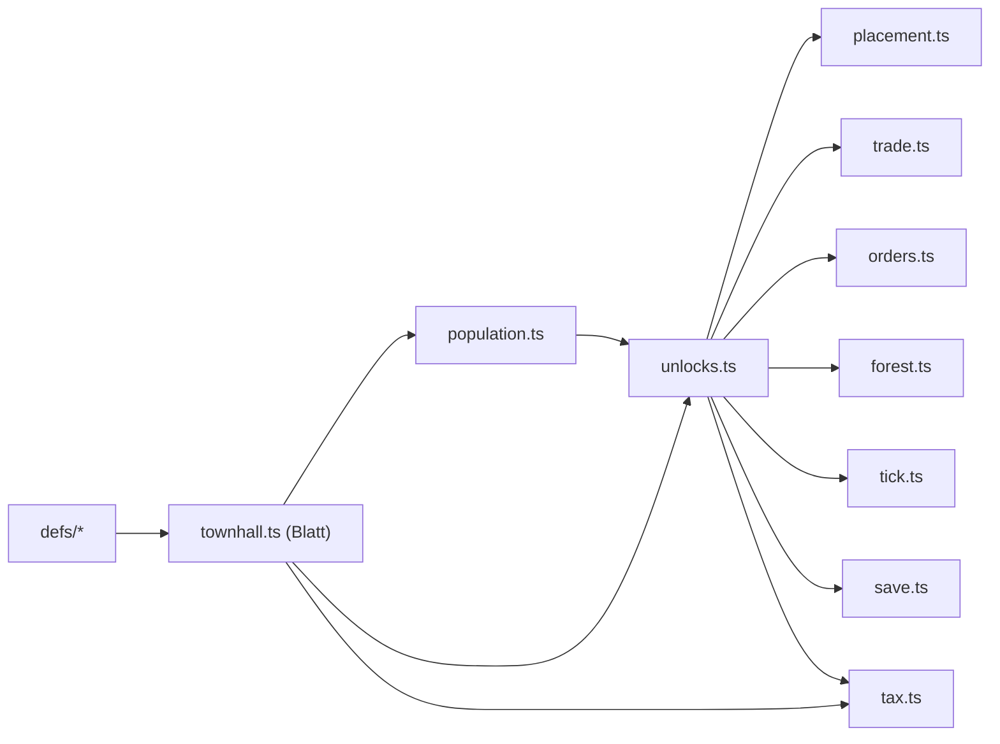
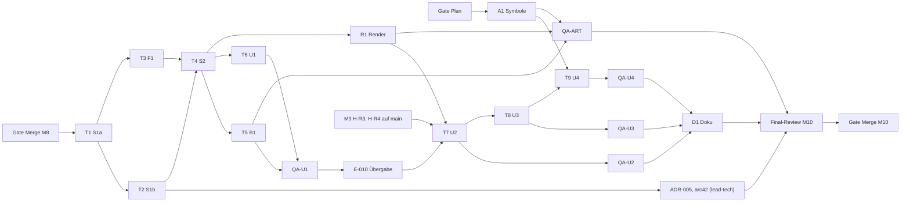

# M10 „Schritt für Schritt" — Implementation Plan

> **For agentic workers:** REQUIRED SUB-SKILL: Use superpowers:subagent-driven-development (recommended) or superpowers:executing-plans to implement this plan task-by-task. Steps use checkbox (`- [ ]`) syntax for tracking.

**Goal:** Freischaltbaum U0–U6 in der Sim (gespeichert, monoton, bitgleich zum Referenzlauf), Amtsstube mit wirksamer
Steuer und Ausgabesperre, Werkzeugmacher mit Schulbedingung, Wald roden und aufforsten, Save v5 — und in der
Bedienung nur Freigeschaltetes, Freischalt-Meldung, Hilfe-Karte, Mouse-over und ein erster Symbolsatz.

**Architecture:** Die Regel liegt in der Sim: `src/sim/unlocks.ts` (Freischaltung, rein bis auf `tickUnlocks`),
`src/sim/townhall.ts` (Blatt-Modul: Amtsstube wirkt, wirksame Steuer, wirksame Sperren), `src/sim/forest.ts`
(Forst-Aktionen). Alle Werte und Texte stehen in `src/sim/defs/` (`unlocks.ts`, `forest.ts`, `buildings.ts`). Die UI
liest nur über reine Sim-Abfragen (`buildingShown`, `goodUnlocked`, `functionLock`, `nextUnlocks`,
`effectiveTaxLevel`) und reine UI-Helfer (`unlockNoticeText`, `helpSections`, `hoverInfo`, `iconSvg`); DOM-Aufbau
bleibt daneben im selben Modul (Muster M7-UX). `tickUnlocks` ist der letzte Aufruf in `step` — daran hängt die
Bitgleichheit.

**Tech Stack:** TypeScript, Vite, Vitest (`node`), Canvas 2D, SVG-Pfade für Symbole. Keine neue Abhängigkeit
(ADR-001), auch keine Dev-Abhängigkeit.

**Status:** Gate Plan **bestanden mit Auflagen (R164)**; Auflagen QA 1–4 und Production B1, B3–B5 sind eingearbeitet
(Abschnitt „Auflagen Gate Plan (R164)"), Budget gestuft (B2). Prozessstufe voll.

**Spec:** `docs/superpowers/specs/2026-10-03-m10-schritt-fuer-schritt-spec.md` @ `0797218` (Branch
`docs/m10-design`; Gate Spec bestanden mit Auflagen R163, Delta eingearbeitet; **98 AK**; im Plan „Spec §n",
„AK-…"). Rulings: R148 (Programm), R150–R152 (M8 S11), R155 (Gate Brainstorming, H-S1 in M10), R159 (`renderer.ts`
seriell H-R2 → H-R3/H-R4 → M10-U2), R161/R162 (M8-B1-Baseline), R163 (Gate Spec, B9/B11 an den Plan).
Formvorlage: M8-Plan `docs/superpowers/plans/2026-10-02-m8-kaufleute.md`.

**Testnamen:** Jeder neue Test beginnt mit der AK-Nummer bzw. `RF-<n>` / `PLAN-B9` und steht in einem
`describe('M10 …')` (M5–M8 nutzen dieselben Kennungen). Abdeckungs-Grep der Reviews:

```bash
npx vitest run --reporter=verbose 2>&1 | grep -oE "M10[^>]*> (AK-[A-Z0-9]+-[0-9]+|RF-[0-9]|PLAN-B9)" | sed -E 's/.*> //' | sort -u
```

## Global Constraints

- **Basis:** `<BASIS>` = `main` nach dem **Gate Merge M8** (M8-UI, M8-Render, M8-Balance, M8-Scen gemergt). Der
  Controller notiert den SHA im Ledger `.superpowers/sdd/m10/ledger.md`, bevor der erste Sim-Worktree entsteht.
  Ausnahme: Paket A1 (lead-art) startet schon nach dem Gate Plan auf dem dann aktuellen `main` (nur neue Dateien).
- `src/sim/` bleibt DOM-frei und deterministisch: kein `Date`, kein `Math.random`, Zufall nur über `src/sim/rng.ts`
  (M10 braucht keinen Zufall; `forest.ts`, `unlocks.ts`, `townhall.ts` importieren `rng.ts` nicht).
- Sim-Aktionen werfen nie; sie liefern `{ ok, reason }`. `deserialize` wirft nie.
- **Spielwerte und Texte nur in `src/sim/defs/`:** `UNLOCKS` (Spec 4.2, 4.5), U1 `trigger.min` **20**, Amtsstube
  (5.1), `toolmaker.requiresService`, `CLEAR_FOREST_COST` / `PLANT_FOREST_COST` (6). Kein Schwellwert im Code; Texte
  mit Zahlen über Platzhalter (`{min}`, `{max}`, `{WIN_CITIZENS}`).
- **Unverändert gegen `<BASIS>`** (`git diff <BASIS> -- <Pfad>` leer): `tests/sim/balance.test.ts`,
  `tests/sim/controller.ts`, `tests/sim/merchantsController.ts`, `tests/sim/balance-merchants.test.ts`,
  `src/sim/defs/tiers.ts`, `src/sim/defs/goods.ts`, `src/sim/defs/timing.ts`, `package.json`, `package-lock.json`.
  `tests/sim/balance-crises.test.ts` ändert nur `normalized()` (Spec 9.2).
- **Bitgleich:** Sieg **6050**, `minMoney` **57** (Krisen aus); Krisen „normal" Sieg **7050**, `minMoney` **56**;
  `OFF_REFERENCE` und `OFF_FINGERPRINT` (`0xbfeac8c6`) unverändert; M8-B1 nach R162: `winTick` wie gemessen,
  erster Kaufmann **8550**, zweites Ziel **10 100**, Bürger-Endzustand **7300 / 1490**. Messung nach Abschnitt
  „Bitgleich-Messung".
- **Save:** `SAVE_VERSION = 5`; Kette v1 → v2 → v3 → v4 → v5; Speicherschlüssel `inselreich.save.v1` und
  `inselreich.save.auto` bleiben.
- **Importrichtung `src/sim/` (Entscheid B9, unten):** `townhall.ts` importiert nur `./types` und `./defs/*`;
  `population.ts` importiert nie `unlocks.ts`; `src/sim/` bleibt ohne Importkreis (Test `PLAN-B9`).
- Kein sichtbarer Text, kein `title`, kein `aria-label` enthält „Tick" (M7:AK-UX-13). Kosten im Format `costLine`,
  Raten „/ min".
- `src/render/` schreibt nie in die Welt; `src/audio/` ändert nur U1 (Ereignis `'unlock'`).
- Desktop-first ab 1280 px; unter 1280 px nur „stürzt nicht ab" (R78).
- **Kein Test fällt weg:** je Testdatei Zahl der `it(`/`test(` nachher ≥ vorher. Zählbefehl je Task:
  `for f in $(git diff --name-only <BASIS> -- tests); do a=$(git show <BASIS>:$f 2>/dev/null | grep -cE "^\s*(it|test)(\.\w+)?\(" ); b=$(grep -cE "^\s*(it|test)(\.\w+)?\(" $f); echo "$f $a -> $b"; done`.
  Geänderte Zeilen in bestehenden Tests nur nach Abschnitt „Bewusst geänderte Tests".
- Commits mit Präfix `feat:`, `fix:`, `test:`, `refactor:`, `docs:`; je Task mindestens ein Commit.
- **Push-Pflicht (R107, R143 B5):** nach jedem abgenommenen Commit und nach jedem grünen Integrations-Merge sofort
  `git -C .worktrees/<strang> push -u origin <branch>`. Kein Pull Request für Zwischenstände.
- **Nie rebasen** (Verfassung §6.3), auch nicht in Worktrees. Integration nur per `git merge --no-edit <geprüfter SHA>`;
  im Hauptcheckout nur `git pull --ff-only`.

## Review Focus

Eingaben und Zustände, die die Spec impliziert, aber kein AK direkt prüft (jede Zeile hat einen `RF-`Test im
genannten Task):

1. **Gespeicherte Freischaltung schlägt Live-Prädikat:** Ein v5-Stand mit `unlocked ['U0', 'U6']` und `won false`
   lädt `ok`; `buildLock(w, 'bathhouse')` ist `null`, U6 bleibt nach einem Schritt drin, U2–U5 werden **nicht**
   nachgezogen (Kette nur über Auslöser). → `RF-1` in Task 1.
2. **Brennende Amtsstube mit Sperre:** Solange `outageUntil` gesetzt ist, entnimmt ein Siedlerhaus trotz Sperre
   `(2, 'cloth')` Stoff und die Steuer wirkt „normal"; nach dem Brand wirken Sperre und Stufe wieder,
   `goodLocks` und `taxLevel` sind unverändert. → `RF-2` in Task 4.
3. **Forst-Aktion auf einer Nicht-Ursprungskachel eines 2×2-Gebäudes und mit `NaN`:** `'Bereits bebaut'` bzw.
   `'Ausserhalb der Karte'`, Welt unverändert, kein Wurf. → `RF-3` in Task 3.
4. **Zwei Freischaltungen in verschiedenen Ticks desselben Frames (4×):** genau eine Meldung mit beiden Einträgen und
   genau ein Ton `unlock`, Basis ist der Stand am Frame-Anfang. → `RF-4` in Task 6.
5. **Sperr-Matrix nach Schrumpfen einer Stufe auf 0 Einwohner:** Zeile verschwindet, Sperre bleibt gespeichert;
   kommt die Stufe zurück, ist die Zelle wieder `aria-pressed="true"`. → `RF-5` in Task 7.

## Organisation

### Tasks, Pakete, Rollen

| Task          | Paket      | Inhalt                                                                                                    | Implementierer (Modell)                                                    | Branch / Worktree                           |
| ------------- | ---------- | --------------------------------------------------------------------------------------------------------- | -------------------------------------------------------------------------- | ------------------------------------------- |
| 1             | M10-S1A    | Vorlauf Fixture v4; Freischalt-Modell: Defs, `unlocks.ts`, `tickUnlocks`, `createWorld`, Save v5          | `tech-sim-engineer` (sonnet), Roster-Text `tech-save-engineer` im Briefing | `feat/m10-sim` · `.worktrees/m10-sim`       |
| 2             | M10-S1B    | Sperren anwenden: `buildLock`, `canPlace`, `buy`, `deliverOrder`, `unlockAll` in Tests, `nextStep`-Filter | `tech-sim-engineer` (sonnet)                                               | `feat/m10-sim` · `.worktrees/m10-sim`       |
| 3             | M10-F1     | Wald roden und aufforsten (Sim), `layoutKey` mit Geländeart                                               | `tech-sim-engineer` (sonnet)                                               | `feat/m10-forest` · `.worktrees/m10-forest` |
| 4             | M10-S2     | Amtsstube, wirksame Steuer, Ausgabesperre, Werkzeugmacher `noService`, Aufstiegsstopp (K1), Taste I       | `tech-sim-engineer` (sonnet)                                               | `feat/m10-sim` · `.worktrees/m10-sim`       |
| 5             | M10-B1     | Freischalt-Messung, M8-B1-Messung, Szenarien `m10-*` mit Prüfpunkten                                      | `tech-sim-engineer` (sonnet)                                               | `feat/m10-scen` · `.worktrees/m10-scen`     |
| 6             | M10-U1     | Bauleiste, Tasten, Liste, Chips, Handel, Auftrag, Meldung, Ton, „Alles frei", Kopfzeile, Dev-Sonde        | `tech-ui-engineer` (sonnet)                                                | `feat/m10-ui` · `.worktrees/m10-ui`         |
| 7             | M10-U2     | Hilfe-Karte, `nextStep`, Forst-Bedienung, Amtsstuben-Panel, Tooltips, Gründe, K4, K5                      | `tech-ui-engineer` (sonnet)                                                | `feat/m10-ui` · `.worktrees/m10-ui`         |
| 8             | M10-U3     | Mouse-over                                                                                                | `tech-ui-engineer` (sonnet)                                                | `feat/m10-ui` · `.worktrees/m10-ui`         |
| 9             | M10-U4     | Symbole im Einbau, K2, K3                                                                                 | `tech-ui-engineer` (sonnet)                                                | `feat/m10-ui` · `.worktrees/m10-ui`         |
| A1            | M10-A1     | Symbolsatz `icons.ts` (lead-art)                                                                          | `art-rendering-engineer` (Controller `lead-art`)                           | `feat/m10-icons` · `.worktrees/m10-icons`   |
| R1            | M10-R1     | Amtsstube-Silhouette, Terrain-Teil-Neuzeichnung nach Geländewechsel, Cache-Kommentare (lead-art)          | `art-rendering-engineer` (Controller `lead-art`)                           | `feat/m10-render` · `.worktrees/m10-render` |
| QA-U1 … QA-U4 | je UI-Task | Browser-Checks mit festen Prüfpunkten                                                                     | `qa-playtester` (sonnet)                                                   | `.worktrees/m10-qa` (detached, nur lesen)   |
| QA-ART        | A1, R1     | Blindtests AK-A1-03, AK-R1-04 (lead-art)                                                                  | `qa-playtester` (sonnet, Controller `lead-art`)                            | `.worktrees/m10-qa-art` (detached)          |
| D1            | M10-D1     | README, Hauptspec-Verweise, arc42 §5/§8 (lead-tech, kein Start)                                           | —                                                                          | `feat/m10-ui`                               |

- **Review je Task:** `qa-code-reviewer` (sonnet), Urteil OK / BEDENKEN / ZURÜCK. Fix-Runden per `SendMessage` an
  denselben Implementierer (kein neuer Start).
- **Kein eigener `tech-save-engineer`-Start** (wie M6, M8): Task 1 bekommt den Roster-Text ins Briefing.
- **B1 durch `tech-sim-engineer`** (Spec 19 nennt `design-balancing-analyst`; die Persona hat keine Datei; wie M8).
- **ADR-005-Nachtrag und arc42 §6/§8 Persistenz** schreibt `lead-tech` selbst nach Task 2 (Spec 19 S1, AK-S1-05 (c),
  AK-S1-20), **D1** nach QA-U4 (P5).

### Entscheide des Plans (R163: B9, B11, Teilung S1)

**B9 — Importrichtung in `src/sim/`.** Der Kreis `unlocks` → `population` (`tierLock`) → `townhall` → `unlocks`
entsteht nur, wenn `townhall.ts` Funktionen aus `unlocks.ts` braucht. Entscheid: **`townhall.ts` ist ein Blatt**
(importiert nur `./types`, `./defs/*`). Die einzige Freischalt-Abfrage, die `townhall.ts` braucht („U5 frei", für die
Wirkung der Ausgabesperre), liest es über die Defs-Konstante `FUNCTION_ENTRY.goodLocks` direkt aus `world.unlocked`.
Die **Aktionen** `setGoodLock` und `setUpgradeStop` liegen in `tax.ts` neben `setTaxLevel` (alle drei sind
„Einstellungen der Amtsstube" und brauchen `functionLock` aus `unlocks.ts`). Damit gilt:



(Pfeil = „wird importiert von".) Grund: Ein Importkreis mit reinen Funktionen ist in ESM zwar unkritisch, er wird aber
zur Falle, sobald ein Modul auf oberster Ebene eine importierte Funktion aufruft (TDZ); ein Blatt-Modul ist einfacher
zu prüfen. Kosten: `setGoodLock`/`setUpgradeStop` liegen in `tax.ts` statt `townhall.ts` (P1). Absicherung: Test
`PLAN-B9` (Task 4) liest die Importe aller `src/sim/**/*.ts` und prüft „kein Kreis" und „`townhall.ts` nur
`types`/`defs`".

**B11 — Zwischenstand Steuer.** Entscheid: **Integrationsbranch statt Ruling.** Es gibt genau **einen** Gate Merge
M10 am Ende; vorher erreicht kein M10-Stand `main`. Integrationsbranch ist `feat/m10-ui`: Sie entsteht am geprüften
Sim-SHA nach Task 4 (S2 und F1 enthalten) und nimmt per Merge B1 (`feat/m10-scen`), R1 (`feat/m10-render`) und A1
(`feat/m10-icons`) auf. Der Zwischenstand „Steuer-Knöpfe der Kopfzeile scheitern ohne Amtsstube, `guide.ts` liest
noch `taxLevel`" existiert nur auf `feat/m10-sim` und auf `feat/m10-ui` zwischen Task 4 und Task 7; kein Spieler
sieht ihn, alle Tests bleiben grün (die betroffenen UI-Tests prüfen Texte über das gespeicherte `taxLevel`, das S2 nicht
ändert). Final-Review und Gate Merge laufen über **eine** Branch `feat/m10-ui` (enthält alle Stränge).

**Teilung S1 in S1a und S1b: ja.** S1a (Task 1) = Modell und Persistenz (Typen, Defs, `unlocks.ts`, `tickUnlocks`,
`createWorld`, Save v5) **ohne** Wirkung auf Bau und Handel; S1b (Task 2) = Sperren anwenden (`canPlace`, `buy`,
`deliverOrder`), bestehende Tests auf `unlockAll`, `nextStep`-Filter. Gründe: (1) Beide Hälften sind für sich grün
(S1a ändert kein Spielverhalten, nur neue Felder); (2) 20 AK in einem Sonnet-Task sind für Umsetzung und Review zu
breit (M8-Lehre Task 1); (3) **F1 kann nach S1a parallel zu S1b laufen** (braucht nur `functionLock`), das spart eine
Welle. Kosten: ein Paket mehr (2 Starts).

### Bestätigte Abweichungen (R164) — Prüfgrundlage des Final-Reviews

L0 hat im Gate Plan **P1–P6 und W1–W4** aus der folgenden Tabelle bestätigt. Das Final-Review prüft gegen Spec @
`0797218` **plus** diese Zeilen; was dort steht, ist kein Befund. P1 braucht kein Spec-Delta (lead-qa: das Ruling
genügt). Ebenfalls entschieden (R164): `sprites.ts` — M10 (Task 4, R1) vor M9 Welle 2.

### Auflagen Gate Plan (R164) — Fundstellen in diesem Plan

| Auflage                                                                                                         | Fundstelle                                                                          |
| --------------------------------------------------------------------------------------------------------------- | ----------------------------------------------------------------------------------- |
| QA 1: BG-3 mit `buildColony` (normal, mit und ohne `unlockAll`, je zweimal) und Laden U4–U5                     | „Bitgleich-Messung", BG-3                                                           |
| QA 2: Final-Review durch `qa-code-reviewer` mit `model: opus`, Kopfzeile `Modell: opus`                         | „Final-Review M10", Budget lead-qa                                                  |
| QA 3: Taste I im Browser                                                                                        | QA-U1 Schritt 12; Abdeckung AK-S2-16                                                |
| QA 4: Abdeckungs-Grep gegen die echte Vitest-Ausgabe                                                            | Task 1 „Review-Zusatz"                                                              |
| B1: Board — M10-U4 nach M10-QA-U2, Pakete M10-DOC und M10-MERGE, Ids H-R3/H-R4/M8-MERGE                         | „Board-Paketliste"                                                                  |
| B2: Budget gestuft (Stufe 1 nach Gate Merge M8: T1–T4 lead-tech 11, A1 lead-art 3); > 80 % → Parallelität 2     | „Budgetantrag"                                                                      |
| B3: fremde Testdateien aus dem Lauf melden; Konflikte im W5-Merge löst Controller 2; R1 ohne `beobachtungen.md` | „Bewusst geänderte Tests", „Wellen" (W5), Paket R1, Ownership R1                    |
| B4: `noService` und H-R3 `statusMarks.ts`: Standardfall in H-R3; Nachtrag durch Controller 2 als Ausnahme       | „Abhängigkeiten ausserhalb M10", Task 7 Vorher-Schritt                              |
| B5: H-R4 in `errands.ts`, R1 ohne Kommentar in `life.ts`                                                        | „Abhängigkeiten ausserhalb M10", Paket R1; Kommentar `life.ts` in Task 8 (AK-R1-05) |

### Plan-Abweichungen und gemeldete Widersprüche (R137; P1–P6, W1–W4 bestätigt durch R164)

| Nr. | Spec sagt                                                                                 | Plan macht                                                                                                                                                                                                                                                                                                                   | Grund / Empfehlung                                                                                                                                                                                                                  |
| --- | ----------------------------------------------------------------------------------------- | ---------------------------------------------------------------------------------------------------------------------------------------------------------------------------------------------------------------------------------------------------------------------------------------------------------------------------- | ----------------------------------------------------------------------------------------------------------------------------------------------------------------------------------------------------------------------------------- |
| P1  | 5.1, 16: `setGoodLock`, `setUpgradeStop` in `townhall.ts`                                 | in `tax.ts`; `townhall.ts` bleibt Blatt                                                                                                                                                                                                                                                                                      | B9 (oben); Spec-Delta eine Zeile in 5.1 und 16. Empfehlung: annehmen                                                                                                                                                                |
| P2  | 19: S1 ein Paket                                                                          | S1a (Task 1) + S1b (Task 2)                                                                                                                                                                                                                                                                                                  | oben; F1 ∥ S1b                                                                                                                                                                                                                      |
| P3  | 19: A1 parallel zu S1                                                                     | A1 startet schon nach dem Gate Plan (vor dem Gate Merge M8)                                                                                                                                                                                                                                                                  | nur neue Dateien `src/ui/icons.ts`, `tests/ui/icons.test.ts`; Parallelität (R67)                                                                                                                                                    |
| P4  | 19: U1 ohne `inspect.ts`; AK-U1-13 verlangt `rest-tax` in der Ruhe-Ansicht (`inspect.ts`) | U1 bekommt `inspect.ts` (nur `restView`/`rest-tax`); U4 bekommt zusätzlich `startCard.ts`, `messages.ts`, `goal.ts` (Symbole in Meldung und Hilfe, AK-U4-03); U3 bekommt `src/render/renderer.ts` (nur Export `wildlifeEnvOf`, AK-U3-06); U1 bekommt `src/ui/messages.ts` (Knopf „Hilfe" im Toast) und `src/ui/devProbes.ts` | UI-Strang ist seriell, keine Überschneidung; ohne diese Dateien sind die AK nicht erfüllbar                                                                                                                                         |
| P5  | 19: D1 durch `lead-design` · Doku                                                         | `lead-tech` schreibt D1 selbst (kein Start), wie M8 P6                                                                                                                                                                                                                                                                       | arc42 gehört lead-tech; spart einen Start. Alternative: lead-design 1 Start                                                                                                                                                         |
| P6  | 18: „Welt-Werte per Dev-Werkzeug"; es gibt kein Dev-Werkzeug für Welt und Kachel-Position | U1 baut die DEV-Sonde `window.__inselDev` (`world()`, `tileCenter(x, y)`), nur unter `import.meta.env.DEV`                                                                                                                                                                                                                   | Browser-AK mit festen Koordinaten brauchen sie (AK-U2-06, -08, AK-R1-03)                                                                                                                                                            |
| W1  | AK-S1-20, 8.2: `save-v4.json` „liegt vor S1 auf `main`"                                   | Fixture ist der **erste Commit** auf `feat/m10-sim`, erzeugt auf `<BASIS>` vor jeder Code-Änderung; erreicht `main` mit dem Gate Merge M10                                                                                                                                                                                   | Nur `production-integrator` merged nach `main`, und nur nach einem Gate. Nachweis: `git log` (erster Commit) + `git diff 9460ab9 <BASIS> -- src/sim` leer. Empfehlung: so annehmen; Alternative Vorab-Merge kostet ein eigenes Gate |
| W2  | AK-S1-14 (c): „danach 100 Schritte: Zustand `noService`" (S1)                             | Teil (c1) Freischaltliste in Task 1; Teil (c2) `noService` nach 100 Schritten in Task 4 (Test heisst ebenfalls `AK-S1-14 (c2) …`)                                                                                                                                                                                            | `noService` entsteht erst in S2. Keine Spec-Änderung nötig                                                                                                                                                                          |
| W4  | AK-F1-09 (F1): Variante „Speichern mit gesetzten `goodLocks` (aktive Amtsstube, U5)"      | Teil (a) Determinismus ohne Speichern in Task 3; Teil (b) mit Speichern und `goodLocks` in Task 4 (Test `AK-F1-09 (b) …`)                                                                                                                                                                                                    | Amtsstube und `setGoodLock` entstehen erst in S2; F1 läuft vor S2. Keine Spec-Änderung nötig                                                                                                                                        |
| W3  | 4.5: U6-`lockText` = `tierLock(w, 4)`; 4.4 `buildLock` aus `unlocked`                     | Präzisierung: gesperrt, solange U6 nicht in `unlocked`; Grund = `tierLock(w, 4) ?? 'Erst nach dem Ziel'` (Defs-Text). Zwischen `won` und dem `tickUnlocks` desselben Schritts kann `tierLock` schon `null` sein                                                                                                              | sonst wäre `buildLock` dort `null` trotz gesperrtem Eintrag. Betrifft nur von Hand gesetztes `won` in Tests (siehe „Bewusst geänderte Tests")                                                                                       |

### Gemeinsame Schnittstellen (verbindlich für alle Tasks)

Jeder Implementierer sieht nur seinen Task; diese Namen und Typen gelten überall.

```ts
// src/sim/types.ts (Task 1; 'noService', requiresService, maxCount, 'townhall': Task 4)
export type UnlockId = 'U0' | 'U1' | 'U2' | 'U3' | 'U4' | 'U5' | 'U6';
export type UnlockFunction = 'forest' | 'orders' | 'goodLocks';
export type UnlockTrigger =
  | { kind: 'start' }
  | { kind: 'houses'; min: number }
  | { kind: 'tierWish'; tier: Tier }
  | { kind: 'tierReached'; tier: Tier }
  | { kind: 'tierOpen'; tier: Tier };
export interface UnlockDef {
  id: UnlockId;
  trigger: UnlockTrigger;
  buildings: readonly BuildingDefId[];
  goods: readonly GoodId[];
  functions: readonly UnlockFunction[];
  lockText: string; // Platzhalter {min}, {max}; '' nur bei U0
  whenText: string; // Platzhalter {min}, {max}, {WIN_CITIZENS}; '' nur bei U0
  notice: string; // '' nur bei U0
  tip: string;
}
export interface GoodLock {
  tier: Tier;
  good: GoodId;
}
export interface World {
  version: 5;
  /* alle bestehenden Felder unverändert, danach: */
  unlocked: UnlockId[]; // UNLOCK_IDS-Reihenfolge, monoton
  goodLocks: GoodLock[]; // sortiert nach tier, dann GOOD_IDS-Index, ohne Doppelte
  upgradeStops: Tier[]; // aufsteigend, nur Stufen mit upgradeCost !== null
}
// BuildingDef: `unlockTier` entfällt (Task 2); neu (Task 4): requiresService?: ServiceId; maxCount?: { n: number; reason: string }
// BuildingState (Task 4): + 'noService'; BuildingDefId (Task 4): + 'townhall' (am Ende)

// src/sim/defs/unlocks.ts (Task 1; U3.buildings ['townhall'] in Task 4)
export const UNLOCK_IDS: readonly UnlockId[]; // ['U0', …, 'U6']
export const UNLOCKS: readonly UnlockDef[]; // Spec 4.2 / 4.5, Reihenfolge = UNLOCK_IDS
export const UNLOCK_CHAIN: readonly UnlockId[]; // ['U2', 'U3', 'U4', 'U5', 'U6']
export const ONLY_WITH_CRISES: Readonly<Partial<Record<BuildingDefId, true>>>; // { firestation: true }
export const FUNCTION_LABELS: Readonly<Record<UnlockFunction, readonly string[]>>;
//   { forest: ['Roden', 'Aufforsten'], orders: ['Handelsaufträge'], goodLocks: ['Ausgabesperre'] }
export const FUNCTION_ENTRY: Readonly<Record<UnlockFunction, UnlockId>>; // aus UNLOCKS abgeleitet: forest U2, orders U3, goodLocks U5

// src/sim/unlocks.ts (Task 1; taxBlocks echt ab Task 4)
export function isUnlocked(w: World, id: UnlockId): boolean;
export function unlockText(def: UnlockDef, field: 'lockText' | 'whenText'): string; // Platzhalter gefüllt
export function entryOfBuilding(defId: BuildingDefId): UnlockDef | null; // null: kontor
export function lockReason(w: World, def: UnlockDef): string; // tierOpen: tierLock(w, t) ?? unlockText(def,'lockText') (W3)
export function buildLock(w: World, defId: BuildingDefId): string | null;
export function goodLock(w: World, g: GoodId): string | null; // Sperrgrund für buy
export function goodUnlocked(w: World, g: GoodId): boolean; // goodLock(w, g) === null
export function functionLock(w: World, f: UnlockFunction): string | null;
export function buildingShown(w: World, defId: BuildingDefId): boolean;
export function triggeredUnlocks(w: World): UnlockId[]; // + Kettenvorgänger + U0, UNLOCK_IDS-Reihenfolge
export function deriveUnlocks(w: World): UnlockId[]; // triggered ∪ Einträge mit stehendem Gebäude (ohne Kette)
export function tickUnlocks(w: World): void; // letzter Aufruf in step
export interface NextUnlock {
  id: UnlockId;
  names: string[]; // Gebäude (nur angezeigte) in BUILDING_IDS-Reihenfolge, dann FUNCTION_LABELS
  when: string; // unlockText(def, 'whenText')
  now: number | null;
  need: number | null;
  taxBlocks: boolean; // Task 1: immer false; Task 4: effectiveTaxLevel === 'high' && tierWish|tierReached
}
export function nextUnlocks(w: World): NextUnlock[];
// src/sim/placement.ts (Task 2): export { buildLock } from './unlocks'; canPlace prüft buildLock zuerst, dann maxCount (Task 4)

// src/sim/world.ts (Task 1)
export function createWorld(
  seed: number,
  opts?: { crisisLevel?: CrisisLevel; unlockAll?: boolean },
): World;

// src/sim/save.ts (Task 1)
export const SAVE_VERSION = 5;
export function migrateV4ToV5(raw: Record<string, unknown>): void; // Platzhalter ['U0'], [], [], version 5

// src/sim/townhall.ts (Task 4, Blatt)
export function townhallActive(w: World): boolean;
export function townhallReason(w: World): 'Braucht eine Amtsstube' | 'Amtsstube wirkt nicht';
export function effectiveTaxLevel(w: World): TaxLevel;
export function goodLockActive(w: World, tier: Tier, good: GoodId): boolean; // U5 frei && aktiv && Eintrag
export function upgradeStopActive(w: World, tier: Tier): boolean; // aktiv && Eintrag

// src/sim/tax.ts (Task 4)
export function setTaxLevel(w: World, level: string): Result; // Reihenfolge Spec 5.2
export function setGoodLock(w: World, tier: number, good: string, locked: boolean): Result; // Spec 5.3
export function setUpgradeStop(w: World, tier: number, stopped: boolean): Result; // Spec 5.4

// src/sim/defs/forest.ts, src/sim/forest.ts (Task 3)
export const CLEAR_FOREST_COST: Cost; // { money: 10, wood: 0, tools: 0, stone: 0 }
export const PLANT_FOREST_COST: Cost; // { money: 20, wood: 0, tools: 0, stone: 0 }
export function canClearForest(w: World, x: number, y: number): Result;
export function canPlantForest(w: World, x: number, y: number): Result;
export function clearForest(w: World, x: number, y: number): Result;
export function plantForest(w: World, x: number, y: number): Result;

// src/render/renderer.ts (Task 7): Tool + { kind: 'clearForest' } | { kind: 'plantForest' }
// src/render/renderer.ts (Task 8): export function wildlifeEnvOf(world: World, fx: RenderFx): WildlifeEnv;

// src/ui/goal.ts (Task 6)
export const UNLOCK_NOTICE: string; // M8-Text, unverändert (Meldung, wenn nur U6 neu ist)
export function unlockNoticeText(prev: readonly UnlockId[], world: World): string | null;
export function lockedToolText(world: World, tool: Tool): string | null; // ersetzt (world, defId)
// entfallen: initialUnlockShown, unlockNotice; app.ts: state.unlockShown → state.unlockedSeen: UnlockId[]

// src/ui/hotkeys.ts (I: Task 4; Signatur hotkeyList(world): Task 6; C, Q, '?': Task 7)
export function hotkeyList(world: World): { key: string; label: string }[];
export function toolShown(world: World, tool: Tool): boolean;
// HotkeyAction (Task 7): + { kind: 'help' }

// src/ui/buildMenu.ts (Task 6): buildEntries(world, category) über buildingShown; visibleCategories(world): Category[]
// src/ui/hud.ts (Task 6): stockChipHidden(world, g), popChipHidden(world, tier) verallgemeinert (Spec 11.3, 11.4)
// src/ui/trade.ts (Task 6): tradeRows(world): { good: GoodId; canBuy: boolean }[]
// src/ui/order.ts (Task 6): orderVisible(world): boolean; orderMessageFor(prevOrder: Order | null, prevVisible: boolean, cur: World): string | null
// src/ui/settings.ts (Task 6): Settings.unlockMode: 'stepwise' | 'all'
// src/ui/soundEvents.ts (Task 6): SoundSnapshot.unlocked: number; SoundEvent 'unlock' (src/audio/sound.ts)
// src/ui/devProbes.ts (Task 6): exposeDevProbe(p: { world(): World; tileCenter(x: number, y: number): { x: number; y: number }; centerOn(x: number, y: number): void }): void
//   nur unter import.meta.env.DEV → window.__inselDev (nur lesen bzw. Kamera; schreibt nie in die Welt)
// src/ui/startCard.ts (Task 7): helpSections(world): { field: HelpField; title: string; lines: string[] }[]
// src/ui/guide.ts (Task 7): mapSigns(world): readonly MapSign[] (K4)
// src/ui/inspect.ts (Task 7): lockMatrix(world): { tier: Tier; goods: { good: GoodId; locked: boolean }[] }[]
// src/ui/hover.ts (Task 8): hoverInfo(world, tile, timeMs, extra: { ship: boolean; animal: string | null }): { title: string; lines: string[] } | null
//                           hoverVisible(s: HoverState): boolean
// src/ui/icons.ts (A1): ICON_IDS (24), ICONS: Record<IconId, { label: string; paths: string[]; color: PaletteKey }>, iconSvg(id): string
```

### Datei-Ownership

Jede Datei hat in einer Welle genau einen Owner-Task. Tasks auf derselben Branch laufen nacheinander.

| Task | Branch            | Dateien                                                                                                                                                                                                                                                                                                                                                                                                                                                                                                                                                                                                                                                                                           |
| ---- | ----------------- | ------------------------------------------------------------------------------------------------------------------------------------------------------------------------------------------------------------------------------------------------------------------------------------------------------------------------------------------------------------------------------------------------------------------------------------------------------------------------------------------------------------------------------------------------------------------------------------------------------------------------------------------------------------------------------------------------- |
| 1    | `feat/m10-sim`    | `src/sim/{types,world,tick,save}.ts`, `src/sim/unlocks.ts` (neu), `src/sim/defs/unlocks.ts` (neu), `tests/sim/unlocks.test.ts` (neu), `tests/sim/{save,defs,balance-crises,tick}.test.ts`, `tests/sim/helpers.ts` (nur `village`, `setHouse`), `tests/sim/fixtures/save-v4.json` (neu), Tests, die `createWorld` vollständig vergleichen (per Lauf)                                                                                                                                                                                                                                                                                                                                               |
| 2    | `feat/m10-sim`    | `src/sim/{placement,build,trade,orders,types}.ts`, `src/sim/defs/buildings.ts` (nur `unlockTier` entfernen), `tests/sim/{placement,trade,orders,helpers,scenarios}.ts`/`.test.ts`, alle Sim-, Render- und UI-Tests mit gesperrten Bauten (nur `unlockAll` bzw. `finishUnlocks`, Liste per Lauf), `src/ui/guide.ts` + `tests/ui/guide.test.ts` (nur Filter 12.3), `src/ui/goal.ts` + `tests/ui/goal.test.ts` (nur Typ, falls `unlockTier` gelesen wird)                                                                                                                                                                                                                                            |
| 2+   | `feat/m10-sim`    | `docs/adr/ADR-005-tick-reihenfolge-und-zustaende.md` (Nachtrag), `docs/arc42.md` (§6 `step`, §8 Persistenz) — **lead-tech**, nach Review OK von Task 2                                                                                                                                                                                                                                                                                                                                                                                                                                                                                                                                            |
| 3    | `feat/m10-forest` | `src/sim/forest.ts` (neu), `src/sim/defs/forest.ts` (neu), `src/sim/queries.ts` (nur `layoutKey`), `tests/sim/forest.test.ts` (neu), `tests/sim/queries.test.ts`                                                                                                                                                                                                                                                                                                                                                                                                                                                                                                                                  |
| 4    | `feat/m10-sim`    | `src/sim/townhall.ts` (neu), `src/sim/{types,tax,population,production,placement,unlocks}.ts`, `src/sim/defs/{buildings,unlocks}.ts`, `tests/sim/townhall.test.ts` (neu), `tests/sim/imports.test.ts` (neu), `tests/sim/{taxes,population,production,defs,fire,toolmaker,save}.test.ts`, `tests/sim/scenarios.ts` (`galerie` + Amtsstube); Ausnahmen `src/render/sprites.ts` + `tests/render/sprites.test.ts` (Rückfall), `src/ui/hotkeys.ts` + `tests/ui/hotkeys.test.ts` (nur I), `src/ui/texts.ts` + `tests/ui/inspect.test.ts` (nur `noService`), `src/ui/hints.ts` + `tests/ui/hints.test.ts` (Gründe 11.9), `src/render/overlays.ts` (nur falls ein Zustands-`switch` `noService` verlangt) |
| 5    | `feat/m10-scen`   | `tests/sim/unlock-timeline.test.ts` (neu), `tests/sim/scenarios.ts`, `tests/sim/scenario-saves.test.ts`                                                                                                                                                                                                                                                                                                                                                                                                                                                                                                                                                                                           |
| 6    | `feat/m10-ui`     | `src/ui/{buildMenu,hud,hotkeys,menu,trade,order,app,goal,settings,soundEvents,inspect (nur restView),messages,devProbes}.ts`, `src/audio/sound.ts` (+ Zuordnung `'unlock'`), Tests dazu unter `tests/ui/`, `tests/audio/`                                                                                                                                                                                                                                                                                                                                                                                                                                                                         |
| 7    | `feat/m10-ui`     | `src/ui/{startCard,guide,inspect,hints,texts,input,hotkeys,buildMenu,menu,app,crisisLog,eventLogView}.ts`, `src/render/renderer.ts` (nur `Tool` und Forst-Vorschau), Tests dazu; Controller 2 beim W5-Merge: `src/render/statusMarks.ts` (nur Fall `noService`, falls `tsc` ihn verlangt, R164 B4)                                                                                                                                                                                                                                                                                                                                                                                                |
| 8    | `feat/m10-ui`     | `src/ui/hover.ts` (neu), `src/ui/{input,app}.ts`, `src/style.css`, `src/render/renderer.ts` (nur `wildlifeEnvOf`), `src/render/life.ts` (nur Kommentar, R164 B5), `tests/ui/hover.test.ts` (neu), `tests/render/renderer.test.ts` (nur neues `it`)                                                                                                                                                                                                                                                                                                                                                                                                                                                |
| 9    | `feat/m10-ui`     | `src/ui/{hud,buildMenu,inspect,startCard,goal,messages,app}.ts`, `src/style.css`, Tests dazu                                                                                                                                                                                                                                                                                                                                                                                                                                                                                                                                                                                                      |
| A1   | `feat/m10-icons`  | `src/ui/icons.ts` (neu), `tests/ui/icons.test.ts` (neu)                                                                                                                                                                                                                                                                                                                                                                                                                                                                                                                                                                                                                                           |
| R1   | `feat/m10-render` | `src/render/{sprites,terrain}.ts`, `src/render/iso.ts` (nur falls AK-R1-02 nicht schon über `layoutKey` grün ist), `src/render/{wildlife,water}.ts` (nur Kommentare; nicht `life.ts`, R164 B5), `tests/render/{sprites,terrain,iso,wildlife}.test.ts`, `docs/arc42.md` (§10, eine Zeile); nicht `docs/beobachtungen.md` (R164 B3)                                                                                                                                                                                                                                                                                                                                                                 |
| D1   | `feat/m10-ui`     | `README.md`, `docs/arc42.md` (§5, §8 ausser Persistenz), `docs/superpowers/specs/2026-09-29-inselreich-design.md` (nur Verweise)                                                                                                                                                                                                                                                                                                                                                                                                                                                                                                                                                                  |

**Disjunkt je Welle:** W2 Task 2 (`feat/m10-sim`) ∥ Task 3 (`feat/m10-forest`: `forest.ts`, `defs/forest.ts`,
`queries.ts`, zwei Testdateien — keine davon in Task 2). W4 Task 5 (`tests/sim/{unlock-timeline,scenarios,
scenario-saves}`) ∥ Task 6 (`src/ui`, `src/audio`, `tests/ui`, `tests/audio`) ∥ R1 (`src/render`, `tests/render`,
arc42 §10). A1 (`src/ui/icons.ts`, `tests/ui/icons.test.ts`) überschneidet sich mit keinem Task. `docs/arc42.md`
ändern drei Stränge in verschiedenen Abschnitten (§6/§8 Persistenz: lead-tech auf `feat/m10-sim`; §10: R1; §5/§8 Rest:
D1) — die Merges sind zeitlich getrennt (W3, W5, W8).

### Abhängigkeiten ausserhalb M10

| Abhängigkeit                                                             | Wirkung im Plan                                                                                                                                                                                                                                                                                                                                                                                                                                                                                                 |
| ------------------------------------------------------------------------ | --------------------------------------------------------------------------------------------------------------------------------------------------------------------------------------------------------------------------------------------------------------------------------------------------------------------------------------------------------------------------------------------------------------------------------------------------------------------------------------------------------------- |
| **Gate Merge M8** (M8-UI @ `feat/m8-ui`, M8-Render, M8-Balance, M8-Scen) | blockiert Task 1 und damit alles ausser A1. M10 setzt auf `goal.ts` (`UNLOCK_NOTICE`, `lockedToolText`), Tasten J/O, `buildEntries`, `stockChipHidden`/`popChipHidden`, `withUnlock`, `balance-merchants.test.ts` auf. Vor Task 1 prüft der Controller die Spec-Schnittstellen (Spec 17) gegen den gemergten Stand (`grep -n "unlockNotice\|initialUnlockShown\|lockedToolText\|withUnlock\|unlockShown" src tests`); weicht etwas ab, Meldung an L0 (Spec 17: Delta durch lead-design), kein stilles Anpassen. |
| **M9 H-R3, H-R4** (`renderer.ts`, R159)                                  | blockiert **Task 7** (U2 ändert `renderer.ts`). Vor Task 7: H-R3 und H-R4 auf `main`, dann `git -C .worktrees/m10-ui merge --no-edit main`, `make check`, push. Task 8 (`wildlifeEnvOf`) läuft danach ohnehin seriell. **Rückfall, falls H-R3/H-R4 nach Task 6 noch offen sind:** Controller meldet an L0; Option (a) warten (Empfehlung, solange ≤ 1 Session), Option (b) L0-Ruling „M10-U2 vor H-R3/H-R4", dann merged der spätere M9-Strang vorher `main` (R159 sinngemäss).                                 |
| **M9 Welle 2 (G1/G8, `sprites.ts`)**                                     | Task 4 (Rückfall `townhall`) und R1 (Silhouette) ändern `src/render/sprites.ts`. Spec 19: nicht parallel zu M9 Welle 2. **Entschieden (R164):** M10 zuerst; M9 Welle 2 schreibt ihre Kurz-Spec parallel, der Code folgt nach dem Gate Merge M10.                                                                                                                                                                                                                                                                |
| **M9 H-R4 (`life.ts`)**                                                  | R164 B5: H-R4 legt seinen Code in die neue Datei `src/render/errands.ts`; R1 ändert `life.ts` nicht (den Kommentar für AK-R1-05 setzt Task 8 nach H-R4). Damit laufen R1 und H-R4 parallel. Spätestens vor dem Final-Review merged `feat/m10-render` den aktuellen `main`.                                                                                                                                                                                                                                      |
| **M9 H-R3 (`statusMarks.ts`)**                                           | R164 B4: Task 4 führt `BuildingState` `'noService'` ein. Das Briefing von H-R3 (lead-art) verlangt einen Standardfall für unbekannte Zustände; fehlt er, ergänzt Controller 2 beim W5-Merge `noService` in `statusMarks.ts` als Ausnahme (Task 7, „Vorher").                                                                                                                                                                                                                                                    |

### Wellen, Abhängigkeiten und Merges

Ein abhängiger Task startet erst nach Review-Urteil OK des Vorgängers. Integration nur geprüfter SHAs, danach sofort
push, SHA ins Ledger.

| Welle | `feat/m10-sim`                                       | weitere Branches                                                                                                            | grün am Wellenende                   |
| ----- | ---------------------------------------------------- | --------------------------------------------------------------------------------------------------------------------------- | ------------------------------------ |
| W0    | —                                                    | A1 (`feat/m10-icons`, lead-art), ab Gate Plan                                                                               | `feat/m10-icons`: `make check`       |
| —     | **Gate Merge M8** (L0), `<BASIS>` festhalten         |                                                                                                                             |                                      |
| W1    | Task 1 (S1a)                                         | —                                                                                                                           | `make check`; BG-1                   |
| W2    | Task 2 (S1b); danach lead-tech: ADR-005, arc42 §6/§8 | Task 3 (F1) auf `feat/m10-forest` ab Task-1-SHA                                                                             | beide: `make check`; BG-1            |
| W3    | merge `feat/m10-forest` @ Task-3-SHA; Task 4 (S2)    | —                                                                                                                           | `make check`; BG-1; `PLAN-B9`        |
| W4    | —                                                    | `feat/m10-scen` und `feat/m10-ui` ab Task-4-SHA: Task 5 (B1) ∥ Task 6 (U1); R1 (`feat/m10-render` ab Task-4-SHA, lead-art)  | je Branch `make check`; Task 5: BG-2 |
| W4b   | —                                                    | `feat/m10-ui` merged `feat/m10-scen` @ Task-5-SHA; **QA-U1**; **E-010-Übergabe**                                            | `feat/m10-ui`: `make check`          |
| W5    | —                                                    | `feat/m10-ui` merged `main` (H-R3, H-R4) und `feat/m10-render` @ R1-SHA (Konflikte löst Controller 2, R164 B3); Task 7 (U2) | `make check`                         |
| W6    | —                                                    | QA-U2 (detached am Task-7-SHA) ∥ Task 8 (U3)                                                                                | `make check`                         |
| W7    | —                                                    | QA-U3 ∥ merge `feat/m10-icons` @ A1-SHA, Task 9 (U4); QA-ART (lead-art, nach A1, R1, Task 5)                                | `make check`                         |
| W8    | —                                                    | QA-U4; D1; merge `main`; BG-3; **Final-Review M10** (lead-qa, opus); **Gate Merge M10**                                     | `make check`                         |



**Einrichten** (Controller; `m10-icons`, `m10-render`, `m10-qa-art` legt `lead-art` an):

```bash
cd /Users/KN/CAS/projekte/anno-clone
git pull --ff-only
git rev-parse --short main                         # = <BASIS>, ins Ledger
git diff --stat 9460ab9 main -- src/sim            # leer erwartet (W1-Nachweis); sonst melden
git worktree add .worktrees/m10-sim -b feat/m10-sim main
ln -s ../../node_modules .worktrees/m10-sim/node_modules
# nach Review OK von Task 1:
git worktree add .worktrees/m10-forest -b feat/m10-forest <T1-SHA>
ln -s ../../node_modules .worktrees/m10-forest/node_modules
# nach Review OK von Task 4:
git worktree add .worktrees/m10-scen -b feat/m10-scen <T4-SHA>
git worktree add .worktrees/m10-ui -b feat/m10-ui <T4-SHA>
for w in m10-scen m10-ui; do ln -s ../../node_modules .worktrees/$w/node_modules; done
# je QA-Check (nur lesen, am geprüften SHA):
git worktree add --detach .worktrees/m10-qa <SHA>
ln -s ../../node_modules .worktrees/m10-qa/node_modules
# nach dem Check: rm .worktrees/m10-qa/node_modules && git worktree remove .worktrees/m10-qa
# lead-art (nicht der Controller):
#   git worktree add .worktrees/m10-icons -b feat/m10-icons main          (W0, nach Gate Plan)
#   git worktree add .worktrees/m10-render -b feat/m10-render <T4-SHA>     (W4)
```

**Board-Paketliste (`blocked-by` für `lead-production`):**

| Paket      | Titel                                              | Owner           | blocked-by                         |
| ---------- | -------------------------------------------------- | --------------- | ---------------------------------- |
| M10-A1     | Symbolsatz Schritt 1                               | lead-art        | M10-PLAN (Gate Plan)               |
| M10-S1A    | Freischalt-Modell, Save v5                         | lead-tech       | M10-PLAN, M8-MERGE (Gate Merge M8) |
| M10-S1B    | Sperren in Bau, Handel, Aufträgen                  | lead-tech       | M10-S1A                            |
| M10-F1     | Wald roden und aufforsten (Sim)                    | lead-tech       | M10-S1A                            |
| M10-S2     | Amtsstube, Steuer, Ausgabesperre, Werkzeugmacher   | lead-tech       | M10-S1B, M10-F1                    |
| M10-B1     | Freischalt-Messung und Szenarien                   | lead-tech       | M10-S2                             |
| M10-R1     | Amtsstube-Silhouette, Terrain nach Geländewechsel  | lead-art        | M10-S2                             |
| M10-U1     | Bedienung zeigt nur Freigeschaltetes, Meldung, Ton | lead-tech       | M10-S2                             |
| M10-QA-U1  | Browser-Check U1                                   | lead-tech       | M10-U1, M10-B1                     |
| M10-U2     | Hilfe, Forst-Bedienung, Amtsstuben-Panel           | lead-tech       | M10-QA-U1, M10-R1, H-R3, H-R4      |
| M10-QA-U2  | Browser-Check U2 (inkl. AK-R1-03)                  | lead-tech       | M10-U2                             |
| M10-U3     | Mouse-over                                         | lead-tech       | M10-U2                             |
| M10-QA-U3  | Browser-Check U3                                   | lead-tech       | M10-U3                             |
| M10-U4     | Symbole im Einbau, K2, K3                          | lead-tech       | M10-U3, M10-A1, M10-QA-U2          |
| M10-QA-U4  | Browser-Check U4                                   | lead-tech       | M10-U4                             |
| M10-QA-ART | Blindtests Symbole und Amtsstube                   | lead-art        | M10-A1, M10-R1, M10-B1             |
| M10-DOC    | ADR-005-Nachtrag, arc42 §6 und §8 Persistenz       | lead-tech       | M10-S1B                            |
| M10-D1     | README, arc42, Hauptspec-Verweise                  | lead-tech       | M10-QA-U2, M10-QA-U3, M10-QA-U4    |
| M10-FR     | Final-Review M10                                   | lead-qa         | M10-D1, M10-DOC, M10-QA-ART        |
| M10-MERGE  | Gate Merge M10 (L0, `production-integrator`)       | lead-production | M10-FR                             |

**Fremde Pakete (R164 B1):** `M8-MERGE` (Gate Merge M8), `H-R3`, `H-R4` (M9 Welle 1b, lead-art) legt
`lead-production` auf dem Board an, falls sie dort noch fehlen; `M10-U2` ist von `H-R3` **und** `H-R4` blockiert
(R159). Das Planpaket heisst `M10-PLAN`.

### Ablauf je Task (Controller `lead-tech`)

1. `python3 tools/studio/log.py package --id M10-<Paket> --title "<Titel>" --owner lead-tech --status active --milestone M10 [--blocked-by …]`
2. Implementierer im Vordergrund starten (parallele Tasks einer Welle in **einer** Nachricht), Briefing nach
   `docs/studio/templates/briefing.md`: Kopfzeilen, feste Regeln wörtlich, Logging-Block, Worktree-Pfad, Task-Text
   aus diesem Plan wörtlich, Abschnitte „Global Constraints", „Gemeinsame Schnittstellen" und „Bewusst geänderte
   Tests", Spec-Pfad, „Budget: keins, keine Agenten starten".
3. Implementierer: Test schreiben → **rot** (exakter Befehl, erwartete Meldung; Rot-Log mit den Zeilen
   `FAIL`/`AssertionError`/`is not a function` im Bericht) → minimal umsetzen → grün → Wellen-Prüfung → Commit.
4. `qa-code-reviewer` gegen Task-Text, Spec-Abschnitt, Schnittstellen und Global Constraints. Er prüft im Rot-Log,
   dass jeder neue Test vor der Umsetzung rot war (ausgenommen nur die Liste „Vor der Umsetzung grün erlaubt" im
   Task), führt den Abdeckungs-Grep aus und den Testzählbefehl. **Widerspruch AK ↔ Spec (R136/R137):** vorläufig die
   einfachere Variante, im Bericht melden; Controller trägt ihn ins Ledger und in den Schlussbericht.
5. **Fix-Nachprüfung (R136):** kleine Fixes (≤ ~20 Zeilen) prüft der Controller am Diff, sonst derselbe Reviewer per
   `SendMessage`. Jede Nachprüfung beantwortet: Gegenweg geprüft? Fundstellen geänderter oder entfernter Symbole per
   `grep -rn <symbol> src tests README.md docs/` nachgeführt?
6. `log.py result … --outcome <angenommen|nacharbeit|verworfen> --review-rounds <n>`; Paket `done`; SHA, Rot-Log-Befund,
   Bitgleich-Werte und Befunde ausserhalb Scope ins Ledger; push.
7. **UI-Task:** zusätzlich QA-U<n> (Abschnitt „QA-Checks") am geprüften SHA in `.worktrees/m10-qa`. Blockende
   Befunde gehen per `SendMessage` an den Implementierer des Tasks, sobald im Baum kein anderer Implementierer arbeitet
   (nie zwei Implementierer gleichzeitig im selben Baum); der nächste UI-Task nach dem übernächsten startet erst, wenn
   die Befunde behoben sind (QA-U1 vor Task 8, QA-U2 vor Task 9, QA-U3 vor D1).

### Bitgleich-Messung (BG)

**BG-1** (am Ende von Tasks 1, 2, 3, 4; der Implementierer führt sie aus und kopiert die Ausgabe in den Bericht):

```bash
git diff <BASIS> -- tests/sim/balance.test.ts tests/sim/controller.ts src/sim/defs/tiers.ts src/sim/defs/goods.ts \
  src/sim/defs/timing.ts package.json package-lock.json            # leer
VITE_BALANCE_LOG=1 npx vitest run tests/sim/balance.test.ts --silent=false 2>&1 | grep -E "winTick|minMoney"
#   erwartet: winTick: 6050, minMoney: 57
npx vitest run tests/sim/balance-crises.test.ts                     # alle grün (OFF_REFERENCE, OFF_FINGERPRINT 0xbfeac8c6,
#   normal: Sieg 7050, minMoney 56; Laden mitten im Brand und im Sturm)
npx vitest run tests/sim/unlocks.test.ts -t "AK-S1-17"              # ab Task 2: buildColony mit unlockAll gleich
```

**BG-2** (Task 5): `npx vitest run tests/sim/unlock-timeline.test.ts --silent=false` mit den Sollwerten Spec 9.3 und
`VITE_BALANCE_LOG=1 npx vitest run tests/sim/balance-merchants.test.ts --silent=false` (ohne Änderung an der Datei) mit
den Werten aus R162 (erster Kaufmann 8550, zweites Ziel 10 100, Bürger-Endzustand 7300 / 1490, `minMoneyAfterWin`
212). **Weicht ein Wert ab: nicht nachstellen**, Messwerte an den Controller, Meldung an L0 (R74).

**BG-3** (vor dem Final-Review, Controller auf `feat/m10-ui` nach dem Merge von `main`): BG-1 und BG-2 vollständig;
zusätzlich Determinismus ad hoc in einer temporären Testdatei (nicht committen, R164 QA 1):

```ts
// tests/sim/zz-bg3.test.ts — TEMPORÄR, nach dem Lauf löschen
import { expect, it } from 'vitest';
import { deserialize, serialize } from '../../src/sim/save';
import { createWorld } from '../../src/sim/world';
import { buildColony, runColony, startColony } from './controller';

const end = (unlockAll: boolean): string => {
  const w = createWorld(3, { crisisLevel: 'normal', unlockAll });
  buildColony(w, { fireStation: true });
  return serialize(w);
};
it('BG-3 buildColony normal, mit und ohne unlockAll, je zweimal gleich', () => {
  for (const all of [false, true]) expect(end(all)).toBe(end(all));
});
it('BG-3 Laden zwischen U4 und U5 (Tick 2000) ändert den Endstand nicht', () => {
  const w = createWorld(3, { crisisLevel: 'normal' });
  const { layout, t } = startColony(w);
  expect(runColony(w, layout, t, { fireStation: true }, (x) => x.tick >= 2000)).toBe(true);
  expect(w.unlocked).toEqual(['U0', 'U2', 'U3', 'U4']);
  const r = deserialize(serialize(w));
  if (!r.ok) throw new Error(r.reason);
  runColony(r.world, layout, t, { fireStation: true });
  expect(serialize(r.world)).toBe(end(false));
});
```

`npx vitest run tests/sim/zz-bg3.test.ts` → 2 passed; Ausgabe ins Ledger; Datei löschen (`git status` sauber).

### Bewusst geänderte Tests

Spec 20 nennt die Dateien; die Zeilen ermittelt jeder Implementierer **per Lauf** (`npx vitest run` nach der
Umsetzung, rote **bestehende** Tests). Erlaubt sind nur diese Änderungsarten; jede andere Stelle ist ein Befund an
den Controller, keine eigenmächtige Anpassung:

| Art  | Erlaubte Änderung                                                                                                                                                                                                                     | Task  |
| ---- | ------------------------------------------------------------------------------------------------------------------------------------------------------------------------------------------------------------------------------------- | ----- |
| T-1  | `version` 4 → 5 in Erwartungen; „Unbekannte Version" mit `version 5` → `version 6` (`save.test.ts`)                                                                                                                                   | 1     |
| T-2  | Erwartungen, die `createWorld(…)` oder `serialize` vollständig vergleichen, um `unlocked: ['U0'], goodLocks: [], upgradeStops: []` ergänzen; Ketten-Erwartungen v1/v2/v3 → v5-Felder aus `deriveUnlocks`                              | 1     |
| T-3  | `normalized()` in `balance-crises.test.ts` entfernt zusätzlich `unlocked`, `goodLocks`, `upgradeStops` (Spec 9.2), sonst Zeichen für Zeichen gleich                                                                                   | 1     |
| T-4  | In Tests mit gesperrten Bauten: `createWorld(s)` → `createWorld(s, { unlockAll: true })` bzw. `{ crisisLevel, unlockAll: true }`. **Nicht** in `balance.test.ts`, `balance-crises.test.ts`, `controller.ts`, `merchantsController.ts` | 2     |
| T-5  | M8-Tests, die `won = true` von Hand setzen und danach `buildLock`/`canPlace` für Badehaus/Glashütte prüfen: zusätzlich `w.unlocked = deriveUnlocks(w)` (W3) bzw. `finishUnlocks(w)`                                                   | 2     |
| T-6  | `tests/sim/helpers.ts` `placeService` und `tests/sim/scenarios.ts`: der M8-`won`-Trick bzw. `withUnlock` entfällt; Welten mit `unlockAll`, am Ende `finishUnlocks` (Spec 10)                                                          | 2     |
| T-7  | `tests/ui/goal.test.ts`: Tests von `unlockNotice`/`initialUnlockShown` werden zu Tests von `unlockNoticeText` mit gleichem Zweck (Zahl der `it` gleich oder höher)                                                                    | 6     |
| T-8  | `defs.test.ts` `BUILDING_IDS` `toHaveLength(16)` → `17`; `fire.test.ts` brennbare Ids + `'townhall'`; `hotkeys.test.ts` `TOOL_HOTKEYS` `toHaveLength(17)` → `18` (T4) → `20` (T7)                                                     | 4, 7  |
| T-9  | `queries.test.ts` (M6:AK-S3-07): Name „… Bau, Abriss, Weg und Anbindung" → „… und Geländewechsel", Erwartungen gleich                                                                                                                 | 3     |
| T-10 | `taxes.test.ts`, `population.test.ts`: Steuerfälle mit `'high'`/`'low'` bekommen eine aktive Amtsstube (Helfer `placeTownhall` in `tests/sim/helpers.ts`, Task 4), Sollwerte gleich                                                   | 4     |
| T-11 | `hotkeys.test.ts` (M7:AK-UX-06) `hotkeyList()` → `hotkeyList(createWorld(3, { unlockAll: true }))`; `tooltip.test.ts`/`buildMenu`-Zählung (M7:AK-UX-16, M8:AK-U2-06/-10) auf `unlockAll` bzw. `finishUnlocks`, Sollzahlen gleich      | 2, 6  |
| T-12 | `sprites.test.ts` Fensteranker: Erwartungseintrag `roofOnly.townhall` für den Rückfall, falls verlangt (AK-S2-15), in R1 auf die eigene Silhouette                                                                                    | 4, R1 |
| T-13 | `scenario-saves.test.ts` „AK-S5-01 die Szenario-Namen sind genau die vereinbarten": Liste + sieben `m10-*`; `galerie`-Test (Gebäudezahl) + Amtsstube                                                                                  | 4, 5  |

Jeder Implementierer listet im Bericht jede geänderte bestehende Testzeile mit Art (T-n); der Reviewer gleicht ab.
**Fremde Dateien (R164 B3):** Trifft der Lauf eine Testdatei, die nicht in der Ownership-Zeile des eigenen Tasks
steht (z. B. `tests/sim/queries.test.ts` aus Task 3 oder `tests/render/*`, wo parallel H-R3/H-R4 arbeiten), ändert
der Implementierer sie **nicht**, sondern meldet Datei, Test und Grund dem Controller; der Controller entscheidet
(Änderung im Task mit Vermerk im Ledger oder Verschiebung zum Owner).

### E-010: Controller-Wechsel nach dem mittleren QA-Block

Der Plan hat 9 Implementierer-Tasks (> 6). **Übergabepunkt:** nach QA-U1 OK (Tasks 1–6 abgenommen, W4b). Das fällt
mit der Wartezeit auf M9 H-R3/H-R4 vor Task 7 zusammen. Controller 1 übergibt allein per Ledger
`.superpowers/sdd/m10/ledger.md` und einem Satz Status an eine frische `lead-tech`-Instanz (Start durch L0).
Controller 2 übernimmt Tasks 7–9, QA-U2 … QA-U4, D1, Final-Review-Fixes und den Abschluss.

**Pflichtinhalt des Ledgers bei der Übergabe:** `<BASIS>`, Branches, Worktrees, geprüfte SHAs je Task, Push-Stand;
Agent-IDs der Implementierer und Reviewer **mit Session-ID**; alle Controller-Entscheide und gemeldeten Widersprüche
mit Spec-Stelle; BG-Werte je Task; Liste „Bewusst geänderte Tests" je Task; Zwischenregeln: (1) Kopfzeilen-Steuer seit
Task 6 nur noch Knopf `[data-field=tax]`, (2) `guide.ts` liest bis Task 7 noch `world.taxLevel` (B11), (3) Freischalt-
Meldung öffnet bis Task 7 die Karte im Modus `help` ohne Umbau; offene Minor/Low-Befunde (R65); Messwerte E-010;
Budgetstand.

**Messpunkte (Schwelle ≤ 3,5 Mio. Cache-Read je abgeschlossenem Task und Controller):**

| Messpunkt | Wann                        | Was                                         | Wie                                                                                                                   |
| --------- | --------------------------- | ------------------------------------------- | --------------------------------------------------------------------------------------------------------------------- |
| M-1       | Übergabe (nach QA-U1)       | Cache-Read Controller 1 ÷ 6 Tasks           | `python3 tools/studio/metrics.py --session <Session-ID>` je Session des Messfensters, Zeile der Controller-`agent_id` |
| M-2       | vor dem Final-Review        | Cache-Read Controller 2 ÷ 3 Tasks (7, 8, 9) | wie M-1                                                                                                               |
| M-3       | nach den Final-Review-Fixes | Zuwachs Controller 2 durch Fixes            | wie M-1                                                                                                               |

Ledger-Zeile je Messpunkt: `M-<n> · Session-ID(s) · agent_id · Cache-Read · Tasks · Störgrösse ja/nein`. Ein
Session-Wechsel im Messfenster ist Störgrösse (Teilwerte einzeln eintragen). Abbruchkriterium: ein Ruling der zweiten
Hälfte widerspricht der ersten, oder Controller 2 fragt mehr als einmal bei Controller 1 nach (Zählung im Ledger).

### QA-Checks (Übersicht)

| Check  | Wann                      | AK (Browser-Teil)                                                              | Vite / CDP-Port | Szenarien                                                                                                |
| ------ | ------------------------- | ------------------------------------------------------------------------------ | --------------- | -------------------------------------------------------------------------------------------------------- |
| QA-U1  | W4b, am Merge-SHA T6 + T5 | AK-U1-01, -02, -03, -04, -05, -06, -07, -09, -10, -11, -13; AK-S2-16 (Taste I) | 5191 / 9241     | `m10-start`, `m10-pionier-fast-voll`, `m10-siedler-fast`, `m10-amtsstube`, `m10-amtsstube-aus`           |
| QA-U2  | W6, am Task-7-SHA         | AK-U2-03, -04, -05, -06, -08, -09, -11, -12; AK-R1-03 (Bild und Messung)       | 5192 / 9242     | `m10-start`, `m10-pionier-fast-voll`, `m10-wald`, `m10-amtsstube`, `m10-amtsstube-aus`, `m10-krise-bald` |
| QA-U3  | W7, am Task-8-SHA         | AK-U3-04, -05                                                                  | 5193 / 9243     | `galerie`, `m10-amtsstube`, `m10-wald`                                                                   |
| QA-U4  | W8, am Task-9-SHA         | AK-U4-01, -02, -03, -04 (K2), -05 (K3)                                         | 5194 / 9244     | `m10-start`, `galerie`, `m10-pionier-fast-voll`                                                          |
| QA-ART | W7, lead-art              | AK-A1-03, AK-R1-04 (Blindtests)                                                | 5195 / 9245     | `galerie`; Symboltafel                                                                                   |

Gemeinsame Vorbereitung, Laden und feste Prüfpunkte stehen im Abschnitt „QA-Checks im Browser" nach den Tasks.

### Streichvariante (Spec 2.2: K5, K4, K3, K2, K1)

- **K5** (Ziehen über mehrere Kacheln): entfällt Task 7 Schritt 9; Forst-Werkzeuge wirken je Klick. Kein AK betroffen.
- **K4** (Krisen-Log ab erster Periode): entfällt Task 7 Schritt 8 und AK-U2-11; `MAP_SIGNS` bleibt Konstante.
- **K3** (Silhouette als Bau-Symbol): entfällt Task 9 Schritt 6 und AK-U4-05.
- **K2** (Zeichen „neu"): entfällt Task 9 Schritt 5 und AK-U4-04.
- **K1** (Aufstiegsstopp): entfällt Task 4 Schritt 6 (`setUpgradeStop`, `upgradeStopActive`, AK-S2-13), Task 7 Teil
  `[data-stop]` (AK-U2-08 letzter Satz). Das Save-Feld `upgradeStops` und seine Prüfung (Task 1) bleiben.
- Eine Streichung braucht ein L0-Ruling; der Plan setzt alle fünf um, bis eines vorliegt.

### Budgetantrag

Formel Handbuch: Pakete × 2 + QA-Checks + 1 Final-Review, × 1,3, aufgerundet.

```text
Lead: lead-tech
Phase: M10-umsetzung
Pakete:
- M10-S1A Task 1 Freischalt-Modell, Save v5 (nein)
- M10-S1B Task 2 Sperren anwenden (nein)
- M10-F1  Task 3 Roden und Aufforsten (nein)
- M10-S2  Task 4 Amtsstube, Steuer, Sperre, Werkzeugmacher (nein)
- M10-B1  Task 5 Messung und Szenarien (nein)
- M10-U1  Task 6 Bedienung Freischaltung (ja)
- M10-U2  Task 7 Hilfe, Forst, Amtsstuben-Panel (ja)
- M10-U3  Task 8 Mouse-over (ja)
- M10-U4  Task 9 Symbole im Einbau (ja)
Formel: 9 × 2 + 4 (QA-U1 … QA-U4) = 22 → × 1,3 = 28,6 → aufgerundet 29
Parallelität: 3 (W2 und W4: zwei Implementierer in zwei Worktrees, dazu ein Reviewer bzw. ein QA-Check parallel zum nächsten UI-Task)
Bisher frei/verbraucht: M10-PLAN 2 frei / 0 verbraucht (kein Plan-Architekt gestartet)
Begründung Mehrbedarf: —
Beantragt: 29 Starts, Parallelität 3
```

```text
Lead: lead-art
Phase: M10-umsetzung
Pakete:
- M10-A1 Symbolsatz (ja, Blindtest)
- M10-R1 Amtsstube-Silhouette, Terrain-Teil-Neuzeichnung (ja, Blindtest; Messung in QA-U2)
Formel: 2 × 2 + 1 (QA-ART) = 5 → × 1,3 = 6,5 → aufgerundet 7
Parallelität: 1
Beantragt: 7 Starts, Parallelität 1
```

```text
Lead: lead-qa
Phase: M10-umsetzung
Pakete: Final-Review M10 über feat/m10-ui (enthält alle Stränge), Prüfer qa-code-reviewer mit model: opus
Formel: 1 → × 1,3 = 1,3 → aufgerundet 2 (Reserve für eine Zweitprüfung)
Beantragt: 2 Starts, Parallelität 1
```

- **Summe** 29 + 7 + 2 = **38** (Formel über alles: 11 × 2 + 5 + 1 = 28 → × 1,3 = 36,4 → 37; die Aufrundung je Lead
  ergibt 38). Ausserhalb der Formel: +1 Start L0 für die E-010-Instanz. Fix-Runden per `SendMessage` zählen nicht.
- **Stufung (R164, B2):** Kein Start vor dem Gate Merge M8.
  - **Stufe 1** (nach dem Gate Merge M8): lead-tech **11** für Tasks 1–4 (4 × 2 = 8 → × 1,3 = 10,4 → 11),
    lead-art **3** für A1 (1 × 2 = 2 → × 1,3 = 2,6 → 3).
  - **Stufe 2** (nach Freigabe durch L0): lead-tech 18 (Tasks 5–9, QA-U1 … QA-U4), lead-art 4 (R1, QA-ART),
    lead-qa 2.
  - Liegt das Wochenfenster über 80 %, gilt Parallelität **2** statt 3. Der Controller prüft das vor jeder Welle
    (`.studio/limits.json`) und startet dann höchstens zwei Agenten gleichzeitig.
- Logging je Stufe durch L0, z. B. Stufe 1:
  `log.py budget --lead lead-tech --grant 11 --parallel 3 --phase M10-umsetzung` und
  `log.py budget --lead lead-art --grant 3 --parallel 1 --phase M10-umsetzung`. Bei jedem Session-Wechsel nur den
  **Rest** neu loggen.
- Gegenüber Spec 19 (10 Pakete): +1 Paket durch die Teilung S1 (P2), −1 Start durch D1 ohne Start (P5).

---

## Task 1: S1a — Vorlauf Fixture v4, Freischalt-Modell, Save v5

**Paket** M10-S1A · **Implementierer** `tech-sim-engineer` (sonnet; Roster-Text `tech-save-engineer` im Briefing) ·
**Worktree/Branch** `.worktrees/m10-sim` · `feat/m10-sim` (ab `<BASIS>`) · **blocked-by** Gate Plan, Gate Merge M8 ·
**AK** AK-S1-01, -02, -03, -04, -05 (a, b, Strukturteil c), -10, -11, -12, -13, -14 (a, b, c1, d–g), -15, -16 (BG-1),
-20 (Fixture), `RF-1`

**Files:**

- Create: `tests/sim/fixtures/save-v4.json` (Schritt 1), `src/sim/defs/unlocks.ts`, `src/sim/unlocks.ts`,
  `tests/sim/unlocks.test.ts`
- Modify: `src/sim/types.ts`, `src/sim/world.ts`, `src/sim/tick.ts`, `src/sim/save.ts`
- Test: `tests/sim/unlocks.test.ts`, `tests/sim/save.test.ts`; bewusst geändert nach T-1, T-2, T-3
  (`tests/sim/save.test.ts`, `tests/sim/balance-crises.test.ts`, per Lauf weitere)

**Interfaces:**

- Consumes: `<BASIS>` (M8 gemergt: Save v4, `migrateV3ToV4`, `tierLock`, `citizens`, `wonMerchants`);
  `startColony`/`runColony`/`buildColony` aus `tests/sim/controller.ts` (unverändert).
- Produces: alles unter „Gemeinsame Schnittstellen" für `types.ts` (ohne Task-4-Teile), `defs/unlocks.ts`,
  `unlocks.ts` (mit `taxBlocks: false`), `world.ts`, `save.ts`. `canPlace`, `buy`, `deliverOrder` bleiben in diesem Task
  **unverändert** (Sperren wendet erst Task 2 an).

- [ ] **Schritt 1: Vorlauf auf `<BASIS>`, VOR jeder Code-Änderung — Fixture v4.**
      Prüfen: `git -C .worktrees/m10-sim log -1 --format=%h` = `<BASIS>`; `git diff --stat 9460ab9 <BASIS> -- src/sim`
      leer (sonst melden, Fixture trotzdem erzeugen; W1). Temporären Erzeuger anlegen:

```ts
// tests/sim/gen-save-v4.test.ts — TEMPORÄR, nach der Erzeugung löschen
import { it } from 'vitest';
import { writeFileSync } from 'node:fs';
import { serialize } from '../../src/sim/save';
import { setTaxLevel } from '../../src/sim/tax';
import { createWorld } from '../../src/sim/world';
import { runColony, startColony } from './controller';

it.runIf(import.meta.env.VITE_GEN_SAVE_V4)('erzeugt tests/sim/fixtures/save-v4.json', () => {
  const w = createWorld(3, { crisisLevel: 'normal' });
  const { layout, t } = startColony(w);
  if (!runColony(w, layout, t, { fireStation: true }, (x) => x.tick >= 4800))
    throw new Error('Tick 4800 verfehlt');
  if (w.version !== 4 || w.tick !== 4800 || t.firstCitizen !== 4750)
    throw new Error(`Stand ${w.tick}/${t.firstCitizen}`);
  const r = setTaxLevel(w, 'high');
  if (!r.ok) throw new Error(r.reason);
  writeFileSync('tests/sim/fixtures/save-v4.json', serialize(w));
});
```

```bash
cd /Users/KN/CAS/projekte/anno-clone/.worktrees/m10-sim
VITE_GEN_SAVE_V4=1 npx vitest run tests/sim/gen-save-v4.test.ts      # 1 passed
rm tests/sim/gen-save-v4.test.ts
grep -o '"version":4' tests/sim/fixtures/save-v4.json && grep -o '"tick":4800' tests/sim/fixtures/save-v4.json \
  && grep -o '"taxLevel":"high"' tests/sim/fixtures/save-v4.json   # alle drei treffen
git add tests/sim/fixtures/save-v4.json
git commit -m "test: Fixture save-v4.json auf <BASIS> (Vorlauf M10-S1A, Spec 8.2)"
```

Erwartung (Spec 8.2): erster Bürger 4750, bei 4800 läuft der Auftrag der Periode 4 (angeboten 4200, fällig 4800).
Weicht der Bürger-Tick ab: Erzeuger **nicht** anpassen, Meldung an den Controller (R74). `tests/sim/fixtures/` steht
schon in `.prettierignore`.

- [ ] **Schritt 2: Failing tests — Defs, Welt, Auslöser, Reihenfolge, `nextUnlocks`** (`tests/sim/unlocks.test.ts`, neu):

```ts
import { describe, expect, it } from 'vitest';
import { readFileSync } from 'node:fs';
import { demolish, placeBuilding } from '../../src/sim/build';
import { BUILDING_IDS } from '../../src/sim/defs/buildings';
import { GOOD_IDS } from '../../src/sim/defs/goods';
import { WIN_CITIZENS } from '../../src/sim/defs/tiers';
import {
  FUNCTION_ENTRY,
  FUNCTION_LABELS,
  ONLY_WITH_CRISES,
  UNLOCK_CHAIN,
  UNLOCK_IDS,
  UNLOCKS,
} from '../../src/sim/defs/unlocks';
import { serialize } from '../../src/sim/save';
import { step } from '../../src/sim/tick';
import type { Building, CrisisLevel, Tier, UnlockId, World } from '../../src/sim/types';
import { nextUnlocks, tickUnlocks, unlockText } from '../../src/sim/unlocks';
import { createWorld } from '../../src/sim/world';
import { setHouse, village } from './helpers';

const row = (id: UnlockId) => UNLOCKS.find((u) => u.id === id)!;
```

`tests/sim/helpers.ts` (Task 1 legt die zwei Helfer an; Tasks 2 und 4 nutzen sie):

```ts
/** Seed 3; n Wohnhäuser östlich des Kontors (x = kx+2 … kx+6, ab y = ky−2, je 5 pro Zeile), alle im Kontor-Radius. */
export function village(
  n: number,
  opts: { crisisLevel?: CrisisLevel; unlockAll?: boolean } = {},
): { w: World; houses: Building[] } {
  const w = createWorld(3, { crisisLevel: opts.crisisLevel ?? 'off', unlockAll: opts.unlockAll });
  w.money = 100_000;
  w.stock.wood = 200;
  const k = w.buildings[w.kontorId]!;
  const houses: Building[] = [];
  for (let i = 0; i < n; i++) {
    const x = k.x + 2 + (i % 5);
    const y = k.y - 2 + Math.floor(i / 5);
    forceGrass(w, x, y);
    const r = placeBuilding(w, 'house', x, y);
    if (!r.ok || r.id === undefined) throw new Error(`Haus ${i}: ${r.ok ? 'ohne Id' : r.reason}`);
    houses.push(w.buildings[r.id]!);
  }
  w.money = 5000;
  return { w, houses };
}
export const setHouse = (b: Building, tier: Tier, n: number): void => {
  b.house!.tier = tier;
  b.house!.inhabitants = n;
};
```

Weiter in `tests/sim/unlocks.test.ts`:

```ts
describe('M10 Freischaltbaum: Defs und Welt', () => {
  it('AK-S1-01 UNLOCKS: sieben Einträge wie 4.2, Texte 4.5, jede Id genau einmal', () => {
    expect(UNLOCKS.map((u) => u.id)).toEqual(['U0', 'U1', 'U2', 'U3', 'U4', 'U5', 'U6']);
    expect(UNLOCK_IDS).toEqual(UNLOCKS.map((u) => u.id));
    expect(row('U0')).toMatchObject({
      trigger: { kind: 'start' },
      buildings: ['house', 'fisher', 'lumberjack'],
      goods: ['wood', 'tools', 'stone', 'food'],
      functions: [],
    });
    expect(row('U1')).toMatchObject({
      trigger: { kind: 'houses', min: 20 },
      buildings: ['market'],
      goods: [],
      functions: [],
    });
    expect(row('U2')).toMatchObject({
      trigger: { kind: 'tierWish', tier: 2 },
      buildings: ['quarry', 'sheepfarm', 'weaver', 'chapel', 'firestation'],
      goods: ['wool', 'cloth'],
      functions: ['forest'],
    });
    expect(row('U3')).toMatchObject({
      trigger: { kind: 'tierReached', tier: 2 },
      buildings: [],
      goods: [],
      functions: ['orders'],
    });
    expect(row('U4')).toMatchObject({
      trigger: { kind: 'tierWish', tier: 3 },
      buildings: ['canefarm', 'distillery', 'school'],
      goods: ['cane', 'rum'],
      functions: [],
    });
    expect(row('U5')).toMatchObject({
      trigger: { kind: 'tierReached', tier: 3 },
      buildings: ['toolmaker'],
      goods: [],
      functions: ['goodLocks'],
    });
    expect(row('U6')).toMatchObject({
      trigger: { kind: 'tierOpen', tier: 4 },
      buildings: ['bathhouse', 'glassworks'],
      goods: ['glass'],
      functions: [],
    });
    const all = UNLOCKS.flatMap((u) => u.buildings);
    for (const id of BUILDING_IDS.filter((b) => b !== 'kontor'))
      expect(all.filter((b) => b === id)).toHaveLength(1);
    expect(all).not.toContain('kontor');
    for (const g of GOOD_IDS)
      expect(UNLOCKS.flatMap((u) => u.goods).filter((x) => x === g)).toHaveLength(1);
    for (const f of ['forest', 'orders', 'goodLocks'] as const)
      expect(UNLOCKS.flatMap((u) => u.functions).filter((x) => x === f)).toHaveLength(1);
    expect(ONLY_WITH_CRISES).toEqual({ firestation: true });
    expect(UNLOCK_CHAIN).toEqual(['U2', 'U3', 'U4', 'U5', 'U6']);
    expect(FUNCTION_ENTRY).toEqual({ forest: 'U2', orders: 'U3', goodLocks: 'U5' });
    expect(FUNCTION_LABELS).toEqual({
      forest: ['Roden', 'Aufforsten'],
      orders: ['Handelsaufträge'],
      goodLocks: ['Ausgabesperre'],
    });
    for (const u of UNLOCKS) {
      expect(u.tip.length).toBeGreaterThan(0);
      if (u.id !== 'U0')
        for (const k of ['lockText', 'whenText', 'notice'] as const)
          expect(u[k].length).toBeGreaterThan(0);
      for (const k of ['lockText', 'whenText', 'notice', 'tip'] as const)
        expect(u[k]).not.toMatch(/Tick/);
    }
    expect(unlockText(row('U1'), 'lockText')).toBe('Erst ab 20 Wohnhäusern');
    expect(unlockText(row('U2'), 'lockText')).toBe('Erst wenn ein Wohnhaus 4 Pioniere hat');
    expect(unlockText(row('U4'), 'lockText')).toBe('Erst wenn ein Wohnhaus 8 Siedler hat');
    expect(unlockText(row('U6'), 'whenText')).toBe(`nach dem Ziel (${WIN_CITIZENS} Bürger)`);
  });

  it('AK-S1-02 createWorld: version 5, v5-Felder; unlockAll ändert nur unlocked', () => {
    const w = createWorld(3);
    expect(w.version).toBe(5);
    expect(w.unlocked).toEqual(['U0']);
    expect(w.goodLocks).toEqual([]);
    expect(w.upgradeStops).toEqual([]);
    expect('terrainRev' in w).toBe(false);
    const a = createWorld(3, { unlockAll: true });
    expect(a.unlocked).toEqual(['U0', 'U1', 'U2', 'U3', 'U4', 'U5', 'U6']);
    const strip = (x: World): string =>
      JSON.stringify({ ...JSON.parse(serialize(x)), unlocked: null });
    expect(strip(a)).toBe(strip(w));
  });
});

describe('M10 Freischaltung: Auslöser und Kette (Spec 4.2, 4.3)', () => {
  it('AK-S1-03 Pionierhaus mit 4 EW → U2, mit 3 EW nicht', () => {
    const { w, houses } = village(4);
    setHouse(houses[0]!, 1, 3);
    step(w);
    expect(w.unlocked).toEqual(['U0']);
    setHouse(houses[0]!, 1, 4);
    step(w);
    expect(w.unlocked).toEqual(['U0', 'U2']);
  });
  it('AK-S1-03 Siedlerhaus → U2, U3; volles Siedlerhaus → U4; Bürgerhaus → U2 … U5', () => {
    const a = village(1);
    setHouse(a.houses[0]!, 2, 1);
    step(a.w);
    expect(a.w.unlocked).toEqual(['U0', 'U2', 'U3']);
    const b = village(1);
    setHouse(b.houses[0]!, 2, 8);
    step(b.w);
    expect(b.w.unlocked).toEqual(['U0', 'U2', 'U3', 'U4']);
    const c = village(1);
    setHouse(c.houses[0]!, 3, 1);
    step(c.w);
    expect(c.w.unlocked).toEqual(['U0', 'U2', 'U3', 'U4', 'U5']);
  });
  it('AK-S1-03 20 Wohnhäuser → U1, 19 nicht', () => {
    const a = village(20);
    step(a.w);
    expect(a.w.unlocked).toEqual(['U0', 'U1']);
    const b = village(19);
    step(b.w);
    expect(b.w.unlocked).toEqual(['U0']);
  });
  it('AK-S1-03 won true → U6 mit U2 … U5; Reihenfolge UNLOCK_IDS, keine Doppelten', () => {
    const { w } = village(1);
    w.won = true;
    step(w);
    expect(w.unlocked).toEqual(['U0', 'U2', 'U3', 'U4', 'U5', 'U6']);
    tickUnlocks(w);
    expect(w.unlocked).toEqual(['U0', 'U2', 'U3', 'U4', 'U5', 'U6']);
  });
  it('AK-S1-04 monoton: Schrumpfen und Abriss aller Häuser nehmen U2 nicht zurück', () => {
    const { w, houses } = village(4);
    setHouse(houses[0]!, 1, 4);
    step(w);
    expect(w.unlocked).toContain('U2');
    setHouse(houses[0]!, 1, 1);
    for (const h of houses) expect(demolish(w, h.id).ok).toBe(true);
    for (let i = 0; i < 200; i++) step(w);
    expect(w.unlocked).toContain('U2');
  });
  it('AK-S1-05 (a) U2 direkt nach dem Schritt, in dem das Haus 4 EW erreicht', () => {
    const { w, houses } = village(1);
    w.stock.food = 100;
    setHouse(houses[0]!, 1, 3);
    for (let i = 0; i < 400 && houses[0]!.house!.inhabitants < 4; i++) {
      expect(w.unlocked).not.toContain('U2');
      step(w);
    }
    expect(houses[0]!.house!.inhabitants).toBe(4);
    expect(w.unlocked).toContain('U2');
  });
  it('AK-S1-05 (b) Bürgerzahl erreicht WIN_CITIZENS: won und U6 nach demselben Schritt', () => {
    const { w, houses } = village(4);
    [15, 15, 15, 5].forEach((n, i) => setHouse(houses[i]!, 3, n));
    expect(w.won).toBe(false);
    expect(w.unlocked).not.toContain('U6');
    step(w);
    expect(w.won).toBe(true);
    expect(w.unlocked).toContain('U6');
  });
  it('AK-S1-05 (c) tickUnlocks ist der letzte Aufruf in step, direkt nach checkWin', () => {
    const src = readFileSync('src/sim/tick.ts', 'utf8');
    const body = src.slice(src.indexOf('export function step'));
    const calls = [...body.slice(0, body.indexOf('\n}')).matchAll(/^\s+(\w+)\(world\);/gm)].map(
      (m) => m[1],
    );
    expect(calls.slice(-2)).toEqual(['checkWin', 'tickUnlocks']);
  });
});

describe('M10 nextUnlocks (Spec 12.2)', () => {
  it('AK-S1-10 neue Welt mit 3/2/1/1 EW: U1 und U2 mit Fortschritt; Kette; U6; unlockAll leer', () => {
    const { w, houses } = village(4, { crisisLevel: 'normal' });
    [3, 2, 1, 1].forEach((n, i) => setHouse(houses[i]!, 1, n));
    const n = nextUnlocks(w);
    expect(n.map((e) => e.id)).toEqual(['U1', 'U2']);
    expect(n[0]).toMatchObject({
      names: ['Marktplatz'],
      when: 'sobald 20 Wohnhäuser stehen',
      now: 4,
      need: 20,
      taxBlocks: false,
    });
    expect(n[1]).toMatchObject({
      names: ['Steinbruch', 'Schäferei', 'Weberei', 'Kapelle', 'Feuerwache', 'Roden', 'Aufforsten'],
      when: 'sobald ein Wohnhaus 4 Pioniere hat',
      now: 3,
      need: 4,
      taxBlocks: false,
    });
    const off = village(4);
    [3, 2, 1, 1].forEach((m, i) => setHouse(off.houses[i]!, 1, m));
    expect(nextUnlocks(off.w)[1]!.names).toEqual([
      'Steinbruch',
      'Schäferei',
      'Weberei',
      'Kapelle',
      'Roden',
      'Aufforsten',
    ]);
    w.unlocked = ['U0', 'U2'];
    expect(nextUnlocks(w).find((e) => e.id === 'U3')).toMatchObject({ now: null, need: null });
    w.unlocked = ['U0', 'U1', 'U2', 'U3', 'U4', 'U5'];
    setHouse(houses[0]!, 3, 12);
    expect(nextUnlocks(w)).toEqual([expect.objectContaining({ id: 'U6', now: 12, need: 50 })]);
    expect(nextUnlocks(createWorld(3, { unlockAll: true }))).toEqual([]);
  });
});
```

`tests/sim/save.test.ts` — Importe ergänzen (`readFileSync` aus `node:fs`, falls nicht da; `buildLock`,
`deriveUnlocks` aus `../../src/sim/unlocks`; `placeBuilding`, `placeRoad` aus `../../src/sim/build`;
`prepareEast`, `forceRect`, `village`, `setHouse` aus `./helpers`), am Dateiende:

```ts
/** Synthetischer v4-Stand: v5-Felder entfernt, version 4 (Spec 8.2). */
function asV4(w: World): string {
  const raw = JSON.parse(serialize(w)) as Record<string, unknown>;
  delete raw.unlocked;
  delete raw.goodLocks;
  delete raw.upgradeStops;
  raw.version = 4;
  return JSON.stringify(raw);
}
const loadOk = (json: string): World => {
  const r = deserialize(json);
  if (!r.ok) throw new Error(r.reason);
  return r.world;
};
/** Angebundener Werkzeugmacher östlich des Kontors (wie tests/sim/toolmaker.test.ts). */
function connectedToolmaker(w: World): Building {
  const k = w.buildings[w.kontorId]!;
  prepareEast(w, k);
  expect(placeRoad(w, k.x + 2, k.y).ok).toBe(true);
  forceRect(w, k.x + 3, k.y, 2, 2, 'grass');
  const r = placeBuilding(w, 'toolmaker', k.x + 3, k.y);
  if (!r.ok || r.id === undefined) throw new Error(r.ok ? 'ohne Id' : r.reason);
  return w.buildings[r.id]!;
}

describe('M10 Save v5 (Spec 8.2)', () => {
  it('AK-S1-11 Round-trip v5 mit unlocked, goodLocks, upgradeStops', () => {
    const w = createWorld(3);
    w.unlocked = ['U0', 'U2', 'U3'];
    w.goodLocks = [{ tier: 2, good: 'cloth' }];
    w.upgradeStops = [1];
    expect(loadOk(serialize(w))).toEqual(w);
  });
  // Fixture erzeugt auf <BASIS> (= <SHA eintragen>) mit dem temporären Test gen-save-v4 (Plan M10 Task 1 Schritt 1):
  // Controller Seed 3, Krisen normal mit Feuerwache, angehalten bei Tick 4800, dann setTaxLevel(w, 'high').
  it('AK-S1-12 save-v4.json lädt als v5 mit abgeleiteter Freischaltung; alles andere unverändert', () => {
    const json = readFileSync('tests/sim/fixtures/save-v4.json', 'utf8');
    const raw = JSON.parse(json) as Record<string, unknown>;
    const w = loadOk(json);
    expect(w.version).toBe(5);
    expect(w.unlocked).toEqual(['U0', 'U2', 'U3', 'U4', 'U5']);
    expect(w.goodLocks).toEqual([]);
    expect(w.upgradeStops).toEqual([]);
    expect(w.taxLevel).toBe('high');
    for (const k of [
      'buildings',
      'stock',
      'money',
      'tick',
      'taxLockedUntil',
      'sellPct',
      'order',
      'crisisLevel',
      'crisis',
      'won',
      'wonMerchants',
    ] as const)
      expect(w[k]).toEqual(raw[k]);
  });
  it('AK-S1-13 Kette: save-v3 → U0, U2 … U5; save-v1, save-v2 → v5 mit deriveUnlocks', () => {
    const v3 = loadOk(readFileSync('tests/sim/fixtures/save-v3.json', 'utf8'));
    expect(v3.version).toBe(5);
    expect(v3.unlocked).toEqual(['U0', 'U2', 'U3', 'U4', 'U5']);
    for (const f of ['save-v1.json', 'save-v2.json']) {
      const w = loadOk(readFileSync(`tests/sim/fixtures/${f}`, 'utf8'));
      expect(w.version).toBe(5);
      expect(w.unlocked).toEqual(deriveUnlocks(w));
      expect(w.goodLocks).toEqual([]);
      expect(w.upgradeStops).toEqual([]);
    }
  });
  it('AK-S1-14 Migration je Fall (a, b, c1, d–g)', () => {
    const a = village(4, { unlockAll: true });
    expect(loadOk(asV4(a.w)).unlocked).toEqual(['U0']);
    const b = village(4, { unlockAll: true });
    setHouse(b.houses[0]!, 1, 4);
    expect(loadOk(asV4(b.w)).unlocked).toEqual(['U0', 'U2']);
    const c = createWorld(3, { unlockAll: true });
    const tm = connectedToolmaker(c);
    c.stock.wood = 10;
    tm.progress = 20;
    expect(loadOk(asV4(c)).unlocked).toEqual(['U0', 'U5']); // c1: ohne Kette (c2 in Task 4)
    const d = createWorld(3, { unlockAll: true });
    const k = d.buildings[d.kontorId]!;
    forceRect(d, k.x + 3, k.y + 3, 2, 2, 'grass');
    expect(placeBuilding(d, 'market', k.x + 3, k.y + 3).ok).toBe(true);
    expect(loadOk(asV4(d)).unlocked).toContain('U1');
    expect(loadOk(asV4(village(20, { unlockAll: true }).w)).unlocked).toContain('U1');
    const f = village(1, { unlockAll: true });
    f.w.won = true;
    expect(loadOk(asV4(f.w)).unlocked).toEqual(['U0', 'U2', 'U3', 'U4', 'U5', 'U6']);
    const g = createWorld(3, { crisisLevel: 'off', unlockAll: true });
    const gk = g.buildings[g.kontorId]!;
    forceRect(g, gk.x + 3, gk.y + 3, 2, 2, 'grass');
    expect(placeBuilding(g, 'firestation', gk.x + 3, gk.y + 3).ok).toBe(true);
    expect(loadOk(asV4(g)).unlocked).toEqual(['U0', 'U2']);
  });
  it('AK-S1-15 Negativfälle → Beschädigter Spielstand bzw. Unbekannte Version, ohne Ausnahme', () => {
    const bad = (mut: (r: Record<string, unknown>) => void) => {
      const r = JSON.parse(serialize(createWorld(3))) as Record<string, unknown>;
      mut(r);
      return deserialize(JSON.stringify(r));
    };
    const damaged = { ok: false, reason: 'Beschädigter Spielstand' };
    const cases: ((r: Record<string, unknown>) => void)[] = [
      (r) => delete r.unlocked,
      (r) => (r.unlocked = 'U0'),
      (r) => (r.unlocked = ['U0', 'U9']),
      (r) => (r.unlocked = ['U0', 2]),
      (r) => (r.unlocked = ['U0', 'U2', 'U2']),
      (r) => (r.unlocked = ['U2']),
      (r) => (r.unlocked = ['U2', 'U0']),
      (r) => delete r.goodLocks,
      (r) => (r.goodLocks = [{ tier: 5, good: 'food' }]),
      (r) => (r.goodLocks = [{ tier: 2, good: 'gold' }]),
      (r) => (r.goodLocks = [{ tier: 1, good: 'cloth' }]),
      (r) =>
        (r.goodLocks = [
          { tier: 2, good: 'cloth' },
          { tier: 2, good: 'cloth' },
        ]),
      (r) =>
        (r.goodLocks = [
          { tier: 3, good: 'rum' },
          { tier: 2, good: 'cloth' },
        ]),
      (r) => delete r.upgradeStops,
      (r) => (r.upgradeStops = [0]),
      (r) => (r.upgradeStops = [4]),
      (r) => (r.upgradeStops = [1, 1]),
      (r) => (r.upgradeStops = [2, 1]),
    ];
    for (const m of cases) expect(() => bad(m)).not.toThrow();
    for (const m of cases) expect(bad(m)).toEqual(damaged);
    const v = village(1, { unlockAll: true });
    const r4 = JSON.parse(asV4(v.w)) as Record<string, unknown>;
    expect(deserialize(JSON.stringify({ ...r4, buildings: 5 }))).toEqual(damaged);
    const noHouse = JSON.parse(asV4(v.w)) as { buildings: Record<string, Record<string, unknown>> };
    delete noHouse.buildings[String(v.houses[0]!.id)]!.house;
    expect(() => deserialize(JSON.stringify(noHouse))).not.toThrow();
    expect(deserialize(JSON.stringify(noHouse))).toEqual(damaged);
    expect(bad((r) => (r.version = 6))).toEqual({ ok: false, reason: 'Unbekannte Version' });
  });
  it('RF-1 gespeicherte Freischaltung gilt: U6 ohne won bleibt, U2 … U5 werden nicht nachgezogen', () => {
    const w = createWorld(3);
    w.unlocked = ['U0', 'U6'];
    const l = loadOk(serialize(w));
    expect(buildLock(l, 'bathhouse')).toBeNull();
    step(l);
    expect(l.unlocked).toEqual(['U0', 'U6']);
  });
});
```

Hinweis: `village`/`setHouse` stehen in `tests/sim/helpers.ts` (nie aus einer `.test.ts`-Datei importieren — Vitest
würde deren Tests doppelt registrieren). `helpers.ts` ist damit in Task 1 mit-owned (Ownership-Zeile Task 1).

- [ ] **Schritt 3: Rot prüfen.**

```bash
npx vitest run tests/sim/unlocks.test.ts tests/sim/save.test.ts -t "M10" 2>&1 | tail -30
# erwartet: FAIL — Cannot find module '../../src/sim/defs/unlocks' bzw. '../../src/sim/unlocks'
```

- [ ] **Schritt 4: Typen und Defs.** `src/sim/types.ts`: Typen aus „Gemeinsame Schnittstellen" (ohne Task-4-Teile),
      `World.version: 5`, Felder `unlocked`, `goodLocks`, `upgradeStops` **nach** `crisis`. `src/sim/defs/unlocks.ts`:

```ts
import type { BuildingDefId, UnlockDef, UnlockFunction, UnlockId } from '../types';

export const UNLOCK_IDS: readonly UnlockId[] = ['U0', 'U1', 'U2', 'U3', 'U4', 'U5', 'U6'];

/** Freischaltbaum (Spec 4.2, Texte 4.5). Reihenfolge = UNLOCK_IDS = gespeicherte Reihenfolge in world.unlocked. */
export const UNLOCKS: readonly UnlockDef[] = [
  {
    id: 'U0',
    trigger: { kind: 'start' },
    buildings: ['house', 'fisher', 'lumberjack'],
    goods: ['wood', 'tools', 'stone', 'food'],
    functions: [],
    lockText: '',
    whenText: '',
    notice: '',
    tip: 'Wohnhäuser brauchen keinen Weg, Betriebe schon: verbinde sie mit dem Kontor.',
  },
  {
    id: 'U1',
    trigger: { kind: 'houses', min: 20 },
    buildings: ['market'],
    goods: [],
    functions: [],
    lockText: 'Erst ab {min} Wohnhäusern',
    whenText: 'sobald {min} Wohnhäuser stehen',
    notice: 'deine Siedlung wächst über das Kontor hinaus',
    tip: 'Ein Marktplatz versorgt Wohnhäuser wie das Kontor; er braucht einen Weg.',
  },
  {
    id: 'U2',
    trigger: { kind: 'tierWish', tier: 2 },
    buildings: ['quarry', 'sheepfarm', 'weaver', 'chapel', 'firestation'],
    goods: ['wool', 'cloth'],
    functions: ['forest'],
    lockText: 'Erst wenn ein Wohnhaus {max} Pioniere hat',
    whenText: 'sobald ein Wohnhaus {max} Pioniere hat',
    notice: 'deine Pioniere wollen Siedler werden',
    tip: 'Die Schäferei braucht Weide im Umkreis: rode Wald (C), wenn es eng wird.',
  },
  {
    id: 'U3',
    trigger: { kind: 'tierReached', tier: 2 },
    buildings: [],
    goods: [],
    functions: ['orders'],
    lockText: 'Erst mit den ersten Siedlern',
    whenText: 'sobald die ersten Siedler einziehen',
    notice: 'die ersten Siedler sind da',
    tip: 'In der Amtsstube stellst du die Steuer ein. Aufträge am Kontor bringen eine Prämie.',
  },
  {
    id: 'U4',
    trigger: { kind: 'tierWish', tier: 3 },
    buildings: ['canefarm', 'distillery', 'school'],
    goods: ['cane', 'rum'],
    functions: [],
    lockText: 'Erst wenn ein Wohnhaus {max} Siedler hat',
    whenText: 'sobald ein Wohnhaus {max} Siedler hat',
    notice: 'deine Siedler wollen Bürger werden',
    tip: 'Zuckerrohr wächst wie Schafe nur mit Weide im Umkreis.',
  },
  {
    id: 'U5',
    trigger: { kind: 'tierReached', tier: 3 },
    buildings: ['toolmaker'],
    goods: [],
    functions: ['goodLocks'],
    lockText: 'Erst mit den ersten Bürgern',
    whenText: 'sobald die ersten Bürger einziehen',
    notice: 'die ersten Bürger sind da',
    tip: 'Der Werkzeugmacher arbeitet nur mit einer Schule in Reichweite. In der Amtsstube sperrst du Güter je Stufe.',
  },
  {
    id: 'U6',
    trigger: { kind: 'tierOpen', tier: 4 },
    buildings: ['bathhouse', 'glassworks'],
    goods: ['glass'],
    functions: [],
    lockText: 'Erst nach dem Ziel',
    whenText: 'nach dem Ziel ({WIN_CITIZENS} Bürger)',
    notice: 'deine Bürger wollen Kaufleute werden',
    tip: 'Kaufleute brauchen Glas und ein Badehaus.',
  },
];

/** Kette (Spec 4.2): ein Eintrag, der über seinen Auslöser frei wird, schaltet alle früheren mit frei. */
export const UNLOCK_CHAIN: readonly UnlockId[] = ['U2', 'U3', 'U4', 'U5', 'U6'];
/** Anzeige-Bedingung (Spec 4.4): bei Krisen „aus" nicht angezeigt, in der Sim baubar. */
export const ONLY_WITH_CRISES: Readonly<Partial<Record<BuildingDefId, true>>> = {
  firestation: true,
};
/** Namen der Funktionen in Meldung, Hilfe und nextUnlocks (Spec 11.6). */
export const FUNCTION_LABELS: Readonly<Record<UnlockFunction, readonly string[]>> = {
  forest: ['Roden', 'Aufforsten'],
  orders: ['Handelsaufträge'],
  goodLocks: ['Ausgabesperre'],
};
/** Eintrag je Funktion, aus UNLOCKS abgeleitet (für das Blatt-Modul townhall.ts, Entscheid B9). */
export const FUNCTION_ENTRY = Object.fromEntries(
  UNLOCKS.flatMap((u) => u.functions.map((f) => [f, u.id])),
) as Readonly<Record<UnlockFunction, UnlockId>>;
```

(Prettier formatiert die Einträge mehrzeilig; Inhalt wörtlich.)

- [ ] **Schritt 5: `src/sim/unlocks.ts`** (neu; Importe nur `./defs/*`, `./population`, `./types` — B9):

```ts
import { BUILDING_DEFS, BUILDING_IDS } from './defs/buildings';
import { TIERS, WIN_CITIZENS } from './defs/tiers';
import {
  FUNCTION_ENTRY,
  FUNCTION_LABELS,
  ONLY_WITH_CRISES,
  UNLOCK_CHAIN,
  UNLOCK_IDS,
  UNLOCKS,
} from './defs/unlocks';
import { citizens, tierLock } from './population';
import type {
  Building,
  BuildingDefId,
  GoodId,
  Tier,
  UnlockDef,
  UnlockFunction,
  UnlockId,
  UnlockTrigger,
  World,
} from './types';

const DEF = Object.fromEntries(UNLOCKS.map((u) => [u.id, u])) as Record<UnlockId, UnlockDef>;
const housesOf = (w: World): Building[] =>
  Object.values(w.buildings).filter((b) => b.house !== undefined);
const houseCount = (w: World): number =>
  Object.values(w.buildings).filter((b) => b.defId === 'house').length;
const inOrder = (ids: Iterable<UnlockId>): UnlockId[] => {
  const s = new Set(ids);
  return UNLOCK_IDS.filter((id) => s.has(id));
};

export function isUnlocked(w: World, id: UnlockId): boolean {
  return w.unlocked.includes(id);
}

/** Text mit gefüllten Platzhaltern (Spec 4.5): {min} aus trigger.min, {max} aus TIERS[tier − 1], {WIN_CITIZENS}. */
export function unlockText(def: UnlockDef, field: 'lockText' | 'whenText'): string {
  const t = def.trigger;
  let s = def[field].replace('{WIN_CITIZENS}', String(WIN_CITIZENS));
  if (t.kind === 'houses') s = s.replace('{min}', String(t.min));
  if (t.kind === 'tierWish')
    s = s.replace('{max}', String(TIERS[(t.tier - 1) as Tier].maxInhabitants));
  return s;
}

/** Auslöser-Prädikate (Spec 4.2); tierWish ist für tier ≤ 3 gleich anyPlan des Controllers. */
function fulfilled(w: World, t: UnlockTrigger): boolean {
  switch (t.kind) {
    case 'start':
      return true;
    case 'houses':
      return houseCount(w) >= t.min;
    case 'tierWish':
      return housesOf(w).some((b) => {
        const h = b.house!;
        const full = h.inhabitants === TIERS[h.tier].maxInhabitants;
        return (full && h.tier < t.tier ? h.tier + 1 : h.tier) >= t.tier;
      });
    case 'tierReached':
      return housesOf(w).some((b) => b.house!.tier >= t.tier);
    case 'tierOpen':
      return tierLock(w, t.tier) === null;
  }
}

export function entryOfBuilding(defId: BuildingDefId): UnlockDef | null {
  return UNLOCKS.find((u) => u.buildings.includes(defId)) ?? null;
}

/** Sperrgrund eines nicht freien Eintrags; U6 nennt den M8-Grund (W3: Defs-Text, falls tierLock schon null ist). */
export function lockReason(w: World, def: UnlockDef): string {
  const t = def.trigger;
  if (t.kind === 'tierOpen') return tierLock(w, t.tier) ?? unlockText(def, 'lockText');
  return unlockText(def, 'lockText');
}

export function buildLock(w: World, defId: BuildingDefId): string | null {
  const e = entryOfBuilding(defId);
  return e === null || isUnlocked(w, e.id) ? null : lockReason(w, e);
}

export function goodLock(w: World, g: GoodId): string | null {
  const e = UNLOCKS.find((u) => u.goods.includes(g));
  return e === undefined || isUnlocked(w, e.id) ? null : lockReason(w, e);
}

export function goodUnlocked(w: World, g: GoodId): boolean {
  return goodLock(w, g) === null;
}

export function functionLock(w: World, f: UnlockFunction): string | null {
  const id = FUNCTION_ENTRY[f];
  return isUnlocked(w, id) ? null : lockReason(w, DEF[id]);
}

const shownWithCrises = (w: World, defId: BuildingDefId): boolean =>
  ONLY_WITH_CRISES[defId] !== true || w.crisisLevel !== 'off';

export function buildingShown(w: World, defId: BuildingDefId): boolean {
  return buildLock(w, defId) === null && shownWithCrises(w, defId);
}

export function triggeredUnlocks(w: World): UnlockId[] {
  const out = new Set<UnlockId>(['U0']);
  for (const u of UNLOCKS) {
    if (!fulfilled(w, u.trigger)) continue;
    out.add(u.id);
    const i = UNLOCK_CHAIN.indexOf(u.id);
    for (let j = 0; j < i; j++) out.add(UNLOCK_CHAIN[j]!);
  }
  return inOrder(out);
}

export function deriveUnlocks(w: World): UnlockId[] {
  const out = new Set<UnlockId>(triggeredUnlocks(w));
  for (const b of Object.values(w.buildings)) {
    const e = entryOfBuilding(b.defId);
    if (e !== null) out.add(e.id);
  }
  return inOrder(out);
}

/** Letzter Aufruf in step (Spec 4.3): nur Vereinigung, nie Entfernen; schreibt nur `unlocked`. */
export function tickUnlocks(w: World): void {
  const next = inOrder([...w.unlocked, ...triggeredUnlocks(w)]);
  if (next.length !== w.unlocked.length) w.unlocked = next;
}

export interface NextUnlock {
  id: UnlockId;
  names: string[];
  when: string;
  now: number | null;
  need: number | null;
  taxBlocks: boolean;
}

function progress(w: World, t: UnlockTrigger): { now: number | null; need: number | null } {
  if (t.kind === 'houses') return { now: houseCount(w), need: t.min };
  if (t.kind === 'tierWish') {
    const prev = (t.tier - 1) as Tier;
    let best = 0;
    for (const b of housesOf(w))
      if (b.house!.tier === prev) best = Math.max(best, b.house!.inhabitants);
    return { now: best, need: TIERS[prev].maxInhabitants };
  }
  if (t.kind === 'tierOpen') return { now: citizens(w), need: WIN_CITIZENS };
  return { now: null, need: null };
}

/** Spec 12.2: erster nicht freier Ketteneintrag und U1 (falls nicht frei), UNLOCKS-Reihenfolge. */
export function nextUnlocks(w: World): NextUnlock[] {
  const chainNext = UNLOCK_CHAIN.find((id) => !isUnlocked(w, id));
  return UNLOCKS.filter(
    (u) => !isUnlocked(w, u.id) && (u.id === chainNext || !UNLOCK_CHAIN.includes(u.id)),
  ).map((u) => ({
    id: u.id,
    names: [
      ...BUILDING_IDS.filter((id) => u.buildings.includes(id) && shownWithCrises(w, id)).map(
        (id) => BUILDING_DEFS[id].name,
      ),
      ...u.functions.flatMap((f) => FUNCTION_LABELS[f]),
    ],
    when: unlockText(u, 'whenText'),
    ...progress(w, u.trigger),
    taxBlocks: false, // Task 4: effectiveTaxLevel(w) === 'high' && (tierWish | tierReached)
  }));
}
```

- [ ] **Schritt 6: Welt, Tick, Save.**
  - `src/sim/world.ts`: `createWorld(seed, opts: { crisisLevel?: CrisisLevel; unlockAll?: boolean } = {})`;
    `version: 5`; nach `crisis: null` die Felder `unlocked: opts.unlockAll === true ? [...UNLOCK_IDS] : ['U0']`,
    `goodLocks: []`, `upgradeStops: []` (Import `UNLOCK_IDS` aus `./defs/unlocks`, nicht aus `./unlocks`).
  - `src/sim/tick.ts`: Import `tickUnlocks` aus `./unlocks`; letzte Zeile in `step` `tickUnlocks(world);` (Kommentar:
    „letzter Aufruf: Bitgleichheit, Spec 4.3, ADR-005-Nachtrag"); Doc-Kommentar von `step` um „Freischaltung" ergänzen.
  - `src/sim/save.ts`: `SAVE_VERSION = 5`; neu

```ts
/** v4 → v5 (Spec 8.2): Platzhalter; die echte Freischaltung setzt deserialize nach isWellFormed (deriveUnlocks). */
export function migrateV4ToV5(raw: Record<string, unknown>): void {
  raw.unlocked = ['U0'];
  raw.goodLocks = [];
  raw.upgradeStops = [];
  raw.version = 5;
}
```

In `deserialize` nach `if (raw.version === 3) migrateV3ToV4(raw);`:
`const fromV4 = raw.version === 4; if (fromV4) migrateV4ToV5(raw);` — danach wie heute Versions- und
Strukturprüfung; im bestehenden `try` nach `recomputeConnectivity(world)`:
`if (fromV4) world.unlocked = deriveUnlocks(world);`. `isWellFormed` prüft zusätzlich (Spec 8.2):

```ts
function isUnlockList(v: unknown): boolean {
  if (!Array.isArray(v) || !v.includes('U0')) return false;
  let last = -1;
  for (const id of v) {
    const i = UNLOCK_IDS.indexOf(id as UnlockId);
    if (i <= last) return false; // unbekannt (−1), doppelt oder falsche Reihenfolge
    last = i;
  }
  return true;
}
function isGoodLockList(v: unknown): boolean {
  if (!Array.isArray(v)) return false;
  let last = -1;
  for (const e of v) {
    if (!isObject(e)) return false;
    const tier = e.tier;
    if (tier !== 1 && tier !== 2 && tier !== 3 && tier !== 4) return false;
    const gi = GOOD_IDS.indexOf(e.good as GoodId);
    if (gi < 0 || !Object.hasOwn(TIERS[tier].needs, e.good as string)) return false;
    const key = tier * 100 + gi;
    if (key <= last) return false; // doppelt oder unsortiert
    last = key;
  }
  return true;
}
function isUpgradeStopList(v: unknown): boolean {
  if (!Array.isArray(v)) return false;
  let last = 0;
  for (const t of v) {
    if (t !== 1 && t !== 2 && t !== 3 && t !== 4) return false;
    if (TIERS[t].upgradeCost === null || t <= last) return false;
    last = t;
  }
  return true;
}
```

- [ ] **Schritt 7: Grün prüfen, bestehende Tests nachführen (T-1, T-2, T-3).**

```bash
npx vitest run tests/sim/unlocks.test.ts tests/sim/save.test.ts      # alle M10-Tests grün
npx vitest run 2>&1 | tail -15                                         # rote bestehende Tests: nur T-1/T-2/T-3 anpassen
npx tsc --noEmit && make check                                         # grün
```

Vor der Umsetzung grün erlaubt: keiner (alle neuen Tests importieren neue Module).

- [ ] **Schritt 8: BG-1** ausführen (ohne die AK-S1-17-Zeile), Ausgabe in den Bericht; Testzählbefehl.
- [ ] **Review-Zusatz (R164 QA 4, nur bei Task 1):** Der Reviewer führt den Abdeckungs-Grep aus dem Plankopf gegen die
      echte Vitest-Ausgabe aus und belegt im Bericht, dass er `AK-S1-01` trifft (Ausgabezeile zitieren). Trifft er
      nicht, korrigiert der Controller das Muster im Ledger (gilt dann für alle weiteren Reviews und das
      Final-Review) und meldet die Korrektur im Schlussbericht.
- [ ] **Schritt 9: Commit.**

```bash
git add src/sim tests/sim
git commit -m "feat: M10-S1A Freischaltbaum, tickUnlocks, Save v5 mit Migration v4 (Spec 4, 8)"
```

---

## Task 2: S1b — Sperren in Bau, Handel und Aufträgen, „Alles frei" in Tests, `nextStep`-Filter

**Paket** M10-S1B · **Implementierer** `tech-sim-engineer` (sonnet) · **Worktree/Branch** `.worktrees/m10-sim` ·
`feat/m10-sim` · **blocked-by** Task 1 (Review OK) · **AK** AK-S1-06, -07, -08, -09, -16 (BG-1), -17, -18, -19
· parallel zu Task 3

**Files:**

- Modify: `src/sim/placement.ts`, `src/sim/trade.ts`, `src/sim/orders.ts`, `src/sim/types.ts` (`unlockTier`
  entfernen), `src/sim/defs/buildings.ts` (nur `unlockTier: 4` bei `bathhouse`/`glassworks` entfernen),
  `src/sim/build.ts` (nur falls nötig), `src/ui/guide.ts` (nur Filter 12.3), `tests/sim/helpers.ts`,
  `tests/sim/scenarios.ts`
- Test: `tests/sim/unlocks.test.ts` (neue `describe`), `tests/ui/guide.test.ts` (AK-S1-19); bewusst geändert nach
  T-4, T-5, T-6, T-11 (per Lauf)

**Interfaces:**

- Consumes: `buildLock`, `goodLock`, `functionLock`, `buildingShown`, `deriveUnlocks`, `unlockText`,
  `entryOfBuilding` (Task 1).
- Produces: `placement.ts` re-exportiert `buildLock` aus `./unlocks` (M8-Importe in `src/ui` bleiben gültig);
  `canPlace` prüft `buildLock` zuerst; `buy` prüft `goodLock` zuerst; `deliverOrder` prüft `functionLock(w, 'orders')`
  zuerst; Test-Helfer `finishUnlocks(w)` in `tests/sim/scenarios.ts` (`w.unlocked = deriveUnlocks(w)`);
  `BuildingDef.unlockTier` und `withUnlock` gibt es nicht mehr.

- [ ] **Schritt 1: Failing tests** — in `tests/sim/unlocks.test.ts` (Importe `canPlace` aus
      `../../src/sim/placement`, `buy`, `sell`, `sellPrice` aus `../../src/sim/trade`, `deliverOrder`, `tickOrders`
      aus `../../src/sim/orders`, `buildColony` aus `./controller`, `forceRect`, `placeService` aus `./helpers`):

```ts
describe('M10 Sperren in der Sim (Spec 4.4)', () => {
  it('AK-S1-06 Bausperre zuerst, auch auf Wasser; nichts gebucht; frei nach U2; U0-Gebäude und Kontor nie gesperrt', () => {
    const w = createWorld(3);
    const k = w.buildings[w.kontorId]!;
    forceRect(w, k.x + 3, k.y, 2, 2, 'grass');
    const reason = 'Erst wenn ein Wohnhaus 4 Pioniere hat';
    expect(buildLock(w, 'chapel')).toBe(reason);
    expect(canPlace(w, 'chapel', k.x + 3, k.y)).toEqual({ ok: false, reason });
    expect(canPlace(w, 'chapel', 0, 0)).toEqual({ ok: false, reason }); // (0,0) ist Wasser
    const before = serialize(w);
    expect(placeBuilding(w, 'chapel', k.x + 3, k.y).ok).toBe(false);
    expect(serialize(w)).toBe(before);
    expect(buildLock(w, 'market')).toBe('Erst ab 20 Wohnhäusern');
    expect(buildLock(w, 'school')).toBe('Erst wenn ein Wohnhaus 8 Siedler hat');
    expect(buildLock(w, 'toolmaker')).toBe('Erst mit den ersten Bürgern');
    expect(buildLock(w, 'bathhouse')).toBe('Erst nach dem Ziel');
    for (const id of ['house', 'fisher', 'lumberjack', 'kontor'] as const)
      expect(buildLock(w, id)).toBeNull();
    w.unlocked = ['U0', 'U2'];
    expect(buildLock(w, 'chapel')).toBeNull();
    expect(placeBuilding(w, 'chapel', k.x + 3, k.y).ok).toBe(true);
  });
  it('AK-S1-07 roh gesetzte Schule ohne U4 versorgt, lässt sich abreissen, zweiter Bau scheitert mit U4-Grund', () => {
    const w = createWorld(3, { unlockAll: true });
    const k = w.buildings[w.kontorId]!;
    forceGrass(w, k.x + 2, k.y);
    const r = placeBuilding(w, 'house', k.x + 2, k.y);
    if (!r.ok || r.id === undefined) throw new Error('Haus');
    const h = w.buildings[r.id]!;
    const school = placeService(w, 'school', k.x + 4, k.y); // nach dem Haus: Platzieren setzt `connected` zurück
    w.unlocked = ['U0'];
    setHouse(h, 2, 8);
    step(w);
    expect(h.house!.services.school).toBe(true);
    const money = w.money;
    expect(demolish(w, school.id).ok).toBe(true);
    expect(w.money).toBeGreaterThan(money); // Erstattung wie heute
    forceRect(w, k.x + 4, k.y, 2, 2, 'grass');
    expect(canPlace(w, 'school', k.x + 4, k.y)).toEqual({
      ok: false,
      reason: 'Erst wenn ein Wohnhaus 8 Siedler hat',
    });
  });
  it('AK-S1-08 Kauf gesperrt bis U2, Verkauf aus dem Lager immer', () => {
    const w = createWorld(3);
    const before = serialize(w);
    expect(buy(w, 'wool', 1)).toEqual({
      ok: false,
      reason: 'Erst wenn ein Wohnhaus 4 Pioniere hat',
    });
    expect(serialize(w)).toBe(before);
    expect(buy(w, 'wood', 1).ok).toBe(true);
    w.stock.wool = 5;
    const price = sellPrice(w, 'wool', 5);
    const m = w.money;
    expect(sell(w, 'wool', 5).ok).toBe(true);
    expect(w.money - m).toBe(price);
    w.stock.wool = 5;
    expect(sell(w, 'wool', 6)).toEqual({ ok: false, reason: 'Nicht genug Ware' });
    w.unlocked = ['U0', 'U2'];
    expect(buy(w, 'wool', 1).ok).toBe(true);
  });
  it('AK-S1-09 Auftrag entsteht vor U3, Lieferung gesperrt, mit U3 möglich; gleiche Aufträge in beiden Welten', () => {
    const a = createWorld(3);
    const b = createWorld(3, { unlockAll: true });
    for (const w of [a, b]) {
      w.tick = 599;
      w.tick += 1;
      tickOrders(w);
    }
    expect(a.order).not.toBeNull();
    expect(a.order).toEqual(b.order);
    a.stock[a.order!.good] = 99;
    const before = serialize(a);
    expect(deliverOrder(a)).toEqual({ ok: false, reason: 'Erst mit den ersten Siedlern' });
    expect(serialize(a)).toBe(before);
    a.unlocked = ['U0', 'U2', 'U3'];
    expect(deliverOrder(a).ok).toBe(true);
  });
  it('AK-S1-17 „Alles frei" bitgleich: buildColony liefert denselben Trajectory', () => {
    expect(buildColony(createWorld(3, { unlockAll: true }))).toEqual(buildColony(createWorld(3)));
  });
  it('AK-S1-18 Feuerwache bei Krisen off: nicht angezeigt, aber baubar; bei mild angezeigt', () => {
    const w = createWorld(3, { crisisLevel: 'off', unlockAll: true });
    const k = w.buildings[w.kontorId]!;
    forceRect(w, k.x + 3, k.y, 2, 2, 'grass');
    expect(buildingShown(w, 'firestation')).toBe(false);
    expect(buildLock(w, 'firestation')).toBeNull();
    expect(canPlace(w, 'firestation', k.x + 3, k.y).ok).toBe(true);
    expect(
      buildingShown(createWorld(3, { crisisLevel: 'mild', unlockAll: true }), 'firestation'),
    ).toBe(true);
  });
});
```

(Falls `tickOrders` den Auftrag an anderer Stelle erzeugt als bei `tick % ORDER_PERIOD`: Testaufbau an
`orders.test.ts` angleichen, Aussage gleich; im Bericht nennen.) In `tests/ui/guide.test.ts`, neuer Block:

```ts
describe('M10 nextStep-Filter (Spec 12.3)', () => {
  it('AK-S1-19 gesperrter Marktplatz: „Marktplatz kommt, …"; mit U1 wörtlich wie heute', () => {
    const w = createWorld(3);
    const far = houseFar(w); // Haus ausserhalb der Versorgung, roh gesetzt (tests/sim/helpers.ts)
    expect(far.house).toBeDefined();
    expect(nextStep(w)).toBe('Marktplatz kommt, sobald 20 Wohnhäuser stehen');
    w.unlocked = ['U0', 'U1'];
    expect(nextStep(w)).toBe(
      'Ein Wohnhaus liegt ausserhalb der Versorgung: baue einen Marktplatz (M)',
    );
  });
});
```

- [ ] **Schritt 2: Rot prüfen.** `npx vitest run tests/sim/unlocks.test.ts tests/ui/guide.test.ts -t "M10"` —
      erwartet FAIL bei AK-S1-06 (`canPlace` ok statt Sperre), -08 (`buy` ok), -09 (`deliverOrder` ok), -19
      (alter Satz). **Vor der Umsetzung grün erlaubt:** AK-S1-07 (Sperre bleibt ohne Wirkung auf stehende
      Gebäude), AK-S1-17 (Regressionsschutz), AK-S1-18 (`buildingShown` aus Task 1).
- [ ] **Schritt 3: Umsetzung.**
  - `src/sim/placement.ts`: lokale `buildLock` und Import `tierLock` entfernen;
    `import { buildLock } from './unlocks'; export { buildLock } from './unlocks';` `canPlace` bleibt sonst gleich
    (Sperre zuerst).
  - `src/sim/types.ts`: Feld `unlockTier` entfernen; `src/sim/defs/buildings.ts`: `unlockTier: 4` bei `bathhouse`
    und `glassworks` entfernen (sonst keine Änderung; Balancing-Test bleibt grün).
  - `src/sim/trade.ts` `buy`: als **erste** Zeile `const lock = goodLock(world, good); if (lock !== null) return fail(lock);`.
    `sell` unverändert (Spec 4.4).
  - `src/sim/orders.ts` `deliverOrder`: als **erste** Prüfung `const lock = functionLock(world, 'orders'); if (lock !== null) return fail(lock);`.
    `tickOrders` unverändert.
  - `src/ui/guide.ts`: Helfer und Einsatz in jedem Satz von `nextStep`, der ein Gebäude zum Bauen nennt
    (`goodSentence`, Versorgungssatz Marktplatz, `serviceSentence`):

```ts
/** Spec 12.3: Nennt ein Satz ein gesperrtes Gebäude, lautet er „{Name} kommt, {whenText}". */
function lockedSentence(w: World, ids: readonly (BuildingDefId | undefined)[]): string | null {
  for (const id of ids) {
    if (id === undefined) continue;
    const e = entryOfBuilding(id);
    if (e !== null && buildLock(w, id) !== null)
      return `${nm(id)} kommt, ${unlockText(e, 'whenText')}`;
  }
  return null;
}
```

Einsatz: Versorgungssatz `return lockedSentence(w, ['market']) ?? \`Ein Wohnhaus liegt … ${nk('market')}\``;
  in `goodSentence`vor dem`base`-Satz `const locked = lockedSentence(w, [p, q]); if (locked) return locked;`  (ebenso im Zweig „{p} braucht {Gut}: baue {q}" mit`[q]`); in `serviceSentence`mit`[id]`. Der M8-Filter
  (`canRise`mit`tierLock`) bleibt.

- **Tests mit gesperrten Bauten (T-4, T-5, T-6):** `npx vitest run` → rote bestehende Tests; je Datei
  `createWorld(…)` → `createWorld(…, { unlockAll: true })` (bzw. `{ crisisLevel, unlockAll: true }`); M8-Tests mit
  `won = true` von Hand: `w.unlocked = deriveUnlocks(w)` danach. `tests/sim/helpers.ts` `placeService`: der `won`-
  Trick entfällt (Gebäude kommen aus `unlockAll`-Welten). `tests/sim/scenarios.ts`: `withUnlock` entfällt; neuer
  exportierter Helfer `finishUnlocks(w: World): void { w.unlocked = deriveUnlocks(w); }`; jedes Szenario baut in
  `createWorld(…, { …, unlockAll: true })` und ruft am Ende `finishUnlocks` (Spec 10); `galerie` unverändert in den
  Gebäuden. Erwartete Dateien (Grep `tests/`): `tests/render/{iso,renderer}.test.ts`,
  `tests/sim/{crises,economy,fire,merchants,placement,population,production,queries,storm,taxes,tick,toolmaker,glassworks}.test.ts`,
  `tests/sim/{helpers,scenarios}.ts`, `tests/ui/{format,hints,hotkeys,target,tooltip,goal,hud,inspect}.test.ts`, `tests/ui/worlds.ts`.
- [ ] **Schritt 4: Grün prüfen.** `npx vitest run` grün; `npx tsc --noEmit`; `make check`.
      `grep -rn "unlockTier\|withUnlock" src tests` → keine Treffer.
- [ ] **Schritt 5: BG-1** vollständig (mit AK-S1-17); Testzählbefehl; Liste der geänderten bestehenden Testzeilen mit T-n.
- [ ] **Schritt 6: Commit.**

```bash
git add src tests
git commit -m "feat: M10-S1B Sperren in Bau, Kauf und Lieferung, unlockAll in Tests, nextStep-Filter (Spec 4.4, 10, 12.3)"
```

### Nach Task 2: Doku durch lead-tech (kein Start)

- [ ] `docs/adr/ADR-005-tick-reihenfolge-und-zustaende.md`, Abschnitt „Nachtrag M10": (1) `tickUnlocks` ist der
      letzte Aufruf in `step`, nach `checkWin` — Begründung: Der Controller liest vor Schritt t+1 genau den Zustand,
      den `tickUnlocks` am Ende von Schritt t gesehen hat; nur so ist der Referenzlauf bitgleich (Spec 9.1). (2)
      Freischaltung ist gespeichert und monoton (`world.unlocked`), Bedingungen (Amtsstube aktiv, Schule in
      Reichweite, Krisenstufe) sind live und nicht gespeichert. (3) Neuer Zustand `noService` (ab Task 4) mit
      Prüfreihenfolge Ausfall → Anbindung → Dienst → Sturm → Input.
- [ ] `docs/arc42.md` §6 „Ein Simulationsschritt (`step`)": Liste endet mit `tickUnlocks` plus Satz zur
      Bitgleichheit; §8 „Persistenz": Save v5, Kette v4 → v5 (`migrateV4ToV5`, danach `deriveUnlocks` nach
      `isWellFormed`), neue Prüfungen (`unlocked`, `goodLocks`, `upgradeStops`), Fixture `save-v4.json`.
- [ ] `make check`; Commit `docs: ADR-005-Nachtrag und arc42 §6/§8 für M10-S1 (AK-S1-05, AK-S1-20)`; push.

---

## Task 3: F1 — Wald roden und aufforsten (Sim), `layoutKey` mit Geländeart

**Paket** M10-F1 · **Implementierer** `tech-sim-engineer` (sonnet) · **Worktree/Branch** `.worktrees/m10-forest` ·
`feat/m10-forest` (ab Task-1-SHA) · **blocked-by** Task 1 (Review OK) · parallel zu Task 2 · **AK** AK-F1-01 …
-08, -09 (a), -10, `RF-3`, BG-1

**Files:**

- Create: `src/sim/defs/forest.ts`, `src/sim/forest.ts`, `tests/sim/forest.test.ts`
- Modify: `src/sim/queries.ts` (nur `layoutKey` und sein Doc-Kommentar)
- Test: `tests/sim/forest.test.ts`, `tests/sim/queries.test.ts` (T-9 und neuer `it` AK-F1-08)

**Interfaces:**

- Consumes: `functionLock` (Task 1), `checkAfford`, `pay` (`economy.ts`), `inBounds`, `tileAt`, `idx` (`world.ts`).
- Produces: `CLEAR_FOREST_COST`, `PLANT_FOREST_COST`, `canClearForest`, `canPlantForest`, `clearForest`,
  `plantForest` (Signaturen unter „Gemeinsame Schnittstellen"); `layoutKey` ändert sich bei jedem Geländewechsel.
- **Hinweis Ownership:** Task 2 läuft parallel auf `feat/m10-sim` und stellt dort Tests auf `unlockAll` um; dieser Task
  baut alle Testwelten selbst mit `createWorld(3, { unlockAll: true })` und ändert keine Datei aus Task 2.

- [ ] **Schritt 1: Failing tests** (`tests/sim/forest.test.ts`, neu):

```ts
import { describe, expect, it } from 'vitest';
import { placeBuilding, placeRoad } from '../../src/sim/build';
import { CLEAR_FOREST_COST, PLANT_FOREST_COST } from '../../src/sim/defs/forest';
import { canClearForest, canPlantForest, clearForest, plantForest } from '../../src/sim/forest';
import { canPlace } from '../../src/sim/placement';
import { layoutKey } from '../../src/sim/queries';
import { serialize } from '../../src/sim/save';
import { step } from '../../src/sim/tick';
import type { Result, Terrain, World } from '../../src/sim/types';
import { createWorld, idx, tilesInRadius } from '../../src/sim/world';
import { forceGrass, forceRect } from './helpers';

const setTerrain = (w: World, x: number, y: number, t: Terrain): void => {
  forceGrass(w, x, y);
  w.tiles[idx(w, x, y)]!.terrain = t;
};
/** unlockAll-Welt; Prüfkachel (kx+6, ky+2) liegt im Kontor-Radius, Geld 100. */
function site(
  t: Terrain,
  opts: { unlockAll?: boolean } = { unlockAll: true },
): { w: World; x: number; y: number } {
  const w = createWorld(3, { crisisLevel: 'off', unlockAll: opts.unlockAll });
  const k = w.buildings[w.kontorId]!;
  const x = k.x + 6;
  const y = k.y + 2;
  setTerrain(w, x, y, t);
  w.money = 100;
  return { w, x, y };
}
const houseOn = (s: { w: World; x: number; y: number }, t: Terrain): void => {
  s.w.money = 10_000;
  const r = placeBuilding(s.w, 'house', s.x, s.y);
  if (!r.ok) throw new Error(r.reason);
  s.w.tiles[idx(s.w, s.x, s.y)]!.terrain = t; // roh: Gelände unter dem Gebäude
  s.w.money = 100;
};

type Kind = 'clear' | 'plant';
const act = (k: Kind) => (k === 'clear' ? clearForest : plantForest);
const can = (k: Kind) => (k === 'clear' ? canClearForest : canPlantForest);
interface Case {
  name: string;
  kind: Kind;
  prep: () => { w: World; x: number; y: number };
  reason: string;
}

const lockU2 = 'Erst wenn ein Wohnhaus 4 Pioniere hat';
const CASES: Case[] = [
  ...(['water', 'sand', 'mountain', 'grass'] as const).map((t): Case => ({
    name: `Roden auf ${t}`,
    kind: 'clear',
    prep: () => site(t),
    reason: 'Kein Wald',
  })),
  ...(['water', 'sand', 'mountain', 'forest'] as const).map((t): Case => ({
    name: `Aufforsten auf ${t}`,
    kind: 'plant',
    prep: () => site(t),
    reason: 'Keine Weide',
  })),
  {
    name: 'Wald unter Wohnhaus',
    kind: 'clear',
    prep: () => {
      const s = site('grass');
      houseOn(s, 'forest');
      return s;
    },
    reason: 'Bereits bebaut',
  },
  {
    name: 'Wald mit Weg',
    kind: 'clear',
    prep: () => {
      const s = site('forest');
      s.w.tiles[idx(s.w, s.x, s.y)]!.road = true;
      return s;
    },
    reason: 'Bereits bebaut',
  },
  {
    name: 'Kontor-Kachel (Roden)',
    kind: 'clear',
    prep: () => {
      const s = site('forest');
      const k = s.w.buildings[s.w.kontorId]!;
      return { ...s, x: k.x, y: k.y };
    },
    reason: 'Bereits bebaut',
  },
  {
    name: 'Weide unter Wohnhaus',
    kind: 'plant',
    prep: () => {
      const s = site('grass');
      houseOn(s, 'grass');
      return s;
    },
    reason: 'Bereits bebaut',
  },
  {
    name: 'Weide mit Weg',
    kind: 'plant',
    prep: () => {
      const s = site('grass');
      s.w.money = 1000;
      expect(placeRoad(s.w, s.x, s.y).ok).toBe(true);
      s.w.money = 100;
      return s;
    },
    reason: 'Bereits bebaut',
  },
  ...(
    [
      [-1, 0],
      ['W', 0],
      [0, 'H'],
      [1.5, 0],
    ] as const
  ).map(([cx, cy]): Case => ({
    name: `Ausserhalb ${cx}/${cy}`,
    kind: 'clear',
    prep: () => {
      const s = site('forest');
      return { ...s, x: cx === 'W' ? s.w.width : cx, y: cy === 'H' ? s.w.height : cy };
    },
    reason: 'Ausserhalb der Karte',
  })),
  {
    name: 'Geld 9 (Roden)',
    kind: 'clear',
    prep: () => {
      const s = site('forest');
      s.w.money = 9;
      return s;
    },
    reason: 'Zu wenig Geld',
  },
  {
    name: 'Geld 19 (Aufforsten)',
    kind: 'plant',
    prep: () => {
      const s = site('grass');
      s.w.money = 19;
      return s;
    },
    reason: 'Zu wenig Geld',
  },
  {
    name: 'Geld −5 (Roden)',
    kind: 'clear',
    prep: () => {
      const s = site('forest');
      s.w.money = -5;
      return s;
    },
    reason: 'Kein Geld',
  },
  {
    name: 'Geld −5 (Aufforsten)',
    kind: 'plant',
    prep: () => {
      const s = site('grass');
      s.w.money = -5;
      return s;
    },
    reason: 'Kein Geld',
  },
  { name: 'ohne U2, Wald', kind: 'clear', prep: () => site('forest', {}), reason: lockU2 },
  {
    name: 'ohne U2, Wasser (Sperre zuerst)',
    kind: 'clear',
    prep: () => site('water', {}),
    reason: lockU2,
  },
  { name: 'ohne U2, Weide', kind: 'plant', prep: () => site('grass', {}), reason: lockU2 },
];

const others = (w: World, i: number): string =>
  w.tiles
    .filter((_, j) => j !== i)
    .map((t) => t.terrain)
    .join();

describe('M10 Wald roden und aufforsten (Spec 6)', () => {
  it('AK-F1-01 Kosten aus defs/forest.ts', () => {
    expect(CLEAR_FOREST_COST).toEqual({ money: 10, wood: 0, tools: 0, stone: 0 });
    expect(PLANT_FOREST_COST).toEqual({ money: 20, wood: 0, tools: 0, stone: 0 });
  });
  it('AK-F1-02 Roden: Weide, Geld 90, Holz und Tick gleich, sonst keine Kachel geändert, layoutKey neu', () => {
    const { w, x, y } = site('forest');
    const i = idx(w, x, y);
    const [wood, tick, rest, key] = [w.stock.wood, w.tick, others(w, i), layoutKey(w)];
    expect(clearForest(w, x, y)).toEqual({ ok: true });
    expect(w.tiles[i]!.terrain).toBe('grass');
    expect(w.money).toBe(90);
    expect([w.stock.wood, w.tick, others(w, i)]).toEqual([wood, tick, rest]);
    expect(layoutKey(w)).not.toBe(key);
  });
  it('AK-F1-03 Aufforsten 80, dann Roden 70; layoutKey hängt am Gelände, nicht an einem Zähler', () => {
    const { w, x, y } = site('grass');
    const k0 = layoutKey(w);
    expect(plantForest(w, x, y).ok).toBe(true);
    expect(w.tiles[idx(w, x, y)]!.terrain).toBe('forest');
    expect(w.money).toBe(80);
    expect(layoutKey(w)).not.toBe(k0);
    expect(clearForest(w, x, y).ok).toBe(true);
    expect(w.money).toBe(70);
    expect(w.tiles[idx(w, x, y)]!.terrain).toBe('grass');
    expect(layoutKey(w)).toBe(k0);
  });
  it('AK-F1-04 Negativfälle: Grund wie Spec, Welt unverändert', () => {
    for (const c of CASES) {
      const { w, x, y } = c.prep();
      const before = serialize(w);
      expect(act(c.kind)(w, x, y), c.name).toEqual({ ok: false, reason: c.reason });
      expect(serialize(w), c.name).toBe(before);
    }
  });
  it('AK-F1-05 Holzfäller arbeitet nach Rodung seines Waldes weiter; Schäferei verliert durch Aufforsten nichts', () => {
    const lumber = (clear: boolean): { wood: number; state: string } => {
      const w = createWorld(3, { crisisLevel: 'off', unlockAll: true });
      const k = w.buildings[w.kontorId]!;
      w.money = 10_000;
      forceRect(w, k.x + 3, k.y - 3, 6, 7, 'forest');
      forceGrass(w, k.x + 3, k.y);
      expect(placeRoad(w, k.x + 2, k.y).ok).toBe(true);
      const r = placeBuilding(w, 'lumberjack', k.x + 3, k.y);
      if (!r.ok || r.id === undefined) throw new Error('Holzfäller');
      if (clear)
        for (const p of tilesInRadius(w, k.x + 3.5, k.y + 0.5, 2))
          if (w.tiles[idx(w, p.x, p.y)]!.terrain === 'forest')
            expect(clearForest(w, p.x, p.y).ok).toBe(true);
      const wood = w.stock.wood;
      for (let i = 0; i < 300; i++) step(w);
      return { wood: w.stock.wood - wood, state: w.buildings[r.id]!.state };
    };
    expect(lumber(true)).toEqual({ wood: 10, state: 'ok' });
    expect(lumber(false)).toEqual(lumber(true));
    const sheep = (plant: boolean): number => {
      const w = createWorld(3, { crisisLevel: 'off', unlockAll: true });
      const k = w.buildings[w.kontorId]!;
      w.money = 10_000;
      forceRect(w, k.x + 3, k.y - 3, 6, 7, 'grass');
      expect(placeRoad(w, k.x + 2, k.y).ok).toBe(true);
      const r = placeBuilding(w, 'sheepfarm', k.x + 3, k.y);
      if (!r.ok || r.id === undefined) throw new Error('Schäferei');
      if (plant)
        for (const p of tilesInRadius(w, k.x + 4, k.y + 1, 2)) {
          const t = w.tiles[idx(w, p.x, p.y)]!;
          if (t.terrain === 'grass' && t.buildingId === null && !t.road)
            expect(plantForest(w, p.x, p.y).ok).toBe(true);
        }
      const wool = w.stock.wool;
      for (let i = 0; i < 300; i++) step(w);
      return w.stock.wool - wool;
    };
    expect(sheep(true)).toBe(sheep(false));
  });
  it('AK-F1-06 Vorschau liefert dasselbe wie die Aktion und ändert die Welt nicht', () => {
    const ok: Case[] = [
      { name: 'Roden ok', kind: 'clear', prep: () => site('forest'), reason: '' },
      { name: 'Aufforsten ok', kind: 'plant', prep: () => site('grass'), reason: '' },
    ];
    for (const c of [...CASES, ...ok]) {
      const { w, x, y } = c.prep();
      const before = serialize(w);
      const preview: Result = can(c.kind)(w, x, y);
      expect(serialize(w), c.name).toBe(before);
      expect(preview, c.name).toEqual(act(c.kind)(structuredClone(w), x, y));
    }
  });
  it('AK-F1-07 Roden schafft Weide: Schäferei-Platz mit 3 Weide → nach einer Rodung baubar', () => {
    const w = createWorld(3, { crisisLevel: 'off', unlockAll: true });
    const k = w.buildings[w.kontorId]!;
    w.money = 10_000;
    const x = k.x + 8;
    const y = k.y + 4;
    forceRect(w, x - 3, y - 3, 8, 8, 'forest');
    for (const [dx, dy] of [
      [0, 0],
      [1, 0],
      [0, 1],
      [1, 1],
    ])
      setTerrain(w, x + dx!, y + dy!, 'sand'); // Bauland ohne Weide
    for (const [dx, dy] of [
      [-1, 0],
      [-1, 1],
      [2, 0],
    ])
      setTerrain(w, x + dx!, y + dy!, 'grass');
    expect(canPlace(w, 'sheepfarm', x, y)).toEqual({
      ok: false,
      reason: 'Zu wenig Weide in der Nähe',
    });
    expect(clearForest(w, x + 2, y + 1).ok).toBe(true);
    expect(canPlace(w, 'sheepfarm', x, y).ok).toBe(true);
  });
  it('AK-F1-08 layoutKey: neu nach jedem Erfolg, gleich nach Misserfolg und nach step()', () => {
    const { w, x, y } = site('forest');
    const k0 = layoutKey(w);
    expect(plantForest(w, x, y).ok).toBe(false);
    expect(layoutKey(w)).toBe(k0);
    step(w);
    expect(layoutKey(w)).toBe(k0);
    expect(clearForest(w, x, y).ok).toBe(true);
    const k1 = layoutKey(w);
    expect(k1).not.toBe(k0);
    expect(plantForest(w, x, y).ok).toBe(true);
    expect(layoutKey(w)).not.toBe(k1);
  });
  it('AK-F1-09 (a) Determinismus: gleiche Folge auf zwei Kopien → gleiches serialize; forest.ts ohne RNG', () => {
    const a = site('forest');
    const b = structuredClone(a.w);
    for (const w of [a.w, b]) {
      w.money = 1000;
      expect(clearForest(w, a.x, a.y).ok).toBe(true);
      expect(plantForest(w, a.x, a.y).ok).toBe(true);
      expect(clearForest(w, a.x, a.y).ok).toBe(true);
      for (let i = 0; i < 100; i++) step(w);
    }
    expect(serialize(a.w)).toBe(serialize(b));
    expect(readFileSync('src/sim/forest.ts', 'utf8')).not.toMatch(/rng/);
  });
  it('AK-F1-10 „Alles frei": Roden bei Tick 0', () => {
    const { w, x, y } = site('forest');
    expect(w.tick).toBe(0);
    expect(clearForest(w, x, y).ok).toBe(true);
  });
  it('RF-3 Nicht-Ursprungskachel eines 2×2-Gebäudes und NaN: Grund, Welt unverändert, kein Wurf', () => {
    const w = createWorld(3, { crisisLevel: 'off', unlockAll: true });
    const k = w.buildings[w.kontorId]!;
    w.money = 10_000;
    forceRect(w, k.x + 3, k.y + 3, 2, 2, 'grass');
    expect(placeBuilding(w, 'chapel', k.x + 3, k.y + 3).ok).toBe(true);
    w.tiles[idx(w, k.x + 4, k.y + 4)]!.terrain = 'forest'; // roh
    const before = serialize(w);
    expect(clearForest(w, k.x + 4, k.y + 4)).toEqual({ ok: false, reason: 'Bereits bebaut' });
    expect(() => clearForest(w, Number.NaN, 3)).not.toThrow();
    expect(clearForest(w, Number.NaN, 3)).toEqual({ ok: false, reason: 'Ausserhalb der Karte' });
    expect(serialize(w)).toBe(before);
  });
});
```

(`readFileSync` aus `node:fs` importieren. Erwartet der Holzfäller-Zyklus 30 bei 300 Schritten nicht +10, gilt der
Spec-Wert — Abweichung melden, nicht anpassen.) In `tests/sim/queries.test.ts`: den bestehenden Test zu
M6:AK-S3-07 umbenennen (T-9) und in `describe('M10 layoutKey')` nichts weiter (AK-F1-08 steht oben).

- [ ] **Schritt 2: Rot prüfen.** `npx vitest run tests/sim/forest.test.ts` → FAIL `Cannot find module
'../../src/sim/defs/forest'`.
- [ ] **Schritt 3: Umsetzung.** `src/sim/defs/forest.ts`:

```ts
import type { Cost } from '../types';

/** Roden: Wald → Weide, kein Holz (Spec 6). */
export const CLEAR_FOREST_COST: Cost = { money: 10, wood: 0, tools: 0, stone: 0 };
/** Aufforsten: Weide → Wald (Spec 6). */
export const PLANT_FOREST_COST: Cost = { money: 20, wood: 0, tools: 0, stone: 0 };
```

`src/sim/forest.ts`:

```ts
import { CLEAR_FOREST_COST, PLANT_FOREST_COST } from './defs/forest';
import { checkAfford, pay } from './economy';
import type { Cost, Result, Terrain, World } from './types';
import { fail, ok } from './types';
import { functionLock } from './unlocks';
import { inBounds, tileAt } from './world';

/** Prüfreihenfolge Spec 6: Sperre, Karte, bebaut, Gelände, Geld. Ändert nichts. */
function check(w: World, x: number, y: number, from: Terrain, wrong: string, cost: Cost): Result {
  const lock = functionLock(w, 'forest');
  if (lock !== null) return fail(lock);
  if (!Number.isInteger(x) || !Number.isInteger(y) || !inBounds(w, x, y))
    return fail('Ausserhalb der Karte');
  const t = tileAt(w, x, y)!;
  if (t.buildingId !== null || t.road) return fail('Bereits bebaut');
  if (t.terrain !== from) return fail(wrong);
  return checkAfford(w, cost);
}

export function canClearForest(w: World, x: number, y: number): Result {
  return check(w, x, y, 'forest', 'Kein Wald', CLEAR_FOREST_COST);
}
export function canPlantForest(w: World, x: number, y: number): Result {
  return check(w, x, y, 'grass', 'Keine Weide', PLANT_FOREST_COST);
}
function apply(w: World, x: number, y: number, r: Result, to: Terrain, cost: Cost): Result {
  if (!r.ok) return r;
  pay(w, cost);
  tileAt(w, x, y)!.terrain = to;
  return ok;
}
/** Wald → Weide; kein Holz, kein Zufall (Spec 6). */
export function clearForest(w: World, x: number, y: number): Result {
  return apply(w, x, y, canClearForest(w, x, y), 'grass', CLEAR_FOREST_COST);
}
/** Weide → Wald (Spec 6). */
export function plantForest(w: World, x: number, y: number): Result {
  return apply(w, x, y, canPlantForest(w, x, y), 'forest', PLANT_FOREST_COST);
}
```

`src/sim/queries.ts` `layoutKey`: die Wege-Schleife wird zu einer Schleife über alle Kacheln mit einem Wert je
Kachel (Geländeart und Weg-Bit; feste Länge, eindeutig):

```ts
/** Kodierung der Geländeart im Layout-Schlüssel (kein Spielwert). */
const TERRAIN_CODE: Record<Terrain, number> = {
  water: 0,
  sand: 1,
  grass: 2,
  forest: 3,
  mountain: 4,
};

/** Cache-Schlüssel des Layouts: ändert sich bei Bau, Abriss, Weg, Anbindung und Geländewechsel, nicht durch `step()` allein. */
export function layoutKey(world: World): string {
  const h = new LayoutHash();
  h.add(world.nextBuildingId);
  for (const t of world.tiles) h.add(TERRAIN_CODE[t.terrain] * 2 + (t.road ? 1 : 0));
  h.add(-1);
  /* Gebäude-Schleife unverändert */
}
```

Machbarkeit: 64 × 64 = 4096 Werte je Aufruf, 5 Aufrufer je Frame → rund 20 000 `add` je Frame (je zwei `imul`),
gemessen in der Grössenordnung < 0,1 ms; kein Cache nötig.

- [ ] **Schritt 4: Grün prüfen.** `npx vitest run tests/sim/forest.test.ts tests/sim/queries.test.ts`; `npx vitest run`
      (Render-Caches, die an `layoutKey` hängen, bleiben grün); `make check`. Vor der Umsetzung grün erlaubt: keiner.
- [ ] **Schritt 5: BG-1** (ohne AK-S1-17, das liegt auf `feat/m10-sim`); Testzählbefehl.
- [ ] **Schritt 6: Commit.** `git add src/sim tests/sim && git commit -m "feat: M10-F1 Wald roden und aufforsten, Geländeart im layoutKey (Spec 6, 7)"`

**Integration (Controller, W3):** nach Review OK von Task 2 und Task 3:
`git -C .worktrees/m10-sim merge --no-edit <T3-SHA>`, `make check`, BG-1, push. Konflikte sind nicht zu erwarten
(disjunkte Dateien); falls doch: stoppen, melden.

---

## Task 4: S2 — Amtsstube, wirksame Steuer, Ausgabesperre, Werkzeugmacher `noService`, Aufstiegsstopp, Taste I

**Paket** M10-S2 · **Implementierer** `tech-sim-engineer` (sonnet) · **Worktree/Branch** `.worktrees/m10-sim` ·
`feat/m10-sim` (nach dem Merge von Task 3) · **blocked-by** Task 2, Task 3 · **AK** AK-S2-01 … -17, AK-S1-14 (c2),
AK-F1-09 (b), `RF-2`, `PLAN-B9`, BG-1

**Files:**

- Create: `src/sim/townhall.ts`, `tests/sim/townhall.test.ts`, `tests/sim/imports.test.ts`
- Modify: `src/sim/types.ts`, `src/sim/defs/buildings.ts` (`townhall` am Ende, `toolmaker.requiresService`),
  `src/sim/defs/unlocks.ts` (U3 `buildings: ['townhall']`), `src/sim/tax.ts`, `src/sim/population.ts`,
  `src/sim/production.ts`, `src/sim/placement.ts` (`maxCount`), `src/sim/unlocks.ts` (`taxBlocks`),
  `tests/sim/helpers.ts` (`placeTownhall`), `tests/sim/scenarios.ts` (`galerie` + Amtsstube); Ausnahmen
  `src/render/sprites.ts` (Rückfall), `src/ui/hotkeys.ts` (Taste I), `src/ui/texts.ts` (`noService`),
  `src/ui/hints.ts` (Zeilen 11.9 für Amtsstube), `src/render/overlays.ts` (nur falls ein `switch` über
  `BuildingState` es verlangt)
- Test: `tests/sim/townhall.test.ts`, `tests/sim/imports.test.ts`, `tests/sim/save.test.ts` (AK-S1-14 c2),
  `tests/sim/forest.test.ts` (AK-F1-09 b), `tests/render/sprites.test.ts`, `tests/ui/hotkeys.test.ts`,
  `tests/ui/hints.test.ts`, `tests/ui/inspect.test.ts`; bewusst geändert T-8, T-10, T-12, dazu in
  `tests/sim/unlocks.test.ts` AK-S1-01 die Zeile U3 `buildings: []` → `['townhall']` (Spec: „in S1 leer")

**Interfaces:**

- Consumes: Tasks 1–3.
- Produces: `townhall.ts` (Blatt), `setTaxLevel`/`setGoodLock`/`setUpgradeStop` in `tax.ts`, `BuildingState`
  `'noService'`, `BuildingDef.requiresService`, `BuildingDef.maxCount`, `townhall` in `BUILDING_IDS` (letzter
  Eintrag) und in U3, `nextUnlocks(…).taxBlocks` echt, Taste I, Helfer `placeTownhall(w)` in `tests/sim/helpers.ts`.

- [ ] **Schritt 1: Failing tests.** `tests/sim/helpers.ts` (neu exportiert):

```ts
/** Angebundene Amtsstube südlich des Kontors: Weg (kx, ky+2), Amtsstube 2×2 ab (kx, ky+3). Welt braucht U3. Geld und Lager unverändert. */
export function placeTownhall(world: World): Building {
  const k = world.buildings[world.kontorId]!;
  forceRect(world, k.x, k.y + 2, 2, 3, 'grass');
  const money = world.money;
  const stock = { ...world.stock };
  world.money = 1_000_000;
  for (const g of Object.keys(world.stock) as (keyof typeof world.stock)[]) world.stock[g] = 100;
  if (!placeRoad(world, k.x, k.y + 2).ok) throw new Error('Weg');
  const r = placeBuilding(world, 'townhall', k.x, k.y + 3);
  if (!r.ok || r.id === undefined) throw new Error(r.ok ? 'ohne Id' : r.reason);
  world.money = money;
  world.stock = stock;
  const b = world.buildings[r.id]!;
  if (!b.connected) throw new Error('nicht angebunden');
  return b;
}
```

`tests/sim/townhall.test.ts` (neu; Testaufbau darf an bestehende Helfer aus `taxes.test.ts`/`population.test.ts`
angeglichen werden, **Sollwerte nicht**):

```ts
import { describe, expect, it } from 'vitest';
import { demolish, placeBuilding, removeRoad } from '../../src/sim/build';
import { BUILDING_DEFS, BUILDING_IDS } from '../../src/sim/defs/buildings';
import { TIERS } from '../../src/sim/defs/tiers';
import { UNLOCKS } from '../../src/sim/defs/unlocks';
import { canPlace } from '../../src/sim/placement';
import { houseCap, totalTaxes, upgradeStatus } from '../../src/sim/population';
import { setGoodLock, setTaxLevel, setUpgradeStop } from '../../src/sim/tax';
import { step } from '../../src/sim/tick';
import { effectiveTaxLevel, townhallActive } from '../../src/sim/townhall';
import type { Building, GoodId, Tier, World } from '../../src/sim/types';
import { nextUnlocks } from '../../src/sim/unlocks';
import { createWorld } from '../../src/sim/world';
import { forceRect, placeService, placeTownhall, prepareEast, village } from './helpers';

/** Haus auf Stufe/Einwohner, alle Güter und Dienste der Stufe erfüllt, seit 300 zufrieden. */
function fill(w: World, b: Building, tier: Tier, n: number): void {
  const goods = Object.keys(TIERS[tier].needs) as GoodId[];
  b.house = {
    tier,
    inhabitants: n,
    demand: Object.fromEntries(goods.map((g) => [g, 0])),
    satisfied: Object.fromEntries(goods.map((g) => [g, true])),
    services: Object.fromEntries(TIERS[tier].services.map((s) => [s, true])),
    satisfiedSince: w.tick - 300,
    supplied: true,
  };
}

describe('M10 Amtsstube (Spec 5.1, 5.2)', () => {
  it('AK-S2-01 Defs Amtsstube, maxCount, requiresService, U3, brennbar', () => {
    const t = BUILDING_DEFS.townhall;
    expect(t).toMatchObject({
      name: 'Amtsstube',
      w: 2,
      h: 2,
      cost: { money: 200, wood: 15, tools: 2, stone: 5 },
      upkeep: 20,
      category: 'public',
      site: [],
      flammable: true,
      maxCount: { n: 1, reason: 'Es gibt schon eine Amtsstube' },
    });
    for (const k of ['stormAffected', 'service', 'serviceRadius', 'supplyRadius'] as const)
      expect(t[k]).toBeUndefined();
    expect(BUILDING_IDS[BUILDING_IDS.length - 1]).toBe('townhall');
    expect(BUILDING_IDS.filter((id) => BUILDING_DEFS[id].maxCount !== undefined)).toEqual([
      'townhall',
    ]);
    expect(UNLOCKS.find((u) => u.id === 'U3')!.buildings).toEqual(['townhall']);
    expect(BUILDING_DEFS.toolmaker.requiresService).toBe('school');
    expect(BUILDING_IDS.filter((id) => BUILDING_DEFS[id].requiresService !== undefined)).toEqual([
      'toolmaker',
    ]);
  });
  it('AK-S2-02 höchstens eine Amtsstube, auch wenn die erste brennt oder unverbunden ist; nach Abriss wieder baubar', () => {
    const w = createWorld(3, { unlockAll: true });
    const t = placeTownhall(w);
    const k = w.buildings[w.kontorId]!;
    forceRect(w, k.x + 3, k.y + 3, 2, 2, 'grass');
    const second = { ok: false, reason: 'Es gibt schon eine Amtsstube' };
    expect(canPlace(w, 'townhall', k.x + 3, k.y + 3)).toEqual(second);
    t.outageUntil = w.tick + 100;
    expect(canPlace(w, 'townhall', k.x + 3, k.y + 3)).toEqual(second);
    t.outageUntil = undefined;
    expect(removeRoad(w, k.x, k.y + 2).ok).toBe(true);
    expect(canPlace(w, 'townhall', k.x + 3, k.y + 3)).toEqual(second);
    expect(demolish(w, t.id).ok).toBe(true);
    expect(canPlace(w, 'townhall', k.x + 3, k.y + 3).ok).toBe(true);
  });
  it('AK-S2-03 townhallActive: angebunden ohne Ausfall; ohne Weg, mit Ausfall, ohne Amtsstube false', () => {
    const w = createWorld(3, { unlockAll: true });
    expect(townhallActive(w)).toBe(false);
    const t = placeTownhall(w);
    expect(townhallActive(w)).toBe(true);
    t.outageUntil = w.tick + 10;
    expect(townhallActive(w)).toBe(false);
    t.outageUntil = undefined;
    const k = w.buildings[w.kontorId]!;
    expect(removeRoad(w, k.x, k.y + 2).ok).toBe(true);
    expect(townhallActive(w)).toBe(false);
  });
  it('AK-S2-04 wirksame Steuer: ohne Amtsstube normal (56, Belegung 8); hoch 72 / 6; niedrig 39; Brand → 56', () => {
    const { w, houses } = village(1, { unlockAll: true });
    fill(w, houses[0]!, 2, 8);
    w.taxLevel = 'high';
    expect(effectiveTaxLevel(w)).toBe('normal');
    expect(totalTaxes(w)).toBe(56);
    expect(houseCap(w, houses[0]!.house!)).toBe(8);
    const t = placeTownhall(w);
    expect(effectiveTaxLevel(w)).toBe('high');
    expect(totalTaxes(w)).toBe(72);
    expect(houseCap(w, houses[0]!.house!)).toBe(6);
    w.taxLevel = 'low';
    expect(totalTaxes(w)).toBe(39);
    w.taxLevel = 'high';
    t.outageUntil = w.tick + 10;
    expect(totalTaxes(w)).toBe(56);
  });
  it('AK-S2-05 setTaxLevel: Gründe in Spec-Reihenfolge, nichts geändert; mit Amtsstube wie M5; unlockAll ohne Amtsstube', () => {
    const w = createWorld(3, { unlockAll: true });
    const keep = (): unknown[] => [w.taxLevel, w.taxLockedUntil];
    const s0 = keep();
    expect(setTaxLevel(w, 'foo')).toEqual({ ok: false, reason: 'Ungültige Stufe' });
    expect(setTaxLevel(w, 'high')).toEqual({ ok: false, reason: 'Braucht eine Amtsstube' });
    expect(keep()).toEqual(s0);
    const t = placeTownhall(w);
    const k = w.buildings[w.kontorId]!;
    expect(removeRoad(w, k.x, k.y + 2).ok).toBe(true);
    expect(setTaxLevel(w, 'high')).toEqual({ ok: false, reason: 'Amtsstube wirkt nicht' });
    expect(keep()).toEqual(s0);
    expect(t.connected).toBe(false);
    // Delta R163 B-2: „Alles frei" ändert nichts an der Bedingung
    expect(setTaxLevel(createWorld(3, { unlockAll: true }), 'high')).toEqual({
      ok: false,
      reason: 'Braucht eine Amtsstube',
    });
  });
});
```

Hinweis zu AK-S2-05 (Teil „mit aktiver Amtsstube"): die drei M5-Fälle (`'Stufe bereits aktiv'`, `'Sperrzeit'`, ok mit
Sperre 300) stehen heute in `tests/sim/taxes.test.ts`; dort bekommt jede Testwelt `placeTownhall(w)` (T-10), damit
gelten sie unverändert und decken diesen Teil ab (Testnamen um „AK-S2-05" ergänzen, Zahl der `it` gleich).

```ts
describe('M10 Amtsstube: Abriss, Sperren, Werkzeugmacher, Stopp (Spec 5.2–5.5)', () => {
  it('AK-S2-06 Abriss-Lücke: nach Abriss wirkt normal, taxLevel bleibt high; Neubau wirkt wieder ohne Sperrzeit', () => {
    const { w, houses } = village(1, { unlockAll: true });
    fill(w, houses[0]!, 2, 8);
    let t = placeTownhall(w);
    expect(setTaxLevel(w, 'high').ok).toBe(true);
    const lock = w.taxLockedUntil;
    expect(demolish(w, t.id).ok).toBe(true);
    step(w);
    expect(effectiveTaxLevel(w)).toBe('normal');
    expect(w.taxLevel).toBe('high');
    t = placeTownhall(w);
    expect(effectiveTaxLevel(w)).toBe('high');
    expect(w.taxLockedUntil).toBe(lock);
  });
  it('AK-S2-07 setGoodLock: Gründe, Sortierung, idempotent, Entfernen; unlockAll ohne Amtsstube', () => {
    const w = createWorld(3);
    expect(setGoodLock(w, 2, 'cloth', true)).toEqual({
      ok: false,
      reason: 'Erst mit den ersten Bürgern',
    });
    w.unlocked = ['U0', 'U2', 'U3', 'U4', 'U5'];
    expect(setGoodLock(w, 2, 'cloth', true)).toEqual({
      ok: false,
      reason: 'Braucht eine Amtsstube',
    });
    placeTownhall(w);
    for (const [t, g] of [
      [5, 'food'],
      [2, 'gold'],
      [1, 'cloth'],
    ] as const)
      expect(setGoodLock(w, t, g, true)).toEqual({ ok: false, reason: 'Ungültige Sperre' });
    expect(setGoodLock(w, 3, 'rum', true).ok).toBe(true);
    expect(setGoodLock(w, 2, 'cloth', true).ok).toBe(true);
    expect(w.goodLocks).toEqual([
      { tier: 2, good: 'cloth' },
      { tier: 3, good: 'rum' },
    ]);
    expect(setGoodLock(w, 2, 'cloth', true).ok).toBe(true);
    expect(w.goodLocks).toHaveLength(2);
    expect(setGoodLock(w, 2, 'cloth', false).ok).toBe(true);
    expect(w.goodLocks).toEqual([{ tier: 3, good: 'rum' }]);
    expect(setGoodLock(createWorld(3, { unlockAll: true }), 2, 'cloth', true)).toEqual({
      ok: false,
      reason: 'Braucht eine Amtsstube',
    });
  });
  it('AK-S2-08 Sperre in consume: kein Stoff, halbe Steuer 28, nach Tick 101 Stoff 50 und 6 EW; nach Abriss wieder Entnahme', () => {
    const { w, houses } = village(1, { unlockAll: true });
    const h = houses[0]!;
    const k = w.buildings[w.kontorId]!;
    placeService(w, 'chapel', k.x + 8, k.y - 2);
    const t = placeTownhall(w);
    fill(w, h, 2, 8);
    w.stock.food = 50;
    w.stock.cloth = 50;
    expect(setGoodLock(w, 2, 'cloth', true).ok).toBe(true);
    w.tick = 0;
    step(w);
    expect(h.house!.satisfied.cloth).toBe(false);
    expect(w.stats.taxes).toBe(28);
    while (w.tick < 101) step(w);
    expect(w.stock.cloth).toBe(50);
    expect(h.house!.inhabitants).toBe(6);
    expect(demolish(w, t.id).ok).toBe(true);
    for (let i = 0; i < 60; i++) step(w);
    expect(w.stock.cloth).toBeLessThan(50);
    expect(w.goodLocks).toEqual([{ tier: 2, good: 'cloth' }]);
  });
  it('AK-S2-09 Sperre eines neuen Bedarfsguts blockiert den Aufstieg; Sperre eines alten nicht', () => {
    const { w, houses } = village(1, { unlockAll: true });
    const h = houses[0]!;
    placeTownhall(w);
    fill(w, h, 1, 4);
    w.stock.cloth = 10;
    w.money = 10_000;
    expect(setGoodLock(w, 2, 'cloth', true).ok).toBe(true);
    expect(upgradeStatus(w, h).reasons).toContain('Stoff für Siedler gesperrt');
    expect(setGoodLock(w, 2, 'cloth', false).ok).toBe(true);
    expect(setGoodLock(w, 2, 'food', true).ok).toBe(true);
    expect(upgradeStatus(w, h).reasons).not.toContain('Nahrung für Siedler gesperrt');
  });
  it('AK-S2-10 Knappheit: ohne Sperre bekommt das Siedlerhaus (kleinere Id) die Einheit, mit Sperre das Bürgerhaus', () => {
    const run = (locked: boolean): { settler: boolean; citizen: boolean } => {
      const { w, houses } = village(2, { unlockAll: true });
      placeTownhall(w);
      fill(w, houses[0]!, 2, 8);
      fill(w, houses[1]!, 3, 15);
      for (const b of houses) b.house!.demand.cloth = 1;
      w.stock.cloth = 1;
      if (locked) expect(setGoodLock(w, 2, 'cloth', true).ok).toBe(true);
      step(w);
      return {
        settler: houses[0]!.house!.satisfied.cloth === true,
        citizen: houses[1]!.house!.satisfied.cloth === true,
      };
    };
    expect(run(false)).toEqual({ settler: true, citizen: false });
    expect(run(true)).toEqual({ settler: false, citizen: true });
  });
  it('AK-S2-11 Werkzeugmacher braucht Schule in Reichweite; progress bleibt; Unterhalt läuft; unlockAll ohne Schule', () => {
    // Alle Fälle in createWorld(3, { unlockAll: true }): die Bedingung gilt auch bei „Alles frei" (Delta R163 B-2)
    const setup = (): { w: World; tm: Building } => {
      const w = createWorld(3, { unlockAll: true });
      const k = w.buildings[w.kontorId]!;
      prepareEast(w, k);
      w.money = 100_000;
      expect(placeRoadOk(w, k.x + 2, k.y)).toBe(true);
      forceRect(w, k.x + 3, k.y, 2, 2, 'grass');
      const r = placeBuilding(w, 'toolmaker', k.x + 3, k.y);
      if (!r.ok || r.id === undefined) throw new Error('Werkzeugmacher');
      w.stock.wood = 10;
      w.stock.tools = 0;
      return { w, tm: w.buildings[r.id]! };
    };
    const a = setup();
    for (let i = 0; i < 100; i++) step(a.w);
    expect([a.tm.state, a.tm.progress, a.w.stock.wood, a.w.stock.tools]).toEqual([
      'noService',
      0,
      10,
      0,
    ]);
    expect(a.w.stats.upkeep).toBeGreaterThanOrEqual(25);
    // Schule mit Mittenabstand genau 10 (dx 10, dy 0): Werkzeugmacher-Mitte (kx+4, ky+1) → Schule-Mitte (kx+14, ky+1)
    const b = setup();
    const sb = b.w.buildings[b.w.kontorId]!;
    placeService(b.w, 'school', sb.x + 13, sb.y);
    for (let i = 0; i < 80; i++) step(b.w);
    expect([b.w.stock.tools, b.w.stock.wood]).toEqual([1, 9]);
    const c = setup();
    const sc = c.w.buildings[c.w.kontorId]!;
    placeService(c.w, 'school', sc.x + 14, sc.y); // Mittenabstand 11
    for (let i = 0; i < 100; i++) step(c.w);
    expect(c.tm.state).toBe('noService');
  });
});
```

Im selben `describe` (gleiches `setup()`; `placeRoadOk(w, x, y)` = `placeRoad(w, x, y).ok`, lokaler Einzeiler):

```ts
it('AK-S2-11 Schule brennt, unverbunden oder abgerissen → noService; progress bleibt; nach Neubau weiter ab 40', () => {
  const fire = setup();
  const fk = fire.w.buildings[fire.w.kontorId]!;
  placeService(fire.w, 'school', fk.x + 13, fk.y).outageUntil = 10_000;
  for (let i = 0; i < 100; i++) step(fire.w);
  expect(fire.tm.state).toBe('noService');
  const unc = setup();
  const uk = unc.w.buildings[unc.w.kontorId]!;
  placeService(unc.w, 'school', uk.x + 13, uk.y).connected = false;
  for (let i = 0; i < 100; i++) step(unc.w);
  expect(unc.tm.state).toBe('noService');
  const dem = setup();
  const dk = dem.w.buildings[dem.w.kontorId]!;
  const s = placeService(dem.w, 'school', dk.x + 13, dk.y);
  while (dem.tm.progress < 40) step(dem.w);
  expect(demolish(dem.w, s.id).ok).toBe(true);
  for (let i = 0; i < 100; i++) step(dem.w);
  expect(dem.tm.progress).toBe(40);
  const tools = dem.w.stock.tools;
  placeService(dem.w, 'school', dk.x + 13, dk.y);
  for (let i = 0; i < 40; i++) step(dem.w);
  expect(dem.w.stock.tools).toBe(tools + 1);
});
```

Wird `stats.upkeep` nur alle 100 Ticks gebucht und enthält danach nicht 25, gilt der Spec-Wert: Abweichung melden,
nicht anpassen.

```ts
describe('M10 taxBlocks, Aufstiegsstopp, Determinismus mit Speichern (Spec 12.2, 5.4)', () => {
  it('AK-S2-12 taxBlocks: aktive Amtsstube mit hoch → U4 true, U1 false; ohne Amtsstube beide false', () => {
    const w = createWorld(3, { crisisLevel: 'normal' });
    w.unlocked = ['U0', 'U2', 'U3'];
    placeTownhall(w);
    w.taxLevel = 'high';
    const n = nextUnlocks(w);
    expect(n.find((e) => e.id === 'U4')!.taxBlocks).toBe(true);
    expect(n.find((e) => e.id === 'U1')!.taxBlocks).toBe(false);
    const v = createWorld(3, { crisisLevel: 'normal' });
    v.unlocked = ['U0', 'U2', 'U3'];
    v.taxLevel = 'high';
    expect(nextUnlocks(v).every((e) => !e.taxBlocks)).toBe(true);
  });
  it('AK-S2-13 Aufstiegsstopp (K1): angehalten nur mit aktiver Amtsstube; Gründe', () => {
    const { w, houses } = village(1, { unlockAll: true });
    expect(setUpgradeStop(w, 1, true)).toEqual({ ok: false, reason: 'Braucht eine Amtsstube' });
    const t = placeTownhall(w);
    expect(setUpgradeStop(w, 4, true)).toEqual({ ok: false, reason: 'Ungültige Stufe' });
    expect(setUpgradeStop(w, 1, true).ok).toBe(true);
    expect(w.upgradeStops).toEqual([1]);
    fill(w, houses[0]!, 1, 4);
    w.money = 10_000;
    w.stock = { ...w.stock, cloth: 10, wood: 50, tools: 50, stone: 50 };
    expect(upgradeStatus(w, houses[0]!).reasons[0]).toBe('Aufstieg in der Amtsstube angehalten');
    w.tick = 49;
    step(w);
    expect(houses[0]!.house!.tier).toBe(1);
    expect(demolish(w, t.id).ok).toBe(true);
    expect(upgradeStatus(w, houses[0]!).ok).toBe(true);
  });
  it('AK-F1-09 (b) Roden, Aufforsten und goodLocks, Speichern und Laden, 100 Schritte → gleiches serialize', () => {
    const w = createWorld(3, { unlockAll: true });
    placeTownhall(w);
    w.money = 1000;
    const k = w.buildings[w.kontorId]!;
    forceRect(w, k.x + 6, k.y + 3, 1, 1, 'forest');
    expect(clearForest(w, k.x + 6, k.y + 3).ok).toBe(true);
    expect(plantForest(w, k.x + 6, k.y + 3).ok).toBe(true);
    expect(setGoodLock(w, 2, 'cloth', true).ok).toBe(true);
    const r = deserialize(serialize(w));
    if (!r.ok) throw new Error(r.reason);
    for (let i = 0; i < 100; i++) {
      step(w);
      step(r.world);
    }
    expect(serialize(r.world)).toBe(serialize(w));
  });
  it('RF-2 brennende Amtsstube: Sperre und hoch wirken nicht, danach wieder; gespeicherte Werte unverändert', () => {
    const { w, houses } = village(1, { unlockAll: true });
    const t = placeTownhall(w);
    fill(w, houses[0]!, 2, 8);
    w.stock.cloth = 50;
    w.stock.food = 50;
    expect(setGoodLock(w, 2, 'cloth', true).ok).toBe(true);
    w.taxLevel = 'high';
    t.outageUntil = w.tick + 1000;
    houses[0]!.house!.demand.cloth = 1;
    step(w);
    expect(w.stock.cloth).toBe(49);
    expect(effectiveTaxLevel(w)).toBe('normal');
    t.outageUntil = undefined;
    houses[0]!.house!.demand.cloth = 1;
    step(w);
    expect(w.stock.cloth).toBe(49);
    expect(effectiveTaxLevel(w)).toBe('high');
    expect([w.goodLocks, w.taxLevel]).toEqual([[{ tier: 2, good: 'cloth' }], 'high']);
  });
});
```

(Importe `clearForest`, `plantForest` aus `../../src/sim/forest`, `deserialize`, `serialize` aus
`../../src/sim/save`, `placeRoad` aus `../../src/sim/build` ergänzen. `AK-F1-09 (b)` steht hier statt in
`forest.test.ts`, W4.) `tests/sim/save.test.ts`, im `describe('M10 Save v5')`:

```ts
it('AK-S1-14 (c2) migrierter Werkzeugmacher ohne Schule: 100 Schritte noService, progress 20, Holz 10, Werkzeug gleich', () => {
  const c = createWorld(3, { unlockAll: true });
  const tm = connectedToolmaker(c);
  c.stock.wood = 10;
  tm.progress = 20;
  const w = loadOk(asV4(c));
  const tools = w.stock.tools;
  for (let i = 0; i < 100; i++) step(w);
  const b = w.buildings[tm.id]!;
  expect([b.state, b.progress, w.stock.wood, w.stock.tools]).toEqual(['noService', 20, 10, tools]);
});
```

`tests/sim/imports.test.ts` (neu):

```ts
import { describe, expect, it } from 'vitest';
import { readdirSync, readFileSync } from 'node:fs';

const SIM = 'src/sim';
const files = readdirSync(SIM)
  .filter((f) => f.endsWith('.ts'))
  .map((f) => f.replace(/\.ts$/, ''));
const importsOf = (m: string): string[] =>
  [...readFileSync(`${SIM}/${m}.ts`, 'utf8').matchAll(/from '\.\/([\w/]+)'/g)].map((x) => x[1]!);

describe('M10 Importrichtung src/sim (Entscheid B9)', () => {
  it('PLAN-B9 townhall.ts ist ein Blatt; src/sim ohne Importkreis', () => {
    expect(importsOf('townhall').every((m) => m === 'types' || m.startsWith('defs/'))).toBe(true);
    expect(importsOf('population')).not.toContain('unlocks');
    const state = new Map<string, 'open' | 'done'>();
    const visit = (m: string, path: string[]): void => {
      if (state.get(m) === 'done') return;
      if (state.get(m) === 'open') throw new Error(`Importkreis: ${[...path, m].join(' → ')}`);
      state.set(m, 'open');
      for (const n of importsOf(m)) if (!n.startsWith('defs/')) visit(n, [...path, m]);
      state.set(m, 'done');
    };
    for (const f of files) expect(() => visit(f, [])).not.toThrow();
  });
});
```

`tests/render/sprites.test.ts`, neuer `describe('M10 Rückfall Amtsstube')`: `it('AK-S2-15 SILHOUETTES.townhall
  definiert (Rückfall public)', () => expect(SILHOUETTES.townhall).toBeDefined())`; bestehender Fensteranker-Test ohne
Lockerung, nur Erwartungseintrag `roofOnly.townhall` falls verlangt (T-12). `tests/ui/hotkeys.test.ts`, neuer
`describe('M10 Taste I')`: `it('AK-S2-16 …')` mit `hotkeyAction('i', NO_MODS, false)` →
`{ kind: 'tool', tool: { kind: 'build', defId: 'townhall' } }`, `hotkeyLabel({ kind: 'build', defId: 'townhall' })`
→ `'I'`, `Object.keys(TOOL_HOTKEYS)` Länge 18, alle bisherigen 17 Zuordnungen unverändert (Liste wörtlich), und
`nk('townhall')` aus `src/ui/hints.ts` bzw. dem Ort von `nk` → `'Amtsstube (I)'`. `tests/ui/inspect.test.ts` (oder
`tooltip.test.ts`, wo `stateInfo` heute geprüft wird), neuer `describe('M10 noService')`: `it('AK-S2-17 stateInfo
  noService …')` → `{ text: 'Braucht eine Schule in Reichweite', ok: false }`; `tests/ui/hints.test.ts`, neuer
`describe('M10 Gründe Amtsstube')`: `it('AK-S2-17 friendlyReason …')` mit „Es gibt schon eine Amtsstube" →
„Es gibt schon eine Amtsstube — höchstens eine wirkt", „Braucht eine Amtsstube" → „Baue zuerst eine Amtsstube (I)";
die Vollständigkeitsliste M7:AK-UX-03 bekommt diese zwei Zeilen.

- [ ] **Schritt 2: Rot prüfen.** `npx vitest run tests/sim/townhall.test.ts tests/sim/imports.test.ts -t "M10"` →
      FAIL (`Cannot find module '../../src/sim/townhall'`; `PLAN-B9` FAIL „ENOENT townhall.ts"). **Vor der Umsetzung
      grün erlaubt:** keiner.
- [ ] **Schritt 3: Typen und Defs.** `types.ts`: `BuildingDefId` + `'townhall'` (am Ende), `BuildingState` +
      `'noService'`, `BuildingDef.requiresService?: ServiceId`, `BuildingDef.maxCount?: { n: number; reason: string }`.
      `defs/buildings.ts` am **Ende** von `BUILDING_DEFS`:

```ts
  townhall: {
    id: 'townhall',
    name: 'Amtsstube',
    w: 2,
    h: 2,
    cost: cost(200, 15, 2, 5),
    upkeep: 20,
    category: 'public',
    flammable: true,
    maxCount: { n: 1, reason: 'Es gibt schon eine Amtsstube' },
    site: [],
  },
```

und bei `toolmaker` `requiresService: 'school',`. `defs/unlocks.ts`: U3 `buildings: ['townhall']`.

- [ ] **Schritt 4: `src/sim/townhall.ts`** (Blatt, B9):

```ts
import { FUNCTION_ENTRY } from './defs/unlocks';
import type { Building, GoodId, TaxLevel, Tier, World } from './types';

const townhalls = (w: World): Building[] =>
  Object.values(w.buildings).filter((b) => b.defId === 'townhall');

/** Spec 5.1: eine Amtsstube steht, ist angebunden und ohne Ausfall (wie serviceAvailable, ohne Radius). */
export function townhallActive(w: World): boolean {
  return townhalls(w).some((b) => b.connected && b.outageUntil === undefined);
}
/** Grund für alle Amtsstuben-Aktionen ohne Wirkung (Spec 5.1). */
export function townhallReason(w: World): 'Braucht eine Amtsstube' | 'Amtsstube wirkt nicht' {
  return townhalls(w).length === 0 ? 'Braucht eine Amtsstube' : 'Amtsstube wirkt nicht';
}
/** Spec 5.2: gespeicherte Stufe nur mit aktiver Amtsstube, sonst „normal". */
export function effectiveTaxLevel(w: World): TaxLevel {
  return townhallActive(w) ? w.taxLevel : 'normal';
}
/** Spec 5.3: wirkt nur mit freier Ausgabesperre (U5) und aktiver Amtsstube; leer → sofort false (bitgleich). */
export function goodLockActive(w: World, tier: Tier, good: GoodId): boolean {
  return (
    w.goodLocks.some((l) => l.tier === tier && l.good === good) &&
    w.unlocked.includes(FUNCTION_ENTRY.goodLocks) &&
    townhallActive(w)
  );
}
/** Spec 5.4: wirkt nur mit aktiver Amtsstube; leer → sofort false. */
export function upgradeStopActive(w: World, tier: Tier): boolean {
  return w.upgradeStops.includes(tier) && townhallActive(w);
}
```

- [ ] **Schritt 5: Wirkung.**
  - `population.ts`: Import aus `./townhall`. `upgradeStatus` (Wartezeit), `houseCap` (Belegung), `totalTaxes`
    (Prozent): `TAX_LEVELS[world.taxLevel]` → `TAX_LEVELS[effectiveTaxLevel(world)]` (drei Stellen; `grep -n
"TAX_LEVELS\[world.taxLevel\]" src/sim` danach leer). `consume`: nach dem Zweig `!house.supplied`:

```ts
if (goodLockActive(world, house.tier, good)) {
  const demand = (house.demand[good] ?? 0) + (house.inhabitants * rate) / 100;
  house.demand[good] = Math.min(demand, 1); // wie leeres Lager (Spec 5.3)
  house.satisfied[good] = false;
  continue;
}
```

`upgradeStatus`: direkt nach dem M8-Sperrgrund `if (upgradeStopActive(world, house.tier)) reasons.push('Aufstieg in der Amtsstube angehalten');`;
in der Schleife über `newNeeds(current, next)`: `if (goodLockActive(world, next.tier, g)) reasons.push(\`${GOODS[g].name} für ${next.name} gesperrt\`); else if (world.stock[g] < 1) …` (bisheriger Satz).

- `production.ts` `tickProduction`: nach der Anbindungsprüfung, vor Sturm und Input:

```ts
const svc = def.requiresService;
if (svc !== undefined && !serviceAvailable(world, b, svc)) {
  b.state = 'noService'; // kein Fortschritt, keine Entnahme; Unterhalt läuft weiter (Spec 5.5)
  continue;
}
```

(Import `serviceAvailable` aus `./population`; Schleifenform an den Bestand anpassen.)

- `tax.ts`: `setTaxLevel` nach Spec 5.2 (unbekannt → `'Ungültige Stufe'`; `!townhallActive` →
  `townhallReason`; gleich → `'Stufe bereits aktiv'`; Sperrzeit → `'Sperrzeit'`), neu:

```ts
export function setGoodLock(world: World, tier: number, good: string, locked: boolean): Result {
  const lock = functionLock(world, 'goodLocks');
  if (lock !== null) return fail(lock);
  if (!townhallActive(world)) return fail(townhallReason(world));
  if (
    (tier !== 1 && tier !== 2 && tier !== 3 && tier !== 4) ||
    !GOOD_IDS.includes(good as GoodId) ||
    !Object.hasOwn(TIERS[tier].needs, good)
  )
    return fail('Ungültige Sperre');
  const rest = world.goodLocks.filter((l) => !(l.tier === tier && l.good === good));
  world.goodLocks = (locked ? [...rest, { tier, good: good as GoodId }] : rest).sort(
    (a, b) => a.tier - b.tier || GOOD_IDS.indexOf(a.good) - GOOD_IDS.indexOf(b.good),
  );
  return ok;
}

export function setUpgradeStop(world: World, tier: number, stopped: boolean): Result {
  if (!townhallActive(world)) return fail(townhallReason(world));
  if ((tier !== 1 && tier !== 2 && tier !== 3 && tier !== 4) || TIERS[tier].upgradeCost === null)
    return fail('Ungültige Stufe');
  const rest = world.upgradeStops.filter((t) => t !== tier);
  world.upgradeStops = (stopped ? [...rest, tier] : rest).sort((a, b) => a - b);
  return ok;
}
```

- `placement.ts` `canPlace`: direkt nach der Sperrprüfung
  `const max = def.maxCount; if (max !== undefined && Object.values(world.buildings).filter((b) => b.defId === defId).length >= max.n) return fail(max.reason);`
  (keine Abfrage der Id `townhall`).
- `unlocks.ts` `nextUnlocks`: `taxBlocks: effectiveTaxLevel(w) === 'high' && (u.trigger.kind === 'tierWish' || u.trigger.kind === 'tierReached')`
  (Import aus `./townhall`).
- Ausnahmen: `src/render/sprites.ts` `SILHOUETTES.townhall` = Rückfall wie `public`-Gebäude ohne eigene Form (Muster
  M8 `bathhouse`); `src/ui/hotkeys.ts` `i: { kind: 'build', defId: 'townhall' }` (nach `o`); `src/ui/texts.ts`
  `stateInfo` für `noService`: `Braucht eine ${BUILDING_DEFS[SERVICE_BUILDING[def.requiresService!]].name} in Reichweite`,
  `ok: false`; `src/ui/hints.ts` `REASON_TABLE` + zwei Zeilen (oben); `overlays.ts` nur, falls `tsc` einen
  unvollständigen `switch` meldet (Kartenzeichen wie `waitingInput`, Spec 5.5).
- Tests T-8, T-10 (`placeTownhall` in die Steuer-Testwelten von `taxes.test.ts`/`population.test.ts`), AK-S1-01
  Zeile U3; `tests/sim/scenarios.ts` `galerie` + Amtsstube (über `unlockAll`, angebunden, Lage im Bericht).
- [ ] **Schritt 6: Grün prüfen.** `npx vitest run`; `npx tsc --noEmit`; `make check`;
      `grep -rn "taxLevel\]" src/sim` zeigt nur `townhall.ts`-fremde Stellen ohne `TAX_LEVELS[world.taxLevel]`.
- [ ] **Schritt 7: BG-1** vollständig (AK-S2-14: AK-S1-16 und AK-S1-17 grün nach S2); Testzählbefehl.
- [ ] **Schritt 8: Commit.** `git add src tests && git commit -m "feat: M10-S2 Amtsstube, wirksame Steuer, Ausgabesperre, Werkzeugmacher braucht Schule (Spec 5)"`

---

## Task 5: B1 — Freischalt-Messung, M8-B1-Messung, Szenarien `m10-*` mit Prüfpunkten

**Paket** M10-B1 · **Implementierer** `tech-sim-engineer` (sonnet) · **Worktree/Branch** `.worktrees/m10-scen` ·
`feat/m10-scen` (ab Task-4-SHA) · **blocked-by** Task 4 · parallel zu Task 6 und R1 · **AK** AK-B1-01, -02 (BG-2),
-03, -04 (Messwerte im Bericht)

**Files:**

- Create: `tests/sim/unlock-timeline.test.ts`
- Modify: `tests/sim/scenarios.ts` (Szenarien `m10-*`, Prüfpunkte, `<name>.probes.json`), `tests/sim/scenario-saves.test.ts`
- Unverändert: `tests/sim/balance-merchants.test.ts`, `tests/sim/merchantsController.ts`, `tests/sim/controller.ts`
- Bewusst geändert: `scenario-saves.test.ts` Namensliste (M5:AK-S5-01) + sieben `m10-*`-Namen

**Interfaces:**

- Consumes: `prepareLayout`, `startColony`, `runColony` (`controller.ts`, nur lesen), `finishUnlocks` (Task 2),
  `placeTownhall`-Muster (Task 4), Helfer in `scenarios.ts` (`put`, `settledHouse`, `writeScenarios`).
- Produces: Szenarien und Prüfpunkte aus Spec 18.1 (Tabelle unten), Datei `<name>.probes.json` je Szenario aus 18.1
  (`Record<string, { x: number; y: number }>`, absolute Kacheln), Messwerte für die Ruling-Vorlage.

**Feste Prüfpunkte (Seed 3, `prepareLayout`: Kontor `(kx, ky)` = (32, 31); vorab geprüft: alle Plätze baubar, die
angebundenen grenzen an einen Layout-Weg):**

| Szenario                | Prüfpunkt       | relativ   | absolut  | Inhalt                                            |
| ----------------------- | --------------- | --------- | -------- | ------------------------------------------------- |
| alle `m10-*`            | `kontor`        | (0, 0)    | (32, 31) | Kontor                                            |
| `m10-pionier-fast-voll` | `haus3`         | (+3, −2)  | (35, 29) | Pionierhaus 3 EW (= `layout.houses[0]`)           |
| `m10-siedler-fast`      | `haus-voll`     | (+3, −2)  | (35, 29) | volles Pionierhaus                                |
| `m10-siedler-fast`      | `kapelle`       | (+6, −2)  | (38, 29) | Kapelle angebunden (= `layout.chapel`)            |
| `m10-wald`              | `wald`          | (+20, −7) | (52, 24) | unbebauter Wald                                   |
| `m10-wald`              | `weide`         | (+12, −3) | (44, 28) | unbebaute Weide, kein Weg                         |
| `m10-wald`              | `holzfaeller`   | (+19, −5) | (51, 26) | Holzfäller angebunden, Wald im Radius 2           |
| `m10-amtsstube`         | `amtsstube`     | (+11, −7) | (43, 24) | Amtsstube angebunden                              |
| `m10-amtsstube`         | `schule`        | (+6, +1)  | (38, 32) | Schule (= `layout.school`)                        |
| `m10-amtsstube`         | `werkzeug-mit`  | (+11, +1) | (43, 32) | Werkzeugmacher, Mittenabstand zur Schule 5        |
| `m10-amtsstube`         | `werkzeug-ohne` | (+17, +6) | (49, 37) | Werkzeugmacher, Mittenabstand 12,08 (> 10)        |
| `m10-amtsstube-aus`     | `amtsstube`     | (+3, −6)  | (35, 25) | Amtsstube **ohne** Weg; sonst wie `m10-amtsstube` |
| `galerie`               | `<defId>`       | —         | aus Bau  | je Gebäudetyp die Ursprungskachel                 |

- [ ] **Schritt 1: Failing tests** — `tests/sim/unlock-timeline.test.ts` (neu):

```ts
import { describe, expect, it } from 'vitest';
import { BUILDING_IDS } from '../../src/sim/defs/buildings';
import type { BuildingDefId, CrisisLevel, UnlockId, World } from '../../src/sim/types';
import { entryOfBuilding } from '../../src/sim/unlocks';
import { createWorld } from '../../src/sim/world';
import { runColony, startColony } from './controller';

interface Timeline {
  unlock: Partial<Record<UnlockId, number>>;
  build: Partial<Record<BuildingDefId, number>>;
  winTick: number | null;
}

/** Controller-Lauf ohne Eingriff; protokolliert über den stop-Rückruf (immer false) nach jedem Schritt. */
function timeline(level: CrisisLevel, fireStation: boolean): Timeline {
  const w = createWorld(3, { crisisLevel: level });
  const tl: Timeline = { unlock: {}, build: {}, winTick: null };
  const record = (x: World, placedAt: number): boolean => {
    for (const id of x.unlocked) tl.unlock[id] ??= x.tick;
    for (const b of Object.values(x.buildings)) tl.build[b.defId] ??= placedAt;
    return false;
  };
  const { layout, t } = startColony(w);
  record(w, 0);
  // Gebäude aus control() bei Tick T sieht der Rückruf nach dem Schritt T+1: Bautick = tick − 1 (Spec 9.3)
  runColony(w, layout, t, { fireStation }, (x) => record(x, x.tick - 1));
  tl.winTick = t.winTick;
  if (import.meta.env.VITE_BALANCE_LOG) console.log(level, JSON.stringify(tl));
  return tl;
}

describe('M10 Freischalt-Ticks Seed 3 (Spec 9.3)', () => {
  const cases = [
    { level: 'off' as const, fire: false, u5: 3850, u6: 6050, school: 3700 },
    { level: 'normal' as const, fire: true, u5: 4750, u6: 7050, school: 4600 },
  ];
  for (const c of cases)
    it(`AK-B1-01 Krisen ${c.level}: Freischalt- und Bauticks exakt, kein Bau vor seiner Freischaltung`, () => {
      const tl = timeline(c.level, c.fire);
      expect(tl.unlock).toMatchObject({ U0: 0, U2: 150, U3: 350, U4: 550, U5: c.u5, U6: c.u6 });
      expect(tl.unlock.U1).toBeUndefined();
      expect(tl.winTick).toBe(c.u6);
      for (const id of ['chapel', 'sheepfarm', 'weaver'] as const) expect(tl.build[id]).toBe(200);
      for (const id of ['school', 'canefarm', 'distillery'] as const)
        expect(tl.build[id]).toBe(c.school);
      for (const id of BUILDING_IDS) {
        const e = entryOfBuilding(id);
        if (e === null || tl.build[id] === undefined) continue;
        expect(tl.build[id]!, id).toBeGreaterThanOrEqual(tl.unlock[e.id]!);
      }
    });
});
```

`tests/sim/scenario-saves.test.ts`, neuer `describe('M10 Szenarien (Spec 18.1)')`:

```ts
const M10 = [
  'm10-start',
  'm10-pionier-fast-voll',
  'm10-siedler-fast',
  'm10-wald',
  'm10-amtsstube',
  'm10-amtsstube-aus',
  'm10-krise-bald',
] as const;
const PROBE_SPEC: Record<string, Record<string, [number, number]>> = {
  'm10-start': { kontor: [0, 0] },
  'm10-pionier-fast-voll': { kontor: [0, 0], haus3: [3, -2] },
  'm10-siedler-fast': { kontor: [0, 0], 'haus-voll': [3, -2], kapelle: [6, -2] },
  'm10-wald': { kontor: [0, 0], wald: [20, -7], weide: [12, -3], holzfaeller: [19, -5] },
  'm10-amtsstube': {
    kontor: [0, 0],
    amtsstube: [11, -7],
    schule: [6, 1],
    'werkzeug-mit': [11, 1],
    'werkzeug-ohne': [17, 6],
  },
  'm10-amtsstube-aus': {
    kontor: [0, 0],
    amtsstube: [3, -6],
    schule: [6, 1],
    'werkzeug-mit': [11, 1],
    'werkzeug-ohne': [17, 6],
  },
  'm10-krise-bald': { kontor: [0, 0] },
};

describe('M10 Szenarien (Spec 18.1)', () => {
  it('AK-B1-03 alle Szenarien laden als v5, unlocked = deriveUnlocks (ausser m10-start), galerie mit townhall, kein „Tick"', () => {
    for (const name of [...M10, 'galerie']) {
      const w = SCENARIOS[name]!();
      const r = deserialize(serialize(w));
      expect(r.ok, name).toBe(true);
      if (!r.ok) continue;
      expect(r.world.version).toBe(5);
      expect(r.world.unlocked, name).toEqual(
        name === 'm10-start' ? ['U0'] : deriveUnlocks(r.world),
      );
      expect(JSON.stringify(PROBES[name]!(r.world))).not.toMatch(/Tick/);
    }
    const g = SCENARIOS.galerie!();
    for (const id of BUILDING_IDS)
      expect(
        Object.values(g.buildings).some((b) => b.defId === id),
        id,
      ).toBe(true);
  });
  it('AK-B1-03 Prüfpunkte: vorhanden, auf der Karte, tragen Gebäude bzw. Gelände; Abstände; amtsstube-aus nicht angebunden', () => {
    for (const name of M10) {
      const w = SCENARIOS[name]!();
      const k = w.buildings[w.kontorId]!;
      const probes = PROBES[name]!(w);
      for (const [p, [dx, dy]] of Object.entries(PROBE_SPEC[name]!)) {
        expect(probes[p], `${name}/${p}`).toEqual({ x: k.x + dx, y: k.y + dy });
        expect(inBounds(w, k.x + dx, k.y + dy)).toBe(true);
      }
    }
    const at = (w: World, p: { x: number; y: number }) => w.tiles[idx(w, p.x, p.y)]!;
    const wald = SCENARIOS['m10-wald']!();
    const pw = PROBES['m10-wald']!(wald);
    expect([
      at(wald, pw.wald!).terrain,
      at(wald, pw.wald!).buildingId,
      at(wald, pw.wald!).road,
    ]).toEqual(['forest', null, false]);
    expect([
      at(wald, pw.weide!).terrain,
      at(wald, pw.weide!).buildingId,
      at(wald, pw.weide!).road,
    ]).toEqual(['grass', null, false]);
    const hf = wald.buildings[at(wald, pw.holzfaeller!).buildingId!]!;
    expect([hf.defId, hf.connected]).toEqual(['lumberjack', true]);
    for (const name of ['m10-amtsstube', 'm10-amtsstube-aus'] as const) {
      const w = SCENARIOS[name]!();
      const p = PROBES[name]!(w);
      const b = (n: string) => w.buildings[at(w, p[n]!).buildingId!]!;
      const mid = (x: Building) => center(BUILDING_DEFS[x.defId], x.x, x.y);
      const dist = (a: Building, c: Building) =>
        Math.hypot(mid(a).cx - mid(c).cx, mid(a).cy - mid(c).cy);
      expect([b('amtsstube').defId, b('amtsstube').connected]).toEqual([
        'townhall',
        name === 'm10-amtsstube',
      ]);
      expect(dist(b('werkzeug-mit'), b('schule'))).toBeLessThanOrEqual(10);
      expect(dist(b('werkzeug-ohne'), b('schule'))).toBeGreaterThan(10);
    }
  });
  it('AK-B1-03 writeProbes schreibt je Szenario aus 18.1 genau <name>.probes.json mit den Prüfpunkten', () => {
    const written: [string, string][] = [];
    const fake = (path: string, text: string): void => void written.push([path, text]);
    expect(writeProbes(undefined, fake)).toBe(0);
    expect(writeProbes('out', fake)).toBe(8);
    expect(written.map(([p]) => p).sort()).toEqual(
      [...M10, 'galerie'].map((n) => `out/${n}.probes.json`).sort(),
    );
    for (const [p, text] of written) {
      const name = p.slice('out/'.length, -'.probes.json'.length);
      expect(JSON.parse(text)).toEqual(PROBES[name]!(SCENARIOS[name]!()));
    }
  });
});
```

`SCENARIOS`, `PROBES` und `writeProbes(dir, write = writeFileSync)` sind Exporte aus `scenarios.ts`. `writeProbes`
ist eine **eigene** Funktion neben `writeScenarios` (der bestehende Test AK-S5-02 „genau eine Datei je Szenario"
bleibt so unverändert); der bestehende `SCENARIO_OUT`-Lauf in `scenario-saves.test.ts` ruft beide auf.

- [ ] **Schritt 2: Rot prüfen.** `npx vitest run tests/sim/unlock-timeline.test.ts tests/sim/scenario-saves.test.ts -t "M10"`
      → `AK-B1-01` grün erlaubt (Messung des Bestands, **Vor der Umsetzung grün erlaubt**: AK-B1-01); `AK-B1-03` FAIL
      (`SCENARIOS['m10-start'] is not a function`).
- [ ] **Schritt 3: Szenarien** in `tests/sim/scenarios.ts`: Basis `m10Base(level)` = `createWorld(3, { crisisLevel:
level, unlockAll: true })`, `prepareLayout(w)` und alle `layout.roads` als Wege (wie `startColony`, ohne Häuser);
      danach je Szenario (Inhalte wörtlich Spec 18.1, Prüfpunkte Tabelle oben), am Ende `finishUnlocks(w)` — Ausnahme
      `m10-start`, `m10-pionier-fast-voll` und `m10-krise-bald`: `w.unlocked = ['U0']` (Spec 18.1). Hinweise:
      `m10-pionier-fast-voll` Tick **99** (1 vor dem Wachstumstakt 100), Häuser auf `layout.houses`, `haus3` mit 3 EW, Nahrung 30;
      `m10-siedler-fast` Tick **1549**, `w.order` = Auftrag der Periode 1 von Hand (`offered 1500`, `due 2100`, Gut
      und Menge aus `orderForPeriod(seed, 1, maxTier)`, Feldnamen wie `Order`), `unlocked ['U0', 'U2']`;
      `m10-wald` `unlocked ['U0', 'U2']`, Geld 500; `m10-amtsstube` Amtsstube per `put` auf (43, 24), Häuser auf den
      vier `layout.houses` (Pionier, Siedler, Bürger bewohnt), Stoff 2; `m10-amtsstube-aus` gleiche Bauten, Amtsstube
      auf (35, 25) ohne angrenzenden Weg, `taxLevel 'high'`; `m10-krise-bald` Krisen „normal", Tick **2399**, nur
      Kontor. `galerie`: + Amtsstube (angebunden). `PROBES` liefert je Szenario die absoluten Koordinaten;
      `writeScenarios` schreibt zusätzlich `<name>.probes.json`. Liegt ein Prüfpunkt im gebauten Stand nicht wie in
      der Tabelle: **nicht verschieben**, melden (R137).
- [ ] **Schritt 4: Grün prüfen.** `npx vitest run tests/sim`; `make check`.
- [ ] **Schritt 5: BG-2** (Abschnitt „Bitgleich-Messung"): `VITE_BALANCE_LOG=1 npx vitest run tests/sim/unlock-timeline.test.ts --silent=false`
      und `VITE_BALANCE_LOG=1 npx vitest run tests/sim/balance-merchants.test.ts --silent=false`; Werte in den Bericht
      (AK-B1-04): „Freischalt-Ticks Seed 3: U2 150, U3 350, U4 550, U5 3850 / 4750, U6 6050 / 7050, U1 nie; M8-B1:
      erster Kaufmann …, zweites Ziel …, Bürger-Endzustand … / …; Baseline unverändert". Abweichung: nicht nachstellen.
- [ ] **Schritt 6: Commit.** `git add tests/sim && git commit -m "test: M10-B1 Freischalt-Ticks, Szenarien m10-* mit Prüfpunkten (Spec 9.3, 18.1)"`

---

## Task 6: U1 — Bedienung zeigt nur Freigeschaltetes, Meldung, Ton, „Alles frei", Kopfzeile, Dev-Sonde

**Paket** M10-U1 · **Implementierer** `tech-ui-engineer` (sonnet) · **Worktree/Branch** `.worktrees/m10-ui` ·
`feat/m10-ui` (ab Task-4-SHA) · **blocked-by** Task 4 · parallel zu Task 5 und R1 · **AK** Vitest-Teile von
AK-U1-01 … -13 (Browser-Teile in QA-U1), `RF-4`

**Files:**

- Modify: `src/ui/buildMenu.ts`, `src/ui/hud.ts`, `src/ui/hotkeys.ts`, `src/ui/menu.ts`, `src/ui/trade.ts`,
  `src/ui/order.ts`, `src/ui/app.ts`, `src/ui/goal.ts`, `src/ui/settings.ts`, `src/ui/soundEvents.ts`,
  `src/ui/inspect.ts` (nur `restView`/`rest-tax`, P4), `src/ui/messages.ts` (Knopf im Toast, P4),
  `src/ui/devProbes.ts` (P6), `src/audio/sound.ts` (+ Zuordnung `'unlock'` → `win`-Datei, kleiner Pegel nach
  `lead-art`; ohne Vorgabe unverändert)
- Test: `tests/ui/{buildMenu bzw. tooltip,hud,hotkeys,trade,order,goal,settings,soundEvents,inspect,devProbes}.test.ts`,
  `tests/audio/` (Zuordnung `'unlock'`); bewusst geändert T-7, T-11

**Interfaces:**

- Consumes: `buildingShown`, `buildLock`, `goodUnlocked`, `functionLock`, `isUnlocked` (`src/sim/unlocks.ts`),
  `townhallActive`, `effectiveTaxLevel` (`src/sim/townhall.ts`), `UNLOCKS`, `FUNCTION_LABELS` (Defs).
- Produces (Task 7 baut darauf auf): `lockedToolText(world, tool)`, `unlockNoticeText(prev, world)`,
  `frameUnlock(seen, world)`, `hotkeyList(world)`, `toolShown(world, tool)`, `buildEntries(world, cat)`,
  `visibleCategories(world)`, `tradeRows(world)`, `orderVisible(world)`, `taxButtonText(world)`,
  `showMessage(text, kind, sticky, closable, action?)`, `exposeDevProbe(…)`, `Settings.unlockMode`,
  `SoundEvent 'unlock'`.

- [ ] **Schritt 1: Failing tests** (Testwelten: `createWorld(3, { crisisLevel, unlockAll })`; Stände mit
      `w.unlocked = [...]`):

```ts
// tests/ui/tooltip.test.ts (oder die Datei, die heute buildEntries prüft) — neuer Block
describe('M10 Bauleiste nach Freischaltung (Spec 11.1)', () => {
  const count = (w: World) =>
    Object.fromEntries(CATEGORIES.map((c) => [c.id, buildEntries(w, c.id).length]));
  const at = (ids: UnlockId[], crisisLevel: CrisisLevel = 'normal') => {
    const w = createWorld(3, { crisisLevel });
    w.unlocked = ids;
    return w;
  };
  it('AK-U1-01 Zählung je Stand (Krisen normal und off), leere Kategorien verborgen', () => {
    expect(count(at(['U0']))).toEqual({ infrastructure: 0, housing: 1, production: 2, public: 0 });
    expect(visibleCategories(at(['U0']))).toEqual(['housing', 'production']);
    expect(buildEntries(at(['U0']), 'production')).toEqual(['fisher', 'lumberjack']);
    expect(count(at(['U0', 'U2']))).toEqual({
      infrastructure: 0,
      housing: 1,
      production: 5,
      public: 2,
    });
    expect(count(at(['U0', 'U2'], 'off')).public).toBe(1);
    expect(count(at(['U0', 'U2', 'U3'])).public).toBe(3);
    expect(count(at(['U0', 'U2', 'U3', 'U4']))).toMatchObject({ production: 7, public: 4 });
    expect(count(at(['U0', 'U2', 'U3', 'U4', 'U5'])).production).toBe(8);
    expect(count(at(['U0', 'U2', 'U3', 'U4', 'U5', 'U6']))).toMatchObject({
      production: 9,
      public: 5,
    });
    expect(count(at(['U0', 'U1'])).infrastructure).toBe(1);
    expect(count(createWorld(3, { crisisLevel: 'normal', unlockAll: true }))).toEqual({
      infrastructure: 1,
      housing: 1,
      production: 9,
      public: 5,
    });
    expect(count(createWorld(3, { crisisLevel: 'off', unlockAll: true })).public).toBe(4);
  });
});

// tests/ui/goal.test.ts — neuer Block (T-7: alte unlockNotice-Tests werden zu Fällen hier)
describe('M10 Freischalt-Meldung und gesperrte Werkzeuge (Spec 11.2, 11.6)', () => {
  const w = (ids: UnlockId[], crisisLevel: CrisisLevel = 'normal') => {
    const x = createWorld(3, { crisisLevel });
    x.unlocked = ids;
    return x;
  };
  const tail = '. Mehr unter Hilfe (?)';
  it('AK-U1-08 Texte je Eintrag wörtlich, Kombination, nur U6 = M8-Text, gleich → null, kein „Tick"', () => {
    const t = (prev: UnlockId[], now: UnlockId[], c: CrisisLevel = 'normal') =>
      unlockNoticeText(prev, w(now, c));
    expect(t(['U0'], ['U0', 'U2'])).toBe(
      `Neu: Steinbruch (B), Schäferei (G), Weberei (V), Kapelle (K), Feuerwache (E), Roden (C), Aufforsten (Q) — deine Pioniere wollen Siedler werden${tail}`,
    );
    expect(t(['U0'], ['U0', 'U2'], 'off')).toBe(
      `Neu: Steinbruch (B), Schäferei (G), Weberei (V), Kapelle (K), Roden (C), Aufforsten (Q) — deine Pioniere wollen Siedler werden${tail}`,
    );
    expect(t(['U0'], ['U0', 'U1'])).toBe(
      `Neu: Marktplatz (M) — deine Siedlung wächst über das Kontor hinaus${tail}`,
    );
    expect(t(['U0', 'U2'], ['U0', 'U2', 'U3'])).toBe(
      `Neu: Amtsstube (I), Handelsaufträge — die ersten Siedler sind da${tail}`,
    );
    expect(t(['U0', 'U2', 'U3'], ['U0', 'U2', 'U3', 'U4'])).toBe(
      `Neu: Zuckerrohrplantage (Z), Brennerei (N), Schule (U) — deine Siedler wollen Bürger werden${tail}`,
    );
    expect(t(['U0', 'U2', 'U3', 'U4'], ['U0', 'U2', 'U3', 'U4', 'U5'])).toBe(
      `Neu: Werkzeugmacher (T), Ausgabesperre — die ersten Bürger sind da${tail}`,
    );
    expect(t(['U0', 'U2', 'U3', 'U4', 'U5'], ['U0', 'U2', 'U3', 'U4', 'U5', 'U6'])).toBe(
      UNLOCK_NOTICE,
    );
    expect(UNLOCK_NOTICE).toBe(
      'Neu freigeschaltet: Badehaus (J) und Glashütte (O) — deine Bürger wollen Kaufleute werden',
    );
    expect(t(['U0'], ['U0', 'U2', 'U3'])).toBe(
      `Neu: Steinbruch (B), Schäferei (G), Weberei (V), Kapelle (K), Feuerwache (E), Roden (C), Aufforsten (Q), Amtsstube (I), Handelsaufträge — die ersten Siedler sind da${tail}`,
    );
    expect(t(['U0', 'U2'], ['U0', 'U2'])).toBeNull();
    for (const s of [t(['U0'], ['U0', 'U1', 'U2', 'U3', 'U4', 'U5', 'U6'])])
      expect(s).not.toMatch(/Tick/);
  });
  it('AK-U1-02 lockedToolText: Grund in neuer Welt; Feuerwache bei Krisen off; freie Werkzeuge null', () => {
    expect(lockedToolText(w(['U0']), { kind: 'build', defId: 'chapel' })).toBe(
      'Kapelle: Erst wenn ein Wohnhaus 4 Pioniere hat',
    );
    const off = createWorld(3, { crisisLevel: 'off', unlockAll: true });
    expect(lockedToolText(off, { kind: 'build', defId: 'firestation' })).toBe(
      'Feuerwache: ohne Krisen nicht nötig',
    );
    for (const tool of [
      { kind: 'road' },
      { kind: 'demolish' },
      { kind: 'select' },
      { kind: 'build', defId: 'house' },
    ] as Tool[])
      expect(lockedToolText(w(['U0']), tool)).toBeNull();
  });
  it('RF-4 zwei Freischaltungen in verschiedenen Ticks eines Frames → eine Meldung mit beiden, Basis = Frame-Anfang', () => {
    const x = w(['U0']);
    const seen: UnlockId[] = [...x.unlocked];
    x.unlocked = ['U0', 'U2']; // Tick 1 des Frames
    x.unlocked = ['U0', 'U2', 'U3']; // Tick 2 des Frames
    const r = frameUnlock(seen, x);
    expect(r.text).toBe(unlockNoticeText(['U0'], x));
    expect(r.seen).toEqual(['U0', 'U2', 'U3']);
    expect(frameUnlock(r.seen, x).text).toBeNull();
    const a = soundSnapshot(w(['U0']));
    expect(diffSoundEvents(a, soundSnapshot(x)).filter((e) => e === 'unlock')).toHaveLength(1);
  });
});
```

Weitere Vitest-Tests (je `describe('M10 …')`, Sollwerte wörtlich aus Spec und AK):

```ts
// tests/ui/hotkeys.test.ts
it('AK-U1-03 hotkeyList(world): neue Welt R, X, H, F, L, dann 1, 2, 3, P, NAV_KEYS; unlockAll normal: 18 Werkzeugtasten', () => {
  const keys = hotkeyList(createWorld(3, { crisisLevel: 'normal' })).map((e) => e.key);
  expect(keys).toEqual([
    'R',
    'X',
    'H',
    'F',
    'L',
    '1',
    '2',
    '3',
    'P',
    ...NAV_KEYS.map((n) => n.key),
  ]);
  const all = hotkeyList(createWorld(3, { crisisLevel: 'normal', unlockAll: true })).map(
    (e) => e.key,
  );
  expect(all.slice(0, 18)).toEqual(Object.keys(TOOL_HOTKEYS).map((k) => k.toUpperCase()));
  expect(all[18]).toBe('1');
});
// tests/ui/hud.test.ts
it('AK-U1-04 Lager-Chips: neues Spiel genau Holz, Werkzeug, Stein, Nahrung; Wolle 3 ohne U2 sichtbar', () => {
  const w = createWorld(3);
  expect(GOOD_IDS.filter((g) => !stockChipHidden(w, g))).toEqual([
    'wood',
    'tools',
    'stone',
    'food',
  ]);
  w.stock.wool = 3;
  expect(stockChipHidden(w, 'wool')).toBe(false);
});
it('AK-U1-05 Einwohner-Chips: pop-1 immer; pop-2 ab U3, pop-3 ab U5, pop-4 ab U6; mit Einwohnern immer', () => {
  const w = createWorld(3);
  expect(([1, 2, 3, 4] as Tier[]).map((t) => popChipHidden(w, t))).toEqual([
    false,
    true,
    true,
    true,
  ]);
  w.unlocked = ['U0', 'U2', 'U3'];
  expect(popChipHidden(w, 2)).toBe(false);
  w.unlocked = ['U0', 'U2', 'U3', 'U4', 'U5'];
  expect(popChipHidden(w, 3)).toBe(false);
  expect(popChipHidden(w, 4)).toBe(true);
  w.unlocked = [...UNLOCK_IDS];
  expect(popChipHidden(w, 4)).toBe(false);
  const v = createWorld(3);
  const h = houseNearKontor(v); // tests/sim/helpers.ts
  h.house!.tier = 3;
  expect(popChipHidden(v, 3)).toBe(false);
});
it('AK-U1-11 taxButtonText: ohne aktive Amtsstube null; mit aktiver „Steuer normal" (wirksame Stufe)', () => {
  const w = createWorld(3, { unlockAll: true });
  expect(taxButtonText(w)).toBeNull();
  placeTownhall(w); // tests/sim/helpers.ts
  expect(taxButtonText(w)).toBe('Steuer normal');
});
it('AK-U1-13 Bilanz-Tooltip ohne aktive Amtsstube mit „Steuer: normal (keine Amtsstube)"; Ruhe-Ansicht rest-tax mit Zusatz', () => {
  const w = createWorld(3);
  w.taxLevel = 'high';
  expect(balanceTooltip(w)).toContain('Steuer: normal (keine Amtsstube)');
  expect(restView(w).tax).toBe(`${taxEffect('normal')} (keine Amtsstube)`);
});
// tests/ui/trade.test.ts
it('AK-U1-06 Handelszeilen: neue Welt Holz, Werkzeug, Stein, Nahrung; Wolle 3 ohne U2: verkaufbar, nicht kaufbar', () => {
  const w = createWorld(3);
  expect(tradeRows(w).map((r) => r.good)).toEqual(['wood', 'tools', 'stone', 'food']);
  w.stock.wool = 3;
  expect(tradeRows(w).find((r) => r.good === 'wool')).toEqual({ good: 'wool', canBuy: false });
});
// tests/ui/order.test.ts
it('AK-U1-07 Auftragskarte vor U3 verborgen, ab U3 sichtbar; weder Meldung noch Ton order vor und beim Wechsel zu U3', () => {
  const prev = createWorld(3);
  prev.order = orderFixture(prev); // Auftrag wie im Szenario m10-siedler-fast
  expect(orderVisible(prev)).toBe(false);
  expect(orderMessageFor(null, false, prev)).toBeNull(); // vor U3: keine Meldung „Neuer Auftrag"
  const cur = structuredClone(prev);
  cur.unlocked = ['U0', 'U2', 'U3'];
  expect(orderVisible(cur)).toBe(true);
  expect(orderMessageFor(prev.order, orderVisible(prev), cur)).toBeNull(); // Wechsel zu U3 mit laufendem Auftrag
  expect(diffSoundEvents(soundSnapshot(prev), soundSnapshot(cur))).not.toContain('order');
});
// tests/ui/settings.test.ts
it('AK-U1-10 unlockMode: Standard stepwise, all gelesen, unbekannt → stepwise', () => {
  expect(parseSettings(null).unlockMode).toBe('stepwise');
  expect(parseSettings(JSON.stringify({ unlockMode: 'all' })).unlockMode).toBe('all');
  expect(parseSettings(JSON.stringify({ unlockMode: 'foo' })).unlockMode).toBe('stepwise');
});
// tests/ui/soundEvents.test.ts
it('AK-U1-12 unlock: wächst → genau ein unlock; zwei Einträge ein Ton; mit won nur win; Laden kein Ton; Rest unverändert', () => {
  const a = createWorld(3);
  const s0 = soundSnapshot(a);
  a.unlocked = ['U0', 'U2'];
  expect(diffSoundEvents(s0, soundSnapshot(a))).toEqual(['unlock']);
  a.unlocked = ['U0', 'U2', 'U3', 'U4'];
  expect(
    diffSoundEvents(soundSnapshot(createWorld(3)), soundSnapshot(a)).filter((e) => e === 'unlock'),
  ).toHaveLength(1);
  const b = createWorld(3);
  const s1 = soundSnapshot(b);
  b.won = true;
  b.unlocked = ['U0', 'U2', 'U3', 'U4', 'U5', 'U6'];
  const ev = diffSoundEvents(s1, soundSnapshot(b));
  expect(ev).toContain('win');
  expect(ev).not.toContain('unlock');
  expect(diffSoundEvents(soundSnapshot(b), soundSnapshot(b))).toEqual([]); // Laden: Basis = geladener Stand
});
```

Hinweise zu den Helfern, die dieser Task anlegt: `orderMessageFor(prevOrder, prevVisible, cur)` = `prevVisible &&
  orderVisible(cur) ? orderMessage(prevOrder, cur.order) : null` (Meldung nur, wenn die Karte im vorigen **und** im
jetzigen Frame sichtbar war; der Wechsel zu U3 mit laufendem Auftrag
zeigt die Karte, aber keine Meldung „Neuer Auftrag" — sonst wäre AK-U1-09 „genau eine Meldung" verletzt);
`SoundSnapshot.orderPeriod` ist `null`, solange `orderVisible` falsch ist, und `diffSoundEvents` meldet `order` nur
bei Wechsel zwischen zwei Nicht-`null`-Werten; `orderFixture(w)` ist ein lokaler Testhelfer (Auftrag aus
`orderForPeriod(w.seed, 1, 1)` mit `offered 1500`, `due 2100`). `balanceTooltip(world)` und `restView(world).tax`
sind die reinen Teile von `hud.ts` bzw. `inspect.ts` (heute `balanceText`/`restView`; Namen an den Bestand
anpassen, Aussage gleich). In `tests/ui/devProbes.test.ts`: `it('AK-U1-11 Dev-Sonde nur unter DEV …')` prüft, dass
`exposeDevProbe` ohne `import.meta.env.DEV` nichts an `window` hängt (Fake-`window`-Objekt wie die bestehenden
Sonden-Tests). In `tests/audio/`: ein `it` „`'unlock'` ist zugeordnet und spielt die `win`-Datei".

- [ ] **Schritt 2: Rot prüfen.** `npx vitest run tests/ui tests/audio -t "M10"` → FAIL (`unlockNoticeText is not a
function`, `visibleCategories is not a function`, `hotkeyList` liefert alle Tasten, …). **Vor der Umsetzung
      grün erlaubt:** keiner.
- [ ] **Schritt 3: Reine Helfer.**
  - `buildMenu.ts`: `buildEntries` filtert über `buildingShown` statt `buildLock`; `visibleCategories(world)` =
    Kategorien mit mindestens einem Eintrag; `renderBuildMenu`/`updateBuildMenu`: Kategorie-Knopf ohne Eintrag
    `hidden`; ist die offene Kategorie leer, schliesst die Einträge-Leiste.
  - `goal.ts`: `unlockNoticeText(prev, world)` nach Spec 11.6 — neue Ids = `world.unlocked` ohne `prev`; leer → `null`;
    nur U6 → `UNLOCK_NOTICE`; sonst `Neu: ${namen.join(', ')} — ${notice des letzten neuen Eintrags}. Mehr unter Hilfe (?)`,
    Namen je neuem Eintrag (UNLOCKS-Reihenfolge): angezeigte Gebäude (`buildingShown`-Bedingung `ONLY_WITH_CRISES`)
    in `BUILDING_IDS`-Reihenfolge als `${name} (${hotkeyLabel})`, dann Funktionen: `forest` → „Roden (C)",
    „Aufforsten (Q)" (Tasten fest aus Spec 11.2, ab Task 7 aus `hotkeyLabel`), `orders` → „Handelsaufträge",
    `goodLocks` → „Ausgabesperre" (`FUNCTION_LABELS`). `frameUnlock(seen, world)` = `{ text: unlockNoticeText(seen,
world), seen: [...world.unlocked] }`. `lockedToolText(world, tool)`: `build` → `buildLock` ≠ null →
    `${name}: ${friendlyReason(world, lock)}`; sonst nicht `buildingShown` → `${name}: ohne Krisen nicht nötig`;
    sonst `null`; andere Werkzeuge `null` (Forst ab Task 7). `initialUnlockShown`, `unlockNotice` entfallen.
  - `hotkeys.ts`: `toolShown(world, tool)` (`build` → `buildingShown`, sonst `true`); `hotkeyList(world)` filtert
    die Werkzeugtasten mit `toolShown`.
  - `hud.ts`: `stockChipHidden(w, g)` = `!(goodUnlocked(w, g) || w.stock[g] > 0)`; `popChipHidden(w, t)` =
    Einwohner der Stufe 0 **und** Eintrag nicht frei (t = 2 → U3, 3 → U5, 4 → U6; Zuordnung als Konstante
    `POP_CHIP_UNLOCK` in `hud.ts`, kein Spielwert); `taxButtonText(w)`; Bilanz-Tooltip-Zeile.
  - `trade.ts` (UI): `tradeRows(w)` = Güter mit `goodUnlocked || stock > 0`, `canBuy = goodUnlocked`.
  - `order.ts`: `orderVisible(w)` = `functionLock(w, 'orders') === null`; `orderMessageFor`.
  - `soundEvents.ts`: `SoundSnapshot.unlocked: number` (Länge von `unlocked`); `diffSoundEvents` meldet `'unlock'`
    einmal, wenn die Zahl wächst und `won` nicht im selben Frame neu ist; `orderPeriod` gesperrt → `null`.
  - `settings.ts`: `unlockMode: 'stepwise' | 'all'`, Standard `'stepwise'`, Prüfung wie `crisisLevel`.
  - `inspect.ts`: `rest-tax` = `taxEffect(effectiveTaxLevel(w))` + ohne aktive Amtsstube „ (keine Amtsstube)".
- [ ] **Schritt 4: DOM und Verdrahtung.**
  - `messages.ts`: `showMessage(text, kind, sticky, closable, action?: { label: string; onClick: () => void })` —
    Knopf im Toast mit `action.label`, `click` ruft `onClick` und stoppt die Weitergabe (der Toast schliesst sich
    beim Klick auf den Knopf nicht ungewollt doppelt).
  - `app.ts`: Merkfeld `state.unlockedSeen: UnlockId[]` statt `unlockShown` (beim Laden und bei „Neu" =
    `world.unlocked`); je Frame `frameUnlock` → höchstens eine Meldung `showMessage(text, 'info', true, true,
{ label: 'Hilfe', onClick: openHelp })` (bis Task 7 öffnet `openHelp` die bisherige Karte im Modus `help`);
    `selectTool`: `lockedToolText` ≠ null → `showError` (Meldung `error` + Ton `error`), kein Werkzeug; „Neue
    Insel": `createWorld(seed, { crisisLevel, unlockAll: settings.unlockMode === 'all' })`; Kopfzeile: Klick auf
    `[data-field=tax]` wählt die Amtsstube (erste aktive) und öffnet ihr Info-Panel; DEV:
    `exposeDevProbe({ world: () => state.world, tileCenter, centerOn })` → `window.__inselDev`, mit
    `tileCenter(x, y)` = Mitte der Raute aus `tileCorners(cam, x, y)` (`src/render/camera.ts`) plus Canvas-Offset
    (`getBoundingClientRect`) in CSS-Pixeln und `centerOn(x, y)` = Kamera so verschieben, dass die Kachel in der
    Bildmitte liegt (gleicher Weg wie das Schwenken per Tastatur, nur Kamera-Zustand).
  - `hud.ts` DOM: Steuer-Knöpfe und Sperrhinweis verlassen die Kopfzeile; `.hud-tax` `hidden` ohne aktive Amtsstube,
    sonst Knopf `[data-field=tax]` mit `taxButtonText`. `#hud` bleibt ≤ 84 px bei 1280 × 800.
  - `menu.ts`: „Neue Insel" mit Auswahl `aria-label` „Freischaltung für die neue Insel", Optionen „Schritt für Schritt
    (empfohlen)" (`stepwise`) und „Alles frei" (`all`), Wert aus und nach `settings` (bleibt nach Neuladen).
  - Handels-Panel (`trade.ts`), Auftragskarte (`order.ts`), Lager- und Einwohner-Chips (`hud.ts`) über die Helfer.
  - `src/audio/sound.ts`: `SoundEvent` + `'unlock'`, Zuordnung auf die `win`-Datei.
- [ ] **Schritt 5: Grün prüfen.** `npx vitest run`; `npx tsc --noEmit`; `make check`. Bewusst geänderte Tests T-7,
      T-11 auflisten. `grep -rn "unlockShown\|initialUnlockShown\|unlockNotice(" src tests` → keine Treffer.
- [ ] **Schritt 6: Sicht-Probe (Implementierer, kein QA-Ersatz):** `npx vite --port 5196`, neues Spiel bei 1280 × 800:
      Bauleiste „Wohnen" und „Produktion", Taste K → Meldung; Screenshot in den Bericht.
- [ ] **Schritt 7: Commit.** `git add src tests && git commit -m "feat: M10-U1 Bedienung zeigt nur Freigeschaltetes, Freischalt-Meldung, Ton, Alles frei (Spec 10, 11)"`

**Integration (Controller, W4b):** nach Review OK von Task 5 und Task 6:
`git -C .worktrees/m10-ui merge --no-edit <T5-SHA>`, `make check`, push; dann QA-U1 am Merge-SHA.

---

## Task 7: U2 — Hilfe-Karte, `nextStep`, Forst-Bedienung, Amtsstuben-Panel, Tooltips, Gründe, K4, K5

**Paket** M10-U2 · **Implementierer** `tech-ui-engineer` (sonnet) · **Worktree/Branch** `.worktrees/m10-ui` ·
`feat/m10-ui` · **blocked-by** QA-U1 (OK), R1 (Review OK, gemergt), **M9 H-R3 und H-R4 auf `main`** (R159) ·
**Vorher (Controller):** `git -C .worktrees/m10-ui merge --no-edit main` (enthält H-R3/H-R4) und
`git -C .worktrees/m10-ui merge --no-edit <R1-SHA>`, je `make check`, push. **Konflikte in diesem W5-Merge löst
Controller 2** (R164 B3) im eigenen Baum per Merge-Commit (nie Rebase), danach `make check`; meldet `tsc` nach dem
Merge von H-R3 einen unvollständigen `switch` über `BuildingState` in `src/render/statusMarks.ts`, ergänzt Controller 2
dort den Fall `noService` (Kartenzeichen wie `waitingInput`) als Ausnahme wie Task 4 bei `overlays.ts` (R164 B4) ·
**AK** Vitest-Teile AK-U2-01, -02, -07, -10, -11, -12 (Browser-Teile in QA-U2), `RF-5`

**Files:**

- Modify: `src/ui/startCard.ts`, `src/ui/guide.ts`, `src/ui/inspect.ts`, `src/ui/hints.ts`, `src/ui/texts.ts`,
  `src/ui/input.ts`, `src/ui/hotkeys.ts`, `src/ui/buildMenu.ts`, `src/ui/menu.ts`, `src/ui/app.ts`,
  `src/ui/crisisLog.ts`, `src/ui/eventLogView.ts`, `src/ui/goal.ts` (nur `lockedToolText` für Forst-Werkzeuge),
  `src/render/renderer.ts` (nur `Tool` und Forst-Vorschau)
- Test: `tests/ui/{startCard,guide,inspect,hints,hotkeys,tooltip,goal,crisisLog}.test.ts`; bewusst geändert T-8
  (`TOOL_HOTKEYS` 20), M7:AK-UX-08/-10 (Kassen-Satz mit Amtsstube, Testwelten mit `placeTownhall`)

**Interfaces:**

- Consumes: Task 6 (alle Produces), `canClearForest`/`canPlantForest`/`clearForest`/`plantForest`, `nextUnlocks`,
  `effectiveTaxLevel`, `townhallActive`, `setTaxLevel`/`setGoodLock`/`setUpgradeStop`, `CRISIS_FIRST_TICK`.
- Produces: `Tool` + `{ kind: 'clearForest' } | { kind: 'plantForest' }`, `toolName` „Roden"/„Aufforsten",
  `HotkeyAction` + `{ kind: 'help' }`, `helpSections(world)`, `mapSigns(world)`, `crisisLogVisible(world)`,
  `lockMatrix(world)`, Hilfe-Karte (`openStartCard(…, { mode: 'help' })` umgebaut).

- [ ] **Schritt 1: Failing tests.**

```ts
// tests/ui/startCard.test.ts
describe('M10 Hilfe-Karte (Spec 12.1)', () => {
  const pioneers = (crisisLevel: CrisisLevel = 'normal') => {
    const { w, houses } = village(4, { crisisLevel }); // tests/sim/helpers.ts
    [3, 2, 1, 1].forEach((n, i) => setHouse(houses[i]!, 1, n));
    return { w, houses };
  };
  it('AK-U2-01 Abschnitte, Als Nächstes, Tipps, Erste Schritte, Alles frei, taxBlocks', () => {
    const { w, houses } = pioneers();
    const s = helpSections(w);
    expect(s.map((x) => x.field)).toEqual([
      'help-now',
      'help-next',
      'help-goal',
      'help-tips',
      'help-signs',
      'help-steps',
    ]);
    expect(s[0]!.lines).toEqual([nextStep(w)]);
    expect(s[1]!.lines).toEqual([
      'Marktplatz — sobald 20 Wohnhäuser stehen (jetzt 4 / 20)',
      'Steinbruch, Schäferei, Weberei, Kapelle, Feuerwache, Roden, Aufforsten — sobald ein Wohnhaus 4 Pioniere hat (jetzt 3 / 4)',
    ]);
    expect(s[3]!.lines[0]).toBe(UNLOCKS[0]!.tip);
    expect(s[5]!.lines).toEqual(startSteps());
    setHouse(houses[0]!, 2, 1);
    expect(helpSections(w).map((x) => x.field)).not.toContain('help-steps');
    expect(
      helpSections(createWorld(3, { unlockAll: true })).find((x) => x.field === 'help-next')!.lines,
    ).toEqual(['Alles freigeschaltet']);
    const t = createWorld(3, { crisisLevel: 'normal' });
    t.unlocked = ['U0', 'U2', 'U3'];
    placeTownhall(t);
    t.taxLevel = 'high';
    const next = helpSections(t).find((x) => x.field === 'help-next')!.lines;
    expect(
      next
        .find((l) => l.startsWith('Zuckerrohrplantage'))!
        .endsWith(" · Steuer ‚hoch' verhindert volle Häuser"),
    ).toBe(true);
  });
});

// tests/ui/guide.test.ts
describe('M10 nextStep und remedyText mit Amtsstube (Spec 12.3)', () => {
  it('AK-U2-02 Kassen-Satz je Stand; gespeichertes hoch ohne Amtsstube ohne Steuer-Satz; Abhilfen', () => {
    const broke = (ids: UnlockId[], townhall: boolean) => {
      const { w } = village(1, { unlockAll: true });
      w.unlocked = ids;
      if (townhall) placeTownhall(w);
      w.money = -10;
      return nextStep(w);
    };
    expect(broke(['U0'], false)).toBe(
      'Deine Kasse schrumpft: versorge mehr Wohnhäuser oder verkaufe Waren am Kontor',
    );
    expect(broke(['U0', 'U2', 'U3'], false)).toBe(
      'Deine Kasse schrumpft: versorge mehr Wohnhäuser, verkaufe Waren am Kontor oder baue eine Amtsstube (I)',
    );
    expect(broke(['U0', 'U2', 'U3'], true)).toBe(
      'Deine Kasse schrumpft: versorge mehr Wohnhäuser, verkaufe Waren am Kontor oder erhöhe die Steuer',
    );
    const high = createWorld(3);
    high.taxLevel = 'high';
    expect(nextStep(high)).not.toMatch(/Steuer/);
    // Werkzeugmacher noService: Schule gesperrt (Stand AK-S1-14 c) bzw. frei
    const tm = toolmakerWorld(); // lokaler Helfer: angebundener Werkzeugmacher wie tests/sim/toolmaker.test.ts, 1 Schritt → noService
    tm.w.unlocked = ['U0', 'U5'];
    expect(remedyText(tm.w, tm.b)).toBe('Schule kommt, sobald ein Wohnhaus 8 Siedler hat');
    tm.w.unlocked = [...UNLOCK_IDS];
    expect(remedyText(tm.w, tm.b)).toBe('Baue eine Schule (U) in Reichweite');
    const lj = lumberjackFull(); // lokaler Helfer: Holzfäller im Zustand storageFull
    lj.w.unlocked = ['U0', 'U2', 'U3', 'U4'];
    expect(remedyText(lj.w, lj.b)).toBe('Verkaufe Holz am Kontor');
    lj.w.unlocked = [...UNLOCK_IDS];
    expect(remedyText(lj.w, lj.b)).toBe(REMEDY_TODAY); // Wortlaut heute (vor M10) für Holz mit freiem Abnehmer
  });
});
```

`REMEDY_TODAY` ist der bestehende Erwartungswert aus dem M7/M8-Test für den Holzfäller `storageFull` (dort
abschreiben); M7:AK-UX-08 und M8:AK-U2-08 bleiben grün (Testwelten mit `unlockAll`, Steuerfälle mit
`placeTownhall`).

```ts
// tests/ui/tooltip.test.ts bzw. hints.test.ts
describe('M10 Forst-Werkzeuge, Tooltips, Gründe (Spec 11.9)', () => {
  it('AK-U2-07 placementHint und tooltipLines', () => {
    const w = createWorld(3, { unlockAll: true });
    const k = w.buildings[w.kontorId]!;
    forceRect(w, k.x + 6, k.y + 2, 1, 1, 'forest');
    forceRect(w, k.x + 7, k.y + 2, 1, 1, 'grass');
    expect(placementHint(w, { kind: 'clearForest' }, k.x + 6, k.y + 2)).toMatchObject({
      ok: true,
      text: 'Roden: 10 Geld',
    });
    expect(placementHint(w, { kind: 'clearForest' }, k.x + 7, k.y + 2)).toMatchObject({
      ok: false,
      text: 'Hier ist kein Wald',
    });
    expect(placementHint(w, { kind: 'plantForest' }, k.x + 6, k.y + 2)).toMatchObject({
      ok: false,
      text: 'Aufforsten geht nur auf Weide',
    });
    expect(tooltipLines({ kind: 'build', defId: 'townhall' })).toEqual([
      'Amtsstube (I)',
      'Kosten: 200 Geld · 15 Holz · 2 Werkzeug · 5 Stein',
      'Unterhalt: 120 / min',
      'Steuer und Ausgabesperre einstellen',
      'Brennbar',
      'Standort: frei',
      'Höchstens eine Amtsstube',
    ]);
    expect(tooltipLines({ kind: 'clearForest' })).toEqual([
      'Roden (C)',
      'Kosten: 10 Geld',
      'Wald wird Weide — kein Holz',
      'Nur auf unbebautem Wald',
    ]);
    expect(tooltipLines({ kind: 'plantForest' })).toEqual([
      'Aufforsten (Q)',
      'Kosten: 20 Geld',
      'Weide wird Wald',
      'Nur auf unbebauter Weide',
    ]);
  });
  it('AK-U2-10 friendlyReason je Zeile 11.9; Vollständigkeitsprüfung grün', () => {
    const w = createWorld(3);
    const rows: [string, string][] = [
      ['Es gibt schon eine Amtsstube', 'Es gibt schon eine Amtsstube — höchstens eine wirkt'],
      ['Braucht eine Amtsstube', 'Baue zuerst eine Amtsstube (I)'],
      ['Amtsstube wirkt nicht', 'Die Amtsstube wirkt erst mit Weg und ohne Brand'],
      ['Kein Wald', 'Hier ist kein Wald'],
      ['Keine Weide', 'Aufforsten geht nur auf Weide'],
      ['Erst ab 20 Wohnhäusern', 'Erst ab 20 Wohnhäusern'],
      ['Erst wenn ein Wohnhaus 4 Pioniere hat', 'Erst wenn ein Wohnhaus 4 Pioniere hat'],
      ['Erst mit den ersten Siedlern', 'Erst mit den ersten Siedlern'],
      ['Erst wenn ein Wohnhaus 8 Siedler hat', 'Erst wenn ein Wohnhaus 8 Siedler hat'],
      ['Erst mit den ersten Bürgern', 'Erst mit den ersten Bürgern'],
      ['Stoff für Siedler gesperrt', 'Stoff für Siedler gesperrt'],
      ['Aufstieg in der Amtsstube angehalten', 'Aufstieg in der Amtsstube angehalten'],
      ['Ungültige Sperre', 'Ungültige Sperre'],
      ['Erst nach dem Ziel', 'Erst nach dem Ziel (50 Bürger)'],
    ];
    for (const [r, t] of rows) expect(friendlyReason(w, r), r).toBe(t);
  });
});

// tests/ui/hotkeys.test.ts und goal.test.ts
describe('M10 Tasten C, Q, ? (Spec 11.2)', () => {
  it('AK-U2-12 lockedToolText Roden; Liste mit „? Hilfe" nach P; unlockAll 20 Werkzeugtasten; ? ist Hilfe', () => {
    expect(lockedToolText(createWorld(3), { kind: 'clearForest' })).toBe(
      'Roden: Erst wenn ein Wohnhaus 4 Pioniere hat',
    );
    const keys = hotkeyList(createWorld(3)).map((e) => `${e.key} ${e.label}`);
    expect(keys[keys.indexOf('P Pause / weiter') + 1]).toBe('? Hilfe');
    expect(keys.some((k) => k.startsWith('C ') || k.startsWith('Q '))).toBe(false);
    const all = hotkeyList(createWorld(3, { crisisLevel: 'normal', unlockAll: true }));
    expect(all.slice(0, 20).map((e) => e.key)).toEqual(
      Object.keys(TOOL_HOTKEYS).map((k) => k.toUpperCase()),
    );
    expect(Object.keys(TOOL_HOTKEYS)).toHaveLength(20);
    expect(hotkeyAction('?', { ctrl: false, meta: false, alt: false }, false)).toEqual({
      kind: 'help',
    });
    expect(hotkeyAction('?', { ctrl: true, meta: false, alt: false }, false)).toBeNull();
    expect(hotkeyAction('?', { ctrl: false, meta: false, alt: false }, true)).toBeNull();
    expect(hotkeyAction('c', { ctrl: false, meta: false, alt: false }, false)).toEqual({
      kind: 'tool',
      tool: { kind: 'clearForest' },
    });
    expect(hotkeyAction('q', { ctrl: false, meta: false, alt: false }, false)).toEqual({
      kind: 'tool',
      tool: { kind: 'plantForest' },
    });
  });
});

// tests/ui/crisisLog.test.ts bzw. guide.test.ts (K4)
describe('M10 Krisen-Log ab erster Periode (Spec 11.10, Kann K4)', () => {
  it('AK-U2-11 normal: bei 2399 verborgen, bei 2400 sichtbar; off nie', () => {
    const w = createWorld(3, { crisisLevel: 'normal' });
    w.tick = CRISIS_FIRST_TICK - 1;
    expect(crisisLogVisible(w)).toBe(false);
    expect(
      mapSigns(w)
        .map((s) => s.meaning)
        .join(),
    ).not.toMatch(/Brand|Sturm/);
    w.tick = CRISIS_FIRST_TICK;
    expect(crisisLogVisible(w)).toBe(true);
    expect(mapSigns(w)).toEqual(MAP_SIGNS);
    const off = createWorld(3, { crisisLevel: 'off' });
    off.tick = 9000;
    expect(crisisLogVisible(off)).toBe(false);
  });
});

// tests/ui/inspect.test.ts
describe('M10 Amtsstuben-Panel (Spec 11.8)', () => {
  it('RF-5 Sperr-Matrix: Zeile verschwindet bei 0 Einwohnern, Sperre bleibt, kehrt gedrückt zurück', () => {
    const { w, houses } = village(2, { unlockAll: true });
    placeTownhall(w);
    setHouse(houses[0]!, 1, 2);
    setHouse(houses[1]!, 2, 3);
    expect(setGoodLock(w, 2, 'cloth', true).ok).toBe(true);
    expect(lockMatrix(w).map((r) => r.tier)).toEqual([1, 2]);
    expect(lockMatrix(w)[1]!.goods.find((g) => g.good === 'cloth')!.locked).toBe(true);
    setHouse(houses[1]!, 1, 3);
    expect(lockMatrix(w).map((r) => r.tier)).toEqual([1]);
    expect(w.goodLocks).toEqual([{ tier: 2, good: 'cloth' }]);
    setHouse(houses[1]!, 2, 3);
    expect(lockMatrix(w)[1]!.goods.find((g) => g.good === 'cloth')!.locked).toBe(true);
    expect(lockMatrix(createWorld(3)).length).toBe(0); // vor U5 verborgen
  });
});
```

(`MAP_SIGNS`-Zeilen für Brand und Sturm erkennt `mapSigns` an ihrem `sign`-Schlüssel; der Test prüft die
Bedeutungstexte so, wie sie in `MAP_SIGNS` stehen — Wortlaut dort nachsehen. Lokale Helfer `toolmakerWorld`,
`lumberjackFull` folgen `tests/sim/toolmaker.test.ts` bzw. dem bestehenden `storageFull`-Fall in `guide.test.ts`.)

- [ ] **Schritt 2: Rot prüfen.** `npx vitest run tests/ui -t "M10"` → FAIL (`helpSections is not a function`, …).
      **Vor der Umsetzung grün erlaubt:** keiner.
- [ ] **Schritt 3: `renderer.ts` (Ausnahme, R159):** `Tool` + `{ kind: 'clearForest' } | { kind: 'plantForest' }`;
      Werkzeug-Vorschau der Forst-Werkzeuge: Rauten-Umriss der Kachel unter dem Zeiger, Farbe wie die gültige bzw.
      ungültige Bau-Vorschau (gleicher Weg wie `road`), keine weitere Änderung. Danach `npx tsc --noEmit`: jeder
      `switch` über `Tool` (z. B. `sameTool`, `toolName`, `categoryOf`, `tooltipLines`, `placementHint`) bekommt die
      zwei Fälle.
- [ ] **Schritt 4: Hilfe.** `startCard.ts`: `helpSections(world)` nach Spec 12.1 (Abschnitte, Quellen, Formate; „Als
      Nächstes" aus `nextUnlocks` mit `${names.join(', ')} — ${when}` + ` (jetzt ${now} / ${need})` + taxBlocks-Zusatz;
      leer → „Alles freigeschaltet"; „Tipps": `tip` der freien Einträge absteigend, höchstens 3, danach je freies
      Gebäude mit Standortregel „{Name}: {siteText}" aus der Bauleiste; „Kartenzeichen": `mapSigns(world)`; „Erste
      Schritte": `startSteps()` nur ohne Siedler). Modus `help`: Titel und `aria-label` „Hilfe", Knopf „Weiter
      spielen", Abschnitte als `[data-field=help-…]`. Öffner: HUD-Knopf „Hilfe" vor „Einstellungen" in `.hud-sound`,
      Taste `?` (`hotkeyAction` → `{ kind: 'help' }`), Menü-Knopf „Hilfe" (statt „Ziel und erste Schritte"), Knopf
      „Hilfe" der Freischalt-Meldung; Esc schliesst, Fokus zurück zum Öffner; bei offener Karte keine Werkzeugtaste.
      Ruhe-Ansicht (`inspect.ts`): unter „Nächster Schritt" `[data-field=help-hint]` „Mehr in der Hilfe (?)".
- [ ] **Schritt 5: `guide.ts`.** Steuer-Regel und Kassen-Satz lesen `effectiveTaxLevel`; Kassen-Satz in drei Fassungen
      (Spec 12.3); `remedyText` `noService`: `buildLock(w, 'school')` ≠ null → `Schule kommt, ${whenText U4}`, sonst
      `Baue eine Schule (U) in Reichweite` (Name und Taste aus `SERVICE_BUILDING[requiresService]` und `hotkeyLabel`);
      `mapSigns(world)` filtert die Brand- und Sturm-Zeilen, solange `!crisisLogVisible(world)` (K4).
      `crisisLogVisible(w)` = `w.crisisLevel !== 'off' && w.tick >= CRISIS_FIRST_TICK` (in `crisisLog.ts`); das
      Krisen-Log in `eventLogView.ts` ist bis dahin `hidden`.
- [ ] **Schritt 6: Forst-Bedienung.** `hotkeys.ts`: `c: { kind: 'clearForest' }`, `q: { kind: 'plantForest' }` (nach
      `i`), `?` → `{ kind: 'help' }` (Shift erlaubt), `toolName` „Roden"/„Aufforsten", `toolShown` für Forst =
      `functionLock(w, 'forest') === null`, `hotkeyList` + `{ key: '?', label: 'Hilfe' }` nach P. `buildMenu.ts`:
      Hauptleiste nach „Abriss" „Roden · 10 Geld" und „Aufforsten · 20 Geld" (Zahlen aus `defs/forest.ts`), nur bei
      freier Funktion; `tooltipLines` für `townhall`, `clearForest`, `plantForest` (Tabelle 11.9). `hints.ts`:
      `placementHint` für Forst-Werkzeuge aus `canClearForest`/`canPlantForest` (gültig „Roden: 10 Geld" bzw.
      „Aufforsten: 20 Geld", sonst `friendlyReason`); `REASON_TABLE` + Zeilen 11.9 (AK-U2-10). `goal.ts`
      `lockedToolText` für Forst-Werkzeuge: `Roden: ${friendlyReason(functionLock)}` bzw. `Aufforsten: …`; die Namen in
      `unlockNoticeText` kommen jetzt aus `hotkeyLabel`. `input.ts`/`app.ts`: Klick mit Forst-Werkzeug ruft
      `clearForest`/`plantForest`; `fail` → Meldung `error` + Ton `error`, Erfolg → Ton `build`; Klick vs. Ziehen
      wie beim Bauen (Ziehen der Karte rodet nicht).
- [ ] **Schritt 7: Amtsstuben-Panel (`inspect.ts`).** Titel „Amtsstube"; nicht aktiv →
      `[data-field=townhall-state]` „Wirkt nicht: nicht angebunden" bzw. „Wirkt nicht: brennt"; drei Knöpfe
      `[data-tax]` (nie `disabled`, Klick `setTaxLevel`, Ablehnung als Meldung mit `friendlyReason`), aktive Stufe
      markiert, Zeile `taxEffect`, Sperrhinweis `[data-field=tax-lock]`; Sperr-Matrix ab U5 aus `lockMatrix(world)`
      (Zeilen Stufen mit Einwohnern > 0, Spalten freigeschaltete Bedarfsgüter der Stufe, Knopf
      `[data-lock="{tier}-{good}"]` mit `aria-pressed`, Klick `setGoodLock`); K1: je Stufe mit Aufstieg und Einwohnern
      Schalter `[data-stop="{tier}"]` „Häuser dieser Stufe steigen nicht auf" (`aria-pressed`, `setUpgradeStop`);
      Abriss-Zeile wie bei allen Gebäuden. Werkzeugmacher-Panel: Zustand aus `stateInfo`, Abhilfe aus `remedyText`.
      `#panel` `scrollWidth ≤ clientWidth` bei 1280.
- [ ] **Schritt 8 (Kann K4):** `eventLogView.ts`/`crisisLog.ts` verborgen bis `crisisLogVisible`; Legende über
      `mapSigns`.
- [ ] **Schritt 9 (Kann K5):** Roden und Aufforsten durch Ziehen über mehrere Kacheln wie beim Weg (`input.ts`):
      je Kachel einmal die Aktion, Abbruch ohne Fehlermeldungsflut (eine Meldung je Zug mit dem ersten Grund). Ohne
      eigenes AK; der Reviewer prüft am Diff, QA-U2 Schritt 6 sieht es an.
- [ ] **Schritt 10: Grün prüfen.** `npx vitest run`; `npx tsc --noEmit`; `make check`; Sicht-Probe wie Task 6
      (Hilfe mit `?`, Roden auf einer Waldkachel); Commit
      `git commit -m "feat: M10-U2 Hilfe-Karte, Forst-Werkzeuge, Amtsstuben-Panel, Gründe (Spec 11.8–11.10, 12)"`.

---

## Task 8: U3 — Mouse-over

**Paket** M10-U3 · **Implementierer** `tech-ui-engineer` (sonnet) · **Worktree/Branch** `.worktrees/m10-ui` ·
`feat/m10-ui` · **blocked-by** Task 7 (Review OK) · **AK** AK-U3-01, -02, -03, -06 (Vitest); AK-U3-04, -05 in QA-U3

**Files:**

- Create: `src/ui/hover.ts`, `tests/ui/hover.test.ts`
- Modify: `src/ui/input.ts`, `src/ui/app.ts`, `src/style.css`, `src/render/renderer.ts` (nur Export `wildlifeEnvOf`
  und dessen Nutzung im Renderer, P4), `src/render/life.ts` (nur ein Kommentar am Küstenfeld-Cache `coastFor`: „gültig,
  solange Geländewechsel nur Wald ↔ Weide betreffen (Spec M10 7); andere Geländeänderungen müssen diesen Cache neu
  bewerten" — AK-R1-05, R164 B5; Task 8 läuft nach H-R4 auf `main`)
- Test: `tests/ui/hover.test.ts`, `tests/render/renderer.test.ts` (nur neues `it`)

**Interfaces:**

- Consumes: `upgradeStatus`, `houseDiagnosis`, `missingInputs`, `serviceAvailable`, `protectedCount`
  (`inspect.ts`), `effectiveTaxLevel`, `functionLock`, `buildingShown`, `isSupplied`/`inSupplyRange`,
  `CLEAR_FOREST_COST`, `PLANT_FOREST_COST`, `wildlifeAt`, `friendlyReason`, `orderCardText`-Format.
- Produces:

```ts
export interface HoverInfo {
  title: string;
  lines: string[];
} // lines.length ≤ 3
export function hoverInfo(
  world: World,
  tile: { x: number; y: number },
  timeMs: number,
  extra: { ship: boolean; animal: string | null },
): HoverInfo | null;
export interface HoverState {
  restMs: number;
  sameTile: boolean;
  dragging: boolean;
  modalOpen: boolean;
  tool: Tool;
}
export function hoverVisible(s: HoverState): boolean; // restMs ≥ 400 && sameTile && !dragging && !modalOpen && tool.kind === 'select'
export function hoverPosition(
  pointer: { x: number; y: number },
  card: { w: number; h: number },
  view: { w: number; h: number },
): { x: number; y: number }; // bleibt im Fenster
// src/render/renderer.ts
export function wildlifeEnvOf(world: World, fx: RenderFx): WildlifeEnv; // { phase: lightAt(world.tick).phase, weather: pickWeather(fx.weather, null).kind, reduce: fx.reduceMotion === true }
```

- [ ] **Schritt 1: Failing tests** (`tests/ui/hover.test.ts`, neu; Welten aus `tests/sim/helpers.ts`):

```ts
describe('M10 Mouse-over (Spec 13)', () => {
  const none = { ship: false, animal: null };
  it('AK-U3-01 Wohnhaus: Titel je Stufe, Einwohner, erste Diagnose oder zufrieden, Aufstieg', () => {
    const { w, houses } = village(1, { unlockAll: true });
    const h = houses[0]!;
    setHouse(h, 2, 6);
    h.house!.supplied = true;
    h.house!.satisfied = { food: true, cloth: false };
    const a = hoverInfo(w, h, 0, none)!;
    expect(a.title).toBe('Siedlerhaus');
    expect(a.lines).toEqual([
      'Einwohner 6 / 8',
      'Stoff fehlt',
      `Aufstieg: ${friendlyReason(w, 'Haus nicht voll belegt')}`,
    ]);
    const { w: w2, houses: h2 } = village(1, { unlockAll: true });
    readyPioneer(w2, h2[0]!); // volles, versorgtes, bereites Pionierhaus (Helfer wie AK-S2-09)
    const b = hoverInfo(w2, h2[0]!, 0, none)!;
    expect(b.lines[1]).toBe('zufrieden');
    expect(b.lines[2]).toBe('Aufstieg bereit');
  });
  /** Gebäude roh einsetzen (ohne Standortregel): Mouse-over liest nur Zustand und Welt. */
  function raw(
    w: World,
    defId: BuildingDefId,
    x: number,
    y: number,
    state: BuildingState = 'ok',
  ): Building {
    const id = w.nextBuildingId++;
    const d = BUILDING_DEFS[defId];
    const b: Building = { id, defId, x, y, connected: true, progress: 0, state };
    w.buildings[id] = b;
    for (let dy = 0; dy < d.h; dy++)
      for (let dx = 0; dx < d.w; dx++) {
        forceGrass(w, x + dx, y + dy);
        w.tiles[idx(w, x + dx, y + dy)]!.buildingId = id;
      }
    return b;
  }
  it('AK-U3-02 Betrieb, Dienst, Amtsstube: Zustandszeilen wörtlich (10 Fälle)', () => {
    const w = createWorld(3, { crisisLevel: 'off', unlockAll: true });
    const k = w.buildings[w.kontorId]!;
    const p = (dx: number, dy: number): [number, number] => [k.x + dx, k.y + dy];
    const first = (b: Building): string => hoverInfo(w, b, 0, none)!.lines[0]!;
    forceRect(w, k.x + 2, k.y + 4, 6, 5, 'grass'); // Holzfäller ohne Wald im Radius 2
    const lj = raw(w, 'lumberjack', ...p(4, 6));
    expect(first(raw(w, 'fisher', ...p(4, -6)))).toBe('arbeitet — 15 Nahrung / min');
    expect(first(raw(w, 'weaver', ...p(6, -6), 'waitingInput'))).toBe('wartet auf Wolle'); // Wolle 0 im Startlager
    expect(first(raw(w, 'weaver', ...p(8, -6), 'storageFull'))).toBe('Lager voll');
    expect(first(raw(w, 'toolmaker', ...p(10, -6), 'noService'))).toBe(
      'braucht eine Schule in Reichweite',
    );
    const burning = raw(w, 'weaver', ...p(12, -6), 'burning');
    burning.outageUntil = 500;
    expect(first(burning)).toBe('brennt');
    const unc = raw(w, 'weaver', ...p(14, -6), 'notConnected');
    unc.connected = false;
    expect(first(unc)).toBe('nicht angebunden');
    expect(hoverInfo(w, lj, 0, none)!.lines).toContain('kein Wald mehr in der Nähe');
    const chapel = raw(w, 'chapel', ...p(4, 10));
    for (const dx of [6, 7, 8]) raw(w, 'house', ...p(dx, 10)).house = newHouseState(w);
    expect(first(chapel)).toBe('versorgt 3 Häuser');
    const fs = raw(w, 'firestation', ...p(10, 10));
    expect(first(fs)).toBe(`schützt ${protectedCount(w, fs)} Gebäude`);
    expect(hoverInfo(w, raw(w, 'townhall', ...p(14, 10)), 0, none)!.lines).toEqual([
      'Steuer: normal',
      'Sperren: 0',
      'Klicken zum Einstellen',
    ]);
  });
});
```

(Importe: `BUILDING_DEFS`, `newHouseState` aus `src/sim/population`, `protectedCount` aus `src/ui/inspect`, `idx`,
`forceGrass`, `forceRect`. Weicht eine Rate ab — z. B. Fischer-Zyklus nicht 40 —, gilt der Text aus `defs`, die
Abweichung wird gemeldet.)

```ts
  it('AK-U3-03 Gelände, Schiff, Tier', () => {
    const w = createWorld(3);
    const k = w.buildings[w.kontorId]!;
    forceRect(w, k.x + 6, k.y + 2, 1, 1, 'forest');
    forceRect(w, k.x + 7, k.y + 2, 1, 1, 'grass');
    const wald = { x: k.x + 6, y: k.y + 2 };
    const weide = { x: k.x + 7, y: k.y + 2 };
    expect(hoverInfo(w, wald, 0, none)).toEqual({ title: 'Wald', lines: ['Gut für Holzfäller'] });
    expect(hoverInfo(w, weide, 0, none)).toEqual({ title: 'Weide', lines: ['Gut für Wohnhaus'] });
    w.unlocked = ['U0', 'U2'];
    expect(hoverInfo(w, wald, 0, none)!.lines).toEqual(['Gut für Holzfäller', 'Roden: 10 Geld']);
    expect(hoverInfo(w, weide, 0, none)!.lines).toEqual(['Gut für Wohnhaus, Schäferei', 'Aufforsten: 20 Geld']);
    const far = { x: k.x + 20, y: k.y };
    forceRect(w, far.x, far.y, 1, 1, 'grass');
    expect(hoverInfo(w, far, 0, none)!.lines.at(-1)).toBe('Ausserhalb der Versorgung');
    const m = mountainTile(w); // erste Gebirgskachel der Karte
    expect(hoverInfo(w, m, 0, none)!.lines[0]).toBe('Gut für Steinbruch daneben');
    expect(hoverInfo(w, { x: 0, y: 0 }, 0, { ship: true, animal: null })).toEqual({ title: 'Händlerschiff', lines: ['Kauft und verkauft am Kontor'] });
    w.unlocked = ['U0', 'U2', 'U3'];
    w.order = orderFixture(w);
    expect(hoverInfo(w, { x: 0, y: 0 }, 0, { ship: true, animal: null })!.lines[1]).toMatch(/^Auftrag: \d+ .+, noch /);
    expect(hoverInfo(w, k, 0, { ship: false, animal: 'Wal' })).toEqual({ title: 'Wal', lines: [] });
    for (const t of [wald, weide, far, m, k]) {
      const i = hoverInfo(w, t, 0, none);
      expect(i === null || i.lines.length <= 3).toBe(true);
      expect(JSON.stringify(i)).not.toMatch(/Tick/);
    }
  });
  it('AK-U3-06 Tiere: ohne Abfrage-Treffer bricht nichts; gleiche env wie der Renderer (Regen, reduziert)', () => {
    const w = createWorld(3);
    const range = { x0: 0, y0: 0, x1: w.width - 1, y1: w.height - 1 };
    for (const fx of [{ timeMs: 5000 }, { timeMs: 5000, weather: rainWeather(), reduceMotion: true }] as RenderFx[]) {
      const env = wildlifeEnvOf(w, fx);
      expect(env).toEqual({ phase: lightAt(w.tick).phase, weather: pickWeather(fx.weather, null).kind, reduce: fx.reduceMotion === true });
      expect(wildlifeAt(w, range, fx.timeMs, env)).toEqual(wildlifeAt(w, range, fx.timeMs, wildlifeEnvOf(w, fx)));
    }
    expect(hoverInfo(w, { x: 0, y: 0 }, 0, { ship: false, animal: null })).not.toBeNull();
  });
  it('AK-U3-04 (Vitest-Teil) hoverVisible und hoverPosition', () => {
    const base: HoverState = { restMs: 400, sameTile: true, dragging: false, modalOpen: false, tool: { kind: 'select' } };
    expect(hoverVisible(base)).toBe(true);
    expect(hoverVisible({ ...base, restMs: 399 })).toBe(false);
    for (const k of [{ sameTile: false }, { dragging: true }, { modalOpen: true }, { tool: { kind: 'road' } as Tool }])
      expect(hoverVisible({ ...base, ...k })).toBe(false);
    const p = hoverPosition({ x: 1270, y: 790 }, { w: 220, h: 90 }, { w: 1280, h: 800 });
    expect(p.x + 220).toBeLessThanOrEqual(1280);
    expect(p.y + 90).toBeLessThanOrEqual(800);
  });
});
```

(`rainWeather()` baut ein `Weather` mit Regen wie in `tests/render/weather.test.ts`; `mountainTile`, `orderFixture`,
`readyPioneer` sind lokale Helfer. Die Gelände-Zeile „Gut für …" nennt nur **angezeigte** Gebäude
(`buildingShown`), Spec 13.2.)

- [ ] **Schritt 2: Rot prüfen.** `npx vitest run tests/ui/hover.test.ts` → FAIL (`Cannot find module
'../../src/ui/hover'`). Vor der Umsetzung grün erlaubt: keiner.
- [ ] **Schritt 3: Umsetzung.** `hover.ts` nach Spec 13.2 (Priorität Tier > Schiff > Gebäude > Gelände; Gebäude über
      `world.tiles[…].buildingId`; Texte wörtlich); `renderer.ts`: `wildlifeEnvOf` exportieren und an der Stelle
      `wildlifeAt(world, wildRange, fx.timeMs, { … })` verwenden (Bild unverändert; `tests/render/renderer.test.ts`
      bleibt grün); `app.ts`: je Frame Zeiger-Kachel (Picking wie `pickBuilding`/`targetTile`), Ruhezeit, `extra.ship`
      aus dem Schiffs-Picking, `extra.animal` = Name des getroffenen Tiers aus `wildlifeAt(world, range,
fx.timeMs, wildlifeEnvOf(world, fx))` mit **derselben** `fx` wie `render()` im selben Frame; Karte als
      `div.hover-card` (`role="tooltip"`), Position `hoverPosition`; `style.css`: Karte im Card-Stil (bestehende
      Tokens, keine neuen Farben, Kontrast wie Tooltips).
- [ ] **Schritt 4: Grün prüfen.** `npx vitest run`; `make check`; Sicht-Probe; Commit
      `git commit -m "feat: M10-U3 Mouse-over für Gebäude, Gelände, Schiff und Tiere (Spec 13)"`.

---

## Task 9: U4 — Symbole im Einbau, Kann K2 und K3

**Paket** M10-U4 · **Implementierer** `tech-ui-engineer` (sonnet) · **Worktree/Branch** `.worktrees/m10-ui` ·
`feat/m10-ui` · **blocked-by** Task 8 (Review OK), A1 (Review OK) · **Vorher (Controller):**
`git -C .worktrees/m10-ui merge --no-edit <A1-SHA>`, `make check`, push · **AK** Vitest-Teile AK-U4-01, -04;
Browser AK-U4-01 … -05 in QA-U4

**Files:**

- Modify: `src/ui/hud.ts`, `src/ui/buildMenu.ts`, `src/ui/inspect.ts`, `src/ui/startCard.ts`, `src/ui/goal.ts`,
  `src/ui/messages.ts`, `src/ui/app.ts` (nur K2-Merkfeld), `src/style.css`
- Test: `tests/ui/{hud,tooltip,inspect,startCard}.test.ts`; `tests/ui/contrast.test.ts` **unverändert**

**Interfaces:**

- Consumes: `ICON_IDS`, `ICONS`, `iconSvg` (A1); Task 6/7-Helfer.
- Produces: `chipView(world, g): { icon: IconId; text: string; label: string }` (Lager), `popChipView(world, t)`,
  `needIcons(world, b): { icon: IconId; met: boolean; label: string }[]` (Haus-Panel), `newBuildEntries(prev:
readonly UnlockId[], world): Set<BuildingDefId>` (K2).

- [ ] **Schritt 1: Failing tests.**

```ts
describe('M10 Symbole im Einbau (Spec 14)', () => {
  it('AK-U4-01 Chips tragen Symbol; aria-label = bisheriger Text wörtlich', () => {
    const w = createWorld(3);
    expect(chipView(w, 'wood')).toEqual({
      icon: 'wood',
      text: `${w.stock.wood} →`,
      label: `Holz ${w.stock.wood} →`,
    });
    expect(popChipView(w, 1).label).toBe('Pioniere 0');
    expect(moneyView(w)).toMatchObject({ icon: 'money', label: `Geld ${w.money}` });
    expect(balanceView(w)).toMatchObject({ icon: 'balance' });
  });
  it('AK-U4-04 (K2) neue Einträge nach U2 tragen „neu" bis zur ersten Wahl; nach Laden keine', () => {
    const w = createWorld(3, { crisisLevel: 'normal' });
    const prev = [...w.unlocked];
    w.unlocked = ['U0', 'U2'];
    const fresh = newBuildEntries(prev, w);
    expect([...fresh]).toEqual(['quarry', 'sheepfarm', 'weaver', 'chapel', 'firestation']);
    fresh.delete('chapel'); // erste Wahl
    expect(fresh.has('chapel')).toBe(false);
    expect(newBuildEntries(w.unlocked, w).size).toBe(0); // Laden: Basis = geladener Stand
  });
});
```

(`moneyView`/`balanceView` analog `chipView`; Pfeil-Text wie heute aus `trendArrow`.)

- [ ] **Schritt 2: Rot prüfen** (`chipView is not a function`). Vor der Umsetzung grün erlaubt: keiner.
- [ ] **Schritt 3: Kopfzeile.** Lager-Chip: Symbol + Bestand + Pfeil, `aria-label` = bisheriger Text, `title`
      unverändert; Einwohner-Chip, Geld, Bilanz, Steuer-Knopf ebenso (Tabelle Spec 14). `#hud` ≤ 84 px bei 1280.
- [ ] **Schritt 4: Bauleiste, Haus-Panel, Meldung, Hilfe.** Kategorie-Reiter mit Kategorie-Symbol, `aria-label` und
      `title` = Kategoriename; Bau-Einträge Symbol der Kategorie + Kosten, `aria-label` „{Name} · {n} Geld" bleibt;
      Haus-Panel: Bedarfe als Symbole mit ✓ / ✗ (`needIcons`), darunter Zeile zum ersten fehlenden Gut; Meldung und
      Hilfe: Symbol (ohne Text) vor jedem Gebäude- bzw. Gutnamen, `textContent` unverändert (`aria-hidden` am Symbol).
      Tab und Enter wie M7-UX (R134).
- [ ] **Schritt 5 (Kann K2):** Zeichen „neu" (`aria-label` „neu") an Einträgen aus `newBuildEntries`, bis der Spieler
      sie einmal wählt; Merkfeld nur im UI-Zustand (`app.ts`), nicht gespeichert.
- [ ] **Schritt 6 (Kann K3):** Bau-Einträge zeigen die verkleinerte Silhouette aus `src/render/sprites.ts` (nur
      lesend importiert) statt des Kategorie-Symbols.
- [ ] **Schritt 7: Grün prüfen.** `npx vitest run` (inkl. `tests/ui/contrast.test.ts` unverändert grün); `make check`;
      Commit `git commit -m "feat: M10-U4 Symbole in Kopfzeile, Bauleiste, Haus-Panel und Meldung (Spec 14)"`.

---

## Paket A1 (lead-art): Symbolsatz `icons.ts`

**Controller** `lead-art` · **Arbeiter** `art-rendering-engineer` · **Worktree/Branch** `.worktrees/m10-icons` ·
`feat/m10-icons` (ab `main` nach dem Gate Plan) · **AK** AK-A1-01, -02 (Vitest); AK-A1-03 in QA-ART

- [ ] **Schritt 1: Failing test** `tests/ui/icons.test.ts`:

```ts
import { describe, expect, it } from 'vitest';
import { PALETTE } from '../../src/render/palette';
import { ICON_IDS, ICONS, iconSvg } from '../../src/ui/icons';

const EXPECTED = [
  'wood',
  'tools',
  'stone',
  'food',
  'wool',
  'cloth',
  'cane',
  'rum',
  'glass',
  'tier-1',
  'tier-2',
  'tier-3',
  'tier-4',
  'money',
  'balance',
  'tax',
  'faith',
  'school',
  'bath',
  'help',
  'cat-infrastructure',
  'cat-housing',
  'cat-production',
  'cat-public',
];
const EMOJI = /\p{Extended_Pictographic}/u;

describe('M10 Symbolsatz (Spec 14)', () => {
  it('AK-A1-01 genau 24 Ids; Label eindeutig; Pfade nur SVG-Befehle; kein url(, href, http, Emoji', () => {
    expect([...ICON_IDS].sort()).toEqual([...EXPECTED].sort());
    expect(new Set(ICON_IDS.map((id) => ICONS[id].label)).size).toBe(24);
    for (const id of ICON_IDS) {
      const i = ICONS[id];
      expect(i.label.length).toBeGreaterThan(0);
      expect(i.paths.length).toBeGreaterThan(0);
      for (const p of i.paths) expect(p).toMatch(/^[MmLlHhVvCcSsQqTtAaZz0-9 ,.-]+$/);
      const all = JSON.stringify(i) + iconSvg(id);
      for (const bad of ['url(', 'href', 'http']) expect(all).not.toContain(bad);
      expect(EMOJI.test(all)).toBe(false);
    }
  });
  it('AK-A1-02 Farben aus PALETTE; iconSvg mit viewBox 0 0 16 16, aria-hidden, focusable false', () => {
    for (const id of ICON_IDS) {
      expect(Object.keys(PALETTE)).toContain(ICONS[id].color);
      const svg = iconSvg(id);
      expect(svg).toContain('viewBox="0 0 16 16"');
      expect(svg).toContain('aria-hidden="true"');
      expect(svg).toContain('focusable="false"');
    }
  });
});
```

- [ ] **Schritt 2:** rot (`Cannot find module '../../src/ui/icons'`). **Schritt 3:** `src/ui/icons.ts` (Typ `IconId`,
      `ICON_IDS`, `ICONS: Record<IconId, { label: string; paths: string[]; color: keyof typeof PALETTE }>`,
      `iconSvg(id)` mit `fill` aus `PALETTE[color]`), Gestaltung `lead-art` (Strichstärke, Silhouette „Figur mit 1–4
      Merkmalen" für Stufen). **Schritt 4:** `make check`, Commit `feat: M10-A1 Symbolsatz Schritt 1 (Spec 14)`, push.
- Review: `qa-code-reviewer` (Start aus dem lead-art-Budget). Nach dem Gate Merge M8 merged `lead-art` `main` in
  `feat/m10-icons` (nur falls `palette.ts` sich geändert hat), `make check`, push, SHA an den Controller (Task 9).

## Paket R1 (lead-art): Amtsstube-Silhouette, Terrain-Teil-Neuzeichnung, Cache-Kommentare

**Controller** `lead-art` · **Arbeiter** `art-rendering-engineer` · **Worktree/Branch** `.worktrees/m10-render` ·
`feat/m10-render` (ab Task-4-SHA) · **blocked-by** Task 4 · **AK** AK-R1-01, -02, -04 (Vitest-Teil), -05; AK-R1-03
in QA-U2; AK-R1-04 Blindtest in QA-ART

**Interfaces (Produces):**

```ts
// src/render/terrain.ts
export function terrainCodes(world: Pick<World, 'width' | 'height' | 'tiles'>): Uint8Array; // Geländeart je Kachel
export function terrainPatchRect(
  prev: Uint8Array,
  next: Uint8Array,
  w: number,
  h: number,
): TileRect | null; // geänderte Kacheln + Glättungsrand, geklemmt
export const terrainStats: { lastPatchMs: number; patches: number[] }; // letzte 20 Werte von updateTerrainLayer().ms > 0
// updateTerrainLayer: Rechteck = Vereinigung aus dirtyRect(occupancy) und terrainPatchRect; bei Geländewechsel wird
// das Raster (buildGrid) nur in diesem Rechteck neu berechnet; kein Vollaufbau.
```

- [ ] **Schritt 1: Failing tests.**

```ts
// tests/render/terrain.test.ts
describe('M10 Terrain nach Geländewechsel (Spec 7)', () => {
  it('AK-R1-01 Gelände-Abbild unterscheidet sich genau in (x, y); Rechteck mit Glättungsrand, geklemmt; step allein patcht nicht', () => {
    const w = createWorld(3, { unlockAll: true });
    const k = w.buildings[w.kontorId]!;
    const x = k.x + 6,
      y = k.y + 2;
    forceRect(w, x, y, 1, 1, 'forest');
    const a = terrainCodes(w);
    const key = layoutKey(w);
    step(w);
    expect(shouldPatch({ world: w, key }, w, layoutKey(w))).toBe(false);
    expect(clearForest(w, x, y).ok).toBe(true);
    const b = terrainCodes(w);
    expect([...a.keys()].filter((i) => a[i] !== b[i])).toEqual([y * w.width + x]);
    const r = terrainPatchRect(a, b, w.width, w.height)!;
    expect(r.x0).toBeLessThanOrEqual(x - SMOOTH_BORDER);
    expect(r.x1).toBeGreaterThanOrEqual(x + SMOOTH_BORDER);
    expect(terrainPatchRect(b, b, w.width, w.height)).toBeNull();
    const edge = terrainPatchRect(
      new Uint8Array(w.width * w.height),
      (() => {
        const c = new Uint8Array(w.width * w.height);
        c[0] = 1;
        return c;
      })(),
      w.width,
      w.height,
    )!;
    expect([edge.x0, edge.y0]).toEqual([0, 0]);
  });
  it('AK-R1-05 Tier-Anker (Fische, Vögel) und Küstenfeld (water.ts und life.ts nutzen coastField) bleiben gleich', () => {
    const w = createWorld(3, { unlockAll: true });
    const k = w.buildings[w.kontorId]!;
    forceRect(w, k.x + 6, k.y + 2, 1, 1, 'forest');
    forceRect(w, k.x + 7, k.y + 2, 1, 1, 'grass');
    w.money = 1000;
    const snap = () => ({
      fish: fishAnchors(w),
      flock: flockAnchors(w, phaseAt(w.tick)),
      coast: coastField(w),
    });
    const before = snap();
    expect(clearForest(w, k.x + 6, k.y + 2).ok).toBe(true);
    expect(plantForest(w, k.x + 7, k.y + 2).ok).toBe(true);
    expect(snap()).toEqual(before);
  });
});
// tests/render/iso.test.ts
it('AK-R1-02 sortedObjects: nach clearForest kein Baum an (x, y); nach plantForest genau einer mit treeVariant', () => {
  const w = createWorld(3, { unlockAll: true });
  const k = w.buildings[w.kontorId]!;
  const x = k.x + 6;
  const y = k.y + 2;
  forceRect(w, x, y, 1, 1, 'forest');
  w.money = 1000;
  const trees = () => sortedObjects(w).filter((o) => o.kind === 'tree' && o.id === y * w.width + x);
  expect(trees()).toHaveLength(1);
  expect(clearForest(w, x, y).ok).toBe(true);
  expect(trees()).toHaveLength(0);
  expect(plantForest(w, x, y).ok).toBe(true);
  expect(trees()).toEqual([expect.objectContaining({ variant: treeVariant(w.seed, x, y) })]);
});
// tests/render/sprites.test.ts, im describe('R2: Silhouetten-Tabelle, …') (nutzt dessen Helfer mk, unknown, fallbackDefs)
it('AK-R1-04 Amtsstube zeichnet eine eigene Form, nicht den public-Rückfall', () => {
  const pub = fallbackDefs.find((d) => d.category === 'public')!;
  expect(drawLog(mk('townhall'))).not.toEqual(drawLog(unknown(pub)));
});
```

`SMOOTH_BORDER` ist die in `terrain.ts` exportierte Randbreite der Feld-Glättung (aus `terrainField.ts`
abgeleitet, nicht geraten). `drawLog(b)` ist der Zeichenaufruf des bestehenden Tests „AK-R2-03 unbekannte Id
zeichnet den Kategorie-Fallback" als lokaler Helfer (liefert `log` aus `fakeCtx`). **Vor der Umsetzung grün
erlaubt:** AK-R1-02 und AK-R1-05 (sie sichern ab, was F1 über `layoutKey` schon leistet bzw. was die Forst-Aktionen
nie berühren; Spec 7 Punkt 2 und 4). Der Fensteranker-Test (M7:AK-R2-03) prüft den Footprint der neuen Silhouette
ohne Lockerung (T-12).

- [ ] **Schritt 2:** rot. **Schritt 3:** Umsetzung (`terrain.ts` Gelände-Abbild im `meta`, Teil-Raster,
      `terrainStats`; `sprites.ts` Silhouette Amtsstube; Kommentare in `wildlife.ts` und `water.ts`: „gültig, solange
      Geländewechsel nur Wald ↔ Weide betreffen (Spec M10 7); andere Geländeänderungen müssen diesen Cache neu
      bewerten" — **nicht** in `life.ts` (R164 B5: H-R4 arbeitet parallel; den Kommentar in `life.ts` setzt Task 8);
      `iso.ts` nur falls AK-R1-02 nicht schon über `layoutKey` grün ist). **Schritt 4:** arc42 §10 eine Zeile
      „Teil-Neuzeichnung nach Forst-Aktion: `updateTerrainLayer().ms`, Grenze 100 ms, erwartet ≤ 15 ms"; `make check`;
      Commit `feat: M10-R1 Amtsstube-Silhouette, Terrain-Teil-Neuzeichnung nach Geländewechsel (Spec 7)`; push.
      **`docs/beobachtungen.md` ändert R1 nicht** (R164 B3, häufige Konfliktstelle): Die Erledigung der Beobachtung
      „Terrain-Cache hängt an `layoutKey`" steht im R1-Bericht; L0 trägt sie nach dem Gate Merge ein.
- Review: `qa-code-reviewer` (lead-art-Budget). SHA an den Controller (Merge vor Task 7). Vor dem Final-Review merged
  `lead-art` den aktuellen `main` in `feat/m10-render`, `make check`, push, neuer SHA an den Controller, der ihn in
  `feat/m10-ui` merged.

---

## QA-Checks im Browser (`qa-playtester`, Screenshots unter `<Hauptrepo>/.studio/qa/M10-<Check>/`)

**Gemeinsame Vorbereitung** (je Check eigener `$QA`, eigene Ports aus der Übersicht; Worktree am geprüften SHA):

```bash
QA=/Users/KN/CAS/projekte/anno-clone/.studio/qa/M10-QA-U1          # bzw. -QA-U2, -QA-U3, -QA-U4, -QA-ART
mkdir -p "$QA/saves"
cd /Users/KN/CAS/projekte/anno-clone/.worktrees/m10-qa
SCENARIO_OUT="$QA/saves" npx vitest run tests/sim/scenario-saves.test.ts
ls "$QA/saves" | grep -c '^m10-'                                   # 14 (7 × .json + 7 × .probes.json)
npx vite --port 5191 --strictPort > "$QA/vite.log" 2>&1 &         # Port je Check
"/Applications/Google Chrome.app/Contents/MacOS/Google Chrome" --headless=new --remote-debugging-port=9241 \
  --user-data-dir="$QA/chrome-prof" about:blank > "$QA/chrome.log" 2>&1 &
```

- **Laden eines Szenarios** (wie M8 QA-B): Seite `http://127.0.0.1:<Port>/` offen, per CDP
  `localStorage.setItem('inselreich.save.v1', <Inhalt von "$QA/saves/<name>.json">)`,
  `localStorage.removeItem('inselreich.save.auto')`, neu laden, „Gespeichertes Spiel laden (Spielzeit …)" klicken; das
  Spiel steht pausiert. Viewports per `Emulation.setDeviceMetricsOverride` 1280 × 800 und 1920 × 1080 (DPR 1, für
  AK-R1-03 zusätzlich DPR 2).
- **Feste Koordinaten:** Kachelkoordinaten nur aus der Tabelle „Feste Prüfpunkte" (Task 5); vor jedem Klick
  `window.__inselDev.centerOn(x, y)`, dann Klick bzw. `mouseMoved` auf `window.__inselDev.tileCenter(x, y)` (CSS-Pixel).
  Gleich zu Beginn wird geprüft, dass `"$QA/saves/<name>.probes.json"` genau diese Koordinaten enthält; weicht eine
  ab, gilt die Datei, und der Check meldet die Abweichung.
- **Welt-Werte:** `window.__inselDev.world()` (nur lesen). Reine Texte zum Vergleich über das Vite-Modul derselben
  Seite, z. B. `(await import('/src/ui/guide.ts')).taxEffect('normal')`.
- **Gemessen** wird per `textContent` bzw. `aria-label` eines `data-field`, Zählung per `querySelectorAll` ohne
  `hidden`, Überlauf per `scrollWidth ≤ clientWidth`. Konsolenfehler: Soll 0 je Check. Kein sichtbarer Text mit „Tick".
- **Bericht** `report.md` nach `docs/studio/templates/playtest-report.md`; je AK Messwerte und Screenshot; „blockend"
  = AK verfehlt, Absturz oder Konsolenfehler; Befunde ausserhalb M10 im Bericht (L0 trägt in `docs/beobachtungen.md`
  ein). Aufräumen: Chrome und Vite beenden, `lsof -i :<Ports>` leer, `rm -r "$QA/chrome-prof"`, QA-Worktree entfernen.

### QA-U1 (W4b, am Merge-SHA Task 6 + Task 5)

1. **AK-U1-01** (`m10-start`, 1280 × 800 und 1920 × 1080): Hauptleiste enthält Knöpfe mit `aria-label` „Weg · 5 Geld"
   und „Abriss", keinen mit „Roden"; sichtbare `[data-category]` genau „Wohnen", „Produktion"; „Wohnen" → 1 Eintrag,
   „Produktion" → genau `[data-key="Fischerhütte · 100 Geld"]`, `[data-key="Holzfäller · 50 Geld"]`. Screenshots
   `u1-01-1280.png`, `u1-01-1920.png`.
2. **AK-U1-02** (`m10-start`): Geld notieren; Taste `k` → Werkzeug bleibt „Auswahl", genau ein `.toast.error` mit
   `textContent` „Kapelle: Erst wenn ein Wohnhaus 4 Pioniere hat", Geld unverändert. `u1-02.png`.
3. **AK-U1-03** (`m10-start`): Menü öffnen, Tastenliste: keine Zeile mit Taste K, J, O, I.
4. **AK-U1-04** (`m10-start`): `.stock-row` Chips ohne `hidden` = 4, Namen Holz, Werkzeug, Stein, Nahrung.
5. **AK-U1-05** (`m10-start`): von `[data-field^=pop-]` nur `pop-1` sichtbar.
6. **AK-U1-06** (`m10-start`, 1280): Kontor (32, 31) anklicken → Handels-Panel mit genau den Zeilen Holz, Werkzeug,
   Stein, Nahrung; `#panel` `scrollWidth ≤ clientWidth`. `u1-06.png`.
7. **AK-U1-07** (`m10-siedler-fast`, 1×): vorher kein sichtbares `[data-field=order-text]`, `world().order !== null`;
   `[data-speed="1"]`, warten bis `world().tick ≥ 1550`, pausieren: Auftragskarte sichtbar, Text passt auf
   `/^Auftrag: \d+ \S+ · Prämie \d+ · noch /`, Restzeit = `due − tick` als Spielzeit. Zahl der `.toast` mit „Auftrag"
   = 0. `u1-07.png`.
8. **AK-U1-09** (`m10-pionier-fast-voll` Krisen „normal", dann `m10-siedler-fast`, je 1×): durch den Wachstumstakt
   laufen (Tick 100 bzw. 1550): genau ein neuer `.toast.info`, bleibend (nach 5 s noch da), Text U2 bzw. U3 wörtlich
   wie AK-U1-08, mit Knopf „Hilfe" (öffnet die Karte „Ziel und erste Schritte"); „Produktion" zählt danach 5 bzw.
   „Öffentlich" enthält „Amtsstube · 200 Geld". Menü „Speichern", Seite neu laden, Stand laden, 3 s bei 1×: keine
   Freischalt-Meldung, im Audio-Zustand (`window.__inselAudio`, M7-Sonde) kein neues `unlock`. `u1-09-a.png`, `-b.png`.
9. **AK-U1-10**: Menü → „Neue Insel", Freischaltung „Alles frei", Krisen „normal", starten: sichtbare Einträge
   „Infrastruktur" 1, „Wohnen" 1, „Produktion" 9, „Öffentlich" 5; 30 s Echtzeit bei 4× (= 2 Spielminuten): kein
   `.toast` mit „Neu". Seite neu laden, Menü → „Neue Insel": Auswahl steht auf „Alles frei".
10. **AK-U1-11** (1280 × 800; `m10-start`, `m10-amtsstube`, `m10-amtsstube-aus`): `.hud-tax` in `m10-start` und
    `m10-amtsstube-aus` `hidden`; in `m10-amtsstube` `[data-field=tax]` = „Steuer normal", Klick → `#panel` Titel
    „Amtsstube"; je Szenario `#hud` Höhe ≤ 84 und `scrollWidth ≤ clientWidth`. `u1-11-<szenario>.png`.
11. **AK-U1-13** (`m10-amtsstube-aus`, ohne Auswahl): `[data-field=rest-tax]` = `taxEffect('normal') + ' (keine Amtsstube)'`;
    Bilanz-Tooltip (Hover über `[data-field=balance]`) enthält „Steuer: normal (keine Amtsstube)".
12. **AK-S2-16 Taste I** (R164 QA 3): `m10-start` → Taste `i`: Werkzeug bleibt „Auswahl", `.toast.error`
    „Amtsstube: Erst mit den ersten Siedlern"; `m10-siedler-fast` bei 1× durch Tick 1550 (U3), dann Taste `i`:
    aktives Werkzeug ist die Amtsstube (Bau-Eintrag „Amtsstube · 200 Geld" `active`, Tooltip-Kopf „Amtsstube (I)").

### QA-U2 (W6, am Task-7-SHA; enthält R1)

1. **AK-U2-03** (`m10-start`, ohne Auswahl): `[data-field=help-hint]` = „Mehr in der Hilfe (?)".
2. **AK-U2-04** (`m10-start`, 1280 und 1920): in `.hud-sound` steht „Hilfe" vor „Einstellungen"; Klick, Taste `?`
   und Menü-Knopf „Hilfe" öffnen dieselbe Karte (Titel „Hilfe", sechs `[data-field^=help-]` in der Reihenfolge
   `help-now`, `help-next`, `help-goal`, `help-tips`, `help-signs`, `help-steps`); Esc schliesst, `document.activeElement`
   ist wieder der Öffner; bei offener Karte wählt Taste `h` kein Werkzeug; Karte `scrollWidth ≤ clientWidth`; `#hud`
   ≤ 84 bei 1280. `u2-04-1280.png`, `-1920.png`.
3. **AK-U2-05**: `m10-start` → `help-next` genau „Marktplatz — sobald 20 Wohnhäuser stehen (jetzt 0 / 20)" und
   „Steinbruch, Schäferei, Weberei, Kapelle, Feuerwache, Roden, Aufforsten — sobald ein Wohnhaus 4 Pioniere hat (jetzt 0 / 4)";
   `m10-pionier-fast-voll` bei 1× durch Tick 100 → dort steht „Amtsstube, Handelsaufträge — sobald die ersten Siedler
   einziehen".
4. **AK-U2-06** (`m10-wald`, 1280): Hauptleiste „Roden · 10 Geld", „Aufforsten · 20 Geld"; Taste `c` → Werkzeug
   „Roden"; Klick auf `wald` (52, 24): `world().tiles[24·64+52].terrain === 'grass'`, Geld −10, Ton `build`; Klick auf
   `weide` (44, 28) mit Roden: `.toast.error` „Hier ist kein Wald", Geld gleich; Taste `q`, Klick auf `weide`
   (44, 28): `forest`, Geld −20; Holzfäller (51, 26) `state === 'ok'`. `u2-06.png`.
5. **AK-R1-03** (`m10-wald` neu geladen, 1280 × 800, `?perf=1`, DPR 1 und DPR 2): Ausschnitt 3 × 3 Kacheln um `wald`
   (52, 24) vor und nach dem Roden per Screenshot-Clip; Pixel unterscheiden sich, Bäume weg (Urteil `qa-playtester`);
   Aufforsten auf `weide` (44, 28) zeigt Bäume. **Messung bei DPR 2:** `const t = await import('/src/render/terrain.ts');
t.terrainStats.patches.length = 0`; dann 10 Forst-Aktionen abwechselnd auf `wald` (Roden, Aufforsten, … — 5 × Roden,
   5 × Aufforsten), je einen Frame warten; `t.terrainStats.patches` hat 10 Werte; höchster Einzelwert **≤ 100 ms**
   (erwartet ≤ 15 ms). Alle 10 Werte in den Bericht. Über 100 ms: blockend, Messwerte an den Controller (Offener Punkt 5).
6. **K5** (falls umgesetzt; `m10-wald`): mit Roden über drei Waldkacheln ziehen → alle drei Weide, Geld −30, höchstens
   eine Fehlermeldung. Kein AK; Beobachtung im Bericht.
7. **AK-U2-08** (`m10-amtsstube`): Amtsstube (43, 24) anklicken: Titel „Amtsstube", drei `[data-tax]`, aktiver
   markiert; „hoch" klicken → `world().taxLevel === 'high'`, `[data-field=tax-lock]` sichtbar; Sperr-Matrix mit Zeilen
   Pioniere, Siedler, Bürger; `[data-lock="2-cloth"]` klicken → `world().goodLocks` enthält `{ tier: 2, good: 'cloth' }`,
   `aria-pressed="true"`; mit K1 `[data-stop="1"]` → `world().upgradeStops` = `[1]`. `m10-amtsstube-aus`: Amtsstube
   (35, 25): `[data-field=townhall-state]` „Wirkt nicht: nicht angebunden"; Klick auf einen `[data-tax]` →
   `.toast.error` „Die Amtsstube wirkt erst mit Weg und ohne Brand", `taxLevel` unverändert. Panel
   `scrollWidth ≤ clientWidth`. `u2-08-a.png`, `-b.png`.
8. **AK-U2-09** (`m10-amtsstube`): Werkzeugmacher `werkzeug-ohne` (49, 37): Zustand „Braucht eine Schule in
   Reichweite", Abhilfe „Baue eine Schule (U) in Reichweite"; `werkzeug-mit` (43, 32): Zustand wie vor M10 (kein
   `noService`-Text).
9. **AK-U2-11** (`m10-krise-bald`, 1×): vor dem Lauf Krisen-Log verborgen und Legende ohne Brand-/Sturm-Zeile; nach
   `world().tick ≥ 2400` beide sichtbar. Neue Insel mit Krisen „aus", 30 s bei 4×: Krisen-Log nie sichtbar.
10. **AK-U2-12** (`m10-start`): Menü-Tastenliste ohne C, Q, mit „? Hilfe" nach P; `m10-pionier-fast-voll` bei 1× durch
    Tick 100, Knopf „Hilfe" der Meldung öffnet die Hilfe-Karte; „Neue Insel" mit „Alles frei", Krisen „normal":
    „Roden · 10 Geld" und „Aufforsten · 20 Geld" in der Hauptleiste, `help-next` = „Alles freigeschaltet".

### QA-U3 (W7, am Task-8-SHA)

1. **AK-U3-04** (`galerie` und `m10-amtsstube`, 1280 und 1920, Auswahl-Werkzeug): Zeiger per `mouseMoved` auf die
   Kachel eines Gebäudes (`galerie`: Prüfpunkt `chapel`; `m10-amtsstube`: `amtsstube` (43, 24)), alle 50 ms auf
   `.hover-card` prüfen: erscheint nach 400 ms (± 100 ms) mit dem Titel aus `hoverInfo` (über das Vite-Modul
   `/src/ui/hover.ts` mit `world()` berechnet); `mouseMoved` auf eine andere Kachel → Karte weg; Ziehen (Maustaste
   gedrückt, bewegen) → keine Karte; Menü offen → keine; Taste `h` (Bauwerkzeug) → keine. Am rechten und unteren
   Fensterrand (Kachel nahe der Ecke anfahren) liegt `getBoundingClientRect()` der Karte vollständig im Fenster.
   `u3-04-*.png`.
2. **AK-U3-05** (`m10-wald`): Mouse-over über `wald` (52, 24) enthält „Roden: 10 Geld"; Taste `c`, Klick, `Escape`,
   Mouse-over erneut: Titel „Weide", Zeile „Aufforsten: 20 Geld". `u3-05.png`.

### QA-U4 (W8, am Task-9-SHA)

1. **AK-U4-01** (`m10-start`, 1280 × 800): jeder sichtbare Lager- und Einwohner-Chip, `[data-field=money]` und
   `[data-field=balance]` enthält ein `svg[aria-hidden=true]`; `aria-label` = bisheriger Text (z. B. „Holz 40 →",
   „Pioniere 4", „Geld 5000" — Vergleich gegen `textContent` aus dem Stand vor Task 9, im Bericht aus QA-U1
   übernommen); `title` unverändert; `#hud` ≤ 84, `scrollWidth ≤ clientWidth`.
2. **AK-U4-02**: Kategorie-Reiter mit Symbol, `aria-label` und `title` = Kategoriename; Bau-Einträge `aria-label`
   „{Name} · {n} Geld"; Tastatur: `Tab` bis zum Reiter „Produktion", `Enter`, `Tab` zum ersten Eintrag, `Enter` →
   Eintrag `active`.
3. **AK-U4-03** (`galerie`): Bürgerhaus anklicken: Bedarfe als Symbole mit ✓ / ✗, jedes mit zugänglichem Namen; fehlt
   ein Gut, darunter eine Zeile mit seinem Namen; Freischalt-Meldung (`m10-pionier-fast-voll`, durch Tick 100) und
   Hilfe zeigen Symbole vor den Namen, `textContent` gleich dem Text aus QA-U1/QA-U2.
4. **AK-U4-04** (K2, `m10-pionier-fast-voll`): nach Tick 100 tragen die fünf neuen Einträge das Zeichen „neu"
   (`aria-label` „neu"); nach einmaligem Wählen von „Kapelle" fehlt es dort; Speichern, Laden: kein Zeichen.
5. **AK-U4-05** (K3, `galerie`): Bau-Einträge zeigen die verkleinerte Silhouette; Blindtest wie AK-A1-03 für die
   Einträge (Urteiler `qa-playtester`).

### QA-ART (lead-art, W7)

1. **AK-A1-03:** Symboltafel im Browser: per CDP in einer leeren Seite des Dev-Servers
   `const m = await import('/src/ui/icons.ts')` und je Id `m.iconSvg(id)` bei 16 px und 24 px ohne Beschriftung in
   ein Raster schreiben (Reihenfolge gemischt, Schlüssel nur im Bericht); `qa-playtester` ordnet mit der Namensliste zu:
   **≥ 20 von 24** richtig. Anmutung (Palette, Strichstärke): Urteil `lead-art`.
2. **AK-R1-04** (`galerie`): Amtsstube ohne Beschriftung unter den Gebäuden finden (Legende erlaubt); Urteiler
   `qa-playtester`, Anmutung `lead-art`.

---

## Abschluss, Final-Review und Gate Merge

### D1 (lead-tech, kein Start; nach QA-U2, QA-U3, QA-U4 OK, auf `feat/m10-ui`)

- [ ] **README.md** (AK-D1-01): Abschnitt „Freischaltung Schritt für Schritt" mit Tabelle U0–U6 (Auslöser und
      Inhalte aus Spec 4.2), Option „Alles frei" (Menü „Neue Insel"), Amtsstube (Taste I, 200 Geld · 15 Holz · 2
      Werkzeug · 5 Stein, Unterhalt 120 / min, höchstens eine; Steuer und Ausgabesperre nur mit angebundener Amtsstube),
      Werkzeugmacher braucht Schule in Reichweite, Roden (C, 10 Geld, kein Holz) und Aufforsten (Q, 20 Geld), Hilfe
      (`?`), Mouse-over (Auswahl-Werkzeug, 400 ms). Tastenliste um I, C, Q, `?`.
- [ ] **arc42** (AK-D1-02): §5 Bausteine `unlocks`, `townhall`, `forest` (Sim), `hover`, `icons` (UI) mit Importrichtung
      B9; §8 Gebäudezustände + `noService`, Steuerstufe mit `effectiveTaxLevel`, „Sim-Abfragen und Caches im Renderer"
      mit Geländeart im `layoutKey` und den gelände-festen Caches (Spec 7); §6/§8 Persistenz (lead-tech, nach Task 2)
      und §10 (R1) auf Stand prüfen.
- [ ] **Hauptspec** `docs/superpowers/specs/2026-09-29-inselreich-design.md` (AK-D1-03): in 2.2, 2.4, 2.7, 2.8, 3.3,
      3.7 je eine Zeile „**Änderung M10:** siehe [M10-Spec](2026-10-03-m10-schritt-fuer-schritt-spec.md) §{n}" (2.2 → §6,
      2.4 → §4, §5.1, §5.5, 2.7 → §4.6, 2.8 → §5.2, 3.3 → §8.1, 3.7 → §8.2).
- [ ] `make check`; Commit `docs: M10-D1 README, arc42 §5/§8, Hauptspec-Verweise (Spec 19, 20)`; push.

### Final-Review M10

**Prüfer** `qa-code-reviewer` mit `model: opus` im Agent-Aufruf und Kopfzeile `Modell: opus` im Briefing (Start durch
`lead-qa` aus dessen Budget, R164 QA 2) über **`feat/m10-ui`** (enthält `feat/m10-sim` @ Task 4, `feat/m10-forest`,
`feat/m10-scen`, `feat/m10-render` (letzter SHA nach Merge von `main` durch lead-art), `feat/m10-icons`, D1). Vorher
merged Controller 2 den aktuellen `main` (`git -C .worktrees/m10-ui merge --no-edit main`), `make check`, BG-3, push;
geprüft wird genau dieser SHA.

1. `make check` grün; Global Constraints „Unverändert gegen `<BASIS>`" (`git diff` leer); BG-1/BG-2-Werte aus dem
   Ledger und BG-3 am Prüf-SHA; Determinismus (BG-3, beide Welten).
2. Save v5: AK-S1-11 … -15 mit Fixture `save-v4.json` (erster Commit von `feat/m10-sim`, W1) — Liste abhaken.
3. Architektur: `src/sim/**` ohne DOM, kein `Date`/`Math.random`; Werte nur in `src/sim/defs/`; `PLAN-B9` grün;
   Ausnahmen der Ownership nur an den genannten Stellen; `src/render/renderer.ts` nur `Tool`, Forst-Vorschau und
   `wildlifeEnvOf`.
4. Abdeckung: Abdeckungs-Grep (Kopf) → alle Vitest-AK und `RF-1` … `RF-5`, `PLAN-B9`; Browser-AK per QA-Berichten;
   Review-AK (AK-S1-05 c, AK-S1-20, AK-B1-04, AK-D1-01 … -03) per Diff. Tabelle „Abdeckung AK → Task" unten als
   Prüfliste.
5. Testzählung je Datei gegen `<BASIS>`; geänderte bestehende Tests nur nach T-1 … T-13; Massstab Spec @ `0797218`
   plus die vom Gate Plan bestätigten P- und W-Zeilen.
6. Gesammelte Minor/Low-Befunde aus dem Ledger (R65). Urteil OK / BEDENKEN / ZURÜCK; Fix-Runden über Controller 2.

**Gate Merge M10** (L0) → `production-integrator`: `git merge-tree --write-tree main <SHA>` ohne Konflikt,
`git merge --no-ff <SHA feat/m10-ui>` mit genau dem geprüften SHA, `make check`, push, CI und Pages grün. Danach
entfernt `lead-production` die M10-Worktrees per Ruling.

### Ruling-Vorlage B1 (AK-B1-04, lead-tech; das Ruling schreibt L0)

> „Freischalt-Ticks Seed 3: U2 150, U3 350, U4 550, U5 {3850} / {4750}, U6 {6050} / {7050}, U1 nie (Krisen aus /
> normal mit Feuerwache); M8-B1 erster Kaufmann {…}, zweites Ziel {…}, Bürger-Endzustand {…} / {…} — Baseline
> unverändert." Messwerte aus dem Task-5-Bericht einsetzen; weicht einer ab, Meldung statt Ruling.

### Rulings, Befunde, E-010, Schlussbericht

1. Controller-Entscheide, gemeldete Widersprüche (R136/R137), bestätigte P-/W-Zeilen und Streichentscheide aus dem
   Ledger `.superpowers/sdd/m10/ledger.md` stehen im Schlussbericht; L0 trägt sie nach dem Merge in
   `docs/studio/rulings.md` ein.
2. Befunde ausserhalb Scope (Fundort, Beobachtung, Ursprung, Einschätzung) im Schlussbericht; L0 trägt sie in
   `docs/beobachtungen.md` ein. Gelöste Beobachtungen: „Gesperrtes vor der Freischaltung sichtbar" (a) und (b) → U1;
   „Terrain-Cache hängt an `layoutKey`" → F1, R1 (R1 meldet, L0 trägt ein; R164 B3).
3. E-010 M-2/M-3 ins Ledger und in den Schlussbericht an L0 und `studio-coach`.
4. Bericht an L0 „bereit fürs Gate Merge M10" mit SHA, Final-Review-Urteil, Ruling-Vorlage B1, Playtest-Fragen
   P-01 … P-04 (Spec 18.2) für den Nutzer.

---

## Abdeckung AK → Task

Vitest-Tests heissen wie die AK-Nummer und stehen in `describe('M10 …')`; Browser-AK prüft der genannte QA-Schritt.
Gegenprobe: Abschnitt „Grep-Gegenprobe" unter der Tabelle.

| AK       | Task / Check                                       | Nachweis                                                                              |
| -------- | -------------------------------------------------- | ------------------------------------------------------------------------------------- |
| AK-S1-01 | Task 1 (U3-Zeile Task 4)                           | `tests/sim/unlocks.test.ts` „AK-S1-01 UNLOCKS …"                                      |
| AK-S1-02 | Task 1                                             | `tests/sim/unlocks.test.ts` „AK-S1-02 createWorld …"                                  |
| AK-S1-03 | Task 1                                             | `tests/sim/unlocks.test.ts` vier Tests „AK-S1-03 …"                                   |
| AK-S1-04 | Task 1                                             | `tests/sim/unlocks.test.ts` „AK-S1-04 monoton …"                                      |
| AK-S1-05 | Task 1; lead-tech nach Task 2                      | `tests/sim/unlocks.test.ts` „AK-S1-05 (a)/(b)/(c)"; Review ADR-005-Nachtrag, arc42 §6 |
| AK-S1-06 | Task 2                                             | `tests/sim/unlocks.test.ts` „AK-S1-06 Bausperre …"                                    |
| AK-S1-07 | Task 2                                             | `tests/sim/unlocks.test.ts` „AK-S1-07 …"                                              |
| AK-S1-08 | Task 2                                             | `tests/sim/unlocks.test.ts` „AK-S1-08 Kauf …"                                         |
| AK-S1-09 | Task 2                                             | `tests/sim/unlocks.test.ts` „AK-S1-09 Auftrag …"                                      |
| AK-S1-10 | Task 1 (`taxBlocks` Task 4)                        | `tests/sim/unlocks.test.ts` „AK-S1-10 …"                                              |
| AK-S1-11 | Task 1                                             | `tests/sim/save.test.ts` „AK-S1-11 Round-trip v5 …"                                   |
| AK-S1-12 | Task 1                                             | `tests/sim/save.test.ts` „AK-S1-12 save-v4.json …" (+ AK-S2-04 Fixture-Teil, Task 4)  |
| AK-S1-13 | Task 1                                             | `tests/sim/save.test.ts` „AK-S1-13 Kette …"                                           |
| AK-S1-14 | Task 1 (a, b, c1, d–g); Task 4 (c2)                | `tests/sim/save.test.ts` „AK-S1-14 …", „AK-S1-14 (c2) …" (W2)                         |
| AK-S1-15 | Task 1                                             | `tests/sim/save.test.ts` „AK-S1-15 Negativfälle …"                                    |
| AK-S1-16 | Tasks 1–4 (BG-1), Final-Review (BG-3)              | `balance.test.ts` ohne Diff, `balance-crises.test.ts`; Werte im Ledger                |
| AK-S1-17 | Task 2 (BG-1 ab Task 2)                            | `tests/sim/unlocks.test.ts` „AK-S1-17 …"                                              |
| AK-S1-18 | Task 2                                             | `tests/sim/unlocks.test.ts` „AK-S1-18 Feuerwache …"                                   |
| AK-S1-19 | Task 2                                             | `tests/ui/guide.test.ts` „AK-S1-19 …"                                                 |
| AK-S1-20 | Task 1 (Fixture); lead-tech nach Task 2 (arc42 §8) | erster Commit `feat/m10-sim` (W1); Review arc42 §8 Persistenz                         |
| AK-F1-01 | Task 3                                             | `tests/sim/forest.test.ts` „AK-F1-01 …"                                               |
| AK-F1-02 | Task 3                                             | `tests/sim/forest.test.ts` „AK-F1-02 …"                                               |
| AK-F1-03 | Task 3                                             | `tests/sim/forest.test.ts` „AK-F1-03 …"                                               |
| AK-F1-04 | Task 3                                             | `tests/sim/forest.test.ts` „AK-F1-04 …" (Fallliste `CASES`)                           |
| AK-F1-05 | Task 3                                             | `tests/sim/forest.test.ts` „AK-F1-05 …"                                               |
| AK-F1-06 | Task 3                                             | `tests/sim/forest.test.ts` „AK-F1-06 …"                                               |
| AK-F1-07 | Task 3                                             | `tests/sim/forest.test.ts` „AK-F1-07 …"                                               |
| AK-F1-08 | Task 3                                             | `tests/sim/forest.test.ts` „AK-F1-08 …"; `queries.test.ts` (T-9)                      |
| AK-F1-09 | Task 3 (a); Task 4 (b)                             | `forest.test.ts` „AK-F1-09 (a) …"; `townhall.test.ts` „AK-F1-09 (b) …" (W4)           |
| AK-F1-10 | Task 3                                             | `tests/sim/forest.test.ts` „AK-F1-10 …"                                               |
| AK-S2-01 | Task 4                                             | `tests/sim/townhall.test.ts` „AK-S2-01 …"; `fire.test.ts` (T-8)                       |
| AK-S2-02 | Task 4                                             | `tests/sim/townhall.test.ts` „AK-S2-02 …"                                             |
| AK-S2-03 | Task 4                                             | `tests/sim/townhall.test.ts` „AK-S2-03 …"                                             |
| AK-S2-04 | Task 4                                             | `tests/sim/townhall.test.ts` „AK-S2-04 …"                                             |
| AK-S2-05 | Task 4                                             | `tests/sim/townhall.test.ts` „AK-S2-05 …"; `taxes.test.ts` (T-10)                     |
| AK-S2-06 | Task 4                                             | `tests/sim/townhall.test.ts` „AK-S2-06 …"                                             |
| AK-S2-07 | Task 4                                             | `tests/sim/townhall.test.ts` „AK-S2-07 …"                                             |
| AK-S2-08 | Task 4                                             | `tests/sim/townhall.test.ts` „AK-S2-08 …"                                             |
| AK-S2-09 | Task 4                                             | `tests/sim/townhall.test.ts` „AK-S2-09 …"                                             |
| AK-S2-10 | Task 4                                             | `tests/sim/townhall.test.ts` „AK-S2-10 …"                                             |
| AK-S2-11 | Task 4                                             | `tests/sim/townhall.test.ts` zwei Tests „AK-S2-11 …"                                  |
| AK-S2-12 | Task 4                                             | `tests/sim/townhall.test.ts` „AK-S2-12 …"                                             |
| AK-S2-13 | Task 4 (Kann K1)                                   | `tests/sim/townhall.test.ts` „AK-S2-13 …"                                             |
| AK-S2-14 | Task 4 (BG-1)                                      | AK-S1-16 und AK-S1-17 grün nach Task 4; Werte im Ledger                               |
| AK-S2-15 | Task 4                                             | `tests/render/sprites.test.ts` „AK-S2-15 …"                                           |
| AK-S2-16 | Task 4; QA-U1 Schritt 12                           | `tests/ui/hotkeys.test.ts` „AK-S2-16 …"; Browser (R164 QA 3)                          |
| AK-S2-17 | Task 4                                             | `tests/ui/inspect.test.ts` bzw. `tooltip.test.ts` und `hints.test.ts` „AK-S2-17 …"    |
| AK-B1-01 | Task 5                                             | `tests/sim/unlock-timeline.test.ts` „AK-B1-01 …" (off, normal)                        |
| AK-B1-02 | Task 5 (BG-2)                                      | `balance-merchants.test.ts` unverändert grün, Werte gegen R162 im Bericht             |
| AK-B1-03 | Task 5                                             | `tests/sim/scenario-saves.test.ts` drei Tests „AK-B1-03 …"                            |
| AK-B1-04 | Task 5, Abschluss                                  | Bericht Task 5, Ruling-Vorlage B1 (Review)                                            |
| AK-R1-01 | R1                                                 | `tests/render/terrain.test.ts` „AK-R1-01 …"                                           |
| AK-R1-02 | R1                                                 | `tests/render/iso.test.ts` „AK-R1-02 …"                                               |
| AK-R1-03 | QA-U2 Schritt 5                                    | Pixelvergleich und `terrainStats.patches` (≤ 100 ms) bei DPR 2                        |
| AK-R1-04 | R1; QA-ART Schritt 2                               | `tests/render/sprites.test.ts` „AK-R1-04 …" + Fensteranker; Blindtest                 |
| AK-R1-05 | R1; Task 8 (Kommentar `life.ts`)                   | `tests/render/terrain.test.ts` „AK-R1-05 …"; Review Kommentare (R164 B5)              |
| AK-A1-01 | A1                                                 | `tests/ui/icons.test.ts` „AK-A1-01 …"                                                 |
| AK-A1-02 | A1                                                 | `tests/ui/icons.test.ts` „AK-A1-02 …"                                                 |
| AK-A1-03 | QA-ART Schritt 1                                   | Blindtest ≥ 20/24; Anmutung lead-art                                                  |
| AK-U1-01 | Task 6; QA-U1 Schritt 1                            | `tests/ui/tooltip.test.ts` „AK-U1-01 …"; Browser                                      |
| AK-U1-02 | Task 6; QA-U1 Schritt 2                            | `tests/ui/goal.test.ts` „AK-U1-02 …"; Browser                                         |
| AK-U1-03 | Task 6; QA-U1 Schritt 3                            | `tests/ui/hotkeys.test.ts` „AK-U1-03 …"; Browser                                      |
| AK-U1-04 | Task 6; QA-U1 Schritt 4                            | `tests/ui/hud.test.ts` „AK-U1-04 …"; Browser                                          |
| AK-U1-05 | Task 6; QA-U1 Schritt 5                            | `tests/ui/hud.test.ts` „AK-U1-05 …"; Browser                                          |
| AK-U1-06 | Task 6; QA-U1 Schritt 6                            | `tests/ui/trade.test.ts` „AK-U1-06 …"; Browser                                        |
| AK-U1-07 | Task 6; QA-U1 Schritt 7                            | `tests/ui/order.test.ts` „AK-U1-07 …"; Browser                                        |
| AK-U1-08 | Task 6                                             | `tests/ui/goal.test.ts` „AK-U1-08 …"                                                  |
| AK-U1-09 | QA-U1 Schritt 8; Task 6 (`RF-4`)                   | Browser; `frameUnlock` in `goal.test.ts`                                              |
| AK-U1-10 | Task 6; QA-U1 Schritt 9                            | `tests/ui/settings.test.ts` „AK-U1-10 …"; Browser                                     |
| AK-U1-11 | Task 6; QA-U1 Schritt 10                           | `tests/ui/hud.test.ts` „AK-U1-11 …", `devProbes.test.ts`; Browser                     |
| AK-U1-12 | Task 6                                             | `tests/ui/soundEvents.test.ts` „AK-U1-12 …"                                           |
| AK-U1-13 | Task 6; QA-U1 Schritt 11                           | `tests/ui/hud.test.ts` „AK-U1-13 …"; Browser                                          |
| AK-U2-01 | Task 7                                             | `tests/ui/startCard.test.ts` „AK-U2-01 …"                                             |
| AK-U2-02 | Task 7                                             | `tests/ui/guide.test.ts` „AK-U2-02 …"                                                 |
| AK-U2-03 | QA-U2 Schritt 1                                    | Browser                                                                               |
| AK-U2-04 | QA-U2 Schritt 2                                    | Browser                                                                               |
| AK-U2-05 | QA-U2 Schritt 3                                    | Browser                                                                               |
| AK-U2-06 | QA-U2 Schritt 4                                    | Browser                                                                               |
| AK-U2-07 | Task 7                                             | `tests/ui/tooltip.test.ts` bzw. `hints.test.ts` „AK-U2-07 …"                          |
| AK-U2-08 | QA-U2 Schritt 7                                    | Browser (K1-Teil nur ohne Streichung)                                                 |
| AK-U2-09 | QA-U2 Schritt 8                                    | Browser                                                                               |
| AK-U2-10 | Task 7                                             | `tests/ui/hints.test.ts` „AK-U2-10 …"                                                 |
| AK-U2-11 | Task 7; QA-U2 Schritt 9                            | `tests/ui/crisisLog.test.ts` „AK-U2-11 …" (Kann K4); Browser                          |
| AK-U2-12 | Task 7; QA-U2 Schritt 10                           | `tests/ui/hotkeys.test.ts` „AK-U2-12 …"; Browser                                      |
| AK-U3-01 | Task 8                                             | `tests/ui/hover.test.ts` „AK-U3-01 …"                                                 |
| AK-U3-02 | Task 8                                             | `tests/ui/hover.test.ts` „AK-U3-02 …"                                                 |
| AK-U3-03 | Task 8                                             | `tests/ui/hover.test.ts` „AK-U3-03 …"                                                 |
| AK-U3-04 | Task 8; QA-U3 Schritt 1                            | `tests/ui/hover.test.ts` „AK-U3-04 (Vitest-Teil) …"; Browser                          |
| AK-U3-05 | QA-U3 Schritt 2                                    | Browser                                                                               |
| AK-U3-06 | Task 8                                             | `tests/ui/hover.test.ts` „AK-U3-06 …"                                                 |
| AK-U4-01 | Task 9; QA-U4 Schritt 1                            | `tests/ui/hud.test.ts` „AK-U4-01 …"; Browser                                          |
| AK-U4-02 | QA-U4 Schritt 2                                    | Browser                                                                               |
| AK-U4-03 | QA-U4 Schritt 3                                    | Browser                                                                               |
| AK-U4-04 | Task 9; QA-U4 Schritt 4                            | `tests/ui/tooltip.test.ts` „AK-U4-04 …" (Kann K2); Browser                            |
| AK-U4-05 | QA-U4 Schritt 5                                    | Browser, Blindtest (Kann K3)                                                          |
| AK-D1-01 | D1                                                 | Review README                                                                         |
| AK-D1-02 | D1                                                 | Review arc42                                                                          |
| AK-D1-03 | D1                                                 | Review Hauptspec                                                                      |

**Review Focus und Planentscheid:** `RF-1` Task 1 (`save.test.ts`), `RF-2` Task 4 (`townhall.test.ts`), `RF-3` Task 3
(`forest.test.ts`), `RF-4` Task 6 (`goal.test.ts`), `RF-5` Task 7 (`inspect.test.ts`), `PLAN-B9` Task 4
(`imports.test.ts`).

**Grep-Gegenprobe** (vom Controller vor dem Gate Plan ausgeführt; Ergebnis im Bericht):

```bash
SPEC=docs/superpowers/specs/2026-10-03-m10-schritt-fuer-schritt-spec.md
PLAN=docs/superpowers/plans/2026-10-03-m10-schritt-fuer-schritt.md
diff <(grep -oE '^- \*\*AK-[A-Z0-9]+-[0-9]+' $SPEC | sed 's/- \*\*//' | sort -u) \
     <(awk '/^## Abdeckung AK → Task/,/^\*\*Review Focus/' $PLAN | grep -oE '^\| AK-[A-Z0-9]+-[0-9]+' | sed 's/| //' | sort -u) \
  && echo "keine Lücke"
```
