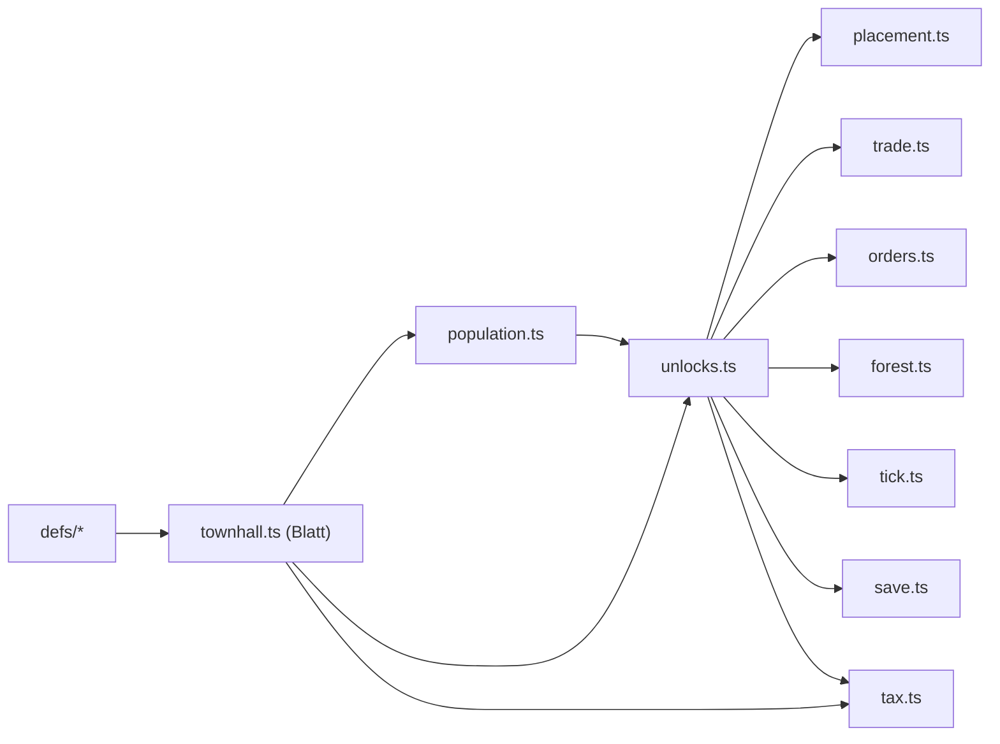

> Teil des Plans M10, Einstieg und Task-Tabelle: [index.md](index.md). **Gemeinsame Regeln:** index.md (Global Constraints).

### Entscheide des Plans (R163: B9, B11, Teilung S1)

**B9 — Importrichtung in `src/sim/`.** Der Kreis `unlocks` → `population` (`tierLock`) → `townhall` → `unlocks`
entsteht nur, wenn `townhall.ts` Funktionen aus `unlocks.ts` braucht. Entscheid: **`townhall.ts` ist ein Blatt**
(importiert nur `./types`, `./defs/*`). Die einzige Freischalt-Abfrage, die `townhall.ts` braucht („U5 frei", für die
Wirkung der Ausgabesperre), liest es über die Defs-Konstante `FUNCTION_ENTRY.goodLocks` direkt aus `world.unlocked`.
Die **Aktionen** `setGoodLock` und `setUpgradeStop` liegen in `tax.ts` neben `setTaxLevel` (alle drei sind
„Einstellungen der Amtsstube" und brauchen `functionLock` aus `unlocks.ts`). Damit gilt:

(Pfeil = „wird importiert von".) Grund: Ein Importkreis mit reinen Funktionen ist in ESM zwar unkritisch, er wird aber
zur Falle, sobald ein Modul auf oberster Ebene eine importierte Funktion aufruft (TDZ); ein Blatt-Modul ist einfacher
zu prüfen. Kosten: `setGoodLock`/`setUpgradeStop` liegen in `tax.ts` statt `townhall.ts` (P1). Absicherung: Test
`PLAN-B9` (Task 4) liest die Importe aller `src/sim/**/*.ts` und prüft „kein Kreis" und „`townhall.ts` nur
`types`/`defs`".

**B11 — Zwischenstand Steuer.** Entscheid: **Integrationsbranch statt Ruling.** Es gibt genau **einen** Gate Merge
M10 am Ende; vorher erreicht kein M10-Stand `main`. Integrationsbranch ist `feat/m10-ui`: Sie entsteht am geprüften
Sim-SHA nach Task 4 (S2 und F1 enthalten) und nimmt per Merge B1 (`feat/m10-scen`), R1 (`feat/m10-render`) und A1
(`feat/m10-icons`) auf. Der Zwischenstand „Steuer-Knöpfe der Kopfzeile scheitern ohne Amtsstube, `guide.ts` liest
noch `taxLevel`" existiert nur auf `feat/m10-sim` und auf `feat/m10-ui` zwischen Task 4 und Task 7; kein Spieler
sieht ihn, alle Tests bleiben grün (die betroffenen UI-Tests prüfen Texte über das gespeicherte `taxLevel`, das S2 nicht
ändert). Final-Review und Gate Merge laufen über **eine** Branch `feat/m10-ui` (enthält alle Stränge).

**Teilung S1 in S1a und S1b: ja.** S1a (Task 1) = Modell und Persistenz (Typen, Defs, `unlocks.ts`, `tickUnlocks`,
`createWorld`, Save v5) **ohne** Wirkung auf Bau und Handel; S1b (Task 2) = Sperren anwenden (`canPlace`, `buy`,
`deliverOrder`), bestehende Tests auf `unlockAll`, `nextStep`-Filter. Gründe: (1) Beide Hälften sind für sich grün
(S1a ändert kein Spielverhalten, nur neue Felder); (2) 20 AK in einem Sonnet-Task sind für Umsetzung und Review zu
breit (M8-Lehre Task 1); (3) **F1 kann nach S1a parallel zu S1b laufen** (braucht nur `functionLock`), das spart eine
Welle. Kosten: ein Paket mehr (2 Starts).
