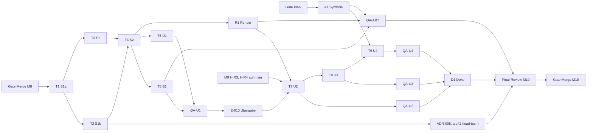

> Teil des Plans M10, Einstieg und Task-Tabelle: [index.md](index.md). **Gemeinsame Regeln:** index.md (Global Constraints).

### Wellen, Abhängigkeiten und Merges

Ein abhängiger Task startet erst nach Review-Urteil OK des Vorgängers. Integration nur geprüfter SHAs, danach sofort
push, SHA ins Ledger.

| Welle | `feat/m10-sim`                                       | weitere Branches                                                                                                            | grün am Wellenende                   |
| ----- | ---------------------------------------------------- | --------------------------------------------------------------------------------------------------------------------------- | ------------------------------------ |
| W0    | —                                                    | A1 (`feat/m10-icons`, lead-art), ab Gate Plan                                                                               | `feat/m10-icons`: `make check`       |
| —     | **Gate Merge M8** (L0), `<BASIS>` festhalten         |                                                                                                                             |                                      |
| W1    | Task 1 (S1a)                                         | —                                                                                                                           | `make check`; BG-1                   |
| W2    | Task 2 (S1b); danach lead-tech: ADR-005, arc42 §6/§8 | Task 3 (F1) auf `feat/m10-forest` ab Task-1-SHA                                                                             | beide: `make check`; BG-1            |
| W3    | merge `feat/m10-forest` @ Task-3-SHA; Task 4 (S2)    | —                                                                                                                           | `make check`; BG-1; `PLAN-B9`        |
| W4    | —                                                    | `feat/m10-scen` und `feat/m10-ui` ab Task-4-SHA: Task 5 (B1) ∥ Task 6 (U1); R1 (`feat/m10-render` ab Task-4-SHA, lead-art)  | je Branch `make check`; Task 5: BG-2 |
| W4b   | —                                                    | `feat/m10-ui` merged `feat/m10-scen` @ Task-5-SHA; **QA-U1**; **E-010-Übergabe**                                            | `feat/m10-ui`: `make check`          |
| W5    | —                                                    | `feat/m10-ui` merged `main` (H-R3, H-R4) und `feat/m10-render` @ R1-SHA (Konflikte löst Controller 2, R164 B3); Task 7 (U2) | `make check`                         |
| W6    | —                                                    | QA-U2 (detached am Task-7-SHA) ∥ Task 8 (U3)                                                                                | `make check`                         |
| W7    | —                                                    | QA-U3 ∥ merge `feat/m10-icons` @ A1-SHA, Task 9 (U4); QA-ART (lead-art, nach A1, R1, Task 5)                                | `make check`                         |
| W8    | —                                                    | QA-U4; D1; merge `main`; BG-3; **Final-Review M10** (lead-qa, opus); **Gate Merge M10**                                     | `make check`                         |



**Einrichten** (Controller; `m10-icons`, `m10-render`, `m10-qa-art` legt `lead-art` an):

```bash
cd /Users/KN/CAS/projekte/anno-clone
git pull --ff-only
git rev-parse --short main                         # = <BASIS>, ins Ledger
git diff --stat 9460ab9 main -- src/sim            # leer erwartet (W1-Nachweis); sonst melden
git worktree add .worktrees/m10-sim -b feat/m10-sim main
ln -s ../../node_modules .worktrees/m10-sim/node_modules
# nach Review OK von Task 1:
git worktree add .worktrees/m10-forest -b feat/m10-forest <T1-SHA>
ln -s ../../node_modules .worktrees/m10-forest/node_modules
# nach Review OK von Task 4:
git worktree add .worktrees/m10-scen -b feat/m10-scen <T4-SHA>
git worktree add .worktrees/m10-ui -b feat/m10-ui <T4-SHA>
for w in m10-scen m10-ui; do ln -s ../../node_modules .worktrees/$w/node_modules; done
# je QA-Check (nur lesen, am geprüften SHA):
git worktree add --detach .worktrees/m10-qa <SHA>
ln -s ../../node_modules .worktrees/m10-qa/node_modules
# nach dem Check: rm .worktrees/m10-qa/node_modules && git worktree remove .worktrees/m10-qa
# lead-art (nicht der Controller):
#   git worktree add .worktrees/m10-icons -b feat/m10-icons main          (W0, nach Gate Plan)
#   git worktree add .worktrees/m10-render -b feat/m10-render <T4-SHA>     (W4)
```

**Board-Paketliste (`blocked-by` für `lead-production`):**

| Paket      | Titel                                              | Owner           | blocked-by                         |
| ---------- | -------------------------------------------------- | --------------- | ---------------------------------- |
| M10-A1     | Symbolsatz Schritt 1                               | lead-art        | M10-PLAN (Gate Plan)               |
| M10-S1A    | Freischalt-Modell, Save v5                         | lead-tech       | M10-PLAN, M8-MERGE (Gate Merge M8) |
| M10-S1B    | Sperren in Bau, Handel, Aufträgen                  | lead-tech       | M10-S1A                            |
| M10-F1     | Wald roden und aufforsten (Sim)                    | lead-tech       | M10-S1A                            |
| M10-S2     | Amtsstube, Steuer, Ausgabesperre, Werkzeugmacher   | lead-tech       | M10-S1B, M10-F1                    |
| M10-B1     | Freischalt-Messung und Szenarien                   | lead-tech       | M10-S2                             |
| M10-R1     | Amtsstube-Silhouette, Terrain nach Geländewechsel  | lead-art        | M10-S2                             |
| M10-U1     | Bedienung zeigt nur Freigeschaltetes, Meldung, Ton | lead-tech       | M10-S2                             |
| M10-QA-U1  | Browser-Check U1                                   | lead-tech       | M10-U1, M10-B1                     |
| M10-U2     | Hilfe, Forst-Bedienung, Amtsstuben-Panel           | lead-tech       | M10-QA-U1, M10-R1, H-R3, H-R4      |
| M10-QA-U2  | Browser-Check U2 (inkl. AK-R1-03)                  | lead-tech       | M10-U2                             |
| M10-U3     | Mouse-over                                         | lead-tech       | M10-U2                             |
| M10-QA-U3  | Browser-Check U3                                   | lead-tech       | M10-U3                             |
| M10-U4     | Symbole im Einbau, K2, K3                          | lead-tech       | M10-U3, M10-A1, M10-QA-U2          |
| M10-QA-U4  | Browser-Check U4                                   | lead-tech       | M10-U4                             |
| M10-QA-ART | Blindtests Symbole und Amtsstube                   | lead-art        | M10-A1, M10-R1, M10-B1             |
| M10-DOC    | ADR-005-Nachtrag, arc42 §6 und §8 Persistenz       | lead-tech       | M10-S1B                            |
| M10-D1     | README, arc42, Hauptspec-Verweise                  | lead-tech       | M10-QA-U2, M10-QA-U3, M10-QA-U4    |
| M10-FR     | Final-Review M10                                   | lead-qa         | M10-D1, M10-DOC, M10-QA-ART        |
| M10-MERGE  | Gate Merge M10 (L0, `production-integrator`)       | lead-production | M10-FR                             |

**Fremde Pakete (R164 B1):** `M8-MERGE` (Gate Merge M8), `H-R3`, `H-R4` (M9 Welle 1b, lead-art) legt
`lead-production` auf dem Board an, falls sie dort noch fehlen; `M10-U2` ist von `H-R3` **und** `H-R4` blockiert
(R159). Das Planpaket heisst `M10-PLAN`.
