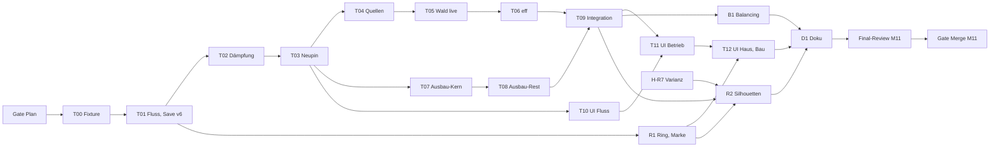

> Teil des Plans M11, Einstieg und Task-Tabelle: [index.md](index.md). **Gemeinsame Regeln:** index.md (Global Constraints).

### Wellen, Abhängigkeiten und Merges

Ein abhängiger Task startet erst nach Review-Urteil OK des Vorgängers. Integration nur geprüfter SHAs, danach sofort
push, SHA ins Ledger `.superpowers/sdd/m11/ledger.md`. Parallelität nur dort, wo die Ownership-Matrix
([orga-07](orga-07-datei-ownership.md)) überschneidungsfrei ist (R190).

| Welle | `feat/m11-sim`                                                                                       | weitere Branches                                                                                                                                                                             | grün am Wellenende                  |
| ----- | ---------------------------------------------------------------------------------------------------- | -------------------------------------------------------------------------------------------------------------------------------------------------------------------------------------------- | ----------------------------------- |
| —     | **Gate Plan** (L0); `docs/m11-design` nach `main` gemergt; `<BASIS>` festhalten                      |                                                                                                                                                                                              |                                     |
| W1    | T00 (Fixture, Ist-Messung), dann T01                                                                 | —                                                                                                                                                                                            | `make check`; Fixture-Test          |
| W2    | T02 (Dämpfung)                                                                                       | R1 auf `feat/m11-render` ab T01-SHA (lead-art)                                                                                                                                               | beide `make check`                  |
| W3    | T03 (Umschreiben, Neupin); **Haupt-Pins prüfen**                                                     | —                                                                                                                                                                                            | `make check`; Balancing grün        |
| W4    | —                                                                                                    | ab T03-SHA parallel: `feat/m11-sources` (T04 → T05 → T06) ∥ `feat/m11-upgrade` (T07 → T08) ∥ `feat/m11-ui` (T10)                                                                             | je Branch `make check`              |
| W5    | T09: merge `feat/m11-sources` @ T06 und `feat/m11-upgrade` @ T08; `LEVELS` für `hunter`/`cattlefarm` | —                                                                                                                                                                                            | `make check`; Pins bitgleich zu T03 |
| W6    | —                                                                                                    | `feat/m11-ui`: merge `feat/m11-sim` @ T09 und `feat/m11-render` @ R1, dann T11 → T12 ∥ `feat/m11-scen` ab T09: B1 ∥ `feat/m11-render`: merge `feat/m11-sim` @ T09 und `main` (H-R6), dann R2 | je Branch `make check`              |
| W7    | —                                                                                                    | QA-UI (nach T10, T11, T12, detached am geprüften SHA) · QA-ART (lead-art nach R2, B1) · `feat/m11-ui` merged `feat/m11-scen` @ B1 und `feat/m11-render` @ R2                                 | `make check`                        |
| W8    | —                                                                                                    | D1 (Doku) · merge `main` · **Final-Review M11** (lead-qa, opus) · **Gate Merge M11**                                                                                                         | `make check`                        |



**Einrichten** (Controller; `m11-render` legt der lead-art-Controller an):

```bash
cd /Users/KN/CAS/projekte/anno-clone
git pull --ff-only
git rev-parse --short main                       # = <BASIS>, ins Ledger
git diff --stat 4a5130e main -- src/sim         # leer erwartet; sonst melden (src/render: H-R7)
git worktree add .worktrees/m11-sim -b feat/m11-sim main
ln -s ../../node_modules .worktrees/m11-sim/node_modules
# nach Review OK von Task 3:
git worktree add .worktrees/m11-sources -b feat/m11-sources <T03-SHA>
git worktree add .worktrees/m11-upgrade -b feat/m11-upgrade <T03-SHA>
git worktree add .worktrees/m11-ui -b feat/m11-ui <T03-SHA>
for w in m11-sources m11-upgrade m11-ui; do ln -s ../../node_modules .worktrees/$w/node_modules; done
# nach Review OK von Task 1 (lead-art):  git worktree add .worktrees/m11-render -b feat/m11-render <T01-SHA>
# nach Review OK von Task 9:             git worktree add .worktrees/m11-scen -b feat/m11-scen <T09-SHA>
# je QA-Check (nur lesen): git worktree add --detach .worktrees/m11-qa <SHA>; ln -s ../../node_modules .worktrees/m11-qa/node_modules
```

**Board-Paketliste (`blocked-by` für `lead-production`):**

| Paket      | Titel                                        | Owner           | blocked-by             |
| ---------- | -------------------------------------------- | --------------- | ---------------------- |
| M11-S0     | Fixture save-v5, Ist-Messung                 | lead-tech       | M11-PLAN (Gate Plan)   |
| M11-P1A    | Fluss je Tick, Save v6                       | lead-tech       | M11-S0                 |
| M11-P1B    | Gedämpfter Aufstieg                          | lead-tech       | M11-P1A                |
| M11-P1C    | Umschreiben, Neupin                          | lead-tech       | M11-P1B                |
| M11-P2A    | Jagdhütte, Rinderfarm, `free`                | lead-tech       | M11-P1C                |
| M11-P2B    | Holzfäller braucht Wald                      | lead-tech       | M11-P2A                |
| M11-P2C    | Auslastung                                   | lead-tech       | M11-P2B                |
| M11-P3A    | Ausbau-Kern                                  | lead-tech       | M11-P1C                |
| M11-P3B    | Erstattung, deriveUnlocks, Brand             | lead-tech       | M11-P3A                |
| M11-INT    | Integration P2 + P3                          | lead-tech       | M11-P2C, M11-P3B       |
| M11-U1     | UI Fluss                                     | lead-tech       | M11-P1C                |
| M11-U2     | UI Betriebs-Panel, Ausbau                    | lead-tech       | M11-INT, M11-U1        |
| M11-U3     | UI Haus, Bauleiste, Meldungen                | lead-tech       | M11-U2, M11-R1         |
| M11-R1     | Ring, Marke noForest                         | lead-art        | M11-P1A                |
| M11-R2     | Silhouetten, Stufen-Aufsatz                  | lead-art        | M11-INT, M11-R1, H-R7  |
| M11-B1     | Balancing-Variante, Szenarien                | lead-tech       | M11-INT                |
| M11-QA-UI  | Browser-Checks T10 bis T12                   | lead-tech       | je UI-Task             |
| M11-QA-ART | Blindtests Ring, Silhouetten, Stufen         | lead-art        | M11-R2, M11-B1         |
| M11-D1     | Doku                                         | lead-tech       | M11-U3, M11-R2, M11-B1 |
| M11-FR     | Final-Review M11                             | lead-qa         | M11-D1, M11-QA-ART     |
| M11-MERGE  | Gate Merge M11 (L0, `production-integrator`) | lead-production | M11-FR                 |

**Fremde Pakete:** `H-R6` (Sprite-Cache) ist seit `4a5130e` auf `main` gemergt. `H-R7` (`feat/h-r7-varianz`, lead-art, läuft:
`sprites.ts`, `spriteCache.ts`, `renderer.ts`, neu `variants.ts`/`material.ts`, `arc42.md`) legt `lead-production` auf dem Board
an, falls es fehlt; `M11-R2` ist von **H-R7 gemergt** blockiert (nicht mehr von H-R6). R2 Schritt 0 prüft den Stand nach H-R7;
der Cache-Schlüssel enthält Variante, Material und `level`. Fällt H-R7 aus, läuft R2 auf dem Stand von `main` (Cache H-R6).

**Merge-Konfliktrisiko:** `renderer.ts` und `docs/arc42.md` (H-R7 gegen R1, R2, T04, D1), `tests/render/sprites.test.ts`
(H-R7 gegen R2 und T04, dort Filter AK-R2-03). Konflikte löst der Controller per Merge (kein Rebase); R1 holt `main` vor
seinem Merge, wenn H-R7 vorher landet. D1 schreibt arc42 erst nach dem H-R7-Merge.
