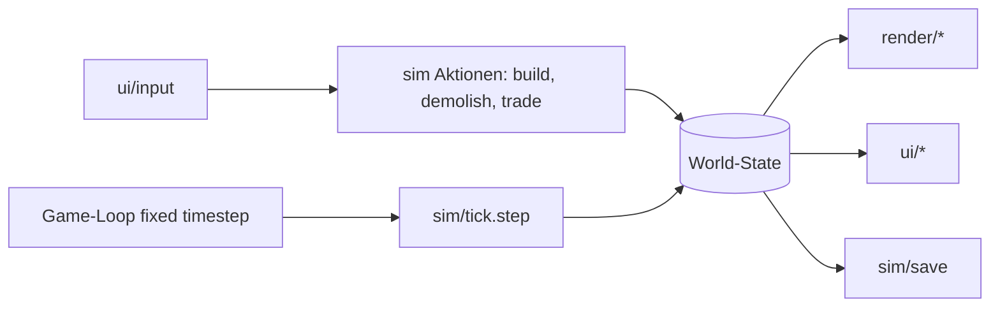

# Inselreich — Design-Spec (MVP)

Datum: 2026-09-29 · Status: freigegeben (Projektleitung delegiert, freie Hand)

## 1. Ziel

Ein **funktionierendes** Aufbau-Strategiespiel im Stil von Anno 1602, spielbar im Browser:
Insel besiedeln, Produktionsketten aufbauen, Bevölkerung versorgen und in höhere Stufen
aufsteigen lassen, Geld über Steuern verdienen, Waren handeln, Spielstand speichern.

**Erfolgskriterium MVP:** Ein neuer Spieler kann in einer Sitzung von leerer Insel bis zu
50 Bürgern kommen, das Spiel läuft ohne Fehler, Spielstand überlebt einen Reload.

**Nicht-Ziele (Backlog, nicht MVP):** Isometrie, Schiffe/Navigation, mehrere Inseln,
KI-Gegner, Piraten, Feuer/Pest, Sound, Militär, Multiplayer.

**Rechtliches:** Nur die _Mechanik_ ist inspiriert. Keine Original-Grafiken, -Sounds,
-Texte oder -Balancingtabellen. Eigener Titel („Inselreich"), eigene, prozedural
gezeichnete Grafik, eigene Zahlen.

## 2. Spielkonzept

### 2.1 Zeit

- 1 Tick = 100 ms Simulationszeit bei Geschwindigkeit 1×. Geschwindigkeiten: Pause, 1×, 2×, 4×.
- Alle Raten in der Spec sind „pro 100 Ticks" (= 10 s bei 1×), sofern nicht anders angegeben.

### 2.2 Karte

- 64×64 Kacheln, eine Insel, umgeben von Wasser. Seed-basiert, deterministisch.
- Terrain: `water`, `sand` (Küste), `grass`, `forest`, `mountain`.
- Generator: eigenes Value-Noise + radiale Inselmaske; Nachbedingung: ≥ 800 Landkacheln,
  ≥ 40 Waldkacheln, ≥ 10 Gebirgskacheln, ≥ 1 Küstenposition für das Kontor. Sonst Seed+1.
- Das **Kontor** (2×2) wird beim Start automatisch an einer Landposition mit Wasserkontakt gesetzt.

### 2.3 Güter

| id    | Name       | Kauf | Verkauf |
| ----- | ---------- | ---- | ------- |
| wood  | Holz       | 10   | 4       |
| tools | Werkzeug   | 40   | 15      |
| stone | Stein      | 15   | 6       |
| food  | Nahrung    | 8    | 3       |
| wool  | Wolle      | 12   | 5       |
| cloth | Stoff      | 30   | 12      |
| cane  | Zuckerrohr | 12   | 5       |
| rum   | Rum        | 40   | 18      |

- Zentrales Lager im Kontor, Kapazität **100 je Gut**. Bei vollem Lager verfällt Produktion.
- Handel: Am Kontor jederzeit kaufen/verkaufen (Stückzahlen 1 / 10) zu Fixpreisen. Werkzeug
  ist im MVP nur durch Kauf erhältlich (wie das frühe Anno-Spiel).

### 2.4 Gebäude

Kosten = Geld / Holz / Werkzeug / Stein. Unterhalt in Geld pro 100 Ticks.

| id         | Name               | Grösse | Kosten      | Unterhalt | Produziert                 | Verbraucht  | Zyklus (Ticks) | Standortregel                                      |
| ---------- | ------------------ | ------ | ----------- | --------- | -------------------------- | ----------- | -------------- | -------------------------------------------------- |
| kontor     | Kontor             | 2×2    | —           | 0         | —                          | —           | —              | automatisch, Küste                                 |
| road       | Weg                | 1×1    | 5/0/0/0     | 0         | —                          | —           | —              | Land                                               |
| market     | Marktplatz         | 2×2    | 200/10/3/0  | 10        | Versorgungsradius 8        | —           | —              | Land                                               |
| house      | Wohnhaus           | 1×1    | 50/3/0/0    | 0         | Steuern                    | Bedürfnisse | —              | Land, im Radius von Kontor oder angebundenem Markt |
| fisher     | Fischerhütte       | 1×1    | 100/5/2/0   | 5         | food 1                     | —           | 40             | Land, mind. 1 Wasserkachel angrenzend              |
| lumberjack | Holzfäller         | 1×1    | 50/0/1/0    | 5         | wood 1                     | —           | 30             | Land, mind. 1 Waldkachel im Radius 2               |
| quarry     | Steinbruch         | 1×1    | 150/10/3/0  | 10        | stone 1                    | —           | 60             | Land, mind. 1 Gebirgskachel angrenzend             |
| sheepfarm  | Schäferei          | 2×2    | 150/10/2/0  | 10        | wool 1                     | —           | 50             | Land, mind. 4 Graskacheln im Radius 2              |
| weaver     | Weberei            | 2×2    | 200/15/3/0  | 15        | cloth 1                    | wool 1      | 50             | Land                                               |
| canefarm   | Zuckerrohrplantage | 2×2    | 150/10/2/0  | 10        | cane 1                     | —           | 50             | Land, mind. 4 Graskacheln im Radius 2              |
| distillery | Brennerei          | 2×2    | 250/15/4/5  | 20        | rum 1                      | cane 1      | 50             | Land                                               |
| chapel     | Kapelle            | 2×2    | 300/20/5/10 | 15        | Dienst `faith`, Radius 10  | —           | —              | Land                                               |
| school     | Schule             | 2×2    | 400/25/8/15 | 25        | Dienst `school`, Radius 10 | —           | —              | Land                                               |

- „Land" = `sand`, `grass` oder `forest` ohne Gebäude. Gebirge und Wasser sind unbebaubar.
- „angrenzend" = 4er-Nachbarschaft des Footprints. „Radius r" = euklidischer Abstand ≤ r
  vom Footprint-Mittelpunkt.
- **Abriss:** 50 % der Geld-/Materialkosten zurück (abgerundet). Kontor nicht abreissbar.

### 2.5 Wegenetz und Anbindung

- Produktionsgebäude, Weberei, Brennerei, Markt, Kapelle, Schule gelten als **angebunden**,
  wenn mindestens eine Wegkachel an ihren Footprint grenzt und diese Wegkachel per
  4er-Nachbarschaft über Wege mit einer Kachel verbunden ist, die an das Kontor grenzt.
- Nicht angebundene Gebäude produzieren nicht und liefern keinen Dienst (Warnsymbol).
- Wohnhäuser brauchen keinen Weg, aber Lage im Versorgungsradius von Kontor (8) oder eines
  angebundenen Marktplatzes (8).
- Die Anbindung wird nur bei Änderungen am Wegenetz/Gebäudebestand neu berechnet (BFS).

### 2.6 Produktion

- Ein angebundenes Gebäude zählt jeden Tick einen Fortschrittszähler hoch. Erreicht er den
  Zyklus, wird 1 Output ins Lager gelegt, sofern (a) Lager nicht voll und (b) der Input
  (falls vorhanden) am Zyklusbeginn entnommen werden konnte.
- Fehlt Input, wartet das Gebäude (Zustand `waitingInput`). Ist das Lager voll, geht die
  Einheit verloren (Zustand `storageFull`).

### 2.7 Bevölkerung

Stufen (tier): 1 Pioniere, 2 Siedler, 3 Bürger.

| tier | Name     | max. Einwohner | Bedürfnisse (Güter, Verbrauch je Einwohner pro 100 Ticks) | Dienste       | Steuer je Einwohner pro 100 Ticks | Aufstiegskosten (G/H/W/S) |
| ---- | -------- | -------------- | --------------------------------------------------------- | ------------- | --------------------------------- | ------------------------- |
| 1    | Pioniere | 4              | food 0.5                                                  | —             | 2                                 | → 2: 100/5/2/0            |
| 2    | Siedler  | 8              | food 0.5, cloth 0.25                                      | faith         | 3                                 | → 3: 300/10/5/5           |
| 3    | Bürger   | 15             | food 0.5, cloth 0.25, rum 0.25                            | faith, school | 5                                 | —                         |

- Ein neues Haus startet mit 1 Einwohner, tier 1.
- **Verbrauch:** Jedes Haus führt je Gut einen Bedarfsakkumulator (Einwohner × Rate / 100 pro
  Tick). Erreicht er ≥ 1, wird 1 Einheit aus dem Lager entnommen. Gelingt das, ist das Bedürfnis
  „erfüllt"; misslingt es, „unerfüllt" (bis zur nächsten gelungenen Entnahme).
- **Dienste** sind erfüllt, wenn ein angebundenes Gebäude des Typs im Radius liegt.
- **Wachstum:** alle 50 Ticks: alle Bedürfnisse der eigenen Stufe erfüllt → +1 Einwohner
  (bis max); sonst −1 (min 1).
- **Aufstieg:** Einwohner == max, alle eigenen Bedürfnisse seit ≥ 300 Ticks durchgehend erfüllt,
  Dienste der nächsten Stufe verfügbar, Lager enthält ≥ 1 Einheit jedes neuen Bedarfsguts,
  Aufstiegskosten bezahlbar → Kosten abziehen, tier + 1. Einwohnerzahl bleibt.
- **Versorgungsbedingung** (Radius, 2.5) unerfüllt → alle Güterbedürfnisse gelten als unerfüllt.

### 2.8 Wirtschaft

- Start: 5000 Geld, 40 Holz, 20 Werkzeug, 10 Stein, 20 Nahrung.
- Steuern: je Haus Einwohner × Steuersatz, voll bei erfüllten Bedürfnissen, sonst 50 %.
- Unterhalt: Summe der Gebäude-Unterhalte (auch nicht angebundene).
- Geld darf negativ werden; bei Geld < 0 sind Bauen, Kaufen und Aufstieg gesperrt.
- HUD zeigt die Bilanz pro 100 Ticks (Steuern − Unterhalt).

### 2.9 Sieg

- Sobald die Summe der Einwohner in Bürger-Häusern ≥ 50: Banner „Ziel erreicht", Spiel läuft weiter.

## 3. Architektur

### 3.1 Grundprinzip

Strikte Trennung **Simulation** (reine TypeScript-Logik, kein DOM, deterministisch, testbar)
und **Darstellung/UI** (Canvas + DOM). Die Welt ist ein **einfaches, serialisierbares
Datenobjekt** (keine Klassen, keine Zyklen) – Speichern ist `JSON.stringify`.



### 3.2 Module

```
src/
  sim/                 reine Logik, kein DOM
    rng.ts             seeded PRNG (mulberry32)
    noise.ts           Value-Noise
    mapgen.ts          Inselgenerator + Kontorposition
    types.ts           World, Tile, Building, Good, ...
    defs/goods.ts      Gütertabelle (2.3)
    defs/buildings.ts  Gebäudetabelle (2.4)
    defs/tiers.ts      Bevölkerungsstufen (2.7)
    world.ts           createWorld(seed), Zugriffshelfer (tileAt, buildingsOfType, footprint)
    placement.ts       canPlace(world, defId, x, y) → { ok, reason }
    build.ts           placeBuilding, demolish (Kosten, Refund, Tile-Belegung)
    roads.ts           recomputeConnectivity(world) → Set<buildingId>
    production.ts      tickProduction
    population.ts      tickPopulation (Verbrauch, Wachstum, Aufstieg)
    economy.ts         tickEconomy (Steuern, Unterhalt), canAfford, pay
    trade.ts           buy, sell
    tick.ts            step(world): Reihenfolge Produktion → Bevölkerung → Wirtschaft → Sieg
    save.ts            serialize/deserialize mit Versionsfeld
  render/
    camera.ts          Pan/Zoom, Welt↔Bildschirm
    terrain.ts         Terrain-Layer (einmalig in Offscreen-Canvas)
    sprites.ts         prozedurale Zeichnung von Gebäuden/Wegen (kein Bildmaterial)
    renderer.ts        Frame zeichnen: Terrain, Wege, Gebäude, Hover, Platzierungsvorschau
  ui/
    app.ts             Bootstrap, Game-Loop, Geschwindigkeit
    input.ts           Maus/Tastatur → Kamera und Aktionen
    hud.ts             Kopfzeile (Geld, Bilanz, Bevölkerung), Lagerleiste
    buildMenu.ts       Bauleiste (Kategorien, Kosten, Sperren)
    inspect.ts         Seitenpanel für angeklicktes Gebäude (Status, Abriss)
    trade.ts           Handelsdialog am Kontor
    messages.ts        Hinweise (Fehler bei Platzierung, Sieg)
  main.ts
```

### 3.3 Datenmodell (Kern)

```ts
type Terrain = 'water' | 'sand' | 'grass' | 'forest' | 'mountain';
interface Tile {
  terrain: Terrain;
  buildingId: number | null;
  road: boolean;
}
interface Building {
  id: number;
  defId: BuildingDefId;
  x: number;
  y: number; // Ursprung oben links
  connected: boolean;
  progress: number;
  state: 'ok' | 'waitingInput' | 'storageFull' | 'notConnected';
  house?: {
    tier: 1 | 2 | 3;
    inhabitants: number;
    demand: Record<GoodId, number>;
    satisfied: Record<GoodId, boolean>;
    satisfiedSince: number;
    supplied: boolean;
  };
}
interface World {
  version: 1;
  seed: number;
  width: number;
  height: number;
  tick: number;
  tiles: Tile[]; // index = y * width + x
  buildings: Record<number, Building>;
  nextBuildingId: number;
  kontorId: number;
  stock: Record<GoodId, number>;
  money: number;
  stats: { taxes: number; upkeep: number }; // gleitend pro 100 Ticks
  won: boolean;
}
```

Wege sind ein Tile-Flag, kein Building (billiger, kein Id-Verbrauch).

### 3.4 Game-Loop

`requestAnimationFrame`; Akkumulator mit fixem Schritt 100 ms × Geschwindigkeit; max. 20
Ticks pro Frame (Nachholgrenze). Render jeden Frame; HUD alle 10 Frames aktualisiert.

### 3.5 Fehlerbehandlung

- Alle Aktionen liefern `{ ok: true } | { ok: false, reason: string }` – kein `throw` im Sim-Pfad.
- Ungültiger Spielstand (Version/Struktur) → Meldung, neues Spiel; nichts überschreiben.
- Laufzeitfehler im Loop → Loop stoppt, Meldung im UI (kein stilles Weiterlaufen).

### 3.6 Darstellung

- Canvas 2D, Top-down, 32 px Kacheln, Zoom 0.5–2, Pan per Drag/WASD/Pfeiltasten.
- Terrain einmal in Offscreen-Canvas gezeichnet; Gebäude als Code-gezeichnete Formen mit
  Farbcode je Kategorie und Kurzsymbol. Hover: Kachelrahmen; Platzierung: grün/rot-Vorschau.
- UI als DOM-Overlay: Card-UI, CSS Grid, Mobile-first-Layout (Bauleiste unten, Panel rechts
  bzw. auf schmalen Screens unten). UI-Sprache Deutsch (CH).

### 3.7 Persistenz

- `localStorage` Schlüssel `inselreich.save.v1`; Buttons Speichern / Laden / Neu.
- Serialisierung = World-Objekt als JSON, Deserialisierung validiert Version und Kachelanzahl.

## 4. Tests (Vitest, nur `sim/`)

- mapgen: gleicher Seed → gleiche Karte; Nachbedingungen (2.2) erfüllt; Kontor an Küste.
- placement: jede Standortregel positiv + negativ; Überlappung; Geldmangel.
- roads: Anbindung über Weg zum Kontor, Unterbrechung → nicht angebunden.
- production: Zyklus, Input-Wartezustand, Lagerlimit.
- population: Verbrauch, Wachstum/Schrumpfen, Aufstieg mit allen Bedingungen, Versorgungsradius.
- economy: Steuern voll/halb, Unterhalt, Negativsperre.
- trade: Kauf/Verkauf, Kapazität, Geld.
- save: Round-trip identisch; kaputter Spielstand → Fehler ohne Exception.
- smoke: 3000 Ticks mit skriptgesteuertem Aufbau → Siedler erreicht, kein Fehler.

## 5. Meilensteine

1. **Fundament** – Scaffold (Vite, TS, Vitest, ESLint, Prettier, Makefile, CI), Sim-Typen und
   Def-Tabellen, RNG/Noise/Mapgen, Renderer, Kamera, Eingabe, Platzieren von Wegen/Gebäuden
   mit Standortregeln (noch ohne Wirtschaft).
2. **Wirtschaft** – Lager, Produktion, Anbindung, Handel, Kosten/Unterhalt, Abriss, Inspect-Panel.
3. **Bevölkerung** – Häuser, Bedürfnisse, Dienste, Wachstum, Aufstieg, Steuern, Sieg.
4. **Persistenz & Feinschliff** – Speichern/Laden, Meldungen, Balancing-Durchlauf, arc42-Doku,
   Deploy-Workflow (GitHub Pages).

## 6. Offene Entscheidungen für den Nutzer

- Repo öffentlich machen? (GitHub Pages braucht bei kostenlosen Konten ein öffentliches Repo.)
- Isometrische Darstellung als späteres Upgrade – Renderer ist dafür isoliert.
