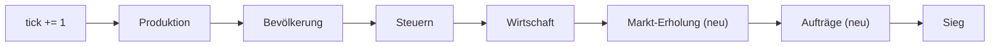

# M5 „Spielerlebnis" — Design-Spec (Tiefe, Dynamik, Ambiente, Bedienkomfort)

Datum: 2026-09-30 · Paket M5-03 · Status: abgenommen durch `lead-design`; Gate Spec (`lead-tech`: Machbarkeit,
Save v2 · `lead-qa`: Testbarkeit) mit BEDENKEN, Auflagen in Fix-Runde 2 eingearbeitet · Prozessstufe voll

**Entscheide L0 im Gate Spec:** Die Baseline-Vorlage Sieg-Tick 6050 gilt erst nach der Messung in B1. Die
Aufstiegswartezeit „niedrig" bleibt 150. Die mit „Setzung Spec" markierten Kleinwerte sind im Gate Spec
übernommen; die Markierung bleibt zur Nachvollziehbarkeit stehen.

Grundlage: Designvorschlag `lead-design` (Ansatz B, Gate Brainstorming bestanden), Werte und
Szenario-Tests von `design-economy-designer` (verbindlich übernommen, nicht neu gerechnet), Paket-Kandidat
„Bedienkomfort" in `docs/beobachtungen.md`, Hauptspec
[2026-09-29-inselreich-design.md](2026-09-29-inselreich-design.md) und
[Balancing-Kurz-Spec](2026-09-30-balancing-design.md).

**Voraussetzung:** Der Fix M5-01 („Aufstieg entnimmt Ware und zählt Steuer vollständig") ist auf `main`
gemergt. Alle Werte und Messungen dieser Spec setzen ihn voraus. Die Umsetzung von M5 beginnt auf einem
Stand, der M5-01 enthält.

Kennzeichnung: **„Setzung Spec"** markiert eine Zahl oder Regel, die weder im Vorschlag noch in der
Werte-Datei stand und hier begründet gesetzt wird. **„Änderung"** markiert eine bewusste Abweichung von
Hauptspec, arc42 oder ADR (Übersicht in Abschnitt 15).

## 1. Ziel

Der Nutzer-Playtest nach M4 bestätigt eine tragfähige Grundlage, vermisst aber Tiefe, Dynamik, Ambiente
und Bedienkomfort. M5 setzt je Säule einen starken Hebel, ohne das Siegziel oder die Warenketten zu ändern.

**Spielerzweck:** Der Spieler sieht und hört seine Insel arbeiten, erkennt auf einen Blick, was fehlt,
und wägt alle paar Minuten Wachstum, Einnahmen und Handel gegeneinander ab.

**15-Minuten-Kriterium** (15 Minuten = 9000 Ticks bei 1×). Ein neuer Spieler erlebt in dieser Zeit:

- ab dem ersten Bau eigene Gebäude-Silhouetten, Animationen und Ton;
- beim ersten Haus die Radiusanzeige und über jedem unversorgten Haus ein Bedarfssymbol;
- den ersten Handelsauftrag bei Tick 600 (1 Minute) und bis Tick 9000 genau **10 Auftragsangebote**
  (Tick 600 + 900·k für k = 0…9);
- beim ersten Verkauf den sinkenden Verkaufspreis (Prozentanzeige im Handel);
- den Steuerregler ab Spielbeginn im HUD.

Prüfbar über AK-B1-02 (Anzahl Angebote) und den Browser-Check AK-B1-03.

## 2. Scope

### 2.1 Muss und Kann je Säule

| Säule         | Muss                                                                                                                                                                      | Kann                                |
| ------------- | ------------------------------------------------------------------------------------------------------------------------------------------------------------------------- | ----------------------------------- |
| Tiefe         | Steuerregler global, 3 Stufen mit Strafe für „hoch" (4.1)                                                                                                                 | Werkzeugmacher (4.2)                |
| Dynamik       | Handelsaufträge (5.3), Verkaufssättigung (5.2)                                                                                                                            | —                                   |
| Ambiente      | prozedurale Gebäude-Silhouetten, Animationen (Arbeitsanzeige, Wasser, Händlerschiff), synthetischer Ton mit Stumm-Schalter (Abschnitt 9)                                  | Tag-Nacht-Tönung, Träger (9.5, 9.6) |
| Bedienkomfort | 7 belegte Befunde, Radiusanzeige, Warenbilanz, Bedarfssymbole, Bauleisten-Tooltips, Hotkeys, Autosave, UI für Steuerregler, Auftragskarte und Preisanzeige (Abschnitt 10) | —                                   |

### 2.2 Streichreihenfolge der Kann-Posten

Werden Budget oder Zeit knapp, wird in dieser Reihenfolge gestrichen: **1. Träger (A5) → 2. Werkzeugmacher
(S4) → 3. Tag-Nacht-Tönung (A4).** Alles andere ist Muss. Ein gestrichener Kann-Posten hinterlässt keinen
toten Code: Seine Pakete entfallen vollständig, inklusive der zugehörigen Teile anderer Pakete (in
Abschnitt 13 als „nur mit Sx/Ax" markiert).

## 3. Ausdrücklich nicht in M5

- Keine 4. Bevölkerungsstufe, keine neuen Bedarfsgüter, kein Luxusbedarf. Das Siegziel bleibt 50 Bürger.
- Keine Erz-/Eisenkette und kein zweiter Input je Betrieb.
- Keine Zufallsereignisse oder Katastrophen (Feuer, Krankheit, Ernteausfall); Kandidat für M6.
- Keine Jahreszeiten, keine Steuer je Stufe (M5 hat einen globalen Regler), keine dynamischen Kaufpreise.
- Keine Schiffe mit Navigation, keine zweite Insel, keine KI-Gegner, kein Militär, keine Isometrie.
- Keine fremden oder lizenzierten Assets und keine Musik. Grafik und Ton sind ausschliesslich prozedural
  bzw. synthetisch; Asset-Import und Musik folgen später mit `lead-art` (Lizenzprüfung nach ADR-006).
- Keine Overlay-Heatmaps und keine mehreren manuellen Speicherplätze (nur der Autosave-Slot zusätzlich).
- Keine Teillieferung von Aufträgen, kein Ablehnen von Aufträgen, keine Strafe bei Verfehlen.
- Keine neue Laufzeit-Abhängigkeit (ADR-001). Web Audio und Canvas 2D sind Browser-APIs.

## 4. Regeln: Tiefe

### 4.1 Steuerregler

Global, drei Stufen. „Normal" entspricht exakt dem heutigen Verhalten.

| Ort                                                                 | Feld (neu)                                      | niedrig (`low`)                 | normal (`normal`)      | hoch (`high`) |
| ------------------------------------------------------------------- | ----------------------------------------------- | ------------------------------- | ---------------------- | ------------- |
| `src/sim/defs/tiers.ts` `TAX_LEVELS: Record<TaxLevel, TaxLevelDef>` | `pct` (Steuer in % der Grundsteuer, ganzzahlig) | 70                              | 100                    | 130           |
| dito                                                                | `upgradeWait` (Ticks, `null` = kein Aufstieg)   | 150                             | 300 (= `UPGRADE_WAIT`) | `null`        |
| dito                                                                | `occupancy` (Anteil der Höchstbelegung)         | 1                               | 1                      | 0.75          |
| dito                                                                | `name` (Anzeige)                                | niedrig                         | normal                 | hoch          |
| `src/sim/defs/tiers.ts`                                             | `DEFAULT_TAX_LEVEL`                             |                                 | `'normal'`             |               |
| `src/sim/defs/timing.ts`                                            | `TAX_SWITCH_LOCK`                               | 300 Ticks nach jedem Umschalten |                        |               |

`normal.upgradeWait` verweist auf die bestehende Konstante `UPGRADE_WAIT` (keine zweite Zahl 300).
Typen in `src/sim/types.ts`: `TaxLevel = 'low' | 'normal' | 'high'`,
`TaxLevelDef { name: string; pct: number; upgradeWait: number | null; occupancy: number }`. Ganzzahlige Prozent statt
eines Faktors 0.7/1.3, damit „normal" bitgleich zu heute rechnet (siehe Steuer).

**Steuer.** `totalTaxes(world) = floor(Σ(inhabitants × tax × satisfiedFactor) × pct / 100)` über alle Häuser;
wie heute wird erst summiert und dann einmal abgerundet. `satisfiedFactor` ist 1 bzw.
`UNSATISFIED_TAX_FACTOR` (0.5). Die Summe ist immer ein Vielfaches von 0.5 und damit exakt darstellbar;
`Σ × 100` ist ganzzahlig und `/ 100` liefert Σ exakt zurück. **Bei „normal" (`pct` 100) ist das Ergebnis
bitgleich zu heute** (`floor(Σ)`).

**Zielbelegung.** `cap(house) = max(1, floor(maxInhabitants × occupancy))`. Bei „hoch": Pionier 3,
Siedler 6, Bürger 11; bei „niedrig" und „normal" gleich `maxInhabitants`.

**Wachstumstakt** (alle `GROWTH_INTERVAL` = 50 Ticks, wie heute), für jede Stufe in dieser Reihenfolge:

1. `inhabitants > cap` → −1, auch wenn alle Bedürfnisse erfüllt sind.
2. sonst Bedürfnisse erfüllt → `min(cap, inhabitants + 1)`.
3. sonst → `max(1, inhabitants − 1)`, wie heute.

Bei „normal" und „niedrig" ist Regel 1 nie erfüllt; das Verhalten ist identisch mit heute.

**Aufstieg.** Die Wartezeit ist `TAX_LEVELS[taxLevel].upgradeWait` statt `UPGRADE_WAIT`. Bei
`upgradeWait === null` ist der Aufstieg gesperrt; `upgradeStatus` nennt dann zusätzlich den Grund
**„Steuer zu hoch"** (die Wartezeit-Bedingung entfällt in diesem Fall als eigener Grund). Der Grund für die
Wartezeit lautet dynamisch „Bedürfnisse noch nicht {upgradeWait} Ticks erfüllt". `satisfiedSince` wird durch
den Steuerregler nicht verändert.

**Umschalten.** `setTaxLevel(world, level): Result` (neues Modul `src/sim/tax.ts`):

| Bedingung                               | Ergebnis                                                             |
| --------------------------------------- | -------------------------------------------------------------------- |
| `level` kein Schlüssel von `TAX_LEVELS` | `fail('Ungültige Stufe')`                                            |
| `level === world.taxLevel`              | `fail('Stufe bereits aktiv')`, Sperre unverändert — **Setzung Spec** |
| `world.tick < world.taxLockedUntil`     | `fail('Sperrzeit')`, nichts verändert                                |
| sonst                                   | `taxLevel = level`, `taxLockedUntil = tick + TAX_SWITCH_LOCK`, `ok`  |

Das Umschalten ist auch bei negativem Geld erlaubt (es kostet nichts). Die neue Stufe wirkt ab dem nächsten
Tick für Steuer, Wachstum und Aufstieg.

**Bilanz je Einwohner / 100 Ticks** (Steuer − Kettenunterhalt, aus der Werte-Datei):

| Stufe                     | niedrig (pct 70) | normal | hoch (pct 130)      |
| ------------------------- | ---------------- | ------ | ------------------- |
| Pionier                   | +0.4             | +1.0   | +1.6                |
| Siedler                   | +1.4             | +3.5   | +5.6                |
| Bürger                    | +3.3             | +7.5   | +11.7               |
| Endzustand 4 Bürgerhäuser | +158             | +410   | +370 (44 Einwohner) |

Warum die Werte so sind (Kurzfassung der Werte-Datei): Ohne Strafe dominierte „hoch", weil Geld der
Engpass ist. „Hoch" auf Dauer verfehlt 50 Bürger mit 4 Häusern (44) und bringt weniger Bruttosteuer
(800 statt 840); es lohnt sich nur als Liquiditätsstoss. „Niedrig" kostet Geld (Controller-Kolonie durchgehend
auf „niedrig": 0 Bürger nach 9000 Ticks), bringt aber Tempo (volles Bürgerhaus 700 statt 950 Ticks, −26 %).
Pendeln vor der Buchung bringt mit Sperrzeit 300 nur etwa +3 je 100 Ticks und Haus (2.7 %).

### 4.2 Werkzeugmacher (Kann, Paket S4)

Neuer Eintrag `toolmaker` in `src/sim/defs/buildings.ts`, `BuildingDefId` in `types.ts` erweitert.
Er nutzt den bestehenden Produktionspfad (1 Input, 1 Output, Input bei Zyklusbeginn).

| Feld                    | Wert                                      |
| ----------------------- | ----------------------------------------- |
| `name`                  | Werkzeugmacher                            |
| `w × h`                 | 2 × 2                                     |
| `cost`                  | `cost(200, 15, 3, 0)` (zum Kaufpreis 470) |
| `upkeep`                | 25                                        |
| `category`              | `production`                              |
| `produces` / `consumes` | `tools` / `wood`                          |
| `cycle`                 | 80 (1.25 Werkzeug je 100 Ticks)           |
| `site`                  | `[]`                                      |

Der Unterhalt fällt wie bei allen Gebäuden auch im Leerlauf an (−25 / 100 Ticks). Verkauf des Ausstosses
ist ein Verlust (−8.1 / 100 Ticks mit eigenem Holz), Eigenbedarf lohnt sich ab etwa 25 geplanten
Werkzeugen (Stückkosten 21.5 statt 40, Amortisation ~2000 Ticks). Die Wahl „kaufen oder herstellen" liegt
damit im Zeitpunkt. Werkzeug ist kein Auftragsgut. Abriss: 50 % zurück wie bei allen Gebäuden
(100 / 7 / 1 / 0). **Änderung** gegenüber Hauptspec 2.3 („Werkzeug nur durch Kauf") und Balancing-Kurz-Spec
(„Werkzeugproduktion ist Backlog").

## 5. Regeln: Dynamik

### 5.1 Problem „Dauergewinn aus Verkauf"

Heute ist Verkaufen ein stapelbarer Dauergewinn: Ein Holzfäller erzeugt 3.33 Holz je 100 Ticks, verkauft
zu 4 sind das 13.3 bei 5 Unterhalt, also **+8.3 je 100 Ticks — beliebig oft stapelbar**, weil der Preis fest
ist (ebenso Rum-Paar +6, Fischer +2.5). Zehn Holzfäller sind eine Gelddruckmaschine ohne Entscheidung.

Die Verkaufssättigung (5.2) deckelt das: Die Erholung von 10 Prozentpunkten je 100 Ticks entspricht einer
**Marktkapazität von 10 Einheiten je Gut und 100 Ticks** zu fast vollem Preis. Oberhalb davon fällt der
Preis auf den Boden (30 %), und jeder weitere Betrieb macht Verlust (Holz: 3.33 × 4 × 0.3 = 4 < 5 Unterhalt).

| Kette (Ausstoss / 100 Ticks, Unterhalt) | n=1  | n=2   | n=3       | n=4      | n=5       | n=6    | lohnt bis                          |
| --------------------------------------- | ---- | ----- | --------- | -------- | --------- | ------ | ---------------------------------- |
| Holzfäller (3.33, 5)                    | +8.3 | +16.5 | **+24.6** | −3.2     | −4.2      | −5.2   | 3 Betriebe                         |
| Fischer (2.5, 5)                        | +2.5 | +4.9  | +7.3      | **+9.5** | −13.0     | −15.7  | 4 Betriebe                         |
| Rum-Paar (2, 30)                        | +6.0 | +11.6 | +16.9     | +21.8    | **+26.4** | −109.8 | 5 Paare, praktisch nie amortisiert |
| Stoff-Paar (2, 25)                      | −1.0 | …     |           |          |           | −103   | nie                                |
| Steinbruch (1.67, 10)                   | 0.0  | −0.1  | …         |          |           | −1.4   | nie                                |

Holz bringt damit höchstens etwa +25 je 100 Ticks (rund ¼ eines Bürgerhauses), alle Güter zusammen unter
etwa +60. Ein Lager-Dump ist teuer: 100 Holz auf einmal bringen 219 statt 400, danach dauert die volle
Erholung 700 Ticks. Der Verkaufszeitpunkt wird zur Entscheidung.

### 5.2 Verkaufssättigung

Nur die Verkaufsseite. Kaufpreise bleiben fest (`buy`, `buyPrice(good, n)` unverändert).

| Ort                      | Feld (neu)                        | Wert                                                      |
| ------------------------ | --------------------------------- | --------------------------------------------------------- |
| `src/sim/defs/goods.ts`  | `SELL_DROP`                       | 1 (Prozentpunkt je verkaufter Einheit)                    |
| `src/sim/defs/goods.ts`  | `SELL_FLOOR`                      | 30 (%)                                                    |
| `src/sim/defs/timing.ts` | `SELL_RECOVERY_INTERVAL`          | 10 (Ticks; je Takt +1 Prozentpunkt je Gut, höchstens 100) |
| Welt (Save v2)           | `sellPct: Record<GoodId, number>` | ganzzahlig 30…100; neue Welt und Migration: überall 100   |

**Preisfunktion.** `sellPrice(world, good, n): number` in `src/sim/trade.ts` ist rein und rechnet:

```
acc = 0; pct = world.sellPct[good]
wiederhole n-mal: acc += GOODS[good].sell × pct; pct = max(SELL_FLOOR, pct − SELL_DROP)
Ergebnis = floor(acc / 100)
```

Gebucht wird genau dieser Betrag, einmal je Verkaufsaktion. **Änderung der Signatur:** bisher
`sellPrice(good, n)`; S2 führt alle Aufrufer nach: `tests/sim/trade.test.ts` und als einzige benannte
Ownership-Ausnahme den einen Aufruf in `src/ui/trade.ts` (Abschnitt 13). Der
bestehende Testwert `sellPrice('rum', 3) = 54` wird bewusst zu `sellPrice(world, 'rum', 3) = 53`
(18 × (100 + 99 + 98) / 100 = 53.46).

**Verkauf.** `sell(world, good, n)` prüft wie heute Menge und Bestand, bucht `sellPrice(world, good, n)` und
setzt danach `sellPct[good] = max(SELL_FLOOR, sellPct[good] − n × SELL_DROP)`. Der Aufruf bleibt
`sell(world, good, n)`.

**Erholung.** `tickMarket(world)` in `src/sim/trade.ts`: bei `tick > 0 && tick % SELL_RECOVERY_INTERVAL === 0`
steigt jedes `sellPct[g]` um 1, höchstens auf 100. Der Takt ist unabhängig vom Buchungstakt (100), damit
sich kein Timing am Buchungstakt lohnt.

**Aufträge** (5.3) berühren `sellPct` nicht. Käufe berühren `sellPct` nicht.

### 5.3 Handelsaufträge

| Ort                               | Feld (neu)                                             | Wert                                     |
| --------------------------------- | ------------------------------------------------------ | ---------------------------------------- |
| `src/sim/defs/timing.ts`          | `ORDER_FIRST_TICK` / `ORDER_PERIOD` / `ORDER_DURATION` | 600 / 900 / 600 Ticks                    |
| `src/sim/defs/goods.ts`           | `ORDER_PREMIUM`                                        | 0.75 → Stückprämie `floor(buy × 0.75)`   |
| `src/sim/defs/goods.ts` `GoodDef` | `order?: { tier: Tier; min: number; max: number }`     | fehlt → kein Auftragsgut (Tabelle unten) |
| Welt (Save v2)                    | `order: { period, good, amount, reward, due } \| null` | neue Welt und Migration: `null`          |

| Gut        | `order.tier` | `min–max` | Stückprämie | Verkauf / Kauf | Prämie ≤ 0.8 × Kauf |
| ---------- | ------------ | --------- | ----------- | -------------- | ------------------- |
| Holz       | 1            | 20–40     | 7           | 4 / 10         | 7 ≤ 8               |
| Nahrung    | 1            | 10–20     | 6           | 3 / 8          | 6 ≤ 6.4             |
| Stein      | 2            | 10–20     | 11          | 6 / 15         | 11 ≤ 12             |
| Wolle      | 2            | 10–20     | 9           | 5 / 12         | 9 ≤ 9.6             |
| Stoff      | 2            | 6–12      | 22          | 12 / 30        | 22 ≤ 24             |
| Zuckerrohr | 3            | 10–20     | 9           | 5 / 12         | 9 ≤ 9.6             |
| Rum        | 3            | 6–12      | 30          | 18 / 40        | 30 ≤ 32             |
| Werkzeug   | —            | —         | —           | 15 / 40        | kein Auftragsgut    |

Die `order`-Einträge in `defs/goods.ts` sowie `OrderDef` und `GoodDef.order` in `types.ts` legt **S1** an (Datenbasis
für Save v2 und dessen Prüfung); S2 nutzt sie. `ORDER_PREMIUM` und die Auftragstakte kommen mit S2.

Invariante für jedes Auftragsgut: `sell < floor(buy × ORDER_PREMIUM) ≤ 0.8 × buy`. Damit bringt ein Auftrag
mehr als der Verkauf, aber „kaufen und abliefern" ist immer ein Verlust.

**Angebot.** Bei `tick ≥ ORDER_FIRST_TICK` und `(tick − ORDER_FIRST_TICK) % ORDER_PERIOD === 0` entsteht
Auftrag `k = (tick − 600) / 900`, falls `order === null`. Da Dauer 600 < Periode 900, ist nie mehr als einer
aktiv. Der Auftrag ist sofort aktiv (kein Annehmen), `due = tick + ORDER_DURATION`.

**Güterpool.** Alle Güter mit `order` und `order.tier ≤` höchster aktueller Hausstufe (ohne Häuser: 1), in der
Reihenfolge von `GOOD_IDS`. Stufe 1: Holz, Nahrung; Stufe 2: + Stein, Wolle, Stoff; Stufe 3: + Zuckerrohr, Rum.

**Ableitung ohne gespeicherten RNG-Strom** (`orderForPeriod(seed, k, maxTier)` in `src/sim/orders.ts`, rein):

```
r      = createRng((seed ^ Math.imul(k + 1, 0x9e3779b1)) >>> 0)   // neue Instanz je Periode, rng.ts
good   = pool[floor(r() × pool.length)]
amount = order.min + floor(r() × (order.max − order.min + 1))
reward = amount × floor(GOODS[good].buy × ORDER_PREMIUM)
```

Gleicher Seed, gleiche Periode, gleiche Höchststufe → identischer Auftrag, auch über Speichern und Laden
hinweg. `step()` zieht heute keine Zufallszahlen; es wird keine bestehende Folge verschoben, und das Save
braucht keinen RNG-Zustand. **Änderung** gegenüber arc42 8 („Die Simulation nutzt keinen Zufall"): Sie nutzt
jetzt seed-abgeleiteten Zufall über `rng.ts`, weiterhin ohne Uhr und ohne DOM. S2 begründet das in einem neuen
**ADR-010** („Zufall je Periode aus Seed statt RNG-Strom im Save") und führt arc42 §8 (Determinismus) nach;
beides ist Pflicht-Deliverable von S2.

**Liefern.** `deliverOrder(world): Result`:

| Bedingung              | Ergebnis                                                         |
| ---------------------- | ---------------------------------------------------------------- |
| `order === null`       | `fail('Kein Auftrag')`                                           |
| `stock[good] < amount` | `fail('Nicht genug Ware')`, nichts verändert (keine Teilabgabe)  |
| sonst                  | `stock[good] −= amount`, `money += reward`, `order = null`, `ok` |

Liefern ist bei negativem Geld erlaubt (es ist eine Einnahme) und bis einschliesslich `tick === due` möglich.

**Verfehlen.** Ist `tick > due`, setzt `tickOrders` `order = null`, ohne Strafe. Die Periode verfällt; es gibt
keinen Nachholauftrag. Aufträge laufen nach dem Sieg unverändert weiter (Endspiel-Ziel).

**Grössenordnung.** Ein typischer Auftrag bringt 200–270 (30 Holz = 210, 9 Rum = 270), also etwa 25 je 100
Ticks brutto und etwa 10 netto über dem Verkaufswert: früh spürbar, im Endzustand eine Zugabe. Die Wahl für
den Spieler: Ware umleiten oder Häuser versorgen.

## 6. Datenmodell und Save v2

### 6.1 Typen (`src/sim/types.ts`)

```ts
export type TaxLevel = 'low' | 'normal' | 'high';
export interface TaxLevelDef {
  name: string;
  pct: number; // 70 | 100 | 130
  upgradeWait: number | null;
  occupancy: number;
}
export interface OrderDef {
  tier: Tier;
  min: number;
  max: number;
}
export interface GoodDef {
  /* bestehend */ order?: OrderDef;
}
export interface Order {
  period: number; // k
  good: GoodId;
  amount: number;
  reward: number;
  due: number; // letzter Tick, an dem geliefert werden kann
}
export interface World {
  version: 2; // war 1
  /* alle bestehenden Felder unverändert */
  taxLevel: TaxLevel;
  taxLockedUntil: number;
  sellPct: Record<GoodId, number>;
  order: Order | null;
}
// nur mit S4: BuildingDefId | 'toolmaker'
```

`createWorld(seed)` setzt `taxLevel = DEFAULT_TAX_LEVEL`, `taxLockedUntil = 0`, `sellPct` überall 100,
`order = null`. Einstellungen für Ton, Lautstärke, Tag-Nacht (nur mit A4) und die Autosave-Verwaltung liegen **nicht** in
der Welt, sondern in `localStorage` (9.7, 10.8).

### 6.2 Save v2 (`src/sim/save.ts`)

- `SAVE_VERSION = 2`. `serialize` schreibt immer Version 2.
- `deserialize(json)` wirft weiterhin nie:
  1. JSON parsen, sonst `Ungültiges Format`.
  2. `version === 1` → `migrateV1ToV2(raw)`: `version = 2`, `taxLevel = 'normal'`, `taxLockedUntil = 0`,
     `sellPct` für alle `GOOD_IDS` = 100, `order = null`. Vorhandene Felder bleiben unberührt.
  3. `version !== 2` → `Unbekannte Version`.
  4. Strukturprüfung wie heute plus: `taxLevel` ist Schlüssel von `TAX_LEVELS`; `taxLockedUntil` ist eine Zahl;
     `sellPct[g]` ist für jedes Gut eine ganze Zahl in 30…100; `order` ist `null` oder ein Objekt mit
     ganzzahligen `period ≥ 0`, `amount ≥ 1`, `reward ≥ 0`, `due` und einem `good` mit `order`-Definition.
     Verstoss → `Beschädigter Spielstand`.
  5. Wie heute `recomputeConnectivity`.
- Ein v1-Stand bekommt beim Laden keinen Nachholauftrag: Das nächste Angebot kommt beim nächsten
  `600 + 900·k > tick`.
- v1-Spielstände bleiben ladbar; gespeichert wird danach als v2. Ein v2-Stand ist mit dem M4-Build nicht ladbar
  („Unbekannte Version"), das ist gewollt.
- **Test mit echtem v1-Spielstand:** Fixture `tests/sim/fixtures/save-v1.json`, erzeugt mit dem Code **vor** S1
  (Seed 3, einige Gebäude, 1000 Ticks), eingecheckt. Der Testkommentar nennt den Erzeugungs-Commit und den
  Erzeugungsweg (Befehl bzw. Test-Helfer). `tests/sim/fixtures/` steht in `.prettierignore`, damit Prettier das
  Fixture nicht umformatiert. **Setzung Spec:** ein eingechecktes Fixture statt eines im
  Test umgebauten v2-Stands, weil nur so eine spätere Änderung an `createWorld` den Migrationstest nicht
  unbemerkt entwertet.
- Der `localStorage`-Schlüssel des manuellen Speicherplatzes bleibt `inselreich.save.v1` (er benennt den
  Speicherplatz, nicht das Format), damit bestehende Spielstände gefunden werden. **Setzung Spec.**

## 7. Tick-Reihenfolge und Aktionen

### 7.1 Tick-Reihenfolge (Erweiterung ADR-005)

`step(world)`: `world.tick += 1`, dann **Produktion → Bevölkerung → Steuern → Wirtschaft (Unterhalt) →
Markt-Erholung (`tickMarket`) → Aufträge (`tickOrders`) → Sieg**.

- `tickMarket` und `tickOrders` laufen nach dem Unterhalt und vor dem Sieg. Sie verändern kein Geld und
  keine Häuser; die bestehenden Buchungen bleiben damit Tick für Tick identisch (Balancing-Test).
- `tickOrders` prüft zuerst das Verfehlen (`order !== null && tick > order.due` → `null`), dann das Angebot.
  Die Höchststufe für den Pool stammt aus dem Zustand nach `tickPopulation` desselben Ticks (ein Aufstieg im
  selben Tick zählt schon).
- `tickMarket` folgt der ADR-005-Konvention (`tick > 0 && tick % INTERVAL === 0`). Der Auftragstakt ist ein
  Takt mit Versatz (`tick ≥ 600 && (tick − 600) % 900 === 0`); **Änderung** zur Konvention; S2 trägt sie als
  Nachtrag in ADR-005 ein (Pflicht-Deliverable).



### 7.2 Sim-Aktionen (liefern `{ ok, reason }`, werfen nie)

| Aktion                                   | Modul               | Fehlgründe                                            |
| ---------------------------------------- | ------------------- | ----------------------------------------------------- |
| `setTaxLevel(world, level)`              | `src/sim/tax.ts`    | `Ungültige Stufe`, `Stufe bereits aktiv`, `Sperrzeit` |
| `deliverOrder(world)`                    | `src/sim/orders.ts` | `Kein Auftrag`, `Nicht genug Ware`                    |
| `sell(world, good, n)` (mit `sellPrice`) | `src/sim/trade.ts`  | wie heute: `Ungültige Menge`, `Nicht genug Ware`      |
| `buy(world, good, n)`                    | `src/sim/trade.ts`  | unverändert                                           |

## 8. Sim-Abfragen für UI und Renderer (Pakete S3, S3b)

Neues Modul `src/sim/queries.ts`, nur reine Funktionen, DOM-frei, ohne Seiteneffekt auf die Welt.
`nextOrderTick(world)` (Tick des nächsten Angebots, `600 + 900·k > tick`, für „Nächster Auftrag in N Ticks")
liegt in `src/sim/orders.ts` und kommt mit S2; so teilen S1 und S3 keine Datei.

| Funktion                                                      | Liefert                                                                                                                                                                                                                                                                                                                                                                                 |
| ------------------------------------------------------------- | --------------------------------------------------------------------------------------------------------------------------------------------------------------------------------------------------------------------------------------------------------------------------------------------------------------------------------------------------------------------------------------- |
| `goodsBalance(world)`                                         | `Record<GoodId, { produced; consumed; net }>` je 100 Ticks, ungerundet. `produced` = Σ `100 / cycle` aller **angebundenen** Betriebe mit `produces = g` (nominal, unabhängig vom Zustand). `consumed` = Σ `100 / cycle` aller angebundenen Betriebe mit `consumes = g` + Σ über **versorgte** Häuser `inhabitants × TIERS[tier].needs[g]`. Handel, Aufträge und Aufstiege zählen nicht. |
| `houseDiagnosis(world, b)`                                    | geordnete Liste `Array<{ kind: 'supply' } \| { kind: 'good'; good } \| { kind: 'service'; service }>`: nicht versorgt → nur `supply`; sonst jedes Bedarfsgut der eigenen Stufe mit `satisfied !== true` (Reihenfolge `GOOD_IDS`), dann jeder fehlende Dienst der eigenen Stufe. Leer = alles erfüllt. Dieselbe Quelle für Info-Panel und Kartensymbol.                                  |
| `coverageMask(world, kind)` mit `kind: 'supply' \| ServiceId` | `boolean[]` (Index `y × width + x`): wahr, wenn ein 1×1-Haus auf dieser Kachel versorgt wäre bzw. den Dienst hätte (gleiche Rechnung wie `inSupplyRange` bzw. `serviceAvailable`). Die Quellgebäude (Kontor und angebundene Märkte bzw. angebundene Dienstgebäude der Art) werden einmal vorgefiltert, danach O(Kacheln × Quellen).                                                     |
| `placementZone(world, defId, x, y)`                           | `{ cx; cy; radius; tiles: Pos[] } \| null`: Markt → `supplyRadius` 8, Kapelle/Schule → `serviceRadius` 10 (tiles = alle Kacheln im Kreis); Holzfäller → Standortradius 2, tiles = Waldkacheln darin; Schäferei und Zuckerrohrplantage → Radius 2, tiles = Graskacheln darin; alle anderen → `null`.                                                                                     |
| `effectiveRefund(world, cost)`                                | `Cost`: `refundCost(cost)`, Güter gekappt auf `STORAGE_CAP − stock[g]` (was `grantRefund` tatsächlich einlagert).                                                                                                                                                                                                                                                                       |
| `layoutKey(world)`                                            | Zeichenkette `nextBuildingId \| Anzahl Gebäude \| Σ Indizes der Wegkacheln \| Σ Ids angebundener Gebäude`; ändert sich bei jedem Bau, Abriss, Weg und jeder Anbindungsänderung, nicht durch `step()` allein. Schlüssel für Caches im Renderer (**Setzung Spec**).                                                                                                                       |
| `roadPath(world, from, to)` — **Paket S3b, nur mit A5**       | kürzester Weg über Wegkacheln (BFS, 4er-Nachbarschaft) als `Pos[]` oder `null`.                                                                                                                                                                                                                                                                                                         |

Die Zuckerrohrplantage ist im Vorschlag nicht genannt, hat aber dieselbe Standortregel wie die Schäferei;
sie bekommt dieselbe Zone (**Setzung Spec**, kein Mehraufwand).

## 9. Ambiente (nur prozedural und synthetisch)

### 9.1 Gebäudegrafik (A1)

Jeder Gebäudetyp bekommt eine eigene, im Code gezeichnete Silhouette statt des Buchstaben-Kürzels. Der
Grundfarbton je Kategorie (`BUILDING_COLORS`) bleibt; die Kategorie ist am Farbton erkennbar.

| Typ                 | Silhouette (Dachform, Symbol)                                                           |
| ------------------- | --------------------------------------------------------------------------------------- |
| Kontor              | breites Lagerhaus mit Satteldach, Kisten, Flagge                                        |
| Marktplatz          | offener Stand mit gestreiftem Sonnendach                                                |
| Wohnhaus            | je Stufe: Pionier kleine Hütte, Siedler Fachwerkhaus, Bürger zweigeschossiges Steinhaus |
| Fischerhütte        | Hütte mit Netz                                                                          |
| Holzfäller          | Hütte mit Stammstapel                                                                   |
| Steinbruch          | Blöcke und Geröll                                                                       |
| Schäferei           | Stall mit Zaun und hellen Punkten                                                       |
| Weberei             | Haus mit Webrahmen-Gitter                                                               |
| Zuckerrohrplantage  | Streifenfeld mit kleiner Hütte                                                          |
| Brennerei           | Haus mit Fass und Schornstein                                                           |
| Kapelle             | Haus mit Glockenturm                                                                    |
| Schule              | Haus mit Glocke über der Tür und Buchsymbol                                             |
| Werkzeugmacher (S4) | Werkstatt mit Hammer und Schornstein                                                    |

Der rote Punkt für „nicht angebunden" bleibt. Die Silhouettentabelle ist als
`Partial<Record<BuildingDefId, …>>` mit Fallback (Kategorie-Grundform) angelegt, damit ein neuer Gebäudetyp
aus dem Sim-Strang ohne Renderer-Änderung kompiliert (**Setzung Spec**, betrifft S4). Heute ist
`BUILDING_ABBR` in `src/render/sprites.ts` ein vollständiges `Record<BuildingDefId, string>`; erweitert S4
`BuildingDefId`, bricht der Build, solange die Tabelle nicht umgestellt ist. **A1 muss deshalb vor S4 gemergt
sein** (Abhängigkeit in Abschnitt 13).

### 9.2 Animationen (A1)

Alle Animationen laufen nur im Renderer über eine Zeitangabe (9.8), verändern die Welt nicht und sind
deterministisch aus Zeit und Welt-Zustand.

- **Arbeitsanzeige:** Betriebe der Kategorie `production` mit `connected && state === 'ok'` zeigen
  aufsteigende Rauchwölkchen bzw. ein pulsierendes Arbeitszeichen (Periode 1.5 s, **Setzung Spec**). Bei
  `waitingInput`, `storageFull` oder `notConnected` ist die Anzeige sichtbar ruhig (keine Bewegung).
- **Wasser:** bewegte Wellenlinien auf Wasserkacheln im sichtbaren Ausschnitt, verstärkt an Kacheln mit
  Landkontakt (Ufer). Das Terrain bleibt in der Offscreen-Canvas; die Wellen liegen als eigene Ebene darüber.
- **Händlerschiff:** Ist `world.order !== null`, liegt ein gezeichnetes Schiff auf der ersten Wasserkachel, die an
  das Kontor grenzt (Suchreihenfolge von `adjacentOf`), mit leichtem Schaukeln. Ohne Auftrag kein Schiff. Rein
  optisch, keine Navigation.

### 9.3 Synthetischer Ton (A2)

Web Audio (Browser-API, keine Abhängigkeit), neues Modul `src/audio/sound.ts`. Kein Asset, keine Musik.

- Standardmässig **an**, Lautstärke 0.4 (**Setzung Spec**: „leise"); ein Stumm-Schalter und ein Lautstärkeregler
  im HUD, beides persistiert (9.7). Das Ruling „Ton standardmässig an" stammt aus dem Gate Brainstorming.
- Der `AudioContext` entsteht bzw. wird fortgesetzt erst bei der ersten Nutzer-Interaktion (`pointerdown` oder
  `keydown`), Autoplay-Regeln der Browser. Vorher ist `play()` wirkungslos.
- Ist das Tab verborgen, hält das Modul den Kontext an und setzt ihn beim Zurückkehren fort. Den Wechsel meldet
  die UI über `setHidden(hidden)` (sie hört auf `visibilitychange`); das Modul selbst greift nicht aufs DOM zu.
- Fehlt Web Audio oder wirft die Fabrik, liefert `createSound` eine stille Implementierung; das Spiel läuft ohne
  Fehler weiter.
- **Testbarkeit:** `createSound(opts, ctxFactory?)` nimmt eine austauschbare Fabrik für den `AudioContext`
  (Standard: `() => new AudioContext()`). Drossel, Stumm, Lautstärke, Entsperren, Sichtbarkeit und stiller
  Rückfall werden per Vitest mit einem Fake-Kontext geprüft (`tests/audio/sound.test.ts`); die Drossel misst an
  `ctx.currentTime`, nicht an einer Uhr. Was nur hörbar ist, steht in der Liste „Nutzer-Playtest" (14.2).

**Ereignisliste** (je Ereignis dieselbe Tonfigur; Drossel = Mindestabstand zwischen zwei gleichen Tönen,
**Setzung Spec**):

| Ereignis       | Auslöser                                                                           | Tonfigur                                                      | Drossel |
| -------------- | ---------------------------------------------------------------------------------- | ------------------------------------------------------------- | ------- |
| `build`        | erfolgreiches `placeBuilding` oder `placeRoad`                                     | kurzer Holzklick (~30 ms)                                     | 80 ms   |
| `demolish`     | erfolgreiches `demolish` oder `removeRoad`                                         | kurzes fallendes Rauschen (~120 ms)                           | 80 ms   |
| `coin`         | Steuerbuchung (Tick überschreitet ein Vielfaches von 100) und erfolgreiches `sell` | zwei helle Sinustöne                                          | 50 ms   |
| `order`        | neuer Auftrag erscheint                                                            | steigender Dreiklang                                          | —       |
| `orderDone`    | erfolgreiches `deliverOrder`                                                       | Münzton plus Akkord                                           | —       |
| `upgrade`      | ein Haus steigt auf                                                                | zweitönige steigende Fanfare                                  | 300 ms  |
| `error`        | eine Aktion liefert `ok: false`                                                    | kurzer tiefer Ton (~100 ms)                                   | 150 ms  |
| `win`          | `won` wechselt auf `true`                                                          | kurze Vier-Ton-Melodie                                        | —       |
| Meeresrauschen | dauernd, solange Ton an und entsperrt                                              | gefiltertes Rauschen, langsam schwellend, 15 % der Lautstärke | —       |

### 9.4 Erkennen der Ereignisse

Zeitbasierte Ereignisse (`coin` bei Buchung, `order`, `upgrade`, `win`) erkennt die UI je Frame durch einen
Vergleich mit dem vorigen Frame: `floor(tick / 100)` gestiegen, `order.period` neu, Summe der Hausstufen
gestiegen, `won` neu wahr. Aktionsereignisse löst die UI direkt nach dem Aufruf der Sim-Aktion aus. Die Sim
bleibt unverändert (keine Ereignisliste im Welt-Zustand).

### 9.5 Tag-Nacht-Tönung (Kann, A4)

Eine halbtransparente dunkelblaue Fläche über der Karte (nicht über dem HUD). Deckkraft
`a = 0.2 × (1 − cos(2π × tick / 6000)) / 2`, also Helligkeit nie unter 80 % (Vorgabe ≥ 75 %), ein Tag = 6000
Ticks = 10 Minuten bei 1× (**Setzung Spec**). An `world.tick` gebunden: bei Pause steht die Tönung. Abschaltbar,
Standard an, persistiert (9.7). Darstellungswerte, keine Spielwerte: Konstanten im Render-Modul.

### 9.6 Träger (Kann, A5)

Rein kosmetisch. Jeder angebundene Betrieb im Zustand `ok` schickt eine Figur über `roadPath` von einer
angrenzenden Wegkachel zu einer Wegkachel am Kontor und zurück, höchstens 12 Figuren gleichzeitig, 2 Kacheln
je Sekunde Echtzeit (**Setzung Spec**). Der Sim-Zustand ändert sich nicht. Pfade werden nur neu berechnet, wenn
sich Wege oder Gebäude ändern.

### 9.7 Einstellungen in `localStorage`

Neues UI-Modul `src/ui/settings.ts`, Schlüssel `inselreich.settings`, JSON
`{ muted: boolean, volume: number, dayNight: boolean }`, Standard `{ muted: false, volume: 0.4, dayNight: true }`
(**Setzung Spec**). Das Feld `dayNight` und sein Schalter gibt es **nur mit A4**; entfällt A4, entfallen beide. Ungültige oder fehlende Werte ergeben die Standardwerte; Lese- und Schreibfehler werden
abgefangen. Die Einstellungen gehören nicht zum Spielstand und überleben „Neu" und „Laden".

### 9.8 Schnittstelle zum Renderer

`render(ctx, world, cam, terrainLayer, hover, selectedId, view, fx?: RenderFx)` mit neuem optionalem letzten
Parameter `RenderFx = { timeMs: number; dayNight?: boolean }` (Standard `{ timeMs: 0 }`, also ohne Bewegung;
`dayNight` nur mit A4). Die UI übergibt `performance.now()` und die Einstellung. Werkzeug und Hover-Kachel kommen wie
heute über `hover: Hover` (mit `hover.tool`); daraus leitet der Renderer Radiusanzeige und Zonen selbst über
die Sim-Abfragen (8) ab. Der optionale Parameter erlaubt dem Render-Strang, vor dem UI-Strang zu liefern.

## 10. Bedienkomfort

### 10.1 Die 7 belegten Befunde (U1a: Q1–Q3, Q6 · U1b: Q4, Q5 · A1: Q7)

| Nr. | Befund                                     | Fundstelle                                                                              | Regel nach M5                                                                                                                                                                                                                                           |
| --- | ------------------------------------------ | --------------------------------------------------------------------------------------- | ------------------------------------------------------------------------------------------------------------------------------------------------------------------------------------------------------------------------------------------------------- |
| Q1  | Aktion auf der Loslass- statt Drück-Kachel | `src/ui/input.ts` → `endDrag` ruft `tileAction(p.sx, p.sy, …)` mit der Loslass-Position | Die Zielkachel wird beim `pointerdown` bestimmt. Maus: Bau/Abriss/Auswahl wirken sofort beim Drücken. Touch: Die Aktion wirkt beim Loslassen, aber auf die Drück-Kachel, und nur, wenn kein zweiter Finger dazukam und nicht geschwenkt wurde.          |
| Q2  | Tastatur-Pan abhängig von der Framerate    | `src/ui/input.ts` → `PAN_PER_FRAME`, `applyKeys` ohne `dt`                              | `applyKeys(dtMs)`; Pan-Tempo 960 Bildschirm-Pixel je Sekunde (= heutige 16 px je Frame bei 60 fps, **Setzung Spec**), geteilt durch den Zoom.                                                                                                           |
| Q3  | Touch: kein Pinch, kein Pan in Werkzeugen  | kein Touch-/Pinch-Code in `src/ui/`                                                     | Zwei Finger: Pinch-Zoom um den Mittelpunkt (Faktor = Abstandsverhältnis, Zoomgrenzen wie heute) und Pan in **allen** Werkzeugen. Ein Finger: Pan im Auswahl-Werkzeug wie mit der Maus. Ein zweiter Finger bricht eine angefangene Ein-Finger-Aktion ab. |
| Q4  | Handelsbuttons nur deaktiviert, ohne Grund | `src/ui/trade.ts` → `updateTrade`                                                       | Buttons bleiben klickbar (nur optisch gedämpft, wie die Bauleiste); ein Klick ruft die Sim-Aktion auf und zeigt bei Fehlschlag den Grund als Toast (`Kein Geld`, `Zu wenig Geld`, `Lager voll`, `Nicht genug Ware`).                                    |
| Q5  | Rückerstattungstext zeigt nominalen Wert   | `src/ui/inspect.ts` (`refundCost`), gekappt in `grantRefund`                            | Der Abriss-Button zeigt `effectiveRefund`; verfällt etwas am Lagerlimit, steht es dabei („Holz 1, 6 verfallen – Lager voll").                                                                                                                           |
| Q6  | Laden setzt Tempo auf 1× und zentriert neu | `src/ui/app.ts` → `restart` → `startGame`, `speed: 1`                                   | Laden behält das Tempo. Die Kamera bleibt, wenn der geladene Stand denselben `seed` hat; bei anderer Karte wird aufs Kontor zentriert (**Setzung Spec**: eine alte Position auf fremder Karte ist sinnlos). „Neu" startet wie heute mit 1×.             |
| Q7  | Weg-Nähte bei fraktionalem Zoom            | `src/render/camera.ts` → `tileToScreen`, `src/render/sprites.ts` → `drawRoad`           | `tileToScreen` liefert ganzzahlige Pixel (`Math.round`); die Breite einer Kachel ist die Differenz der gerundeten Kanten, sodass Nachbarkacheln lückenlos anschliessen. Render-Strang (A1).                                                             |

### 10.2 Radiusanzeige beim Platzieren (A3, Daten aus S3)

Während ein Bau-Werkzeug aktiv ist und eine Hover-Kachel existiert:

| Werkzeug                      | Anzeige                                                                                                      |
| ----------------------------- | ------------------------------------------------------------------------------------------------------------ |
| Wohnhaus                      | Umriss der versorgten Fläche (`coverageMask(world, 'supply')`) — dort sind Häuser erlaubt                    |
| Marktplatz                    | Kreis Radius 8 um die Vorschau (`placementZone`) plus Umriss der schon versorgten Fläche                     |
| Kapelle / Schule              | Kreis Radius 10 um die Vorschau plus Umriss der schon versorgten Fläche des Dienstes (`faith` bzw. `school`) |
| Holzfäller                    | Kreis Radius 2, Waldkacheln darin hervorgehoben                                                              |
| Schäferei, Zuckerrohrplantage | Kreis Radius 2, Graskacheln darin hervorgehoben                                                              |
| übrige                        | nur die bestehende grün/rot-Vorschau                                                                         |

Der Umriss ist die Aussenkante aller abgedeckten Kacheln (keine Flächenfüllung, keine Heatmap).

**Leistung (Vorgabe für A3):** `overlays.ts` hält einen Cache je Abdeckungsart (`supply`, `faith`, `school`) und
rechnet `coverageMask` nur neu, wenn sich `layoutKey(world)` oder die Art ändert, nicht je Frame und nicht je
Hover-Kachel. Die Cache-Logik ist ohne Canvas testbar (AK-A3-05); die Cache-Verantwortung liegt bei A3.

### 10.3 Warenbilanz (S3 + U3)

Die Lagerleiste im HUD zeigt je Gut neben dem Bestand die Bilanz `net` aus `goodsBalance` mit einer
Nachkommastelle und einen Trendpfeil: `net ≥ 0.05` → ↑, `net ≤ −0.05` → ↓, sonst → (**Setzung Spec**, gegen
Gleitkomma-Rauschen). Ein Tooltip zeigt „Erzeugung x · Verbrauch y je 100 Ticks". Ein negatives `net` ist
farblich hervorgehoben.

### 10.4 Bedarfssymbole über Häusern (S3 + A3)

Über jedem Haus mit nicht-leerer `houseDiagnosis` zeichnet der Renderer ein kleines Abzeichen für den
**ersten** Eintrag der Liste (Priorität: Versorgung vor Gut vor Dienst); bei mehr als einem Eintrag ein
Zusatzpunkt (**Setzung Spec**). Symbole: je Gut ein eigener kleiner Piktogramm-Kreis in einer Warenfarbe,
„nicht versorgt" als Wegweiser-Zeichen, Dienste als Glocke (Kapelle) bzw. Buch (Schule). Ab Zoom < 0.75
ausgeblendet (**Setzung Spec**, Lesbarkeit). Das Info-Panel nutzt dieselbe Funktion (U3), damit Karte und Panel
nie widersprechen.

### 10.5 Tooltips in der Bauleiste (U2)

Jeder Eintrag zeigt beim Hover, bei Tastaturfokus und bei Touch-Langdruck (500 ms, **Setzung Spec**) ein eigenes
Tooltip-Element (nicht nur `title`, das auf Touch fehlt): Name und Hotkey · Kosten · Unterhalt je 100 Ticks ·
erzeugt (Gut, Menge je 100 Ticks aus `cycle`) · braucht (Input-Gut) · Standortregel in Worten · Radius · bei
Sperre der Grund aus `canPlace`/`checkAfford` als letzte Zeile. Alle Zahlen kommen aus `src/sim/defs/`.

### 10.6 Hotkeys (U2)

Konflikt mit der bestehenden Belegung: W/A/S/D und Pfeiltasten schwenken, die Leertaste ist
Halte-Taste für Maus-Pan, Esc bricht ab. Diese bleiben. Pause liegt deshalb **nicht** auf der Leertaste.

| Taste     | Wirkung                                        | Taste | Wirkung            |
| --------- | ---------------------------------------------- | ----- | ------------------ |
| P         | Pause an/aus (merkt das letzte Tempo)          | M     | Marktplatz         |
| 1 / 2 / 3 | Tempo 1× / 2× / 4× (hebt Pause auf)            | F     | Fischerhütte       |
| Esc       | Auswahl-Werkzeug, Panel schliessen (wie heute) | L     | Holzfäller         |
| R         | Weg                                            | B     | Steinbruch         |
| X         | Abriss                                         | G     | Schäferei          |
| H         | Wohnhaus                                       | V     | Weberei            |
| K         | Kapelle                                        | Z     | Zuckerrohrplantage |
| U         | Schule                                         | N     | Brennerei          |
| T         | Werkzeugmacher (nur mit S4)                    |       |                    |

Regeln: Taste ohne Modifier (Strg/Cmd/Alt ignoriert, wie heute), nicht in Formularfeldern; Gross/Klein egal.
Ein Werkzeug-Hotkey wählt das Werkzeug wie ein Klick in der Bauleiste; derselbe Hotkey bei schon aktivem Werkzeug
wechselt zurück zur Auswahl (**Setzung Spec**). Die Zuordnung steht in einer Tabelle in `src/ui/` als
`Partial<Record<…>>` und erscheint im Tooltip. **Setzung Spec** für die ganze Belegung.

### 10.7 UI für Steuerregler, Auftragskarte und Preisanzeige (U3)

- **Steuerregler** im HUD: drei Schaltflächen „niedrig / normal / hoch", aktive Stufe hervorgehoben. Während der
  Sperre bleiben sie klickbar; ein Klick zeigt den Grund aus `setTaxLevel` als Toast, dazu steht „Sperre noch N
  Ticks" (`taxLockedUntil − tick`). Tooltip je Stufe mit Steuer in % (`pct`), Wartezeit bzw. „kein Aufstieg" und
  Belegung aus `TAX_LEVELS`.
- **Auftragskarte** im HUD-Bereich: bei aktivem Auftrag „Auftrag: {amount} {Gut} · Prämie {reward} · noch
  {due − tick} Ticks · Lager {stock}/{amount}" und ein Button „Liefern" (immer klickbar, Fehlgrund als Toast).
  Ohne Auftrag: „Nächster Auftrag in N Ticks" (`nextOrderTick`). Meldungen: „Neuer Auftrag" (info),
  „Auftrag geliefert" (info), „Auftrag verfallen" (info).
- **Preisanzeige im Handel:** je Gut der aktuelle Prozentwert („Preis 90 %"); die Verkaufsbuttons zeigen den
  genauen Erlös für n aus `sellPrice(world, good, n)` („10 Holz verkaufen für G 38"), nie einen gerundeten
  Stückpreis. Kaufbuttons unverändert.

### 10.8 Autosave (U2)

- Eigener Speicherplatz, Schlüssel `inselreich.save.auto` (**Setzung Spec**), gleiches Format wie der manuelle
  Speicherplatz (v2).
- Intervall: alle **120 s Echtzeit laufenden Spiels** (Zeit nur gezählt, solange das Tempo > 0 ist; „etwa alle 2
  Minuten" aus dem Vorschlag, **Setzung Spec**). Kein Autosave bei `tick === 0`. Schlägt das Schreiben fehl,
  erscheint je laufendem Spiel einmal ein Fehler-Toast; das Spiel läuft weiter.
- Beim Laden wählbar: Existieren beide Speicherplätze, zeigt „Laden" eine Auswahl mit zwei Einträgen
  („Gespeichert — Tick X", „Autosave — Tick Y"); existiert nur einer, lädt „Laden" ihn direkt. Die bestehende
  Zwei-Klick-Bestätigung bei Fortschritt bleibt. Die Startmeldung „Spielstand vorhanden" berücksichtigt beide.
- „Neu" löscht den Autosave nicht; der nächste Autosave überschreibt ihn.

## 11. Schnittstellen zwischen den Strängen

| Von → nach          | Schnittstelle                                                                                                                                                                                                                                                                                                                                                                           |
| ------------------- | --------------------------------------------------------------------------------------------------------------------------------------------------------------------------------------------------------------------------------------------------------------------------------------------------------------------------------------------------------------------------------------- |
| Sim → UI, Render    | `setTaxLevel`, `deliverOrder`, `sell`, `sellPrice(world, …)`, Abfragen aus `queries.ts` (8), neue Weltfelder (6.1)                                                                                                                                                                                                                                                                      |
| UI → Render         | `render(…, hover, selectedId, view, fx?)` (9.8); `Hover` und `Tool` bleiben in `renderer.ts` definiert                                                                                                                                                                                                                                                                                  |
| UI → Audio          | `createSound({ muted, volume }, ctxFactory?): Sound` mit `unlock()`, `play(e: SoundEvent)`, `setMuted(b)`, `setVolume(v)`, `setHidden(b)`, `dispose()`; `SoundEvent` = die Namen aus 9.3. `app.ts` erzeugt die Instanz, ruft `unlock()` bei der ersten Interaktion, `play()` nach Aktionen und Frame-Vergleich (9.4), `setHidden()` bei `visibilitychange`, `dispose()` in `dispose()`. |
| UI → Einstellungen  | `loadSettings(): Settings`, `saveSettings(s): Result` in `src/ui/settings.ts`                                                                                                                                                                                                                                                                                                           |
| Audio, Render → Sim | nur lesend (ADR-002)                                                                                                                                                                                                                                                                                                                                                                    |

`src/audio/` hängt nur vom Browser ab, nicht von `src/sim/` oder `src/ui/`.

## 12. Balancing

- Der Controller in `tests/sim/balance.test.ts` bleibt „normal", **ignoriert Aufträge und baut keinen
  Werkzeugmacher**. Er nutzt `buy`, `buyPrice` und `sell(w, g, n)`, die ihre Signatur behalten. **Der Test-Code
  bleibt unverändert.**
- Die Verkaufssättigung verändert die Überschusserlöse des Controllers (Nahrung 189 → 169, Holz 656 → 588). Die
  neue Baseline wird erst gemessen, wenn M5-01 und S2 auf dem M5-Integrationsstand sind (Branch per
  `git merge main` aktualisiert). **Erwartung:** Sieg bei Tick **6050** (heute 5950 mit M5-01), minMoney 57,
  Endgeld 212; die Grenze **7500** bleibt, die Marge beträgt 1450 Ticks. Die Vorlage 6050 gilt erst nach der
  Messung in B1 (Entscheid L0).
- **Kippkante:** Der Controller-Lauf kippt sprunghaft. Schon heute liegt minMoney bei 2; ein Abschlag von 2 je
  Einheit schiebt den Sieg sprunghaft auf 7550 (**rot**), ein Abschlag von 3 auf 7650. **Abschlag 1 je Einheit
  ist deshalb Pflicht.** Die scharfe Absicherung ist **AK-S2-01**: Mit Abschlag 1 bringen 10 Holz aus 100 % genau
  +38; mit Abschlag 2 wären es +36, der Test schlägt also an, bevor der Balancing-Lauf kippt.
- Fällt die Marge unter etwa 500 Ticks (Sieg nach Tick 7000) oder wird der Test rot, wird nicht still angepasst:
  Es braucht eine neue Kurz-Spec (Eskalationsregel der Balancing-Kurz-Spec).
- Steuerregler, Aufträge und Werkzeugmacher sind für den Controller neutral (`pct` 100 bitgleich, kein Aufruf,
  kein Bau); `tickOrders` verändert weder Geld noch Lager.
- **Messung:** `VITE_BALANCE_LOG=1 npx vitest run tests/sim/balance.test.ts` gibt die Laufdaten aus (bestehender
  Schalter im Test); der gemessene Sieg-Tick geht ins Ruling.
- **Ruling-Vorschlag** (für L0): „Balancing-Baseline Sieg-Tick 6050 nach Verkaufssättigung — die Sättigung senkt
  Überschusserlöse um ~10 % — bei Irrtum Neumessung, Grenze 7500 bleibt."

## 13. Pakete und Datei-Ownership

Stränge und Owner: **Sim** = `tech-sim-engineer` (`src/sim/**`, `tests/sim/**`) · **UI** = `tech-ui-engineer`
(`src/ui/**`, `index.html`, `src/style.css`) · **Render** = `art-rendering-engineer` (`src/render/**`,
`tests/render/**`) · **Audio** = `art-audio-engineer` (`src/audio/**`, `tests/audio/**`, beides neu). Jede Datei hat
genau einen Owner-Strang; innerhalb eines Strangs laufen Pakete, die dieselbe Datei berühren, nacheinander.
Dateien ausserhalb der Strang-Ordner (`.prettierignore`, `docs/adr/…`, `docs/arc42.md`) sind in der Tabelle einem
Paket einzeln zugewiesen. **`src/render/renderer.ts` gehört dem Render-Strang**: Radiusanzeige und Bedarfssymbole
zeichnet der Render-Strang (A3), die Daten liefern reine Sim-Funktionen (S3), Werkzeug und Hover reicht die UI über
`Hover` durch (9.8). Die Weg-Nähte (`camera.ts`, `sprites.ts`) gehören ebenfalls dem Render-Strang. `roadPath`
für die Träger liegt im eigenen Sim-Paket S3b; A5 berührt keine Sim-Datei.

**Einzige benannte Ausnahme** (eine Strang-Datei wird von einem anderen Strang berührt): S2 passt in
`src/ui/trade.ts` genau den einen Aufruf von `sellPrice` an die neue Signatur `sellPrice(world, good, n)` an (nur
Signatur, kein UI-Umbau), damit `make check` nach S2 grün ist. U1b (Q4) und U3 bearbeiten `src/ui/trade.ts`
deshalb erst nach S2.

| Paket            | Inhalt                                                                                                  | Strang / Rolle                                     | Dateien                                                                                                                                                                                                                                                                                                                                                                                                                                                              | hängt ab von                          |
| ---------------- | ------------------------------------------------------------------------------------------------------- | -------------------------------------------------- | -------------------------------------------------------------------------------------------------------------------------------------------------------------------------------------------------------------------------------------------------------------------------------------------------------------------------------------------------------------------------------------------------------------------------------------------------------------------- | ------------------------------------- |
| S1               | Save v2 mit allen neuen Feldern, Migration, Steuerregler, Auftragsdaten der Güter                       | Sim · tech-sim-engineer (+ tech-save-engineer)     | `types.ts` (`TaxLevel`, `TaxLevelDef`, `OrderDef`, `GoodDef.order`, `Order`, `World` v2), `defs/tiers.ts`, `defs/timing.ts` (`TAX_SWITCH_LOCK`), `defs/goods.ts` (nur `order`-Einträge), `world.ts`, `save.ts`, `population.ts`, `tax.ts` (neu), `tests/sim/save.test.ts`, `tests/sim/taxes.test.ts`, `tests/sim/fixtures/save-v1.json` (neu), `.prettierignore`                                                                                                     | Spec, M5-01 gemergt                   |
| S2               | Verkaufssättigung, Handelsaufträge, Tick-Reihenfolge, ADR-010, Nachtrag ADR-005, arc42 §8 Determinismus | Sim · tech-sim-engineer                            | `defs/goods.ts` (`SELL_DROP`, `SELL_FLOOR`, `ORDER_PREMIUM`), `defs/timing.ts` (`SELL_RECOVERY_INTERVAL`, `ORDER_*`), `trade.ts`, `orders.ts` (neu, inkl. `nextOrderTick`), `tick.ts`, `tests/sim/trade.test.ts`, `tests/sim/orders.test.ts` (neu), `tests/sim/tick.test.ts`, `docs/adr/ADR-010-zufall-je-periode.md` (neu), `docs/adr/ADR-005-tick-reihenfolge-und-zustaende.md`, `docs/arc42.md` (nur §8 Determinismus); Ausnahme: ein Aufruf in `src/ui/trade.ts` | S1                                    |
| S3               | Sim-Abfragen (8) ohne `roadPath`, Regressionstest Abriss während Produktion                             | Sim · tech-sim-engineer                            | `queries.ts` (neu), `tests/sim/queries.test.ts` (neu)                                                                                                                                                                                                                                                                                                                                                                                                                | Spec                                  |
| S3b (nur mit A5) | `roadPath`                                                                                              | Sim · tech-sim-engineer                            | `queries.ts`, `tests/sim/queries.test.ts`                                                                                                                                                                                                                                                                                                                                                                                                                            | S3                                    |
| S4 (Kann)        | Werkzeugmacher                                                                                          | Sim · tech-sim-engineer                            | `types.ts` (`BuildingDefId`), `defs/buildings.ts`, `tests/sim/defs.test.ts`, `tests/sim/toolmaker.test.ts` (neu)                                                                                                                                                                                                                                                                                                                                                     | S1, A1                                |
| S5               | Szenario-Saves für die Browser-Checks (14.1)                                                            | Sim · tech-sim-engineer                            | `tests/sim/scenarios.ts` (neu, Helfer), `tests/sim/scenario-saves.test.ts` (neu)                                                                                                                                                                                                                                                                                                                                                                                     | S1, S2                                |
| U1a              | Befunde Q1–Q3, Q6                                                                                       | UI · tech-ui-engineer                              | `input.ts` (Q1–Q3), `app.ts` (Q6)                                                                                                                                                                                                                                                                                                                                                                                                                                    | Spec (sofort startbar)                |
| U1b              | Befunde Q4, Q5                                                                                          | UI · tech-ui-engineer                              | `trade.ts` (Q4), `inspect.ts` (Q5)                                                                                                                                                                                                                                                                                                                                                                                                                                   | S2 (Q4), S3 (Q5)                      |
| U2               | Tooltips, Hotkeys, Autosave, Einstellungen, Ton-Anbindung, Ton-Schalter; Tag-Nacht-Schalter nur mit A4  | UI · tech-ui-engineer                              | `buildMenu.ts`, `input.ts`, `storage.ts`, `settings.ts` (neu), `app.ts`, `hud.ts`, `messages.ts`, `index.html`, `src/style.css`                                                                                                                                                                                                                                                                                                                                      | U1a (gleiche Dateien), A2 (Audio-API) |
| U3               | Warenbilanz, Info-Panel über `houseDiagnosis`, Steuerregler-, Auftrags- und Preis-UI                    | UI · tech-ui-engineer                              | `hud.ts`, `inspect.ts`, `trade.ts`, `order.ts` (neu), `app.ts`, `src/style.css`                                                                                                                                                                                                                                                                                                                                                                                      | S1, S2, S3, U1b, U2                   |
| A1               | Gebäudegrafik, Animationen, Händlerschiff, Weg-Nähte (Q7), `RenderFx`                                   | Render · art-rendering-engineer                    | `sprites.ts`, `camera.ts`, `renderer.ts`, `terrain.ts`, `tests/render/camera.test.ts`                                                                                                                                                                                                                                                                                                                                                                                | Spec; Händlerschiff nach S1           |
| A2               | Synthetischer Ton, Ereignisse, stiller Rückfall                                                         | Audio · art-audio-engineer                         | `src/audio/sound.ts` (neu), `tests/audio/sound.test.ts` (neu)                                                                                                                                                                                                                                                                                                                                                                                                        | Spec                                  |
| A3               | Karten-Overlays: Radiusanzeige, Bedarfssymbole, Abdeckungs-Cache                                        | Render · art-rendering-engineer                    | `renderer.ts`, `overlays.ts` (neu), `tests/render/overlays.test.ts` (neu)                                                                                                                                                                                                                                                                                                                                                                                            | A1 (gleiche Datei), S3                |
| A4 (Kann)        | Tag-Nacht-Tönung                                                                                        | Render · art-rendering-engineer                    | `renderer.ts`                                                                                                                                                                                                                                                                                                                                                                                                                                                        | A1                                    |
| A5 (Kann)        | Träger                                                                                                  | Render · art-rendering-engineer                    | `renderer.ts`, `carriers.ts` (neu)                                                                                                                                                                                                                                                                                                                                                                                                                                   | A1, S3b                               |
| B1               | Balancing: Neumessung, 15-Minuten-Nachweis, Ruling-Vorlage                                              | Sim · design-balancing-analyst / tech-sim-engineer | `tests/sim/m5-session.test.ts` (neu); liest `tests/sim/balance.test.ts` (unverändert)                                                                                                                                                                                                                                                                                                                                                                                | S1, S2, M5-01                         |

Pfade ohne Präfix liegen im Ordner des Strangs (`src/sim/`, `src/ui/`, `src/render/`).

**Parallelität:** S1 und S3 haben keine gemeinsame Datei (S1: `types.ts`, `defs/tiers.ts`, `defs/timing.ts`,
`defs/goods.ts`, `world.ts`, `save.ts`, `population.ts`, `tax.ts`, `tests/sim/save.test.ts`, `tests/sim/taxes.test.ts`,
Fixture, `.prettierignore`; S3: `queries.ts`, `tests/sim/queries.test.ts`; `tests/sim/helpers.ts` ändert keines der
beiden). Sie können in zwei Sim-Worktrees parallel laufen. Ebenso sofort startbar: U1a, A1, A2. Ein Branch wird
bei Bedarf per `git merge main` aktualisiert.

Die Szenario-Tests der Werte-Datei liegen als Abnahmekriterien in den Mechanik-Paketen (TDD); B1 misst nur und
liefert die Vorlage fürs Ruling (Schärfung gegenüber dem Vorschlag, der sie B1 zuordnete). Der Abriss-Regressionstest
mit der Weberei liegt in S3, weil S3 mit `effectiveRefund` die Rückerstattung beim Abriss abbildet und der Test
genau diese Rückerstattung mitprüft; S4 verweist darauf.

## 14. Abnahmekriterien

Vitest-Kriterien laufen in CI (`make test`). **Browser-Checks** prüft `lead-qa` im Dev-Server (`make help`) in
**Chrome per CDP** (Chrome DevTools Protocol, z. B. über die Browser-Automation); Touch in der Geräte-Emulation.
Was nur mit Ohren oder in Firefox prüfbar ist, steht in der Liste „Nutzer-Playtest" (14.2) und zählt nicht als
Abnahmekriterium.

### 14.1 Szenario-Saves für Browser-Checks

Reproduzierbare Ausgangslagen entstehen aus Node/Sim, nicht von Hand im Browser. Paket **S5** liefert den Helfer
`tests/sim/scenarios.ts` (baut je Szenario eine Welt über Sim-Funktionen und Test-Helfer, kein Produktcode) und
`tests/sim/scenario-saves.test.ts`. Mit `SCENARIO_OUT=<ordner> npx vitest run tests/sim/scenario-saves.test.ts`
schreibt der Test je Szenario `<name>.json` (v2) in den Ordner; ohne `SCENARIO_OUT` prüft er nur, dass jedes
Szenario ladbar ist und seine Eigenschaften hat.

Ablauf im Browser: Spiel pausieren (P), per CDP `localStorage.setItem('inselreich.save.v1', <json>)` schreiben,
„Laden" klicken. Da Laden das Tempo behält (Q6), startet der Stand pausiert.

| Szenario            | Inhalt                                                                                              | genutzt von           |
| ------------------- | --------------------------------------------------------------------------------------------------- | --------------------- |
| `bilanz-nahrung`    | 1 angebundener Fischer, 4 versorgte Pionierhäuser à 4, Nahrung 50, sonst Startlager                 | AK-U3-01              |
| `lager-holz-99`     | Holz 99, ein angebundener Marktplatz                                                                | AK-U1b-02             |
| `bedarf`            | ein unversorgtes Haus, ein versorgtes Siedlerhaus mit Kapelle ohne Stoff, ein erfülltes Pionierhaus | AK-A3-04              |
| `autosave-lauf`     | kleine Kolonie bei Tick 100, Tempo wird nach dem Laden auf 1× gestellt                              | AK-U2-03              |
| `auftrag`           | Tick 595, keine Häuser, Holz 50, Nahrung 30 (jeder Stufe-1-Auftrag ist lieferbar)                   | AK-U3-04, AK-U3-06    |
| `tag-0`, `tag-3000` | dieselbe Welt bei Tick 0 bzw. 3000                                                                  | AK-A4-01 (nur mit A4) |

### 14.2 Nutzer-Playtest (keine Abnahmekriterien)

- **P-01** Jedes Ereignis aus 9.3 ist beim Auslösen hörbar und unterscheidbar (Bauen, Abriss, Buchung, Verkauf,
  Auftrag, Liefern, Aufstieg, Fehler, Sieg).
- **P-02** Nach dem ersten Klick ist Meeresrauschen hörbar; Lautstärke 0.4 wirkt leise; 0.1 ist hörbar leiser.
- **P-03** Weg-Ziehen über 10 Kacheln wirkt nicht wie ein Dauerton.
- **P-04** Tab-Wechsel: Ton pausiert und läuft danach weiter.
- **P-05** Firefox: neues Spiel, bauen, handeln, Auftrag liefern, speichern und laden, Ton — ohne Fehler.
- **P-06** 15 Minuten spielen: Spielerzweck erlebt? Eindruck zur Stufe „niedrig" für offenen Punkt 17.1.

### S1 — Save v2 und Steuerregler

- **AK-S1-01** (Vitest) `createWorld(3)`: `version 2`, `taxLevel 'normal'`, `taxLockedUntil 0`, `sellPct` überall
  100, `order null`.
- **AK-S1-02** (Vitest) Das Fixture `save-v1.json` lädt `ok`; danach `version 2`, `taxLevel 'normal'`,
  `taxLockedUntil 0`, `sellPct` überall 100, `order null`; Gebäude, Lager, Geld und Tick gleich wie im Fixture. Der
  Testkommentar nennt Erzeugungs-Commit und Erzeugungsweg.
- **AK-S1-03** (Vitest) Round-trip v2: `deserialize(serialize(w))` gleich `w` für eine Welt mit `taxLevel 'high'`,
  `taxLockedUntil 450`, `sellPct.wood 73` und aktivem Auftrag.
- **AK-S1-04** (Vitest) Beschädigt → `Beschädigter Spielstand`: `taxLevel 'extrem'`; `sellPct.wood 29`, `101` bzw.
  `50.5`; fehlendes `sellPct.rum`; `order.good 'tools'`; `order.amount 0`. `version 3` → `Unbekannte Version`.
- **AK-S1-05** (Vitest, Szenario „Steuer hoch") 4 Bürgerhäuser à 15, alles versorgt; `setTaxLevel(w, 'high')`,
  200 Ticks: je Haus 11 Einwohner, `citizens = 44` (< 50), `totalTaxes = floor(44 × 14 × 130 / 100) = 800`. Ein
  bereites Pionierhaus (voll, versorgt, Wartezeit erfüllt, Kosten bezahlbar): `upgradeStatus` meldet
  „Steuer zu hoch" und steigt nicht auf.
- **AK-S1-06** (Vitest, Szenario „Steuer niedrig + Sperre") Pionierhaus voll (4), seit Tick S versorgt (S Vielfaches
  von 50), Kapelle und Stoff vorhanden: bei `low` Aufstieg am ersten Wachstumstakt ≥ S + 150; bei `normal` nicht
  vor S + 300.
- **AK-S1-07** (Vitest, Umschalten während Sperrzeit) Nach `setTaxLevel` bei Tick t: zweiter Aufruf mit anderer
  Stufe bei t + 299 → `fail('Sperrzeit')`, Stufe unverändert; bei t + 300 → `ok`. Gleiche Stufe → `fail('Stufe
bereits aktiv')`, `taxLockedUntil` unverändert. `'extrem'` → `fail('Ungültige Stufe')`.
- **AK-S1-08** (Vitest, Steuerprobe) 4 Siedlerhäuser à 8, alle versorgt: `totalTaxes` = 224 (normal,
  `floor(224 × 100 / 100)`), 156 (niedrig, `floor(224 × 70 / 100)`), 291 (hoch, `floor(224 × 130 / 100)`).
- **AK-S1-09** (Vitest, Aufstieg während „hoch") Siedlerhaus voll (8) und bereit, Stufe `high`: am Wachstumstakt kein
  Aufstieg, Einwohner 7; nach 2 Takten 6 und dort stabil. Zurück auf `normal` (nach Sperre): wächst auf 8, steigt
  frühestens 300 Ticks nach `satisfiedSince` auf (Steuerregler setzt `satisfiedSince` nicht zurück).
- **AK-S1-10** (Vitest, „normal" bitgleich) Bei `normal` ist `totalTaxes` gleich `floor(Σ)` wie vor S1, auch mit
  halben Beträgen (3 unversorgte Siedlerhäuser à 3: Σ = 31.5 → 31); alle bestehenden Population-, Steuer- und
  Economy-Tests bleiben unverändert grün.
- **AK-S1-11** (Review) `.prettierignore` enthält `tests/sim/fixtures/`; `make lint` ist grün, ohne dass das Fixture
  umformatiert wurde.

### S2 — Verkaufssättigung und Handelsaufträge

- **AK-S2-01** (Vitest, Szenario „Sättigung", scharfe Absicherung des Abschlags 1) Holz 100, `sellPct.wood 100`: 10
  verkaufen → Geld **+38** (Abschlag 2 ergäbe +36), `sellPct 90`; nach 100 Ticks wieder 100. Neu: 100 verkaufen →
  **+219**, `sellPct 30`.
- **AK-S2-02** (Vitest) `sellPrice(world, 'rum', 3) = 53` bei 100 %; `sellPrice` verändert die Welt nicht; bei
  `sellPct 30` bleibt jede weitere Einheit bei 30 %.
- **AK-S2-03** (Vitest) Erholung: nur bei `tick % 10 === 0`, höchstens 100; `buy` verändert `sellPct` nicht.
- **AK-S2-04** (Vitest, Sättigung nach Laden) `sellPct.wood 60`, speichern und laden: weiterhin 60; nach 100 weiteren
  Ticks 70, genau wie ohne Speichern.
- **AK-S2-05** (Vitest, Szenario „Aufträge") `createWorld(3)`, bis Tick 600: `order ≠ null`, `period 0`, Gut im
  Stufenpool (Holz oder Nahrung), `amount` im Bereich, `reward = amount × floor(0.75 × buy)`, `due 1200`. Zweite
  Welt mit gleichem Seed → identischer Auftrag (Determinismus).
- **AK-S2-06** (Vitest, leeres Lager) Bestand < `amount` → `deliverOrder` = `fail('Nicht genug Ware')`, Lager,
  Geld und `order` unverändert. Kein Auftrag → `fail('Kein Auftrag')`.
- **AK-S2-07** (Vitest, volles Lager) Bestand 100 des Auftragsguts → Liefern `ok`, Bestand `100 − amount`, Geld
  `+ reward`, `order null`, `sellPct` unverändert.
- **AK-S2-08** (Vitest) Ohne Lieferung: bei Tick `due` noch aktiv und lieferbar, bei `due + 1` `null`, Geld
  unverändert; nächster Auftrag bei 1500 mit `period 1`.
- **AK-S2-09** (Vitest, Eigenschaft) Für k = 0…199 und Höchststufe 1, 2, 3: jedes erzeugte Gut hat eine
  `order`-Definition mit `tier ≤` Höchststufe, `min ≤ amount ≤ max`, und `sell < Stückprämie ≤ 0.8 × buy`.
- **AK-S2-10** (Vitest, Auftrag bei altem Spielstand) v1-Fixture (Tick 1000) laden: `order null`; kein Auftrag bis
  Tick 1499; bei Tick 1500 Auftrag mit `period 1`.
- **AK-S2-11** (Vitest, Sieg und Aufträge danach) Welt mit `won true`: bei der nächsten Periode entsteht ein Auftrag,
  Liefern funktioniert, `won` bleibt `true`.
- **AK-S2-12** (Vitest, Determinismus über Laden) Welt A läuft 3000 Ticks; Welt B läuft 1000 Ticks, wird
  gespeichert und geladen, dann weiter bis 3000: `serialize(A) === serialize(B)`.
- **AK-S2-13** (Vitest) Reihenfolge: ein Aufstieg auf Stufe 2 im selben Tick wie ein Angebot macht Stufe-2-Güter im
  Pool verfügbar.
- **AK-S2-14** (Vitest) Erfolgloses `sell` (Menge 0, Menge > Bestand) lässt `sellPct`, Geld und Lager unverändert.
- **AK-S2-15** (Review) `docs/adr/ADR-010-zufall-je-periode.md` liegt vor (Kontext, Entscheidung, Konsequenzen);
  ADR-005 hat den Nachtrag zu Markt-Erholung, Aufträgen und Takt mit Versatz; arc42 §8 „Determinismus" nennt den
  seed-abgeleiteten Zufall.
- **AK-S2-16** (Vitest) `nextOrderTick`: Tick 0 → 600; Tick 600 → 1500; Tick 1499 → 1500.

### S3 — Sim-Abfragen

- **AK-S3-01** (Vitest) `goodsBalance`: 1 angebundener Holzfäller → Holz `produced 3.33…`; nicht angebundener
  Holzfäller zählt nicht; 4 versorgte Pionierhäuser à 4 und 1 Fischer → Nahrung `net = 2.5 − 8 = −5.5`; angebundene
  Weberei → Wolle `consumed 2`, Stoff `produced 2`; unversorgtes Haus verbraucht nichts.
- **AK-S3-02** (Vitest) `houseDiagnosis`: unversorgtes Haus → `[supply]`; versorgtes Siedlerhaus ohne Stoff und ohne
  Kapelle → `[good cloth, service faith]`; alles erfüllt → `[]`.
- **AK-S3-03** (Vitest, Eigenschaft) Für alle 4096 Kacheln: `coverageMask(w, 'supply')[i]` gleich
  `inSupplyRange(w, x + 0.5, y + 0.5)`; mit angebundener Kapelle gleich `serviceAvailable` für ein Haus auf dieser
  Kachel.
- **AK-S3-04** (Vitest) `placementZone`: Markt → Radius 8; Schule → 10; Holzfäller → Radius 2 und nur Waldkacheln;
  Schäferei → nur Graskacheln; Fischerhütte → `null`.
- **AK-S3-05** (Vitest) `effectiveRefund`: Holz im Lager 99, Rückerstattung nominal 7 → Holz 1; Geld ungekappt.
- **AK-S3-06** (Vitest, Muss: Abriss während Produktion) Angebundene Weberei, Wolle 10, 20 Ticks laufen lassen
  (Wolle 9, `progress 20`), dann `demolish`: die entnommene Wolle kommt nicht zurück (Wolle 9), es entsteht kein
  Stoff, Rückerstattung 100 Geld / 7 Holz / 1 Werkzeug (gleich `effectiveRefund` vor dem Abriss), ab der nächsten
  Buchung kein Unterhalt der Weberei mehr.
- **AK-S3-07** (Vitest) `layoutKey` ändert sich bei `placeRoad`, `removeRoad`, `placeBuilding`, `demolish` und bei
  einer Anbindungsänderung; 100 × `step()` ohne Aktion lassen ihn unverändert.

### S3b — Wegsuche (nur mit A5)

- **AK-S3b-01** (Vitest) `roadPath` findet den kürzesten Weg über Wegkacheln; ohne Verbindung `null`.

### S4 — Werkzeugmacher (Kann)

- **AK-S4-01** (Vitest, Szenario) 1 angebundener `toolmaker`, Holz 100, Werkzeug 0, 800 Ticks: Werkzeug **10**, Holz
  **90**, Unterhalt **200**; danach 10 Werkzeug verkaufen (100 %) → **+143** (< 200).
- **AK-S4-02** (Vitest, Leerlauf) Ohne Holz: Zustand `waitingInput`, Unterhalt 25 je Buchung läuft weiter.
- **AK-S4-03** (Vitest, Abriss während Produktion) Wie AK-S3-06, mit Werkzeugmacher statt Weberei: Holz verloren, kein
  Werkzeug, Rückerstattung 100 / 7 / 1 / 0.
- **AK-S4-04** (Vitest) `tools` ist kein Auftragsgut (AK-S2-09 deckt es ab); `defs.test.ts` kennt `toolmaker`; der
  Balancing-Controller baut keinen `toolmaker` (Test unverändert grün).

### S5 — Szenario-Saves

- **AK-S5-01** (Vitest) Jedes Szenario aus 14.1 ist per `deserialize(serialize(w))` ladbar und hat die beschriebenen
  Eigenschaften (z. B. `auftrag`: Tick 595, Holz 50, Nahrung 30, keine Häuser).
- **AK-S5-02** (Vitest) Mit gesetztem `SCENARIO_OUT` entsteht je Szenario genau eine Datei `<name>.json`; ohne die
  Variable schreibt der Test nichts.

### U1a — Befunde Q1–Q3, Q6

- **AK-U1a-01** (Browser, Q1) Werkzeug Wohnhaus, Maustaste auf Kachel A drücken, 1 Kachel weit ziehen, loslassen:
  Haus steht auf A. Touch: Tippen und leicht verrutschen → Haus auf der Drück-Kachel.
- **AK-U1a-02** (Browser, Q2) Rechte Pfeiltaste 2 s halten ohne und mit CPU-Drosselung 6× (CDP
  `Emulation.setCPUThrottlingRate`): gleicher Kamera-Weg (±10 %).
- **AK-U1a-03** (Browser, Q3) Touch-Emulation: Zwei-Finger-Pinch zoomt um den Fingermittelpunkt; Zwei-Finger-Pan
  schwenkt in Auswahl, Bau, Weg und Abriss, ohne etwas zu bauen oder abzureissen.
- **AK-U1a-04** (Browser, Q6) Tempo 4×, Kamera verschieben, speichern, laden: Tempo 4×, Kamera an derselben Stelle.
  Stand mit anderem Seed laden: Kamera aufs Kontor zentriert, Tempo bleibt.

### U1b — Befunde Q4, Q5

- **AK-U1b-01** (Browser, Q4) Geld unter Kaufpreis: Kaufbutton klickbar, Klick zeigt Toast „Zu wenig Geld"; Geld < 0 →
  „Kein Geld"; Lager 95 und 10 kaufen → „Lager voll".
- **AK-U1b-02** (Browser, Q5, Szenario `lager-holz-99`) Info-Panel des Marktplatzes (nominal 5 Holz Rückerstattung):
  Text zeigt 1 Holz und „4 verfallen".

### U2 — Tooltips, Hotkeys, Autosave, Einstellungen, Ton-Anbindung

- **AK-U2-01** (Browser) Hover über „Holzfäller": Tooltip zeigt Taste L, Kosten 50/0/1/0, Unterhalt 5, erzeugt Holz 3.3
  je 100 Ticks, Standort „Wald im Radius 2". Tastaturfokus und Touch-Langdruck zeigen denselben Tooltip.
- **AK-U2-02** (Browser) Jede Taste aus 10.6 wählt das Werkzeug bzw. das Tempo; W/A/S/D schwenken weiterhin; Leertaste
  - Ziehen schwenkt weiterhin; P pausiert und setzt beim zweiten Druck das vorige Tempo fort; in einem Eingabefeld
    und mit Strg lösen die Tasten nichts aus.
- **AK-U2-03** (Browser, Szenario `autosave-lauf`) Laden, Tempo 1×, 2 Minuten laufen lassen:
  `localStorage['inselreich.save.auto']` existiert, `tick` darin > 100. Danach Pause 3 Minuten: Tick im Autosave
  unverändert.
- **AK-U2-04** (Browser) Beide Speicherplätze vorhanden: „Laden" bietet beide mit Tick an, jeder lädt den richtigen
  Stand. Nur Autosave vorhanden: „Laden" lädt ihn direkt.
- **AK-U2-05** (Browser) Stumm schalten und Lautstärke ändern, Seite neu laden: beides bleibt; mit A4 ebenso der
  Tag-Nacht-Schalter. Kaputter `inselreich.settings`-Wert (`"x"`) → Standardwerte, kein Fehler.
- **AK-U2-06** (Browser) Per CDP (`Runtime.queryObjects` auf den `AudioContext`-Prototyp) ist der Kontext vor der
  ersten Interaktion `suspended` oder nicht vorhanden und nach dem ersten Klick `running`; keine Autoplay-Warnung
  in der Konsole.
- **AK-U2-07** (Browser, kein Autosave bei Tick 0) `localStorage` leer, neues Spiel, sofort P (HUD zeigt Tick 0),
  3 Minuten warten: kein Schlüssel `inselreich.save.auto`.
- **AK-U2-08** (Browser, Schreibfehler) Per CDP `Storage.prototype.setItem` so ersetzen, dass es wirft; 2 Minuten bei
  1× laufen lassen: genau ein Fehler-Toast, der Tick läuft weiter; nach weiteren 2 Minuten kein zweiter Toast.
- **AK-U2-09** (Browser, „Neu" behält Autosave) Autosave vorhanden, „Neu" klicken: `inselreich.save.auto` unverändert
  (gleicher Inhalt) bis zum nächsten Autosave.
- **AK-U2-10** (Browser, Startmeldung) Nur `inselreich.save.auto` vorhanden, Seite neu laden: Meldung „Spielstand
  vorhanden — mit „Laden" fortsetzen"; ebenso, wenn nur der manuelle Speicherplatz vorhanden ist.

### U3 — Warenbilanz, Diagnose, Steuer-, Auftrags- und Preis-UI

- **AK-U3-01** (Browser, Szenario `bilanz-nahrung`) Die Lagerleiste zeigt bei Nahrung „↓ −5.5" in Warnfarbe; Tooltip
  „Erzeugung 2.5 · Verbrauch 8.0 je 100 Ticks".
- **AK-U3-02** (Browser) Info-Panel eines Siedlerhauses ohne Kapelle zeigt „Kapelle fehlt" gleichlautend zur
  `houseDiagnosis`; das Kartensymbol zeigt dasselbe erste Element.
- **AK-U3-03** (Browser) Steuer auf „hoch": HUD markiert „hoch", zeigt „Sperre noch 300 Ticks" herunterzählend; Klick auf
  „normal" während der Sperre → Toast „Sperrzeit"; nach Ablauf wirkt der Klick.
- **AK-U3-04** (Browser, Szenario `auftrag`) Bei Tick 600 erscheint die Auftragskarte mit Gut, Menge, Prämie, Restzeit
  und Lagerstand, dazu die Meldung „Neuer Auftrag"; „Liefern" mit genug Ware → Geld steigt um die Prämie, Karte zeigt
  „Nächster Auftrag in N Ticks" mit N = 1500 − Tick. Mit Holz bzw. Nahrung per Verkauf unter die Menge gesenkt →
  Toast „Nicht genug Ware".
- **AK-U3-05** (Browser) Handel: Holz „Preis 100 %", „10 Holz verkaufen für G 38"; nach dem Verkauf „Preis 90 %" und
  der Erlös für 10 sinkt entsprechend (`sellPrice`).
- **AK-U3-06** (Browser, Szenario `auftrag`, Meldung „Auftrag verfallen") Auftrag bei Tick 600 nicht liefern: bei Tick
  1201 erscheint die Meldung „Auftrag verfallen", die Karte zeigt „Nächster Auftrag in 299 Ticks".
- **AK-U3-07** (Browser, Trendpfeil „→") Neues Spiel ohne Steinbruch: Stein zeigt „→ ±0.0" (|net| < 0.05), ohne
  Warnfarbe.

### A1 — Grafik, Animation, Händlerschiff, Weg-Nähte

- **AK-A1-01** (Browser) Je ein Gebäude jedes Typs bei Zoom 1: jeder Typ ist ohne Text an der Silhouette erkennbar,
  keine Buchstaben-Kürzel; Kategorie am Farbton; Wohnhäuser der drei Stufen sichtbar verschieden.
- **AK-A1-02** (Browser) Holzfäller angebunden (`ok`) zeigt Rauch/Arbeitszeichen in Bewegung; Weg entfernen
  (`notConnected`) bzw. Weberei ohne Wolle (`waitingInput`) → keine Bewegung.
- **AK-A1-03** (Browser) Wasser bewegt sich sichtbar, auch in Pause; Uferwellen an Küstenkacheln.
- **AK-A1-04** (Browser) Bei aktivem Auftrag liegt ein Schiff am Kontor; nach Lieferung oder Verfall ist es weg.
- **AK-A1-05** (Vitest, Q7) Für Zoom 0.5, 0.75, 1.1, 1.33, 1.7, 2 und alle Kacheln 0…63: `tileToScreen` liefert
  ganze Zahlen, und `x(n + 1) − x(n)` ist `floor(32 × zoom)` oder `ceil(32 × zoom)` (keine Lücke, keine Überlappung).
- **AK-A1-06** (Browser, Q7) Gerader Weg über 10 Kacheln bei Zoom ≈ 1.1 und ≈ 1.7: keine hellen Nähte.
- **AK-A1-07** (Browser, Leistung) Zoom 0.5, ganze Insel sichtbar, 50 Gebäude, Tempo 4×, **Wohnhaus-Werkzeug aktiv**
  und Maus über der Karte bewegt (mit A3: Abdeckungs-Umriss sichtbar): Frame-Zeit im Performance-Panel im Mittel unter
  16 ms auf dem Entwicklungsrechner.

### A2 — Ton

- **AK-A2-01** (Vitest, Fake-Kontext) Liefert die Fabrik `null` oder wirft sie, sind `unlock`, `play`, `setMuted`,
  `setVolume`, `setHidden` und `dispose` fehlerfrei und erzeugen keine Knoten.
- **AK-A2-02** (Vitest) Standard: Master-Gain 0.4; `setVolume(0.1)` → 0.1; `setMuted(true)` → 0 (auch das
  Meeresrauschen); `setMuted(false)` stellt die Lautstärke wieder her; Meeresrauschen-Gain 15 % des Masters.
- **AK-A2-03** (Vitest, Drossel) `play('build')` bei `currentTime` 0 und 0.05 erzeugt eine Stimme, bei 0.09 eine
  zweite; `coin` bei 0 und 0.04 eine, bei 0.06 eine zweite; die Werte aus 9.3 gelten je Ereignis.
- **AK-A2-04** (Vitest) Vor `unlock()` erzeugt `play()` keine Knoten; `unlock()` ruft `resume()` und startet das
  Meeresrauschen genau einmal (zweites `unlock()` ohne Wirkung).
- **AK-A2-05** (Vitest) `setHidden(true)` ruft `suspend()`; `setHidden(false)` ruft `resume()`, wenn entsperrt und
  nicht stumm, sonst nicht.
- **AK-A2-06** (Review) `src/audio/` importiert nichts aus `src/sim/` oder `src/ui/` und greift nicht aufs DOM zu
  ausser über die Fabrik; keine Datei unter `public/`; keine neue Abhängigkeit in `package.json`.

### A3 — Karten-Overlays

- **AK-A3-01** (Browser) Werkzeug Wohnhaus: Umriss der versorgten Fläche um das Kontor (Radius 8) sichtbar; ausserhalb
  zeigt die Vorschau rot.
- **AK-A3-02** (Browser) Werkzeug Marktplatz: Kreis Radius 8 folgt der Maus, dazu der Umriss der bestehenden
  Versorgung; Kapelle/Schule: Kreis 10 und Umriss der bestehenden Dienstabdeckung.
- **AK-A3-03** (Browser) Werkzeug Holzfäller: Waldkacheln im Radius 2 hervorgehoben; Schäferei und
  Zuckerrohrplantage: Graskacheln.
- **AK-A3-04** (Browser, Szenario `bedarf`) Das unversorgte Haus zeigt das Symbol „nicht versorgt"; das Siedlerhaus
  zeigt das Stoff-Symbol; das erfüllte Haus zeigt keins; unter Zoom 0.75 keine Symbole.
- **AK-A3-05** (Vitest, Cache ohne Canvas) 100 Abfragen des Abdeckungs-Caches mit unveränderter Welt rufen die
  Berechnung einmal auf; nach `placeRoad` bzw. bei Wechsel der Art (`supply` → `faith`) genau einmal neu.

### A4 — Tag-Nacht (Kann)

- **AK-A4-01** (Browser, Szenarien `tag-0` und `tag-3000`) Bei Tick 3000 ist die Karte am dunkelsten, Helligkeit einer
  Graskachel (Pixelwert per CDP-Screenshot) ≥ 75 % des Werts bei Tick 0; HUD bleibt unverändert hell; Schalter aus →
  keine Tönung; in Pause steht die Tönung.

### A5 — Träger (Kann)

- **AK-A5-01** (Browser) Figuren laufen nur auf Wegen zwischen Betrieben im Zustand `ok` und dem Kontor, höchstens 12;
  die Save-Datei enthält keine Trägerdaten.

### B1 — Balancing und 15 Minuten

- **AK-B1-01** (Vitest plus Messung) `tests/sim/balance.test.ts` unverändert grün (Sieg ≤ 7500, wie heute). Zusätzlich
  Messung per `VITE_BALANCE_LOG=1 npx vitest run tests/sim/balance.test.ts`: Sieg-Tick ≤ 7000 (Marge ≥ 500),
  erwartet 6050; der Wert geht ins Ruling. Sonst Stopp und Kurz-Spec (Abschnitt 12).
- **AK-B1-02** (Vitest, neu) `createWorld(3)`, 9000 Ticks ohne Eingriff: genau 10 verschiedene `order.period` (0…9)
  wurden beobachtet, jeder mit `due = 600 + 900·k + 600`.
- **AK-B1-03** (Browser, 15-Minuten-Probe in Chrome) Neues Spiel, 1×: innerhalb der ersten Minute sind Silhouetten,
  Animation und Radiusanzeige sichtbar und der `AudioContext` läuft; bei Minute 1 erscheint der erste Auftrag; der
  erste Holzverkauf senkt die Prozentanzeige.
- **AK-B1-04** (Review) Ruling mit dem gemessenen Sieg-Tick liegt vor (Vorschlag Abschnitt 12).

**Summe:** 88 Abnahmekriterien (S1 11 · S2 16 · S3 7 · S3b 1 · S4 4 · S5 2 · U1a 4 · U1b 2 · U2 10 · U3 7 · A1 7 ·
A2 6 · A3 5 · A4 1 · A5 1 · B1 4), dazu 6 Punkte „Nutzer-Playtest" (14.2).

### 14.3 Randfälle (Übersicht)

| Randfall                                  | Antwort                                                          | AK                 |
| ----------------------------------------- | ---------------------------------------------------------------- | ------------------ |
| Leeres Lager bei Auftrag                  | `fail('Nicht genug Ware')`, nichts verändert                     | AK-S2-06, AK-U3-04 |
| Volles Lager bei Auftrag                  | Liefern ok, Bestand sinkt                                        | AK-S2-07           |
| Auftrag bei Laden eines alten Spielstands | `order null`, kein Nachholauftrag, nächste Periode regulär       | AK-S2-10           |
| Umschalten während Sperrzeit              | `fail('Sperrzeit')`, nichts verändert                            | AK-S1-07, AK-U3-03 |
| Aufstieg während „hoch"                   | gesperrt, Grund „Steuer zu hoch", Schrumpfen auf Zielbelegung    | AK-S1-05, AK-S1-09 |
| Abriss während Produktion                 | Input verloren, kein Output, 50 % Rückerstattung (Weberei, Muss) | AK-S3-06, AK-S4-03 |
| Sättigung nach Laden                      | `sellPct` gespeichert, Erholung läuft weiter wie ohne Laden      | AK-S2-04           |
| Erfolgloser Verkauf                       | `sellPct`, Geld und Lager unverändert                            | AK-S2-14           |
| Sieg und Aufträge danach                  | Aufträge laufen weiter                                           | AK-S2-11           |
| Determinismus                             | gleicher Seed → gleicher Auftrag, auch über Speichern/Laden      | AK-S2-05, AK-S2-12 |
| Lager-Dump                                | 100 Holz → 219, Preis 30 %                                       | AK-S2-01           |
| „normal" nach Einführung des Reglers      | bitgleich zu heute                                               | AK-S1-10           |
| Autosave bei Tick 0 / in Pause            | kein Autosave                                                    | AK-U2-07, AK-U2-03 |
| Schreibfehler beim Autosave               | ein Fehler-Toast, Spiel läuft weiter                             | AK-U2-08           |
| „Neu" mit vorhandenem Autosave            | Autosave bleibt                                                  | AK-U2-09           |
| Auftrag verfällt                          | Meldung „Auftrag verfallen", kein Geldverlust                    | AK-S2-08, AK-U3-06 |
| Kein Web Audio                            | stille Implementierung                                           | AK-A2-01           |
| Kaputte Einstellungen                     | Standardwerte                                                    | AK-U2-05           |

## 15. Änderungen gegenüber Hauptspec, arc42 und ADRs

| Dokument / Stelle                  | bisher                                        | mit M5                                                                                                  |
| ---------------------------------- | --------------------------------------------- | ------------------------------------------------------------------------------------------------------- |
| Hauptspec 1, Nicht-Ziele           | „Sound" nicht im MVP                          | synthetischer Ton, standardmässig an (Ruling Gate Brainstorming, ADR-006 erlaubt synthetisches Audio)   |
| Hauptspec 2.3                      | Handel zu Fixpreisen; Werkzeug nur durch Kauf | Verkaufspreise gesättigt, Kaufpreise fest; Werkzeugmacher (Kann)                                        |
| Hauptspec 2.7                      | Wachstum bis max, Aufstieg nach 300 Ticks     | Zielbelegung und Wartezeit je Steuerstufe                                                               |
| Hauptspec 2.8                      | Steuer = Einwohner × Satz                     | zusätzlich × `pct` / 100 der Steuerstufe, einmal abgerundet; „normal" bitgleich                         |
| Hauptspec 3.3                      | `World.version: 1`                            | `version: 2` mit vier neuen Feldern                                                                     |
| Hauptspec 3.6                      | Gebäude mit Kurzsymbol                        | Silhouetten, Animationen, Overlays                                                                      |
| Hauptspec 3.7, arc42 8 Persistenz  | ein Speicherplatz                             | zusätzlich Autosave-Slot; Einstellungen in eigenem Schlüssel                                            |
| arc42 8 Determinismus              | „Die Simulation nutzt keinen Zufall"          | seed-abgeleiteter Zufall je Auftragsperiode über `rng.ts`, ohne gespeicherten Strom (S2, ADR-010)       |
| ADR-005                            | Reihenfolge bis Sieg; Takte `tick % INTERVAL` | Markt-Erholung und Aufträge vor Sieg; Auftragstakt mit Versatz 600 (Nachtrag durch S2)                  |
| `sellPrice`-Signatur               | `sellPrice(good, n)`                          | `sellPrice(world, good, n)`; S2 passt den Aufruf in `src/ui/trade.ts` als einzige Ownership-Ausnahme an |
| Test-Strategie (Projekt-CLAUDE.md) | Vitest für `src/sim/` und Kamera-Mathematik   | zusätzlich Vitest für `src/audio/` mit Fake-`AudioContext` und für die Cache-Logik in `overlays.ts`     |

Keine Änderung an ADR-001 (keine Abhängigkeit), ADR-002 (Sim bleibt DOM-frei; Render und Audio lesen nur) und
ADR-006 (keine Assets).

## 16. Folgeänderungen

- **README:** Bedienung (Hotkeys, Touch, Autosave und Laden-Auswahl, Ton und Stumm-Schalter, Tag-Nacht falls
  gebaut, Radiusanzeige, Bedarfssymbole, Warenbilanz); Spielwerte (Steuerstufen, Sperrzeit, Verkaufssättigung,
  Aufträge, Werkzeugmacher falls gebaut). Mit U3 bzw. dem letzten Paket.
- **arc42:** Abschnitt 5 (neue Module `tax.ts`, `orders.ts`, `queries.ts`, `src/audio/`, `settings.ts`, `order.ts`,
  `overlays.ts`; `rng.ts` nicht mehr ungenutzt), 6 (Tick-Ablauf mit Markt und Aufträgen), 8 (Persistenz v2,
  Migration, Autosave, Einstellungen), 11 (Risiko Kippkante Balancing) im Doku-Pass nach U3. **§8 Determinismus**
  führt S2 selbst nach (Pflicht-Deliverable, AK-S2-15).
- **ADR-010 und Nachtrag ADR-005:** Pflicht-Deliverable von S2 (AK-S2-15), keine Folgeänderung mehr.
- **Projekt-CLAUDE.md** (`CLAUDE.md` im Repo): Context-Scopes um `src/audio/` (und `tests/audio/`) ergänzen;
  Test-Strategie um „Vitest für `src/audio/` mit Fake-`AudioContext`" und die Cache-Logik in
  `src/render/overlays.ts` ergänzen.
- **Hauptspec:** Verweise in 2.3, 2.7, 2.8, 3.3, 3.6, 3.7 auf diese Spec (wie der Verweis auf die Balancing-Kurz-Spec
  in 2.7). Balancing-Kurz-Spec: Hinweis, dass der Werkzeugmacher das Backlog-Thema aufgreift.
- **Rulings (L0):** Balancing-Baseline (Abschnitt 12, nach Messung B1); Ton standardmässig an.
- **`docs/beobachtungen.md`:** Paket-Kandidat Bedienkomfort und Beobachtung „Verkauf als Dauergewinn" nach Abschluss
  als erledigt markieren.

## 17. Offene Punkte mit Empfehlung

1. **„Niedrig" wirkt im Playtest wertlos.** Solange Geld der Engpass ist, bleibt „niedrig" bewusst schwach.
   _Empfehlung:_ nach dem M5-Playtest (P-06) prüfen; der nächste Hebel ist `upgradeWait` 100, nicht die Steuer in %.
2. **ADR für seed-abgeleiteten Zufall** — im Gate Spec aufgelöst: ADR-010 ist Pflicht-Deliverable von S2
   (Abschnitt 13, AK-S2-15).
3. **Fixture-Grösse.** `save-v1.json` ist mit 4096 Kacheln etwa 200 KB. _Empfehlung:_ akzeptieren; es ist der einzige
   echte Schutz für die Migration. Alternative bei Einwand: v1-Stand im Test aus `createWorld` erzeugen und die neuen
   Felder entfernen (kleiner, aber schwächer).
4. **Hotkey-Belegung.** Nicht alle Tasten sind merkbar (z. B. G für Schäferei). _Empfehlung:_ so lassen, der Tooltip
   zeigt die Taste; frei belegbare Tasten erst bei Bedarf.
5. **Autosave nach Echtzeit statt Ticks.** Bei 4× sind 120 s Echtzeit 4800 Ticks. _Empfehlung:_ Echtzeit behalten,
   weil der Verlust für den Spieler in Minuten zählt.
6. **Umfang.** 16 Pakete in 4 Strängen, voraussichtlich 2 Sessions. _Empfehlung:_ S1 und S3 (zwei Sim-Worktrees),
   U1a, A1, A2 parallel starten; Kann-Posten erst, wenn alle Muss-Pakete abgenommen sind.
