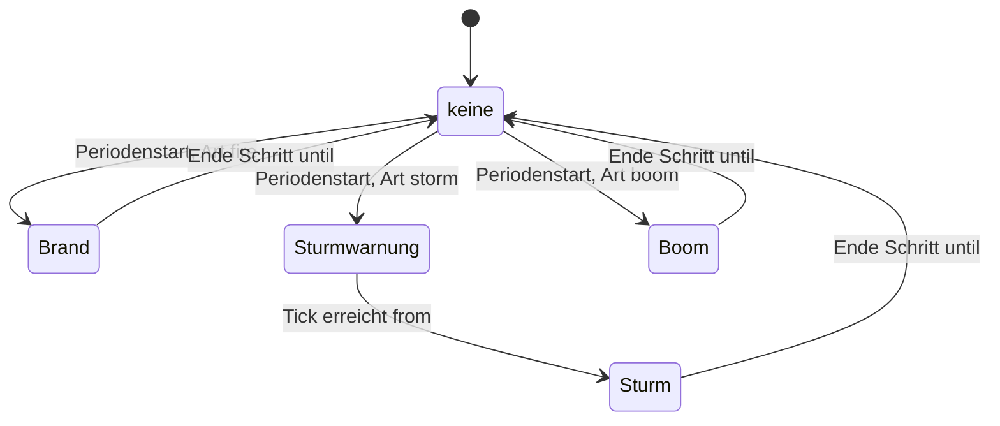
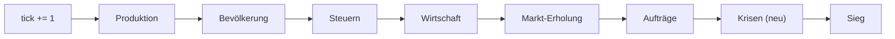

# M6 „Krisen und Stadtdienste" — Design-Spec

Datum: 2026-09-30 · Paket M6-SPEC · Status: **Spec, bereit für Gate Spec** (`lead-tech`: Machbarkeit, Save v3 ·
`lead-qa`: Testbarkeit) · Prozessstufe voll

Grundlage: Ruling R72 (M6 = Krisen und Stadtdienste, Auflage „echte Abwägung"), R73 (Programm Tiefe und
Stimmung, M7 hat Vorrang in `src/render/` und `src/audio/`), R74 (sechs Designentscheide), R78 (desktop-first).
Designvorschlag `lead-design` (Entwurf dieser Datei), verbindliche Werte `design-economy-designer`
(`.studio/handoffs/m6-werte.md`, vollständig übernommen, nicht neu gerechnet), Abstimmung mit `lead-art`
(`.studio/handoffs/2026-09-30-lead-art-lead-design.md`, Bedarfsliste D1–D8, K1–K4). Hauptspec
[2026-09-29-inselreich-design.md](2026-09-29-inselreich-design.md), Stilvorlage und Vorgänger
[M5-Spec](2026-09-30-m5-spielerlebnis-design.md).

Kennzeichnung: **„Setzung Spec"** markiert eine Zahl oder Regel, die weder im Entwurf noch in der Werte-Datei
stand und hier begründet gesetzt wird. **„Änderung"** markiert eine bewusste Abweichung von Hauptspec, arc42
oder ADR (Übersicht in Abschnitt 18). **„Abweichung Entwurf"** markiert eine Stelle, an der diese Spec vom
Entwurf abweicht; die Begründung steht jeweils dabei.

## 1. Ziel

Der Nutzer-Playtest nach M5 wünscht „mehr Tiefe". M6 bringt Krisen, die Schaden anrichten können, und einen
Stadtdienst, der davor schützt. Jede Krise soll eine echte Abwägung erzeugen (Auflage R72).

**Spielerzweck:** Meine Kolonie kann Schaden nehmen. Ich wäge Vorsorge (Feuerwache), Lagerpuffer, Aufträge
und Boom-Verkäufe gegeneinander ab.

**15-Minuten-Kriterium** (15 Minuten = 9000 Ticks bei 1×). Ein neuer Spieler mit der Standardstufe „normal"
erlebt in dieser Zeit:

- die erste Krise bei Tick 2400 (4 Minuten), danach genau eine Krise je Periode von 600 Ticks;
- bis Tick 9000 genau **12 Krisen** (Stufe „mild": 6, Stufe „aus": 0), im Mittel etwa 6 Brände, 3 Stürme,
  3 Booms;
- vor jedem Sturm eine Vorwarnung von 200 Ticks;
- die Feuerwache in der Bauleiste ab Spielbeginn, mit Radiusanzeige.

Prüfbar über AK-S1-09 (Krisenzahl) und den Browser-Check AK-U2-03.

## 2. Scope

### 2.1 Muss und Kann

| Bereich          | Muss                                                                                                                             | Kann                                                       |
| ---------------- | -------------------------------------------------------------------------------------------------------------------------------- | ---------------------------------------------------------- |
| Krisenkern (Sim) | Krisenstufe `off`/`mild`/`normal`, Perioden, Zufall je Periode (ADR-010), `world.crisis`, Save v3 mit Migration (4, 9)           | —                                                          |
| Brand (Sim)      | Zielkachel, Treffer, Instandsetzungsgebühr, Ausfall `burning`, Dienstausfall, Feuerwache (5)                                     | —                                                          |
| Sturm (Sim)      | Vorwarnung, halbe Leistung der sturmanfälligen Betriebe (6)                                                                      | —                                                          |
| Boom (Sim)       | Verkaufspreis × `BOOM_PCT` für ein Gut, Invariantentest (7)                                                                      | —                                                          |
| Abfragen (Sim)   | Krisenansicht, Abdeckung Feuerwache, ungeschützte brennbare Gebäude, Cache-Schlüssel (11)                                        | —                                                          |
| Balancing        | Controller ausgelagert, `off`-Referenz bitgleich, Krisen-Lauf `normal` und `mild` (15)                                           | —                                                          |
| Bedienung (UI)   | Krisenstufe beim „Neu", Feuerwache in Bauleiste mit Hotkey E und Tooltip, Info-Panel, Krisenkarte, Ereignis-Log, Signaltöne (13) | —                                                          |
| Darstellung      | D1, D2, D4, D5, D6, D8 über die M7-Eingänge; Abdeckungs-Umriss der Feuerwache (12)                                               | D3 „Gelöscht"-Effekt; R0 prozeduraler Rückfall (12.4)      |
| Klang            | K1 `alarm`, K2 `stormWarning`, K4 `boom` (12)                                                                                    | K3 Umgebungsklang Sturm; AU0 synthetischer Rückfall (12.4) |

### 2.2 Streichreihenfolge der Kann-Posten

Werden Budget oder Zeit knapp, wird in dieser Reihenfolge gestrichen: **1. K3 Umgebungsklang Sturm → 2. D3
„Gelöscht"-Effekt → 3. Rückfall R0/AU0.** Der Rückfall ist nur relevant, wenn M7 nicht rechtzeitig liegt; über
ihn entscheidet das Gate Plan (12.4). Ein gestrichener Kann-Posten hinterlässt keinen toten Code.

**Abweichung Entwurf:** Das Kann-Paket „mobil" (HUD-Höhe, Info-Panel bei 390 px, 34-px-Tippziele) aus dem
Entwurf entfällt ersatzlos (R78: desktop-first, M6 enthält keine Mobil-Posten).

## 3. Ausdrücklich nicht in M6

- Krankheit und Heilerhaus: Sie rechnen sich identisch zum Brand und wären redundant.
- Feuerausbreitung, brennende Wohnhäuser, Löschen per Klick, Versicherung.
- Terrainänderung durch Krisen.
- Wechsel der Krisenstufe im laufenden Spiel.
- Krisen an Schiffen.
- 4. Stufe und Veredelung (Kandidat **M8**, R73), zweite Insel (Backlog).
- Keine neue Abhängigkeit, keine fremden Assets in M6. Grafik und Klang der Krisen kommen aus M7 (12).
- Mobil-Optimierung (R78: desktop-first).
- Keine Krisen-Statistik und kein Krisen-Log im Spielstand (R74 Entscheid 6).
- Keine Strafe für verpasste Aufträge wegen einer Krise, keine Änderung an Aufträgen, Steuerregler oder
  Verkaufssättigung ausser dem Boom-Aufschlag.

## 4. Regeln: Krisenkern

### 4.1 Krisenstufe

Neues Weltfeld `crisisLevel: CrisisLevel` mit `CrisisLevel = 'off' | 'mild' | 'normal'`.

- Die Stufe wird nur beim neuen Spiel gewählt. Im laufenden Spiel lässt sie sich nicht wechseln (keine
  Sim-Aktion dafür).
- `createWorld(seed, opts?)` setzt standardmässig `off` (`DEFAULT_WORLD_CRISIS_LEVEL`). Damit bleibt der
  Balancing-Test bitgleich (Sieg 6050).
- Die UI startet ein neues Spiel standardmässig mit `normal` (`DEFAULT_NEW_GAME_CRISIS_LEVEL`). Die Wahl steht
  in `inselreich.settings` und gilt für das nächste „Neu" (13.1).
- Migrierte v2-Spielstände erhalten `off` (R74 Entscheid 5).

### 4.2 Perioden und Zufall

Die erste Periode beginnt bei beiden Stufen bei `CRISIS_FIRST_TICK` = 2400. Die Periodenlänge `P` ist
`CRISIS_LEVELS[level].period`: `normal` 600, `mild` 1200, `off` `null` (keine Periode, kein Zufall).

Periode `k` beginnt bei `T_k = 2400 + P × k`. Bei jedem Periodenstart entsteht **genau eine** Krise. Alle
Krisen lösen beim Periodenstart aus. Es laufen nie zwei Krisen gleichzeitig: Die längste Krise (Sturm,
Vorwarnung plus Dauer) endet bei `T + 500`, die kürzeste Periode ist 600.

**Ableitung ohne gespeicherten RNG-Strom** (ADR-010, zweite Konstante): `rollCrisis(seed, k, maxTier, rect)` in
`src/sim/crises.ts`, rein. Die Zug-Reihenfolge ist fest, damit Tests stabil sind:

```
r    = createRng((seed ^ Math.imul(k + 1, CRISIS_SALT)) >>> 0)   // CRISIS_SALT = 0x85ebca6b, neue Instanz je Periode
u    = floor(r() × 100)                                          // ganzzahlig 0…99
kind = u < 50 → 'fire' · u < 75 → 'storm' · sonst 'boom'         // kumulativ über CRISIS_WEIGHTS in der Reihenfolge fire, storm, boom
fire und rect ≠ null: x = rect.x0 + floor(r() × (rect.x1 − rect.x0 + 1))
                      y = rect.y0 + floor(r() × (rect.y1 − rect.y0 + 1))
boom:                 good = pool[floor(r() × pool.length)]
```

- `rect` ist das kleinste Rechteck (Grenzen inklusive), das die Grundflächen aller brennbaren Gebäude enthält
  (angebunden oder nicht). Ohne brennbare Gebäude ist `rect = null`; dann werden keine Koordinaten gezogen.
- `pool` ist der Güterpool der Aufträge: alle Güter mit `order` und `order.tier ≤ maxTier`, in der Reihenfolge
  von `GOOD_IDS` (Stufe 1: Holz, Nahrung; Stufe 2: + Stein, Wolle, Stoff; Stufe 3: + Zuckerrohr, Rum).
- `maxTier` ist die höchste Hausstufe nach `tickPopulation` desselben Ticks (ohne Häuser 1), genau wie bei den
  Aufträgen. `orders.ts` exportiert dafür die bestehende Funktion `maxHouseTier` (heute modulintern).
- Die Aufträge nutzen weiter `0x9e3779b1`. Die beiden Ableitungen sind unabhängig.
- **Setzung Spec:** `u = floor(r() × 100)` mit ganzzahligem Vergleich statt `r() < 0.50`. Das ist gleich
  verteilt und vermeidet Gleitkomma-Grenzfälle; die Gewichte bleiben ganzzahlige Prozent aus `defs/crises.ts`.

### 4.3 Zeitfenster und Lebensdauer einer Krise

Eine Krise der Periode `k` entsteht am Ende des Schritts `T = T_k` (Krisenschritt, 10.1). Sie trägt zwei Ticks:

- `from`: erster Tick, in dem die Wirkung gilt;
- `until`: letzter Tick, in dem die Wirkung gilt.

`world.crisis` besteht für `world.tick` von `T` bis `until − 1` und wird am Ende des Schritts `until` entfernt.
Schritt-Wirkungen (Produktion, Dienste) gelten in den Schritten `from … until`, weil die Produktion und die
Bevölkerung vor dem Krisenschritt laufen. Aktionen zwischen zwei Schritten (Verkauf) sehen die Krise, solange
`world.crisis` besteht.

| Art   | `from`    | `until`   | Wirkung in den Schritten           | `world.crisis` sichtbar bei `world.tick` | Phase `warning` bei `world.tick` |
| ----- | --------- | --------- | ---------------------------------- | ---------------------------------------- | -------------------------------- |
| Brand | `T`       | `T + 200` | Ausfall `T + 1 … T + 200`          | `T … T + 199` (200 Ticks)                | —                                |
| Sturm | `T + 201` | `T + 500` | halbe Leistung `T + 201 … T + 500` | `T … T + 499` (500 Ticks)                | `T … T + 200`                    |
| Boom  | `T`       | `T + 300` | Verkauf zum Boompreis              | `T … T + 299` (300 Ticks)                | —                                |

Die Zahlen 200, 201, 300 und 500 ergeben sich aus `FIRE_OUTAGE`, `STORM_WARNING`, `STORM_DURATION` und
`BOOM_DURATION` (4.4). Der Boom gilt für Verkäufe bei `world.tick = T … T + 299`; das sind die Intervalle vor
den Schritten `T + 1 … T + 300` (Werte-Datei: „Periodenstart + 1 … + 300").

**Setzung Spec:** Auch ein gelöschter oder leerer Brand bleibt 200 Ticks als `world.crisis` stehen. So erkennen
UI und Renderer jede Krise sicher per Frame-Vergleich, auch bei 4× (mehrere Schritte je Frame).



### 4.4 Werte je Zieldatei

Alle Spielwerte liegen in `src/sim/defs/`, nirgends hart im Code.

| Ort                 | Feld (neu)                         | mild                       | normal    | Anmerkung                                                                                               |
| ------------------- | ---------------------------------- | -------------------------- | --------- | ------------------------------------------------------------------------------------------------------- |
| `defs/timing.ts`    | `CRISIS_FIRST_TICK`                | 2400                       | 2400      | erste Periode, 4 min bei 1×                                                                             |
| `defs/crises.ts`    | `CRISIS_LEVELS[level].period`      | 1200                       | 600       | `off`: `period: null`, keine Periode, kein Zufall                                                       |
| `defs/crises.ts`    | `CRISIS_LEVELS[level].name`        | mild                       | normal    | `off`: „aus" (Anzeige)                                                                                  |
| `defs/crises.ts`    | `DEFAULT_WORLD_CRISIS_LEVEL`       |                            |           | `'off'` (Standard von `createWorld`) — **Setzung Spec** (Name)                                          |
| `defs/crises.ts`    | `DEFAULT_NEW_GAME_CRISIS_LEVEL`    |                            |           | `'normal'` (Standard der UI für „Neu") — **Setzung Spec** (Name)                                        |
| `defs/timing.ts`    | `STORM_WARNING` / `STORM_DURATION` | 200 / 300                  | 200 / 300 | Sturm aktiv `T + 201 … T + 500`, endet vor der nächsten Periode                                         |
| `defs/timing.ts`    | `FIRE_OUTAGE`                      | 200                        | 200       | Ticks ausser Betrieb, Zyklusfortschritt → 0; gilt für alle Gebäude (R74 Entscheid 3)                    |
| `defs/timing.ts`    | `BOOM_DURATION`                    | 300                        | 300       | 300 Verkaufs-Ticks ab Periodenstart                                                                     |
| `defs/crises.ts`    | `CRISIS_WEIGHTS`                   | fire 50, storm 25, boom 25 | dito      | ganzzahlige Prozent, Summe 100                                                                          |
| `defs/crises.ts`    | `FIRE_HIT_RADIUS`                  | 2                          | 2         | Kachel → nächstes brennbares Gebäude (Chebyshev zur Grundfläche); Gleichstand: kleinste Gebäude-Id      |
| `defs/crises.ts`    | `BOOM_PCT`                         | 150                        | 150       | ganzzahlig wie `TAX_LEVELS.pct`                                                                         |
| `defs/crises.ts`    | `STORM_TICK_DIVISOR`               | 2                          | 2         | Fortschritt nur bei `tick % 2 === 0` (halbe Leistung) — **Setzung Spec** (die 2 als Wert statt im Code) |
| `defs/crises.ts`    | `CRISIS_SALT`                      | 0x85ebca6b                 | dito      | Seed `(seed ^ Math.imul(k + 1, CRISIS_SALT)) >>> 0`                                                     |
| `defs/buildings.ts` | `firestation`                      |                            |           | 5.5                                                                                                     |
| `defs/buildings.ts` | `flammable: true`                  |                            |           | fisher, lumberjack, quarry, sheepfarm, weaver, canefarm, distillery, toolmaker, chapel, school          |
| `defs/buildings.ts` | `stormAffected: true`              |                            |           | fisher, lumberjack, sheepfarm, canefarm (Steinbruch nicht; R74 Entscheid 4)                             |
| `defs/buildings.ts` | `fireProtection: true`             |                            |           | nur `firestation` — **Setzung Spec** (5.5)                                                              |

**Invariante** (Test AK-S1-10): Die längste Krise ist kürzer als die kürzeste Periode:
`STORM_WARNING + STORM_DURATION < min(period)`, ebenso `FIRE_OUTAGE` und `BOOM_DURATION`.

## 5. Regeln: Brand und Feuerwache

### 5.1 Brennbar

Gesteuert über das Flag `flammable` in `defs/buildings.ts`. Brennbar sind alle Produktionsbetriebe (Fischer,
Holzfäller, Steinbruch, Schäferei, Weberei, Zuckerrohrplantage, Brennerei, Werkzeugmacher), die Kapelle und die
Schule. Nicht brennbar sind Kontor, Markt, Wege, Wohnhäuser und die Feuerwache.

### 5.2 Ziel

1. Gezogen wird eine Zielkachel im Rechteck `rect` (4.2).
2. Getroffen wird das nächste brennbare Gebäude, dessen Grundfläche höchstens `FIRE_HIT_RADIUS` = 2 von der
   Kachel entfernt ist. Abstand = Chebyshev-Abstand von der Kachel zur Grundfläche:
   `dx = max(bx − tx, 0, tx − (bx + w − 1))`, `dy` entsprechend, `d = max(dx, dy)`. Die Kachel auf der
   Grundfläche hat `d = 0`.
3. Gleichstand: kleinste Gebäude-Id.
4. Liegt kein brennbares Gebäude im Radius, entsteht kein Schaden (`outcome: 'miss'`).
5. Ist `rect = null` (keine brennbaren Gebäude), entsteht kein Schaden (`outcome: 'miss'`, ohne `tile`).

Die Kachelziehung verhindert, dass sich ein Brand mit Ködergebäuden umlenken lässt: Ein zusätzliches Gebäude
vergrössert höchstens das Rechteck, es zieht den Brand nicht an. Trefferquote in der Controller-Kolonie
≈ 0.8 (Schätzung der Werte-Datei, gemessen in B2).

### 5.3 Geschützt

Ein Gebäude ist geschützt (`isProtected(world, b)`), wenn eine **angebundene** Feuerwache existiert, deren Mitte
höchstens `serviceRadius` = 8 von der Mitte des Gebäudes entfernt ist (euklidisch, Mitte zu Mitte, wie bei
Kapelle und Schule). Trifft der Brand ein geschütztes Gebäude, wird er gelöscht:

- `outcome: 'extinguished'`, `target` = Id des Gebäudes;
- kein Geld, kein Ausfall, kein Zustandswechsel;
- Ereignis-Log „Brand gelöscht" (13.4).

### 5.4 Ungeschützt

Trifft der Brand ein ungeschütztes Gebäude (`outcome: 'burning'`), geschieht im Krisenschritt von `T`:

1. Die **Instandsetzungsgebühr** `BUILDING_DEFS[defId].cost.money` wird sofort abgebucht, auch wenn das Geld
   dadurch negativ wird. So bringt ein Abriss während des Brands keinen Vorteil, und Pleite ist kein Brandschutz.
2. `progress = 0`. Ein bei Zyklusbeginn schon entnommener Input ist verloren.
3. `state = 'burning'`, `outageUntil = T + FIRE_OUTAGE` (= `T + 200`).

Während des Ausfalls (Schritte `T + 1 … T + 200`):

- Die Produktion überspringt das Gebäude vollständig (kein Input, kein Fortschritt, kein Output).
- Ein Dienstgebäude (Kapelle, Schule) liefert keinen Dienst: `serviceAvailable` zählt es nicht. Häuser im Radius
  sind unzufrieden (halbe Steuer), `satisfiedSince` wartender Häuser wird wie heute zurückgesetzt. Häuser
  steigen dadurch **nicht ab**; sie schrumpfen nach der bestehenden Wachstumsregel.
- Der Unterhalt läuft weiter (**Setzung Spec**: Unterhalt ist an den Bestand gebunden, nicht an den Betrieb; so
  wie im Leerlauf).
- Die Anbindung wird weiter berechnet (`connected`), der Zustand bleibt aber `burning` (Vorrang vor
  `notConnected`).

Am Ende des Schritts `outageUntil` endet der Ausfall: `outageUntil` wird entfernt, `state` wird
`connected ? 'ok' : 'notConnected'`. Ab Schritt `T + 201` arbeitet das Gebäude wieder normal.

**Abriss während des Ausfalls:** erlaubt, 50 % Rückerstattung wie immer. Die Gebühr ist schon gezahlt: netto
−50 % und das Gebäude ist weg. Die laufende Brand-Krise bleibt bis `until` stehen; ihr `target` zeigt dann auf
ein nicht mehr vorhandenes Gebäude (UI und Renderer prüfen das).

### 5.5 Feuerwache

Neuer Eintrag `firestation` in `defs/buildings.ts`, `BuildingDefId` um `'firestation'` erweitert.

| Feld             | Wert                                      |
| ---------------- | ----------------------------------------- |
| `name`           | Feuerwache                                |
| `w × h`          | 1 × 1                                     |
| `cost`           | `cost(150, 10, 2, 0)` (zum Kaufpreis 330) |
| `upkeep`         | 10                                        |
| `category`       | `public`                                  |
| `serviceRadius`  | 8                                         |
| `fireProtection` | `true` (**Setzung Spec**)                 |
| `site`           | `[]`                                      |
| `flammable`      | nicht gesetzt (nicht brennbar)            |

- Die Feuerwache muss angebunden sein (Weg zum Kontor), sonst schützt sie nicht. Sie hat keinen `service`: Sie
  ist kein Bedarf der Häuser und erscheint nicht in `houseDiagnosis`.
- **Setzung Spec** `fireProtection`: Der Code erkennt schützende Gebäude am Flag, nicht an der Id
  (`defId === 'firestation'`). Der Radius bleibt `serviceRadius` wie in der Werte-Datei; so zeigen
  `placementZone` und die Bauleiste den Radius ohne Sonderfall.
- **Anbindungszustand:** `recomputeConnectivity` setzt heute `notConnected` nur für Gebäude mit `produces`,
  `service` oder `supplyRadius`. Neu zählt auch `serviceRadius` dazu; die Feuerwache zeigt damit
  `notConnected` wie Kapelle und Schule (für Kapelle und Schule ändert sich nichts).
- Hotkey **E** (heute frei, 13.2). Radiusanzeige wie bei Kapelle und Schule (13.2, R2).
- Abriss: 50 % zurück (75 / 5 / 1 / 0).

## 6. Regeln: Sturm

- Der Sturm wird beim Periodenstart `T` angekündigt (Phase `warning`, Vorwarnkarte, Klang K2).
- Er wirkt in den Schritten `from = T + STORM_WARNING + 1` bis `until = T + STORM_WARNING + STORM_DURATION`,
  also `T + 201 … T + 500` (300 Schritte).
- Betroffen sind alle Betriebe mit `stormAffected`: Fischer, Holzfäller, Schäferei, Zuckerrohrplantage
  (R74 Entscheid 4; Steinbruch, Verarbeiter und Werkzeugmacher nicht).
- In diesen Schritten erhöht ein betroffener, angebundener, nicht brennender Betrieb `progress` nur bei
  `tick % STORM_TICK_DIVISOR === 0`. Bei ungeradem Tick passiert nichts; der Zustand bleibt, wie er ist.
- `T` ist immer gerade (2400 + 600·k bzw. 1200·k). Die 300 Sturmschritte enthalten genau 150 gerade Ticks:
  halbe Leistung, ganzzahlig.
- Betroffene Betriebe haben keinen Input. Der Fortschritt zu Sturmbeginn bleibt erhalten.
- Brand während Sturm ist unmöglich (eine Krise je Periode, 4.2).

## 7. Regeln: Boom

- Das Gut kommt aus dem Auftragspool nach Höchststufe (4.2).
- Während `world.crisis` ein Boom auf dieses Gut ist, rechnet `sellPrice(world, good, n)`:

```
m   = (crisis.kind === 'boom' && crisis.good === good) ? BOOM_PCT : 100
acc = 0; pct = world.sellPct[good]
wiederhole n-mal: acc += GOODS[good].sell × pct × m; pct = max(SELL_FLOOR, pct − SELL_DROP)
Ergebnis = floor(acc / 10000)
```

- Ohne Boom ist `m = 100` und das Ergebnis bitgleich zu heute (`floor(Σ sell × pct / 100)`), weil alle Grössen
  ganzzahlig sind.
- Die Sättigung wirkt weiter: `sell` senkt `sellPct` wie heute, die Erholung bleibt unverändert. Kaufpreise,
  Aufträge und ihre Prämien ändern sich nicht.
- **Abweichung Entwurf:** `BOOM_PCT` 150 (ganzzahlig) statt `BOOM_FACTOR` 1.5, damit „kein Boom" bitgleich
  rechnet (Werte-Datei).

**Invariante** (Eigenschaftstest über alle Güter, AK-S3-05):
`sell × BOOM_PCT / 100 < floor(buy × ORDER_PREMIUM) < buy`. Grösster Wert Rum 27 < 30 < 40; Stoff 18 < 22 < 30;
Stein 9 < 11 < 15; Wolle und Zuckerrohr 7.5 < 9 < 12; Holz 6 < 7 < 10; Nahrung 4.5 < 6 < 8; Werkzeug
22.5 < 30 < 40. Folge: Kaufen und im Boom verkaufen ist immer ein Verlust, und ein Auftrag schlägt den Boom je
Einheit immer. **Abweichung Entwurf:** schärfer als `BOOM_FACTOR × sell < buy`.

## 8. Abwägung je Krise (Auflage R72)

Die Tabellen stammen aus der Werte-Datei (§2–§5) und sind der Nachweis, dass jede Krise eine echte Wahl
erzeugt. Rechnung je Einwohner (EW) wie in der Balancing-Kurz-Spec: Kettenunterhalt je EW und 100 Ticks
Pionier 1.0 · Siedler 3.5 · Bürger 6.5, netto +1.0 / +3.5 / +7.5. Werte mit „≈" sind Schätzungen und werden in
B2 gemessen.

### 8.1 Brand — Feuerwache ja oder nein

Schaden je Treffer `D = cost.money + Ausfall`. Ausfall 200 Ticks zum Verkaufswert (Puffer vorhanden): Fischer
5 × 3 = 15, Holzfäller 6 × 4 = 24, Schäferei/Weberei 4 Stoff × 12 = 48, Zuckerrohr/Brennerei 4 Rum × 18 = 72.
Dienst: Die Häuser im Radius sind unzufrieden (halbe Steuer), Siedler-Stadium 32 × 7 × 0.5 × 2 = 224, Bürger
60 × 14 × 0.5 × 2 = 840. Trefferquote h ≈ 0.8.

Erwarteter Schaden `E = 100 ÷ Abstand × h × D̄` je 100 Ticks. Brand-Abstand normal 600 ÷ 0.5 = **1200**, mild
**2400**. Die Wache (Unterhalt 10) lohnt ab `E > 10`, also ab D̄ = 10 × 1200 ÷ 80 = **150** (normal) bzw.
**300** (mild).

| Stadium (Controller-Kolonie)                                                         | Gebäude und ΣD                     | D̄       | E normal | E mild | 1 Wache (10)                           | 2 Wachen (20)       |
| ------------------------------------------------------------------------------------ | ---------------------------------- | ------- | -------- | ------ | -------------------------------------- | ------------------- |
| früh: 2 Holzfäller, 2 Fischer                                                        | 2 × 74 + 2 × 115 = 378             | **95**  | 6.3      | 3.2    | nein (−3.7 / −6.8)                     | nein                |
| Stoffkette: + 7 Fischer, 4 Stoff-Paare, Kapelle (18)                                 | 148 + 805 + 792 + 992 + 524 = 3261 | **181** | 12.1     | 6.0    | normal **ja (+2.1)**, mild nein (−4.0) | nein (−7.9 / −14.0) |
| Endzustand: 12 Fischer, je 6 Stoff-/Rum-Paare, Kapelle, Schule, 2 Holzfäller (40)    | 9848                               | **246** | 16.4     | 8.2    | normal **ja (+6.4)**, mild nein (−1.8) | nein (−3.6 / −11.8) |
| Endzustand, nur Kern-Wache (Kapelle, Schule, nahe Fischer und Farmen, ≈ 60 % von ΣD) | —                                  | —       | 10.0     | 5.0    | normal ±0, mild −5.0                   | —                   |

Endzustand ΣD: Holzfäller 148, Fischer 12 × 115 = 1380, Schäferei 6 × 198 = 1188, Weberei 6 × 248 = 1488,
Zuckerrohr 6 × 222 = 1332, Brennerei 6 × 322 = 1932, Kapelle 300 + 840 = 1140, Schule 400 + 840 = 1240.

**Lesart:** Keine Seite dominiert in allen Stadien. Früh lohnt die Wache nie, ab der Stoffkette bei „normal"
eine. Zwei Wachen lohnen nur bei Risikoscheu. Bei „mild" lohnt sie sich rechnerisch nie; dann bleibt sie eine
Versicherung gegen den Einzelschaden (Schule ≈ 1240). Ohne Puffer wird der Ausfall zum Kaufpreis gerechnet
(Rum 160 statt 72); dann steigt D̄ im Endzustand auf 12 140 ÷ 40 ≈ 300, und die Schwelle rückt früher.

### 8.2 Sturm × Auftrag × Boom (Erwartungswert je Einheit, Horizont 600 Ticks vor einer Ankündigung)

Fehlmenge je Sturm (300 Ticks × 50 % × Bedarf): Endzustand Nahrung 45, Stoff 18, Rum 18, Zukauf
45 × 8 + 18 × 30 + 18 × 40 = **1620**; Siedler (32 EW) Nahrung 24, Stoff 10, Zukauf 492. Ungedeckt ist Leiden
teurer als Zukauf: halbe Steuer und Schrumpfen ≈ 1470, danach Nachwachsen ≈ 590, zusammen ≈ **2060**. Ein Haus
zahlt nur voll, wenn _alle_ Güter da sind; Teilpuffer retten wenig. Bei `money < 0` ist Zukauf gesperrt.

Symbole: s Verkauf, b Kauf, o Auftragsprämie, P = Wahrscheinlichkeit Sturm im Horizont (normal 0.25, mild 0.125),
c = Kapitalkosten (Aufbau ≈ 25 % je 600 Ticks, ausgebaut 0), Pu = P solange Puffer ≤ Fehlmenge, sonst 0.
`jetzt verkaufen = s − Pu·b` · `halten = (1 − Pu)·s·(1 − c)` · `liefern = o − Pu·b` ·
`im Boom verkaufen = 1.5·s − Pu·b`.

| Lage                           | Nahrung (3/8/6)                    | Stoff (12/30/22) | Rum (18/40/30)   | Gewinner                            |
| ------------------------------ | ---------------------------------- | ---------------- | ---------------- | ----------------------------------- |
| normal, Aufbau, kein Angebot   | verk. 1.0 · **halten 1.69**        | 4.5 · **6.75**   | 8.0 · **10.1**   | halten                              |
| normal, ausgebaut (c = 0)      | 1.0 · **2.25**                     | 4.5 · **9.0**    | 8.0 · **13.5**   | halten                              |
| mild, Aufbau, kein Angebot     | **verk. 2.0** · 1.97               | **8.25** · 7.88  | **13.0** · 11.8  | **verkaufen**                       |
| mild, ausgebaut                | 2.0 · **2.63**                     | 8.25 · **10.5**  | 13.0 · **15.75** | halten                              |
| Auftrag offen (normal / mild)  | **liefern 4.0 / 5.0**              | **14.5 / 18.25** | **20 / 25**      | liefern (ganze Menge nötig)         |
| Boom aktiv (normal, ausgebaut) | **Boom 2.5** vs. 2.25              | **10.5** vs. 9.0 | **17** vs. 13.5  | Boom verkaufen, knapp bei Nahrung   |
| Puffer > Fehlmenge (Pu = 0)    | verk. 3 > halten 3(1 − c)          | 12 > …           | 18 > …           | verkaufen oder liefern              |
| Lager 100 (Überlauf verfällt)  | halten = 0                         | 0                | 0                | verkaufen                           |
| **nach Ankündigung** (Pu = 1)  | verk. −5, liefern −2, **halten 0** | −18, −8, **0**   | −22, −10, **0**  | **halten dominiert** (offen gesagt) |

**Lesart:** Vor der Ankündigung entscheidet die Lage. Bei „mild" in der Aufbauphase gewinnt Verkaufen, bei
„normal" Halten. Ein offener Auftrag oder ein Boom schlägt Halten immer. Über die Fehlmenge hinaus lohnt Halten
nie. **Nach der Ankündigung dominiert Halten**, weil `o ≤ 0.8·b`; die Kosten des Haltens sind dann der
verfallende Auftrag. Die 200 Ticks Vorwarnung erlauben nur Verkaufsstopp und Vorab-Kauf zum selben Preis b;
einen Puffer aus eigener Produktion baut man in der Vorwarnung kaum auf. Die Wahl steckt in P (Einstellung) ×
c (Phase) × Angebot. Eine Änderung von Wahrscheinlichkeit, Dauer oder Vorwarnung ist nicht nötig.

### 8.3 Boom — wie viel verkaufen?

Die marginale Einheit bei Verkaufsanteil p bringt `27 · p / 100` (Rum). Verkaufen, solange das mehr bringt als
Halten (normal):

| Lage (Rum, normal)            | Schwelle            | verkaufen bis | Einheiten ab 100 % |
| ----------------------------- | ------------------- | ------------- | ------------------ |
| im Puffer, ausgebaut          | 27p/100 − 10 > 13.5 | p > 87        | **≈ 13**           |
| im Puffer, Aufbau             | 27p/100 − 10 > 10.1 | p > 74        | **≈ 26**           |
| über der Fehlmenge, ausgebaut | 27p/100 > 18        | p > 67        | **≈ 33**           |
| über der Fehlmenge, Aufbau    | 27p/100 > 13.5      | p > 50        | **≈ 50**           |

Ein Lager-Dump (100 Rum) im Boom bringt floor(27 × 54.85) = 1480 statt 987, also +493 einmalig; umgelegt auf den
Boom-Abstand 2400 sind das ≈ +20 je 100 Ticks, gedeckelt durch die Sättigung.

### 8.4 Bilanz je EW und 100 Ticks mit Krisen

Vorgesorgt = Wache laut 8.1 plus Puffer; ungeschützt = keine Wache, Sturm per Zukauf. Sturm-Abstand normal
2400, mild 4800.

| Stufe                 | normal vorgesorgt                    | normal ungeschützt                  | mild vorgesorgt (ohne Wache) | mild ungeschützt                  |
| --------------------- | ------------------------------------ | ----------------------------------- | ---------------------------- | --------------------------------- |
| Pionier (16 EW, früh) | 1.0 − 0.39 = **+0.61** (keine Wache) | 1.0 − 0.39 − 0.25 = **+0.36**       | 1.0 − 0.20 = **+0.80**       | 1.0 − 0.20 − 0.13 = **+0.67**     |
| Siedler (32 EW)       | 3.5 − 10/32 = **+3.19**              | 3.5 − 12.1/32 − 20.5/32 = **+2.48** | 3.5 − 6.0/32 = **+3.31**     | 3.5 − 0.19 − 10.25/32 = **+2.99** |
| Bürger (60 EW)        | 7.5 − 10/60 = **+7.33**              | 7.5 − 16.4/60 − 67.5/60 = **+6.10** | 7.5 − 8.2/60 = **+7.36**     | 7.5 − 0.14 − 33.75/60 = **+6.80** |

Alle Stufen bleiben positiv; eine unvermeidliche Pleite gibt es nicht. Endzustand mit 4 Bürgerhäusern bei
„normal": vorgesorgt 450 − 40 − 10 = **+400**, ungeschützt 410 − 16.4 − 67.5 ≈ **+326** je 100 Ticks. Ein Boom
bringt beiden ≈ +6 je 100 Ticks (nicht eingerechnet).

### 8.5 Krisenhäufigkeit

Sie ist Einstellung (`off`, `mild`, `normal`) und Playtest-Frage zugleich (17.2, P-01 bis P-03).

## 9. Datenmodell und Save v3

### 9.1 Typen (`src/sim/types.ts`)

```ts
export type CrisisLevel = 'off' | 'mild' | 'normal';
export interface CrisisLevelDef {
  name: string; // Anzeige: aus | mild | normal
  period: number | null; // Ticks je Periode; null = keine Krisen
}
export type CrisisKind = 'fire' | 'storm' | 'boom';
export type FireOutcome = 'burning' | 'extinguished' | 'miss';
export interface Crisis {
  period: number; // k
  kind: CrisisKind;
  from: number; // erster Tick mit Wirkung (4.3)
  until: number; // letzter Tick mit Wirkung; am Ende dieses Schritts entfernt
  good?: GoodId; // nur boom
  tile?: { x: number; y: number }; // nur fire; fehlt, wenn kein brennbares Gebäude existierte
  target?: number; // nur fire; Id des getroffenen Gebäudes; fehlt bei 'miss'
  outcome?: FireOutcome; // nur fire
}
export type BuildingState = 'ok' | 'waitingInput' | 'storageFull' | 'notConnected' | 'burning';
export interface Building {
  /* bestehend */ outageUntil?: number; // letzter Ausfall-Tick; nur bei state 'burning'
}
export interface BuildingDef {
  /* bestehend */ flammable?: boolean;
  stormAffected?: boolean;
  fireProtection?: boolean;
}
export interface World {
  version: 3; // war 2
  /* alle bestehenden Felder unverändert */
  crisisLevel: CrisisLevel;
  crisis: Crisis | null;
}
// mit S2: BuildingDefId | 'firestation'
```

`createWorld(seed, opts: { crisisLevel?: CrisisLevel } = {})` setzt `version = 3`,
`crisisLevel = opts.crisisLevel ?? DEFAULT_WORLD_CRISIS_LEVEL`, `crisis = null`. Alle anderen Felder bleiben wie
heute. Heutige Aufrufe `createWorld(seed)` bleiben gültig.

**Abweichung Entwurf und Werte-Datei** (`crisis: { period, kind, good?, from, until }`):

- `target` kommt dazu. Die Zielwahl hängt vom Gebäudestand ab und ist nachträglich nicht ableitbar (Werte-Datei
  §9); UI und Renderer brauchen das Ziel für Log, Karte und D3.
- `outcome` kommt dazu. Nur so unterscheiden UI, Renderer und Klang „brennt", „gelöscht" und „ohne Schaden"
  (K1 nur bei `burning`, D3 nur bei `extinguished`).
- `tile` kommt dazu. Die Determinismus-Prüfung vergleicht Art, Kachel und Gut (Werte-Datei §7); der Renderer
  kann D3 am Ziel zeigen.
- Die Phase (`warning` | `active`) wird **nicht** gespeichert, sondern aus `from` abgeleitet (11); so kann sie
  nie im Widerspruch zu den Ticks stehen.

**Abweichung Entwurf** (Zustand `burning`): `burning` ist ein Anzeige-Zustand; massgeblich für den Ausfall ist
`outageUntil`. Beide werden gemeinsam gesetzt und gemeinsam entfernt (5.4), die Ladeprüfung verlangt beides
zusammen. Grund: `recomputeConnectivity` überschreibt `state` bei Anbindungsänderungen; ein einziger
massgeblicher Wert verhindert, dass ein Weg-Abriss den Brand beendet.

### 9.2 Save v3 (`src/sim/save.ts`)

- `SAVE_VERSION = 3`. `serialize` schreibt immer Version 3.
- `deserialize(json)` wirft weiterhin nie:
  1. JSON parsen, sonst `Ungültiges Format`.
  2. `version === 1` → `migrateV1ToV2(raw)` (unverändert), danach weiter mit Schritt 3.
  3. `version === 2` → `migrateV2ToV3(raw)`: `version = 3`, `crisisLevel = 'off'`, `crisis = null`. Gebäude
     bleiben unberührt (kein `outageUntil`). Vorhandenes bleibt unberührt.
  4. `version !== 3` → `Unbekannte Version`.
  5. Strukturprüfung wie heute plus:
     - `crisisLevel` ist Schlüssel von `CRISIS_LEVELS`.
     - `crisis` ist `null` oder passt zu Stufe und Tick: `period` ganzzahlig ≥ 0; die Stufe hat eine Periode
       `P ≠ null`; `start = CRISIS_FIRST_TICK + period × P ≤ tick < until`; `kind` ist `fire`, `storm` oder
       `boom`; `from` und `until` gleich den Formeln aus 4.3 (Brand `start` / `start + FIRE_OUTAGE`, Sturm
       `start + STORM_WARNING + 1` / `start + STORM_WARNING + STORM_DURATION`, Boom `start` /
       `start + BOOM_DURATION`); Boom: `good` mit `order`-Definition; Brand: `outcome` aus `FireOutcome`,
       `target` ganzzahlig genau dann, wenn `outcome ≠ 'miss'`, `tile` fehlt oder hat ganzzahlige Koordinaten
       in der Karte.
     - Jedes Gebäude: `outageUntil` fehlt oder ist ganzzahlig mit `tick < outageUntil ≤ tick + FIRE_OUTAGE`;
       `state === 'burning'` genau dann, wenn `outageUntil` vorhanden ist.
     - Verstoss → `Beschädigter Spielstand`.
  6. Wie heute `recomputeConnectivity` (lässt `burning` stehen, 10.1).
- Die Krisen-Zeitwerte gehen wie die Auftragstakte in die Prüfung ein; ändern sie sich, braucht es eine
  Migration (wie arc42 §8 Persistenz für Aufträge).
- v1- und v2-Spielstände bleiben ladbar; gespeichert wird danach als v3. Ein v3-Stand ist mit dem M5-Build nicht
  ladbar („Unbekannte Version"), das ist gewollt.
- **Test mit echtem v2-Spielstand:** Fixture `tests/sim/fixtures/save-v2.json`, erzeugt mit dem Code **vor** S1
  (`main` nach M5), Seed 3, einige Gebäude, Tick ≥ 1500 mit aktivem Auftrag und mindestens einem
  `sellPct < 100`, eingecheckt. Der Testkommentar nennt Erzeugungs-Commit und Erzeugungsweg.
  `tests/sim/fixtures/` steht schon in `.prettierignore`.
- Der `localStorage`-Schlüssel des manuellen Speicherplatzes bleibt `inselreich.save.v1` (M5 Setzung).

## 10. Tick-Reihenfolge und Aktionen

### 10.1 Tick-Reihenfolge (Erweiterung ADR-005)

`step(world)`: `world.tick += 1`, dann **Produktion → Bevölkerung → Steuern → Wirtschaft (Unterhalt) →
Markt-Erholung → Aufträge → Krisen (`tickCrises`, neu) → Sieg**.

`tickCrises(world)` in `src/sim/crises.ts` macht in dieser Reihenfolge:

1. **Ausfälle beenden:** Jedes Gebäude mit `outageUntil ≤ tick` verliert `outageUntil`; `state` wird
   `connected ? 'ok' : 'notConnected'`.
2. **Krise beenden:** `crisis !== null && tick ≥ crisis.until` → `crisis = null`.
3. **Periodenstart:** Hat die Stufe eine Periode `P`, gilt `tick ≥ CRISIS_FIRST_TICK` und
   `(tick − CRISIS_FIRST_TICK) % P === 0`, dann ist `k = (tick − CRISIS_FIRST_TICK) / P`,
   `roll = rollCrisis(seed, k, maxHouseTier(world), flammableRect(world))` und `beginCrisis(world, k, roll)`.

`beginCrisis(world, k, roll)` setzt `world.crisis` mit `from`/`until` nach 4.3 und führt beim Brand 5.2 bis 5.4
aus. Die Funktion ist exportiert, damit Szenario-Tests eine Krise gezielt auslösen können, ohne einen Seed zu
suchen.

Warum an dieser Stelle:

- Der Krisenschritt läuft nach Produktion und Bevölkerung. Der Ausfall gilt deshalb in den Schritten
  `T + 1 … T + 200` (Werte-Datei „Ausfall T + 1 … T + 200"), und ein Schritt `T` produziert noch normal.
- Die Höchststufe für den Boom-Pool stammt wie bei den Aufträgen aus dem Zustand nach `tickPopulation`
  desselben Ticks.
- Die Gebühr wird nach der Buchung des Ticks abgezogen; Steuer und Unterhalt bleiben Tick für Tick identisch.
- Bei `off` verändert `tickCrises` nichts: keine Periode, kein `createRng`, keine Ausfälle (es gibt keine).
  Der Balancing-Lauf bleibt bitgleich.

**Wirkung in anderen Systemen:**

| System                                   | Regel                                                                                                                                                                                                                                                                                                           |
| ---------------------------------------- | --------------------------------------------------------------------------------------------------------------------------------------------------------------------------------------------------------------------------------------------------------------------------------------------------------------- |
| `tickProduction` (`production.ts`)       | Reihenfolge je Betrieb: (1) `outageUntil` gesetzt → `state = 'burning'`, weiter zum nächsten; (2) nicht angebunden → `notConnected` wie heute; (3) `stormAffected`, Sturm wirkt (`crisis.kind === 'storm' && tick ≥ crisis.from`) und `tick % STORM_TICK_DIVISOR !== 0` → nichts, weiter; (4) Rest unverändert. |
| `serviceAvailable` (`population.ts`)     | Ein Dienstgebäude mit `outageUntil` zählt nicht (zusätzlich zu `connected` und Radius).                                                                                                                                                                                                                         |
| `recomputeConnectivity` (`roads.ts`)     | `connected` wird für alle Gebäude berechnet. Bei gesetztem `outageUntil` bleibt `state = 'burning'`. Gebäude mit `serviceRadius` zählen zu den anbindungsabhängigen (Feuerwache).                                                                                                                               |
| `sellPrice` (`trade.ts`)                 | Boom-Aufschlag nach 7; `sell` bucht genau diesen Betrag.                                                                                                                                                                                                                                                        |
| `tickEconomy`, `tickTaxes`, `tickOrders` | unverändert. Der Unterhalt brennender Gebäude läuft weiter.                                                                                                                                                                                                                                                     |



**Taktform:** Der Krisentakt ist wie der Auftragstakt ein Takt mit Versatz (`tick ≥ 2400 && (tick − 2400) % P === 0`),
**Änderung** zur Konvention `tick % INTERVAL === 0` in ADR-005; der Nachtrag ist Pflicht-Deliverable von S1.

### 10.2 Sim-Aktionen und -Funktionen

Es gibt **keine neue Spieleraktion** in der Sim. Die Krisenstufe wird nur über `createWorld` gesetzt; die
Feuerwache wird mit dem bestehenden `placeBuilding` gebaut und mit `demolish` abgerissen.

| Funktion                               | Modul               | Art                                                                                          |
| -------------------------------------- | ------------------- | -------------------------------------------------------------------------------------------- |
| `createWorld(seed, opts?)`             | `src/sim/world.ts`  | erweitert um `crisisLevel`                                                                   |
| `rollCrisis(seed, k, maxTier, rect)`   | `src/sim/crises.ts` | rein; `{ kind, tile?, good? }`                                                               |
| `flammableRect(world)`                 | `src/sim/crises.ts` | rein; `{ x0, y0, x1, y1 } \| null`                                                           |
| `fireTarget(world, tile)`              | `src/sim/crises.ts` | rein; `Building \| null` (5.2)                                                               |
| `isProtected(world, b)`                | `src/sim/crises.ts` | rein; boolean (5.3)                                                                          |
| `beginCrisis(world, k, roll)`          | `src/sim/crises.ts` | verändert die Welt (Krise setzen, Brandfolgen)                                               |
| `tickCrises(world)`                    | `src/sim/crises.ts` | Krisenschritt (10.1)                                                                         |
| `nextCrisisTick(world)`                | `src/sim/crises.ts` | rein; Tick des nächsten Periodenstarts strikt nach `tick` (vor 2400: 2400), `null` bei `off` |
| `maxHouseTier(world)`                  | `src/sim/orders.ts` | bestehend, neu exportiert                                                                    |
| `sell(world, good, n)`, `sellPrice(…)` | `src/sim/trade.ts`  | Signatur unverändert, Boom nach 7                                                            |

## 11. Sim-Abfragen für UI, Renderer und Klang (Paket S4)

Reine Funktionen in `src/sim/queries.ts`, DOM-frei, ohne Seiteneffekt.

| Funktion                                    | Liefert                                                                                                                                                                                                                                                                                                                                                 |
| ------------------------------------------- | ------------------------------------------------------------------------------------------------------------------------------------------------------------------------------------------------------------------------------------------------------------------------------------------------------------------------------------------------------- |
| `crisisView(world)`                         | `{ phase: 'none'; next: number \| null }` ohne Krise (`next` = `nextCrisisTick`), sonst `{ phase: 'warning' \| 'active'; kind; period; remaining; good?; target?; outcome?; tile? }`. `phase = tick < from ? 'warning' : 'active'`; `remaining = from − tick` in `warning`, `until − tick` in `active`. Eine Quelle für Karte, Log, Renderer und Klang. |
| `coverageMask(world, 'fire')`               | `CoverageKind` wird `'supply' \| ServiceId \| 'fire'`. Wahr, wenn die Mitte der Kachel (`x + 0.5`, `y + 0.5`) höchstens `serviceRadius` von der Mitte einer angebundenen Feuerwache entfernt ist (für 1×1-Gebäude gleich `isProtected`; für 2×2-Gebäude zählt deren Mitte, der Umriss ist eine Näherung wie bei den Diensten).                          |
| `coverageMask(world, 'faith' \| 'school')`  | wie heute, aber ohne Dienstgebäude mit `outageUntil`, damit Maske und `serviceAvailable` auch während eines Brands übereinstimmen.                                                                                                                                                                                                                      |
| `unprotectedFlammables(world)`              | `Building[]`: alle brennbaren Gebäude mit `isProtected === false`, aufsteigend nach Id. Für Tooltip und Info-Panel.                                                                                                                                                                                                                                     |
| `layoutKey(world)`                          | wie heute plus `\|` Σ Ids der Gebäude mit `outageUntil`. Ändert sich bei Brandbeginn und Ausfallende, damit der Abdeckungs-Cache (A3) nicht veraltet.                                                                                                                                                                                                   |
| `placementZone(world, 'firestation', x, y)` | ohne Codeänderung: Kreis mit Radius 8 (`serviceRadius`), `tiles` alle Kacheln darin.                                                                                                                                                                                                                                                                    |

`goodsBalance` bleibt nominal (unabhängig vom Zustand, wie in M5 festgelegt); ein Brand oder Sturm ändert die
Bilanzanzeige nicht (**Setzung Spec**: die Bilanz zeigt die Dauerleistung, die Krise zeigt die Karte).

## 12. Schnittstelle zu M7 „Stimmung" (Darstellung und Klang)

### 12.1 Grundsatz

- M6 legt fest, **was** die Sim bereitstellt (Zustände, Zeitfenster, Abfragen). M7 legt fest, **wie** es
  aussieht und klingt (Art Direction von `lead-art`). Diese Spec schreibt **keine eigene Grafik und keinen
  eigenen Klang** fest (R74).
- Render- und Audio-Pakete von M6 (R1, AU1) starten erst, wenn die M7-Spec das Gate Spec bestanden hat. Bei
  Konflikten in `src/render/` und `src/audio/` hat M7 Vorrang (R73).
- Sim- und UI-Pakete von M6 laufen parallel zu M7.
- Die UI-Elemente von M6 (Krisenstufe, Krisenkarte, Ereignis-Log) fügen sich in das Desktop-HUD von M7 ein; die
  Anmutung (D7) kommt aus M7, der Inhalt aus M6. Das Ereignis-Log ist einklappbar.

### 12.2 Bedarfsliste mit Sim-Auslöser und Dauer

| Nr. | Darstellung                                  | Sim-Auslöser (M6)                                                    | Dauer                               | Paket | Muss/Kann                         |
| --- | -------------------------------------------- | -------------------------------------------------------------------- | ----------------------------------- | ----- | --------------------------------- |
| D1  | Feuer am Gebäude                             | `b.state === 'burning'` (gleichwertig `outageUntil` gesetzt)         | 200 Ticks (`FIRE_OUTAGE`)           | R1    | Muss                              |
| D2  | Rauch über dem Gebäude                       | wie D1; Nachlauf 50–100 Ticks nach Ausfallende, im Renderer gemerkt  | 200 Ticks + Nachlauf                | R1    | Muss                              |
| D3  | „Gelöscht"-Effekt am Ziel                    | `crisisView`: `kind 'fire'`, `outcome 'extinguished'`, Ziel `target` | einmalig, kurz (Dauer legt M7 fest) | R1    | Kann                              |
| D4  | Sturm-Vorwarnung (Himmel, Wolken, Tönung)    | `crisisView`: `kind 'storm'`, `phase 'warning'`                      | 200 Ticks (201 Anzeige-Ticks, 4.3)  | R1    | Muss                              |
| D5  | Sturm aktiv (Regen, Wind, stärkere Wellen)   | `crisisView`: `kind 'storm'`, `phase 'active'`                       | 300 Ticks                           | R1    | Muss                              |
| D6  | Boom-Markierung am Kontor                    | `crisisView`: `kind 'boom'`                                          | 300 Ticks                           | R1    | Muss                              |
| D7  | Anmutung von Krisenkarte und Ereignis-Log    | jede Krise (Inhalt aus 13.3, 13.4)                                   | —                                   | M7    | Muss (Stil aus M7)                |
| D8  | Gebäudegrafik Feuerwache (1 × 1, öffentlich) | Gebäude `firestation`                                                | —                                   | R1    | Muss                              |
| K1  | Signalton `alarm`                            | neue Krisenperiode mit `kind 'fire'` und `outcome 'burning'`         | einmalig                            | AU1   | Muss                              |
| K2  | Signalton `stormWarning`                     | neue Krisenperiode mit `kind 'storm'`                                | einmalig                            | AU1   | Muss                              |
| K3  | Umgebungsklang Sturm (Regen, Wind)           | `kind 'storm'`, `phase 'active'`                                     | 300 Ticks, Schleife                 | AU1   | Kann (hängt am M7-Umgebungsklang) |
| K4  | Signalton `boom`                             | neue Krisenperiode mit `kind 'boom'`                                 | einmalig                            | AU1   | Muss                              |

Bis R1 steht, ist die Feuerwache über die bestehende Rückfall-Silhouette der Kategorie sichtbar
(`SILHOUETTES` ist `Partial`), und ein brennender Betrieb zeigt keine Arbeitsanimation (sie verlangt
`state === 'ok'`).

### 12.3 Eingänge aus M7 (aus dem M7-Vorschlag, Bestätigung `lead-art` offen, Punkt 20.6)

- **Wetter:** M7 bietet den Render-Eingang Wetterzustand `clear | cloudy | rain | storm` mit Stärke 0…1 und
  einen Weg, ihn zu erzwingen (Vorrang vor dem Stimmungswetter). R1 bildet `crisisView` darauf ab:
  - `phase 'warning'` → `cloudy`, Stärke steigt linear von 0 auf 1 über die Vorwarnung
    (`1 − remaining / (STORM_WARNING + 1)`), **Vorschlag**, M7 darf die Kurve ändern;
  - `phase 'active'` → `storm`, Stärke 1;
  - sonst kein Zwang.
- **Lesbarkeitsregel:** Stimmungswetter aus M7 darf nie wie ein Sim-Sturm aussehen. `rain` und `storm`
  erscheinen nur, solange ein Sim-Sturm besteht (Vorwarnung oder aktiv); das Stimmungswetter nutzt nur `clear`
  und `cloudy`. **Vorschlag** zur Unterscheidung der Vorwarnung: Stimmungs-`cloudy` bleibt unter Stärke 0.5,
  die Vorwarnung erreicht 1. Die Grenze legt die M7-Spec fest.
- **Signaltöne:** Die Namen `alarm`, `stormWarning`, `boom` kommen als `SoundEvent` in `src/audio/sound.ts`
  (AU1). Sie laufen über den bestehenden Klang-Ereignis-Weg (M5 9.4, Frame-Vergleich in der UI, U3).
- **Partikelbudget** für D1, D2, D5 legt M7 fest. Es brennt höchstens ein Gebäude zugleich, Brand und Sturm
  überlappen nie; ein Budget für „1 Brand oder Sturm-Regen" genügt. Frame-Budget nach R78: 1920 × 1080, ganze
  Insel, Sturm aktiv, ≥ 30 fps Untergrenze.

### 12.4 Rückfall, falls M7 nicht rechtzeitig liegt (Kann)

Prozedurale Minimaldarstellung im M5-Stil als Kann-Pakete **R0** (Flammen-Dreiecke, grauer Rauch, Blautönung
bei Sturm, Münzsymbol am Kontor) und **AU0** (synthetische Signaltöne `alarm`, `stormWarning`, `boom` im
M5-Stil). R0/AU0 und R1/AU1 schliessen sich aus. Den Entscheid trifft das Gate Plan.

## 13. Bedienung

Zielplattform ist Desktop (R78): Maus, Tastatur, Fensterbreite ab 1280 px. Alle Texte und Zahlen kommen aus
`src/sim/defs/` bzw. den Sim-Abfragen. Die mit **Setzung Spec** markierten Texte sind Vorgaben; der Wortlaut
darf in M7 (D7) angepasst werden, der Inhalt nicht.

### 13.1 Krisenstufe beim „Neu" (U1)

- `inselreich.settings` bekommt das Feld `crisisLevel` (`'off' | 'mild' | 'normal'`). Fehlt es oder ist es
  ungültig, gilt `DEFAULT_NEW_GAME_CRISIS_LEVEL` (`normal`). Die übrigen Felder bleiben, wie sie sind.
- Im HUD-Bereich „Spiel" (neben „Neu") steht eine Auswahl „Krisen: aus · mild · normal" mit dem Hinweis
  „gilt ab ‚Neu'" (**Setzung Spec**). Eine Änderung speichert nur die Einstellung und zeigt die Meldung
  „Krisenstufe gilt ab dem nächsten Spiel".
- „Neu" ruft `createWorld(seed, { crisisLevel: settings.crisisLevel })`. „Laden" übernimmt die Stufe des
  Spielstands, nicht die Einstellung.
- Die Stufe des laufenden Spiels steht auf der Krisenkarte (13.3).

### 13.2 Feuerwache in Bauleiste, Hotkey, Tooltip, Info-Panel (U1)

- Die Feuerwache erscheint automatisch in der Kategorie „Öffentlich" (Bauleiste filtert nach Kategorie).
- Hotkey **E** in `TOOL_HOTKEYS` (heute frei).
- Tooltip der Feuerwache: bestehende Zeilen (Name und Taste, Kosten, Unterhalt, Radius) plus „Schützt brennbare
  Gebäude im Radius 8 vor Brand (muss angebunden sein)" und „Ungeschützt: N brennbare Gebäude"
  (`unprotectedFlammables`) (**Setzung Spec**).
- Tooltip jedes brennbaren Gebäudes: Zeile „Brennbar"; bei `stormAffected` zusätzlich „sturmanfällig
  (halbe Leistung im Sturm)" (**Setzung Spec**).
- Radiusanzeige beim Platzieren: Kreis mit Radius 8 um die Vorschau (kommt ohne Render-Änderung aus
  `placementZone`); der Umriss der schon geschützten Fläche kommt mit R2 (`coverageMask(world, 'fire')`).
- Info-Panel:
  - brennendes Gebäude (Betrieb oder Dienst): „Brennt — wieder in Betrieb in N Ticks" (`outageUntil − tick`),
    als Warnung;
  - brennbares Gebäude: Zeile „Brandschutz: ja" bzw. „Brandschutz: nein" (`isProtected`);
  - Feuerwache: „Schützt N brennbare Gebäude".
- **Ownership-Ausnahme S1** (14): S1 ergänzt in `src/ui/inspect.ts` genau den `case 'burning'` im
  `switch (b.state)` (Text „Brennt"), weil der Build sonst bricht. U1 ersetzt den Text durch die Fassung oben.

### 13.3 Krisenkarte (U2)

Eine Karte im HUD neben der Auftragskarte, gespeist aus `crisisView` (**Setzung Spec** für die Texte):

| Lage                  | Text                                                                                                            | Hervorhebung |
| --------------------- | --------------------------------------------------------------------------------------------------------------- | ------------ |
| Stufe `off`           | „Krisen: aus"                                                                                                   | —            |
| keine Krise           | „Krisen: {Stufe} · nächste Krise in N Ticks"                                                                    | —            |
| Brand, `burning`      | „Brand: {Gebäude} · Ausfall noch N Ticks · Instandsetzung {Gebühr}"                                             | Warnung      |
| Brand, `extinguished` | „Brand gelöscht: {Gebäude} (Feuerwache)"                                                                        | —            |
| Brand, `miss`         | „Brand ohne Schaden"                                                                                            | —            |
| Sturm, `warning`      | „Sturmwarnung: Sturm in N Ticks, dauert 300 Ticks · halbe Leistung: Fischer, Holzfäller, Schäferei, Zuckerrohr" | Warnung      |
| Sturm, `active`       | „Sturm: noch N Ticks · Rohstoffbetriebe halbe Leistung"                                                         | Warnung      |
| Boom                  | „Boom: {Gut} +50 % Verkaufspreis · noch N Ticks"                                                                | Hinweis      |

Die Liste der sturmanfälligen Betriebe und die +50 % kommen aus `defs` (`stormAffected`, `BOOM_PCT − 100`).
Ist das Ziel eines Brands abgerissen, steht statt des Namens „abgerissenes Gebäude".

Im Handel trägt das Boom-Gut die Marke „Boom +50 %"; die Verkaufsknöpfe zeigen wie in M5 den genauen Erlös aus
`sellPrice` (inklusive Boom).

### 13.4 Ereignis-Log (U2)

- Die UI führt ein Log der letzten **10** Einträge, neuester oben, jeweils „Tick {t} · {Text}". Es gehört nicht
  zum Spielstand (R74 Entscheid 6), ist nach „Neu" und „Laden" leer und ist einklappbar (Standard: offen).
- Die Einträge entstehen durch Frame-Vergleich zweier `crisisView`-Stände und der Ausfälle
  (reine Funktion in `src/ui/crisisLog.ts`, testbar ohne DOM). Nach „Laden" gilt der geladene Stand als
  Vergleichsbasis; eine laufende Krise erzeugt keinen Eintrag (die Karte zeigt sie).

| Anlass                                 | Eintrag (**Setzung Spec**)                                             | Meldung (Toast) |
| -------------------------------------- | ---------------------------------------------------------------------- | --------------- |
| neue Periode, Brand `burning`          | „Brand: {Gebäude} brennt — Instandsetzung {Gebühr}, 200 Ticks Ausfall" | ja, Warnung     |
| neue Periode, Brand `extinguished`     | „Brand gelöscht: {Gebäude} (Feuerwache)"                               | ja, Info        |
| neue Periode, Brand `miss`             | „Brand ohne Schaden"                                                   | nein            |
| Ausfall endet (Gebäude existiert noch) | „{Gebäude} wieder in Betrieb"                                          | nein            |
| neue Periode, Sturm                    | „Sturmwarnung: Sturm in 201 Ticks"                                     | ja, Warnung     |
| Sturm wechselt auf `active`            | „Sturm hat begonnen"                                                   | nein            |
| Sturm endet                            | „Sturm vorüber"                                                        | nein            |
| neue Periode, Boom                     | „Boom: {Gut} +50 % für 300 Ticks"                                      | ja, Info        |
| Boom endet                             | „Boom vorbei"                                                          | nein            |

### 13.5 Signaltöne (U3)

`diffSoundEvents` in `src/ui/soundEvents.ts` vergleicht zusätzlich die Krisenperiode und Art: neue Periode mit
Brand `burning` → `alarm`; neue Periode mit Sturm → `stormWarning`; neue Periode mit Boom → `boom`. Gelöschte und
leere Brände haben keinen Signalton. Nach „Laden" gibt es keinen Ton für die laufende Krise.

### 13.6 Schmale Fenster

Unter 1280 px gilt nur: kein Absturz, keine Konsolenfehler, nichts Wesentliches unerreichbar (R78). Keine
Mobil-Optimierung.

## 14. Schnittstellen zwischen den Strängen

| Von → nach              | Schnittstelle                                                                                                                                                                                                                      |
| ----------------------- | ---------------------------------------------------------------------------------------------------------------------------------------------------------------------------------------------------------------------------------- |
| Sim → UI, Render, Audio | Weltfelder `crisisLevel`, `crisis`, `Building.outageUntil`, `state 'burning'` (9.1); `createWorld(seed, opts)`; `isProtected`, `nextCrisisTick` (10.2); Abfragen aus 11; Defs-Flags `flammable`, `stormAffected`, `fireProtection` |
| UI → Einstellungen      | `Settings.crisisLevel` in `src/ui/settings.ts` (13.1)                                                                                                                                                                              |
| UI → Audio              | neue `SoundEvent`-Namen `alarm`, `stormWarning`, `boom` (AU1), ausgelöst über `diffSoundEvents` (U3)                                                                                                                               |
| Render → M7             | Wetter-Eingang `clear \| cloudy \| rain \| storm` mit Stärke 0…1 (12.3); Gebäude-, Partikel- und Anmutungssystem von M7                                                                                                            |
| Audio, Render → Sim     | nur lesend (ADR-002)                                                                                                                                                                                                               |

**Berührung mit M7 ausserhalb von Render und Audio:** M7 ändert voraussichtlich `src/ui/settings.ts`
(Musik, Einstellungs-Migration, R77) und das HUD (`hud.ts`, `style.css`). U1 und U2 berühren dieselben Dateien.
Das Gate Plan legt die Reihenfolge fest; innerhalb des UI-Strangs laufen Pakete mit gemeinsamer Datei
nacheinander.

## 15. Balancing

- **Controller ausgelagert** (R74 Entscheid 1): Der Controller aus `tests/sim/balance.test.ts` zieht nach
  `tests/sim/controller.ts` (`buildColony(w, opts?)`, `prepareLayout`, Hilfsfunktionen). `balance.test.ts`
  importiert ihn und ändert sein Verhalten nicht: gleiche Grenzen (`MAX_TICKS` 9000, `WIN_TICK_LIMIT` 7500,
  `money > 0`), gleicher Seed 3. Nachweis: Sieg 6050 vor und nach der Auslagerung (B1).
- **`off`-Referenz bitgleich:** B1 misst auf dem Code **vor** S1 die Laufdaten (`firstSettler`, `firstCitizen`,
  `winTick` 6050, `minMoney` 57, `endMoney`, Gebäudezahlen) und einen Fingerabdruck der Endwelt: FNV-1a-32 über
  `serialize(w)` (Test-Helfer, keine Abhängigkeit). Der Test vergleicht nach M6 den Fingerabdruck der
  normalisierten Welt (`version` auf 2, `crisisLevel` und `crisis` entfernt). Gleich heisst: bitgleich bis auf
  die neuen Felder. **Abweichung Werte-Datei:** „Welt-JSON identisch" ist wegen der neuen Felder wörtlich nicht
  möglich; die Normalisierung ist die prüfbare Fassung.
- **Krisen-Lauf** (R74 Entscheid 2) in `tests/sim/balance-crises.test.ts`: gleicher Controller, `crisisLevel`
  `normal` und `mild`. Grenze Sieg ≤ **9000**, Endgeld `money > 0`, `won`.
  - Der Controller ignoriert Boom und Aufträge. `sellSurplus` nimmt einen zufälligen Boompreis mit.
  - Feuerwache-Regel: **bei `normal` eine Wache, sobald die Kapelle steht**, auf dem festen Platz
    `[kx + 9, ky + 6]` (freier Fischerplatz, 12 von 14 belegt). Sie deckt Kapelle (Abstand 7.9) und Schule
    (5.1) ab, die fernen Farmen nicht (Kern-Wache). **Bei `mild` keine Wache** (8.1).
  - Istwerte (Sieg, `minMoney`, Endgeld, Zahl der Brände, Stürme, Booms, gelöschten und leeren Brände,
    Trefferquote h) gibt der Test mit `VITE_BALANCE_LOG=1` aus. Sie werden im Paket gemessen und per Ruling
    festgehalten.
- **Erwartung (Schätzung der Werte-Datei):**
  - `normal`: Perioden 2400…6600 → 8 Perioden bis zum Sieg, davon ≈ 4 Brände, 2 Stürme, 2 Booms. Kosten: Brände
    4 × 0.8 × 181 × 0.5 ≈ 290, Wache ab Kapelle (≈ Tick 2000) 46 × 10 = 460, Stürme 2 × ≈ 500 = 1000; zusammen
    ≈ 1750 bei ≈ +250 je 100 Ticks → **Sieg ≈ 6750**.
  - `mild`: halb so viele Perioden, keine Wache → **Sieg ≈ 6400**.
- **Kippkante:** `minMoney` 57. Ein Brand der Schule oder Kapelle (−400 / −300 plus halbe Steuer der Häuser im
  Radius), während ein Siedlerhaus auf den Aufstieg wartet, setzt `satisfiedSince` zurück und kostet +300
  Wartezeit. Ein Sturm schrumpft volle Häuser, und `planTier` wartet, bis sie wieder voll sind. Beides
  verschiebt den Sieg sprunghaft um 300–600 Ticks. Marge zu 9000: ≈ 2250 Ticks.
- **Eskalation:** Liegt ein gemessener Sieg über **8000** oder wird der Test rot, wird nicht still nachgestellt;
  es braucht eine neue Kurz-Spec (Eskalationsregel der Balancing-Kurz-Spec, R74).
- **Ruling-Vorschlag** (für L0 nach B2): „Krisen-Lauf-Baseline normal {Sieg}, mild {Sieg} — seed-abhängige Krisen
  treffen die Kippkante `minMoney` 57 — bei Irrtum Neumessung, `off`-Baseline 6050 und Grenze 9000 bleiben."

## 16. Pakete und Datei-Ownership

Stränge und Owner: **Sim** = `tech-sim-engineer` (`src/sim/**`, `tests/sim/**`) · **Balancing** =
`design-balancing-analyst` mit `tech-sim-engineer` (nur Testdateien unter `tests/sim/`) · **UI** =
`tech-ui-engineer` (`src/ui/**`, `tests/ui/**`, `index.html`, `src/style.css`) · **Render** =
`art-rendering-engineer` (`src/render/**`, `tests/render/**`) · **Audio** = `art-audio-engineer`
(`src/audio/**`, `tests/audio/**`). Jede Datei hat genau einen Owner-Strang; Pakete, die dieselbe Datei
berühren, laufen nacheinander. Dateien ausserhalb der Strang-Ordner (`docs/adr/…`, `docs/arc42.md`) sind einem
Paket einzeln zugewiesen.

**Einzige benannte Ausnahme:** S1 ergänzt in `src/ui/inspect.ts` genau einen `case 'burning'` (13.2), damit
`make check` nach S1 grün ist. U1 bearbeitet `inspect.ts` erst nach S1.

| Paket               | Inhalt                                                                                                                                       | Strang / Rolle                                 | Dateien                                                                                                                                                                                                                                                                                                                                                                                                                                                                   | hängt ab von                                                     |
| ------------------- | -------------------------------------------------------------------------------------------------------------------------------------------- | ---------------------------------------------- | ------------------------------------------------------------------------------------------------------------------------------------------------------------------------------------------------------------------------------------------------------------------------------------------------------------------------------------------------------------------------------------------------------------------------------------------------------------------------- | ---------------------------------------------------------------- |
| S1                  | Krisenkern: Typen, Stufen, Timing-Werte, Periodenziehung, `world.crisis`, `tickCrises` (ohne Brandfolgen), Save v3, Migration, ADR-Nachträge | Sim · tech-sim-engineer (+ tech-save-engineer) | `types.ts` (alle Typen aus 9.1 ausser `BuildingDefId`), `defs/crises.ts` (neu), `defs/timing.ts`, `world.ts`, `crises.ts` (neu), `tick.ts`, `orders.ts` (Export `maxHouseTier`), `save.ts`, `tests/sim/crises.test.ts` (neu), `tests/sim/save.test.ts`, `tests/sim/tick.test.ts`, `tests/sim/fixtures/save-v2.json` (neu), `docs/adr/ADR-005-…`, `docs/adr/ADR-010-…`, `docs/arc42.md` (nur §8 Determinismus und Persistenz); Ausnahme: ein `case` in `src/ui/inspect.ts` | Spec                                                             |
| S2                  | Brand und Feuerwache: `firestation`, `flammable`, `fireProtection`, Ziel, Schutz, Gebühr, Ausfall, Dienstausfall, Anbindung                  | Sim · tech-sim-engineer                        | `types.ts` (`BuildingDefId`), `defs/buildings.ts`, `crises.ts`, `production.ts` (Ausfall), `population.ts` (`serviceAvailable`), `roads.ts`, `tests/sim/fire.test.ts` (neu), `tests/sim/defs.test.ts`                                                                                                                                                                                                                                                                     | S1                                                               |
| S3                  | Sturm und Boom, Invariantentest                                                                                                              | Sim · tech-sim-engineer                        | `defs/buildings.ts` (`stormAffected`), `production.ts` (Sturm), `trade.ts`, `tests/sim/storm.test.ts` (neu), `tests/sim/trade.test.ts`                                                                                                                                                                                                                                                                                                                                    | S2 (gleiche Dateien)                                             |
| S4                  | Sim-Abfragen (11)                                                                                                                            | Sim · tech-sim-engineer                        | `queries.ts`, `tests/sim/queries.test.ts`                                                                                                                                                                                                                                                                                                                                                                                                                                 | S2; parallel zu S3 (keine gemeinsame Datei)                      |
| B1                  | Controller-Auslagerung, Nachweis 6050, `off`-Referenz (Laufdaten, Fingerabdruck)                                                             | Balancing                                      | `tests/sim/controller.ts` (neu), `tests/sim/balance.test.ts`, `tests/sim/balance-crises.test.ts` (neu, nur Fall `off`)                                                                                                                                                                                                                                                                                                                                                    | Spec; misst auf dem Code **vor** S1 (sofort startbar)            |
| B2                  | Krisen-Lauf `normal`/`mild`, Messung, Ruling-Vorlage, Szenario-Saves für die Browser-Checks                                                  | Balancing                                      | `tests/sim/controller.ts` (Option Feuerwache), `tests/sim/balance-crises.test.ts`, `tests/sim/scenarios.ts`, `tests/sim/scenario-saves.test.ts`                                                                                                                                                                                                                                                                                                                           | B1, S3                                                           |
| U1                  | Krisenstufe in Einstellungen und „Neu", Feuerwache (Hotkey E, Tooltips), Info-Panel                                                          | UI · tech-ui-engineer                          | `settings.ts`, `app.ts`, `hud.ts`, `hotkeys.ts`, `buildMenu.ts`, `inspect.ts`, `src/style.css`, `tests/ui/settings.test.ts`, `tests/ui/hotkeys.test.ts`, `tests/ui/tooltip.test.ts`, `tests/ui/inspect.test.ts`                                                                                                                                                                                                                                                           | S1, S2, S4; Browser-Check nach B2                                |
| U2                  | Krisenkarte, Ereignis-Log, Boom-Marke im Handel                                                                                              | UI · tech-ui-engineer                          | `crisis.ts` (neu), `crisisLog.ts` (neu), `hud.ts`, `app.ts`, `trade.ts`, `messages.ts`, `index.html`, `src/style.css`, `tests/ui/crisis.test.ts` (neu), `tests/ui/crisisLog.test.ts` (neu)                                                                                                                                                                                                                                                                                | U1 (gleiche Dateien), S3, S4; Browser-Check nach B2              |
| U3                  | Signaltöne anbinden                                                                                                                          | UI · tech-ui-engineer                          | `soundEvents.ts`, `tests/ui/soundEvents.test.ts`                                                                                                                                                                                                                                                                                                                                                                                                                          | U2, AU1 (oder AU0)                                               |
| R2                  | Umriss der Feuerwachen-Abdeckung im Overlay                                                                                                  | Render · art-rendering-engineer                | `overlays.ts`, `tests/render/overlays.test.ts`                                                                                                                                                                                                                                                                                                                                                                                                                            | S4; startet, sobald kein M7-Paket `overlays.ts` hält (Gate Plan) |
| R1                  | Krisendarstellung D1, D2, D4–D6, D8 (D3 Kann) über die M7-Eingänge, reine Abbildung `crisisWeather`                                          | Render · art-rendering-engineer                | nach M7-Plan (voraussichtlich `sprites.ts`, `renderer.ts`, M7-Wettermodul), `tests/render/crisisWeather.test.ts` (neu)                                                                                                                                                                                                                                                                                                                                                    | S4, **Gate Spec M7** und das M7-Paket mit dem Wetter-Eingang     |
| AU1                 | Signaltöne `alarm`, `stormWarning`, `boom` (K3 Kann)                                                                                         | Audio · art-audio-engineer                     | `src/audio/sound.ts`, `tests/audio/sound.test.ts`                                                                                                                                                                                                                                                                                                                                                                                                                         | **Gate Spec M7**                                                 |
| R0 (Kann-Rückfall)  | prozedurale Minimaldarstellung im M5-Stil (12.4)                                                                                             | Render · art-rendering-engineer                | `sprites.ts`, `renderer.ts`                                                                                                                                                                                                                                                                                                                                                                                                                                               | S4; nur statt R1, Entscheid Gate Plan                            |
| AU0 (Kann-Rückfall) | synthetische Signaltöne im M5-Stil (12.4)                                                                                                    | Audio · art-audio-engineer                     | `src/audio/sound.ts`, `tests/audio/sound.test.ts`                                                                                                                                                                                                                                                                                                                                                                                                                         | nur statt AU1, Entscheid Gate Plan                               |

Pfade ohne Präfix liegen im Ordner des Strangs (`src/sim/`, `src/ui/`, `src/render/`).

**Reihenfolge und Parallelität:**

- Sim: **S1 → S2 → S3**; S4 nach S2 parallel zu S3 (S3: `defs/buildings.ts`, `production.ts`, `trade.ts`, Tests;
  S4: `queries.ts`, `queries.test.ts`).
- Balancing: **B1 sofort** (parallel zu S1; B1 berührt keine S1-Datei) → B2 nach S3.
- UI: **U1 → U2 → U3**.
- Render: R2 nach S4; R1 nach Gate Spec M7. Audio: AU1 nach Gate Spec M7.
- **Abweichung Entwurf:** B1 ist in B1 (Auslagerung, sofort) und B2 (Krisen-Lauf, Szenario-Saves) geteilt, weil
  die `off`-Referenz auf dem Code vor S1 gemessen werden muss. Der UI-Strang ist in U1/U2/U3 geteilt (kleinere
  Prüfeinheiten; U3 wartet auf AU1). R2 ist ein eigenes kleines Render-Paket, damit der Radius-Umriss nicht an
  der M7-Art-Direction hängt.
- Die Szenario-Tests der Werte-Datei liegen als Abnahmekriterien in den Mechanik-Paketen (TDD). B2 misst und
  liefert Szenario-Saves.

## 17. Abnahmekriterien

Vitest-Kriterien laufen in CI (`make test`). **Browser-Checks** prüft `lead-qa` im Dev-Server in **Chrome per
CDP**, bei Fensterbreite **1280 px und 1920 px** (R78). Nach R65: Echtzeit-Proben höchstens 1 Minute plus ein Lauf
bei 4×; jeder Check prüft jedes geöffnete Panel auf Lesbarkeit und Überlauf. Was nur mit Ohren prüfbar ist, steht
unter „Nutzer-Playtest" (17.2).

### 17.1 Szenario-Saves für Browser-Checks (B2)

B2 erweitert `SCENARIOS` in `tests/sim/scenarios.ts` (Seed 3, Gelände erzwungen, nur Sim-Funktionen und
Test-Helfer). Ablauf im Browser wie in M5: pausieren, per CDP `localStorage.setItem('inselreich.save.v1', <json>)`,
„Laden". Der Stand startet pausiert. „Erste Periode mit Art X" heisst: der Helfer sucht das kleinste `k`
(0…199), für das `rollCrisis(world.seed, k, maxTier, rect)` die Art X liefert, und setzt `tick = T_k − 1`.

| Szenario                 | Inhalt                                                                                                                                       | genutzt von                            |
| ------------------------ | -------------------------------------------------------------------------------------------------------------------------------------------- | -------------------------------------- |
| `krise-brand`            | Stufe `normal`, Tick vor der ersten Brand-Periode; einzige brennbare Gebäude: eine angebundene Brennerei (Zuckerrohr 20); Geld 1000          | AK-U1-07, AK-U2-03, AK-R1-01           |
| `krise-brand-geschuetzt` | wie `krise-brand`, zusätzlich angebundene Feuerwache mit Mittenabstand ≤ 8 zur Brennerei                                                     | AK-U2-08, AK-R1-07                     |
| `krise-sturm`            | Stufe `normal`, Tick vor der ersten Sturm-Periode; je ein angebundener Fischer und Holzfäller                                                | AK-U2-04, AK-R1-02                     |
| `krise-boom`             | Stufe `normal`, Tick vor der ersten Boom-Periode; keine Häuser (Pool Holz, Nahrung); Holz 50, Nahrung 50                                     | AK-U2-05, AK-R1-03                     |
| `krise-aus`              | Stufe `off`, Tick 2390, kleine Kolonie                                                                                                       | AK-U2-07, AK-R1-05                     |
| `feuerwache`             | Stufe `normal`, Tick 1000; Kapelle, Schule, zwei Fischer, eine Schäferei weit weg (> 8), eine angebundene Feuerwache nahe Kapelle und Schule | AK-U1-05, AK-U1-06, AK-R2-02, AK-R1-04 |

In `krise-brand` ist die Brennerei das einzige brennbare Gebäude; das Rechteck ist ihre Grundfläche, jede
gezogene Kachel trifft sie (`d = 0`).

### 17.2 Nutzer-Playtest (keine Abnahmekriterien)

- **P-01** (normal) „Fühlt sich eine Krise pro Minute nach Abwechslung an oder nach Gängelung, und hast du vor dem
  Sturm überlegt, ob du den Auftrag lieferst?"
- **P-02** (mild) „Hast du die Feuerwache vermisst oder bewusst weggelassen, und war ein einzelner Brand ärgerlich
  oder spannend?"
- **P-03** (aus) „Hast du nach einer Partie mit Krisen noch ‚aus' gewählt, und warum?"
- **P-04** Ausfall 200 für Dienste (R74 Entscheid 3): Wirkt ein Brand der Kapelle oder Schule zu hart?
- **P-05** Sturm auf alle Rohstoffbetriebe (R74 Entscheid 4): Lohnt sich ein Teilpuffer, oder fühlt sich der Sturm
  wie „alles oder nichts" an?
- **P-06** Die Signaltöne `alarm`, `stormWarning`, `boom` sind hörbar und unterscheidbar; Sturm-Wetter ist klar von
  Stimmungswetter zu unterscheiden.

### S1 — Krisenkern und Save v3

- **AK-S1-01** (Vitest) `createWorld(3)`: `version 3`, `crisisLevel 'off'`, `crisis null`.
  `createWorld(3, { crisisLevel: 'normal' })`: `crisisLevel 'normal'`, alle anderen Felder gleich wie ohne Option.
- **AK-S1-02** (Vitest, Migration v2) Das Fixture `save-v2.json` lädt `ok`; danach `version 3`,
  `crisisLevel 'off'`, `crisis null`, kein Gebäude mit `outageUntil`; Gebäude, Lager, Geld, Tick, `taxLevel`,
  `sellPct` und `order` gleich wie im Fixture. Der Testkommentar nennt Erzeugungs-Commit und Erzeugungsweg.
- **AK-S1-03** (Vitest, Migration v1) Das bestehende Fixture `save-v1.json` lädt über v1 → v2 → v3:
  `crisisLevel 'off'`, `crisis null`, die v2-Felder wie in M5 AK-S1-02.
- **AK-S1-04** (Vitest) Round-trip v3: `deserialize(serialize(w))` gleich `w` für (a) eine Welt `normal` mit Sturm
  in der Vorwarnung, (b) eine Welt mit Brand `burning` (Gebäude mit `outageUntil` und `state 'burning'`), (c) eine
  Welt mit Boom.
- **AK-S1-05** (Vitest) Beschädigt → `Beschädigter Spielstand`: `crisisLevel 'extrem'`; `crisis.kind 'flood'`;
  Krise bei Stufe `off`; Boom mit `good 'tools'`; `from` bzw. `until` passt nicht zur Formel; `tick ≥ until`;
  `outageUntil 10.5`; `outageUntil ≤ tick`; `state 'burning'` ohne `outageUntil`; `outageUntil` ohne
  `state 'burning'`; Brand `burning` ohne `target`. `version 4` → `Unbekannte Version`.
- **AK-S1-06** (Vitest) `nextCrisisTick`: `normal` Tick 0 → 2400, 2399 → 2400, 2400 → 3000; `mild` 2400 → 3600;
  `off` → `null`.
- **AK-S1-07** (Vitest, Determinismus, Werte-Datei §7) Für Seed 3, k = 0…199, Höchststufe 1 und 3 und ein festes
  Rechteck: zwei Aufrufe von `rollCrisis` liefern gleiche Art, Kachel und Gut. Die Art ist gleich der Art, die
  der Test mit `createRng((3 ^ Math.imul(k + 1, 0x85ebca6b)) >>> 0)` und `floor(r() × 100)` selbst ableitet
  (Salt und Zug-Reihenfolge festgenagelt). Anteile über 200 Perioden: Brand 80–120, Sturm 30–70, Boom 30–70
  (50/25/25 ± 10 Prozentpunkte).
- **AK-S1-08** (Vitest, Zug-Reihenfolge) Brand mit Rechteck `{ x0: 10, y0: 20, x1: 13, y1: 21 }`: `tile.x` =
  `10 + floor(r₂ × 4)`, `tile.y` = `20 + floor(r₃ × 2)`; Brand mit `rect null`: kein `tile`; Boom:
  `good = pool[floor(r₂ × pool.length)]`, Pool bei Höchststufe 1 = Holz, Nahrung, bei 3 = Holz, Stein, Nahrung,
  Wolle, Stoff, Zuckerrohr, Rum.
- **AK-S1-09** (Vitest, Krisenzahl bis 9000, Werte-Datei §8) `createWorld(3, { crisisLevel })`, 9000 Schritte ohne
  Aktion: beobachtete verschiedene `crisis.period` bei `normal` genau **12** (0…11), bei `mild` genau **6** (0…5),
  bei `off` **0**; jede Krise erscheint erstmals bei `world.tick = 2400 + P × k`.
- **AK-S1-10** (Vitest, Zeitfenster und Invariante) Für jede Art: `world.crisis` besteht bei `world.tick`
  `T … until − 1` und ist nach Schritt `until` `null` (Brand `T + 200`, Sturm `T + 500`, Boom `T + 300`); Sturm
  `from = T + 201`. Invariante aus 4.4: `STORM_WARNING + STORM_DURATION`, `FIRE_OUTAGE` und `BOOM_DURATION` sind
  kleiner als jede Periode; Summe von `CRISIS_WEIGHTS` = 100.
- **AK-S1-11** (Vitest, Determinismus über Laden) Welt `normal` A läuft 4000 Ticks; Welt B läuft 2500 Ticks (in einer
  Krise), wird gespeichert und geladen, dann weiter bis 4000: `serialize(A) === serialize(B)`.
- **AK-S1-12** (Review) ADR-010 hat den Nachtrag „zweite Konstante `CRISIS_SALT` für Krisen"; ADR-005 hat den
  Nachtrag „Krisenschritt nach Aufträgen, Takt mit Versatz 2400, Zustand `burning`"; arc42 §8 Determinismus und
  Persistenz nennen Krisen und Save v3.

### S2 — Brand und Feuerwache

- **AK-S2-01** (Vitest, Brand ungeschützt, Werte-Datei §7) Angebundene Brennerei, `progress 0`, Zuckerrohr 10, bei
  Tick T; Zwilling ohne Brand. `beginCrisis` mit Brand auf die Brennerei bei T: Geld-Differenz **−250** sofort
  bei T; `state 'burning'`, `outageUntil = T + 200`; in den Schritten T + 1 … T + 200 bleibt `progress 0`. Nach
  Schritt T + 400: Rum **4** / Zuckerrohr **6**, Zwilling **8** / **2**. Nach Schritt T + 200 ist `state 'ok'`
  und `outageUntil` entfernt.
- **AK-S2-02** (Vitest, Fortschritt verloren) Wie AK-S2-01, aber `progress 30` bei T: nach dem Brand
  `progress 0`, Zuckerrohr unverändert (die entnommene Einheit kommt nicht zurück).
- **AK-S2-03** (Vitest, Brand geschützt) Wie AK-S2-01 plus angebundene Feuerwache mit Mittenabstand ≤ 8: Geld,
  Rum und Zuckerrohr wie im Zwilling (8 / 2), `outcome 'extinguished'`, `target` = Brennerei, kein `outageUntil`.
  Nicht angebundene Feuerwache → `burning`. Feuerwache mit Mittenabstand 8.5 → `burning`.
- **AK-S2-04** (Vitest, Brand leer und nächstes Ziel) Zielkachel mit Chebyshev-Abstand > 2 zu jedem brennbaren
  Gebäude → `outcome 'miss'`, kein `target`, Geld unverändert. Gebäude in Abstand 1 und 2 → getroffen wird das in
  Abstand 1. Zwei Gebäude in gleichem Abstand → kleinere Id. Wohnhaus auf der Zielkachel und brennbares Gebäude in
  Abstand 2 → das brennbare wird getroffen.
- **AK-S2-05** (Vitest, keine brennbaren Gebäude) Nur Häuser und Markt: `flammableRect` = `null`; Brand-Periode →
  `outcome 'miss'`, kein `tile`, Krise besteht 200 Ticks.
- **AK-S2-06** (Vitest, Brand bei Geld < 0) Geld −100, Brand auf die Brennerei → Geld −350, `burning`.
- **AK-S2-07** (Vitest, Dienstausfall) Siedlerhaus nur im Radius einer Kapelle, alles erfüllt; Kapelle brennt bei
  T: `house.services.faith` ist in den Schritten T + 1 … T + 200 `false` und ab T + 201 wieder `true`;
  `satisfiedSince` springt im Schritt T + 1 auf T + 1; das Haus bleibt Stufe 2; die Buchung bei einem Vielfachen
  von 100 im Fenster zählt das Haus mit halber Steuer.
- **AK-S2-08** (Vitest, Abriss während Ausfall) Brennerei brennt, `demolish` → `ok`, Rückerstattung 125 / 7 / 2 / 2,
  die Gebühr wird nicht erstattet; die Krise besteht bis `until` weiter; `tickCrises` läuft ohne Fehler, auch am
  Ausfallende.
- **AK-S2-09** (Vitest, Anbindung während Brand) Weg entfernen während des Ausfalls → `connected false`,
  `state 'burning'`; nach Ausfallende `state 'notConnected'`. Weg wieder bauen während des Ausfalls →
  `state 'burning'` bleibt.
- **AK-S2-10** (Vitest, Defs) `firestation`: Kosten 150 / 10 / 2 / 0, Unterhalt 10, 1 × 1, `public`,
  `serviceRadius 8`, `fireProtection true`, nicht brennbar. `flammable` genau für die zehn Ids aus 4.4. Feuerwache
  ohne Weg → `state 'notConnected'`; mit Weg → `ok`; Unterhalt 10 je Buchung.
- **AK-S2-11** (Vitest, Laden während Ausfall) Wie AK-S2-01, bei T + 50 speichern und laden, weiter bis T + 400:
  Rum 4 / Zuckerrohr 6.
- **AK-S2-12** (Vitest, Unterhalt im Ausfall) Die brennende Brennerei kostet weiter 20 je Buchung (Geld-Differenz zum
  Zwilling über T + 1 … T + 400 nur die Gebühr).

### S3 — Sturm und Boom

- **AK-S3-01** (Vitest, Sturm, Werte-Datei §7) Angebundener Fischer und Holzfäller, `progress 0` bei
  `world.tick = T + 200`, Sturm-Krise; Zwilling ohne Sturm. Nach den 300 Sturmschritten: Nahrung **+3** (Zwilling
  +7), Rest-`progress` des Fischers **30**; Holz **+5** (Zwilling +10). Eine Weberei mit Wolle und ein Steinbruch
  arbeiten gleich wie im Zwilling.
- **AK-S3-02** (Vitest, Vorwarnung wirkungslos) In den Schritten T + 1 … T + 200 produzieren alle Betriebe gleich wie
  im Zwilling.
- **AK-S3-03** (Vitest, Boom, Werte-Datei §7) Rum 10, `sellPct.rum 100`, Boom auf Rum: `sellPrice(w, 'rum', 10)` =
  **257**; `sell(w, 'rum', 10)` → Geld **+257** (ohne Boom **+171**), danach `sellPct.rum` **90**. Holz während
  eines Rum-Booms: 10 Holz aus 100 % → **+38** wie ohne Boom.
- **AK-S3-04** (Vitest, Boom-Fenster) Boom beginnt bei T: Verkauf bei `world.tick` T und T + 299 mit Aufschlag; nach
  Schritt T + 300 ohne Aufschlag.
- **AK-S3-05** (Vitest, Invariante, Eigenschaft über `GOOD_IDS`)
  `sell × BOOM_PCT / 100 < floor(buy × ORDER_PREMIUM) < buy` für jedes Gut. Zusätzlich: 1 Einheit kaufen und im
  Boom bei 100 % verkaufen ist für jedes Gut ein Verlust.
- **AK-S3-06** (Vitest, Sättigung im Boom) Rum-Boom, `sellPct.rum 30`: 10 Rum → **+81** (ohne Boom +54),
  `sellPct` bleibt 30.
- **AK-S3-07** (Vitest, bitgleich ohne Boom) Ohne Krise: `sellPrice(w, 'rum', 3)` = 53 und 10 Holz aus 100 % = 38
  (Werte aus M5); alle bestehenden Handelstests unverändert grün. Liefern eines Auftrags während eines Booms
  bringt die unveränderte Prämie.

### S4 — Sim-Abfragen

- **AK-S4-01** (Vitest) `crisisView`: Stufe `off` → `{ phase 'none', next null }`; `normal` bei Tick 0 →
  `{ phase 'none', next 2400 }`; Sturm bei `world.tick` T → `warning`, `remaining 201`; bei T + 201 → `active`,
  `remaining 299`; Brand `burning` bei T → `active`, `remaining 200`, `target`, `outcome`; Boom bei T → `active`,
  `good`, `remaining 300`.
- **AK-S4-02** (Vitest, Eigenschaft) Mit einer angebundenen Feuerwache: für alle 4096 Kacheln ist
  `coverageMask(w, 'fire')[i]` gleich `isProtected` für ein 1×1-Gebäude auf dieser Kachel. Nicht angebundene
  Feuerwache → Maske überall `false`.
- **AK-S4-03** (Vitest) Brennende Kapelle: `coverageMask(w, 'faith')` enthält ihren Radius nicht; die Eigenschaft
  „Maske gleich `serviceAvailable`" (M5 AK-S3-03) gilt auch während des Brands.
- **AK-S4-04** (Vitest) `layoutKey` ändert sich bei Brandbeginn und bei Ausfallende; 100 Schritte ohne Aktion und ohne
  Brand lassen ihn unverändert.
- **AK-S4-05** (Vitest) `unprotectedFlammables`: Feuerwache deckt Kapelle, aber nicht eine ferne Schäferei →
  `[Schäferei]`; ohne Feuerwache alle brennbaren Gebäude nach Id; Häuser und Markt nie.
- **AK-S4-06** (Vitest) `placementZone(w, 'firestation', x, y)` → Radius 8.

### B1 — Controller-Auslagerung und `off`-Referenz

- **AK-B1-01** (Vitest plus Messung) `balance.test.ts` importiert den Controller aus `tests/sim/controller.ts`; der
  Diff verschiebt nur Code (kein geänderter Ausdruck). Der Test ist grün. Messung mit `VITE_BALANCE_LOG=1`: Sieg
  **6050**, `minMoney` **57**, vor und nach der Auslagerung gleich.
- **AK-B1-02** (Vitest, `off` bitgleich) `balance-crises.test.ts`, Fall `off`: Laufdaten exakt gleich der Referenz
  (Sieg 6050, `minMoney` 57, `firstSettler`, `firstCitizen`, `endMoney`, Gebäudezahlen) und FNV-1a-32 der
  normalisierten Endwelt gleich der Referenzkonstante. Referenz auf dem Code vor S1 gemessen; der Testkommentar
  nennt den Commit. Der Test bleibt nach S1, S2 und S3 unverändert grün.

### B2 — Krisen-Lauf und Szenario-Saves

- **AK-B2-01** (Vitest) Krisen-Lauf `normal` (Feuerwache ab Kapelle auf `[kx + 9, ky + 6]`) und `mild` (keine
  Wache): Sieg ≤ **9000**, `money > 0`, `won true`.
- **AK-B2-02** (Messung) `VITE_BALANCE_LOG=1 npx vitest run tests/sim/balance-crises.test.ts` gibt je Stufe Sieg,
  `minMoney`, Endgeld, Zahl der Brände (davon gelöscht, leer), Stürme und Booms und die Trefferquote aus. Liegt ein
  Sieg über 8000: Stopp und neue Kurz-Spec (15).
- **AK-B2-03** (Review) Ruling mit den gemessenen Istwerten liegt vor (Vorschlag 15).
- **AK-B2-04** (Vitest) Jedes Szenario aus 17.1 ist per `deserialize(serialize(w))` ladbar (v3) und hat die
  beschriebenen Eigenschaften (Stufe, Tick = `T_k − 1` der Art, Gebäude, Lager); mit `SCENARIO_OUT` entsteht je
  Szenario genau eine Datei.

### U1 — Krisenstufe, Feuerwache, Info-Panel

- **AK-U1-01** (Vitest) `parseSettings`: fehlendes oder ungültiges `crisisLevel` → `'normal'`; `'off'`, `'mild'`,
  `'normal'` bleiben; ein alter Einstellungs-JSON ohne das Feld behält `muted`, `volume` und `dayNight`.
- **AK-U1-02** (Browser, 1280 und 1920 px) Leerer `localStorage`: Auswahl zeigt „normal". Umstellen auf „mild" →
  Meldung „Krisenstufe gilt ab dem nächsten Spiel", die Karte zeigt weiter die alte Stufe; „Neu" → Karte zeigt
  „Krisen: mild · nächste Krise in 2400 Ticks"; Seite neu laden → Auswahl steht auf „mild".
- **AK-U1-03** (Browser) Einstellung „normal", Spielstand mit Stufe `off` laden → Karte „Krisen: aus".
- **AK-U1-04** (Vitest) `hotkeyAction('e', …)` wählt `firestation`; `hotkeyLabel` → „E"; alle bisherigen Tasten
  unverändert.
- **AK-U1-05** (Browser, Szenario `feuerwache`) Bauleiste „Öffentlich" zeigt die Feuerwache; Tooltip: „E", Geld 150 ·
  Holz 10 · Werkzeug 2, Unterhalt 10, Radius 8, „Schützt brennbare Gebäude im Radius 8 …", „Ungeschützt: N
  brennbare Gebäude" mit N gleich `unprotectedFlammables` (Schäferei → 1). Tooltip der Brennerei zeigt „Brennbar",
  der Fischerhütte „Brennbar" und „sturmanfällig", des Marktplatzes keins von beiden.
- **AK-U1-06** (Browser) Werkzeug Feuerwache (Taste E): Kreis mit Radius 8 folgt der Maus.
- **AK-U1-07** (Browser, Szenario `krise-brand`, 4×) Nach dem Brand zeigt das Info-Panel der Brennerei „Brennt —
  wieder in Betrieb in N Ticks" herunterzählend und nach Ablauf „In Betrieb"; ein brennbares Gebäude ohne Wache
  zeigt „Brandschutz: nein".
- **AK-U1-08** (Vitest) Der Text für ein brennendes Gebäude (Betrieb und Kapelle) kommt aus einer reinen Funktion
  in `inspect.ts` und nennt `outageUntil − tick`.
- **AK-U1-09** (Browser) Fensterbreite 800 px: neues Spiel, Feuerwache bauen, Info-Panel öffnen — kein Absturz, keine
  Konsolenfehler (R78).

### U2 — Krisenkarte, Ereignis-Log, Boom-Marke

- **AK-U2-01** (Vitest) `crisisLog`: aus zwei Ständen entstehen die Einträge aus 13.4 für jeden Anlass; der Puffer
  hält 10 Einträge, der elfte verdrängt den ältesten; gleicher Stand → kein Eintrag; Laden (Basis = geladener
  Stand) → kein Eintrag.
- **AK-U2-02** (Vitest) Kartentext für jede Zeile aus 13.3 (reine Funktion über `crisisView` und Welt), inklusive
  „abgerissenes Gebäude".
- **AK-U2-03** (Browser, Szenario `krise-brand`, 4×) Nach dem ersten Schritt: Log „Brand: Brennerei brennt —
  Instandsetzung 250, 200 Ticks Ausfall", Warn-Meldung, Geld −250, Karte „Brand: Brennerei · Ausfall noch N
  Ticks"; nach 200 Ticks Log „Brennerei wieder in Betrieb", Karte „nächste Krise in N Ticks".
- **AK-U2-04** (Browser, Szenario `krise-sturm`, 4×) Karte „Sturmwarnung: Sturm in N Ticks …" zählt herunter; nach
  201 Ticks Log „Sturm hat begonnen", Karte „Sturm: noch N Ticks"; nach weiteren 300 Ticks Log „Sturm vorüber".
- **AK-U2-05** (Browser, Szenario `krise-boom`) Karte „Boom: {Gut} +50 % Verkaufspreis · noch N Ticks"; im Handel
  trägt das Gut die Marke „Boom +50 %"; bei Holz zeigt „10 Holz verkaufen" G **57** statt 38, bei Nahrung G **42**
  statt 28; nach dem Boom wieder der normale Erlös.
- **AK-U2-06** (Browser) Das Log ist einklappbar, zeigt höchstens 10 Einträge, neuester oben; der gespeicherte
  JSON enthält kein Log; nach „Neu" und „Laden" ist es leer.
- **AK-U2-07** (Browser, Szenario `krise-aus`, 4×) Karte „Krisen: aus"; über 600 Ticks entsteht kein Krisen-Eintrag.
- **AK-U2-08** (Browser, Szenario `krise-brand-geschuetzt`) Log „Brand gelöscht: Brennerei (Feuerwache)", Geld
  unverändert, Brennerei arbeitet weiter.

### U3 — Signaltöne anbinden

- **AK-U3-01** (Vitest) `diffSoundEvents`: neue Periode Brand `burning` → `alarm`; `extinguished` und `miss` → kein
  Ton; neue Periode Sturm → `stormWarning`; neue Periode Boom → `boom`; gleiche Periode im nächsten Frame → nichts;
  Laden (Basis = geladener Stand) → nichts. Die bisherigen Töne bleiben unverändert.

### R2 — Abdeckung Feuerwache im Overlay

- **AK-R2-01** (Vitest) `overlayPlan(world, 'firestation', x, y)`: Kreis Radius 8, Abdeckung `'fire'`; der Cache
  rechnet `'fire'` nur bei geändertem `layoutKey` neu (wie M5 AK-A3-05).
- **AK-R2-02** (Browser, Szenario `feuerwache`) Werkzeug Feuerwache: Umriss der schon geschützten Fläche um die
  bestehende Wache sichtbar, dazu der Kreis um die Vorschau.

### R1 — Krisendarstellung über die M7-Eingänge

- **AK-R1-01** (Browser, Szenario `krise-brand`, 4×) Die brennende Brennerei zeigt Feuer und Rauch (D1, D2) und keine
  Arbeitsanimation; nach Ausfallende verschwindet das Feuer, der Rauch spätestens 100 Ticks danach.
- **AK-R1-02** (Browser, Szenario `krise-sturm`, 4×) Screenshot bei Vorwarnungsbeginn und -ende: sichtbar dunklere
  Bewölkung am Ende (D4); im aktiven Sturm Regen und stärkere Wellen (D5); nach dem Sturm klar.
- **AK-R1-03** (Browser, Szenario `krise-boom`) Das Kontor trägt während des Booms die Boom-Markierung, davor und
  danach nicht (D6).
- **AK-R1-04** (Browser, Szenario `feuerwache`, Zoom 1) Die Feuerwache hat eine eigene, von Kapelle, Schule und
  Fischerhütte unterscheidbare Silhouette (D8).
- **AK-R1-05** (Vitest) Reine Abbildung `crisisWeather(view)`: `warning` → `cloudy`, Stärke steigt monoton bis 1;
  `active` → `storm`, 1; `none`, Brand, Boom → kein Zwang. Das Stimmungswetter von M7 liefert nie `rain` oder
  `storm` (Test auf der M7-Funktion, sobald sie existiert).
- **AK-R1-06** (Browser, Leistung, R78) 1920 × 1080, ganze Insel sichtbar, Sturm aktiv: ≥ 30 fps im
  Performance-Panel.
- **AK-R1-07** (Browser, Kann D3, Szenario `krise-brand-geschuetzt`) Am Ziel erscheint kurz der „Gelöscht"-Effekt.

### AU1 — Signaltöne

- **AK-AU1-01** (Vitest, Fake-Kontext) `play('alarm')`, `play('stormWarning')`, `play('boom')` erzeugen je eine
  Stimme; stumm → keine; vor `unlock()` → keine.
- **AK-AU1-02** (Review) `src/audio/` importiert weiter nichts aus `src/sim/` oder `src/ui/`; Assets nur nach ADR-006
  und M7-Lizenzprüfung.
- **AK-AU1-03** (Vitest, Kann K3) Der Umgebungsklang Sturm startet und stoppt über die M7-Schnittstelle genau einmal
  je Sturm.

### R0 und AU0 — Rückfall (Kann)

- **AK-R0-01** (Browser) Wie AK-R1-01 bis AK-R1-04 mit prozeduraler Minimaldarstellung (Flammen-Dreiecke, grauer
  Rauch, Blautönung, Münzsymbol); Blautönung nur bei Sim-Sturm.
- **AK-AU0-01** (Vitest) Wie AK-AU1-01 mit synthetischen Tonfiguren.

**Summe:** 75 Abnahmekriterien (S1 12 · S2 12 · S3 7 · S4 6 · B1 2 · B2 4 · U1 9 · U2 8 · U3 1 · R2 2 · R1 7 ·
AU1 3 · R0 1 · AU0 1), davon 4 Kann (AK-R1-07, AK-AU1-03, AK-R0-01, AK-AU0-01); dazu 6 Punkte „Nutzer-Playtest"
(17.2).

### 17.3 Randfälle (Übersicht)

| Randfall                                             | Antwort                                                                                       | AK                                                                      |
| ---------------------------------------------------- | --------------------------------------------------------------------------------------------- | ----------------------------------------------------------------------- |
| Brand bei Geld < 0                                   | Gebühr wird trotzdem gebucht; Zukauf bei `money < 0` gesperrt, Sturm heisst dann Leiden       | AK-S2-06                                                                |
| Einzige Kapelle oder Schule brennt                   | 200 Ticks kein Dienst, halbe Steuer, `satisfiedSince` zurückgesetzt, kein Abstieg             | AK-S2-07                                                                |
| Abriss während des Ausfalls                          | 50 % Rückerstattung, Gebühr bleibt gezahlt, Krise läuft bis `until`                           | AK-S2-08, AK-U2-02                                                      |
| Abriss während Produktion (bestehend)                | Input verloren, 50 % zurück (M5); brennendes Gebäude siehe oben                               | M5 AK-S3-06, AK-S2-08                                                   |
| Weg-Abriss oder -Bau während des Ausfalls            | `burning` bleibt, danach `notConnected` bzw. `ok`                                             | AK-S2-09                                                                |
| Brand während Sturm                                  | unmöglich, eine Krise je Periode, Sturm endet bei `T + 500`                                   | AK-S1-10                                                                |
| Laden mitten in einer Krise                          | `crisis` und `outageUntil` im Save, Verlauf wie ohne Laden                                    | AK-S1-04, AK-S1-11, AK-S2-11                                            |
| Alter Spielstand (v1, v2)                            | Migration nach v3, `crisisLevel 'off'`, `crisis null`                                         | AK-S1-02, AK-S1-03                                                      |
| Keine brennbaren Gebäude                             | Rechteck leer, Brand ohne Schaden, trotzdem im Log                                            | AK-S2-05, AK-U2-01                                                      |
| Zielkachel ohne Gebäude im Radius                    | kein Schaden (`miss`)                                                                         | AK-S2-04                                                                |
| Köder-Gebäude                                        | ändern nur das Rechteck, ziehen den Brand nicht an; Wohnhaus auf der Kachel wird übersprungen | AK-S2-04                                                                |
| Feuerwache nicht angebunden oder knapp ausser Radius | kein Schutz                                                                                   | AK-S2-03                                                                |
| Leeres Lager im Sturm                                | Häuser unversorgt wie heute; der Sturm entnimmt nichts                                        | AK-S3-01                                                                |
| Volles Lager im Boom-Verkauf                         | Verkauf wie heute, Sättigung wirkt                                                            | AK-S3-03, AK-S3-06                                                      |
| Kaufen und im Boom verkaufen                         | immer Verlust                                                                                 | AK-S3-05                                                                |
| Stufe `off`                                          | keine Krise, kein Zufall, bitgleich 6050                                                      | AK-S1-09, AK-B1-02                                                      |
| Stufe wechseln im laufenden Spiel                    | nicht möglich; Einstellung gilt ab „Neu", Laden nimmt die Stufe des Stands                    | AK-U1-02, AK-U1-03                                                      |
| Log nach Laden                                       | leer, laufende Krise nur auf der Karte, kein Signalton                                        | AK-U2-01, AK-U2-06, AK-U3-01                                            |
| Sieg und Krisen danach                               | Krisen laufen nach dem Sieg weiter wie Aufträge; `won` bleibt `true`                          | AK-B2-01 (Lauf endet beim Sieg), Review: `tickCrises` prüft `won` nicht |
| Schmales Fenster                                     | kein Absturz, keine Konsolenfehler                                                            | AK-U1-09                                                                |

## 18. Änderungen gegenüber Hauptspec, arc42 und ADRs

| Dokument / Stelle                        | bisher                                                       | mit M6                                                                                                                                                          |
| ---------------------------------------- | ------------------------------------------------------------ | --------------------------------------------------------------------------------------------------------------------------------------------------------------- |
| Hauptspec 1, Nicht-Ziele                 | „Feuer/Pest" nicht im MVP                                    | Brand als Krise mit Feuerwache (M6); Pest bleibt draussen (3)                                                                                                   |
| Hauptspec 2.4 Gebäude                    | 13 Gebäude                                                   | + Feuerwache (5.5); Merkmale „brennbar" und „sturmanfällig"                                                                                                     |
| Hauptspec 2.6 Produktion                 | Zustände `ok`, `waitingInput`, `storageFull`, `notConnected` | + `burning` (Ausfall 200 Ticks); halbe Leistung im Sturm                                                                                                        |
| Hauptspec 2.8 Wirtschaft                 | Unterhalt, Steuer, Handel                                    | + Instandsetzungsgebühr beim Brand; Boom-Aufschlag auf den Verkauf                                                                                              |
| Hauptspec 3.3 Datenmodell                | `World.version: 2`                                           | `version: 3` mit `crisisLevel`, `crisis`; `Building.outageUntil`                                                                                                |
| Hauptspec 3.4 Game-Loop                  | Reihenfolge bis Sieg                                         | Krisenschritt vor dem Sieg (10.1)                                                                                                                               |
| Hauptspec 3.7, arc42 §8 Persistenz       | Save v2, Migration v1 → v2                                   | Save v3, Migration v2 → v3 (`crisisLevel 'off'`, `crisis null`), Prüfung der Krisenfelder, Fixture `save-v2.json`; Einstellung `crisisLevel`                    |
| arc42 §8 Gebäudezustände                 | Zustandsdiagramm ohne Brand                                  | Zustand `burning` mit Vorrang vor `notConnected`, Ende nach `outageUntil`                                                                                       |
| arc42 §8 Determinismus                   | Zufall nur für Aufträge (ADR-010)                            | zweite Ableitung je Krisenperiode mit `CRISIS_SALT`                                                                                                             |
| arc42 §8 Steuerstufe, Markt und Aufträge | —                                                            | neuer Abschnitt „Krisen" (Stufe, Periode, Zeitfenster, Wirkungen)                                                                                               |
| arc42 §6 Laufzeitsicht (`step`)          | bis Aufträge → Sieg                                          | + Krisen vor Sieg                                                                                                                                               |
| ADR-005                                  | Reihenfolge bis Aufträge → Sieg; Takte `tick % INTERVAL`     | Nachtrag M6: Krisenschritt nach Aufträgen; Takt mit Versatz 2400; Zustand `burning` hat Vorrang vor `notConnected` und endet am Ende des Schritts `outageUntil` |
| ADR-010                                  | eine Konstante `0x9e3779b1` für Aufträge                     | Nachtrag M6: zweite Konstante `CRISIS_SALT` = `0x85ebca6b` für Krisen, eigene RNG-Instanz je Periode, feste Zug-Reihenfolge (4.2)                               |
| Balancing-Kurz-Spec                      | ein Balancing-Lauf                                           | zusätzlich Krisen-Lauf mit Grenze 9000; Controller in `tests/sim/controller.ts`                                                                                 |

Keine Änderung an ADR-001 (keine Abhängigkeit), ADR-002 (Sim bleibt DOM-frei, Render und Audio lesen nur),
ADR-003 und ADR-006 (M6 bringt keine Assets; Assets von M7 prüft M7).

## 19. Folgeänderungen

- **README (Spielanleitung):** Krisenstufe beim „Neu"; Brand, Feuerwache (Taste E, Radius 8, Kosten, Unterhalt);
  Sturm mit Vorwarnung; Boom; Krisenkarte und Ereignis-Log. Mit U2 bzw. dem letzten UI-Paket.
- **arc42:** §5 (neue Module `crises.ts`, `defs/crises.ts`, `src/ui/crisis.ts`, `src/ui/crisisLog.ts`), §6
  (Schritt mit Krisen), §8 (Gebäudezustände, Krisen), §11 (Risiko Kippkante mit Krisen) im Doku-Pass nach U2. §8
  Determinismus und Persistenz führt S1 selbst nach (AK-S1-12).
- **ADR-005 und ADR-010:** Nachträge sind Pflicht-Deliverable von S1 (AK-S1-12).
- **Hauptspec:** Verweise in 1, 2.4, 2.6, 2.8, 3.3, 3.4, 3.7 auf diese Spec.
- **Rulings (L0):** Krisen-Lauf-Baseline (15, nach B2).
- **`docs/beobachtungen.md`:** keine offenen Einträge aus dieser Spec.

## 20. Offene Punkte mit Empfehlung

1. **Ausfall 200 auch für Dienste** (Strukturzweifel a, R74 Entscheid 3). Der Dienstausfall macht Kapelle und
   Schule zu den teuersten Zielen; D̄ im Endzustand wird von ihnen bestimmt. _Entschieden:_ 200 für alle Gebäude.
   _Empfehlung:_ im Playtest prüfen (P-04); wirkt es zu hart, ist `FIRE_OUTAGE` 100 für Dienste der Hebel (eigenes
   Feld in `defs/timing.ts`, dann Save-Prüfung anpassen).
2. **Sturm auf alle vier Rohstoffbetriebe** (Strukturzweifel b, R74 Entscheid 4). Wegen „alle Güter oder halbe
   Steuer" sind Teilpuffer wenig wert. _Entschieden:_ alle vier. _Empfehlung:_ im Playtest prüfen (P-05);
   Alternative wäre ein Sturm auf eine Rohstoffart je Ereignis (ein zusätzlicher Zug `r()`), eine
   Strukturänderung mit neuer Kurz-Spec.
3. **Krisenhäufigkeit** (P-01 bis P-03). _Empfehlung:_ Werte bleiben; die Wahl steckt in der Stufe.
4. **Determinismus-Anteile sind seed-abhängig.** AK-S1-07 prüft 50/25/25 ± 10 über 200 Perioden für Seed 3.
   Statistisch liegt das weit innerhalb der Streuung (Standardabweichung ≈ 3.5 Prozentpunkte). _Empfehlung:_ Schlägt
   der Test an, nicht den Seed wechseln, sondern an `lead-design` melden (Hinweis auf einen Fehler in der Ziehung).
5. **Zwischenstand auf `main`.** Sim- und UI-Pakete können vor R1/AU1 fertig sein. Dann wären Krisen standardmässig
   an, aber auf der Karte nur über Karte, Log und Info-Panel sichtbar. _Empfehlung:_ Integrationszweig
   (`test/m6-int`) wie in M5; Merge auf `main` erst, wenn R1 und AU1 oder der Rückfall R0/AU0 abgenommen sind.
   Entscheid im Gate Plan.
6. **Antwort `lead-art` im Handoff ist noch „offen".** Die Namen `clear | cloudy | rain | storm` und `alarm`,
   `stormWarning`, `boom` sind laut `lead-design` aus dem M7-Vorschlag bestätigt. _Empfehlung:_ `lead-art` trägt die
   Antwort im Handoff nach; die M7-Spec legt die Grenze für Stimmungs-`cloudy` fest (12.3).
7. **Ownership mit M7 in `src/ui/`.** `settings.ts`, `hud.ts` und `style.css` werden von U1/U2 und von M7 berührt.
   _Empfehlung:_ Das Gate Plan legt eine feste Reihenfolge fest; U1 zuerst, weil es klein ist.
8. **Strenge Save-Prüfung der Krisenfelder.** Wie bei den Aufträgen gehen die Zeitwerte in die Prüfung ein. Ändert
   ein Playtest `FIRE_OUTAGE` oder die Sturmdauer, werden laufende Stände mit Krise abgewiesen. _Empfehlung:_ so
   lassen (einheitlich mit Aufträgen); eine Wertänderung kommt mit Save-Migration.
