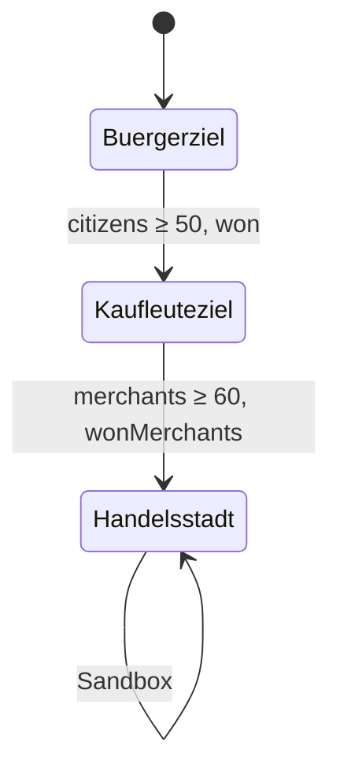
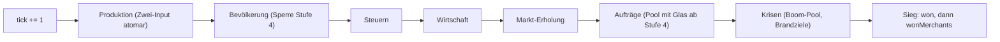

# M8 „Vierte Stufe und Veredelung" — Design-Spec

Datum: 2026-09-30 · Paket M8-SPEC · Status: **Spec, bereit für Gate Spec** · Prozessstufe voll

Grundlage: Ruling R78 (desktop-first), R81 (M8 vorziehen, Sim-Strang folgt auf M6), R82 (Sim-Strang M6 direkt auf
`main`, gemeinsamer serieller UI-Strang), R85 (M6/M7-Abstimmung), R86 (Gate Brainstorming M8 mit Auflage, Entscheide
1–6). Designvorschlag `lead-design` (`.studio/handoffs/2026-09-30-lead-design-l0-m8-vorschlag.md`), verbindliche
Werte `design-economy-designer` (`.studio/handoffs/m8-werte.md`, übernommen, nicht neu gerechnet). Vorgänger und
Stilvorlage: [M6-Spec](2026-09-30-m6-krisen-design.md) (Branch `docs/m6-spec`). Anmutung und UI-Ownership:
[M7-Spec](2026-09-30-m7-stimmung-design.md) (Branch `docs/m7-spec`). Hauptspec
[2026-09-29-inselreich-design.md](2026-09-29-inselreich-design.md).

Kennzeichnung: **„Setzung Spec"** markiert eine Zahl, einen Namen oder einen Text, der weder im Vorschlag noch in
der Werte-Datei stand und hier begründet gesetzt wird. **„Auflage R86"** markiert die Zweck-Gegenprobe aus dem
Gate Brainstorming. **„Abweichung"** markiert eine Stelle, an der die Spec vom Vorschlag, von der Werte-Datei oder
vom Briefing abweicht; die Begründung steht jeweils dabei. **„Änderung"** markiert eine bewusste Abweichung von
Hauptspec, arc42 oder ADR (Übersicht in Abschnitt 19).

Code-Stand der Prüfung: `main` @ 85adf3b (vor M6). Alles, was M6 einführt (Krisen, Feuerwache, Save v3,
`tests/sim/controller.ts`, Fingerabdruck-Helfer), setzt diese Spec als vorhanden voraus (R81, R86: M8-Sim ist
blocked-by M6-S4 und M6-B1).

## 1. Ziel

Nach dem Sieg (50 Bürger, im Controller-Lauf Tick 6050, rund 10 Minuten) fehlt heute ein neues Ziel. M8 bringt
Fortschrittstiefe: eine vierte Stufe, die erste Kette mit zwei Rohstoffen und ein zweites Ziel.

**Spielerzweck:** „Nach dem Sieg geht es weiter: Ich baue ein Badehaus und eine Glashütte und hebe meine Bürger zu
Kaufleuten, bis meine Stadt Handelsstadt ist."

**Zeitbild** (1× = 600 Ticks je Minute, `TICK_MS` 100):

| Ereignis                           | Controller-Tempo, Krisen `off` | mit Krisen `normal` | Quelle                     |
| ---------------------------------- | ------------------------------ | ------------------- | -------------------------- |
| Ausblick „Danach: Kaufleute" (HUD) | ab Tick 0                      | ab Tick 0           | Auflage R86 (4.3)          |
| Sieg, Stufe 4 frei                 | 6050 (10 min)                  | ≈ 6750              | M6 15, werte §3            |
| erster Kaufmann                    | ≈ 9000–9600 (15–16 min)        | —                   | Vorschlag §1, gemessen B1  |
| zweites Ziel „Handelsstadt"        | ≈ 10 020 (≈ 17 min)            | ≈ 11 300 (≈ 19 min) | werte §3, Grenze 12 000 B1 |

Ein Spieler mit Sieg um Tick 8000 und 1.5-fachem Controller-Tempo erreicht das zweite Ziel bei ≈ 14 850 Ticks
(≈ 25 min): erreichbar, aber nicht nebenbei (werte §3).

**Prüfbar** über AK-B1-01 bis AK-B1-03 (Zeiten) und die Browser-Checks AK-U1-04 bis AK-U1-06 (Ausblick, Wechsel,
zweites Banner).

## 2. Scope

### 2.1 Muss und Kann

| Bereich                  | Muss                                                                                                                                       | Kann                                                             |
| ------------------------ | ------------------------------------------------------------------------------------------------------------------------------------------ | ---------------------------------------------------------------- |
| Stufe 4 (Sim)            | Kaufleute, Aufstieg 3 → 4, Freischaltung als Wert (`requiresWin`, `unlockCitizens`), `citizens()` zählt `tier ≥ 3`, `merchants(world)` (4) | —                                                                |
| Glas und Glashütte (Sim) | 9. Gut Glas, Glashütte mit zwei Inputs atomar, `consumes` als Liste, Auftrags- und Boom-Pool ab Stufe 4 (5)                                | —                                                                |
| Badehaus (Sim)           | Dienst `bath`, Radius 10, brennbar (6)                                                                                                     | —                                                                |
| Zweites Ziel (Sim)       | `wonMerchants` bei 60 Kaufleuten, danach Sandbox (7)                                                                                       | —                                                                |
| Save                     | v4 mit Migration v3 → v4, Fixture, Negativfälle (10)                                                                                       | —                                                                |
| Abfragen (Sim)           | Aufstiegsgründe inklusive Sperre, fehlende Inputs, Zielansicht, Badabdeckung (12)                                                          | —                                                                |
| Balancing                | `balance.test.ts` bitgleich, Szenario-Lauf bis zum zweiten Ziel mit `firstMerchantTick` (16)                                               | K1: Variante „vorbereitet" im Szenario-Lauf                      |
| Bedienung (UI)           | 9. Gut, Kaufleute-Chip, Zielanzeige mit Ausblick, zweites Banner, Hotkeys O und J, Tooltips, Info-Panel (14)                               | —                                                                |
| Darstellung, Klang       | Ton `win` für das zweite Banner (Wiederverwendung); Badradius ohne Render-Code (13)                                                        | K2: Bedarfssymbol Bad und Glasfarbe; K3: eigene Silhouetten (R1) |

### 2.2 Streichreihenfolge

1. **K1** Variante „vorbereitet" im Szenario-Lauf (16.4). Entfällt sie, bleibt die Zeitwirkung der Vorbereitung
   eine Schätzung (Offener Punkt 11).
2. **K2** Bedarfssymbol Bad und Glasfarbe in `overlays.ts`. Ohne K2 zeigt ein Haus ohne Bad das Buch-Symbol der Schule
   und ein Haus ohne Glas die graue Rückfallfarbe (heutiges Verhalten, kein Absturz).
3. **K3** eigene Silhouetten für Glashütte, Badehaus und Kaufmannshaus. Ohne K3 zeichnet der Kategorie-Rückfall
   (`SILHOUETTES` ist `Partial`), das Kaufmannshaus wie ein Bürgerhaus.

**Streichvariante des Muss-Kerns (R86 Entscheid 3):** Fällt im Plan der Zwei-Input-Pfad, gilt die Glashütte mit
einem Input (nur Stein, `consumes: ['stone']`, `cost(300, 40, 6, 10)`) und Glas `sell` **18** statt 20 (werte §4).
Die Invariante 27 < 37 < 50 bleibt. Betroffene Kriterien: AK-S2-02 bis AK-S2-04 entfallen, AK-S2-01, AK-S2-08
und AK-S2-11 bekommen die neuen Zahlen (Verkauf 10 Glas: 18 × 955 / 100 = **171**), AK-S3-04 liefert höchstens
ein Gut. Die Entscheidung trifft das Gate Plan, nicht die Umsetzung.

## 3. Ausdrücklich nicht in M8

- Eine Lösung für „hoch dominiert im Endzustand" (R86 Entscheid 6). Sie wäre strukturell, zum Beispiel eine
  Belegung bei „hoch", die mit der Stufe sinkt.
- Eine Geldsenke nach dem zweiten Ziel (Prestige). Das Banner markiert das Inhaltsende, danach ist das Spiel eine
  Sandbox (R86 Entscheid 5).
- Stufe 5, zweite Insel (Backlog), ein Kartengenerator mit knappem Wald oder Stein.
- Abstieg von Häusern, Reservierung von Inputs, Teilzyklen.
- Mobil-Posten (R78). Neue Abhängigkeiten. Fremde Grafik oder fremder Klang ausserhalb von M7.
- Eine Sperre des Bauens vor dem Sieg: Glashütte und Badehaus sind ab Spielbeginn baubar (4.3).
- Eine Änderung an `prepareLayout`, am Controller-Verhalten bis zum Sieg oder an den Grenzen von `balance.test.ts`.
- Neue Krisenarten oder geänderte Krisenwerte.

## 4. Regeln: Stufe 4 und Freischaltung

### 4.1 Stufe 4 „Kaufleute"

| Merkmal                  | Wert                                                             | Ort                                         |
| ------------------------ | ---------------------------------------------------------------- | ------------------------------------------- |
| Name                     | Kaufleute                                                        | `defs/tiers.ts` `TIERS[4].name`             |
| Höchstbelegung           | 20                                                               | `TIERS[4].maxInhabitants`                   |
| Bedarf je EW / 100 Ticks | Nahrung 0.5, Stoff 0.2, Rum 0.2, **Glas 0.1**                    | `TIERS[4].needs`                            |
| Dienste                  | Kapelle, Schule, **Bad**                                         | `TIERS[4].services` = `faith, school, bath` |
| Steuer je EW / 100 Ticks | 20                                                               | `TIERS[4].tax`                              |
| Aufstieg 4 → 5           | keiner                                                           | `TIERS[4].upgradeCost` = `null`             |
| Aufstieg 3 → 4           | Geld 600, Holz 15, Werkzeug 8, Stein 10 (zum Kaufpreis **1220**) | `TIERS[3].upgradeCost` (bisher `null`)      |
| Sperre                   | erst nach dem Sieg                                               | `TIERS[4].requiresWin` = `true` (neu)       |
| Hebel (Auflage R86)      | Freischaltung ab N Bürgern+; Standard `null` = nur nach dem Sieg | `TIERS[4].unlockCitizens` = `null` (neu)    |

Steuerstaffel je EW 2 → 7 → 14 → 20. Aufstiegsstaffel zum Kaufpreis 230 → 675 → 1220.

Alle übrigen Regeln gelten unverändert (Hauptspec 2.7, M5): Aufstieg nur bei voller Belegung, nach
`TAX_LEVELS[taxLevel].upgradeWait` Ticks durchgehender Zufriedenheit (bei „hoch" gesperrt), Dienste der nächsten
Stufe in Reichweite, ≥ 1 Einheit jedes neuen Bedarfsguts (hier Glas) im Lager, Kosten bezahlbar. `tryUpgrade`
entnimmt die Glaseinheit sofort und zählt sie als ausgeliefert (`demand.glass` 0, `satisfied.glass` true). Ein
Kaufmannshaus ohne Glas zahlt halbe Steuer und schrumpft um 1 EW je 50 Ticks bis auf 1; es steigt nicht ab.

### 4.2 Freischaltung und Zählung (R86 Entscheid 1, Variante iii)

**Sperre als Wert, nicht als Code.** Die Sperre hängt an der Zielstufe:

```
gesperrt(next) = next.requiresWin === true
                 && !world.won
                 && !(next.unlockCitizens != null && citizens(world) >= next.unlockCitizens)
```

- Standard (`unlockCitizens` = `null`): Stufe 4 ist genau dann frei, wenn `world.won` gilt.
- Hebel (`unlockCitizens` = N, ganzzahlig 1 … `WIN_CITIZENS` − 1): Stufe 4 ist frei ab N Bürgern+ oder nach dem
  Sieg. Die Prüfung ist live, nicht gespeichert (**Setzung Spec**, Offener Punkt 5).
- Sperrgrund (erster Eintrag in `upgradeStatus().reasons`, **Setzung Spec** für die Reihenfolge):
  - Standard: „Erst nach dem Ziel" (Text aus werte §8).
  - Hebel: „Erst ab {N} Bürgern (jetzt {citizens})" (**Setzung Spec**).
- Die übrigen Gründe folgen in der heutigen Reihenfolge (voll belegt, Steuer, Wartezeit, Dienste, Güter, Geld).
  So zeigt ein volles Bürgerhaus vor dem Sieg „Erst nach dem Ziel" **und** die fehlenden Voraussetzungen, zum
  Beispiel „Badehaus fehlt in Reichweite" und „Kein Glas im Lager" (Auflage R86).

**Zählung:**

- `citizens(world)` = Σ Einwohner aller Häuser mit `tier ≥ 3` (bisher `=== 3`). Ein Aufstieg 3 → 4 senkt die
  Bürgerzahl damit nie. Anzeige, Sieg und Ladeprüfung bleiben widerspruchsfrei (werte §2).
- `merchants(world)` = Σ Einwohner aller Häuser mit `tier === 4` (neu, `population.ts`).
- `populationByTier(world)` bekommt den Schlüssel 4.
- Ohne Stufe-4-Häuser ist `tier ≥ 3` gleich `tier === 3`. Das ist der Kern des Bitgleich-Nachweises (16.1).

**Warum Variante (iii)** (werte §2, Kurzfassung):

| Kriterium                      | (i) nur `≥ 3`, Aufstieg jederzeit                  | (ii) nur Sperre          | (iii) beides (gewählt) |
| ------------------------------ | -------------------------------------------------- | ------------------------ | ---------------------- |
| Weg zu 50 vor dem Sieg         | zweiter Weg, dominiert: ≈ 770 teurer, ≈ 850 später | nur 4 Bürgerhäuser       | wie (ii)               |
| „Bürger-Ziel x / 50" nach Sieg | stabil                                             | sinkt mit jedem Aufstieg | stabil                 |
| Ladeprüfung                    | Stufe 4 bei `won = false` gültig                   | Stufe 4 verlangt `won`   | Stufe 4 verlangt `won` |
| `balance.test.ts`              | bitgleich                                          | bitgleich                | bitgleich              |

### 4.3 Vorschau vor dem Sieg (Auflage R86, Zweck-Gegenprobe)

Das neue Ziel ist ab Spielbeginn sichtbar, nicht erst nach dem Sieg.

1. **Baubar vor dem Sieg:** Glashütte und Badehaus stehen ab Tick 0 in der Bauleiste und sind wie jedes Gebäude
   baubar (keine Sperre in `placeBuilding`). Gesperrt ist nur der Aufstieg 3 → 4.
2. **HUD-Ausblick:** Vor dem Sieg steht neben „Bürger-Ziel x / 50" der Chip „Danach: Kaufleute — Handelsstadt 60"
   (Text aus dem Briefing, **Setzung Spec**). Mit Hebel: „Danach: Kaufleute ab {N} Bürgern — Handelsstadt 60".
3. **Info-Panel:** Ein Bürgerhaus zeigt „Aufstieg zu Kaufleute" mit Kosten und allen Gründen (4.2). Heute zeigt es
   „Höchste Stufe"; das entfällt für Stufe 3 automatisch, weil `TIERS[3].upgradeCost` ≠ `null` ist.
4. **Tooltip:** Glashütte und Badehaus tragen die Zeile „Für Kaufleute (Stufe 4, nach dem Bürger-Ziel)" bzw. mit
   Hebel „(ab {N} Bürgern)" (**Setzung Spec**).

**Vorbereitung als echte Wahl.** Wer vor dem Sieg baut, bindet Kaufpreis 1500 (Bad) + 890 (Hütte) = **2390** und
zahlt Unterhalt 30 + 25 = **55 je 100 Ticks** ohne Nutzen vor dem Sieg. Die Hütte verbraucht zudem je 100 Ticks
2 Stein und 2 Holz, die vor dem Sieg dem Bau fehlen. Dafür steigt das erste volle Bürgerhaus im Badradius im
**ersten Wachstumstakt nach dem Sieg** auf (frühestens `W + 50`, siehe 11.1), statt erst nach Bau von Bad und
Hütte. Die Zeitwirkung auf den Sieg ist nicht gerechnet; K1 misst sie (16.4), sonst Offener Punkt 11.
`balance.test.ts` bleibt bitgleich, weil der Controller weder Bad noch Glashütte baut (16.1).

### 4.4 Messbarer Hebel (Auflage R86)

- Der Szenario-Lauf (16.3) misst `firstMerchantTick` = erster Tick mit `merchants(w) > 0` und hält ihn als
  Istwert fest (Log und Ruling-Vorlage).
- **Schwelle 9600** (Minute 16 bei 1×). Liegt der Istwert darüber, gilt der Hebel `TIERS[4].unlockCitizens`
  (Vorschlag 40) als **Playtest-Frage und Ruling-Vorschlag** an L0. Die Umsetzung stellt den Wert nicht still um.
- Zweiter Hebel für das Ziel selbst: `WIN_MERCHANTS` 40 statt 60 (≈ 630 Ticks früher, werte §3, R86 Entscheid 2).
- Beide Hebel sind reine Werte in `defs/tiers.ts`. Ein Vitest belegt, dass `unlockCitizens` wirkt (AK-S1-09); der
  Standard `null` ist durch AK-S1-15 bitgleich abgesichert.

### 4.5 Werte je Zieldatei

Alle Spielwerte liegen in `src/sim/defs/`, nirgends hart im Code.

| Ort                 | Feld                      | Wert                                                                                                                         |
| ------------------- | ------------------------- | ---------------------------------------------------------------------------------------------------------------------------- |
| `types.ts`          | `Tier`                    | `1 \| 2 \| 3 \| 4`                                                                                                           |
| `types.ts`          | `GoodId`                  | + `'glass'` (am **Ende** von `GOODS`)                                                                                        |
| `types.ts`          | `ServiceId`               | + `'bath'`                                                                                                                   |
| `types.ts`          | `BuildingDefId`           | + `'glassworks'`, `'bathhouse'` (nach M6 `'firestation'`)                                                                    |
| `defs/tiers.ts`     | `TIERS[3].upgradeCost`    | `{ money: 600, wood: 15, tools: 8, stone: 10 }`                                                                              |
| `defs/tiers.ts`     | `TIERS[4]`                | 4.1                                                                                                                          |
| `defs/tiers.ts`     | `TIERS[4].requiresWin`    | `true`                                                                                                                       |
| `defs/tiers.ts`     | `TIERS[4].unlockCitizens` | `null` (Hebel, 4.4)                                                                                                          |
| `defs/tiers.ts`     | `WIN_MERCHANTS`           | **60** (Rückfallwert 40)                                                                                                     |
| `defs/goods.ts`     | `GOODS.glass`             | name Glas, buy **50**, sell **20**, order `{ tier: 4, min: 4, max: 8 }`                                                      |
| `defs/goods.ts`     | `START_STOCK.glass`       | 0                                                                                                                            |
| `defs/buildings.ts` | `glassworks`              | 5.2                                                                                                                          |
| `defs/buildings.ts` | `bathhouse`               | 6                                                                                                                            |
| `population.ts`     | `SERVICE_BUILDING.bath`   | `'bathhouse'`; `SERVICE_IDS` = `faith, school, bath` (Zuordnung, kein Spielwert)                                             |
| `src/ui/hotkeys.ts` | `TOOL_HOTKEYS`            | `o` → Glashütte („Ofen"), `j` → Badehaus (frei, geprüft: belegt sind r x h k u m f l b g v z n t, e aus M6, p, 1–3, W A S D) |

## 5. Regeln: Glas, Glashütte und Zwei-Input-Produktion

### 5.1 Gut Glas

- 9. Gut, am Ende von `GOODS`. Dadurch bleiben die Pools für Stufe ≤ 3 bitgleich (5.4).
- Kauf 50, Verkauf 20, Sättigung wie jedes Gut (`SELL_DROP` 1, `SELL_FLOOR` 30), Lager höchstens 100.
- Auftragsgut ab Stufe 4, Menge 4 … 8, Stückprämie `floor(50 × 0.75)` = **37**, Auftrag **148 … 296**.

### 5.2 Glashütte

| Feld                          | Wert                                                           |
| ----------------------------- | -------------------------------------------------------------- |
| `name`                        | Glashütte                                                      |
| `w × h`                       | 2 × 2                                                          |
| `cost`                        | `cost(300, 20, 6, 10)` (zum Kaufpreis **890**)                 |
| `upkeep`                      | 25                                                             |
| `category`                    | `production`                                                   |
| `produces`                    | `glass`                                                        |
| `consumes`                    | `['stone', 'wood']` (je 1 Einheit je Zyklus)                   |
| `cycle`                       | 50 (2 Glas je 100 Ticks = Bedarf eines vollen Kaufmannshauses) |
| `site`                        | `[]` (frei)                                                    |
| `flammable` / `stormAffected` | `true` / nicht gesetzt                                         |

Kette je Glas: Hütte 25 ÷ 2 = 12.5 · Stein 10 ÷ 1.67 = 6.0 · Holz 5 ÷ 3.33 = 1.5 → **20.0**, also **2.0 je
Kaufmann** und 100 Ticks.

### 5.3 Zwei-Input-Produktion (R86 Entscheid 3)

**Typ:** `BuildingDef.consumes` wird `readonly GoodId[]` (je 1 Einheit je Zyklus). Bestehende Einträge werden
`['wool']` (Weberei), `['cane']` (Brennerei), `['wood']` (Werkzeugmacher). Für Betriebe mit einem Input ändert
sich das Verhalten nicht.

Regeln (werte §4, Nummerierung übernommen):

1. **Atomar:** Bei `progress 0` prüft der Betrieb, ob jedes Gut aus `consumes` mit Bestand ≥ 1 im Lager liegt.
   Nur dann entnimmt er je 1 Einheit aller Inputs. Fehlt eines, wird **nichts** entnommen, und der Zustand wird
   `waitingInput`. Der vorhandene Input bleibt im Lager; andere Betriebe dürfen ihn nehmen (keine Reservierung).
2. **Kein Teilzyklus:** Es gibt keinen Zyklus mit nur einem Input und keine halbe Ausbeute.
3. **Reihenfolge:** wie heute die Iterationsreihenfolge von `world.buildings` (aufsteigende Id). Konkurrieren
   Werkzeugmacher und Glashütte um das letzte Holz, gewinnt die kleinere Id. Das ist deterministisch.
4. **Brand (M6 5.4):** `progress = 0`. Beide bei Zyklusbeginn entnommenen Inputs sind verloren. 200 Ticks Ausfall
   ohne Entnahme = 4 Glas weniger.
5. **Sturm (M6 6):** Die Glashütte ist nicht `stormAffected`. Der Holzfäller ist es; Glas stockt erst, wenn der
   Holzpuffer leer ist.
6. **Lager voll:** wie heute. Die Inputs sind verbraucht, das Glas verfällt, Zustand `storageFull`.
7. **Abriss mitten im Zyklus:** Die entnommenen Inputs sind verloren. Rückerstattung 50 % wie immer
   (150 / 10 / 3 / 5).
8. **Anzeige:** Die Sim-Abfrage `missingInputs` nennt das fehlende Gut; das Info-Panel zeigt „Wartet auf Holz"
   bzw. „Wartet auf Stein und Holz" (12, 14.4).

Pseudocode für `tickProduction` (nach M6: Reihenfolge Ausfall → Anbindung → Sturm → Rest):

```
if progress === 0 && consumes.length > 0:
  if consumes.some(g => stock[g] < 1): state = 'waitingInput'; continue
  for g of consumes: stock[g] -= 1
progress += 1 … (Rest unverändert)
```

`goodsBalance` rechnet jeden Input mit `100 / cycle` als Verbrauch (Glashütte: Stein 2, Holz 2, Glas +2 je 100).

### 5.4 Auftrags- und Boom-Pool

- Pool = alle Güter mit `order` und `order.tier ≤ maxTier`, Reihenfolge `GOOD_IDS` (unverändert, M5 und M6 4.2).
- Glas steht am Ende von `GOOD_IDS`. Für `maxTier ≤ 3` sind Pool, Länge und damit jeder Zufallszug bitgleich zu
  vor M8. Für `maxTier` 4 hat der Pool **8** Güter: Holz, Stein, Nahrung, Wolle, Stoff, Zuckerrohr, Rum, Glas.
- Der Boom-Pool der Krisen (M6 `rollCrisis`) ist derselbe Pool. P(Glas | Boom) bei Stufe 4 = **1/8**.

## 6. Regeln: Badehaus

| Feld                          | Wert                                             |
| ----------------------------- | ------------------------------------------------ |
| `name`                        | Badehaus                                         |
| `w × h`                       | 2 × 2                                            |
| `cost`                        | `cost(500, 30, 10, 20)` (zum Kaufpreis **1500**) |
| `upkeep`                      | 30                                               |
| `category`                    | `public`                                         |
| `service` / `serviceRadius`   | `'bath'` / **10** (wie Kapelle und Schule)       |
| `site`                        | `[]`                                             |
| `flammable` / `stormAffected` | `true` / nicht gesetzt                           |

- Wirkt nur angebunden (wie Kapelle und Schule), Anbindungszustand `notConnected` ohne Weg.
- Radiusanzeige beim Platzieren und Abdeckungs-Umriss kommen ohne Render-Code aus `placementZone` und
  `overlayPlan` (Dienst → Abdeckungsart `'bath'`); geprüft in AK-S3-05 und AK-S3-06.
- Abriss: 50 % zurück (250 / 15 / 5 / 10).
- Badunterhalt je Kaufmann: bei 20 Kaufleuten 1.5, bei 60 Kaufleuten 0.5 je 100 Ticks. Das erste Kaufmannshaus
  trägt das Bad allein (230 − 30 = 200 > Bürgerhaus 112.5, werte §6).

## 7. Regeln: Zweites Ziel „Handelsstadt" (R86 Entscheid 2 und 5)

- Neues Weltfeld `wonMerchants: boolean`, Start `false`.
- Im Siegschritt (11.1) gilt in dieser Reihenfolge:
  1. `citizens(world) ≥ WIN_CITIZENS` → `won = true` (unverändert bis auf die Zählung `≥ 3`).
  2. `won && merchants(world) ≥ WIN_MERCHANTS` → `wonMerchants = true`.
- Beide Felder werden nie zurückgesetzt, auch nicht, wenn Kaufleute ohne Glas schrumpfen.
- Zweites Banner (UI): „Zweites Ziel erreicht: 60 Kaufleute! Das Spiel läuft weiter." (werte §3), Ton `win`.
- 60 = drei volle Kaufmannshäuser. Rückfallwert 40 nach Playtest, nur über `WIN_MERCHANTS` (kein Codeeingriff).
- **Danach Sandbox:** Kein drittes Ziel, keine Geldsenke. Krisen und Aufträge laufen weiter wie nach dem ersten
  Sieg. Das Geld wächst im Endzustand um ≈ +690 … +732 je 100 Ticks (werte §6); das ist gewollt (R86 Entscheid 5).



## 8. Echte Wahl (Auflage wie R72, Tabellen aus werte §5)

Rechnung je Einwohner (EW) und 100 Ticks wie in der Balancing-Kurz-Spec. Werte mit „≈" sind Schätzungen des
Cashflow-Modells ab dem Messpunkt Bürger-Endzustand (Tick ≈ 7500, Geld 2290, +429 je 100 Ticks, werte Kopf).

### 8.1 Bilanz je EW und 100 Ticks

| Stufe                      | niedrig (70 %) | normal    | hoch (130 %, Belegung 0.75) | je Haus normal / hoch |
| -------------------------- | -------------- | --------- | --------------------------- | --------------------- |
| Pionier (4)                | +0.4           | **+1.0**  | +1.6                        | 4 / 4.8               |
| Siedler (8)                | +1.4           | **+3.5**  | +5.6                        | 28 / 33.6             |
| Bürger (15)                | +3.3           | **+7.5**  | +11.7                       | 112.5 / 128.7         |
| **Kaufleute (20)**         | +5.5           | **+11.5** | +17.5                       | 230 / 262.5           |
| Kaufleute, Glas zugekauft  | +2.5           | +8.5      | +14.5                       | 170 / 217.5           |
| Kaufleute, Stein zugekauft | +4.6           | +10.6     | +16.6                       | 212 / 249             |

Kette je Kaufmann 1.0 + 2.5 + 3.0 + 2.0 = **8.5**. Endzustand beim Ziel (3 Kaufmanns- und 1 Bürgerhaus, normal):
**+732.5** rechnerisch, **+690** mit ganzen Gebäuden (zuzüglich Überschussverkauf); 4 Kaufmannshäuser **+835**.
Keine Stufe ist negativ, eine zwingende Pleite gibt es nicht.

### 8.2 Nach dem Sieg: „hoch" kassieren oder in Kaufleute investieren

Je Haus und 100 Ticks: Bürger normal 112.5 · Bürger hoch **128.7** · Kaufleute normal **230** · Kaufleute hoch
**262.5**. Investition für 60 Kaufleute: **13 710** (Bad 1500, 3 Hütten 2670, 4 Brüche 1480, 2 Holzfäller 180,
3 Fischer 690, 2 Stoffpaare 1600, 2 Rumpaare 1930, 3 Aufstiege 3660).

| Lage                             | hoch sofort             | Kaufleute sofort                       | hoch erst, dann Kaufleute | Gewinner                                                                       |
| -------------------------------- | ----------------------- | -------------------------------------- | ------------------------- | ------------------------------------------------------------------------------ |
| Restzeit < ≈ 2500 Ticks          | +75 / 100 ohne Einsatz  | Ziel unerreichbar, Geld gebunden       | —                         | **hoch**                                                                       |
| Ziel gewollt, Restzeit 4000–7500 | kein Ziel               | Ziel ≈ 10 020                          | Ziel ≈ 10 240             | **offen:** sofort ≈ 220 Ticks schneller, „hoch erst" hält Bargeld gegen Krisen |
| Geldstand bei Tick 15 000        | ≈ 39 800                | ≈ 39 600                               | ≈ 39 000                  | **Gleichstand**                                                                |
| Endlosspiel (> 15 000)           | +500                    | +758, danach hoch +780                 | —                         | **Kaufleute** (dominiert langfristig, offen)                                   |
| Krisen normal, ungeschützt       | kleinere Angriffsfläche | Brand am Bad ≈ 1700                    | —                         | hoch robuster                                                                  |
| „niedrig" nach dem Sieg          | —                       | Wartezeit längst erfüllt, −30 % Steuer | —                         | **niedrig ist dominiert** (offen, wie heute)                                   |

Breiter bauen (5. Bürgerhaus, ≈ 4300 für +112.5) ist ein dritter Pfad, gleich stark wie ein Aufstieg, zählt aber
nicht zum zweiten Ziel.

### 8.3 Glas kaufen oder herstellen (je Kaufmannshaus, 2 Glas je 100 Ticks)

Kaufen 2 × 50 = **100 / 100** · eigene Hütte 2 × 20 = **40** · Hütte mit Zukauf-Stein 2 × 29 = **58**.

| Lage                           | Kaufen               | Herstellen (Bruch)                        | Herstellen (Stein gekauft)    | Gewinner                                                |
| ------------------------------ | -------------------- | ----------------------------------------- | ----------------------------- | ------------------------------------------------------- |
| Erstes Haus, Restzeit < ≈ 2300 | 0 Invest, −100       | 1390 Invest, spart 60 → Break-even ≈ 2300 | 944 Invest, spart 42 → ≈ 2250 | **kaufen**                                              |
| Restzeit > 2300                | —                    | **herstellen**                            | knapp dahinter                | herstellen                                              |
| kein Bergplatz frei            | —                    | unmöglich                                 | einzig                        | Zukauf-Stein; Ziel ≈ 200 Ticks früher, danach −60 / 100 |
| Geld < 0 (Kauf gesperrt, M6)   | Kaufleute schrumpfen | läuft weiter                              | Stein fehlt → stockt          | **herstellen mit Bruch**                                |
| Brand an der Hütte (normal)    | immun                | Schaden ≈ 380 (Puffer) … 500              | dito                          | kaufen, nur als Überbrückung                            |

Ein Glas als Aufstiegs-Auslöser zu kaufen (50) ist immer richtig, bevor die eigene Hütte das erste liefert.

### 8.4 Holz-Konkurrenz (Werkzeugmacher, Glashütte, Bau) — Ziel 60

Bedarf nach dem Sieg ≈ **13.4 Holz je 100 Ticks**; 2 Holzfäller liefern 6.67. Wert je Holz: als Glas ≈ 44, als
Werkzeug ≈ 40, im Bau 10.

| Lage                             | Mehr Holzfäller                 | Holz zukaufen             | Gewinner                         |
| -------------------------------- | ------------------------------- | ------------------------- | -------------------------------- |
| Wald frei                        | 90 Invest, Holz zu 1.5          | 10 je Holz                | **Holzfäller dominiert** (offen) |
| kein Waldplatz                   | —                               | 10 je Holz                | zukaufen, einzig                 |
| Sturm (Holz −50 % für 300 Ticks) | Fehlmenge ≈ 20 Holz             | Puffer 20 oder Zukauf 200 | Puffer, danach Zukauf            |
| Geld < 0                         | Hütte und Werkzeugmacher stehen | gesperrt                  | Puffer ist Pflicht               |

Solange Geld ≥ 0 ist, entscheidet die Konkurrenz über Aufmerksamkeit (Holz nachkaufen), nicht über Geld. Deshalb
braucht die UI die Anzeige „Wartet auf Holz" (5.3 Regel 8).

### 8.5 Werkzeugmacher

Bedarf für Ziel 60 ≈ 94 Werkzeug in ≈ 2500 Ticks. Ein Werkzeugmacher spart **+23.1 je 100 Ticks**, Invest 470,
Break-even ≈ 2030 Ticks.

| Lage                        | Werkzeugmacher         | Zukauf (40) | Gewinner                    |
| --------------------------- | ---------------------- | ----------- | --------------------------- |
| schon vor dem Sieg gebaut   | +23 / 100 bis zum Ziel | —           | **behalten**                |
| neu nach dem Sieg           | ≈ +110 über den Ausbau | 0           | knapp Werkzeugmacher (≈ ±0) |
| zweiter Werkzeugmacher      | ≈ ±0                   | —           | offen                       |
| nach dem Ziel (kein Bedarf) | −8 / 100               | —           | **abreissen**               |

### 8.6 Offen genannte Dominanzen

- Holzfäller schlagen Holzkauf, solange Wald frei ist (8.4).
- „niedrig" ist nach dem Sieg dominiert (8.2), wie heute.
- **„hoch" dominiert im Endzustand wieder** (262.5 gegen 230 je Haus). M8 verschiebt den M5-Befund um die
  Investitionsphase, löst ihn aber nicht. Nach R86 Entscheid 6 ist das eine Beobachtung und ein Kandidat für eine
  Kurz-Spec nach M8. Den Eintrag in `docs/beobachtungen.md` macht L0, nicht diese Spec.
- Die Wahl „hoch gegen Kaufleute" ist vor allem eine Tempo- und Risikowahl, keine Renditewahl (Strukturzweifel b,
  Playtest P-03).

## 9. Krisen-Interaktion (M6)

- **Brennbar:** Glashütte und Badehaus sind `flammable`. Die M6-Liste der brennbaren Ids wächst von zehn auf
  **zwölf** (Änderung an M6 AK-S2-10, 18.4).
- **Nicht sturmanfällig:** Glashütte und Badehaus sind nicht `stormAffected`. Der Sturm trifft Glas nur über den
  Holzfäller.
- **Brand Glashütte:** Schaden D = 300 + 4 Glas × 20 = **380** mit Puffer, 300 + 4 × 50 = **500** ohne.
- **Brand Badehaus:** D = 500 + 60 × 20 × 0.5 × 2 = **1700**, der teuerste Einzelschaden im Spiel. Während des
  Ausfalls liefert das Bad keinen Dienst (M6 `serviceAvailable`): Kaufleute im Radius zahlen halbe Steuer, steigen
  aber nicht ab. Kapelle und Schule steigen durch die Kaufleute auf ≈ 1710 / 1810.
- **Feuerwache im Spätspiel:** D̄ ≈ 275 → E ≈ **18 je 100 Ticks** > Unterhalt 10. Eine Wache lohnt klarer als in M6.
- **Sturm, Endzustand Ziel:** Zukauf ≈ **2020** → E ≈ 84 je 100 Ticks; Holz für Glas: Puffer 20 Holz reicht.
- **Boom Glas:** Pool ab Stufe 4 mit Glas (5.4), P = **1/8** je Boom. Gewinn aus Eigenproduktion ≈ +172 einmalig.
- **Invariante Glas:** `sell × BOOM_PCT / 100` = 30 < `floor(buy × ORDER_PREMIUM)` = 37 < `buy` 50. Der
  Eigenschaftstest M6 AK-S3-05 läuft über `GOOD_IDS` und deckt Glas ohne Änderung ab.

| je EW / 100 Ticks, normal | vorgesorgt (1 Wache und Puffer) | ungeschützt |
| ------------------------- | ------------------------------- | ----------- |
| Kaufleute                 | **+11.27**                      | **+10.14**  |
| Endzustand Ziel           | ≈ **+715**                      | ≈ **+630**  |

## 10. Datenmodell und Save v4

### 10.1 Typen (`src/sim/types.ts`, auf M6 aufbauend)

```ts
export type GoodId = /* bestehend */ 'glass'; // am Ende
export type BuildingDefId = /* bestehend inkl. M6 'firestation' */ 'glassworks' | 'bathhouse';
export type ServiceId = 'faith' | 'school' | 'bath';
export type Tier = 1 | 2 | 3 | 4;
export interface TierDef {
  /* bestehend */
  requiresWin?: boolean; // Aufstieg auf diese Stufe erst nach `won` (4.2)
  unlockCitizens?: number | null; // Hebel: frei ab so vielen Bürgern+; null = nur nach dem Sieg
}
export interface BuildingDef {
  /* bestehend */
  consumes?: readonly GoodId[]; // war GoodId; je 1 Einheit je Zyklus, atomar (5.3)
}
export interface World {
  version: 4; // war 3 (M6)
  /* alle bestehenden Felder unverändert */
  wonMerchants: boolean;
}
```

- `createWorld(seed, opts?)` setzt `version = 4`, `wonMerchants = false`, `stock.glass = 0` (`START_STOCK`),
  `sellPct.glass = 100`. Alles andere wie nach M6.
- `HouseState.services` bekommt im ersten Schritt den Schlüssel `bath` (aus `SERVICE_IDS`). Ein Haus der Stufe ≤ 3
  wird davon nicht beeinflusst (`bath` ist nur Dienst der Stufe 4).
- **Setzung Spec** (Namen): `wonMerchants`, `requiresWin`, `unlockCitizens`, `merchants`, `WIN_MERCHANTS`.

### 10.2 Save v4 (`src/sim/save.ts`)

- `SAVE_VERSION = 4`. `serialize` schreibt immer Version 4.
- `deserialize(json)` wirft weiterhin nie:
  1. JSON parsen, sonst `Ungültiges Format`.
  2. `version === 1` → `migrateV1ToV2` (unverändert).
  3. `version === 2` → `migrateV2ToV3` (M6, unverändert).
  4. `version === 3` → `migrateV3ToV4(raw)`: `version = 4`, `stock.glass = 0`, `sellPct.glass = 100`,
     `wonMerchants = false`. Gebäude und Häuser bleiben unberührt; in v3 kann keine Stufe 4 existieren.
  5. `version !== 4` → `Unbekannte Version`.
  6. Strukturprüfung wie nach M6 plus:
     - `stock.glass` Zahl und `sellPct.glass` ganzzahlig 30 … 100 (automatisch über `GOOD_IDS`).
     - `wonMerchants` ist boolean.
     - `wonMerchants === true` ⇒ `won === true`.
     - Jedes Gebäude mit `house`: `house.tier` ganzzahlig 1 … 4 (**Setzung Spec**: bisher ungeprüft).
     - Ein Haus mit `tier === 4` ⇒ `won === true` **oder** `TIERS[4].unlockCitizens !== null`.
     - Verstoss → `Beschädigter Spielstand`.
  7. `recomputeConnectivity` wie heute.
- **Abweichung Briefing** (Ladeprüfung „Stufe 4 ⇒ `won` oder Schwelle erreicht"): Die Schwelle wird nicht als
  `citizens ≥ unlockCitizens` geprüft. Grund: Kaufleute ohne Glas schrumpfen bis auf 1 EW, die Bürgerzahl kann
  also nach einem gültigen Aufstieg wieder unter die Schwelle fallen. Ein solcher Stand wäre gültig und würde
  abgewiesen. Geprüft wird darum nur, ob der Hebel aktiv ist (Offener Punkt 5).
- Kette: v1 → v2 → v3 → v4 läuft über die bestehenden Migrationen. Ein v4-Stand ist mit dem M6-Build nicht
  ladbar („Unbekannte Version"); das ist gewollt.
- **Fixture:** `tests/sim/fixtures/save-v3.json`, erzeugt mit dem Code **vor** M8-S1 (`main` nach M6-S4 und
  M6-B1), als erster Schritt auf `main`. Inhalt: Seed 3, `crisisLevel 'normal'` mit laufender Krise, mindestens
  ein Bürgerhaus (Stufe 3), aktiver Auftrag, mindestens ein `sellPct < 100`, Tick ≥ 3000. Der Testkommentar nennt
  Erzeugungs-Commit und Erzeugungsweg. `tests/sim/fixtures/` steht in `.prettierignore`.
- Der `localStorage`-Schlüssel bleibt `inselreich.save.v1`.

## 11. Tick-Reihenfolge und Aktionen

### 11.1 Tick-Reihenfolge

Keine neue Stufe. `step(world)` nach M6: `tick += 1` → **Produktion → Bevölkerung → Steuern → Wirtschaft →
Markt-Erholung → Aufträge → Krisen → Sieg**.



| System           | M8-Wirkung                                                                                                            |
| ---------------- | --------------------------------------------------------------------------------------------------------------------- |
| `tickProduction` | Entnahme aller Inputs atomar bei `progress 0` (5.3); sonst unverändert inklusive M6-Ausfall und Sturm                 |
| `tickPopulation` | `services.bath` wird abgeleitet; `tryUpgrade` prüft die Sperre der Zielstufe (4.2) mit `world.won` aus dem Vorschritt |
| `tickOrders`     | Pool nach Höchststufe nach `tickPopulation` desselben Ticks; ab Stufe 4 mit Glas                                      |
| `tickCrises`     | Boom-Pool wie Aufträge; Glashütte und Badehaus gehen in `flammableRect` ein                                           |
| `checkWin`       | erst `won` (Zählung `≥ 3`), dann `wonMerchants` (7)                                                                   |

**Folgen der Reihenfolge (prüfbar):**

- `won` wird am Ende des Schritts gesetzt. Die Sperre gilt deshalb im Siegtick `W` noch. Weil sich die Bürgerzahl
  nur in Wachstumstakten ändert, ist `W` ein Vielfaches von 50. Der früheste Aufstieg 3 → 4 liegt bei **`W + 50`**
  (AK-S3-08).
- Mit Hebel wird `citizens(world)` während `tickPopulation` live gelesen, in der Iterationsreihenfolge der Häuser.
  Das ist deterministisch.
- `wonMerchants` kann nicht vor `won` gesetzt werden: 60 Kaufleute sind 60 Bürger+ ≥ 50, also setzt Schritt 1 im
  selben Tick `won`.

### 11.2 Sim-Aktionen und -Funktionen

Keine neue Spieleraktion. Glashütte und Badehaus werden mit `placeBuilding` gebaut und mit `demolish` abgerissen.

| Funktion                  | Modul           | Art                                                          |
| ------------------------- | --------------- | ------------------------------------------------------------ |
| `citizens(world)`         | `population.ts` | geändert: `tier ≥ 3`                                         |
| `merchants(world)`        | `population.ts` | neu, rein                                                    |
| `populationByTier(world)` | `population.ts` | Schlüssel 4                                                  |
| `tierLock(world, tier)`   | `population.ts` | neu, rein; `string \| null` (Sperrgrund aus 4.2 oder `null`) |
| `upgradeStatus(world, b)` | `population.ts` | Sperrgrund als erster Eintrag                                |
| `checkWin(world)`         | `tick.ts`       | setzt zusätzlich `wonMerchants` (7)                          |
| `tickProduction(world)`   | `production.ts` | Inputs als Liste, atomar                                     |
| `migrateV3ToV4(raw)`      | `save.ts`       | neu                                                          |

## 12. Sim-Abfragen (Paket S3)

Reine Funktionen in `src/sim/queries.ts`, DOM-frei, ohne Seiteneffekt.

| Funktion                            | Liefert                                                                                                                                                                                                                                                                                                                                                                   |
| ----------------------------------- | ------------------------------------------------------------------------------------------------------------------------------------------------------------------------------------------------------------------------------------------------------------------------------------------------------------------------------------------------------------------------- |
| `goalView(world)`                   | `{ phase: 'citizens'; current: citizens; target: WIN_CITIZENS; next: { tierName: 'Kaufleute'; target: WIN_MERCHANTS; unlockCitizens } }` vor dem Sieg; `{ phase: 'merchants'; current: merchants; target: WIN_MERCHANTS }` nach dem Sieg; `{ phase: 'done'; current: merchants; target: WIN_MERCHANTS }` nach dem zweiten Ziel. Eine Quelle für HUD, Ausblick und Banner. |
| `missingInputs(world, b)`           | `GoodId[]`: Güter aus `consumes` mit Bestand < 1, Reihenfolge wie `consumes`; leer ohne `consumes`. Grundlage für „Wartet auf …".                                                                                                                                                                                                                                         |
| `goodsBalance(world)`               | wie heute, jeder Input einzeln (5.3)                                                                                                                                                                                                                                                                                                                                      |
| `houseDiagnosis(world, b)`          | ohne Codeänderung: Kaufmannshaus ohne Glas → `{ kind: 'good', good: 'glass' }`, ohne Bad → `{ kind: 'service', service: 'bath' }`                                                                                                                                                                                                                                         |
| `coverageMask(world, 'bath')`       | ohne neue Logik über `CoverageKind = 'supply' \| ServiceId \| 'fire'`; wie Kapelle ohne Dienstgebäude mit `outageUntil` (M6 11)                                                                                                                                                                                                                                           |
| `placementZone(world, 'bathhouse')` | ohne Codeänderung: Kreis Radius 10                                                                                                                                                                                                                                                                                                                                        |

`upgradeStatus` bleibt die Quelle der Aufstiegsgründe (4.2). Die Texte „Badehaus fehlt in Reichweite" und „Kein
Glas im Lager" entstehen ohne neuen Code aus `SERVICE_BUILDING.bath` und `GOODS.glass.name`.

## 13. Darstellung und Klang (Bedarf an `lead-art`, M7-Anmutung)

M8 bringt **keine eigene Grafik und keinen eigenen Klang**. Die Tabelle ist die Bedarfsliste an `lead-art`.
Pakete, die Render-Dateien von M7 berühren, laufen nach den jeweiligen M7-Paketen (17).

| Nr. | Bedarf                                         | Vorgabe aus M7                                                                                                   | Rückfall bis zur Lieferung                       | Paket | Muss/Kann      |
| --- | ---------------------------------------------- | ---------------------------------------------------------------------------------------------------------------- | ------------------------------------------------ | ----- | -------------- |
| G1  | Silhouette Glashütte                           | Produktion: Dachfamilie `roofWood`, 2 × 2 mit Hof; Formmerkmal Vorschlag: Schmelzofen mit gemauertem Schornstein | Kategorie-Rückfall Produktion                    | R1    | Kann (K3)      |
| G2  | Silhouette Badehaus                            | Öffentlich: `roofSlate`; Formmerkmal Vorschlag: flache Kuppel, Becken im Hof                                     | Kategorie-Rückfall Öffentlich                    | R1    | Kann (K3)      |
| G3  | Kaufmannshaus (Wohnhaus Stufe 4)               | Wohnen: eigene Dachfarbe als 4. Stufe (Palette-Eintrag, Name und Wert `lead-art`, ΔE-Prüfung wie M7 AK-R1-03)    | Zweig `else` in `sprites.ts` zeichnet Bürgerhaus | R1    | Kann (K3)      |
| G4  | Fensteranker für G1–G3                         | M7 5.5 „Fensteranker" (für das Fensterlicht M7-R4)                                                               | keine Fenster                                    | R1    | Kann (K3)      |
| G5  | Bedarfssymbol Bad                              | eigenes Symbol wie Glocke und Buch                                                                               | Buch-Symbol der Schule                           | R1    | Kann (K2)      |
| G6  | Warenfarbe Glas                                | `GOOD_COLORS.glass`, unterscheidbar von den acht bestehenden                                                     | `FALLBACK_GOOD_COLOR` Grau                       | R1    | Kann (K2)      |
| G7  | Badradius und Abdeckungs-Umriss                | wie Kapelle (M5, `overlayPlan` über `service`)                                                                   | — (funktioniert ohne Code)                       | —     | Muss (erfüllt) |
| A1  | Ton für das zweite Banner                      | M7-Ton `win` wiederverwenden                                                                                     | —                                                | U1    | Muss           |
| C1  | Anmutung der Chips (Glas, Kaufleute, Ausblick) | M7-U2 Klassen `.chip` und Materialsprache (M7 9.1)                                                               | bestehende `.chip`                               | U1    | Muss           |

- Die M8-UI setzt nur bestehende M7-Klassen und ändert `src/style.css` und `index.html` nicht. Braucht der
  Ausblick-Chip eine eigene Anmutung (zum Beispiel gedämpft), meldet U1 den Bedarf an `lead-art`; die Klasse
  liefert der Owner von `style.css`.
- **Schnittstelle M7-R2:** M7 AK-R2-03 prüft, dass die Silhouettentabelle „alle heutigen `BuildingDefId`" abdeckt.
  Iteriert der Test über `BUILDING_IDS`, wird er mit M8-S1 (Badehaus) rot, bis R1 liefert. Offener Punkt 9.

## 14. Bedienung

Zielplattform Desktop (R78): Maus, Tastatur, Fensterbreite ab 1280 px. Alle Zahlen kommen aus `src/sim/defs/`
bzw. den Sim-Abfragen. Die mit **Setzung Spec** markierten Texte sind Vorgaben; den Wortlaut darf `lead-art` im
Rahmen der M7-Anmutung anpassen, den Inhalt nicht.

### 14.1 HUD (U1)

- **9. Gut:** Die Lagerzeile zeigt „Glas {Bestand} {Bilanz}" als neunten Chip. Er entsteht ohne Code über
  `GOOD_IDS`; U1 prüft nur Lesbarkeit und Überlauf.
- **Kaufleute-Chip:** Die Bevölkerungszeile zeigt „Kaufleute {n}" als vierten Chip (über `TIERS`, ohne Code).
- **Zielanzeige** aus `goalView`, Texte aus einer reinen Funktion `goalTexts(view)` in `src/ui/goal.ts` (neu,
  **Setzung Spec**):

| Phase               | Chip `goal`                                     | Chip `goal-next` (Ausblick)                          |
| ------------------- | ----------------------------------------------- | ---------------------------------------------------- |
| `citizens`          | „Bürger-Ziel {citizens} / 50"                   | „Danach: Kaufleute — Handelsstadt 60"                |
| `citizens`, Hebel N | wie oben                                        | „Danach: Kaufleute ab {N} Bürgern — Handelsstadt 60" |
| `merchants`         | „Kaufleute-Ziel {merchants} / 60"               | ausgeblendet (`hidden`)                              |
| `done`              | „Handelsstadt erreicht · Kaufleute {merchants}" | ausgeblendet                                         |

- **Zweites Banner** (`app.ts`): Wechselt `wonMerchants` auf `true`, erscheint einmal die Meldung „Zweites Ziel
  erreicht: 60 Kaufleute! Das Spiel läuft weiter." (Art wie das erste Banner, `info`, bleibend). Ein geladener
  Stand mit `wonMerchants true` zeigt es nicht erneut (Merkfeld `wonMerchantsShown` neben `wonShown`).
- **Ton:** `diffSoundEvents` meldet `win` auch beim Wechsel von `wonMerchants`. Höchstens ein `win` je Frame, auch
  wenn beide Ziele im selben Frame fallen (**Setzung Spec**).

### 14.2 Bauleiste und Hotkeys (U1, U2)

- Glashütte erscheint in „Produktion", Badehaus in „Öffentlich" (Bauleiste filtert nach Kategorie, ohne Code).
- Hotkeys **O** (Glashütte) und **J** (Badehaus) in `TOOL_HOTKEYS`. Geprüft am Code (`src/ui/hotkeys.ts`,
  `src/ui/input.ts`) und an der M6-Spec (E): beide frei. Alle bisherigen Tasten bleiben.

### 14.3 Tooltips (U2)

Bestehende Zeilen (Name und Taste, Kosten, Unterhalt, Erzeugt, Braucht, Dienst, Radius, Standort; M6: „Brennbar")
plus:

- **Braucht mit mehreren Inputs:** „Braucht: Stein 2 · Holz 2 je 100 Ticks" (**Setzung Spec**). Ein Input bleibt
  wörtlich wie heute („Braucht: Wolle 2 je 100 Ticks").
- **Dienstname:** `SERVICE_NAMES.bath` = „Bad" → „Dienst: Bad" (**Setzung Spec**).
- **Vorschau-Zeile** für Glashütte und Badehaus: „Für Kaufleute (Stufe 4, nach dem Bürger-Ziel)", mit Hebel
  „Für Kaufleute (Stufe 4, ab {N} Bürgern)" (4.3).

### 14.4 Info-Panel (U2)

- **Bürgerhaus:** „Aufstieg zu Kaufleute", Kosten „600 · Holz 15 · Werkzeug 8 · Stein 10" (bestehendes Format
  `costLine`) und die Gründe aus `upgradeStatus`, der Sperrgrund zuerst (4.2). Das kommt nach S1 ohne UI-Code.
- **Kaufmannshaus:** Titel „Wohnhaus — Kaufleute", Einwohner „x / 20", Bedarf mit Glas, Dienste mit Bad,
  „Höchste Stufe". Fehlt Glas: „Mangel: Glas fehlt" (bestehende Diagnose).
- **Glashütte:** „Erzeugt Glas alle 50 Ticks", „Verbraucht Stein und Holz" (**Setzung Spec**, ein Input wörtlich
  wie heute). Zustand `waitingInput`: „Wartet auf {Namen aus `missingInputs`, mit „und" verbunden}", also „Wartet
  auf Holz" oder „Wartet auf Stein und Holz". Ist die Liste leer (Input seit dem letzten Schritt eingetroffen,
  Pause), stehen alle Inputs im Text.
- Weberei, Brennerei und Werkzeugmacher zeigen wörtlich dieselben Texte wie heute.

### 14.5 Handel und Aufträge

Glas erscheint im Handel und als Auftragsgut über `GOOD_IDS` ohne Code. Die Verkaufsknöpfe zeigen den Erlös aus
`sellPrice` (inklusive Boom, M6). U2 prüft nur Lesbarkeit und Überlauf bei 1280 px.

### 14.6 Schmale Fenster

Unter 1280 px gilt nur: kein Absturz, keine Konsolenfehler, nichts Wesentliches unerreichbar (R78).

## 15. Schnittstellen zwischen den Strängen

| Von → nach           | Schnittstelle                                                                                                                                                |
| -------------------- | ------------------------------------------------------------------------------------------------------------------------------------------------------------ |
| Sim → UI             | `World.wonMerchants`, `Tier 4`, `GoodId 'glass'`, `ServiceId 'bath'`; `citizens`, `merchants`, `upgradeStatus`, `tierLock`; `goalView`, `missingInputs` (12) |
| Sim → Render         | `BuildingDefId` `glassworks`, `bathhouse`; `house.tier` 4; `Diagnosis` mit `glass` und `bath`                                                                |
| Sim (M8-S1) → M7-R2  | neue Id `bathhouse` (S1) und `glassworks` (S2) in `BUILDING_IDS` (Offener Punkt 9)                                                                           |
| UI → Audio (M7)      | `SoundEvent 'win'` (bestehend) für das zweite Banner                                                                                                         |
| UI → Anmutung (M7)   | nur bestehende Klassen; Bedarf an neuen Klassen geht an `lead-art` (13)                                                                                      |
| Balancing → M6-Tests | Normalisierung des Fingerabdrucks um die M8-Felder (16.1)                                                                                                    |
| Audio, Render → Sim  | nur lesend (ADR-002)                                                                                                                                         |

## 16. Balancing

### 16.1 `balance.test.ts` bitgleich (R86 Entscheid 4)

Sieg **6050**, Test-Code unverändert. Nachweis Zeile für Zeile (werte §7, am Code geprüft):

- `planTier` deckelt bei `tier < 3`; ein Bürgerhaus plant nie Stufe 4.
- `upgradeReserve`: `TIERS[3].upgradeCost` ist jetzt ≠ `null`, aber `next === tier` → `continue` wie bisher.
- `producersNeeded` liest nur Nahrung, Stoff und Rum.
- Der Controller baut weder Badehaus noch Glashütte. Es entsteht keine Stufe 4, `citizens()` mit `≥ 3` ist gleich
  `=== 3`, `maxHouseTier ≤ 3`.
- `tryUpgrade` eines Bürgerhauses ruft jetzt `upgradeStatus` bis zum Ende auf (Sperre, Dienste, Güter, Geld). Das
  ist rein und ändert nichts.
- Auftrags- und Boom-Pool für Stufe ≤ 3 bleiben gleich (Glas am Ende, 5.4).
- `tickMarket` hält `sellPct.glass` bei 100; keine Geldwirkung.
- Der Lauf endet beim Sieg (`citizens < WIN_CITIZENS` als Schleifenbedingung).

**Fingerabdruck** (M6 B1, FNV-1a-32 über `serialize`): Die Normalisierung des M6-Test-Helfers entfernt zusätzlich
`stock.glass`, `sellPct.glass`, `wonMerchants` und in jedem Haus `services.bath`, und setzt `version` wie in M6 auf
den Referenzwert. Gleich heisst: bitgleich bis auf die neuen Felder. Das ist eine Testhelfer-Änderung in S1, nicht
in `balance.test.ts`. **Abweichung Werte-Datei:** werte §7 nennt nur drei Felder und „`version` 4 → 3". Am Code
geprüft: `tickPopulation` schreibt `services.bath` in jedes Haus (Schleife über `SERVICE_IDS`), und die
M6-Normalisierung setzt `version` auf den Stand der Referenzmessung (v2). Beides ist hier berücksichtigt.

### 16.2 M6-Krisen-Lauf unverändert

`balance-crises.test.ts` endet beim Sieg, der Controller erreicht nie Stufe 4, `rollCrisis` sieht dieselben Pools.
Die Istwerte aus dem M6-Ruling (B2) bleiben gleich. Auch M6 AK-S1-13 „Krisen nach dem Sieg" bleibt gleich
(kein Bad).

### 16.3 Szenario-Lauf „bis zum zweiten Ziel" (B1)

Neue Datei `tests/sim/balance-merchants.test.ts`, Krisen `off`, Seed 3.

- **Phase 1:** Controller aus `tests/sim/controller.ts` unverändert bis zum Sieg (Sieg 6050 wird mitgeprüft).
- **Phase 2:** Der Controller läuft weiter bis zum Bürger-Endzustand (werte Messpunkt: Tick ≈ 7500, Geld 2290).
- **Phase 3** (Merchant-Controller, neue Datei `tests/sim/merchantsController.ts`): Badehaus, dann je Bürgerhaus
  Glashütte, Mehrkette (Fischer, Stoff- und Rumpaare) und Aufstieg. Stein wird **zugekauft** (kein Berg-Layout).
  Fehlt beim Aufstieg das Glas, kauft er 1 Glas als Auslöser (8.3). Kein Verkauf von Glas.
- **Layout-Erweiterung nach dem Sieg:** eigene Funktion in `merchantsController.ts`. Sie sucht deterministisch
  (Zeilen, dann Spalten, ab dem Kontor) freie Plätze für Bad, Hütten und Zusatzbetriebe mit `canPlace`.
  `prepareLayout` bleibt unverändert, sonst kippt die Baseline. Hinweis werte §7: 24 von 24 Farmplätzen und 12 von
  14 Fischerplätzen sind belegt.
- **Grenze:** `wonMerchants` bis Tick **12 000**, am Ende `money > 0`. **Erwartung ≈ 9800–10 000.**
- **Eskalation:** Liegt `wonMerchantsTick` über **11 500** oder wird der Test rot, wird nicht still nachgestellt;
  es braucht eine neue Kurz-Spec (R74-Eskalationsregel).
- **Messung** mit `VITE_BALANCE_LOG=1`: `winTick`, Tick des Bürger-Endzustands, `firstMerchantTick`,
  `wonMerchantsTick`, `minMoney` nach dem Sieg, Endgeld, Gebäudezahlen.
- **Hebel-Regel (Auflage R86):** `firstMerchantTick` > **9600** → Ruling-Vorschlag „Hebel `unlockCitizens` 40 als
  Playtest-Frage" an L0 (4.4). Kein Nachstellen im Paket.
- **Ruling-Vorschlag** (L0 nach B1): „Zweites Ziel 60 Kaufleute, Szenario-Baseline {wonMerchantsTick}, erster
  Kaufmann {firstMerchantTick} (Krisen aus) — Grenze 12 000 = Schätzung ≈ 10 000 + Marge 2000 — bei Irrtum
  Neumessung, `WIN_MERCHANTS` und `unlockCitizens` ohne Codeeingriff anpassbar."

### 16.4 Kann K1: Variante „vorbereitet"

Zweiter Fall im selben Test: Der Merchant-Controller baut Badehaus und eine Glashütte, sobald `citizens ≥ 30`
(**Setzung Spec**), sonst wie 16.3. Gemessen werden `winTick` und `firstMerchantTick` beider Fälle. Das ist der
Beleg für die Vorbereitung als echte Wahl (4.3): Verzögert sie den Sieg, und um wie viel früher kommt der erste
Kaufmann? Die Variante hat keine eigene Grenze ausser `wonMerchants` ≤ 12 000 und `money > 0`.

## 17. Pakete und Datei-Ownership

Stränge und Owner wie M6 16: **Sim** = `tech-sim-engineer` (`src/sim/**`, `tests/sim/**`), **Balancing** =
`design-balancing-analyst` mit `tech-sim-engineer` (nur Testdateien), **UI** = `tech-ui-engineer`, gemeinsamer
serieller Strang mit M6 und M7 (R82 b), **Render** = `art-rendering-engineer` (`lead-art`). Jede Datei hat genau
einen Owner-Strang; Pakete mit gemeinsamer Datei laufen nacheinander.

**Abweichung Briefing (Paketschnitt):** Das Gut Glas, der Dienst `bath` und das Badehaus liegen in **S1**, nicht
in S2. Grund: `TIERS[4]` braucht Glas als Bedarf und `bath` als Dienst, `SERVICE_BUILDING.bath` braucht die Id
`bathhouse`, und Save v4 braucht `stock.glass`. S2 bleibt die Zwei-Input-Produktion mit Glashütte und Pools.

**Benannte Ownership-Ausnahmen** (wie M6-S1 bei `inspect.ts`), damit `make check` nach jedem Sim-Paket grün ist:

- S1 ergänzt in `src/ui/buildMenu.ts` genau `SERVICE_NAMES.bath` („Bad"), sonst bricht der Typcheck.
- S2 ändert in `src/ui/buildMenu.ts` (Zeile „Braucht") und `src/ui/inspect.ts` (Text „Wartet auf", Zeile
  „Verbraucht") nur die Stellen, die `def.consumes` als Einzelwert lesen, auf die Liste, mit wörtlich gleichem Text
  für einen Input.
- Die Zeilen gehen mit dem Sim-Strang auf `main`; M7-U2 (Owner beider Dateien) übernimmt sie per `git merge main`.

| Paket | Inhalt                                                                                                                                          | Strang / Rolle                                 | Dateien                                                                                                                                                                                                                                                                                                                                                                                                                                                   | hängt ab von                                                                         |
| ----- | ----------------------------------------------------------------------------------------------------------------------------------------------- | ---------------------------------------------- | --------------------------------------------------------------------------------------------------------------------------------------------------------------------------------------------------------------------------------------------------------------------------------------------------------------------------------------------------------------------------------------------------------------------------------------------------------- | ------------------------------------------------------------------------------------ |
| S1    | Stufe 4, Sperre und Hebel, `citizens ≥ 3`, `merchants`, Glas als Gut, Dienst `bath`, Badehaus, Save v4, Migration, Fingerabdruck-Normalisierung | Sim · tech-sim-engineer (+ tech-save-engineer) | `types.ts`, `defs/tiers.ts`, `defs/goods.ts`, `defs/buildings.ts` (nur `bathhouse`), `world.ts`, `population.ts`, `save.ts`, `tests/sim/population.test.ts`, `tests/sim/merchants.test.ts` (neu), `tests/sim/save.test.ts`, `tests/sim/defs.test.ts`, `tests/sim/fire.test.ts` (Liste brennbar), `tests/sim/fixtures/save-v3.json` (neu, vor S1 auf `main`), M6-Fingerabdruck-Helfer, `docs/arc42.md` (nur §8 Persistenz); Ausnahme `src/ui/buildMenu.ts` | M6-S4, M6-B1 (R86)                                                                   |
| S2    | Zwei-Input atomar, `consumes` als Liste, Glashütte, Pools, Krisen-Wechselwirkung                                                                | Sim · tech-sim-engineer                        | `types.ts` (`consumes`), `defs/buildings.ts`, `production.ts`, `queries.ts` (`goodsBalance`), `tests/sim/production.test.ts`, `tests/sim/glassworks.test.ts` (neu), `tests/sim/orders.test.ts`, `tests/sim/defs.test.ts`, `tests/sim/fire.test.ts`; Ausnahme `src/ui/buildMenu.ts`, `src/ui/inspect.ts`                                                                                                                                                   | S1                                                                                   |
| S3    | Zweites Ziel, Sim-Abfragen, ADR-005-Nachtrag                                                                                                    | Sim · tech-sim-engineer                        | `tick.ts`, `queries.ts`, `tests/sim/tick.test.ts`, `tests/sim/queries.test.ts`, `docs/adr/ADR-005-…` (Nachtrag), `docs/arc42.md` (§6, §8 Gebäudezustände)                                                                                                                                                                                                                                                                                                 | S2 (`queries.ts`)                                                                    |
| B1    | Szenario-Lauf, `firstMerchantTick`, Ruling-Vorlage; Kann K1                                                                                     | Balancing                                      | `tests/sim/balance-merchants.test.ts` (neu), `tests/sim/merchantsController.ts` (neu); `tests/sim/controller.ts` nur, falls ein Export fehlt                                                                                                                                                                                                                                                                                                              | S3, M6-B1; bei Änderung an `controller.ts` nach M6-B2                                |
| B2    | Szenario-Saves für die Browser-Checks (18.1)                                                                                                    | Balancing                                      | `tests/sim/scenarios.ts`, `tests/sim/scenario-saves.test.ts`                                                                                                                                                                                                                                                                                                                                                                                              | S3, M6-B2 (gleiche Dateien)                                                          |
| U1    | HUD: Zielanzeige mit Ausblick, zweites Banner, Ton, Hotkeys O und J                                                                             | UI (serieller Strang) · tech-ui-engineer       | `goal.ts` (neu), `hud.ts`, `app.ts`, `soundEvents.ts`, `hotkeys.ts`, `tests/ui/goal.test.ts` (neu), `tests/ui/soundEvents.test.ts`, `tests/ui/hotkeys.test.ts`                                                                                                                                                                                                                                                                                            | S3 (auf `main`), **M6-U3**; Browser-Check nach B2                                    |
| U2    | Tooltips, Info-Panel, Handel prüfen                                                                                                             | UI (serieller Strang) · tech-ui-engineer       | `buildMenu.ts`, `inspect.ts`, `tests/ui/tooltip.test.ts`, `tests/ui/inspect.test.ts`                                                                                                                                                                                                                                                                                                                                                                      | U1; Browser-Check nach B2                                                            |
| R1    | Kann K2 und K3: Silhouetten G1–G4, Symbol Bad, Glasfarbe                                                                                        | Render · art-rendering-engineer                | `sprites.ts`, `palette.ts`, `overlays.ts`, `tests/render/sprites.test.ts`, `tests/render/overlays.test.ts`, `tests/render/palette.test.ts`                                                                                                                                                                                                                                                                                                                | S2; **nach M7-R1, M7-R2** (`sprites.ts`, `palette.ts`) und **M6-R2** (`overlays.ts`) |
| D1    | Doku-Pass: Hauptspec-Verweise, README-Spielanleitung, arc42 §5                                                                                  | Doku                                           | `docs/superpowers/specs/2026-09-29-inselreich-design.md`, `README.md`, `docs/arc42.md` (§5)                                                                                                                                                                                                                                                                                                                                                               | U2                                                                                   |

Pfade ohne Präfix liegen im Ordner des Strangs (`src/sim/`, `src/ui/`, `src/render/`).

**Reihenfolge und Parallelität:**

- **Sim-Strang direkt auf `main`** (wie M6-Sim, R82 a): S1 → S2 → S3 → B1. Alle Sim-Pakete sind blocked-by M6-S4
  und M6-B1 (R86). Jedes Paket geht nach eigenem Gate Merge direkt auf `main`. Sichtbare Spuren auf `main` vor der
  UI: Chips „Kaufleute 0" und „Glas 0", Badehaus (nach S1) und Glashütte (nach S2) in der Bauleiste, Bürgerhäuser
  zeigen „Aufstieg zu Kaufleute" mit „Erst nach dem Ziel". Das ist gewollt (Vorschau, 4.3).
- **Gemeinsamer serieller UI-Strang** (R82 b), fortgeschrieben: M7-U2 → M6-U1 / M7-U1 → M6-U2 → M6-U3 →
  **M8-U1 → M8-U2**. Ownership der geteilten Dateien nach M7-Aufteilung: `app.ts`, `hud.ts` (M7-U1);
  `buildMenu.ts`, `inspect.ts`, `trade.ts`, `messages.ts`, `style.css` (M7-U2). M8 ändert `style.css`,
  `index.html`, `trade.ts` und `messages.ts` nicht.
- **Render:** R1 nach S2 und nach M7-R1, M7-R2 und M6-R2. Streicht das Gate Plan K2 und K3, entfällt R1.
- **Grösse grob:** ≈ 24–28 Starts (Vorschlag §6).

## 18. Abnahmekriterien

Vitest-Kriterien laufen in CI (`make test`). **Browser-Checks** prüft `lead-qa` im Dev-Server in Chrome per CDP
bei **1280 × 800 und 1920 × 1080** (R78). Echtzeit-Proben höchstens 1 Minute plus ein Lauf bei 4× (R65).
Messbar heisst: Text per `textContent` eines `data-field`, Zählung per `querySelectorAll`, Überlauf per
`scrollWidth ≤ clientWidth`, Geld- und Lagerwerte per `world` im Dev-Werkzeug. Wo ein Urteil nötig ist, ist der
Urteiler benannt.

Sollzahlen der Szenario-Tests stammen aus werte §8. Aufbau „angebunden" heisst: Weg zum Kontor, `connected true`.

### 18.1 Szenario-Saves für Browser-Checks (B2)

Seed 3, Krisen `off`, erzeugt mit `SCENARIO_OUT=<ordner> npx vitest run tests/sim/scenario-saves.test.ts`. Laden wie
in M5 und M6: pausieren, per CDP `localStorage.setItem('inselreich.save.v1', <json>)`, „Laden". „1 vor dem
Wachstumstakt" heisst `tick = 50 · n − 1`.

| Szenario                   | Inhalt                                                                                                                                                                                                                                       | genutzt von                  |
| -------------------------- | -------------------------------------------------------------------------------------------------------------------------------------------------------------------------------------------------------------------------------------------- | ---------------------------- |
| `m8-vor-sieg`              | `won false`; 3 volle Bürgerhäuser (45 Bürger), Kapelle und Schule angebunden, kein Bad, Glas 0, Geld 3000, Holz 60, Werkzeug 20, Stein 30                                                                                                    | AK-U1-04, AK-U2-03, AK-U2-06 |
| `m8-kurz-vor-sieg`         | 3 volle Bürgerhäuser und 1 Bürgerhaus mit 4 EW (49 Bürger), alle seit ≥ 300 Ticks zufrieden; Badehaus angebunden, **nur ein** volles Bürgerhaus in seinem Radius; Glas 5, Geld 3000, Holz 30, Werkzeug 20, Stein 20; 1 vor dem Wachstumstakt | AK-U1-05, AK-S3-08           |
| `m8-kurz-vor-handelsstadt` | `won true`; 3 Kaufmannshäuser 20 / 20 / 19, alles reichlich, 1 vor dem Wachstumstakt                                                                                                                                                         | AK-U1-06                     |
| `m8-glashuette-wartet`     | Glashütte angebunden, Stein 5, Holz 0                                                                                                                                                                                                        | AK-U2-04                     |
| `m8-kaufleute-ohne-glas`   | `won true`; 1 Kaufmannshaus 20 EW, Kapelle, Schule, Bad, Glas 0                                                                                                                                                                              | AK-U2-05                     |
| `m8-handel`                | Glas 10, `sellPct.glass` 100                                                                                                                                                                                                                 | AK-U2-07                     |
| `m8-galerie`               | alle 16 Gebäudetypen und Wohnhäuser der Stufen 1–4, bei Zoom 1 sichtbar                                                                                                                                                                      | AK-R1-02                     |

### 18.2 Nutzer-Playtest (keine Abnahmekriterien)

- **P-01** (Auflage R86) „Hast du das Kaufleute-Ziel vor dem Sieg bemerkt, und hast du vorbereitet?"
- **P-02** (Auflage R86) „Kam der erste Kaufmann früh genug, um dich zu belohnen?" Bei Nein: Hebel
  `unlockCitizens` bzw. `WIN_MERCHANTS` 40 (4.4).
- **P-03** (Strukturzweifel b) „Hat sich das zweite Banner wie ein Ziel angefühlt, oder war nach dem ersten Sieg die
  Luft raus?"
- **P-04** „Hast du nach dem Sieg ‚hoch' gewählt oder in Kaufleute investiert, und warum?"
- **P-05** „Hast du die Handelsstadt innerhalb von 25 Minuten erreicht?" (Rückfallwert 40)
- **P-06** „Hast du gemerkt, welche Kette klemmt, wenn die Glashütte wartet?"

### S1 — Stufe 4, Freischaltung, Glas, Badehaus, Save v4

- **AK-S1-01** (Vitest, Defs) `TIERS[3].upgradeCost` = `{ 600, 15, 8, 10 }`; `TIERS[4]`: Name „Kaufleute", max 20,
  Bedarf Nahrung 0.5, Stoff 0.2, Rum 0.2, Glas 0.1, Dienste `faith, school, bath`, Steuer 20, `upgradeCost null`,
  `requiresWin true`, `unlockCitizens null`; `requiresWin` fehlt bei Stufe 1–3; `WIN_MERCHANTS` 60. `GOODS.glass`:
  Kauf 50, Verkauf 20, Auftrag `{ 4, 4, 8 }`; `GOOD_IDS` hat 9 Einträge, der letzte ist `glass`;
  `START_STOCK.glass` 0. `bathhouse`: Kosten 500 / 30 / 10 / 20, Unterhalt 30, 2 × 2, `public`, `service 'bath'`,
  `serviceRadius 10`, `site []`, `flammable true`, nicht `stormAffected`. `SERVICE_BUILDING.bath` = `'bathhouse'`.
  Eigenschaft: `unlockCitizens` ist `null` oder ganzzahlig 1 … `WIN_CITIZENS − 1`.
- **AK-S1-02** (Vitest) `createWorld(3)`: `version 4`, `wonMerchants false`, `stock.glass 0`, `sellPct.glass 100`;
  alle übrigen Felder wie nach M6.
- **AK-S1-03** (Vitest, Zählung) Häuser Stufe 2 (8 EW), 3 (15), 4 (20): `citizens` **35**, `merchants` **20**,
  `populationByTier` `{ 1: 0, 2: 8, 3: 15, 4: 20 }`.
- **AK-S1-04** (Vitest, Aufstieg gesperrt) Bürgerhaus 15 EW, 300 Ticks zufrieden, Kapelle, Schule und Badehaus
  angebunden im Radius, Glas 1, Geld 1000, Holz 15, Werkzeug 8, Stein 10, `won false`: `upgradeStatus.reasons`
  genau `['Erst nach dem Ziel']`; nach dem nächsten Wachstumstakt Stufe 3, Geld und Lager unverändert (bis auf den
  Verbrauch der Stufe 3).
- **AK-S1-05** (Vitest, Aufstieg 3 → 4) Wie AK-S1-04, `won true`, nächster Wachstumstakt: Stufe **4**, Geld **400**,
  Holz, Werkzeug, Stein und Glas **0**, `demand.glass 0`, `satisfied.glass true`, `satisfiedSince = tick`; nächste
  Buchung dieses Hauses 15 × 20 = **300** (vorher 210).
- **AK-S1-06** (Vitest, Gründe) Je ein Fall mit `won true`: ohne Bad → „Badehaus fehlt in Reichweite"; Glas 0 →
  „Kein Glas im Lager"; Steuer „hoch" → „Steuer zu hoch". Volles Bürgerhaus mit `won false`, ohne Bad und ohne Glas:
  Gründe beginnen mit „Erst nach dem Ziel" und enthalten „Badehaus fehlt in Reichweite" und „Kein Glas im Lager".
- **AK-S1-07** (Vitest, Wachstum) Nach dem Aufstieg, alle Güter reichlich: 20 EW nach **5** Wachstumstakten (250 Ticks).
- **AK-S1-08** (Vitest, Kaufleute ohne Glas) Kaufmannshaus 20 EW, Glas 0, `won true`: Buchung 20 × 20 × 0.5 = **200**;
  −1 EW je 50 Ticks bis **1** (nach 950 Ticks), Stufe bleibt 4, `won` bleibt `true`.
- **AK-S1-09** (Vitest, Hebel) Test setzt `TIERS[4].unlockCitizens = 40` und stellt danach `null` wieder her.
  `won false`, drei volle Bürgerhäuser (45 Bürger), eines erfüllt alle Bedingungen aus AK-S1-04: Aufstieg im
  nächsten Wachstumstakt, `won` bleibt `false`, `citizens` bleibt 45. Mit 39 Bürgern (15 / 15 / 9): kein Aufstieg,
  erster Grund „Erst ab 40 Bürgern (jetzt 39)". Nach dem Zurücksetzen auf `null` gilt wieder AK-S1-04.
- **AK-S1-10** (Vitest, Massenaufstieg) Zwei volle Bürgerhäuser im Badradius, beide bereit, `won true`, Holz 30,
  Werkzeug 16, Stein 20: Glas 2 und Geld 1300 → beide steigen im selben Wachstumstakt auf, Geld 100; Glas 1 → nur das Haus mit der kleineren Id;
  Glas 2 und Geld 1000 → nur das Haus mit der kleineren Id (`checkAfford`).
- **AK-S1-11** (Vitest, Migration v3) `save-v3.json` lädt `ok`: `version 4`, `stock.glass 0`, `sellPct.glass 100`,
  `wonMerchants false`; Gebäude, Lager (ohne Glas), Geld, Tick, `taxLevel`, `sellPct` (ohne Glas), `order`,
  `crisisLevel` und `crisis` gleich wie im Fixture. Der Testkommentar nennt Erzeugungs-Commit und Erzeugungsweg.
- **AK-S1-12** (Vitest, Kette) `save-v1.json` und `save-v2.json` laden über alle Migrationen: `version 4`,
  `wonMerchants false`, `stock.glass 0`, `sellPct.glass 100`, die v2- und v3-Felder wie in M5 AK-S1-02 und
  M6 AK-S1-02/03.
- **AK-S1-13** (Vitest, Round-trip v4) `deserialize(serialize(w))` gleich `w` für eine Welt mit `won true`, einem
  Kaufmannshaus, `wonMerchants true`, Glas 7 und `sellPct.glass 90`.
- **AK-S1-14** (Vitest, Negativfälle, je Ladeprüfung aus 10.2 mindestens einer) → `Beschädigter Spielstand`:
  `wonMerchants` fehlt; `wonMerchants 1`; `wonMerchants true` bei `won false`; `house.tier 5`; `house.tier 0`;
  `house.tier 3.5`; `house.tier 4` bei `won false` (Hebel `null`); `stock.glass` fehlt; `sellPct.glass` fehlt;
  `sellPct.glass 29`; `sellPct.glass 101`. `version 5` → `Unbekannte Version`. Positivfall: `house.tier 4` bei
  `won false` mit `unlockCitizens 40` → `ok`.
- **AK-S1-15** (Vitest, bitgleich) `balance.test.ts` ohne Diff grün, Sieg **6050**, `minMoney` **57**; der M6-Fall
  `off` (M6 AK-B1-02) mit erweiterter Normalisierung (16.1) gleich der Referenzkonstante; `TIERS[4].unlockCitizens`
  ist `null`.
- **AK-S1-16** (Review) arc42 §8 Persistenz nennt Save v4, Migration v3 → v4 und die neuen Prüfungen.

### S2 — Zwei-Input, Glashütte, Pools, Krisen

- **AK-S2-01** (Vitest, Defs) `glassworks`: Kosten 300 / 20 / 6 / 10, Unterhalt 25, 2 × 2, `production`, erzeugt
  `glass`, `consumes ['stone', 'wood']`, Zyklus 50, `site []`, `flammable true`, nicht `stormAffected`. Weberei
  `['wool']`, Brennerei `['cane']`, Werkzeugmacher `['wood']`. `flammable` genau für zwölf Ids (M6-Liste plus
  `glassworks`, `bathhouse`).
- **AK-S2-02** (Vitest, Zwei-Input-Zyklus) Angebundene Glashütte allein, `progress 0`, Stein 3, Holz 2, 200 Schritte:
  Glas **2**, Stein **1**, Holz **0**, `state 'waitingInput'`, `progress 0`.
- **AK-S2-03** (Vitest, ein Input fehlt) Stein 0, Holz 5, 100 Schritte: Holz **5**, Glas 0, `waitingInput`.
- **AK-S2-04** (Vitest, Konkurrenz ums Holz) Werkzeugmacher (kleinere Id) und Glashütte, beide `progress 0`, Holz 1,
  Stein 1, 1 Schritt: Werkzeugmacher `progress 1`, Glashütte `waitingInput`, Stein **1**, Holz **0**.
- **AK-S2-05** (Vitest, Ein-Input bitgleich) Alle bestehenden Produktions- und Werkzeugmacher-Tests grün ohne
  geänderte Sollwerte (nur der Typ in Test-Defs wird Liste).
- **AK-S2-06** (Vitest, Lager voll) Glas 100, Glashütte mit Stein und Holz: nach einem Zyklus Stein und Holz je −1,
  Glas 100, `storageFull`.
- **AK-S2-07** (Vitest, Abriss im Zyklus) Glashütte `progress 25`, `demolish` → `ok`, Rückerstattung
  **150 / 10 / 3 / 5**; Stein und Holz des laufenden Zyklus kommen nicht zurück.
- **AK-S2-08** (Vitest, Brand, M6 5.4) Reichlich Stein und Holz, `progress 20` bei T; Zwilling ohne Brand; bis T + 400.
  Brand: Geld **−300** gegenüber dem Zwilling, Glas **4**, Entnahmen je Input **4**, `progress 0`. Zwilling: Glas
  **8**, Entnahmen **8**, `progress 20`.
- **AK-S2-09** (Vitest, Sturm) Glashütte und Holzfäller angebunden, Holz 50, Stein 50, Sturm aktiv 300 Schritte;
  Zwilling ohne Sturm: Glas der Glashütte gleich wie im Zwilling; der Holzfäller liefert die Hälfte (M6 AK-S3-01).
- **AK-S2-10** (Vitest, Brand Badehaus) Kaufmannshaus nur im Radius eines Badehauses, alles erfüllt; Badehaus brennt
  bei T: `services.bath` ist in T + 1 … T + 200 `false`, ab T + 201 `true`; die Buchung im Fenster zählt das Haus mit
  halber Steuer (200 statt 400); Stufe bleibt 4.
- **AK-S2-11** (Vitest, Glas-Verkauf) Glas 10, `sellPct.glass 100`: `sell(w, 'glass', 10)` → Geld **+191**
  (20 × 955 / 100), `sellPct.glass` **90**; mit Boom auf Glas **+286** (`floor(286.5)`).
- **AK-S2-12** (Vitest, Auftrag Glas) `orderUnitReward('glass')` = **37**; Menge 4 … 8 → **148 … 296**; Lieferung von
  8 bei Bestand 8 → Geld +296, Bestand 0.
- **AK-S2-13** (Vitest, Pool bitgleich) `orderForPeriod(seed, k, t)` für t 1 … 3, k 0 … 199, Seeds 1 … 10: FNV-1a-32
  über alle Ergebnisse gleich der Referenzkonstante, gemessen auf dem Code vor S1 (Testkommentar nennt den Commit).
  Bei t = 4 hat der Pool **8** Güter, Glas ist das letzte; über k 0 … 199 (Seed 3) kommt Glas mindestens einmal vor.
- **AK-S2-14** (Vitest, Boom-Pool) `rollCrisis` mit Höchststufe 1 und 3: M6 AK-S1-07 und AK-S1-08 unverändert grün;
  mit Höchststufe 4 zieht der Boom aus 8 Gütern, Glas kommt über k 0 … 199 (Seed 3) mindestens einmal vor.
- **AK-S2-15** (Vitest, Invariante) M6 AK-S3-05 läuft über `GOOD_IDS` und ist mit Glas grün (30 < 37 < 50).
- **AK-S2-16** (Vitest, Bilanz) Angebundene Glashütte: `goodsBalance` Glas `produced` 2, Stein `consumed` 2, Holz
  `consumed` 2 je 100 Ticks.

### S3 — Zweites Ziel und Abfragen

- **AK-S3-01** (Vitest, zweites Ziel) `won true`, 3 Kaufmannshäuser 20 / 20 / 19, alles erfüllt: nach einem Schritt
  ohne Wachstumstakt `wonMerchants false` (**59**); nach dem nächsten Wachstumstakt `true` (**60**). Danach Glas 0
  bis zum Schrumpfen auf 55: `wonMerchants` bleibt `true`.
- **AK-S3-02** (Vitest, Reihenfolge im Siegschritt) Mit Hebel 40, `won false`, 3 Kaufmannshäuser mit 60 Kaufleuten:
  nach einem Schritt sind `won` und `wonMerchants` beide `true`. Ohne Hebel ist diese Welt nicht erreichbar
  (Ladeprüfung AK-S1-14).
- **AK-S3-03** (Vitest, `goalView`) Vor dem Sieg mit 45 Bürgern: `{ phase 'citizens', current 45, target 50, next:
{ tierName 'Kaufleute', target 60, unlockCitizens null } }`; nach dem Sieg mit 15 Kaufleuten: `{ phase 'merchants',
current 15, target 60 }`; nach dem zweiten Ziel: `{ phase 'done', current 60, target 60 }`.
- **AK-S3-04** (Vitest, `missingInputs`) Glashütte, Stein 3, Holz 0 → `['wood']`; Stein 0, Holz 0 →
  `['stone', 'wood']`; beide ≥ 1 → `[]`; Weberei ohne Wolle → `['wool']`; Fischer → `[]`.
- **AK-S3-05** (Vitest, Badabdeckung) Eigenschaft wie M5 AK-S3-03: Für alle Kacheln ist `coverageMask(w, 'bath')`
  gleich `serviceAvailable` für ein 1×1-Haus auf dieser Kachel, auch während eines Brands am Badehaus (M6 AK-S4-03).
- **AK-S3-06** (Vitest) `placementZone(w, 'bathhouse', x, y)` → Kreis Radius 10; `placementZone(w, 'glassworks', …)`
  → `null`.
- **AK-S3-07** (Vitest, Diagnose) Kaufmannshaus ohne Glas → Diagnose enthält `{ good: 'glass' }`; ohne Bad →
  `{ service: 'bath' }`.
- **AK-S3-08** (Vitest, Vorbereitung zahlt sich aus) Welt wie Szenario `m8-kurz-vor-sieg`: `won` wird bei Tick `W`
  (ein Vielfaches von 50) `true`, `merchants` ist bei `W` **0** und bei `W + 50` **15**.
- **AK-S3-09** (Review) ADR-005 hat den Nachtrag „Inputs als Liste, atomar entnommen; `waitingInput` bis alle Inputs
  entnommen werden konnten; Siegschritt setzt `won`, dann `wonMerchants`"; arc42 §6 und §8 Gebäudezustände sind
  nachgeführt.

### B1 — Szenario-Lauf

- **AK-B1-01** (Vitest) `balance-merchants.test.ts`: Phase 1 Sieg **6050**; `wonMerchants` bei Tick ≤ **12 000**;
  `money > 0` am Ende; `won true`.
- **AK-B1-02** (Messung) `VITE_BALANCE_LOG=1 npx vitest run tests/sim/balance-merchants.test.ts` gibt `winTick`,
  Tick des Bürger-Endzustands, `firstMerchantTick`, `wonMerchantsTick`, `minMoney` nach dem Sieg, Endgeld und
  Gebäudezahlen aus. `wonMerchantsTick` > 11 500 → Stopp und Kurz-Spec (16.3).
- **AK-B1-03** (Messung und Review, Auflage R86) `firstMerchantTick` ist in der Ruling-Vorlage festgehalten. Liegt er
  über **9600**, enthält die Vorlage den Hebel-Vorschlag `unlockCitizens` 40 samt Playtest-Frage P-02; kein
  geänderter Wert im Paket.
- **AK-B1-04** (Vitest, Determinismus über Laden) Lauf A bis zum Ende. Lauf B hält bei `firstMerchantTick`, speichert,
  lädt und setzt fort (Layout aus dem Kontor abgeleitet wie M6 AK-B2-05): `serialize(A) === serialize(B)`, gleicher
  `wonMerchantsTick`.
- **AK-B1-05** (Vitest) M6-Krisen-Lauf `normal` und `mild` grün mit den Istwerten des M6-Rulings; `balance.test.ts`
  ohne Diff.
- **AK-B1-06** (Review) Ruling-Vorlage nach 16.3 liegt vor.
- **AK-B1-07** (Vitest, **Kann** K1) Variante „vorbereitet": `wonMerchants` ≤ 12 000, `money > 0`; Log nennt
  `winTick` und `firstMerchantTick` beider Varianten.

### B2 — Szenario-Saves

- **AK-B2-01** (Vitest) Jedes Szenario aus 18.1 ist per `deserialize(serialize(w))` ladbar (v4) und hat die
  beschriebenen Eigenschaften (Stufen, EW, Lager, Tick = `50 · n − 1` wo verlangt, `won`, `wonMerchants`); mit
  `SCENARIO_OUT` entsteht je Szenario genau eine Datei.

### U1 — HUD, Ziele, Banner, Hotkeys

- **AK-U1-01** (Vitest, `goalTexts`) Für jede Zeile aus 14.1 der exakte Text beider Chips, inklusive Hebel 40 und
  `hidden` für den Ausblick nach dem Sieg.
- **AK-U1-02** (Vitest, Hotkeys) `hotkeyAction('o', …)` wählt `glassworks`, `'j'` wählt `bathhouse`; `hotkeyLabel`
  → „O" bzw. „J"; `TOOL_HOTKEYS` hat 17 Einträge (14 + E aus M6 + O + J); alle bisherigen Tasten unverändert.
- **AK-U1-03** (Vitest, Ton) `diffSoundEvents`: `wonMerchants` false → true ergibt genau ein `win`; `won` und
  `wonMerchants` im selben Frame → genau ein `win`; Laden eines Stands mit `wonMerchants true` (Basis = geladener
  Stand) → kein Ton; alle bisherigen Töne unverändert.
- **AK-U1-04** (Browser, 1280 und 1920, Szenario `m8-vor-sieg`) `.stock-row .chip` zählt **9**, der neunte beginnt
  mit „Glas 0"; `.pop-row` enthält „Kaufleute 0"; `[data-field=goal]` = „Bürger-Ziel 45 / 50";
  `[data-field=goal-next]` = „Danach: Kaufleute — Handelsstadt 60" und nicht `hidden`; das HUD-Element hat bei
  beiden Breiten `scrollWidth ≤ clientWidth`.
- **AK-U1-05** (Browser, Szenario `m8-kurz-vor-sieg`, 1×) Nach dem nächsten Wachstumstakt: Banner „Ziel erreicht:
  50 Bürger! Das Spiel läuft weiter.", `[data-field=goal]` = „Kaufleute-Ziel 0 / 60", `goal-next` `hidden`; 50 Ticks
  später „Kaufleute-Ziel 15 / 60" und `.pop-row` „Kaufleute 15".
- **AK-U1-06** (Browser, Szenario `m8-kurz-vor-handelsstadt`, 1×) Nach dem nächsten Wachstumstakt genau eine Meldung
  „Zweites Ziel erreicht: 60 Kaufleute! Das Spiel läuft weiter." und `[data-field=goal]` = „Handelsstadt erreicht ·
  Kaufleute 60". Speichern und Laden: keine erneute Meldung.
- **AK-U1-07** (Browser) Fensterbreite 800 px: neues Spiel, Badehaus mit J bauen, Info-Panel öffnen — kein Absturz,
  keine Konsolenfehler (R78).
- **AK-U1-08** (Review) Der Diff von U1 und U2 ändert `src/style.css`, `index.html`, `trade.ts` und `messages.ts`
  nicht.

### U2 — Tooltips, Info-Panel, Handel

- **AK-U2-01** (Vitest, Tooltips) `tooltipLines` für Glashütte enthält „Glashütte (O)", „Kosten: Geld 300 · Holz 20 ·
  Werkzeug 6 · Stein 10", „Unterhalt: 25 je 100 Ticks", „Erzeugt: Glas 2 je 100 Ticks", „Braucht: Stein 2 · Holz 2
  je 100 Ticks", „Für Kaufleute (Stufe 4, nach dem Bürger-Ziel)"; für Badehaus „Badehaus (J)", „Kosten: Geld 500 ·
  Holz 30 · Werkzeug 10 · Stein 20", „Unterhalt: 30 je 100 Ticks", „Dienst: Bad", „Radius: 10" und die
  Vorschau-Zeile; Weberei wörtlich wie vor M8.
- **AK-U2-02** (Vitest, Info-Texte) Zustandstext einer wartenden Glashütte: Holz fehlt → „Wartet auf Holz"; beide
  fehlen → „Wartet auf Stein und Holz"; Liste leer → „Wartet auf Stein und Holz"; Weberei → „Wartet auf Wolle".
- **AK-U2-03** (Browser, 1280 und 1920, Szenario `m8-vor-sieg`) Info-Panel eines Bürgerhauses: Titel der Aufstiegsliste
  „Aufstieg zu Kaufleute"; die Gründe lauten der Reihe nach „✗ Erst nach dem Ziel", „✗ Badehaus fehlt in
  Reichweite", „✗ Kein Glas im Lager"; die Kostenzeile enthält „600", „Holz 15", „Werkzeug 8", „Stein 10"; das
  Panel hat `scrollWidth ≤ clientWidth`.
- **AK-U2-04** (Browser, Szenario `m8-glashuette-wartet`) Info-Panel zeigt „Wartet auf Holz" und „Verbraucht Stein
  und Holz".
- **AK-U2-05** (Browser, Szenario `m8-kaufleute-ohne-glas`) Info-Panel: Titel „Wohnhaus — Kaufleute", „Einwohner
  20 / 20", Diagnose „Mangel: Glas fehlt", Aufstieg „Höchste Stufe".
- **AK-U2-06** (Browser, Szenario `m8-vor-sieg`, Vorschau) Bauleiste „Produktion" enthält Glashütte, „Öffentlich"
  Badehaus. Badehaus mit J an einem freien, angebundenen Platz bauen: Geld sinkt um 500, Holz um 30, Werkzeug um 10,
  Stein um 20, `won` bleibt `false`. Während das Werkzeug aktiv ist, folgt ein Kreis mit Radius 10 Kacheln der Maus
  (Kreisradius per CDP gleich `10 × Zoom × Kachelgrösse` ± 1 px).
- **AK-U2-07** (Browser, Szenario `m8-handel`) Der Handel zeigt eine Zeile „Glas"; der Knopf „10 verkaufen" nennt
  **191**; nach dem Klick Geld +191, Glas 0; das Handels-Panel hat `scrollWidth ≤ clientWidth` bei 1280.

### R1 — Darstellung (Kann K2 und K3, `lead-art`)

- **AK-R1-01** (Vitest, Fake-Kontext) `SILHOUETTES` hat Einträge für `glassworks` und `bathhouse`; ein Haus der
  Stufe 4 zeichnet mit dem neuen Dach-Palettenwert (Name `lead-art`), nicht mit `roofTerracottaDark`. Alle
  Fensteranker liegen im Footprint (wie M7 AK-R2-03).
- **AK-R1-02** (Browser, 1280, Szenario `m8-galerie`) Blindtest durch `qa-playtester`: Screenshot ohne Beschriftung,
  Legende erlaubt; Glashütte, Badehaus und Kaufmannshaus werden richtig zugeordnet, die vier Wohnhaus-Stufen sind
  richtig geordnet. Urteiler: `qa-playtester`.
- **AK-R1-03** (Vitest) `symbolFor({ kind: 'service', service: 'bath' })` liefert ein eigenes Symbol (nicht `book`);
  `GOOD_COLORS.glass` ist gesetzt und verschieden von allen anderen Einträgen; die ΔE-Prüfung der Palette (M7
  AK-R1-03) ist mit dem neuen Dachwert grün.
- **AK-R1-04** (Vitest) `overlayPlan(w, 'bathhouse', x, y)`: Kreis Radius 10, Abdeckung `'bath'`.

**Summe:** 68 Abnahmekriterien (S1 16 · S2 16 · S3 9 · B1 7 · B2 1 · U1 8 · U2 7 · R1 4), davon Kann: AK-B1-07 (K1)
und AK-R1-01 bis AK-R1-04 (K2, K3); dazu 6 Punkte „Nutzer-Playtest" (18.2).

### 18.3 Randfälle (Übersicht)

| Randfall                                   | Antwort                                                                   | AK                           |
| ------------------------------------------ | ------------------------------------------------------------------------- | ---------------------------- |
| Volles Bürgerhaus vor dem Sieg             | kein Aufstieg, Grund „Erst nach dem Ziel" plus fehlende Voraussetzungen   | AK-S1-04, AK-S1-06, AK-U2-03 |
| Bad und Hütte vor dem Sieg gebaut          | erlaubt; erster Kaufmann bei `W + 50`                                     | AK-S3-08, AK-U2-06           |
| Hebel aktiv, Bürgerzahl unter der Schwelle | Sperre live, Grund mit Zahl; Stand mit Stufe 4 bleibt ladbar              | AK-S1-09, AK-S1-14           |
| Leeres Glaslager                           | Aufstieg gesperrt; Kaufleute halbe Steuer, schrumpfen bis 1, kein Abstieg | AK-S1-06, AK-S1-08           |
| Nur ein Input im Lager                     | nichts entnommen, `waitingInput`, Anzeige nennt das fehlende Gut          | AK-S2-03, AK-S3-04, AK-U2-02 |
| Letztes Holz, zwei Verbraucher             | kleinere Id gewinnt, deterministisch                                      | AK-S2-04                     |
| Lager voll (Glas 100)                      | Inputs verbraucht, Glas verfällt, `storageFull`                           | AK-S2-06                     |
| Abriss während Produktion                  | Inputs verloren, 50 % zurück                                              | AK-S2-07                     |
| Brand an Glashütte oder Badehaus           | M6-Regeln; Bad liefert 200 Ticks keinen Dienst                            | AK-S2-08, AK-S2-10           |
| Sturm                                      | Glashütte unberührt, Holzfäller halbiert                                  | AK-S2-09                     |
| Mehrere Häuser gleichzeitig bereit         | Glas und Geld entscheiden in Id-Reihenfolge                               | AK-S1-10                     |
| Kaufleute schrumpfen nach dem zweiten Ziel | `won` und `wonMerchants` bleiben                                          | AK-S1-08, AK-S3-01           |
| Beide Ziele im selben Tick                 | `won` zuerst, dann `wonMerchants`; ein Ton                                | AK-S3-02, AK-U1-03           |
| Alter Spielstand (v1, v2, v3)              | Migration nach v4, `wonMerchants false`, Glas 0 / 100                     | AK-S1-11, AK-S1-12           |
| Beschädigter v4-Stand                      | `Beschädigter Spielstand` je Prüfung                                      | AK-S1-14                     |
| Laden nach dem zweiten Ziel                | kein zweites Banner, kein Ton                                             | AK-U1-03, AK-U1-06           |
| Laden mitten im Szenario-Lauf              | gleicher Endzustand                                                       | AK-B1-04                     |
| Geld < 0                                   | Kauf und Aufstieg gesperrt (bestehend); Hütte mit Bruch läuft weiter      | M5, 8.3                      |
| Schmales Fenster                           | kein Absturz, keine Konsolenfehler                                        | AK-U1-07                     |

## 19. Änderungen gegenüber Hauptspec, arc42 und ADRs

| Dokument / Stelle                  | bisher                                               | mit M8                                                                                                              |
| ---------------------------------- | ---------------------------------------------------- | ------------------------------------------------------------------------------------------------------------------- |
| Hauptspec 2.3 Güter                | 8 Güter                                              | + Glas (5.1)                                                                                                        |
| Hauptspec 2.4 Gebäude              | 13 (M6: 14)                                          | + Glashütte, Badehaus                                                                                               |
| Hauptspec 2.6 Produktion           | „der Input (falls vorhanden)"                        | **Änderung:** Liste von Inputs, atomar entnommen, kein Teilzyklus (5.3)                                             |
| Hauptspec 2.7 Bevölkerung          | Stufen 1–3, Bürger ohne Aufstieg                     | Stufe 4 Kaufleute, Aufstieg 3 → 4, Sperre bis zum Sieg (4)                                                          |
| Hauptspec 2.9 Sieg                 | „Summe der Einwohner in Bürger-Häusern ≥ 50"         | **Änderung:** Bürger und höher (`tier ≥ 3`); zweites Ziel 60 Kaufleute (7)                                          |
| Hauptspec 3.3 Datenmodell          | `World.version: 2` (M6: 3), `consumes?: GoodId`      | `version: 4`, `wonMerchants`; `Tier` bis 4; `consumes?: readonly GoodId[]`; `TierDef.requiresWin`, `unlockCitizens` |
| Hauptspec 3.7, arc42 §8 Persistenz | Save v3 (M6)                                         | Save v4, Migration v3 → v4, neue Prüfungen, Fixture `save-v3.json` (10.2)                                           |
| arc42 §6 Laufzeitsicht             | `checkWin` setzt `won` bei 50 Bürgern                | setzt `won`, dann `wonMerchants`                                                                                    |
| arc42 §8 Gebäudezustände           | `waitingInput`: „Input fehlt"                        | „mindestens ein Input fehlt; nichts entnommen"                                                                      |
| arc42 §5 Bausteinsicht             | —                                                    | `src/ui/goal.ts`                                                                                                    |
| ADR-005                            | `waitingInput` bis der Input entnommen werden konnte | Nachtrag M8: Inputs als Liste, atomar; Siegschritt mit zweitem Ziel                                                 |
| Balancing-Kurz-Spec                | Balancing-Lauf und Krisen-Lauf                       | zusätzlich Szenario-Lauf bis zum zweiten Ziel, Grenze 12 000                                                        |

Kein neues ADR: Die Freischaltung als Wert und das zweite Ziel sind Designentscheide (R86), keine
Architekturentscheide. Keine Änderung an ADR-001 (keine Abhängigkeit), ADR-002 (Sim DOM-frei), ADR-006 (keine
Assets in M8) und ADR-010 (kein neuer Zufall; der Pool wächst nur für Stufe 4).

## 20. Folgeänderungen

- **README (Spielanleitung), D1:**
  - Ziel: „Gezählt werden die Einwohner aller Wohnhäuser der höchsten Stufe" wird „der Stufe Bürger und höher".
  - Zweites Ziel „Handelsstadt": 60 Kaufleute, zweites Banner, danach freies Spiel.
  - Stufentabelle mit Kaufleuten und Aufstieg zu Kaufleuten 600 / 15 / 8 / 10, nur nach dem Bürger-Ziel.
  - Glas (Kauf 50, Verkauf 20, Auftrag ab Kaufleuten 4–8, Prämie 37), Glashütte (Taste O, Stein und Holz),
    Badehaus (Taste J, Radius 10, Kosten, Unterhalt).
- **arc42:** §8 Persistenz (S1), §6 und §8 Gebäudezustände (S3), §5 (D1).
- **ADR-005:** Nachtrag ist Pflicht-Deliverable von S3 (AK-S3-09).
- **Hauptspec:** Verweise in 2.3, 2.4, 2.6, 2.7, 2.9, 3.3, 3.7 auf diese Spec (D1).
- **Rulings (L0):** Szenario-Baseline und `firstMerchantTick` (nach B1); Beobachtung „Steuer hoch dominiert im
  Endzustand" (R86 Entscheid 6, Eintrag macht L0).
- **Bestehende Tests, bewusst geändert:** `tests/sim/defs.test.ts` (`GOOD_IDS` 9, `BUILDING_IDS` +2);
  `tests/ui/hotkeys.test.ts` (17 Tasten); M6 AK-S1-05 (`version 4` → `version 5` für „Unbekannte Version");
  M6 AK-S2-10 (zwölf brennbare Ids); M6-Fingerabdruck-Normalisierung (16.1).

## 21. Offene Punkte mit Empfehlung

1. **„Hoch" dominiert im Endzustand** (Strukturzweifel a, R86 Entscheid 6). Kaufleute 262.5 > 230 je Haus bei
   „hoch". _Entschieden:_ offen lassen, Beobachtung durch L0, Kandidat für eine Kurz-Spec nach M8. _Empfehlung:_ in
   der Kurz-Spec eine stufenabhängige Belegung bei „hoch" prüfen.
2. **Geld ist nach dem Sieg nur Mittel** (Strukturzweifel b). Die Wahl „hoch gegen Kaufleute" ist eine Tempo- und
   Risikowahl (±220 Ticks, Gleichstand bei Tick 15 000). _Empfehlung:_ Playtest P-03 und P-04; trägt das zweite
   Banner nicht, ist das ein Thema für die Kurz-Spec aus Punkt 1.
3. **Holz-Konkurrenz ist eine Aufmerksamkeitsfrage** (Strukturzweifel c). Ein echter Zielkonflikt bräuchte knappen
   Wald, also den Kartengenerator. _Empfehlung:_ ausserhalb von M8 lassen; die Anzeige „Wartet auf Holz" deckt den
   Aufmerksamkeitsteil.
4. **Bergplätze je Seed begrenzt** (Strukturzweifel d). Mit Zukauf-Stein bleibt das Ziel gleich schnell (danach
   −60 je 100 Ticks). _Empfehlung:_ kein Blocker; der Szenario-Lauf nutzt Zukauf-Stein.
5. **Hebel `unlockCitizens` live statt gespeichert.** Fällt die Bürgerzahl nach einem Aufstieg unter N, sperrt die
   Stufe wieder für weitere Aufstiege; bestehende Kaufleute bleiben. Die Ladeprüfung prüft deshalb nur „Hebel
   aktiv", nicht die Zahl (Abweichung Briefing, 10.2). _Empfehlung:_ so lassen, solange der Hebel `null` ist.
   Schaltet L0 den Hebel per Ruling ein, ist ein einmal gesetztes Feld `merchantsUnlocked` (Save v5) die sauberere
   Fassung.
6. **Fingerabdruck-Normalisierung** (Abweichung Werte-Datei, 16.1): zusätzlich `services.bath`, `version` auf den
   M6-Referenzwert statt „4 → 3". _Empfehlung:_ so übernehmen; `design-economy-designer` bestätigt beim Plan.
7. **Paketschnitt S1/S2** (Abweichung Briefing, 17): Glas, `bath` und Badehaus in S1. _Empfehlung:_ so übernehmen;
   die Alternative (Stufe 4 ohne Glas in S1) bräuchte eine Zwischenfassung von `TIERS[4]`.
8. **Ownership-Ausnahmen in `buildMenu.ts` und `inspect.ts`** (M7-U2-Dateien) durch S1 und S2. _Empfehlung:_ wie bei
   M6-S1 benannt zulassen; M7-U2 übernimmt per `git merge main`. Liegt M7-U2 zu dem Zeitpunkt offen, entsteht ein
   kleiner Merge-Konflikt, den M7-U2 löst.
9. **M7 AK-R2-03 über `BUILDING_IDS`.** Prüft der M7-Test die Silhouettentabelle über `BUILDING_IDS`, wird er mit
   M8-S1 rot, bis M8-R1 liefert (oder für immer, wenn K3 gestrichen wird). _Empfehlung:_ Der M7-Plan prüft eine feste
   Liste der M7-Ids plus „unbekannte Id zeichnet den Rückfall"; M8-R1 erweitert die Liste. Entscheidet das Gate Plan
   beider Meilensteine.
10. **Dateien des Balancing-Strangs.** B1 braucht aus `controller.ts` womöglich Exporte (zum Beispiel `control`),
    B2 ändert `scenarios.ts`; beide Dateien ändert auch M6-B2. Der M6-Fingerabdruck-Helfer liegt je nach M6-Plan in
    `balance-crises.test.ts`. _Empfehlung:_ M8-B1 und M8-B2 nach M6-B2; der M6-Plan legt den Fingerabdruck-Helfer in
    eine eigene Datei, damit S1 nur diese berührt.
11. **Zeitwirkung der Vorbereitung vor dem Sieg nicht gerechnet** (4.3). Die Werte-Datei rechnet ab dem Messpunkt
    7500, nicht mit Bau vor dem Sieg. _Empfehlung:_ Kann K1 misst beide Varianten; streicht das Gate Plan K1, liefert
    `design-economy-designer` eine Schätzung nach.
12. **`firstMerchantTick` liegt nahe an der Schwelle.** Der Vorschlag schätzt 9000–9600, die Schwelle ist 9600. Eine
    Überschreitung ist wahrscheinlich genug, dass L0 mit einem Hebel-Ruling nach B1 rechnen sollte. _Empfehlung:_
    kein Vorgriff; B1 misst, L0 entscheidet mit der Vorlage.
13. **Lesart „niedrig dominiert" (werte §5a).** Gemeint ist nach der Begründung „niedrig wird dominiert" (nur −30 %
    Steuer, Wartezeit ohnehin erfüllt). _Empfehlung:_ so übernommen (8.2, 8.6); `design-economy-designer` bestätigt.
14. **HUD-Breite bei 1280 px.** Neun Waren, vier Stufen, Ziel und Ausblick in zwei Zeilen. Überläuft das HUD
    (AK-U1-04), ändert U1 nicht `style.css`, sondern meldet den Bedarf an `lead-art`. _Empfehlung:_ Kürzung des
    Ausblicks auf „Danach: Kaufleute (60)" als Rückfall ohne CSS.
