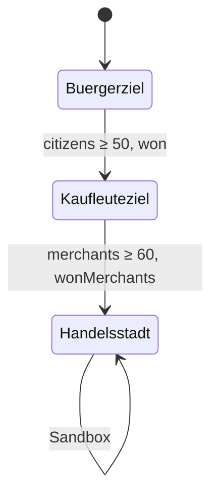
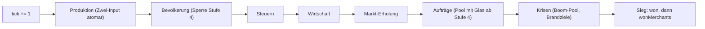

# M8 „Vierte Stufe und Veredelung" — Design-Spec

Datum: 2026-09-30 · Paket M8-SPEC · Status: **Spec, Gate Spec bestanden (R141), Auflagen Gate Plan eingearbeitet
(R142, R143)** · Prozessstufe voll

Grundlage: Ruling R78 (desktop-first), R81 (M8 vorziehen, Sim-Strang folgt auf M6), R82 (Sim-Strang M6 direkt auf
`main`, gemeinsamer serieller UI-Strang), R85 (M6/M7-Abstimmung), R86 (Gate Brainstorming M8 mit Auflage, Entscheide
1–6). Designvorschlag `lead-design` (`.studio/handoffs/2026-09-30-lead-design-l0-m8-vorschlag.md`), verbindliche
Werte `design-economy-designer` (`.studio/handoffs/m8-werte.md`, übernommen, nicht neu gerechnet). Vorgänger und
Stilvorlage: [M6-Spec](2026-09-30-m6-krisen-design.md). Anmutung: [M7-Spec Stimmung](2026-09-30-m7-stimmung-design.md);
Darstellung: [M7-Spec Isometrie](2026-10-01-m7-iso-design.md) (ADR-012); Bedienung und Barrierefreiheit:
[M7-UX-Spec](2026-10-01-m7-ux-design.md) (R132, R134, R135). Hauptspec
[2026-09-29-inselreich-design.md](2026-09-29-inselreich-design.md).

Kennzeichnung: **„Setzung Spec"** markiert eine Zahl, einen Namen oder einen Text, der weder im Vorschlag noch in
der Werte-Datei stand und hier begründet gesetzt wird. **„Auflage R86"** markiert die Zweck-Gegenprobe aus dem
Gate Brainstorming. **„Abweichung"** markiert eine Stelle, an der die Spec vom Vorschlag, von der Werte-Datei oder
vom Briefing abweicht; die Begründung steht jeweils dabei. **„Änderung"** markiert eine bewusste Abweichung von
Hauptspec, arc42 oder ADR (Übersicht in Abschnitt 19).

Code-Stand der Prüfung: `main` @ 03b34e1 (nach M6, M7 Isometrie und M7-UX; Nachführung 2026-10-02). M6 ist auf
`main` (Krisen, Feuerwache, Save v3, `tests/sim/controller.ts`, Fingerabdruck-Helfer `normalized()`); die
Abhängigkeiten auf M6-S4, M6-B1 (R86), M6-R2, M6-U3, M7-R1, M7-R2, M7-U1 und M7-U2 sind erfüllt. Werte,
Zeitbild, Bilanzen, Save-Regeln und Sim-Kriterien sind gegen `src/sim/defs/` auf `main` geprüft und unverändert
(M6-Brandschaden = `cost.money`, `FIRE_OUTAGE` 200). Die Nachführung ändert nur Bedienung, Darstellung, Tests und
Paketschnitt; jede Stelle ist als **Abweichung** oder **Änderung** gekennzeichnet, Übersicht in Abschnitt 22.

**Nachführung S11-Minimum (H-M8, 2026-10-02, R147, R148):** Glashütte und Badehaus sind erst ab der Freischaltung
der Stufe 4 baubar, nicht mehr ab Spielbeginn (Nutzernachtrag S11, Programm
`docs/superpowers/specs/2026-10-02-programm-nutzerfeedback.md` §5). Kann K1 entfällt. Jede Stelle ist als
**Änderung S11** markiert, Übersicht in Abschnitt 23. Werte, Zeitbild und Bitgleich-Nachweis bleiben unverändert.

## 1. Ziel

Nach dem Sieg (50 Bürger, im Controller-Lauf Tick 6050, rund 10 Minuten) fehlt heute ein neues Ziel. M8 bringt
Fortschrittstiefe: eine vierte Stufe, die erste Kette mit zwei Rohstoffen und ein zweites Ziel.

**Spielerzweck:** „Nach dem Sieg geht es weiter: Ich baue ein Badehaus und eine Glashütte und hebe meine Bürger zu
Kaufleuten, bis meine Stadt Handelsstadt ist."

**Zeitbild** (1× = 600 Ticks je Minute, `TICK_MS` 100):

| Ereignis                     | Controller-Tempo, Krisen `off` | mit Krisen `normal` | Quelle                     |
| ---------------------------- | ------------------------------ | ------------------- | -------------------------- |
| Ausblick „Danach: Kaufleute" | ab Tick 0                      | ab Tick 0           | Auflage R86 (4.3, 14.1)    |
| Sieg, Stufe 4 frei           | 6050 (10 min)                  | ≈ 6750              | M6 15, werte §3            |
| erster Kaufmann              | ≈ 9000–9600 (15–16 min)        | —                   | Vorschlag §1, gemessen B1  |
| zweites Ziel „Handelsstadt"  | ≈ 10 020 (≈ 17 min)            | ≈ 11 300 (≈ 19 min) | werte §3, Grenze 12 000 B1 |

Ein Spieler mit Sieg um Tick 8000 und 1.5-fachem Controller-Tempo erreicht das zweite Ziel bei ≈ 14 850 Ticks
(≈ 25 min): erreichbar, aber nicht nebenbei (werte §3).

**Prüfbar** über AK-B1-01 bis AK-B1-03 (Zeiten) und die Browser-Checks AK-U1-04 bis AK-U1-06 (Ausblick, Wechsel,
zweites Banner).

## 2. Scope

### 2.1 Muss und Kann

| Bereich                  | Muss                                                                                                                                                                                                           | Kann                                                             |
| ------------------------ | -------------------------------------------------------------------------------------------------------------------------------------------------------------------------------------------------------------- | ---------------------------------------------------------------- |
| Stufe 4 (Sim)            | Kaufleute, Aufstieg 3 → 4, Freischaltung als Wert (`requiresWin`, `unlockCitizens`), `citizens()` zählt `tier ≥ 3`, `merchants(world)` (4)                                                                     | —                                                                |
| Glas und Glashütte (Sim) | 9. Gut Glas, Glashütte mit zwei Inputs atomar, `consumes` als Liste, Auftrags- und Boom-Pool ab Stufe 4 (5)                                                                                                    | —                                                                |
| Badehaus (Sim)           | Dienst `bath`, Radius 10, brennbar (6); Glashütte und Badehaus erst ab Freischaltung, `buildLock` (4.3, Änderung S11)                                                                                          | —                                                                |
| Zweites Ziel (Sim)       | `wonMerchants` bei 60 Kaufleuten, danach Sandbox (7)                                                                                                                                                           | —                                                                |
| Save                     | v4 mit Migration v3 → v4, Fixture, Negativfälle (10)                                                                                                                                                           | —                                                                |
| Abfragen (Sim)           | Aufstiegsgründe inklusive Sperre, fehlende Inputs, Zielansicht, Badabdeckung (12)                                                                                                                              | —                                                                |
| Balancing                | `balance.test.ts` bitgleich, Szenario-Lauf bis zum zweiten Ziel mit `firstMerchantTick` (16)                                                                                                                   | — (K1 gestrichen, Änderung S11)                                  |
| Bedienung (UI)           | 9. Gut, Kaufleute-Chip, Zielanzeige mit Ausblick, zweites Banner, Hotkeys O und J (mit S1/S2), Tooltips, Info-Panel, Gründe, nächster Schritt (14); Gesperrtes ausgeblendet, Freischalt-Meldung (Änderung S11) | —                                                                |
| Darstellung, Klang       | Ton `win` für das zweite Banner (Wiederverwendung); Badradius ohne Render-Code; Render-Mindestpflicht Höhe und Silhouetten-Rückfall (13)                                                                       | K2: Bedarfssymbol Bad und Glasfarbe; K3: eigene Silhouetten (R1) |

### 2.2 Streichreihenfolge

**Änderung S11:** K1 (Variante „vorbereitet", 16.4) ist gestrichen, weil vor der Freischaltung nicht mehr gebaut
werden kann. Die Nummern K2 und K3 bleiben.

1. **K2** Bedarfssymbol Bad und Glasfarbe in `overlays.ts`. Ohne K2 zeigt ein Haus ohne Bad das Buch-Symbol der Schule
   und ein Haus ohne Glas die graue Rückfallfarbe (heutiges Verhalten, kein Absturz).
2. **K3** eigene Silhouetten für Glashütte, Badehaus und Kaufmannshaus. Ohne K3 bleiben die Rückfall-Einträge aus
   S1 und S2 (13, Render-Mindestpflicht): Glashütte und Badehaus zeichnen als Kategorie-Rückfall, das Kaufmannshaus
   wie ein Bürgerhaus mit gedeckelter Höhe.

**Abweichung zu 2.2 (Nachführung 2026-10-02):** Bisher war jede Render-Arbeit Kann. Seit M7 Isometrie verlangt
`tests/render/sprites.test.ts` (M7:AK-R2-03) einen `SILHOUETTES`-Eintrag für jede `BuildingDefId`, und
`BODY_HEIGHTS.house` indiziert die Stufe als Feldindex. Ohne Mindestpflicht wäre `main` nach S1 rot bzw. die Höhe
eines Kaufmannshauses `NaN`. Die Mindestpflicht (13, AK-S1-17, AK-S2-17) ist deshalb **Muss** und fällt mit K3
nicht weg.

**Streichvariante des Muss-Kerns (R86 Entscheid 3):** Fällt im Plan der Zwei-Input-Pfad, gilt die Glashütte mit
einem Input (nur Stein, `consumes: ['stone']`, `cost(300, 40, 6, 10)`) und Glas `sell` **18** statt 20 (werte §4).
Die Invariante 27 < 37 < 50 bleibt. Betroffene Kriterien: AK-S2-02 bis AK-S2-04 entfallen, AK-S2-01, AK-S2-08
und AK-S2-11 bekommen die neuen Zahlen (Verkauf 10 Glas: 18 × 955 / 100 = **171**), AK-S3-04 liefert höchstens
ein Gut. Die Entscheidung trifft das Gate Plan, nicht die Umsetzung.

## 3. Ausdrücklich nicht in M8

- Eine Lösung für „hoch dominiert im Endzustand" (R86 Entscheid 6). Sie wäre strukturell, zum Beispiel eine
  Belegung bei „hoch", die mit der Stufe sinkt.
- Eine Geldsenke nach dem zweiten Ziel (Prestige). Das Banner markiert das Inhaltsende, danach ist das Spiel eine
  Sandbox (R86 Entscheid 5).
- Stufe 5, zweite Insel (Backlog), ein Kartengenerator mit knappem Wald oder Stein.
- Abstieg von Häusern, Reservierung von Inputs, Teilzyklen.
- Mobil-Posten (R78). Neue Abhängigkeiten. Fremde Grafik oder fremder Klang ausserhalb von M7.
- Ein Freischaltbaum für weitere Gebäude, Funktionen und UI-Elemente, ein gespeichertes Feld `unlocked`, eine
  Hilfe-Karte und das Ausblenden von Glas im Handels-Panel: M10 „Schritt für Schritt" (R148). M8 sperrt nur
  Glashütte und Badehaus bis zur Freischaltung der Stufe 4 (4.3, **Änderung S11**; vorher stand hier „keine Sperre
  des Bauens vor dem Sieg").
- „Spielerführung Wirtschaft" (Vorrat-Vorschau in `nextStep`, fehlende Ware im Bau-Eintrag, Auftragsbezug im
  Handel, Text der Weg-Vorschau): Kandidat für eine Kurz-Spec nach M8-U2 (R138).
- Autosave nach Laden (`pagehide`, Beobachtung N2): eigenes kleines UI-Paket nach M8 (R138).
- Eine Warenbilanz ohne brennende Betriebe: `goodsBalance` zeigt weiter die Dauerleistung (M6-Spec 11, R115, R139).
- Ein eigener HUD-Chip für den Ausblick (14.1, Abweichung zur Auflage-R86-Umsetzung) und neue Farben oder
  Opacity-Dämpfung in `src/style.css` (14.1, AK-U1-08).
- Eine Änderung an `prepareLayout`, am Controller-Verhalten bis zum Sieg oder an den Grenzen von `balance.test.ts`.
- Neue Krisenarten oder geänderte Krisenwerte.

## 4. Regeln: Stufe 4 und Freischaltung

### 4.1 Stufe 4 „Kaufleute"

| Merkmal                  | Wert                                                             | Ort                                         |
| ------------------------ | ---------------------------------------------------------------- | ------------------------------------------- |
| Name                     | Kaufleute                                                        | `defs/tiers.ts` `TIERS[4].name`             |
| Höchstbelegung           | 20                                                               | `TIERS[4].maxInhabitants`                   |
| Bedarf je EW / 100 Ticks | Nahrung 0.5, Stoff 0.2, Rum 0.2, **Glas 0.1**                    | `TIERS[4].needs`                            |
| Dienste                  | Kapelle, Schule, **Bad**                                         | `TIERS[4].services` = `faith, school, bath` |
| Steuer je EW / 100 Ticks | 20                                                               | `TIERS[4].tax`                              |
| Aufstieg 4 → 5           | keiner                                                           | `TIERS[4].upgradeCost` = `null`             |
| Aufstieg 3 → 4           | Geld 600, Holz 15, Werkzeug 8, Stein 10 (zum Kaufpreis **1220**) | `TIERS[3].upgradeCost` (bisher `null`)      |
| Sperre                   | erst nach dem Sieg                                               | `TIERS[4].requiresWin` = `true` (neu)       |
| Hebel (Auflage R86)      | Freischaltung ab N Bürgern+; Standard `null` = nur nach dem Sieg | `TIERS[4].unlockCitizens` = `null` (neu)    |

Steuerstaffel je EW 2 → 7 → 14 → 20. Aufstiegsstaffel zum Kaufpreis 230 → 675 → 1220.

Alle übrigen Regeln gelten unverändert (Hauptspec 2.7, M5): Aufstieg nur bei voller Belegung, nach
`TAX_LEVELS[taxLevel].upgradeWait` Ticks durchgehender Zufriedenheit (bei „hoch" gesperrt), Dienste der nächsten
Stufe in Reichweite, ≥ 1 Einheit jedes neuen Bedarfsguts (hier Glas) im Lager, Kosten bezahlbar. `tryUpgrade`
entnimmt die Glaseinheit sofort und zählt sie als ausgeliefert (`demand.glass` 0, `satisfied.glass` true). Ein
Kaufmannshaus ohne Glas zahlt halbe Steuer und schrumpft um 1 EW je 50 Ticks bis auf 1; es steigt nicht ab.

### 4.2 Freischaltung und Zählung (R86 Entscheid 1, Variante iii)

**Sperre als Wert, nicht als Code.** Die Sperre hängt an der Zielstufe:

```
gesperrt(next) = next.requiresWin === true
                 && !world.won
                 && !(next.unlockCitizens != null && citizens(world) >= next.unlockCitizens)
```

- Standard (`unlockCitizens` = `null`): Stufe 4 ist genau dann frei, wenn `world.won` gilt.
- Hebel (`unlockCitizens` = N, ganzzahlig 1 … `WIN_CITIZENS` − 1): Stufe 4 ist frei ab N Bürgern+ oder nach dem
  Sieg. Die Prüfung ist live, nicht gespeichert (**Setzung Spec**, Offener Punkt 5).
- Sperrgrund (erster Eintrag in `upgradeStatus().reasons`, **Setzung Spec** für die Reihenfolge):
  - Standard: „Erst nach dem Ziel" (Text aus werte §8).
  - Hebel: „Erst ab {N} Bürgern (jetzt {citizens})" (**Setzung Spec**).
- Die übrigen Gründe folgen in der heutigen Reihenfolge (voll belegt, Steuer, Wartezeit, Dienste, Güter, Geld).
  So zeigt ein volles Bürgerhaus vor dem Sieg „Erst nach dem Ziel" **und** die fehlenden Voraussetzungen, zum
  Beispiel „Badehaus fehlt in Reichweite" und „Kein Glas im Lager" (Auflage R86).

**Zählung:**

- `citizens(world)` = Σ Einwohner aller Häuser mit `tier ≥ 3` (bisher `=== 3`). Ein Aufstieg 3 → 4 senkt die
  Bürgerzahl damit nie. Anzeige, Sieg und Ladeprüfung bleiben widerspruchsfrei (werte §2).
- `merchants(world)` = Σ Einwohner aller Häuser mit `tier === 4` (neu, `population.ts`).
- `populationByTier(world)` bekommt den Schlüssel 4.
- Ohne Stufe-4-Häuser ist `tier ≥ 3` gleich `tier === 3`. Das ist der Kern des Bitgleich-Nachweises (16.1).

**Warum Variante (iii)** (werte §2, Kurzfassung):

| Kriterium                      | (i) nur `≥ 3`, Aufstieg jederzeit                  | (ii) nur Sperre          | (iii) beides (gewählt) |
| ------------------------------ | -------------------------------------------------- | ------------------------ | ---------------------- |
| Weg zu 50 vor dem Sieg         | zweiter Weg, dominiert: ≈ 770 teurer, ≈ 850 später | nur 4 Bürgerhäuser       | wie (ii)               |
| „Bürger-Ziel x / 50" nach Sieg | stabil                                             | sinkt mit jedem Aufstieg | stabil                 |
| Ladeprüfung                    | Stufe 4 bei `won = false` gültig                   | Stufe 4 verlangt `won`   | Stufe 4 verlangt `won` |
| `balance.test.ts`              | bitgleich                                          | bitgleich                | bitgleich              |

### 4.3 Vorschau vor dem Sieg (Auflage R86, Zweck-Gegenprobe)

Das neue Ziel ist ab Spielbeginn sichtbar, nicht erst nach dem Sieg.

1. **Baubar erst ab der Freischaltung (Änderung S11):** Glashütte und Badehaus tragen in `defs/buildings.ts` den Wert
   `unlockTier: 4`. Die reine Abfrage `buildLock(world, defId)` (`placement.ts`) liefert `tierLock(world, 4)`, solange
   die Stufe gesperrt ist, sonst `null`; Gebäude ohne `unlockTier` liefern immer `null`. `canPlace` prüft `buildLock`
   **zuerst** und liefert `fail` mit genau diesem Grund („Erst nach dem Ziel", mit Hebel „Erst ab {N} Bürgern (jetzt
   {citizens})"); `placeBuilding` bucht dann nichts. Die Bauleiste zeigt beide erst ab der Freischaltung (14.2).
   Vorher stand hier: ab Tick 0 baubar, keine Sperre. Ein schon stehendes Gebäude bleibt stehen, auch wenn die
   Sperre mit Hebel wieder greift (Offener Punkt 5); nur Neubau ist dann gesperrt.
2. **Ausblick:** Vor dem Sieg steht der Satz „Danach: Kaufleute — Handelsstadt 60" (Text aus dem Briefing,
   **Setzung Spec**), mit Hebel „Danach: Kaufleute ab {N} Bürgern — Handelsstadt 60". **Abweichung zur
   Auflage-R86-Umsetzung** (die Auflage selbst bleibt erfüllt): Der Satz steht nicht als eigener HUD-Chip, sondern in
   der Ruhe-Ansicht des Panels (ohne Auswahl ab Tick 0 sichtbar) unter dem Zielbalken und im Tooltip des HUD-Chips
   `goal` (14.1). Grund: M7:AK-UX-15 (`#hud` ≤ 84 px bei 1280) und das M7-UX-Ziel „ruhige Kopfzeile".
3. **Info-Panel:** Ein Bürgerhaus zeigt „Aufstieg zu Kaufleute" mit Kosten und allen Gründen (4.2). Heute zeigt es
   „Höchste Stufe"; das entfällt für Stufe 3 automatisch, weil `TIERS[3].upgradeCost` ≠ `null` ist. Der Stufenpfad
   der Ruhe-Ansicht endet mit „→ Kaufleute (brauchen Glas, Badehaus)" (14.4).
4. **Tooltip (Änderung S11):** Glashütte und Badehaus tragen als letzte Zeile „Für Kaufleute (Stufe 4)"
   (**Setzung Spec**). Die Vorschau-Zeile „nach dem Bürger-Ziel" entfällt, weil die Einträge vorher nicht sichtbar
   sind.
5. **Freischalt-Meldung (Änderung S11):** Wechselt `buildLock(world, 'bathhouse')` während des Spiels von gesperrt
   auf `null`, erscheint einmal die Meldung „Neu freigeschaltet: Badehaus (J) und Glashütte (O) — deine Bürger wollen
   Kaufleute werden" (**Setzung Spec**, Art `info`, wie das Banner). Ein geladener Stand mit schon freier Stufe zeigt
   sie nicht (Merkfeld wie `wonShown`).

**Vorbereitung (Änderung S11).** Bad und Hütte vor dem Sieg zu bauen ist nicht mehr möglich; die frühere „echte
Wahl" (2390 Geld binden, 55 je 100 Ticks Unterhalt ohne Nutzen, dafür erster Kaufmann bei `W + 50`) entfällt mit
Kann K1. Vorbereiten heisst jetzt: Geld, Stein und Holz für Bad (500 / 30 / 10 / 20) und Hütte (300 / 20 / 6 / 10)
zurücklegen. Die Auflage R86 bleibt im Kern erfüllt: Das Ziel ist ab Spielbeginn sichtbar (Punkte 2 und 3).
`balance.test.ts` bleibt bitgleich, weil der Controller weder Bad noch Glashütte baut (16.1); der Merchant-Controller
baut beide erst in Phase 3 nach dem Sieg (16.3).

### 4.4 Messbarer Hebel (Auflage R86)

- Der Szenario-Lauf (16.3) misst `firstMerchantTick` = erster Tick mit `merchants(w) > 0` und hält ihn als
  Istwert fest (Log und Ruling-Vorlage).
- **Schwelle 9600** (Minute 16 bei 1×). Liegt der Istwert darüber, gilt der Hebel `TIERS[4].unlockCitizens`
  (Vorschlag 40) als **Playtest-Frage und Ruling-Vorschlag** an L0. Die Umsetzung stellt den Wert nicht still um.
- Zweiter Hebel für das Ziel selbst: `WIN_MERCHANTS` 40 statt 60 (≈ 630 Ticks früher, werte §3, R86 Entscheid 2).
- Beide Hebel sind reine Werte in `defs/tiers.ts`. Ein Vitest belegt, dass `unlockCitizens` wirkt (AK-S1-09); der
  Standard `null` ist durch AK-S1-15 bitgleich abgesichert.

### 4.5 Werte je Zieldatei

Alle Spielwerte liegen in `src/sim/defs/`, nirgends hart im Code.

| Ort                 | Feld                      | Wert                                                                                                                                     |
| ------------------- | ------------------------- | ---------------------------------------------------------------------------------------------------------------------------------------- |
| `types.ts`          | `Tier`                    | `1 \| 2 \| 3 \| 4`                                                                                                                       |
| `types.ts`          | `GoodId`                  | + `'glass'` (am **Ende** von `GOODS`)                                                                                                    |
| `types.ts`          | `ServiceId`               | + `'bath'`                                                                                                                               |
| `types.ts`          | `BuildingDefId`           | + `'glassworks'`, `'bathhouse'` (nach M6 `'firestation'`)                                                                                |
| `defs/tiers.ts`     | `TIERS[3].upgradeCost`    | `{ money: 600, wood: 15, tools: 8, stone: 10 }`                                                                                          |
| `defs/tiers.ts`     | `TIERS[4]`                | 4.1                                                                                                                                      |
| `defs/tiers.ts`     | `TIERS[4].requiresWin`    | `true`                                                                                                                                   |
| `defs/tiers.ts`     | `TIERS[4].unlockCitizens` | `null` (Hebel, 4.4)                                                                                                                      |
| `defs/tiers.ts`     | `WIN_MERCHANTS`           | **60** (Rückfallwert 40)                                                                                                                 |
| `defs/goods.ts`     | `GOODS.glass`             | name Glas, buy **50**, sell **20**, order `{ tier: 4, min: 4, max: 8 }`                                                                  |
| `defs/goods.ts`     | `START_STOCK.glass`       | 0                                                                                                                                        |
| `defs/buildings.ts` | `glassworks`              | 5.2                                                                                                                                      |
| `defs/buildings.ts` | `bathhouse`               | 6                                                                                                                                        |
| `population.ts`     | `SERVICE_BUILDING.bath`   | `'bathhouse'`; `SERVICE_IDS` = `faith, school, bath` (Zuordnung, kein Spielwert)                                                         |
| `src/ui/hotkeys.ts` | `TOOL_HOTKEYS`            | `j` → Badehaus (mit S1), `o` → Glashütte („Ofen", mit S2); frei, geprüft @ 03b34e1 gegen `TOOL_HOTKEYS`, `SPEED_KEYS` 1–3, P, `NAV_KEYS` |

## 5. Regeln: Glas, Glashütte und Zwei-Input-Produktion

### 5.1 Gut Glas

- 9. Gut, am Ende von `GOODS`. Dadurch bleiben die Pools für Stufe ≤ 3 bitgleich (5.4).
- Kauf 50, Verkauf 20, Sättigung wie jedes Gut (`SELL_DROP` 1, `SELL_FLOOR` 30), Lager höchstens 100.
- Auftragsgut ab Stufe 4, Menge 4 … 8, Stückprämie `floor(50 × 0.75)` = **37**, Auftrag **148 … 296**.

### 5.2 Glashütte

| Feld                          | Wert                                                           |
| ----------------------------- | -------------------------------------------------------------- |
| `name`                        | Glashütte                                                      |
| `w × h`                       | 2 × 2                                                          |
| `cost`                        | `cost(300, 20, 6, 10)` (zum Kaufpreis **890**)                 |
| `upkeep`                      | 25                                                             |
| `category`                    | `production`                                                   |
| `produces`                    | `glass`                                                        |
| `consumes`                    | `['stone', 'wood']` (je 1 Einheit je Zyklus)                   |
| `cycle`                       | 50 (2 Glas je 100 Ticks = Bedarf eines vollen Kaufmannshauses) |
| `site`                        | `[]` (frei)                                                    |
| `flammable` / `stormAffected` | `true` / nicht gesetzt                                         |

Kette je Glas: Hütte 25 ÷ 2 = 12.5 · Stein 10 ÷ 1.67 = 6.0 · Holz 5 ÷ 3.33 = 1.5 → **20.0**, also **2.0 je
Kaufmann** und 100 Ticks.

### 5.3 Zwei-Input-Produktion (R86 Entscheid 3)

**Typ:** `BuildingDef.consumes` wird `readonly GoodId[]` (je 1 Einheit je Zyklus). Bestehende Einträge werden
`['wool']` (Weberei), `['cane']` (Brennerei), `['wood']` (Werkzeugmacher). Für Betriebe mit einem Input ändert
sich das Verhalten nicht.

Regeln (werte §4, Nummerierung übernommen):

1. **Atomar:** Bei `progress 0` prüft der Betrieb, ob jedes Gut aus `consumes` mit Bestand ≥ 1 im Lager liegt.
   Nur dann entnimmt er je 1 Einheit aller Inputs. Fehlt eines, wird **nichts** entnommen, und der Zustand wird
   `waitingInput`. Der vorhandene Input bleibt im Lager; andere Betriebe dürfen ihn nehmen (keine Reservierung).
2. **Kein Teilzyklus:** Es gibt keinen Zyklus mit nur einem Input und keine halbe Ausbeute.
3. **Reihenfolge:** wie heute die Iterationsreihenfolge von `world.buildings` (aufsteigende Id). Konkurrieren
   Werkzeugmacher und Glashütte um das letzte Holz, gewinnt die kleinere Id. Das ist deterministisch.
4. **Brand (M6 5.4):** `progress = 0`. Beide bei Zyklusbeginn entnommenen Inputs sind verloren. 200 Ticks Ausfall
   ohne Entnahme = 4 Glas weniger.
5. **Sturm (M6 6):** Die Glashütte ist nicht `stormAffected`. Der Holzfäller ist es; Glas stockt erst, wenn der
   Holzpuffer leer ist.
6. **Lager voll:** wie heute. Die Inputs sind verbraucht, das Glas verfällt, Zustand `storageFull`.
7. **Abriss mitten im Zyklus:** Die entnommenen Inputs sind verloren. Rückerstattung 50 % wie immer
   (150 / 10 / 3 / 5).
8. **Anzeige:** Die Sim-Abfrage `missingInputs` nennt das fehlende Gut; das Info-Panel zeigt „Wartet auf Holz"
   bzw. „Wartet auf Stein und Holz" (12, 14.4).

Pseudocode für `tickProduction` (nach M6: Reihenfolge Ausfall → Anbindung → Sturm → Rest):

```
if progress === 0 && consumes.length > 0:
  if consumes.some(g => stock[g] < 1): state = 'waitingInput'; continue
  for g of consumes: stock[g] -= 1
progress += 1 … (Rest unverändert)
```

`goodsBalance` rechnet jeden Input mit `100 / cycle` als Verbrauch (Glashütte: Stein 2, Holz 2, Glas +2 je 100).

### 5.4 Auftrags- und Boom-Pool

- Pool = alle Güter mit `order` und `order.tier ≤ maxTier`, Reihenfolge `GOOD_IDS` (unverändert, M5 und M6 4.2).
- Glas steht am Ende von `GOOD_IDS`. Für `maxTier ≤ 3` sind Pool, Länge und damit jeder Zufallszug bitgleich zu
  vor M8. Für `maxTier` 4 hat der Pool **8** Güter: Holz, Stein, Nahrung, Wolle, Stoff, Zuckerrohr, Rum, Glas.
- Der Boom-Pool der Krisen (M6 `rollCrisis`) ist derselbe Pool. P(Glas | Boom) bei Stufe 4 = **1/8**.

## 6. Regeln: Badehaus

| Feld                          | Wert                                             |
| ----------------------------- | ------------------------------------------------ |
| `name`                        | Badehaus                                         |
| `w × h`                       | 2 × 2                                            |
| `cost`                        | `cost(500, 30, 10, 20)` (zum Kaufpreis **1500**) |
| `upkeep`                      | 30                                               |
| `category`                    | `public`                                         |
| `service` / `serviceRadius`   | `'bath'` / **10** (wie Kapelle und Schule)       |
| `site`                        | `[]`                                             |
| `flammable` / `stormAffected` | `true` / nicht gesetzt                           |

- Wirkt nur angebunden (wie Kapelle und Schule), Anbindungszustand `notConnected` ohne Weg.
- Radiusanzeige beim Platzieren und Abdeckungs-Umriss kommen ohne Render-Code aus `placementZone` und
  `overlayPlan` (Dienst → Abdeckungsart `'bath'`); geprüft in AK-S3-05 und AK-S3-06.
- Abriss: 50 % zurück (250 / 15 / 5 / 10).
- Badunterhalt je Kaufmann: bei 20 Kaufleuten 1.5, bei 60 Kaufleuten 0.5 je 100 Ticks. Das erste Kaufmannshaus
  trägt das Bad allein (230 − 30 = 200 > Bürgerhaus 112.5, werte §6).

## 7. Regeln: Zweites Ziel „Handelsstadt" (R86 Entscheid 2 und 5)

- Neues Weltfeld `wonMerchants: boolean`, Start `false`.
- Im Siegschritt (11.1) gilt in dieser Reihenfolge:
  1. `citizens(world) ≥ WIN_CITIZENS` → `won = true` (unverändert bis auf die Zählung `≥ 3`).
  2. `won && merchants(world) ≥ WIN_MERCHANTS` → `wonMerchants = true`.
- Beide Felder werden nie zurückgesetzt, auch nicht, wenn Kaufleute ohne Glas schrumpfen.
- Zweites Banner (UI): „Zweites Ziel erreicht: 60 Kaufleute! Das Spiel läuft weiter." (werte §3), Ton `win`.
- 60 = drei volle Kaufmannshäuser. Rückfallwert 40 nach Playtest, nur über `WIN_MERCHANTS` (kein Codeeingriff).
- **Danach Sandbox:** Kein drittes Ziel, keine Geldsenke. Krisen und Aufträge laufen weiter wie nach dem ersten
  Sieg. Das Geld wächst im Endzustand um ≈ +690 … +732 je 100 Ticks (werte §6); das ist gewollt (R86 Entscheid 5).



## 8. Echte Wahl (Auflage wie R72, Tabellen aus werte §5)

Rechnung je Einwohner (EW) und 100 Ticks wie in der Balancing-Kurz-Spec. Werte mit „≈" sind Schätzungen des
Cashflow-Modells ab dem Messpunkt Bürger-Endzustand (Tick ≈ 7500, Geld 2290, +429 je 100 Ticks, werte Kopf).
Im Planungslauf gemessen: Tick 7300, Geld 1490 (16.3, R142); die Schätzungen bleiben stehen, B1 misst.

### 8.1 Bilanz je EW und 100 Ticks

| Stufe                      | niedrig (70 %) | normal    | hoch (130 %, Belegung 0.75) | je Haus normal / hoch |
| -------------------------- | -------------- | --------- | --------------------------- | --------------------- |
| Pionier (4)                | +0.4           | **+1.0**  | +1.6                        | 4 / 4.8               |
| Siedler (8)                | +1.4           | **+3.5**  | +5.6                        | 28 / 33.6             |
| Bürger (15)                | +3.3           | **+7.5**  | +11.7                       | 112.5 / 128.7         |
| **Kaufleute (20)**         | +5.5           | **+11.5** | +17.5                       | 230 / 262.5           |
| Kaufleute, Glas zugekauft  | +2.5           | +8.5      | +14.5                       | 170 / 217.5           |
| Kaufleute, Stein zugekauft | +4.6           | +10.6     | +16.6                       | 212 / 249             |

Kette je Kaufmann 1.0 + 2.5 + 3.0 + 2.0 = **8.5**. Endzustand beim Ziel (3 Kaufmanns- und 1 Bürgerhaus, normal):
**+732.5** rechnerisch, **+690** mit ganzen Gebäuden (zuzüglich Überschussverkauf); 4 Kaufmannshäuser **+835**.
Keine Stufe ist negativ, eine zwingende Pleite gibt es nicht.

### 8.2 Nach dem Sieg: „hoch" kassieren oder in Kaufleute investieren

Je Haus und 100 Ticks: Bürger normal 112.5 · Bürger hoch **128.7** · Kaufleute normal **230** · Kaufleute hoch
**262.5**. Investition für 60 Kaufleute: **13 710** (Bad 1500, 3 Hütten 2670, 4 Brüche 1480, 2 Holzfäller 180,
3 Fischer 690, 2 Stoffpaare 1600, 2 Rumpaare 1930, 3 Aufstiege 3660).

| Lage                             | hoch sofort             | Kaufleute sofort                       | hoch erst, dann Kaufleute | Gewinner                                                                       |
| -------------------------------- | ----------------------- | -------------------------------------- | ------------------------- | ------------------------------------------------------------------------------ |
| Restzeit < ≈ 2500 Ticks          | +75 / 100 ohne Einsatz  | Ziel unerreichbar, Geld gebunden       | —                         | **hoch**                                                                       |
| Ziel gewollt, Restzeit 4000–7500 | kein Ziel               | Ziel ≈ 10 020                          | Ziel ≈ 10 240             | **offen:** sofort ≈ 220 Ticks schneller, „hoch erst" hält Bargeld gegen Krisen |
| Geldstand bei Tick 15 000        | ≈ 39 800                | ≈ 39 600                               | ≈ 39 000                  | **Gleichstand**                                                                |
| Endlosspiel (> 15 000)           | +500                    | +758, danach hoch +780                 | —                         | **Kaufleute** (dominiert langfristig, offen)                                   |
| Krisen normal, ungeschützt       | kleinere Angriffsfläche | Brand am Bad ≈ 1700                    | —                         | hoch robuster                                                                  |
| „niedrig" nach dem Sieg          | —                       | Wartezeit längst erfüllt, −30 % Steuer | —                         | **niedrig ist dominiert** (offen, wie heute)                                   |

Breiter bauen (5. Bürgerhaus, ≈ 4300 für +112.5) ist ein dritter Pfad, gleich stark wie ein Aufstieg, zählt aber
nicht zum zweiten Ziel.

### 8.3 Glas kaufen oder herstellen (je Kaufmannshaus, 2 Glas je 100 Ticks)

Kaufen 2 × 50 = **100 / 100** · eigene Hütte 2 × 20 = **40** · Hütte mit Zukauf-Stein 2 × 29 = **58**.

| Lage                           | Kaufen               | Herstellen (Bruch)                        | Herstellen (Stein gekauft)    | Gewinner                                                |
| ------------------------------ | -------------------- | ----------------------------------------- | ----------------------------- | ------------------------------------------------------- |
| Erstes Haus, Restzeit < ≈ 2300 | 0 Invest, −100       | 1390 Invest, spart 60 → Break-even ≈ 2300 | 944 Invest, spart 42 → ≈ 2250 | **kaufen**                                              |
| Restzeit > 2300                | —                    | **herstellen**                            | knapp dahinter                | herstellen                                              |
| kein Bergplatz frei            | —                    | unmöglich                                 | einzig                        | Zukauf-Stein; Ziel ≈ 200 Ticks früher, danach −60 / 100 |
| Geld < 0 (Kauf gesperrt, M6)   | Kaufleute schrumpfen | läuft weiter                              | Stein fehlt → stockt          | **herstellen mit Bruch**                                |
| Brand an der Hütte (normal)    | immun                | Schaden ≈ 380 (Puffer) … 500              | dito                          | kaufen, nur als Überbrückung                            |

Ein Glas als Aufstiegs-Auslöser zu kaufen (50) ist immer richtig, bevor die eigene Hütte das erste liefert.

### 8.4 Holz-Konkurrenz (Werkzeugmacher, Glashütte, Bau) — Ziel 60

Bedarf nach dem Sieg ≈ **13.4 Holz je 100 Ticks**; 2 Holzfäller liefern 6.67. Wert je Holz: als Glas ≈ 44, als
Werkzeug ≈ 40, im Bau 10.

| Lage                             | Mehr Holzfäller                 | Holz zukaufen             | Gewinner                         |
| -------------------------------- | ------------------------------- | ------------------------- | -------------------------------- |
| Wald frei                        | 90 Invest, Holz zu 1.5          | 10 je Holz                | **Holzfäller dominiert** (offen) |
| kein Waldplatz                   | —                               | 10 je Holz                | zukaufen, einzig                 |
| Sturm (Holz −50 % für 300 Ticks) | Fehlmenge ≈ 20 Holz             | Puffer 20 oder Zukauf 200 | Puffer, danach Zukauf            |
| Geld < 0                         | Hütte und Werkzeugmacher stehen | gesperrt                  | Puffer ist Pflicht               |

Solange Geld ≥ 0 ist, entscheidet die Konkurrenz über Aufmerksamkeit (Holz nachkaufen), nicht über Geld. Deshalb
braucht die UI die Anzeige „Wartet auf Holz" (5.3 Regel 8).

### 8.5 Werkzeugmacher

Bedarf für Ziel 60 ≈ 94 Werkzeug in ≈ 2500 Ticks. Ein Werkzeugmacher spart **+23.1 je 100 Ticks**, Invest 470,
Break-even ≈ 2030 Ticks.

| Lage                        | Werkzeugmacher         | Zukauf (40) | Gewinner                    |
| --------------------------- | ---------------------- | ----------- | --------------------------- |
| schon vor dem Sieg gebaut   | +23 / 100 bis zum Ziel | —           | **behalten**                |
| neu nach dem Sieg           | ≈ +110 über den Ausbau | 0           | knapp Werkzeugmacher (≈ ±0) |
| zweiter Werkzeugmacher      | ≈ ±0                   | —           | offen                       |
| nach dem Ziel (kein Bedarf) | −8 / 100               | —           | **abreissen**               |

### 8.6 Offen genannte Dominanzen

- Holzfäller schlagen Holzkauf, solange Wald frei ist (8.4).
- „niedrig" ist nach dem Sieg dominiert (8.2), wie heute.
- **„hoch" dominiert im Endzustand wieder** (262.5 gegen 230 je Haus). M8 verschiebt den M5-Befund um die
  Investitionsphase, löst ihn aber nicht. Nach R86 Entscheid 6 ist das eine Beobachtung und ein Kandidat für eine
  Kurz-Spec nach M8. Den Eintrag in `docs/beobachtungen.md` macht L0, nicht diese Spec.
- Die Wahl „hoch gegen Kaufleute" ist vor allem eine Tempo- und Risikowahl, keine Renditewahl (Strukturzweifel b,
  Playtest P-03).

## 9. Krisen-Interaktion (M6)

- **Brennbar:** Glashütte und Badehaus sind `flammable`. Die M6-Liste der brennbaren Ids wächst von zehn auf
  **zwölf** (Änderung an M6:AK-S2-10, Abschnitt 20).
- **Nicht sturmanfällig:** Glashütte und Badehaus sind nicht `stormAffected`. Der Sturm trifft Glas nur über den
  Holzfäller.
- **Brand Glashütte:** Schaden D = 300 + 4 Glas × 20 = **380** mit Puffer, 300 + 4 × 50 = **500** ohne.
- **Brand Badehaus:** D = 500 + 60 × 20 × 0.5 × 2 = **1700**, der teuerste Einzelschaden im Spiel. Während des
  Ausfalls liefert das Bad keinen Dienst (M6 `serviceAvailable`): Kaufleute im Radius zahlen halbe Steuer, steigen
  aber nicht ab. Ihre Bedürfnisse sind unerfüllt; die Häuser schrumpfen um 1 EW je Wachstumstakt (höchstens 4 EW in
  200 Ticks) und wachsen danach wieder. Der Schaden 1700 ist damit eine Untergrenze (Wert unverändert, R140). Kapelle
  und Schule steigen durch die Kaufleute auf ≈ 1710 / 1810.
- **Feuerwache im Spätspiel:** D̄ ≈ 275 → E ≈ **18 je 100 Ticks** > Unterhalt 10. Eine Wache lohnt klarer als in M6.
- **Sturm, Endzustand Ziel:** Zukauf ≈ **2020** → E ≈ 84 je 100 Ticks; Holz für Glas: Puffer 20 Holz reicht.
- **Boom Glas:** Pool ab Stufe 4 mit Glas (5.4), P = **1/8** je Boom. Gewinn aus Eigenproduktion ≈ +172 einmalig.
- **Invariante Glas:** `sell × BOOM_PCT / 100` = 30 < `floor(buy × ORDER_PREMIUM)` = 37 < `buy` 50. Der
  Eigenschaftstest M6:AK-S3-05 läuft über `GOOD_IDS` und deckt Glas ohne Änderung ab.

| je EW / 100 Ticks, normal | vorgesorgt (1 Wache und Puffer) | ungeschützt |
| ------------------------- | ------------------------------- | ----------- |
| Kaufleute                 | **+11.27**                      | **+10.14**  |
| Endzustand Ziel           | ≈ **+715**                      | ≈ **+630**  |

## 10. Datenmodell und Save v4

### 10.1 Typen (`src/sim/types.ts`, auf M6 aufbauend)

```ts
export type GoodId = /* bestehend */ 'glass'; // am Ende
export type BuildingDefId = /* bestehend inkl. M6 'firestation' */ 'glassworks' | 'bathhouse';
export type ServiceId = 'faith' | 'school' | 'bath';
export type Tier = 1 | 2 | 3 | 4;
export interface TierDef {
  /* bestehend */
  requiresWin?: boolean; // Aufstieg auf diese Stufe erst nach `won` (4.2)
  unlockCitizens?: number | null; // Hebel: frei ab so vielen Bürgern+; null = nur nach dem Sieg
}
export interface BuildingDef {
  /* bestehend */
  consumes?: readonly GoodId[]; // war GoodId; je 1 Einheit je Zyklus, atomar (5.3)
}
export interface World {
  version: 4; // war 3 (M6)
  /* alle bestehenden Felder unverändert */
  wonMerchants: boolean;
}
```

- `createWorld(seed, opts?)` setzt `version = 4`, `wonMerchants = false`, `stock.glass = 0` (`START_STOCK`),
  `sellPct.glass = 100`. Alles andere wie nach M6.
- `HouseState.services` bekommt im ersten Schritt den Schlüssel `bath` (aus `SERVICE_IDS`). Ein Haus der Stufe ≤ 3
  wird davon nicht beeinflusst (`bath` ist nur Dienst der Stufe 4).
- **Setzung Spec** (Namen): `wonMerchants`, `requiresWin`, `unlockCitizens`, `merchants`, `WIN_MERCHANTS`.

### 10.2 Save v4 (`src/sim/save.ts`)

- `SAVE_VERSION = 4`. `serialize` schreibt immer Version 4.
- `deserialize(json)` wirft weiterhin nie:
  1. JSON parsen, sonst `Ungültiges Format`.
  2. `version === 1` → `migrateV1ToV2` (unverändert).
  3. `version === 2` → `migrateV2ToV3` (M6, unverändert).
  4. `version === 3` → `migrateV3ToV4(raw)`: `version = 4`, `stock.glass = 0`, `sellPct.glass = 100`,
     `wonMerchants = false`. Gebäude und Häuser bleiben unberührt; in v3 kann keine Stufe 4 existieren.
  5. `version !== 4` → `Unbekannte Version`.
  6. Strukturprüfung wie nach M6 plus:
     - `stock.glass` Zahl und `sellPct.glass` ganzzahlig 30 … 100 (automatisch über `GOOD_IDS`).
     - `wonMerchants` ist boolean.
     - `wonMerchants === true` ⇒ `won === true`.
     - Jedes Gebäude mit `house`: `house.tier` ganzzahlig 1 … 4 (**Setzung Spec**: bisher ungeprüft).
     - Ein Haus mit `tier === 4` ⇒ `won === true` **oder** `TIERS[4].unlockCitizens !== null`.
     - Verstoss → `Beschädigter Spielstand`.
  7. `recomputeConnectivity` wie heute.
- **Abweichung Briefing** (Ladeprüfung „Stufe 4 ⇒ `won` oder Schwelle erreicht"): Die Schwelle wird nicht als
  `citizens ≥ unlockCitizens` geprüft. Grund: Kaufleute ohne Glas schrumpfen bis auf 1 EW, die Bürgerzahl kann
  also nach einem gültigen Aufstieg wieder unter die Schwelle fallen. Ein solcher Stand wäre gültig und würde
  abgewiesen. Geprüft wird darum nur, ob der Hebel aktiv ist (Offener Punkt 5).
- Kette: v1 → v2 → v3 → v4 läuft über die bestehenden Migrationen. Ein v4-Stand ist mit dem M6-Build nicht
  ladbar („Unbekannte Version"); das ist gewollt.
- **Fixture:** `tests/sim/fixtures/save-v3.json`, erzeugt mit dem Code **vor** M8-S1 (`main` mit Save v3,
  heute @ 03b34e1; die Datei fehlt dort noch), als erster Schritt auf `main`. Inhalt: Seed 3, `crisisLevel 'normal'` mit laufender Krise, mindestens
  ein Bürgerhaus (Stufe 3), aktiver Auftrag, mindestens ein `sellPct < 100`, Tick ≥ 3000. Der Testkommentar nennt
  Erzeugungs-Commit und Erzeugungsweg. `tests/sim/fixtures/` steht in `.prettierignore`.
- Der `localStorage`-Schlüssel bleibt `inselreich.save.v1`.

## 11. Tick-Reihenfolge und Aktionen

### 11.1 Tick-Reihenfolge

Keine neue Stufe. `step(world)` nach M6: `tick += 1` → **Produktion → Bevölkerung → Steuern → Wirtschaft →
Markt-Erholung → Aufträge → Krisen → Sieg**.



| System           | M8-Wirkung                                                                                                            |
| ---------------- | --------------------------------------------------------------------------------------------------------------------- |
| `tickProduction` | Entnahme aller Inputs atomar bei `progress 0` (5.3); sonst unverändert inklusive M6-Ausfall und Sturm                 |
| `tickPopulation` | `services.bath` wird abgeleitet; `tryUpgrade` prüft die Sperre der Zielstufe (4.2) mit `world.won` aus dem Vorschritt |
| `tickOrders`     | Pool nach Höchststufe nach `tickPopulation` desselben Ticks; ab Stufe 4 mit Glas                                      |
| `tickCrises`     | Boom-Pool wie Aufträge; Glashütte und Badehaus gehen in `flammableRect` ein                                           |
| `checkWin`       | erst `won` (Zählung `≥ 3`), dann `wonMerchants` (7)                                                                   |

**Folgen der Reihenfolge (prüfbar):**

- `won` wird am Ende des Schritts gesetzt. Die Sperre gilt deshalb im Siegtick `W` noch. Weil sich die Bürgerzahl
  nur in Wachstumstakten ändert, ist `W` ein Vielfaches von 50. Der früheste Aufstieg 3 → 4 liegt bei **`W + 50`**;
  **Änderung S11:** Er setzt ein Badehaus voraus, das erst nach dem Schritt `W` gebaut werden kann (`buildLock`).
  AK-S3-08 prüft die Freischaltung nach dem Siegtick und `merchants` = 0 bei `W`.
- Mit Hebel wird `citizens(world)` während `tickPopulation` live gelesen, in der Iterationsreihenfolge der Häuser.
  Das ist deterministisch.
- `wonMerchants` kann nicht vor `won` gesetzt werden: 60 Kaufleute sind 60 Bürger+ ≥ 50, also setzt Schritt 1 im
  selben Tick `won`.

### 11.2 Sim-Aktionen und -Funktionen

Keine neue Spieleraktion. Glashütte und Badehaus werden mit `placeBuilding` gebaut und mit `demolish` abgerissen;
`canPlace` lehnt sie vor der Freischaltung ab (4.3, **Änderung S11**).

| Funktion                  | Modul           | Art                                                                          |
| ------------------------- | --------------- | ---------------------------------------------------------------------------- |
| `citizens(world)`         | `population.ts` | geändert: `tier ≥ 3`                                                         |
| `merchants(world)`        | `population.ts` | neu, rein                                                                    |
| `populationByTier(world)` | `population.ts` | Schlüssel 4                                                                  |
| `tierLock(world, tier)`   | `population.ts` | neu, rein; `string \| null` (Sperrgrund aus 4.2 oder `null`)                 |
| `buildLock(world, defId)` | `placement.ts`  | neu, rein; `tierLock(world, def.unlockTier)` oder `null` (4.3, Änderung S11) |
| `canPlace(world, …)`      | `placement.ts`  | prüft `buildLock` zuerst (Änderung S11)                                      |
| `upgradeStatus(world, b)` | `population.ts` | Sperrgrund als erster Eintrag                                                |
| `checkWin(world)`         | `tick.ts`       | setzt zusätzlich `wonMerchants` (7)                                          |
| `tickProduction(world)`   | `production.ts` | Inputs als Liste, atomar                                                     |
| `migrateV3ToV4(raw)`      | `save.ts`       | neu                                                                          |

## 12. Sim-Abfragen (Paket S3)

Reine Funktionen in `src/sim/queries.ts`, DOM-frei, ohne Seiteneffekt.

| Funktion                            | Liefert                                                                                                                                                                                                                                                                                                                                                                   |
| ----------------------------------- | ------------------------------------------------------------------------------------------------------------------------------------------------------------------------------------------------------------------------------------------------------------------------------------------------------------------------------------------------------------------------- |
| `goalView(world)`                   | `{ phase: 'citizens'; current: citizens; target: WIN_CITIZENS; next: { tierName: 'Kaufleute'; target: WIN_MERCHANTS; unlockCitizens } }` vor dem Sieg; `{ phase: 'merchants'; current: merchants; target: WIN_MERCHANTS }` nach dem Sieg; `{ phase: 'done'; current: merchants; target: WIN_MERCHANTS }` nach dem zweiten Ziel. Eine Quelle für HUD, Ausblick und Banner. |
| `missingInputs(world, b)`           | `GoodId[]`: Güter aus `consumes` mit Bestand < 1, Reihenfolge wie `consumes`; leer ohne `consumes`. Grundlage für „Wartet auf …".                                                                                                                                                                                                                                         |
| `goodsBalance(world)`               | wie heute, jeder Input einzeln (5.3)                                                                                                                                                                                                                                                                                                                                      |
| `houseDiagnosis(world, b)`          | ohne Codeänderung: Kaufmannshaus ohne Glas → `{ kind: 'good', good: 'glass' }`, ohne Bad → `{ kind: 'service', service: 'bath' }`                                                                                                                                                                                                                                         |
| `coverageMask(world, 'bath')`       | ohne neue Logik über `CoverageKind = 'supply' \| ServiceId \| 'fire'`; wie Kapelle ohne Dienstgebäude mit `outageUntil` (M6 11)                                                                                                                                                                                                                                           |
| `placementZone(world, 'bathhouse')` | ohne Codeänderung: Kreis Radius 10                                                                                                                                                                                                                                                                                                                                        |

`upgradeStatus` bleibt die Quelle der Aufstiegsgründe (4.2). Die Texte „Badehaus fehlt in Reichweite" und „Kein
Glas im Lager" entstehen ohne neuen Code aus `SERVICE_BUILDING.bath` und `GOODS.glass.name`.

## 13. Darstellung und Klang (Bedarf an `lead-art`, M7-Anmutung)

M8 bringt **keine eigene Grafik und keinen eigenen Klang**. Die Tabelle ist die Bedarfsliste an `lead-art`. M7
(Isometrie, ADR-012) ist auf `main`; die Render-Pakete von M7 und M6 sind abgeschlossen.

| Nr. | Bedarf                               | Vorgabe aus M7                                                                                                   | Rückfall bis zur Lieferung                                             | Paket | Muss/Kann      |
| --- | ------------------------------------ | ---------------------------------------------------------------------------------------------------------------- | ---------------------------------------------------------------------- | ----- | -------------- |
| G1  | Silhouette Glashütte                 | Produktion: Dachfamilie `roofWood`, 2 × 2 mit Hof; Formmerkmal Vorschlag: Schmelzofen mit gemauertem Schornstein | Kategorie-Rückfall über `SILHOUETTES`-Eintrag (J, S2)                  | R1    | Kann (K3)      |
| G2  | Silhouette Badehaus                  | Öffentlich: `roofSlate`; Formmerkmal Vorschlag: flache Kuppel, Becken im Hof                                     | Kategorie-Rückfall über `SILHOUETTES`-Eintrag (J, S1)                  | R1    | Kann (K3)      |
| G3  | Kaufmannshaus (Wohnhaus Stufe 4)     | Wohnen: eigene Dachfarbe als 4. Stufe (Palette-Eintrag, Name und Wert `lead-art`, ΔE-Prüfung wie M7:AK-R1-03)    | `sprites.ts` zeichnet Stufe ≥ 3 als Bürgerhaus, Höhe gedeckelt (J, S1) | R1    | Kann (K3)      |
| G4  | Fensteranker für G1–G3               | M7 5.5 „Fensteranker" (für das Fensterlicht M7-R4)                                                               | keine Fenster                                                          | R1    | Kann (K3)      |
| G5  | Bedarfssymbol Bad und Legendenzeile  | eigenes Symbol wie Glocke und Buch; Legende `MAP_SIGNS` erweitert die Glocke-Buch-Zeile (I)                      | Buch-Symbol der Schule, Legende unverändert                            | R1    | Kann (K2)      |
| G6  | Warenfarbe Glas                      | `GOOD_COLORS.glass`, unterscheidbar von den acht bestehenden                                                     | `FALLBACK_GOOD_COLOR` Grau                                             | R1    | Kann (K2)      |
| G7  | Badradius und Abdeckungs-Umriss      | wie Kapelle (M5, `overlayPlan` über `service`)                                                                   | — (funktioniert ohne Code)                                             | —     | Muss (erfüllt) |
| A1  | Ton für das zweite Banner            | M7-Ton `win` wiederverwenden                                                                                     | —                                                                      | U1    | Muss           |
| C1  | Anmutung der Chips (Glas, Kaufleute) | M7-U2 Klassen `.chip` und Materialsprache (M7 9.1)                                                               | bestehende `.chip`                                                     | U1    | Muss           |

- Die M8-UI setzt nur bestehende Klassen und Textfarben; nichts wird per Opacity gedämpft (M7:AK-U2-02,
  `tests/ui/contrast.test.ts` ≥ 4,5 : 1). `src/style.css` ändert U1 nur nach AK-U1-08 (**Änderung**, vorher
  „unverändert"); `index.html` bleibt unverändert.

**Render-Mindestpflicht (Muss, Abweichung zu 2.2; sonst wird `main` rot):**

- `src/render/iso.ts`: `BODY_HEIGHTS.house` indiziert `[0.8, 1.2, 1.6][tier − 1]`; Stufe 4 ergäbe `NaN`. S1 deckelt
  den Index bei Stufe 3 (Kaufmannshaus hat bis R1 die Höhe des Bürgerhauses). Benannte Ausnahme S1 (17).
- `tests/render/sprites.test.ts` (M7:AK-R2-03) verlangt für **jede** `BuildingDefId` einen `SILHOUETTES`-Eintrag.
  S1 trägt `bathhouse`, S2 `glassworks` als Kategorie-Rückfall ein (benannte Ausnahme `src/render/sprites.ts`);
  R1 (K3) ersetzt beide. Offener Punkt 9 ist damit entschieden. Der Fensteranker-Test führt Dachfenster je Fall in
  `roofOnly`; der Rückfall `public` zeichnet zwei, darum ergänzt S1 dort `bathhouse: 2` (Ergänzung, keine
  Lockerung; R142 W1, Abschnitt 20).
- Prüfung: AK-S1-17 und AK-S2-17.
- **Hinweis für R1:** Die Obergrenze `anchorCacheSize` ≤ Typen + 2 (`tests/render/renderer.test.ts`) wächst mit
  Stufe 4 auf Typen + 3, falls die Testwelt ein Kaufmannshaus enthält.

## 14. Bedienung

Zielplattform Desktop (R78): Maus, Tastatur, Fensterbreite ab 1280 px. Alle Zahlen kommen aus `src/sim/defs/`
bzw. den Sim-Abfragen. Die mit **Setzung Spec** markierten Texte sind Vorgaben; den Wortlaut darf `lead-art` im
Rahmen der M7-Anmutung anpassen, den Inhalt nicht.

### 14.1 HUD (U1)

Ist-Stand @ 03b34e1: HUD-Chip `goal` = „Ziel {n} / 50 Bürger" mit `title` „Ziel: 50 Bürger — Einwohner der Stufe
3"; Ruhe-Ansicht des Panels (`updateRest`): `goal-text` = „{n} / 50 Bürger", Balken `goal-fill`, darunter der
Stufenpfad, `next-step` = `nextStep`.

- **9. Gut:** Die Lagerzeile zeigt „Glas {Bestand} {Bilanz}" als neunten Chip `stock-glass`. Er entsteht ohne Code
  über `GOOD_IDS`. **Änderung S11:** `hidden`, solange `buildLock(world, 'glassworks') !== null` und
  `world.stock.glass === 0` gilt (vorher immer sichtbar); bis U1 bleibt er sichtbar (AK-S3-10). U1 prüft Lesbarkeit
  und Überlauf.
- **Kaufleute-Chip** `[data-field=pop-4]` (entsteht über `TIER_IDS`): `hidden`, solange `merchants(world) === 0`
  und `tierLock(world, 4) !== null` gilt (**Abweichung**, vorher immer sichtbar). Grund: ruhige Kopfzeile vor der
  Freischaltung (M7:AK-UX-15); die Vorschau tragen Ruhe-Ansicht, Tooltips und Info-Panel (4.3).
- **Zielanzeige** aus `goalView`, Texte aus einer reinen Funktion `goalTexts(view)` in `src/ui/goal.ts` (neu,
  **Setzung Spec**). Sie liefert `{ chip, title, rest, next: string | null, fillPct }`; `fillPct` =
  `min(100, current / target × 100)` wie heute, in Phase `done` 100.
- **Abweichung zur Auflage-R86-Umsetzung** (die Auflage bleibt erfüllt, 4.3): **kein eigener HUD-Chip
  `goal-next`**. Der Ausblick steht (1) in der Ruhe-Ansicht als neue Zeile `[data-field=goal-next]` direkt unter dem
  Zielbalken und (2) im `title` des HUD-Chips `goal`. Grund: M7:AK-UX-15 (`#hud` ≤ 84 px bei 1280) und das
  M7-UX-Ziel „ruhige Kopfzeile". Offener Punkt 14 ist damit erledigt.

| Phase               | `chip` (HUD `goal`)                | `title` (HUD `goal`)                                                                                     | `rest` (Ruhe `goal-text`)               | `next` (Ruhe `goal-next`)                            |
| ------------------- | ---------------------------------- | -------------------------------------------------------------------------------------------------------- | --------------------------------------- | ---------------------------------------------------- |
| `citizens`          | „Ziel {n} / 50 Bürger" (wie heute) | „Ziel: 50 Bürger — Einwohner der Stufe 3 und höher · Danach: Kaufleute — Handelsstadt 60"                | „{n} / 50 Bürger" (wie heute)           | „Danach: Kaufleute — Handelsstadt 60"                |
| `citizens`, Hebel N | wie oben                           | „Ziel: 50 Bürger — Einwohner der Stufe 3 und höher · Danach: Kaufleute ab {N} Bürgern — Handelsstadt 60" | wie oben                                | „Danach: Kaufleute ab {N} Bürgern — Handelsstadt 60" |
| `merchants`         | „Ziel {m} / 60 Kaufleute"          | „Zweites Ziel: 60 Kaufleute — Einwohner der Stufe 4"                                                     | „{m} / 60 Kaufleute"                    | `null` (Zeile `hidden`)                              |
| `done`              | „Handelsstadt · {m} Kaufleute"     | „Beide Ziele erreicht — freies Spiel"                                                                    | „Handelsstadt erreicht · {m} Kaufleute" | `null` (Zeile `hidden`); Balken 100 %                |

`{n}` = `citizens(world)`, `{m}` = `merchants(world)`; 50 und 60 kommen aus `WIN_CITIZENS` und `WIN_MERCHANTS`,
„Bürger" und „Kaufleute" aus `TIERS[3].name` und `TIERS[4].name`. Das Banner des ersten Ziels bleibt wörtlich.

- **Freischalt-Meldung** (`app.ts`, Texte aus `src/ui/goal.ts`, **Änderung S11**): reine Funktion
  `unlockNotice(wasLocked, world)` liefert den Text aus 4.3 Punkt 5 genau dann, wenn `wasLocked` und
  `buildLock(world, 'bathhouse') === null`, sonst `null`. `app.ts` hält das Merkfeld wie `wonShown` (beim Laden aus
  dem geladenen Stand gesetzt).
- **Gesperrte Taste** (`app.ts`, **Änderung S11**, Entscheid Offener Punkt 15 neu): reine Funktion
  `lockedToolText(world, defId)` in `goal.ts` liefert „{Name}: {friendlyReason(buildLock)}", zum Beispiel
  „Badehaus: Erst nach dem Ziel (50 Bürger)", oder `null`. Wählt eine Taste oder ein Eintrag ein gesperrtes Gebäude,
  setzt `app.ts` kein Werkzeug und zeigt den Text als Meldung.
- **Zweites Banner** (`app.ts`): Wechselt `wonMerchants` auf `true`, erscheint einmal die Meldung „Zweites Ziel
  erreicht: 60 Kaufleute! Das Spiel läuft weiter." (Art wie das erste Banner, `info`, bleibend). Ein geladener
  Stand mit `wonMerchants true` zeigt es nicht erneut (Merkfeld `wonMerchantsShown` neben `wonShown`).
- **Ton:** `diffSoundEvents` meldet `win` auch beim Wechsel von `wonMerchants`. Höchstens ein `win` je Frame, auch
  wenn beide Ziele im selben Frame fallen (**Setzung Spec**).
- **Kopfzeilen-Layout:** `#hud` bleibt ≤ 84 px bei 1280 × 800 (M7:AK-UX-15 gilt unverändert). Reisst das nur mit dem
  Glas-Chip, darf U1 Layout-Regeln der Kopfzeile in `src/style.css` anpassen, ohne neue Farben und ohne `opacity`
  auf Text (AK-U1-08, **Änderung**: vorher war `style.css` für M8 gesperrt).

### 14.2 Bauleiste und Hotkeys (U1, U2)

- Glashütte erscheint in „Produktion" (dann **9** Einträge), Badehaus in „Öffentlich" (4 Einträge), Reihenfolge
  nach `BUILDING_IDS`, **erst ab der Freischaltung** (`buildLock === null`, **Änderung S11**; vorher 8 bzw. 3
  Einträge), Eintragstext im Format „{Name} · {n} Geld" (M7-UX L2). **Änderung M7:AK-UX-16:** „Produktion
  öffnet 8 Einträge" gilt ab M8-S2 als „9 Einträge".
- **Änderung S11:** Vor der Freischaltung fehlen Glashütte und Badehaus in der Bauleiste (keine gedämpfte Vorschau).
  Nach der Freischaltung gilt die Dämpfung nur nach R132 (unbezahlbar: gestrichelte Kante, Schrift
  `--parchment-muted`, keine Opacity).
- Tastatur (R134): Die Einträge sind über die DOM-Reihenfolge erreichbar, ohne neuen Code. Tab erreicht
  „Badehaus · 500 Geld", Enter wählt das Werkzeug (AK-U2-10).
- Hotkeys **J** (Badehaus) und **O** (Glashütte) in `TOOL_HOTKEYS`; frei laut Prüfung gegen `TOOL_HOTKEYS`,
  `SPEED_KEYS` 1–3, P und `NAV_KEYS` @ 03b34e1. **Änderung (Entscheid Offener Punkt 15):** J kommt mit S1, O mit S2,
  jeweils mit dem Gebäude, damit `nk()` nie „Badehaus ()" bzw. „Glashütte ()" liefert (AK-S1-20, AK-S2-18). Alle
  bisherigen Tasten bleiben. **Änderung S11 (Offener Punkt 15 neu):** Die Tasten bleiben fest belegt; vor der
  Freischaltung wählt J bzw. O kein Werkzeug, sondern zeigt „Badehaus: Erst nach dem Ziel (50 Bürger)" bzw. den
  Glashütten-Text (14.1, AK-U1-09). Zwischen S1 und U1 wählt J das Werkzeug noch, der Bau scheitert dann mit dem
  Grund aus `canPlace` (kein Absturz, keine leere Taste). `hotkeyList()` (M7:AK-UX-06) führt sie automatisch.

### 14.3 Tooltips (U2)

**Änderung (Nachführung):** Format nach M7-UX (`tooltipLines`, `costLine`, „/ min"), Werte gegen den Code
gerechnet. Die Zeilen der beiden neuen Gebäude lauten wörtlich:

| Glashütte                                            | Badehaus                                              |
| ---------------------------------------------------- | ----------------------------------------------------- |
| „Glashütte (O)"                                      | „Badehaus (J)"                                        |
| „Kosten: 300 Geld · 20 Holz · 6 Werkzeug · 10 Stein" | „Kosten: 500 Geld · 30 Holz · 10 Werkzeug · 20 Stein" |
| „Unterhalt: 150 / min"                               | „Unterhalt: 180 / min"                                |
| „Erzeugt: Glas 12 / min"                             | „Dienst: Hygiene"                                     |
| „Braucht: Stein 12 / min · Holz 12 / min"            | „Radius: 10"                                          |
| „Brennbar"                                           | „Brennbar"                                            |
| „Standort: frei"                                     | „Standort: frei"                                      |
| „Für Kaufleute (Stufe 4)"                            | „Für Kaufleute (Stufe 4)"                             |

- **Braucht mit mehreren Inputs:** je Input „{Gut} {n} / min", verbunden mit „ · " (**Setzung Spec**). Ein Input
  bleibt wörtlich wie heute (Weberei „Braucht: Wolle 12 / min").
- **Dienstname:** `SERVICE_NAMES.bath` = „Hygiene" → „Dienst: Hygiene" (**Abweichung** von „Bad": passt zu
  „Glaube" und „Bildung").
- **Stufen-Zeile** als letzte Zeile für Glashütte und Badehaus: „Für Kaufleute (Stufe 4)", ohne Hebel-Variante
  (4.3 Punkt 4, **Änderung S11**; vorher Vorschau-Zeile „nach dem Bürger-Ziel").
- M7:AK-UX-23 (`/(Geld|Holz|Werkzeug|Stein) \d/`) gilt für Kosten- und Rückerstattungstexte; „Braucht: Holz 12 / min"
  hat das Vorbild Werkzeugmacher und fällt nicht darunter.

### 14.4 Info-Panel (U2)

- **Bürgerhaus:** Titel „Aufstieg zu Kaufleute", Kostenzeile „Kosten 600 Geld · 15 Holz · 8 Werkzeug · 10 Stein"
  (`costLine`), Gründe aus `upgradeStatus` mit „✗ " über `friendlyReason`, der Sperrgrund zuerst (4.2, 14.7). Das
  kommt nach S1 ohne UI-Code.
- **Stufenpfad** (`tierPath()`, Ruhe-Ansicht und Info) zeigt automatisch „… → Bürger (brauchen Rum, Schule) →
  Kaufleute (brauchen Glas, Badehaus)"; `tierTooltip(4)` = „Kaufleute: Einwohner der Stufe 4 · brauchen Nahrung,
  Stoff, Rum, Glas, Kapelle, Schule, Badehaus". **Änderung M7:AK-UX-07** (erwarteter Text von `tierPath()`), wirksam
  mit S1 (17).
- **Kaufmannshaus:** Titel „Wohnhaus — Kaufleute", Einwohner „x / 20", Bedarf mit Glas, Dienste mit Badehaus,
  „Höchste Stufe". Fehlt Glas: „Mangel: Glas fehlt" (bestehende Diagnose).
- **Glashütte:** Erzeugt-Zeile über `producesText`: „Erzeugt Glas alle 5 s"; „Verbraucht Stein und Holz"
  (`inspect.ts`, **Setzung Spec**, ein Input wörtlich wie heute). Der Zustandstext kommt aus `stateInfo` in
  `src/ui/texts.ts` (**Abweichung**, vorher `inspect.ts` genannt): `waitingInput` → „Wartet auf {Namen aus
  `missingInputs`, mit „und" verbunden}", also „Wartet auf Holz" oder „Wartet auf Stein und Holz". Ist die Liste
  leer (Input seit dem letzten Schritt eingetroffen, Pause), stehen alle Inputs im Text. `stateInfo` braucht dafür
  die Welt bzw. die fehlenden Güter; die Signatur legt der Plan fest.
- Weberei, Brennerei und Werkzeugmacher zeigen wörtlich dieselben Texte wie heute.

### 14.5 Handel und Aufträge

Glas erscheint im Handel und als Auftragsgut über `GOOD_IDS` ohne Code. Die Verkaufsknöpfe zeigen den Erlös aus
`sellPrice` (inklusive Boom, M6). U2 prüft nur Lesbarkeit und Überlauf bei 1280 px.

### 14.6 Schmale Fenster

Unter 1280 px gilt nur: kein Absturz, keine Konsolenfehler, nichts Wesentliches unerreichbar (R78).

### 14.7 Gründe-Texte (`src/ui/hints.ts`, Erweiterung M7:AK-UX-03)

`REASON_TABLE` bekommt zwei Zeilen (Quelle `upgradeStatus`) für die neuen Sim-Gründe aus 4.2:

| Sim-Grund                         | Anzeige                          |
| --------------------------------- | -------------------------------- |
| „Erst nach dem Ziel"              | „Erst nach dem Ziel (50 Bürger)" |
| „Erst ab {N} Bürgern (jetzt {c})" | unverändert (wörtlich)           |

50 und „Bürger" kommen aus `WIN_CITIZENS` und `TIERS[3].name`. „Badehaus fehlt in Reichweite" und „Kein Glas im
Lager" decken die bestehenden Muster. Im Info-Panel stehen damit „✗ Erst nach dem Ziel (50 Bürger)", „✗ Badehaus
fehlt in Reichweite", „✗ Kein Glas im Lager" (AK-U2-03). Die Zeilen kommen mit S1 (17), weil die
Vollständigkeitsprüfung von M7:AK-UX-03 sonst rot wird.

### 14.8 Nächster Schritt und Abhilfe (`src/ui/guide.ts`, S1 und U2, Änderung M7:AK-UX-08)

- **R0:** `wonMerchants` → „Handelsstadt erreicht — spiel frei weiter" (bisher `won` → „Ziel erreicht — spiel
  frei weiter"). Nach `won` laufen die Regeln 1–7 weiter.
- **Nur freigeschaltete Stufen:** Häuser zählen für Regel 3 und 4 (volle Häuser, Güter und Dienste der nächsten
  Stufe) und für Regel 6 (Steuer „hoch") nur, wenn `tierLock(world, tier + 1) === null`. Vor dem Sieg bleibt der
  Hinweis damit beim Bürger-Ziel; es erscheint kein Kaufleute-Satz. **Änderung (Entscheid Offener Punkt 15):** Der
  Filter kommt mit **S1** (Ausnahme `src/ui/guide.ts`, AK-S1-19); R0 und die Mehr-Input-Sätze bleiben in U2.
- **Mehrere Inputs:** `producerOf` und `consumerOf` arbeiten mit Listen; `consumerOf(g)` = erstes Gebäude in
  `BUILDING_IDS`, dessen `consumes` g enthält. Fehlt der Erzeuger: „Deine Kaufleute brauchen Glas: baue Glashütte
  (O)", ergänzt um „ und {Erzeuger} ({Taste}) für {Gut}" für das **erste** Input-Gut (Reihenfolge `consumes`) ohne
  Erzeuger. Steht die Hütte: „Glashütte braucht Stein: baue Steinbruch (B)".
- **Dienst:** „Deine Kaufleute brauchen Badehaus: baue Badehaus (J) in ihrer Nähe".
- **`remedyText`, `waitingInput`:** erstes Gut aus `missingInputs` (leer → erstes aus `consumes`). Glashütte ohne
  Holz → „Baue Holzfäller (L) oder kaufe Holz am Kontor".
- **`remedyText`, `storageFull` am Steinbruch:** „Verkaufe Stein am Kontor oder baue Glashütte (O)" (**Änderung**,
  bisher „Verkaufe Stein am Kontor" ohne Abnehmer). M7:AK-UX-10 nennt keine Steinbruch-Zeile, aber
  `tests/ui/guide.test.ts` prüft den bisherigen Text; er wird bewusst geändert (20).
- Kein Satz enthält „Tick" (M7:AK-UX-13).

## 15. Schnittstellen zwischen den Strängen

| Von → nach               | Schnittstelle                                                                                                                                                                            |
| ------------------------ | ---------------------------------------------------------------------------------------------------------------------------------------------------------------------------------------- |
| Sim → UI                 | `World.wonMerchants`, `Tier 4`, `GoodId 'glass'`, `ServiceId 'bath'`; `citizens`, `merchants`, `upgradeStatus`, `tierLock`, `buildLock` (Änderung S11); `goalView`, `missingInputs` (12) |
| Sim → Render             | `BuildingDefId` `glassworks`, `bathhouse`; `house.tier` 4; `Diagnosis` mit `glass` und `bath`                                                                                            |
| Sim (S1, S2) → Render    | neue Ids `bathhouse` (S1) und `glassworks` (S2) in `BUILDING_IDS` → Rückfall-Einträge in `SILHOUETTES`, Höhe Stufe 4 gedeckelt (13, Muss)                                                |
| Sim (S1) → UI-Tests      | `TIERS[4]` ändert `tierPath()` (M7:AK-UX-07); Sperrgründe brauchen `REASON_TABLE`-Zeilen (M7:AK-UX-03, 14.7)                                                                             |
| Sim (S1, S2) → Szenarien | `galerie` enthält jeden `BUILDING_IDS`-Typ: S1 ergänzt ein Badehaus, S2 eine Glashütte, beide über den Helfer `withUnlock` (18.1, Änderung S11)                                          |
| UI → Audio (M7)          | `SoundEvent 'win'` (bestehend) für das zweite Banner                                                                                                                                     |
| UI → Anmutung (M7)       | nur bestehende Klassen und Textfarben, keine Opacity; `style.css` nur nach AK-U1-08 (13)                                                                                                 |
| UI → Render (R1)         | `MAP_SIGNS`-Legendenzeile in `src/ui/guide.ts` folgt dem Bad-Symbol (K2, AK-R1-03); R1 nach U2                                                                                           |
| Balancing → M6-Tests     | Normalisierung des Fingerabdrucks `normalized()` in `tests/sim/balance-crises.test.ts` um die M8-Felder (16.1)                                                                           |
| Audio, Render → Sim      | nur lesend (ADR-002)                                                                                                                                                                     |

## 16. Balancing

### 16.1 `balance.test.ts` bitgleich (R86 Entscheid 4)

Sieg **6050**, Test-Code unverändert. Nachweis Zeile für Zeile (werte §7, am Code geprüft):

- `planTier` deckelt bei `tier < 3`; ein Bürgerhaus plant nie Stufe 4.
- `upgradeReserve`: `TIERS[3].upgradeCost` ist jetzt ≠ `null`, aber `next === tier` → `continue` wie bisher.
- `producersNeeded` liest nur Nahrung, Stoff und Rum.
- Der Controller baut weder Badehaus noch Glashütte. Es entsteht keine Stufe 4, `citizens()` mit `≥ 3` ist gleich
  `=== 3`, `maxHouseTier ≤ 3`.
- `tryUpgrade` eines Bürgerhauses ruft jetzt `upgradeStatus` bis zum Ende auf (Sperre, Dienste, Güter, Geld). Das
  ist rein und ändert nichts.
- Auftrags- und Boom-Pool für Stufe ≤ 3 bleiben gleich (Glas am Ende, 5.4).
- `tickMarket` hält `sellPct.glass` bei 100; keine Geldwirkung.
- Der Lauf endet beim Sieg (`citizens < WIN_CITIZENS` als Schleifenbedingung).

**Fingerabdruck** (M6 B1, FNV-1a-32 über `serialize`): Die Normalisierung des M6-Test-Helfers `normalized()` in
`tests/sim/balance-crises.test.ts` (keine eigene Datei) entfernt zusätzlich `stock.glass`, `sellPct.glass`,
`wonMerchants` und in jedem Haus `services.bath`, und setzt `version` wie in M6 auf den Referenzwert. Gleich heisst:
bitgleich bis auf die neuen Felder. Das ist eine Testhelfer-Änderung in S1 in dieser Datei, nicht in
`balance.test.ts`. **Abweichung Werte-Datei:** werte §7 nennt nur drei Felder und „`version` 4 → 3". Am Code
geprüft: `tickPopulation` schreibt `services.bath` in jedes Haus (Schleife über `SERVICE_IDS`), und die
M6-Normalisierung setzt `version` auf den Stand der Referenzmessung (v2). Beides ist hier berücksichtigt.

### 16.2 M6-Krisen-Lauf unverändert

`balance-crises.test.ts` endet beim Sieg, der Controller erreicht nie Stufe 4, `rollCrisis` sieht dieselben Pools.
Die Istwerte aus dem M6-Ruling (B2) bleiben gleich. Auch M6:AK-S1-13 „Krisen nach dem Sieg" bleibt gleich
(kein Bad).

### 16.3 Szenario-Lauf „bis zum zweiten Ziel" (B1)

Neue Datei `tests/sim/balance-merchants.test.ts`, Krisen `off`, Seed 3.

- **Phase 1:** Controller aus `tests/sim/controller.ts` unverändert bis zum Sieg (Sieg 6050 wird mitgeprüft).
- **Phase 2:** Der Controller läuft weiter bis zum Bürger-Endzustand (werte Messpunkt: Tick ≈ 7500, Geld 2290).
  **Messpunkt gemessen 7300 / 1490 (Plan W4, R142):** Der Planungslauf erreicht den Bürger-Endzustand bei Tick
  **7300** mit Geld **1490**. Phase 3 startet damit ≈ 200 Ticks früher und mit ≈ 800 Geld weniger. Kein Wert wird
  vorab angepasst (R74, Hebel-Regel unten); B1 misst, die Ruling-Vorlage nennt beide Messpunkte.
- **Phase 3** (Merchant-Controller, neue Datei `tests/sim/merchantsController.ts`; startet nach dem Sieg, also nach
  der Freischaltung, Änderung S11): Badehaus, dann je Bürgerhaus
  Glashütte, Mehrkette (Fischer, Stoff- und Rumpaare) und Aufstieg. Stein wird **zugekauft** (kein Berg-Layout).
  Fehlt beim Aufstieg das Glas, kauft er 1 Glas als Auslöser (8.3). Kein Verkauf von Glas. Er investiert nur, wenn
  das Geld nach dem Kauf über einer festen Reserve bleibt (R142; Testhelfer-Regel, kein Spielwert, Höhe im Plan).
- **Layout-Erweiterung nach dem Sieg:** eigene Funktion in `merchantsController.ts`. Sie sucht deterministisch
  (Zeilen, dann Spalten, ab dem Kontor) freie Plätze für Bad, Hütten und Zusatzbetriebe mit `canPlace`.
  `prepareLayout` bleibt unverändert, sonst kippt die Baseline. Hinweis werte §7: 24 von 24 Farmplätzen und 12 von
  14 Fischerplätzen sind belegt.
- **Grenze:** `wonMerchants` bis Tick **12 000**, am Ende `money > 0`. **Erwartung ≈ 9800–10 000.**
- **Eskalation:** Liegt `wonMerchantsTick` über **11 500** oder wird der Test rot, wird nicht still nachgestellt;
  es braucht eine neue Kurz-Spec (R74-Eskalationsregel).
- **Messung** mit `VITE_BALANCE_LOG=1` und `--silent=false` (Vitest unterdrückt sonst die Ausgabe bestandener
  Tests; R142 W5): `winTick`, Tick des Bürger-Endzustands, `firstMerchantTick`,
  `wonMerchantsTick`, `minMoney` nach dem Sieg, Endgeld, Gebäudezahlen.
- **Hebel-Regel (Auflage R86):** `firstMerchantTick` > **9600** → Ruling-Vorschlag „Hebel `unlockCitizens` 40 als
  Playtest-Frage" an L0 (4.4). Kein Nachstellen im Paket.
- **Ruling-Vorschlag** (L0 nach B1): „Zweites Ziel 60 Kaufleute, Szenario-Baseline {wonMerchantsTick}, erster
  Kaufmann {firstMerchantTick} (Krisen aus) — Grenze 12 000 = Schätzung ≈ 10 000 + Marge 2000 — bei Irrtum
  Neumessung, `WIN_MERCHANTS` und `unlockCitizens` ohne Codeeingriff anpassbar."

### 16.4 Kann K1: gestrichen (Änderung S11)

Die Variante „vorbereitet" (Bad und Hütte ab `citizens ≥ 30`) ist nicht mehr spielbar, weil `canPlace` beide vor der
Freischaltung ablehnt (4.3). K1 und AK-B1-07 entfallen; der Szenario-Lauf hat einen Fall.

## 17. Pakete und Datei-Ownership

Stränge und Owner wie M6 16: **Sim** = `tech-sim-engineer` (`src/sim/**`, `tests/sim/**`), **Balancing** =
`design-balancing-analyst` mit `tech-sim-engineer` (nur Testdateien), **UI** = `tech-ui-engineer`, serieller Strang
M8-U1 → M8-U2 ohne andere UI-Arbeit parallel, **Render** = `art-rendering-engineer` (`lead-art`). Jede Datei hat
genau einen Owner-Strang; Pakete mit gemeinsamer Datei laufen nacheinander.

**Abweichung Briefing (Paketschnitt):** Das Gut Glas, der Dienst `bath` und das Badehaus liegen in **S1**, nicht
in S2. Grund: `TIERS[4]` braucht Glas als Bedarf und `bath` als Dienst, `SERVICE_BUILDING.bath` braucht die Id
`bathhouse`, und Save v4 braucht `stock.glass`. S2 bleibt die Zwei-Input-Produktion mit Glashütte und Pools.

**Benannte Ownership-Ausnahmen** (wie M6-S1 bei `inspect.ts`), damit `make check` nach jedem Sim-Paket grün ist
(**Änderung** der Liste, Nachführung 2026-10-02):

- **S1:** `src/ui/buildMenu.ts` genau `SERVICE_NAMES.bath` („Hygiene", sonst bricht der Typcheck);
  `src/render/iso.ts` (Höhe Stufe 4 gedeckelt) und `src/render/sprites.ts` (`bathhouse`-Rückfall) nach 13;
  `tests/sim/scenarios.ts` (`galerie` + Badehaus, 18.1); `tests/sim/balance-crises.test.ts` (`normalized()`,
  16.1). `src/sim/placement.ts` (`buildLock`, Sperre zuerst in `canPlace`, **Änderung S11**) mit `tests/sim/placement.test.ts`
  (AK-S1-21); `defs/buildings.ts` `bathhouse.unlockTier`. **Entscheid Offener Punkt 15** (jedes Paket hält `make check` grün und liefert keine leere Taste
  und keinen Kaufleute-Satz vor dem Sieg): `src/ui/guide.ts` nur der Sperrfilter aus 14.8 mit `tests/ui/guide.test.ts` (AK-S1-19);
  `src/ui/hotkeys.ts` und `tests/ui/hotkeys.test.ts` nur Taste J (`TOOL_HOTKEYS` 15 → 16, AK-S1-20).
- **S1, zusätzlich (Abweichung zur Änderungsliste von `lead-design`):** `src/ui/hints.ts` (die zwei Zeilen aus
  14.7), `tests/ui/hints.test.ts` (M7:AK-UX-03: neue Zeilen; die Vollständigkeitsschleife über die Stufen reicht bis 4)
  und `tests/ui/hud.test.ts` (M7:AK-UX-07: `tierPath()`). Grund: Mit `TIERS[4]` und `TIERS[3].upgradeCost` liefert
  `upgradeStatus` für ein volles Bürgerhaus „Erst nach dem Ziel", das `REASON_TABLE` nicht deckt, und `tierPath()`
  bekommt die Kaufleute; beide Tests wären nach S1 rot.
- **S2:** alle Stellen, die `def.consumes` als Einzelwert lesen — `src/ui/buildMenu.ts`, `src/ui/inspect.ts`,
  `src/ui/texts.ts`, `src/ui/guide.ts` — nur Typanpassung mit wörtlich gleichem Text für einen Input. In `guide.ts`
  berücksichtigen `producerOf`-Vorstufe und `consumerOf` bis U2 nur Gebäude mit genau einem Input, damit
  `tests/ui/guide.test.ts` unverändert grün bleibt (Steinbruch „Verkaufe Stein am Kontor"). Dazu
  `src/render/sprites.ts` (`glassworks`-Rückfall), `tests/sim/scenarios.ts` (`galerie` + Glashütte) und
  `src/ui/hotkeys.ts` mit `tests/ui/hotkeys.test.ts` nur Taste O (`TOOL_HOTKEYS` 16 → 17, AK-S2-18);
  `glassworks.unlockTier` und `tests/sim/placement.test.ts` (AK-S2-19, **Änderung S11**).
- Die Ausnahmen gehen mit dem Gate Merge nach S3 auf `main`; U1 und U2 bauen darauf auf.

| Paket | Inhalt                                                                                                                                                                                      | Strang / Rolle                                 | Dateien                                                                                                                                                                                                                                                                                                                                                                                                                                                                                                                                                                                                                                                                                                                                                                                                                                                           | hängt ab von                           |
| ----- | ------------------------------------------------------------------------------------------------------------------------------------------------------------------------------------------- | ---------------------------------------------- | ----------------------------------------------------------------------------------------------------------------------------------------------------------------------------------------------------------------------------------------------------------------------------------------------------------------------------------------------------------------------------------------------------------------------------------------------------------------------------------------------------------------------------------------------------------------------------------------------------------------------------------------------------------------------------------------------------------------------------------------------------------------------------------------------------------------------------------------------------------------- | -------------------------------------- |
| S1    | Stufe 4, Sperre und Hebel, `citizens ≥ 3`, `merchants`, Glas als Gut, Dienst `bath`, Badehaus, Save v4, Migration, Fingerabdruck-Normalisierung, Render-Mindestpflicht Badehaus und Stufe 4 | Sim · tech-sim-engineer (+ tech-save-engineer) | `types.ts`, `defs/tiers.ts`, `defs/goods.ts`, `defs/buildings.ts` (nur `bathhouse`), `world.ts`, `population.ts`, `save.ts`, `tests/sim/population.test.ts`, `tests/sim/taxes.test.ts`, `tests/sim/merchants.test.ts` (neu), `tests/sim/save.test.ts`, `tests/sim/defs.test.ts`, `tests/sim/fire.test.ts` (Liste brennbar), `tests/sim/fixtures/save-v3.json` (neu, vor S1 auf `main`), `tests/sim/balance-crises.test.ts` (`normalized()`), `tests/sim/scenarios.ts` (`galerie`), `docs/arc42.md` (nur §8 Persistenz); Ausnahmen `src/ui/buildMenu.ts`, `src/ui/hints.ts`, `tests/ui/hints.test.ts`, `tests/ui/hud.test.ts`, `src/ui/guide.ts` (Sperrfilter), `tests/ui/guide.test.ts`, `src/ui/hotkeys.ts` (J), `tests/ui/hotkeys.test.ts`, `src/render/iso.ts`, `src/render/sprites.ts`, `tests/render/iso.test.ts`, `tests/render/sprites.test.ts` (AK-S1-17) | — (M6 auf `main`)                      |
| S2    | Zwei-Input atomar, `consumes` als Liste, Glashütte, Pools, Krisen-Wechselwirkung, Render-Rückfall Glashütte                                                                                 | Sim · tech-sim-engineer                        | `types.ts` (`consumes`), `defs/buildings.ts`, `production.ts`, `queries.ts` (`goodsBalance`), `tests/sim/production.test.ts`, `tests/sim/glassworks.test.ts` (neu), `tests/sim/orders.test.ts`, `tests/sim/defs.test.ts`, `tests/sim/fire.test.ts`, `tests/sim/scenarios.ts` (`galerie`); Ausnahmen `src/ui/buildMenu.ts`, `src/ui/inspect.ts`, `src/ui/texts.ts`, `src/ui/guide.ts` (nur Typ), `src/ui/hotkeys.ts` (O), `tests/ui/hotkeys.test.ts`, `src/render/sprites.ts`, `tests/render/sprites.test.ts` (AK-S2-17)                                                                                                                                                                                                                                                                                                                                           | S1                                     |
| S3    | Zweites Ziel, Sim-Abfragen, ADR-005-Nachtrag                                                                                                                                                | Sim · tech-sim-engineer                        | `tick.ts`, `queries.ts`, `tests/sim/tick.test.ts`, `tests/sim/queries.test.ts`, `docs/adr/ADR-005-…` (Nachtrag), `docs/arc42.md` (§6, §8 Gebäudezustände)                                                                                                                                                                                                                                                                                                                                                                                                                                                                                                                                                                                                                                                                                                         | S2 (`queries.ts`)                      |
| B1    | Szenario-Lauf, `firstMerchantTick`, Ruling-Vorlage (K1 gestrichen)                                                                                                                          | Balancing                                      | `tests/sim/balance-merchants.test.ts` (neu), `tests/sim/merchantsController.ts` (neu); `tests/sim/controller.ts` nur, falls ein Export fehlt                                                                                                                                                                                                                                                                                                                                                                                                                                                                                                                                                                                                                                                                                                                      | S3                                     |
| B2    | Szenario-Saves für die Browser-Checks (18.1)                                                                                                                                                | Balancing                                      | `tests/sim/scenarios.ts`, `tests/sim/scenario-saves.test.ts`                                                                                                                                                                                                                                                                                                                                                                                                                                                                                                                                                                                                                                                                                                                                                                                                      | S3                                     |
| U1    | HUD: Zielanzeige mit Ausblick (HUD-`title` und Ruhe-Ansicht), Kaufleute-Chip, Glas-Chip verborgen, Freischalt-Meldung, gesperrte Taste, zweites Banner, Ton                                 | UI (serieller Strang) · tech-ui-engineer       | `goal.ts` (neu), `hud.ts`, `inspect.ts` (nur Ruhe-Ansicht), `app.ts`, `soundEvents.ts`, ggf. `style.css` (nur nach AK-U1-08), `tests/ui/goal.test.ts` (neu), `tests/ui/soundEvents.test.ts`                                                                                                                                                                                                                                                                                                                                                                                                                                                                                                                                                                                                                                                                       | S3 (auf `main`); Browser-Check nach B2 |
| U2    | Tooltips, Info-Panel, Gründe, nächster Schritt und Abhilfe, Bauleiste (Gesperrtes ausgeblendet) und Handel prüfen                                                                           | UI (serieller Strang) · tech-ui-engineer       | `buildMenu.ts`, `inspect.ts`, `texts.ts`, `guide.ts`, `hints.ts`, `tests/ui/tooltip.test.ts`, `tests/ui/inspect.test.ts`, `tests/ui/guide.test.ts`, `tests/ui/hints.test.ts`, `tests/ui/format.test.ts`                                                                                                                                                                                                                                                                                                                                                                                                                                                                                                                                                                                                                                                           | U1; Browser-Check nach B2              |
| R1    | Kann K2 und K3: Silhouetten G1–G4, Symbol Bad und Legendenzeile, Glasfarbe                                                                                                                  | Render · art-rendering-engineer                | `sprites.ts`, `iso.ts` (Höhe Stufe 4), `palette.ts`, `overlays.ts`, `tests/render/sprites.test.ts`, `tests/render/overlays.test.ts`, `tests/render/palette.test.ts`, `tests/render/renderer.test.ts` (falls `anchorCacheSize`); Ausnahme `src/ui/guide.ts` (nur `MAP_SIGNS`)                                                                                                                                                                                                                                                                                                                                                                                                                                                                                                                                                                                      | S2; U2 (`guide.ts`)                    |
| D1    | Doku-Pass: Hauptspec-Verweise, README-Spielanleitung, arc42 §5                                                                                                                              | Doku                                           | `docs/superpowers/specs/2026-09-29-inselreich-design.md`, `README.md`, `docs/arc42.md` (§5)                                                                                                                                                                                                                                                                                                                                                                                                                                                                                                                                                                                                                                                                                                                                                                       | U2                                     |

Pfade ohne Präfix liegen im Ordner des Strangs (`src/sim/`, `src/ui/`, `src/render/`).

**Reihenfolge und Parallelität** (**Änderung**, Nachführung 2026-10-02: M6 und M7 sind auf `main`, ihre
Abhängigkeiten entfallen):

- **Sim-Strang auf einer Branch, ein Gate Merge nach S3** (**Änderung R140**, lead-tech; R82 a galt nur für M6):
  S1 → S2 → S3 laufen auf **einer** Branch, jedes Paket hält `make check` grün; danach ein Gate Merge auf `main`.
  Vorbedingung dieses Merges ist der Kopfzeilen-Smoke-Check AK-S3-10 (`qa-playtester`). B1 folgt auf `main`. Einen
  sichtbaren Zwischenstand S1 oder S2 auf `main` gibt es nicht. Sichtbare Spuren auf `main` nach dem S3-Merge, vor
  der UI: Chips „Kaufleute 0" und „Glas 0", Badehaus (nach
  S1) und Glashütte (nach S2) in der Bauleiste, deren Bau vor dem Sieg mit „Erst nach dem Ziel (50 Bürger)" scheitert
  (Ausblenden erst mit U2, **Änderung S11**), Bürgerhäuser zeigen „Aufstieg zu Kaufleute" mit „✗ Erst nach dem
  Ziel (50 Bürger)". Das ist gewollt (Vorschau, 4.3). Der nächste Schritt bleibt vor dem Sieg beim Bürger-Ziel, die
  Tasten J und O sind belegt (Offener Punkt 15, entschieden).
- **UI-Strang seriell:** **M8-U1 → M8-U2**, keine andere UI-Arbeit parallel. `index.html`, `trade.ts` und
  `messages.ts` bleiben unverändert; `style.css` nur nach AK-U1-08.
- **Render:** R1 nach S2 und nach U2 (gemeinsame Datei `guide.ts`). Streicht das Gate Plan K2 und K3, entfällt R1;
  die Mindestpflicht aus 13 bleibt in S1 und S2.
- **Grösse grob:** ≈ 24–28 Starts (Vorschlag §6).

## 18. Abnahmekriterien

Vitest-Kriterien laufen in CI (`make test`). **Browser-Checks** prüft `lead-qa` im Dev-Server in Chrome per CDP
bei **1280 × 800 und 1920 × 1080** (R78). Echtzeit-Proben höchstens 1 Minute plus ein Lauf bei 4× (R65).
Messbar heisst: Text per `textContent` eines `data-field`, Zählung per `querySelectorAll`, Überlauf per
`scrollWidth ≤ clientWidth`, Geld- und Lagerwerte per `world` im Dev-Werkzeug. Wo ein Urteil nötig ist, ist der
Urteiler benannt.

Sollzahlen der Szenario-Tests stammen aus werte §8. Aufbau „angebunden" heisst: Weg zum Kontor, `connected true`.

### 18.1 Szenario-Saves für Browser-Checks (B2)

Seed 3, Krisen `off`, erzeugt mit `SCENARIO_OUT=<ordner> npx vitest run tests/sim/scenario-saves.test.ts`. Laden wie
in M5 und M6: pausieren, per CDP `localStorage.setItem('inselreich.save.v1', <json>)`, „Laden". „1 vor dem
Wachstumstakt" heisst `tick = 50 · n − 1`.

| Szenario                   | Inhalt                                                                                                                                                                                                                                | genutzt von                            |
| -------------------------- | ------------------------------------------------------------------------------------------------------------------------------------------------------------------------------------------------------------------------------------- | -------------------------------------- |
| `m8-vor-sieg`              | `won false`; 3 volle Bürgerhäuser (45 Bürger), alle seit ≥ 300 Ticks zufrieden, Steuer normal; Kapelle und Schule angebunden, kein Bad, Glas 0, Geld 3000, Holz 60, Werkzeug 20, Stein 30                                             | AK-U1-04, AK-U1-09, AK-U2-03, AK-U2-06 |
| `m8-kurz-vor-sieg`         | 3 volle Bürgerhäuser und 1 Bürgerhaus mit 4 EW (49 Bürger), alle seit ≥ 300 Ticks zufrieden; **kein Badehaus** (Änderung S11: vorher Badehaus angebunden); Glas 5, Geld 3000, Holz 30, Werkzeug 20, Stein 20; 1 vor dem Wachstumstakt | AK-U1-05, AK-S3-08                     |
| `m8-kurz-vor-handelsstadt` | `won true`; 3 Kaufmannshäuser 20 / 20 / 19, alles reichlich, 1 vor dem Wachstumstakt                                                                                                                                                  | AK-U1-06                               |
| `m8-glashuette-wartet`     | `won true` (Änderung S11, Freischaltung); Glashütte angebunden, Stein 5, Holz 0, `state 'waitingInput'`                                                                                                                               | AK-U2-04                               |
| `m8-kaufleute-ohne-glas`   | `won true`; 1 Kaufmannshaus 20 EW, Kapelle, Schule, Bad, Glas 0, `satisfied.glass false`; Geld 3000, Holz 60, Werkzeug 20, Stein 30 (Änderung S11, für AK-U2-06 und AK-U2-10)                                                         | AK-U2-05, AK-U2-10, AK-R1-02           |
| `m8-handel`                | Glas 10, `sellPct.glass` 100                                                                                                                                                                                                          | AK-U2-07                               |

**Änderung `galerie` statt `m8-galerie`** (Nachführung 2026-10-02): `tests/sim/scenario-saves.test.ts` prüft, dass
das bestehende Szenario `galerie` **jeden** `BUILDING_IDS`-Typ enthält. S1 ergänzt `galerie` deshalb um ein
Badehaus, S2 um eine Glashütte (Ausnahme `tests/sim/scenarios.ts` im Sim-Strang, 17). `galerie` bleibt `won false`.
**Prüfung gegen die Sperre (Änderung S11):** `galerie` baut über `put` → `placeBuilding`, also mit `canPlace`; bei
`won false` scheitern Badehaus und Glashütte und `put` bricht ab. Lösung: ein Test-Helfer `withUnlock(w, fn)` in
`tests/sim/scenarios.ts` nach dem Muster von `withFunds` setzt `won` für den Bau auf `true` und danach zurück. Der
Zustand (Bad und Hütte ohne Sieg) ist im Spiel nicht erreichbar; für die Bildergalerie ist das gewollt. Die übrigen
Szenarien bauen Bad oder Hütte nur mit `won true`;
die Folgen für `tests/render/viewStats.test.ts` und `tests/ui/inspect.test.ts`, die `galerie` nutzen, prüft der
Plan. Das Szenario `m8-galerie` entfällt; der R1-Blindtest nutzt `galerie` plus `m8-kaufleute-ohne-glas`
(Kaufmannshaus). Alle neuen Szenarien fallen automatisch unter M7:AK-UX-13 (kein „Tick").

### 18.2 Nutzer-Playtest (keine Abnahmekriterien)

- **P-01** (Auflage R86, Änderung S11) „Hast du das Kaufleute-Ziel vor dem Sieg bemerkt, und hat dich die
  Freischaltung von Badehaus und Glashütte nach dem Sieg zum Weiterspielen gebracht?"
- **P-02** (Auflage R86) „Kam der erste Kaufmann früh genug, um dich zu belohnen?" Bei Nein: Hebel
  `unlockCitizens` bzw. `WIN_MERCHANTS` 40 (4.4).
- **P-03** (Strukturzweifel b) „Hat sich das zweite Banner wie ein Ziel angefühlt, oder war nach dem ersten Sieg die
  Luft raus?"
- **P-04** „Hast du nach dem Sieg ‚hoch' gewählt oder in Kaufleute investiert, und warum?"
- **P-05** „Hast du die Handelsstadt innerhalb von 25 Minuten erreicht?" (Rückfallwert 40)
- **P-06** „Hast du gemerkt, welche Kette klemmt, wenn die Glashütte wartet?"

### S1 — Stufe 4, Freischaltung, Glas, Badehaus, Save v4

- **AK-S1-01** (Vitest, Defs) `TIERS[3].upgradeCost` = `{ 600, 15, 8, 10 }`; `TIERS[4]`: Name „Kaufleute", max 20,
  Bedarf Nahrung 0.5, Stoff 0.2, Rum 0.2, Glas 0.1, Dienste `faith, school, bath`, Steuer 20, `upgradeCost null`,
  `requiresWin true`, `unlockCitizens null`; `requiresWin` fehlt bei Stufe 1–3; `WIN_MERCHANTS` 60. `GOODS.glass`:
  Kauf 50, Verkauf 20, Auftrag `{ 4, 4, 8 }`; `GOOD_IDS` hat 9 Einträge, der letzte ist `glass`;
  `START_STOCK.glass` 0. `bathhouse`: Kosten 500 / 30 / 10 / 20, Unterhalt 30, 2 × 2, `public`, `service 'bath'`,
  `serviceRadius 10`, `site []`, `flammable true`, nicht `stormAffected`. `SERVICE_BUILDING.bath` = `'bathhouse'`.
  Eigenschaft: `unlockCitizens` ist `null` oder ganzzahlig 1 … `WIN_CITIZENS − 1`.
- **AK-S1-02** (Vitest) `createWorld(3)`: `version 4`, `wonMerchants false`, `stock.glass 0`, `sellPct.glass 100`;
  alle übrigen Felder wie nach M6.
- **AK-S1-03** (Vitest, Zählung) Häuser Stufe 2 (8 EW), 3 (15), 4 (20): `citizens` **35**, `merchants` **20**,
  `populationByTier` `{ 1: 0, 2: 8, 3: 15, 4: 20 }`.
- **AK-S1-04** (Vitest, Aufstieg gesperrt) Bürgerhaus 15 EW, 300 Ticks zufrieden, Kapelle, Schule und Badehaus
  angebunden im Radius, Glas 1, Geld 1000, Holz 15, Werkzeug 8, Stein 10, `won false`: `upgradeStatus.reasons`
  genau `['Erst nach dem Ziel']`; nach dem nächsten Wachstumstakt Stufe 3, Geld und Lager unverändert (bis auf den
  Verbrauch der Stufe 3).
- **AK-S1-05** (Vitest, Aufstieg 3 → 4; **Änderung R140**: Messgrösse `stats.taxes` statt Buchung) Wie AK-S1-04,
  `won true`; der Aufstieg fällt auf einen Tick ≡ 50 mod 100 (Wachstumstakt ohne Buchung). Direkt nach diesem
  Schritt: Stufe **4**, Geld **400** (1000 − 600), Holz, Werkzeug, Stein und Glas **0**, `demand.glass 0`,
  `satisfied.glass true`, `satisfiedSince = tick`. Nach dem nächsten Schritt (Tick ≡ 51 mod 100, kein Wachstumstakt)
  `stats.taxes` = 15 × 20 = **300** (im gleichen Aufbau ohne Aufstieg **210**).
- **AK-S1-06** (Vitest, Gründe) Je ein Fall mit `won true`: ohne Bad → „Badehaus fehlt in Reichweite"; Glas 0 →
  „Kein Glas im Lager"; Steuer „hoch" → „Steuer zu hoch". Volles Bürgerhaus mit `won false`, ohne Bad und ohne Glas:
  Gründe beginnen mit „Erst nach dem Ziel" und enthalten „Badehaus fehlt in Reichweite" und „Kein Glas im Lager".
- **AK-S1-07** (Vitest, Wachstum) Nach dem Aufstieg, alle Güter reichlich: 20 EW nach **5** Wachstumstakten (250 Ticks).
- **AK-S1-08** (Vitest, Kaufleute ohne Glas; **Änderung R140**: Messgrösse `stats.taxes`) Kaufmannshaus 20 EW, Glas
  0, `won true`: `stats.taxes` nach dem ersten Schritt auf einem Tick ≢ 0 mod 50 = 20 × 20 × 0.5 = **200**; danach
  −1 EW je Wachstumstakt bis **1** (19 Takte = 950 Ticks), Stufe bleibt 4, `won` bleibt `true`.
- **AK-S1-09** (Vitest, Hebel) Test setzt `TIERS[4].unlockCitizens = 40` und stellt danach `null` wieder her.
  `won false`, drei volle Bürgerhäuser (45 Bürger), eines erfüllt alle Bedingungen aus AK-S1-04: Aufstieg im
  nächsten Wachstumstakt, `won` bleibt `false`, `citizens` bleibt 45. Mit 39 Bürgern (15 / 15 / 9): kein Aufstieg,
  erster Grund „Erst ab 40 Bürgern (jetzt 39)". Nach dem Zurücksetzen auf `null` gilt wieder AK-S1-04.
- **AK-S1-10** (Vitest, Massenaufstieg) Zwei volle Bürgerhäuser im Badradius, beide bereit, `won true`, Holz 30,
  Werkzeug 16, Stein 20: Glas 2 und Geld 1300 → beide steigen im selben Wachstumstakt auf, Geld 100; Glas 1 → nur das Haus mit der kleineren Id;
  Glas 2 und Geld 1000 → nur das Haus mit der kleineren Id (`checkAfford`).
- **AK-S1-11** (Vitest, Migration v3) `save-v3.json` lädt `ok`: `version 4`, `stock.glass 0`, `sellPct.glass 100`,
  `wonMerchants false`; Gebäude, Lager (ohne Glas), Geld, Tick, `taxLevel`, `sellPct` (ohne Glas), `order`,
  `crisisLevel` und `crisis` gleich wie im Fixture. Der Testkommentar nennt Erzeugungs-Commit und Erzeugungsweg.
- **AK-S1-12** (Vitest, Kette) `save-v1.json` und `save-v2.json` laden über alle Migrationen: `version 4`,
  `wonMerchants false`, `stock.glass 0`, `sellPct.glass 100`, die v2- und v3-Felder wie in M5:AK-S1-02 und
  M6:AK-S1-02/03.
- **AK-S1-13** (Vitest, Round-trip v4) `deserialize(serialize(w))` gleich `w` für eine Welt mit `won true`, einem
  Kaufmannshaus, `wonMerchants true`, Glas 7 und `sellPct.glass 90`.
- **AK-S1-14** (Vitest, Negativfälle, je Ladeprüfung aus 10.2 mindestens einer) → `Beschädigter Spielstand`:
  `wonMerchants` fehlt; `wonMerchants 1`; `wonMerchants true` bei `won false`; `house.tier 5`; `house.tier 0`;
  `house.tier 3.5`; `house.tier 4` bei `won false` (Hebel `null`); `stock.glass` fehlt; `sellPct.glass` fehlt;
  `sellPct.glass 29`; `sellPct.glass 101`. `version 5` → `Unbekannte Version`. Positivfall: `house.tier 4` bei
  `won false` mit `unlockCitizens 40` → `ok`.
- **AK-S1-15** (Vitest, bitgleich) `balance.test.ts` ohne Diff grün, Sieg **6050**, `minMoney` **57**; der M6-Fall
  `off` (M6:AK-B1-02) mit erweiterter Normalisierung (16.1) gleich der Referenzkonstante; `TIERS[4].unlockCitizens`
  ist `null`.
- **AK-S1-16** (Review) arc42 §8 Persistenz nennt Save v4, Migration v3 → v4 und die neuen Prüfungen.
- **AK-S1-17** (Vitest, Render-Mindestpflicht, neu) Für ein Haus der Stufe 4 ist `BODY_HEIGHTS.house` endlich und
  gleich dem Wert der Stufe 3 (gilt bis R1; R1 ändert das bewusst, AK-R1-01, Abschnitt 20); `SILHOUETTES.bathhouse` ist definiert; `tests/render/sprites.test.ts` (M7:AK-R2-03) ist ohne Lockerung grün;
  einzige Änderung dort ist der Erwartungseintrag `roofOnly.bathhouse: 2` für den Rückfall `public` (R142 W1, 20).
- **AK-S1-18** (Vitest, UI-Folgen von S1, neu; Erweiterung M7:AK-UX-03, Änderung M7:AK-UX-07) `friendlyReason` für „Erst
  nach dem Ziel" → „Erst nach dem Ziel (50 Bürger)"; für „Erst ab 40 Bürgern (jetzt 39)" → unverändert; die
  Vollständigkeitsprüfung von M7:AK-UX-03 provoziert die Gründe der Stufen 1–4 und ist grün. `tierPath()` → „Pioniere →
  Siedler (brauchen Stoff, Kapelle) → Bürger (brauchen Rum, Schule) → Kaufleute (brauchen Glas, Badehaus)";
  `tierTooltip(4)` → „Kaufleute: Einwohner der Stufe 4 · brauchen Nahrung, Stoff, Rum, Glas, Kapelle, Schule,
  Badehaus". `SERVICE_NAMES.bath` = „Hygiene".
- **AK-S1-19** (Vitest, `nextStep` vor dem Sieg, neu; Änderung M7:AK-UX-08, Entscheid Offener Punkt 15) Testwelten
  wie in M7:AK-UX-08: (a) `won false`, 3 volle Bürgerhäuser, alles versorgt → „Baue weitere Wohnhäuser und versorge
  sie" (kein Kaufleute-Satz); (e) `won false`, Steuer „hoch", nur Bürgerhäuser → nicht der Steuer-Satz, sondern „Baue
  weitere Wohnhäuser und versorge sie". R0–R7 aus M7:AK-UX-08 unverändert grün. Kein Satz enthält „Tick".
- **AK-S1-20** (Vitest, Taste J, neu) `hotkeyAction('j', …)` wählt `bathhouse`, `hotkeyLabel` → „J";
  `TOOL_HOTKEYS` hat 16 Einträge; alle bisherigen Tasten unverändert; `nk('bathhouse')` = „Badehaus (J)".
- **AK-S1-21** (Vitest, Bausperre Badehaus, neu, Änderung S11) Welt `won false`, Hebel `null`, freier angebundener
  Platz: `buildLock(w, 'bathhouse')` = „Erst nach dem Ziel"; `canPlace` → `{ ok: false, reason: 'Erst nach dem Ziel' }`
  (auch auf Wasser, die Sperre kommt zuerst); `placeBuilding` → `ok false`, Geld und Lager unverändert. Mit
  `won true`: `buildLock` `null`, `placeBuilding` ok. Mit Hebel 40 und 39 Bürgern: Grund „Erst ab 40 Bürgern (jetzt
  39)"; bei 40 Bürgern ok. `buildLock` ist für jedes Gebäude ohne `unlockTier` `null`. Ein stehendes Badehaus bleibt
  stehen, wenn die Sperre mit Hebel wieder greift.

### S2 — Zwei-Input, Glashütte, Pools, Krisen

- **AK-S2-01** (Vitest, Defs) `glassworks`: Kosten 300 / 20 / 6 / 10, Unterhalt 25, 2 × 2, `production`, erzeugt
  `glass`, `consumes ['stone', 'wood']`, Zyklus 50, `site []`, `flammable true`, nicht `stormAffected`. Weberei
  `['wool']`, Brennerei `['cane']`, Werkzeugmacher `['wood']`. `flammable` genau für zwölf Ids (M6-Liste plus
  `glassworks`, `bathhouse`).
- **AK-S2-02** (Vitest, Zwei-Input-Zyklus) Angebundene Glashütte allein, `progress 0`, Stein 3, Holz 2, 200 Schritte:
  Glas **2**, Stein **1**, Holz **0**, `state 'waitingInput'`, `progress 0`.
- **AK-S2-03** (Vitest, ein Input fehlt) Stein 0, Holz 5, 100 Schritte: Holz **5**, Glas 0, `waitingInput`.
- **AK-S2-04** (Vitest, Konkurrenz ums Holz) Werkzeugmacher (kleinere Id) und Glashütte, beide `progress 0`, Holz 1,
  Stein 1, 1 Schritt: Werkzeugmacher `progress 1`, Glashütte `waitingInput`, Stein **1**, Holz **0**.
- **AK-S2-05** (Vitest, Ein-Input bitgleich) Alle bestehenden Produktions- und Werkzeugmacher-Tests grün ohne
  geänderte Sollwerte (nur der Typ in Test-Defs wird Liste).
- **AK-S2-06** (Vitest, Lager voll) Glas 100, Glashütte mit Stein und Holz: nach einem Zyklus Stein und Holz je −1,
  Glas 100, `storageFull`.
- **AK-S2-07** (Vitest, Abriss im Zyklus) Glashütte `progress 25`, `demolish` → `ok`, Rückerstattung
  **150 / 10 / 3 / 5**; Stein und Holz des laufenden Zyklus kommen nicht zurück.
- **AK-S2-08** (Vitest, Brand, M6 5.4) Reichlich Stein und Holz, `progress 20` bei T; Zwilling ohne Brand; bis T + 400.
  Brand: Geld **−300** gegenüber dem Zwilling, Glas **4**, Entnahmen je Input **4**, `progress 0`. Zwilling: Glas
  **8**, Entnahmen **8**, `progress 20`.
- **AK-S2-09** (Vitest, Sturm) Glashütte und Holzfäller angebunden, Holz 50, Stein 50, Sturm aktiv 300 Schritte;
  Zwilling ohne Sturm: Glas der Glashütte gleich wie im Zwilling; der Holzfäller liefert die Hälfte (M6:AK-S3-01).
- **AK-S2-10** (Vitest, Brand Badehaus; **Änderung R140**: Messgrösse `stats.taxes`) Kaufmannshaus 20 EW nur im
  Radius eines Badehauses, alles erfüllt; Badehaus brennt bei T, wobei T + 1 ≢ 0 mod 50 vorgegeben ist:
  `services.bath` ist in T + 1 … T + 200 `false`, ab T + 201 `true`; `stats.taxes` nach Schritt T + 1 = **200**, im
  Zwilling ohne Brand **400**; Stufe bleibt 4.
- **AK-S2-11** (Vitest, Glas-Verkauf) Glas 10, `sellPct.glass 100`: `sell(w, 'glass', 10)` → Geld **+191**
  (20 × 955 / 100), `sellPct.glass` **90**; mit Boom auf Glas **+286** (`floor(286.5)`).
- **AK-S2-12** (Vitest, Auftrag Glas) `orderUnitReward('glass')` = **37**; Menge 4 … 8 → **148 … 296**; Lieferung von
  8 bei Bestand 8 → Geld +296, Bestand 0.
- **AK-S2-13** (Vitest, Pool bitgleich) `orderForPeriod(seed, k, t)` für t 1 … 3, k 0 … 199, Seeds 1 … 10: FNV-1a-32
  über alle Ergebnisse gleich der Referenzkonstante, gemessen auf dem Code vor S1 (Testkommentar nennt den Commit).
  Bei t = 4 hat der Pool **8** Güter, Glas ist das letzte; über k 0 … 199 (Seed 3) kommt Glas mindestens einmal vor.
- **AK-S2-14** (Vitest, Boom-Pool) `rollCrisis` mit Höchststufe 1 und 3: M6:AK-S1-07 und M6:AK-S1-08 unverändert grün;
  mit Höchststufe 4 zieht der Boom aus 8 Gütern, Glas kommt über k 0 … 199 (Seed 3) mindestens einmal vor.
- **AK-S2-15** (Vitest, Invariante) M6:AK-S3-05 läuft über `GOOD_IDS` und ist mit Glas grün (30 < 37 < 50).
- **AK-S2-16** (Vitest, Bilanz) Angebundene Glashütte: `goodsBalance` Glas `produced` 2, Stein `consumed` 2, Holz
  `consumed` 2 je 100 Ticks.
- **AK-S2-17** (Vitest, Render-Rückfall und UI-Typ, neu) `SILHOUETTES.glassworks` ist definiert,
  `tests/render/sprites.test.ts` grün; `tests/ui/` ohne geänderte Sollwerte grün (Typanpassung `consumes` in
  `buildMenu.ts`, `inspect.ts`, `texts.ts`, `guide.ts` mit wörtlich gleichem Text für einen Input, 17); einzige
  geänderte UI-Testdatei ist `tests/ui/hotkeys.test.ts` (AK-S2-18).
- **AK-S2-18** (Vitest, Taste O, neu) `hotkeyAction('o', …)` wählt `glassworks`, `hotkeyLabel` → „O";
  `TOOL_HOTKEYS` hat 17 Einträge; alle bisherigen Tasten unverändert; Glashütte-Tooltip beginnt mit „Glashütte (O)".
- **AK-S2-19** (Vitest, Bausperre Glashütte, neu, Änderung S11) wie AK-S1-21 für `glassworks`: `won false` →
  `canPlace` mit Grund „Erst nach dem Ziel", `placeBuilding` bucht nichts; `won true` → ok.

### S3 — Zweites Ziel und Abfragen

- **AK-S3-01** (Vitest, zweites Ziel) `won true`, 3 Kaufmannshäuser 20 / 20 / 19, alles erfüllt: nach einem Schritt
  ohne Wachstumstakt `wonMerchants false` (**59**); nach dem nächsten Wachstumstakt `true` (**60**). Danach Glas 0
  bis zum Schrumpfen auf **54** (zwei Wachstumstakte, je −1 EW in drei Häusern: 60 → 57 → 54; R142 W3):
  `wonMerchants` bleibt `true`.
- **AK-S3-02** (Vitest, Reihenfolge im Siegschritt) Mit Hebel 40, `won false`, 3 Kaufmannshäuser mit 60 Kaufleuten:
  nach einem Schritt sind `won` und `wonMerchants` beide `true`. Ohne Hebel ist diese Welt nicht erreichbar
  (Ladeprüfung AK-S1-14).
- **AK-S3-03** (Vitest, `goalView`) Vor dem Sieg mit 45 Bürgern: `{ phase 'citizens', current 45, target 50, next:
{ tierName 'Kaufleute', target 60, unlockCitizens null } }`; nach dem Sieg mit 15 Kaufleuten: `{ phase 'merchants',
current 15, target 60 }`; nach dem zweiten Ziel: `{ phase 'done', current 60, target 60 }`.
- **AK-S3-04** (Vitest, `missingInputs`) Glashütte, Stein 3, Holz 0 → `['wood']`; Stein 0, Holz 0 →
  `['stone', 'wood']`; beide ≥ 1 → `[]`; Weberei ohne Wolle → `['wool']`; Fischer → `[]`.
- **AK-S3-05** (Vitest, Badabdeckung) Eigenschaft wie M5:AK-S3-03: Für alle Kacheln ist `coverageMask(w, 'bath')`
  gleich `serviceAvailable` für ein 1×1-Haus auf dieser Kachel, auch während eines Brands am Badehaus (M6:AK-S4-03).
- **AK-S3-06** (Vitest) `placementZone(w, 'bathhouse', x, y)` → Kreis Radius 10; `placementZone(w, 'glassworks', …)`
  → `null`.
- **AK-S3-07** (Vitest, Diagnose) Kaufmannshaus ohne Glas → Diagnose enthält `{ good: 'glass' }`; ohne Bad →
  `{ service: 'bath' }`.
- **AK-S3-08** (Vitest, Freischaltung im Siegtick, **Änderung S11**; vorher „Vorbereitung zahlt sich aus") Welt wie
  Szenario `m8-kurz-vor-sieg` (ohne Badehaus): bei Tick `W − 1` liefert `canPlace(w, 'bathhouse', …)` an einem freien
  Platz „Erst nach dem Ziel"; `won` wird bei Tick `W` (ein Vielfaches von 50) `true`, danach sind `buildLock` für
  Badehaus und Glashütte `null` und `canPlace` am selben Platz ok; `merchants` ist bei `W` **0**.
- **AK-S3-09** (Review) ADR-005 hat den Nachtrag „Inputs als Liste, atomar entnommen; `waitingInput` bis alle Inputs
  entnommen werden konnten; Siegschritt setzt `won`, dann `wonMerchants`"; arc42 §6 und §8 Gebäudezustände sind
  nachgeführt.

- **AK-S3-10** (Browser, Kopfzeilen-Smoke-Check vor dem Gate Merge nach S3, neu, R140) Stand der Branch nach S3,
  1280 × 800, neues Spiel: Glas-Chip `stock-glass` sichtbar, `#hud` ≤ 84 px (M7:AK-UX-15), keine Konsolenfehler.
  Urteiler: `qa-playtester`.

### B1 — Szenario-Lauf

- **AK-B1-01** (Vitest) `balance-merchants.test.ts`: Phase 1 Sieg **6050**; `wonMerchants` bei Tick ≤ **12 000**;
  `money > 0` am Ende; `won true`.
- **AK-B1-02** (Messung) `VITE_BALANCE_LOG=1 npx vitest run tests/sim/balance-merchants.test.ts --silent=false`
  (R142 W5) gibt `winTick`,
  Tick des Bürger-Endzustands, `firstMerchantTick`, `wonMerchantsTick`, `minMoney` nach dem Sieg, Endgeld und
  Gebäudezahlen aus. `wonMerchantsTick` > 11 500 → Stopp und Kurz-Spec (16.3).
- **AK-B1-03** (Messung und Review, Auflage R86) `firstMerchantTick` ist in der Ruling-Vorlage festgehalten. Liegt er
  über **9600**, enthält die Vorlage den Hebel-Vorschlag `unlockCitizens` 40 samt Playtest-Frage P-02; kein
  geänderter Wert im Paket.
- **AK-B1-04** (Vitest, Determinismus über Laden) Lauf A bis zum Ende. Lauf B hält bei `firstMerchantTick`, speichert,
  lädt und setzt fort (Layout aus dem Kontor abgeleitet wie M6:AK-B2-05): `serialize(A) === serialize(B)`, gleicher
  `wonMerchantsTick`.
- **AK-B1-05** (Vitest) M6-Krisen-Lauf `normal` und `mild` grün mit den Istwerten des M6-Rulings; `balance.test.ts`
  ohne Diff.
- **AK-B1-06** (Review) Ruling-Vorlage nach 16.3 liegt vor.

### B2 — Szenario-Saves

- **AK-B2-01** (Vitest) Jedes Szenario aus 18.1 ist per `deserialize(serialize(w))` ladbar (v4) und hat die
  beschriebenen Eigenschaften (Stufen, EW, Lager, Tick = `50 · n − 1` wo verlangt, `won`, `wonMerchants`,
  Zufriedenheit seit ≥ 300 Ticks und Steuerstufe, `state` der Glashütte, `satisfied.glass`); mit
  `SCENARIO_OUT` entsteht je Szenario genau eine Datei.
- **AK-B2-02** (Vitest, bestehende Szenario-Tests, bewusst geändert, neu) Die Namensliste aus M5:AK-S5-01 in
  `scenario-saves.test.ts` enthält die `m8-*`-Szenarien; die Prüfung „nach dem ersten Tick `won` nur bei `ux-sieg`"
  lässt zusätzlich die M8-Szenarien zu, die `won true` haben oder im ersten Tick gewinnen (`m8-kurz-vor-sieg`,
  `m8-kurz-vor-handelsstadt`, `m8-kaufleute-ohne-glas`, `m8-glashuette-wartet`); `galerie` enthält jeden
  `BUILDING_IDS`-Typ inklusive Badehaus und Glashütte (gebaut über `withUnlock`, Änderung S11) und bleibt `won false`. Alle Szenarien bestehen M7:AK-UX-13.

### U1 — HUD, Ziele, Banner, Hotkeys

**Änderung (Nachführung 2026-10-02):** AK-U1-01, -02, -04, -05, -06 und -08 folgen 14.1 (kein Chip `goal-next`,
Ausblick in Ruhe-Ansicht und Tooltip, Texte im M7-UX-Format).

- **AK-U1-01** (Vitest, `goalTexts`) Für jede Zeile der Tabelle in 14.1 sind `chip`, `title`, `rest` und `next`
  wörtlich gleich, inklusive Hebel 40; `next` ist in den Phasen `merchants` und `done` `null`. `fillPct`: 90 bei
  45 / 50 Bürgern, 25 bei 15 / 60 Kaufleuten, 100 in Phase `done`. Kein Text enthält „Tick".
- **AK-U1-02** (Vitest, Hotkeys, Prüfung des Stands nach S2; die Tasten selbst kommen mit S1 und S2, AK-S1-20,
  AK-S2-18) `TOOL_HOTKEYS` hat 17 Einträge (15 heute + J + O); `hotkeyList()` enthält O und J je genau einmal mit
  Namen (M7:AK-UX-06); U1 ändert `hotkeys.ts` nicht.
- **AK-U1-03** (Vitest, Ton) `diffSoundEvents`: `wonMerchants` false → true ergibt genau ein `win`; `won` und
  `wonMerchants` im selben Frame → genau ein `win`; Laden eines Stands mit `wonMerchants true` (Basis = geladener
  Stand) → kein Ton; alle bisherigen Töne unverändert.
- **AK-U1-04** (Browser, 1280 und 1920, Szenario `m8-vor-sieg`, ohne Auswahl) `.stock-row .chip` zählt **9**, davon
  ist `[data-field=stock-glass]` `hidden` (**Änderung S11**: vorher sichtbar „Glas 0"); `[data-field=pop-4]` ist
  `hidden`; `[data-field=goal]` = „Ziel 45 / 50 Bürger" mit
  `title` „Ziel: 50 Bürger — Einwohner der Stufe 3 und höher · Danach: Kaufleute — Handelsstadt 60"; Ruhe-Ansicht:
  `goal-text` = „45 / 50 Bürger", `[data-field=goal-next]` = „Danach: Kaufleute — Handelsstadt 60" und nicht
  `hidden`. `#hud` ≤ 84 px bei 1280 × 800 (M7:AK-UX-15 bleibt gültig); `#hud` hat bei beiden Breiten
  `scrollWidth ≤ clientWidth`.
- **AK-U1-05** (Browser, Szenario `m8-kurz-vor-sieg`, 1×) Nach dem nächsten Wachstumstakt: Banner „Ziel erreicht:
  50 Bürger! Das Spiel läuft weiter." (wörtlich wie heute), `[data-field=goal]` = „Ziel 0 / 60 Kaufleute" mit
  `title` „Zweites Ziel: 60 Kaufleute — Einwohner der Stufe 4", `goal-next` `hidden`, `pop-4` sichtbar mit
  „Kaufleute 0"; genau einmal die Meldung „Neu freigeschaltet: Badehaus (J) und Glashütte (O) — deine Bürger wollen
  Kaufleute werden"; `stock-glass` sichtbar mit „Glas 5". (**Änderung S11**: vorher „Ziel 15 / 60 Kaufleute" nach dem
  folgenden Wachstumstakt, mit einem schon gebauten Badehaus.) `#hud` ≤ 84 px (M7:AK-UX-15 bleibt gültig).
- **AK-U1-06** (Browser, Szenario `m8-kurz-vor-handelsstadt`, 1×) Nach dem nächsten Wachstumstakt genau eine Meldung
  „Zweites Ziel erreicht: 60 Kaufleute! Das Spiel läuft weiter.", `[data-field=goal]` = „Handelsstadt · 60
  Kaufleute" mit `title` „Beide Ziele erreicht — freies Spiel"; Ruhe-Ansicht `goal-text` = „Handelsstadt erreicht ·
  60 Kaufleute", Balken 100 %, `goal-next` `hidden`. Speichern und Laden: keine erneute Meldung. `#hud` ≤ 84 px
  (M7:AK-UX-15 bleibt gültig).
- **AK-U1-07** (Browser) Fensterbreite 800 px: neues Spiel, Badehaus mit J bauen, Info-Panel öffnen — kein Absturz,
  keine Konsolenfehler (R78).
- **AK-U1-08** (Review, **Änderung**: gelockert) Der Diff von U1 und U2 ändert `index.html`, `trade.ts` und
  `messages.ts` nicht. `src/style.css` ändert nur U1 und nur, wenn M7:AK-UX-15 sonst reisst; dann nur Layout-Regeln der
  Kopfzeile, keine neuen Farben, keine `opacity` auf Text. `tests/ui/contrast.test.ts` (M7:AK-U2-02, ≥ 4,5 : 1)
  bleibt ohne Änderung grün.

- **AK-U1-09** (Vitest und Browser, gesperrte Taste und Meldung, neu, Änderung S11) Vitest: `lockedToolText(w,
'bathhouse')` bei `won false` = „Badehaus: Erst nach dem Ziel (50 Bürger)", bei `won true` `null`;
  `unlockNotice(true, w)` mit `won true` = Text aus 4.3 Punkt 5, `unlockNotice(false, w)` und `unlockNotice(true, w)`
  mit `won false` = `null`; kein Text enthält „Tick". Browser (Szenario `m8-vor-sieg`): Taste J → kein Werkzeug aktiv,
  Meldung „Badehaus: Erst nach dem Ziel (50 Bürger)", Geld unverändert; Taste O ebenso mit „Glashütte: …".

### U2 — Tooltips, Info-Panel, Gründe, nächster Schritt, Handel

**Änderung (Nachführung 2026-10-02):** AK-U2-01 bis AK-U2-03 und AK-U2-06 folgen 14.2 bis 14.4; AK-U2-08 bis
AK-U2-10 sind neu (14.2, 14.8).

- **AK-U2-01** (Vitest, Tooltips) `tooltipLines` für Glashütte und Badehaus enthält jede Zeile der Tabelle in 14.3
  wörtlich und in dieser Reihenfolge; die letzte Zeile ist auch mit Hebel 40 „Für Kaufleute (Stufe 4)" (**Änderung
  S11**). Weberei wörtlich wie vor M8 („Braucht: Wolle 12 / min"). Keine Zeile enthält „Tick"; M7:AK-UX-06 und
  M7:AK-UX-23 bleiben grün.
- **AK-U2-02** (Vitest, Info-Texte) `stateInfo` (`src/ui/texts.ts`) einer wartenden Glashütte: Holz fehlt →
  „Wartet auf Holz"; beide fehlen → „Wartet auf Stein und Holz"; Liste leer → „Wartet auf Stein und Holz"; Weberei →
  „Wartet auf Wolle". `producesText(glassworks, false)` → „Erzeugt Glas alle 5 s".
- **AK-U2-03** (Browser, 1280 und 1920, Szenario `m8-vor-sieg`) Info-Panel eines Bürgerhauses: Titel der
  Aufstiegsliste „Aufstieg zu Kaufleute"; die Gründe lauten der Reihe nach „✗ Erst nach dem Ziel (50 Bürger)",
  „✗ Badehaus fehlt in Reichweite", „✗ Kein Glas im Lager"; die Kostenzeile lautet „Kosten 600 Geld · 15 Holz · 8
  Werkzeug · 10 Stein"; das Panel hat `scrollWidth ≤ clientWidth`. Ohne Auswahl endet der Stufenpfad mit
  „→ Kaufleute (brauchen Glas, Badehaus)".
- **AK-U2-04** (Browser, Szenario `m8-glashuette-wartet`) Info-Panel zeigt „Wartet auf Holz" und „Verbraucht Stein
  und Holz".
- **AK-U2-05** (Browser, Szenario `m8-kaufleute-ohne-glas`) Info-Panel: Titel „Wohnhaus — Kaufleute", „Einwohner
  20 / 20", Diagnose „Mangel: Glas fehlt", Aufstieg „Höchste Stufe".
- **AK-U2-06** (Browser, Szenarien `m8-vor-sieg` und `m8-kaufleute-ohne-glas`, **Änderung S11**: vorher Bau vor dem
  Sieg) In `m8-vor-sieg` öffnet „Produktion" 8 Einträge ohne Glashütte, „Öffentlich" 3 ohne Badehaus. In
  `m8-kaufleute-ohne-glas`: Badehaus mit J an einem freien, angebundenen Platz bauen: Geld sinkt um 500, Holz um 30,
  Werkzeug um 10, Stein um 20. Während das Werkzeug aktiv ist, folgt die
  Radius-Ellipse (M7-ISO D-16) der Maus; Urteiler `qa-playtester` (**Änderung R140**: die Mathematik decken
  M7:AK-ISO-07 mit den Halbachsen r·z·32·√2 / r·z·16·√2 und AK-S3-06 mit `placementZone` Radius 10).
- **AK-U2-07** (Browser, Szenario `m8-handel`) Der Handel zeigt eine Zeile „Glas"; der Verkaufsknopf „−10" zeigt
  „191 Geld" (`title` „10 Glas verkaufen für 191 Geld"); nach dem Klick Geld +191, Glas 0; das Handels-Panel hat
  `scrollWidth ≤ clientWidth` bei 1280 und scrollt intern bis „Glas" (**Änderung** M7:AK-UX-18: bisher „bis Rum").
- **AK-U2-08** (Vitest, `nextStep`, Änderung M7:AK-UX-08, neu) Testwelten wie in M7:AK-UX-08 (frühere Regeln greifen
  nachweislich nicht; (a) und (e) liegen in AK-S1-19): (b) die Welt aus AK-S1-19 (a) mit `won true`, Steinbruch
  und Holzfäller vorhanden, keine Glashütte → „Deine Kaufleute brauchen Glas: baue Glashütte (O)"; (c) wie (b) ohne
  Steinbruch → „Deine Kaufleute brauchen Glas: baue Glashütte (O) und Steinbruch (B) für Stein"; (d) `won true`,
  Glas-Kette steht, kein Badehaus → „Deine Kaufleute brauchen Badehaus: baue Badehaus (J) in ihrer Nähe"; (f) Hebel
  40, `won false`, 45 Bürger, sonst wie (b) → der Satz aus (b); (g) `wonMerchants true` → „Handelsstadt erreicht —
  spiel frei weiter"; (h) `won true`, Glashütte steht, Steinbruch fehlt → „Glashütte braucht Stein: baue Steinbruch
  (B)"; R1–R7 aus M7:AK-UX-08
  unverändert. Kein Satz enthält „Tick".
- **AK-U2-09** (Vitest, `remedyText`, Erweiterung M7:AK-UX-10, neu) Glashütte `waitingInput` mit Stein 5, Holz 0 →
  „Baue Holzfäller (L) oder kaufe Holz am Kontor"; Stein 0, Holz 0 → „Baue Steinbruch (B) oder kaufe Stein am
  Kontor"; `missingInputs` leer → Satz zum ersten Gut aus `consumes` (Stein). Steinbruch `storageFull` → „Verkaufe
  Stein am Kontor oder baue Glashütte (O)" (**Änderung**, bewusst geänderter Test). Holzfäller `storageFull` →
  „Verkaufe Holz am Kontor oder baue Werkzeugmacher (T)" und Weberei wartet → „Baue Schäferei (G) oder kaufe Wolle am
  Kontor" (beide wörtlich wie heute).
- **AK-U2-10** (Browser, 1280 × 800, Szenario `m8-kaufleute-ohne-glas` (**Änderung S11**: vorher `m8-vor-sieg`),
  Änderung M7:AK-UX-16, neu) „Produktion" öffnet **9**
  Einträge, „Öffentlich" 4; Glashütte und Badehaus haben keine gestrichelte Kante und keine `opacity`. Tastatur
  (R134): Tab erreicht „Öffentlich", Enter öffnet die Einträge-Leiste; Tab nach dem letzten Kategorie-Knopf erreicht
  „Kapelle", drei weitere Tab erreichen „Badehaus · 500 Geld" (4. Eintrag, DOM-Reihenfolge); Enter wählt das Werkzeug
  Badehaus; das Tooltip endet mit „Für Kaufleute (Stufe 4)".

### R1 — Darstellung (Kann K2 und K3, `lead-art`)

- **AK-R1-01** (Vitest, Fake-Kontext) `SILHOUETTES` hat für `glassworks` und `bathhouse` eigene Einträge statt der
  Rückfall-Einträge aus S1 und S2; ein Haus der Stufe 4 zeichnet mit dem neuen Dach-Palettenwert (Name `lead-art`),
  nicht mit `roofTerracottaDark`, und hat eine eigene, endliche Höhe in `BODY_HEIGHTS.house`. Alle Fensteranker
  liegen im Footprint (wie M7:AK-R2-03).
- **AK-R1-02** (Browser, 1280, Szenarien `galerie` und `m8-kaufleute-ohne-glas`, **Änderung**: vorher `m8-galerie`)
  Blindtest durch `qa-playtester`: Screenshots ohne Beschriftung, Legende erlaubt; Glashütte, Badehaus und
  Kaufmannshaus werden richtig zugeordnet, die vier Wohnhaus-Stufen sind richtig geordnet. Urteiler:
  `qa-playtester`.
- **AK-R1-03** (Vitest) `symbolFor({ kind: 'service', service: 'bath' })` liefert ein eigenes Symbol (nicht `book`);
  `GOOD_COLORS.glass` ist gesetzt und verschieden von allen anderen Einträgen; die ΔE-Prüfung der Palette (M7:AK-R1-03) ist mit dem neuen Dachwert grün. `MAP_SIGNS`: Die Zeile „Abzeichen mit gelber Glocke bzw. blauem Buch"
  nennt zusätzlich das Bad-Symbol (Text `lead-art`), ihre Bedeutung lautet „Kapelle, Schule bzw. Badehaus fehlt in
  Reichweite"; die Legende bleibt bei **11** Zeilen (M7:AK-UX-11, M7:AK-UX-25).
- **AK-R1-04** (Vitest) `overlayPlan(w, 'bathhouse', x, y)`: Kreis Radius 10, Abdeckung `'bath'`.

**Summe:** 81 Abnahmekriterien (S1 21 · S2 19 · S3 10 · B1 6 · B2 2 · U1 9 · U2 10 · R1 4), davon Kann: AK-R1-01 bis
AK-R1-04 (K2, K3); dazu 6 Punkte „Nutzer-Playtest" (18.2). Vorher 68; mit der Nachführung M7-UX neu AK-S1-17,
AK-S1-18, AK-S1-19, AK-S1-20, AK-S2-17, AK-S2-18, AK-S3-10, AK-B2-02, AK-U2-08, AK-U2-09 und AK-U2-10 (79).
**Änderung S11:** neu AK-S1-21, AK-S2-19, AK-U1-09; gestrichen AK-B1-07 (K1); geändert AK-S3-08, AK-B2-02, AK-U1-04,
AK-U1-05, AK-U2-01, AK-U2-06, AK-U2-10 (81).

### 18.3 Randfälle (Übersicht)

| Randfall                                   | Antwort                                                                   | AK                                     |
| ------------------------------------------ | ------------------------------------------------------------------------- | -------------------------------------- |
| Volles Bürgerhaus vor dem Sieg             | kein Aufstieg, Grund „Erst nach dem Ziel" plus fehlende Voraussetzungen   | AK-S1-04, AK-S1-06, AK-U2-03           |
| Nächster Schritt vor dem Sieg              | kein Kaufleute-Satz, kein Steuer-Satz wegen Bürgerhäusern                 | AK-S1-19                               |
| Kopfzeile vor der Freischaltung            | Kaufleute-Chip verborgen, Ausblick in Ruhe-Ansicht und Tooltip            | AK-U1-04                               |
| Bad oder Hütte vor der Freischaltung       | abgelehnt mit Grund, nicht in der Bauleiste, J/O zeigen den Grund (S11)   | AK-S1-21, AK-S2-19, AK-U1-09, AK-U2-06 |
| Freischaltung im Siegtick                  | Bau ab Tick `W` möglich, Meldung einmal, nicht nach dem Laden (S11)       | AK-S3-08, AK-U1-05, AK-U1-09           |
| Hebel aktiv, Bürgerzahl fällt unter N      | Neubau wieder gesperrt, stehende Gebäude bleiben (S11)                    | AK-S1-21                               |
| Hebel aktiv, Bürgerzahl unter der Schwelle | Sperre live, Grund mit Zahl; Stand mit Stufe 4 bleibt ladbar              | AK-S1-09, AK-S1-14                     |
| Leeres Glaslager                           | Aufstieg gesperrt; Kaufleute halbe Steuer, schrumpfen bis 1, kein Abstieg | AK-S1-06, AK-S1-08                     |
| Nur ein Input im Lager                     | nichts entnommen, `waitingInput`, Anzeige nennt das fehlende Gut          | AK-S2-03, AK-S3-04, AK-U2-02           |
| Letztes Holz, zwei Verbraucher             | kleinere Id gewinnt, deterministisch                                      | AK-S2-04                               |
| Lager voll (Glas 100)                      | Inputs verbraucht, Glas verfällt, `storageFull`                           | AK-S2-06                               |
| Abriss während Produktion                  | Inputs verloren, 50 % zurück                                              | AK-S2-07                               |
| Brand an Glashütte oder Badehaus           | M6-Regeln; Bad liefert 200 Ticks keinen Dienst                            | AK-S2-08, AK-S2-10                     |
| Sturm                                      | Glashütte unberührt, Holzfäller halbiert                                  | AK-S2-09                               |
| Mehrere Häuser gleichzeitig bereit         | Glas und Geld entscheiden in Id-Reihenfolge                               | AK-S1-10                               |
| Kaufleute schrumpfen nach dem zweiten Ziel | `won` und `wonMerchants` bleiben                                          | AK-S1-08, AK-S3-01                     |
| Beide Ziele im selben Tick                 | `won` zuerst, dann `wonMerchants`; ein Ton                                | AK-S3-02, AK-U1-03                     |
| Alter Spielstand (v1, v2, v3)              | Migration nach v4, `wonMerchants false`, Glas 0 / 100                     | AK-S1-11, AK-S1-12                     |
| Beschädigter v4-Stand                      | `Beschädigter Spielstand` je Prüfung                                      | AK-S1-14                               |
| Laden nach dem zweiten Ziel                | kein zweites Banner, kein Ton                                             | AK-U1-03, AK-U1-06                     |
| Laden mitten im Szenario-Lauf              | gleicher Endzustand                                                       | AK-B1-04                               |
| Geld < 0                                   | Kauf und Aufstieg gesperrt (bestehend); Hütte mit Bruch läuft weiter      | M5, 8.3                                |
| Schmales Fenster                           | kein Absturz, keine Konsolenfehler                                        | AK-U1-07                               |

## 19. Änderungen gegenüber Hauptspec, arc42 und ADRs

| Dokument / Stelle                  | bisher                                               | mit M8                                                                                                                                              |
| ---------------------------------- | ---------------------------------------------------- | --------------------------------------------------------------------------------------------------------------------------------------------------- |
| Hauptspec 2.3 Güter                | 8 Güter                                              | + Glas (5.1)                                                                                                                                        |
| Hauptspec 2.4 Gebäude              | 13 (M6: 14)                                          | + Glashütte, Badehaus, baubar erst ab Freischaltung der Stufe 4 (Änderung S11)                                                                      |
| Hauptspec 2.6 Produktion           | „der Input (falls vorhanden)"                        | **Änderung:** Liste von Inputs, atomar entnommen, kein Teilzyklus (5.3)                                                                             |
| Hauptspec 2.7 Bevölkerung          | Stufen 1–3, Bürger ohne Aufstieg                     | Stufe 4 Kaufleute, Aufstieg 3 → 4, Sperre bis zum Sieg (4)                                                                                          |
| Hauptspec 2.9 Sieg                 | „Summe der Einwohner in Bürger-Häusern ≥ 50"         | **Änderung:** Bürger und höher (`tier ≥ 3`); zweites Ziel 60 Kaufleute (7)                                                                          |
| Hauptspec 3.3 Datenmodell          | `World.version: 2` (M6: 3), `consumes?: GoodId`      | `version: 4`, `wonMerchants`; `Tier` bis 4; `consumes?: readonly GoodId[]`; `TierDef.requiresWin`, `unlockCitizens`; `BuildingDef.unlockTier` (S11) |
| Hauptspec 3.7, arc42 §8 Persistenz | Save v3 (M6)                                         | Save v4, Migration v3 → v4, neue Prüfungen, Fixture `save-v3.json` (10.2)                                                                           |
| arc42 §6 Laufzeitsicht             | `checkWin` setzt `won` bei 50 Bürgern                | setzt `won`, dann `wonMerchants`                                                                                                                    |
| arc42 §8 Gebäudezustände           | `waitingInput`: „Input fehlt"                        | „mindestens ein Input fehlt; nichts entnommen"                                                                                                      |
| arc42 §5 Bausteinsicht             | —                                                    | Baustein `goal` (`src/ui/goal.ts`, reine Zieltexte)                                                                                                 |
| M7:AK-UX-03                        | Reason-Tabelle ohne Sperrgründe                      | **Änderung:** zwei Zeilen für die Sperrgründe (14.7, AK-S1-18)                                                                                      |
| M7:AK-UX-07                        | `tierPath()` endet bei den Bürgern                   | **Änderung:** endet mit „→ Kaufleute (brauchen Glas, Badehaus)" (14.4, AK-S1-18)                                                                    |
| M7:AK-UX-08 R0, Regeln 3, 4, 6     | R0 bei `won`; alle vollen Häuser zählen              | **Änderung:** R0 bei `wonMerchants`; Häuser zählen nur bei freier nächster Stufe (14.8; Filter S1, AK-S1-19; R0 U2, AK-U2-08)                       |
| M7-UX Steinbruch-Abhilfe (Test)    | „Verkaufe Stein am Kontor"                           | **Änderung:** „… oder baue Glashütte (O)" (14.8, AK-U2-09)                                                                                          |
| M7:AK-UX-16                        | „Produktion" öffnet 8 Einträge                       | **Änderung:** 9 Einträge ab S2 (14.2, AK-U2-10)                                                                                                     |
| M7:AK-UX-18                        | Handels-Panel scrollt intern bis „Rum"               | **Änderung:** bis „Glas" (14.5, AK-U2-07)                                                                                                           |
| M7:AK-UX-25, M7:AK-UX-11           | Legende 11 Zeilen                                    | unverändert 11 Zeilen; die Glocke-Buch-Zeile nennt das Bad-Symbol (K2, AK-R1-03)                                                                    |
| M7:AK-R2-03, `BODY_HEIGHTS`        | Silhouette je `BuildingDefId`; Höhe Stufe 1–3        | Rückfall-Einträge in S1/S2, Höhe Stufe 4 gedeckelt (13, AK-S1-17, AK-S2-17)                                                                         |
| ADR-005                            | `waitingInput` bis der Input entnommen werden konnte | Nachtrag M8: Inputs als Liste, atomar; Siegschritt mit zweitem Ziel                                                                                 |
| Balancing-Kurz-Spec                | Balancing-Lauf und Krisen-Lauf                       | zusätzlich Szenario-Lauf bis zum zweiten Ziel, Grenze 12 000                                                                                        |

Kein neues ADR: Die Freischaltung als Wert und das zweite Ziel sind Designentscheide (R86), keine
Architekturentscheide. Keine Änderung an ADR-001 (keine Abhängigkeit), ADR-002 (Sim DOM-frei), ADR-006 (keine
Assets in M8) und ADR-010 (kein neuer Zufall; der Pool wächst nur für Stufe 4).

## 20. Folgeänderungen

- **README (Spielanleitung), D1:**
  - Ziel: „Gezählt werden die Einwohner aller Wohnhäuser der höchsten Stufe" wird „der Stufe Bürger und höher".
  - Zweites Ziel „Handelsstadt": 60 Kaufleute, zweites Banner, danach freies Spiel.
  - Stufentabelle mit Kaufleuten und Aufstieg zu Kaufleuten 600 / 15 / 8 / 10, nur nach dem Bürger-Ziel.
  - Glas (Kauf 50, Verkauf 20, Auftrag ab Kaufleuten 4–8, Prämie 37), Glashütte (Taste O, Stein und Holz),
    Badehaus (Taste J, Radius 10, Kosten, Unterhalt); beide erst nach dem Bürger-Ziel baubar, mit Meldung
    (Änderung S11).
  - Bedienung: Ausblick auf das zweite Ziel in der Inselchronik und im Tooltip des Ziel-Chips; Dienst „Hygiene".
- **arc42:** §8 Persistenz (S1), §6 und §8 Gebäudezustände (S3), §5 Baustein `goal` (D1).
- **ADR-005:** Nachtrag ist Pflicht-Deliverable von S3 (AK-S3-09).
- **Hauptspec:** Verweise in 2.3, 2.4, 2.6, 2.7, 2.9, 3.3, 3.7 auf diese Spec (D1).
- **Rulings (L0):** Szenario-Baseline und `firstMerchantTick` (nach B1); Beobachtung „Steuer hoch dominiert im
  Endzustand" (R86 Entscheid 6, Eintrag macht L0).
- **Bestehende Tests, bewusst geändert** (Paket in Klammern):
  - Sim: `tests/sim/defs.test.ts` (`GOOD_IDS` 8 → 9, `BUILDING_IDS` 14 → 16; S1, S2; Z. 69 `TIERS[3].upgradeCost`
    `null` → 600 / 15 / 8 / 10; S1; Z. 17, 31, 42 Typ `consumes` als Liste; S2, R142 W2); `tests/sim/save.test.ts` (die drei Prüfungen „`version 4` → Unbekannte Version"
    auf `version 5`, M6:AK-S1-05; dazu Z. 37, 42, 58, 278, 297, 318 `version 3` bzw. `SAVE_VERSION 3` → 4; Z. 65, 304, 308 und nach Z. 147: v1/v2-Migration
    mit `stock.glass 0`, `sellPct.glass 100` und Auftragstabelle mit Glas; S1, R142 W2);
    `tests/sim/population.test.ts` („citizen house has no further upgrade", Z. 260–267: Bürgerhaus → „Höchste Stufe
    erreicht" wird umgeschrieben auf ein Haus der Stufe 4 bzw. den Sperrgrund „Erst nach dem Ziel"; S1);
    `tests/sim/taxes.test.ts` (Z. 113 und 117 `populationByTier` `{ 1, 2, 3 }` → mit Schlüssel 4; S1);
    `tests/sim/fire.test.ts` (sortierte Liste der brennbaren Ids, zwölf, M6:AK-S2-10; S1, S2);
    `tests/sim/balance-crises.test.ts` (`normalized()`, 16.1; S1); `tests/sim/scenarios.ts` (`galerie` + Badehaus
    bzw. Glashütte; S1, S2); `tests/sim/scenario-saves.test.ts` (Namensliste M5:AK-S5-01 um `m8-*`, `won`-Prüfung um
    die M8-Szenarien mit `won true`; B2, AK-B2-02); `tests/sim/helpers.ts` (Z. 48 `placeService` nimmt
    `'bathhouse'`; S1, R142 W2).
  - UI: `tests/ui/hints.test.ts` (M7:AK-UX-03, zwei Zeilen, Stufen bis 4; S1); `tests/ui/hud.test.ts` (M7:AK-UX-07,
    `tierPath()`; S1); `tests/ui/hotkeys.test.ts` (`TOOL_HOTKEYS` 15 → 16 mit J; S1; 16 → 17 mit O; S2);
    `tests/ui/guide.test.ts` (Sperrfilter, AK-S1-19; S1; M7:AK-UX-08 R0 und Steinbruch-Abhilfe; U2).
  - Render: `tests/render/sprites.test.ts` wird durch die Rückfall-Einträge erfüllt; einzige Änderung ist der
    Erwartungseintrag `roofOnly.bathhouse: 2` im Fensteranker-Test (M7:AK-R2-03), weil der Rückfall `public` zwei
    Dachfenster zeichnet (Ergänzung, keine Lockerung; S1, R142 W1); R1 ändert diesen Eintrag mit der eigenen
    Silhouette bewusst, ebenso einen Eintrag für `glassworks`, falls deren Silhouette Dachfenster hat (R1);
    `tests/render/renderer.test.ts` (`anchorCacheSize` ≤ Typen + 3, nur falls die Testwelt ein Kaufmannshaus enthält;
    R1); AK-S1-17 (Höhe Stufe 4 gleich Stufe 3) ändert R1 bewusst auf eine eigene Höhe (AK-R1-01; R1).
  - Browser-Kriterien M7:AK-UX-16 („Produktion" 9 Einträge; ab S2) und M7:AK-UX-18 (Handels-Panel scrollt intern
    „bis Glas" statt „bis Rum"; ab S1, geprüft in AK-U2-07).

## 21. Offene Punkte mit Empfehlung

1. **„Hoch" dominiert im Endzustand** (Strukturzweifel a, R86 Entscheid 6). Kaufleute 262.5 > 230 je Haus bei
   „hoch". _Entschieden:_ offen lassen, Beobachtung durch L0, Kandidat für eine Kurz-Spec nach M8. _Empfehlung:_ in
   der Kurz-Spec eine stufenabhängige Belegung bei „hoch" prüfen.
2. **Geld ist nach dem Sieg nur Mittel** (Strukturzweifel b). Die Wahl „hoch gegen Kaufleute" ist eine Tempo- und
   Risikowahl (±220 Ticks, Gleichstand bei Tick 15 000). _Empfehlung:_ Playtest P-03 und P-04; trägt das zweite
   Banner nicht, ist das ein Thema für die Kurz-Spec aus Punkt 1.
3. **Holz-Konkurrenz ist eine Aufmerksamkeitsfrage** (Strukturzweifel c). Ein echter Zielkonflikt bräuchte knappen
   Wald, also den Kartengenerator. _Empfehlung:_ ausserhalb von M8 lassen; die Anzeige „Wartet auf Holz" deckt den
   Aufmerksamkeitsteil.
4. **Bergplätze je Seed begrenzt** (Strukturzweifel d). Mit Zukauf-Stein bleibt das Ziel gleich schnell (danach
   −60 je 100 Ticks). _Empfehlung:_ kein Blocker; der Szenario-Lauf nutzt Zukauf-Stein.
5. **Hebel `unlockCitizens` live statt gespeichert.** Fällt die Bürgerzahl nach einem Aufstieg unter N, sperrt die
   Stufe wieder für weitere Aufstiege; bestehende Kaufleute bleiben. Die Ladeprüfung prüft deshalb nur „Hebel
   aktiv", nicht die Zahl (Abweichung Briefing, 10.2). _Empfehlung:_ so lassen, solange der Hebel `null` ist.
   Schaltet L0 den Hebel per Ruling ein, ist ein einmal gesetztes Feld `merchantsUnlocked` (Save v5) die sauberere
   Fassung. **Änderung S11:** Dasselbe gilt für `buildLock`; M10 führt das Feld `unlocked` ohnehin ein.
6. **Fingerabdruck-Normalisierung** (Abweichung Werte-Datei, 16.1): zusätzlich `services.bath`, `version` auf den
   M6-Referenzwert statt „4 → 3". _Empfehlung:_ so übernehmen; `design-economy-designer` bestätigt beim Plan.
7. **Paketschnitt S1/S2** (Abweichung Briefing, 17): Glas, `bath` und Badehaus in S1. _Empfehlung:_ so übernehmen;
   die Alternative (Stufe 4 ohne Glas in S1) bräuchte eine Zwischenfassung von `TIERS[4]`.
8. **Ownership-Ausnahmen der Sim-Pakete in UI-, Render- und Testdateien.** _Erledigt (Nachführung 2026-10-02):_
   M7-U2 ist auf `main`; die Ausnahmen von S1 und S2 sind in 17 vollständig benannt. Die Zusätze `hints.ts`,
   `hints.test.ts` und `hud.test.ts` in S1 sind eine Abweichung zur Änderungsliste von `lead-design` (17).
9. **M7:AK-R2-03 über `BUILDING_IDS`.** _Entschieden (Nachführung 2026-10-02):_ Der Test iteriert über alle
   `BuildingDefId`. S1 und S2 tragen Rückfall-Einträge ein (13, Render-Mindestpflicht, Muss); R1 ersetzt sie.
10. **Dateien des Balancing-Strangs.** B1 braucht aus `controller.ts` womöglich Exporte (zum Beispiel `control`),
    B2 ändert `scenarios.ts`. _Erledigt (Nachführung 2026-10-02):_ M6-B2 ist auf `main`. Der Fingerabdruck-Helfer ist
    `normalized()` in `tests/sim/balance-crises.test.ts` (keine eigene Datei); S1 ändert dort (16.1, 17).
11. **Zeitwirkung der Vorbereitung vor dem Sieg nicht gerechnet** (4.3). _Entfallen (Änderung S11, R148):_ Bau vor
    der Freischaltung ist nicht mehr möglich, K1 ist gestrichen; es gibt nichts mehr zu rechnen.
12. **`firstMerchantTick` liegt nahe an der Schwelle.** Der Vorschlag schätzt 9000–9600, die Schwelle ist 9600. Eine
    Überschreitung ist wahrscheinlich genug, dass L0 mit einem Hebel-Ruling nach B1 rechnen sollte. _Empfehlung:_
    kein Vorgriff; B1 misst, L0 entscheidet mit der Vorlage.
13. **Lesart „niedrig dominiert" (werte §5a).** Gemeint ist nach der Begründung „niedrig wird dominiert" (nur −30 %
    Steuer, Wartezeit ohnehin erfüllt). _Empfehlung:_ so übernommen (8.2, 8.6); `design-economy-designer` bestätigt.
14. **HUD-Breite bei 1280 px.** _Erledigt (Nachführung 2026-10-02):_ Kein Ausblick-Chip; der Kaufleute-Chip ist
    vor der Freischaltung verborgen (14.1). Reisst M7:AK-UX-15 trotzdem, gilt AK-U1-08 (nur Layout der Kopfzeile).
15. **Zwischenstände von S1 und S2.** Mit `TIERS[3].upgradeCost` zählen volle Bürgerhäuser ab S1 als
    „aufstiegsfähig"; ohne Gegenmassnahme zeigte `nextStep` vor dem Sieg Kaufleute-Sätze mit leerer Taste
    („Badehaus ()") und den Steuer-Satz für reine Bürgerstädte. _Entschieden (`lead-design`, 2026-10-02; R140):_
    S1–S3 gehen mit einem Gate Merge nach S3 auf `main`, einen sichtbaren Zwischenstand gibt es nicht (17). Die
    Zuordnung bleibt trotzdem, weil jedes Paket `make check` grün hält und in sich stimmig ist: der Sperrfilter aus
    14.8 als Ausnahme `guide.ts` mit S1 (AK-S1-19), Taste J mit S1 (AK-S1-20), Taste O mit S2 (AK-S2-18); R0 und die
    Mehr-Input-Sätze bleiben in U2.
    _Neu entschieden (Änderung S11, H-M8):_ J und O bleiben fest belegt (S1 bzw. S2, `nk()` nie leer). Vor der
    Freischaltung wählen sie kein Werkzeug, sondern zeigen den Sperrgrund als Meldung (`lockedToolText`, U1,
    AK-U1-09). Verworfen: Tasten erst mit der Freischaltung belegen (dynamische `TOOL_HOTKEYS`, `hotkeyList()` und
    Tooltips wechselten mitten im Spiel; Mehraufwand ohne Spielgewinn). Zwischen S1 und U1 wählt J das Werkzeug noch;
    der Bau scheitert mit dem Grund aus `canPlace` (17).

## 22. Prüfung gegen Stand nach M7-UX (2026-10-02)

Geprüft gegen `main` @ 03b34e1 (M6, M7 Isometrie, M7-UX). Werte und Sim-Regeln unverändert.

| Spec-Stelle                     | Konflikt                                                       | Lösung                                                                          |
| ------------------------------- | -------------------------------------------------------------- | ------------------------------------------------------------------------------- |
| 14.1 Chip `goal-next`           | M7:AK-UX-15 (`#hud` ≤ 84 px), ruhige Kopfzeile                 | Ausblick in Ruhe-Ansicht und `title` des Chips `goal`; `pop-4` vorher verborgen |
| 14.1 Texte „Bürger-Ziel x / 50" | Ist-Text „Ziel {n} / 50 Bürger"                                | `goalTexts` im heutigen Format, alle Phasen (AK-U1-01)                          |
| AK-U1-08 `style.css` gesperrt   | Glas-Chip kann M7:AK-UX-15 reissen                             | Layout der Kopfzeile erlaubt, keine Farben, keine Opacity, Kontrasttest grün    |
| 14.2 Bauleiste                  | M7:AK-UX-16 „8 Einträge", R132 Dämpfung, R134 Tastatur         | 9 Einträge ab S2, nur Unbezahlbares gedämpft, Tab-AK (AK-U2-10)                 |
| 14.3 Tooltips „je 100 Ticks"    | M7:AK-UX-13 kein „Tick", Format `costLine` und „/ min"         | Zeilen neu gerechnet; Dienst „Hygiene"                                          |
| 14.4 „alle 50 Ticks", Ort       | M7:AK-UX-13; Zustandstext liegt in `texts.ts`                  | `producesText` „alle 5 s", `stateInfo` in `texts.ts`                            |
| 4.2 Sperrgründe, `tierPath()`   | M7:AK-UX-03 und M7:AK-UX-07 werden mit S1 rot                  | `REASON_TABLE`-Zeilen und Text mit Kaufleuten in S1 (14.7, AK-S1-18)            |
| `nextStep` (fehlte)             | Kaufleute-Sätze vor dem Sieg, R0 bei `won`, Einzel-Input       | Sperrfilter, R0 `wonMerchants`, Listen (14.8, AK-U2-08, -09)                    |
| 13 Render nur Kann              | M7:AK-R2-03 je `BuildingDefId`; `BODY_HEIGHTS` Stufe 4 = `NaN` | Mindestpflicht Muss in S1/S2 (AK-S1-17, AK-S2-17)                               |
| 18.1 `m8-galerie`               | `galerie` muss jeden Typ enthalten                             | `galerie` erweitert, `m8-galerie` entfällt (AK-B2-02)                           |
| 21 Punkt 15 Zwischenstand       | Kaufleute-Sätze und „Badehaus ()" vor U2                       | Sperrfilter und J mit S1, O mit S2; ein Gate Merge nach S3 (R140)               |
| 17 Abhängigkeiten M6/M7         | alle erfüllt; Fingerabdruck in `balance-crises.test.ts`        | gestrichen; Ausnahmen neu benannt; UI-Strang M8-U1 → M8-U2                      |

| Gate Spec R140: B1–B5 | Steuer-AK nicht messbar, Kreis-AK falsch, Testliste lückenhaft, Szenarien, Verweise | `stats.taxes`, Ellipse, 20 ergänzt, 18.1 präzisiert, Format `M7:AK-…` |
| Gate Plan R142/R143: W1–W5 | `sprites.test.ts` nicht unverändert, Testliste lückenhaft, 55 unerreichbar, Messpunkt, Messbefehl stumm | 20 und AK-S1-17 (`roofOnly`), 20 ergänzt, AK-S3-01 auf 54, 16.3 Messpunkt 7300 / 1490 und Reserve, `--silent=false` |

## 23. Nachführung S11-Minimum (H-M8, 2026-10-02, R147, R148)

Anlass: Nutzernachtrag S11 („Glashütte erst bauen, wenn die Bevölkerung das Bedürfnis entwickelt hat"), Programm
`docs/superpowers/specs/2026-10-02-programm-nutzerfeedback.md` §5, Gate Brainstorming R148 (F2). Nur der direkte
Widerspruch wird in M8 gelöst; Freischaltbaum, Feld `unlocked`, Hilfe-Karte und Handels-Ausblendung folgen in M10.

| Spec-Stelle       | vorher                                                | jetzt                                                                                                                                    |
| ----------------- | ----------------------------------------------------- | ---------------------------------------------------------------------------------------------------------------------------------------- |
| 2.1, 2.2          | Kann K1 „vorbereitet"                                 | K1 gestrichen; Streichreihenfolge K2, K3                                                                                                 |
| 3 Nicht-Scope     | „keine Sperre des Bauens vor dem Sieg"                | Sperre von Glashütte und Badehaus im Scope; Freischaltbaum ausdrücklich M10                                                              |
| 4.3 Punkt 1, 4, 5 | ab Tick 0 baubar, Vorschau-Tooltip                    | `unlockTier: 4`, `buildLock`, `canPlace` prüft zuerst; Tooltip „Für Kaufleute (Stufe 4)"; Freischalt-Meldung                             |
| 4.3 Vorbereitung  | Bau vor dem Sieg als echte Wahl                       | entfällt; Vorbereiten = Material zurücklegen                                                                                             |
| 11.2              | —                                                     | `buildLock`, `canPlace` mit Sperre                                                                                                       |
| 14.1              | Glas-Chip immer sichtbar                              | verborgen bis Freischaltung oder Glas > 0; `unlockNotice`, `lockedToolText` in `goal.ts`                                                 |
| 14.2, 21 Punkt 15 | Einträge und Tasten ab S1/S2 aktiv                    | Einträge ab Freischaltung; Tasten fest, vorher Meldung statt Werkzeug                                                                    |
| 14.3              | Vorschau-Zeile „nach dem Bürger-Ziel"                 | „Für Kaufleute (Stufe 4)"                                                                                                                |
| 16.4, AK-B1-07    | Kann K1                                               | gestrichen                                                                                                                               |
| 17                | —                                                     | S1: `placement.ts`, `placement.test.ts`, `bathhouse.unlockTier`; S2: `glassworks.unlockTier`; U1, U2 Inhalt ergänzt                      |
| 18.1 Szenarien    | `m8-kurz-vor-sieg` mit Badehaus; `galerie` über `put` | ohne Badehaus; `m8-glashuette-wartet` `won true`; `galerie` mit Helfer `withUnlock`                                                      |
| 18 AK             | 79                                                    | 81: neu AK-S1-21, AK-S2-19, AK-U1-09; gestrichen AK-B1-07; geändert AK-S3-08, AK-B2-02, AK-U1-04, AK-U1-05, AK-U2-01, AK-U2-06, AK-U2-10 |
| 21 Punkt 11       | offen                                                 | entfallen                                                                                                                                |

**Bitgleich-Nachweis unverändert:** Der Referenz-Controller baut weder Badehaus noch Glashütte (16.1); `canPlace`
für alle anderen Gebäude ist unverändert, weil `buildLock` ohne `unlockTier` `null` liefert und kein Spielzustand
gelesen wird. Kein neues Save-Feld (`buildLock` leitet sich aus `tierLock` ab, live). Der Merchant-Controller (B1)
baut nach dem Sieg.

**Gemeldete Widersprüche (R137), nicht still entschieden:**

1. **Auflage R86 „Vorbereitung als echte Wahl"** (4.3): Die Auflage verlangte die Sichtbarkeit des neuen Ziels vor
   dem Sieg; die Bau-Vorbereitung war die Umsetzung als Wahl. Sichtbarkeit bleibt (Ausblick, Info-Panel), die Wahl
   entfällt. Grundlage ist R148 F2; L0 bestätigt beim Delta-Gate, dass R86 damit als erfüllt gilt.
2. **Glas im Handels-Panel vor der Freischaltung:** Kaufen und Verkaufen von Glas bleiben ab Spielbeginn möglich
   (Handel unverändert, 17: `trade.ts` bleibt). Mit S11 („nur Freigeschaltetes zeigen") passt das nicht; zugeordnet
   an M10, nicht in M8.
3. **Hebel `unlockCitizens`:** Mit gesetztem Hebel kann `buildLock` zurückspringen (Offener Punkt 5); die
   Freischalt-Meldung erscheint dann höchstens einmal je Sitzung. Bei Standard `null` tritt das nicht auf.
