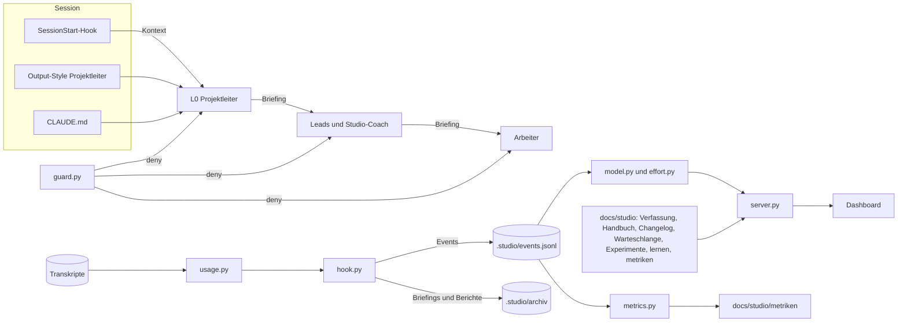

# Studio 1.5 — Projektleiter, Autonomie, Transparenz, Selbstverbesserung — Design-Spec

Datum: 2026-09-30 · Status: freigegeben durch L0 (Nutzer: „selbstständig, ohne Rückfragen"; Gate als
Ruling R22 ff.) · Prozessstufe: voll · Umsetzung: Branch `feat/studio-autonomie`

## Verständnis des Auftrags

**Was der Nutzer gesagt hat** (Auftrag „Session 1.5"): Jede neue Session in diesem Repo ist
automatisch der Projektleiter (L0). L0 handelt selbstständig und wartet nie untätig. Vorbehalte
(Laufzeit-Abhängigkeiten, Folgeissues, Lizenz-Grenzfälle) gehen in eine Warteschlange, um die herum
weitergearbeitet wird. Irreversible Aktionen sind verboten statt nachgefragt. Eine vom Team nicht
änderbare Verfassung trennt die Nutzerregeln vom veränderbaren, versionierten Handbuch. Das
Dashboard zeigt, wer wann wen womit mit welchem Aufwand beauftragt hat. Ein unabhängiger
Studio-Coach wertet die Daten aus und schlägt Experimente vor; L0 entscheidet. Probelauf am Ende,
danach sauberer Start mit Handbuch 1.0. Nur Standardbibliothek und reines HTML/JS; das Spiel bleibt
unverändert.

**Annahmen (von L0 getroffen, als Rulings festgehalten):**

- „Nicht Messbares wird nie geschätzt" gilt für Messwerte. Eine **Schätzung** vor der Delegation ist
  ausdrücklich gewünscht und wird als solche gekennzeichnet.
- Wo die übergeordnete `../CLAUDE.md` „nachfragen" und „auf den Nutzer warten" verlangt, gilt in
  diesem Repo die Autonomie-Regel der Verfassung; die Warteschlange ersetzt die Rückfrage.
- Das Wählen des nächsten Meilensteins aus dem bestehenden Spielkonzept ist kein Richtungswechsel;
  L0 entscheidet das selbst.
- Die Session-Regel „Commits und Pushes auf main sind erlaubt, wenn Tests und CI grün sind" wird als
  Dauerregel in die Verfassung übernommen — sonst stockt jede autonome Session beim Merge. Der Nutzer
  kann sie beim Bestätigen der Verfassung streichen.

**Erfolgskriterien:**

1. Eine frische Session (auch nach `/clear`, `/compact`, `--resume`) meldet sich als Projektleiter
   mit Kurzbericht, ohne Rückfrage, und arbeitet am Plan weiter.
2. Das Dashboard zeigt für eine Delegation über zwei Ebenen: wer, wann, an wen, Briefing-Link,
   Schätzung, gemessene Dauer, Tool-Aufrufe und Tokens je Modell, Ergebnis.
3. Ein Warteschlangen-Eintrag blockiert nur sein Paket; anderes läuft weiter.
4. Retro → Experiment → Ruling → Handbuch-Version + CHANGELOG ist einmal vollständig durchlaufen.
5. `make check` grün; `src/` unverändert.

## Überblick der Bausteine



## 1. Projektleiter als Standard jeder Session

Drei Schichten, jede für sich wirksam:

| Schicht                                                                       | Wirkt                                         | Zweck                                                                |
| ----------------------------------------------------------------------------- | --------------------------------------------- | -------------------------------------------------------------------- |
| **Output-Style** `.claude/output-styles/projektleiter.md`, `"outputStyle": "Projektleiter"` in `.claude/settings.json` | Systemprompt der Hauptsession, jede Anfrage   | Rolle, Autonomie, Start- und Ende-Routine in Kurzform               |
| **SessionStart-Hook** (`startup`, `resume`, `clear`, `compact`)               | Kontext zu Beginn und nach Kompaktierung      | Stand laden: Rolle, Handbuch-Version, state.md, lernen.md, Warteschlange, Experimente, fällige Retros, Dashboard-URL |
| **CLAUDE.md**                                                                 | immer geladen                                 | Dauerregel „Hauptsession = L0"; Vorrang der Autonomie vor `../CLAUDE.md` |

- **Output-Style statt `agent`-Setting.** Laut aktueller Doku (code.claude.com/docs/en/sub-agents)
  ersetzt `"agent"` den Standard-Systemprompt vollständig (R4 bleibt). Ein eigener Output-Style mit
  `keep-coding-instructions: true` **ergänzt** den Systemprompt, behält die Software-Engineering-
  Anweisungen, gilt nur für die Hauptsession (und Forks), nicht für Subagenten
  (code.claude.com/docs/en/output-styles). Das ist die unterstützte Form der „L0-Persona als
  Hauptagent in den Projekt-Settings".
- **SessionStart-Hook** baut den Kontext mit `tools/studio/context.py` (≤ 9 500 Zeichen, Doku-Grenze
  10 000; jede Quelle wird einzeln gekürzt, mit Verweis auf die Datei) und startet den
  Dashboard-Server losgelöst (`start.sh`, idempotent). Der Browser öffnet sich weiterhin erst beim
  ersten Subagenten-Start (R21).
- **Start-Routine** (Output-Style und STUDIO.md): Stand laden → Dashboard-URL nennen → Bericht in
  höchstens 10 Zeilen (Stand, seit letzter Session erledigt, laufend, offene Nutzerentscheide) →
  neue Anweisung = Auftrag, sonst Plan aus `state.md` selbstständig fortsetzen. Mehrdeutige
  Anweisungen: plausibelste Auslegung wählen, als Ruling festhalten, handeln.
- **Grenze:** Claude Code antwortet erst auf die erste Eingabe. „Automatisch" heisst: Die erste
  Antwort jeder Session ist der Start-Bericht, egal was der Nutzer eingibt.

`state.md` bekommt den Abschnitt **„Seit letzter Session erledigt"**, den L0 am Session-Ende füllt.

## 2. Autonomie und Warteschlange

- **Warteschlange** = `docs/studio/warteschlange.md` (committet, einzige Quelle). Eintrag:

  ```markdown
  ## N-001 · offen · 2026-09-30 · Kurztitel
  - Frage: …
  - Empfehlung: …
  - Begründung: …
  - Kosten des Wartens: …
  - Blockiert: M5-03 (oder „nichts")
  - Von: lead-tech
  - Antwort: –
  ```

  Status: `offen` → `beantwortet` (Antwort des Nutzers eingetragen) → `umgesetzt`.
  `log.py queue` legt Einträge an, trägt Antworten ein und schliesst sie (schreibt die Datei und ein
  `queue`-Event). Der Nutzer darf die Datei auch von Hand bearbeiten; der Parser ist tolerant.
- **Um den Punkt herum weiterarbeiten:** Das blockierte Paket geht auf `blocked` mit
  `--blocked-by N-001`; L0 zieht das nächste ungeblockte Paket vor.
- **Antwort des Nutzers** in einer beliebigen Session: L0 trägt sie mit `log.py queue --answer` ein,
  setzt sie um, schliesst mit `--done`. Der SessionStart-Kontext listet offene und beantwortete,
  noch nicht umgesetzte Einträge.
- `log.py decision` bleibt für Entscheide **an L0** (Eskalationen). `--for user` bricht mit Exit 2
  und dem Hinweis auf `log.py queue` ab (kein Event, keine stille Umlenkung); Personas und Vorlagen
  verwenden `--for user` nicht mehr (Konsistenztest).

### Verbotene irreversible Aktionen — `tools/studio/guard.py`

Eigener PreToolUse-Hook (Matcher `Bash|Edit|Write|MultiEdit|NotebookEdit`), antwortet bei Treffer
mit `permissionDecision: "deny"` und Begründung (JSON auf stdout, Exit 0 — funktioniert trotz
`|| true`-Hülle). Gilt für L0, Leads und Arbeiter. Muster (best effort, Befehl per `shlex` in
Teilbefehle an `;`, `&&`, `||`, `|` zerlegt):

| Verboten                                   | Erkennung                                                                                     |
| ------------------------------------------ | --------------------------------------------------------------------------------------------- |
| Force-Push, Löschen entfernter Branches     | `git push` mit `-f`, `--force*`, `--mirror`, `--delete`, `-d`, Refspec mit `+` oder `:`-Präfix |
| Löschen von Branches mit ungemergter Arbeit | `git branch -D`, `git branch --delete --force`/`-df`                                           |
| Umschreiben der History                     | `git rebase` (ausser `--abort`), `git filter-branch`, `git filter-repo`, `git reset --hard`, `git update-ref -d`, `git reflog expire`, `git stash clear` |
| Verlust ungesicherter Arbeit                | `git clean` mit `-f`, `git worktree remove` mit `--force`/`-f`                                 |
| Löschen ausserhalb des Repos                | `rm`, `rmdir`, `unlink`, `find … -delete` mit Ziel ausserhalb der Repo-Wurzel; erlaubt bleiben `/tmp`, `/private/tmp`, `/var/folders`, `$TMPDIR` |

Zusätzlich: `git`-Optionen vor dem Unterbefehl (`-C`, `-c`, `--git-dir=…`) werden übersprungen,
der Inhalt von `bash -c`/`sh -c`/`zsh -c`/`eval` wird rekursiv geprüft. „Repo" ist das **Hauptrepo**
(`paths.repo_root()`, auch aus Worktrees), relative Pfade gelten ab dem `cwd` des Hook-Aufrufs.

**Nicht verboten** (bewusste Grenze, im Handbuch genannt): Verwerfen ungesicherter Änderungen im
Arbeitsbaum (`git checkout -- <pfad>`, `git restore`, `switch --discard-changes`) — das steht nicht
auf der Liste des Nutzers und wird für Aufräumarbeiten gebraucht. Fehler im Guard lassen die Aktion
zu (ein Hook darf die Session nie lahmlegen). Der Guard ist ein **Schutz gegen Versehen, nicht gegen
Absicht** (z. B. `$(…)`-Konstrukte, Skripte); das steht so in der Verfassung.

### Verfassungs-Schutz

`guard.py` verweigert Edit/Write/MultiEdit/NotebookEdit auf `docs/studio/VERFASSUNG.md` und
Bash-Befehle, die die Datei nennen und schreibend wirken (`>`, `tee`, `sed -i`, `perl -i`, `mv`,
`cp`, `rm`, `truncate`, `git checkout`, `git restore`, `git rm`, `git mv`). **Freigabe:** Schreibt der
Nutzer in einem eigenen Prompt die Phrase `VERFASSUNG ÄNDERN`, legt `guard.py` (auch als
UserPromptSubmit-Hook registriert) die Marke `.studio/verfassung-ok/<session_id>` an; für diese
Session ist die Datei dann änderbar. Agenten-Meldungen (`<task-notification>`, `<agent-message`)
zählen nie als Freigabe. Die Freigabe gilt nur für die **Hauptsession** (PreToolUse ohne
`agent_id`), nicht für Subagenten. Mitgeschützt (gleiche Freigabe): `tools/studio/guard.py`, der
Marken-Ordner `.studio/verfassung-ok/`, und Bash-Aufrufe von `claude` mit der Freigabe-Phrase. Die
Guard-Einträge in `.claude/settings.json` schützt die Verfassung als Regel (§1), nicht technisch.

**Bestätigung der Verfassung:** L0 schreibt die Verfassung 1.0 als Entwurf und legt den ersten
Warteschlangen-Eintrag `N-001 · Verfassung 1.0 bestätigen` an. Bis zur Antwort gilt sie vorläufig.
Betroffen sind auch Punkte, die laut bisheriger Befugnistabelle dem Nutzer gehören (Push-Regel §7,
Vorrang vor `../CLAUDE.md`).

## 3. Verfassung, Handbuch, Changelog, Versionen

- **`docs/studio/VERFASSUNG.md`** (Version 1.0, nur Nutzer): §1 Vorrang und Änderung, §2
  Ansprechperson, §3 Feste Regeln (Briefing-Block, wörtlich), §4 Asset- und Lizenzregeln, §5
  Autonomie und Warteschlange, §6 Verbotene irreversible Aktionen, §7 Commits und Pushes, §8
  Transparenz und Logging, §9 Nicht abschwächbare Qualitätssicherung, §10 Verbesserungsprozess
  (Grundzüge). Rangfolge: Verfassung > Handbuch > Persona > Briefing.
- **`docs/studio/STUDIO.md`** = Handbuch, Kopfzeile `Version: 1.0`. Aus ihm wandern Feste Regeln,
  Asset-Regeln und der Abschnitt „Was den Nutzer betrifft" in die Verfassung (dort nur noch Verweis).
  Neu: Autonomie-Ablauf, Messung und ihre Grenzen, Verbesserungsschleife, erweiterte Start- und
  Ende-Routine, neue Log-Befehle. Änderbar durch das Team **nur** über den Verbesserungsprozess.
- **`docs/studio/CHANGELOG.md`**: Einträge `## <Datum> · <Gegenstand> <Version>` mit Gegenstand
  `Handbuch` oder `Persona <name>`, darunter Anlass, Datenbasis, Ruling, Änderungen. Neueste oben.
- **Persona-Version:** Frontmatter-Feld `version: 1.0` in jeder `.claude/agents/*.md`. Claude Code
  ignoriert unbekannte Felder ohne Fehler (Doku sub-agents); frühere Fassungen über git.
- **Konsistenztest** (`tools/studio/tests/test_docs.py`, Teil von `make check`): Handbuch-Version =
  neuester Handbuch-Eintrag im CHANGELOG; jede Persona hat `version`, und sie stimmt mit ihrem
  neuesten CHANGELOG-Eintrag überein (ohne Eintrag: 1.0); höchstens 3 Experimente `laufend`;
  `lernen.md` höchstens 40 Inhaltszeilen; Verfassung enthält alle Paragrafen; Warteschlange und
  Experimente parsen ohne Fehler.

## 4. Transparenz und Aufwandsmessung

### Event-Schema (additiv; alte Events bleiben lesbar)

Alle Events: bisherige Felder + `handbook_version` (aus STUDIO.md-Kopf, vom Hook bzw. `log.py`
gelesen). `package` heisst neu `package_id` (Modell liest beide).

| Event                     | Neue Felder                                                                                                    |
| ------------------------- | -------------------------------------------------------------------------------------------------------------- |
| `spawn` (Delegation)      | `package_id`, `milestone` (Kopfzeile `Meilenstein:`), `estimate` {`minutes`, `tools`} (Kopfzeile `Schätzung: 20 min, 30 Tools`), `persona_version` (Ziel-Persona), `briefing` (Archivpfad) |
| `spawned` (Agent-Ergebnis) | `duration_ms`, `tool_count`, `resolved_model` aus `tool_response` (nur Vordergrund-Aufrufe)                      |
| `agent_start`, `agent_stop` | `persona_version`; bei Stop zusätzlich `report` (Archivpfad), `usage` (Tokens je Modell)                        |
| `usage` (neu)             | L0-Tokens je Modell, kumuliert (Stop- und SessionEnd-Hook); bei SessionEnd zusätzlich `session_cost` aus `cost-state` |
| `result` (neu, `log.py`)  | `package_id`, `role` (abnehmender Lead), `worker`, `outcome` (`angenommen`/`nacharbeit`/`verworfen`), `review_rounds` |
| `milestone` (neu)         | `milestone`, `status` (`start`/`done`), `title`                                                                 |
| `retro` (neu)             | `retro_id`, `kind` (`meilenstein`/`session`/`adhoc`), `triggers` (Vorfall-IDs), `report` (Pfad)               |
| `queue` (neu)             | `queue_id`, `action` (`add`/`answer`/`done`), `question`, `blocks`                                             |
| `ci` (neu, `ci.py`)       | `run_id`, `conclusion`, `branch`, `sha`, `workflow`, `created`                                                  |

### Messung — was wie gemessen wird

| Grösse                 | Quelle                                                                                           | Güte                                          |
| ---------------------- | ------------------------------------------------------------------------------------------------ | --------------------------------------------- |
| Dauer je Agent         | Summe der Läufe SubagentStart→SubagentStop (Fortsetzungen eingeschlossen); bei Vordergrund zusätzlich `totalDurationMs` | gemessen                                      |
| Tool-Aufrufe je Agent  | Zahl der PreToolUse-Events des Agenten; bei Vordergrund `totalToolUseCount` zum Abgleich (vorhanden im Agent-Ergebnis, am Transkript nachgewiesen) | gemessen; Untergrenze, falls ein Hook am 5-s-Timeout scheitert |
| Tokens je Agent/Modell | Subagent-Transkript `…/<session>/subagents/agent-<id>.jsonl`; je Message-ID dedupliziert (Maximum), getrennt: Input, Cache-Schreiben, Cache-Lesen, Output | Input gemessen; Output **Untergrenze**, falls Einträge ohne `stop_reason` fehlen (Anteil wird ausgewiesen) |
| Tokens L0              | Haupt-Transkript (`isSidechain: false`), inkrementell je Turn                                    | wie oben                                       |
| Sitzungssumme          | `cost-state`-Eintrag im Haupt-Transkript (nach Session-Ende): Tokens je Modell inkl. interner Hilfsaufrufe; Kosten | Tokens gemessen; Kosten **berechnet** (Listenpreis laut Claude Code, keine Abrechnung); nur beendete Sessions |
| Schätzung              | Briefing-Kopfzeile `Schätzung:` — meint den **ganzen Auftrag inkl. aller Unteraufträge**; verglichen mit Dauer des Agenten (Wanduhr) und Tool-Aufrufen seines Teilbaums | Schätzung, als solche markiert; fehlt → „keine Schätzung" |
| Ergebnis, Review-Runden | `log.py result` durch den abnehmenden Lead                                                      | erfasst; fehlt → „nicht erfasst"               |
| Fortsetzungen          | erneutes SubagentStart derselben Agent-ID (SendMessage)                                           | gemessen                                      |
| CI                     | `ci.py` über `gh run list` (SessionStart losgelöst, Session-Ende, nach Push)                       | gemessen; ohne `gh` → „nicht gemessen"          |
| Eskalationen           | `decision --for l0` + Warteschlangen-Einträge                                                     | erfasst                                       |
| Inaktiv/gescheitert    | Status `failed` (erfasst); Lücke ohne Lebenszeichen > `STUDIO_INACTIVE_SECONDS` bei lebendem Status | Lücke gemessen, „inaktiv" ist eine **Heuristik** (lange Bash-Aufrufe erzeugen keine Lebenszeichen) |

**Nicht messbar** (im Dashboard „nicht gemessen"): Kosten je Agent (nur Sitzungssumme), Denkzeit
ohne Tool-Aufruf, Tokens von Hilfsaufrufen je Agent, Aufwand des Nutzers.

### Archiv `.studio/archiv/` (lokal, gitignored)

- `briefings/<ts>-<persona>-<kurz-id>.md`: voller Prompt jeder Delegation (spawn).
- `berichte/<ts>-<rolle>-<agent-id>.md`: volle Schlussmeldung jedes Agenten (SubagentStop).
- `events/events-<stamp>.jsonl`: archivierte Event-Dateien (zieht von `.studio/archive/` um; alter
  Ordner wird weiter gelesen).
- Server liefert Dateien unter `/archiv/<pfad>` als `text/plain` (nur `.md`/`.jsonl` innerhalb des
  Archivs; Pfad-Traversal abgewiesen).

### Aggregation — `tools/studio/effort.py` (rein, ohne I/O)

Aus den Knoten des Modells entstehen **Agenten-Datensätze** (Rolle, Ebene, Bereich, Eltern-Rolle,
Lead, Paket, Meilenstein, Modell, Versionen, Start, Dauer, Tool-Aufrufe, Tokens je Modell,
Output-Vollständigkeit, Schätzung, Ergebnis, Review-Runden, Fortsetzungen, Endstatus, längste
Lücke) und daraus:

- **Delegationen**: Zeitpunkt, von → an, Paket, Meilenstein, Modell, Briefing-Link, Schätzung,
  Ist (Dauer, Tools, Tokens), Bericht-Link, Ergebnis.
- **Aufwand** je Agent-Rolle, Paket, Lead (eigener + Teilbaum), Meilenstein, Modell; Schätzung vs.
  Ist (Summe und Abweichung in %, nur über Delegationen mit Schätzung).
- **Qualität**: Annahmequote beim ersten Wurf (`angenommen` mit `review_rounds == 1` / geprüfte
  Ergebnisse mit `review_rounds ≥ 1`; `review_rounds == 0` = ungeprüft, wird separat ausgewiesen und
  nie als Treffer gezählt), Review-Runden (Mittel, Max), Nacharbeit (Anzahl, Anteil), verworfen, CI-Fehlschläge
  auf main, Eskalationen, gescheiterte Agenten, Agenten mit Lücke.
- **Vorfälle** (Auslöser Ad-hoc-Retro) mit stabiler ID: `failed:<agent>`, `inaktiv:<agent>` (jetzt
  inaktiv), `ci:<run>`, `budget:<lead>:<phase>` (verbraucht > 1,5 × Freigabe), `runden:<paket>`
  (> 3 Review-Runden), `meilenstein:<id>` (Meilenstein `done` → Pflicht-Retro). Ein Vorfall gilt
  als erledigt, sobald ein `retro`-Event ihn in `triggers` nennt.

Meilenstein-Zuordnung: Kopfzeile bzw. `--milestone` → Meilenstein des Pakets → der zum Zeitpunkt
laufende Meilenstein (`milestone start`/`done`, sessionübergreifend) → „ohne".

### Verdichtung — `tools/studio/metrics.py`

`python3 tools/studio/metrics.py --session <id|latest>` bzw. `--milestone <id>` (Make:
`make studio-metrics`) liest `events.jsonl` und alle archivierten Event-Dateien, ergänzt beendete
Sessions um `cost-state` und schreibt `docs/studio/metriken/<kennung>.md`
(`S-<datum>-<sid8>` bzw. Meilenstein-ID): Tabellen für Menschen und am Ende ein
```` ```json ```` -Block „Rohwerte" für Dashboard-Verlauf und Coach. Idempotent (überschreibt).
Diese Dateien werden committet; sie überdauern das lokale Archiv.

### Dashboard

Reiter (Hash-Links `#live`, `#delegation`, `#aufwand`, `#qualitaet`, `#studio`):

1. **Live** — bisherige Ansichten; „Offene Entscheide" zeigt L0-Entscheide, daneben neu die
   **Nutzerentscheid-Warteschlange** (offen/beantwortet, Empfehlung, Kosten des Wartens,
   Blockiert) und ein Banner „Retro fällig", wenn Vorfälle offen sind.
2. **Delegation** — Zeitachse (neueste oben) mit Briefing- und Bericht-Links.
3. **Aufwand** — Tabellen je Agent, Paket, Lead, Meilenstein, Modell; Schätzung vs. Ist.
4. **Qualität** — Kennzahlen, offene Vorfälle, Verlauf über die Meilensteine (aus `metriken/`).
5. **Studio** — Handbuch- und Verfassungsversion, CHANGELOG, Experimente mit Status, lernen.md,
   Organigramm aus `.claude/agents/` mit Persona-Versionen und Modellen.

Sicherheit wie bisher: nur `textContent`, nur 127.0.0.1, Host-Prüfung, keine schreibenden Endpunkte.

## 5. Verbesserungsschleife

- **Studio-Coach** `studio-coach` (L1-Stabsstelle direkt unter L0, Bereich `studio`, `opus`,
  Tools Read, Grep, Glob, Bash, Write, Edit, SendMessage — kein `Agent`). Arbeitet nicht an Spiel
  oder Doku, sondern wertet aus, moderiert Retros, schlägt vor, bewertet Experimente, pflegt
  `lernen.md` und `experimente.md`, schreibt Retro-Berichte nach `docs/studio/retros/`. Setzt nach
  L0-Ruling angenommene Änderungen um (Handbuch, Personas, Vorlagen, Version, CHANGELOG) — er ist
  nicht in Production, benotet also nicht die eigene Arbeit. Namensschema ergänzt: `studio-<rolle>`
  = Stabsstelle L1 (R11 erweitert).
- **Auslöser:** Meilenstein-Retro (Pflicht), Kurz-Retro am Session-Ende, Ad-hoc-Retro bei Vorfall.
  Offene Vorfälle erscheinen im Dashboard und — einmal je Vorfall und Session — als Hinweis im
  Kontext (UserPromptSubmit-Hook).
- **Ablauf:** Coach verdichtet (`metrics.py`), liest Berichte und Archiv, befragt Leads per
  `SendMessage` (L0 nennt ihm die Agent-IDs der Leads dieser Session; nicht erreichbare Leads →
  Archiv-Berichte). Liefert Befunde und höchstens 3 Vorschläge; jeder ist ein **Experiment** nach
  `templates/experiment.md` (Hypothese, Messgrösse mit Schwelle, Beobachtungszeitraum,
  Rückfallzustand, betroffene Dateien). L0 entscheidet je Vorschlag per Ruling. Annahme → Coach
  ändert, zählt Version hoch (Handbuch: Minor je Experiment, Major bei Umbau der Organisation;
  Persona: Minor), CHANGELOG-Eintrag, Experiment `laufend`. Nach dem Zeitraum bewertet der Coach
  gegen die vorab festgelegte Schwelle: `behalten` / `angepasst` / `zurückgenommen`; L0 bestätigt
  per Ruling.
- **Leitplanken:** Verfassung tabu (Vorschläge → Warteschlange); höchstens 3 laufende Experimente
  (Test); jede Änderung mit Datenbasis (Metrik-Datei oder Retro-Bericht), Ausnahme offensichtliche
  Fehler; kein Experiment darf die Messbarkeit seiner Wirkung verschlechtern (Prüffrage des Coachs).
- **`docs/studio/lernen.md`**: kuratierte Erkenntnisse, höchstens 40 Inhaltszeilen, vom Coach
  gepflegt, beim Session-Start geladen.
- **Kosten:** Kurz-Retro ≤ 1 Coach-Start, ≤ 15 Tool-Aufrufe; Meilenstein-Retro ≤ 1 Coach-Start.

## 6. Session-Ende-Routine

1. Laufende Agenten abschliessen oder pausieren und loggen.
2. `make studio-metrics` (Session) — bei Meilenstein-Ende zusätzlich `--milestone`.
3. Kurz-Retro durch den Coach (Befunde, ggf. ≤ 3 Experiment-Vorschläge; L0 entscheidet).
4. `state.md` (inkl. „Seit letzter Session erledigt") und `lernen.md` nachführen, committen.
5. Kurzbericht an den Nutzer: erledigt · Aufwand · Handbuch-Änderungen · offene Nutzerentscheide.

## 7. Probelauf

Eigenes `STUDIO_HOME` (Scratchpad) und eigener Dashboard-Port, damit die Probedaten die echten
Metriken nicht verfälschen; headless mit `--dangerously-skip-permissions` (lokal, rein lesende
Aufträge). Das Ergebnis wird als Protokoll mit Screenshots unter `docs/studio/probelauf/`
committet (Nachweis überdauert das Zurücksetzen). `/clear` und `/compact` deckt headless nicht ab:
Test, dass der SessionStart-Hook ohne Matcher registriert ist (alle Quellen), plus Prüfpunkt im
Protokoll.

In einer **neuen, headless** Session (`claude -p`, lädt Output-Style, Hooks, Agents): (1) Start-
Bericht ohne Rückfrage; (2) L0 → `lead-qa` → `qa-code-reviewer`, rein lesend, mit Schätzung und
`log.py result`; (3) künstlicher Eintrag `N-900` blockiert `PROBE-B`, `PROBE-C` läuft weiter;
(4) Mini-Retro durch `studio-coach` mit einem Experiment-Vorschlag `E-900`; (5) L0 nimmt an →
Handbuch 1.1 + CHANGELOG. Guard-Probe: Versuch, `VERFASSUNG.md` zu ändern, wird abgewiesen.
Dashboard-Screenshots per Headless-Chrome je Reiter. Danach: Events archivieren, Teständerungen an
Handbuch, CHANGELOG, Warteschlange, Experimenten, Retros und Metriken per `git checkout`/Löschen der
Testdateien zurücknehmen (die Probe-Änderungen werden nie committet); Studio startet mit Handbuch
1.0. Nachweis „Spiel unverändert": `git diff main -- src/ tests/ public/` ist leer.

## Fehlerbehandlung und Tests

- Hooks (`hook.py`, `guard.py`) werfen nie; `context.py`, `usage.py` liefern bei Fehlern leere
  Teile. Dashboard-Teilansichten fallen einzeln aus (Anzeige „nicht verfügbar"), nicht das Ganze.
- Unit-Tests (`unittest`) für: guard (erlaubt/verboten je Muster, Verfassungs-Freigabe),
  context (Kürzung, Grenzen), usage (Deduplikation, Untergrenze, cost-state), hook (neue Felder,
  Archiv), log (neue Arten, Warteschlangen-Datei), model/effort (Datensätze, Aggregation,
  Qualität, Vorfälle), studio_docs (Parser), metrics (Datei-Ausgabe), server (neue Felder,
  `/archiv/`-Schutz), Dokumenten-Konsistenz.
- Dashboard: Sichtprüfung per Headless-Chrome-Screenshots (R16).

## Nicht in dieser Session

Spielcode, Projektarbeit, Kostenschätzung in Franken, Mehrbenutzer-Sicht, automatische Retros ohne
L0-Entscheid, Änderungen an der gemeinsamen `../CLAUDE.md`.

## Gate Spec (lead-qa: BEDENKEN) — eingearbeitet

Guard: Git-Optionen, `bash -c`, Hauptrepo-Wurzel, Positiv-Tests für normale Studio-Arbeit,
Grenze „Verwerfen im Arbeitsbaum" benannt, Freigabe nur Hauptsession, Mitschutz von `guard.py` und
Marken, ehrliche Formulierung „gegen Versehen". Verfassung: Bestätigung über N-001. Messung:
„berechnet", „Heuristik", Untergrenzen, `review_rounds == 0` ungeprüft, Umfang der Schätzung.
`decision --for user` bricht ab. Probelauf: eigenes `STUDIO_HOME`, Protokoll committet. Die
Studio-Variante der Gate-Prüffragen fehlt in `gates.md` → `docs/beobachtungen.md`.

## Rulings dieser Spec

Stehen ab R22 in `docs/studio/rulings.md`: R22 Umsetzungsweg, R23 Projektleiter-Mechanismus, R24
Verfassungs-Schutz, R25 Guard für irreversible Aktionen, R26 Warteschlange als Datei, R27
Messmethode, R28 Studio-Coach als Stabsstelle, R29 Experimente und Konsistenztest, R30
Metrik-Dateiformat, R31 Archiv-Ordner, R32 Dashboard-Reiter, R33 Push-Regel in der Verfassung,
R34 Gate Spec bestanden mit eingearbeiteten Bedenken.
