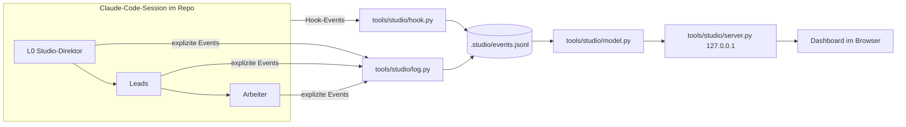

# Virtuelles Game-Dev-Studio — Design-Spec

Datum: 2026-09-30 · Status: freigegeben (Nutzer hat freie Hand gegeben; Gates in der Setup-Session
entschieden) · Umsetzung: Setup-Session, Branch `feat/studio`

## Auftrag und Abgrenzung

Richtet die **Arbeitsweise** ein, nicht das Spiel. Künftig arbeitet ein hierarchisches Studio aus
Subagenten mit festen Personas an Inselreich. Der Nutzer spricht nur mit dem Studio-Direktor (L0).

Grundlage ist der Setup-Prompt des Nutzers (Deliverables 1–9). Ergänzt um:

- **Bausteine aus Claude Code Game Studios (CCGS)**, MIT, Commit
  `b21fa0f7f289fc3e726cf36fb12b9bc1e7a51e4d`: Gate-Prüfungen (director-gates), Persona-Texte als
  Rohmaterial, Subagent-Hooks als Telemetriequelle, Zustandsdatei gegen Kontextverlust, die Lehre
  „wenig Prozess als Standard" (Rigor-Messung).
- **Dashboard-Form nach disler/claude-code-hooks-multi-agent-observability**: Hooks → lokaler
  Server → Live-Oberfläche mit Event-Feed, Aktivitäts-Puls und Filter nach Session. Das Repo hat
  **keine Lizenz** — übernommen wird nur die Idee, kein Code. Technik bewusst anders (siehe unten).

Nicht in dieser Session: Code unter `src/`, Spielinhalte, Projektarbeit (Recherche, Spec für das
Spiel), das Attributions-Panel im Spiel.

## Machbarkeit (Deliverable 1) — Ergebnis der Kurztests

Getestet mit Claude Code 2.1.285, headless (`claude -p`) in einem isolierten Testprojekt mit
Hooks, die jedes Event protokollieren.

| Frage                                 | Ergebnis                                                                                                                                                                                                                                                                                                                            |
| ------------------------------------- | ----------------------------------------------------------------------------------------------------------------------------------------------------------------------------------------------------------------------------------------------------------------------------------------------------------------------------------- |
| Kann ein Subagent Subagenten starten? | **Ja.** Main → `test-lead` → `test-worker` lief. Bedingung: `Agent` steht in `tools` des Leads. Tiefe laut Doku 3 Ebenen unter Main (`CLAUDE_CODE_MAX_SUBAGENT_SPAWN_DEPTH`), 20 gleichzeitig.                                                                                                                                      |
| Berichtsweg L2 → L1 → L0?             | **Ja, wenn der Lead im Vordergrund startet.** Standardmässig laufen Subagenten im Hintergrund; ein Lead, der nicht wartet, beendet sich, und die Meldung des Arbeiters landet bei Main. Mit `run_in_background: false` blockiert der Lead, erhält das Ergebnis selbst, und Main sieht nur den Lead-Bericht (Test 2, 20-s-Arbeiter). |
| Hooks                                 | `SessionStart`, `SessionEnd`, `UserPromptSubmit`, `Stop`, `SubagentStart`, `SubagentStop`, `PreToolUse`, `PostToolUse` (u. a.). Tool-Hooks feuern auch in Subagenten und tragen `agent_id`, `agent_type`. `SubagentStop` liefert `last_assistant_message`. Kein Eltern-Feld.                                                        |
| Eltern-Kind-Zuordnung                 | Rekonstruierbar: `PreToolUse(Agent)` des Elternteils (mit `subagent_type`, `prompt`) → `SubagentStart` des Kindes; `PostToolUse(Agent)` liefert `tool_response.agentId` des Kindes und bestätigt.                                                                                                                                   |
| Kennt ein Agent seine ID?             | **Nein.** Im Bash-Umfeld steht `CLAUDE_CODE_SESSION_ID`, aber keine `agent_id`. Zuordnung expliziter Log-Events über den Hook, der den `log.py`-Aufruf mit `agent_id` sieht.                                                                                                                                                        |
| L1 als eigene headless Sessions?      | Möglich (`claude -p` im Worktree lädt Projekt-Hooks und Agents; Cross-Session-Messaging existiert), aber Steuerung, Berichtsweg und Kosten sind schwerer zu kontrollieren.                                                                                                                                                          |
| Agent Teams (experimentell)           | Keine verschachtelten Teams → passt nicht zu drei Ebenen.                                                                                                                                                                                                                                                                           |
| Hauptsession als eigener Agent        | Möglich (`"agent"` in settings), aber ein Agent-Prompt **ersetzt** den Standard-Systemprompt von Claude Code. Nicht genutzt; L0 wird über CLAUDE.md und STUDIO.md geführt.                                                                                                                                                          |

**Gewählt: Nativ.** L0 startet Leads (Hintergrund erlaubt), Leads starten ihre Arbeiter **immer im
Vordergrund** (`run_in_background: false`); Parallelität = mehrere Agent-Aufrufe in derselben
Nachricht. Arbeiter haben kein `Agent`-Tool. **Rückfall: Variante B** (Lead schreibt Briefings als
Dateien, L0 startet 1:1). Festgehalten in ADR-007.

## Entscheidungen, die ich für den Nutzer getroffen habe (Rulings)

| #   | Entscheidung                                                                                                                        | Warum                                                                                                       | Kosten bei Irrtum                                                |
| --- | ----------------------------------------------------------------------------------------------------------------------------------- | ----------------------------------------------------------------------------------------------------------- | ---------------------------------------------------------------- |
| R1  | Alle 5 Leads, aber nur 8 Arbeiter-Personas jetzt; die übrigen als „auf Abruf" im Roster                                             | CCGS-Kritik: viel Organisation, wenig Spiel. Personas entstehen, wenn ein Paket sie braucht.                | Ein Lead legt eine Persona nach Vorlage an (ein Commit).         |
| R2  | Prozessstufen **leicht** (Standard) und **voll**                                                                                    | CCGS-Rigor-Messung: schwerer Prozess brachte kein besseres Spiel.                                           | Zu leichte Stufe → Review findet mehr; L0 stuft hoch.            |
| R3  | Dauerhafter Ruling-Ledger `docs/studio/rulings.md`                                                                                  | Der superpowers-Ledger (`.superpowers/sdd/…/progress.md`) ist gitignored und wird nach jedem Plan gelöscht. | Doppelte Einträge; harmlos.                                      |
| R4  | L0 nicht über `"agent"`-Setting erzwingen                                                                                           | Ersetzt den Systemprompt von Claude Code; Risiko für Werkzeugnutzung.                                       | Rolle kann „verrutschen"; SessionStart-Hook erinnert daran.      |
| R5  | Telemetrie: Hooks schreiben append-only JSONL; Server liest; kein HTTP-POST aus Hooks                                               | Robust ohne laufenden Server; nur Standardbibliothek; keine Datenbank.                                      | Grosse Datei → Archivieren (`make studio-archive`).              |
| R6  | Dashboard pollt alle 2 s statt WebSocket                                                                                            | Standardbibliothek, einfach, genügt für Menschen-Tempo.                                                     | 2 s Verzögerung.                                                 |
| R7  | Worktrees unter `.worktrees/<name>` (gitignored), ein Worktree je paralleler Arbeitsstrang, nicht je Agent                          | superpowers-SDD: nie parallele Implementierer im selben Baum; Fix-Runden brauchen denselben Baum.           | Seltene Merge-Konflikte zwischen Strängen → Integrator löst.     |
| R8  | Python-Tests des Studios laufen in `make check` (und damit in CI)                                                                   | „Tests grün" soll auch für die Studio-Werkzeuge gelten.                                                     | CI braucht `python3` (auf ubuntu-latest vorhanden).              |
| R9  | Heartbeat-Ausnahme: Status `idle` wird nie als inaktiv markiert; ein Knoten mit aktiven Kindern auch nicht (das Kind wird markiert) | L0 wartet oft auf den Nutzer; ein Lead wartet blockierend auf Arbeiter.                                     | Ein wirklich hängender Lead ohne Kinder fällt trotzdem auf.      |
| R10 | Modellstufen: stark = `opus`, mittel = `sonnet`, klein = `haiku` — zentral in STUDIO.md                                             | Prompt verlangt Stufen; Aliase statt fester IDs überleben Modellwechsel.                                    | Stärkeres Modell verfügbar → Tabelle und Frontmatter nachführen. |
| R11 | Namensschema `lead-<bereich>` (L1) und `<bereich>-<rolle>` (L2); Bereiche `production`, `design`, `tech`, `art`, `qa`               | Dashboard leitet Ebene und Bereich aus dem Namen ab, ohne eigene Metadaten.                                 | Umbenennen einer Persona = Datei + Roster.                       |

## Architektur



### Dateien

```
.claude/settings.json              Hooks → tools/studio/hook.py
.claude/agents/                    5 Leads + 8 Arbeiter (Personas)
docs/studio/STUDIO.md              Handbuch (verbindlich)
docs/studio/gates.md               Gate-Prüfungen (adaptiert aus CCGS director-gates)
docs/studio/roster.md              Personas aktiv/auf Abruf, Namensschema, Modellstufen
docs/studio/rulings.md             Ruling-Ledger (dauerhaft)
docs/studio/state.md               Session-Übergabe
docs/studio/herkunft.md            Herkunft und Lizenz übernommener Bausteine
docs/studio/templates/             briefing, bericht, ruling, budgetantrag, uebergabe, persona, playtest-report
docs/adr/ADR-006 … ADR-008         Asset-Policy, Studio-Hierarchie, Studio-Telemetrie
docs/CREDITS.md, docs/licenses/    Asset-Nachweis und Lizenztexte (Gerüst)
tools/studio/paths.py              Repo-Wurzel (auch aus Worktrees) und .studio-Pfade
tools/studio/log.py                CLI für explizite Events
tools/studio/hook.py               Hook-Empfänger (stdin-JSON → Event)
tools/studio/model.py              Events → Zustand (Organigramm, Zähler, Chronik, Budget, Board, Entscheide, Feed, Puls)
tools/studio/server.py             HTTP-Server (127.0.0.1), /api/state + statische Dateien
tools/studio/start.sh              Server starten/stoppen, URL ausgeben
tools/studio/dashboard/            index.html, app.js, style.css
tools/studio/tests/                unittest (model, hook, log, server)
.studio/                           gitignored: events.jsonl, archive/, server.pid, handoffs/
```

### Event-Schema (eine JSON-Zeile je Event)

Pflichtfelder des Nutzer-Prompts plus `kind`/`source`:

| Feld                                | Bedeutung                                                                                                                                                                                                                                               |
| ----------------------------------- | ------------------------------------------------------------------------------------------------------------------------------------------------------------------------------------------------------------------------------------------------------- |
| `ts`                                | ISO-8601 UTC mit Millisekunden                                                                                                                                                                                                                          |
| `session_id`                        | Claude-Code-Session (Hook-Payload bzw. `CLAUDE_CODE_SESSION_ID`)                                                                                                                                                                                        |
| `agent_id`                          | Subagent-ID; `main` für die Hauptsession; bei `log.py` leer (Zuordnung siehe unten)                                                                                                                                                                     |
| `parent_id`                         | nur wo bekannt (bei `spawn`/`spawned`)                                                                                                                                                                                                                  |
| `level`, `role`, `persona`, `model` | soweit beim Schreiben bekannt; sonst leitet `model.py` sie ab                                                                                                                                                                                           |
| `status`                            | `active`, `delegated`, `waiting`, `blocked`, `idle`, `done`, `failed`, `ended`                                                                                                                                                                          |
| `task`, `summary`                   | ein Satz bzw. Ergebnis high level                                                                                                                                                                                                                       |
| `budget`                            | optional `{granted, parallel, phase}`                                                                                                                                                                                                                   |
| `kind`                              | `session_start`, `session_end`, `prompt`, `turn_end`, `agent_start`, `agent_stop`, `spawn` (PreToolUse Agent), `spawned` (PostToolUse Agent), `heartbeat` (PreToolUse sonst), `bind` (log.py-Aufruf gesehen), `status`, `budget`, `package`, `decision` |
| `source`                            | `hook` oder `log`                                                                                                                                                                                                                                       |

Weitere Felder je `kind`: `tool` (heartbeat), `subagent_type`/`description`/`prompt_head`
(spawn: erste 400 Zeichen, daraus `Persona:`- und `Paket:`-Zeile), `child_id` (spawned),
`package`, `title`, `owner`, `blocked_by`, `milestone` (package), `decision_id`, `for`
(`l0`|`user`), `question`, `recommendation`, `resolution` (decision).

### Zuordnungsregeln (`model.py`)

- **Knoten:** `main` je Session (L0) plus je `agent_id` ein Knoten.
- **Eltern:** `agent_start` wird der ältesten offenen `spawn`-Anfrage derselben Session mit
  passendem `subagent_type` zugeordnet (fehlt der Typ: `general-purpose`). `spawned` mit
  `child_id` überschreibt. Ohne Treffer: Elternteil `main`.
- **Rolle/Ebene/Bereich:** Rolle = `Persona:`-Zeile des Briefings, sonst `agent_type`.
  `lead-*` → L1, Bereich = Suffix; `<bereich>-*` → L2; `main` → L0 „Studio-Direktor";
  unbekannt → L2, Bereich „extern". Modell = `model` aus dem Agent-Aufruf, sonst aus der
  Frontmatter von `.claude/agents/<rolle>.md`, sonst „inherit".
- **Explizite Events (`log.py status`):** gehen an den Knoten aus dem jüngsten `bind` derselben
  Session mit gleicher Rolle innerhalb von 30 s davor; sonst an den zuletzt gestarteten, nicht
  beendeten Knoten gleicher Rolle (bei `--package` bevorzugt mit gleichem Paket); `--role
studio-director` → `main`.
- **Status:** `agent_start` → active; `agent_stop` → done (ausser zuletzt explizit `failed`);
  `prompt` → main active; `turn_end` → main idle; `session_end` → alle nicht abgeschlossenen
  Knoten der Session `ended`; explizite Events setzen den Status direkt. Ein Knoten mit aktiven
  Kindern und Status `active` wird als `delegated` angezeigt.
- **Lebenszeichen:** jedes Event des Knotens. **Inaktiv:** Status in
  {active, delegated, waiting, blocked}, keine aktiven Kinder, letztes Lebenszeichen älter als
  `STUDIO_INACTIVE_SECONDS` (Standard 300).
- **Budget:** jüngstes `budget`-Event je Lead eröffnet eine Phase (Freigabe `granted` Starts,
  `parallel` gleichzeitig); weitere Freigaben derselben Phase addieren. Verbraucht = Starts von
  Kindern dieses Leads seit Phasenbeginn; Parallelität = gemessenes Maximum gleichzeitig aktiver
  Kinder. Überschreitung, wenn verbraucht > frei oder Parallelität > frei. Modellmix = Starts je
  Modell.
- **Board:** jüngster Stand je Paket-ID. **Entscheide:** offen, bis ein `decision` mit
  `resolution` für dieselbe ID kommt.
- **Chronik:** `agent_stop` (Zusammenfassung = gekürzte `last_assistant_message`) und
  `status done` mit `summary`, je Bereich, neueste oben, filterbar nach Session.
- **Feed/Puls (disler):** letzte 80 Events; Events je Minute der letzten 60 Minuten je Bereich.

`model.py` liest die Datei inkrementell (Offset merken) und ist eine reine Funktion
`build_state(events, now, agents_dir) -> dict` für Tests.

### Hook (`hook.py`)

- Registriert in `.claude/settings.json` für `SessionStart`, `SessionEnd`, `UserPromptSubmit`,
  `Stop`, `SubagentStart`, `SubagentStop`, `PreToolUse` (alle Tools), `PostToolUse` (nur
  `Agent`). Aufruf `python3 "$CLAUDE_PROJECT_DIR/tools/studio/hook.py"`, Timeout 5 s.
- **Wirft nie und blockiert nie:** jeder Fehler → Exit 0, keine Ausgabe (ausser SessionStart).
- Schreibt nach `<Hauptrepo>/.studio/events.jsonl`, auch wenn aus einem Worktree aufgerufen
  (Wurzel über `.git`-Datei → `commondir`). `STUDIO_HOME` überschreibt den Pfad (Tests).
- `SessionStart` gibt als `additionalContext` eine Zwei-Zeilen-Erinnerung aus: Rolle L0, STUDIO.md
  und state.md lesen, `make studio` für das Dashboard (wirkt auch nach Kompaktierung, Idee aus
  CCGS `post-compact.sh`).
- Kürzt Texte (Prompt-Kopf 400, Nachrichten 600 Zeichen); speichert keine Tool-Ausgaben.

### log.py (CLI, nur Standardbibliothek)

```
log.py status   --role R --status S [--task T] [--summary X] [--package P]
log.py budget   --lead L --grant N [--parallel K] [--phase NAME]
log.py package  --id P --title T --owner R --status S [--blocked-by A,B] [--milestone M]
log.py decision --id D --for l0|user --question Q [--recommendation X] [--from R]
log.py decision --id D --resolution "Entscheid"
log.py archive                       # events.jsonl → .studio/archive/events-<ts>.jsonl
```

Validiert Status und Pflichtfelder (Exit 2 mit Meldung bei Fehlern), setzt `ts`, `session_id`
(aus `CLAUDE_CODE_SESSION_ID`, sonst `manual`), `source=log`.

### Server und Dashboard

- `server.py`: `ThreadingHTTPServer` auf **127.0.0.1** (Standard-Port 8765, `--port`), liefert
  `GET /api/state?session=<id|all>` und die Dateien aus `dashboard/` (nur diese; kein Pfad
  ausserhalb). Keine schreibenden Endpunkte.
- `start.sh`: startet den Server im Hintergrund (PID in `.studio/server.pid`, Log in
  `.studio/server.log`), idempotent; `start.sh stop` beendet ihn; gibt die URL aus.
- `dashboard/`: statisches HTML/CSS/JS ohne Pakete, pollt alle 2 s. Card-UI, CSS Grid,
  mobile-first, Hell/Dunkel über `prefers-color-scheme` plus Umschalter (in `localStorage`,
  try/catch). **Alle Daten per `textContent`** (keine HTML-Injektion aus Events).
- Ansichten: (1) Organigramm L0→L1→L2 mit Statusfarbe, Task, letztem Lebenszeichen, Inaktiv
  hervorgehoben; (2) Zähler je Status; (3) Chronik je Bereich mit Session-Filter; (4) Budget je
  Lead (Balken frei vs. verbraucht, rot bei Überschreitung, Modellmix); (5) Meilenstein-Board;
  (6) Offene Entscheide (L0 / Nutzer); (7) Live-Feed; (8) Aktivitäts-Puls. Kopfzeile: Session-
  Auswahl, Zeit des letzten Events, Verbindungsstatus.
- Nicht Teil des Spiels: liegt unter `tools/`, nicht in `vite`-Build, nicht auf Pages.

### Make-Ziele

`make studio` (Dashboard starten, URL ausgeben) · `make studio-stop` · `make studio-test`
(unittest) · `make studio-archive` · `check` ruft zusätzlich `studio-test` auf.

### Lint-/Format-Integration

- `.gitignore`: `.studio/`, `.worktrees/`. `.prettierignore` und ESLint-`ignores`: dieselben.
- ESLint-Block für `tools/studio/dashboard/**/*.js` mit Browser-Globals (ohne neues Paket, Globals
  von Hand). Prettier formatiert alle neuen `.md`/`.html`/`.css`/`.js`/`.json`.
- Python Ruff-kompatibel (lokal `uvx ruff check` / `uvx ruff format --check`, nicht in CI).

## Organisation (Kern von STUDIO.md)

### Ebenen und Befugnisse

| Wer         | Entscheidet selbst                                                                                                                      | Muss fragen                                         |
| ----------- | --------------------------------------------------------------------------------------------------------------------------------------- | --------------------------------------------------- |
| L2 Arbeiter | Umsetzung innerhalb des Briefings                                                                                                       | Lead: alles ausserhalb Scope/Ownership              |
| L1 Lead     | Zerlegung, Briefings, Modellwahl, Abnahme der Arbeiter, Querabstimmung, Budgetverteilung innerhalb der Freigabe                         | L0: Mehrbudget, Konflikte zwischen Bereichen, Gates |
| L0 Direktor | Gates Brainstorming/Spec/Plan/Merge, Budgetfreigaben, Konflikte, Prozessstufe, Rulings                                                  | Nutzer: siehe unten                                 |
| **Nutzer**  | neue Laufzeit-Abhängigkeiten, Folgeissues, Lizenz-Grenzfälle, Änderung von Handbuch-Regeln, Richtungswechsel des Spiels, Push-Ausnahmen | —                                                   |

### Prozessstufen (R2)

- **leicht (Standard):** Auftrag ≤ 1 Session, ≤ 3 Pakete, keine Architekturänderung. Brainstorming
  als Kurzdesign im Bericht des Design-Leads, Plan im Tech-Bericht, dann Umsetzung mit Review je
  Paket. Gates Spec und Plan fallen zu einem Gate zusammen.
- **voll:** neue Systeme, Save-Format, Architektur, Meilensteine. superpowers-Ablauf komplett:
  brainstorming → Spec (`docs/superpowers/specs/`) → writing-plans (`docs/superpowers/plans/`) →
  subagent-driven-development → Final-Review.

### Ablauf eines Meilensteins (voll)

1. Nutzer-Auftrag → L0 gibt Design ein Budget frei → Design-Lead (superpowers:brainstorming, L0 ist
   der Gesprächspartner) → Bericht mit Designvorschlag → **Gate Brainstorming** (L0).
2. Design-Lead schreibt Spec → **Gate Spec** (L0, Prüfung nach gates.md, Tech-Lead und QA-Lead geben
   ihr Urteil ab).
3. Tech-Lead schreibt Plan (superpowers:writing-plans) inkl. Datei-Ownership und Budgetantrag →
   **Gate Plan** (L0).
4. Tech-Lead führt aus (superpowers:subagent-driven-development als Controller, im Worktree):
   Implementierer (tech-*) + Task-Review durch `qa-code-reviewer`; UI-Pakete zusätzlich
   Browser-Check durch `qa-playtester`. Art-Pakete parallel durch den Art-Lead in eigenem Worktree.
5. QA-Lead: Final-Review (stärkstes Modell) + Determinismus/Regression → Bericht.
6. **Gate Merge** (L0) → Production-Lead lässt `production-integrator` seriell mergen, CI und
   Pages prüfen.

Budgetantrag Umsetzung = Pakete × 2 + QA-Checks + 1 Final-Review, plus 30 % Puffer (aufgerundet).

### Kommunikation

- Berichtsweg L2 → L1 → L0. Leads starten Arbeiter **im Vordergrund**; Parallelität über mehrere
  Agent-Aufrufe in einer Nachricht. Arbeiter starten keine Agenten.
- Querabstimmung: Übergabedokument (`templates/uebergabe.md`) unter `.studio/handoffs/`; Ergebnisse
  mit Bestand gehören in Spec, Plan oder Ruling. `SendMessage` nur an laufende Agenten.
- Eskalation: Konflikt zwischen Bereichen → beide Leads melden an L0 → Ruling.
- Bericht (≤ ~15 Zeilen): Ergebnis · Entscheidungsbedarf mit Empfehlung · Risiken · Befunde
  ausserhalb Scope (→ `docs/beobachtungen.md`) · Budget verbraucht/frei.

### Briefing-Standard (jede Delegation)

1 Persona und Expertise · 2 Ziel in einem Satz + warum es fürs Spielerlebnis zählt · 3 Kontext (nur
nötige Dateien) · 4 Deliverable mit Ablageort · 5 Definition of Done · 6 Grenzen und
Datei-Ownership · 7 Schnittstellen · 8 Logging-Pflicht. Kopfzeilen `Persona: <rolle>` und
`Paket: <id>` (für die Telemetrie). Die festen Regeln (unten) stehen in jedem Briefing.

### Feste Regeln (in jedes Briefing)

Aus dem Nutzer-Prompt, unverändert: keine neuen Laufzeit-Abhängigkeiten ohne Nutzer-Freigabe
(Assets sind keine Dependencies) · `src/sim` DOM-frei, Zufall nur über den seeded RNG ·
Save-Format versionieren und migrieren, mit Test für alte Spielstände · Tests grün,
Balancing-Test bleibt Regressionsschutz, bewusste Änderungen als Ruling · Befunde ausserhalb
Scope nach `docs/beobachtungen.md`, keine Folgeissues ohne Nutzer-OK.

### Asset- und Inspirationsregeln

Wie im Nutzer-Prompt (Mechaniken frei; keine Grafik/Musik/Sounds/Texte/Namen/Marken aus
kommerziellen oder unfreien Spielen; nur CC0, CC-BY, CC-BY-SA, MIT, OFL o. ä.; nicht NC, ND,
GPL-Zwang für Assets, „free for personal use"; Lizenz vor Einbau prüfen, `art-license-checker` hat
Veto; Nachweis in `docs/CREDITS.md`, Lizenztexte in `docs/licenses/`, Attribution im Spiel;
Assets unter `public/`, Gesamtgrösse im Blick; ohne Quelle prozedural bzw. synthetisch).

### Gates (gates.md, nach CCGS director-gates)

Je Gate: prüfende Rolle(n), Kontext, Prüffragen, Urteil **OK / BEDENKEN [Liste] / ZURÜCK
[Grund]**. L0 entscheidet und schreibt ein Ruling. Gates: Brainstorming (Design-Lead: Säulen des
Spielerlebnisses, Scope), Spec (Tech-Lead: Machbarkeit, Save-Format; QA-Lead: Testbarkeit der
Abnahmekriterien), Plan (QA-Lead: Review-/Testabdeckung; Production-Lead: Budget, Ownership,
Parallelität), Merge (QA-Lead: Final-Review, CI; Art-Lead bei Assets: Lizenzen/CREDITS).

## Personas

Aktiv (Frontmatter: `name`, `description`, `tools`, `model`):

| Name                      | Ebene | Modell | Tools (Kern)                                                           |
| ------------------------- | ----- | ------ | ---------------------------------------------------------------------- |
| `lead-production`         | L1    | opus   | Agent, Read, Grep, Glob, Write, Edit, Bash, Skill                      |
| `lead-design`             | L1    | opus   | Agent, Read, Grep, Glob, Write, Edit, Bash, Skill, WebSearch, WebFetch |
| `lead-tech`               | L1    | opus   | Agent, Read, Grep, Glob, Write, Edit, Bash, Skill                      |
| `lead-art`                | L1    | opus   | Agent, Read, Grep, Glob, Write, Edit, Bash, Skill, WebSearch, WebFetch |
| `lead-qa`                 | L1    | opus   | Agent, Read, Grep, Glob, Write, Edit, Bash, Skill                      |
| `production-integrator`   | L2    | sonnet | Read, Grep, Glob, Bash                                                 |
| `design-spec-author`      | L2    | opus   | Read, Grep, Glob, Write, Edit, Bash                                    |
| `design-economy-designer` | L2    | opus   | Read, Grep, Glob, Write, Edit, Bash                                    |
| `tech-sim-engineer`       | L2    | sonnet | Read, Grep, Glob, Write, Edit, Bash                                    |
| `tech-ui-engineer`        | L2    | sonnet | Read, Grep, Glob, Write, Edit, Bash                                    |
| `art-license-checker`     | L2    | opus   | Read, Grep, Glob, Write, Edit, Bash, WebSearch, WebFetch               |
| `qa-code-reviewer`        | L2    | sonnet | Read, Grep, Glob, Bash                                                 |
| `qa-playtester`           | L2    | sonnet | Read, Grep, Glob, Bash, Write                                          |

Der Art-&-Audio-Lead heisst technisch `lead-art` (Bereich `art` umfasst Audio). Auf Abruf (im
Roster mit Einzeiler, Anlage nach `templates/persona.md` durch den zuständigen Lead, verfügbar ab
der nächsten Session; bis dahin `general-purpose` mit `Persona:`-Zeile): `production-studio-ops`,
`production-onboarding-analyst`, `production-chronist`, `design-genre-researcher`,
`design-balancing-analyst`, `tech-save-engineer`, `tech-plan-architect`, `art-asset-scout`,
`art-rendering-engineer`, `art-audio-engineer`, `qa-determinism-checker`.

Inhalt jeder Persona: Persona und Expertise (erfahrener Profi) · Verantwortung und Grenzen ·
Qualitätsmassstab · Berichtsformat und Logging-Pflicht (konkrete `log.py`-Aufrufe) · Verweis auf
STUDIO.md. Leads zusätzlich: ihre Arbeiter, wie sie briefen, Vordergrund-Regel, Budget-Logging.
Rohmaterial: CCGS `producer`, `game-designer`, `economy-designer`, `systems-designer`,
`technical-director`, `lead-programmer`, `qa-lead`, `qa-tester`, `art-director`,
`audio-director`, `gameplay-programmer`, `ui-programmer`, `release-manager` — gekürzt, auf
Web/TypeScript/Canvas und die Projektregeln umgeschrieben, keine Engine-Bezüge.

## Asset-Policy (Deliverable 3)

- ADR-006 „Eigene oder offen lizenzierte Inhalte mit Nachweis" löst ADR-004 ab (ADR-004 erhält
  Status „abgelöst durch ADR-006"; Titel „Inselreich" und das Verbot fremder Namen/Marken bleiben).
- CLAUDE.md-Zeile im Abschnitt „Über das Projekt" und arc42 (Ziele, Randbedingung, ADR-Tabelle)
  nachführen.
- `docs/CREDITS.md` (Tabelle Datei · Quelle · Autor · Lizenz · Link · geprüft von/am) und
  `docs/licenses/README.md` (Ablage-Konvention). Info-Panel im Spiel: spätere Projektarbeit.

## CLAUDE.md „Arbeitsweise: Studio" (Deliverable 8)

Kurzer Abschnitt nach der Aufnahmeregel: Hauptsession = L0 nach `docs/studio/STUDIO.md`; L0 macht
keine inhaltliche Arbeit; Start-Routine (STUDIO.md + state.md lesen, `make studio` und URL nennen,
Stand in wenigen Zeilen, warten oder Plan fortsetzen; die gemeinsame „wir starten"-Routine aus
`../CLAUDE.md` gilt weiter); Ende-Routine (Agenten pausieren/abschliessen und loggen, state.md,
Kurzbericht).

## Probelauf (Deliverable 9)

Headless-Session (`claude -p`) im Repo nach dem Merge, damit Projekt-Hooks und Agents geladen sind:
L0 gibt `lead-qa` 2 Starts / Parallelität 2 frei (log.py budget) → `lead-qa` startet parallel im
Vordergrund `qa-code-reviewer` (liest eine Datei, meldet eine Zeile) und `qa-playtester`
(absichtlich hängend: ein einzelner `sleep 420` mit Bash-Timeout 480000 ms) → Bericht an L0 → L0
legt eine offene Entscheidung an und löst sie. Währenddessen Dashboard per Headless-Chrome
screenshotten (nach > 5 min: Inaktiv-Markierung sichtbar). Prüfen: Organigramm, Statuswechsel,
Inaktiv-Erkennung, Budget, Berichtsweg (L0 erhält nur den Lead-Bericht), Hooks. Danach
`make studio-archive`.

## Tests und Abnahme

- unittest: Eltern-Zuordnung (auch parallele Spawns gleichen Typs, `spawned`-Korrektur),
  Statusableitung inkl. `delegated`, Inaktiv-Regel mit Ausnahmen, `session_end`, Budget
  (Phase, Überschreitung, Parallelität, Modellmix), Board, Entscheide, Chronik, bind-Zuordnung,
  Hook wirft nie (kaputtes JSON, fehlende Felder), Worktree-Wurzel, log.py-Validierung,
  Server liefert JSON und verweigert Pfade ausserhalb `dashboard/`.
- `make check` grün (lint, test inkl. studio-test, build), CI und Pages grün nach Push.
- Probelauf bestanden, Screenshot im Abschlussbericht.
