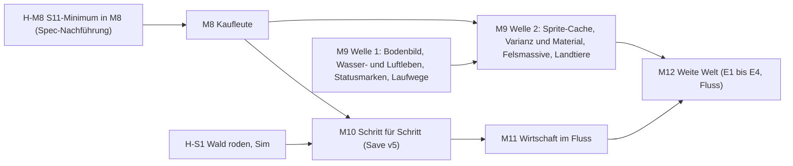

# Programm Nutzerfeedback 2026-10-02 — Triage, Meilensteinschnitt, erste Häppchen

Datum: 2026-10-02 · Paket FB-TRIAGE · Status: **Designvorschlag für Gate Brainstorming (L0)** · Prozessstufe voll
(Brainstorming-Phase eines Programms). Das Dokument ist **keine Spec**: Es hat keine Abnahmekriterien. Jeder
Meilenstein und jedes Häppchen bekommt später eine eigene Spec oder ein eigenes Kurzdesign.

Grundlage: Feedback wörtlich in `.studio/handoffs/nutzerfeedback-2026-10-02.md` (G1–G9, S1–S10, Nachtrag S11),
Auftrag R144, Nachtrag R147, M8-Start zurückgestellt R146, Programm R73, Vormerkung M9 „Weite Welt" R90, M8-Spec
(Abschnitte 1–4, 14.1, 16, 17), Hauptspec, arc42 (Bausteinsicht, Simulationsschritt), `docs/beobachtungen.md`,
`tests/sim/controller.ts` (Bauzeitpunkte des Referenzlaufs). Konsultationen: `lead-art` (Grafik, Machbarkeit in
Canvas 2D, Assets) und `lead-tech` (Architektur, Save, Baseline); beide nur lesend, Ergebnisse eingearbeitet und
als **[Art]** bzw. **[Tech]** markiert. S11 kam nach den Konsultationen; die Einschätzung dazu stammt von
lead-design mit Prüfung am Controller-Code.

## 1. Kurzfassung

Der Nutzer will vier Dinge: **Tiefe** (mehr Gebäude, Nahrung, Inseln, Handel), eine **lebendige, schönere Welt**
(Varianz, Relief, Tiere, Leute mit Aufgaben), eine **einfachere Bedienung** (Bilder statt Text, Mouse-over,
sichtbare Probleme) und eine **Progression, die Neulinge nicht überfordert** (nur Freigeschaltetes sehen, Meldung
bei Freischaltung, Hilfe zur nächsten Stufe). Er will es in Häppchen, Abteilungen dürfen parallel laufen.

Vorschlag:

1. **M8 „Kaufleute" bekommt eine kleine Nachführung (S11-Minimum)**: Glashütte und Badehaus werden erst mit dem
   Bedürfnis der Kaufleute freigeschaltet, statt ab Spielbeginn baubar zu sein. Sonst bleibt M8 unverändert. Die
   Baseline bleibt bitgleich (Abschnitt 5).
2. **R90 wird geteilt.** Der Grafikteil wird vorgezogen als **M9 „Lebendige Insel"**: reine Darstellung auf der
   heutigen Karte, im Render-Strang **parallel zu M8**. Der Weltteil wird **M12 „Weite Welt"**.
3. **M10 „Schritt für Schritt"** folgt direkt auf M8: Freischaltbaum für Gebäude, Funktionen und UI, Meldungen,
   Hilfe-Knopf, Amtsstube mit Steuerregler und Ausgabesperre (S5), Mouse-over (S9), erste Symbole (G9).
4. **M11 „Wirtschaft im Fluss"**: fliessende Steuern und Unterhalt, gedämpfter Aufstieg, weitere Nahrung,
   Holzfäller braucht Wald.
5. **Drei Häppchen starten sofort parallel**, ohne eine M8-Datei zu berühren: H-R1 „Bodenbild" (G4), H-R2
   „Wasser- und Luftleben" (G7), H-S1 „Wald roden und aufforsten, Sim" (S3). Dazu die Design-Arbeit für M10 (H-D1)
   und die M8-Nachführung (H-M8).

Reihenfolge in einem Satz: **Erst sieht die Insel lebendig aus (parallel zu M8), dann wächst das Spiel Schritt für
Schritt mit dem Spieler, dann fliesst die Wirtschaft, dann wird die Welt weit.**

## 2. Tabelle aller 20 Punkte

Legende Grösse: S ≤ 1 Paket, M 2–4 Pakete, L Meilenstein oder mehr. Abdeckung: was M8 oder die Vormerkung R90
schon enthält. „Baseline" meint den festen Referenzlauf in `tests/sim/balance-crises.test.ts` (`OFF_REFERENCE`
Sieg 6050, `minMoney` 57, Fingerabdruck über die serialisierte Welt inklusive Kacheln); `balance.test.ts` prüft
nur Schwellen (Sieg ≤ 7500, Geld > 0) **[Tech]**.

| Nr  | Kurzname                         | Strang         | betroffene Module                                                                                                                                                                                          | Grösse                              | Abhängigkeiten                                                       | Abdeckung M8 / R90                                        | Risiken                                                                                                                                     | Ziel                  |
| --- | -------------------------------- | -------------- | ---------------------------------------------------------------------------------------------------------------------------------------------------------------------------------------------------------- | ----------------------------------- | -------------------------------------------------------------------- | --------------------------------------------------------- | ------------------------------------------------------------------------------------------------------------------------------------------- | --------------------- |
| G1  | Gebäudevarianz                   | Grafik         | `render/sprites.ts` (+ neuer Sprite-Cache)                                                                                                                                                                 | M                                   | Sprite-Cache zuerst; nach M8-Merge (`sprites.ts` gehört M8 S1/S2/R1) | R90 „Gebäude"                                             | Lesbarkeit; Frame-Budget ohne Cache; `bodyPolygons` (Picking) muss Variante kennen                                                          | M9 (Welle 2)          |
| G2  | Licht durch Objekte (Bug)        | Bug            | `render/` (BUG-LICHT)                                                                                                                                                                                      | S                                   | —                                                                    | —                                                         | —                                                                                                                                           | **läuft**             |
| G3  | Berge 3D                         | Grafik         | `render/iso.ts` (neue Art in `sortedObjects`), Felsstempel; echte Höhe: Sim, Save, ADR-012                                                                                                                 | M (Felsmassive) / L (Höhe)          | Felsmassive nach M8-Merge (`iso.ts`)                                 | R90 „Terrain"; Beobachtung „Iso-Folgethemen"              | Tiefensortierung (1×1 bewiesen), Felsen nicht pickbar wie Bäume; echte Höhe bricht D-08 und ADR-012                                         | M9 / Backlog          |
| G4  | Terrain-Relief Wiese/Wald        | Grafik         | `render/terrain.ts`, `render/trees.ts`, ggf. `terrainField.ts`                                                                                                                                             | S                                   | Ruling, falls Schattierung über ±8 % (M7-Spec 5.1)                   | R90 „Terrain, Vegetation"                                 | Bauzeit der Terrain-Ebene (heute bis 988 ms bei DPR 2, Grenze 1500); Lesbarkeit von Wegen und Symbolen                                      | M9 (**H-R1**)         |
| G5  | Fluss und Brücken                | Weite Welt     | Sim `mapgen.ts`, `types.ts` (`river`), `placement.ts`, `save.ts`; Render `terrain.ts`, `sprites.ts` (`drawRoads`), `viewStats.ts`                                                                          | M                                   | Kartenoption aus E1 (M12)                                            | R90 „Karte" teilweise                                     | Fingerabdruck Seed 3 ändert sich; neue Save-Version; Küstenlogik (Schaum, Möwen, Klang „Küste") darf den Fluss nicht erfassen               | M12                   |
| G6  | Laufwege mit Herkunft und Ziel   | Grafik         | `render/life.ts` oder neu `render/errands.ts`, `renderer.ts`                                                                                                                                               | M                                   | keine (liest `b.progress`, Zustand, Weggraph)                        | R90 „Figuren"                                             | Figurenlimit 40, Tempo 4× (Figuren rennen), Frame-Budget                                                                                    | M9 (Welle 1b)         |
| G7  | Wildlife                         | Grafik         | neu `render/wildlife.ts`, `limits.ts`, `renderer.ts`; Landtiere zusätzlich `iso.ts`                                                                                                                        | S (Wasser/Luft) / M (Land)          | Landtiere nach M8-Merge (`iso.ts`)                                   | R90 teilweise                                             | `CAPS`, Frame-Budget; Tierlaute nur mit Lizenzprüfung                                                                                       | M9 (**H-R2**)         |
| G8  | Kanten glätten, Materialstruktur | Grafik         | `render/sprites.ts` + Sprite-Cache                                                                                                                                                                         | M                                   | mit G1 bündeln; nach M8-Merge                                        | R90 „Gebäude"                                             | ohne Cache mehrere ms je Frame; nur Pfade, keine Clips/Verläufe (Aufzeichnungskontext `bodyPolygons`)                                       | M9 (Welle 2)          |
| G9  | UI mit Bildern statt Text        | UI             | `ui/hud.ts`, `buildMenu.ts`, `inspect.ts`, `texts.ts`, `hints.ts`; Symbolsatz                                                                                                                              | M–L                                 | nach M8-U2 (serieller UI-Strang)                                     | —                                                         | Barrierefreiheit (M7-UX: Namen, `aria`), viele UI-Tests; Symbole prozedural oder mit Lizenzprüfung                                          | M10 (Schritt 1)       |
| S1  | mehr Tiefe (Sammelpunkt)         | Sim-Tiefe      | —                                                                                                                                                                                                          | L                                   | —                                                                    | **M8 teilweise** (Stufe 4, Glas, Badehaus, zweites Ziel)  | —                                                                                                                                           | M8, M10–M12, Backlog  |
| S2  | weitere Nahrungsquellen          | Sim-Tiefe      | `sim/defs/buildings.ts`, `placement.ts` (Standortregel); Pflicht-Silhouette in `render/sprites.ts`; Bauleiste, Hotkey                                                                                      | S–M                                 | nach M8-S2 (`consumes` als Liste)                                    | —                                                         | Variante A bitgleich; Silhouette-Pflicht (`sprites.test.ts`)                                                                                | M11                   |
| S3  | Wald roden und aufforsten        | Sim-Tiefe + UI | neu `sim/forest.ts`, `sim/defs/forest.ts`; UI Werkzeug, Hotkey; Render: Terrain-Cache neu bei Terrainwechsel                                                                                               | S + S                               | Sim jetzt; Bedienung nach M8-U2                                      | —                                                         | Terrain-Cache hängt heute an `layoutKey` (Gebäudepositionen) und sieht Terrainwechsel nicht; bitgleich (Controller nutzt es nicht)          | **H-S1** + M10        |
| S4  | Hinweis „nicht voll produktiv"   | UI / Grafik    | neu `render/statusMarks.ts`, `renderer.ts`; Prozentanzeige bräuchte Sim-Abfrage                                                                                                                            | S                                   | keine (liest `b.state`)                                              | M8-U2 nennt fehlende Inputs im Panel, nicht auf der Karte | Unterscheidung über Form, nicht nur Farbe; nicht in `overlays.ts` (gehört M8-R1)                                                            | M9 (Welle 1b)         |
| S5  | Güter je Stufe sperren           | Sim-Tiefe + UI | `sim/population.ts` (`consume`, `upgradeStatus`), `types.ts`, `save.ts`; UI in der Amtsstube                                                                                                               | S + S                               | nach M8; Amtsstube aus S11                                           | —                                                         | Save v5; bitgleich nur, wenn der leere Standard keinen anderen Codepfad nimmt                                                               | M10                   |
| S6  | grössere Insel, mehrere Inseln   | Weite Welt     | `sim/mapgen.ts`, `world.ts`, `save.ts` (heute `width === 64`), `types.ts`; Render Terrain in Kacheln (Chunks), `camera.ts`                                                                                 | M–L                                 | Terrain-Chunking (Render)                                            | **R90 Kern**                                              | Canvas-Grenze Safari (64 Kacheln × Faktor 2 = 4096², schon an der Grenze); Tick-Last `serviceAvailable` (≈ 23 Mio. Distanzen/s bei 4×)      | M12 (E1)              |
| S7  | Expansion auf weitere Inseln     | Weite Welt     | `types.ts` (Inseln), `economy.ts` (Lager je Insel), `roads.ts` (mehrere Startpunkte), `supply.ts`, `build.ts`, UI                                                                                          | M + M                               | E1                                                                   | R90 „mehr Inseln" teilweise                               | Migration `stock → islands[0].stock`; jeder `addStock`/`takeStock` braucht Inselbezug                                                       | M12 (E2, E3)          |
| S8  | Handelsrouten zwischen Inseln    | Weite Welt     | neu `sim/ships.ts`, Routen, `save.ts`; Render `ship.ts`; UI Routen-Bedienung                                                                                                                               | L                                   | E3                                                                   | nicht in R90                                              | Determinismus der Schiffe (ganzzahlig, ohne Zufall), Save, UI-Aufwand                                                                       | M12 (E4)              |
| S9  | Mouse-over beschreibt Objekt     | UI             | neu `ui/hover.ts`, `input.ts`, `app.ts`; für Tiere reine Abfrage `wildlifeAt` aus `render/wildlife.ts`                                                                                                     | S                                   | nach M8-U2; Tier-Teil nach H-R2                                      | —                                                         | Tooltip verdeckt Nachbarn (Beobachtung M7-UX); Picking vorhanden (`targetTile`, `pickBuilding`)                                             | M10                   |
| S10 | Flüsse statt Minuten-Schüben     | Sim-Tiefe + UI | `sim/population.ts` (`tickTaxes`), `economy.ts` (`tickEconomy`), `types.ts`, `save.ts`, neu `sim/flow.ts`; UI `hud.ts`                                                                                     | M                                   | nach M8-B1; Messprobe vorher                                         | —                                                         | **bricht die Baseline** (unvermeidbar) → Ruling mit Neumessung; neue Save-Version                                                           | M11                   |
| S11 | Freischaltung und Progression    | Sim + UI       | neu `sim/unlocks.ts`, `sim/defs/unlocks.ts`, `tick.ts`, `types.ts`, `save.ts`, `build.ts`/`placement.ts`, `tax.ts`; UI `buildMenu.ts`, `hud.ts`, `hotkeys.ts`, `guide.ts`, neue Hilfe-Karte; `messages.ts` | M (Baum, Hilfe) / L (Arbeitskräfte) | Minimum in M8 (Glashütte, Badehaus); Rest nach M8-U2                 | **widerspricht M8** §3/4.3 („ab Spielbeginn baubar")      | Baseline nur bitgleich, wenn Auslöser = Controller-Zeitpunkte (geprüft, 3.8); Save v5; frühe Spielweise ändert sich (Werkzeugmacher später) | M8 (Minimum), **M10** |

## 3. Auslegung der mehrdeutigen Punkte

### 3.1 S10 — kontinuierliche Flüsse und gedämpfter Aufstieg

**Was der Spieler heute erlebt:** Steuern und Unterhalt werden alle 100 Ticks gebucht (10 s bei 1×), das HUD zeigt
„Bilanz +300 / min". Das Geld springt also sechsmal je Minute um 50. Der Verbrauch der Bewohner läuft schon heute
je Tick über Akkumulatoren (50 Einwohner × 0,5 Nahrung: das Lager fällt alle 4 Ticks um 1) **[Tech]**. Produktion
liefert ganze Einheiten am Zyklusende (Fischer alle 40 Ticks 1 Nahrung). Der „Schub" betrifft also vor allem das
**Geld**.

**Drei Varianten [Tech]:**

| Variante                                                             | Baseline                     | Save | Grösse | Urteil                                                                                          |
| -------------------------------------------------------------------- | ---------------------------- | ---- | ------ | ----------------------------------------------------------------------------------------------- |
| (a) nur Anzeige zählt hoch                                           | bitgleich                    | —    | S      | verworfen: Anzeige und Kasse laufen auseinander („450" sichtbar, 400 gebucht → „Zu wenig Geld") |
| (b) Buchung je Tick mit ganzzahligem Übertrag (Steuer und Unterhalt) | **bricht**, nicht vermeidbar | neu  | M      | **empfohlen**                                                                                   |
| (c) Produktionsfortschritt sichtbar (`progress / cycle`)             | bitgleich                    | —    | S      | **empfohlen zusätzlich**, als Darstellung                                                       |

**Warum (b) die Baseline bricht:** Die Summe der Einzelticks weicht vom heutigen Schnappschuss bei Tick % 100 ab,
weil Einwohnerzahl (alle 50 Ticks) und Erfüllung (jeden Tick) zwischen den Buchungen wechseln; `tryUpgrade` und der
Controller sehen zu anderen Zeitpunkten einen anderen Kontostand. Rechnung bleibt ganzzahlig: je Tick
`carry += Σ(Einwohner × Steuer × Erfüllungsfaktor) × pct`, gebucht wird `floor(carry / Teiler)`, der Rest bleibt im
Übertrag; der Unterhalt ebenso. `pct` bleibt einmal abgerundet. Nebennutzen: Die Lücke „direkt vor der Buchung
abreissen, direkt danach bauen" fällt weg. Die Schwellen von `balance.test.ts` halten vermutlich (Geld kommt eher
früher), müssen aber gemessen werden.

**Empfehlung:** (b) plus (c) in M11, nach M8-B1. Der Baseline-Bruch ist **bewusst** und wird per Ruling festgehalten
(Neumessung `off`/`normal`/`mild`, M8-B1-Szenario, Fingerabdruck). Die Werte der Wirtschaft je Minute bleiben
gleich; nur der Zeitpunkt der Buchung ändert sich. Kein neuer Spielwert ausser dem Teiler.

**Darstellung „300 / min" gegen „5 / s":** Einheit bleibt überall **„/ min"** (Konvention seit M7-UX, in HUD,
Lager-Chips, Bauleiste und Panel). Gegen „/ s" spricht: Raten von Waren sind klein (Fischer 15 / min = 0,25 / s),
Sekunden hängen am Tempo (bei 4× ist „5 / s" falsch). Das Erlebnis des Nutzers entsteht durch das **sichtbare
stetige Steigen der Zahl**, nicht durch die Einheit. Waren bleiben ganzzahlig im Lager; der Fortschritt eines
Betriebs wird als Ring oder Balken sichtbar (c).

**Gedämpfter Aufstieg bei negativer Bilanz:**

- **Regel (Vorschlag):** Ist die Warenbilanz (Dauerleistung, wie `goodsBalance`) eines Bedarfsguts der **Zielstufe**
  negativ, gilt für den Aufstieg die **doppelte Wartezeit** (Wert `UPGRADE_DEFICIT_WAIT_FACTOR` = 2 in
  `src/sim/defs/`). Kein hartes Verbot: Vorrat darf genutzt werden, aber langsamer.
- **Spielerlebnis:** Der Spieler sieht im Haus-Panel „Rum-Bilanz negativ — Aufstieg verzögert" und baut vor, statt
  in eine Hungerkrise aufzusteigen. Das ist eine gewollte Bremse (Rückkopplung gegen Überschiessen), keine Strafe.
- **Echte Wahl:** schnell aufsteigen mit Vorrat und Defizit (langsamer, Risiko) gegen erst Ketten ausbauen (Geld
  jetzt, Tempo später).
- **Randfälle:** Bilanz genau 0 dämpft nicht. Brennende Betriebe zählen nominal weiter (wie R115, kein
  Doppelschaden durch Krise). Steuer „hoch" ohne Aufstieg bleibt ohne Aufstieg.
- **Technik [Tech]:** Rechnung einmal je Wachstumstakt in neuem Modul `src/sim/flow.ts` (sonst Importzyklus
  `queries.ts` ↔ `population.ts`). Vorher eine **Messprobe**: Wie oft steigt im Baseline-Lauf ein Haus bei
  negativer Bilanz auf? Bei 0 bleibt die Regel bitgleich; sonst kommt sie in dasselbe Ruling wie (b).

### 3.2 G4 / G5 — Höhe als Optik oder als Plateaus, Flüsse und Brücken

- **G4 Empfehlung: nur Optik.** Der Nutzer sagt selbst „in der Logik darf es flach bleiben, es geht ums
  Aussehen". Wiesen und Wälder bekommen Flecken, Moos, Lichtungen, gemischte Baumarten und Relief-Schattierung
  (H-R1); Berge bekommen Felsmassive als Stempel über den Gebirgskacheln (G3, M9 Welle 2). D-08 (flacher Boden)
  bleibt, Picking und Tiefensortierung bleiben bewiesen. **Plateaus in der Sim** (L: Bauregeln, Wegrampen,
  Projektion mit z, ADR-012 neu) kommen ins Backlog; es gibt heute keine Spielentscheidung, die sie brauchen (YAGNI).
- **G5 Empfehlung: Fluss ist eine Spielregel** und gehört zu M12. Neue Terrainart `river`: unbebaubar, ein Weg
  darauf wird Brücke (Weg-Kosten höher, Wert in `defs/`), die Wegsuche bleibt gleich. Erzeugung mit eigenem
  Noise-Kanal nach dem Grundterrain; die Küstenprüfung des Kontors darf ihn nicht sehen. **Nur in neuen Karten
  der Option „gross"** (E1); „klein" bleibt der heutige Generator und damit Referenz **[Tech]**. Alte Saves sind
  sicher, weil die Kacheln im Save stehen; eine neue Save-Version ist trotzdem nötig, damit ein alter Build `river`
  nicht stumm lädt. Darstellung: Bach im Landesinneren muss vom Meer getrennt sein (kein Sandufer, kein Schaum,
  keine Möwen, kein Küstenklang) **[Art]**.

### 3.3 G6 — Laufwege mit Herkunft und Ziel

**Empfehlung: reine Darstellung, aus dem Sim-Zustand abgeleitet** (Art und Tech einig).

- Holzfäller geht im Produktionszyklus zur nächsten Waldkachel und kommt mit Last zurück; Fischer zum Ufer;
  Steinbrecher zum Fels. Phase = `progress / cycle`, nur bei Zustand `ok`.
- Träger gehen am Zyklusende vom Betrieb zum Kontor oder Markt (Breitensuche über den Weggraph, Cache je
  `layoutKey`).
- Bürger gehen vom Haus zum versorgenden **Markt** — nicht zum Fischer, denn die Sim verteilt über Kontor und Markt.
  Das ist ehrlich gegenüber der Regel und zeigt trotzdem „Herkunft und Ziel".
- Über 2× Tempo werden Figuren ausgedünnt; sie zählen gegen das Figurenlimit (40).

**Sim-Agenten mit Transportzeit** (Waren reisen physisch, Lager nicht mehr zentral) wären ein anderer Kern der
Produktionsketten-Säule, brechen die Baseline sicher, erweitern den Save und kosten je Tick (L). Nicht jetzt;
Backlog. Wird das je verfolgt, ist es ein möglicher **Nutzer-Vorbehalt** (Kernsäule, Verfassung §5.3).

### 3.4 G7 — Wildlife als Deko, Sim oder Jagd

**Empfehlung: Deko zuerst, Jagd als Gebäude, keine Tier-Simulation.**

- **Deko (M9):** Tiere sind eine reine Pose aus Zeit, Seed und Feld, wie heute die Möwen. Zuerst Wasser und Luft
  (Fischsprünge, gelegentlich ein Wal im tiefen Wasser, Vogelschwärme über Wald und Wiese; ohne Tiefensortierung),
  danach Land (Hirsche und Hasen am Waldrand, Steinböcke am Fels; braucht `iso.ts`, also nach M8) **[Art]**.
- **Mouse-over (S9):** Eine reine Funktion `wildlifeAt(world, range, timeMs)` liefert Posen und Namen; die UI fragt
  mit derselben Zeit ab. So steht beim Bären „Bär", ohne Sim-Zustand **[Art]**.
- **Verbindung zu S2:** Die **Jagdhütte** (Standort: Wald im Radius) wird ein zweiter Erzeuger von Nahrung. Die
  Hirsche am Waldrand sind dann visuell der Grund, warum sie dort steht. Wildbestände als Sim-Zustand (Bejagung
  erschöpft das Wild) sind Backlog: neue Rückkopplung, Save-Feld, kein Mehrwert fürs erste Spiel von 15 Minuten.

### 3.5 S5 — Sperren je Stufe (gemeinsam mit S11)

**Empfehlung: Ausgabesperre je Stufe und Gut, als Funktion der Amtsstube (S11).** Der Spieler sperrt zum Beispiel
„Stoff für Siedler". Häuser dieser Stufe bekommen das Gut nicht; das Bedürfnis gilt als **unerfüllt** (halbe
Steuer, kein Wachstum, kein Aufstieg).

- **Wozu:** Knappes Gut gezielt der höheren Stufe sichern (Stoff für Bürger statt Siedler, Glas für den Aufstieg
  zu Kaufleuten). Echte Wahl: Steuer der unteren Stufe opfern, um die obere zu halten.
- **Dominanz-Prüfung:** Die Sperre ist nie kostenlos (die gesperrte Stufe zahlt halb und schrumpft); sie lohnt nur
  bei Knappheit. Keine dominante Strategie.
- **Zusammenspiel mit S11:** Die Sperre ist selbst eine freigeschaltete Funktion. Sie erscheint erst, wenn die
  Amtsstube steht **und** zwei Stufen dasselbe Gut verbrauchen (frühestens mit den ersten Bürgern: Nahrung und
  Stoff teilen sich Siedler und Bürger). Vorher gibt es nichts zu verteilen. Die Sperr-Matrix zeigt nur
  freigeschaltete Stufen und Güter.
- **Randfälle:** Sperre aller Güter einer Stufe ist erlaubt (Stufe zahlt halb); eine Sperre wirkt auch auf den
  Aufstieg in diese Stufe (das neue Bedarfsgut fehlt). Abriss der Amtsstube hebt alle Sperren auf (sonst bliebe
  eine Wirkung ohne Gebäude). Der Standard ist leer → bitgleich.
- **Verworfene Auslegung:** Reservierung eines Mindestbestands (M8 schliesst „Reservierung von Inputs" aus;
  schwerer lesbar). **Kann:** Aufstiegsstopp je Stufe in derselben Amtsstube.

### 3.6 S1 — „Politik" als Begriff, und was „mehr Tiefe" heisst

- **Politik** legen wir als **Erlasse** aus: wenige globale Schalter mit Vor- und Nachteil (z. B. „Fastentag":
  Nahrungsverbrauch −20 %, Wachstum langsamer), höchstens zwei gleichzeitig, mit Sperrzeit wie die Steuerstufe.
  Sie wohnen in der **Amtsstube** (S11), neben Steuer und Ausgabesperre; die Politik wächst also aus einem Gebäude,
  das der Spieler schon kennt. Erlasse könnten auch den offenen Befund „Steuer hoch dominiert im Endzustand"
  strukturell lösen. **Backlog nach M12.**
- **Weitere Inseln bevölkern, handeln:** M12.
- **Minen:** Erzmine → Schmelze → Werkzeug als zweite Werkzeug-Kette. Kandidat für M12, weil Erz ein Insel-Rohstoff
  sein kann.
- **Weitere Plantagen:** an **Fruchtbarkeit je Insel** gebunden (Mechanik klassischer Aufbauspiele: nicht jede
  Insel kann alles). Das ist der stärkste Grund zur Expansion und gehört ins Brainstorming von M12.
- **Kultur und Freizeit:** neue Dienste (z. B. Wirtshaus, Theater) als Bedarf einer Stufe 5. Backlog.

### 3.7 Weitere kurze Auslegungen

- **S3 Wald:** „abreissbar" = roden (Wald → Wiese), „anpflanzbar" = aufforsten (Wiese → Wald), beides auf
  unbebauten Kacheln, mit Geldkosten aus `defs/`. Nutzen fürs Spiel: Platz für Schäferei und Plantage schaffen
  (sie brauchen Gras im Radius), Holzfäller-Standorte anlegen. **Roden liefert kein Holz** (sonst Holzquelle ohne
  Holzfäller, entartete Strategie). **Randfall:** Wer den Wald um einen Holzfäller rodet, hat heute einen
  Holzfäller ohne Wald, der weiter produziert (Standortregel nur beim Bau). M11 ergänzt deshalb: Holzfäller ohne Wald
  im Radius → Zustand „kein Wald" (wie `waitingInput`). Das braucht `production.ts` und kommt nach M8.
  Nachwachsen mit Kachelzustand: Backlog **[Tech]**.
- **S4:** Kartensymbol für `waitingInput` (Symbol der fehlenden Ware) und `storageFull` (Kiste), unterschieden über
  die **Form**. Eine echte Prozent-Produktivität über die Zeit braucht eine Sim-Abfrage; Kandidat für M11.
- **S2:** Variante A, zweite und dritte Quelle für dasselbe Gut `food` (Jagdhütte: Wald im Radius; Rinderfarm:
  Gras, 2×2) mit eigenen Kosten und Standortregeln — Wahl über den Standort, `TIERS` bleibt, bitgleich
  **[Tech]**. Variante B (zweites Nahrungsgut als eigener Bedarf) bricht die Baseline und gehört zu einer
  späteren Stufe.
- **G9:** Schritt 1 in M10: Symbole für Güter, Bedarfe und Gebäude in HUD, Bauleiste und Panel; Texte wandern in
  Tooltips. Barrierefreiheit aus M7-UX bleibt (zugängliche Namen). Symbole prozedural; ein offen lizenzierter
  Symbolsatz nur über `art-license-checker`. G9 passt zu S11: weniger sichtbare Elemente am Anfang, dafür jedes mit
  Bild.
- **G1/G8 Art Direction [Art]:** „Die Silhouette ist die Identität, die Oberfläche trägt die Varianz." Dachform,
  Firstrichtung und Höhe bleiben je Typ und Stufe fest; variieren dürfen Ziegelton, Wandtönung (kleiner Abstand),
  Kamin, Gaube, Fensterläden, Hofkram, Anbau innerhalb der Hülle. Schlüssel `hash2(seed, x, y)`, kein Sim-Zufall,
  kein Save-Feld. Material (Fugen, Risse, Stroh) nur auf einem Sprite-Cache je Typ, Stufe, Variante, Zoom und DPR.
- **Assets [Art]:** durchgehend prozedural. Fremde Iso-Sets passen weder zur Raute 64×32 noch zur Palette noch zur
  Licht-Pipeline. Fremd erst für Tierlaute (CC0, Lizenzprüfung, Audio-Paket).

### 3.8 S11 — Freischaltung und Progression

**Spielerzweck:** „Am Anfang sehe ich nur, was ich brauche; jedes Mal, wenn meine Leute etwas Neues wollen, bekomme
ich neue Bauten und Werkzeuge, eine Meldung dazu, und der Hilfe-Knopf sagt mir, was als Nächstes kommt."

**Grundsätze des Freischaltbaums:**

1. **Auslöser sind Ereignisse, die der Spieler sieht** — vor allem „das Bedürfnis entsteht" (Wortlaut des
   Nutzers). Das Bedürfnis der Stufe t+1 entsteht, sobald **ein Haus der Stufe t voll belegt ist** (dann will es
   aufsteigen). Das ist genau der Zeitpunkt, an dem der Referenz-Controller die Gebäude der nächsten Stufe baut
   (`planTier` in `tests/sim/controller.ts`: Haus voll → plant Stufe t+1; Kapelle, Stoffkette, Schule und Rumkette
   hängen daran). Freischaltung und Controller fallen also auf denselben Tick: **bitgleich**, bis auf das neue Feld
   im Fingerabdruck (Normalisierung wie M8 16.1).
2. **Monoton:** Einmal freigeschaltet bleibt freigeschaltet (ein Haus, das wieder schrumpft, sperrt nichts).
   Gespeichert als `world.unlocked` (Liste von Ids), gesetzt in einem Schritt `tickUnlocks` direkt nach der
   Bevölkerung im selben Tick.
3. **Werte in `src/sim/defs/unlocks.ts`:** je Eintrag Id, Auslöser, Inhalt (Gebäude, Funktionen, UI-Elemente),
   Meldungstext. Kein Freischaltwert im Code.
4. **Jede Freischaltung erzeugt genau eine Meldung** (Meldungsstapel, wie die Krisenkarte), einen Eintrag in der
   Hilfe und einen Ton (`win`-Familie, Wiederverwendung).
5. **Die UI zeigt nur Freigeschaltetes:** Bauleiste (leere Kategorien verschwinden), Hotkeys (gesperrte Taste zeigt
   „Noch nicht freigeschaltet: {Auslöser}"), Lager-Chips (nur freigeschaltete Güter), Einwohner-Chips (nur erreichte
   Stufen), Steuerregler (nur mit Amtsstube). `placeBuilding` lehnt Gesperrtes ab mit `{ ok: false, reason }` —
   die Regel liegt in der Sim, nicht nur in der UI.
6. **Option „Alles freigeschaltet"** beim neuen Spiel (Kann, für erfahrene Spieler und Tests).

**Freischaltbaum (Vorschlag; Werte als Defs, Texte als Setzung der Spec):**

| Stufe / Auslöser                                        | Gebäude                                             | Funktionen                                                                     | UI-Elemente                                                                     | Begründung im Setting                                                                                  |
| ------------------------------------------------------- | --------------------------------------------------- | ------------------------------------------------------------------------------ | ------------------------------------------------------------------------------- | ------------------------------------------------------------------------------------------------------ |
| **Spielbeginn**                                         | Weg, Wohnhaus, Holzfäller, Fischer                  | Bauen, Abreissen, Handel am Kontor, Tempo, Speichern                           | Geld, Bilanz, Pioniere, Ziel; Lager Holz, Werkzeug, Stein, Nahrung; Hilfe-Knopf | Die ersten Siedler brauchen Dach, Holz und Fisch.                                                      |
| **6 Wohnhäuser** (Wert in Defs)                         | Marktplatz                                          | —                                                                              | Versorgungsradius des Markts                                                    | Die Stadt wächst über den Kontor-Radius hinaus.                                                        |
| **Siedler-Bedürfnis** (erstes Pionierhaus voll)         | Kapelle, Schäferei, Weberei, Steinbruch, Feuerwache | Roden und Aufforsten (S3)                                                      | Lager Wolle, Stoff; Abdeckungsanzeige Glaube                                    | Pioniere wollen Kleidung und Glauben; Steinbauten und Brandschutz werden nötig; Farmen brauchen Wiese. |
| **erste Siedler**                                       | **Amtsstube** (neu, Unterhalt)                      | Handelsaufträge (Karte sichtbar)                                               | Einwohner-Chip Siedler; Auftragskarte                                           | Eine Siedlung bekommt Verwaltung; Händler werden auf den Hafen aufmerksam.                             |
| **Amtsstube steht**                                     | —                                                   | **Steuer einstellen**; ab Bürgern: **Ausgabesperre** (S5); später Erlasse (S1) | Steuerregler, Steuersperre; Sperr-Matrix                                        | Steuern setzt die Obrigkeit fest, nicht das Kontor.                                                    |
| **Bürger-Bedürfnis** (erstes Siedlerhaus voll)          | Schule, Zuckerrohrplantage, Brennerei               | —                                                                              | Lager Zuckerrohr, Rum; Abdeckung Schule                                         | Siedler wollen Bildung und Genuss.                                                                     |
| **erste Bürger**                                        | **Werkzeugmacher**                                  | —                                                                              | Einwohner-Chip Bürger                                                           | Qualifizierte Arbeit braucht Leute mit Schule (Wortlaut S11).                                          |
| **Kaufleute-Bedürfnis** (`tierLock(w, 4) === null`, M8) | Badehaus, Glashütte                                 | —                                                                              | Lager Glas; Einwohner-Chip Kaufleute (M8 14.1)                                  | Bürger wollen Hygiene und Fenster (Wortlaut S11: Glashütte erst mit Bedürfnis).                        |
| **erste Krise** (nur bei Krisen an)                     | —                                                   | —                                                                              | Krisen-Log, Kartenzeichen „Brand", „Sturm"                                      | Erklärt wird, was gerade passiert.                                                                     |
| später (M12)                                            | zweites Kontor, Schiffe                             | Handelsrouten                                                                  | Routen-Ansicht                                                                  | Kaufleute finanzieren Expansion.                                                                       |

**Prüfung gegen den Referenzlauf (bitgleich):** Der Controller baut Holzfäller und Fischer ab Start (frei), die
Kapelle und die Stoffkette bei `anyPlan(2)` (Pionierhaus voll = Siedler-Bedürfnis, frei), die Feuerwache im
Krisen-Lauf nach der Kapelle (gleicher Auslöser, frei), Schule und Rumkette bei `anyPlan(3)` (Siedlerhaus voll =
Bürger-Bedürfnis, frei). Marktplatz, Steinbruch, Werkzeugmacher, Amtsstube, Glashütte und Badehaus baut er nicht;
er kauft Stein und Werkzeug zu und ändert die Steuer nie. Steuer ohne Amtsstube ist „normal" — wie im Lauf.
Handelsaufträge bleiben in der Sim unverändert; vor der Freischaltung zeigt die UI sie nur nicht an. **Ergebnis:
Verlauf gleich, Fingerabdruck gleich bis auf `unlocked`.** Nachzuweisen im Spec-Gate per Messung.

**Randfälle und entartete Strategien:**

- **Amtsstube bauen, Steuer „hoch" stellen, Amtsstube abreissen:** Ohne Amtsstube gilt „normal". Sonst bliebe die
  Wirkung ohne Unterhalt. Gleiches gilt für Ausgabesperren.
- **Alter Spielstand:** Die Migration schaltet alles frei, was schon steht oder dessen Auslöser schon erfüllt ist
  (kein Gebäude verschwindet aus der Bauleiste, das der Spieler schon gebaut hat).
- **Gesperrtes Gebäude per Hotkey:** Hinweis statt Werkzeug.
- **Abriss des letzten Hauses einer Stufe:** keine Wirkung auf Freischaltungen (monoton).
- **Werkzeug vor den Bürgern:** nur durch Kauf (Start 20 Werkzeug). Das verschiebt die frühe Spielweise menschlicher
  Spieler (heute ist der Werkzeugmacher ab Start eine Wahl); Playtest-Frage, keine Baseline-Frage.

**Arbeitskräfte und Qualifikation („nur Bürger mit Schule"):** Zwei Lesarten.

| Lesart                                                                                             | Grösse | Save                              | Baseline                                                               | Empfehlung                   |
| -------------------------------------------------------------------------------------------------- | ------ | --------------------------------- | ---------------------------------------------------------------------- | ---------------------------- |
| (i) **Freischaltung**: Qualifizierte Betriebe erst mit ersten Bürgern (Tabelle oben)               | S      | im `unlocked` enthalten           | bitgleich (Controller baut keinen Werkzeugmacher)                      | **empfohlen, in M10**        |
| (ii) **Betriebsbedingung**: Werkzeugmacher arbeitet nur mit Schule im Radius                       | S      | —                                 | bitgleich (dito)                                                       | Kann in M10                  |
| (iii) **Arbeitskräfte-System**: Betriebe brauchen Arbeiter einer Stufe, Bevölkerung wird Ressource | L      | neue Felder (Belegung, Zuteilung) | **bricht sicher** (jede Produktion hängt an Arbeitern; Controller neu) | Backlog, eigener Meilenstein |

(iii) ändert die Kopplung von Bevölkerung und Produktion grundlegend: Heute erzeugt Bevölkerung Steuern und
Verbrauch, nicht Arbeit. Das ist eine neue Kernmechanik mit neuer Bilanz je Einwohner. Der Nutzer-Wunsch („nicht
gleich überfordernd") spricht eher gegen ein neues System, das mehr Planung verlangt. Empfehlung: (i) jetzt, (ii)
als Kann, (iii) Backlog; L0 hält die Auslegung als Ruling fest (§5.2).

**Hilfe-Knopf — nicht doppelt bauen.** Vorhandene Bausteine: `nextStep(world)` in `src/ui/guide.ts` (nächster
Schritt in der Ruhe-Ansicht), `hints.ts` (Platzierungshinweise, `REASON_TABLE`, `friendlyReason`), Kartenzeichen
(`MAP_SIGNS`), M8 `goalTexts` (Ausblick „Danach: Kaufleute", 4.3 und 14.1). Vorschlag:

- **Eine neue reine Sim-Abfrage** `nextUnlocks(world)` (in `sim/unlocks.ts`): die nächsten Freischaltungen mit
  Auslöser und Fortschritt („Kapelle, Schäferei, Weberei: sobald ein Wohnhaus 4 Pioniere hat — jetzt 3 / 4").
- **Eine Hilfe-Karte** (Modalkarte nach M7-UX, Taste und HUD-Knopf „Hilfe") mit vier Abschnitten, alle aus
  vorhandenen Funktionen: (1) Nächster Schritt = `nextStep` unverändert; (2) Als Nächstes freigeschaltet =
  `nextUnlocks`; (3) Ziel und Ausblick = `goalTexts` aus M8; (4) Tipps zur aktuellen Stufe (Texte in `defs`, je
  Freischalt-Eintrag ein Tipp) und Kartenzeichen (`MAP_SIGNS`, aus dem Panel hierher verschoben oder verlinkt).
- **`nextStep` bleibt die einzige Quelle für „was jetzt tun"**; es schlägt künftig nur freigeschaltete Gebäude vor
  (ein Filter, wie M8 14.8 ihn für die Sperre schon einführt).
- Die Ruhe-Ansicht behält die kurze Zeile „Nächster Schritt" und verweist auf die Hilfe-Karte. Kopfzeile bleibt
  ≤ 84 px (M7:AK-UX-15); der Knopf ersetzt keinen Chip, er kommt zu Einstellungen und Menü.

## 4. Meilensteinschnitt und Reihenfolge

| Meilenstein                           | Spielerzweck (ein Satz)                                                                                                                                                           | Stufe                                                  | Stränge                               | Punkte                                                                                                      | Start                                |
| ------------------------------------- | --------------------------------------------------------------------------------------------------------------------------------------------------------------------------------- | ------------------------------------------------------ | ------------------------------------- | ----------------------------------------------------------------------------------------------------------- | ------------------------------------ |
| **M8 Kaufleute** (+ S11-Minimum)      | „Nach dem Sieg geht es weiter: Badehaus, Glashütte, Kaufleute, Handelsstadt — freigeschaltet, sobald meine Bürger es wollen."                                                     | voll (Spec und Plan stehen, Delta-Gate)                | Sim, Balancing, UI seriell, Render R1 | S1 teilweise, S11 teilweise                                                                                 | nach H-M8                            |
| **M9 Lebendige Insel** (neu, aus R90) | „Meine Insel sieht lebendig und abwechslungsreich aus: Tiere, Relief, Leute mit Aufgaben, und ich sehe auf der Karte, wo ein Betrieb hakt."                                       | Meilenstein voll mit Kurz-Spec; Häppchen leicht (R129) | **nur Render** (`src/render/`)        | G1, G3 (Felsmassive), G4, G6, G7, G8, S4                                                                    | **jetzt**, Welle 2 nach M8-Merge     |
| **M10 Schritt für Schritt**           | „Am Anfang sehe ich nur, was ich brauche; neue Bauten kommen mit den Wünschen meiner Leute, die Hilfe zeigt den nächsten Schritt, und per Mouse-over erfahre ich, was alles ist." | voll (Save v5, neues System)                           | Sim (`unlocks.ts`), UI seriell        | S11, S5, S9, G9 (Schritt 1), S3 (Bedienung)                                                                 | Design jetzt, Umsetzung nach M8-U2   |
| **M11 Wirtschaft im Fluss**           | „Geld fliesst stetig, ein Defizit bremst den Aufstieg, und ich wähle, woher meine Nahrung kommt."                                                                                 | voll (Baseline-Bruch, Save)                            | Sim, Balancing, UI                    | S10, S2, S3 (Holzfäller braucht Wald), S4-Prozent                                                           | nach M10; Messprobe schon während M8 |
| **M12 Weite Welt** (R90-Rest)         | „Ich segle zu einer zweiten Insel, gründe dort ein Kontor, baue an, was nur dort wächst, und verbinde beide mit einer Handelsroute."                                              | voll, in Teilmeilensteinen E1–E4                       | Sim, Render (Chunking, Fluss), UI     | S6, S7, S8, G5; S1 (Minen, Plantagen)                                                                       | nach M11; Brainstorming während M11  |
| **Backlog**                           | —                                                                                                                                                                                 | —                                                      | —                                     | Erlasse (Politik), Kultur/Stufe 5, Arbeitskräfte-System, Sim-Höhen, Sim-Logistik, Wildbestände, Nachwachsen | —                                    |

**Warum diese Reihenfolge:**

- **M9 parallel zu M8:** Die Dateien sind getrennt (M8 berührt in `src/render/` nur `sprites.ts`, `iso.ts`,
  `palette.ts`, `overlays.ts`). Die Grafik wirkt im ersten Spiel sofort und braucht keine Sim. Canvas 2D reicht für
  M9 (alles prozedural, mit Caches) **[Art]**; die R90-Pflichtfragen zu WebGL, Chunking und Repo-Grösse wandern zu
  M12, wo die Karte wächst.
- **M10 direkt nach M8:** S11 baut auf den vier Stufen von M8 auf und berührt dieselben UI-Dateien wie M8-U1/U2
  (`buildMenu.ts`, `guide.ts`, `hud.ts`, `hotkeys.ts`); der UI-Strang läuft nahtlos weiter. Der Nutzer begründet S11
  mit Neulingen — das wirkt in jedem ersten Spiel. S5 kommt mit, weil seine Bedienung in der Amtsstube aus S11
  wohnt und beide eine Save-Version teilen.
- **M11 nach M10:** Der Baseline-Bruch durch S10 kommt nach dem bitgleichen M10, damit Brüche nicht gemischt
  werden, und vor dem Umbau „Lager je Insel" (E2), damit für M12 eine neue Referenz steht.
- **M12 zuletzt:** grösster Brocken (Kartengrösse, Chunking, Lager je Insel, zweites Kontor, Schiffe); eigene Spec mit
  Teilmeilensteinen.
- **Save:** M8 = v4 (ohne neues Feld für S11-Minimum), M10 = v5 (`unlocked`, Sperren), M11 = v6 (Übertrag), M12 = v7
  (Kartengrösse, Inseln, `river`). Je Meilenstein eine Migration.

**Kartengrösse als Spieloption [Tech]:** „klein" bleibt der heutige Generator und damit der bitgleiche
Referenzlauf; „gross" (mehrere Inseln, Fluss) wird neu.

## 5. M8: S11-Minimum einarbeiten, sonst unverändert

**Empfehlung: Variante „in M8 einarbeiten, minimal".** Nur der direkte Widerspruch wird in M8 gelöst; der
Freischaltbaum als System kommt in M10.

**Warum nicht „S11 komplett vor M8":** S11 ist ein neues System (Sim-Modul, Save v5, Hilfe-Karte, Freischaltbaum,
Grösse M) mit eigener Spec und eigenem Plan. M8 (Spec und Plan fertig) würde um diesen ganzen Zyklus warten und
müsste danach trotzdem nachgeführt werden; beide berühren dieselben UI-Dateien und `population.ts`.

**Warum nicht „S11 nach M8, M8 unverändert":** M8 würde genau das ausliefern, was der Nutzer ausdrücklich nicht will
(Glashütte ab Spielbeginn baubar, Tooltip „Für Kaufleute" in der Bauleiste, Kann K1 „Vorbereitung"), und M10 müsste
es wieder zurückbauen. Doppelarbeit an Spec, AK, Tests und Texten.

**Was sich an M8 ändert (Delta, für `lead-design`/M8-Spec und `lead-tech`/M8-Plan):**

| Stelle M8-Spec                     | Heute                                                | Neu                                                                                                                                                             |
| ---------------------------------- | ---------------------------------------------------- | --------------------------------------------------------------------------------------------------------------------------------------------------------------- |
| §3 Nicht-Scope                     | „Eine Sperre des Bauens vor dem Sieg" ausgeschlossen | Streichen. Neu im Scope: Glashütte und Badehaus erst bei `tierLock(w, 4) === null`. Nicht im Scope: Freischaltbaum, Hilfe-Karte, `unlocked`-Feld (M10).         |
| §4.3 Punkt 1                       | ab Tick 0 baubar, keine Sperre in `placeBuilding`    | `canPlace`/`placeBuilding` liefern vorher `{ ok: false, reason: "Erst nach dem Ziel (50 Bürger)" }` (mit Hebel: „ab {N} Bürgern"). Bauleiste blendet beide aus. |
| §4.3 Punkt 2, 3                    | Ausblick, Info-Panel                                 | **bleiben** (die Auflage R86 „Ziel ab Spielbeginn sichtbar" bleibt erfüllt).                                                                                    |
| §4.3 Punkt 4                       | Tooltip „Für Kaufleute …" in der Bauleiste           | entfällt (nichts in der Bauleiste vor der Freischaltung).                                                                                                       |
| §4.3 „Vorbereitung als echte Wahl" | Bau vor dem Sieg als Wahl                            | entfällt; ersetzt durch: Vorrat an Stein und Holz anlegen bleibt die Vorbereitung.                                                                              |
| §2.2 K1, §16.4                     | Variante „vorbereitet" im Szenario-Lauf              | entfällt (nicht mehr spielbar).                                                                                                                                 |
| §14.1 Glas-Chip                    | immer sichtbar                                       | `hidden` wie der Kaufleute-Chip, bis `tierLock(w, 4) === null` oder Glas > 0.                                                                                   |
| §14.1 Banner                       | „Ziel erreicht"                                      | zusätzliche Zeile „Neu: Badehaus, Glashütte" (erste Freischalt-Meldung; Muster für M10).                                                                        |
| §14.2 Hotkeys J und O              | Werkzeug ab Tick 0                                   | vor der Freischaltung Hinweis statt Werkzeug (Offener Punkt 15 neu entscheiden).                                                                                |
| §17 S1                             | —                                                    | zusätzlich `src/sim/placement.ts` (Sperre) und Test; `tests/sim/scenarios.ts` `galerie` setzt den Sieg oder platziert ohne Sperre (prüfen).                     |

**Baseline und Controller:** Der Referenz-Controller baut weder Badehaus noch Glashütte (M8 16.1) → `balance.test.ts`
und `balance-crises.test.ts` bleiben bitgleich. Der Merchant-Controller (B1) baut beide erst in Phase 3 nach dem
Sieg → freigeschaltet. Save v4 bekommt **kein** neues Feld: Die Freischaltung ist aus `tierLock` abgeleitet (mit dem
Standard-Hebel `null` monoton über `won`). Mit gesetztem Hebel `unlockCitizens` kann `tierLock` zurückspringen; dann
bleibt ein schon gebautes Gebäude stehen, nur ein neues ist wieder gesperrt — für M8 hinnehmbar, M10 macht es über
`unlocked` monoton.

**Kosten:** eine Spec-Nachführung (lead-design, eine Runde), eine Plan-Nachführung (lead-tech), ein Delta-Gate
(lead-qa AK-Konsistenz per grep, R136; lead-tech Plan). Kein neues Gate Brainstorming für M8. Grobe Schätzung:
3 Starts, Verzögerung des M8-Starts um diese eine Runde.

**Ohne Gate zulässig:** Die Art-Direction-Regel „Silhouette ist Identität" (3.7) darf `lead-art` bei den
Kann-Silhouetten in M8-R1 anwenden; sie ändert keine AK.

## 6. Erste Häppchen je Strang

| Häppchen                                         | Inhalt                                                                                                                                                                                                                           | Stufe              | Owner (Lead · Arbeiter)                                         | Dateien                                                                                                                 | parallel zu M8?                | Voraussetzung                                                                               |
| ------------------------------------------------ | -------------------------------------------------------------------------------------------------------------------------------------------------------------------------------------------------------------------------------- | ------------------ | --------------------------------------------------------------- | ----------------------------------------------------------------------------------------------------------------------- | ------------------------------ | ------------------------------------------------------------------------------------------- |
| **H-M8 S11-Minimum** (S11)                       | Delta aus Abschnitt 5 in M8-Spec und M8-Plan, Delta-Gate                                                                                                                                                                         | voll (Nachführung) | `lead-design` (Spec) · `lead-tech` (Plan)                       | M8-Spec, M8-Plan                                                                                                        | **vor** M8-Start               | Gate Brainstorming dieses Programms                                                         |
| **H-R1 Bodenbild** (G4, M9 Welle 1)              | Wiesenflecken (Blumen, Klee, trockene Stellen), Waldboden mit Moos und Lichtungen, gemischte Baumarten und Grössen, lichtere Waldränder, stärkere Hangschattierung am Gebirgsfuss. Neue Töne lokal per `mixHex` aus der Palette. | leicht             | `lead-art` · `art-rendering-engineer`                           | `src/render/terrain.ts`, `src/render/trees.ts`, `tests/render/terrain.test.ts`, `tests/render/trees.test.ts`            | **ja**, keine gemeinsame Datei | Ruling, falls Schattierung über ±8 % (M7-Spec 5.1); Terrain-Bauzeit messen (Grenze 1500 ms) |
| **H-R2 Wasser- und Luftleben** (G7a, M9 Welle 1) | Fischsprünge an der Küste, seltener Wal im tiefen Wasser, Vogelschwärme über Wald und Wiese; reine Pose aus Zeit, Seed und Feld; Obergrenzen in `CAPS`; reine Abfrage `wildlifeAt` für späteres Mouse-over.                      | leicht             | `lead-art` · `art-rendering-engineer`                           | `src/render/wildlife.ts` (neu), `src/render/limits.ts`, `src/render/renderer.ts`, `tests/render/wildlife.test.ts` (neu) | **ja**                         | `renderer.ts` erst nach Merge von BUG-LICHT, falls BUG-LICHT `renderer.ts` berührt          |
| **H-S1 Wald roden und aufforsten, Sim** (S3)     | Aktionen `clearForest` / `plantForest` (unbebaute Kachel, Geldkosten aus `defs/`, `{ ok, reason }`), kein Holz beim Roden, kein Nachwachsen. Bitgleich, kein Save-Wechsel. Bedienung und Freischaltung folgen in M10.            | leicht             | `lead-tech` · `tech-sim-engineer`                               | `src/sim/forest.ts` (neu), `src/sim/defs/forest.ts` (neu), `tests/sim/forest.test.ts` (neu)                             | **ja**, keine M8-Datei         | Kosten von `design-economy-designer` im Kurzdesign                                          |
| **H-D1 Design M10** (S11, S5, S9, G9-Schritt 1)  | Spec M10: Freischaltbaum mit Werten, `nextUnlocks`, Hilfe-Karte, Amtsstube (Kosten, Unterhalt), Ausgabesperre, Mouse-over, Symbole; Nachweis bitgleich gegen den Controller. Danach Design M11 (S10, S2).                        | voll               | `lead-design` · `design-spec-author`, `design-economy-designer` | nur `docs/superpowers/specs/…`                                                                                          | **ja**, kein Code              | Gate Brainstorming dieses Programms                                                         |

**Danach im Render-Strang (M9 Welle 1b, weiter parallel zu M8):** **H-R3 Statusmarken** (S4: `render/statusMarks.ts`
neu, `renderer.ts`) und **H-R4 Laufwege** (G6: `render/errands.ts` neu oder `life.ts`, `renderer.ts`). Beide teilen
`renderer.ts` mit H-R2 und laufen deshalb nacheinander. **Welle 2 nach M8-Merge:** Sprite-Cache → G1 + G8 →
Felsmassive (G3) → Landtiere (G7b).

**Messprobe S10 (klein, während M8):** neue Testdatei unter `tests/sim/` (lead-tech), zählt Aufstiege bei negativer
Bilanz im Referenzlauf; Eingabe für M11.

**UI-Strang:** Kein UI-Häppchen parallel zu M8-U1 → U2 (M8-Spec 17, serieller UI-Strang). M10 setzt den UI-Strang
direkt nach M8-U2 fort. Eine Vorbereitung als reiner Helfer in neuer Datei wäre per L0-Ruling möglich **[Tech]**,
bringt aber vor der Einbindung keinen sichtbaren Nutzen; nicht empfohlen.

**Parallelität jetzt:** H-M8 (lead-design + lead-tech, dann M8-Start) ∥ H-R1 ∥ H-R2 (lead-art, zwei Arbeiter,
getrennte Dateien) ∥ H-S1 (lead-tech, Sim-Arbeiter, getrennte Dateien) ∥ H-D1 (lead-design, ohne Code). Engpass ist
die Aufmerksamkeit von lead-tech (M8-Plan-Delta, M8-Controller, H-S1) und lead-art (BUG-LICHT, M9, später M8-R1).

## 7. Risiken des Programms

- **Baseline:** Bitgleich bleiben M8 mit S11-Minimum, M9, H-S1 und M10 (Freischaltung auf Controller-Zeitpunkte
  gelegt, im Spec-Gate zu messen). Bewusst gebrochen wird sie nur in M11 (S10, ggf. Dämpfung), mit einem Ruling.
- **Save:** v5 (M10), v6 (M11), v7 (M12). Kein Häppchen ausserhalb dieser Meilensteine ändert das Format.
- **Spielgefühl S11:** Zu viel Sperre macht den Anfang zäh (Werkzeug nur durch Kauf bis zu den Bürgern). Gegenmittel:
  Playtest-Frage im M10-Spec-Gate, Option „Alles freigeschaltet".
- **Frame-Budget:** M9 erhöht die Zeichenlast (Tiere, Figuren, Material). Gegenmittel: `CAPS`, Sprite-Cache vor
  G1/G8, Messung der Terrain-Bauzeit. Grosse Karte (M12) braucht Terrain-Chunking (Safari-Canvas-Grenze).
- **Determinismus:** Alles Neue in der Darstellung leitet sich aus Zeit, Seed und Position ab; Freischaltungen sind
  reine Funktionen des Zustands; kein neuer Zufall.
- **Tick-Last (M12):** `serviceAvailable` je Haus und Tick skaliert schlecht mit grossen Karten; vor M12 auf
  Neuberechnung bei Bauänderung umstellen **[Tech]**.
- **Assets:** Prozedural ist Standard; fremde Tierlaute und ein möglicher Symbolsatz nur über `art-license-checker`.
- **Lesbarkeit:** Mehr Relief, Varianz und Leben machen das Bild unruhiger. Jedes M9-Häppchen hat einen Browser-Check
  „Wege, Symbole und Gebäudetypen bei Zoom 0,75 lesbar".

## 8. Fragen an L0 (gebündelt, je mit Empfehlung)

| Nr  | Frage                                                                                                                                          | Empfehlung                                                                                                                                                                                               | Vorbehalt Nutzer?                                                                    |
| --- | ---------------------------------------------------------------------------------------------------------------------------------------------- | -------------------------------------------------------------------------------------------------------------------------------------------------------------------------------------------------------- | ------------------------------------------------------------------------------------ |
| F1  | Meilensteinschnitt M9 „Lebendige Insel" (Render, jetzt) · M10 „Schritt für Schritt" · M11 „Wirtschaft im Fluss" · M12 „Weite Welt" (R90-Rest)? | Ja. R90 sperrt Grafik-Pakete bis zum M9-Start; ein Ruling hebt das für den Grafikteil auf und benennt den Weltteil in M12 um.                                                                            | nein (Auslegung §5.2)                                                                |
| F2  | S11 und M8: Minimum in M8 einarbeiten (Delta Abschnitt 5), Rest in M10?                                                                        | Ja. Kein neues Gate Brainstorming für M8, nur Spec- und Plan-Delta mit Delta-Gate; M8-Start nach dem Delta-Gate (R146).                                                                                  | nein                                                                                 |
| F3  | S11 „qualifizierte Arbeit" als Freischaltung (i), Betriebsbedingung Schule (ii) als Kann, Arbeitskräfte-System (iii) ins Backlog?              | Ja; als Auslegung per Ruling festhalten.                                                                                                                                                                 | nein (§5.2); (iii) wäre eine neue Kernmechanik, vor einem Start in die Warteschlange |
| F4  | Freischaltbaum aus 3.8 als Grundlage für die M10-Spec, inklusive neuer Amtsstube (Steuerregler, Ausgabesperre, später Erlasse)?                | Ja. Werte und Texte setzt die Spec.                                                                                                                                                                      | nein                                                                                 |
| F5  | S10: Buchung je Tick (b) plus Fortschrittsanzeige (c) in M11, Baseline-Bruch bewusst, ein Ruling zur Neumessung; Anzeige bleibt „/ min"?       | Ja.                                                                                                                                                                                                      | nein (Ruling Balancing)                                                              |
| F6  | Gedämpfter Aufstieg: doppelte Wartezeit bei negativer Bilanz eines Bedarfsguts der Zielstufe, nach Messprobe während M8?                       | Ja.                                                                                                                                                                                                      | nein                                                                                 |
| F7  | Die ersten Häppchen H-M8, H-R1, H-R2, H-S1, H-D1 freigeben?                                                                                    | Ja. Budget grob: lead-design 4 Starts (H-M8 Spec 1, H-D1 spec-author und economy-designer 2, Reserve 1); lead-tech 3 (Plan-Delta, H-S1, Messprobe); lead-art 4 / Parallelität 2; lead-qa 1 (Delta-Gate). | nein                                                                                 |
| F8  | Schattierungsgrenze ±8 % (M7-Spec 5.1) für H-R1 anheben?                                                                                       | Grenze schlägt `lead-art` im Kurzdesign H-R1 vor; L0 entscheidet im kombinierten Gate.                                                                                                                   | nein                                                                                 |
| F9  | S5 als Ausgabesperre je Stufe und Gut in der Amtsstube (M10), Aufstiegsstopp als Kann?                                                         | Ja.                                                                                                                                                                                                      | nein                                                                                 |
| F10 | S2 als Variante A (Jagdhütte und Rinderfarm erzeugen `food`) in M11, Variante B ins Backlog?                                                   | Ja.                                                                                                                                                                                                      | nein                                                                                 |
| F11 | G6 nur als Darstellung; Sim-Logistik ins Backlog?                                                                                              | Ja. Wird Sim-Logistik je verfolgt, vorher in die Warteschlange (Kernsäule Produktionsketten).                                                                                                            | **nur falls Sim-Logistik verfolgt wird**                                             |
| F12 | S1 „Politik" als Erlasse in der Amtsstube, Backlog nach M12; Minen und Plantagen (Fruchtbarkeit je Insel) ins Brainstorming von M12?           | Ja.                                                                                                                                                                                                      | nein                                                                                 |
| F13 | Kartengrösse als Spieloption in M12 („klein" = heutiger Generator, Referenz)?                                                                  | Ja.                                                                                                                                                                                                      | nein                                                                                 |
| F14 | Kein UI-Häppchen parallel zu M8-U1/U2; M10 setzt den UI-Strang danach fort?                                                                    | Ja.                                                                                                                                                                                                      | nein                                                                                 |

**Nutzer-Vorbehalte:** Keine Frage berührt zwingend einen Vorbehalt nach Verfassung §5.3. Bedingt markiert sind F3
(iii) und F11 (Arbeitskräfte-System bzw. Sim-Logistik als neue Kernmechanik, nur falls je verfolgt).
Lizenz-Grenzfälle können erst bei konkreten Quellen (Tierlaute, Symbolsatz) entstehen.

## 9. Selbstprüfung Gate Brainstorming (lead-design)

| Prüffrage                       | Befund                                                                                                                                                                                                                                                                |
| ------------------------------- | --------------------------------------------------------------------------------------------------------------------------------------------------------------------------------------------------------------------------------------------------------------------- |
| Säulen                          | M9 stärkt „Insel besiedeln" (Anmutung); M10 stärkt „Bevölkerung aufsteigen lassen" (jede Stufe bringt sichtbar Neues); M11 stärkt „Wirtschaft"; M12 „Insel besiedeln" und „Handel". Leidet bei Misslingen: Lesbarkeit (M9), Tempo des Anfangs (M10), Balancing (M11). |
| Echte Wahl                      | Amtsstube (Unterhalt gegen Steuer-Hebel), Ausgabesperre (untere gegen obere Stufe), Dämpfung (schnell gegen sicher), Nahrungsquellen (Standort), Roden (Holzfäller gegen Farmfläche). Verlust: M8-„Vorbereitung" vor dem Sieg (bewusst, Nutzerwunsch).                |
| Rückkopplungen                  | Freischaltung ist ein Motor (Aufstieg → neue Bauten → Aufstieg), gewollt. Dämpfung und Sperre sind gewollte Bremsen. Flussbuchung ändert keinen Motor.                                                                                                                |
| Randfälle, entartete Strategien | Amtsstube abreissen nach „hoch" → „normal"; alter Save → Migration schaltet frei; Roden ohne Holz; Holzfäller ohne Wald → „kein Wald"; Bilanz 0 dämpft nicht; Brand zählt nominal; Abriss-Lücke vor der Buchung entfällt mit (b).                                     |
| Einfachere Variante             | S11 als reine UI-Ausblendung wäre einfacher, liesse aber Gesperrtes per Hotkey oder Save bauen; deshalb Sperre in der Sim. S10 (a) verfehlt das Erlebnis ehrlich. G4/G6/G7 sind bewusst die einfache Variante (nur Darstellung).                                      |
| Fremde Inhalte                  | nur Mechaniken (Freischaltung nach Bedürfnis, Fruchtbarkeit je Insel, Ausgabesperre, Erlasse); eigene Namen (Amtsstube, Jagdhütte, Rinderfarm), keine Grafiken oder Klänge.                                                                                           |

**Urteil Selbstprüfung: OK.**
